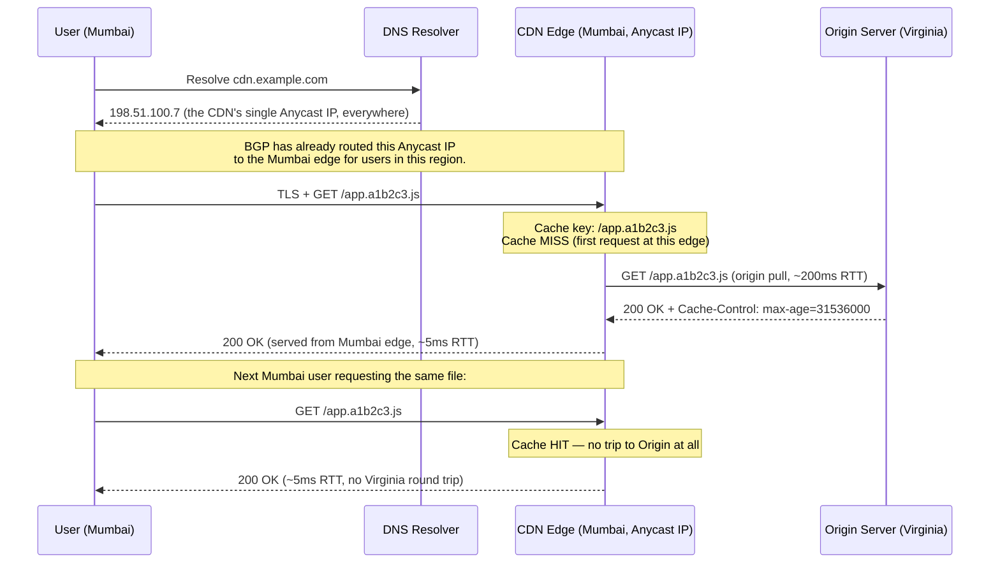

# Chapter 96: CDNs, Caching, and Anycast at Scale

> **"Load balancing solves 'too many requests for one server.' It does nothing about a much older enemy that no amount of clever software can defeat directly: the speed of light, and the width of an ocean."**

---

## Table of Contents

1. [The Problem Load Balancing Can't Solve](#1-the-problem-load-balancing-cant-solve)
2. [Quantifying It: A Real Speed-of-Light RTT Estimate](#2-quantifying-it-a-real-speed-of-light-rtt-estimate)
3. [Naive Fixes That Don't Work](#3-naive-fixes-that-dont-work)
4. [The Real Solution: Move the Content, Not Just the Compute](#4-the-real-solution-move-the-content-not-just-the-compute)
5. [What a CDN Actually Is](#5-what-a-cdn-actually-is)
6. [Edge Locations / Points of Presence](#6-edge-locations--points-of-presence)
7. [What Gets Cached: Static vs. Dynamic Content](#7-what-gets-cached-static-vs-dynamic-content)
8. [Origin Pull vs. Origin Push](#8-origin-pull-vs-origin-push)
9. [Cache Hits, Misses, and the Cache Key](#9-cache-hits-misses-and-the-cache-key)
10. [Cache Invalidation: The Hard Part](#10-cache-invalidation-the-hard-part)
11. [The Remaining Problem: Getting the Request to the Nearest Edge](#11-the-remaining-problem-getting-the-request-to-the-nearest-edge)
12. [Anycast: One Address, Hundreds of Places](#12-anycast-one-address-hundreds-of-places)
13. [How Anycast Actually Routes, Mechanically](#13-how-anycast-actually-routes-mechanically)
14. [Anycast Meets DNS and IXPs (Revisiting Chapters 69 and 51)](#14-anycast-meets-dns-and-ixps-revisiting-chapters-69-and-51)
15. [Full Worked Example: A Cached Request Through a CDN](#15-full-worked-example-a-cached-request-through-a-cdn)
16. [Real-World CDNs](#16-real-world-cdns)
17. [Hands-On Experiment](#17-hands-on-experiment)
18. [Code: A Minimal TTL-Based Caching Proxy in Go](#18-code-a-minimal-ttl-based-caching-proxy-in-go)
19. [Common Misconceptions](#19-common-misconceptions)
20. [Production Notes](#20-production-notes)
21. [What's Simplified Here](#21-whats-simplified-here)
22. [Interview Questions & Model Answers](#22-interview-questions--model-answers)
23. [Exercises](#23-exercises)
24. [Summary and Bridge to Chapter 97](#24-summary-and-bridge-to-chapter-97)

---

## 1. The Problem Load Balancing Can't Solve

Chapter 95 solved a real problem: one server can't handle millions of concurrent users, so spread the load across many. But notice what that solution quietly assumed — that all those servers live in more or less one place, close enough together to share a network fabric (Chapter 94) and a load balancer.

Suppose you perfectly solve capacity: a beautifully engineered, load-balanced, highly-available fleet of servers, all sitting in a single data center in Ashburn, Virginia. Now a user in Mumbai loads your website. Every byte of every request and response between that user and your servers has to physically cross roughly the width of the planet — through undersea cables (Chapter 23), through however many autonomous systems happen to carry it (Chapters 49-51) — twice, for every single round trip. **No amount of code optimization, caching at the server, or additional backend capacity changes that distance.** This is a problem load balancing was never designed to solve, because it isn't a capacity problem. It's a physics problem.

---

## 2. Quantifying It: A Real Speed-of-Light RTT Estimate

Light travels at roughly 300,000 km/s in a vacuum, but through the glass fiber that carries almost all long-haul internet traffic (Chapter 22), it travels closer to **~200,000 km/s**, due to the refractive index of glass slowing it down.

The great-circle distance from Ashburn, Virginia to Mumbai, India is approximately **12,700 km**. A one-way trip at fiber's effective speed:

```
time = distance / speed
     = 12,700 km / 200,000 km/s
     = 0.0635 s
     ≈ 63.5 ms  (one-way, theoretical minimum)
```

A **round trip** (RTT) — the number that actually matters for a request/response protocol like HTTP — doubles this to roughly **127 ms**, and that's the absolute physical floor, assuming a perfectly straight fiber path with zero switching, routing, or processing delay anywhere along the way. Real submarine cable routes are never perfectly straight great circles (they follow cable landing stations and existing infrastructure), and every router hop (Chapter 45) adds its own small queuing and processing delay, so real-world RTTs between Virginia and Mumbai typically measure **180-250 ms** — often noticeably worse than the theoretical floor, but never, ever better than it.

Now compare that to a user in, say, Washington D.C., roughly 50 km from that same Virginia data center: the same calculation gives a theoretical one-way time of 0.25 ms, RTT of 0.5 ms — real-world figures land around 1-5 ms once local network hops are included. **The Mumbai user's connection is on the order of 50-100x slower to reach, purely from geography, before either server does a single byte of work.** And since a typical web page requires several sequential round trips (DNS lookup, TCP handshake, TLS handshake, then the actual HTTP request — Chapters 68, 59, and 82 respectively), that 200ms-per-round-trip penalty is paid multiple times just to load one page, easily adding a full second or more of pure, unavoidable latency before any application logic runs at all.

This is the concrete, numeric version of the chapter's opening claim: this is not a problem you can code your way out of. The only real fix is to stop making the trip.

---

## 3. Naive Fixes That Don't Work

- **"Just make the servers faster."** Server-side processing time is usually a small fraction of total page load time compared to network RTT for a distant user; shaving milliseconds off backend processing does nothing to the 200ms+ the network itself imposes.
- **"Just use a faster protocol."** HTTP/2 and HTTP/3 (Chapters 74-75) genuinely reduce the *number* of round trips needed and can reduce *some* latency (QUIC's 0-RTT reconnection, for instance) — but they cannot make light travel faster through the fiber. They optimize around the constant; they don't remove it.
- **"Just buy more bandwidth."** Bandwidth (how much data per second) and latency (how long a single bit takes to arrive) are different quantities, and more bandwidth does nothing for latency — a common confusion Chapter 16 already warned against for exactly this reason. A user in Mumbai on a 10 Gbps connection to a Virginia-only server still waits the same ~200ms RTT for the *first* byte of any response.

---

## 4. The Real Solution: Move the Content, Not Just the Compute

If the problem is physical distance, the only real fix is to physically shorten it: put a copy of the content **near the user**, so the round trip that matters is 50 km, not 12,700 km. This is the entire idea behind a **Content Delivery Network (CDN)**: a large, geographically distributed set of servers, positioned in many cities around the world, each holding cached copies of content that would otherwise require a round trip all the way back to one origin server.

---

## 5. What a CDN Actually Is

**Intuitive level:** think of a CDN like a chain of regional warehouses for an online retailer, instead of one central warehouse. If the item you ordered is already sitting in a warehouse in your own city, it arrives the next day; if it has to ship from the other side of the country, it takes a week. The item didn't get faster to produce — it just got closer to you before you asked for it. The analogy breaks down in one important way: a CDN's "warehouses" don't get restocked with a truck — they get restocked over the same network they serve, which is exactly what Section 10's invalidation problem is about.

**Engineering level:** a CDN operator (Section 16 names real ones) runs servers in many physical locations, called **edge locations** or **Points of Presence (PoPs)** — Section 6. Content owners (websites, app backends) configure their DNS or application to route through the CDN. The CDN's edge servers cache copies of that content close to end users, serving repeat requests directly from the edge without ever contacting the **origin server** (the content owner's actual, original server) again, until the cached copy expires or is invalidated.

**Deep technical level:** a CDN is, structurally, a very large-scale, geographically-distributed instance of exactly the kind of reverse proxy and caching Chapter 72 introduced for a single browser's HTTP cache — just operated as a service, at a scale of hundreds of physical locations, with additional machinery (Anycast, Section 12; sophisticated invalidation, Section 10) that a single browser cache never needed.

---

## 6. Edge Locations / Points of Presence

A CDN's **edge locations** (also called **Points of Presence**, or PoPs) are physical facilities — sometimes a full small data center, sometimes just a rack of servers colocated inside someone else's data center or, very commonly, directly inside an Internet Exchange Point (Chapter 51's IXPs) — positioned close to concentrations of end users: major cities, national capitals, regions with dense internet usage.

Large CDN operators run hundreds of these locations globally (some report numbers well into the several hundreds, spanning most populated regions of the world), specifically so that for the overwhelming majority of internet users, *some* edge location is only a few milliseconds away, rather than a continent away. This directly attacks Section 2's math: instead of every Mumbai user's request crossing 12,700 km to Virginia, it might travel a few dozen kilometers to a Mumbai-based edge location — the CDN operator has already paid the long-distance cost, once, to keep that edge location's cache populated.

---

## 7. What Gets Cached: Static vs. Dynamic Content

Not everything is equally cacheable, and this distinction matters enormously for what a CDN can actually help with:

- **Static content** — images, videos, CSS, JavaScript bundles, downloadable files — is identical for every user and changes rarely. This is the textbook CDN use case: cache it at every edge, serve it from the nearest one, and only refresh it when it actually changes.
- **Dynamic, personalized content** — a logged-in user's account page, a shopping cart, a real-time stock price — is, by definition, different per-request or per-user, and naively caching it would serve one user's private data to another. This *can't* simply be cached the way static content is.

Modern CDNs do meaningfully more than serve static files, though: they can cache dynamic content that's the same for many users for short periods (a product listing page updated every 60 seconds, cached at the edge for those 60 seconds and refreshed after), and they increasingly run compute directly at the edge (edge functions/edge compute) to personalize or assemble a response without a full round trip back to origin. But the fundamental caching benefit is strongest, and simplest to reason about, for genuinely static or near-static content — which is why "cache the static assets, proxy everything truly dynamic to origin" remains the default mental model.

---

## 8. Origin Pull vs. Origin Push

There are two basic models for how content gets *into* the edge caches in the first place:

- **Origin pull (the far more common default):** an edge server simply doesn't have a requested object cached yet, or its cached copy has expired; on the *first* request for that object at that edge, it fetches ("pulls") a fresh copy from the origin server, serves it to the requesting user, and keeps a copy locally for the next request. This is lazy and self-organizing — content only ever gets cached at edges that actually receive requests for it.
- **Origin push:** the content owner proactively uploads content directly to CDN edge locations ahead of any user request — useful for large files you know will see immediate, high demand everywhere the moment they're published (a major software release, a big video premiere), where you don't want even the *first* user at each edge to pay the full origin round-trip cost.

Origin pull is simpler to operate and is the default for most CDN configurations; push is a deliberate optimization for predictable, high-demand launches.

---

## 9. Cache Hits, Misses, and the Cache Key

When a request arrives at an edge server, the CDN computes a **cache key** — usually derived from the request URL, and sometimes additional factors like specific headers or query parameters, depending on configuration — and checks whether it has a valid, unexpired cached response stored under that key.

- **Cache hit:** the edge has a valid cached copy and serves it directly. This is the fast path Section 2's math is entirely about — no trip back to origin at all.
- **Cache miss:** no valid cached copy exists (first request for this key, or the cached copy expired). The edge performs an origin pull (Section 8), serves the freshly-fetched response, and caches it for next time.

This should look familiar: it's the exact hit/miss vocabulary and the exact `Cache-Control`/`ETag`/conditional-request machinery Chapter 72 introduced for a browser's own HTTP cache — a CDN is, in significant part, that same caching logic, just running at every edge location instead of inside one user's browser, and shared across every user hitting that edge rather than private to one user.

---

## 10. Cache Invalidation: The Hard Part

There's an old joke in computer science that there are only two hard problems: cache invalidation, naming things, and off-by-one errors. Caching content close to users is conceptually simple (Sections 4-9); the genuinely hard part is: **what happens when the origin content changes, and hundreds of edge locations around the world are still confidently serving the old version?**

Three basic mechanisms address this, each with a real trade-off:

- **TTL expiration.** The origin (via `Cache-Control: max-age`, the same header Chapter 72 introduced) tells edges how long a cached copy is considered fresh. Simple and requires no extra action from the content owner — but for that TTL window, users can receive stale content, and if you set the TTL too short to reduce staleness risk, you lose most of the caching benefit (Section 2's math) because edges keep re-pulling from origin.
- **Explicit purge/invalidation.** The content owner actively tells the CDN "this specific URL (or this whole path) is stale, discard any cached copy immediately" — issued via an API call the moment content changes. This gives precise control but requires the content owner's deployment process to remember to do it, and a purge command has to propagate to every one of potentially hundreds of edge locations before it's fully effective everywhere.
- **Cache-busting via versioned URLs.** Instead of invalidating an old cached object, simply never reuse its URL: `app.js` becomes `app.v2.3.1.js` or `app.a1b2c3.js` (a content hash) on every deploy. Old cached copies under the old URL become irrelevant (nobody requests that URL anymore) and can be given an extremely long TTL with zero staleness risk, since a genuinely new version always gets a genuinely new URL. This is the dominant pattern for CDN-served build artifacts (JS/CSS bundles) in modern web deployments specifically because it sidesteps the invalidation problem rather than solving it.

**Deep technical note:** even a "successful" purge command usually only guarantees eventual consistency across a CDN's edge fleet — different edges may finish evicting the old copy at slightly different times, and any local caching *below* the CDN (a corporate proxy, or the browser's own cache from Chapter 72) may hold onto the old copy for its own TTL regardless of what the CDN does upstream. "Instant global purge" is a marketed convenience, not a physical guarantee.

---

## 11. The Remaining Problem: Getting the Request to the Nearest Edge

Sections 4-10 assumed the hard part was already solved: "the user's request reaches the nearest edge location." But *how* does it get there? A CDN might have 300 edge locations worldwide, all conceptually serving the "same" website — but a request has to actually be routed to one specific, physically nearest one, and it has to do this without the user (or their browser) knowing anything about which of 300 locations exists or where they are.

The naive answer — DNS-based geolocation, where a DNS resolver returns a different edge's IP address depending on the resolver's apparent geographic location — is real and used, but it has exactly the caching and accuracy weaknesses Chapter 95, Section 3 already raised for DNS round-robin (a shared, distant resolver used by many geographically spread-out clients can steer all of them to the same "nearest to the resolver, but not to them" answer, and TTL-based caching can hand out one region's answer well past when it's optimal). The real, dominant technique used by CDNs at scale is something stronger: **Anycast**.

---

## 12. Anycast: One Address, Hundreds of Places

**The naive assumption an IP address usually satisfies:** one IP address identifies one specific device, somewhere specific, and routing simply finds the (one) path to it. This is **unicast** addressing — the model every earlier chapter of this course silently assumed.

**Anycast breaks that assumption on purpose.** The *same* IP address is announced, via BGP (Chapter 49), from **many different physical locations simultaneously** — each of a CDN's (or a DNS root server operator's) edge locations advertises identical reachability for the identical IP address. The Internet's normal BGP path-selection process (Chapters 49-50) then does something remarkable without any special-case logic of its own: **each router, anywhere on the Internet, simply picks whichever announcement of that address looks "closest" by its own normal best-path criteria** (shortest AS path and other standard BGP attributes) — meaning a user in Mumbai's traffic naturally converges on the Mumbai-area announcement, and a user in São Paulo's traffic naturally converges on the São Paulo-area announcement, **without either user's device, browser, or DNS resolver knowing that more than one server even exists.**

**Intuitive level:** imagine a single, nationally-famous phone number, like a country's "911"/emergency number, where dialing it from anywhere in the country connects you to your *local* dispatch center, not one single national building — the number is the same everywhere, but "closest" routing (here, the phone network's own routing) quietly determines which physical location actually answers. The analogy breaks down because Anycast's "closeness" is BGP path cost, not literal geographic distance — a BGP path can be "topologically shortest" while covering more physical kilometers than a geographically closer but topologically worse-connected alternative, an important nuance Section 13 returns to.

---

## 13. How Anycast Actually Routes, Mechanically

Concretely, using the routing machinery already built up across Volume 7:

1. A CDN operator owns an IP prefix, say `198.51.100.0/24`, and wants it reachable from edge locations in Mumbai, Frankfurt, and São Paulo simultaneously.
2. At each edge location, a router announces (via a BGP session, Chapter 49) reachability for `198.51.100.0/24` to its upstream providers/peers — using the exact same AS-path, prefix-announcement mechanics Chapter 50 described for ordinary route aggregation, just from three unrelated physical locations at once, all claiming the identical prefix.
3. BGP's normal best-path selection process (shortest AS path, and other standard attributes, unchanged from Chapter 49) runs everywhere on the Internet exactly as it always does. A router in India's routing tables ends up preferring the path toward the Mumbai announcement (typically the shortest AS path from its vantage point); a router in Germany's tables end up preferring the Frankfurt announcement instead — **not because anyone configured per-region logic, but because normal BGP path selection, applied independently by every router to its own view of the topology, converges that way.**
4. A single TCP connection, once established, stays pinned to whichever physical location the initial packets were routed to (Anycast doesn't reroute an in-progress connection — routing tables can occasionally shift *between* connections due to topology changes, but mid-connection reroutes are avoided/rare in stable operation, which is important since a mid-connection switch to a totally different physical server, with none of the first server's TCP state, would simply break the connection).

**Deep technical note — why this is genuinely different from a load balancer:** Chapter 95's load balancer is one specific device (or a small, tightly-coordinated cluster) that a client's traffic definitely reaches first, and *it* then chooses a backend. Anycast has no such single device at all — the Internet's own, ordinary, decentralized routing infrastructure *is* the load-balancing/nearest-selection mechanism, with no CDN-operated device in the path making an explicit "choose location X" decision at connection time. This is also precisely why Anycast, unlike a single load balancer, has no single point of failure: if the Mumbai location goes completely dark, its BGP announcement withdraws, and BGP convergence (Chapters 49-50) automatically reroutes Indian traffic to the next-best surviving announcement (perhaps Singapore), with no CDN-side intervention required at all.

---

## 14. Anycast Meets DNS and IXPs (Revisiting Chapters 69 and 51)

Chapter 69, Section 17 already introduced Anycast in exactly this role for the DNS root server system: the 13 named root server "letters" are each, in reality, served from hundreds of physical machines worldwide, all announcing the same Anycast address per letter — precisely the mechanism this chapter has now explained in full mechanical detail. CDNs use the identical technique for their edge locations' IP addresses, and it's worth being explicit that these are the *same* underlying mechanism serving two different purposes: DNS Anycast routes a *DNS query* to the nearest resolver; CDN Anycast routes an *HTTP(S) connection* to the nearest edge cache.

Chapter 51's Internet Exchange Points are also directly relevant here, not coincidentally: CDN edge locations are very often physically deployed *inside* IXPs precisely because an IXP is already a dense meeting point for many other networks' routers — announcing an Anycast prefix from inside an IXP puts it topologically close (in BGP-path terms) to a huge number of eyeball ISPs at once, which is exactly the property Section 13's routing convergence depends on to actually deliver users to a nearby location rather than a merely well-connected but distant one.

---

## 15. Full Worked Example: A Cached Request Through a CDN



The first Mumbai user still pays roughly the full transcontinental RTT from Section 2 — someone always has to pull the content across the distance once. Every subsequent Mumbai user pays only the ~5ms local RTT to the edge, for as long as the versioned URL's effectively-infinite cache lifetime holds.

---

## 16. Real-World CDNs

- **Cloudflare** operates in a very large number of cities worldwide and is unusually explicit publicly about its heavy reliance on Anycast for essentially all of its edge IP space, including its DNS resolver product (1.1.1.1).
- **Akamai**, one of the oldest and largest CDNs, pioneered much of the origin-pull edge-caching model at internet scale starting in the late 1990s.
- **Amazon CloudFront**, **Google Cloud CDN**, and **Microsoft Azure CDN/Front Door** are the major cloud providers' CDN products, each deeply integrated with that provider's own cloud networking primitives (Chapter 97's VPCs, load balancers).
- **Fastly** is notable for popularizing highly configurable, near-real-time cache purging (addressing Section 10's invalidation timing problem directly as a product feature) and edge compute (Compute@Edge) for running actual application logic at edge locations, not just caching.

---

## 17. Hands-On Experiment

1. Run `dig +short cloudflare.com` (or any large CDN-fronted domain) from your own machine, then ask a friend on a different continent, or use an online "dig from multiple locations" tool, to run the exact same query. Comparing the returned IPs across true Anycast setups can be subtle (many CDNs return the *same* IP everywhere and let Anycast routing do the rest, rather than returning different IPs per region) — note which behavior you observe and why both are valid CDN designs.
2. Run `curl -sI https://<a CDN-fronted URL>` and inspect the response headers for cache-related fields like `cf-cache-status`, `x-cache`, or `age` — most major CDNs expose some header revealing HIT vs. MISS, directly observing Section 9's cache-key mechanism in the wild.
3. Run `traceroute` (Chapter 54) to a known Anycast address (a public DNS resolver like `1.1.1.1` or `8.8.8.8` is a convenient, well-known Anycast target) and observe how few hops it typically takes — evidence that you're likely reaching a nearby edge/PoP rather than a single distant, central server.
4. Request the same CDN-fronted static asset twice in a row with `curl`, timing each with `curl -w "%{time_total}\n" -o /dev/null -s <url>` — the second request (likely a cache hit locally or at the edge) is often measurably faster than the first.

---

## 18. Code: A Minimal TTL-Based Caching Proxy in Go

A simplified single-node version of an edge cache's core logic — origin pull on miss, TTL-based expiry, explicit purge — to make Sections 8-10's concepts concrete:

```go
package main

import (
	"io"
	"net/http"
	"sync"
	"time"
)

type cacheEntry struct {
	body      []byte
	status    int
	expiresAt time.Time
}

type EdgeCache struct {
	mu      sync.Mutex
	entries map[string]cacheEntry
	origin  string
}

func NewEdgeCache(origin string) *EdgeCache {
	return &EdgeCache{entries: make(map[string]cacheEntry), origin: origin}
}

func (c *EdgeCache) ServeHTTP(w http.ResponseWriter, r *http.Request) {
	key := r.URL.Path // simplified cache key: path only

	c.mu.Lock()
	entry, found := c.entries[key]
	fresh := found && time.Now().Before(entry.expiresAt)
	c.mu.Unlock()

	if fresh {
		w.Header().Set("X-Cache", "HIT")
		w.WriteHeader(entry.status)
		w.Write(entry.body)
		return
	}

	// Cache miss (or expired): origin pull.
	resp, err := http.Get(c.origin + r.URL.Path)
	if err != nil {
		http.Error(w, "origin unreachable", http.StatusBadGateway)
		return
	}
	defer resp.Body.Close()
	body, _ := io.ReadAll(resp.Body)

	ttl := 60 * time.Second // in reality, parsed from origin's Cache-Control
	c.mu.Lock()
	c.entries[key] = cacheEntry{body: body, status: resp.StatusCode, expiresAt: time.Now().Add(ttl)}
	c.mu.Unlock()

	w.Header().Set("X-Cache", "MISS")
	w.WriteHeader(resp.StatusCode)
	w.Write(body)
}

// Purge implements explicit invalidation (Section 10) for one key.
func (c *EdgeCache) Purge(key string) {
	c.mu.Lock()
	delete(c.entries, key)
	c.mu.Unlock()
}

func main() {
	cache := NewEdgeCache("http://origin.internal:8080")
	http.ListenAndServe(":8081", cache)
}
```

Running this and hitting it twice with `curl -sI` shows `X-Cache: MISS` then `X-Cache: HIT` — the same header pattern Section 17's real-world experiment asked you to look for on an actual CDN.

---

## 19. Common Misconceptions

- **"A CDN just makes downloads faster."** Its primary win is *latency* for the round trips a page load requires, which for small, cacheable assets often matters more than raw download bandwidth — Section 2's math is a latency argument, not a bandwidth one.
- **"CDNs can cache anything, including personalized pages."** Genuinely per-user dynamic content can't be naively cached without leaking one user's data to another (Section 7) — CDNs handle this with edge compute, cache-key customization, or simply not caching it at all and proxying straight to origin.
- **"Anycast means there are multiple copies of one IP address, which shouldn't work."** It's the same IP address announced from multiple places, and it's ordinary BGP best-path selection — not any special protocol feature — that makes each location's local traffic converge on its nearest announcement; there's no contradiction because no single router ever sees more than one usable path to "the" destination it settles on.
- **"Purging a CDN cache is instant everywhere."** As Section 10 explained, propagation across hundreds of edges takes real (if often short) time, and caches below the CDN (browser, corporate proxy) aren't touched by a CDN purge at all.
- **"CDN and load balancer are the same thing."** They solve different problems: Chapter 95's load balancer solves "too much traffic for one location's compute"; a CDN solves "the user is physically far from any location at all." Many production architectures use both together, in that order (CDN in front, load balancer at/near origin).

---

## 20. Production Notes

- `Cache-Control` header design (Chapter 72) is the single most consequential lever a content owner has over CDN behavior — getting TTLs wrong (too long: stale content persists; too short: caching benefit evaporates) is a common, costly production mistake.
- Versioned/hashed asset URLs (Section 10) combined with very long TTLs is close to universal practice for CDN-served JS/CSS bundles in modern build pipelines specifically to avoid needing purges at all for the highest-traffic content.
- CDN "cache stampede" (a very popular, expiring object's TTL lapsing and many simultaneous requests all missing at once, hammering origin simultaneously) is a real production failure mode, typically mitigated with request coalescing at the edge (only one origin pull in flight per key, other concurrent requests wait for it) or slightly-randomized (jittered) TTLs to avoid synchronized expiry across many objects.
- Anycast is also widely used defensively: absorbing volumetric DDoS traffic (Chapter 83) across many geographically-distributed Anycast locations simultaneously, rather than concentrating an attack's full force on one unicast target — a major reason large CDNs and DDoS-mitigation providers are heavy Anycast users beyond pure performance.

---

## 21. What's Simplified Here

Real CDN cache-key logic often varies responses by additional request attributes (the `Vary` header — different cached versions for mobile vs. desktop, different languages, or compressed vs. uncompressed encodings), which this chapter's simplified path-only cache key omits. Real Anycast deployments also have to actively manage cases where BGP's "shortest AS path" doesn't actually correspond to lowest latency (a topologically short but congested or circuitous path) using additional traffic-engineering techniques beyond plain BGP. And real-world CDN architectures increasingly blur the line between "cache" and "compute" via edge functions, which this chapter treats mostly as a footnote to keep the caching model clear. The core physics argument (Section 2), the cache hit/miss/invalidation model, and the Anycast routing mechanism are all accurate as described.

---

## 22. Interview Questions & Model Answers

**Beginner: Why can't a well-optimized, well-load-balanced server in one location ever be "fast" for every user on Earth?**
Network latency is bounded below by the speed of light through fiber (~200,000 km/s); a user thousands of kilometers away pays that unavoidable round-trip delay on every request, regardless of how fast the server itself processes the request. Only physically moving content closer to the user reduces that floor.

**Beginner: What is the difference between a cache hit and a cache miss at a CDN edge?**
A cache hit means the edge already has a valid, unexpired copy of the requested object and serves it directly. A cache miss means it doesn't (first request, or expired), so the edge fetches a fresh copy from the origin server (an "origin pull") before serving it and caching it for next time.

**Intermediate: Why is cache invalidation considered a genuinely hard problem, and what's the most common way production systems sidestep it?**
Because the origin and potentially hundreds of geographically distributed edge caches can disagree about whether content is current, and a purge command takes real time to propagate everywhere with only eventual consistency. The most common sidestep is versioned/hashed URLs: instead of invalidating a cached object, changed content simply gets a brand-new URL, so old cached copies under old URLs become irrelevant rather than stale.

**Intermediate: Explain what Anycast is, and how it differs conceptually from ordinary (unicast) IP addressing.**
Anycast announces the identical IP address, via BGP, from many different physical locations at once. Ordinary unicast routing assumes one address means one specific device somewhere, and finds the path to it; Anycast relies on the exact same BGP best-path selection process independently converging different users, from different vantage points, onto whichever announcement is topologically closest to each of them — with no single device or protocol feature explicitly deciding "route this user here."

**Advanced: Why doesn't Anycast reroute an in-progress TCP connection to a different physical server if routing tables change mid-connection, and why does this matter?**
Each Anycast location is a physically separate, independent server with its own TCP connection state; if routing shifted a connection's packets to a different physical server mid-stream, that new server would have no knowledge of the existing TCP sequence numbers or session state, and the connection would simply break. In practice, BGP routing is reasonably stable over a connection's lifetime, and this is one reason Anycast is used carefully for connection-oriented protocols (often paired with mechanisms to keep a given client's route stable) rather than assumed to be perfectly transparent to an in-flight connection.

**Advanced: Compare a CDN edge cache miss (Section 9) to a load balancer forwarding a request to a backend (Chapter 95). What problem does each step actually solve, and how do they compose in a real production request path?**
A CDN cache miss solves the physical-distance problem: even on a miss, it centralizes the long-haul round trip to origin behind one edge fetch, rather than making every distant user's browser make that trip directly. A load balancer solves the capacity/availability problem at the origin (or at the edge itself, if the CDN operator load-balances across its own origin-facing infrastructure): once a request does need to reach real compute, spreading it across many backend servers. In a real path, a user's request often first hits a nearby CDN edge (solving distance); on a miss, the edge's origin-pull request itself typically lands on a load balancer in front of the origin's server fleet (solving capacity) — the two mechanisms compose in sequence rather than substituting for each other.

---

## 23. Exercises

### Easy
1. Using the speed-of-light method from Section 2, estimate the one-way and round-trip theoretical minimum latency between a server in London and a user in Sydney (~17,000 km great-circle distance), and compare to a plausible real-world measured RTT.
2. Explain, in one or two sentences, why more bandwidth does not fix the problem this chapter describes.
3. Name the three cache-invalidation strategies from Section 10 and state one trade-off of each.

### Medium
4. Explain why DNS-based geolocation (Section 11) is a weaker technique than Anycast for routing users to a nearby CDN edge, tying your answer to a specific weakness of DNS caching from Chapter 68.
5. Using the Go code in Section 18, add support for the `Vary`-style idea from Section 21: make the cache key include a request header (e.g., `Accept-Encoding`) so that compressed and uncompressed responses are cached separately. Explain why this is necessary in real deployments.
6. A CDN edge location in Singapore goes completely offline. Walk through, step by step, what happens at the BGP level (Chapters 49-50) to traffic that was being routed there under Anycast, and roughly how quickly you'd expect users to be rerouted.

### Hard
7. Design a cache-invalidation strategy for a news website's homepage, which changes frequently (multiple times per hour) but must never be more than 60 seconds stale, while still getting meaningful CDN benefit. Justify your TTL and/or purge strategy choice.
8. Explain, with reference to Chapter 83's DDoS material, why Anycast is a genuinely effective defensive technique against a volumetric DDoS attack, and identify one scenario where Anycast alone would *not* be sufficient protection.
9. A CDN edge cache experiences a "cache stampede" when a popular object's TTL expires under heavy concurrent request load. Design a request-coalescing mechanism (in plain English or pseudocode) that prevents more than one origin-pull request in flight for the same cache key at once, and explain what the other concurrent requesters should do while waiting.

---

## 24. Summary and Bridge to Chapter 97

| Term | Meaning |
|---|---|
| CDN | Geographically distributed servers caching content near end users |
| Edge location / PoP | A CDN's physical facility, positioned close to a population of users |
| Origin server | The content owner's original, authoritative server |
| Origin pull / push | Lazily fetching content into an edge on first request, vs. proactively uploading it ahead of demand |
| Cache hit / miss | Edge already has (hit) or doesn't have (miss) a valid cached copy |
| Cache invalidation | Ensuring cached copies don't outlive the freshness of the origin content |
| TTL / purge / versioned URL | The three main invalidation strategies, each with real trade-offs |
| Anycast | The same IP address announced from many physical locations; BGP naturally routes each user to the nearest one |
| RTT (round-trip time) | Time for a request and its reply to complete one round trip; bounded below by the speed of light through fiber |

A CDN and Anycast solve "get the content physically close to the user." They say nothing about how the servers behind all of this — the origin, the load balancers, the databases — are actually organized as a *network* in the first place, especially once that infrastructure runs not on hardware you own, but as isolated slices of a cloud provider's shared infrastructure. Chapter 97 turns to exactly that: how cloud networking lets a customer build their own private, isolated network — a VPC — on top of physical infrastructure they'll never see or touch.
