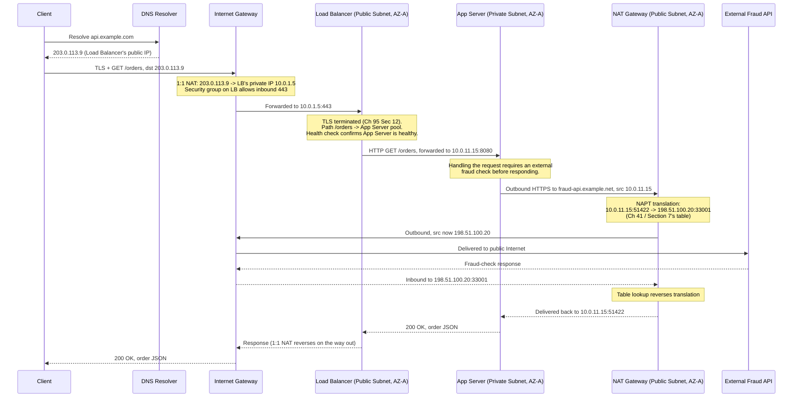

# Chapter 98: NAT Gateways and Internet Gateways in the Cloud

> **"Chapter 97 pointed at two names in a route table — Internet Gateway and NAT Gateway — and asked you to trust that they made public and private subnets behave the way they do. This chapter opens both boxes, and then walks one real request all the way through them."**

---

## Table of Contents

1. [The Two Names Chapter 97 Deferred](#1-the-two-names-chapter-97-deferred)
2. [The Problem: Two Different Kinds of Internet Access](#2-the-problem-two-different-kinds-of-internet-access)
3. [Naive Fix: Give Every Instance a Public IP](#3-naive-fix-give-every-instance-a-public-ip)
4. [The Internet Gateway: Two-Way Access for Public Subnets](#4-the-internet-gateway-two-way-access-for-public-subnets)
5. [Internet Gateway Mechanics: 1:1 NAT, Not Statefulness](#5-internet-gateway-mechanics-11-nat-not-statefulness)
6. [The NAT Gateway: Managed, One-Way, Many-to-One](#6-the-nat-gateway-managed-one-way-many-to-one)
7. [NAT Gateway Mechanics: Revisiting Chapter 41's NAT Table](#7-nat-gateway-mechanics-revisiting-chapter-41s-nat-table)
8. [Internet Gateway vs. NAT Gateway, Directly Compared](#8-internet-gateway-vs-nat-gateway-directly-compared)
9. [Why Placement and High Availability Differ](#9-why-placement-and-high-availability-differ)
10. [Full Traced Example: A Complete Request Through a Realistic VPC](#10-full-traced-example-a-complete-request-through-a-realistic-vpc)
11. [Real-World Implementations](#11-real-world-implementations)
12. [Hands-On Experiment](#12-hands-on-experiment)
13. [Code: Simulating a NAT Gateway's Translation Table in Go](#13-code-simulating-a-nat-gateways-translation-table-in-go)
14. [Common Misconceptions](#14-common-misconceptions)
15. [Production Notes](#15-production-notes)
16. [What's Simplified Here](#16-whats-simplified-here)
17. [Interview Questions & Model Answers](#17-interview-questions--model-answers)
18. [Exercises](#18-exercises)
19. [Summary and Bridge to Chapter 99](#19-summary-and-bridge-to-chapter-99)

---

## 1. The Two Names Chapter 97 Deferred

Chapter 97 built a small, realistic VPC (Section 13 of that chapter) with two kinds of subnets, and every route table in it ended the same way — a default route pointing at one of two things: an **Internet Gateway**, or a **NAT Gateway**. That chapter deliberately treated both as black boxes, because the distinction between them is exactly this chapter's subject, and it turns out to be one of the most consequential design decisions in any real cloud network: **which resources can be reached from the Internet, and which can merely reach out to it.**

---

## 2. The Problem: Two Different Kinds of Internet Access

A realistic application has resources with genuinely different needs:

- A **load balancer** (Chapter 95) in a public subnet needs to be reachable *from* the Internet — users have to be able to initiate connections to it. This is bidirectional, inbound-initiated access.
- An **application server** in a private subnet (Chapter 97, Section 8) should never be directly reachable from the Internet at all — but it still frequently needs to reach *out*: downloading OS security patches, calling a third-party payment API, fetching data from an external service. This is one-directional, outbound-initiated-only access.
- A **database** in an even more restricted private subnet may need no Internet access whatsoever, in either direction — only reachability from the application tier, over the VPC's own internal routing.

Chapter 97 already showed that whether a subnet has *any* path to the Internet at all is a routing fact. This chapter is about the two different devices that can sit at the end of that route, and why cloud providers deliberately built two structurally different products instead of one.

---

## 3. Naive Fix: Give Every Instance a Public IP

The simplest imaginable approach: give every instance, public-facing or not, its own public IP address directly, exactly like the flat, un-NATed IPv4 Internet of the 1980s Chapter 41 described as the historical starting point.

This fails for reasons Chapter 41 already established at the individual-network level, now simply recurring at cloud scale:

- **IPv4 exhaustion.** Chapter 42 already covered the hard ceiling on IPv4's ~4.3 billion addresses; a cloud provider running tens of millions of customer instances, most of which never need to be *reached* from the Internet at all, cannot and should not burn a scarce public address on every single one just so the small fraction that need *outbound* access can have it.
- **It destroys the entire point of a private subnet.** Chapter 97, Section 8 established that a private subnet's core security property — unreachability from the Internet — is a routing/addressing fact, not merely a policy choice. Giving every instance a public IP reintroduces exactly the direct-reachability risk private subnets exist to eliminate, for the sake of a need (outbound access) that doesn't actually require it.
- **It multiplies the attack surface for no benefit.** Every publicly-addressable instance is a potential target for scanning and direct attack, whether or not it was ever meant to accept inbound connections — the safest posture for a resource that never needs inbound access is to have no public address to attack in the first place.

The real solution splits these two needs (Section 2) into two different, purpose-built gateway devices.

---

## 4. The Internet Gateway: Two-Way Access for Public Subnets

An **Internet Gateway (IGW)** is attached to a VPC as a whole (not to any one subnet or instance) and provides the actual path between the VPC and the public Internet for any subnet whose route table points a route at it — exactly the mechanism Chapter 97, Section 9's public-subnet route table example relied on.

An Internet Gateway allows **both directions**: a resource behind it can initiate outbound connections to the Internet, *and* the Internet can initiate inbound connections to it — provided the resource actually has a public IP address to be reached at (Section 5 explains exactly how that public address gets attached), and provided the resource's security group and NACL (Chapter 97, Sections 10-11) actually permit the traffic. The Internet Gateway itself performs no filtering of its own — it's a path, not a policy; the security policy layers from Chapter 97 do that job.

---

## 5. Internet Gateway Mechanics: 1:1 NAT, Not Statefulness

Here's the detail that resolves an apparent contradiction: instances in a VPC almost always have *private* IP addresses internally (from the VPC's own CIDR block, Chapter 97, Section 6), yet Section 4 just said the Internet can reach them directly through the Internet Gateway. How can both be true?

The Internet Gateway performs **1:1 (static) NAT** — mechanically related to, but importantly different from, the NAT table Chapter 41 built in depth. Each public-facing instance is assigned a public IP address (AWS calls this an **Elastic IP**, or a dynamically-assigned "Public IPv4 address"), and the Internet Gateway maintains a **fixed, one-to-one mapping** between that public address and the instance's actual private address inside the VPC. Every packet arriving for that public address is translated to the private address and delivered inward; every packet leaving that instance is translated the other way on exit.

This is deliberately *not* the many-to-one, port-based NAT (NAPT/PAT) Chapter 41, Section 5 described for a home router — there's no shared address and no port-based disambiguation table to maintain, because each public-facing instance already has its own dedicated public address. It's the simpler, older "basic NAT" variant Chapter 41, Section 4 mentioned as one of NAT's three flavors, applied per-instance rather than per-household. This is also precisely why an Internet Gateway can allow *inbound* connections at all, unlike the NAT Gateway in Section 6: a fixed, pre-existing 1:1 mapping means an inbound SYN packet always has an unambiguous, already-known private-address destination to translate to and forward — there's no "which internal host was this for?" problem to solve, because there's exactly one answer, decided in advance.

---

## 6. The NAT Gateway: Managed, One-Way, Many-to-One

A **NAT Gateway** solves Section 2's *other* need directly: giving private-subnet instances outbound Internet access, without ever making them reachable from the Internet at all.

Mechanically, this is exactly the many-to-one, port-based NAT (NAPT/PAT) Chapter 41 explained in full — a NAT Gateway sits in a **public** subnet (it needs its own path out via the Internet Gateway), and every private-subnet instance behind it, routed to it via their route table's default route (Chapter 97, Section 9), has its outbound traffic's source address rewritten to the NAT Gateway's own single public IP address, with source ports rewritten and tracked to disambiguate which internal instance any given reply belongs to — precisely Chapter 41, Section 6's worked NAT-table example, just relabeled from "home router" to "managed cloud service."

The crucial word in "NAT Gateway" is **gateway**, not "instance" or "server" — this is explicitly a **managed service**, not a virtual machine the customer configures, patches, or scales themselves. The cloud provider operates it, scales its throughput transparently as demand grows, and — most importantly for this chapter's contrast with Section 5 — **it fundamentally cannot accept inbound-initiated connections at all**, by design, not merely by policy. Because it's tracking many internal hosts behind one shared public address using an ephemeral, connection-by-connection translation table (exactly like a home NAT router), there is no pre-existing mapping for an unsolicited inbound packet to match against — it has nowhere sensible to send it, and drops it, mirroring exactly the "asymmetric reachability" property Chapter 41 described for ordinary NAT all along.

---

## 7. NAT Gateway Mechanics: Revisiting Chapter 41's NAT Table

A private-subnet application server at `10.0.11.15` calls an external payment API at `203.0.113.50:443`. The NAT Gateway, sitting at public IP `198.51.100.20`, maintains a translation table exactly like Chapter 41, Section 6's worked example:

| Internal Address:Port | External Address:Port | Translated Source | Destination |
|---|---|---|---|
| `10.0.11.15:51422` | `203.0.113.50:443` | `198.51.100.20:33001` | `203.0.113.50:443` |
| `10.0.11.16:44210` | `203.0.113.50:443` | `198.51.100.20:33002` | `203.0.113.50:443` |

Both internal servers' traffic leaves with the *same* source IP (`198.51.100.20`), disambiguated entirely by the NAT Gateway's chosen source port — exactly Chapter 41's core insight that address rewriting alone is insufficient; port rewriting and tracking is what actually makes many-to-one translation work. When the payment API's reply arrives addressed to `198.51.100.20:33001`, the NAT Gateway consults this table, reverses the translation, and delivers it to `10.0.11.15:51422` — and if an attacker on the public Internet sent an unsolicited packet directly to `198.51.100.20:33001` without a corresponding entry already in this table, the NAT Gateway simply has no mapping to use, and drops it. This is precisely why a NAT Gateway cannot be used to expose a service for inbound traffic, no matter how its route table or security groups are configured — it's a structural property of the translation mechanism itself, not a policy restriction layered on top.

---

## 8. Internet Gateway vs. NAT Gateway, Directly Compared

| Property | Internet Gateway | NAT Gateway |
|---|---|---|
| Attached to | The VPC as a whole | Deployed inside a specific public subnet |
| Direction of access | Bidirectional — inbound and outbound | Outbound-only; cannot accept inbound-initiated connections |
| Translation type | 1:1 static NAT (each instance keeps its own public IP mapping) | Many-to-one NAPT/PAT (many private IPs share one public IP, by port) |
| Used by | Public subnets (load balancers, bastion hosts) | Private subnets (application servers needing outbound-only access) |
| Cost model | No hourly charge in most providers (data transfer charges may still apply) | Hourly charge plus data-processing charge in most providers, reflecting its managed, scaled nature |
| Mirrors which earlier chapter's concept | "Basic"/static NAT (Chapter 41, Section 4) | NAPT/PAT — the home-router NAT model (Chapter 41, Section 5) |

---

## 9. Why Placement and High Availability Differ

An Internet Gateway is a regional, horizontally-redundant construct managed entirely by the cloud provider — you attach one per VPC and never think about its own availability or scaling; the provider operates it as reliable, effectively-infinite shared infrastructure, similar in spirit to how you never provision capacity for a data center's border routers (Chapter 94, Section 13) yourself.

A NAT Gateway, by contrast, is deployed **into one specific Availability Zone** (recall Chapter 97, Section 7's rule that every subnet lives in exactly one AZ) — a NAT Gateway in AZ-A's public subnet only serves traffic from subnets routed to it, and if AZ-A suffers an outage, that NAT Gateway goes down with it. This is precisely why real production architectures (Chapter 97, Section 13's worked example, revisited fully in Section 10 below) deploy **one NAT Gateway per Availability Zone**, each serving only the private subnets in its own AZ — mirroring exactly the same fault-isolation reasoning Chapter 95 applied to load-balanced backend servers, now applied to the outbound-access path itself: a single NAT Gateway would be a single point of failure for every private subnet's Internet access across the entire VPC, regardless of how well the compute layer itself was distributed across AZs.

---

## 10. Full Traced Example: A Complete Request Through a Realistic VPC

This traces one complete, realistic request end to end, using the VPC design from Chapter 97, Section 13 (a load balancer in public subnets across two AZs, application servers in private subnets, NAT Gateways per AZ) — combining inbound reachability (Sections 4-5) and outbound-only reachability (Sections 6-7) in a single flow, exactly as they'd interact in production.

**Scenario:** a client on the public Internet requests `https://api.example.com/orders`, which is served by an application server that itself needs to call an external fraud-detection API before responding.



Notice the asymmetry this whole chapter has been building toward, made completely explicit in one trace: the **inbound** leg of this request (client to app server) only succeeds because the Internet Gateway's 1:1 NAT gives the load balancer a real, reachable public identity. The **outbound** leg (app server to fraud API) only succeeds because the NAT Gateway lets a private, unreachable-from-outside instance still initiate a connection out — and if the fraud API tried to *initiate* a connection back to the app server unprompted, at any point, it would simply fail, with no mapping in the NAT Gateway's table to deliver it through. Two gateways, two structurally different jobs, composed into one working request path.

---

## 11. Real-World Implementations

- **AWS** uses exactly the terms this chapter has used throughout — Internet Gateway and NAT Gateway — as distinct, named VPC components, plus an **Egress-Only Internet Gateway** for IPv6 traffic specifically (since IPv6's design, per Chapter 42, mostly eliminates the *need* for NAT, but outbound-only reachability is still a desirable security property worth preserving even without address scarcity forcing it).
- **Google Cloud** provides the equivalent capability through **Cloud NAT** (matching this chapter's NAT Gateway role) and default internet access for instances with external IPs (matching the Internet Gateway role, though GCP's VPC model doesn't use a single named "gateway" resource the way AWS does).
- **Microsoft Azure** offers a directly-named **NAT Gateway** resource, and its Internet-Gateway-equivalent inbound path is provided through public IP addresses attached directly to resources or through Azure Load Balancer's public-facing frontend configuration.
- All three converge on the same structural split this chapter has argued for from first principles: a cheap-or-free, provider-managed, bidirectional path for public-facing resources, and a separately-provisioned, per-AZ, outbound-only managed NAT service for private resources — the same two-gateway pattern, regardless of vendor-specific naming.

---

## 12. Hands-On Experiment

Extending Chapter 97, Section 15's hands-on VPC:

1. In your private subnet, launch an instance with *no* public IP address at all. Confirm you cannot reach it directly from your own machine over the Internet, by any means.
2. Set the private subnet's route table default route to a NAT Gateway deployed in your public subnet (creating one if you haven't already — note the provider will require it to sit in a public subnet with its own path to the Internet Gateway).
3. From inside the private instance (reached via a bastion host in the public subnet, or a similar jump-host pattern), run `curl -s https://api.ipify.org` — a service that reports back the IP address it saw the request arrive from. Confirm it reports the **NAT Gateway's** public IP, not the private instance's own address — direct, hands-on confirmation of Section 7's translation.
4. From your own machine, attempt to open any inbound connection to the NAT Gateway's public IP address on any port. It should fail — there's no established mapping for it to translate, confirming Section 6's structural (not merely policy-based) inbound restriction.
5. Compare this to a public-subnet instance with an Elastic IP/assigned public address: confirm that *that* instance genuinely accepts an inbound connection (assuming its security group allows it), directly contrasting Section 5's 1:1 NAT behavior against Section 7's many-to-one behavior.

---

## 13. Code: Simulating a NAT Gateway's Translation Table in Go

Extending Chapter 41's NAT table concept specifically to show the structural reason a NAT Gateway rejects unsolicited inbound traffic — the exact property Section 6 and Section 12's experiment both rely on:

```go
package main

import "fmt"

type Translation struct {
	InternalAddr string
	ExternalAddr string // the NAT Gateway's single public IP:port for this flow
}

type NATGateway struct {
	publicIP string
	table    map[string]Translation // keyed by external addr:port
	nextPort int
}

func NewNATGateway(publicIP string) *NATGateway {
	return &NATGateway{publicIP: publicIP, table: make(map[string]Translation), nextPort: 33001}
}

// OutboundConnect is called when a private instance initiates an outbound flow.
// This is the only way an entry ever gets created -- mirroring Chapter 41's
// core mechanism, and the reason inbound-only traffic has nowhere to go.
func (n *NATGateway) OutboundConnect(internalAddr string) (externalAddr string) {
	externalAddr = fmt.Sprintf("%s:%d", n.publicIP, n.nextPort)
	n.table[externalAddr] = Translation{InternalAddr: internalAddr, ExternalAddr: externalAddr}
	n.nextPort++
	return externalAddr
}

// InboundPacket simulates a packet arriving at the NAT Gateway's public IP.
// Returns the internal destination if a matching outbound flow exists,
// or "" (dropped) if this is unsolicited, uninitiated inbound traffic.
func (n *NATGateway) InboundPacket(destExternalAddr string) (internalAddr string, delivered bool) {
	t, found := n.table[destExternalAddr]
	if !found {
		return "", false // no mapping -- this is exactly why inbound access is impossible
	}
	return t.InternalAddr, true
}

func main() {
	nat := NewNATGateway("198.51.100.20")

	// App server initiates an outbound call -- this is the only way to create a mapping.
	ext := nat.OutboundConnect("10.0.11.15:51422")
	fmt.Println("Outbound flow created, external address:", ext)

	// The legitimate reply arrives, addressed to that external address.
	if internal, ok := nat.InboundPacket(ext); ok {
		fmt.Println("Reply correctly delivered to:", internal)
	}

	// An attacker tries to send unsolicited traffic to a guessed port.
	if _, ok := nat.InboundPacket("198.51.100.20:44444"); !ok {
		fmt.Println("Unsolicited inbound packet dropped: no matching outbound flow")
	}
}
```

```
Outbound flow created, external address: 198.51.100.20:33001
Reply correctly delivered to: 10.0.11.15:51422
Unsolicited inbound packet dropped: no matching outbound flow
```

---

## 14. Common Misconceptions

- **"A NAT Gateway is just a cheaper Internet Gateway."** They solve structurally different problems: one enables bidirectional reachability for specific addressed instances (1:1 NAT); the other enables outbound-only access for many instances sharing one address (NAPT), and cannot be reconfigured into the other's role.
- **"You could expose a private-subnet service by opening a port on the NAT Gateway."** There's no mechanism to do this — a NAT Gateway has no concept of a forwarded/exposed port for inbound traffic the way some home routers' port-forwarding features do (Chapter 41, Section 8); its translation table is populated exclusively by outbound-initiated flows.
- **"One NAT Gateway is enough for a whole VPC."** As Section 9 explained, a NAT Gateway is bound to one Availability Zone; a production-grade multi-AZ VPC needs one NAT Gateway per AZ to avoid a cross-AZ single point of failure for outbound access.
- **"Internet Gateways need to be sized or scaled like a NAT Gateway."** An Internet Gateway is provider-managed, regionally-redundant infrastructure with no capacity you provision or pay for directly (beyond data transfer) — it isn't a bottleneck resource the way an underprovisioned NAT Gateway's bandwidth can be.
- **"IPv6 doesn't need any of this."** IPv6's address abundance (Chapter 42) removes the *scarcity* reason for many-to-one NAT specifically, but cloud providers still offer an outbound-only path (an Egress-Only Internet Gateway) for IPv6 private resources, because "reachable only outbound" remains a valid security posture independent of address scarcity.

---

## 15. Production Notes

- NAT Gateway data-processing charges (most providers bill per GB processed, in addition to an hourly charge) are a frequently-underestimated real cost in cloud bills for services that move large volumes of data outbound from private subnets — this is a genuine cost-architecture consideration, not just a technical one.
- A common production pattern is a **VPC endpoint** (or "PrivateLink"-style connection) for a cloud provider's *own* services (object storage, managed databases), letting private-subnet instances reach those specific services without traversing a NAT Gateway or Internet Gateway at all — bypassing this chapter's entire gateway discussion for same-provider traffic, purely as a cost and security optimization.
- Deploying exactly one NAT Gateway per Availability Zone (Section 9), with each AZ's private subnets routed only to their own AZ's NAT Gateway, is closer to a hard best practice than an optional recommendation in any production multi-AZ architecture — cross-AZ NAT Gateway routing works but reintroduces the single-AZ-failure blast radius the per-AZ pattern exists to avoid, and can add unnecessary cross-AZ data transfer costs.
- Monitoring a NAT Gateway's connection count and bandwidth is a genuine operational necessity — providers publish per-NAT-Gateway concurrent connection limits, and a private-subnet fleet making enough simultaneous outbound calls can exhaust it, causing new outbound connections to fail even though the NAT Gateway itself shows no obvious "down" status.

---

## 16. What's Simplified Here

Real cloud gateway implementations include further nuance this chapter has set aside for clarity: AWS's "Internet Gateway" terminology and 1:1 NAT model is described here in AWS-flavored detail even though other providers implement the equivalent capability with different underlying mechanisms (some using more overlay-network-native approaches consistent with Chapter 99's coming material, rather than literal per-instance 1:1 NAT tables); NAT Gateway throughput limits, connection-count limits, and exact pricing vary significantly by provider and change over time; and this chapter's traced example (Section 10) omits the DNS-level and load-balancer-internal complexity a fully realistic production request would also involve (health checks across multiple targets, connection pooling to the fraud API, retry logic). The core structural distinction — bidirectional 1:1 NAT for addressed, public-facing resources versus outbound-only many-to-one NAT for private resources — is accurate and consistent across every major provider's actual behavior.

---

## 17. Interview Questions & Model Answers

**Beginner: What is the fundamental difference in purpose between an Internet Gateway and a NAT Gateway?**
An Internet Gateway provides bidirectional Internet access for resources that have their own public IP address, letting the Internet both reach them and be reached by them. A NAT Gateway provides outbound-only Internet access for private resources that share one public IP address, letting them initiate connections out while remaining completely unreachable from unsolicited inbound traffic.

**Beginner: Why can't a NAT Gateway be used to expose a private-subnet server to inbound Internet traffic?**
Its translation table only ever gets populated by outbound-initiated connections; an unsolicited inbound packet has no existing entry to match against and is simply dropped, since there's no way to know which of potentially many internal instances behind it the packet was meant for.

**Intermediate: What kind of NAT does an Internet Gateway perform, and how does that differ from a NAT Gateway's translation?**
An Internet Gateway performs 1:1 static NAT — each public-facing instance has a fixed, pre-existing mapping to its own dedicated public IP address, so inbound packets always have an unambiguous destination. A NAT Gateway performs many-to-one NAPT/PAT (Chapter 41's home-router model), where many private instances share a single public IP and are disambiguated by dynamically-tracked source ports, which only exist for connections the private side actually initiated.

**Intermediate: Why does a production multi-AZ VPC typically deploy one NAT Gateway per Availability Zone rather than one for the whole VPC?**
A NAT Gateway is deployed into, and tied to, a single Availability Zone. If a VPC used just one NAT Gateway for all private subnets across multiple AZs, that AZ's outage would take down outbound Internet access for every private subnet in the VPC, not just its own AZ's — reintroducing exactly the kind of single point of failure multi-AZ architecture is meant to eliminate.

**Advanced: Trace what happens, mechanically, if an external service that a private-subnet application server previously called tries to initiate a brand-new connection back to that server unprompted.**
The external service would send a packet destined to the NAT Gateway's public IP, likely on some port it doesn't actually have a live, currently-valid mapping for (NAT Gateway translation entries are per-flow and typically time out). The NAT Gateway checks its translation table, finds no matching entry for that destination address:port pair, and drops the packet — there is no internal instance address to deliver it to, since the mapping only ever existed for the original, internally-initiated request/response exchange, and even a coincidentally-still-valid entry would only route it back to whichever specific internal instance made that original outbound call, not to any newly-intended target.

**Advanced: A team wants to reduce NAT Gateway costs for a private-subnet fleet that makes heavy use of a cloud provider's own object storage service. What alternative should they consider, and why does it work?**
They should consider a VPC endpoint (or the provider's equivalent private-connectivity feature) for that specific storage service. A VPC endpoint lets private-subnet resources reach that provider-hosted service directly over the provider's internal network, without the traffic ever needing to traverse a NAT Gateway (or the public Internet via an Internet Gateway) at all — it works because the traffic's destination is the same cloud provider's own infrastructure, which can expose a private, VPC-internal path to it, sidestepping this chapter's entire gateway discussion for that specific case as both a cost optimization and a security improvement (the traffic never touches the public Internet).

---

## 18. Exercises

### Easy
1. In one sentence each, state what an Internet Gateway allows and what a NAT Gateway allows.
2. Explain why an instance behind a NAT Gateway can successfully call an external API but cannot receive an unsolicited inbound connection from that same external API.
3. Why is a NAT Gateway deployed inside a public subnet rather than a private one?

### Medium
4. Using the Go code in Section 13, add a method that simulates a translation entry expiring after a period of inactivity, and explain what happens if the external API's reply arrives after that expiration.
5. Explain, referencing Chapter 41, why an Internet Gateway's 1:1 NAT is a different "flavor" of NAT from a NAT Gateway's many-to-one translation, and why only the latter needs a per-connection table at all.
6. A private-subnet application server needs to both call an external API and be reachable by a partner company's server for webhook callbacks. Explain why a NAT Gateway alone cannot satisfy this requirement, and propose a design that does.

### Hard
7. Design the full multi-AZ gateway layout (Internet Gateways, NAT Gateways, route tables) for a VPC spanning three Availability Zones, each with a public and private subnet, ensuring no single AZ failure affects outbound Internet access for another AZ's private subnet.
8. A cost review shows NAT Gateway data-processing charges are the single largest line item in a service's cloud bill, driven by frequent large downloads from the cloud provider's own object storage service. Using Section 15's production notes, propose a specific architectural change, and estimate (in general terms) why it would reduce that cost to near zero.
9. Walk through Section 10's full traced example again, but suppose the external fraud-detection API's response never arrives (a timeout). Explain, using the NAT Gateway's translation table mechanics from Section 7, what eventually happens to that table entry, and why a very long-lived idle connection behind a NAT Gateway can be a real, practical failure mode in production.

---

## 19. Summary and Bridge to Chapter 99

| Term | Meaning |
|---|---|
| Internet Gateway | VPC-attached, provider-managed device giving public subnets bidirectional Internet access via 1:1 NAT |
| Elastic IP / public IP | The fixed public address 1:1-mapped to a specific instance by the Internet Gateway |
| NAT Gateway | Managed, per-AZ device giving private subnets outbound-only Internet access via many-to-one NAPT |
| Egress-only Internet Gateway | IPv6 equivalent of a NAT Gateway — outbound-only access without address-sharing NAT |
| 1:1 (static) NAT | Fixed, pre-existing address mapping enabling inbound reachability |
| NAPT / PAT | Dynamic, port-disambiguated, many-to-one translation enabling outbound-only reachability |
| VPC endpoint | A private path to a provider's own services, bypassing both gateways entirely |

This chapter closes Volume 15 exactly where the volume began: a data center's physical fabric (Chapter 94) carrying traffic between load-balanced servers (Chapter 95), fronted by CDNs solving the problem of physical distance (Chapter 96), all of it now understood as running not on hardware you touch, but as software-defined, logically isolated slices of someone else's infrastructure (Chapters 97-98). Every device this volume described — the leaf-spine fabric itself, the VPC's isolation, the Internet and NAT gateways — is, under the hood, substantially implemented in software running on general-purpose infrastructure, not fixed-function hardware built for one job. That is precisely the idea Part 16 takes on directly, at full scale: overlay networks and VXLAN, software-defined networking's split between control plane and data plane, service meshes, and the Linux kernel internals underneath containers and Kubernetes. Software has, by this point in networking's history, thoroughly eaten the network — Chapter 99 begins showing exactly how.
