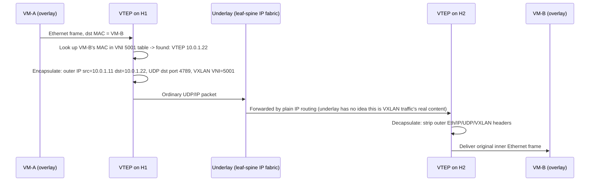

# Chapter 99: Network Virtualization — Overlays, Underlays, and VXLAN

> **"Chapter 98 closed with software quietly running underneath every gateway this course has described as a 'device.' This chapter asks the question that follows naturally: if a network can be built entirely in software, how many independent networks can you build on top of one physical network — and what happens when the answer needs to be millions?"**

---

## Table of Contents

1. [Where This Chapter Picks Up](#1-where-this-chapter-picks-up)
2. [The Problem: One Physical Fabric, Many Untrusting Tenants, Cloud Scale](#2-the-problem-one-physical-fabric-many-untrusting-tenants-cloud-scale)
3. [The Tool Already in Hand: VLANs](#3-the-tool-already-in-hand-vlans)
4. [Why VLANs Cannot Reach Cloud Scale](#4-why-vlans-cannot-reach-cloud-scale)
5. [Naive Fix: Just Make the VLAN ID Field Bigger](#5-naive-fix-just-make-the-vlan-id-field-bigger)
6. [The Real Solution: Stop Tagging, Start Tunneling](#6-the-real-solution-stop-tagging-start-tunneling)
7. [Overlay vs. Underlay, Defined Precisely](#7-overlay-vs-underlay-defined-precisely)
8. [VXLAN: Ethernet Frames Inside UDP Packets](#8-vxlan-ethernet-frames-inside-udp-packets)
9. [The Full Encapsulation Stack](#9-the-full-encapsulation-stack)
10. [The VXLAN Header, Field by Field](#10-the-vxlan-header-field-by-field)
11. [VNI vs. VLAN ID](#11-vni-vs-vlan-id)
12. [VTEPs: The Devices That Do the Work](#12-vteps-the-devices-that-do-the-work)
13. [How a VTEP Learns: MAC Address Tables Over an Overlay](#13-how-a-vtep-learns-mac-address-tables-over-an-overlay)
14. [The BUM Traffic Problem and Two Control-Plane Answers](#14-the-bum-traffic-problem-and-two-control-plane-answers)
15. [Full Worked Example: A Frame's Journey Across Two VTEPs](#15-full-worked-example-a-frames-journey-across-two-vteps)
16. [Real-World Implementations](#16-real-world-implementations)
17. [Hands-On Experiment: Building a VXLAN Tunnel on Linux](#17-hands-on-experiment-building-a-vxlan-tunnel-on-linux)
18. [Code: Parsing a VXLAN Header in Go](#18-code-parsing-a-vxlan-header-in-go)
19. [Common Misconceptions](#19-common-misconceptions)
20. [Production Notes](#20-production-notes)
21. [What's Simplified Here](#21-whats-simplified-here)
22. [Interview Questions & Model Answers](#22-interview-questions--model-answers)
23. [Exercises](#23-exercises)
24. [Summary and Bridge to Chapter 100](#24-summary-and-bridge-to-chapter-100)

---

## 1. Where This Chapter Picks Up

Chapter 98 ended with an observation worth sitting with: the Internet Gateway and NAT Gateway that Chapter 97's VPC relied on are not, physically, dedicated boxes bolted into a rack. They are software, running on general-purpose infrastructure, presenting themselves to a customer's VPC as if they were appliances. The leaf-spine fabric underneath them (Chapter 94) is real, physical Ethernet and IP — but almost everything a cloud tenant actually *interacts with* is a software abstraction drawn on top of it.

This chapter opens the specific abstraction that makes a "VPC" possible at all: a way to run an enormous number of logically separate Layer 2 networks on top of one shared physical network, at a scale far beyond what Chapter 32's VLANs were ever designed for. That mechanism is called **network virtualization**, and its dominant real-world implementation is **VXLAN**.

---

## 2. The Problem: One Physical Fabric, Many Untrusting Tenants, Cloud Scale

Chapter 97, Section 2 already posed a version of this problem at the VPC level: one physical data center, many customers who must never see each other's traffic. This chapter asks the same question one layer further down, at the level a cloud provider's own network engineers actually have to solve it:

A single data center region can run **hundreds of thousands of tenants**, each of whom may want several logically isolated networks (a VPC often has multiple subnets, and a large customer may run many VPCs). Multiply tenants by networks-per-tenant, and a hyperscale data center needs to support **millions of simultaneous, mutually isolated Layer-2-like broadcast domains**, all sharing the same physical switches, routers, and cables — and it needs to let a tenant's virtual machines move between physical racks, or even between data centers, without changing how those machines address each other.

That is a dramatically harder version of the problem Chapter 32 solved for a single office building's switches.

---

## 3. The Tool Already in Hand: VLANs

Chapter 32 built exactly the mechanism this problem seems to call for. An 802.1Q VLAN tag lets one physical switching fabric behave like many logically separate Layer 2 networks: traffic tagged VLAN 10 never mixes with traffic tagged VLAN 20, even on the same trunk link, even on the same physical switch. That is precisely "logical isolation on top of shared physical infrastructure" — the exact shape of the problem in Section 2.

So why not just tag every tenant's traffic with a VLAN ID and call the cloud-scale problem solved?

---

## 4. Why VLANs Cannot Reach Cloud Scale

Chapter 32, Section 7 defined the 802.1Q tag field by field, and one of those fields is the ceiling this chapter exists to break through: the **VLAN ID (VID) field is 12 bits wide**. Twelve bits gives 4096 possible values, and two of those (0 and 4095) are reserved for special meanings, leaving **4094 usable VLAN IDs** in any single Layer 2 domain.

Four thousand and ninety-four is a perfectly workable number for an office building, a campus, or even a mid-sized company's data center. It is nowhere close to enough for a cloud provider trying to give **millions of tenants** their own isolated network:

- A single data center's physical switching fabric is shared by far more than 4094 tenant networks.
- Even if a provider is willing to reuse VLAN IDs across different physical pods, that reintroduces exactly the operational headache VLANs were meant to eliminate: manually tracking, per switch, which VLAN ID means what, and never accidentally reusing one where it would let two tenants collide.
- VLANs also have no native concept of running across an *IP-routed* boundary — 802.1Q tags are a Layer 2 mechanism, and a real data center's leaf-spine fabric (Chapter 94) is usually **routed at Layer 3 between racks** for exactly the scalability and stability reasons Chapter 33's Spanning Tree Protocol chapter hinted at (Layer 2 domains that grow too large become fragile and slow to converge).

The real constraint isn't "4094 sounds a little small" — it's "the field VLANs use to identify a segment is structurally too narrow, and the mechanism (a tag riding inside an Ethernet frame) doesn't cross routed Layer 3 boundaries at all." A different mechanism was needed, not a bigger version of the same one.

---

## 5. Naive Fix: Just Make the VLAN ID Field Bigger

The obvious first idea: redefine 802.1Q to use a wider VLAN ID field — say, 24 bits instead of 12, giving over 16 million possible values.

This fails immediately for a reason that should feel familiar from Chapter 42's IPv6 story: **802.1Q is a deployed standard, implemented in the silicon of switch ASICs across the entire installed base of Ethernet equipment on Earth.** Changing the width of a header field isn't a software update — it's a new standard that every switch, network card, and piece of tagging hardware would need to be rebuilt to understand, and it still wouldn't solve the second half of Section 4's problem: VLAN tags don't survive being routed across an IP network, which is exactly how modern data center fabrics are built.

What was needed instead was a way to carry an isolated Layer 2 segment's traffic **inside an ordinary IP packet** — something every router, switch, and piece of existing network hardware already knows how to forward without any changes at all.

---

## 6. The Real Solution: Stop Tagging, Start Tunneling

Here is the insight that actually works: instead of adding a tag to an Ethernet frame and hoping every switch it crosses understands that tag, **wrap the entire original Ethernet frame inside a completely ordinary UDP/IP packet**, addressed from one physical server to another. Every switch and router in between only ever sees a normal IP packet — it has no idea, and does not need to know, that the packet's payload is secretly someone else's whole Ethernet frame.

This is **encapsulation**, the exact mechanism Chapter 27 built your intuition for — a frame wrapped inside another frame's payload — applied one layer higher than Chapter 27's original example. The physical network (the "underlay") only ever forwards ordinary IP traffic. The tenant's Layer 2 network (the "overlay") is reconstructed only at the two endpoints doing the wrapping and unwrapping. This general technique is called **network virtualization**, and the specific, dominant standard that implements it is **VXLAN** — Virtual Extensible LAN, defined in RFC 7348.

---

## 7. Overlay vs. Underlay, Defined Precisely

These two words do a lot of work in this volume, so it's worth being precise before going further:

- The **underlay** is the real, physical network: actual switches, actual routers, actual fiber and copper, running ordinary IP routing (often the leaf-spine fabric from Chapter 94, using OSPF or BGP from Chapters 48–49 between racks). The underlay's only job is to get an IP packet from one physical server to another, as fast and reliably as possible. It has no idea tenants or virtual networks exist.
- The **overlay** is the logical network built on top: the tenant's own view of a Layer 2 (or Layer 3) network, complete with its own MAC addresses, its own IP subnets, and its own broadcast domain — even though none of that structure is visible to, or understood by, the underlay carrying it.

```
   OVERLAY  (tenant's view — Ethernet frames, their own MACs/IPs)

   [VM A] ---- virtual switch ---- [VM B]
      \                              /
       \____________________________/
                    |
     (invisible to VM A and VM B: this whole
      overlay conversation is actually carried
      as encapsulated UDP/IP packets below)
                    |
   UNDERLAY  (physical network — ordinary routed IP)

   [Hypervisor 1]==[ToR]==[Spine]==[ToR]==[Hypervisor 2]
```

The underlay doesn't know VM A and VM B exist. The overlay doesn't know or care how many physical hops separate them. That separation of concerns — the same architectural instinct Chapter 24 introduced for layering in general — is exactly what lets a tenant's network move, scale, and stay isolated without the physical fabric needing to change at all.

---

## 8. VXLAN: Ethernet Frames Inside UDP Packets

VXLAN's one-sentence mechanism: **take an entire Ethernet frame — the tenant's original frame, MAC addresses and all — and encapsulate it inside a UDP packet**, which is itself carried inside an ordinary IP packet, which is itself carried inside an ordinary (outer) Ethernet frame for the actual physical hop. The devices that perform this wrapping and unwrapping are called **VTEPs** (VXLAN Tunnel Endpoints), covered in depth in Section 12.

Choosing UDP as the outer transport (rather than, say, a raw IP protocol number) was deliberate: a UDP packet has a source and destination **port number**, and — critically — most existing hardware load balancers and multi-path routing (ECMP, Equal-Cost Multi-Path) hash flows by the standard 5-tuple that includes UDP ports. By deriving the *outer* UDP source port from a hash of the *inner* frame's original headers, VXLAN traffic naturally spreads across multiple physical paths in the underlay — solving a spreading problem for free, using infrastructure the underlay already had for ordinary UDP traffic.

---

## 9. The Full Encapsulation Stack

Laid out byte-region by byte-region, from the outside in:

```
+----------------------------------------------------------+
| Outer Ethernet Header (14 bytes)                         |  <- underlay hop
|   dst MAC = next-hop router/switch, src MAC = sender NIC |
+----------------------------------------------------------+
| Outer IP Header (20 bytes)                                |  <- underlay routing
|   src IP = source VTEP, dst IP = destination VTEP         |
+----------------------------------------------------------+
| Outer UDP Header (8 bytes)                                 |
|   dst port = 4789 (VXLAN), src port = hash of inner flow  |
+----------------------------------------------------------+
| VXLAN Header (8 bytes)                                     |  <- Section 10
|   flags, VNI (24 bits)                                     |
+----------------------------------------------------------+
| Inner Ethernet Header (14 bytes)                            |  <- tenant's real frame
|   dst MAC, src MAC — the tenant's own addressing            |
+----------------------------------------------------------+
| Inner IP header + payload (tenant's actual data)            |
+----------------------------------------------------------+
```

Notice the overhead: 14 (outer Eth) + 20 (outer IP) + 8 (outer UDP) + 8 (VXLAN) = **50 bytes of extra header** wrapped around every original frame. This is why VXLAN deployments almost always raise the physical network's MTU (commonly to 9000-byte "jumbo frames") — without headroom, a tenant's already-maximum-sized 1500-byte frame plus 50 bytes of VXLAN overhead would exceed the underlay's default Ethernet MTU and force fragmentation, which VXLAN handles poorly in practice.

---

## 10. The VXLAN Header, Field by Field

The VXLAN header itself is small — exactly 8 bytes — and carries almost no information beyond "which overlay does this belong to":

| Field | Size | Purpose |
|---|---|---|
| Flags | 8 bits | Only one bit is defined: the "I" bit (bit 3 from the left in the RFC's layout), which must be set to 1 to indicate the VNI field is valid |
| Reserved | 24 bits | Must be sent as zero, ignored on receipt |
| VNI (VXLAN Network Identifier) | 24 bits | The overlay segment's identity — the direct analog of a VLAN ID, but far larger |
| Reserved | 8 bits | Must be sent as zero, ignored on receipt |

The entire mechanism that gives VXLAN its scale advantage over 802.1Q lives in one field: **the VNI is 24 bits wide**, giving **16,777,216 possible values** — over 4,000 times more distinct segments than the 4094 a VLAN tag can express. That single width difference is the direct, mechanical fix for Section 4's problem.

---

## 11. VNI vs. VLAN ID

It's worth being explicit about the analogy and where it holds, because interviewers love this exact question:

| | VLAN ID (802.1Q) | VNI (VXLAN) |
|---|---|---|
| Width | 12 bits | 24 bits |
| Max distinct segments | 4094 usable | 16,777,216 |
| Carried in | A tag inside the Ethernet frame itself | A field inside a UDP-encapsulated header, outside the original frame |
| Crosses routed (Layer 3) boundaries? | No — a Layer 2, single-broadcast-domain mechanism | Yes — the whole point is to tunnel over an ordinary routed IP network |
| Understood by ordinary switches in between? | Yes, if 802.1Q-aware | No, and it doesn't need to be — VXLAN traffic looks like plain UDP to every device except the VTEPs |

A useful way to hold both ideas at once: a VLAN ID segments *one Layer 2 domain*; a VNI segments *the entire IP-routed underlay* into as many independent Layer 2-*like* overlays as needed, without the underlay ever being aware any segmentation is happening.

---

## 12. VTEPs: The Devices That Do the Work

A **VTEP (VXLAN Tunnel Endpoint)** is the device that performs the actual encapsulation and decapsulation described in Section 8. In a real data center, a VTEP is most commonly implemented in software, inside the **hypervisor** running on each physical server (as part of a virtual switch like Open vSwitch), though hardware VTEPs also exist in some top-of-rack switches.

Each VTEP has:

- An IP address on the **underlay** network (its own real, routable address, used as the source/destination of the outer IP header in Section 9).
- A mapping table associating each **VNI** it participates in with the set of **remote VTEP IP addresses** that also host virtual machines on that same overlay segment.
- A per-VNI **MAC address table**, functioning exactly like the switch MAC table Chapter 31 built — except the "ports" it forwards toward are remote VTEPs reached over the IP underlay, not physical switch ports.

When a virtual machine sends an Ethernet frame, its local VTEP intercepts it, looks up the destination MAC in that VNI's table to find which remote VTEP hosts it, wraps the frame per Section 9 addressed to that remote VTEP's underlay IP, and hands the resulting UDP/IP packet to the ordinary underlay network for forwarding — which treats it as nothing more than a UDP packet between two servers.

---

## 13. How a VTEP Learns: MAC Address Tables Over an Overlay

Chapter 31 showed a switch learning MAC-to-port mappings by watching source addresses on frames it receives. A VTEP does the conceptual equivalent, but the "port" it learns is a **remote VTEP's IP address** rather than a physical interface:

1. A VXLAN packet arrives, decapsulated to reveal an inner frame's source MAC and the outer packet's source IP (the sending VTEP).
2. The receiving VTEP records: "MAC `aa:bb:cc:dd:ee:01` on VNI 5001 is reachable via VTEP `10.10.10.5`."
3. Future frames destined for that MAC on that VNI are unicast-encapsulated directly to `10.10.10.5`, instead of being flooded.

This is the same learn-by-watching-source-addresses algorithm from Chapter 31, applied one layer up the stack, over IP instead of over physical wire.

---

## 14. The BUM Traffic Problem and Two Control-Plane Answers

Chapter 31 also established that a switch has to **flood** frames whose destination it hasn't learned yet, along with genuine broadcasts (like ARP requests, Chapter 53) and multicast traffic. Collectively this is called **BUM traffic** — Broadcast, Unknown-unicast, and Multicast. A VTEP faces exactly the same problem: what does it do with a frame it needs to flood, when "flooding" now means "somehow reach every other VTEP that shares this VNI," potentially across an entire data center or region?

Two real answers have been used in production, representing an evolution much like RIP-to-OSPF in Chapter 47–48:

- **Multicast-based VXLAN (the original RFC 7348 design).** Each VNI is mapped to an IP multicast group in the underlay. BUM traffic is sent once, to that multicast group, and the underlay's multicast routing delivers a copy to every VTEP that has joined it (because it hosts a VM on that VNI). This works but requires the underlay itself to support IP multicast reliably at scale — an operational burden many data center operators wanted to avoid.
- **Unicast control-plane VXLAN (the now-dominant approach), most commonly using BGP EVPN.** Instead of relying on underlay multicast, VTEPs exchange MAC-to-VTEP reachability information directly, over BGP (the same protocol family from Chapter 49, extended with an EVPN address family), functioning as a genuine control plane that tells every VTEP in advance which MACs live behind which remote VTEPs — turning most traffic into direct unicast and sharply reducing the need to flood at all. This mirrors the Section 3 recap: a control plane doing in advance what would otherwise require expensive discovery on every packet.

---

## 15. Full Worked Example: A Frame's Journey Across Two VTEPs

Two virtual machines, `VM-A` (on hypervisor `H1`) and `VM-B` (on hypervisor `H2`), both belong to tenant Acme's overlay network, VNI 5001. `H1`'s VTEP has underlay IP `10.0.1.11`; `H2`'s VTEP has underlay IP `10.0.1.22`. `VM-A` already knows `VM-B`'s MAC from an earlier ARP exchange (Chapter 53) inside the overlay.



To every switch and router inside the "Underlay" box, this was an entirely ordinary UDP packet between two servers on port 4789. Neither `VM-A` nor `VM-B` — nor Acme, the tenant — has any visibility into, or dependency on, the physical topology carrying their conversation.

---

## 16. Real-World Implementations

- **AWS VPCs, Azure VNets, and Google Cloud VPCs** all use encapsulation-based overlay networking conceptually equivalent to VXLAN (sometimes VXLAN itself, sometimes proprietary variants like AWS's own overlay protocol) to give each customer's VPC (Chapter 97) its own isolated address space and broadcast domain on shared physical infrastructure — this is the literal mechanism underneath the "software-defined" gateways Chapter 98 described.
- **VMware NSX** and **Open vSwitch (OVS)**, widely used in private data centers and OpenStack deployments, implement VXLAN directly as their primary network virtualization encapsulation.
- **Kubernetes CNI plugins** such as Flannel's VXLAN backend use exactly this mechanism to give pods on different physical nodes the illusion of sharing one flat Layer 2 network — a connection Chapter 104 will make explicit.
- **BGP EVPN** (Section 14) is the standard control plane in modern data center fabrics from vendors like Cisco, Arista, and Juniper, replacing multicast-based flood-and-learn in nearly all new deployments.

---

## 17. Hands-On Experiment: Building a VXLAN Tunnel on Linux

Linux's kernel has native VXLAN support, so a VXLAN overlay between two hosts can be built with nothing more than `ip link`. This experiment uses two Linux hosts (or two network namespaces, previewing Chapter 102's technique, for a single-machine version) with underlay reachability already established.

On host 1 (underlay IP `192.0.2.10`, wanting to reach a peer at `192.0.2.20`):

```bash
# Create a VXLAN interface: VNI 100, UDP port 4789 (the IANA-assigned standard),
# tunneling to the remote VTEP at 192.0.2.20 over the existing physical interface eth0
sudo ip link add vxlan100 type vxlan \
    id 100 \
    dstport 4789 \
    remote 192.0.2.20 \
    local 192.0.2.10 \
    dev eth0

# Give the new virtual interface an address inside the overlay's own subnet
sudo ip addr add 172.16.0.1/24 dev vxlan100
sudo ip link set vxlan100 up
```

On host 2 (underlay IP `192.0.2.20`), the mirror image:

```bash
sudo ip link add vxlan100 type vxlan \
    id 100 \
    dstport 4789 \
    remote 192.0.2.10 \
    local 192.0.2.20 \
    dev eth0

sudo ip addr add 172.16.0.2/24 dev vxlan100
sudo ip link set vxlan100 up
```

Now `ping 172.16.0.2` from host 1 succeeds — and if you run `tcpdump -i eth0 udp port 4789` on either host while pinging, you will see ordinary UDP packets on the *physical* interface, each one an encapsulated copy of the ICMP echo request/reply traveling on the *virtual* `vxlan100` interface. That is Section 9's encapsulation stack, observable on a real machine with two commands.

---

## 18. Code: Parsing a VXLAN Header in Go

A minimal parser for the 8-byte VXLAN header from Section 10, useful for building tooling (or a packet sniffer, previewed for Chapter 114) that needs to inspect overlay traffic:

```go
package main

import (
	"encoding/binary"
	"errors"
	"fmt"
)

// VXLANHeader represents the 8-byte header defined in RFC 7348.
type VXLANHeader struct {
	VNIValid bool   // the "I" flag
	VNI      uint32 // only the low 24 bits are meaningful
}

// ParseVXLANHeader expects exactly the 8 bytes that follow the outer UDP header.
func ParseVXLANHeader(b []byte) (VXLANHeader, error) {
	if len(b) < 8 {
		return VXLANHeader{}, errors.New("vxlan header must be 8 bytes")
	}

	flags := b[0]
	vniValid := flags&0x08 != 0 // the "I" bit, per RFC 7348 layout

	// VNI occupies bytes 4-6 (24 bits), byte 7 is reserved.
	vni := uint32(b[4])<<16 | uint32(b[5])<<8 | uint32(b[6])

	return VXLANHeader{VNIValid: vniValid, VNI: vni}, nil
}

func main() {
	// A realistic 8-byte VXLAN header: I-flag set, VNI = 5001 (0x001389)
	raw := []byte{0x08, 0x00, 0x00, 0x00, 0x00, 0x13, 0x89, 0x00}

	hdr, err := ParseVXLANHeader(raw)
	if err != nil {
		panic(err)
	}

	fmt.Printf("VNI valid: %v, VNI: %d\n", hdr.VNIValid, hdr.VNI)
	_ = binary.BigEndian // (kept for clarity; manual shifts used above for byte-level intuition)
}
```

Running this prints `VNI valid: true, VNI: 5001` — the exact overlay segment identifier that would tell a VTEP which tenant's MAC table to consult.

---

## 19. Common Misconceptions

- **"VXLAN replaces VLANs."** Inside a single rack or hypervisor, VLANs and VXLAN often coexist — a hypervisor may still use a local VLAN tag to separate traffic on its own virtual switch before that traffic gets VXLAN-encapsulated for the trip across the underlay. VXLAN solves the *cross-fabric, cloud-scale* version of the problem; it doesn't make every other use of VLAN tagging obsolete.
- **"VXLAN is a security or encryption mechanism."** It is purely an encapsulation and multiplexing mechanism, providing isolation (frames in one VNI never mix with another), not confidentiality — an attacker who can see the underlay's UDP traffic can, in principle, inspect a decapsulated frame's contents unless something else (like the mTLS covered in Chapter 101) is separately encrypting the tenant's actual payload.
- **"The underlay needs to understand VXLAN."** The entire design point of Section 6 is that it doesn't — to every underlay router and switch, VXLAN traffic is indistinguishable from any other UDP packet destined for port 4789.
- **"A bigger VNI space means VXLAN has no limits."** 16 million segments is enormous but not infinite, and real deployments also contend with practical limits like MAC table sizes on hardware VTEPs and the flood/learn scaling problems Section 14 described — which is exactly why EVPN control planes exist.

---

## 20. Production Notes

- MTU planning (Section 9) is one of the most common real-world VXLAN deployment mistakes: forgetting the ~50 bytes of overhead leads to fragmented or dropped overlay traffic that is confusing to diagnose because the *underlay* looks perfectly healthy.
- Hardware VTEPs (in some top-of-rack switches) offload encapsulation/decapsulation from the CPU, which matters at high packet rates; software VTEPs (in a hypervisor's virtual switch) are more flexible but consume host CPU cycles per packet, a real and measurable "tax" on compute capacity.
- BGP EVPN (Section 14) has become close to a default choice in new data center fabric designs specifically because it avoids depending on underlay multicast, which many operators found operationally fragile and hard to troubleshoot at scale.
- Overlay MTU, VNI allocation, and VTEP peering are typically fully automated by the orchestration layer (a cloud provider's control plane, or an SDN controller — the subject of Chapter 100) rather than configured by hand the way Section 17's experiment did it; the manual `ip link` commands exist in production mainly as a debugging and teaching tool.

---

## 21. What's Simplified Here

This chapter presents VXLAN as RFC 7348 defines it, and the mechanics (encapsulation format, header fields, VTEP role) are accurate and match real deployments. Left out for focus: VXLAN's less common variants and extensions (VXLAN-GPE for carrying non-Ethernet payloads, and various vendor-specific EVPN route-type details); the full BGP EVPN route-type taxonomy, which is a substantial protocol in its own right; and the considerable complexity of production VTEP high-availability designs (anycast gateways, multi-homing) that real data center fabrics layer on top of the base mechanism described here. The core idea — overlay frames tunneled inside underlay UDP/IP packets, keyed by a 24-bit VNI — is accurate and is the same mechanism underneath essentially every major cloud provider's virtual networking and every major software-defined data center fabric in production today.

---

## 22. Interview Questions & Model Answers

**Beginner: Why can't VLANs alone provide network isolation at cloud scale?**
An 802.1Q VLAN ID is only 12 bits wide, giving at most 4094 usable segments, and VLAN tags don't survive being routed across a Layer 3 boundary — both of which make VLANs unable to isolate the millions of tenant networks a cloud data center needs, or to cross the routed fabric most modern data centers use between racks.

**Beginner: What does VXLAN actually encapsulate, and in what?**
VXLAN encapsulates an entire original Ethernet frame — the tenant's overlay frame, MAC addresses included — inside a UDP packet, which travels inside an ordinary IP packet, which the physical network forwards with no awareness that its payload is actually someone else's Layer 2 frame.

**Intermediate: What is a VTEP, and what two things does it need to know to forward overlay traffic correctly?**
A VXLAN Tunnel Endpoint is the device (usually software in a hypervisor) that encapsulates and decapsulates VXLAN traffic. To forward correctly, it needs, per VNI: a MAC-address-to-remote-VTEP-IP table (so it knows which physical destination to encapsulate toward) and its own underlay IP address to use as the source of outer packets.

**Intermediate: Why is the outer transport UDP rather than a raw IP protocol, and what benefit does that provide?**
Using UDP gives VXLAN packets a source and destination port, which lets existing ECMP/load-balancing hardware in the underlay hash flows across multiple physical paths using ports it already understands — by deriving the outer UDP source port from a hash of the inner frame, different tenant flows spread across the underlay's available paths without any underlay change at all.

**Advanced: Compare multicast-based VXLAN flood-and-learn to a BGP EVPN control plane, and explain why the industry moved toward the latter.**
Multicast-based VXLAN maps each VNI to an underlay IP multicast group and relies on flooding for BUM traffic and learning MAC-to-VTEP mappings passively, which requires the underlay to support reliable multicast at scale — an operational burden many operators found fragile. BGP EVPN instead has VTEPs exchange MAC/IP reachability information proactively over BGP, functioning as a real control plane that converts most traffic to direct unicast and removes the underlay multicast dependency entirely, at the cost of needing a BGP-speaking control plane in the fabric.

**Advanced: A VXLAN overlay works fine for small packets but large file transfers between two VMs stall or perform terribly. What's the most likely cause, and why?**
The most likely cause is an MTU mismatch: the ~50 bytes of VXLAN encapsulation overhead pushes an already-maximum-sized inner frame over the underlay's configured MTU, causing fragmentation or silent drops (especially if a path along the way has the "don't fragment" bit set or otherwise mishandles fragmented UDP). The fix is raising the physical underlay's MTU (commonly to 9000-byte jumbo frames) to accommodate the encapsulation overhead.

---

## 23. Exercises

### Easy
1. State, in one sentence each, what a VLAN ID and a VNI identify, and why one is 12 bits and the other is 24 bits.
2. List, in order, every header that wraps an original tenant Ethernet frame by the time it reaches the physical wire in a VXLAN deployment.
3. Why doesn't the underlay network need to understand VXLAN at all?

### Medium
4. Extend Section 18's Go code to also extract and print the outer UDP source port from a full captured packet, and explain what information that port typically encodes.
5. Using Section 15's worked example, explain what changes if `VM-A` doesn't yet know `VM-B`'s MAC address — walk through what VTEP `H1` must do differently, referencing Section 14's BUM traffic handling.
6. A network engineer proposes running VXLAN directly over the public Internet between two data centers instead of over a private underlay. What new problems does this introduce that a private underlay didn't have?

### Hard
7. Design a small BGP EVPN control-plane scenario (in prose, not code) for three VTEPs sharing one VNI: describe what each VTEP advertises, to whom, and how a fourth VTEP joining later learns about existing MAC addresses without any flooding at all.
8. Using Section 17's hands-on experiment as a base, extend it to three hosts sharing one VNI, and explain what changes about how each VXLAN interface must be configured compared to the two-host case (hint: consider Section 14's flood-and-learn versus explicit remote lists).
9. A VM migrates live from one physical hypervisor to another while keeping the same MAC and IP address (a "live migration"). Explain, mechanically, what has to happen in the VTEP MAC tables across the fabric for other VMs on the same VNI to correctly reach it at its new physical location, and why this is fundamentally the same kind of problem Chapter 31's MAC learning solved, just at data-center scale.

---

## 24. Summary and Bridge to Chapter 100

| Term | Meaning |
|---|---|
| Overlay network | The tenant's logical network, built on top of physical infrastructure it has no visibility into |
| Underlay network | The real, physical IP-routed network carrying overlay traffic without understanding it |
| VXLAN | RFC 7348 standard: encapsulates Ethernet frames inside UDP/IP packets to build overlays at scale |
| VNI | 24-bit VXLAN Network Identifier — the VLAN-ID analog, but with 16.7 million possible values |
| VTEP | VXLAN Tunnel Endpoint — encapsulates/decapsulates overlay traffic, usually in a hypervisor |
| BUM traffic | Broadcast, Unknown-unicast, and Multicast traffic — the flooding problem an overlay must also solve |
| BGP EVPN | Modern unicast control plane for VXLAN, replacing underlay-multicast-based flood-and-learn |

This chapter answered "how do you build millions of isolated virtual networks on top of one physical network?" with a specific, concrete mechanism: encapsulation. But VXLAN only solves the *data plane* problem — how traffic actually moves once everyone agrees where it should go. It says nothing about *who decides* where traffic should go, how a VTEP's MAC tables get programmed at scale, or how an entire fleet of switches gets reconfigured the instant a new tenant network is created. That decision-making layer — separated cleanly from the packet-forwarding hardware doing the actual work — is the subject of Chapter 100: Software-Defined Networking.
