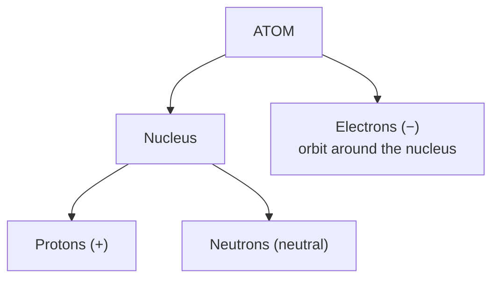
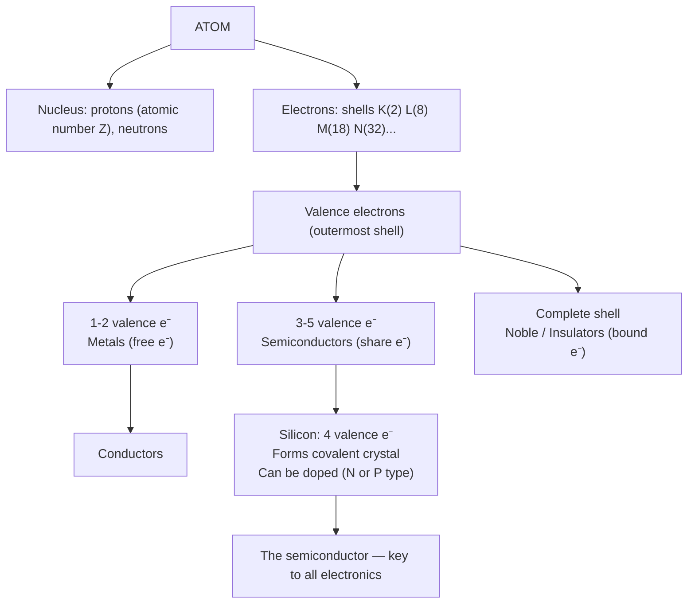

# Chapter 01: Atoms and Matter — The Foundation of Everything

> **"To understand electronics, you must first understand the atom — because every resistor, transistor, and processor is just atoms arranged in a very clever way."**

---

## Table of Contents
1. [What is Matter?](#1-what-is-matter)
2. [Elements and the Periodic Table](#2-elements-and-the-periodic-table)
3. [Atomic Structure](#3-atomic-structure)
4. [Electron Shells and Configuration](#4-electron-shells-and-configuration)
5. [Valence Electrons — The Key to Electronics](#5-valence-electrons--the-key-to-electronics)
6. [Quantum Model of the Atom](#6-quantum-model-of-the-atom)
7. [Ionization Energy and Electronegativity](#7-ionization-energy-and-electronegativity)
8. [Chemical Bonds](#8-chemical-bonds)
9. [Crystal Lattice Structures](#9-crystal-lattice-structures)
10. [Key Elements in Electronics](#10-key-elements-in-electronics)
11. [Introduction to Fermi Energy](#11-introduction-to-fermi-energy)
12. [Summary](#12-summary)

---

## 1. What is Matter?

**Matter** is anything that has **mass** and occupies **space**. Everything around you — your phone, a copper wire, a silicon chip, your own body — is made of matter.

Matter exists in four states:
- **Solid**: atoms tightly packed, fixed shape and volume (e.g., silicon crystal, copper wire)
- **Liquid**: atoms close but mobile, fixed volume but variable shape (e.g., mercury)
- **Gas**: atoms far apart and moving freely, variable shape and volume (e.g., nitrogen in air)
- **Plasma**: ionized gas at very high temperature (e.g., inside stars, plasma etching in chip fabrication)

### Pure Substances vs Mixtures
- **Element**: matter made of only one type of atom (e.g., pure copper Cu, pure silicon Si)
- **Compound**: two or more elements chemically bonded (e.g., SiO₂ = silicon dioxide, the gate insulator in MOSFETs)
- **Mixture**: elements/compounds physically combined (e.g., air, solder alloy Sn-Pb)

---

## 2. Elements and the Periodic Table

There are **118 known elements**, each defined by the number of protons in its nucleus (the **atomic number**).

The **Periodic Table** organizes elements by:
- **Period (row)**: number of electron shells
- **Group/Column**: number of valence electrons (determines chemical behavior)

### Groups Relevant to Electronics

| Group | Valence e⁻ | Examples | Electronics Role |
|-------|-----------|---------|-----------------|
| IA (1) | 1 | Li, Na, K | Electrolytes, batteries |
| IIA (2) | 2 | Mg, Ca, Ba | BaTiO₃ capacitors |
| IIIA (13) | 3 | B, Al, Ga, In | P-type dopants, semiconductor materials |
| IVA (14) | 4 | Si, Ge, C | Semiconductors (the heart of electronics!) |
| VA (15) | 5 | N, P, As, Sb | N-type dopants |
| VIA (16) | 6 | O, S, Se, Te | Insulators (SiO₂), compound semiconductors |
| VIIA (17) | 7 | F, Cl | Etching gases in chip fabrication |
| IB (11) | 1 | Cu, Ag, Au | Conductors, PCB traces, bond wires |
| Noble (18) | 8 | He, Ne, Ar | Inert atmosphere in manufacturing |

**The most important elements for electronics:**
- **Silicon (Si)** — atomic number 14, the foundation of nearly all chips
- **Germanium (Ge)** — atomic number 32, early transistors
- **Copper (Cu)** — atomic number 29, best common conductor
- **Boron (B)** — atomic number 5, P-type dopant
- **Phosphorus (P)** — atomic number 15, N-type dopant
- **Arsenic (As)** — atomic number 33, N-type dopant
- **Gold (Au)** — atomic number 79, bond wires, contacts
- **Aluminum (Al)** — atomic number 13, interconnects (older chips), heatsinks
- **Gallium (Ga)** — atomic number 31, compound semiconductors (GaN, GaAs)
- **Nitrogen (N)** — atomic number 7, GaN power electronics

---

## 3. Atomic Structure

Every atom consists of:



### Subatomic Particles

| Particle | Symbol | Charge | Mass (amu) | Location |
|----------|--------|--------|------------|----------|
| Proton | p⁺ | +1 (1.6×10⁻¹⁹ C) | 1.0073 | Nucleus |
| Neutron | n⁰ | 0 | 1.0087 | Nucleus |
| Electron | e⁻ | −1 (1.6×10⁻¹⁹ C) | 0.000549 | Orbitals |

> **Note**: The electron is **1836 times lighter** than a proton. The mass of an atom is almost entirely in the nucleus.

### Atomic Number and Atomic Mass

- **Atomic Number (Z)** = number of protons = number of electrons in a neutral atom
- **Atomic Mass (A)** = number of protons + number of neutrons
- **Neutrons** = A − Z

**Example — Silicon (Si):**
- Z = 14 (14 protons)
- A ≈ 28 (most common isotope: ²⁸Si)
- Neutrons = 28 − 14 = 14

### Isotopes

Atoms of the same element with **different numbers of neutrons** are called isotopes.

**Examples:**
- ²⁸Si (92.2% natural abundance), ²⁹Si (4.7%), ³⁰Si (3.1%)
- ⁷⁴Ge, ⁷²Ge, ⁷⁰Ge, ⁷³Ge, ⁷⁶Ge
- ¹H (protium), ²H (deuterium), ³H (tritium)

Isotopes have same chemical properties but different masses and nuclear properties.

---

## 4. Electron Shells and Configuration

Electrons do not orbit randomly — they occupy specific **energy levels** called **shells** (or **principal quantum levels**).

### Shell Naming and Capacity

| Shell | Letter | Max Electrons (2n²) | Energy Level |
|-------|--------|---------------------|--------------|
| 1st | K | 2(1²) = 2 | Lowest |
| 2nd | L | 2(2²) = 8 | |
| 3rd | M | 2(3²) = 18 | |
| 4th | N | 2(4²) = 32 | |
| 5th | O | 2(5²) = 50 | |
| 6th | P | 2(6²) = 72 | Highest occupied |

**Formula for max electrons in shell n:**
```
Max electrons = 2n²
```

### Electron Configuration — Examples

**Hydrogen (H, Z=1):**
```
Shell: K(1)
Config: 1
```

**Helium (He, Z=2):**
```
Shell: K(2) — FULL
Config: 2
```

**Carbon (C, Z=6):**
```
Shells: K(2), L(4)
Config: 2, 4
```

**Silicon (Si, Z=14):** ← Most important for electronics
```
Shells: K(2), L(8), M(4)
Config: 2, 8, 4
↑ 4 valence electrons — exactly half-full outer shell
```

**Germanium (Ge, Z=32):**
```
Shells: K(2), L(8), M(18), N(4)
Config: 2, 8, 18, 4
↑ Also 4 valence electrons — same group as Silicon!
```

**Copper (Cu, Z=29):**
```
Shells: K(2), L(8), M(18), N(1)
Config: 2, 8, 18, 1
↑ 1 valence electron — extremely free to move → excellent conductor
```

**Boron (B, Z=5):** ← P-type dopant
```
Shells: K(2), L(3)
Config: 2, 3
↑ 3 valence electrons — needs 1 more to complete shell
```

**Phosphorus (P, Z=15):** ← N-type dopant
```
Shells: K(2), L(8), M(5)
Config: 2, 8, 5
↑ 5 valence electrons — has 1 extra after bonding
```

### How to Write Electron Configuration (Subshell Notation)

Shells are divided into **subshells** (s, p, d, f):

| Subshell | Shape | Max electrons |
|----------|-------|---------------|
| s | Spherical | 2 |
| p | Dumbbell (3 orientations) | 6 |
| d | Complex (5 orientations) | 10 |
| f | Very complex (7 orientations) | 14 |

**Filling order (Aufbau principle):** 1s → 2s → 2p → 3s → 3p → 4s → 3d → 4p → 5s → 4d → 5p...

**Silicon (Si, Z=14):**
```
1s² 2s² 2p⁶ 3s² 3p²
      ↑ core       ↑ valence
```

**Germanium (Ge, Z=32):**
```
1s² 2s² 2p⁶ 3s² 3p⁶ 3d¹⁰ 4s² 4p²
```

**Copper (Cu, Z=29):** ← anomalous configuration
```
1s² 2s² 2p⁶ 3s² 3p⁶ 3d¹⁰ 4s¹
(expected 3d⁹4s² but 3d full is more stable)
```

---

## 5. Valence Electrons — The Key to Electronics

**Valence electrons** are the electrons in the **outermost occupied shell**. They are the ones that participate in chemical bonding and determine electrical behavior.

```
Why valence electrons matter for electronics:
─────────────────────────────────────────────
• They determine whether an atom will give up, accept, or share electrons
• Shared electrons = covalent bonds = crystal formation
• Free valence electrons = electrical conduction
• The NUMBER of valence electrons determines conductors vs insulators
```

### The Octet Rule

Most atoms are **most stable** when their outermost shell has **8 electrons** (an "octet"). This drives:
- Chemical bonding (atoms share or transfer electrons to get 8)
- Formation of crystal lattices (as in silicon)
- The difference between conductors, insulators, and semiconductors

**Silicon example:**
- Has 4 valence electrons
- Needs 4 more to complete the shell
- Shares one electron with each of 4 neighboring Si atoms
- Forms 4 covalent bonds → tetrahedral crystal structure
- At 0K, all electrons are "locked" in bonds → pure Si is insulator
- At room temperature, some electrons break free → semiconductor behavior

---

## 6. Quantum Model of the Atom

The Bohr model (electrons in circular orbits) is a simplification. The actual quantum mechanical model describes electrons in terms of **probability clouds** (orbitals).

### Four Quantum Numbers

Every electron in an atom is uniquely described by four quantum numbers:

| Quantum Number | Symbol | Values | Describes |
|----------------|--------|--------|-----------|
| Principal | n | 1, 2, 3, 4... | Shell/energy level |
| Azimuthal (orbital) | ℓ | 0 to n-1 | Subshell shape (s=0, p=1, d=2, f=3) |
| Magnetic | mℓ | -ℓ to +ℓ | Orbital orientation |
| Spin | ms | +½ or -½ | Electron spin (up or down) |

**Pauli Exclusion Principle:** No two electrons in the same atom can have the same four quantum numbers. This is why each orbital holds exactly 2 electrons (spin up + spin down).

**Hund's Rule:** Electrons fill orbitals of equal energy one-by-one before pairing up (like people taking window seats before sitting next to each other on a bus).

### Energy Band Formation

When atoms come close together (as in a crystal), their discrete energy levels **split** and **merge** into **energy bands**. This is the foundation of band theory, which explains why silicon is a semiconductor.

```
Individual atoms:         Closely packed atoms (crystal):
──────────────            ──────────────────────────────
   _____  3p              ┌────────────────┐ Conduction Band
   _____  3s              │   energy gap   │ Band Gap (Eg)
   _____  2p              └────────────────┘ Valence Band
   _____  2s
   _____  1s
```

(Full band theory is covered in Chapter 02)

---

## 7. Ionization Energy and Electronegativity

### Ionization Energy
The energy required to **remove one electron** from a neutral atom in the gas phase.

```
X → X⁺ + e⁻    requires energy = Ionization Energy (IE)
```

- **High IE** → electron hard to remove → tends to be insulator (e.g., noble gases, fluorine)
- **Low IE** → electron easily removed → tends to be conductor (e.g., metals: Na, Cu, Al)
- Silicon has moderate IE → semiconductor

**Trends in periodic table:**
- IE increases left → right across a period (more protons attract electrons more)
- IE decreases top → bottom in a group (outer electrons further from nucleus, shielded)

### Electronegativity

The tendency of an atom to **attract electrons** in a chemical bond.

**Pauling scale (F = 4.0 most electronegative):**

| Element | Electronegativity |
|---------|------------------|
| F | 4.0 |
| O | 3.5 |
| N | 3.0 |
| Si | 1.9 |
| Ge | 2.0 |
| Cu | 1.9 |
| Al | 1.6 |
| B | 2.0 |
| P | 2.1 |

When Si bonds with O (to form SiO₂ gate oxide): O pulls electrons → polar covalent bond → excellent insulator.

---

## 8. Chemical Bonds

### 1. Covalent Bond (Most Important for Semiconductors)

Atoms **share** electron pairs. Each shared pair is one bond.

**Silicon crystal — covalent bonds:**
```
Each Si atom forms 4 covalent bonds with 4 neighbors:

        Si
       /|\ \
      / | \  \
    Si  Si  Si  Si
```

- Very strong bond
- Electrons are shared, not free to move
- At 0K, no free carriers → insulator behavior
- At room temperature, thermal energy breaks some bonds → free electrons!

### 2. Ionic Bond

One atom **transfers** electrons to another. Creates positive (cation) and negative (anion) ions.

**Example:** NaCl (table salt)
- Na (1 valence e⁻) gives to Cl (7 valence e⁻)
- Na⁺ and Cl⁻ attract

Used in: electrolytic capacitors, batteries, some ceramic substrates.

### 3. Metallic Bond

Atoms in a metal lattice share their valence electrons with **all** atoms — a "sea of electrons."

```
Metal crystal:
    Cu⁺ Cu⁺ Cu⁺ Cu⁺
    Cu⁺ Cu⁺ Cu⁺ Cu⁺   ←── surrounded by free-flowing electron cloud
    Cu⁺ Cu⁺ Cu⁺ Cu⁺
```

- Free electrons can move under electric field → excellent conductor
- Explains: high electrical conductivity, thermal conductivity, malleability of metals

### 4. Van der Waals Bond (weak)

Temporary/induced dipole interactions. Relevant in graphene layers, 2D materials (MoS₂ for future transistors).

---

## 9. Crystal Lattice Structures

A **crystal** is a solid where atoms are arranged in a regular, repeating 3D pattern called a **lattice**.

### Simple Cubic (SC)
- Atoms at corners only
- Very inefficient packing (52% fill)
- Rare in nature (only Polonium)

### Body-Centered Cubic (BCC)
- Atoms at corners + 1 atom in center
- Fill factor: 68%
- Examples: Iron (Fe), Tungsten (W), Chromium (Cr), Molybdenum

### Face-Centered Cubic (FCC)
- Atoms at corners + 1 atom on each face center
- Fill factor: 74% (most efficient)
- Examples: Copper (Cu), Aluminum (Al), Gold (Au), Silver (Ag), Nickel (Ni)
- Best conductors are FCC!

### Diamond Cubic Structure (KEY for semiconductors)
- FCC lattice with extra atoms at 4 tetrahedral sites inside
- Each atom has exactly **4 nearest neighbors** (tetrahedral coordination)
- Lattice constant of Si: **a = 5.431 Å** (angstroms) = 0.5431 nm
- Only 8 atoms per unit cell
- Fill factor: 34% (open structure)
- **Silicon, Germanium, Carbon (diamond)** all have this structure

```
Diamond Cubic Unit Cell:
       *───────*
      /|      /|
     / |     / |
    *───────*  |
    |  * ---|--*
    | /     | /
    |/      |/
    *───────*

    with 4 internal atoms at (¼,¼,¼), (¾,¾,¼), (¾,¼,¾), (¼,¾,¾)
```

**Why diamond cubic matters:** The tetrahedral bond arrangement means each Si atom shares one electron with each of 4 neighbors — perfectly satisfying the octet rule and creating a stable crystal.

### Zinc Blende Structure (Compound Semiconductors)
- Like diamond cubic, but two different atoms alternate
- Examples: GaAs (Gallium Arsenide), InP, GaN, ZnS
- Ga atoms surrounded by 4 As atoms and vice versa

---

## 10. Key Elements in Electronics

### Silicon (Si) — The King
- Atomic number: 14
- Configuration: 2, 8, 4
- Melting point: 1414°C
- Crystal: Diamond cubic
- Band gap: 1.12 eV at 300K
- Why silicon dominates:
  1. Abundant (28% of Earth's crust — second most abundant element!)
  2. Forms excellent native oxide (SiO₂) — perfect gate insulator
  3. Can be purified to extraordinary purity (< 1 impurity per 10¹⁰ atoms!)
  4. Large single crystals easily grown
  5. Moderate band gap — good room temperature semiconductor

### Germanium (Ge) — The Pioneer
- Atomic number: 32
- Configuration: 2, 8, 18, 4
- Melting point: 938°C
- Band gap: 0.67 eV (lower than Si → more thermally generated carriers → noisier)
- Used in first transistors (1947)
- Still used in: infrared optics, high-speed/RF transistors (SiGe BiCMOS)

### Gallium Arsenide (GaAs) — High Speed
- Band gap: 1.42 eV (direct bandgap → emits light!)
- Electron mobility 6× higher than Si → faster transistors
- Used in: LEDs (red, IR), laser diodes, RF/microwave MMICs, solar cells
- More expensive and fragile than Si

### Gallium Nitride (GaN) — Power and RF
- Band gap: 3.4 eV (wide bandgap)
- Very high breakdown voltage
- High electron saturation velocity
- Used in: 5G RF amplifiers, power supplies, EV chargers, blue LEDs

### Silicon Carbide (SiC) — High Power
- Band gap: 3.26 eV (wide bandgap)
- Excellent thermal conductivity (3× better than Si)
- Very high breakdown voltage and temperature operation (>500°C)
- Used in: EV inverters (Tesla, BYD), power modules

### Copper (Cu) — The Conductor
- Configuration: 2, 8, 18, 1
- 1 free electron per atom
- Conductivity: 5.96×10⁷ S/m
- Used in PCB traces, chip interconnects (replaced aluminum after ~1998)

### Gold (Au) — Reliable Connections
- Excellent corrosion resistance
- Used in: wire bonding (gold wires connecting chip to package), IC leads, MEMS contacts

### Aluminum (Al) — Lightweight Conductor
- Configuration: 2, 8, 3
- Was used in chip interconnects before copper
- Still used in power devices (heatsinks, busbars), PCB aluminum-core boards

---

## 11. Introduction to Fermi Energy

The **Fermi energy (EF)** is the energy level at which the **probability of finding an electron is exactly 50%** at absolute zero (0K).

```
Probability of an electron occupying energy E:

         1
f(E) = ─────────────────
       1 + e^((E - EF)/kT)

Where:
  f(E) = Fermi-Dirac distribution function
  E    = energy level
  EF   = Fermi energy
  k    = Boltzmann's constant = 8.617×10⁻⁵ eV/K
  T    = temperature in Kelvin
```

**At T = 0K:**
- All states below EF are filled (f = 1)
- All states above EF are empty (f = 0)
- EF acts like a step function

**At T > 0K (room temperature):**
- Some electrons above EF have thermal energy
- The transition is "blurred" over a range of ~kT = 26meV at 300K
- This thermal excitation is why pure silicon can conduct at room temperature

**Fermi energy position determines material type:**
- **Conductor**: EF is inside a partially filled band
- **Insulator/Semiconductor**: EF is in the middle of the band gap

(Fermi energy is studied in depth in Chapter 02)

---

## 12. Summary

Here's what we've covered and why it matters:



### Key Formulas from This Chapter

| Formula | Meaning |
|---------|---------|
| Max e⁻ in shell = 2n² | Maximum electrons in nth shell |
| Neutrons = A − Z | Neutrons from atomic and atomic number |
| f(E) = 1/(1+exp((E-EF)/kT)) | Fermi-Dirac probability |
| kT at 300K = 26 meV | Thermal voltage energy |

### Key Numbers to Remember

| Fact | Value |
|------|-------|
| Si lattice constant | 5.431 Å |
| Si band gap | 1.12 eV |
| Ge band gap | 0.67 eV |
| GaAs band gap | 1.42 eV |
| GaN band gap | 3.4 eV |
| Electron charge q | 1.602×10⁻¹⁹ C |
| kT at 300K | 26 meV |
| Si valence electrons | 4 |
| Si atomic number | 14 |

---

**Next Chapter →** [Chapter 02: Electrical Properties and Band Theory](./02-electrical-properties-and-band-theory.md)

*Understanding band theory will explain exactly WHY silicon is a semiconductor and not a conductor or insulator — and why we can control it so precisely.*
