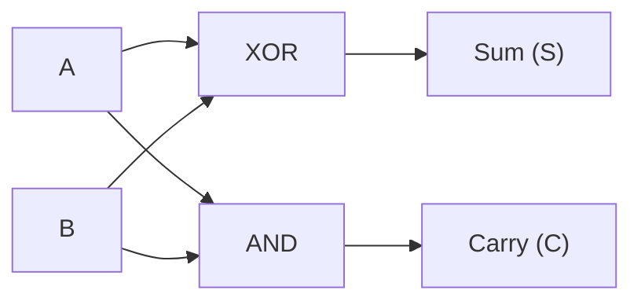
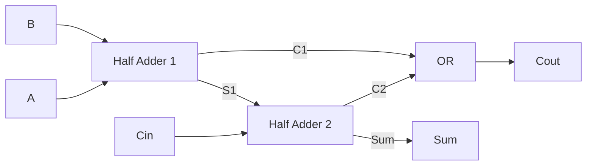
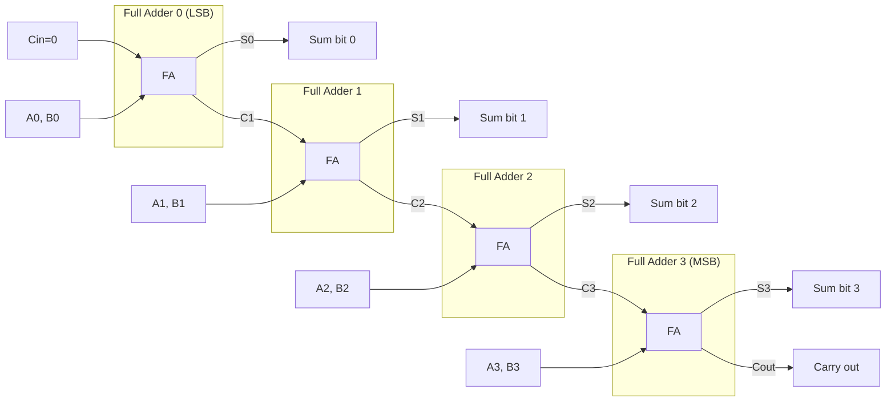

# Chapter 09: Combinational Circuits

> **"Combinational circuits have no memory — output depends only on current inputs. Yet from these simple building blocks emerge adders, multiplexers, decoders, and ultimately the ALU at the heart of every processor."**

---

## Table of Contents
1. [Half Adder](#1-half-adder)
2. [Full Adder](#2-full-adder)
3. [Multi-bit Adders](#3-multi-bit-adders)
4. [Subtractors](#4-subtractors)
5. [Multiplexers (MUX)](#5-multiplexers-mux)
6. [Demultiplexers (DEMUX)](#6-demultiplexers-demux)
7. [Encoders](#7-encoders)
8. [Decoders](#8-decoders)
9. [Comparators](#9-comparators)
10. [Arithmetic Logic Unit (ALU)](#10-arithmetic-logic-unit-alu)
11. [Shifters and Rotators](#11-shifters-and-rotators)
12. [Parity Generator/Checker](#12-parity-generatorchecker)
13. [Code Converters](#13-code-converters)
14. [Summary](#14-summary)

---

## 1. Half Adder

Adds two **1-bit** binary numbers.

**Inputs:** A, B
**Outputs:** Sum (S), Carry (C)

```
Truth Table:
A B | S C
0 0 | 0 0
0 1 | 1 0
1 0 | 1 0
1 1 | 0 1  ← 1+1 = 10₂ (sum=0, carry=1)

Boolean Expressions:
  Sum   = A ⊕ B   (XOR)
  Carry = A · B   (AND)
```

Logic Diagram:


Gate count: 1 XOR + 1 AND
Transistor count (CMOS): ~10 transistors

Application: LSB (least significant bit) addition in a multi-bit adder
Limitation: doesn't handle incoming carry — use Full Adder for multi-bit!

---

## 2. Full Adder

Adds **three 1-bit** numbers: A, B, and Carry-in (Cin).

**Inputs:** A, B, Cin
**Outputs:** Sum (S), Carry-out (Cout)

```
Truth Table:
A B Cin | S  Cout
0 0  0  | 0   0
0 0  1  | 1   0
0 1  0  | 1   0
0 1  1  | 0   1
1 0  0  | 1   0
1 0  1  | 0   1
1 1  0  | 0   1
1 1  1  | 1   1   ← 1+1+1 = 11₂ (sum=1, carry=1)

Boolean Expressions:
  Sum  = A ⊕ B ⊕ Cin
  Cout = A·B + B·Cin + A·Cin = A·B + Cin·(A ⊕ B)

Implementation using two Half Adders:
  HA1: Sum1 = A ⊕ B,     C1 = A·B
  HA2: Sum  = Sum1 ⊕ Cin, C2 = Sum1·Cin
  Cout = C1 + C2

Gate count: 2 XOR + 2 AND + 1 OR = 5 gates
```

Logic diagram:


---

## 3. Multi-bit Adders

### Ripple Carry Adder (RCA)

Chain N full adders to add N-bit numbers:



Properties:
  Simple to design
  Carry must ripple (propagate) from LSB to MSB
  Worst case delay: n × tFA  (n = number of bits, tFA = 1 full adder delay)
  For 32-bit: 32 × (2-gate delays each) ≈ 64 gate delays!

This carry propagation makes it SLOW for large n.

### Carry Lookahead Adder (CLA)

**Key insight:** Can pre-compute carries without waiting for them to ripple!

**Define for each bit position i:**
```
Generate: Gi = Ai · Bi    (this bit position will ALWAYS generate a carry)
Propagate: Pi = Ai ⊕ Bi  (this bit position will PROPAGATE an incoming carry)

Then:
C0 = Cin
C1 = G0 + P0·C0
C2 = G1 + P1·C1 = G1 + P1·G0 + P1·P0·C0
C3 = G2 + P2·C2 = G2 + P2·G1 + P2·P1·G0 + P2·P1·P0·C0
C4 = G3 + P3·G2 + P3·P2·G1 + P3·P2·P1·G0 + P3·P2·P1·P0·C0

All carries computed SIMULTANEOUSLY in 2 gate delays!
Sum: Si = Pi ⊕ Ci

Total CLA delay: ~4 gate delays (vs 64 for 32-bit RCA!)
```

**Trade-off:** more gates (wider AND and OR gates for each carry)

### Carry Select Adder

**Strategy:** Compute two results simultaneously — one assuming Cin=0, one assuming Cin=1 — then select the correct one when Cin arrives.

```
For 16-bit: split into two 8-bit blocks
  Lower block: normal 8-bit adder, produces C8
  Upper block: compute TWO 8-bit sums:
    Sum_if_Cin=0 (C8=0 assumed)
    Sum_if_Cin=1 (C8=1 assumed)
  Then: MUX selects correct upper sum based on actual C8

Faster than CLA for very wide adders
```

### Prefix Adders (Kogge-Stone, Brent-Kung)

Used in modern CPUs for maximum speed:
- **Kogge-Stone:** minimum depth O(log n), regular structure, high fan-out
- **Brent-Kung:** minimum number of gates O(n), less regular
- **Han-Carlson:** hybrid, balance between the two
- Intel, AMD use variants of these in their 64-bit adders

---

## 4. Subtractors

### Using Two's Complement (Most Practical)

```
A - B = A + (-B) = A + B̄ + 1

Implementation: full adder with:
  - B inputs inverted (using XOR with Sub control bit)
  - Cin = 1 (the "+1" for two's complement)

Adder/Subtractor circuit:
  Sub=0: normal addition A+B
  Sub=1: subtraction A-B (B XOR'd with 1 = B', Cin=1)

XOR gates on B inputs:
  Bi XOR Sub:
    If Sub=0: output = Bi (normal)
    If Sub=1: output = Bi' (inverted)
```

### Overflow Detection

```
For N-bit two's complement addition:
  Overflow occurs when: carry into MSB ≠ carry out of MSB

Overflow flag: V = Cn ⊕ Cn-1
  (where Cn = carry out of MSB, Cn-1 = carry into MSB)

Examples (4-bit two's complement range: -8 to +7):
  7 + 1 = 8? But +8 overflows! → V=1 (result = -8 in 4-bit, WRONG)
  -1 + (-8) = -9? Overflows! → V=1
```

---

## 5. Multiplexers (MUX)

A multiplexer **selects one of N inputs** to pass to the output, based on select signals.

### 2:1 MUX

```
Inputs: I0, I1 (data), S (select)
Output: Y

Truth Table:
S | Y
0 | I0
1 | I1

Boolean: Y = S'·I0 + S·I1

Logic:
I0 ──[AND]──┐
     ↑S'    ├──[OR]── Y
I1 ──[AND]──┘
     ↑S
```

### 4:1 MUX

```
Inputs: I0, I1, I2, I3 (data), S1, S0 (select)
Output: Y

S1 S0 | Y
 0  0 | I0
 0  1 | I1
 1  0 | I2
 1  1 | I3

Boolean: Y = S1'S0'·I0 + S1'S0·I1 + S1S0'·I2 + S1S0·I3

IC: 74HC151 (8:1 MUX)
    74HC153 (dual 4:1 MUX)
    74HC157 (quad 2:1 MUX)
```

### MUX as Universal Logic Element

A MUX can implement **any Boolean function**!

**2^n :1 MUX** can implement any n-variable function:
- Connect function minterms to corresponding inputs (1 or 0)
- Select lines are the input variables

**With n-1 select lines:** use n-variable function by:
- Last variable connects to data inputs (not select)
- Evaluate function for each combination of (n-1) select variables, connect A or A' or 0 or 1

### MUX Applications
- Data routing (select which ADC channel to read)
- Time-division multiplexing (send multiple signals on one wire)
- Parallel-to-serial conversion
- Function generators (LUT in FPGAs are essentially giant MUXes!)

---

## 6. Demultiplexers (DEMUX)

A **demultiplexer routes one input to one of N outputs** based on select signals.

### 1:4 DEMUX

```
Input: D, Select: S1, S0
Outputs: Y0, Y1, Y2, Y3

S1 S0 | Y0  Y1  Y2  Y3
 0  0 | D   0   0   0
 0  1 | 0   D   0   0
 1  0 | 0   0   D   0
 1  1 | 0   0   0   D

Boolean:
  Y0 = D·S1'·S0'
  Y1 = D·S1'·S0
  Y2 = D·S1·S0'
  Y3 = D·S1·S0

Same circuit as a decoder when D=1 (enable input)!
```

**Applications:**
- Routing one signal to one of many outputs
- Serial-to-parallel conversion
- Address decoding (which memory chip to select)

---

## 7. Encoders

An encoder converts from a **larger number of inputs to fewer outputs** (encodes position).

### 4:2 Encoder (basic)

```
Assumes only ONE input is active at a time:

I3 I2 I1 I0 | A1 A0
 0  0  0  1 |  0  0   (I0 active → 00)
 0  0  1  0 |  0  1   (I1 active → 01)
 0  1  0  0 |  1  0   (I2 active → 10)
 1  0  0  0 |  1  1   (I3 active → 11)

Boolean:
  A0 = I1 + I3
  A1 = I2 + I3

Problem: what if multiple inputs active? → Priority Encoder!
```

### Priority Encoder

Handles multiple simultaneous active inputs by giving **priority** to higher-numbered inputs.

```
8:3 Priority Encoder (74HC148):

I7  I6  I5  I4  I3  I2  I1  I0 | A2 A1 A0 | Valid
 1   x   x   x   x   x   x   x |  1  1  1 |  1
 0   1   x   x   x   x   x   x |  1  1  0 |  1
 0   0   1   x   x   x   x   x |  1  0  1 |  1
 0   0   0   1   x   x   x   x |  1  0  0 |  1
 0   0   0   0   1   x   x   x |  0  1  1 |  1
 0   0   0   0   0   1   x   x |  0  1  0 |  1
 0   0   0   0   0   0   1   x |  0  0  1 |  1
 0   0   0   0   0   0   0   1 |  0  0  0 |  1
 0   0   0   0   0   0   0   0 |  x  x  x |  0   (no input)

I7 has highest priority, I0 lowest
'x' means don't care (ignored)
```

**Applications:**
- Keyboard encoding (many keys → binary code)
- Interrupt priority encoder (in microcontrollers and CPUs)
- Analog-to-digital converters (flash ADC)

---

## 8. Decoders

A decoder converts from **fewer inputs to a larger number of outputs** — activates exactly one output.

### 2:4 Decoder

```
Inputs: A1, A0
Outputs: Y0, Y1, Y2, Y3

A1 A0 | Y0 Y1 Y2 Y3
 0  0 |  1  0  0  0
 0  1 |  0  1  0  0
 1  0 |  0  0  1  0
 1  1 |  0  0  0  1

Boolean:
  Y0 = A1'·A0'  (minterm 0)
  Y1 = A1'·A0   (minterm 1)
  Y2 = A1·A0'   (minterm 2)
  Y3 = A1·A0    (minterm 3)

This generates ALL POSSIBLE MINTERMS for 2 variables!
```

### 3:8 Decoder

```
3 inputs → 8 outputs (one per minterm)

Enable input: if Enable=0, all outputs disabled (useful for expanding)

IC: 74HC138 (3-to-8 decoder with active-low outputs and 3 enables)
    74HC139 (dual 2-to-4 decoder)
    74HC154 (4-to-16 decoder)
```

### Decoder as Minterm Generator

```
For any n-input decoder:
  Each output is one minterm of n variables
  To implement any Boolean function:
    Take OR of outputs corresponding to function's minterms

Example: F = Σm(1,3,5) = m1+m3+m5
  Connect outputs Y1, Y3, Y5 to OR gate → F!

This is how ROM (Read Only Memory) implements any function!
```

### BCD to 7-Segment Decoder

Converts BCD (0-9) to signals for 7-segment display:

```
7-segment display segments:
      _
     |_|   segments a-g:
     |_|

     a
    ___
   |   |
  f|   |b
   |___|
   |   |
  e|   |c
   |___|
      d

    (g = middle horizontal)

Decimal | BCD  | a b c d e f g
   0    | 0000 | 1 1 1 1 1 1 0
   1    | 0001 | 0 1 1 0 0 0 0
   2    | 0010 | 1 1 0 1 1 0 1
   3    | 0011 | 1 1 1 1 0 0 1
   4    | 0100 | 0 1 1 0 0 1 1
   5    | 0101 | 1 0 1 1 0 1 1
   6    | 0110 | 1 0 1 1 1 1 1
   7    | 0111 | 1 1 1 0 0 0 0
   8    | 1000 | 1 1 1 1 1 1 1
   9    | 1001 | 1 1 1 1 0 1 1

IC: 74HC4511 (BCD to 7-segment, active-high outputs, with latch and blanking)
    CD4511 (CMOS, similar)
```

---

## 9. Comparators

**Comparators** determine the relationship between two binary numbers: A > B, A = B, or A < B.

### 1-bit Comparator

```
A B | A>B A=B A<B
0 0 |  0   1   0
0 1 |  0   0   1
1 0 |  1   0   0
1 1 |  0   1   0

Boolean:
  A=B: (XNOR gate) = A'B' + AB
  A>B: AB'
  A<B: A'B
```

### 4-bit Magnitude Comparator

```
Compare two 4-bit numbers A3A2A1A0 and B3B2B1B0

Algorithm:
  Check from MSB: if A3>B3, then A>B regardless of lower bits
  If A3=B3, check A2 vs B2
  Continue down to LSB
  If all equal, check cascade inputs from less significant comparator

IC: 74HC85 (4-bit magnitude comparator)
    Has 3 outputs: A>B, A=B, A<B
    Plus 3 cascade inputs (for expanding to larger comparators)

Cascade: Two 74HC85 in series:
  Lower nibble connects IA>B, IA=B, IA<B to cascade inputs of upper nibble comparator
  Upper nibble's outputs are the final result
```

---

## 10. Arithmetic Logic Unit (ALU)

The **ALU** is the computational heart of every CPU — performs arithmetic and logic operations.

### What an ALU Does

```
Operation select bits (M, S3, S2, S1, S0) → which operation to perform

Arithmetic operations (M=0):
  F = A + 0     (just A)
  F = A + B
  F = A - B - 1 (subtract with borrow)
  F = A - B
  etc.

Logic operations (M=1):
  F = A'        (NOT)
  F = A AND B
  F = A OR B
  F = A XOR B
  etc.

Plus: Zero flag, Carry flag, Sign flag, Overflow flag
```

### 4-bit ALU — 74LS181

Famous IC! Contains:
- 4-bit ALU with 16 arithmetic AND 16 logic operations
- Carry lookahead generate (G) and propagate (P) outputs for cascading
- 4 select inputs (S0-S3) + mode input M
- 4 data inputs A3-A0, B3-B0
- 4 result outputs F3-F0
- Cn, Cn+4 (carry in, carry out)

```
Cascading: 74LS181 + 74LS182 (carry lookahead unit) → 16-bit ALU
Four 74LS181 for 16-bit: chain carry or use carry lookahead
```

### Modern CPU ALU

Modern 64-bit ALUs:
- Can add, subtract, AND, OR, XOR, NOT, shift (many types)
- Typically pipelined (multiple operations in flight)
- Separate integer ALU, floating-point unit (FPU), vector units (SIMD)
- Multiple ALUs working in parallel (superscalar)
- Apple M4: 6 integer ALUs, 4 FPUs, many SIMD units per core

---

## 11. Shifters and Rotators

### Logical Shift Left (LSL)

```
Before: [b7 b6 b5 b4 b3 b2 b1 b0]
After:  [b6 b5 b4 b3 b2 b1 b0  0]

LSB filled with 0, MSB shifted into carry flag
Equivalent to: multiply by 2 (fast!)

Assembly: LSL A,1 (shift left by 1)
```

### Logical Shift Right (LSR)

```
Before: [b7 b6 b5 b4 b3 b2 b1 b0]
After:  [ 0 b7 b6 b5 b4 b3 b2 b1]

MSB filled with 0, LSB shifted into carry
Equivalent to: unsigned divide by 2
```

### Arithmetic Shift Right (ASR)

```
Before: [b7 b6 b5 b4 b3 b2 b1 b0]
After:  [b7 b7 b6 b5 b4 b3 b2 b1]  ← MSB copied (sign extension!)

Keeps sign bit intact
Equivalent to: SIGNED divide by 2 (preserves negative number sign)
```

### Rotate Left/Right

```
Rotate Left (ROL):
  Before: [b7 b6 b5 b4 b3 b2 b1 b0]
  After:  [b6 b5 b4 b3 b2 b1 b0 b7]  ← MSB wraps around to LSB

Rotate Right (ROR):
  After:  [b0 b7 b6 b5 b4 b3 b2 b1]  ← LSB wraps around to MSB
```

### Barrel Shifter

Shifts by **arbitrary amount in a single clock cycle** — used in CPUs.

```
8-bit barrel shifter (shift by S bits):

8:1 MUX for each output bit
  - 8 inputs to each MUX = 8 possible source positions
  - Select lines = shift amount
  - All MUXes compute simultaneously

Delay: O(log n) using a tree of 2:1 MUXes
  4-bit shift: log2(4) = 2 levels of MUXes

Used in: vector arithmetic, cryptography, fast multiply
```

---

## 12. Parity Generator/Checker

**Parity** adds an extra bit to detect single-bit errors.

### Even Parity

```
Set parity bit so total number of 1s in data+parity is EVEN

Data: 1010 110 (7 bits, three 1s → odd)
Even parity bit = 1 (makes total four 1s = even)
Transmitted: 1010 1101

At receiver:
  Count 1s in received byte including parity bit
  If even count → no error detected
  If odd count → error in transmission!

Boolean: Parity = b0 ⊕ b1 ⊕ b2 ⊕ b3 ⊕ b4 ⊕ b5 ⊕ b6
  (XOR of all bits: result is 1 if odd number of 1s)

Circuit: tree of XOR gates
```

### Limitations

- Detects single-bit errors (and any ODD number of bit errors)
- Cannot LOCATE which bit is wrong (only detects)
- Cannot detect EVEN number of bit errors (cancel out)
- For better protection: use Hamming code (can correct 1 bit) or CRC (cyclic redundancy check)

### CRC (Cyclic Redundancy Check)

- More powerful error detection (polynomial division)
- Used in: Ethernet frames (CRC-32), USB, disk storage, ZIP files
- Can detect all burst errors up to CRC length
- Hardware implementation uses LFSR (Linear Feedback Shift Register) — very fast!

---

## 13. Code Converters

### Binary to Gray Code

```
Rule: G[n] = B[n] ⊕ B[n+1]  (XOR adjacent binary bits)
G[MSB] = B[MSB] (MSB same)

Example: 1011₂ to Gray:
  B = 1  0  1  1
  G[3] = B[3] = 1
  G[2] = B[3] ⊕ B[2] = 1 ⊕ 0 = 1
  G[1] = B[2] ⊕ B[1] = 0 ⊕ 1 = 1
  G[0] = B[1] ⊕ B[0] = 1 ⊕ 1 = 0
  Gray = 1 1 1 0

Implementation: 3 XOR gates for 4-bit converter
```

### Gray to Binary

```
Rule: B[MSB] = G[MSB]
      B[n] = B[n+1] ⊕ G[n]

Or: B[n] = G[MSB] ⊕ G[MSB-1] ⊕ ... ⊕ G[n]  (XOR from MSB down)
```

### BCD to Excess-3

```
Add 3 to each BCD digit:
  BCD 0 (0000) → Excess-3: 3 (0011)
  BCD 5 (0101) → Excess-3: 8 (1000)
  BCD 9 (1001) → Excess-3: 12 (1100)

Self-complementing code: 9's complement obtained by inverting all bits!
Used in BCD arithmetic
```

---

## 14. Summary

```
COMBINATIONAL CIRCUITS — KEY BUILDING BLOCKS
═════════════════════════════════════════════

Adders:
  Half Adder: S=A⊕B, C=AB (2 gates)
  Full Adder: S=A⊕B⊕Cin, Cout=AB+Cin(A⊕B) (5 gates)
  Ripple Carry: chain of FA, slow O(n)
  Carry Lookahead: fast O(log n), uses G and P signals

Selector/Router:
  MUX (4:1): select 1-of-4 inputs using 2 select lines
  DEMUX (1:4): route 1 input to 1-of-4 outputs
  MUX = universal logic element (can implement any function)

Encoding/Decoding:
  Encoder: N inputs → log₂N outputs (priority encoder handles simultaneous)
  Decoder: log₂N inputs → N outputs (generates all minterms)
  BCD to 7-seg: 4 inputs → 7 outputs for display

Arithmetic:
  Comparator: A>B, A=B, A<B outputs
  ALU: arithmetic + logic with operation select
  Barrel shifter: shift by any amount in 1 cycle

Error detection:
  Parity: XOR of all bits, detects odd-bit errors
  CRC: polynomial division, detects burst errors

Key ICs:
  74HC00: NAND gates (universal)
  74HC86: XOR gates (parity, adders)
  74HC138: 3:8 decoder (address decode)
  74HC151: 8:1 MUX
  74HC85: 4-bit comparator
  74HC4511: BCD to 7-segment
```

---

**← Previous:** [Chapter 08: Logic Gates and Boolean Algebra](./08-logic-gates-and-boolean-algebra.md)
**→ Next:** [Chapter 10: Sequential Circuits and Memory Elements](./10-sequential-circuits-and-memory.md)
