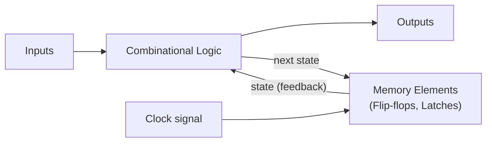
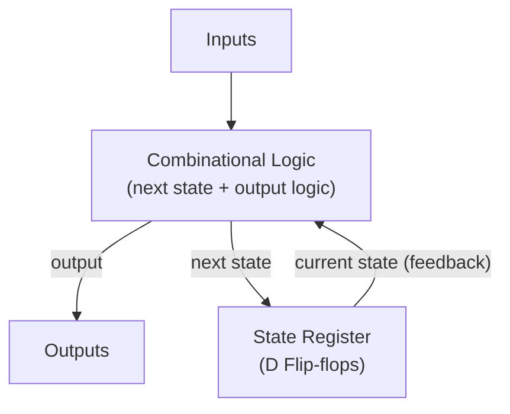

# Chapter 10: Sequential Circuits and Memory Elements

> **"Sequential circuits have memory — output depends not only on current inputs but on past history. Flip-flops, registers, and counters built from these principles form the basis of all digital memory and state machines."**

---

## Table of Contents
1. [Sequential Circuit Basics](#1-sequential-circuit-basics)
2. [Latches (Level-Sensitive)](#2-latches-level-sensitive)
3. [Flip-Flops (Edge-Triggered)](#3-flip-flops-edge-triggered)
4. [Registers](#4-registers)
5. [Shift Registers](#5-shift-registers)
6. [Counters](#6-counters)
7. [State Machines (FSM)](#7-state-machines-fsm)
8. [SRAM and DRAM Basics](#8-sram-and-dram-basics)
9. [Timing Considerations](#9-timing-considerations)
10. [Summary](#10-summary)

---

## 1. Sequential Circuit Basics

### What Makes Sequential Circuits Different

**Combinational circuit:** Output = f(current inputs only)
**Sequential circuit:** Output = f(current inputs + PAST HISTORY/STATE)



The **clock signal** synchronizes when state updates occur.

### Clock Signal

```
      ┌────┐    ┌────┐    ┌────┐
      │    │    │    │    │    │
 ─────┘    └────┘    └────┘    └────

Period T = 1/f
Rising edge (↑) → triggers edge-triggered devices
Falling edge (↓) → can also trigger
Duty cycle = Thigh/T × 100% (often 50%)

Clock frequency examples:
  Arduino (ATmega328P): 16 MHz → T = 62.5ns
  STM32F4: up to 180 MHz → T = 5.6ns
  Apple M4: up to ~4 GHz → T = 0.25ns
  Intel Core i9-14900K turbo: 6 GHz → T = 0.17ns
```

### Types of Sequential Circuits

**Synchronous:** All state changes happen on clock edge. Easier to design and analyze. Almost all modern digital circuits use this.

**Asynchronous:** State changes happen immediately when inputs change (no clock, or free-running). Faster response but harder to design (glitches, timing issues).

---

## 2. Latches (Level-Sensitive)

Latches are **level-sensitive** — they're transparent while the enable/clock is at a certain level.

### SR Latch (NOR-based)

```
R ──┬──|NOR|──┬── Q
    │          │
    └──|NOR|──┘
    │          └── Q'
S ──┘

Truth Table:
S R | Q(next) | Note
0 0 | Q(current) | Hold (remembers previous state)
0 1 | 0       | Reset
1 0 | 1       | Set
1 1 | INVALID | Both outputs HIGH — forbidden state!

Cross-coupled NOR gates:
  If Q=1: top NOR sees Q'=0 → can hold
  If Q=0: bottom NOR sees Q=0 → holds
  Self-sustaining — memory!
```

### SR Latch (NAND-based, Active-Low)

```
S' ──┬──|NAND|──┬── Q
     │           │
     └──|NAND|──┘
     │           └── Q'
R' ──┘

Note: Inputs are ACTIVE LOW (0 = active, 1 = no change)
S'=0,R'=1: Set (Q=1)
S'=1,R'=0: Reset (Q=0)
S'=1,R'=1: Hold
S'=0,R'=0: INVALID (both Q=Q'=1 momentarily)
```

### Gated SR Latch

```
S ──[AND]──► SR latch (NOR type)
     ↑ En (Enable)

R ──[AND]──►

When En=0: AND gates block → latch holds state regardless of S,R
When En=1: latch responds to S,R normally
```

### D Latch (Transparent Latch)

The most useful latch — eliminates the invalid state.

```
D ──┬──────────────────► SR (S input)
    │
    └──[NOT]──────────► SR (R input)
                 Enable

When Enable=0: Q holds (transparent gate closed)
When Enable=1: Q = D immediately (transparent — output follows input)

Truth Table:
En D | Q(next)
 0  x | Q (hold)
 1  0 | 0
 1  1 | 1

Used as: address/data latch in buses, 74HC373 (8 D-latches)
```

---

## 3. Flip-Flops (Edge-Triggered)

Flip-flops sample input **only on clock edge** (rising or falling), then hold the output until the next edge. Much more controllable than latches!

### D Flip-Flop — The Most Important

**Q changes only on the rising clock edge, capturing the value of D at that instant.**

```
Circuit symbol:
      ┌─────┐
D ───►│     │
      │  D  ├──► Q
CLK ─►│     ├──► Q'
      │  FF │
      └─────┘
  ↑ = edge-triggered (triangle symbol on CLK input)

Timing diagram:
CLK: ─┐ ┌─┐ ┌─┐ ┌─┐ ┌─
      └─┘ └─┘ └─┘ └─┘
D:   ──────┐     ┌─────
           └─────┘
Q:   ──────────┐  ┌────  ← Q changes only on rising CLK edge
               └──┘

Q(next) = D  (captured at rising edge)

Applications:
  Registers (N D-FFs in parallel to store N-bit value)
  Shift registers
  Pipeline registers (in CPUs)
  Debouncing (sample switch input with slow clock)

IC: 74HC74 (dual D-flip-flop with Set and Reset)
    74HC374 (8 D flip-flops, 3-state output)
    74HC273 (8 D flip-flops)
```

### JK Flip-Flop

Solves the invalid state problem of SR flip-flop:

```
Truth Table:
J K CLK | Q(next) | Description
0 0  ↑  | Q       | Hold (no change)
0 1  ↑  | 0       | Reset
1 0  ↑  | 1       | Set
1 1  ↑  | Q'      | Toggle (flip!)  ← The new case!

Characteristic equation:
  Q(next) = J·Q' + K'·Q

When J=K=1: Q(next) = Q' → toggles on every clock edge!

IC: 74HC76 (dual JK with preset and clear)
    74HC73 (dual JK)

Application: Divide-by-2 circuit (J=K=1, output frequency = half input)
```

### T Flip-Flop (Toggle)

```
T CLK | Q(next)
0  ↑  | Q       (hold)
1  ↑  | Q'      (toggle)

Characteristic equation: Q(next) = T ⊕ Q

Made from JK: connect J=K=T
Or from D: connect D = T ⊕ Q

Applications:
  Counters (each FF divides frequency by 2)
  Divide-by-2 (connect T=1 always)
```

### Asynchronous Preset and Clear

Most flip-flops have **asynchronous** (immediate, clock-independent) inputs:
- **Preset (PRE):** immediately forces Q=1 regardless of clock
- **Clear/Reset (CLR):** immediately forces Q=0

```
Usage: reset all FFs to known state on power-up
  Many FFs have active-low PRE and CLR
  Connect CLR to a power-on reset circuit (RC delay on reset pin)
```

---

## 4. Registers

A **register** is a collection of flip-flops that stores a multi-bit value.

### Parallel Register (N-bit Register)

```
N D flip-flops sharing a common clock:

D7 D6 D5 D4 D3 D2 D1 D0 (data inputs)
│  │  │  │  │  │  │  │
[D7FF][D6FF][D5FF]...[D0FF]  ← 8 D flip-flops
│  │  │  │  │  │  │  │
Q7 Q6 Q5 Q4 Q3 Q2 Q1 Q0 (data outputs)
              ↑
           CLK (common to all)

Load: on CLK rising edge, all D inputs captured simultaneously
Hold: CLK low → output stable

Control: Add a load enable:
  If LOAD=1: D input goes to FF
  If LOAD=0: Q output feeds back to D input (hold forever)

IC: 74HC374 (8-bit D register, 3-state output bus driver)
    74HC377 (8-bit D register with enable, positive edge triggered)
```

---

## 5. Shift Registers

Shift registers move data one position on each clock edge.

### SISO (Serial In, Serial Out)

```
Data ──► [D FF]──► [D FF]──► [D FF]──► [D FF] ──► Serial Out
               CLK    CLK      CLK      CLK
         (4-bit SISO — 4 clock cycles to shift data through)

Used for: delay lines, serial communication
```

### SIPO (Serial In, Parallel Out) — Very Common!

```
Data ──► [D FF]──► [D FF]──► [D FF]──► [D FF]
               CLK    CLK      CLK      CLK
                │         │         │         │
               Q0        Q1        Q2        Q3
               (4 parallel outputs available after 4 clocks)

Converts: serial data → parallel data (deserializer)
Used in: receive side of serial communication, expanding GPIO
```

### PISO (Parallel In, Serial Out)

```
D3 D2 D1 D0  ← parallel inputs
↓  ↓  ↓  ↓
[FF]──►[FF]──►[FF]──►[FF]──► Serial Out

Converts: parallel data → serial data (serializer)
Used in: transmit side of serial communication, reading many sensors
```

### 74HC595 — 8-bit SIPO Shift Register

**Most widely used shift register in hobbyist electronics:**

```
Pins:
  SER (data in)      → serial data input
  SRCLK (shift clock) → clocks data into shift register
  RCLK (latch clock)  → latches shift register to output
  OE' (output enable) → enables/disables outputs (active low)
  SRCLR' (clear)      → clears shift register (active low)
  Qa-Qh              → 8 parallel outputs
  Qh' (serial out)   → chain to next 595

Usage: Control 8 LEDs/relays with only 3 microcontroller pins!
       Chain multiple 595s for more outputs

Arduino code:
  digitalWrite(latchPin, LOW);
  shiftOut(dataPin, clockPin, MSBFIRST, dataValue);
  digitalWrite(latchPin, HIGH);
```

### 74HC165 — 8-bit PISO Shift Register

```
Reads 8 parallel inputs, shifts out serially
Used to: read multiple switches/sensors with 3 microcontroller pins
```

### Ring Counter

```
4-bit ring counter:
Q3 Q2 Q1 Q0:  1000 → 0100 → 0010 → 0001 → 1000 (cycles)

Built: SIPO with Qn fed back to serial input
       Start: set Q0=1, rest=0

Creates: rotating single-bit pattern (useful for phased timing)
```

### Johnson Counter

```
4-bit Johnson counter sequence:
0000 → 1000 → 1100 → 1110 → 1111 → 0111 → 0011 → 0001 → 0000

Built: Q' of last FF fed back to serial input
Generates: 2N states for N flip-flops (vs N for ring counter)
Each output pair has 50% duty cycle with different phase
Used for: quadrature signals, phase relationships
```

---

## 6. Counters

### Asynchronous (Ripple) Counter

```
3-bit ripple binary counter:

CLK──►[T FF1]──►[T FF2]──►[T FF3]
          Q0         Q1         Q2

Each FF's Q drives the next FF's clock
T=1 always → each FF toggles when its clock goes HIGH→LOW (falling edge)

Count sequence (Q2 Q1 Q0):
000 → 001 → 010 → 011 → 100 → 101 → 110 → 111 → 000

Timing:
  Q0: toggles every clock period
  Q1: toggles every 2 clock periods (divides by 2)
  Q2: toggles every 4 clock periods (divides by 4)

Overall: divides CLK by 8 (2³)

Problem: "ripple" delay — Q0 change must ripple to Q1 to Q2
  This causes brief glitches during transitions (e.g., 011→100: Q2 delays)
  Not safe to use as address counter where glitches matter
  But fine for frequency division
```

### Synchronous Binary Counter

All FFs share the same clock — no ripple delay!

```
4-bit synchronous up counter:

CLK ─────────────────────────────────────►
       ↓    ↓    ↓    ↓
     [FF0][FF1][FF2][FF3]

Logic for each FF:
  T0 = 1              (always toggles)
  T1 = Q0             (toggles when Q0=1)
  T2 = Q0·Q1          (toggles when Q0=Q1=1)
  T3 = Q0·Q1·Q2       (toggles when Q0=Q1=Q2=1)

Count sequence: 0000, 0001, 0010, ..., 1111, 0000 (modulo 16)

IC: 74HC163 (4-bit synchronous binary counter with synchronous clear)
    74HC161 (asynchronous clear version)
    74HC169 (up/down counter)
```

### BCD Counter (Decade Counter)

```
Counts 0-9, then resets to 0:

Count sequence: 0,1,2,3,4,5,6,7,8,9,0,1,...

Implementation: 4-bit counter + reset logic
  When count = 10 (1010): detect and force reset to 0
  Detection: Q3·Q1 = 1 (bits 3 and 1 set = decimal 10)
  Use this to asynchronously clear the counter

IC: 74HC160 (BCD counter, synchronous clear)
    74HC190 (BCD up/down counter)
```

### Modulo-N Counter

Count from 0 to N-1, then reset:

```
Example: Divide-by-6 counter
  Normal binary count: 0-7
  Add logic: detect state 6 (110), reset to 0
  Sequence: 0,1,2,3,4,5,0,1,... (divides clock by 6)

Use case: Generate 1Hz from 6MHz crystal:
  6MHz ÷ 6 = 1MHz ÷ 1000 ÷ 1000 = 1Hz (need multiple stages)
```

### Up/Down Counter

```
74HC191 (4-bit synchronous up/down counter):
  UP/DOWN' pin: 1 = count up, 0 = count down

Applications:
  Motor position tracking
  Stepper motor step counting
  Ramp generators
```

---

## 7. State Machines (FSM)

A **Finite State Machine** models a system with a finite number of states, transitions between states, and outputs.

### Mealy Machine

Output depends on: CURRENT STATE + CURRENT INPUT



### Moore Machine

Output depends on: CURRENT STATE ONLY (more predictable, safer for outputs)

```
State diagram example (Moore):

         A=0/Out=0   A=1/Out=0
    ┌──────────┐ ────────► ┌──────────┐
    │  State 0 │           │  State 1 │
    │  Out=0   │◄────────  │  Out=0   │
    └──────────┘  A=0      └──────────┘
         │ A=1                   │ A=1
         ▼                       ▼
    ┌──────────┐           ┌──────────┐
    │  State 3 │ ◄──────── │  State 2 │
    │  Out=1   │  A=0      │  Out=0   │
    └──────────┘           └──────────┘
          │ A=0
          └──► (stays in State 3 when A=0)
```

### FSM Design Procedure

1. **Word description** → state diagram
2. **State encoding** (binary assignment to each state)
3. **State table** (current state + input → next state + output)
4. **Flip-flop type** selection (D, JK, T)
5. **Derive excitation equations** (what to put into each FF input)
6. **Derive output equations**
7. **Logic minimization** (K-maps)
8. **Implement with gates + FFs**

### FSM Example: Sequence Detector

Detect the sequence "1011" in a serial bit stream:

```
States: S0 (initial), S1 (seen 1), S2 (seen 10), S3 (seen 101), output when see final 1

State transitions:
  S0 + input=1 → S1 (first 1 of sequence)
  S0 + input=0 → S0 (no progress)
  S1 + input=0 → S2 (have "10")
  S1 + input=1 → S1 (have another 1, might be start of new)
  S2 + input=1 → S3 (have "101")
  S2 + input=0 → S0 (broke sequence)
  S3 + input=1 → S1 (MATCH! Output=1; start over from S1 for overlap)
  S3 + input=0 → S2 (broken, but "10" might start another)

Output: 1 only in S3 + input=1 (Mealy) or add S4 output state (Moore)
```

### Applications of State Machines

- **Communication protocols:** UART state machine, I2C start/stop detection
- **Traffic lights:** Moore machine with timing
- **Vending machines:** dispense on correct coin combination
- **Game logic:** NPCs, game states
- **CPU instruction decode:** state machine interprets multi-cycle instructions
- **Regular expression matching:** each state = partial match of pattern

---

## 8. SRAM and DRAM Basics

### SRAM Cell (6T — Six Transistor)

```
         Word Line (WL) — enables access
              │
    BL ──────►[NM1]──┬──[NM2]►── BL'
             │       │       │
            [PM1]   │       [PM2]
             │       │       │
           VDD      │      VDD
                     │
               Node A (Q)
                     │
               Node B (Q')

Two cross-coupled CMOS inverters (PM1-NM3, PM2-NM4) hold the bit
NM1 and NM2 are access transistors controlled by Word Line

Read: WL=1 → access transistors on → BL differentially driven by Q,Q'
Write: WL=1, drive BL/BL' strongly → force node values
Hold: WL=0 → isolated, inverter pair holds state indefinitely (as long as VDD present)

Total: 6 transistors per bit
Area per cell: ~140F² at minimum (F = technology feature size)
Speed: 0.5-5ns access
Power: ~0.1mW/MB standby (leakage), more during access
```

### DRAM Cell (1T1C — One Transistor, One Capacitor)

```
         Word Line
              │
    BL ───►[NMOS]───► Storage capacitor ──► Plate (fixed voltage)

Single transistor + small capacitor
Capacitor charges to VDD (=1) or 0V (=0)

Read:
  Precharge BL to VDD/2
  Assert WL → charge sharing between cap and BL
  Sense amplifier detects tiny ΔV (a few mV!)
  Amplifies to full digital level

Refresh:
  Capacitor leaks (charge dissipates in ~64ms)
  Must refresh each row by reading and rewriting
  Refresh: 8192 rows every 64ms (auto-managed by DRAM controller)

Area per cell: ~6F² (much smaller than SRAM!)
Speed: ~60-100ns random access (but faster burst mode)
```

---

## 9. Timing Considerations

### Setup and Hold Times

**Critical timing parameters for flip-flops:**

```
             setup time                hold time
             ←──────→                 ←──────→
D: ──────────[stable]─────────────────[stable]──────
             ↑
           CLK edge

Setup time (tsu): D must be STABLE this long BEFORE clock edge
Hold time (th):   D must be STABLE this long AFTER clock edge

Violation:
  If D changes within setup or hold window → METASTABILITY!
  FF enters indeterminate state (neither 0 nor 1, or oscillates)
  Eventually resolves, but takes random time → potential data corruption
```

### Metastability

When setup or hold time violated:
1. FF output may be an intermediate voltage
2. May take many nanoseconds to resolve
3. Can propagate incorrect data

**Solutions:**
- Synchronizer circuits (double or triple flip-flop chain)
- Use proper clock domain crossing circuits
- Keep clock rates within guaranteed timing specs

### Propagation Delay (tpd)

```
Time from clock edge to output change:
  tpHL: clock to Q going HIGH to LOW
  tpLH: clock to Q going LOW to HIGH
  tpd = max(tpHL, tpLH)

Limits maximum clock frequency:
  Maximum frequency = 1/(tpd + tsetup + tskew + tmargin)

For 74HC74: tpd ≈ 15ns → max ~50MHz theoretical
For high-speed FFs: tpd < 100ps → >10GHz possible
```

---

## 10. Summary

```
SEQUENTIAL CIRCUITS SUMMARY
════════════════════════════

Latches (level-sensitive):
  SR Latch: S=Set, R=Reset, S=R=1 FORBIDDEN
  D Latch: Q=D when Enable=1, holds when Enable=0

Flip-Flops (edge-triggered, CLK = ↑ or ↓):
  D FF: Q(next)=D at clock edge — most used
  JK FF: J=1,K=1 → Toggle; J=0,K=0 → Hold
  T FF: T=1 → Toggle; T=0 → Hold (good for counters)

Registers:
  Parallel: N D-FFs, load all bits simultaneously
  Shift: SIPO, PISO, SISO, PIPO
  74HC595: 8-bit SIPO, expand GPIO with 3 pins

Counters:
  Ripple (async): simple, has glitches, good for frequency division
  Synchronous: all FFs clocked together, no glitches
  BCD: counts 0-9
  Modulo-N: counts 0 to N-1

FSM:
  Mealy: output = f(state, input)
  Moore: output = f(state) only
  Design: state diagram → encoding → excitation → gates

Memory:
  SRAM: 6T cell, fast (0.5-5ns), no refresh, used for cache
  DRAM: 1T1C, slower (~100ns), must refresh, used for main RAM

Timing:
  Setup time: data must be stable BEFORE clock edge
  Hold time: data must be stable AFTER clock edge
  Violation → metastability (dangerous!)
```

---

**← Previous:** [Chapter 09: Combinational Circuits](./09-combinational-circuits.md)
**→ Next:** [Chapter 11: Semiconductor Fabrication and Moore's Law](./11-semiconductor-fabrication-and-moores-law.md)
