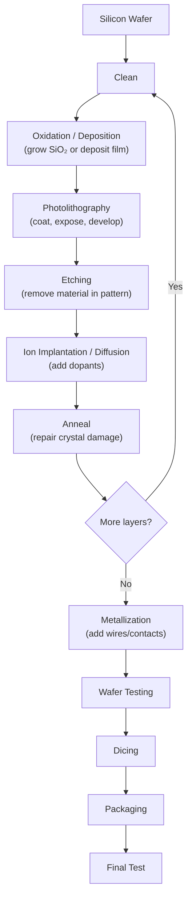

# Chapter 11: Semiconductor Fabrication and Moore's Law

> **"Making a computer chip is the most complex manufacturing process humanity has ever devised. Starting from sand and ending with a chip containing billions of transistors — each one smaller than a virus — is a modern miracle."**

---

## Table of Contents
1. [Moore's Law — History and Impact](#1-moores-law--history-and-impact)
2. [Silicon Purification and Wafer Production](#2-silicon-purification-and-wafer-production)
3. [Chip Fabrication — Step by Step](#3-chip-fabrication--step-by-step)
4. [Photolithography in Detail](#4-photolithography-in-detail)
5. [Doping and Diffusion](#5-doping-and-diffusion)
6. [Thin Film Deposition](#6-thin-film-deposition)
7. [Metal Interconnects (BEOL)](#7-metal-interconnects-beol)
8. [Testing, Dicing, and Packaging](#8-testing-dicing-and-packaging)
9. [Key Equipment and Companies](#9-key-equipment-and-companies)
10. [Process Nodes Explained](#10-process-nodes-explained)
11. [Business Models in Semiconductor Industry](#11-business-models-in-semiconductor-industry)
12. [Future of Semiconductor Scaling](#12-future-of-semiconductor-scaling)
13. [Summary](#13-summary)

---

## 1. Moore's Law — History and Impact

### Origin

**Gordon Moore** co-founder of Intel (and Fairchild Semiconductor before that) made an observation in 1965 in a paper titled "Cramming More Components onto Integrated Circuits":

> *"The complexity for minimum component costs has increased at a rate of roughly a factor of two per year. Certainly over the short term this rate can be expected to continue, if not to increase."*

In 1975, he revised it to **doubling every two years**.

This became known as **Moore's Law** — not a physical law but an observation and self-fulfilling prophecy.

### Transistor Count Timeline

| Year | Chip | Transistors | Process Node |
|------|------|-------------|--------------|
| 1971 | Intel 4004 | 2,300 | 10μm |
| 1974 | Intel 8080 | 6,000 | 6μm |
| 1978 | Intel 8086 | 29,000 | 3μm |
| 1982 | Intel 286 | 134,000 | 1.5μm |
| 1985 | Intel 386 | 275,000 | 1μm |
| 1989 | Intel 486 | 1,200,000 | 1μm |
| 1993 | Pentium | 3,100,000 | 800nm |
| 1997 | Pentium II | 7,500,000 | 350nm |
| 1999 | Pentium III | 9,500,000 | 250nm |
| 2000 | Pentium 4 | 42,000,000 | 180nm |
| 2006 | Core 2 Duo | 291,000,000 | 65nm |
| 2008 | Core i7 (Nehalem) | 731,000,000 | 45nm |
| 2012 | Core i7 (Ivy Bridge) | 1,400,000,000 | 22nm (FinFET!) |
| 2017 | Apple A11 | 4,300,000,000 | 10nm |
| 2019 | Apple A13 | 8,500,000,000 | 7nm |
| 2020 | Apple M1 | 16,000,000,000 | 5nm (TSMC) |
| 2022 | Apple M2 | 20,000,000,000 | 5nm (2nd gen) |
| 2023 | Apple M3 | 25,000,000,000 | 3nm |
| 2023 | Nvidia H100 | 80,000,000,000 | 4nm |
| 2024 | Apple M4 | 28,000,000,000 | 3nm (2nd gen) |
| 2024 | AMD EPYC Turin | 153,000,000,000 | 3nm (many chiplets) |

### Impact of Moore's Law

1. **Computing power:** same transistor count → 2× faster (historically)
2. **Cost:** same function → 50% cheaper every 2 years
3. **Memory:** DRAM capacity quadrupled every 3 years
4. **Storage:** hard drive capacity grew even faster
5. **Smartphones:** iPhone 1 (2007) had 620MHz CPU; iPhone 16 has 4+ GHz, 6× faster
6. **Enabled entire industries:** cloud computing, AI, GPS, internet of things

### Why Moore's Law is Slowing

```
Physical limits being approached:
  1. Atom size: Si-Si bond = 2.35Å ≈ 0.235nm
     At 2nm "node": actual channel = ~7nm (marketing exaggeration)
     We're approaching atomic scale!

  2. Quantum tunneling: electrons tunnel through barriers that are too thin
     Gate oxide < 1nm: massive leakage

  3. Heat: more transistors = more heat per unit area
     Power density of modern chips: 100+ W/cm² (CPU hotspots)
     Comparable to nuclear reactor fuel rod!

  4. Dennard scaling ended ~2006:
     Dennard: as transistors shrink, voltage scales too → same power density
     Stopped working: VDD can't scale below ~0.7V (transistors stop working)
     Result: "Dark silicon" — can't power all transistors simultaneously

  5. Cost: each new fab costs $10-20 BILLION
     Only a handful of companies can afford it (TSMC, Samsung, Intel)
```

### Beyond Moore's Law

The industry has multiple strategies for continued improvement:

1. **3D stacking:** Stack multiple dies vertically (AMD 3D V-Cache, HBM memory)
2. **Chiplets:** Use multiple smaller dies in one package (AMD EPYC, Intel Ponte Vecchio)
3. **New materials:** GaN, SiC, Ga₂O₃ for power; graphene, MoS₂ for logic
4. **Specialized silicon:** AI accelerators, image processors (not general-purpose)
5. **New architectures:** near-memory computing, neuromorphic chips, photonics
6. **Better algorithms:** software improvements can match hardware improvements

---

## 2. Silicon Purification and Wafer Production

### Step 1: Quartzite to Metallurgical Grade Silicon

```
Raw material: SiO₂ (quartzite/silica sand)

Carbothermic reduction in electric arc furnace at ~2000°C:
  SiO₂ + 2C → Si + 2CO↑

Result: Metallurgical Grade Silicon (MGS)
  Purity: ~98-99%
  Still full of impurities: Fe, Al, Ca, Ti, B, P, C
  Totally unusable for electronics!
```

### Step 2: MGS to Electronic Grade Silicon (EGS)

**Siemens Process** (most common):
```
Step A: Convert MGS to Trichlorosilane gas
  Si + 3HCl → SiHCl₃ (trichlorosilane, TCS gas) + H₂
  at 300°C in fluidized bed reactor

Step B: Distillation to purify TCS
  TCS has impurities: AlCl₃, BCl₃, PCl₃, FeCl₂ etc.
  Fractional distillation removes these (different boiling points)
  Pure SiHCl₃ bp = 31.8°C, separates from others

Step C: Chemical Vapor Deposition back to Si
  2SiHCl₃ + 2H₂ → 2Si + 6HCl
  at 1150°C on high-purity silicon "slim rods" (Siemens reactor)
  Silicon deposits as a polycrystalline chunk

Result: Electronic Grade Silicon (EGS)
  Purity: 99.9999999% = "9N" (nine nines!)
  < 0.1 ppba (parts per billion atoms) of impurities
  Only 1 foreign atom per 10 BILLION silicon atoms!
```

### Step 3: Czochralski Crystal Growth

Growing **single crystal** silicon (poly-Si doesn't work for chips):

```
Equipment: Crystal puller

Process:
1. Melt EGS in quartz crucible at 1414°C (silicon melting point)
2. Add precise amount of dopant (Boron for P-type, Phosphorus for N-type)
   This sets the substrate type and doping level
3. Touch seed crystal (a small perfect crystal) to melt surface
4. Slowly rotate AND pull upward simultaneously
   Rotation: 5-40 RPM (mixes melt, creates circular symmetry)
   Pull speed: 0.5-2mm/minute
5. Silicon crystallizes onto seed crystal, building up the boule

Result: Single-crystal silicon boule:
  Diameter: 300mm (12 inches) — modern standard
             150mm (older), 200mm (some fabs)
             450mm proposed but never deployed (too costly)
  Length: 1-2 meters
  Weight: 100-400 kg
  Crystal orientation: <100> or <111> (determined by seed crystal)
```

### Step 4: Wafer Preparation

```
1. Wafer slicing: diamond wire saw
   Thickness: ~775μm (0.775mm) for 300mm wafers

2. Lapping: fine abrasive removes saw damage, achieves flatness
   Flatness: <1μm across 300mm wafer!

3. Chemical etching: removes lapping damage (HF + HNO₃)

4. Chemical Mechanical Polishing (CMP):
   Combination of chemical (slurry with small pH, oxidizes surface)
   and mechanical (polishing pad)
   Result: mirror-smooth finish, Ra < 0.1nm (sub-angstrom roughness!)

5. Wafer inspection:
   Laser particle counter: counts particles > 0.1μm on surface
   Must have < few particles per wafer!
   Any particle can ruin a chip pattern

6. Epitaxy (optional):
   Grow thin Si layer on top of polished wafer by CVD
   Epi-layer: more precisely controlled doping, fewer defects
   Used for high-performance circuits
```

---

## 3. Chip Fabrication — Step by Step

Modern chip fabrication (CMOS) involves **hundreds of steps** repeated many times. Here is the high-level flow:



A modern chip might require **1,000+ individual process steps** and take **3-4 months** from wafer to finished chip!

---

## 4. Photolithography in Detail

**Photolithography** is how patterns are transferred from mask to wafer — the most critical step.

### Photoresist

```
Photoresist (PR) is a light-sensitive polymer:
  Positive PR: light weakens → light areas wash away after development
  Negative PR: light strengthens → dark areas wash away (less common in IC)

Typical modern photoresist:
  Chemically amplified resist (CAR): one photon triggers many reactions
  Spin-coated at 3000-6000 RPM → ~100nm thin film
  Baked at 90°C to harden
```

### Photomask (Reticle)

```
Photomask: quartz plate with chrome pattern
  Chrome blocks light where features should be
  Created by e-beam lithography (very slow but accurate)

Mask types:
  Binary: chrome or no chrome (sharp edges, diffraction artifacts)
  Phase Shift Mask (PSM): some regions shift phase of light 180°
    → Destructive interference at feature edges → sharper contrast!
    → Allows printing features smaller than light wavelength
  Optical Proximity Correction (OPC): masks have ugly shapes that produce nice wafer patterns
    (corners rounded, serifs added — pre-compensate for diffraction)

One mask set for a chip: 40-80 different masks
Cost: $2-5 million for EUV mask set!
```

### Exposure Systems

**DUV (Deep Ultraviolet) — ArF excimer laser, 193nm:**
```
  Used for: 90nm down to 5nm nodes (with tricks!)
  How? Multi-patterning (SAQP can achieve sub-20nm features with 193nm light)
  Immersion: water (n=1.44) fills gap between lens and wafer → effectively 134nm

  Multi-patterning techniques:
  SADP (Self-Aligned Double Patterning): 1 mask → 2× denser features
    Deposit spacer material on pattern, remove original → half pitch!
  SAQP (Self-Aligned Quadruple Patterning): do it twice → 4× denser
    Used to make 7nm and 5nm chips with 193nm light! (amazing!)

  Problem: very complex, many masks, alignment errors accumulate
```

**EUV (Extreme Ultraviolet) — 13.5nm plasma source:**
```
  Source: Tin droplets vaporized by high-power CO₂ laser → plasma emits EUV
  Mirror optics (no glass — EUV absorbed by glass!)
  Used at: 7nm, 5nm, 4nm, 3nm, 2nm nodes

  Advantages:
  Single exposure can do what took 4 DUV exposures
  Better overlay (alignment) accuracy

  Machine: ASML's NXE:3400 and EXE:5000 (High-NA EUV)
  Cost: $150-380 million per machine!

  High-NA EUV (0.55 NA vs 0.33 NA):
  Next generation, being deployed 2025
  Intel 18A and TSMC N2 using High-NA EUV
```

### The Lithography Process Step-by-Step

```
1. HMDS (adhesion promoter) vapor coat
2. Spin-coat photoresist
3. Soft bake (90-120°C, 60 seconds)
4. Align wafer to mask (overlay marks)
5. Expose (DUV or EUV for specific ms)
6. Post-exposure bake (for CAR: activates acid catalyst)
7. Develop (rinse with developer chemical, wash away exposed or unexposed PR)
8. Hard bake (stronger PR for etching)
9. Inspect (CD-SEM: measure critical dimensions)
10. Etch or implant through PR pattern
11. Strip photoresist (O₂ plasma + wet strip)
12. Clean wafer
```

---

## 5. Doping and Diffusion

### Ion Implantation (Preferred Modern Method)

```
Process:
1. Select dopant species: B⁺ (P-type), P⁺, As⁺, Sb⁺ (N-type)
2. Ionize in ion source
3. Accelerate through electric field (10keV to 5MeV)
4. Mass filter (magnetic field selects only desired species)
5. Scan across wafer (beam scanning or wafer tilt)

Parameters:
  Energy → depth of implant (higher energy = deeper)
    Typical: 10keV to 1MeV
  Dose → concentration (time × beam current / area)
    Typical: 10¹² to 10¹⁶ atoms/cm²

Advantages:
  Precise dose control (monitor beam current)
  Precise depth (modify energy)
  Room temperature (no diffusion during implant)
  Photoresist masks implant (easy patterning)

Damage: high-energy ions displace Si atoms → amorphize crystal!
Must anneal after implantation to repair crystal
```

### Rapid Thermal Annealing (RTA)

```
After implantation, wafer is heated rapidly to activate dopants:
  Temperature: 800-1050°C
  Time: 1-60 seconds (rapid! minimal diffusion)
  Method: halogen lamps → heat wafer surface very fast

Flash RTA: millisecond heating → even less diffusion
Laser spike anneal: nanosecond pulses → almost no diffusion, perfect for shallow junctions
```

### Thermal Diffusion (Older)

```
Drive in dopants using heat:
  Place wafer in furnace with dopant source
  Temperature: 900-1200°C, times: minutes to hours

Fick's Second Law of diffusion:
  ∂n/∂t = D × ∂²n/∂x²

Solution: Gaussian or error function profile
  n(x,t) = (Q/√(πDt)) × exp(-x²/4Dt)

Diffusion coefficient D depends strongly on temperature (Arrhenius):
  D = D₀ × exp(-Ea/kT)
```

---

## 6. Thin Film Deposition

Many films must be deposited on the wafer: gate oxide, metal interconnects, insulators.

### Chemical Vapor Deposition (CVD)

Gas-phase precursors react on hot wafer surface to deposit solid film:

```
LPCVD (Low Pressure CVD):
  Low pressure → better step coverage (uniform deposition in high-aspect-ratio features)
  Temperature: 400-900°C
  Films: polysilicon, Si₃N₄, SiO₂ (TEOS-based)
  Example: SiH₄ → Si + 2H₂ (polysilicon deposition at 620°C)

PECVD (Plasma Enhanced CVD):
  Plasma provides energy → lower temperature (200-400°C)
  Can deposit on temperature-sensitive layers
  Films: SiO₂, Si₃N₄ for inter-layer dielectrics

MOCVD (Metalorganic CVD):
  Uses organometallic precursors
  For III-V semiconductors: GaN, GaAs LEDs, HEMTs
  Example: TMGa + NH₃ → GaN + CH₄
```

### ALD (Atomic Layer Deposition)

```
Deposits EXACTLY one atomic layer per cycle — ultimate precision!

Two-step process (self-limiting):
  Pulse A: Precursor A adsorbs on all surface sites
           Self-limiting: stops when all sites filled
  Purge: remove excess Precursor A
  Pulse B: Precursor B reacts with adsorbed A → one layer of film
  Purge: remove byproducts

Rate: ~1Å per cycle, ~100-300 cycles/minute

Applications:
  Gate oxide: HfO₂ (high-k dielectric, 1-3nm thick)
  Diffusion barriers: TaN, TiN
  3D structure coating (fills holes/trenches perfectly)
  Capacitor dielectrics in DRAM
```

### PVD (Physical Vapor Deposition)

```
Sputtering (most common PVD in IC):
  Argon plasma bombards metal target
  Metal atoms ejected (sputtered), travel to wafer, deposit

  Used for: metal seed layers, barrier metals (Ta, TaN, TiN)
  Good for: alloys, doesn't decompose precursors

Evaporation (older, less common):
  Heat metal in vacuum → evaporates → deposits on wafer
```

### Thermal Oxidation

```
Grow SiO₂ on silicon surface by high-temperature oxidation:

Dry oxidation: Si + O₂ → SiO₂  (at 900-1100°C)
  Very high quality, dense oxide
  Used for: gate oxide (thin 1-10nm), sacrificial oxide

Wet oxidation: Si + 2H₂O → SiO₂ + 2H₂  (at 800-1000°C)
  Faster growth rate (~5-10×)
  Used for: thick field oxide, isolation layers

Deal-Grove model for oxidation kinetics:
  Thin oxides (linear): x ∝ t (linear growth)
  Thick oxides (parabolic): x² ∝ t (diffusion limited)
```

---

## 7. Metal Interconnects (BEOL)

BEOL = Back End of Line (everything after transistors are made)

### Copper Damascene Process

Old: deposit aluminum, pattern and etch (simple but Al is resistive)
Modern (1997+): Copper damascene (lower resistance, less electromigration)

```
Damascene process (no copper etch needed — Cu is hard to etch!):

1. Deposit low-k dielectric (inter-layer dielectric, ILD)
   Low-k: reduces capacitance between wires
   SiO₂ k=3.9 → gradually replaced by SiCOH (k~2.5) → porous SiCO (k~2.0)
   Ultra-low k goal: approach k=1 (air)

2. Pattern trenches and vias (holes) in dielectric by lithography + etch

3. Deposit barrier layer: TaN/Ta (~5nm)
   Prevents Cu from diffusing into Si/SiO₂ (Cu is a fast diffuser → destroys transistors!)

4. Deposit Cu seed layer by PVD

5. Fill with Cu by electroplating (cheap, fast, fills complex shapes)

6. CMP (Chemical Mechanical Polishing) to remove excess Cu
   Result: Cu only in trenches and vias (damascene = inlaid metal)
```

### Metal Layers

```
Modern chips have 10-20 metal layers!

Layer structure (typical):
  M1 (local): finest pitch, connects transistors locally (~40nm pitch at 5nm node)
  M2-M4: semi-global routing
  M5-M8: global routing (larger wires, lower resistance, longer distances)
  M9-M10+: power distribution, global clock (very thick wires)

Vias connect adjacent metal layers

Each layer:
  Patterned by lithography + etch
  Filled with Cu damascene
  Planarized by CMP
  → repeat for next layer
```

### Dielectrics

```
Inter-Metal Dielectrics (IMD):
  Original: SiO₂ (k=3.9)
  Fluorinated silica glass FSG (k=3.5)
  Carbon-doped oxide CDO (k=2.7-3.0)
  Porous SiCOH (k=2.2-2.4)
  Air gap technology: literally air between wires (k=1!)

Why lower k matters:
  Wire capacitance C = ε×A/d
  Charging energy E = CV² → RC delay determines speed
  Lower k → lower C → faster signals!
```

---

## 8. Testing, Dicing, and Packaging

### Wafer Level Testing (Probe Testing)

```
Before dicing, test every die on wafer:
  Probe card with thousands of spring probes touches die pads
  Automated test equipment (ATE) runs thousands of tests
  Results: known-good-die (KGD) map
  Bad dies are inked (historically) or flagged in software

Tests include:
  DC parametric: voltage levels, currents
  Functional: run chip through its operations
  Speed: verify at multiple frequencies
  Memory: read/write all locations
  Yield analysis: identify failure patterns

Yield: fraction of working dies per wafer
  Yield = e^(-A×D)  (for Poisson defect model)
  A = die area (cm²)
  D = defect density (defects/cm²)

Typical defect density: 0.01-0.1 defects/cm²
Die area: 50-400 mm²
Larger die = lower yield (exponentially!)

Example: A=2cm², D=0.05/cm²:
  Yield = e^(-2×0.05) = e^(-0.1) = 90.5%
```

### Wafer Dicing

```
Sawing:
  Diamond-coated circular blade or wire
  Kerfs (saw cuts) between dies
  Width: 75-100μm of silicon is wasted in kerf

Laser scribing:
  Laser ablates silicon along saw streets
  Followed by breaking or stealth dicing

Stealth dicing:
  Laser focused INSIDE wafer creates damage plane
  Minimal kerf → less silicon waste
  Cleaner edges
```

### IC Packaging

Packaging protects the die, provides connections to PCB, manages heat:

#### Through-Hole Packages (Legacy)
```
DIP (Dual Inline Package):
  2 rows of pins
  Through-hole mounting
  Easy to breadboard!
  DIP-8, DIP-14, DIP-16, DIP-28, DIP-40
  Used for: 555 timer, op-amps, microcontrollers (Arduino uses ATmega DIP)
```

#### Surface Mount Packages
```
SOIC (Small Outline IC): smaller than DIP, surface mount, 1.27mm pitch
QFP (Quad Flat Package): 4 sides of leads, fine pitch (0.5mm)
TQFP: thin QFP (STM32, ATmega in QFP)
QFN (Quad Flat No-leads): compact, exposed pad on bottom for heat
LQFP (Low-profile QFP): thin version

SOT-23: 3-5 pins, for transistors, regulators, small ICs
SOD-323: 2 pins, for diodes
```

#### Ball Grid Array (BGA) Packages
```
BGA: array of solder balls on bottom
  Better density (many pins in small area)
  Better electrical characteristics (shorter path)
  Better heat dissipation (exposed pad)
  Can't easily inspect or rework (hidden balls)

FBGA: Fine-pitch BGA
PBGA: Plastic BGA (common)
CBGA: Ceramic BGA (high reliability, military)
```

#### Advanced Packaging
```
LGA (Land Grid Array):
  Pads instead of balls (Intel CPU sockets)
  Socket has spring pins that contact pads

Flip Chip:
  Die flipped face-down
  Solder bumps connect die directly to substrate
  Shorter signal path (low inductance)
  Better heat (large die area for heat spreader)
  Used in: modern CPUs, GPUs, high-performance chips

SiP (System in Package):
  Multiple dies in one package
  Can mix different process nodes
  Examples: Apple Watch S-series chips, many phone basebands

CoWoS (Chip on Wafer on Substrate):
  TSMC's advanced packaging
  GPU die + HBM memory dies side by side on silicon interposer
  Very wide bandwidth connections (thousands of wires between dies)
  Used in: Nvidia A100, H100, B100 (AI training chips)

3D IC Stacking:
  Dies stacked vertically
  Connected by Through-Silicon Vias (TSVs)
  Examples: AMD 3D V-Cache (SRAM stacked on CPU), HBM memory
```

---

## 9. Key Equipment and Companies

### Equipment Makers

| Company | Country | Specialty |
|---------|---------|-----------|
| **ASML** | Netherlands | Lithography systems (DUV + EUV) — near monopoly on EUV! |
| Applied Materials | USA | CVD, PVD, CMP, etch equipment |
| Lam Research | USA | Etch, deposition equipment |
| KLA Corporation | USA | Inspection, metrology |
| Tokyo Electron (TEL) | Japan | Process equipment |
| Hitachi High-Tech | Japan | SEMs, CD metrology |
| Entegris | USA | Materials, filtration, handling |
| Air Products | USA | Specialty gases |

**ASML is uniquely critical:** The only company in the world that makes EUV machines. Every advanced chip (Apple, Nvidia, AMD, Qualcomm) is made with ASML's EUV machines. This creates a strategic chokepoint in semiconductor supply chain.

### Foundries (Chip Manufacturers)

| Company | Country | Advanced Nodes | Notable Customers |
|---------|---------|---------------|-------------------|
| **TSMC** | Taiwan | 3nm, 4nm, 5nm, 7nm | Apple, AMD, Nvidia, Qualcomm |
| **Samsung Foundry** | South Korea | 3nm, 4nm, 5nm | Qualcomm, Nvidia, IBM, Google |
| **Intel Foundry** | USA | 3nm (Intel 3), 18A | Microsoft, others |
| GlobalFoundries | USA | 12nm (mature) | AMD (older), Qualcomm, NXP |
| SMIC | China | 7nm (blocked), 14nm | HiSilicon (Huawei), CXMT |
| UMC | Taiwan | 22nm, 28nm | Various |
| Tower Semiconductor | Israel/USA | Specialty (RF, BCD, CMOS image) | Qualcomm, Broadcom |

**Geopolitics:** USA export controls prevent SMIC from getting EUV machines (and ASML from selling to China). This severely limits China's ability to make advanced chips.

---

## 10. Process Nodes Explained

### The "nm" Problem

**"3nm" does NOT mean gate length is 3nm!**

The node name is now purely a marketing term. Different companies' "3nm" processes have very different actual dimensions:

```
Historical meaning:
  250nm node → actual gate length ≈ 250nm (1997)
  180nm node → actual gate length ≈ 180nm (1999)

Modern disconnect:
  "7nm TSMC" → actual gate pitch ≈ 42nm, fin pitch 30nm, gate length ~10-11nm
  "7nm Intel" → different than TSMC 7nm!
  "3nm Samsung" → gate-all-around, different structure

Better metrics:
  Transistor density (MTr/mm²): how many million transistors per mm²
    TSMC N3E: ~171 MTr/mm²
    TSMC N5: ~171 MTr/mm² (similar! N3E has better power/speed)
    TSMC N7: ~91 MTr/mm²
  Cell height: height of a standard logic cell (SRAM cell size)
  Metal pitch: spacing between metal wires
```

### Process Timeline

```
1990s-2000s: Planar MOSFET (bulk silicon)
  250nm → 180nm → 130nm → 90nm → 65nm → 45nm → 32nm → 22nm

2012: FinFET introduction
  22nm (Intel, 2011) → 14nm → 10nm → 7nm → 5nm → 4nm (FinFET era)

2022: Gate-All-Around (GAA) introduction
  3nm (Samsung, 2022) → TSMC N2 (2025) → Intel 18A (2025)
  IBM/Intel term: RibbonFET

Future:
  2nm: stacked GAA nanosheets
  1.4nm: complementary FET (CFET) — NMOS stacked directly on PMOS!
  1nm: likely new materials (2D, InGaAs channels)
  Sub-nm: monolayer materials, quantum effects dominant
```

---

## 11. Business Models in Semiconductor Industry

### IDM (Integrated Device Manufacturer)

Design AND manufacture their own chips:
- **Intel** (historically, now opening foundry services)
- **Samsung** (memory + logic + foundry services)
- **Texas Instruments** (analog/embedded, operates own fabs)
- **STMicroelectronics** (sensors, MCUs, own fabs)
- **NXP Semiconductors** (auto, IoT)

**Advantages:** Control over process+design, trade secrets protected
**Disadvantages:** Huge capital expense, can fall behind on process

### Fabless

Design only — outsource manufacturing to foundry:
- **Apple** (designs A-series, M-series chips, makes zero silicon)
- **AMD** (CPU, GPU design, TSMC/GF manufactures)
- **Nvidia** (GPU, networking — TSMC manufactures)
- **Qualcomm** (modems, Snapdragon — TSMC/Samsung manufacture)
- **Broadcom, MediaTek, Marvell, Arm (pure IP)**

**Advantages:** No fab cost, can use latest foundry node
**Disadvantages:** Dependent on foundry, process secrets shared

### Foundry (Pure-Play)

Manufacture only — no own chip designs:
- **TSMC** (world's largest — critical strategic asset)
- **GlobalFoundries**
- **UMC** (United Microelectronics)
- **SMIC** (China)

---

## 12. Future of Semiconductor Scaling

### 3D Integration

```
FOVEROS (Intel): 3D stacking of different tiles (chiplets)
CoWoS (TSMC): 2.5D packaging with silicon interposer
HBM (SK Hynix, Micron, Samsung): DRAM stacked 8-16 high
AMD 3D V-Cache: 96MB SRAM stacked directly on CPU die

Advantages:
  Shorter wire lengths → lower latency, lower power
  Mix different process nodes (memory + logic + analog)
  Higher bandwidth (many vertical connections)
```

### New Materials

```
For transistor channels (replacing Si):
  InGaAs (III-V): 5-10× higher electron mobility
  Germanium: higher hole mobility, better for PMOS
  2D materials (MoS₂, WS₂): atomically thin, ultimate gate control

For power:
  GaN: already displacing Si in power supplies
  SiC: displacing Si IGBT in EV inverters
  Ga₂O₃ (gallium oxide): 8.3eV bandgap (vs 3.4 for GaN), ultra-high voltage

For interconnects:
  Ruthenium, molybdenum (replacing copper at smallest nodes, lower resistivity)
  Carbon nanotubes: theoretical perfect conductor
  Optical interconnects: light instead of electrons (IBM research)
```

### New Computing Architectures

```
Neuromorphic computing:
  IBM TrueNorth, Intel Loihi
  Simulate biological neurons
  Massively parallel, extremely low power for AI

Quantum computing:
  IBM, Google, IonQ, Rigetti
  Qubits instead of bits (superposition)
  Still very error-prone, need near absolute zero
  May solve specific problems exponentially faster

Photonic chips:
  Light (photons) instead of electrons
  Zero resistance in waveguides → huge bandwidth
  Challenges: light is hard to detect/switch efficiently
```

---

## 13. Summary

```
SEMICONDUCTOR FABRICATION SUMMARY
════════════════════════════════════

Silicon Journey: Sand → SiO₂ → Poly-Si (98%) → EGS (9N pure) → CZ boule → wafer

Key Fabrication Steps:
  1. Oxidation: grow SiO₂ (gate oxide, isolation)
  2. Photolithography: pattern with light (DUV 193nm, EUV 13.5nm)
  3. Etching: remove material in pattern (RIE for anisotropic)
  4. Ion implantation: add dopants precisely
  5. Anneal: repair crystal damage
  6. CVD/ALD/PVD: deposit films
  7. CMP: planarize after each metal layer
  Repeat 1000+ times

Moore's Law:
  Transistor count doubles ~every 2 years (1971-2024: 10,000× improvement)
  Slowing due to: atomic limits, power density, cost, quantum tunneling

ASML EUV Monopoly:
  Only company making EUV lithography machines
  Every advanced chip uses ASML EUV
  Strategic chokepoint for global semiconductor industry

Process nodes: 3nm, 4nm, 5nm are MARKETING terms
  Actual dimensions are larger; better metric = transistor density (MTr/mm²)

Packaging evolution:
  DIP → QFP → BGA → Flip Chip → Chiplets → 3D stacking

Future:
  GAA (Gate-All-Around) replaces FinFET at ≤3nm
  3D stacking bridges memory and compute
  New materials (GaN, SiC, InGaAs) for different applications
```

---

**← Previous:** [Chapter 10: Sequential Circuits and Memory Elements](./10-sequential-circuits-and-memory.md)
**→ Next:** [Chapter 12: Computer Architecture Fundamentals](./12-computer-architecture-fundamentals.md)
