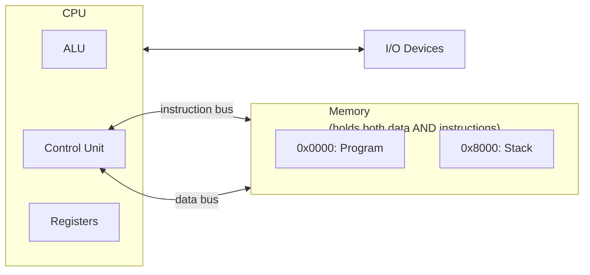
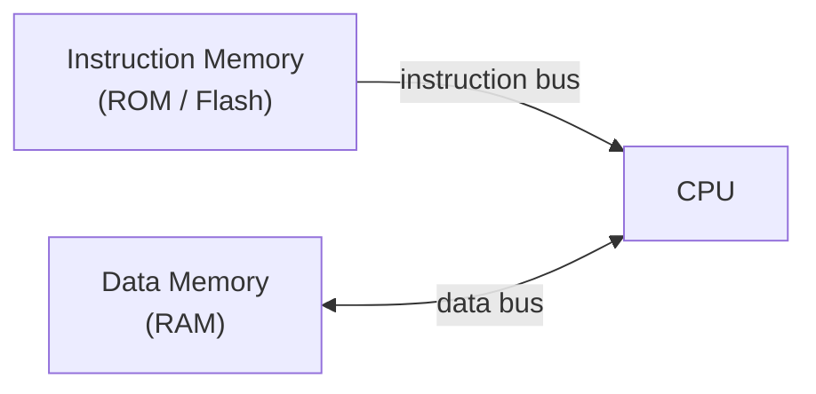
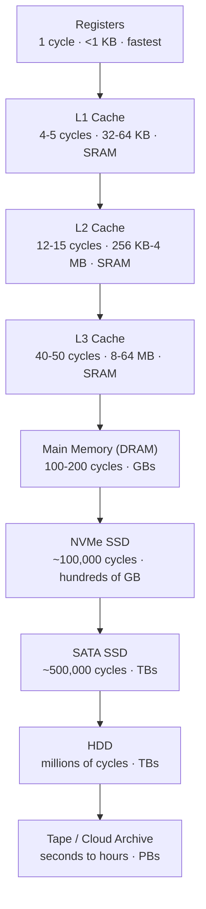

# Chapter 12: Computer Architecture Fundamentals

> **"Computer architecture is the science of organizing digital circuits into a machine that can execute arbitrary computations — fetch an instruction, figure out what it means, execute it, and repeat billions of times per second."**

---

## Table of Contents
1. [Von Neumann Architecture](#1-von-neumann-architecture)
2. [Harvard Architecture](#2-harvard-architecture)
3. [CPU Components in Depth](#3-cpu-components-in-depth)
4. [Instruction Cycle](#4-instruction-cycle)
5. [Memory Hierarchy](#5-memory-hierarchy)
6. [Pipelining](#6-pipelining)
7. [Hazards and Solutions](#7-hazards-and-solutions)
8. [Out-of-Order Execution and Superscalar](#8-out-of-order-execution-and-superscalar)
9. [Branch Prediction](#9-branch-prediction)
10. [Cache Architecture](#10-cache-architecture)
11. [Memory Management and Virtual Memory](#11-memory-management-and-virtual-memory)
12. [Bus Architecture and Interconnects](#12-bus-architecture-and-interconnects)
13. [Interrupts and Exceptions](#13-interrupts-and-exceptions)
14. [Direct Memory Access (DMA)](#14-direct-memory-access-dma)
15. [Summary](#15-summary)

---

## 1. Von Neumann Architecture

**John von Neumann** described the stored-program computer in 1945. Almost all computers today still follow this basic model.



Key concept: STORED PROGRAM — instructions live in same memory as data
             CPU reads instructions, executes them, then reads more

### Key Components

**CPU (Central Processing Unit):**
- ALU: arithmetic and logic operations
- Control Unit: fetches and decodes instructions
- Registers: fast on-chip storage

**Memory:**
- Stores both program instructions AND data
- Addressed by sequential addresses
- RAM: random access, read/write
- ROM: read-only (boot code)

**Input/Output:**
- Connects to external world (keyboard, display, storage, network)
- Memory-mapped I/O: I/O devices appear as memory addresses
- Port-mapped I/O (x86): separate I/O address space

### Von Neumann Bottleneck

```
The fundamental limitation: CPU and memory share ONE bus

CPU speed >> Memory speed (huge gap!)
CPU must WAIT for memory on every access
Solution strategies: caches, wider buses, prefetch buffers
```

---

## 2. Harvard Architecture

**Separate memories and buses for instructions and data:**



**Advantages:**
- Can fetch instruction AND read/write data in same clock cycle
- Instruction memory can be ROM (smaller, cheaper, no accidental overwrite)
- More secure (code separate from data — prevents certain attacks)

**Used in:**
- Microcontrollers: AVR (ATmega), PIC, ARM Cortex-M
- DSPs: TI DSP, Analog Devices SHARC
- Signal processors, where throughput critical

**Modified Harvard (modern CPUs):**
- Physically: separate L1 instruction and data caches
- Logically: unified memory space (can read data from code memory address)
- Combines advantages of both: fast L1 access + unified addressing

---

## 3. CPU Components in Depth

### Registers

**General Purpose Registers (GPRs):**
```
Storage directly inside CPU — fastest memory (1 cycle access)
Width = CPU word size

ARM 64-bit (AArch64): X0-X30 (31 × 64-bit regs)
  X0-X7:  function arguments and return values
  X8:     indirect result location
  X9-X15: temporary (caller-saved)
  X16-X17: inter-procedure call scratch
  X18:    platform register
  X19-X28: callee-saved
  X29:    frame pointer (FP)
  X30:    link register (LR) — return address
  XZR:    always zero (special register)
  SP:     stack pointer (special, 64-bit)

32-bit versions accessible as W0-W30 (lower 32 bits)

x86-64: 16 general-purpose 64-bit registers:
  RAX, RBX, RCX, RDX: accumulator, base, counter, data
  RSI, RDI: source, destination index (string ops, function args)
  RSP: stack pointer (special — don't use as GPR)
  RBP: base/frame pointer
  R8-R15: additional registers (added in 64-bit extension)
```

**Special Purpose Registers:**
```
Program Counter (PC / Instruction Pointer IP):
  Contains address of NEXT instruction to execute
  Automatically incremented after each fetch
  Modified by branches, jumps, calls

Stack Pointer (SP):
  Points to top of stack in memory
  Decremented when pushing (stack grows downward in most architectures)
  Incremented when popping
  Used for: function calls, local variables, temporary storage

Status Register / Flags (FLAGS in x86, CPSR in ARM):
  Single bits recording results of last operation:

  Zero flag (Z):    1 if result was zero, 0 otherwise
  Carry flag (C):   1 if unsigned overflow (carry out)
  Negative (N):     1 if result was negative (MSB = 1)
  Overflow (V):     1 if signed overflow
  Parity (P):       x86 only, 1 if even number of 1s in low byte
  Interrupt enable (I): ARM — enable/disable IRQs

  Conditional branches check these flags:
    BEQ  (Branch if Equal)   → branch if Z=1
    BNE  (Branch if Not Equal) → branch if Z=0
    BGT  (Branch if Greater Than) → branch if Z=0 and N=V
    BLT  (Branch if Less Than) → branch if N≠V
    BCS  (Branch if Carry Set) → branch if C=1

Link Register (LR / R30 in ARM):
  Stores return address when subroutine called (BL instruction)
  BL target → PC = target, LR = PC+4 (next instruction)
  RET → PC = LR
  On x86: CALL pushes return address onto stack instead
```

### ALU (Arithmetic Logic Unit)

```
Inputs:
  Operand A (from register or memory)
  Operand B (from register or immediate value)
  Carry-in (for multi-word arithmetic)
  Operation select (which operation to perform)

Operations:
  Arithmetic: ADD, SUB, ADC (add with carry), SBC, INC, DEC, MUL, DIV
  Logic: AND, OR, XOR, NOT, bit-test
  Shift: LSL, LSR, ASR, ROR, ROL
  Compare: CMP (subtract but don't store result, only update flags)

Outputs:
  Result (to destination register or memory)
  Status flags (Z, C, N, V — update flags register)

A modern CPU (Apple M4) has:
  6 integer execution units per core
  4 floating-point units (FPU) per core
  Many vector (SIMD) units
  → Can execute many operations per clock
```

### Floating Point Unit (FPU)

```
Handles IEEE 754 floating point numbers:

Single precision (32-bit):
  1 bit sign + 8 bits exponent (bias 127) + 23 bits mantissa
  Range: ±1.4×10⁻⁴⁵ to ±3.4×10³⁸
  Precision: ~7 decimal digits

  Format: S EEEEEEEE MMMMMMMMMMMMMMMMMMMMMMM
  Value: (-1)^S × 1.M × 2^(E-127)  (implicit leading 1 in mantissa)

Double precision (64-bit):
  1 bit sign + 11 bits exponent (bias 1023) + 52 bits mantissa
  Range: ±2.2×10⁻³⁰⁸ to ±1.8×10³⁰⁸
  Precision: ~15-16 decimal digits

Special values:
  ±0, ±Infinity, NaN (Not a Number), Denormals

Operations: FADD, FSUB, FMUL, FDIV, FSQRT, FABS, FNEG
  These are slower than integer ops (4-20 cycles each)
  Modern CPUs: multiple pipelined FPUs

SIMD/vector extensions (Chapter 13) process multiple floats simultaneously
```

### Control Unit

```
Hardwired Control:
  Logic gates decode instruction → generate control signals
  Very fast (1-2 cycle decode)
  Fixed instruction set
  RISC CPUs use this

Microprogrammed Control:
  Instruction opcode → microcode address → sequence of microoperations
  Complex instructions implemented as microcode sequences
  x86 CISC instructions decoded to RISC-like micro-ops internally
  Allows complex instructions, patching bugs via microcode update!
  Intel can fix bugs with microcode patches (downloaded via BIOS)
```

---

## 4. Instruction Cycle

The fundamental cycle every CPU repeats:

### Classical 5-Stage Pipeline (MIPS-like)

```
Stage 1: IF — Instruction Fetch
  PC → memory address
  Fetch instruction (32-bit) from instruction cache
  Increment PC (PC = PC + 4 for 32-bit instructions)

Stage 2: ID — Instruction Decode
  Parse instruction binary fields:
    Opcode (what operation)
    Source registers (rs, rt)
    Destination register (rd)
    Immediate value (constant)
  Read source registers from register file

Stage 3: EX — Execute
  ALU performs operation
  Calculate branch target address
  Evaluate branch condition (flags)

Stage 4: MEM — Memory Access
  Load: send address to data cache, receive data
  Store: send address + data to data cache
  Non-memory instructions: pass through idle

Stage 5: WB — Write Back
  Write result to destination register
  Source: ALU result (for arithmetic) or memory data (for loads)
```

### RISC-V Instruction Format Example

```
R-type (register-register):
  [funct7:7][rs2:5][rs1:5][funct3:3][rd:5][opcode:7]

  ADD x1, x2, x3  → adds x2 + x3 → result in x1

I-type (immediate):
  [imm[11:0]:12][rs1:5][funct3:3][rd:5][opcode:7]

  ADDI x1, x2, 5  → adds x2 + 5 → result in x1
  LW x1, 8(x2)    → load word from memory[x2+8] → x1

S-type (store):
  [imm[11:5]:7][rs2:5][rs1:5][funct3:3][imm[4:0]:5][opcode:7]

  SW x3, 12(x1)   → store x3 to memory[x1+12]

B-type (branch):
  [imm[12,10:5]:7][rs2:5][rs1:5][funct3:3][imm[4:1,11]:5][opcode:7]

  BEQ x1, x2, label → if x1==x2, jump to label
```

---

## 5. Memory Hierarchy



Speed increases toward top; cost per bit and capacity increase toward bottom.

### Why Hierarchy Works: Locality of Reference

**Temporal locality:** A recently accessed memory location is likely to be accessed again soon
- Loops: same instructions executed many times
- Arrays: same variable used in calculations

**Spatial locality:** Memory locations near a recently accessed one are likely to be accessed soon
- Sequential code execution (instructions fetched sequentially)
- Array iteration (sequential memory access)

**Cache line:** minimum transfer unit between cache levels
- Typically 64 bytes
- Even if you request 1 byte, 64 bytes brought into cache
- Exploits spatial locality

---

## 6. Pipelining

**Pipelining** overlaps execution of multiple instructions, like an assembly line:

### Without Pipeline (Sequential)

```
Time: ─────────────────────────────────────────────
       Instr1  │ IF │ ID │ EX │ MEM│ WB │
       Instr2                             │ IF │ ID │...

Each instruction takes 5 cycles, no overlap
Throughput: 1 instruction per 5 cycles = 0.2 IPC
```

### With 5-Stage Pipeline

```
Cycle:  1    2    3    4    5    6    7    8    9
Instr1: IF   ID   EX   MEM  WB
Instr2:      IF   ID   EX   MEM  WB
Instr3:           IF   ID   EX   MEM  WB
Instr4:                IF   ID   EX   MEM  WB
Instr5:                     IF   ID   EX   MEM  WB

After 5 cycles (fill pipeline): 1 instruction completes every cycle!
Throughput: 1 IPC (instructions per cycle) — 5× better!
```

**Latency vs Throughput:**
- **Latency** of each instruction is still 5 cycles
- **Throughput** is 1 instruction/cycle (with full pipeline)
- Pipeline improves throughput, NOT latency of individual instructions

---

## 7. Hazards and Solutions

### Data Hazard — RAW (Read After Write)

```
Problem: Instruction needs data not yet written by previous instruction

ADD x1, x2, x3   ← writes x1 in WB stage (cycle 5)
SUB x4, x1, x5   ← reads x1 in ID stage (cycle 3 of this instruction)
                     But x1 not written yet! → WRONG VALUE!

Time:  1    2    3    4    5    6    7    8
ADD:   IF   ID   EX   MEM  WB
SUB:        IF   ID*  EX   MEM  WB
                  ↑ reads x1 here (cycle 3)
                    but ADD writes x1 in cycle 5 → too late!
```

**Solution 1: Forwarding (Bypassing)**
```
Forward result from EX or MEM stage directly to EX stage input:

Time:  1    2    3    4    5    6    7    8
ADD:   IF   ID   EX───┐MEM  WB
SUB:        IF   ID   │EX*  MEM  WB
                       └──►EX gets x1 from ADD's EX output, not register file

Result: 1-cycle delay instead of 3-cycle!
Most RAW hazards solvable with forwarding
```

**Solution 2: Stalling (Insert Bubbles)**
```
Insert NOP (no operation) instructions into pipeline:

Time:  1    2    3    4    5    6    7    8    9    10
ADD:   IF   ID   EX   MEM  WB
NOP:        IF   ID   EX   MEM  WB  (bubble)
NOP:              IF   ID   EX   MEM  WB  (bubble)
SUB:                   IF   ID   EX   MEM  WB
                             ↑ now reads correct x1

Performance hit: 2 stall cycles per instruction → wastes pipeline slots
```

### Control Hazard — Branch Instructions

```
Problem: CPU fetches next instruction sequentially, but branch might jump elsewhere

BEQ x1, x2, target  ← branch result not known until EX stage
NEXT_INSTR           ← fetched while BEQ in decode/execute, might be wrong!

Time:  1    2    3    4    5    6
BEQ:   IF   ID   EX
NEXT:       IF   ID   ← wrong if branch taken!
NEXT+1:          IF   ← also wrong!

2-cycle branch penalty (for 5-stage pipe)
```

**Solution 1: Pipeline Flush**
```
If branch taken: kill (flush) the 2 incorrectly fetched instructions
Wasted cycles but correct execution
```

**Solution 2: Branch Delay Slot (MIPS approach)**
```
The instruction AFTER branch always executes (regardless of branch)!
Called the "branch delay slot"
Compiler fills slot with useful instruction from before branch

BEQ x1, x2, target
ADD x3, x4, x5   ← ALWAYS executes (delay slot)
target:
...

Programmer/compiler must be aware of this — confusing, complex
Modern architectures don't use this (use branch prediction instead)
```

**Solution 3: Branch Prediction (Modern — Best)**
```
Predict whether branch is taken or not:
  If prediction correct: no penalty!
  If prediction wrong: flush and restart (2-20 cycle penalty depending on pipe depth)

Goal: >99% accuracy to minimize penalties
See Section 9 for details
```

### Structural Hazard

```
Problem: Two instructions need same hardware resource

Example: if memory has only one port:
  Load instruction accessing memory in MEM stage
  Fetch instruction accessing memory in IF stage
  → Both need memory simultaneously!

Solution: Separate instruction and data caches (Harvard-style L1 cache)
          Or stall one of the instructions
```

---

## 8. Out-of-Order Execution and Superscalar

### Superscalar — Multiple Instructions Per Cycle

```
A superscalar processor has multiple execution units and can issue >1 instruction/cycle:

Apple M4 per P-core:
  6 integer ALUs + 4 FPUs + vector units
  Can issue up to ~9 instructions per cycle!

Time:   Cycle 1     Cycle 2     Cycle 3
Issue:  I1 I2 I3    I4 I5 I6    I7 I8 I9
        │  │  │      │  │  │
        ALU FPU ALU  ...

IPC > 1 possible! (instructions per cycle)
```

### Out-of-Order Execution (OOO)

**Key insight:** execute instructions in a DIFFERENT order than program order, as long as result is the same (no dependencies violated).

```
Consider this code:
  ADD x1, x2, x3     ← writes x1
  SUB x4, x1, x5     ← reads x1: MUST wait for ADD
  MUL x6, x7, x8     ← independent! Can execute in parallel with ADD or SUB!

In-order: must wait for ADD before SUB → MUL also waits due to in-order
Out-of-order: execute ADD and MUL simultaneously, SUB waits for ADD only
```

**Tomasulo Algorithm (basis of OOO):**
1. **Issue:** Decode instruction, allocate entry in reservation station (RS)
2. **Dispatch:** When operands available AND execution unit free → execute
3. **Execute:** Instruction runs in appropriate execution unit
4. **Write Result:** Result broadcast to all waiting instructions via Common Data Bus
5. **Commit/Retire:** In-order commit to update architectural state

**Key structures:**
- **Reorder Buffer (ROB):** instructions committed in-order to maintain sequential semantics
- **Reservation Stations (RS):** hold instructions waiting for operands
- **Register Renaming:** eliminate false dependencies (WAR, WAW hazards)
- **Load-Store Queue:** tracks memory accesses for ordering

---

## 9. Branch Prediction

Branch prediction prevents control hazards by guessing whether a branch is taken before knowing for certain.

### Static Prediction

```
Always Not Taken: predict branch never jumps
  Works for top-level loops: wrong only at loop end
  Simple, no hardware needed

Always Taken: predict branch always jumps
  Better for loop-back branches

Backward Taken / Forward Not Taken (BTFNT):
  Backward branches (negative offset) → predict taken (likely a loop)
  Forward branches (positive offset) → predict not taken (likely if-else skip)
  ~65% accuracy — good for simple hardware
```

### Dynamic Prediction

Uses history of branch behavior to predict:

**1-bit Saturating Counter:**
```
0: predict not taken (if wrong → go to 1)
1: predict taken (if wrong → go to 0)

Problem: loop that exits: 1,1,1,...,1,0
  Mispredicts once at end (good)
  But: nested loop — inner loop exits mispredicts, then mispredicts again on re-entry

1-bit state:   NOT TAKEN ←→ TAKEN
               (wrong once → flip)
```

**2-bit Saturating Counter:**
```
States: 0=Strongly NT, 1=Weakly NT, 2=Weakly T, 3=Strongly T

If predict NT and wrong → go to Weakly NT then Weakly T
Needs 2 mispredictions to switch prediction!
Much better for loops

2-bit state machine:
  00 (Strongly NT) ←→ 01 (Weakly NT) ←→ 10 (Weakly T) ←→ 11 (Strongly T)
```

**2-level / Local History Predictor:**
```
Track last N branch outcomes (history register)
Table of 2-bit counters indexed by history
If branch usually: TNTNTN... → history helps predict next T or N

Local: separate history per branch
Global: one shared history for all branches
```

**Tournament Predictor (used in Alpha 21264, Athlon):**
```
Two predictors: local + global
Meta-predictor: which predictor was right more often for each branch?
Choose the better predictor's output

~93-97% accuracy
```

**TAGE (TAgged GEometric history length predictor):**
```
Multiple tables with different history lengths: 1, 4, 16, 64, 256 bits...
Tagged entries: only use entry if tag matches
Longer history for unusual branches, shorter for common

Used in: modern AMD Zen, Intel Core CPUs
Accuracy: >98%! (only ~2% mispredictions)
```

**Misprediction penalty:**
```
Penalty depends on pipeline depth:
  5-stage: 2 cycles flushed
  Intel Core (14-19 stages): 15-20 cycles flushed!
  Deep pipelines: more stages filled before misprediction detected

At 5GHz clock with 15-cycle penalty:
  15/5×10⁹ = 3ns per misprediction
  At 100 million branches/second with 2% miss rate:
  100×10⁶ × 0.02 × 15 cycles = 30 million wasted cycles/second
  At 5GHz: 30M/5000M = 0.6% performance penalty (acceptable!)
```

---

## 10. Cache Architecture

### Cache Mapping

**Direct Mapped:**
```
Each memory address maps to exactly ONE cache location
Address: [tag | index | offset]
  offset: which byte within cache line (log₂(line_size) bits)
  index: which cache set (log₂(num_sets) bits)
  tag: identifies which memory block is stored

Conflict misses: two addresses competing for same cache slot → thrashing
Simple but can have bad performance
```

**Fully Associative:**
```
Any memory block can go anywhere in cache
No index bits: address = [tag | offset]
Check tag vs all cache entries simultaneously (parallel)
No conflict misses, but hardware-expensive (comparators for every line)
Used for small critical caches (TLB)
```

**N-way Set Associative (MOST COMMON):**
```
N cache "ways" (copies) per set
Address: [tag | set_index | offset]
Each set has N possible locations

4-way set associative:
  4 possible locations for each address
  Parallel search of 4 tags
  Balance between conflict misses and hardware cost

Modern CPUs:
  L1: 8-way (Intel) or 4-way (ARM)
  L2: 8-16 way
  L3: 16-way
```

### Replacement Policies

When cache is full and new line must be brought in, which old line to evict?

**LRU (Least Recently Used):** evict the line not used longest
- Best for temporal locality
- Hardware: needs ordering information for every set
- True LRU expensive: use "pseudo-LRU" (tree-based)

**FIFO:** evict oldest line brought in
- Simple, but "Belady's anomaly" (more cache → worse performance possible)

**Random:** evict randomly
- Surprisingly competitive! Avoids pathological patterns
- Simple hardware

**RRIP (Re-Reference Interval Prediction):** predicts when line will be reused
- Better than LRU for scan-heavy workloads
- Used in some modern CPUs

### Write Policies

**Write-Through:**
```
On cache write: simultaneously write to cache AND memory
  Advantage: memory always up-to-date (simple consistency)
  Disadvantage: every write goes to slow memory (kills performance)
  Use: small L1 cache for simplicity (some ARM Cortex-M L1s)
```

**Write-Back (most common):**
```
On cache write: write to cache only
  Mark line as "dirty" (different from memory)
  Write to memory only when dirty line evicted
  Advantage: most writes served from fast cache
  Disadvantage: complexity, memory not always current

  Dirty bit: 1 bit per cache line
  On eviction of dirty line: write to next-level memory first
```

**Write-Allocate:** on cache miss during write, bring line into cache then write
**No-Write-Allocate:** on cache miss during write, go directly to lower level

### Cache Coherence (Multi-Core)

When multiple CPU cores each have their own L1 cache, problem: they might have different values for same memory address!

**MESI Protocol (most common):**
```
Each cache line has one of 4 states:
  M (Modified): only in this cache, different from memory (dirty)
  E (Exclusive): only in this cache, same as memory (clean)
  S (Shared): may be in multiple caches, same as memory
  I (Invalid): not valid/not present in this cache

On CPU read miss:
  If another cache has M: write-back then share (M→S)
  If another cache has E: transition to shared (E→S)

On CPU write hit:
  S → M: invalidate all other caches (send invalidation broadcast)
  E → M: no broadcast needed (only copy)

Tracked by snooping bus or directory protocol
```

---

## 11. Memory Management and Virtual Memory

### Why Virtual Memory?

1. **Isolation:** each process has its own address space — can't accidentally (or maliciously) access other process's memory
2. **Size:** programs can use more memory than physically installed (using disk as overflow)
3. **Simplicity:** programs always start at address 0 (or similar), don't need to know physical layout
4. **Protection:** read-only code, no-execute data (prevents code injection)

### Paging

```
Physical memory divided into fixed-size FRAMES (typically 4KB)
Virtual address space divided into fixed-size PAGES (same 4KB)

Page Table maps virtual pages → physical frames:

Virtual address: [VPN (page number) | page offset]
                 [20 bits (for 4GB / 4KB)  | 12 bits]

Translation:
  VPN → lookup in page table → PFN (physical frame number)
  Physical address = PFN + offset
```

**Multi-level Page Tables:**
```
Problem: 32-bit system with 4KB pages → 2²⁰ = 1M page table entries per process
         1M entries × 4 bytes = 4MB per process just for page table!

Solution: 2-level page table (only allocate what's needed):
  Level 1: Page Directory (1024 entries → covers 4GB)
  Level 2: Page Table per directory entry (1024 entries)

  Only allocate L2 tables for actual pages used!

64-bit systems: 4-level page tables (AMD64 uses this)
  Each level: 9 bits → 512 entries
  Virtual address: [48 bits used] = [9|9|9|9|12]
                   PGD | PUD | PMD | PT | offset
```

**TLB (Translation Lookaside Buffer):**
```
Without TLB: every memory access = 4 (x64) memory accesses for page table walk!
  → Insanely slow

TLB: cache of recent page table entries
  Typically: 64-2048 entries
  Fully associative
  Hit: < 1 cycle for translation
  Miss: page table walk (4 memory accesses for x86-64)

TLB structure in modern CPUs:
  L1 ITLB: 128-256 entries (instruction accesses)
  L1 DTLB: 64-128 entries (data accesses)
  L2 TLB (unified): 1024-4096 entries

  L1 TLB miss → L2 TLB (4-7 cycles)
  L2 TLB miss → Page table walk (20-100 cycles)
  TLB shootdowns across cores: expensive (must flush remote TLBs via IPI)
```

**Page Fault:**
```
Access to page not in physical memory:
  OS page fault handler invoked
  Find page in swap (disk) or file
  Load from disk to free physical frame
  Update page table
  Resume execution

Major page fault: page fetched from disk (~1ms!)
Minor page fault: page in memory but not mapped (fast)
```

---

## 12. Bus Architecture and Interconnects

### Traditional Bus

```
CPU ─────────────── Address Bus (32-bit)
                │── Data Bus (64-bit)
                │── Control Bus (R/W, IRQ, etc.)
                │
           Memory  I/O Devices

Problems with shared bus:
  Only one device can use at a time
  All devices see all traffic (bandwidth wasted)
  Physical length limits speed (signal propagation)
  Adding devices reduces bandwidth for all
```

### Modern Point-to-Point Interconnects

**PCIe (PCI Express):**
```
Point-to-point serial links (lanes)
Each lane: 2 differential pairs (TX + RX)

PCIe versions (per-lane bandwidth):
  PCIe 1.0: 250 MB/s per lane (2.5 GT/s)
  PCIe 2.0: 500 MB/s per lane (5 GT/s)
  PCIe 3.0: 1 GB/s per lane (8 GT/s)
  PCIe 4.0: 2 GB/s per lane (16 GT/s)
  PCIe 5.0: 4 GB/s per lane (32 GT/s)
  PCIe 6.0: 8 GB/s per lane (64 GT/s, PAM4 signaling)

Lane configurations: ×1, ×2, ×4, ×8, ×16
GPU slot: PCIe ×16 (16 lanes)
NVMe SSD: PCIe ×4

GPU at PCIe 5.0 ×16: 4 × 16 = 64 GB/s bidirectional!
```

**AMBA (on-chip ARM buses):**
```
AHB (Advanced High-performance Bus): for fast peripherals (DMA, USB)
APB (Advanced Peripheral Bus): for slow peripherals (GPIO, UART)
AXI (Advanced eXtensible Interface): modern high-speed, burst-capable
  Used between CPU core and L2 cache, between IP blocks in SoC

AXI4:
  Separate address and data channels
  Multiple outstanding transactions
  Burst mode (4, 8, 16 beats)
  Wide buses: 64-1024 bit data width
```

**AMD Infinity Fabric:**
```
Proprietary AMD interconnect:
  Connects multiple CPU chiplets in Zen3/4
  Connects CPU to GPU in APU
  Connects CPU to memory controllers
  Based on HyperTransport roots
  Bandwidth: >100 GB/s between chiplets (Zen4)
```

---

## 13. Interrupts and Exceptions

**Interrupts** allow external events to "interrupt" normal program flow.

### Types

**Hardware Interrupt:**
```
External device signals CPU needs attention
  Timer interrupt: every 1ms (scheduler tick)
  UART RX: serial data received
  GPIO: button pressed, sensor event
  NIC: network packet received

CPU:
1. Finishes current instruction
2. Saves PC, flags, and registers
3. Jumps to interrupt handler (ISR)
4. ISR processes event
5. Returns (IRET) — restores registers, resumes program

Maskable interrupts: can be disabled (CLI in x86, CPSID I in ARM)
Non-maskable (NMI): cannot be disabled (power failure, hardware error)
```

**Exception (Synchronous):**
```
Generated by CPU itself in response to an instruction:
  Divide by zero
  Page fault (virtual → physical translation fails)
  Illegal instruction (unknown opcode)
  Alignment fault (accessing odd address on word boundary)
  Breakpoint (debug interrupt, INT 3 in x86)
  Syscall (software interrupt: INT 0x80, SYSCALL, SVC)

Handled by: OS kernel exception handler
```

**Interrupt Vector Table (IVT):**
```
x86: 256 interrupt vectors, each is a 4-byte address (real mode) or 8-byte descriptor (protected mode)
     Located at fixed address (0x0000 for real mode, IDTR register for protected)

ARM Cortex-M: vector table at address 0x00000000 (or remapped)
  First entry: initial SP value
  Second entry: reset handler address
  Remaining: addresses of ISR for each exception/interrupt

Vector 0: Initial stack pointer
Vector 1: Reset handler
Vector 2: NMI handler
Vector 3: HardFault handler
Vector 4-15: Other fault handlers
Vector 16+: External IRQ handlers (peripheral interrupts)
```

**NVIC (Nested Vectored Interrupt Controller) — ARM:**
```
Part of Cortex-M core
Handles up to 240 external interrupts
Priority levels: configurable 3-8 bits (8-256 levels)
Nested interrupts: higher priority can preempt lower priority ISR
Tail-chaining: if two interrupts pending, skip context save/restore between them
```

---

## 14. Direct Memory Access (DMA)

**Without DMA:** CPU reads data from peripheral register, writes to memory — one byte at a time:
```
Read peripheral → store in CPU register → write to memory (repeat for every byte)
CPU is busy the whole time — can't do other work!
```

**With DMA:**
```
CPU programs DMA controller:
  - Source address (peripheral data register)
  - Destination address (memory buffer)
  - Transfer size (number of bytes)
  - Transfer width (8, 16, 32-bit)
  - Mode (single shot, circular/continuous)

DMA controller executes transfer autonomously:
  - Takes bus mastership
  - Reads from source
  - Writes to destination
  - Repeats until count exhausted

DMA generates interrupt when complete → CPU handles data

CPU is FREE during transfer!
```

**DMA in STM32:**
```
DMA streams: each STM32 has 2 DMA controllers with 8 streams each
Each stream configurable for specific peripherals

Common uses:
  ADC → memory (continuous sampling without CPU intervention)
  Memory → UART (send buffer automatically)
  Memory → DAC (play audio waveform)
  Memory → SPI (fast screen updates)

Example: Read ADC at 1 Msps into 1024-element buffer:
  DMA configured for ADC→memory circular mode
  When buffer full: DMA interrupt fires
  CPU processes 1024 samples (FFT, filtering, etc.)
  Meanwhile DMA fills next buffer
  → continuous sampling + processing!
```

---

## 15. Summary

```
COMPUTER ARCHITECTURE FUNDAMENTALS
═══════════════════════════════════

Von Neumann: CPU + shared memory for code and data
Harvard: separate instruction/data memory and buses (MCUs, DSPs)

CPU components:
  ALU: arithmetic and logic operations + flags
  CU: fetch, decode, generate control signals
  Registers: fastest storage (1 cycle, few KB)
  FPU: IEEE 754 floating point

5-stage pipeline: IF → ID → EX → MEM → WB
  Hazards: data (RAW), control (branches), structural
  Solutions: forwarding, stalling, branch prediction, separate caches

Superscalar: issue multiple instructions per cycle (IPC > 1)
OOO execution: execute instructions out of program order for better IPC
Branch prediction: >98% accuracy (TAGE predictor)

Cache: SRAM closer to CPU for speed
  Levels: L1 (4cy, 32-64KB) → L2 (12cy, 0.5-4MB) → L3 (40cy, 8-64MB)
  MESI protocol for multi-core coherence

Virtual memory: each process has own 48-bit virtual address space
  Page table: virtual page → physical frame (4KB pages)
  TLB: cache page table entries (64-2048 entries, ~1 cycle hit)

Interrupts: external events pre-empt CPU
  NVIC (ARM): prioritized, nested interrupts
  DMA: offload memory transfers from CPU
```

---

**← Previous:** [Chapter 11: Semiconductor Fabrication](./11-semiconductor-fabrication-and-moores-law.md)
**→ Next:** [Chapter 13: Instruction Set Architectures](./13-instruction-set-architectures.md)
