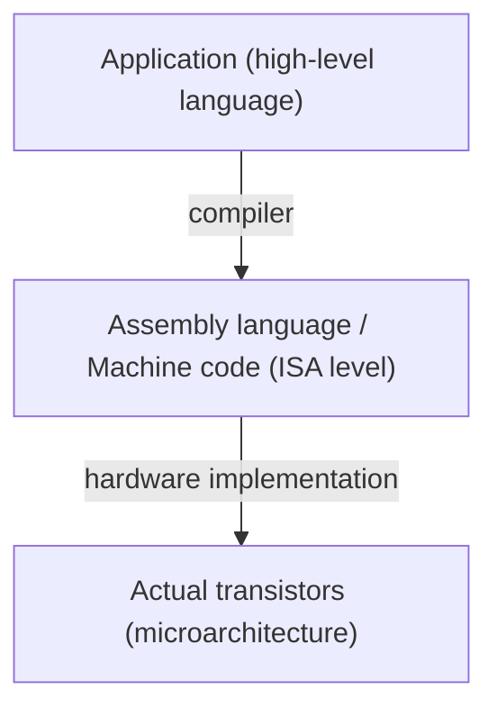
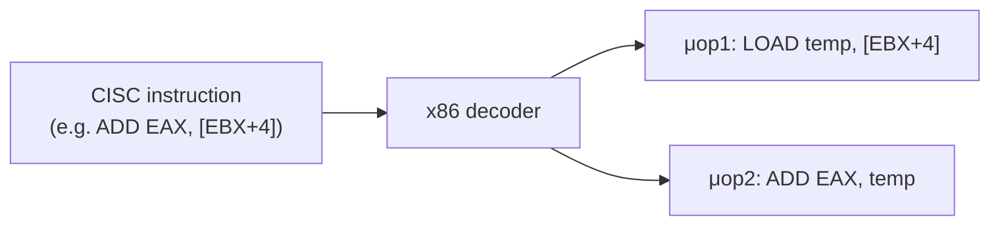

# Chapter 13: Instruction Set Architectures — RISC, CISC, ARM, x86

> **"The ISA is the contract between hardware and software. It defines what instructions a processor understands — and two completely different silicon implementations can be binary compatible if they implement the same ISA."**

---

## Table of Contents
1. [What is an ISA?](#1-what-is-an-isa)
2. [CISC Architecture](#2-cisc-architecture)
3. [RISC Architecture](#3-risc-architecture)
4. [RISC vs CISC Comparison](#4-risc-vs-cisc-comparison)
5. [ARM Architecture — Complete Guide](#5-arm-architecture--complete-guide)
6. [x86 Architecture — Complete Guide](#6-x86-architecture--complete-guide)
7. [RISC-V Architecture](#7-risc-v-architecture)
8. [MIPS Architecture](#8-mips-architecture)
9. [Understanding 8-bit, 16-bit, 32-bit, 64-bit](#9-understanding-8-bit-16-bit-32-bit-64-bit)
10. [SIMD and Vector Extensions](#10-simd-and-vector-extensions)
11. [Summary](#11-summary)

---

## 1. What is an ISA?

An **Instruction Set Architecture (ISA)** is the interface between hardware and software — the complete specification of what a processor can do.

### ISA Defines

```
1. Instruction set: what operations exist (ADD, SUB, LOAD, STORE, BRANCH...)
2. Instruction encoding: how instructions are represented in binary
3. Register file: how many registers, what types, how wide
4. Data types: supported integer sizes, floating point formats
5. Memory model: addressing, endianness, alignment requirements
6. Privilege levels: user mode, supervisor/OS mode, hypervisor mode
7. Exception model: what faults exist, how handled
8. I/O model: memory-mapped vs port-mapped
```

### Why ISA Matters

**Binary compatibility:** Programs compiled for one implementation of an ISA run on ALL implementations:
- Code compiled for Intel Core i5 runs on AMD Ryzen, Intel i9, Intel Atom — because all are x86-64
- Code for ARM Cortex-A53 runs on Apple A12, Apple M1, Samsung Exynos — all are ARMv8

**Two layers:**



> ISA is the boundary: same ISA, completely different microarchitectures possible.
> x86 ISA: Intel vs AMD implement completely differently internally.
> ARM ISA: Apple vs ARM Holdings vs Qualcomm all different internally.

---

## 2. CISC Architecture

**CISC = Complex Instruction Set Computer**

### Philosophy

- Many complex instructions that each do a lot of work
- One instruction can: load from memory + operate + store back
- Goal: reduce number of instructions in a program
- Historical: when memory was expensive, fewer instructions = less memory

### Key CISC Characteristics

```
Variable-length instructions:
  x86-64: 1 to 15 bytes per instruction!
  Simple: MOV AX, 1  = 3 bytes
  Complex: MOVAPS with complex addressing = 7-15 bytes

Many addressing modes:
  Immediate:      MOV EAX, 5           (value in instruction)
  Register:       MOV EAX, EBX         (register to register)
  Direct:         MOV EAX, [0x4000]    (absolute address)
  Register ind:   MOV EAX, [EBX]       (address in register)
  Base+Disp:      MOV EAX, [EBX+4]    (base + offset)
  Scaled index:   MOV EAX, [EBX + ECX*4 + 8]  (powerful but complex!)

Memory-to-memory operations:
  ADD EAX, [EBX]   (loads from memory and adds in one instruction)
  MOVS (move string: load + store + increment both pointers)
  REP MOVS (repeat string move: entire memory copy in one instruction!)

Examples of complex x86 instructions:
  PUSHA: push all 8 general registers to stack in one instruction
  ENTER: set up stack frame for function
  LOOP: decrement CX and branch if not zero
  IN/OUT: read/write I/O port
  FSIN, FCOS, FPATAN: trigonometric functions as single instructions!
  CMOV: conditional move (based on flags)
```

### x86 Internal RISC Conversion

Modern x86 CPUs (Intel and AMD) **decode CISC instructions to RISC-like micro-ops** internally:



> The CPU's internal engine is actually RISC-like! The complex x86 decoder is the compatibility layer. (1 to 3 μops typically; some complex instructions: 100+ μops)

### Major CISC ISAs

- **x86 / x86-64 (Intel/AMD):** dominant in desktop, laptop, server
- **VAX:** Digital Equipment Corp (DEC), 1977 — inspired RISC as a reaction!
- **Motorola 68000:** 1979 — Apple Mac, Amiga, Atari ST; still used in embedded
- **IBM System/360, z/Architecture:** mainframes, still running today

---

## 3. RISC Architecture

**RISC = Reduced Instruction Set Computer**

### Origin Story

Two research projects reacted against CISC complexity:

**1. IBM 801 (John Cocke, 1975):**
- Observation: 80% of execution time spent on only 20% of instructions
- Simple instructions + many registers + fast clock = better performance
- Led to IBM POWER and then PowerPC

**2. Berkeley RISC (David Patterson, 1980):**
- Formal definition of RISC principles
- Led to SPARC architecture

**3. Stanford MIPS (John Hennessy, 1981):**
- "Microprocessor without Interlocked Pipeline Stages"
- Clean pipeline, compiler handles hazards
- Led to MIPS Technologies, then RISC-V (Hennessy at Stanford again)

**Both Patterson and Hennessy won Turing Award 2017** for their work on RISC.

### RISC Principles

```
1. Simple instructions only:
   Each instruction does ONE simple thing
   No memory-to-memory operations
   Load/Store architecture: ONLY load and store touch memory
   All operations work on REGISTERS

2. Fixed instruction length:
   MIPS, RISC-V: 32 bits per instruction (or 16 for compressed)
   ARM32: 32 bits (or 16 for Thumb)
   Simplifies decoder, enables fast fetch

3. Large register file:
   MIPS: 32 × 32-bit registers
   RISC-V: 32 × 32-bit or 64-bit
   ARM: 16 × 32-bit (ARM32) or 31 × 64-bit (AArch64)

4. Load-store architecture:
   MIPS: LW (load word), SW (store word) — only memory access instructions
   All arithmetic works on registers only
   ADD t0, t1, t2   ← register to register
   LW  t0, 8(a0)    ← load from memory to register

5. Hardwired control unit:
   No microcode
   Instructions decode to control signals in 1-2 logic levels
   Very fast decode

6. Compiler does more work:
   Complex memory accesses: compiler generates multiple simple instructions
   Pipeline scheduling: compiler reorders instructions to avoid hazards
   No hardware interlocks historically (MIPS = Microprocessor w/o Interlocked Pipeline Stages)
```

### RISC Characteristics

```
+ Simple decoder → smaller die area → more room for registers, cache
+ Regular instruction format → fast decode, shorter critical path
+ Pipeline-friendly → high clock speed
+ Fewer transistors → lower power (historically)

- More instructions needed for complex operations (larger code size)
- Compilers more complex
- Loading operands from memory takes separate instructions

Modern reality: RISC vs CISC distinction blurred!
  x86 CPUs decode to RISC internally
  ARM added many complex instructions (SIMD, crypto)
  Both design points can achieve similar performance
```

---

## 4. RISC vs CISC Comparison

| Feature | RISC | CISC (x86) |
|---------|------|-----------|
| Instruction length | Fixed (4 bytes) | Variable (1-15 bytes) |
| Instruction count | Many (>10 for complex ops) | Fewer (1-3 for complex ops) |
| Memory access | Load/Store only | Memory-to-memory allowed |
| Addressing modes | Few (3-5) | Many (10+) |
| Register file | Large (32+ regs) | Small (16 regs in x86-64) |
| Control unit | Hardwired | Microprogrammed + hardwired |
| Decode | Simple, fast | Complex |
| Compiler burden | Higher | Lower |
| Code density | Lower (more instructions) | Higher (fewer instructions) |
| Power (historically) | Lower | Higher |
| Clock speed | Higher | Lower |

**Modern score: essentially tied** for most applications. Good compilers and aggressive microarchitecture close the gap.

---

## 5. ARM Architecture — Complete Guide

**ARM = Advanced RISC Machine** (originally Acorn RISC Machine)

### History

```
1983: Acorn Computers (UK) starts ARM project
1985: ARM1 first chip (26-bit addressing)
1987: ARM2 in BBC Micro — 4 MHz, 30K transistors, remarkably efficient
1990: ARM Ltd founded (joint venture: Acorn + Apple + VLSI Technology)
      Apple needed ARM for Newton PDA
1993: ARM7 — big commercial success
1995: StrongARM (digital/Intel license) — DEC designed, very fast
1997: ARM7TDMI — in Game Boy Advance, hundreds of millions sold
2003: ARM Cortex family introduced
2007: iPhone uses ARM (Samsung-made) — ARM goes mainstream
2010: Apple A4 (first own ARM design) in iPhone 4
2012: Apple A6 in iPhone 5 — first custom ARM microarchitecture!
2013: ARMv8 (64-bit AArch64) introduced
2020: Apple M1 — desktop-class ARM performance, shocked the industry
2021: NVIDIA acquires ARM attempt blocked by regulators
2023: ARM IPO on NASDAQ
```

**Business model:** ARM licenses IP, not silicon. ARM makes MONEY by charging license fees when companies like Apple, Qualcomm, Samsung design chips using ARM's ISA and/or core designs.

### ARM vs ARM-Based Custom Designs

```
Off-the-shelf ARM cores: use ARM's design directly
  Qualcomm Snapdragon 450, Samsung Exynos 1080 (older variants): ARM Cortex-A53/A55
  STM32 MCUs: ARM Cortex-M0/M3/M4/M7
  Raspberry Pi 4: ARM Cortex-A72

Custom ARM: licensed ISA but designed their own microarchitecture
  Apple: Firestorm (A14), Blizzard+Avalanche (M1), Everest+Sawtooth (M2)
  Qualcomm: Kryo CPU (custom ARMv8 design)
  Amazon: Graviton (custom ARM server CPU)
  Ampere: Altra (custom ARM server CPU)
```

### ARMv4 / ARMv5 — The Foundation

```
32-bit RISC, ARM instruction set
ARM7TDMI: 3-stage pipeline, 8 MIPS/MHz
Used in: Game Boy Advance, early Nokia phones, embedded systems

Thumb (ARM-T): 16-bit compressed instructions
  Same registers, fewer bits per instruction → 70% of ARM code size
  Performance: ~65% of ARM on 16-bit memory bus
  Crucial for cost-sensitive embedded systems (STM32F0 uses Thumb!)
```

### ARMv6 — ARM11

```
ARM11 (ARMv6):
  - 8-stage pipeline
  - 740 MHz at 65nm
  - Used in iPhone (original, iPhone 3G): Samsung-made ARM1176
  - Raspberry Pi 1: ARM1176JZF-S @ 700 MHz
  - Thumb-2: mix of 16-bit and 32-bit instructions (best of both worlds)
  - SIMD extensions (ARMv6 SIMD): 8 × 8-bit or 4 × 16-bit ops in 32-bit register
```

### ARMv7 — The Cortex Era (2005-2015)

**Cortex-A (Application processors — for Linux/Android/iOS):**

```
Pipeline and performance:
  Cortex-A8:  in-order, 8-stage, 1.0 GHz, iPhone 3GS, iPod Touch
  Cortex-A9:  out-of-order, 8-stage, dual-core, 1.2+ GHz, iPhone 4 (A4)
  Cortex-A15: OOO, 15-stage, up to 2.5 GHz (very hot!)
  Cortex-A7:  efficient, paired with A15 in big.LITTLE
  Cortex-A53: 8-stage OOO, efficient, modern ARMv8-A compatible but 32-bit mode
  Cortex-A57: high performance ARMv8-A, 3 wide issue
  Cortex-A72: improved A57, 3 wide issue, used in Raspberry Pi 4!
  Cortex-A73: 15% better IPC than A72
```

**Cortex-M (Microcontroller — embedded, low power):**

```
Cortex-M0 (ARMv6-M):
  - Smallest, simplest: ~12K logic gates!
  - 2-stage pipeline, Thumb instructions only
  - 32 MHz typical, 10+ MIPS
  - Perfect for ultra-low-cost MCUs
  - Examples: STM32F030, nRF51, LPC1110

Cortex-M0+ (ARMv6-M):
  - M0 + single-cycle I/O, 2-cycle GPIO
  - Excellent for 32-bit @ 48MHz
  - Examples: STM32L0, ATSAMD21 (Arduino Zero, MKR family)

Cortex-M3 (ARMv7-M):
  - Full Thumb-2 instruction set
  - 3-stage pipeline
  - Hardware multiply and divide
  - Bit-banding: atomic bit access to peripheral registers
  - MPU: Memory Protection Unit (OS isolation)
  - Examples: STM32F1, STM32F2, NXP LPC1768

Cortex-M4 (ARMv7E-M):
  - M3 + DSP instructions (saturating arithmetic, SIMD 8/16-bit)
  - Optional FPU (single-precision, M4F variant)
  - 3-stage pipeline with branch speculation
  - 168-200 MHz typical
  - Examples: STM32F3, STM32F4 (common hobby choice!), nRF52, SAMD51, RP2040 (sort of)

Cortex-M7 (ARMv7E-M):
  - 6-stage superscalar pipeline (up to 2 instructions/cycle!)
  - Branch prediction
  - Double-precision FPU (M7F)
  - Instruction and data caches (optional, 4-64 KB)
  - TCM (Tightly Coupled Memory): zero-wait SRAM for critical code
  - 300-480 MHz achievable
  - Examples: STM32F7, STM32H7, NXP i.MX RT (Teensy 4.x at 600-1000 MHz!)

Cortex-M33 (ARMv8-M):
  - TrustZone: hardware security, secure/non-secure worlds
  - Similar performance to M4 with security features
  - Examples: STM32L5, nRF9160, nRF5340

Cortex-M55/M85 (ARMv8.1-M):
  - Helium vector extension (MVE): SIMD for ML/DSP
  - M55: ~5× ML inference improvement over M4 with Helium
  - M85: highest Cortex-M performance, 2-wide issue OOO pipeline!
```

**Cortex-R (Real-Time):**
```
For safety-critical applications where latency must be guaranteed:
  - Deterministic execution (bounded interrupt latency)
  - ECC memory support
  - Lockstep mode (two cores run identical, compare outputs for safety)
  - Used in: automotive (ADAS, braking systems), medical devices
  - Examples: R4 (disk drive controllers), R52 (automotive), R82 (hypervisor capable)
```

### ARMv8 and ARMv9 — AArch64 (64-bit ARM)

```
First major architectural revision in 20+ years!
Introduced 2011, first chips 2013

AArch64 (A64 instruction set):
  - 31 × 64-bit general-purpose registers (X0-X30)
    + XZR (always-zero register)
    + SP (stack pointer)
    + PC (program counter, not directly addressable)
  - 32 × 128-bit SIMD/FP registers (V0-V31)
    Accessible as: B0(8-bit), H0(16), S0(32), D0(64), Q0(128)
  - Fixed 4-byte instruction encoding (clean!)
  - 48-bit virtual addresses (current implementations, some have 57-bit LA57)
  - New features: native 64-bit arithmetic, pointer authentication (PAC), memory tagging (MTE)

Backwards compatibility:
  AArch64 processors can also run 32-bit AArch32 (ARM32 code)
  Android phones support both; iOS dropped 32-bit in iOS 11

Key Cortex-A cores (ARMv8-A):
  Cortex-A53: 8-stage OOO, ~1.5 GHz, efficient (budget phones)
  Cortex-A55: 5-stage pipeline, improved over A53 (~15% better IPC), 2× better power
  Cortex-A72: 3-wide OOO, ~2.0 GHz (Raspberry Pi 4!)
  Cortex-A73: 2-wide OOO, balanced
  Cortex-A75: ~35% better IPC over A73
  Cortex-A76: ~35% better IPC over A75, >3 GHz capable
  Cortex-A77: next gen, excellent IPC
  Cortex-A78: efficiency improved, 3 GHz
  Cortex-A710 (ARMv9): 10% better IPC
  Cortex-A715: more efficient
  Cortex-A720: 15% improvement
  Cortex-X1/X2/X3/X4: Cortex-X (Prime, high performance variant)
    - X1: huge IPC jump, 5nm
    - X4: 40% better IPC vs A78
```

### big.LITTLE and DynamIQ

```
big.LITTLE (2011):
  Pair big (high performance) + LITTLE (efficient) cores
  Scheduler migrates tasks:
    Heavy tasks (gaming, video encoding) → big cores
    Light tasks (notifications, idle) → LITTLE cores
  Huge power savings!

  Example: Exynos 5420 (2013): 4× A15 big + 4× A7 LITTLE

DynamIQ (2017, ARMv8.2+):
  Replaces big.LITTLE
  Up to 8 cores per cluster (mix of big and small in SAME cluster)
  Shared L3 cache within cluster
  More flexible: 1+3 big+LITTLE, 2+6, 4+4, etc.

  Example: Cortex-A78AE + Cortex-A55: 1 big + 5 medium + 2 small = 8 cores

Apple's approach: 4 P-cores (performance) + 4 E-cores (efficiency) in M4
  P-cores: custom microarchitecture, much more powerful than Cortex-X4
  E-cores: still fast (comparable to Cortex-A78), but very efficient
```

---

## 6. x86 Architecture — Complete Guide

### History

```
1978: Intel 8086 — 16-bit, 29,000 transistors, 5-10 MHz
      IBM PC chose 8088 (8-bit data bus version) in 1981
      This locked in x86 compatibility for DECADES

1982: Intel 80286 — 16-bit, 134,000 transistors, protected mode!
      MSDOS limited to 640KB (not 80286 limit, design choice)

1985: Intel 80386 (i386) — 32-bit! 275,000 transistors
      First 32-bit x86, protected mode with paging
      Still common today as "i386" reference in Linux

1989: Intel 80486 (i486) — on-chip FPU + cache
1993: Intel Pentium — dual pipeline, ~100 MHz
1995: Intel Pentium Pro — P6 microarchitecture, deep OOO pipeline
      This uarch is the ancestor of all modern Intel cores!
1997: Intel Pentium II — improved P6
1999: Intel Pentium III — SSE (streaming SIMD extensions)
2000: Intel Pentium 4 (NetBurst) — 20-31 stage pipeline, 3.8 GHz possible but poor IPC
      Memory performance bottleneck, ran hot → Intel's big mistake

2003: AMD Athlon 64 — first x86-64 (64-bit extension)! Intel had to follow
2006: Intel Core 2 — back to P6 roots, much better than Pentium 4, competitive again
2008: Intel Nehalem (Core i7) — integrated memory controller, Hyper-Threading returns
2011: Sandy Bridge — ring bus, AVX
2012: Ivy Bridge — 22nm FinFET, 3D transistors
2013: Haswell — AVX2, TSX
2015: Skylake — widely used platform
2021: Alder Lake — hybrid P+E core design (like big.LITTLE!)
2022: Raptor Lake — same hybrid, more E-cores
2024: Arrow Lake/Lunar Lake — newer hybrid designs

2019: AMD Ryzen 3000 (Zen 2) — TSMC 7nm, chiplets, competitive again!
2020: AMD Ryzen 5000 (Zen 3) — IPC +19%, best single-thread
2022: AMD Ryzen 7000 (Zen 4) — 5nm, 5.7 GHz boost, DDR5
2024: AMD Ryzen 9000 (Zen 5) — 4nm, ~15% IPC improvement
```

### x86-64 Registers

```
64-bit general-purpose registers:
  RAX, RBX, RCX, RDX  (A=accumulator, B=base, C=counter, D=data)
  RSI (source index), RDI (destination index)
  RSP (stack pointer!), RBP (base/frame pointer)
  R8, R9, R10, R11, R12, R13, R14, R15  (new in 64-bit extension)

Each has 32-bit, 16-bit, 8-bit views:
  RAX (64) → EAX (32) → AX (16) → AH:AL (8+8)
  R8  (64) → R8D (32) → R8W (16) → R8B (8)

Writing EAX zero-extends to RAX (design choice preventing some optimizations)
Writing AX does NOT zero-extend (for backwards compatibility)

SIMD registers:
  XMM0-XMM15: 128-bit (SSE/SSE2/SSE4)
  YMM0-YMM15: 256-bit (AVX/AVX2, lower 128 bits = XMM)
  ZMM0-ZMM31: 512-bit (AVX-512) — 32 registers instead of 16!
  TMM0-TMM7: for Intel AMX (matrix extensions, AI inference)
```

### x86 Calling Conventions

```
System V AMD64 ABI (Linux/macOS function calls):
  Arguments: RDI, RSI, RDX, RCX, R8, R9 (first 6 integer args)
             XMM0-XMM7 (first 8 floating point args)
  Return value: RAX (integer), XMM0 (float)
  Callee-saved: RBX, RBP, R12-R15 (must save/restore if used)
  Caller-saved: RAX, RCX, RDX, RSI, RDI, R8-R11 (can trash)
  Stack: 16-byte aligned before CALL instruction

Windows x64 ABI:
  Arguments: RCX, RDX, R8, R9 (different!)
  4 registers for shadow space (even if not used)
  Same return: RAX, XMM0
```

### Intel vs AMD Microarchitecture

```
Intel Golden Cove (Alder/Raptor Lake P-core):
  - 19-stage pipeline
  - 6-wide issue / 12-wide superscalar (OOO window: 512 ROB)
  - AVX-512 (half-width: 256-bit per cycle = 2 cycles for 512-bit op)
  - Hyperthreading: 2 logical threads per physical core

AMD Zen 4 (Ryzen 7000):
  - 5nm TSMC
  - 4-wide decode, 6-wide issue
  - AVX-512 (full 512-bit, advantage over Intel ADL)
  - Up to 16 cores per CCX (Core Complex Die)
  - Chiplet design: up to 16 cores (2× CCDs) + IOD (I/O Die)
  - No hyperthreading (each core: 1 thread, but better IPC than Intel HT)
```

---

## 7. RISC-V Architecture

**Open-source ISA** — anyone can implement without paying license fees!

### History

```
2010: UC Berkeley project (Krste Asanović team)
2011: First RISC-V specification
2015: RISC-V Foundation founded
2016: SiFive (first commercial RISC-V company) founded
2019: RISC-V International (non-profit, moved out of USA)
2020-now: Rapid growth in academic and commercial adoption
```

### Modular Design

```
Base ISA (must implement one):
  RV32I: 32-bit integer base (47 instructions)
  RV64I: 64-bit integer base
  RV128I: 128-bit (theoretical)

Standard extensions (optional, mix and match):
  M: integer multiply/divide
  A: atomic operations (for multi-core)
  F: single-precision floating point
  D: double-precision floating point
  C: compressed 16-bit instructions (saves code space)
  V: vector extension (SIMD, scalable width)
  B: bit manipulation
  P: packed SIMD
  H: hypervisor support
  T: transactional memory
  Zicsr: control/status registers
  Zifencei: instruction fetch fence
  Zicntr: counters

Common profiles:
  RV32IMAC: basic embedded (RISC-V MCUs like ESP32-C3)
  RV64GC: desktop/server (G = IMFD, C compressed)
```

### RISC-V Register ABI Names

```
Register  ABI Name   Purpose
x0        zero       Always zero (writes ignored)
x1        ra         Return address
x2        sp         Stack pointer
x3        gp         Global pointer
x4        tp         Thread pointer
x5-x7     t0-t2      Temporary/caller-saved
x8        s0/fp      Saved register / frame pointer
x9        s1         Saved register
x10-x11   a0-a1      Function args/return values
x12-x17   a2-a7      Function arguments
x18-x27   s2-s11     Saved registers/callee-saved
x28-x31   t3-t6      Temporary/caller-saved
```

### RISC-V Instruction Formats

```
R-type: [funct7|rs2|rs1|funct3|rd|opcode]
I-type: [imm[11:0]|rs1|funct3|rd|opcode]
S-type: [imm[11:5]|rs2|rs1|funct3|imm[4:0]|opcode]
B-type: [imm[12,10:5]|rs2|rs1|funct3|imm[4:1,11]|opcode]
U-type: [imm[31:12]|rd|opcode]
J-type: [imm[20,10:1,11,19:12]|rd|opcode]

All 32 bits wide (or 16 bits for C extension instructions)
```

### RISC-V Adoption

```
Current RISC-V chips (2024):
  Western Digital: RISC-V cores in HDD controllers
  Alibaba T-Head: Xuantie series (T-Head C910, C920)
  SiFive: HiFive Unmatched board, custom IP
  Espressif: ESP32-C3, C6 (RISC-V!), H2, C5, C61
  GigaDevice: GD32VF103 (RISC-V MCU)
  Renesas: RISC-V option alongside ARM in MCUs
  Indian govt: Shakti processor project
  Google: OpenTitan secure enclave
  NVIDIA: RISC-V in GPU firmware, security processor
  Tesla: RISC-V in Dojo AI chip
  Intel: RISC-V in ethernet adapter firmware

Future: Likely to challenge ARM in embedded first, then servers
  Cost advantage (no license fees): matters at scale (billions of IoT devices)
  RISC-V might be 30%+ of embedded market by 2030
```

---

## 8. MIPS Architecture

**MIPS = Microprocessor without Interlocked Pipeline Stages**

```
Created: Stanford (John Hennessy), 1981
First commercial chip: MIPS R2000 (1985)

Key features:
  32-bit (MIPS32) or 64-bit (MIPS64)
  32 general-purpose registers
  Fixed 32-bit instruction length
  Load-delay slot: must wait 1 instruction after load before using loaded value
    (hardware doesn't stall — compiler must insert NOP or useful instruction!)
  Branch delay slot: instruction after branch always executes

MIPS register conventions:
  $zero ($0): always 0
  $at ($1): assembler temporary
  $v0-$v1 ($2-$3): function return values
  $a0-$a3 ($4-$7): function arguments
  $t0-$t9: temporaries (caller-saved)
  $s0-$s7: saved registers (callee-saved)
  $gp: global pointer
  $sp: stack pointer
  $fp/$s8: frame pointer
  $ra: return address

Applications:
  SGI workstations (IRIX), early game consoles
  PlayStation (MIPS R3000A), PlayStation 2 (MIPS R5900)
  MIPS-based Cisco routers
  Industrial embedded systems

Decline:
  MIPS sold multiple times, now owned by Wave Computing
  2019: MIPS announced end of company, donated MIPS to open source
  2021: New MIPS with RISC-V ISA strategy
  Mostly replaced by ARM in new designs
```

---

## 9. Understanding 8-bit, 16-bit, 32-bit, 64-bit

### What "N-bit" Actually Means

The "bit-width" of a processor refers to several related things:

```
1. Register width: size of integer registers
2. ALU width: how wide the arithmetic units are
3. Data bus width: how many bits moved between CPU and memory at once
4. Memory addressability: how much memory can be addressed
   N-bit addressing → 2^N possible memory addresses

Memory limits:
  8-bit:  2^8  = 256 bytes addressable
  16-bit: 2^16 = 65,536 bytes = 64 KB addressable
  32-bit: 2^32 = 4,294,967,296 bytes = 4 GB max RAM!
  64-bit: 2^64 = 18.4 exabytes (theoretical, practical: 48-57 bit VA used)
```

### 8-bit Processors

```
Examples: Intel 8080, Zilog Z80, MOS 6502, Motorola 6800, AVR (still used!)

Characteristics:
  8-bit data: operates on one byte at a time
  16-bit address bus (typically): can address 64KB memory
  Simple instruction set: 100-200 instructions
  Clock: 1-8 MHz
  Applications: early microcomputers (Apple II, TRS-80, ZX Spectrum)

Still in use today:
  AVR (ATmega): 8-bit Harvard RISC, used in Arduino
  PIC: 8-bit, widely used in industry
  Z80: still in production! (Embedded, retro computing)

Multi-byte arithmetic on 8-bit:
  To add 16-bit numbers: two 8-bit add instructions with carry
  To add 32-bit: four 8-bit add instructions
  → Software handles larger numbers
```

### 16-bit Processors

```
Examples: Intel 8086/8088, Intel 80286, Motorola 68000, TI MSP430

8086 (IBM PC ancestor):
  16-bit registers: AX, BX, CX, DX, SI, DI, BP, SP
  20-bit address bus (1MB!): segment × 16 + offset
  Annoying segmented memory model (source of much MS-DOS frustration)

MSP430 (still in use!):
  16-bit RISC, ultra-low power
  16-bit registers, 64KB address space
  Used for: medical sensors, smart meters, wearables

16-bit limitations:
  64KB address space: needed segmentation (x86) or banking tricks
  MSDOS: famous 640KB conventional memory limit (IBM design choice, not hardware limit)
```

### 32-bit Processors

```
Intel 80386 (1985): first 32-bit x86
  32-bit registers: EAX, EBX, ECX, EDX, ESI, EDI, ESP, EBP
  32-bit address bus: 4GB max! (seemed unlimited in 1985...)

ARM Cortex-M (still dominant in MCUs):
  32-bit register width
  32-bit address space (4GB, more than enough for embedded)
  Thumb instructions: 16-bit encoding, 32-bit architecture

32-bit OS limitation:
  Max RAM: 4GB (2^32 bytes)
  In practice less: OS and I/O memory steal some
  Windows 32-bit: ~3.2GB usable RAM
  Led to 64-bit transition in 2003-2010

32-bit code: still runs on 64-bit CPUs (backwards compatible)
  Android dropped 32-bit support in 2023 (for 32-bit-only apps)
  iOS dropped 32-bit in 2017
```

### 64-bit Processors

```
AMD64 (2003): AMD first with 64-bit extension to x86
  Intel had Itanium (ia64) — clean 64-bit but INCOMPATIBLE with x86
  AMD kept backwards compatibility → won the market
  Intel eventually adopted AMD64 as "Intel 64" / EM64T

ARM AArch64 (2013): ARM's 64-bit
  Clean new design, not just extended 32-bit
  All modern smartphones (2016+) use 64-bit ARM
  Apple M-series: 64-bit ARM

64-bit advantages:
  48-bit virtual addresses: 256 TB addressable (current implementation)
  Wider registers: 64-bit math in single instruction
  More registers: 16→31 general purpose in ARM64
  Pointer size: 8 bytes (matters for data structures)
  Double precision float: easier/faster in 64-bit GPRs

Data model (how types map to bits in 64-bit):
  LP64 (Linux/Mac): int=32, long=64, pointer=64 → most common
  LLP64 (Windows): int=32, long=32, long long=64, pointer=64

64-bit code considerations:
  Pointers are 8 bytes: doubles memory for pointer-heavy data structures!
  Alignment: 8-byte aligned for 64-bit types
  Advantages of 64-bit arithmetic: huge integers in single instruction
```

---

## 10. SIMD and Vector Extensions

**SIMD = Single Instruction, Multiple Data** — process multiple values with one instruction.

### Intel SIMD History

```
MMX (1997): 64-bit MMX registers
  8 × 8-bit or 4 × 16-bit or 2 × 32-bit integers in one reg
  Only integers, aliased x87 FP registers (couldn't use both)

SSE (1999): 128-bit XMM registers (separate from MMX)
  4 × single-precision float in XMM register
  Used for: 3D games, multimedia

SSE2 (2001): Extended SSE
  2 × double-precision float
  16 × 8-bit, 8 × 16-bit, 4 × 32-bit, 2 × 64-bit integers

SSE3, SSSE3, SSE4.1, SSE4.2 (2004-2007): incremental additions
  SSSE3: horizontal add, shuffle
  SSE4.1: dot product, blend operations
  SSE4.2: CRC32, POPCNT, string search

AVX (2011): 256-bit YMM registers
  8 × single float or 4 × double float
  New 3-operand encoding (non-destructive)

AVX2 (2013): Extended AVX
  256-bit integers too
  Gather operations (load from scattered addresses)
  Fused Multiply-Add (FMA): a×b+c in one instruction (GPU-like!)

AVX-512 (2017): 512-bit ZMM registers
  32 registers (instead of 16)
  16 × float or 8 × double
  Mask registers: conditional operations element-wise
  AMD Zen 4 supports AVX-512!

Intel AMX (2021): Matrix extensions
  TMM registers: 2D tiles (up to 1024 bytes each)
  TMUL: matrix multiply between tiles
  Used for: on-CPU AI inference, BLAS operations
```

### ARM SIMD

```
ARMv6 SIMD: 32-bit registers, 4×8-bit or 2×16-bit
  Limited utility, replaced by NEON

NEON (ARMv7, ARMv8):
  128-bit SIMD registers (V0-V31 in AArch64)
  Available as: 16×8-bit, 8×16-bit, 4×32-bit, 2×64-bit, 4×float, 2×double
  32 NEON registers in AArch64 (vs 16 in 32-bit Thumb NEON)
  Essential for: Android multimedia, camera, DSP

SVE (Scalable Vector Extension) — ARMv8.2:
  Vector length: CONFIGURABLE at hardware time (128-2048 bits, 128-bit increments)
  Same code runs on different SVE implementations! (unlike fixed-width SIMD)
  Predicate registers: mask individual elements
  Used in: HPC, AI training, server workloads
  Amazon Graviton 3: 256-bit SVE
  Fujitsu A64FX (Fugaku supercomputer): 512-bit SVE

SVE2 — ARMv9:
  Extends SVE for DSP, crypto, machine learning workloads
  Apple M4 doesn't implement SVE (implements NEON + AMX)
```

---

## 11. Summary

```
ISA SUMMARY
═══════════

ISA = contract between hardware and software
      What instructions mean, encoding, registers, memory model

CISC (x86):
  Complex variable-length instructions
  Many addressing modes
  Internally decoded to RISC micro-ops
  Used in: desktops, laptops, servers (Intel/AMD)

RISC (ARM, RISC-V, MIPS):
  Simple fixed-length instructions
  Load-store architecture
  Large register file
  Used in: smartphones, MCUs, embedded, now servers/desktops (ARM)

ARM ISA versions:
  ARMv7-M: Cortex-M3/M4/M7 (MCUs, embedded)
  ARMv8-A: Cortex-A53-A78, Apple M1-M4 (phones, desktops)
  ARMv9: latest, SVE2, security features

x86 history: 8086 → 286 → 386 (32-bit) → AMD64 (64-bit, 2003)
  All modern Intel/AMD CPUs implement x86-64

RISC-V: open-source ISA, modular extensions
  Growing in: IoT (ESP32-C3), servers, academic

Bit width:
  8-bit: 256 byte address space (AVR, PIC)
  16-bit: 64KB (MSP430, legacy x86)
  32-bit: 4GB max (ARM Cortex-M, STM32, older phones)
  64-bit: 256TB practical (modern CPUs, phones)

SIMD:
  Intel: SSE (128) → AVX (256) → AVX-512 (512) → AMX (matrix)
  ARM: NEON (128) → SVE (scalable) → SVE2 (ARMv9)
  Purpose: process 4/8/16 values in one instruction
  Used for: AI, multimedia, scientific computing
```

---

**← Previous:** [Chapter 12: Computer Architecture Fundamentals](./12-computer-architecture-fundamentals.md)
**→ Next:** [Chapter 14: Memory Systems](./14-memory-systems.md)
