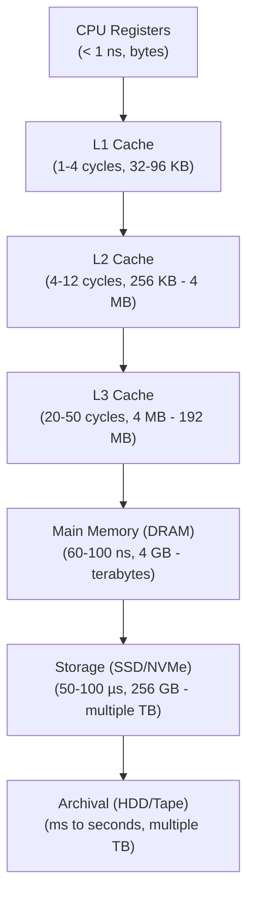
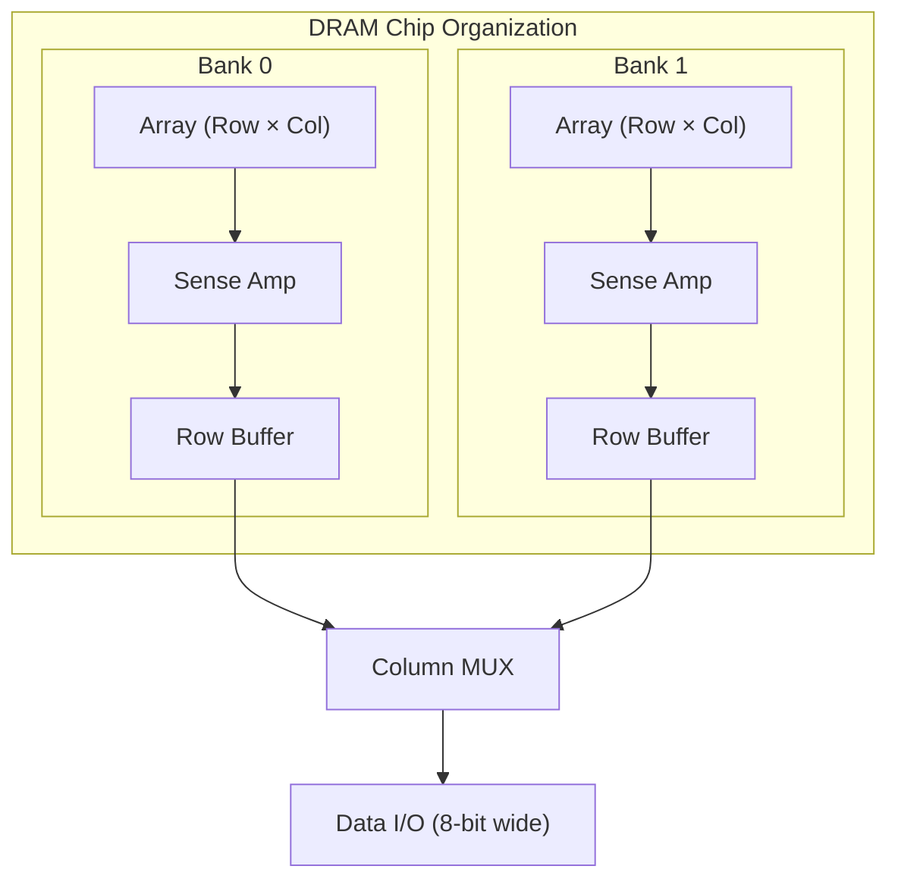
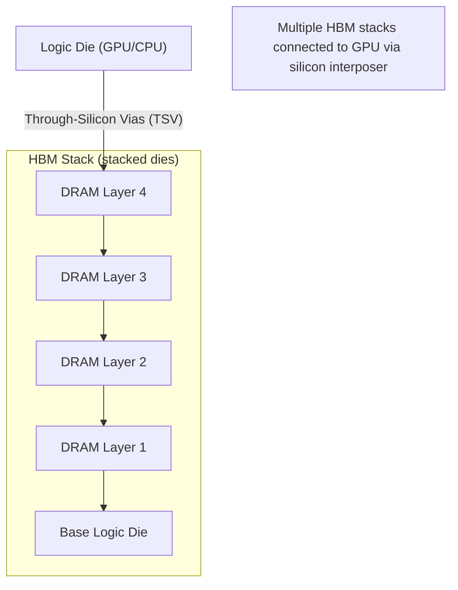
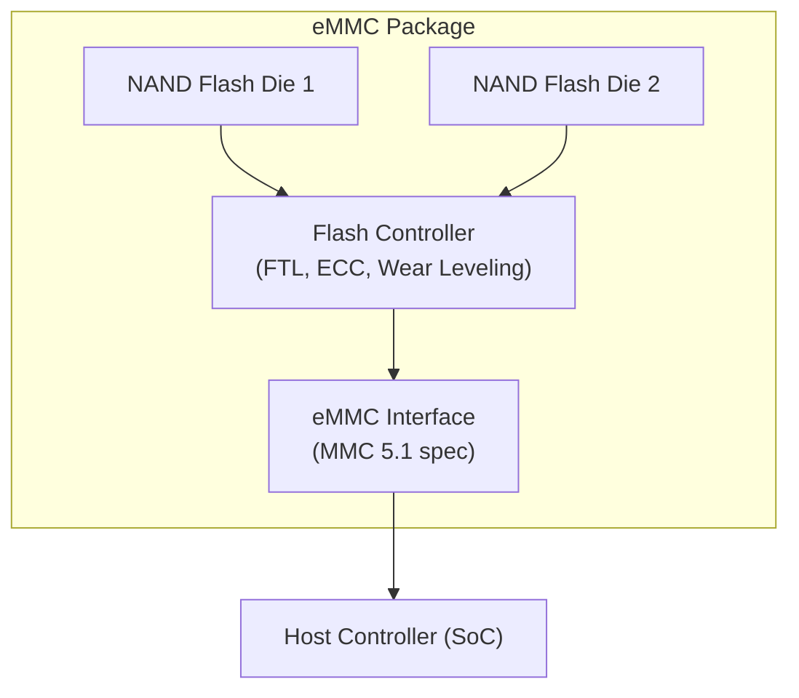
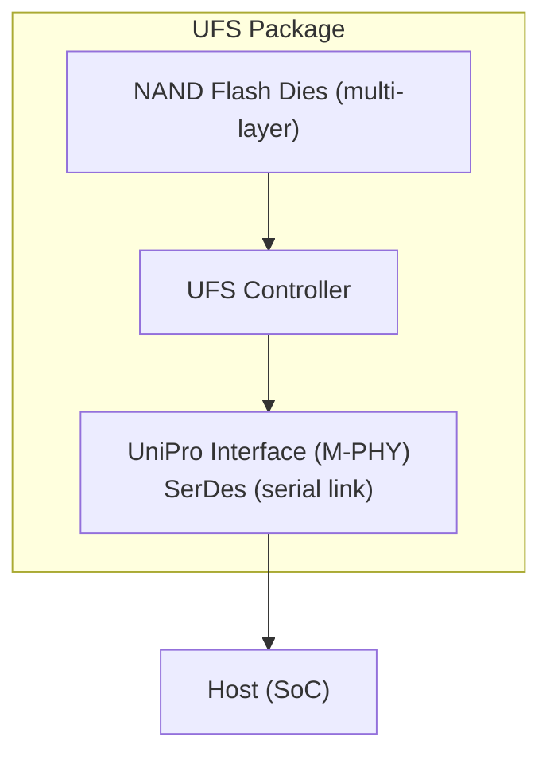
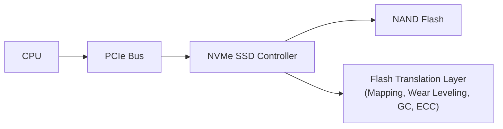

# Chapter 14: Memory Systems — From Cache to Mass Storage

## 14.1 Memory Hierarchy Overview

Modern computers use a **hierarchy of memory** technologies, trading off speed, capacity, and cost:



**Key principle:** Locality of reference makes this hierarchy work.
- **Temporal locality:** Recently accessed data will be accessed again soon
- **Spatial locality:** Data near recently accessed locations will be accessed soon

**Memory technologies:**
| Level        | Technology    | Speed      | Cost/GB  |
|--------------|--------------|------------|----------|
| Registers    | Flip-flops   | < 1 ns     | N/A      |
| L1/L2 Cache | SRAM         | 1-10 ns    | ~$10,000 |
| L3 Cache     | SRAM         | 10-50 ns   | ~$1,000  |
| Main Memory  | DRAM (DDR)   | 50-100 ns  | ~$5-10   |
| SSD (NVMe)  | NAND Flash   | 50-100 µs  | ~$0.10   |
| HDD          | Magnetic     | 5-10 ms    | ~$0.02   |

---

## 14.2 SRAM — Static Random Access Memory

### SRAM Cell Structure (6-Transistor Cell)

The standard SRAM cell uses **6 MOSFETs** to store 1 bit:

```
         VDD
          │
     ┌────┴────┐
     │    │    │
    PL1  PR1  (cross-coupled inverter pair)
     │    │
    NL1  NR1
     │    │
    NL2  NR2 (access transistors)
     │    │
    BL   BL̄
         (Bit Lines)

Word Line (WL) controls NL2 and NR2
```

**Two cross-coupled inverters** form a bistable latch:
- Cell holds state as long as power is applied
- No refresh needed (unlike DRAM)
- 6 transistors per bit → large area → expensive

**Read operation:**
1. Precharge BL and BL̄ to VDD/2
2. Assert Word Line (WL) — turns on access transistors
3. Cell drives BL to 1 and BL̄ to 0 (or vice versa)
4. Sense amplifier detects small voltage differential
5. Amplifies to full logic level

**Write operation:**
1. Drive BL to new value, BL̄ to complement
2. Assert WL — access transistors connect cell to bit lines
3. New data overpowers the stored state
4. Deassert WL — cell retains new value

### SRAM Characteristics

| Parameter       | Value                          |
|-----------------|-------------------------------|
| Cell size       | 140-200 F² (F = feature size)  |
| Access time     | 0.1-10 ns                      |
| Standby power   | Near zero (CMOS static)        |
| Dynamic power   | αCV²f during access            |
| Refresh needed  | No                             |
| Data retention  | While powered                  |

### SRAM Variants

**Dual-port SRAM:**
- Two complete read/write ports
- Allows simultaneous access from two masters
- Used in register files, FIFOs, graphics buffers

**Content-Addressable Memory (CAM):**
- Search entire memory simultaneously by content
- Parallel comparison of all entries
- Used in TLBs, cache tag lookup, network routers
- **TCAM** (Ternary CAM): entries can be 0, 1, or X (don't care)
  - Used in network ACLs, routing tables

---

## 14.3 DRAM — Dynamic Random Access Memory

### DRAM Cell Structure (1-Transistor, 1-Capacitor)

DRAM stores bits as **charge on a capacitor**:

```
     Word Line (WL)
          │
          ├── [MOSFET Gate]
    BL ───┤
          └── [Capacitor] ─── GND
                  ↑
           Stored charge = 1
           No charge = 0
```

- 1 transistor + 1 capacitor = 1 bit
- **Much smaller** than SRAM → higher density → cheaper
- Capacitor leaks charge over time → **must refresh every 64 ms**

### DRAM Operation

**Read:**
1. Precharge bit line to VDD/2
2. Assert WL — transistor connects capacitor to bit line
3. Charge sharing: tiny voltage change on bit line
   - If cap = full: BL rises slightly above VDD/2
   - If cap = empty: BL falls slightly below VDD/2
4. Sense amplifier detects and amplifies
5. **Read is destructive** — cell must be rewritten after read

**Write:**
1. Drive bit line to desired voltage
2. Assert WL — transistor charges/discharges capacitor

**Refresh:**
- Each row must be read (and rewritten) every 64 ms
- Dedicated refresh controller handles this automatically
- Modern DRAMs: 8192 rows refreshed in 64 ms window
- Refresh overhead: ~1-5% of bandwidth

### DRAM Organization



**Key timing parameters:**
- **tRCD** — Row to Column Delay: time to activate row (~13 ns)
- **CAS Latency (CL)** — Column Address Strobe Latency: cycles from column address to data (15-18 for DDR4)
- **tRP** — Row Precharge time: time to close a row (~13 ns)
- **tRAS** — Row Active time: minimum time a row must stay open

**DRAM Address Multiplex:**
- Row address (RAS) sent first
- Then column address (CAS)
- Reduces address bus pins needed

---

## 14.4 DDR SDRAM — Double Data Rate Synchronous DRAM

### SDR SDRAM (Synchronous DRAM)
- Introduced 1993, transfers data once per clock cycle
- Synchronized to system clock
- 168-pin DIMM, 64-bit wide
- Speeds: 66/100/133 MHz → 533/800/1066 MB/s

### DDR1 — Double Data Rate (1998)
- Transfers data on **both rising and falling edges** of clock
- Effective data rate = 2× clock frequency
- 2.5V supply
- Speeds: DDR-200 to DDR-400 (100-200 MHz clock)
- Bandwidth: 1.6-3.2 GB/s
- 184-pin DIMM

### DDR2 (2003)
- Same concept, higher clock speeds
- 1.8V supply (lower power)
- Prefetch: 4n (fetches 4 bits per cycle internally)
- Speeds: DDR2-400 to DDR2-1066
- Bandwidth: 3.2-8.5 GB/s
- 240-pin DIMM

### DDR3 (2007)
- 1.5V supply (DDR3L: 1.35V)
- Prefetch: 8n
- Speeds: DDR3-800 to DDR3-2133
- Bandwidth: 6.4-17 GB/s
- 240-pin DIMM (different key than DDR2)
- **Most widely used** during 2010-2015

### DDR4 (2014)
- 1.2V supply (lower power)
- Prefetch: 16n with bank grouping
- Speeds: DDR4-1600 to DDR4-3200+ (OC up to 5000+)
- Bandwidth: 12.8-25.6 GB/s per module
- 288-pin DIMM
- Features: CRC error detection, per-bank refresh, DBI (Data Bus Inversion)

### DDR5 (2020)
- 1.1V supply
- Higher per-channel bandwidth, two sub-channels per DIMM
- On-die ECC (error correction within the DRAM chip)
- Speeds: DDR5-4800 to DDR5-8400+
- Bandwidth: 38.4-67.2 GB/s per module
- 288-pin DIMM (different key than DDR4)
- Integrated power management (PMIC on DIMM)

### DDR Evolution Summary

| Standard | Voltage | Prefetch | Bandwidth   | Year |
|----------|---------|----------|-------------|------|
| SDR      | 3.3V    | 1n       | 0.8 GB/s    | 1993 |
| DDR1     | 2.5V    | 2n       | 1.6-3.2 GB/s| 1998 |
| DDR2     | 1.8V    | 4n       | 3.2-8.5 GB/s| 2003 |
| DDR3     | 1.5V    | 8n       | 6.4-17 GB/s | 2007 |
| DDR4     | 1.2V    | 16n      | 12.8-25.6 GB/s| 2014|
| DDR5     | 1.1V    | 16n+sub  | 38.4-67.2 GB/s| 2020|

**Bandwidth formula:**
```
Bandwidth = Clock_Speed × 2 (DDR) × Bus_Width / 8
Example DDR4-3200:
= 1600 MHz × 2 × 64 bits / 8 = 25.6 GB/s
```

---

## 14.5 LPDDR — Low Power DDR (Mobile Memory)

Designed for mobile devices, laptops, and embedded systems:

### LPDDR4 / LPDDR4X
- 1.1V / 0.6V (LPDDR4X even lower)
- Two 16-bit channels per package
- Speed: up to 4266 MT/s
- Used in: smartphones, tablets, Raspberry Pi 4

### LPDDR5 / LPDDR5X
- 1.05V supply
- Speed: up to 6400 MT/s (LPDDR5X: 8533 MT/s)
- Deep power-down modes for better battery life
- On-die ECC
- Used in: iPhone 15/16, Samsung Galaxy S24, Apple M-series

### LPDDR vs DDR Comparison
| Feature       | DDR5           | LPDDR5         |
|---------------|----------------|----------------|
| Voltage       | 1.1V           | 1.05V          |
| Form Factor   | DIMM (discrete)| Package-on-Package (PoP) or embedded |
| Channels      | 1 (64-bit)     | 2 × 16-bit     |
| Max speed     | 8400 MT/s      | 8533 MT/s      |
| Power states  | Basic          | Many deep-sleep |
| Target        | Desktop/Server | Mobile/SoC     |

**Package-on-Package (PoP):**
- LPDDR stacked directly on top of SoC
- Shorter traces → lower power, lower latency
- Used in Apple M-series (unified memory)

---

## 14.6 HBM — High Bandwidth Memory

### Architecture

HBM is a revolutionary memory technology using **3D stacking**:



**Key features:**
- **Wide bus:** 1024 bits per stack (vs 64-bit for LPDDR)
- **High bandwidth:** 400-1200+ GB/s total (for GPU with 4-8 stacks)
- Very short connections → low power per bit
- Limited capacity (up to 24-48 GB per stack)

### HBM Generations

| Version | Speed/Pin | Bandwidth/Stack | Layers | Year |
|---------|-----------|-----------------|--------|------|
| HBM1    | 1 Gbps    | 128 GB/s        | 4      | 2015 |
| HBM2    | 2 Gbps    | 256 GB/s        | 8      | 2016 |
| HBM2E   | 3.6 Gbps  | 460 GB/s        | 12     | 2019 |
| HBM3    | 6.4 Gbps  | 819 GB/s        | 12-16  | 2022 |
| HBM3E   | 9.6 Gbps  | 1.2 TB/s        | 16     | 2024 |

**Used in:** AMD Radeon RX 480/Vega, NVIDIA H100/A100/H200, AMD EPYC with 3D V-Cache

### CoWoS (Chip-on-Wafer-on-Substrate)
- TSMC's packaging that places GPU + HBM on silicon interposer
- Very high bandwidth connection between chips
- Used in NVIDIA H100 (80 GB HBM3, 3.35 TB/s bandwidth)

---

## 14.7 GDDR — Graphics DDR Memory

Optimized for **graphics cards** — high bandwidth but higher power than LPDDR:

### GDDR5/5X/6/6X Evolution

| Version | Speed     | Bandwidth  | Year | Used In         |
|---------|-----------|------------|------|-----------------|
| GDDR5   | 8 Gbps    | 256 GB/s   | 2008 | GTX 980, RX 480 |
| GDDR5X  | 14 Gbps   | 448 GB/s   | 2016 | GTX 1080        |
| GDDR6   | 16 Gbps   | 512 GB/s   | 2018 | RTX 2080, RX 6800|
| GDDR6X  | 21 Gbps   | 672+ GB/s  | 2020 | RTX 3090/4090   |
| GDDR7   | 32 Gbps   | 1 TB/s+    | 2024 | RTX 5090        |

**GDDR6 architecture:**
- 16-bit channels per chip
- PAM4 signaling (4 levels per symbol = 2 bits)
- Much higher per-pin bandwidth than DDR

**Bandwidth calculation:**
```
RTX 4090: 21 Gbps × 384-bit bus / 8 = 1008 GB/s
```

---

## 14.8 Flash Memory — Non-Volatile Storage

### Basic Flash Cell

Flash memory stores bits by trapping electrons in a **floating gate** transistor:

```
         Word Line (Control Gate)
                │
          ┌─────┴─────┐
          │  Control  │
          │   Gate    │
          │───────────│
          │  Oxide    │  ← High voltage tunneling oxide
          │   Layer   │
          │───────────│
          │  Floating │  ← Electrons trapped here
          │   Gate    │
          │───────────│
          │ Thin Oxide│  ← Fowler-Nordheim tunneling
          └─────┬─────┘
         Source─┤       ├─Drain
                └───────┘
                Substrate
```

**Program (write 0):** Apply high voltage → electrons tunnel through thin oxide into floating gate → raises threshold voltage → transistor reads as "0"

**Erase (write 1):** Apply high negative voltage → electrons tunnel out of floating gate → lowers threshold voltage → transistor reads as "1"

**Endurance:**
- Each program/erase (P/E) cycle degrades the oxide
- SLC: ~100,000 P/E cycles
- MLC: ~10,000 P/E cycles
- TLC: ~3,000 P/E cycles
- QLC: ~1,000 P/E cycles

### NAND Flash

NAND structure — cells connected in series like NAND gate:

```
    Bit Line
       │
      [Cell 7]
      [Cell 6]
      [Cell 5]
      [Cell 4]
      [Cell 3]  ← String of 32-128 cells
      [Cell 2]
      [Cell 1]
      [Cell 0]
       │
     Source Line
```

**Organization:**
- Page: 4-16 KB (smallest unit for read/program)
- Block: 256-1024 pages (smallest unit for erase)
- Plane: hundreds of blocks
- Die: multiple planes
- Package: 1-16 dies

**Operations:**
- Read: ~25-100 µs (page)
- Program (write): ~200-2000 µs (page)
- Erase: ~1.5-5 ms (block)

**Types by bits per cell:**

| Type | Bits/Cell | States | Capacity | Speed | Endurance |
|------|-----------|--------|----------|-------|-----------|
| SLC  | 1         | 2      | Low      | Fastest | ~100K cycles |
| MLC  | 2         | 4      | 2×       | Fast  | ~10K cycles |
| TLC  | 3         | 8      | 3×       | Medium | ~3K cycles |
| QLC  | 4         | 16     | 4×       | Slow  | ~1K cycles |
| PLC  | 5         | 32     | 5×       | Slowest | ~100 cycles |

**3D NAND (V-NAND):**
- Stack cell layers vertically (instead of shrinking horizontally)
- Samsung V-NAND, Micron 3D NAND, Intel QLC NAND
- 96-layer, 128-layer, 176-layer, 232-layer+ available (2024)
- Higher density, better endurance than planar NAND at same node

### NOR Flash

NOR structure — cells connected in parallel like NOR gate:

```
    Bit Line
       │
    ──[Cell]──
    ──[Cell]──
    ──[Cell]──  ← Each cell independently accessible
       │
     GND
```

**Compared to NAND:**
| Feature      | NOR Flash         | NAND Flash         |
|--------------|-------------------|--------------------|
| Access       | Random (byte)     | Block/page         |
| Read speed   | Fast (80-100 ns)  | Slow (25+ µs)      |
| Write speed  | Very slow         | Fast (page)        |
| Density      | Low (expensive)   | High (cheap)       |
| Erase size   | 64-128 KB sectors | 256 KB+ blocks     |
| Execute-in-Place | Yes (XIP)    | No                 |
| Use case     | Code storage, MCU firmware | Storage  |

**XIP (Execute-in-Place):**
- NOR Flash can be mapped into CPU address space
- CPU can fetch instructions directly from NOR Flash
- No need to copy code to RAM first
- Used in: ESP8266, ESP32 (stores program/firmware), microcontrollers

---

## 14.9 eMMC — Embedded MultiMediaCard

### Architecture

eMMC is a **packaged storage solution** containing NAND Flash + controller:



**Flash Translation Layer (FTL):**
- Maps logical addresses to physical NAND pages
- Handles wear leveling (spreads writes evenly)
- Garbage collection (reclaims stale blocks)
- ECC correction for NAND bit errors
- Bad block management

**eMMC Interface:**
- Parallel bus: 8-bit data + cmd + clk = 11 signals
- eMMC 5.1: HS400 mode → 400 MB/s
- Simple, low pin count → used in embedded/mobile

**Where eMMC is used:**
- Smartphones (older/budget)
- Android tablets
- Raspberry Pi (SD card uses eMMC-compatible protocol)
- Smart TVs, IoT devices
- Industrial embedded systems

**eMMC versions:**
| Version | Max Speed | Year |
|---------|-----------|------|
| eMMC 4.5 | 200 MB/s  | 2011 |
| eMMC 5.0 | 400 MB/s  | 2013 |
| eMMC 5.1 | 400 MB/s  | 2015 |

---

## 14.10 UFS — Universal Flash Storage

UFS replaces eMMC in premium mobile devices:

### UFS Architecture



**Key differences from eMMC:**
| Feature      | eMMC 5.1      | UFS 3.1       | UFS 4.0       |
|--------------|---------------|---------------|---------------|
| Interface    | Parallel (8-bit)| Serial (2 lanes)| Serial (2 lanes)|
| Max bandwidth| 400 MB/s      | 2.9 GB/s      | 4.2 GB/s      |
| Queue depth  | 1 (sequential)| 32 (parallel) | 64 (parallel) |
| Power modes  | Basic         | Advanced      | Enhanced      |
| Year         | 2015          | 2020          | 2022          |

**Command queuing:** UFS supports 32-64 parallel outstanding commands → much better random I/O performance (critical for app launch times)

---

## 14.11 NVMe SSDs — Non-Volatile Memory Express

### The NVMe Protocol

NVMe was designed from scratch for NAND Flash over PCIe:



**Why NVMe over SATA:**
- SATA interface was designed for spinning HDDs
- Max SATA bandwidth: 600 MB/s
- NVMe PCIe 4.0 ×4: 7 GB/s sequential read
- NVMe PCIe 5.0 ×4: 14 GB/s sequential read
- IOPS: SATA ~100K, NVMe ~1,000,000

**NVMe architecture:**
- Up to 65,535 I/O queues
- Each queue: up to 65,535 commands
- Compared to SATA: 1 queue, 32 commands
- Eliminates the protocol overhead bottleneck

### NVMe Form Factors

**M.2 (2280):**
```
┌────────────────────────────────────────────────────────────┐
│  NVMe Controller  │ NAND Flash │ NAND Flash │ NAND Flash   │
└────────────────────────────────────────────────────────────┘
         22mm × 80mm (2280)
```
- 2242, 2260, 2280 are common sizes
- M-key connector for NVMe (PCIe), B+M key for SATA

**U.2 (2.5" enterprise):**
- Larger size → more NAND, better thermals
- Used in enterprise servers

**EDSFF (E1.S, E1.L, E3.S):**
- Modern enterprise form factors
- Designed for data center density

### NVMe PCIe Generations

| PCIe Gen | Lanes | Bandwidth  | Example SSD          |
|----------|-------|------------|----------------------|
| PCIe 3.0 | ×4    | 3.5 GB/s   | Samsung 970 EVO      |
| PCIe 4.0 | ×4    | 7.0 GB/s   | Samsung 980 Pro      |
| PCIe 5.0 | ×4    | 14.0 GB/s  | Crucial T705         |
| PCIe 6.0 | ×4    | 28.0 GB/s  | (upcoming)           |

### SSD Controller Architecture

```
┌──────────────────────────────────────────┐
│           NVMe SSD Controller            │
│  ┌──────────┐   ┌────────────────────┐  │
│  │  NVMe/   │   │   Flash Translation│  │
│  │  PCIe    │──>│   Layer (FTL)      │  │
│  │  Interface│  │   - L2P table      │  │
│  └──────────┘   │   - Wear leveling  │  │
│                 │   - Garbage collect│  │
│  ┌──────────┐   │   - Bad block mgmt │  │
│  │   DRAM   │──>│   - ECC engine     │  │
│  │  Cache   │   └────────┬───────────┘  │
│  │(L2P table│            │               │
│  │ staging) │   ┌────────┴───────────┐  │
│  └──────────┘   │   NAND Flash I/F   │  │
│                 │   (8-16 channels)  │  │
│                 └────────────────────┘  │
└──────────────────────────────────────────┘
         │
    NAND Flash Dies
    (8-16 chips per channel × 8-16 channels)
```

**DRAM cache in SSD:**
- Stores L2P (Logical-to-Physical) mapping table
- Speeds up address translation
- DRAM-less SSDs: slower random access, use System Memory Buffer (HMB)

**3D NAND in modern SSDs:**
- Multiple NAND dies in parallel
- Interleaving operations across dies for higher throughput
- Samsung 990 Pro: 128-layer MLC 3D NAND

---

## 14.12 Cache Memory — Detailed Analysis

### L1 Cache

- **Per-core** cache
- Separate I-cache (instructions) and D-cache (data) — Harvard architecture
- Size: 32-96 KB (each)
- Access time: 4-5 cycles
- Associativity: 4-8 way set-associative

**L1 hit rate must be >95%** for good performance

### L2 Cache

- Per-core (usually unified instructions + data)
- Size: 256 KB - 4 MB
- Access time: 12-20 cycles
- Typically larger and slower than L1

### L3 Cache (LLC — Last Level Cache)

- **Shared** across all cores
- Size: 4 MB - 192 MB (server CPUs)
- Access time: 30-50 cycles
- Serves as last resort before main memory

**AMD 3D V-Cache:**
- Extra 64 MB SRAM die stacked **on top** of existing L3
- Connected via TSVs (Through-Silicon Vias)
- AMD Ryzen 7 5800X3D: 96 MB L3 total
- Dramatically improves gaming performance (cache-sensitive workloads)
- AMD EPYC Genoa-X: 1152 MB (1.13 GB) L3 cache!

### Cache Set-Associativity

**Direct-mapped (1-way):**
```
Memory Address → Index → One specific cache set → Check tag
```
- Fast lookup, but conflict misses

**N-way Set-Associative:**
```
Memory Address → Index → Set of N lines → Check all N tags → LRU/RRIP replacement
```
- L1: 4-8 way, L2: 8-16 way, L3: 16-32 way

**Fully Associative:**
- Any memory block → any cache line
- Best hit rate, complex hardware
- Used in TLBs, small caches

### Cache Replacement Policies

| Policy  | Description                         | Complexity |
|---------|-------------------------------------|------------|
| LRU     | Evict least recently used           | High       |
| FIFO    | Evict oldest entry                  | Low        |
| Random  | Evict random entry                  | Low        |
| RRIP    | Re-Reference Interval Prediction    | Medium     |
| SRRIP   | Static RRIP (good for scan workloads)| Medium   |

**Belady's Optimal:** Evict line that won't be used for longest time — theoretically optimal but requires future knowledge (impossible in hardware, used for comparison)

### Write Policies

**Write-Through:**
- Every write → update cache AND memory simultaneously
- Memory always up-to-date
- Higher memory bandwidth
- Used in: L1 caches sometimes

**Write-Back:**
- Write to cache only
- Mark cache line as "dirty"
- Write to memory only when line is evicted
- Requires dirty bit per cache line
- Lower memory bandwidth
- Used in: most modern L2/L3 caches

**Write-Allocate (Fetch-on-Write):**
- On write miss: fetch block into cache, then write
- Usually paired with write-back

**No-Write-Allocate:**
- On write miss: write directly to memory, no cache fetch
- Usually paired with write-through

### Cache Coherence — MESI Protocol

In multicore systems, multiple caches can hold copies of the same memory line. MESI ensures consistency:

**States:**
| State    | Meaning                                       |
|----------|-----------------------------------------------|
| **M** (Modified)   | Only copy, dirty (differs from memory)      |
| **E** (Exclusive)  | Only copy, clean (matches memory)           |
| **S** (Shared)     | Multiple clean copies exist                 |
| **I** (Invalid)    | Line not valid (treat as absent)            |

**State transitions:**
```
Processor read miss:
  I → E (if no other cache has it)
  I → S (if another cache has it — S state for both)

Processor write:
  E → M (can write without bus transaction)
  S → M (must invalidate all other copies first — "write invalidate")
  I → M (write miss: fetch + invalidate others)

Other processor reads our M-state line:
  M → S (flush to memory, then share)

Other processor writes:
  S → I (invalidated by bus snoop)
  M → I (flushed and invalidated)
```

**Bus snooping:**
- All cache controllers monitor the bus
- See transactions from other caches
- Update their own state accordingly

**Extended protocols:**
- **MOESI:** Adds O (Owned) state — allows dirty sharing without writing back to memory
- **MESIF:** Adds F (Forward) state for NUMA systems
- AMD uses MOESI, Intel uses MESIF

---

## 14.13 Virtual Memory and the TLB

### Virtual Memory System

Every process gets its own **virtual address space**:
- 64-bit Linux: 128 TB user + 128 TB kernel = 256 TB virtual space
- Physical RAM may be only 8-64 GB
- OS maps virtual pages → physical frames dynamically
- Pages not in RAM → disk (swap) — huge performance hit (page fault)

### Page Tables

**4-Level Page Table (x86-64):**
```
Virtual Address (48-bit used):
┌────────┬────────┬────────┬────────┬──────────────┐
│ PML4   │  PDP   │   PD   │   PT   │   Offset     │
│ 9 bits │ 9 bits │ 9 bits │ 9 bits │   12 bits    │
└────────┴────────┴────────┴────────┴──────────────┘

PML4[index] → PDPT
PDPT[index] → PD
PD[index]   → PT
PT[index]   → Physical Page Frame Number
Physical Address = PFN + 12-bit offset
```

**Page size:** 4 KB standard (2 MB and 1 GB huge pages also supported)

### TLB — Translation Lookaside Buffer

Walking 4 levels of page table = **4 memory accesses** for every instruction fetch/data access → catastrophically slow!

**TLB caches recent virtual→physical translations:**
```
Virtual Page Number → [TLB Lookup] → Physical Frame Number (1 cycle!)
                          ↓ Miss
                     Page Table Walk (4+ memory accesses)
                          ↓
                     Update TLB
                     Retry access
```

**TLB organization (Skylake example):**
| TLB         | Size    | Assoc | Latency |
|-------------|---------|-------|---------|
| L1 ITLB     | 128 entries | 8-way | 1 cycle |
| L1 DTLB     | 64 entries  | 4-way | 1 cycle |
| L2 STLB     | 1536 entries| 12-way | 8 cycles |

**TLB shootdown:**
- When OS modifies page table → other CPU TLBs have stale entries
- OS sends IPI (Inter-Processor Interrupt) to all CPUs
- Each CPU executes INVLPG instruction to invalidate entries
- Expensive in multicore systems

**Huge Pages:**
- 2 MB pages → TLB covers 512× more memory per entry
- 1 GB pages → covers 262,144× more memory
- Dramatically reduces TLB pressure for large workloads (databases, HPC)

---

## 14.14 ECC Memory — Error Correction

### Why ECC?

DRAM cells are affected by:
- **Cosmic rays** ionizing silicon → bit flip
- **Alpha particles** from packaging materials
- **Electromagnetic interference**
- **Process variation** at small nodes

Normal RAM: 1 bit error / 1 GB / month → unacceptable for servers

### ECC Implementation

**SECDED — Single Error Correct, Double Error Detect:**

64-bit data + 8-bit ECC = 72-bit wide DIMM (ECC DIMM)

**Hamming code principle:**
- Parity bits placed at power-of-2 positions
- Each parity bit covers specific subset of data bits
- On read, recalculate parity
- If syndrome ≠ 0 → error detected
- Single bit: syndrome points to exact bit → flip it (correct)
- Double bit: syndrome indicates error but can't correct (just detect)

**Chipkill / x4 SDDC:**
- More advanced: can tolerate entire DRAM chip failure
- Used when chips are ×4 width
- IBM invented "Chipkill" technology

### ECC Memory Types

| Type        | Error Handling                    | Use Case           |
|-------------|-----------------------------------|--------------------|
| Non-ECC     | No error correction               | Consumer desktops  |
| ECC UDIMM   | SECDED (1-bit correct)            | Workstations       |
| ECC RDIMM   | Registered + SECDED               | Servers            |
| ECC LRDIMM  | Load-Reduced + SECDED             | High-capacity servers |
| 3DS RDIMM   | 3D stacked + SECDED               | Max capacity       |

**Registered DIMMs (RDIMM):**
- Add register/buffer chip between controller and DRAM
- Reduces electrical load → allows more DIMMs per channel
- Adds 1-cycle latency
- Required for server/enterprise motherboards

**On-Die ECC:**
- Modern NAND Flash and DDR5 have ECC inside the memory chip itself
- Corrects errors before data leaves the chip
- Additional system-level ECC can be layered on top

---

## 14.15 Memory in Embedded Systems

### MCU Memory Types

Typical microcontroller memory map:

```
0xFFFFFFFF ─────────────────────
           │ Peripheral Registers │ (GPIO, UART, etc.)
0x40000000 ─────────────────────
           │  SRAM                │ (Stack, heap, variables)
           │  (8 KB - 512 KB)     │
0x20000000 ─────────────────────
           │  Flash Memory        │ (Program code)
           │  (16 KB - 2 MB)      │
0x08000000 ─────────────────────
           │  System ROM          │ (Bootloader)
0x00000000 ─────────────────────
```

**Flash in MCUs:**
- NOR Flash (execute-in-place)
- Single-time programmable or reprogrammable (10K-100K cycles)
- STM32: 1-4 MB flash, 100K P/E cycles
- ATmega328P: 32 KB flash, 10K cycles
- ESP32: External QSPI NOR Flash (usually 4-16 MB)

**SRAM in MCUs:**
- Standard 6T SRAM
- Small amount on-chip (2 KB - 512 KB)
- Fast access (usually 0-wait state at CPU frequency)

**EEPROM:**
- Electrically Erasable Programmable Read-Only Memory
- Byte-erasable (unlike Flash which is block-erase)
- Very slow (ms per byte write)
- Low endurance (100K cycles)
- Used for: configuration storage, calibration data, serial numbers
- ATmega328P: 1 KB EEPROM on-chip

**External SPI Flash:**
- Winbond W25Q128 — 128 Mbit (16 MB) SPI NOR Flash
- Used with ESP32, STM32 for storing web content, assets, OTA images
- SPI interface: 4-wire (MOSI, MISO, SCK, CS)
- Quad SPI (QSPI): 4 data lines → 4× bandwidth
- Typical read: 50-100 MB/s in QSPI mode

### Memory Optimization in Embedded Systems

**Stack vs Heap:**
- Stack: local variables, function call frames — grows downward
- Heap: dynamic allocation (malloc) — grows upward
- MCUs often have no MMU → stack overflow = undefined behavior!
- Use static allocation, stack canaries, MPU protection

**Code placement:**
```c
// Force variable into specific section
__attribute__((section(".noinit"))) uint32_t crash_count;

// Force function into RAM (faster execution)
__attribute__((section(".ramfunc"))) void fast_isr(void);

// Constants in Flash (not SRAM)
const uint8_t lookup_table[] = {0x00, 0x01, ...};
```

**Harvard vs Von Neumann:**
- AVR (ATmega): True Harvard — separate program/data address spaces
- ARM Cortex-M: Modified Harvard — unified address space but separate I/D cache
- This is why AVR uses `PROGMEM` keyword for Flash-stored constants

---

## 14.16 Complete Memory Comparison Table

| Memory       | Type       | Volatile | Speed      | Density | Cost/GB | Use Case              |
|--------------|------------|----------|------------|---------|---------|----------------------|
| CPU Register | Flip-flop  | Yes      | < 1 ns     | Very low| N/A     | CPU computation      |
| L1 SRAM      | 6T SRAM    | Yes      | 1-4 ns     | Low     | ~$10K   | CPU cache            |
| L3 SRAM      | 6T SRAM    | Yes      | 5-15 ns    | Low     | ~$1K    | CPU LLC cache        |
| DDR5 DRAM    | 1T1C DRAM  | Yes      | 10-14 ns   | High    | ~$7     | System RAM           |
| LPDDR5       | 1T1C DRAM  | Yes      | 10 ns      | High    | ~$8     | Mobile RAM           |
| HBM3         | 3D DRAM    | Yes      | 4-7 ns     | Medium  | ~$500   | GPU/HPC memory       |
| GDDR6        | Specialized| Yes      | 12 ns      | Medium  | ~$30    | Graphics VRAM        |
| NOR Flash    | FG MOSFET  | No       | 80-100 ns  | Medium  | ~$5     | MCU firmware         |
| NAND Flash(SLC)| FG MOSFET| No       | 25 µs page | High    | ~$1     | High-reliability SSD |
| NAND (TLC)   | FG MOSFET  | No       | 200 µs page| Very High| ~$0.10| Consumer SSD        |
| eMMC 5.1     | NAND+ctrl  | No       | ~400 MB/s  | High    | ~$0.20  | Embedded/mobile      |
| UFS 3.1      | NAND+ctrl  | No       | ~2.9 GB/s  | High    | ~$0.25  | Premium mobile       |
| NVMe PCIe5   | NAND+ctrl  | No       | ~14 GB/s   | Very High| ~$0.10| Desktop/server SSD  |
| HDD SATA     | Magnetic   | No       | 100-200 MB/s| VH    | ~$0.02  | Archival/backup      |
| EEPROM       | FG MOSFET  | No       | ms/byte    | Very low| ~$100   | Config storage       |

---

## 14.17 Summary

Memory systems form a carefully designed hierarchy that enables modern computing:

1. **Registers** — Fastest, smallest, in the CPU core itself
2. **SRAM (Cache)** — Fast 6T cells, no refresh, expensive per bit
3. **DRAM (Main Memory)** — 1T1C cells, must refresh, much cheaper than SRAM
4. **DDR evolution** — Each generation: lower voltage, higher bandwidth, more efficient
5. **Specialized DRAM** — LPDDR (mobile), HBM (AI/GPU), GDDR (graphics)
6. **NAND Flash** — Non-volatile, SLC/MLC/TLC/QLC trade endurance for density
7. **NOR Flash** — Byte-addressable, execute-in-place, used in MCU firmware
8. **eMMC/UFS** — NAND + controller packaged for mobile/embedded
9. **NVMe SSD** — PCIe-connected NAND for maximum storage bandwidth
10. **ECC** — Error correction critical for servers, now integrated into DDR5/LPDDR5

The key trade-off throughout the hierarchy:
- **Faster = more expensive, less dense, often volatile**
- **Slower = cheaper, more dense, can be non-volatile**

Modern systems use all these types simultaneously, with hardware and software working together to present a seamless memory model to applications.
