# Chapter 15: Microcontroller Architecture — Inside the MCU

## 15.1 MCU vs MPU vs SoC — Key Differences

Understanding the terminology before diving in:

### Microcontroller (MCU)
- **Self-contained computer** on a single chip
- Integrated: CPU + Flash + RAM + peripherals
- Designed for **embedded control** applications
- Runs without external memory (usually)
- Low power, low cost, deterministic
- Examples: ATmega328P, STM32F103, PIC16F, nRF52840

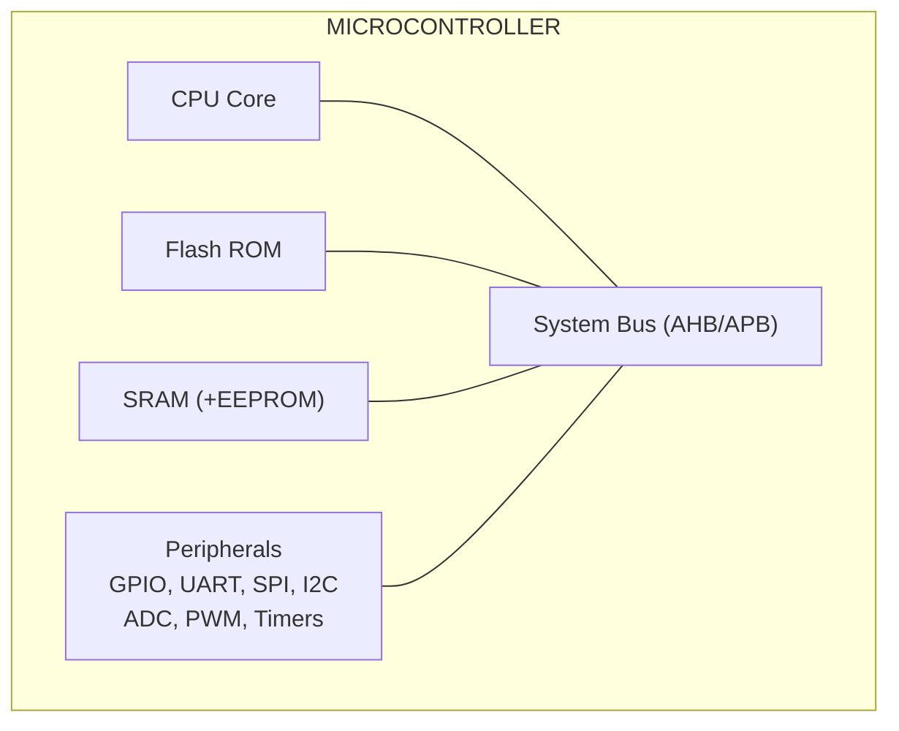

### Microprocessor (MPU)
- Just the CPU — **no integrated memory or peripherals**
- Requires external RAM, ROM, and peripheral chips
- High performance, designed for general-purpose computing
- Examples: Intel Core i9, AMD Ryzen, ARM Cortex-A
- Used in PCs, laptops, servers

### System-on-Chip (SoC)
- Like an MCU but with higher performance, more peripherals, often external RAM
- CPU cores + GPU + DSP + memory controllers + WiFi/BT + camera ISP + video encoder
- Examples: Apple M4, Qualcomm Snapdragon, Raspberry Pi BCM2711, ESP32
- Often includes or interfaces with external LPDDR

### FPGA (Field-Programmable Gate Array)
- **Reconfigurable logic** — not a CPU
- Thousands to millions of programmable logic elements
- Can implement any digital circuit
- Used for prototyping, DSP, custom hardware accelerators
- Examples: Xilinx Artix-7, Intel Cyclone V, Lattice iCE40

---

## 15.2 MCU Internal Architecture

### Complete Internal Block Diagram

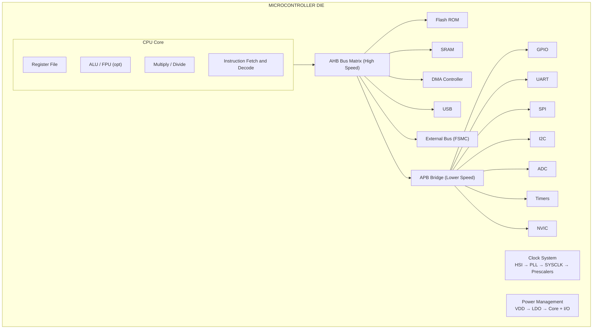

---

## 15.3 Clock System

### Clock Sources

Modern MCUs have multiple clock sources:

**HSI (High-Speed Internal):**
- RC oscillator built into chip
- Typical: 8-64 MHz
- Fast startup (microseconds)
- Less accurate (1-2% variation with temperature)
- No external components needed

**HSE (High-Speed External):**
- Crystal oscillator or external clock input
- Very accurate (ppm level)
- Slower startup (milliseconds for crystal stabilization)
- External crystal + load capacitors required

**LSI (Low-Speed Internal):**
- 32-40 kHz RC oscillator
- Powers watchdog timer, RTC in low-power mode
- Very low power consumption

**LSE (Low-Speed External):**
- 32.768 kHz crystal (standard RTC crystal)
- Very accurate for real-time clock
- Requires external 32.768 kHz crystal

### PLL — Phase Locked Loop

PLL multiplies the input clock to higher frequency:

```
              ┌─────────────────────────────────────┐
HSI (8 MHz) →─┤ ÷M (Prescaler)                      │
              │    ↓ (1 MHz)                         │
              │ Phase Detector → Loop Filter → VCO   │
              │                                  ↓   │
              │                           (output)   │
              │ ÷N (Feedback Divider) ←────────────  │
              └─────────────────────────────────────┘
                        ↓
              PLL Output (e.g., 168 MHz)
```

**Formula:**
```
PLLCLK = (HSI / M) × N / P
Example STM32F4:
= (8 MHz / 8) × 336 / 2 = 168 MHz
```

### Clock Distribution

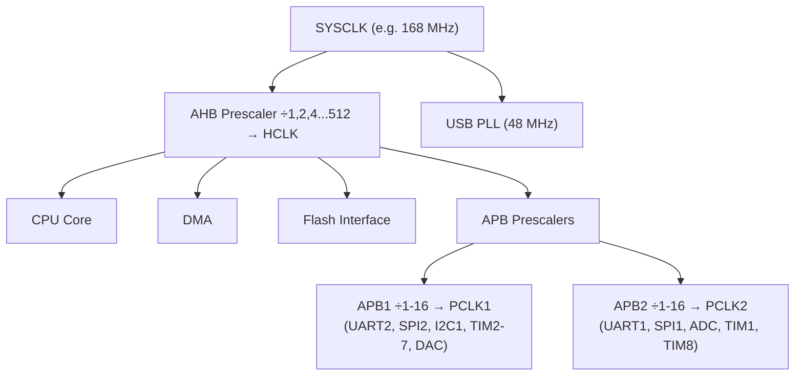

**Why divide?**
- Slower peripherals don't need 168 MHz
- Lower frequency = lower power consumption
- Some peripherals have maximum clock limits

### Watchdog Timer (IWDG/WWDG)

**Watchdog:** Timer that resets the MCU if firmware gets stuck

```
Normal operation:
  Firmware running → "kick" watchdog periodically (reset its counter)
  Watchdog never expires → no reset

Stuck/crashed firmware:
  Firmware not kicking → watchdog expires → RESET!
```

**IWDG (Independent Watchdog):**
- Clocked by LSI (independent of main clock)
- Even works if main clock fails
- Window: 1 ms - 32.768 seconds

**WWDG (Window Watchdog):**
- Must kick within a specific time window (not too early, not too late)
- Helps detect timing deviations (not just hangs)
- Clocked by APB1

---

## 15.4 Reset System

MCU can be reset from multiple sources:

| Reset Source        | Cause                                    |
|--------------------|------------------------------------------|
| Power-on Reset (POR)| VDD rises above threshold at power-up   |
| External Reset (NRST)| RESET pin pulled low externally        |
| Software Reset     | Writing to reset register (SCB->AIRCR)   |
| Watchdog Reset     | IWDG or WWDG counter expired             |
| Low-Power Reset    | Wake from standby exceeds brown-out level|
| Brown-out Reset    | VDD drops below BOR threshold            |
| Option Byte Loader | OBL reset during option byte load        |

**Reset sequence:**
1. All registers set to reset values
2. PC (Program Counter) loaded from reset vector (address 0x00000004 for ARM)
3. SP (Stack Pointer) loaded from address 0x00000000
4. Execution begins at reset handler (startup code)
5. Startup code initializes data sections, BSS, calls SystemInit(), then main()

---

## 15.5 GPIO — General Purpose Input/Output

### GPIO Internal Structure

```
                    VDD
                     │
    Output Mode:     │
    ┌───────────┐   [P-MOS] ← Push-Pull High Drive
    │ Output    │    │
    │ Data Reg  │────┼────── PAD ──── External Pin
    │           │    │
    └───────────┘   [N-MOS] ← Push-Pull Low Drive
                     │
                    GND

    Input Mode:
    PAD ──── [Input Buffer] ──── [Input Data Register]
              │           │
           [Pull-Up]  [Pull-Down]  (optional Schmitt trigger)
```

### GPIO Modes

**Input (Floating):**
- Pin in high-impedance state
- No pull-up or pull-down
- Reads digital logic level
- Risk: floating = undefined state, pick up noise

**Input (Pull-Up):**
- Internal resistor (40-50 kΩ typical) connected to VDD
- Unconnected pin reads HIGH by default
- Button: connects pin to GND when pressed → reads LOW
- Most common for button inputs

**Input (Pull-Down):**
- Internal resistor connected to GND
- Unconnected pin reads LOW by default
- Less common

**Output (Push-Pull):**
- Actively drives HIGH (P-MOS to VDD) or LOW (N-MOS to GND)
- Strong drive capability
- One MCU output per pin (can't connect two outputs together)
- Most common output mode

**Output (Open-Drain):**
- Only drives LOW (N-MOS to GND) or releases (high-Z)
- Must use external pull-up resistor for HIGH state
- Allows multiple devices on same wire (I2C uses this!)
- Can level-shift: MCU at 3.3V driving 5V bus (with 5V pull-up)

**Alternate Function (AF):**
- Pin controlled by internal peripheral (UART, SPI, I2C, PWM, etc.)
- Each pin has multiple AF mappings (selected via AF register)
- STM32 has AF0-AF15 for each pin

**Analog:**
- Disables digital buffer
- Pin connected to ADC or DAC
- No Schmitt trigger (preserves analog signal)

### GPIO Output Speed (Drive Strength)

```
STM32 GPIO Output Speed:
  Low:    2 MHz   (minimal EMI, most applications)
  Medium: 10 MHz  (general purpose)
  High:   50 MHz  (SPI, fast signals)
  Very High: 100 MHz (camera, high-speed bus)
```

Higher speed = steeper edges = more EMI (electromagnetic interference)
Only use high speed when necessary.

### GPIO Bit-Banding (ARM Cortex-M3/M4)

Special memory region where each bit has its own 32-bit address:
```c
// Normal register write (read-modify-write — not atomic):
GPIOA->ODR |= (1 << 5);  // Set PA5

// Bit-band alias (atomic single write):
#define BITBAND_SRAM(addr,bit) (*(volatile uint32_t*)(0x22000000 + ((addr-0x20000000)*32) + bit*4))
```

---

## 15.6 Interrupts and NVIC

### Interrupt Concept

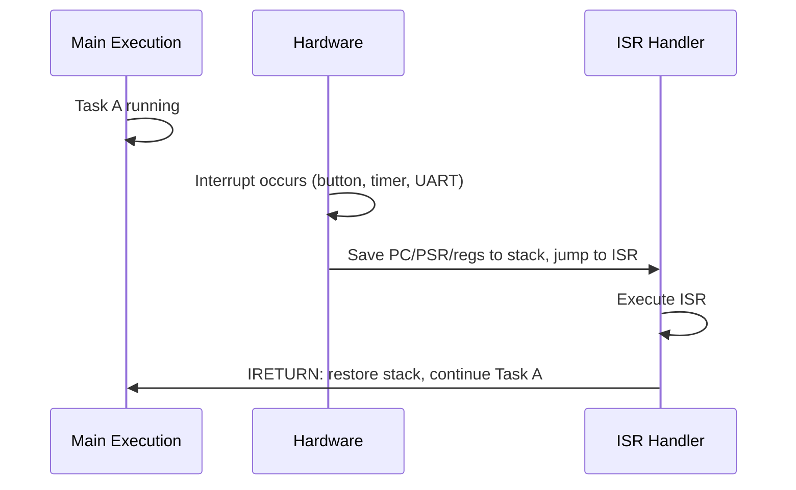

### NVIC — Nested Vectored Interrupt Controller

ARM Cortex-M's dedicated interrupt controller:

**Key features:**
- Supports up to 240 external interrupts (MCU-specific count)
- 8-256 priority levels (configurable)
- **Nested interrupts:** Higher priority ISR can interrupt lower priority ISR
- **Tail-chaining:** Back-to-back ISRs without full save/restore overhead
- **Late arrival:** New higher-priority interrupt arrives while saving state → skip to new ISR
- Deterministic **12-cycle** interrupt latency (Cortex-M4)

**Interrupt priority grouping:**
```
Priority Register (8 bits, but often 4 bits implemented):
Bits [7:4] = Preemption priority (determines nesting)
Bits [3:0] = Sub-priority (determines order when same preemption priority)
```

**Vector Table (ARM Cortex-M):**
```
Address      Interrupt Vector
0x00000000   Initial Stack Pointer value
0x00000004   Reset Handler
0x00000008   NMI Handler
0x0000000C   HardFault Handler
0x00000010   MemManage Fault Handler
0x00000014   BusFault Handler
0x00000018   UsageFault Handler
...
0x00000040   SysTick Handler
0x00000044   IRQ0 (WWDG)
0x00000048   IRQ1 (PVD)
... (MCU-specific peripheral interrupts)
```

**Programming NVIC:**
```c
// Enable USART1 interrupt
HAL_NVIC_SetPriority(USART1_IRQn, 0, 0);  // Preemption=0, Sub=0 (highest)
HAL_NVIC_EnableIRQ(USART1_IRQn);

// ISR function name must match vector table
void USART1_IRQHandler(void) {
    if (USART1->SR & USART_SR_RXNE) {
        uint8_t data = USART1->DR;
        // Process received byte
    }
}
```

### SysTick Timer

- **24-bit down-counter** built into Cortex-M core
- Used as system tick by RTOS (FreeRTOS uses it for 1 ms tick)
- Fires interrupt when counter reaches 0, reloads, repeats

```c
// Configure 1ms SysTick
SysTick_Config(SystemCoreClock / 1000);  // fires every 1ms

void SysTick_Handler(void) {
    uwTick++;  // HAL tick counter
    // RTOS: scheduler tick, task switching
}
```

---

## 15.7 ADC — Analog to Digital Converter

### ADC Fundamentals

The ADC converts an **analog voltage** to a **digital number**:

```
Vin (0-3.3V) → ADC → 12-bit number (0-4095)

Resolution: 3.3V / 4096 = 0.805 mV per step (12-bit)

Formula: Digital = (Vin / Vref) × (2^N - 1)
```

**Key parameters:**
- **Resolution:** Number of bits (8, 10, 12, 16-bit)
- **Sample Rate:** Samples per second (kSPS, MSPS)
- **ENOB:** Effective Number Of Bits (always less than ideal due to noise)
- **INL/DNL:** Integral/Differential Non-Linearity (accuracy measures)
- **Reference voltage (Vref):** Sets the full-scale range

### SAR ADC — Successive Approximation Register

Most MCUs use SAR ADC:

```
Vin ──── Comparator ──── Output
             │     ↑
            SAR    │
           Logic   │
             │     │
           n-bit DAC
```

**Algorithm (binary search):**
```
N=12 bits, Vref=3.3V, Vin=2.0V
Step 1: Try 2048 (mid) → DAC = 1.65V → Vin > 1.65V → keep bit [11]=1
Step 2: Try 3072 → DAC = 2.475V → Vin < 2.475V → bit [10]=0
Step 3: Try 2560 → DAC = 2.0625V → Vin < 2.0625V → bit [9]=0
Step 4: Try 2304 → DAC = 1.856V → Vin > 1.856V → bit [8]=1
...continue for 12 steps
Result: ~2480 (2.0V / 3.3V × 4095 ≈ 2480)
```

Each conversion takes N clock cycles (12 for 12-bit SAR).

### ADC Conversion Modes

**Single Mode:**
- Convert once, then stop
- Triggered by software or external event

**Continuous Mode:**
- Convert repeatedly without software trigger
- Useful for real-time monitoring

**Scan Mode:**
- Automatically scan through multiple channels in sequence
- ADC1 → ADC2 → ADC3 → ... → back to ADC1
- Combined with DMA for background multi-channel acquisition

**Injected Mode:**
- High-priority conversion that interrupts regular conversion
- Useful for safety monitoring (overcurrent detection)

### ADC Input Conditioning

```
Sensor → [Anti-aliasing filter] → [Level shifter] → ADC pin

Example: 0-5V sensor → 3.3V MCU ADC
  R1 = 47 kΩ, R2 = 100 kΩ
  Voltage divider: V_ADC = V_sensor × R2/(R1+R2)
                          = 5V × 100/147 = 3.4V (need to account for this)
```

**Important: ADC pin protection:**
- Never exceed Vref on analog input!
- Use voltage clamping diodes or TVS diodes
- Current must be limited (typically ≤ 1 mA through protection diodes)

### STM32 ADC Example

```c
// STM32 HAL ADC reading
ADC_HandleTypeDef hadc1;

// Initialize in CubeMX or manually
hadc1.Instance = ADC1;
hadc1.Init.Resolution = ADC_RESOLUTION_12B;
hadc1.Init.ScanConvMode = DISABLE;
hadc1.Init.ContinuousConvMode = DISABLE;

// Start and read
HAL_ADC_Start(&hadc1);
HAL_ADC_PollForConversion(&hadc1, 100);  // timeout 100ms
uint32_t value = HAL_ADC_GetValue(&hadc1);
float voltage = (value / 4095.0f) * 3.3f;
```

---

## 15.8 DAC — Digital to Analog Converter

**Converts digital value → analog voltage:**

```
Digital (0-4095) → DAC → Vout (0 to Vref)
Vout = (Digital / 2^N) × Vref
```

**R-2R Ladder DAC (common implementation):**
```
D3 ──[2R]──┐
            ├──[R]──┐
D2 ──[2R]──┤        │
            ├──[R]──┤
D1 ──[2R]──┤        ├── Vout
            ├──[R]──┤
D0 ──[2R]──┘        │
                   [2R]
                     │
                    GND
```

**MCU DAC uses:**
- Audio generation (beeper, simple audio output)
- Variable voltage reference (sensors, comparators)
- Signal generation (waveforms)
- Bias voltage for analog circuits

**STM32 DAC example (triangle wave):**
```c
HAL_DAC_Start(&hdac, DAC_CHANNEL_1);

while(1) {
    for(int i = 0; i < 4096; i++) {
        HAL_DAC_SetValue(&hdac, DAC_CHANNEL_1, DAC_ALIGN_12B_R, i);
        HAL_Delay(1);
    }
    for(int i = 4095; i >= 0; i--) {
        HAL_DAC_SetValue(&hdac, DAC_CHANNEL_1, DAC_ALIGN_12B_R, i);
        HAL_Delay(1);
    }
}
```

---

## 15.9 Timers and PWM

### Timer Structure

MCU timers are incredibly versatile:

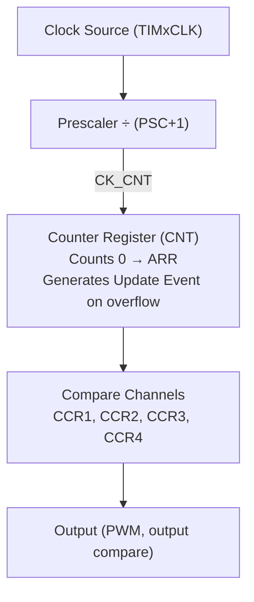

**Timer frequency calculation:**
```
Timer Update Frequency = TIMxCLK / ((PSC+1) × (ARR+1))

Example: TIM2 on 72 MHz APB1, PSC=71, ARR=999
Freq = 72,000,000 / (72 × 1000) = 1000 Hz = 1 kHz (1 ms period)
```

### PWM — Pulse Width Modulation

PWM generates a fixed-frequency signal with variable duty cycle:

```
100% duty cycle: ┌────────────────────────────────┐
                  │                                │
                 ─┘                                └─

50% duty cycle:  ┌───────────┐           ┌───────────┐
                  │           │           │           │
                 ─┘           └───────────┘           └─

10% duty cycle:  ┌──┐                         ┌──┐
                  │  │                         │  │
                 ─┘  └─────────────────────────┘  └─────
```

**PWM parameters:**
- **Period** = 1/f (set by ARR)
- **Duty Cycle** = CCR / (ARR+1) × 100%
- **Frequency:** typically 50 Hz (servo), 1-100 kHz (DCDC), 20 kHz+ (audio)

**PWM mode 1 operation:**
```
CNT < CCR → Output HIGH
CNT ≥ CCR → Output LOW
```

**Applications:**
- **Motor control:** Duty cycle sets average voltage → controls speed
- **LED brightness:** Human eye perceives average brightness
- **Servo motors:** 50 Hz, 1-2 ms pulse = 0°-180°
- **DC-DC converters:** High frequency (100-500 kHz) switching
- **Audio (Class D amp):** PWM at 250-500 kHz, filter extracts audio

**PWM code example (Arduino):**
```c
// Pin 9 = Timer1 OC1A on ATmega328P
// analogWrite sets duty cycle 0-255
analogWrite(9, 128);  // 50% duty cycle

// STM32 HAL PWM:
TIM_OC_InitTypeDef sConfig = {0};
sConfig.OCMode = TIM_OCMODE_PWM1;
sConfig.Pulse = 500;  // CCR value (50% if ARR=999)
HAL_TIM_PWM_ConfigChannel(&htim2, &sConfig, TIM_CHANNEL_1);
HAL_TIM_PWM_Start(&htim2, TIM_CHANNEL_1);
```

### Input Capture

Timers can also **measure** input signals:

```
External Signal Edge → Hardware captures CNT value → Stored in CCR
```

Used for:
- Measuring pulse width (e.g., HC-SR04 ultrasonic: measure echo pulse)
- Measuring frequency of unknown signal
- Detecting encoder pulses

### Encoder Interface Mode

Quadrature encoder decoding in hardware:
```
Channel A: ─┐  ┌─┐  ┌─
             └──┘  └──
Channel B: ──┐  ┌─┐  ┌
              └──┘  └──

Rotation direction determined by phase relationship
Hardware counts up/down automatically
Timer CNT = position
```

Used in: DC motor encoders, CNC machines, industrial automation

---

## 15.10 UART — Universal Asynchronous Receiver/Transmitter

### UART Protocol

UART is the simplest serial communication protocol:

```
Idle: ─────────────────────────────────────────────────────────
      HIGH (mark)

Start: ─────┐                                           ┌─────
            │  Start  D0   D1   D2   D3   D4   D5   D6  D7  │Stop
            └──[LOW]──┤──┤──┤──┤──┤──┤──┤──┤──┤──┤──┤──┤──┘
                 1     1    1    1    1    1    1    1    1   1 bit time
```

**Frame structure:**
- 1 start bit (always LOW)
- 5-9 data bits (LSB first, usually 8 bits)
- Optional parity bit (even/odd/none)
- 1-2 stop bits (always HIGH)

**Baud rate:** Bits per second (bps)
```
Common baud rates: 9600, 19200, 38400, 57600, 115200, 230400, 921600 bps
Bit time at 9600 baud = 1/9600 = 104.17 µs
Bit time at 115200 baud = 1/115200 = 8.68 µs
```

**UART timing tolerance:**
- Both sides must be within ±2-4% of each other for reliable communication
- That's why baud rate must match on both ends

### UART Variants

**RS-232:**
- ±12V signaling
- True RS-232 requires MAX232 level converter for MCU (3.3/5V)
- DB9 or DB25 connector (legacy)
- Up to ~115200 baud typically

**RS-485:**
- Differential signaling (A and B lines)
- Up to 10 Mbps, up to 1200 meter cable
- Multi-drop: up to 32 devices on one bus
- Half-duplex (single direction at a time)
- Used in industrial systems (Modbus RTU)

**TTL UART (most MCUs):**
- 3.3V or 5V signaling
- Short range (on-board or very short cables)
- What Arduino/ESP32/STM32 GPIO pins do

### UART in MCU Hardware

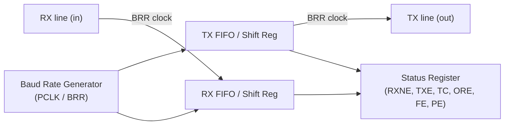

**Status flags:**
| Flag | Meaning                               |
|------|---------------------------------------|
| RXNE | RX Not Empty — data ready to read    |
| TXE  | TX Empty — can write next byte        |
| TC   | Transmission Complete                 |
| ORE  | Overrun Error — data lost             |
| FE   | Framing Error — stop bit not found    |
| PE   | Parity Error                          |
| NE   | Noise Error                           |

**Polling vs Interrupt vs DMA:**
```c
// Polling (blocks CPU):
HAL_UART_Transmit(&huart1, buffer, length, timeout);

// Interrupt (CPU free, ISR called when done):
HAL_UART_Transmit_IT(&huart1, buffer, length);
void HAL_UART_TxCpltCallback(UART_HandleTypeDef *huart) { /* done */ }

// DMA (best: CPU completely free, hardware does transfer):
HAL_UART_Transmit_DMA(&huart1, buffer, length);
```

---

## 15.11 SPI — Serial Peripheral Interface

### SPI Protocol

SPI is a **synchronous, full-duplex** serial bus:

```
Master:          SCK  ────────────────────────────────────
                      ┌──┐  ┌──┐  ┌──┐  ┌──┐  ┌──┐  ┌──┐
                      │  │  │  │  │  │  │  │  │  │  │  │
                 MOSI D7 D6 D5 D4 D3 D2 D1 D0

                 MISO ← Slave sends data at same time

                 CS   ─┐                              ┌─
(active LOW)           └──────────────────────────────┘

4 wires: MOSI, MISO, SCK (clock), CS/SS (chip select)
Full duplex: Master sends AND receives simultaneously
```

**SPI Modes (CPOL × CPHA):**
| Mode | CPOL | CPHA | Clock Idle | Data Captured |
|------|------|------|------------|---------------|
| 0    | 0    | 0    | LOW        | Rising edge   |
| 1    | 0    | 1    | LOW        | Falling edge  |
| 2    | 1    | 0    | HIGH       | Falling edge  |
| 3    | 1    | 1    | HIGH       | Rising edge   |

**Data rate:** Up to 50 MHz+ (much faster than UART or I2C)

**Multiple slaves:**

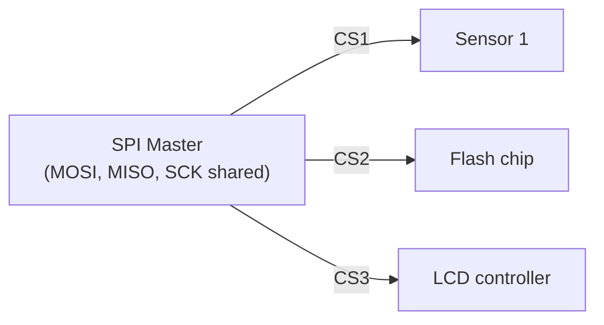

> Pull CS low to select a slave; others remain HIGH (deselected).

**Use cases:** High-speed sensors (IMU, ADC), SD cards, NOR/NAND Flash, displays, DACs

**SPI transaction example:**
```c
// STM32 SPI send byte
HAL_GPIO_WritePin(CS_GPIO_Port, CS_Pin, GPIO_PIN_RESET);  // CS low
HAL_SPI_Transmit(&hspi1, &tx_data, 1, 100);              // Send
HAL_GPIO_WritePin(CS_GPIO_Port, CS_Pin, GPIO_PIN_SET);    // CS high

// Full duplex: send command, receive response
HAL_SPI_TransmitReceive(&hspi1, tx_buf, rx_buf, 4, 100);
```

---

## 15.12 I2C — Inter-Integrated Circuit

### I2C Protocol

I2C is a **multi-master, multi-slave** bus using only **2 wires**:

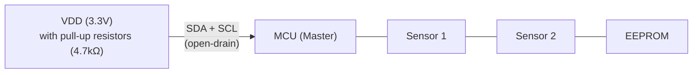

> Open-drain lines: devices can only pull LOW; pull-up pulls HIGH. Bus high = no device driving → idle.

**I2C Transaction:**
```
START: SDA falls while SCL is HIGH (unique condition)
ADDRESS: 7-bit device address + R/W bit
ACK: Slave pulls SDA low to acknowledge
DATA: 8-bit bytes with ACK after each
STOP: SDA rises while SCL is HIGH

START [ADDR(7-bit) + W/R] ACK [DATA BYTE] ACK [DATA BYTE] ACK STOP
```

**7-bit addresses:** 128 possible addresses (0-127)
- But 0-7 and 120-127 are reserved → 112 usable
- Common addresses: MPU-6050=0x68, SSD1306=0x3C, AT24C=0x50, BMP280=0x76

**10-bit addresses:** Extended for 1024 devices (less common)

**Bus speeds:**
| Mode       | Speed   | Year |
|------------|---------|------|
| Standard   | 100 kHz | 1982 |
| Fast       | 400 kHz | 1992 |
| Fast-Plus  | 1 MHz   | 2007 |
| High-Speed | 3.4 MHz | 1992 |
| Ultra-Fast | 5 MHz   | 2012 |

**Pull-up resistor calculation:**
```
Rise time must be fast enough for the speed mode
R_pullup = (VDD - VOL_max) / I_OL

For 400 kHz: 1 kΩ - 4.7 kΩ
For 100 kHz: 4.7 kΩ - 10 kΩ
```

**I2C Example:**
```c
// Read MPU-6050 who_am_i register (0x75)
uint8_t tx_buf[1] = {0x75};  // Register address
uint8_t rx_buf[1];

HAL_I2C_Master_Transmit(&hi2c1, 0x68 << 1, tx_buf, 1, 100);  // Send register
HAL_I2C_Master_Receive(&hi2c1, 0x68 << 1, rx_buf, 1, 100);   // Read value
// rx_buf[0] should be 0x68 (who_am_i value)

// Or using combined Master_Mem functions:
HAL_I2C_Mem_Read(&hi2c1, 0x68 << 1, 0x75, I2C_MEMADD_SIZE_8BIT, rx_buf, 1, 100);
```

### I2C vs SPI Comparison

| Feature       | SPI              | I2C               |
|---------------|------------------|-------------------|
| Wires         | 4+ (CS per slave)| 2 (shared)        |
| Speed         | 10-100 MHz       | 0.1-5 MHz         |
| Duplex        | Full duplex      | Half duplex       |
| Addressing    | CS pin per slave | 7-bit address     |
| Hardware      | Simple           | Open-drain, complex|
| Protocol      | No ack protocol  | ACK after each byte|
| Best for      | High speed, few devices | Many devices, low speed |

---

## 15.13 CAN Bus — Controller Area Network

### CAN Overview

Designed by Bosch (1983) for automotive networks:

**CAN physical layer:**

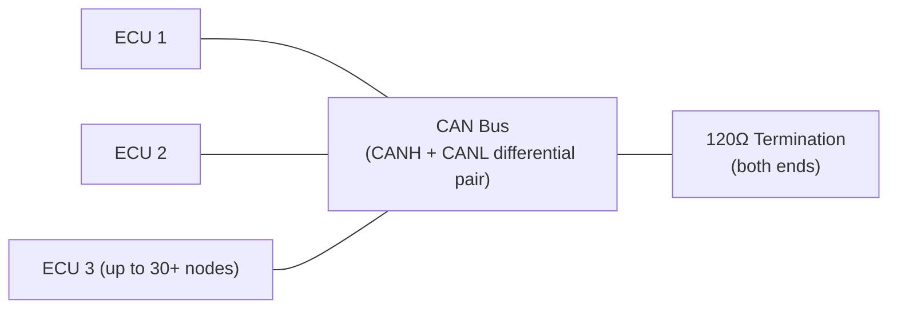

> Differential signaling: Dominant (0): CANH=3.5V, CANL=1.5V. Recessive (1): CANH=CANL=2.5V. Up to 40 meters at 1 Mbps.

**Key CAN feature: Non-destructive arbitration**
- Multiple nodes can start transmitting simultaneously
- Node with lower ID (more dominant bits) wins
- Losers detect collision and back off immediately
- No data corruption, no retry needed

**CAN frame:**
```
SOF | ID(11-bit) | RTR | Control | Data(0-8 bytes) | CRC | ACK | EOF
     ────────────────────────────────────────────────────────────────
```

**Speeds:**
- CAN 2.0: up to 1 Mbps (up to 40 meters)
- CAN FD (Flexible Data-rate): up to 8 Mbps data phase, 64-byte payload
- CAN XL: up to 20 Mbps, 2048-byte payload

**Used in:** Automotive ECUs, industrial machinery, medical devices, elevators

---

## 15.14 DMA — Direct Memory Access

### Why DMA?

Without DMA, CPU must do all data transfers:
```c
// CPU-driven UART receive (wastes CPU time):
for(int i = 0; i < 1000; i++) {
    while(!(USART1->SR & USART_SR_RXNE));  // Wait for byte
    buffer[i] = USART1->DR;               // Read byte
}
```

**With DMA, hardware transfers data autonomously:**
```
Setup once:
  Source: UART data register
  Destination: buffer[] in SRAM
  Count: 1000 bytes
  Mode: Circular or One-shot

Then DMA hardware:
  Reads UART DR automatically when RXNE fires
  Writes to buffer[i] and increments pointer
  When done: triggers interrupt
  CPU free to do other work!
```

### DMA Controller Architecture

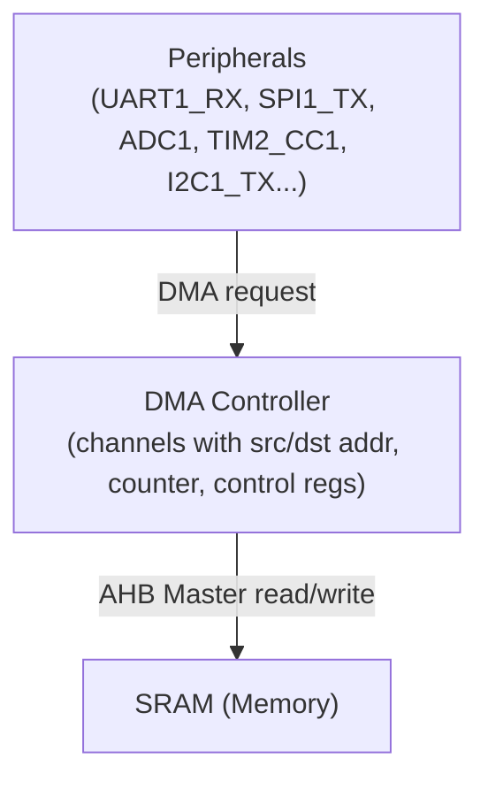

**DMA transfer types:**
- **Peripheral → Memory** (UART RX, ADC → buffer)
- **Memory → Peripheral** (buffer → UART TX, SPI TX)
- **Memory → Memory** (memcpy via DMA)

**DMA modes:**
| Mode      | Description                                       |
|-----------|--------------------------------------------------|
| Normal    | Transfer N bytes, then stop, interrupt at end    |
| Circular  | Continuous loop: restart when counter reaches 0  |
| Double Buffer | Two buffers alternated (ping-pong)          |

**Circular DMA example (ADC continuous sampling):**
```c
// ADC continuously samples 4 channels into circular buffer
// Half-complete and complete callbacks process data
// CPU never blocked by sampling

uint32_t adc_buffer[4 * 100];  // 100 samples of 4 channels

HAL_ADC_Start_DMA(&hadc1, adc_buffer, 400);  // Start circular DMA

// Called when first half filled:
void HAL_ADC_ConvHalfCpltCallback(ADC_HandleTypeDef *hadc) {
    process_samples(adc_buffer, 200);  // Process first half
}

// Called when second half filled (wraps around):
void HAL_ADC_ConvCpltCallback(ADC_HandleTypeDef *hadc) {
    process_samples(adc_buffer + 200, 200);  // Process second half
}
```

---

## 15.15 USB in MCUs

### USB Overview

USB (Universal Serial Bus) is a complex protocol with multiple layers:

**Physical layer:**
- USB 2.0: Differential pair (D+ and D-), 480 Mbps (HS) or 12 Mbps (FS)
- USB 3.x: Additional SuperSpeed pairs (TX+/TX- and RX+/RX-), 5/10/20 Gbps

**USB device classes (relevant for MCUs):**
| Class | Description            | Example              |
|-------|------------------------|----------------------|
| CDC   | Virtual COM port       | Arduino USB serial   |
| HID   | Human Interface Device | Keyboard, mouse, gamepad |
| MSC   | Mass Storage           | USB flash drive      |
| Audio | Audio streaming        | USB microphone/speaker|
| MIDI  | Musical instruments    | USB MIDI controller  |
| DFU   | Device Firmware Update | Bootloader USB update|

**MCU USB implementation:**
- Most STM32 with USB: Internal Full-Speed (12 Mbps) USB PHY
- High-Speed requires external ULPI PHY chip (e.g., USB3320)
- USB stack handles: enumeration, control transfers, interrupt/bulk/isochronous
- Libraries: STM32 USB Device Library, TinyUSB (cross-platform)

---

## 15.16 Power Management

### Voltage Regulators in MCUs

Most MCUs have internal voltage regulation:
```
External VDD (3.3V) → LDO → Core voltage (1.0-1.2V for logic)
                           → I/O voltage (3.3V for GPIO)
                           → Analog voltage (for ADC, DAC)
```

**Brown-out detector (BOD):**
- Monitors VDD
- If VDD drops below threshold → reset MCU
- Prevents MCU from running with corrupted data at low voltage

### Sleep/Low-Power Modes (STM32 example)

| Mode      | CPU | Clocks    | Peripherals | Current | Wake-up     |
|-----------|-----|-----------|-------------|---------|-------------|
| Run       | On  | Full      | Active      | ~30 mA  | Always      |
| Sleep     | Off | Some on   | Active      | ~1 mA   | Any interrupt|
| Stop 0    | Off | LSI/LSE   | Select few  | ~100 µA | RTC, EXTI   |
| Stop 1    | Off | LSI/LSE   | Fewer       | ~50 µA  | RTC, EXTI   |
| Standby   | Off | LSI/LSE   | Minimal     | ~2 µA   | WKUP pin, RTC|
| Shutdown  | Off | None      | None        | ~0.1 µA | WKUP pin    |

**VBAT:** Separate battery pin keeps RTC and backup registers alive even when main power off.

### Power Consumption Calculation

```
Average current = I_active × duty_cycle + I_sleep × (1 - duty_cycle)

Example: MCU wakes every 1 second for 10 ms
I_active = 10 mA, I_sleep = 10 µA
duty_cycle = 10 ms / 1000 ms = 1%

I_avg = 10 mA × 0.01 + 0.01 mA × 0.99 = 0.1 + 0.0099 ≈ 0.11 mA

Battery life = 2000 mAh / 0.11 mA ≈ 18,181 hours ≈ 2 years
```

---

## 15.17 Bootloader

A **bootloader** is small program that runs on reset before the main application:

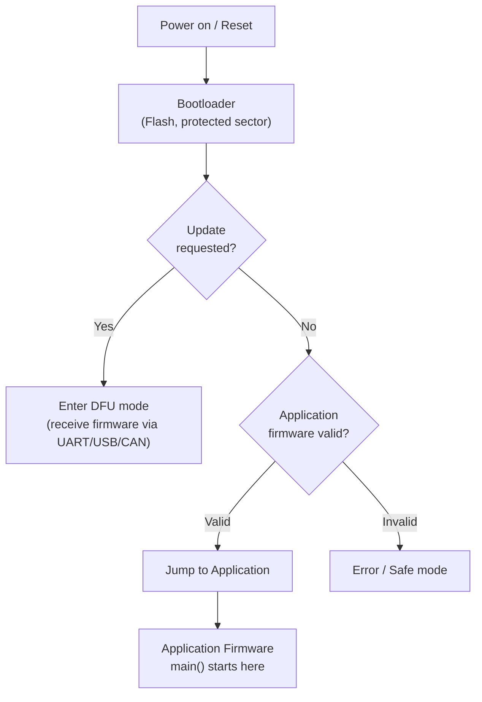

**Jump to application:**
```c
typedef void (*pFunction)(void);

void bootloader_jump_to_app(uint32_t app_address) {
    // Verify stack pointer is valid
    if (((*(__IO uint32_t*)app_address) & 0x2FFE0000) == 0x20000000) {
        // Set MSP (Main Stack Pointer)
        __set_MSP(*(__IO uint32_t*)app_address);
        // Get reset handler address
        pFunction JumpToApp = (pFunction)(*(__IO uint32_t*)(app_address + 4));
        // Jump!
        JumpToApp();
    }
}
```

---

## 15.18 Summary — MCU Architecture

A microcontroller integrates everything needed for embedded control:

1. **CPU Core** — Executes instructions (ARM Cortex-M, AVR, PIC, etc.)
2. **Memory** — Flash (program), SRAM (data), EEPROM (config)
3. **Clock System** — HSI/HSE oscillators + PLL for frequency multiplication
4. **Reset System** — POR, watchdog, external, software resets
5. **GPIO** — Digital I/O with configurable modes (push-pull, open-drain, AF)
6. **Interrupts (NVIC)** — Nested, prioritized, deterministic interrupt handling
7. **ADC** — SAR ADC for reading analog sensors
8. **DAC** — Generating analog outputs
9. **Timers** — PWM generation, input capture, encoder interface
10. **UART** — Simple asynchronous serial (debugging, GPS, HC-05 Bluetooth)
11. **SPI** — Fast synchronous serial (sensors, Flash, displays)
12. **I2C** — Two-wire multi-device bus (sensors, EEPROMs)
13. **CAN** — Automotive/industrial differential bus
14. **DMA** — Autonomous data transfer without CPU involvement
15. **USB** — High-speed host interface (CDC, HID, MSC)
16. **Power Management** — Multiple sleep modes for battery operation

The next chapters cover specific MCU families in detail:
- Chapter 16: Arduino/AVR
- Chapter 17: ESP32/Xtensa
- Chapter 18: STM32/ARM Cortex-M
- Chapter 19: Raspberry Pi/ARM Cortex-A
