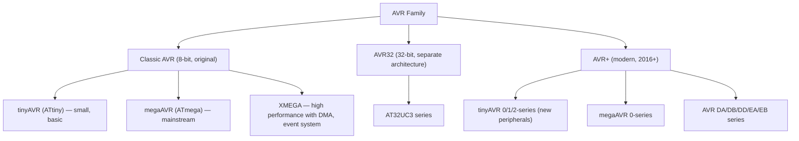
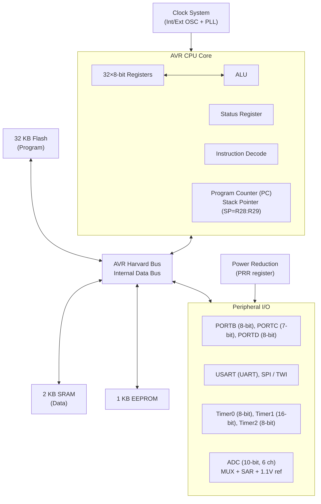
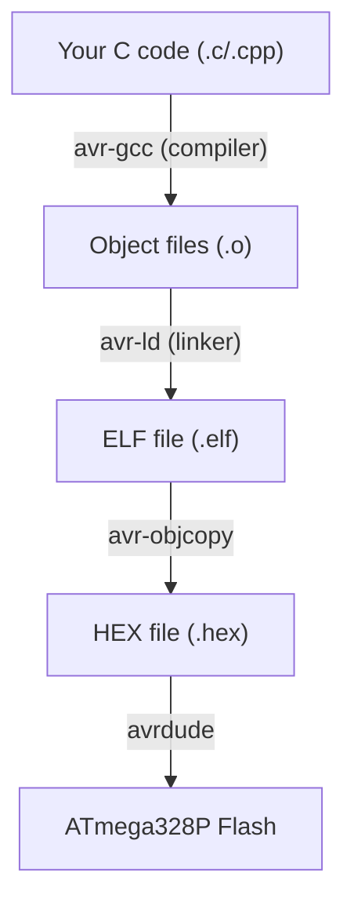

# Chapter 16: Arduino and AVR Architecture

## 16.1 History of AVR

### Origin

AVR is a family of 8-bit RISC microcontrollers developed by **Atmel Corporation** (now Microchip Technology) in 1996. The name "AVR" reportedly stands for:
- **A**lf-Egil Bogen and **V**egard Wollan's **R**ISC processor (the two Norwegian students who designed it at NTH Trondheim)

**Key design goals:**
- RISC architecture optimized for C language
- Single-cycle execution of most instructions
- Harvard architecture (separate program/data memory)
- Flash-based (reprogrammable unlike older OTP/ROM MCUs)
- Built-in peripherals (UART, SPI, I2C, ADC, timers)

### AVR Family Tree



---

## 16.2 ATmega328P — The Arduino Uno Brain

The ATmega328P is the most famous AVR, powering the Arduino Uno.

### Full Specifications

| Parameter          | Value                              |
|--------------------|------------------------------------|
| Architecture       | AVR (8-bit RISC)                   |
| CPU Speed          | Up to 20 MHz (Uno runs at 16 MHz)  |
| Flash Program Memory | 32 KB (512 bytes bootloader)     |
| SRAM               | 2 KB                               |
| EEPROM             | 1 KB                               |
| I/O Pins           | 23 programmable                    |
| ADC                | 10-bit, 6 channels (8 on TQFP-32) |
| UART               | 1× USART                           |
| SPI                | 1× SPI (hardware)                  |
| I2C (TWI)          | 1× Two Wire Interface              |
| Timers             | 2× 8-bit, 1× 16-bit                |
| PWM Channels       | 6                                  |
| Comparator         | 1× Analog comparator               |
| Watchdog           | Yes (internal 128 kHz RC)          |
| Operating Voltage  | 1.8-5.5V                           |
| Power consumption  | Active: ~6 mA @ 8 MHz, 3V         |
|                    | Power-down: 0.1 µA                 |
| Package            | DIP-28, TQFP-32, MLF-32            |
| Instruction set    | 131 instructions                   |

### ATmega328P Internal Block Diagram



---

## 16.3 AVR CPU Architecture

### Harvard Architecture

AVR uses **strict Harvard architecture**:
- Program memory (Flash): 16-bit wide, addressed by 16-bit PC (up to 64K words = 128 KB)
- Data memory (SRAM): 8-bit wide, separate address space
- Register file: 32 general-purpose 8-bit registers

```
Data Memory Map (ATmega328P):
0x0000 - 0x001F   General Purpose Registers (R0-R31) → 32 bytes
0x0020 - 0x005F   I/O Registers (64 registers: SREG, SP, PORTB...)
0x0060 - 0x00FF   Extended I/O (160 registers: UART, SPI, etc.)
0x0100 - 0x08FF   Internal SRAM (2048 bytes = 2 KB)

Program Memory Map:
0x000000 - 0x003FFF  Application Flash (up to 0x3FFF words = 32 KB)
0x003E00 - 0x003FFF  Bootloader section (512 words if enabled)
```

**Why PROGMEM matters:**
- In C, string literals would go to SRAM (wasting precious 2 KB!)
- `PROGMEM` attribute stores data in Flash instead
- `pgm_read_byte()` required to read it back

```c
// Bad: takes 13 bytes of SRAM
const char msg[] = "Hello World!";

// Good: stored in Flash, reads via pgm_read_byte
const char msg[] PROGMEM = "Hello World!";

void setup() {
    Serial.print((__FlashStringHelper*)msg);  // Arduino helper
    // or manually:
    for(int i = 0; i < strlen_P(msg); i++) {
        Serial.print((char)pgm_read_byte(msg + i));
    }
}
```

### Register File

AVR has 32 × 8-bit general-purpose registers (R0-R31):

```
R0  - used for multiplication result LSB, temp
R1  - multiplication result MSB (cleared by compiler convention)
R2  - R15: general purpose
R16 - R31: general purpose + support immediate instructions

Special register pairs (16-bit pointer registers):
X = R27:R26 (XH:XL) — indirect addressing
Y = R29:R28 (YH:YL) — indirect addressing + displacement
Z = R31:R30 (ZH:ZL) — indirect addressing + program memory access (LPM)

SREG (Status Register):
Bit 7: I — Global Interrupt Enable
Bit 6: T — Bit Copy Storage
Bit 5: H — Half Carry Flag
Bit 4: S — Sign bit (N XOR V)
Bit 3: V — Two's complement overflow
Bit 2: N — Negative flag
Bit 1: Z — Zero flag
Bit 0: C — Carry flag
```

### Instruction Set

AVR has 131 instructions, most execute in **1 clock cycle**:

**Arithmetic:**
```asm
ADD  Rd, Rr      ; Rd = Rd + Rr (1 cycle)
ADC  Rd, Rr      ; Rd = Rd + Rr + C (1 cycle)
SUB  Rd, Rr      ; Rd = Rd - Rr (1 cycle)
MUL  Rd, Rr      ; R1:R0 = Rd × Rr (2 cycles)
INC  Rd           ; Rd = Rd + 1 (1 cycle)
DEC  Rd           ; Rd = Rd - 1 (1 cycle)
```

**Data movement:**
```asm
LDI  Rd, K        ; Rd = immediate K (1 cycle, R16-R31 only!)
MOV  Rd, Rr       ; Rd = Rr (1 cycle)
LD   Rd, X        ; Rd = SRAM[X] (2 cycles)
ST   X, Rr        ; SRAM[X] = Rr (2 cycles)
LDS  Rd, k        ; Rd = SRAM[k] (2 cycles)
STS  k, Rr        ; SRAM[k] = Rr (2 cycles)
LPM  Rd, Z        ; Rd = Flash[Z] (3 cycles) — program memory read
IN   Rd, A        ; Rd = I/O[A] (1 cycle)
OUT  A, Rr        ; I/O[A] = Rr (1 cycle)
PUSH Rr           ; SP--, SRAM[SP] = Rr (2 cycles)
POP  Rd           ; Rd = SRAM[SP], SP++ (2 cycles)
```

**Branch/control:**
```asm
RJMP  k           ; PC = PC + k (2 cycles)
RCALL k           ; push PC, PC = PC + k (3 cycles)
RET               ; pop PC (4 cycles)
RETI              ; pop PC, enable interrupts (4 cycles)
BREQ  k           ; if Z=1: PC += k (1-2 cycles)
BRNE  k           ; if Z=0: PC += k
BRCS  k           ; if C=1: PC += k
NOP               ; no operation (1 cycle)
SEI               ; set I flag (enable interrupts)
CLI               ; clear I flag (disable interrupts)
SLEEP             ; enter sleep mode
WDR               ; watchdog reset
```

**Bit manipulation:**
```asm
SBI  A, b          ; Set bit b in I/O register A (2 cycles)
CBI  A, b          ; Clear bit b in I/O register A (2 cycles)
SBIS A, b          ; Skip if bit b in I/O reg set (1-3 cycles)
SBIC A, b          ; Skip if bit b in I/O reg clear
LSL  Rd            ; Logical shift left (= ADD Rd, Rd)
LSR  Rd            ; Logical shift right
ROL  Rd            ; Rotate left through carry
ROR  Rd            ; Rotate right through carry
```

### Pipeline

AVR has a 2-stage pipeline:
```
Cycle N:   Fetch instruction N+1 | Execute instruction N
Cycle N+1: Fetch instruction N+2 | Execute instruction N+1
```

Result: Most instructions execute in 1 clock cycle despite 2-stage pipeline.
Branches flush the pipeline (2-cycle penalty), but AVR has many skip instructions to avoid branches.

---

## 16.4 AVR Memory and Bootloader

### Memory Layout

```
ATmega328P Flash Memory:
┌─────────────────────────────────────────────┐ 0x7FFF (word address)
│                                             │
│         Bootloader Section                  │ 0x3E00 - 0x3FFF
│         (512 words = 1024 bytes)            │
│         BOOTRST fuse → reset jumps here     │
├─────────────────────────────────────────────┤
│                                             │
│         Application Flash                  │
│         (0x0000 - 0x3DFF = 31.5 KB)        │
│         0x0000: Reset vector               │
│         0x0001: INT0 vector                │
│         ...                                │
│         0x001A: SPM_READY vector           │
│         0x001B: Application code starts    │
│                                            │
└─────────────────────────────────────────────┘ 0x0000

SRAM:
┌──────────────────────┐ 0x08FF
│    Free SRAM         │
│   (heap + stack)     │ Stack grows DOWN from 0x08FF
├──────────────────────┤
│   .bss (zero init)   │ Uninitialized globals
├──────────────────────┤
│   .data (init)       │ Initialized globals
├──────────────────────┤ 0x0100
│  Extended I/O Regs   │ 0x0060 - 0x00FF
├──────────────────────┤ 0x005F
│    I/O Registers     │ 0x0020 - 0x005F (SREG, SP, ports...)
├──────────────────────┤ 0x001F
│  Register File R0-R31│ 0x0000 - 0x001F
└──────────────────────┘ 0x0000
```

### Arduino Bootloader (Optiboot)

The Arduino Uno uses **Optiboot** bootloader (512 bytes):
- Listens on UART0 at 115200 baud for 1-2 seconds after reset
- If data received: implements STK500v1 protocol to receive new sketch
- Downloads program over UART, writes to Flash via SPM (Store Program Memory) instruction
- After timeout or completion: jumps to application at 0x0000
- This is why `avrdude` works without external programmer for Uno

**Fuse bits (important hidden configuration):**
```
Low Fuse:  Clock source (crystal/internal/external), clock divide by 8
High Fuse: Brownout detection, bootloader settings (BOOTRST, BOOTSZ)
Extended:  Brownout level selection
Lock Bits: Protect Flash/EEPROM from read/write

Default Uno settings:
Low:  0xFF (external crystal, no clock divide)
High: 0xDE (512 byte boot, BOOTRST enabled, SPI programming enabled)
Ext:  0xFD (BOD at 2.7V)
```

---

## 16.5 AVR Timers

### Timer0 (8-bit) and Timer2 (8-bit)

Used by `millis()`, `micros()`, `delay()`, and `analogWrite()` on pins 5,6 (Timer0) and 3,11 (Timer2).

**Timer0 on Arduino Uno:**
- Configured by Arduino core at 1 kHz (1 ms period)
- Used for millis() and micros() timing
- PWM on pins 5 and 6

**Timer modes:**
| Mode | Name                    | Operation                    |
|------|-------------------------|------------------------------|
| 0    | Normal                  | Counts 0-255, overflows      |
| 1    | PWM, Phase Correct      | Up/Down counting             |
| 2    | CTC (Clear Timer Compare)| Clear on compare match      |
| 3    | Fast PWM                | Up counting, clear on match  |

### Timer1 (16-bit)

The only 16-bit timer on ATmega328P:
- Up to 65535 count (vs 255 for 8-bit)
- Better PWM resolution
- Used for `Servo` library, `Stepper` library
- PWM on pins 9 and 10

```c
// Configure Timer1 for 1 Hz interrupt:
// 16 MHz / 256 prescaler / 62500 = 1 Hz
TCCR1A = 0;
TCCR1B = (1 << WGM12) | (1 << CS12);  // CTC mode, /256 prescaler
OCR1A = 62500;  // Compare match value
TIMSK1 |= (1 << OCIE1A);  // Enable compare match interrupt

ISR(TIMER1_COMPA_vect) {
    // Called every 1 second
    PORTB ^= (1 << PB5);  // Toggle LED (pin 13)
}
```

### PWM Output (analogWrite)

Arduino `analogWrite(pin, value)` sets PWM duty cycle (0-255):
- 0 = 0% duty cycle (constant LOW)
- 255 = 100% duty cycle (constant HIGH)
- Frequency: ~490 Hz (Timer1,Timer2) or ~980 Hz (Timer0)

---

## 16.6 AVR UART

### USART Configuration

```c
// Manual USART setup (9600 baud, 16 MHz, no parity, 8-bit, 1 stop)
#define BAUD 9600
#define BAUD_PRESCALE ((F_CPU / (16UL * BAUD)) - 1)  // = 103

UBRR0H = (uint8_t)(BAUD_PRESCALE >> 8);
UBRR0L = (uint8_t)(BAUD_PRESCALE);
UCSR0B = (1 << RXEN0) | (1 << TXEN0);   // Enable RX and TX
UCSR0C = (1 << UCSZ01) | (1 << UCSZ00); // 8-bit data

// Send byte:
while (!(UCSR0A & (1 << UDRE0)));  // Wait for TX buffer empty
UDR0 = byte;                        // Load byte

// Receive byte:
while (!(UCSR0A & (1 << RXC0)));   // Wait for data
return UDR0;                        // Read byte
```

---

## 16.7 Arduino Platform

### What is Arduino?

Arduino is both:
1. **Hardware:** Open-source PCB designs with AVR/ARM MCUs
2. **Software:** IDE + libraries + bootloader + simplified C++ API

**Key contribution:** Made microcontrollers accessible to non-engineers
- `pinMode()`, `digitalWrite()`, `analogRead()` abstractions
- Wiring language (C++ with simplified API)
- Free IDE (now Arduino IDE 2.0 with VS Code-like interface)
- Massive library ecosystem

### Arduino Boards Overview

#### Arduino Uno R3

```
┌──────────────────────────────────────────────────────┐
│                    Arduino Uno R3                    │
│                                                      │
│  MCU: ATmega328P (DIP-28)                           │
│  USB-Serial: ATmega16U2 (or CH340G in clone boards) │
│  Power: 7-12V DC or USB 5V                          │
│  Voltage: 5V logic, 3.3V available (50 mA max)     │
│  Digital I/O: 14 pins (6 PWM: 3,5,6,9,10,11)       │
│  Analog Input: 6 pins (A0-A5, 10-bit ADC)           │
│  Flash: 32 KB, SRAM: 2 KB, EEPROM: 1 KB            │
│  Clock: 16 MHz crystal                              │
│  Current per pin: 40 mA max (200 mA total)          │
│                                                      │
│  Connectors:                                         │
│  - Power: VIN, 5V, 3.3V, GND, RESET                │
│  - Digital: D0(RX), D1(TX), D2-D13                  │
│  - Analog: A0-A5 (can also be used as D14-D19)     │
│  - ICSP: MISO, MOSI, SCK, RST, VCC, GND            │
│  - I2C: A4(SDA), A5(SCL)                           │
│  - SPI: D10(SS), D11(MOSI), D12(MISO), D13(SCK)   │
└──────────────────────────────────────────────────────┘
```

#### Arduino Mega 2560

- **MCU:** ATmega2560 (100-pin QFP)
- **Flash:** 256 KB, **SRAM:** 8 KB, **EEPROM:** 4 KB
- **Digital I/O:** 54 pins (15 PWM)
- **Analog Input:** 16 pins (A0-A15)
- **UART:** 4× (Serial, Serial1, Serial2, Serial3)
- **I2C:** 1×, **SPI:** 1×
- **Clock:** 16 MHz

Used in: 3D printers (Marlin firmware), CNC machines, complex projects needing many I/O

#### Arduino Nano

- Same ATmega328P as Uno
- **Form factor:** Breadboard-friendly (mini USB, 30-pin)
- Dimensions: 45mm × 18mm
- Direct USB (CH340 on clones)
- Same specs as Uno otherwise

#### Arduino Nano Every

- **MCU:** ATmega4809 (newer megaAVR 0-series)
- **Flash:** 48 KB, **SRAM:** 6 KB
- Same form factor as Nano
- Better ADC (lower noise), one-wire, event system
- 20 MHz clock

#### Arduino Leonardo

- **MCU:** ATmega32U4 (same as Pro Micro)
- **Built-in USB!** (no separate USB-serial chip)
- Can be USB HID: keyboard, mouse, MIDI
- 20 KB Flash, 2.5 KB SRAM
- **Pins:** 20 digital, 12 analog

#### Arduino Pro Mini

- No USB, no voltage regulator (sometimes)
- Tiny: 33mm × 18mm
- **3.3V 8 MHz** or **5V 16 MHz** versions
- Requires external USB-Serial adapter (FTDI/CH340)
- Popular for battery-powered projects

#### Arduino Due

- **MCU:** Atmel SAM3X8E (ARM Cortex-M3, 32-bit!)
- **Flash:** 512 KB, **SRAM:** 96 KB
- **Clock:** 84 MHz
- **3.3V I/O** (not 5V tolerant!)
- DAC: 2 channels, ADC: 12-bit
- 54 digital I/O, 12 analog

#### Arduino MKR Series (SAMD21)

- **MCU:** SAMD21 (ARM Cortex-M0+, 32-bit)
- 3.3V, 48 MHz
- Various models: MKR WiFi 1010, MKR Zero, MKR NB 1500, MKR WAN 1300 (LoRa)
- USB native (HID capable)
- Crypto chip on some models

### Arduino Board Comparison Table

| Board      | MCU        | Flash   | SRAM  | Clock | I/O | Best For             |
|------------|------------|---------|-------|-------|-----|----------------------|
| Uno R3     | ATmega328P | 32 KB   | 2 KB  | 16 MHz| 14  | Learning, basic projects |
| Mega 2560  | ATmega2560 | 256 KB  | 8 KB  | 16 MHz| 54  | Many I/O, 3D printer |
| Nano       | ATmega328P | 32 KB   | 2 KB  | 16 MHz| 14  | Breadboard, space-saving |
| Nano Every | ATmega4809 | 48 KB   | 6 KB  | 20 MHz| 14  | Better Nano          |
| Leonardo   | ATmega32U4 | 32 KB   | 2.5 KB| 16 MHz| 20  | USB HID              |
| Pro Mini   | ATmega328P | 32 KB   | 2 KB  | 16 MHz| 14  | Low power, embedded  |
| Due        | SAM3X8E    | 512 KB  | 96 KB | 84 MHz| 54  | High performance     |
| MKR WiFi   | SAMD21+NINA| 256 KB  | 32 KB | 48 MHz| 8   | WiFi IoT             |

---

## 16.8 Arduino Programming Model

### Structure

Every Arduino sketch has two required functions:

```cpp
void setup() {
    // Runs once at startup/reset
    // Initialize hardware, set pin modes, begin communications
    Serial.begin(9600);
    pinMode(LED_BUILTIN, OUTPUT);
}

void loop() {
    // Runs repeatedly after setup()
    // Main program logic
    digitalWrite(LED_BUILTIN, HIGH);
    delay(1000);
    digitalWrite(LED_BUILTIN, LOW);
    delay(1000);
}

// Arduino's main() (hidden in core):
int main(void) {
    init();    // Sets up timers, ADC (Arduino specific)
    setup();   // Your setup()
    while(1) {
        loop();  // Your loop()
        // On 32U4: serialEventRun() for CDC events
    }
}
```

### Core Functions

**Digital I/O:**
```cpp
pinMode(pin, INPUT);           // Set as input (no pull-up)
pinMode(pin, INPUT_PULLUP);    // Set as input with internal pull-up
pinMode(pin, OUTPUT);          // Set as output

digitalWrite(pin, HIGH);       // Set output HIGH (5V)
digitalWrite(pin, LOW);        // Set output LOW (0V)

int state = digitalRead(pin);  // Read digital value (HIGH or LOW)
```

**Analog I/O:**
```cpp
int val = analogRead(A0);      // Read ADC: returns 0-1023 (10-bit)
// Voltage: val * (5.0/1023.0) = voltage

analogWrite(pin, 0-255);       // PWM: 0 = 0%, 255 = 100%
// Only works on PWM pins: 3,5,6,9,10,11

analogReference(EXTERNAL);     // Use AREF pin as reference
analogReference(INTERNAL);     // 1.1V internal reference
analogReference(DEFAULT);      // VCC (5V or 3.3V)
```

**Timing:**
```cpp
unsigned long t = millis();    // Milliseconds since startup (32-bit, wraps ~49 days)
unsigned long t = micros();    // Microseconds since startup (4 µs resolution)

delay(1000);                   // Block for 1000 ms (blocks everything!)
delayMicroseconds(100);        // Block for 100 µs

// Non-blocking timing (blink without delay pattern):
unsigned long previousMillis = 0;
if (millis() - previousMillis >= interval) {
    previousMillis = millis();
    // Do thing
}
```

**Serial Communication:**
```cpp
Serial.begin(9600);            // Start UART at 9600 baud
Serial.print("Hello");         // Print string
Serial.println("World");       // Print with newline
Serial.print(3.14, 2);         // Print float with 2 decimal places
int x = Serial.read();         // Read one byte (-1 if none)
Serial.available();            // Number of bytes waiting to read
Serial.write(0x41);            // Send raw byte 'A'
```

**Interrupts:**
```cpp
attachInterrupt(digitalPinToInterrupt(2), ISR_function, FALLING);
// Pin 2 = INT0, Pin 3 = INT1 on Uno
// Modes: LOW, CHANGE, RISING, FALLING

void ISR_function() {
    // Keep SHORT — no delay(), no Serial.print()
    // Runs with global interrupts disabled
    count++;  // Atomic on 8-bit AVR
    flag = true;
}

detachInterrupt(digitalPinToInterrupt(2));  // Remove interrupt

noInterrupts();  // Disable all interrupts (= CLI)
interrupts();    // Enable all interrupts (= SEI)
```

### Important Libraries

**Built-in:**
| Library    | Purpose                              |
|------------|--------------------------------------|
| SPI        | SPI bus protocol                     |
| Wire       | I2C (Two Wire Interface)             |
| Serial     | UART (HardwareSerial)               |
| SoftwareSerial | Bit-bang UART on any pin        |
| EEPROM     | Read/write internal EEPROM           |
| Servo      | RC servo control (50 Hz PWM)         |
| SD         | SD card file system (FAT)            |
| LiquidCrystal | 16x2 LCD (HD44780)              |

**Popular third-party:**
| Library          | Purpose                          |
|-----------------|----------------------------------|
| FastLED         | WS2812B addressable LEDs         |
| Adafruit_NeoPixel| WS2812B LEDs                   |
| DHT             | DHT11/DHT22 temp/humidity        |
| OneWire + DallasTemp | DS18B20 temperature sensor |
| Adafruit_BME280 | BME280 temp/humidity/pressure    |
| MPU6050         | IMU gyroscope/accelerometer      |
| TinyGPS++       | NMEA GPS parsing                 |
| IRremote        | IR send/receive                  |
| ArduinoJson     | JSON parsing                     |
| PubSubClient    | MQTT client                      |

---

## 16.9 Programming AVR Without Arduino IDE

### AVR-GCC Toolchain

The underlying toolchain used by Arduino IDE:



**Direct register manipulation (faster than Arduino functions):**
```c
#include <avr/io.h>
#include <util/delay.h>

int main(void) {
    // Set PB5 (Arduino pin 13) as output
    DDRB |= (1 << PB5);

    while(1) {
        PORTB |= (1 << PB5);   // Set HIGH (turn on LED)
        _delay_ms(1000);
        PORTB &= ~(1 << PB5);  // Set LOW (turn off LED)
        _delay_ms(1000);
    }
}
```

**Compile and upload:**
```bash
avr-gcc -mmcu=atmega328p -DF_CPU=16000000UL -O2 -o blink.elf blink.c
avr-objcopy -O ihex blink.elf blink.hex
avrdude -c arduino -p m328p -P /dev/ttyUSB0 -b 115200 -U flash:w:blink.hex
```

### ISP Programming (In-System Programming)

To program without bootloader, use ISP programmer via ICSP header:

**Programmers:**
- USBasp (cheap, open-source, works with avrdude)
- AVRISP mkII (official Atmel programmer)
- Arduino as ISP (use another Arduino as programmer)
- JTAG ICE3 (with debug capability)

**ICSP header pinout:**
```
ICSP Header (6-pin):
1: MISO    2: VCC
3: SCK     4: MOSI
5: RESET   6: GND
```

**Program fuse bits with avrdude:**
```bash
# Read fuses
avrdude -c usbasp -p m328p -U lfuse:r:-:h -U hfuse:r:-:h

# Set 8 MHz internal oscillator (no external crystal needed):
avrdude -c usbasp -p m328p -U lfuse:w:0xE2:m

# WARNING: Wrong fuse bits can "brick" AVR (recoverable with HV programmer)
```

---

## 16.10 Arduino IDE and Alternatives

### Arduino IDE 2.0
- VS Code-based
- Autocomplete, inline errors
- Serial Monitor, Serial Plotter
- Board Manager, Library Manager
- Supports all official boards

### PlatformIO
```ini
# platformio.ini
[env:uno]
platform = atmelavr
board = uno
framework = arduino

; Or for bare-metal AVR:
[env:bare_avr]
platform = atmelavr
board = uno
; No framework = bare C with avr-libc
```

- Advanced IDE plugin (VS Code, CLion, Atom)
- Dependency management
- Unit testing support
- Multiple board support
- Better code intelligence

### Bare-Metal AVR (avr-libc)
```c
#include <avr/io.h>
#include <avr/interrupt.h>
#include <util/delay.h>

// Direct register access, no Arduino overhead
// ~20-30% smaller/faster code than Arduino equivalent
```

---

## 16.11 Modern AVR — AVR DA/DB Series

Microchip (who acquired Atmel in 2016) released modern AVR families:

### AVR128DA48 (2020)
- Architecture: AVR (same instruction set, enhanced)
- Flash: 128 KB, SRAM: 16 KB
- Peripherals: New "Configurable Custom Logic" (CCL), Event System, OPAMP
- ADC: Differential 12-bit
- Clock: Up to 24 MHz
- Supply: 1.8-5.5V

### Key new features:
**Event System:** Hardware-to-hardware connections without CPU


**CCL (Configurable Custom Logic):** 4 LUTs (Look-Up Tables) = 4 logic gates
- Implement small logic functions in hardware
- XOR, NAND, MUX, etc. between pins and peripherals
- Runs at full clock speed, zero latency

**OPAMP on-chip:** AVR128DB28/32 have 3 operational amplifiers built in
- Signal conditioning without external op-amp
- Configurable as voltage follower, non-inverting amplifier, etc.

---

## 16.12 Common Mistakes with Arduino/AVR

### 1. Blocking delays
```cpp
// Bad: blocks everything during delay
while (SomeCondition) {
    doSomething();
    delay(100);  // NOTHING can run during this!
}

// Good: non-blocking timing
unsigned long lastTime = 0;
if (millis() - lastTime >= 100) {
    lastTime = millis();
    doSomething();
}
```

### 2. Integer overflow
```cpp
// Bad: millis() returns unsigned long (32-bit)
int elapsed = millis() - startTime;  // int is 16-bit on AVR! Overflows!

// Good:
unsigned long elapsed = millis() - startTime;
```

### 3. Float on 8-bit AVR
```cpp
// AVR has no FPU — float operations are SLOW (many cycles)
// Use fixed-point or integer arithmetic when possible

// Bad for time-critical code:
float temp = analogRead(A0) * 0.4887;  // ~50 cycles

// Better:
int temp_x10 = (analogRead(A0) * 49) / 100;  // Shift, multiply with integers
```

### 4. Serial.print in ISR
```cpp
// NEVER do this — Serial uses interrupts internally, causes deadlock!
ISR(TIMER1_COMPA_vect) {
    Serial.println("ISR!");  // WRONG! Will hang
}

// Do this instead:
volatile bool flag = false;
ISR(TIMER1_COMPA_vect) {
    flag = true;  // Set flag
}
void loop() {
    if (flag) {
        flag = false;
        Serial.println("Timer fired!");  // Print in main loop
    }
}
```

### 5. SRAM overflow (most common bug!)
```cpp
// ATmega328P only has 2 KB SRAM
// Strings eat SRAM fast

// Bad:
String message = "Hello from sensor " + String(sensorValue) + " units!";
// String class uses heap, fragments SRAM

// Good:
Serial.print(F("Hello from sensor "));  // F() macro stores in Flash!
Serial.print(sensorValue);
Serial.println(F(" units!"));

// Use char arrays, not String:
char buf[32];
snprintf(buf, sizeof(buf), "Sensor: %d", sensorValue);
Serial.println(buf);
```

---

## 16.13 Summary

- **AVR** is an 8-bit Harvard RISC architecture with 32 registers, single-cycle execution for most instructions, and a clean instruction set optimized for C compilers.
- **ATmega328P** is the classic AVR — 32 KB Flash, 2 KB SRAM, 1 KB EEPROM, 6 ADC, 3 timers, UART/SPI/I2C, running at 16 MHz.
- **Arduino** made AVR accessible to millions with a simplified C++ API, open-source hardware, and a huge library ecosystem.
- The Arduino toolchain (avr-gcc + avrdude) can be used directly for maximum control and efficiency.
- **Modern AVR** (DA/DB series) adds significant features: differential ADC, CCL logic, event system, on-chip OPAMP.
- Key pitfalls: SRAM limitations (2 KB only!), blocking delays, float performance on 8-bit, ISR best practices.
