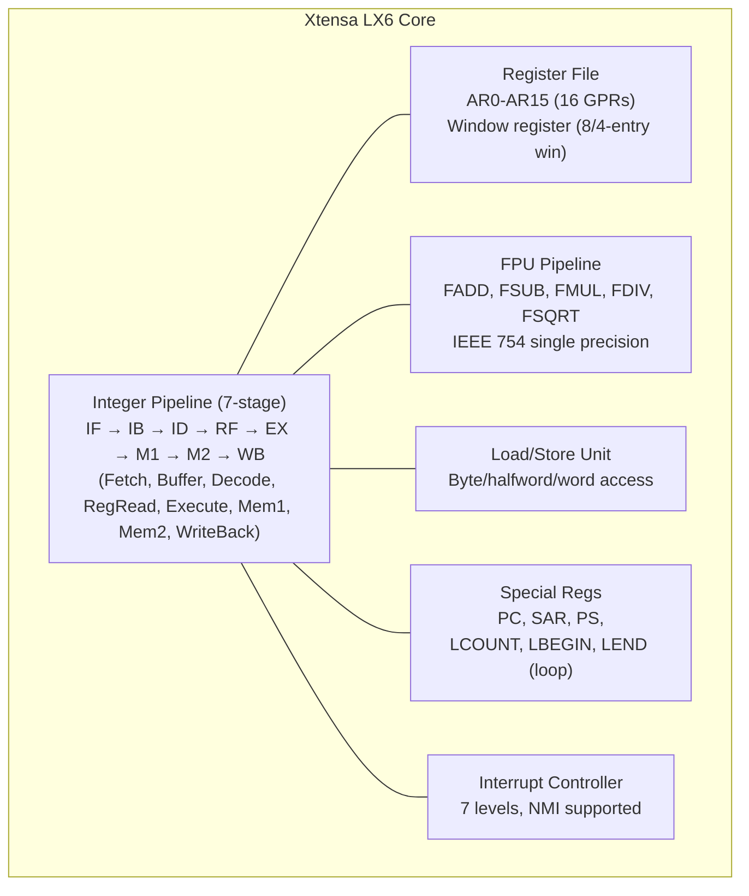
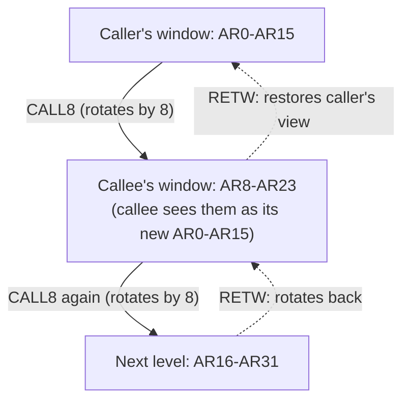
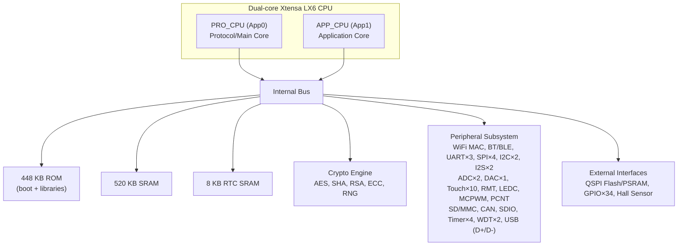
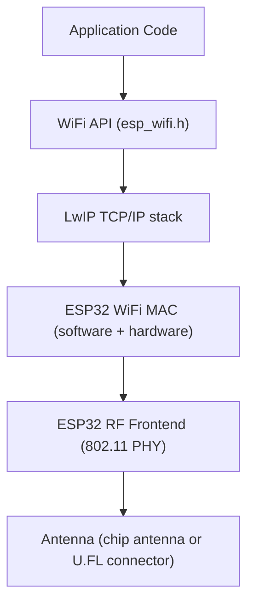

# Chapter 17: ESP32 and Xtensa Architecture

## 17.1 History: From ESP8266 to ESP32

### ESP8266 — The WiFi Revolution (2014)

In 2014, Espressif Systems (Shanghai, China) released the **ESP8266** module, which changed everything for hobbyists:

- A $2 WiFi-capable MCU (previously WiFi MCUs cost $10-20+)
- Initially intended as a WiFi add-on for other MCUs (AT command mode)
- Hackers discovered it had a capable processor → could run standalone!
- Led to the NodeMCU open-source platform

**ESP8266 specifications:**
| Parameter       | Value                    |
|-----------------|--------------------------|
| CPU             | Tensilica L106 32-bit    |
| Clock           | 80-160 MHz               |
| RAM             | 80 KB instruction, 96 KB data |
| Flash           | External SPI (typically 4 MB) |
| WiFi            | 802.11 b/g/n (2.4 GHz)   |
| GPIO            | 17 (limited for UART/SPI/I2C) |
| ADC             | 1× 10-bit                |
| Bluetooth       | None                     |
| Operating Voltage | 3.3V                  |

**ESP8266 modules:**
- **ESP-01:** 2 GPIO, minimal — cheap WiFi-to-serial bridge
- **ESP-07:** External antenna connector, 9 GPIO
- **ESP-12E/F:** 11 GPIO, 4 MB Flash, most popular
- **NodeMCU:** Development board with ESP-12E, USB-serial, breadboard-friendly

### NodeMCU

NodeMCU is an **open-source firmware and development board** built on ESP8266:

**Hardware (NodeMCU v1/v2/v3):**
```
┌──────────────────────────────────────────────────┐
│                  NodeMCU v3                      │
│  ESP-12E (ESP8266)      CP2102/CH340G USB-Serial │
│  USB Micro-B            3.3V LDO (AMS1117)       │
│  Dimensions: 49 × 24.5 mm                        │
│                                                   │
│  Pins: D0-D8, A0 (ADC), 3V3, GND, VIN, VU, RST │
│  Special: D0=GPIO16 (wake from deep sleep)       │
│  I2C: D1=SCL, D2=SDA                            │
│  SPI: D5=CLK, D6=MISO, D7=MOSI, D8=CS          │
└──────────────────────────────────────────────────┘
```

**NodeMCU firmware:**
- Originally ran Lua scripts (like MicroPython for ESP)
- `node.wifi.sta.config()`, `gpio.write()` etc. in Lua
- Largely superseded by Arduino + ESP8266 Arduino core today

---

## 17.2 ESP32 — The Powerhouse (2016)

Espressif released ESP32 in 2016 as a massive upgrade:

### ESP32 Core Specifications

| Parameter          | Value                                    |
|--------------------|------------------------------------------|
| CPU                | Dual-core Xtensa LX6 (or single in some)|
| Clock              | Up to 240 MHz                            |
| ROM                | 448 KB (boot + libraries)                |
| SRAM               | 520 KB (including 8 KB RTC SRAM)         |
| Flash              | External QSPI (4-16 MB, not on chip)     |
| PSRAM              | Optional external (up to 8 MB)           |
| WiFi               | 802.11 b/g/n, 2.4 GHz                   |
| Bluetooth          | Classic BT 4.2 + BLE 4.2                |
| GPIO               | 34 (GPIO0-GPIO39, some input-only)       |
| ADC                | 18-channel 12-bit SAR (two SAR ADCs)    |
| DAC                | 2-channel 8-bit                          |
| Touch Sensors      | 10 capacitive touch pins                 |
| UART               | 3×                                       |
| SPI                | 4× (2 usable externally: VSPI, HSPI)    |
| I2C                | 2×                                       |
| I2S                | 2× (audio)                               |
| CAN (TWAI)         | 1×                                       |
| PWM                | LED PWM: 16 channels; Motor PWM: 6 ch   |
| RMT                | Remote Control (IR, WS2812B, etc.)       |
| Timer              | 4× 64-bit, 2× watchdog                  |
| Hall Sensor        | Internal                                 |
| Temperature Sensor | Internal (not accurate, ±5°C)           |
| Operating Voltage  | 3.0-3.6V                                |
| Deep Sleep Current | ~10 µA                                  |
| Temperature Range  | -40°C to +85°C                          |
| Package            | QFN-48 (5×5 mm)                          |

---

## 17.3 Xtensa LX6 CPU Architecture

### Xtensa Architecture Overview

Xtensa is a **configurable/extensible RISC processor** designed by Tensilica (acquired by Cadence in 2013):

**Key design philosophy:**
- Base ISA is minimal
- **Extension packs** add instructions for specific applications
- SoC vendors configure Xtensa for their needs
- Each variant is essentially a custom processor

**ESP32 uses Xtensa LX6** configured with:
- Application-specific extensions
- Single-precision FPU (floating-point unit!)
- Vector operations
- Special coprocessors

### Xtensa LX6 Core Architecture



### Xtensa Register File and Register Windows

**Unlike ARM (large flat register file), Xtensa uses register windows:**
- Physical register file: 64 general-purpose 32-bit registers (AR0-AR63)
- CPU shows only a **window** of 16 registers at a time (AR0-AR15)
- On CALL8 (function call): window rotates by 8 registers
- CALL8 parameters: a2-a7 (6 args), a8=first hidden register of callee
- Eliminates most push/pop overhead for function calls!
- Window overflow/underflow exceptions handle deep call chains



### Xtensa Special Instructions

```asm
; Zero-overhead loop (hardware loop counter):
LOOP  AR5, loop_end    ; Loop AR5 times
    ; ... loop body ...
loop_end:              ; Hardware decrements counter, branches back

; Bit-reverse (for FFT):
BREV  AR1, AR2        ; Bit-reverse AR2 into AR1

; Compare and branch:
BEQZ  AR3, label      ; Branch if AR3 == 0
BNEZ  AR3, label      ; Branch if AR3 != 0

; Extract bit field:
EXTUI AR1, AR2, 4, 8  ; Extract bits [11:4] from AR2 into AR1
```

### Xtensa FPU (ESP32)

ESP32 has a **hardware single-precision FPU** — huge advantage over AVR!

```c
// On AVR: float multiply = ~200 cycles (software!)
// On ESP32 Xtensa LX6: float multiply = 4-5 cycles (hardware FPU!)

float x = 3.14159f;
float y = sin(x);  // Uses hardware FPU on ESP32

// This makes signal processing, sensor fusion, PID controllers fast
```

---

## 17.4 ESP32 Internal Architecture

### Full SoC Block Diagram



### Memory Architecture

```
ESP32 Address Space:
0x00000000 - 0x3F3FFFFF  External Flash (mapped via cache)
0x3F400000 - 0x3F7FFFFF  External SRAM (PSRAM, if present)
0x3F800000 - 0x3FBFFFFF  (reserved)
0x3FC00000 - 0x3FCFFFFF  Embedded Flash (512 KB in ESP32-D0WD-V3)
0x3FF00000 - 0x3FF7FFFF  Internal ROM (512 KB)
0x3FF80000 - 0x3FFFFFFF  DPORT + peripheral registers
0x40000000 - 0x4005FFFF  Internal ROM (256 KB - shared)
0x40060000 - 0x4006FFFF  Internal SRAM (64 KB)
0x40070000 - 0x4007FFFF  Internal SRAM (64 KB)
0x40080000 - 0x4009FFFF  Internal SRAM (128 KB, also for .text)
0x400A0000 - 0x400AFFFF  Instruction RAM
0x50000000 - 0x50001FFF  RTC SLOW memory (8 KB, survives deep sleep)

External QSPI Flash: up to 16 MB (default 4 MB)
  - Mapped into 0x3F400000 region via MMU
  - Code executes via 32 KB I-cache
  - Data accessed via 32 KB D-cache
```

**Cache system:**
- ESP32 has separate 32 KB instruction cache and 32 KB data cache for external Flash
- Code must fit in cache for fast execution
- `IRAM_ATTR` — force code into internal SRAM (for ISRs, time-critical code)
- `DRAM_ATTR` — force data into DRAM
- `RTC_IRAM_ATTR` — code in RTC SRAM (survives deep sleep!)
- `RTC_DATA_ATTR` — data in RTC SRAM (survives deep sleep!)

```c
// Time-critical ISR must be in IRAM, not flash cache
void IRAM_ATTR gpio_isr_handler(void* arg) {
    // Handle GPIO interrupt
    // IRAM ensures no cache miss during ISR
}

// Data surviving deep sleep
RTC_DATA_ATTR int boot_count = 0;  // Retained through deep sleep!
```

---

## 17.5 ESP32 WiFi Architecture

### WiFi Stack



**WiFi modes:**
- **STA (Station):** Connect to existing WiFi network
- **AP (Access Point):** Create WiFi hotspot (max 5-10 clients)
- **STA+AP:** Both simultaneously (WiFi bridge, web config portal)

**Coexistence:** WiFi and Bluetooth share the 2.4 GHz RF hardware, managed by Espressif's coexistence algorithm (time-division multiplexing).

### WiFi Security Supported
- WEP (insecure, avoid)
- WPA/WPA2 Personal (TKIP/CCMP)
- WPA2 Enterprise (802.1X with certificates)
- WPA3 Personal (ESP-IDF v4.4+)

---

## 17.6 ESP32 Bluetooth

ESP32 supports **dual-mode Bluetooth**:

### Classic Bluetooth (BR/EDR)
- Bluetooth 4.2 Classic
- Profiles: A2DP (audio), SPP (Serial Port Profile), HFP (Hands-free)
- Up to 3 Mbps (EDR)
- Used for: Bluetooth speakers, car audio, serial communication

### BLE (Bluetooth Low Energy)
- Bluetooth 4.2 BLE
- GATT/GAP profiles
- Advertising, scanning, connections
- Very low power: ~µA in sleep, ~mA during connection
- Used for: sensors, beacons, IoT, wearables

**BLE roles:**
- **Peripheral (Slave):** Advertises data, accepts connections (ESP32 sensor node)
- **Central (Master):** Scans and connects to peripherals (ESP32 hub)
- **Observer:** Scans for advertisements (passive, no connection)
- **Broadcaster:** Advertises only (beacons)

---

## 17.7 ESP32 Peripherals in Detail

### ADC — Key Quirks!

ESP32 ADC has **important limitations**:
- ADC1 (8 channels: GPIO32-39): Works fully
- ADC2 (10 channels: GPIO0,2,4,12-15,25-27): **Cannot be used while WiFi is active!**
- ADC accuracy: Non-linear, especially above ~3.1V and below ~0.1V
- Need calibration for accurate readings

```c
// ESP-IDF ADC with calibration
#include "esp_adc_cal.h"

esp_adc_cal_characteristics_t adc_chars;
esp_adc_cal_characterize(ADC_UNIT_1, ADC_ATTEN_DB_11, ADC_WIDTH_BIT_12,
                          1100, &adc_chars);

// Read with voltage calculation
uint32_t raw = adc1_get_raw(ADC1_CHANNEL_0);
uint32_t voltage_mv = esp_adc_cal_raw_to_voltage(raw, &adc_chars);
```

**ADC attenuation:**
| Attenuation | Input Range  |
|-------------|-------------|
| ADC_ATTEN_DB_0  | 0-1.1V   |
| ADC_ATTEN_DB_2_5| 0-1.5V   |
| ADC_ATTEN_DB_6  | 0-2.2V   |
| ADC_ATTEN_DB_11 | 0-3.9V   |

### Capacitive Touch

ESP32 has 10 capacitive touch pins (T0-T9):
```c
// Read touch value (lower = touched)
uint16_t val = touchRead(T0);  // Touch pin T0 (GPIO4)

// Typical values:
// Not touched: 40-70
// Touched: < 20

// Touch interrupt
touchAttachInterrupt(T0, callback, threshold);
```

### LEDC — LED PWM Controller

16 independent PWM channels (not tied to specific pins!):
```c
// ESP32 Arduino LEDC
const int ledPin = 2;
const int freq = 5000;  // 5 kHz
const int channel = 0;  // LEDC channel 0
const int resolution = 8;  // 8-bit resolution (0-255)

ledcSetup(channel, freq, resolution);
ledcAttachPin(ledPin, channel);
ledcWrite(channel, 128);  // 50% duty cycle
```

### RMT — Remote Control Peripheral

Special hardware for precisely timed pulse sequences:
- **TX:** Generate any pulse sequence (IR, WS2812B NeoPixels, DHT)
- **RX:** Decode incoming pulses with timing (IR receiver, servo, SBUS)
- Resolution: 12.5 ns at 80 MHz APB clock

```c
// WS2812B LED control via RMT (handles timing precisely)
// NeoPixel protocol: 0-bit = 350ns HIGH / 800ns LOW
//                    1-bit = 700ns HIGH / 600ns LOW
// Without RMT, requires critical section + bit-banging
```

### I2S — Audio Interface

ESP32 has 2× I2S interfaces:
- **Full duplex audio:** 8/16/32-bit samples, up to 40 MHz BCK
- **PDM mode:** Microphones (digital MEMS mics like SPH0645)
- **LCD parallel mode:** I2S repurposed for driving parallel LCD displays

```c
// Record audio from I2S MEMS microphone
i2s_config_t i2s_config = {
    .mode = I2S_MODE_MASTER | I2S_MODE_RX,
    .sample_rate = 44100,
    .bits_per_sample = I2S_BITS_PER_SAMPLE_32BIT,
    .channel_format = I2S_CHANNEL_FMT_ONLY_LEFT,
    .communication_format = I2S_COMM_FORMAT_I2S | I2S_COMM_FORMAT_I2S_MSB,
    .dma_buf_count = 8,
    .dma_buf_len = 64,
};
```

### MCPWM — Motor Control PWM

6-channel PWM specifically for motor control:
- Deadtime control (prevents shoot-through in H-bridge)
- Fault detection input (stops PWM on overcurrent)
- Carrier modulation
- Used for: BLDC motor control, servo drives, DC motor H-bridges

---

## 17.8 ESP32 Power Management

### Power Modes

| Mode         | CPU  | WiFi/BT | Peripherals | Current | Wake-up              |
|--------------|------|---------|-------------|---------|----------------------|
| Active       | 240 MHz| On   | All         | ~240 mA | N/A                  |
| Modem-sleep  | On   | Off periodic| Active  | ~15-20 mA| Any                |
| Light-sleep  | Paused| Off  | Some        | ~0.8 mA | Timer, GPIO, UART    |
| Deep-sleep   | Off  | Off  | RTC only    | ~10-150 µA| Timer, GPIO(RTC), ULP|
| Hibernation  | Off  | Off  | None        | ~5 µA   | Timer, GPIO(RTC)     |

**Deep sleep with timer wakeup:**
```c
#include "esp_sleep.h"

RTC_DATA_ATTR int bootCount = 0;  // Survives deep sleep!

void setup() {
    bootCount++;
    Serial.begin(115200);
    Serial.printf("Boot #%d\n", bootCount);

    // Do work...

    // Sleep for 10 seconds
    esp_sleep_enable_timer_wakeup(10 * 1000000ULL);  // microseconds
    Serial.println("Going to sleep...");
    Serial.flush();
    esp_deep_sleep_start();  // Does not return!
}
```

### ULP — Ultra-Low Power Coprocessor

The ESP32 has a special **ULP (Ultra Low Power)** coprocessor:
- Runs while main CPU is in deep sleep!
- Clock: 8 MHz (uses internal RC oscillator)
- Access to RTC SRAM and RTC peripherals
- Can wake the main CPU when condition met
- Power: ~0.1 mA (vs 10 µA in deep sleep without ULP)

**ULP use cases:**
- Monitor GPIO while CPU sleeps (e.g., PIR motion sensor)
- Poll slow sensor periodically, wake CPU only when interesting
- Touch detection during deep sleep

```c
// ULP reads GPIO, wakes main CPU when high
// Written in assembly or using ULP FSM (C preprocessor)
```

---

## 17.9 ESP32 Variants

### Original ESP32 (2016)
- Dual-core Xtensa LX6, 240 MHz
- WiFi b/g/n + Bluetooth Classic + BLE 4.2
- 34 GPIO, 18-ch ADC, 2-ch DAC, 10 touch pins
- SPI Flash: external 4-16 MB

### ESP32-S2 (2020) — Security focused
- **Single-core** Xtensa LX7, 240 MHz
- WiFi only (no Bluetooth!)
- **Native USB** (USB OTG — no external chip needed!)
- 43 GPIO, 20-ch ADC
- Temperature sensor improved
- **Security:** RSA-4096, AES-XTS (Flash encryption), SHA-512
- **JTAG via USB** (no external debugger needed)

### ESP32-S3 (2021) — AI/ML accelerator
- **Dual-core** Xtensa LX7, 240 MHz
- WiFi b/g/n + BLE 5.0
- **Native USB** (OTG + Serial/JTAG)
- **AI acceleration:** Vector instructions (128-bit SIMD for neural network inference)
- 45 GPIO, PSRAM support up to 8 MB
- Used in: AI camera, voice recognition projects

### ESP32-C3 (2020) — RISC-V!
- **Single-core RISC-V** (not Xtensa!), 160 MHz
- WiFi b/g/n + BLE 5.0
- 22 GPIO
- **Native USB Serial/JTAG**
- Very cheap, used in budget devices
- Full RISC-V RV32IMC instruction set

### ESP32-C6 (2022) — WiFi 6 + Thread/Zigbee
- **Single-core RISC-V** (HP core, 160 MHz) + **LP core** (RISC-V, 20 MHz)
- **WiFi 6 (802.11ax)** — 2.4 GHz only
- **BLE 5.0 + 802.15.4** (Zigbee + Thread + Matter)
- Native USB
- LP core for ULP-like operation
- Designed for Matter smart home protocol

### ESP32-H2 (2022) — Thread/Zigbee/BLE
- **Single-core RISC-V** (96 MHz)
- **No WiFi!** Only 802.15.4 (Zigbee/Thread) + BLE 5.3
- Designed for Matter border routers, Zigbee coordinators
- Very low power

### ESP32 Variant Comparison

| Chip    | Cores | ISA    | MHz | WiFi    | BT       | USB | PSRAM | Notable         |
|---------|-------|--------|-----|---------|----------|-----|-------|-----------------|
| ESP32   | 2     | LX6    | 240 | b/g/n   | 4.2+BLE  | No  | Yes   | Classic, widely used |
| ESP32-S2| 1     | LX7    | 240 | b/g/n   | None     | Yes | Yes   | Security, USB   |
| ESP32-S3| 2     | LX7    | 240 | b/g/n   | BLE 5.0  | Yes | Yes   | AI/ML, camera   |
| ESP32-C3| 1     | RV32   | 160 | b/g/n   | BLE 5.0  | Yes | No    | RISC-V, cheap   |
| ESP32-C6| 1+1LP | RV32   | 160 | WiFi 6  | BLE+Zigbee| Yes| No   | Matter, Thread  |
| ESP32-H2| 1     | RV32   | 96  | None    | BLE+Zigbee| Yes| No   | Zigbee/Thread   |

---

## 17.10 ESP32 Development Frameworks

### Arduino IDE (simplest)

Install "ESP32 by Espressif Systems" board package:

```cpp
// WiFi example
#include <WiFi.h>

void setup() {
    WiFi.begin("SSID", "password");
    while (WiFi.status() != WL_CONNECTED) delay(100);
    Serial.println(WiFi.localIP());
}

void loop() { }
```

**Key differences from Arduino Uno:**
- `analogWrite()` uses LEDC — different setup
- WiFi operations can block for up to 30 seconds
- Two cores available (loop() runs on APP_CPU by default)
- Much more memory (520 KB SRAM vs 2 KB on Uno!)
- Float operations are fast (hardware FPU)

### ESP-IDF (Official Espressif Framework)

Full-featured C framework, lower-level than Arduino:

```c
// FreeRTOS task on specific core:
xTaskCreatePinnedToCore(
    my_task,          // Task function
    "MyTask",         // Task name
    4096,             // Stack size (bytes)
    NULL,             // Parameters
    5,                // Priority (0-25)
    &my_task_handle,  // Task handle
    0                 // Core: 0=PRO_CPU, 1=APP_CPU
);

void my_task(void *pvParam) {
    while(1) {
        // Task code
        vTaskDelay(pdMS_TO_TICKS(100));  // Delay 100 ms
    }
}
```

**ESP-IDF build system:**
```bash
# Install ESP-IDF
git clone --recursive https://github.com/espressif/esp-idf.git
cd esp-idf && ./install.sh

# Create and build project
idf.py create-project hello_world
cd hello_world
idf.py set-target esp32
idf.py menuconfig  # Configuration GUI
idf.py build
idf.py flash monitor
```

### MicroPython

Python 3 interpreter running on ESP32:
```python
import network, time
from machine import Pin, ADC

# Connect WiFi
wlan = network.WLAN(network.STA_IF)
wlan.active(True)
wlan.connect('SSID', 'password')
while not wlan.isconnected():
    time.sleep(0.1)
print(wlan.ifconfig())

# GPIO
led = Pin(2, Pin.OUT)
led.on()

# ADC
adc = ADC(Pin(34))
adc.atten(ADC.ATTN_11DB)
print(adc.read())
```

**Limitations:**
- 10-30× slower than C (interpreted)
- Higher memory usage
- Good for prototyping, not production IoT

### Mongoose OS / Zephyr RTOS / NuttX

Other RTOS options with full networking stacks for production IoT devices.

---

## 17.11 FreeRTOS on ESP32

ESP-IDF and Arduino-ESP32 are built on **FreeRTOS**:

### FreeRTOS Basics

```
FreeRTOS provides:
- Task scheduling (preemptive, round-robin)
- Queues (inter-task communication)
- Semaphores and Mutexes (synchronization)
- Event Groups (synchronize multiple events)
- Timers (software timers)
- Notifications (lightweight task-to-task)
```

**On ESP32 specifically:**
- **Symmetric Multiprocessing (SMP):** Tasks can run on either core
- `xTaskCreatePinnedToCore()`: Pin task to specific core
- Default: WiFi/BT stack on PRO_CPU (core 0), user tasks on APP_CPU (core 1)
- Scheduler runs at 1000 Hz (1 ms tick) by default

**Inter-task communication:**
```c
// Queue: send sensor data from ISR to processing task
QueueHandle_t sensor_queue = xQueueCreate(10, sizeof(int32_t));

// In ISR:
int32_t reading = get_sensor_reading();
xQueueSendFromISR(sensor_queue, &reading, NULL);

// In task:
int32_t data;
xQueueReceive(sensor_queue, &data, portMAX_DELAY);  // Block until data
process(data);
```

---

## 17.12 ESP32 GPIO and Peripheral Pinout

### GPIO Special Functions

**Not all GPIOs are equal on ESP32:**
| GPIO    | Notes                                        |
|---------|----------------------------------------------|
| GPIO0   | Boot mode select (must be HIGH on boot)      |
| GPIO1   | TX0 (UART0 → connected to USB-Serial on devkit) |
| GPIO2   | Must be LOW or floating at boot              |
| GPIO3   | RX0 (UART0 → connected to USB-Serial)        |
| GPIO6-11| Connected to internal flash SPI (DO NOT USE!)|
| GPIO12  | Sets flash voltage at boot — careful!        |
| GPIO15  | Must be HIGH at boot (JTAG/debug mode)       |
| GPIO34-39| Input only (no output, no pull-up/pull-down)|

### Strapping Pins (Boot Configuration)

```
GPIO0:  LOW = Download mode (upload code)
        HIGH = Normal boot (run application)
GPIO2:  Must be HIGH or floating for normal boot
GPIO12: LOW = Flash at 3.3V (most modules)
        HIGH = Flash at 1.8V (some variants)
```

### Common DevKit Pinout (ESP32-DevKitC)

```
                ESP32-DevKitC V4
           ┌─────────────────────┐
      GND  ─┤1               36├─  GND
      3V3  ─┤2               35├─  VIN (5V)
      EN   ─┤3               34├─  GPIO23 (MOSI)
      GPIO36 (VP)─┤4         33├─  GPIO22 (I2C SCL)
      GPIO39 (VN)─┤5         32├─  GPIO1  (TX0)
      GPIO34─┤6               31├─  GPIO3  (RX0)
      GPIO35─┤7               30├─  GPIO21 (I2C SDA)
      GPIO32─┤8               29├─  GND
      GPIO33─┤9               28├─  GPIO19 (MISO)
      GPIO25─┤10              27├─  GPIO18 (SCK)
      GPIO26─┤11              26├─  GPIO5
      GPIO27─┤12              25├─  GPIO17 (TX2)
      GPIO14─┤13              24├─  GPIO16 (RX2)
      GPIO12─┤14              23├─  GPIO4
      GND   ─┤15              22├─  GPIO0
      GPIO13─┤16              21├─  GPIO2
      GPIO9 ─┤17              20├─  GPIO15
      GPIO10─┤18              19├─  GPIO8
      GPIO11─┤19              18├─  GPIO7
      GPIO6 ─┤20              17├─  GPIO6
           └─────────────────────┘
```

---

## 17.13 OTA — Over-The-Air Updates

ESP32's most powerful feature for IoT: update firmware wirelessly!

### OTA Partition Scheme

ESP32 flash is divided into partitions:

```
Flash Memory Layout (4 MB default):
┌──────────────────────────────────┐ 0x000000
│  Bootloader (second stage)       │ (32 KB)
├──────────────────────────────────┤ 0x008000
│  Partition Table                 │ (4 KB)
├──────────────────────────────────┤ 0x009000
│  NVS (Non-Volatile Storage)      │ (16 KB)
├──────────────────────────────────┤ 0x00D000
│  OTA Data (tracks active app)    │ (8 KB)
├──────────────────────────────────┤ 0x010000
│  App0 (OTA_0) — active firmware  │ (1.8 MB)
├──────────────────────────────────┤ 0x1D0000
│  App1 (OTA_1) — new firmware     │ (1.8 MB)
├──────────────────────────────────┤ 0x390000
│  SPIFFS / LittleFS (filesystem)  │ (896 KB)
└──────────────────────────────────┘ 0x400000
```

**OTA process:**
1. Device connects to update server
2. Downloads new firmware into App1 partition
3. Verifies SHA-256 hash
4. Marks App1 as active in OTA data partition
5. Resets → Bootloader boots App1
6. App1 marks itself as valid
7. Old App0 becomes the rollback target

```c
// Simple OTA update from URL
#include <ESP32httpUpdate.h>

void performOTA() {
    ESPhttpUpdate.update("http://server/firmware.bin");
    // Returns if update fails, reboots if succeeds
}
```

---

## 17.14 ESP-NOW — Peer-to-Peer WiFi

ESP-NOW is Espressif's custom connectionless protocol:
- No router required (direct ESP-to-ESP)
- Range: ~200 m outdoors, ~50 m indoors
- Latency: ~1 ms (vs WiFi TCP: 5-50 ms)
- Up to 20 peers, 250-byte payload
- Works in deep sleep wakeup!

```c
// Sender:
esp_now_send(peer_mac, data, sizeof(data));

// Receiver callback:
void onDataRecv(const uint8_t *mac, const uint8_t *data, int len) {
    memcpy(&received, data, sizeof(received));
}
```

---

## 17.15 Summary

| Feature              | ESP8266        | ESP32             | ESP32-S3         |
|----------------------|----------------|-------------------|------------------|
| CPU                  | Xtensa L106 1C | Xtensa LX6 2C     | Xtensa LX7 2C    |
| Clock                | 80/160 MHz     | 240 MHz           | 240 MHz          |
| RAM                  | 96 KB          | 520 KB            | 512 KB + 8MB PSRAM|
| Flash (external)     | 4 MB typical   | 4-16 MB           | 4-16 MB          |
| WiFi                 | b/g/n          | b/g/n             | b/g/n            |
| Bluetooth            | None           | BT 4.2 + BLE 4.2  | BLE 5.0          |
| USB                  | No (UART only) | No                | Yes (native OTG) |
| GPIO                 | 17             | 34                | 45               |
| ADC                  | 1× 10-bit      | 18× 12-bit        | 20× 12-bit       |
| FPU                  | No             | Yes (single)      | Yes (single)     |
| AI instructions      | No             | No                | Yes              |

ESP32 has become the dominant platform for WiFi/BT-connected IoT projects due to its combination of:
- Powerful dual-core processor with FPU
- Integrated WiFi + Bluetooth
- Rich peripheral set
- Low cost ($2-5 for module)
- Excellent SDK support (ESP-IDF + Arduino)
- Large community and ecosystem
