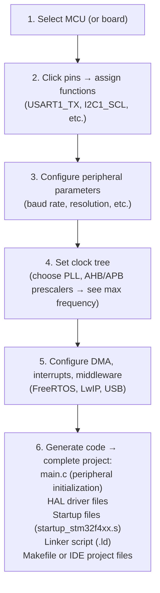
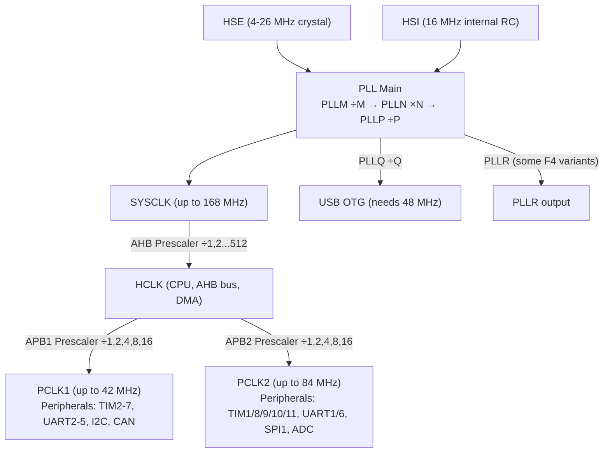

# Chapter 18: STM32 and ARM Cortex-M Architecture

## 18.1 Introduction to STM32

STM32 is a family of **32-bit ARM Cortex-M microcontrollers** made by **STMicroelectronics** (ST). It is the most widely used professional-grade MCU family in embedded systems worldwide.

**Why STM32 is popular:**
- Wide variety: from ultra-low power to high-performance
- Professional-grade peripherals (CAN, USB, SDIO, Ethernet, crypto)
- Excellent development tools (STM32CubeIDE, CubeMX, HAL library)
- Affordable: $1.50-$20 depending on variant
- Massive documentation (Reference Manuals, Application Notes)
- Industry standard for automotive, industrial, medical, consumer electronics

---

## 18.2 ARM Cortex-M Family — Complete Reference

All STM32 MCUs use ARM Cortex-M processors. Understanding the Cortex-M family is essential:

### ARM Cortex-M Architecture Versions

#### Cortex-M0 (ARMv6-M)
- Simplest, cheapest, lowest power
- 56-instruction Thumb-2 subset
- No hardware divide, no barrel shifter, no DSP
- 1-cycle single-cycle I/O
- Used in: simple IoT nodes, sensor tags

| Parameter     | Value           |
|---------------|-----------------|
| Pipeline      | 3-stage          |
| DMIPS/MHz     | 0.9             |
| Performance   | 45 DMIPS @ 48 MHz|
| ISA           | ARMv6-M         |
| Interrupts    | Up to 32         |
| MPU           | Optional         |
| Debug         | SWD only         |

#### Cortex-M0+ (ARMv6-M)
- "Better M0": same ISA, optimized microarchitecture
- 2-stage pipeline (shorter = lower power)
- Single-cycle I/O access
- Optional MPU and vector table relocation
- 32% better energy efficiency than M0

| Parameter     | Value           |
|---------------|-----------------|
| Pipeline      | 2-stage          |
| DMIPS/MHz     | 0.95            |
| Used in       | STM32G0, STM32L0, RP2040 |

#### Cortex-M3 (ARMv7-M)
- Full Thumb-2 ISA
- Hardware multiply (1 cycle) and divide (2-12 cycles)
- Barrel shifter
- Bit-banding support
- Nested Vectored Interrupt Controller (NVIC)
- Optional MPU, Trace port (ETM)
- Branch predictor

| Parameter     | Value           |
|---------------|-----------------|
| Pipeline      | 3-stage + branch|
| DMIPS/MHz     | 1.25            |
| Used in       | STM32F1, STM32F2, STM32L1|

#### Cortex-M4 (ARMv7E-M) ← Most popular!
- M3 + DSP extension instructions
- **Single-precision FPU** (optional, -F suffix)
- SIMD (Single Instruction Multiple Data) for DSP
- Saturating arithmetic
- 1.25 DMIPS/MHz without FPU, better with

| Parameter     | Value           |
|---------------|-----------------|
| Pipeline      | 3-stage + branch|
| DMIPS/MHz     | 1.25 (1.95 with FPU)|
| FPU           | Optional (VFPv4-SP)|
| DSP           | Yes             |
| Used in       | STM32F3, STM32F4, STM32G4, STM32L4|

#### Cortex-M7 (ARMv7E-M) — High Performance
- 6-stage dual-issue pipeline (superscalar!)
- Double-precision FPU (optional)
- Instruction + data caches (4-64 KB each)
- 2.14 DMIPS/MHz
- Tightly Coupled Memory (TCM) for zero-wait-state access
- AXI + AHB bus architecture

| Parameter     | Value           |
|---------------|-----------------|
| Pipeline      | 6-stage, superscalar|
| DMIPS/MHz     | 2.14            |
| FPU           | DP (VFPv5)      |
| Cache         | Optional I+D cache|
| Used in       | STM32F7, STM32H7|

#### Cortex-M33 (ARMv8-M Mainline) — Modern Security
- TrustZone security extensions (hardware isolation)
- ARMv8-M architecture
- Optional DSP and FPU
- Improved debug and trace
- Optional MPU (8-16 regions)

| Parameter     | Value           |
|---------------|-----------------|
| DMIPS/MHz     | 1.5             |
| TrustZone     | Yes             |
| Used in       | STM32L5, STM32U5, nRF9160|

#### Cortex-M55 (ARMv8.1-M) — AI/ML
- MVE (M-profile Vector Extension) aka Helium
- 128-bit SIMD vectors for ML inference
- Significant improvement for ML workloads

#### Cortex-M85 (ARMv8.1-M) — Latest High-End
- MVE (Helium) + superscalar
- Best-in-class Cortex-M performance

### Cortex-M ISA: Thumb and Thumb-2

**Problem with original ARM (32-bit instructions):**
- Each instruction = 4 bytes → large code size

**Thumb ISA (16-bit instructions):**
- Reduced 16-bit version of ARM
- Smaller code (up to 30% smaller than ARM)
- Slightly less efficient per instruction

**Thumb-2 ISA (mixed 16-bit and 32-bit):**
- Intelligent mix of 16-bit (simple ops) and 32-bit (complex ops)
- Best code density + performance
- Used by M3, M4, M7, M33+

---

## 18.3 ARM Cortex-M4 Deep Dive

Since STM32F4 (Cortex-M4) is the most commonly used professional MCU, let's examine it in detail.

### Pipeline and Execution

```
Cortex-M4 3-stage pipeline:
  Stage 1: Fetch — Load instruction from Flash/SRAM
  Stage 2: Decode — Decode opcode, read registers
  Stage 3: Execute — ALU operation, memory access, register writeback

Normal execution: 1 instruction/cycle (pipelined)
Branch (taken): 3-cycle penalty (pipeline flush)
Branch prediction: Simple 1-bit predictor
```

### Register File

```
ARM Cortex-M4 Registers:
General Purpose:
  R0-R7   : Low registers (used by all Thumb instructions)
  R8-R12  : High registers (used by some Thumb-2, all ARM instructions)

Special:
  R13 (SP) : Stack Pointer (Main Stack Pointer MSP or Process Stack Pointer PSP)
  R14 (LR) : Link Register (stores return address for function calls)
  R15 (PC) : Program Counter

Status:
  xPSR     : Program Status Register (N, Z, C, V, Q flags + ISR number + IT state)

FPU registers (if present):
  S0-S31   : 32× single-precision float registers
  D0-D15   : 16× double-precision (= pairs of S registers)
  FPSCR    : Floating-Point Status and Control Register
```

### Exception Model

Cortex-M exceptions are handled by NVIC:

**Exception/Interrupt priority:**
```
Priority 0 (highest) — Reserved for NMI
Priority 1 — HardFault
Priority 2 — MemManage, BusFault, UsageFault
Priority 3-254 — Configurable (lower number = higher priority)
Priority 255 (lowest) — Configurable peripheral interrupts

Pending exceptions are queued
Higher priority preempts lower (nested interrupts)
```

**Fault exceptions:**
| Exception  | Cause                                    |
|------------|------------------------------------------|
| HardFault  | Fault of last resort (escalated faults)  |
| MemManage  | MPU violation                            |
| BusFault   | AHB bus error (invalid memory access)    |
| UsageFault | Illegal instruction, divide by zero, etc.|

**Exception entry sequence (hardware automatically):**
1. Stacks R0-R3, R12, LR, PC, xPSR (8 registers = 32 bytes)
2. Loads exception handler address from vector table
3. Sets LR = EXC_RETURN magic value
4. Jumps to handler

**Exception return:**
- Execute `BX LR` with EXC_RETURN value
- Hardware unstacks the 8 saved registers
- Returns to pre-exception execution

### SysTick Timer

Built into every Cortex-M core:
- 24-bit down counter
- Clocked by HCLK or HCLK/8
- Fires SysTick interrupt on underflow
- Used by FreeRTOS, HAL_Delay()

```c
// Configure 1 ms SysTick:
SysTick_Config(SystemCoreClock / 1000);
// SystemCoreClock = 168,000,000 for STM32F4 at max speed
// 168,000,000 / 1000 = 168,000 counts per tick
```

### MPU — Memory Protection Unit

Optional in Cortex-M, present in M3/M4/M7:
- Defines up to 8 memory regions
- Each region: base address, size (32 B to 4 GB), permissions
- Prevents tasks from accessing each other's memory
- Enables OS-like memory protection

```c
// Protect SRAM region as read-only
ARM_MPU_SetRegion(
    ARM_MPU_RBAR(0, 0x20000000),  // Region 0, base 0x20000000
    ARM_MPU_RASR(0, ARM_MPU_AP_RO, ...)  // Read-only
);
```

---

## 18.4 STM32 Product Lines

ST organizes STM32 into series based on performance and features:

### STM32F0 — Entry-Level Cortex-M0
- Core: ARM Cortex-M0, 48 MHz
- Flash: 16-256 KB, SRAM: 4-32 KB
- Features: USART, SPI, I2C, ADC, DAC, timers
- Power: ~2-6 mA active
- Price: ~$0.50-$1.50
- Use: Simple sensor interfaces, basic control

### STM32F1 — Classic Cortex-M3 ← "Blue Pill" is here
- Core: ARM Cortex-M3, up to 72 MHz
- Flash: 16 KB - 1 MB, SRAM: 6-96 KB
- Features: USB FS (Device), CAN, multiple UART, SPI, I2C, ADC
- Price: $0.80-$5
- **STM32F103C8T6 (Blue Pill)** — most cloned STM32

### STM32F3 — Cortex-M4F + Advanced Analog
- Core: ARM Cortex-M4F (with FPU), up to 72 MHz
- Multiple high-speed ADCs (12-bit, up to 5 MSPS)
- Comparators, operational amplifiers on-chip
- Used in: motor control, precise measurement

### STM32F4 — Mainstream High-Performance ← Most popular
- Core: ARM Cortex-M4F, up to 180 MHz
- Flash: 128 KB - 2 MB, SRAM: 128-256 KB + CCM RAM
- Features: USB HS/FS OTG, Ethernet MAC, SDIO, DCMI (camera), FMC (SDRAM)
- ART Accelerator (instruction cache = zero wait state Flash access)
- Price: $3-$15
- Use: Audio, video, motor control, robotics, drones

**Popular STM32F4 chips:**
- STM32F401: 84 MHz, 256 KB Flash, 64 KB SRAM — budget F4
- STM32F411: 100 MHz, 512 KB Flash, 128 KB SRAM
- STM32F407: 168 MHz, 1 MB Flash, 192 KB SRAM — full featured
- STM32F429: 180 MHz, with LCD-TFT controller, external SDRAM

### STM32F7 — High Performance Cortex-M7
- Core: ARM Cortex-M7 (superscalar, double FPU), up to 216 MHz
- Instruction + data caches
- SDRAM, LCD-TFT, crypto hardware
- Used in: advanced displays, motor drives, audio processing

### STM32H7 — Top Performance
- Core: ARM Cortex-M7 up to 550 MHz (+ optional M4 core in dual-core variants)
- 2 MB Flash, up to 1 MB SRAM (split across domains)
- Ethernet, USB HS, QSPI, SDMMC
- Advanced math accelerator (CORDIC, FMAC)
- Used in: high-end motor control, DSP, AI inference

### STM32L — Ultra-Low Power
- L0: Cortex-M0+, ultra-low power (0.3 µA standby)
- L1: Cortex-M3, low power
- L4: Cortex-M4F, best-in-class ratio power/performance
- L4+: Enhanced L4
- L5: Cortex-M33 with TrustZone, low power + security
- Used in: wearables, IoT sensors, medical devices, meters

### STM32G — Advanced Mainstream
- G0: Cortex-M0+, advanced peripherals (UCPD for USB-C!)
- G4: Cortex-M4F + HRTIM (high-resolution timer for power conversion)
- G4 used in: digital power supplies, motor drives

### STM32U5 — Ultra-Low Power AI
- Core: ARM Cortex-M33, up to 160 MHz
- LPBAM (Low-Power Background Autonomous Mode)
- Neural network accelerator (NeuralART)
- TrustZone
- Extreme low power: 19 nA standby

### STM32WB/WL — Wireless
- STM32WB: Cortex-M4 + Cortex-M0+ for Bluetooth 5.0/Zigbee/Thread/OpenThread
- STM32WL: Cortex-M4 + Cortex-M0+ with Sub-GHz radio (LoRa, FSK/GFSK)

### STM32 Series Summary Table

| Series | Core   | MHz  | Key Feature              | Use Case              |
|--------|--------|------|--------------------------|----------------------|
| F0     | M0     | 48   | Entry level              | Simple control       |
| F1     | M3     | 72   | USB, CAN — classic       | General embedded     |
| F3     | M4F    | 72   | ADC + OpAmps             | Precise measurement  |
| F4     | M4F    | 180  | USB OTG, Ethernet, SDIO  | Audio, video, drones |
| F7     | M7     | 216  | I+D cache, SDRAM         | Advanced signal proc |
| H7     | M7     | 550  | Highest performance      | AI, motor, audio     |
| L0     | M0+    | 32   | Ultra-low power          | IoT sensors          |
| L4     | M4F    | 80   | Low power + performance  | Wearables, IoT       |
| L5     | M33    | 110  | TrustZone + low power    | Secure IoT           |
| G0     | M0+    | 64   | USB-C (UCPD)             | USB-C applications   |
| G4     | M4F    | 170  | HRTIM + Math accl        | Power conversion     |
| U5     | M33    | 160  | Neural ART, LPBAM        | AI at ultra-low power|
| WB     | M4+M0+ | 64   | BLE 5.0, Zigbee          | Wireless IoT         |
| WL     | M4+M0+ | 48   | LoRa sub-GHz             | Long-range IoT       |

---

## 18.5 Blue Pill — STM32F103C8T6

The most popular and affordable STM32 development board:

### Hardware Specifications

```
┌──────────────────────────────────────────────────────┐
│                  Blue Pill (STM32F103C8T6)           │
│                                                      │
│  MCU: STM32F103C8T6 (LQFP-48)                      │
│  Core: ARM Cortex-M3 @ 72 MHz                       │
│  Flash: 64 KB (actually 128 KB, C8 is mislabeled)  │
│  SRAM: 20 KB                                        │
│                                                      │
│  Peripherals:                                        │
│  - GPIO: 37 pins total (PA0-PA15, PB0-PB15, PC13-15)|
│  - UART: 3× (USART1-3)                              │
│  - SPI: 2×                                          │
│  - I2C: 2×                                          │
│  - USB: 1× Full Speed (PA11=D-, PA12=D+)            │
│  - CAN: 1× (PA11=RX, PA12=TX — shares with USB!)    │
│  - ADC: 2× 12-bit, 10 channels                      │
│  - Timer: 4× (TIM1-4, TIM1 is advanced motor timer) │
│  - PWM: 12 channels                                 │
│  - RTC: Yes (32.768 kHz crystal, VBAT pin)          │
│  - IWDG, WWDG, SysTick                              │
│                                                      │
│  Operating voltage: 3.3V (NOT 5V tolerant on most!) │
│  Price: $1.50-$3.00                                 │
│  Programming: SWD (PA13=SWDIO, PA14=SWCLK)          │
│               USB DFU (bootloader mode)             │
└──────────────────────────────────────────────────────┘
```

### Blue Pill Pinout

```
                Blue Pill
           ┌──────────────────┐
      B12  ─┤1              40├─  VCC (3.3V)
      B13  ─┤2              39├─  GND
      B14  ─┤3              38├─  3.3V (from onboard regulator)
      B15  ─┤4              37├─  NRST
       A8  ─┤5              36├─  PA0 (ADC0, USART2 CTS, TIM2_CH1)
       A9  ─┤6  USB D+→    35├─  PA1 (ADC1, USART2 RTS, TIM2_CH2)
      A10  ─┤7  USB Conn   34├─  PA2 (ADC2, USART2 TX, TIM2_CH3)
      A11  ─┤8  →D-        33├─  PA3 (ADC3, USART2 RX, TIM2_CH4)
      A12  ─┤9              32├─  PA4 (ADC4, SPI1 NSS, USART2 CK)
      A15  ─┤10             31├─  PA5 (ADC5, SPI1 SCK) ← SWD CLK
       B3  ─┤11             30├─  PA6 (ADC6, SPI1 MISO, TIM3_CH1)
       B4  ─┤12             29├─  PA7 (ADC7, SPI1 MOSI, TIM3_CH2)
       B5  ─┤13             28├─  PB0 (ADC8, TIM3_CH3)
       B6  ─┤14  I2C1 SCL  27├─  PB1 (ADC9, TIM3_CH4)
       B7  ─┤15  I2C1 SDA  26├─  PB10 (I2C2 SCL, USART3 TX)
       B8  ─┤16             25├─  PB11 (I2C2 SDA, USART3 RX)
       B9  ─┤17             24├─  3V3
      5V   ─┤18             23├─  GND
      GND  ─┤19             22├─  GND
      GND  ─┤20             21├─  PC13 (LED, RTC Tamper)
           └──────────────────┘
```

### Programming Blue Pill

**Method 1: SWD with ST-Link V2**
```
ST-Link V2 → Blue Pill
SWDIO  → PA13
SWCLK  → PA14
GND    → GND
3.3V   → 3.3V (optional, if not powered separately)
```

**Method 2: UART Bootloader**
```
Set BOOT0 jumper HIGH (to 1)
Connect USB-Serial adapter:
PA9 (USART1 TX) → RX of adapter
PA10 (USART1 RX) → TX of adapter
GND → GND

Use STM32CubeProgrammer or stm32flash:
stm32flash -w firmware.bin -v /dev/ttyUSB0
```

**Method 3: USB DFU (requires USB bootloader pre-flashed)**
```
Set BOOT0=1, connect USB
Device appears as "STM32 BOOTLOADER"
Use dfu-util:
dfu-util -a 0 -s 0x08000000 -D firmware.bin
```

---

## 18.6 STM32 Development Ecosystem

### STM32CubeIDE

ST's official free IDE (Eclipse-based):
- Code editor with syntax highlighting, autocomplete
- Integrated compilation (GCC ARM)
- ST-Link debugger (breakpoints, watch variables, memory view)
- **STM32CubeMX** graphical configurator integrated
- Device driver generator (HAL/LL)
- FreeRTOS configurator

### STM32CubeMX — Graphical Configuration

**Revolutionary tool:** Configure STM32 peripherals graphically:



### HAL Library — Hardware Abstraction Layer

ST provides two API levels:

**HAL (High-level, portable):**
```c
// Initialize UART
UART_HandleTypeDef huart1;
huart1.Instance = USART1;
huart1.Init.BaudRate = 115200;
huart1.Init.WordLength = UART_WORDLENGTH_8B;
huart1.Init.StopBits = UART_STOPBITS_1;
HAL_UART_Init(&huart1);

// Send data
HAL_UART_Transmit(&huart1, data, length, timeout);
HAL_UART_Transmit_IT(&huart1, data, length);   // Interrupt mode
HAL_UART_Transmit_DMA(&huart1, data, length);  // DMA mode
```

**LL (Low-level, fast):**
```c
// Direct register access via LL — faster, less overhead
LL_USART_Enable(USART1);
LL_USART_SetBaudRate(USART1, LL_RCC_GetUSARTClockFreq(LL_RCC_USART1_CLKSOURCE),
                     LL_USART_PRESCALER_DIV1, 115200);
while (!LL_USART_IsActiveFlag_TXE(USART1));
LL_USART_TransmitData8(USART1, byte);
```

**Bare-metal (direct registers):**
```c
// Fastest, smallest, but not portable:
USART1->BRR = SystemCoreClock / 115200;  // Set baud
USART1->CR1 = USART_CR1_UE | USART_CR1_TE | USART_CR1_RE;  // Enable
while (!(USART1->SR & USART_SR_TXE));    // Wait TX empty
USART1->DR = byte;                        // Send
```

### ARM GCC Toolchain

The compiler used by STM32CubeIDE:
- `arm-none-eabi-gcc` — C/C++ compiler
- `arm-none-eabi-as` — assembler
- `arm-none-eabi-ld` — linker
- `arm-none-eabi-objcopy` — binary conversion
- `arm-none-eabi-gdb` — debugger

**Compiling manually:**
```bash
arm-none-eabi-gcc -mcpu=cortex-m4 -mthumb -mfpu=fpv4-sp-d16 -mfloat-abi=hard \
    -O2 -Wall -g \
    -T STM32F407VGTx_FLASH.ld \
    -o firmware.elf main.c stm32f4xx_hal.c startup_stm32f407xx.s \
    -lc -lm -lnosys

arm-none-eabi-objcopy -O binary firmware.elf firmware.bin
```

**Key GCC flags for ARM:**
| Flag                    | Meaning                                    |
|-------------------------|--------------------------------------------|
| `-mcpu=cortex-m4`       | Target Cortex-M4 CPU                       |
| `-mthumb`               | Generate Thumb-2 instructions              |
| `-mfpu=fpv4-sp-d16`     | Single-precision VFPv4 FPU                |
| `-mfloat-abi=hard`      | Use FPU registers for float arguments      |
| `-mfloat-abi=softfp`    | Use FPU but software calling convention    |
| `-mfloat-abi=soft`      | Software float emulation (no FPU)          |
| `-O2` or `-Os`          | Optimization level (2=speed, s=size)       |
| `-DSTM32F407xx`         | Define chip variant (needed by HAL headers)|

---

## 18.7 STM32 Clock System (STM32F4 Example)

### Clock Tree



**ART Accelerator (Adaptive Real-Time):**
- Flash access latency: at 168 MHz, Flash is much slower than CPU
- ART = 64-byte instruction prefetch buffer + branch cache
- Result: CPU effectively runs at 0 wait states from Flash

**CCM RAM (Core-Coupled Memory) — STM32F4:**
- 64 KB SRAM accessible only by CPU core (not DMA!)
- Zero wait state access (faster than main SRAM via bus matrix)
- Used for: stack, time-critical functions, lookup tables

```c
// Place data in CCM RAM:
__attribute__((section(".ccmram"))) uint32_t fast_buffer[1024];

// Place function in CCM RAM (must copy from Flash at startup):
__attribute__((section(".ccmram"))) void fast_isr(void);
```

---

## 18.8 STM32 SWD and Debugging

### SWD — Serial Wire Debug

ARM's 2-pin debug interface (simpler than JTAG's 5 pins):

```
ST-Link V2 ── SWD ──→ STM32
              SWDIO (data)
              SWCLK (clock)
              GND
              (optional: SWO for printf trace)
```

**ST-Link V2** is the official programmer/debugger:
- Available standalone ($10-$20) or built into Nucleo boards
- Supports: programming, debugging (breakpoints, stepping, watch)
- SWO pin: Single Wire Output for real-time printf (ITM trace)
- Speed: up to 4 MHz SWD clock

**Debug features:**
- **Breakpoints:** Hardware (6 on Cortex-M4) + software (unlimited)
- **Watchpoints:** Break when variable read/written (4 hardware watchpoints)
- **Live variable view:** See variable values without stopping (via SWO/RTT)
- **Memory view:** Read/write any memory address live
- **Peripheral register view:** See current state of all peripheral registers

**Segger RTT (Real-Time Transfer):**
- Better than SWO printf: bidirectional, no UART needed
- Uses a ring buffer in SRAM, ST-Link reads it
- Very fast (no per-character interrupt)
- Works even at max CPU speed without affecting real-time behavior

```c
#include "SEGGER_RTT.h"
SEGGER_RTT_printf(0, "Temperature: %.2f °C\n", temperature);
// Output appears in J-Link RTT Viewer or Ozone debugger
```

### JTAG vs SWD

| Feature | JTAG     | SWD      |
|---------|----------|----------|
| Pins    | 5 (TCK, TMS, TDI, TDO, TRST) | 2 (SWCLK, SWDIO) |
| Multi-chip chain | Yes | No |
| Speed   | Similar  | Similar  |
| Trace   | Via ETM (ETB) | Via SWO |
| Availability | M3+ | M0+ (more common) |

---

## 18.9 FreeRTOS on STM32

STM32CubeMX can generate FreeRTOS projects. STM32 with FreeRTOS is extremely common:

### FreeRTOS Basics on STM32

```c
// Create tasks
osThreadId_t sensorTaskHandle = osThreadNew(SensorTask, NULL,
    &(osThreadAttr_t){.name="Sensor", .stack_size=256, .priority=osPriorityNormal});

osThreadId_t commsTaskHandle = osThreadNew(CommsTask, NULL,
    &(osThreadAttr_t){.name="Comms", .stack_size=512, .priority=osPriorityHigh});

// Task implementation
void SensorTask(void *argument) {
    for(;;) {
        float temp = read_temperature();
        xQueueSend(tempQueue, &temp, 0);
        osDelay(100);  // 100 ms
    }
}

void CommsTask(void *argument) {
    float temp;
    for(;;) {
        if(xQueueReceive(tempQueue, &temp, portMAX_DELAY)) {
            send_over_uart(temp);
        }
    }
}
```

**FreeRTOS objects:**
- `xTaskCreate()` / `osThreadNew()` — Create tasks
- `xQueueCreate()` — FIFO queue (inter-task data passing)
- `xSemaphoreCreateBinary()` — Binary semaphore (signaling)
- `xSemaphoreCreateMutex()` — Mutex (exclusive resource access)
- `xTimerCreate()` — Software timer
- `xEventGroupCreate()` — Event group (wait for multiple events)

**Memory management:**
- FreeRTOS heap 1: never frees (simplest, no fragmentation)
- FreeRTOS heap 4: first-fit with coalescing (most common)
- Stack size: carefully calculated (use uxTaskGetStackHighWaterMark())

---

## 18.10 STM32 USB Implementation

STM32F4 has USB OTG FS (Full Speed 12 Mbps) and HS (High Speed 480 Mbps):

```
STM32 USB OTG FS:
PA11 = USB_OTG_FS_DM (D-)
PA12 = USB_OTG_FS_DP (D+)

STM32 USB OTG HS (requires ULPI PHY):
  Internal PHY: Up to 12 Mbps only
  External ULPI (USB3320): Full 480 Mbps
```

**USB Device Classes (STM32 USB Device Library):**
```c
// CDC: Virtual COM port
// Device appears as /dev/ttyACM0 (Linux) or COMx (Windows)
uint8_t CDC_Transmit_FS(uint8_t *Buf, uint16_t Len);
void CDC_Receive_FS(uint8_t* Buf, uint32_t *Len);  // callback

// HID: Keyboard
uint8_t report_buf[8] = {0};
report_buf[2] = 0x04;  // 'a' key
USBD_HID_SendReport(&hUsbDeviceFS, report_buf, 8);

// MSC: USB Mass Storage (SD card over USB)
// DFU: Firmware update via USB
```

---

## 18.11 Practical STM32 Projects

### ADC + DMA + UART Example (STM32F4)

```c
// Continuously sample ADC1 channel 0 at 1 kHz via DMA
// Send averages over UART

#define ADC_SAMPLES 1000
uint32_t adc_buf[ADC_SAMPLES];
volatile bool half_done = false, full_done = false;

void HAL_ADC_ConvHalfCpltCallback(ADC_HandleTypeDef* hadc) {
    half_done = true;
}
void HAL_ADC_ConvCpltCallback(ADC_HandleTypeDef* hadc) {
    full_done = true;
}

int main(void) {
    HAL_Init();
    SystemClock_Config();  // 168 MHz
    MX_ADC1_Init();
    MX_USART1_UART_Init();

    HAL_ADC_Start_DMA(&hadc1, adc_buf, ADC_SAMPLES);  // Start circular DMA

    while (1) {
        if (half_done) {
            half_done = false;
            uint32_t avg = compute_avg(adc_buf, ADC_SAMPLES/2);
            char msg[32];
            snprintf(msg, sizeof(msg), "ADC avg: %lu\r\n", avg);
            HAL_UART_Transmit(&huart1, (uint8_t*)msg, strlen(msg), 100);
        }
        if (full_done) {
            full_done = false;
            uint32_t avg = compute_avg(adc_buf + ADC_SAMPLES/2, ADC_SAMPLES/2);
            // process second half
        }
    }
}
```

---

## 18.12 STM32 vs Arduino vs ESP32 Comparison

| Feature          | Arduino Uno       | ESP32             | STM32F4           |
|-----------------|-------------------|-------------------|-------------------|
| CPU             | ATmega328P 8-bit  | Xtensa LX6 32-bit | ARM Cortex-M4 32-bit|
| Clock           | 16 MHz            | 240 MHz           | 168 MHz           |
| Flash           | 32 KB             | 4 MB external     | Up to 2 MB        |
| SRAM            | 2 KB              | 520 KB            | 192 KB + 64 KB CCM|
| FPU             | No                | Yes (single)      | Yes (single)      |
| WiFi            | No (add shield)   | Yes (built-in)    | No (add module)   |
| USB             | Via ATmega16U2    | No (UART only)    | Yes (USB OTG FS/HS)|
| Debug           | No (UART only)    | JTAG via GPIO     | SWD (ST-Link)     |
| DMA             | No                | Yes               | 16 streams        |
| ADC             | 10-bit, 6 ch      | 12-bit, 18 ch     | 12-bit, 24 ch     |
| Timer           | 3 (one 16-bit)    | 4× 64-bit         | 14 (some 32-bit)  |
| CAN             | No                | Yes (TWAI)        | Yes (bxCAN)       |
| RTOS            | Not common        | FreeRTOS (ESP-IDF)| FreeRTOS          |
| Price           | $5-25 (board)     | $5-15 (module)    | $3-15 (chip)      |
| Ease of use     | Beginner          | Intermediate      | Advanced          |

---

## 18.13 Summary

- **ARM Cortex-M** is the dominant architecture for embedded MCUs: M0/M0+ (simple), M3 (mainstream), M4F (DSP+FPU), M7 (high-perf), M33 (security)
- **STM32** covers the full spectrum from entry-level (F0, $0.50) to high-performance (H7, $15+)
- **Blue Pill (STM32F103C8T6)**: Cortex-M3, 72 MHz, 64/128 KB Flash, 20 KB SRAM, USB, CAN — most popular budget STM32
- **STM32CubeMX** generates initialization code graphically — massive productivity boost
- **HAL library** provides portable, hardware-abstracted APIs; LL library provides low-overhead register access
- **SWD debugging** with ST-Link enables professional debugging: breakpoints, watch, memory
- **FreeRTOS** integrates seamlessly and is the standard RTOS for STM32 projects
- The thumb-2 ISA, hardware FPU, DMA, and advanced peripherals make STM32 the choice for serious embedded projects
