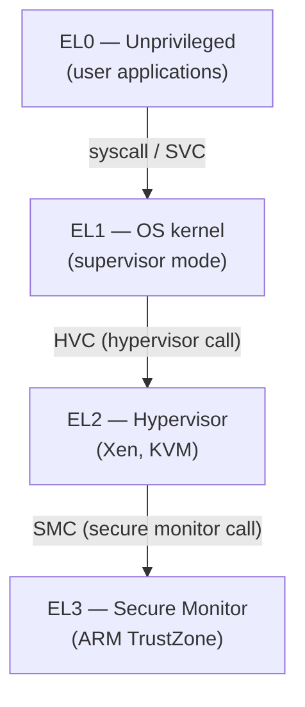
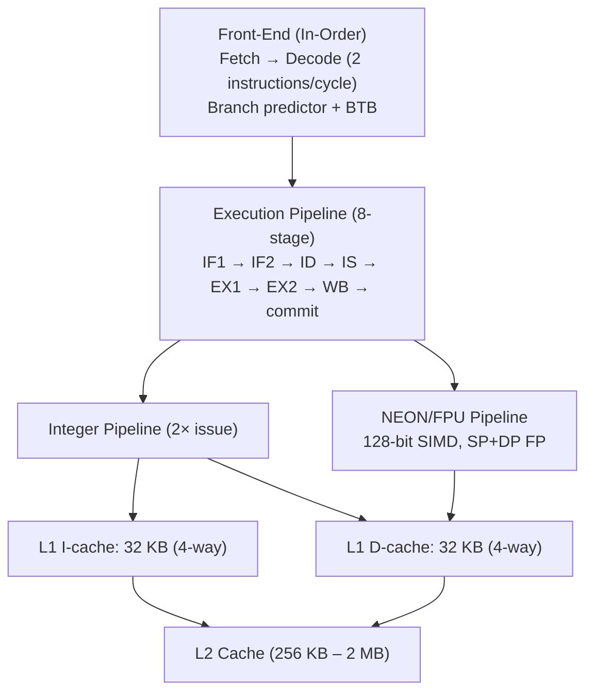
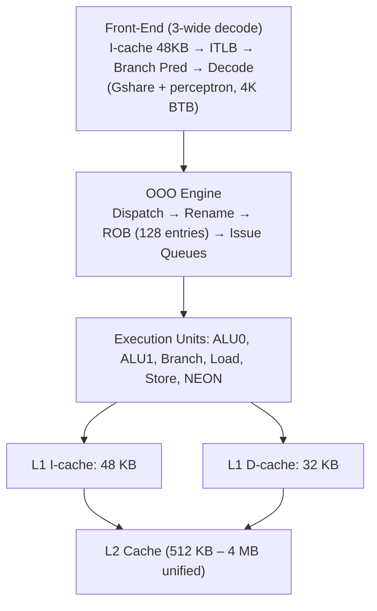
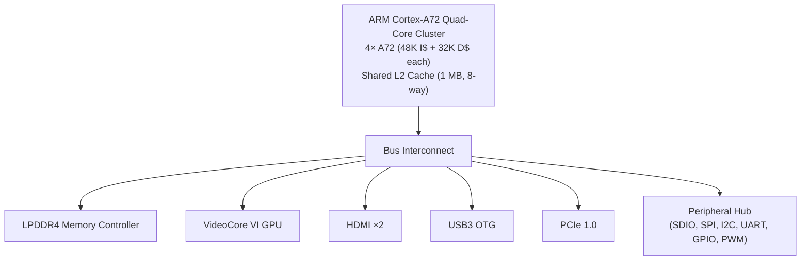
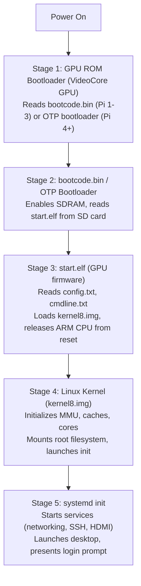

# Chapter 19: Raspberry Pi and ARM Cortex-A Architecture

## 19.1 From MCU to Linux SBC

The previous chapters covered **microcontrollers** (MCUs) — single-chip computers that run bare-metal firmware or a small RTOS. Now we move to a fundamentally different class of hardware: **Single Board Computers (SBCs)** that run a full operating system.

### MCU vs SBC — Fundamental Differences

| Feature          | MCU (STM32F4)        | SBC (Raspberry Pi 4)     |
|-----------------|----------------------|--------------------------|
| CPU             | ARM Cortex-M4 @ 168 MHz | ARM Cortex-A72 @ 1.8 GHz |
| Architecture    | 32-bit, no MMU       | 64-bit (AArch64), full MMU |
| RAM             | 192 KB SRAM          | 1-8 GB LPDDR4            |
| Storage         | 2 MB Flash (on-chip) | MicroSD / USB SSD (off-chip) |
| OS              | Bare-metal / RTOS    | Linux (full OS)          |
| Boot time       | Microseconds         | 15-60 seconds            |
| GPIO control    | Nanosecond precise   | Milliseconds (OS overhead)|
| Power           | ~50-500 mW           | 2-15 W                   |
| Real-time       | Deterministic        | Non-deterministic        |
| Connectivity    | Limited peripherals  | USB, HDMI, Ethernet, WiFi|
| Price           | $1-$15 chip          | $15-$75 board            |

**When to use which:**
- MCU: Real-time control, battery-powered, simple sensors, motor driving
- SBC (Raspberry Pi): Camera, display, network server, ML inference, desktop apps, complex algorithms

---

## 19.2 ARM Cortex-A Architecture

### Overview

The **Cortex-A** series (Application profile) is designed for running rich operating systems:

- **Full MMU (Memory Management Unit)** — Required for Linux, virtual memory
- **Large register file** — 31 general-purpose registers (AArch64)
- **NEON SIMD** — 128-bit vector operations (media, crypto, ML)
- **Out-of-Order Execution** — Instructions execute out of program order for IPC
- **Deep pipelines** — 8-15+ stages for high clock frequencies
- **Large caches** — L1 I+D, L2, sometimes L3
- **Coherent multicore** — Multiple cores sharing memory coherently

### ARMv8-A (64-bit) Architecture

The Raspberry Pi 3/4/5 use ARMv8-A (AArch64):

**AArch64 register file:**
```
General Purpose Registers:
X0-X28   : 64-bit general purpose
X29 (FP) : Frame Pointer
X30 (LR) : Link Register (return address)
XZR      : Zero Register (reads as 0, writes discarded)
SP       : Stack Pointer (aligned to 16 bytes in AArch64!)
PC       : Program Counter

W0-W30   : 32-bit views of X0-X30 (lower 32 bits)

NEON/FPU Registers:
V0-V31   : 128-bit vector registers
  → B0-B31 (8-bit view)
  → H0-H31 (16-bit view)
  → S0-S31 (32-bit float)
  → D0-D31 (64-bit double)
  → Q0-Q31 (128-bit vector)

System Registers (accessed via MRS/MSR):
NZCV     : Condition flags (Negative, Zero, Carry, Overflow)
FPSR     : Floating-Point Status Register
CurrentEL: Current Exception Level
TTBR0_EL1: Translation Table Base Register (user space page tables)
TTBR1_EL1: Translation Table Base Register (kernel space)
TCR_EL1  : Translation Control Register
```

### Exception Levels (Privilege Rings)

AArch64 has 4 exception levels:



### AArch64 Calling Convention (AAPCS64)

```
Arguments: x0-x7 (first 8 args), rest on stack
Return:    x0 (64-bit), x0+x1 (128-bit struct)
Callee-saved: x19-x28, x29 (FP), SP
Caller-saved: x0-x18, x30 (LR)

Stack: 16-byte aligned
```

---

## 19.3 ARM Cortex-A53 (Raspberry Pi 3, Zero 2W)

The Cortex-A53 is an **energy-efficient in-order processor**:

### Microarchitecture



**Cortex-A53 specifications:**
| Parameter        | Value                         |
|-----------------|-------------------------------|
| Architecture    | ARMv8-A (AArch32 + AArch64)   |
| Pipeline        | 8-stage, in-order             |
| Issue width     | 2 instructions/cycle          |
| DMIPS/MHz       | 2.3                           |
| L1 I-cache      | 8-64 KB                       |
| L1 D-cache      | 8-64 KB                       |
| L2 cache        | 128 KB - 2 MB                 |
| NEON            | 128-bit (2× 64-bit vectors)   |
| FPU             | VFPv4 (SP + DP)               |
| Process node    | 28 nm - 7 nm (varies)         |

**In-order vs Out-of-Order:**
- A53 is **in-order**: instructions execute in program order
- Simpler, lower power, lower area
- Good for battery-powered devices where power matters most
- Lower peak performance vs OOO cores

---

## 19.4 ARM Cortex-A72 (Raspberry Pi 4)

The Cortex-A72 is an **out-of-order high-performance core**:

### Microarchitecture



**Cortex-A72 specs:**
| Parameter        | Value                          |
|-----------------|--------------------------------|
| Architecture    | ARMv8-A                        |
| Pipeline        | Variable-length OOO             |
| Issue width     | 3 instructions/cycle           |
| ROB size        | 128 entries                    |
| DMIPS/MHz       | 4.7 (≈ 2× A53!)               |
| L1 I-cache      | 48 KB, 3-way                   |
| L1 D-cache      | 32 KB, 2-way                   |
| L2 cache        | 512 KB - 4 MB                  |
| NEON            | 128-bit                        |
| FPU             | VFPv4 (SP + DP)               |

**Performance vs Cortex-A53:**
- ~2× better single-threaded performance at same frequency
- More power per core (higher IPC, more transistors)
- Better for computation-intensive workloads

---

## 19.5 ARM Cortex-A76 and A78 (Used in high-end SoCs)

### Cortex-A76 (Apple iPhone A12 competition, 2018)

- 4-wide decode/issue OOO
- 128 KB L1 I-cache, 64 KB L1 D-cache
- Up to 512 KB L2 per cluster
- 4.0 DMIPS/MHz → ~3.3 GHz typical
- Used in: Snapdragon 845, Kirin 980

### Cortex-A77 (2019)

- Improved front-end, better branch predictor
- ~20% better than A76

### Cortex-A78 (2020)

- Further IPC improvements (~5% over A77)
- Better ML performance

### Cortex-X1/X2/X3/X4 — "Prime" Cores

ARM's highest-performance cores (used as the "big" in big.LITTLE):
- X1: 2× A78 performance in some benchmarks
- X2: ARMv9, SVE2 support
- X4: Up to 12 MB L2 cache, Armv9.2

Used in: Snapdragon 8 Gen 2/3, Dimensity 9300, Samsung Exynos

---

## 19.6 Raspberry Pi Hardware Generations

### Raspberry Pi 1 (2012)

```
SoC: Broadcom BCM2835
CPU: ARM1176JZF-S (ARMv6), 700 MHz (single core!)
GPU: Broadcom VideoCore IV
RAM: 256 MB (original) / 512 MB (Model B)
USB: 1-2× USB 2.0
Networking: Model B: 100 Mbps Ethernet (via USB hub on-chip)
GPIO: 26-pin header (later 40-pin with B+)
Storage: Full-size SD card
Power: 5V, 700 mA via Micro USB
```

### Raspberry Pi 2 (2015)

```
SoC: Broadcom BCM2836
CPU: Cortex-A7 quad-core @ 900 MHz (ARMv7)
GPU: VideoCore IV
RAM: 1 GB LPDDR2
```

### Raspberry Pi 3 Model B (2016) — First WiFi RPi

```
SoC: Broadcom BCM2837
CPU: Cortex-A53 quad-core @ 1.2 GHz (ARMv8, 64-bit)
GPU: VideoCore IV @ 400 MHz
RAM: 1 GB LPDDR2
WiFi: 802.11 b/g/n (2.4 GHz)
Bluetooth: 4.1
USB: 4× USB 2.0
Ethernet: 100 Mbps
GPIO: 40-pin
Storage: MicroSD
Price: $35
```

### Raspberry Pi 3 Model B+ (2018)

```
SoC: BCM2837B0 (improved thermal design)
CPU: Cortex-A53 quad-core @ 1.4 GHz
WiFi: 802.11 b/g/n/ac (dual-band 2.4+5 GHz)
Bluetooth: 4.2
Ethernet: Gigabit (USB 2.0 limited to ~300 Mbps)
USB: 4× USB 2.0
Power over Ethernet (PoE): via PoE HAT
```

### Raspberry Pi 4 Model B (2019) — Major Upgrade

```
┌─────────────────────────────────────────────────────────────┐
│                  Raspberry Pi 4 Model B                     │
│                                                             │
│  SoC: Broadcom BCM2711                                     │
│  CPU: Cortex-A72 quad-core @ 1.5-1.8 GHz (ARMv8-A 64-bit) │
│  GPU: VideoCore VI @ 500 MHz                               │
│  RAM: 1/2/4/8 GB LPDDR4-3200                              │
│                                                             │
│  Connectivity:                                              │
│  - WiFi: 802.11 b/g/n/ac dual-band (2.4+5 GHz)           │
│  - Bluetooth: 5.0 + BLE                                    │
│  - USB 3.0: 2× (SuperSpeed 5 Gbps!)                       │
│  - USB 2.0: 2×                                             │
│  - Gigabit Ethernet (true Gbps, not USB-limited!)          │
│  - USB-C power (5V 3A = 15W)                              │
│                                                             │
│  Video:                                                     │
│  - 2× micro-HDMI (4K60 + 4K60 or 2× 4K30)               │
│  - H.265 (HEVC) decode 4K60                                │
│  - H.264 decode 1080p60, encode 1080p30                    │
│  - MIPI DSI (display), MIPI CSI (camera)                   │
│                                                             │
│  GPIO: 40-pin header (same as RPi 3)                       │
│  Storage: MicroSD + USB boot + NVMe via USB3 adapter       │
│  Price: $35 (1GB) / $45 (2GB) / $55 (4GB) / $75 (8GB)    │
└─────────────────────────────────────────────────────────────┘
```

**BCM2711 SoC details:**
- 28 nm TSMC process
- Cortex-A72 (not A53!) — significant performance jump
- PCIe 1.0 interface (×1) → used for USB 3.0 VL805 controller
- VideoCore VI GPU (OpenGL ES 3.1, Vulkan 1.0)
- HDMI 2.0 support
- 8-channel DMA

### Raspberry Pi 5 (2023) — Latest Generation

```
SoC: Broadcom BCM2712
CPU: Cortex-A76 quad-core @ 2.4 GHz
GPU: VideoCore VII (OpenGL ES 3.1, Vulkan 1.3)
RAM: 4 GB or 8 GB LPDDR4X-4267
PCIE: PCIe 2.0 ×1 via M.2 HAT (NVMe SSD!)
Power: USB-C PD 5V/5A = 25W

New: Raspberry Pi RP1 companion chip
  - 4-lane MIPI CSI + DSI
  - USB 3.0 host
  - 2× USB 2.0
  - Gigabit Ethernet MAC
  - Replaces VL805 and other external chips

Connectivity:
  - WiFi 802.11 b/g/n/ac/ax (WiFi 5, not WiFi 6)
  - Bluetooth 5.0
  - 2× micro-HDMI 4K60

Price: $60 (4 GB) / $80 (8 GB)
```

### Raspberry Pi Zero / Zero W / Zero 2W

**Pi Zero (2015):**
```
SoC: BCM2835 (same as Pi 1)
CPU: ARM1176JZF-S @ 1 GHz
RAM: 512 MB
Size: 65 × 30 mm (credit-card half-size)
Price: $5 ($10 with headers)
USB: 1× micro-USB OTG
No Ethernet, No WiFi (Zero 1)
```

**Pi Zero W (2017):**
- Adds WiFi 802.11 b/g/n + Bluetooth 4.1
- Same size, $10

**Pi Zero 2W (2021):**
```
SoC: BCM2710A1 (custom RP3A0)
CPU: Cortex-A53 quad-core @ 1 GHz (like Pi 3!)
RAM: 512 MB LPDDR2
WiFi: 802.11 b/g/n/ac + Bluetooth 4.2
Size: 65 × 30 mm
Price: $15
```

### Compute Module (CM)

For industrial/custom designs:
- **CM4:** BCM2711, 1-8 GB RAM, 0-32 GB eMMC, WiFi/BT optional
- No USB ports, Ethernet, GPIO headers — just SoC + RAM + eMMC in module
- Connects via 2× 100-pin high-density connectors
- Used on custom carrier boards

### Pi Model Comparison

| Model          | CPU         | MHz   | RAM     | USB     | Ethernet  | WiFi | Price |
|----------------|-------------|-------|---------|---------|-----------|------|-------|
| Pi 1 B+        | A6          | 700   | 512 MB  | 4× USB2 | 100 Mbps  | No   | —     |
| Pi 2 B         | A7 quad     | 900   | 1 GB    | 4× USB2 | 100 Mbps  | No   | —     |
| Pi 3 B+        | A53 quad    | 1400  | 1 GB    | 4× USB2 | ~300 Mbps | Yes  | $35   |
| Pi 4 B 8GB     | A72 quad    | 1800  | 8 GB    | 2×USB3+2×USB2 | 1 Gbps | Yes | $75  |
| Pi 5 8GB       | A76 quad    | 2400  | 8 GB    | 2×USB3+2×USB2 | 1 Gbps | Yes | $80  |
| Pi Zero 2W     | A53 quad    | 1000  | 512 MB  | 1× USB2 OTG| None   | Yes  | $15   |

---

## 19.7 BCM2711 Architecture (RPi 4 SoC)

### Internal Block Diagram



### VideoCore VI GPU

The GPU handles:
- **3D graphics:** OpenGL ES 3.1, Vulkan 1.0 (RPi 4) / 1.3 (RPi 5)
- **Video decode:** H.264 (1080p60), H.265/HEVC (4K60 on RPi 4)
- **Video encode:** H.264 (1080p30)
- **Display output:** HDMI 2.0 (4K60), DSI
- **Camera input:** CSI (up to 4K)

The GPU also runs the **boot firmware** (start.elf) and manages shared memory with CPU.

---

## 19.8 Raspberry Pi Boot Process

### Boot Sequence



### config.txt — Raspberry Pi Configuration

Equivalent to BIOS/UEFI settings, stored on SD card FAT partition:

```ini
# Overclock (be careful with cooling!)
arm_freq=1800          # CPU frequency in MHz (Pi 4 default: 1500)
gpu_freq=750           # GPU frequency
over_voltage=6         # Voltage for overclock (0-8)

# Memory split
gpu_mem=128            # GPU reserved memory in MB (default 76)

# HDMI
hdmi_group=2           # HDMI mode group (1=CEA, 2=DMT)
hdmi_mode=82           # 1080p60

# Camera
camera_auto_detect=1   # Auto-detect camera (Pi 4+)
dtoverlay=imx477       # Camera driver overlay

# SPI, I2C, UART
dtparam=spi=on        # Enable SPI
dtparam=i2c_arm=on    # Enable I2C
enable_uart=1          # Enable UART on GPIO14/15

# For overclocking Pi 4 to 2 GHz:
arm_freq=2000
over_voltage=6
gpu_freq=750
force_turbo=1
```

### Device Tree

Linux uses **Device Tree** to describe hardware to kernel:
- `bcm2711-rpi-4-b.dts` — describes Pi 4 hardware (CPU, RAM, peripherals)
- Compiled to `.dtb` (binary) — loaded by bootloader
- **Overlays** (`.dtbo`) — add/modify hardware at boot time
- Allows single kernel to support multiple hardware configurations

---

## 19.9 Raspberry Pi Operating Systems

### Raspberry Pi OS (formerly Raspbian)

Official OS, based on Debian Linux:
- Optimized for RPi hardware (GPU, camera, GPIO)
- Desktop version: LXDE or Pixel (lightweight desktop)
- Lite version: No desktop (headless), for servers/IoT
- Full version: Includes productivity software (office, browser)

**Versions:**
- 32-bit: armhf (ARMv7 Thumb-2) — runs on all Pi models
- 64-bit: arm64 (AArch64) — recommended for Pi 3/4/5 (better performance)

### Other OS Options

| OS            | Use Case                           |
|---------------|-----------------------------------|
| Ubuntu 22.04  | Full Linux, snap packages          |
| Ubuntu Server | Headless server workloads          |
| Kali Linux    | Security/penetration testing       |
| RetroPie      | Retro gaming emulation             |
| LibreELEC     | Kodi media center                  |
| Home Assistant| Smart home automation              |
| DietPi        | Minimal, lightweight               |
| Alpine Linux  | Minimal security-focused           |
| Windows IoT   | (No longer actively supported)     |

---

## 19.10 GPIO on Raspberry Pi

### GPIO System

Raspberry Pi's 40-pin GPIO header provides:
- Digital I/O (3.3V logic — NOT 5V tolerant!)
- SPI, I2C, UART, PWM
- Hardware PWM on GPIO12, 13, 18, 19

```
RPi 4 GPIO Header (40 pins):

       3V3 (1) ─● ●─ (2) 5V
   GPIO2 / SDA1 (3) ─● ●─ (4) 5V
   GPIO3 / SCL1 (5) ─● ●─ (6) GND
GPIO4 / GPCLK0 (7) ─● ●─ (8) GPIO14 / TXD0
           GND (9) ─● ●─ (10) GPIO15 / RXD0
GPIO17 / GPIO17 (11)─● ●─ (12) GPIO18 / PCM_CLK / PWM0
       GPIO27 (13)─● ●─ (14) GND
       GPIO22 (15)─● ●─ (16) GPIO23
       3V3    (17)─● ●─ (18) GPIO24
GPIO10 / MOSI (19)─● ●─ (20) GND
GPIO9 / MISO  (21)─● ●─ (22) GPIO25
GPIO11 / SCLK (23)─● ●─ (24) GPIO8 / CE0
           GND (25)─● ●─ (26) GPIO7 / CE1
 GPIO0 / ID_SD (27)─● ●─ (28) GPIO1 / ID_SC
       GPIO5  (29)─● ●─ (30) GND
       GPIO6  (31)─● ●─ (32) GPIO12 / PWM0
GPIO13 / PWM1 (33)─● ●─ (34) GND
GPIO19 / MISO (35)─● ●─ (36) GPIO16
       GPIO26 (37)─● ●─ (38) GPIO20 / MOSI
           GND (39)─● ●─ (40) GPIO21 / SCLK
```

### GPIO Programming

**Python with RPi.GPIO:**
```python
import RPi.GPIO as GPIO
import time

GPIO.setmode(GPIO.BCM)  # Use GPIO number (BCM mode)
GPIO.setup(18, GPIO.OUT)  # GPIO18 as output
GPIO.setup(17, GPIO.IN, pull_up_down=GPIO.PUD_UP)  # GPIO17 as input

# Blink LED
for i in range(10):
    GPIO.output(18, GPIO.HIGH)
    time.sleep(0.5)
    GPIO.output(18, GPIO.LOW)
    time.sleep(0.5)

GPIO.cleanup()
```

**Python with gpiozero (higher-level):**
```python
from gpiozero import LED, Button
from time import sleep

led = LED(18)
button = Button(17)

button.when_pressed = led.on
button.when_released = led.off

# Or:
led.blink(on_time=0.5, off_time=0.5)
```

**GPIO timing problem:**
```
Linux is NOT real-time! GPIO toggling has jitter:
- Normal: ±100 µs jitter
- High load: ±1 ms+ jitter
- Hardware PWM: accurate (hardware-driven, not software)
- For precise timing: use STM32 or dedicated I2C/SPI peripheral

Solutions for timing-sensitive GPIO:
1. Use hardware peripherals (SPI bit-banging for WS2812 is not recommended)
2. Use pigpio library (uses DMA for timing accuracy)
3. Use a co-processor MCU (STM32 + RPi connected via UART/SPI)
4. Use PRU (on BeagleBone) or RP2040 PIO for hard real-time
```

**pigpio library (better timing):**
```python
import pigpio

pi = pigpio.pi()
pi.set_mode(18, pigpio.OUTPUT)

# Hardware timed waveforms:
pi.wave_add_generic([
    pigpio.pulse(1 << 18, 0, 500000),   # GPIO18 high for 500ms
    pigpio.pulse(0, 1 << 18, 500000),   # GPIO18 low for 500ms
])
wave_id = pi.wave_create()
pi.wave_send_repeat(wave_id)
```

---

## 19.11 Interfacing Sensors and Actuators

### I2C Sensors

```python
# I2C with smbus2
import smbus2

bus = smbus2.SMBus(1)  # I2C bus 1 (GPIO2=SDA, GPIO3=SCL)
address = 0x76  # BMP280 address

# Read device ID
chip_id = bus.read_byte_data(address, 0xD0)  # register 0xD0
print(f"Chip ID: {chip_id:#x}")  # Should be 0x60 for BMP280

# Read temperature (simplified):
bus.write_byte_data(address, 0xF4, 0x27)  # Set config
adc_T = bus.read_i2c_block_data(address, 0xFA, 3)
```

**Popular I2C sensors for RPi:**
- MPU-6050 (IMU) — address 0x68
- BMP280/BME280 (pressure/temp/humidity) — 0x76/0x77
- VL53L0X (ToF distance) — 0x29
- SSD1306 OLED (display) — 0x3C/0x3D
- ADS1115 (16-bit ADC) — 0x48 (RPi has no ADC!)

### SPI Devices

```python
import spidev

spi = spidev.SpiDev()
spi.open(0, 0)  # Bus 0, CE0 (GPIO8)
spi.max_speed_hz = 1000000

# Transfer (send + receive simultaneously):
response = spi.xfer2([0x01, 0x00])
```

### Camera (Pi Camera / CSI)

```python
from picamera2 import Picamera2
import time

picam2 = Picamera2()
config = picam2.create_still_configuration(main={"size": (1920, 1080)})
picam2.configure(config)
picam2.start()
time.sleep(2)
picam2.capture_file("photo.jpg")
```

---

## 19.12 Raspberry Pi Use Cases

### Home Automation Server
- Home Assistant OS on RPi 4
- Controls smart home devices via WiFi/Zigbee/Z-Wave HAT
- Web dashboard accessible from anywhere

### Retro Gaming (RetroPie)
- Emulates NES, SNES, Genesis, PS1, N64, arcade
- Connect USB/Bluetooth controllers
- HDMI output to TV

### Network Server
- Pi-hole (DNS ad-blocker for whole network)
- VPN server (WireGuard/OpenVPN)
- NAS (Network Attached Storage) with USB drives
- Web server (Nginx + Python/Node.js)
- Minecraft server (Pi 4 8GB)

### Machine Learning Edge Inference
- TensorFlow Lite (optimized for ARM)
- ONNX Runtime
- OpenCV (computer vision)
- Face recognition, object detection
- Google Coral TPU USB accelerator for faster inference

### Industrial/Scientific
- Data logging (sensors via GPIO/I2C/SPI + SD card/database)
- Oscilloscope display with touchscreen
- CNC machine controller (LinuxCNC)
- Weather station

---

## 19.13 RP2040 — The Pi Microcontroller

Not Raspberry Pi OS — this is an actual MCU from Raspberry Pi Ltd:

### RP2040 Specifications

```
CPU: Dual-core ARM Cortex-M0+ @ 133 MHz
SRAM: 264 KB (6 banks of 32 KB + 2×4 KB)
Flash: External QSPI (2-16 MB)
GPIO: 30 user I/O
ADC: 4-channel 12-bit
USB: 1× Full Speed (12 Mbps) native
SPI: 2×, I2C: 2×, UART: 2×
PWM: 16 channels
Timer: 4×
DMA: 12 channels

Special: PIO (Programmable I/O) — 2 blocks × 4 state machines
```

### PIO — Programmable I/O

The RP2040's unique feature — hardware programmable state machines:

```
PIO state machines:
- Run simple assembly programs
- Direct GPIO access at 125 MHz
- Used for: WS2812B LEDs, SPI, I2C, DVI video, stepper motor
- Completely deterministic (hard real-time!)
- No jitter from OS or interrupt latency

PIO is like having 8 simple coprocessors for I/O
```

**PIO example (WS2812B LED driver):**
```pio
; WS2812B protocol: sends 1 bit per loop
.program ws2812
.side_set 1            ; 1 side-set pin (LED data)

bitloop:
    out x, 1  side 0  [6]    ; Pull bit, set low, wait 7 cycles
    jmp !x, do_zero  side 1  [3]  ; If 0, set high 4 cycles only
    jmp bitloop  side 1  [5]     ; If 1, set high 6 cycles
do_zero:
    nop  side 0  [4]          ; Finish 0 bit
```

**Boards using RP2040:**
- Raspberry Pi Pico ($4) — breadboard, MicroPython/C
- Raspberry Pi Pico W ($6) — adds CYW43439 WiFi chip
- Adafruit Feather RP2040
- SparkFun Pro Micro RP2040
- Arduino Nano RP2040 Connect

---

## 19.14 Summary

| System          | CPU Core   | Target Use           | Key Strength              |
|----------------|------------|----------------------|--------------------------|
| RP2040 (Pico)  | M0+ dual   | MCU, real-time I/O   | PIO, price ($4)           |
| Pi Zero 2W     | A53 quad   | Lightweight Linux    | WiFi, small size, price  |
| Pi 3B+         | A53 quad   | General Linux SBC    | Community, ecosystem     |
| Pi 4B 8GB      | A72 quad   | Desktop Linux        | Performance, RAM, USB3   |
| Pi 5 8GB       | A76 quad   | High-perf SBC        | PCIe NVMe, 2.4 GHz       |
| CM4            | A72 quad   | Industrial/embedded  | Custom carrier board     |

The Raspberry Pi ecosystem bridges the gap between simple MCUs and full desktop computers, enabling:
- Running Python/C++ programs with full Linux OS
- USB, HDMI, Ethernet, WiFi out of the box
- Camera, display, audio interfaces
- Remote SSH access, web servers, databases
- Machine learning and computer vision at the edge

The trade-off vs MCUs: GPIO timing is non-deterministic (OS jitter), higher power consumption (~2-10 W vs µW-mW for MCUs), and longer boot times. For projects requiring real-time control + high-level computing, the common solution is **RPi + STM32/Arduino** connected via UART or SPI.
