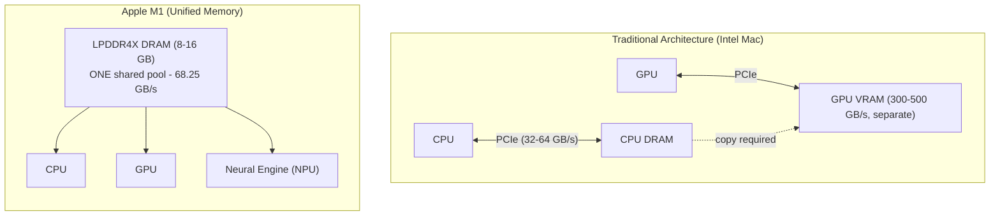
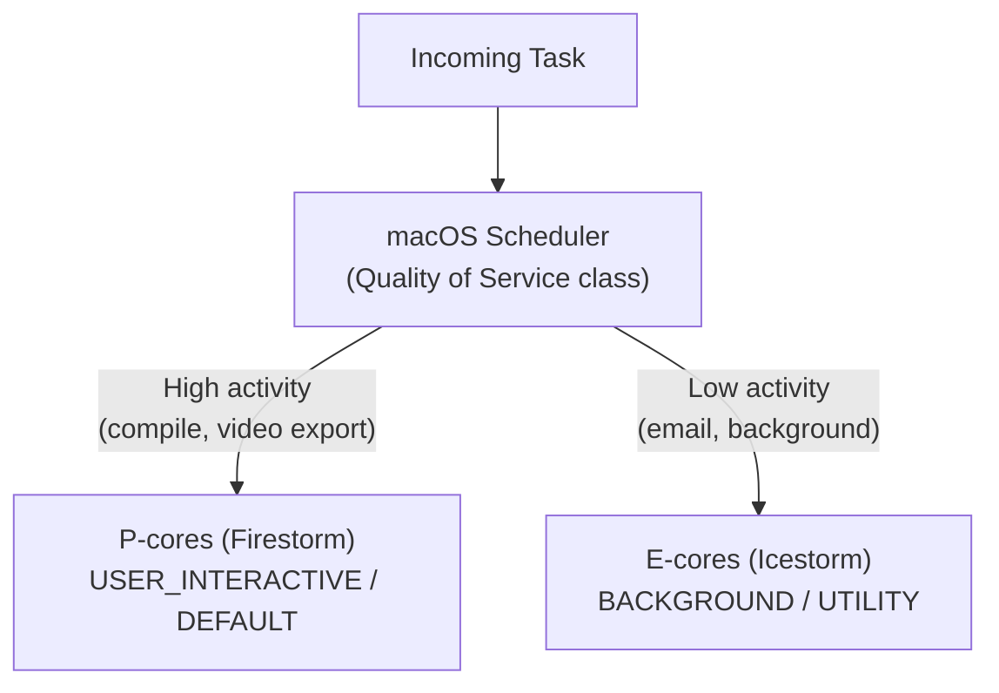
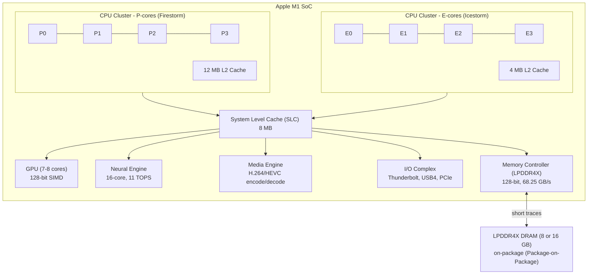
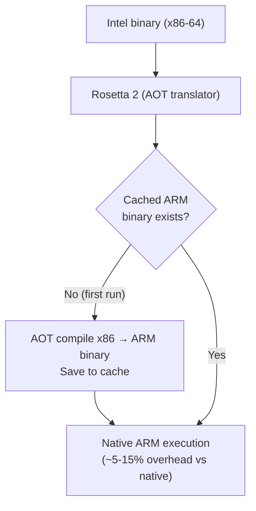

# Chapter 20: Apple Silicon Architecture — M1, M2, M3, M4

## 20.1 The Apple Silicon Revolution

On November 17, 2020, Apple launched the **MacBook Air, MacBook Pro, and Mac mini** with their first ARM-based desktop chips: the **Apple M1**. This was a watershed moment in the semiconductor industry.

### Why Apple Moved Away from Intel

Apple used Intel processors in Macs from 2006 to 2020:
- **Thermal problems:** Intel's 14nm process was stuck for years; Macs thermal-throttled aggressively
- **Power efficiency:** Intel optimized for desktop performance; Apple needed laptop efficiency
- **Custom silicon advantage:** Apple's A-series chips in iPhone/iPad already outperformed Intel in per-watt performance
- **Architecture control:** Intel's roadmap didn't align with Apple's vision
- **Tight integration:** Designing their own SoC enables unified memory, custom accelerators
- **Competition:** Qualcomm/Arm chips becoming good enough to threaten Intel in thin-and-light

### Historical Context: Apple A-Series

Apple had been designing custom ARM chips since A4 (iPhone 4, 2010):
- **A7 (2013):** First 64-bit ARM chip in a smartphone (iPhone 5s) — years ahead of competition
- **A10 Fusion (2016):** First hetrogeneous (big+small) core design in Apple silicon
- **A12 Bionic (2018):** First 7nm chip in a smartphone, first Apple Neural Engine
- **A14 Bionic (2020):** First 5nm chip — same core design as M1!

**M1 IS essentially A14X with more cores and more cache.**

---

## 20.2 Apple M1 Architecture

### M1 Specifications

| Parameter          | Value                              |
|--------------------|-----------------------------------|
| Process node       | TSMC 5nm (N5)                     |
| Transistors        | 16 billion                        |
| CPU cores          | 4 Performance + 4 Efficiency = 8  |
| GPU cores          | 7-8 (varies by model)             |
| Neural Engine      | 16-core                           |
| Memory bandwidth   | 68.25 GB/s                        |
| RAM types          | 8 GB / 16 GB LPDDR4X unified      |
| ISA                | ARMv8.5-A (AArch64)               |
| Performance cores  | Apple Firestorm                   |
| Efficiency cores   | Apple Icestorm                    |

### Unified Memory Architecture (UMA)

The most revolutionary aspect of M1 is **Unified Memory**:



**Benefits of Unified Memory:**
- CPU can access GPU memory directly — no expensive copy operations (DMA transfers eliminated)
- GPU can access any CPU-allocated data — zero-copy ML training
- Bandwidth shared but coherent — all see same data
- Die area savings (one RAM, not two)
- Power savings (less data movement)

**The trade-off:** RAM is on the SoC package — not expandable (unlike Intel Macs with standard DIMM slots)

### Firestorm (Performance Cores) Architecture

Apple's Firestorm core is one of the most aggressive OOO designs ever:

```
Firestorm Core Organization:
Frontend:
- 8-wide decode (8 instructions decoded per cycle!)
- L1 I-cache: 192 KB (enormous for an L1!)
- L2 unified: 12 MB per cluster (also huge!)
- Indirect branch predictor: extremely accurate

Out-of-Order Engine:
- Reorder Buffer: 630 entries (Intel i9: 512)
- Integer Issue Queue: 200 entries
- FP/SIMD Issue Queue: 160 entries
- Load Buffer: 192 entries
- Store Buffer: 128 entries

Execution Units:
- Integer: 6 ALUs
- FP/SIMD: 4 units
- Load/Store: 2+2

Memory:
- L1 D-cache: 128 KB (8-way, 1-cycle load-use!)
- L2 cache: 12 MB (shared within cluster)
- L3 (SLC): 8-16 MB (System Level Cache, shared)
```

**Why Firestorm is so fast:**
- Extremely wide out-of-order window (630-entry ROB)
- Massive L1/L2 caches reduce cache miss stalls
- High integer execution throughput (6 ALUs)
- Aggressive prefetcher

### Icestorm (Efficiency Cores) Architecture

The E-cores are smaller, simpler in-order processors:

```
Icestorm Core:
- In-order, 3-wide issue
- L1 I-cache: 64 KB
- L1 D-cache: 32 KB
- L2 cache: 4 MB (shared in cluster)
- Lower clock (up to 2.064 GHz vs 3.2 GHz for Firestorm)
- ~1/4 the area of Firestorm
- ~1/10 the power of Firestorm at low loads
```

**How P-core and E-core clusters work:**



### M1 GPU Architecture

```
M1 GPU: 7-8 cores (Air vs Pro)

Each GPU Core:
- 16 Execution Units (EU)
- 128 ALUs per EU = 2048 ALUs total per GPU core
- Unified shader architecture (vertex + pixel + compute)

Key features:
- Tile-based deferred rendering (TBDR) — efficient for mobile/thin GPU
- Apple Metal API (no OpenGL overhead)
- No ray tracing hardware (M1)
- No video encoding acceleration per-shader
- Very power efficient vs discrete GPU at same performance
```

### M1 Neural Engine (NPU)

The 16-core Neural Engine handles machine learning:
- **11 TOPS** (trillion operations per second)
- Matrix multiplication (for neural network inference)
- Used by: Face ID, Siri, photos intelligence, camera computational photography
- Core ML framework routes ML tasks here automatically

### M1 SoC Complete Block Diagram



---

## 20.3 M1 Pro and M1 Max

Apple quickly scaled up the M1 design for higher-end products:

### M1 Pro (October 2021)

| Component    | M1        | M1 Pro      |
|-------------|-----------|-------------|
| Process      | 5nm TSMC  | 5nm TSMC    |
| Transistors  | 16B       | 33.7B       |
| P-cores      | 4         | 8           |
| E-cores      | 4         | 2           |
| GPU cores    | 7-8       | 14-16       |
| Neural Engine| 16-core   | 16-core     |
| RAM          | 8-16 GB   | 16-32 GB    |
| Memory BW    | 68.25 GB/s| 200 GB/s    |
| Memory bus   | 128-bit   | 256-bit     |

**M1 Pro target:** Pro laptops (MacBook Pro 14"/16") with more GPU for creative work

### M1 Max (October 2021)

| Component    | M1 Pro      | M1 Max      |
|-------------|-------------|-------------|
| Transistors  | 33.7B       | 57B         |
| P-cores      | 8           | 8           |
| E-cores      | 2           | 2           |
| GPU cores    | 14-16       | 24-32       |
| RAM          | 16-32 GB    | 32-64 GB    |
| Memory BW    | 200 GB/s    | 400 GB/s    |
| Memory bus   | 256-bit     | 512-bit     |

**M1 Max:** Two M1 Pro dies connected via die-to-die fabric, sharing RAM

### M1 Ultra (March 2022)

| Component    | M1 Max      | M1 Ultra    |
|-------------|-------------|-------------|
| Construction | Single die  | 2× M1 Max connected |
| Transistors  | 57B         | 114B        |
| P-cores      | 8           | 20          |
| E-cores      | 2           | 4           |
| GPU cores    | 24-32       | 48-64       |
| RAM          | 32-64 GB    | 64-128 GB   |
| Memory BW    | 400 GB/s    | 800 GB/s    |

**UltraFusion:** Apple's proprietary die-to-die interconnect between two M1 Max dies
- 2.5 TB/s die-to-die bandwidth
- Software sees it as one coherent processor (not NUMA)
- Used in Mac Studio, Mac Pro

---

## 20.4 M2 Architecture (2022)

### M2 Base

- **Process:** TSMC 5nm improved (N5P — same lithography but better density)
- **Transistors:** 20 billion (vs 16B for M1)
- **CPU:** Same 4P + 4E topology but ~15% faster per core
- **GPU:** 8-10 cores (updated architecture)
- **Memory:** 8-24 GB LPDDR5 (faster than M1's LPDDR4X)
- **Memory BW:** 100 GB/s (vs 68.25 GB/s M1)
- **Neural Engine:** 16-core, 15.8 TOPS (vs 11 TOPS M1)
- **Media Engine:** ProRes hardware encode/decode (M1 could decode, not encode in hardware)

### M2 Pro / Max / Ultra (2023)

Same scaling pattern:
- M2 Pro: 12P+4E cores, 19-38 GPU cores, 200-400 GB/s
- M2 Max: 12P+4E cores, 38 GPU cores, 400 GB/s, 32-96 GB
- M2 Ultra: 24P+8E cores, 76 GPU cores, 800 GB/s, 192 GB

---

## 20.5 M3 Architecture (October 2023)

### Major Changes: TSMC 3nm (N3B)

M3 is built on **TSMC's first 3nm process** — the first Apple chip at 3nm:
- 60-70% more transistors per mm² vs 5nm N5P
- 35% less power at same performance vs N5
- Higher clock speeds possible

### M3 New GPU Architecture — Hardware Ray Tracing!

M3 introduces **hardware ray tracing** in the GPU:
```
M3 GPU new features:
- Hardware ray tracing (BVH traversal in hardware)
- Hardware mesh shading
- Dynamic caching (GPU memory allocated on-demand)
- Better ML operations in GPU shader
```

This puts M3 GPU at parity with NVIDIA/AMD discrete GPUs for graphics features.

### M3 Performance Cores — New Architecture

M3's Everest cores (P-cores) have improved:
- Larger ROB
- Better branch predictor
- New instruction set extensions (SME — Scalable Matrix Extension)

### M3 / M3 Pro / M3 Max (2023-2024)

| Component    | M3        | M3 Pro      | M3 Max      |
|-------------|-----------|-------------|-------------|
| Process      | 3nm TSMC  | 3nm TSMC    | 3nm TSMC    |
| Transistors  | 25B       | 37B         | 92B         |
| P-cores      | 4         | 6-12        | 12-16       |
| E-cores      | 4         | 3-6         | 4           |
| GPU cores    | 10        | 18          | 40          |
| RAM max      | 24 GB     | 36 GB       | 128 GB      |
| Memory BW    | 100 GB/s  | 150 GB/s    | 400 GB/s    |
| Ray tracing  | Yes       | Yes         | Yes         |

---

## 20.6 M4 Architecture (2024)

### M4 Base (iPad Pro first, then Mac)

- **Process:** TSMC 3nm second-generation (N3E — more mature, cheaper)
- **CPU:** New Palmas P-cores + Everest E-cores
- **CPU count:** 3P + 6E or 4P + 6E (unusual — more E-cores than before)
- **GPU:** 10 cores, improved hardware ML operations
- **Neural Engine:** 38 TOPS (vs 15.8 for M3 — 2.4× faster!)
- **RAM:** LPDDR5X (even faster than LPDDR5 in M3)
- **Memory BW:** 120 GB/s

**Key M4 focus:** AI/ML inference on-device
- Apple Intelligence (on-device LLM inference)
- M4's Neural Engine runs 7B+ parameter language models locally!

### M4 Pro / Max (2024)

- M4 Pro: 12P+4E cores, 20 GPU, 273 GB/s
- M4 Max: 16P+4E cores, 40 GPU, 546 GB/s, up to 128 GB RAM

---

## 20.7 Apple Silicon Custom Engines

Beyond CPU and GPU, every M-series chip includes specialized hardware:

### Media Engine

**Handles video encode/decode in hardware:**
```
Supported formats (M1 Pro+):
Decode: H.264, HEVC (H.265), ProRes, ProRes RAW, AV1
Encode: H.264, HEVC, ProRes

M1 Max/Ultra: 2× media engines
M2 Pro: 1× media engine (added encode vs M1 Pro)
```

Without Media Engine: CPU/GPU handles video → high power
With Media Engine: 5-10× more efficient → 2× longer battery life for video editing

### Image Signal Processor (ISP)

Processes camera input in hardware:
- Tone mapping, noise reduction, auto-white balance
- Used with external cameras via Thunderbolt
- Enables Apple's computational photography features

### Secure Enclave

Separate security processor:
- 4KB SRAM + ROM + AES engine
- Handles Touch ID/Face ID biometrics
- Stores encryption keys (never exposed to main CPU)
- Even if kernel is compromised, Secure Enclave data remains safe

### Thunderbolt / PCIe Controller

M1/M2/M3/M4 all include:
- USB4/Thunderbolt 3/4 controller (40 Gbps)
- PCIe controller (for NVMe SSD)
- USB 3.x controller

---

## 20.8 Memory Deep Dive: Package-on-Package LPDDR

### How M-series Accesses RAM

```
M1 Package:
┌─────────────────────────────────────────────────────┐
│                    Package Substrate                │
│  ┌───────────────────────────────────────────────┐  │
│  │              M1 Silicon Die                   │  │
│  │  (CPU, GPU, NPU, Memory Controller, SLC)     │  │
│  └───────────────────────────────────────────────┘  │
│                      ↕ Solder bumps (very short!)   │
│  ┌────────────────────┐  ┌────────────────────────┐  │
│  │  LPDDR4X Stack 1   │  │  LPDDR4X Stack 2       │  │
│  │  (4 or 8 GB)       │  │  (4 or 8 GB)           │  │
│  └────────────────────┘  └────────────────────────┘  │
└─────────────────────────────────────────────────────┘

Very short interconnect = low latency + low power
vs Intel Mac: DDR module sits 10-20cm away from CPU on PCB
```

### SLC — System Level Cache

The M1 has a large **System Level Cache** (also called L3/LLC):
- 8 MB on M1 base
- 24 MB on M1 Pro
- 32 MB on M1 Max
- On-die (not shared with RAM)
- All CPU + GPU + NPU can access
- Acts as last buffer before going to LPDDR4X/5

This SLC is why M-series handles large working sets so well — many operations never reach the slower LPDDR.

---

## 20.9 macOS and Apple Silicon

### Rosetta 2 — x86 Translation

When transitioning from Intel, Apple included **Rosetta 2** to run Intel binaries:



**Rosetta 2 is static translation (AOT), not interpretation:**
- Much faster than VMs or dynamic emulation
- Most Intel apps run 5-20% slower than native ARM equivalent
- But native ARM apps run 30-50% faster than the Intel originals!

### Metal — Apple's Graphics API

Apple's alternative to OpenGL/Vulkan:
- Lower-level access to GPU than OpenGL
- Built for Apple hardware specifics (tile memory, TBDR)
- Metal Performance Shaders (MPS): optimized math for ML
- Metal Shader Language: C++-based GPU compute

```swift
// Metal compute shader example:
kernel void add_arrays(device float* a, device float* b,
                       device float* result, uint id [[thread_position_in_grid]]) {
    result[id] = a[id] + b[id];
}
```

### Apple Neural Engine and Core ML

```python
# Core ML auto-routes to NPU:
import coremltools as ct
import numpy as np

model = ct.models.MLModel('model.mlpackage')

# Inference automatically uses NPU when available
result = model.predict({'input': np.random.rand(1, 224, 224, 3)})
```

The NPU handles:
- **Image classification** (Photos app)
- **Object detection** (screenshots, text recognition)
- **Natural Language Processing** (auto-correction, summarization)
- **On-device Siri** (faster, private)
- **Apple Intelligence** (on-device LLM, M4+)

---

## 20.10 Performance Comparison

### CPU Performance (Single Core)

Approximate SPECint2017 single-thread scores (2024):
```
Intel Core i9-14900K:  ~11.0
AMD Ryzen 9 7950X:     ~10.5
Apple M4:              ~10.8
Apple M3:              ~9.9
Apple M2:              ~8.7
Apple M1:              ~7.5
Apple A17 Pro (phone): ~7.0
Intel Core i7-1185G7:  ~6.0
```

**M-series single-core performance rivals desktop x86 while using laptop-class power!**

### GPU Performance (Apple vs Discrete)

| GPU                     | Performance    | Power     | TOPS ML |
|-------------------------|----------------|-----------|---------|
| NVIDIA RTX 4090         | ~100 TFLOPS    | 450W      | 1300    |
| AMD RX 7900 XTX         | ~60 TFLOPS     | 330W      | ~96     |
| Apple M3 Max (40 GPU)   | ~14 TFLOPS     | 16W total | ~147    |
| NVIDIA RTX 4070         | ~40 TFLOPS     | 200W      | ~1300   |
| Apple M4 (10 GPU)       | ~4.5 TFLOPS    | ~5W GPU   | ~38     |

**M-series GPU:** Not competing with high-end discrete, but exceptional performance/watt. M3 Max matches RTX 3080 performance at 1/10th the power.

---

## 20.11 Apple Silicon vs Competition

### vs Intel/AMD

| Feature              | Intel i9-14900K  | Apple M4 Max      |
|---------------------|------------------|-------------------|
| Process              | 10nm Intel 7     | 3nm TSMC          |
| TDP                  | 125-253W         | ~50W (full chip)  |
| Single-thread perf   | ≈ M4             | ≈ M4             |
| Multi-thread perf    | Slightly faster  | Comparable        |
| GPU                  | Discrete needed  | Integrated 40 core|
| NPU                  | Intel NPU (weak) | 38 TOPS           |
| RAM expandable       | Yes (DIMM)       | No (on-package)   |
| Max RAM              | 192 GB DDR5      | 128 GB            |
| Memory bandwidth     | 94 GB/s (DDR5)   | 546 GB/s!         |
| Power efficiency     | Lower            | Much higher       |

### vs Qualcomm Snapdragon X Elite (2024)

Qualcomm's answer to Apple Silicon:
- **CPU:** 12 × Nuvia Oryon cores @ 3.8 GHz (comparable to M3/M4 P-cores)
- **GPU:** Adreno X1 — roughly comparable to M3 base integrated
- **NPU:** 45 TOPS (vs 38 TOPS M4)
- **Memory:** LPDDR5X, 64 GB/s (lower than M4)
- **Windows on ARM:** Much better x86 emulation (64-bit x86 in Prism translator)

Competition is now very close in performance/watt.

---

## 20.12 The Custom Silicon Design Process

### How Apple Designs Its Chips

Apple has ~700+ silicon engineers (up from ~100 when they started):

```
Design cycle (~2-3 years):
1. Architecture definition (CPU, GPU, NPU top-level)
2. Microarchitecture design (pipeline, cache, issue width)
3. RTL design (Verilog/SystemVerilog gate-level)
4. Verification (simulation, formal verification — 70% of time!)
5. Synthesis (RTL → gate netlist)
6. Physical design (placement, routing, DRC)
7. Tape-out (final design sent to TSMC)
8. Manufacturing at TSMC (3 months)
9. Testing and characterization
10. Production
```

**Key advantage:** Apple controls the entire stack — hardware + software + OS
- Can optimize OS and apps for specific hardware features
- Can add custom instructions that macOS/iOS use
- Can change architecture radically (M1 → M2 → M3 → M4)

---

## 20.13 Impact on the Industry

Apple M1's launch forced the entire industry to reconsider ARM for desktop/laptop computing:

- **Qualcomm Snapdragon X Elite:** Direct competitive response
- **Microsoft:** Heavily invested in Windows on ARM
- **AMD:** Working on similar efficiency-focused designs
- **Intel:** Released E-cores concept (Intel 12th gen hybrid)
- **Samsung:** Custom Exynos cores competing
- **Google:** Tensor chips for Pixel phones/Chromebooks

Apple's vertical integration and TSMC partnership give advantages that pure chip designers struggle to match.

---

## 20.14 Summary

| Chip | Year | Process | Trans.  | CPU        | GPU   | NPU    | Memory BW |
|------|------|---------|---------|-----------|-------|--------|-----------|
| M1   | 2020 | 5nm     | 16B     | 4P+4E     | 7-8   | 11 TOPS| 68 GB/s   |
| M1 Pro| 2021| 5nm    | 33.7B   | 8P+2E     | 14-16 | 16-core| 200 GB/s  |
| M1 Max| 2021| 5nm    | 57B     | 8P+2E     | 24-32 | 16-core| 400 GB/s  |
| M2   | 2022 | 5nm+   | 20B     | 4P+4E     | 8-10  | 15.8T  | 100 GB/s  |
| M3   | 2023 | 3nm    | 25B     | 4P+4E     | 10    | 18 TOPS| 100 GB/s  |
| M3 Max| 2023| 3nm   | 92B     | 12-16P+4E | 40    | 18 TOPS| 400 GB/s  |
| M4   | 2024 | 3nm+   | 28B     | 3-4P+6E   | 10    | 38 TOPS| 120 GB/s  |
| M4 Max| 2024| 3nm+  | 92B     | 16P+4E    | 40    | 38 TOPS| 546 GB/s  |

Apple M-series represents the most successful ARM desktop transition in history, demonstrating that:
1. Unified memory architecture can dramatically increase bandwidth
2. Custom silicon enables capabilities impossible with off-the-shelf chips
3. In-order + OOO core heterogeneity (big.LITTLE) is essential for efficiency
4. Tight hardware-software integration unlocks performance that hardware alone cannot
