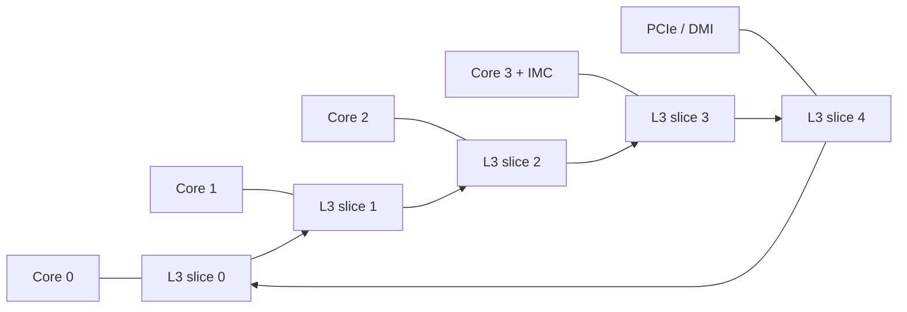
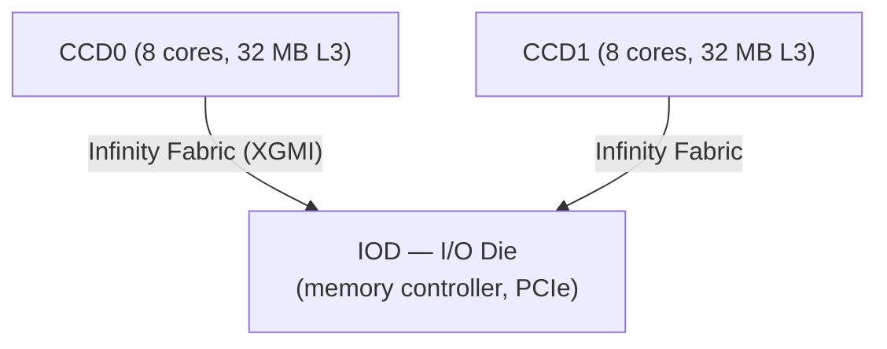
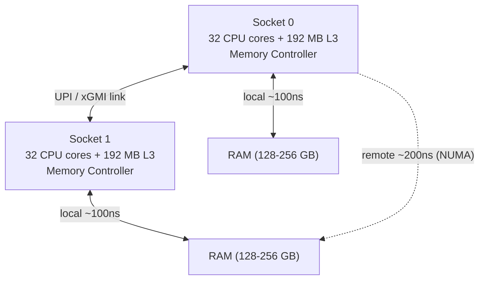
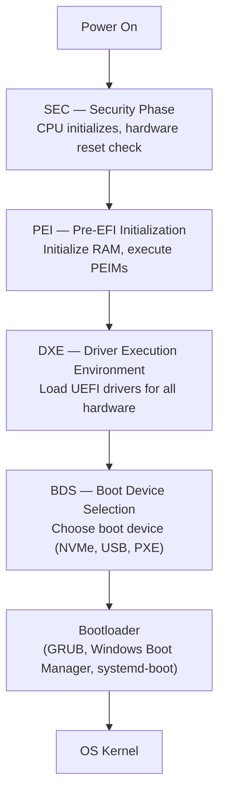

# Chapter 21: Intel and AMD x86 Architecture

## 21.1 The x86 Legacy

The x86 instruction set architecture powers:
- Every desktop PC and laptop (except Apple Silicon Macs)
- Every server (until ARM and RISC-V begin encroaching)
- Most cloud computing infrastructure (AWS, Azure, GCP)

The x86 ISA was introduced with the **Intel 8086 processor in 1978** and has been backward-compatible for 46+ years. A program compiled for the original 8086 can still run on a modern Intel Core i9!

### The x86 Timeline

```
1978: Intel 8086 — 29,000 transistors, 5-10 MHz, 16-bit
1982: Intel 80286 — Protected mode, 16-bit, 134K transistors
1985: Intel 80386 — 32-bit (x86-32/IA-32), paging, 275K transistors
1989: Intel 80486 — On-chip FPU, cache, 1.2M transistors
1993: Intel Pentium — Superscalar, 3.1M transistors, 60-66 MHz
1995: Intel Pentium Pro — OOO, P6 microarchitecture
1997: Intel Pentium II — MMX, Slot 1
1999: Intel Pentium III — SSE, 9.5M transistors
2000: Intel Pentium 4 — NetBurst, 42M transistors (hot, inefficient)
2003: AMD Athlon 64 — First x86-64! 64-bit extension
2003: Intel Pentium M — Mobile, power-efficient (P6 descendant)
2006: Intel Core 2 — Efficiency revival, 291M transistors
2008: Intel Core i7 (Nehalem) — Hyper-Threading returns, IMC
2011: Intel Sandy Bridge — Ring bus, integrated graphics, turbo boost 2.0
2012: Intel Ivy Bridge — 22nm FinFET (first in PC industry)
2013: Intel Haswell — AVX2, improved OOO, Crystalwell L4 cache
2015: Intel Skylake — DDR4, 14nm
2017: AMD Ryzen (Zen) — AMD competitive again! 4-8 cores
2017: Intel Skylake-X — Up to 18 cores, AVX-512
2019: AMD Ryzen 3000 (Zen 2) — 7nm, 12/16 cores, PCIe 4.0
2020: AMD Ryzen 5000 (Zen 3) — 5nm, huge IPC jump
2021: Intel Alder Lake (12th gen) — Hybrid P+E cores (Intel first!)
2021: AMD Ryzen 5000X3D — 3D V-Cache (96 MB L3!)
2022: AMD Ryzen 7000 (Zen 4) — 5nm, DDR5, PCIe 5.0, AM5
2022: Intel Raptor Lake (13th gen) — More E-cores
2023: Intel Meteor Lake — Tiles/chiplets, AI NPU
2024: AMD Ryzen 9000 (Zen 5) — TSMC 4nm, IPC improvements
2024: Intel Arrow Lake (Core Ultra 200) — No Hyper-Threading!
```

---

## 21.2 x86-64 Architecture Internals

### Register Set (x86-64 / AMD64)

x86-64 was designed by AMD in 2003, extending IA-32 to 64-bit:

**General Purpose Registers (64-bit):**
```
RAX  — Accumulator (return values, arithmetic)
RBX  — Base (callee-saved, general purpose)
RCX  — Counter (loop counter, 4th argument)
RDX  — Data (3rd argument, I/O, multiply/divide)
RSI  — Source Index (2nd argument, string ops)
RDI  — Destination Index (1st argument, string ops)
RSP  — Stack Pointer (always points to top of stack)
RBP  — Base Pointer (frame pointer, callee-saved)
R8   — 5th argument
R9   — 6th argument
R10  — Caller-saved
R11  — Caller-saved (also used by syscall instruction)
R12  — Callee-saved
R13  — Callee-saved
R14  — Callee-saved
R15  — Callee-saved

Sub-registers (backward compatibility):
EAX  = lower 32 bits of RAX
AX   = lower 16 bits of RAX
AH   = bits [15:8] of RAX (high byte)
AL   = bits  [7:0] of RAX (low byte)
```

**Special Registers:**
```
RIP  — Instruction Pointer (Program Counter)
RFLAGS — Condition flags:
    CF  — Carry Flag (unsigned overflow)
    PF  — Parity Flag
    AF  — Auxiliary Carry (BCD arithmetic)
    ZF  — Zero Flag
    SF  — Sign Flag (negative result)
    TF  — Trap Flag (single-step debug)
    IF  — Interrupt Flag (enable hardware interrupts)
    DF  — Direction Flag (string operation direction)
    OF  — Overflow Flag (signed overflow)
    IOPL— I/O Privilege Level
    NT  — Nested Task
    RF  — Resume Flag (debug exception control)
    VM  — Virtual 8086 mode
    AC  — Alignment Check
    VIF — Virtual Interrupt Flag
    VIP — Virtual Interrupt Pending
    ID  — ID Flag (CPUID availability)
```

**SIMD/FPU Registers:**
```
x87 FPU (legacy):
  ST(0)-ST(7) — 80-bit extended precision float stack

MMX (1997, overlaps x87):
  MM0-MM7 — 64-bit integer SIMD

SSE (1999):
  XMM0-XMM15 — 128-bit (4× float or 2× double)

AVX (2011):
  YMM0-YMM15 — 256-bit (8× float or 4× double)
  (upper 128 bits of each XMM register)

AVX-512 (2016):
  ZMM0-ZMM31 — 512-bit (16× float or 8× double)
  K0-K7 — 64-bit mask registers for predicated execution
```

### x86-64 Addressing Modes

x86 has very flexible memory addressing (more than ARM/RISC-V):

```asm
; Immediate: value encoded in instruction
MOV RAX, 42              ; RAX = 42

; Register: value in register
MOV RBX, RAX             ; RBX = RAX

; Direct memory: hardcoded address
MOV RAX, [0x1000]        ; RAX = Memory[0x1000]

; Register indirect:
MOV RAX, [RBX]           ; RAX = Memory[RBX]

; Register + displacement:
MOV RAX, [RBX + 8]       ; RAX = Memory[RBX + 8]
MOV RAX, [RBP - 16]      ; Access local variable on stack

; Base + Index × Scale + Displacement (powerful!):
MOV RAX, [RBX + RCX*4 + 16]  ; Array access: base + index*sizeof(int) + offset
; Compiler generates this for: RAX = arr[i] where arr is at RBX+16

; RIP-relative (for PIC, position-independent code):
MOV RAX, [RIP + global_var]   ; Access global via PC-relative offset
```

**No other architecture has this flexible addressing!** This was a key CISC feature that helped C code without separate multiply instructions for array indexing.

### x86-64 Calling Convention (System V AMD64 ABI)

Used on Linux, macOS, FreeBSD:

```asm
; Integer arguments: RDI, RSI, RDX, RCX, R8, R9 (then stack)
; Float arguments: XMM0-XMM7
; Return: RAX (64-bit), XMM0 (float)
; Callee saves: RBX, RBP, R12-R15
; Caller saves (can be trashed): RAX, RCX, RDX, RSI, RDI, R8-R11

; Example: long sum(long a, long b, long c)
; Parameters: RDI=a, RSI=b, RDX=c
sum:
    MOV  RAX, RDI     ; RAX = a
    ADD  RAX, RSI     ; RAX = a + b
    ADD  RAX, RDX     ; RAX = a + b + c
    RET               ; Return RAX
```

**Windows x64 ABI (different!)**
```
Arguments: RCX, RDX, R8, R9 (then stack)
Shadow space: 32 bytes must be allocated on stack even for 0-4 args
Float: XMM0-XMM3
Callee saves: RBX, RBP, RDI, RSI, R12-R15, XMM6-XMM15
```

---

## 21.3 Intel Microarchitecture — Golden Cove (Alder Lake P-core)

Modern Intel P-cores use the **Golden Cove** microarchitecture (Alder Lake 12th gen, 2021):

### Front-End

```
Instruction Cache (L1-I): 32 KB, 8-way set-associative

Branch Prediction Unit:
- TAGE branch predictor (Tournament + geometric history)
- 4096-entry BTB (Branch Target Buffer)
- 4-way indirect branch predictor
- 12 outstanding mispredicted branches

Instruction Fetch: 16 bytes/cycle from L1-I
Predecode: 6 macro-ops/cycle
Instruction Queue (DSB — Decoded Stream Buffer):
  1536 µops (µop cache)
Legacy Decode (when DSB misses): 5-6 instructions/cycle
```

### Decode

```
x86 → µops (micro-operations):
- Simple x86 (ADD, MOV, CMP): 1-to-1 → 1 µop each
- Complex x86 (DIV, REP MOVS, XSAVE): 1-to-many → multiple µops
- FUSED operations: CMP+JCC → 1 µop

Decode width: 6 µops/cycle
Macro-fusion: CMP + JCC, TEST + JCC → single µop
Micro-fusion: Loads with arithmetic (MOV RAX, [RBX+8]) stay as 1 µop
```

### Out-of-Order Engine

```
Renaming: 6 µops/cycle
- Eliminates WAR (Write-After-Read) hazards via physical registers
- Physical register file: ~280 integer, ~300 FP

Scheduler (Reservation Stations): 97 µops
Reorder Buffer (ROB): 512 entries (instructions tracked until retirement)

Execution Ports (12 ports in Golden Cove):
Port 0: ALU, VEC ALU, DIV
Port 1: ALU, VEC ALU, MUL, SIMD
Port 2: Load + address generation
Port 3: Load + address generation
Port 4: Store data
Port 5: ALU, VEC ALU, SIMD
Port 6: ALU (simple), branch
Port 7: Store address
Port 8: Store address
Port 9: Store data
Port 10: Load + address generation
Port 11: Load + address generation

Peak issue: 12 µops/cycle (into these 12 ports)
```

### Load/Store Unit

```
Load buffers: 192 entries
Store buffers: 114 entries
Load bandwidth: 3 loads/cycle (ports 2, 3, 10)
Store bandwidth: 2 stores/cycle (ports 7+4, 8+9)
L1 D-cache: 48 KB, 12-way, 1.25-cycle load latency (best in industry!)
```

### Retirement

```
Retirement width: 6 µops/cycle
Results visible in program order (ROB ensures this)
Exceptions handled in order (even from OOO execution)
```

### Golden Cove Performance

- **SPECint2017 single-core:** ~11.0
- **IPC:** ~5-6 at realistic workloads (peak possible: 6 integer + 2 branch + 4 load = 12)
- **Clock:** Up to 5.2 GHz (Turbo Boost)

---

## 21.4 Intel Efficiency Cores (Gracemont)

Intel 12th gen (Alder Lake) introduced E-cores using **Gracemont** architecture:

```
Gracemont Core:
- In-order, wider than Cortex-A55
- 6-wide decode (vs 4-wide Atom before)
- 17-stage pipeline
- 2× FP/SIMD execution
- No Hyper-Threading
- L1 I-cache: 64 KB
- L1 D-cache: 32 KB
- L2 (shared): 4 MB per 4-core cluster
- SPECint: ~5.0 (vs ~11.0 for Golden Cove P-core)
- Power: ~2-5W each (vs ~30-50W for P-core at max turbo)
```

**Intel Thread Director:**
- OS-transparent hardware hint for scheduler
- E-cores identified to OS
- Windows 11 and Linux 5.16+ scheduler is "Intel Thread Director aware"
- Background tasks → E-cores
- Foreground/interactive → P-cores

### Intel 12th-14th Gen Configurations

| Processor | P-cores | E-cores | L3 Cache | Base TDP |
|-----------|---------|---------|----------|----------|
| i3-12100  | 4P      | 0E      | 12 MB    | 60W      |
| i5-12600K | 6P      | 4E      | 20 MB    | 125W     |
| i7-12700K | 8P      | 4E      | 25 MB    | 125W     |
| i9-12900K | 8P      | 8E      | 30 MB    | 125W     |
| i9-13900K | 8P      | 16E     | 36 MB    | 125W     |
| i9-14900K | 8P      | 16E     | 36 MB    | 125W     |

**13th/14th gen:** Same architecture as 12th gen, more E-cores added, higher clocks

### Intel Arrow Lake (Core Ultra 200, 2024)

Arrow Lake is Intel's first **tiled/chiplet** design for mainstream desktop:
- **Compute tile:** TSMC 3nm — P-cores (Lion Cove) + E-cores (Skymont)
- **GPU tile:** TSMC 5nm — Arc Xe-LPG graphics
- **SoC tile:** Intel 6nm — I/O, memory controller, NPU
- **Foveros packaging:** Intel's 3D die stacking (tiles stacked and interconnected)

**Arrow Lake removed Hyper-Threading** from P-cores! (controversial decision)
- Intel claims physical cores are wide enough (6-wide decode)
- HT reduces IPC due to resource sharing
- Arrow Lake focuses on higher IPC without HT

---

## 21.5 AMD Zen Architecture Deep Dive

### AMD Zen 1 (Ryzen 1000, 2017)

After years of uncompetitive products (Bulldozer was terrible), AMD hired Jim Keller and other CPU architects to design **Zen** from scratch:

```
Zen 1 key design decisions:
- True 4-core/8-thread (no SMT resource sharing like Bulldozer)
- Clean, aggressive OOO pipeline
- Die size: 213 mm² on 14nm GlobalFoundries
- Aimed at Intel Broadwell/Skylake performance level
- 52% IPC improvement over Excavator!
```

**Zen 1 topology:**
- 4-core cluster = **CCX** (Core Complex)
- 2× CCX = 8-core CPU die
- CCX-to-CCX: Infinity Fabric (custom AMD interconnect)
- Drawback: CCX-to-CCX latency was high (memory on different CCX = slower)

### Zen 2 (Ryzen 3000, 2019) — First 7nm

```
TSMC 7nm (first major CPU at 7nm)
Chiplet design:
  CCD (Core Chiplet Die) × 1-2: TSMC 7nm, contains CPU cores
  IOD (I/O Die): GlobalFoundries 12nm, contains memory controller, PCIe

Why split?
- TSMC 7nm = expensive but high performance (for compute)
- GF 12nm = cheaper but mature (for I/O, memory controller)
- Yield improvement: smaller compute die = more dies per wafer
- PCIe 4.0 first in mainstream!
- Doubled L3 cache (32 MB per CCD!)
- 15% IPC improvement
```

### Zen 3 (Ryzen 5000, 2020) — Game-Changing

```
Changes vs Zen 2:
- 4-core CCX → 8-core CCX (all 8 cores share single 32 MB L3!)
  Previously: 4 cores shared 16 MB L3, CCX crossings = slow
  Now: all 8 cores on CCD share 32 MB L3 with low latency
- 19% IPC improvement
- Integer execution: 4 ALUs (vs 4 in Zen 2, but improved schedulers)
- Better branch predictor
- Clock: up to 4.9 GHz

Result: Ryzen 5000 beat Intel in gaming for first time!
        AMD took IPC crown from Intel
```

### Zen 4 (Ryzen 7000, 2022) — DDR5 + PCIe 5.0

```
Process: TSMC 5nm (CCD)
New ISA extensions: AVX-512 support!
Architecture:
- 6-wide fetch + decode
- 10-wide OOO (vs 8 in Zen 3)
- ROB: 224 entries (vs 192 in Zen 3)
- Integer ALUs: 4+1 (branch) = 5
- FP operations: 256-bit FP units (can split for 512-bit AVX-512)
- L2 cache: 1 MB per core (doubled from 512 KB)
- L3 cache: 32 MB per CCD
- DDR5 support, PCIe 5.0
- New platform: AM5 (LGA socket — no more PGA!)

Clock: up to 5.7 GHz
IPC improvement: ~13% over Zen 3
```

### Zen 5 (Ryzen 9000, 2024)

```
Process: TSMC 4nm (CCD)
- 8-wide decode (vs 4 + 4 dual-cluster in Zen 4 = effectively 8, but unified now)
- 21% IPC improvement (biggest Zen jump since Zen 3)
- 512-bit AVX-512 execution (Zen 4 did 512-bit via 2× 256-bit)
- Double the front-end width
- Enhanced branch predictor
- L2: 1 MB per core
- L3: 32 MB per 8-core CCD
- Zen 5c (compact for X3D): different branch predictor, smaller die
```

### AMD Zen Architecture Summary

| Zen    | Year | Node     | IPC Δ | DDR  | PCIe | Cache/core |
|--------|------|----------|-------|------|------|-----------|
| Zen    | 2017 | 14nm GF  | +52%  | DDR4 | 3.0  | 4+16 MB L3|
| Zen+   | 2018 | 12nm GF  | +3%   | DDR4 | 3.0  | 4+16 MB L3|
| Zen 2  | 2019 | 7nm TSMC | +15%  | DDR4 | 4.0  | 512K+32MB |
| Zen 3  | 2020 | 7nm TSMC | +19%  | DDR4 | 4.0  | 512K+32MB |
| Zen 4  | 2022 | 5nm TSMC | +13%  | DDR5 | 5.0  | 1MB+32MB  |
| Zen 5  | 2024 | 4nm TSMC | +21%  | DDR5 | 5.0  | 1MB+32MB  |

---

## 21.6 AMD 3D V-Cache Technology

### Problem: Cache Misses Kill Gaming Performance

Many games are cache-sensitive — L3 cache misses cause CPU to stall waiting for RAM:
- CPU at 4 GHz: instruction in ~0.25 ns
- L3 cache hit: 10-15 ns
- RAM access: 70-100 ns
- Cache miss = 280-400 idle CPU cycles!

### Solution: Stack More L3 Cache on Top

**AMD 3D V-Cache** stacks additional SRAM directly on top of the CCD:

```
3D V-Cache Cross-Section:
┌─────────────────────────────────────────────────────┐
│                  V-Cache SRAM Die                   │
│              (64 MB SRAM, 7nm TSMC)                 │
│   Power delivery via TSVs (Through-Silicon Vias)    │
└─────────────────────────────────────────────────────┘
              ↕ Dense µbump interconnect
┌─────────────────────────────────────────────────────┐
│                 CPU Core Die (CCD)                  │
│  8× Zen 3 cores + 32 MB L3 Cache                  │
└─────────────────────────────────────────────────────┘
              ↕ Flip-chip bumps
         Substrate → PCB
```

**Result:**
- Ryzen 7 5800X: 32 MB L3 cache
- Ryzen 7 5800X3D: 96 MB L3 cache (32 + 64 stacked)
- Gaming improvement: 15% average, 50%+ in cache-sensitive titles

**3D V-Cache in server CPUs:**
- EPYC Genoa (9754): 768 MB L3 (12 CCD × 64 MB = 768 MB base + 12 × 64 MB V-Cache)
- Total: 1.15 GB L3 cache in a single CPU!

---

## 21.7 x86 Multicore and Multi-Socket

### On-die Interconnect

**Intel Ring Bus (Sandy Bridge through Coffee Lake):**


- Latency grows with core count (travel around ring)
- Works well up to ~8 cores

**Intel Mesh (Skylake-X, Xeon Scalable):**
```
2D grid interconnect:
Core-L3-Core-L3-Core
  |         |
Core-L3-Core-L3-Core
  |         |
Core-L3-Core-L3-Core
```
- Each core has dedicated L3 slice
- Better for 10-28 core desktop/server chips

**AMD Infinity Fabric:**


- CCD access to local L3: 4.5 ns
- CCD access to remote CCD's L3 via IOD: ~40 ns (cross-die)
- IOD to DRAM: ~70-80 ns
- Infinity Fabric bandwidth: ~32-64 GB/s per link

### NUMA — Non-Uniform Memory Access

In multi-socket servers, each socket has its own RAM:



OS and application must be NUMA-aware to avoid expensive cross-socket accesses.

---

## 21.8 Hyper-Threading / SMT

**Simultaneous Multi-Threading (SMT):** Present one physical core as two logical cores to the OS.

```
Physical Core (non-SMT):
┌────────────────────────────────────────────────┐
│ Thread A   : IF → ID → OOO → EX → MEM → WB   │
│             uses all execution resources       │
└────────────────────────────────────────────────┘

Physical Core (with SMT/Hyper-Threading):
┌────────────────────────────────────────────────┐
│ Thread A   : IF → ID → OOO → EX           WB  │
│ Thread B   :              → OOO →     MEM → WB│
│                                               │
│ Both threads share: ROB, execution ports       │
│ Each thread has own: PC, registers, CSRs       │
└────────────────────────────────────────────────┘
```

**Why HT helps:**
- When Thread A stalls on cache miss, Thread B's instructions can execute
- Better utilization of execution resources (ports that would be idle)
- Typical improvement: 20-30% throughput for server workloads

**Why HT can hurt:**
- Two threads compete for ROB, cache
- Cache pollution: Thread B evicts Thread A's data from cache
- Security: Spectre v2, MDS attacks exploit HT's shared resources
- Gaming: Often better performance on single thread (don't want cache pollution)

**Intel Arrow Lake removed HT:**
- Wider OOO engine compensates
- Fewer security attack vectors
- Simpler scheduling

---

## 21.9 CPU Cache Hierarchy (Modern x86)

### Intel Core i9-13900K Cache

```
Per-core:
  L1 I-cache: 32 KB (P-cores) / 64 KB (E-cores)
  L1 D-cache: 48 KB (P-cores) / 32 KB (E-cores)
  L2 cache:   2 MB (P-cores) / 4 MB (E-core cluster)

Shared:
  L3 (LLC):  36 MB shared across all cores
             16 × 2.25 MB slices = 36 MB

Non-Inclusive Cache:
  Data in L1 may NOT be in L2/L3 (saves cache area)
  MESIF coherence between cores via ring bus / mesh
```

### AMD Ryzen 9 7950X Cache

```
Per-core:
  L1 I-cache: 32 KB
  L1 D-cache: 32 KB
  L2 cache:   1 MB per core

Per CCD (8-core cluster):
  L3:  32 MB (all 8 cores share)

Two CCD total:
  Total L3: 64 MB

AMD uses inclusive/exclusive based on configuration
```

### Cache Prefetching

Modern CPUs have sophisticated hardware prefetchers:
- **L1 next-line prefetcher:** Fetches next cache line after miss
- **L2 spatial prefetcher:** Fetches adjacent 128-byte region
- **L2 streamer:** Detects forward/backward stride, prefetches ahead
- **L2 IP stride:** Per-instruction stride detection (less common pattern)

```c
// Software prefetch (compiler/programmer hints):
#include <immintrin.h>
_mm_prefetch((char*)&array[i+64], _MM_HINT_T0);  // Prefetch into L1
_mm_prefetch((char*)&array[i+256], _MM_HINT_T1); // Prefetch into L2
// Do work on array[i]...
```

---

## 21.10 AVX and SIMD Performance

### AVX-512 on Modern CPUs

**Intel Skylake-X AVX-512:**
- Single 512-bit FMA (Fused Multiply-Add) per cycle
- 16 single-precision floats processed simultaneously!
- Doubles or quadruples throughput for vectorized code

**AMD Zen 4 AVX-512:**
- Two 256-bit FMA units → 512-bit combined
- Same throughput as Intel's native 512-bit, less area
- First AMD with AVX-512

**AVX-512 example (matrix multiply):**
```c
#include <immintrin.h>

// Process 16 floats at once
void process_float16(float *a, float *b, float *c, int n) {
    for (int i = 0; i < n; i += 16) {
        __m512 va = _mm512_loadu_ps(&a[i]);   // Load 16 floats
        __m512 vb = _mm512_loadu_ps(&b[i]);   // Load 16 floats
        __m512 vc = _mm512_fmadd_ps(va, vb, _mm512_setzero_ps()); // FMA
        _mm512_storeu_ps(&c[i], vc);           // Store 16 floats
    }
}
// Compiler can auto-vectorize with -O3 -mavx512f
```

**AMX (Advanced Matrix Extensions) — Intel:**
- Tile registers: 8 tiles of 1KB each (1D matrix chunks)
- Tile matrix multiply: TMUL instruction
- Designed for deep learning inference (int8/bf16 matrices)
- In Intel Sapphire Rapids (server), Meteor Lake (client)

---

## 21.11 Intel vs AMD Comparison (2024)

### Desktop CPUs

| CPU                  | Cores  | Freq    | L3    | TDP   | Process  | Price  |
|----------------------|--------|---------|-------|-------|----------|--------|
| AMD Ryzen 9 9950X    | 16     | 4.3-5.7G| 64 MB | 170W  | TSMC 4nm | $649   |
| AMD Ryzen 9 9900X    | 12     | 4.4-5.6G| 64 MB | 120W  | TSMC 4nm | $449   |
| Intel Core Ultra 9 285K| 8P+16E| 4.0G  | 36 MB | 125W  | Intel 3nm| $589   |
| Intel Core i9-14900K | 8P+16E | 6.0G  | 36 MB | 125W  | Intel 7  | $549   |
| AMD Ryzen 7 7800X3D  | 8      | 4.5-5.0G| 96 MB | 120W | TSMC 5nm | $449   |

**Gaming recommendation 2024:** Ryzen 7 7800X3D (3D V-Cache is still king for gaming)
**Content creation:** AMD Ryzen 9 9950X or Intel Core Ultra 9 285K

### Server CPUs

| CPU                     | Cores | L3       | RAM     | TDP   |
|-------------------------|-------|----------|---------|-------|
| AMD EPYC Genoa 9654     | 96    | 384 MB   | 6 TB    | 360W  |
| AMD EPYC Bergamo 9754   | 128   | 256 MB   | 6 TB    | 360W  |
| Intel Xeon Platinum 8592+| 64   | 320 MB   | 8 TB    | 350W  |
| AMD EPYC Genoa-X 9684X  | 96    | 1.15 GB! | 6 TB    | 400W  |

---

## 21.12 x86 BIOS / UEFI and Boot Process

### Legacy BIOS (Basic Input/Output System)
- Original IBM PC design (1981)
- 16-bit real mode code stored in ROM
- Limited to 1 MB addressing, 2.2 TB disk (MBR partition)
- No mouse support, no network boot standardization
- Still present on old systems

### UEFI (Unified Extensible Firmware Interface)
- Modern replacement for BIOS (2006+)
- 32-bit or 64-bit mode
- GUI interface possible
- Network boot (PXE), HTTP boot
- GPT partition table (supports disks > 2 TB)
- Secure Boot (cryptographic signing of bootloader)

**UEFI Boot Sequence:**


**Secure Boot:**
- UEFI firmware has Platform Key (PK) → Key Exchange Key (KEK) → Signature Database (db)
- Bootloader must be signed with key in db
- Prevents unauthorized OS from loading (anti-rootkit)
- Linux requires signed shim (from Microsoft) or disabled Secure Boot

---

## 21.13 Memory Overclocking and XMP/EXPO

### DDR5 Overclocking

Default DDR5 speed: 4800 MT/s (JEDEC standard)
XMP (Intel) / EXPO (AMD) profiles: up to 8000+ MT/s

**Why it matters:**
```
Memory bandwidth formula:
BW = Speed × Bus_Width / 8
DDR5-4800 (2 channel): 4800 × 128/8 = 76.8 GB/s
DDR5-7200 (2 channel): 7200 × 128/8 = 115.2 GB/s (50% more!)
```

**Timings:**
```
CL36-36-36-76 (DDR5-4800):
CL = CAS Latency = 36 cycles
RCD = Row Command Delay = 36 cycles
RP = Row Precharge = 36 cycles
RAS = Row Active time = 76 cycles

At 4800 MT/s = 2400 MHz:
Real latency = CL / (MHz) = 36 / 2400 = 15 ns

DDR5-6000 CL30:
Real latency = 30 / 3000 = 10 ns (better!)
```

---

## 21.14 Summary

### x86 Architecture Strengths
- **Backward compatibility:** 46+ years of binary compatibility
- **Mature ecosystem:** Huge software library, drivers, tools
- **Performance:** Top single-thread performance in desktop/server
- **Overclocking:** Flexible power and frequency scaling
- **Server dominance:** AWS, Azure, Google all primarily x86

### x86 Weaknesses
- **Power efficiency:** ARM (Apple, Qualcomm) showing better perf/watt in mobile
- **Instruction encoding overhead:** CISC encoding complexity
- **Legacy burden:** Supporting old instructions adds transistors, complexity
- **Expensive:** High-performance x86 cores are expensive in silicon area

### Current State (2024)
- **Intel:** Transitioning to chiplet architecture (Meteor Lake, Arrow Lake), Intel 3nm process catching up to TSMC
- **AMD:** TSMC partnership giving process lead, 3D V-Cache successful differentiation, Zen 5 strong IPC
- **Competition:** Apple Silicon demonstrated ARM can compete with x86 in performance; Qualcomm Snapdragon X Elite brings competition to Windows; RISC-V growing in embedded and beginning to appear in server experiments

The x86 architecture's dominance in compute workloads is increasingly challenged, but its installed base, software ecosystem, and continuous performance improvements ensure its relevance for many years to come.
