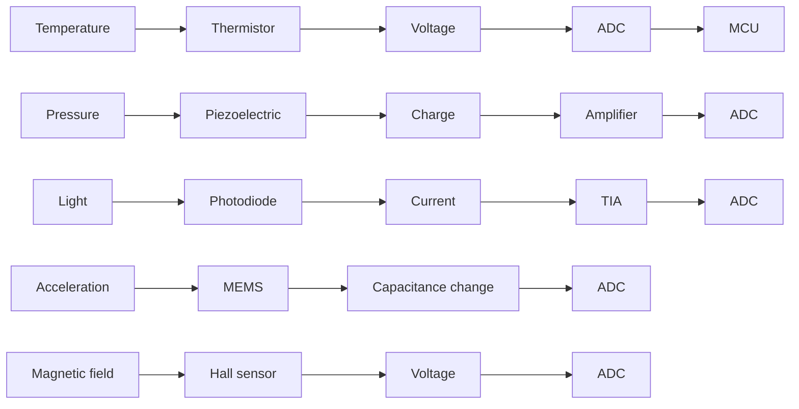

# Chapter 22: Sensor Fundamentals — How Sensors Work

## 22.1 What is a Sensor?

A **sensor** (also called a **transducer**) is a device that converts a physical quantity from the real world into an electrical signal that can be measured and processed by electronic circuits or microcontrollers.



### Sensor vs Transducer vs Actuator

- **Sensor:** Detects physical quantity → electrical signal
- **Transducer:** More general term — converts one energy form to another (includes actuators)
- **Actuator:** Converts electrical signal → physical action (motor, solenoid, speaker)

A **sensor system** typically includes:
1. Sensing element (transducer)
2. Signal conditioning (amplification, filtering)
3. Analog-to-Digital Conversion
4. Digital processing and communication

---

## 22.2 Sensor Classification

### By Measurand (What They Measure)

| Category        | Examples                                      |
|-----------------|-----------------------------------------------|
| Mechanical      | Pressure, force, displacement, acceleration, level |
| Thermal         | Temperature, heat flux                         |
| Electromagnetic | Magnetic field, electric field, current        |
| Optical         | Light intensity, wavelength, position          |
| Chemical        | Gas concentration, pH, humidity                |
| Biological      | Heart rate, blood oxygen, glucose              |
| Acoustic        | Sound pressure, ultrasound                    |
| Radiation       | X-ray, gamma, nuclear                         |

### By Energy Source

**Active sensors:** Require external power and generate output signal proportional to measurand
- Resistive (thermistor, strain gauge)
- Capacitive (capacitive humidity sensor)
- Inductive (LVDT, eddy current)
- Photoconductive (LDR)

**Passive sensors:** Generate their own electrical signal without external power (self-generating)
- Thermocouple (generates voltage from temperature difference)
- Piezoelectric (generates charge from mechanical stress)
- Photodiode (generates current from light)
- Electromagnetic (generator, moving magnet)

### By Output Signal

| Output Type     | Description                          | Examples              |
|-----------------|--------------------------------------|-----------------------|
| Analog voltage  | Continuous voltage proportional to measurand | LM35, MEMS pressure |
| Analog current  | 4-20 mA industrial standard          | Process sensors       |
| Digital on/off  | Binary output                        | PIR, limit switch     |
| PWM             | Pulse width proportional to value    | DHT11 (sort of)       |
| Serial digital  | I2C, SPI, UART, 1-Wire               | BMP280, DS18B20       |
| Frequency       | Output frequency proportional        | Some flow meters      |

### By Contact Requirement

**Contact sensors:** Must physically touch the measured medium
- Thermocouples (contact temperature)
- Strain gauges (bonded to surface)
- pH electrodes (immersed in solution)

**Non-contact sensors:** Measure without physical contact
- Infrared temperature (IR radiation)
- Ultrasonic distance (sound waves)
- LiDAR (laser light)
- Magnetic (Hall effect, eddy current)

---

## 22.3 Key Sensor Specifications

### Sensitivity

**Sensitivity** = change in output per unit change in input:

```
Sensitivity = ΔOutput / ΔInput

Example: LM35 temperature sensor
Output: 10 mV per °C
Sensitivity = 10 mV/°C

At 25°C: Vout = 250 mV
At 50°C: Vout = 500 mV
```

**Sensitivity errors:**
- **Span sensitivity error:** Sensitivity differs from ideal by fixed %
- **Non-linearity:** Sensitivity varies with input level

### Resolution

**Resolution** = smallest change in input detectable by the sensor

```
Example: 12-bit ADC reading temperature sensor:
Voltage range: 0-3.3V → 4096 steps
Temperature range (LM35): 0°C to 330°C (10 mV/°C)
Voltage resolution: 3.3V / 4096 = 0.805 mV
Temperature resolution: 0.805 mV / (10 mV/°C) = 0.0805°C

So the system can detect temperature changes of ~80 mΩ (0.08°C)
```

### Accuracy

**Accuracy** = how close the measured value is to the true value

```
Error types:
1. Offset error: Constant shift from true value
   True = 25°C, Measured = 25.5°C → 0.5°C offset error

2. Gain error: Proportional error
   True = 50°C, Measured = 51°C → 2% gain error

3. Non-linearity: Error that varies with input
   True = 25°C, Measured = 25.3°C
   True = 50°C, Measured = 49.8°C → non-linear

Combined accuracy = √(offset² + gain² + linearity²)
```

### Precision (Repeatability)

**Precision** = how consistent measurements are (doesn't mean accurate!)

```
10 measurements of same temperature:
Accurate + Precise:   24.98, 25.01, 25.00, 25.02, 24.99 → good
Precise not Accurate: 26.01, 26.00, 25.99, 26.02, 26.00 → repeatable but offset
Accurate not Precise: 24.5, 25.5, 24.8, 25.3, 25.7 → scattered around true value
```

### Range

**Full-scale range (FSR):** Minimum and maximum measurable input

```
DHT22 temperature: -40°C to +80°C → 120°C range
LM35: 0°C to 150°C → 150°C range (or -55°C to 150°C with offset circuit)
DS18B20: -55°C to +125°C → 180°C range
```

### Linearity

**Linearity** = how well output follows a straight line with input

```
Ideal (perfect linearity):
Vout = K × Input + offset

Real sensor (non-linearity):
Vout ≈ K × Input + offset + nonlinear_term

Non-linearity specification: ±0.5% FSR (full-scale range)
= measurement error due to curvature ≤ 0.5% of full range
```

**Linearization techniques:**
1. Piecewise linear approximation (lookup table)
2. Polynomial correction (e.g., Steinhart-Hart for thermistors)
3. Analog circuits (diode log amplifier for pH)
4. Digital correction (calibration table in MCU)

### Response Time

**Time constant (τ):** Time for sensor to reach 63.2% of step input change
**Settling time (t₉₀%):** Time to reach 90% of step input change

```
Example: Digital thermometer update rate:
DS18B20: Conversion time 93.75 ms (9-bit) to 750 ms (12-bit)
DHT22: Sampling rate max 0.5 Hz (one sample every 2 seconds!)

Example: Pressure sensor response:
MEMS pressure sensor: <1 ms response
Aneroid barometer: minutes for full settling

Example: Chemical sensor response:
MQ-135 gas sensor: 10-30 seconds to stabilize!
pH electrode: 10-60 seconds for stable reading
```

### Noise

**Noise types in sensors:**
- **Thermal noise** (Johnson noise): v_n = √(4kTRΔf) — from resistors
- **Shot noise:** From discrete electron charge, in photodetectors
- **Flicker noise (1/f):** Low-frequency noise, dominant in MEMS
- **Quantization noise:** From ADC discretization

**Signal-to-Noise Ratio (SNR):**
```
SNR = 20 × log₁₀(Signal_amplitude / Noise_amplitude) dB
SNR = 10 × log₁₀(Signal_power / Noise_power) dB

Good sensor system: SNR > 60 dB (1000:1 amplitude ratio)
```

**Oversampling to reduce noise:**
- Average N samples → noise reduced by √N
- Average 64 samples → noise reduced by 8× → gain 3 extra bits of resolution
- Used in precision ADC applications

### Drift

**Long-term drift:** Output changes over time even with constant input

```
Temperature drift: ±0.2°C/year (DS18B20 specification)
Pressure sensor drift: ±0.1 hPa/year
Aging in:
  - Electrolytic capacitors (degrade over years)
  - Optical sensors (LED aging)
  - Chemical sensors (electrode degradation)
```

**Temperature coefficient (TC):**
- How sensitivity changes with temperature
- Specified as ±X ppm/°C or %/°C
- Good sensors: <50 ppm/°C
- Precision sensors: <5 ppm/°C

---

## 22.4 Signal Conditioning

Raw sensor signals are rarely suitable for direct ADC input. Signal conditioning prepares the signal:

### Amplification

```
Sensor output → [Amplifier] → ADC
Small signal (mV) → Larger signal (0-3.3V)

Example: Thermocouple output ≈ 40 µV/°C
At 100°C: 4 mV
Need amplification: 3.3V / 4 mV = 825× gain needed!
Use: INA219 or AD8495 thermocouple amplifier
```

**Op-amp configurations:**
```
Inverting amplifier:
Gain = -Rf/Rin
Vin → op-amp → Vout = -(Rf/Rin) × Vin

Non-inverting amplifier:
Gain = 1 + Rf/Rin
Vout = (1 + Rf/Rin) × Vin

Differential amplifier:
Vout = (R4/R3) × (V+ - V-)
Used to reject common-mode noise
```

**Instrumentation Amplifier (INA):**
- High input impedance
- High common-mode rejection ratio (CMRR > 80 dB)
- Low offset, low drift
- Used for: strain gauges, thermocouples, ECG electrodes
- Example: INA128, AD8221

### Filtering

**Low-pass filter:** Removes high-frequency noise, passes signal
```
RC low-pass filter:
fc = 1/(2π × R × C)
Vin → [R] → Vout
              |
             [C]
              |
             GND

For fc = 10 Hz:
R = 10 kΩ, C = 1.59 µF (use 1.5 µF practical)
Attenuates 50/60 Hz interference from power lines!
```

**Anti-aliasing filter:**
- Must be placed BEFORE ADC
- Removes signals above Nyquist frequency (fs/2)
- Prevents aliasing (high-frequency signals appearing as lower frequencies)

```
ADC sampling at 1 kHz:
Maximum correct frequency: 500 Hz (Nyquist)
Anti-aliasing filter: fc ≈ 200-400 Hz
Any signal above 500 Hz MUST be filtered out!
```

### Level Shifting

```
Sensor output: 0-5V
MCU ADC input: 0-3.3V

Solution: Voltage divider
R1 = 10 kΩ, R2 = 22 kΩ
Vout = Vin × R2/(R1+R2) = 5 × 22/32 = 3.44V (slightly over, adjust values)

Better: R1 = 10 kΩ, R2 = 20 kΩ → 5 × 20/30 = 3.33V ✓
```

### Current-to-Voltage Conversion (TIA — Transimpedance Amplifier)

For photodiodes (output is current, not voltage):
```
         Rf
    ┌────/\/\/────┐
    │             │
Iphoto → [−]     ├── Vout = -Iphoto × Rf
     ← [op-amp]  │
          [+]    │
          │      │
         GND
```
- Output voltage = Current × Feedback resistance
- Used in: photodetectors, optical communication, pulse oximeters

---

## 22.5 Analog Sensor Interface

### Direct ADC Connection

```
Simple sensor (LM35):
3.3V → LM35 → Vout (10 mV/°C) → ADC pin
GND  → LM35

At 25°C: Vout = 250 mV
ADC reading (12-bit, 3.3V ref): 250/3300 × 4095 = 310
Temperature = (ADC_reading × 3300 / 4096) / 10 mV/°C
```

**Important considerations:**
- Keep analog traces short and away from digital signals
- Use decoupling capacitors (100 nF) on sensor power supply
- Avoid routing digital clock lines near analog signals
- Use separate AGND and DGND planes if possible (join at single point)
- Use differential inputs or Wheatstone bridge for precision

### Wheatstone Bridge

Used with resistive sensors (strain gauges, RTD, thermistors) for precise measurements:

```
         Vex (+)
          │
     ┌────┴────┐
     │         │
    R1         R2 ← (sensor)
     │         │
     ├────A    B────┤
     │               │
    R3 ← (ref)   R4
     │         │
     └────┬────┘
          │
         GND

Vout = Vex × (R2/(R1+R2) - R4/(R3+R4))

When balanced: R1/R2 = R3/R4 → Vout = 0
Sensor change: R2 → R2+ΔR → Vout ≠ 0

For strain gauge with G.F. (gauge factor) = 2:
ΔR/R = G.F. × ε (strain)
Typical strain: 10-2000 µε → ΔR/R = 20-4000 ppm → tiny voltage!
Requires instrumentation amplifier with gain 100-1000×
```

### 4-20 mA Current Loop (Industrial)

Used in industrial environments (long cable runs):
```
Sensor → 4-20 mA transmitter → long cable (100-1000m) → receiver → shunt resistor → ADC

4 mA = 0% measurement
20 mA = 100% measurement

Advantages:
- Not affected by cable resistance (current, not voltage!)
- Can detect cable break (current drops to 0 → fault alarm)
- EMI rejection (differential current signal)
- Cable can power sensor (loop-powered sensors: 4 mA = idle, sensor draws from loop)
```

---

## 22.6 Digital Sensor Protocols

### 1-Wire Protocol (Dallas Semiconductor)

Used by DS18B20 temperature sensor:

```
Single wire = data + power!
  DQ line
  ┌── Pull-up resistor (4.7 kΩ to VDD) — provides power
  └── MCU GPIO (open-drain)
      └── Sensor DQ pin

Communication (Master initiates all):
1. Master sends Reset pulse: low for 480-960 µs
2. Sensors respond with Presence pulse: low for 60-240 µs
3. Master sends ROM commands (read ROM, match ROM, skip ROM)
4. Master sends function commands (start conversion, read scratchpad)
5. 1-bit protocol: Write 0 = low 60 µs, Write 1 = low 1-15 µs then high
```

**Parasite power mode:**
- Sensor draws power from the data line during high periods!
- No separate VDD needed
- Limitation: Strong pull-up required during conversion

```c
// Arduino OneWire + DallasTemperature library:
#include <OneWire.h>
#include <DallasTemperature.h>

OneWire oneWire(4);  // GPIO4
DallasTemperature sensors(&oneWire);

sensors.begin();
sensors.requestTemperatures();
float temp = sensors.getTempCByIndex(0);
```

### SPI Sensor Example (MAX31855 Thermocouple)

```
MAX31855 reads type-K thermocouple, outputs via SPI:
  14-bit thermocouple temperature (0.25°C resolution)
  12-bit cold junction compensation (0.0625°C resolution)
  Fault bits: open circuit, short to VCC, short to GND

SPI format: 32-bit read-only
Bits [31:18]: Thermocouple temperature
Bit  [17]:    Reserved
Bit  [16]:    Fault indicator
Bits [15:4]:  Internal temp (cold junction)
Bit  [3]:     Reserved
Bit  [2]:     SCV (short to VCC)
Bit  [1]:     SCG (short to GND)
Bit  [0]:     OC (open circuit)

Temperature decode:
int16_t temp_raw = (data >> 18) & 0x3FFF;  // 14-bit signed
if (temp_raw & 0x2000) temp_raw |= 0xC000; // sign extend
float temp = temp_raw * 0.25;              // 0.25°C per bit
```

### I2C Sensor Example (BMP280 Pressure/Temp)

```
BMP280 register map (relevant):
0xD0: chip_id (should read 0x60)
0xF3: status (measuring bit)
0xF4: ctrl_meas (temperature + pressure oversampling + mode)
0xF5: config (IIR filter, standby time)
0xF7-0xF9: pressure data (20-bit ADC result)
0xFA-0xFC: temperature data (20-bit ADC result)
0x88-0x9F: calibration data (12 trimming parameters)

Compensation formula (from datasheet):
// Temperature compensation (fixed-point from Bosch):
int32_t var1 = ((((adc_T >> 3) - ((int32_t)dig_T1 << 1))) *
                 ((int32_t)dig_T2)) >> 11;
int32_t var2 = (((((adc_T >> 4) - ((int32_t)dig_T1)) *
                  ((adc_T >> 4) - ((int32_t)dig_T1))) >> 12) *
                ((int32_t)dig_T3)) >> 14;
int32_t t_fine = var1 + var2;
float T = (t_fine * 5 + 128) >> 8;  // In units of 0.01°C
```

---

## 22.7 Sensor Calibration

### Why Calibrate?

Sensors have manufacturing tolerances:
- Offset errors (sensor reads 1°C too high at all temperatures)
- Gain errors (sensitivity 5% different from specification)
- Non-linearity (more complex error)
- Aging effects (drift over months/years)

### One-Point Calibration (Offset only)

```c
// Read at known reference point
float raw_reading = read_sensor();  // e.g., 25.3°C
float known_value = 25.0;           // Reference (calibrated thermometer)
float offset = known_value - raw_reading;  // -0.3°C

// Apply in firmware:
float calibrated = raw_reading + offset;
```

### Two-Point Calibration (Offset + Gain)

```c
// Two reference points:
float raw1 = read_at_point1();  // At 0°C: reads 0.5°C
float raw2 = read_at_point2();  // At 100°C: reads 99.2°C

float ref1 = 0.0;   // Known value at point 1
float ref2 = 100.0; // Known value at point 2

float gain = (ref2 - ref1) / (raw2 - raw1);  // = 100/98.7 = 1.0132
float offset = ref1 - gain * raw1;            // = 0 - 1.0132 * 0.5 = -0.507

// Apply:
float calibrated = gain * raw_reading + offset;
```

### Polynomial Calibration

For non-linear sensors:
```c
// Fit polynomial: y = a + b*x + c*x² + d*x³
// Determine coefficients from multiple calibration points
// Store coefficients in MCU (EEPROM or flash)

float calibrate_poly(float raw) {
    const float a = -0.5, b = 1.02, c = -0.001;
    return a + b*raw + c*raw*raw;
}
```

### Kalman Filter (Dynamic Calibration)

For noisy sensors with dynamic inputs:
```
Prediction:
  x_pred = F × x_prev + B × u  (state prediction)
  P_pred = F × P × Fᵀ + Q     (error covariance prediction)

Update:
  K = P_pred × Hᵀ × (H × P_pred × Hᵀ + R)⁻¹  (Kalman gain)
  x = x_pred + K × (measurement - H × x_pred)   (state update)
  P = (I - K × H) × P_pred                       (error update)

Where:
  Q = process noise covariance (how much state can change)
  R = measurement noise covariance (how noisy the sensor is)
  K = Kalman gain (balance between prediction and measurement)
```

---

## 22.8 MEMS Technology

**MEMS (Micro-Electro-Mechanical Systems)** is the technology behind most modern sensors:

### What is MEMS?

MEMS are microscopic mechanical structures fabricated on silicon chips:
- Scale: 1 µm - 1 mm
- Made using semiconductor fabrication (photolithography, etching, deposition)
- Moving parts on silicon!
- Electrical transduction via capacitance, piezoresistance, piezoelectricity

### MEMS Fabrication

**Bulk micromachining:**
- Etching into bulk silicon wafer (wet etch KOH, dry etch DRIE)
- Creates membranes, beams, channels
- Used for: pressure sensors, microphones

**Surface micromachining:**
- Deposit and pattern thin films on wafer surface
- Sacrificial layer released to create suspended structures
- Used for: accelerometers, gyroscopes

**Examples of MEMS structures:**
```
MEMS Pressure Sensor:
  Thin silicon membrane (1-100 µm) over etched cavity
  Membrane deflects under pressure
  Piezoresistors on membrane edges (resistance changes with strain)

MEMS Accelerometer:
  Proof mass suspended by flexures (spring beams)
  Differential capacitor plates measure displacement
  Under acceleration: proof mass moves → capacitance changes

MEMS Gyroscope:
  Vibrating ring or fork (driven by electrostatic force)
  Coriolis effect couples energy to perpendicular mode
  Detection via capacitance change in perpendicular axis
```

### MEMS Advantages

| Feature        | MEMS                      | Traditional Sensors      |
|---------------|---------------------------|--------------------------|
| Size          | mm or smaller             | cm or larger             |
| Weight        | µg to mg                  | grams to kg              |
| Power         | µW to mW                  | mW to W                  |
| Cost          | $0.50 - $5 (mass produced)| $10 - $1000              |
| Integration   | With ASIC on same chip    | Separate electronics     |
| Shock          | Excellent (no fragile parts)| May be fragile          |

---

## 22.9 Sensor Fusion

Using multiple sensors together to get better results:

### Complementary Filter (simple)

Accelerometer + Gyroscope for tilt angle:

```
Problem:
  Accelerometer: good static angle, noisy during motion, affected by vibration
  Gyroscope: good dynamic response, drifts over time (integration error)

Solution: Complementary filter
  angle = α × (angle + gyro_rate × dt) + (1-α) × accel_angle
  where α = 0.95-0.98 (high-pass for gyro, low-pass for accel)

This gives: Low noise + no drift!
```

### Mahony/Madgwick Filter

More sophisticated fusion algorithms used in flight controllers:
- Combines accelerometer + gyroscope + magnetometer
- Estimates quaternion orientation (no gimbal lock)
- Used in: ArduPilot, Betaflight (FPV drones), autopilots

---

## 22.10 Sensor Power Considerations

### Power Modes

| Mode         | Power       | Use Case                      |
|-------------|-------------|-------------------------------|
| Continuous  | Full power  | Frequent measurements needed  |
| One-shot    | Pulse power | Measure then power down       |
| Sleep/PDN   | µA leak     | Wait for trigger or timer     |

**Power budget example (IoT soil sensor):**
```
Battery: 3000 mAh AA × 2 = 6000 mAh
Measurements every 15 minutes = 96/day

Active time (30ms measurement):
  MCU active: 8 mA × 30 ms = 240 µAh/measurement
  Sensor: 1 mA × 30 ms = 30 µAh/measurement
  Radio TX (LoRa, 10ms): 40 mA × 10 ms = 400 µAh/event

Sleep time (between measurements, ~15 min):
  MCU sleep: 5 µA × 15 min = 1.25 µAh
  Sensor off: 0

Daily consumption:
  Active: (240 + 30 + 400) µAh × 96 events = 64,320 µAh = 64.3 mAh
  Sleep: 1.25 µAh × 96 intervals = 120 µAh = 0.12 mAh
  Total: ~64.4 mAh/day

Battery life: 6000 / 64.4 ≈ 93 days (3 months) — reasonable!
```

---

## 22.11 Summary of Sensor Fundamentals

Understanding these fundamentals helps with **every sensor chapter that follows**:

1. **Transduction principle:** What physical phenomenon does the sensor use?
2. **Output type:** Analog (voltage/current/resistance) or digital (I2C/SPI/UART)?
3. **Key specs:** Sensitivity, range, accuracy, resolution, response time
4. **Signal conditioning:** Does the signal need amplification, filtering, level-shifting?
5. **Calibration:** How do you ensure accurate readings in your specific conditions?
6. **Power:** How much does the sensor use and how to minimize it?
7. **Protocol:** How do you read it? (direct ADC, I2C register map, UART string parsing)

The following chapters cover specific sensor types:
- Chapter 23: IR, Ultrasonic, LiDAR (distance measurement)
- Chapter 24: Temperature, Humidity, Pressure sensors
- Chapter 25: IMU — Accelerometers, Gyroscopes, Magnetometers
- Chapter 26: Optical, Chemical, and other sensors
