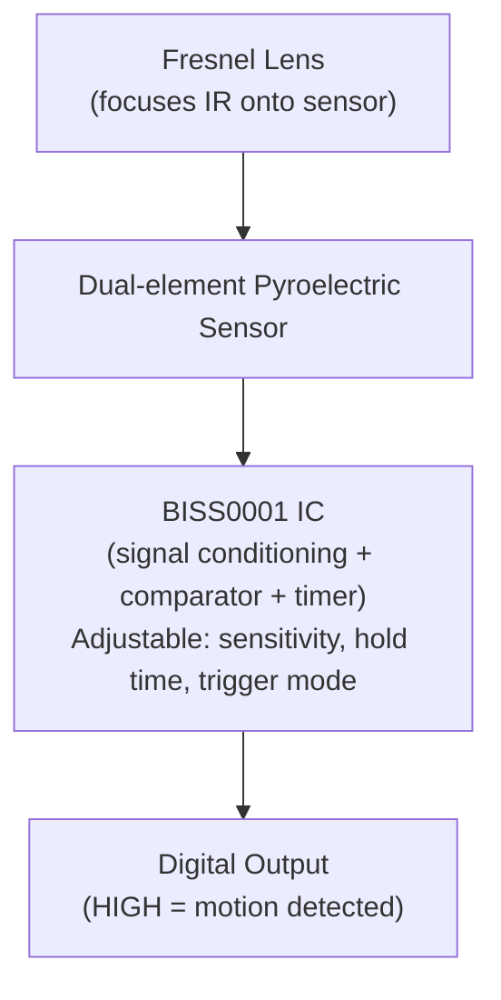

# Chapter 23: Distance and Proximity Sensors — IR, Ultrasonic, LiDAR

## 23.1 Overview of Distance Measurement Methods

Measuring distance without contact is essential for robotics, automation, and IoT:

| Method         | Range         | Accuracy      | Speed   | Cost    |
|---------------|---------------|---------------|---------|---------|
| IR (proximity) | 2-50 cm       | ±5-10%        | Fast    | $0.50-5 |
| IR (reflective)| 2-150 cm      | ±1-2 cm       | Fast    | $1-10   |
| Ultrasonic     | 2 cm - 4 m    | ±3 mm         | Medium  | $1-5    |
| ToF (VL53L0X)  | 1 mm - 2 m    | ±3-5%         | Fast    | $3-15   |
| LiDAR          | 0.1 m - 100 m+| ±2-5 cm       | Fast    | $10-10000|
| Radar          | 0.5 m - 1 km+ | ±1-5 cm       | Fast    | $20-5000|

---

## 23.2 Infrared (IR) Sensors

### 23.2.1 IR LED + Photodiode — Reflective Proximity Sensor

**Working principle:**
```
IR LED emits (850-950 nm infrared light)
Light bounces off object
Photodiode detects reflected light

More reflected light → object closer
Less reflected light → object farther or absent
```

**Typical circuit:**
```
VCC ──[R1=220Ω]──[IR LED]──GND   (transmit)
                              ↓ IR light
                         [Object surface]
                              ↓ reflected
VCC ──[R2=10kΩ]──────────────── Vout (analog)
                     │
               [Photodiode]  (anode to VCC, cathode to Vout)
                     │
                    GND
```

**Analog output:** Voltage varies with distance
- Object close: high reflected light → photodiode conducts more → lower Vout (with pull-up)
- Object far: low reflected light → photodiode conducts less → higher Vout

**Limitations:**
- Highly dependent on object surface color and reflectivity
- Black surfaces absorb IR (appear "far" even when close)
- White surfaces reflect well
- Ambient light can interfere (sunlight has strong IR component)

### 23.2.2 TCRT5000 — Most Common IR Proximity Sensor

```
TCRT5000 Package:
┌──────────────────┐
│ IR LED (850 nm)  │  ← Emitter
│ Phototransistor  │  ← Detector
│ (NPN, Vce ~5V)  │
└──────────────────┘
Operating current: 60 mA max (LED)
Detection range: 0.2-15 mm
Best distance: 2.5 mm
Application: Line following robots, tape edge detection, encoder discs
```

**Line follower application:**
```
3 TCRT5000 sensors under robot:
Sensor over white line → low reflected → phototransistor OFF → HIGH output
Sensor over dark floor → high absorbed → phototransistor slightly ON → LOW output

Wait, invert:
White (high reflection): phototransistor conducts → output LOW
Black (low reflection): phototransistor OFF → pull-up → output HIGH

Robot logic:
  All sensors on line: go straight
  Left sensor detects line: turn left
  Right sensor detects line: turn right
```

### 23.2.3 Sharp GP2Y0A21YK — Analog Distance Sensor

One of the most popular IR distance sensors:

**Specifications:**
- Distance range: 10-80 cm
- Output: Analog voltage (non-linear!)
- Supply: 4.5-5.5V
- Current: 30 mA

**Output characteristic (non-linear!):**
```
Distance vs Voltage:
10 cm → ~3.0V
20 cm → ~1.8V
40 cm → ~1.0V
80 cm → ~0.5V

Non-linear! Must use inverse formula or lookup table:
Distance ≈ 27.86 × Vout^(-1.15) (empirical approximation)

Or use lookup table for accuracy:
{Vout=3.0V → 10cm}, {Vout=1.8V → 20cm}, ...
```

**How it works internally (triangulation):**
```
IR LED → emits collimated beam
Object reflects beam
Position-sensitive detector (PSD) detects reflected spot
Closer object → reflected angle is steeper → spot position moves
Angle to spot position = distance calculation

This method is immune to object color/reflectivity!
(Measures angle, not intensity)
```

### 23.2.4 PIR — Passive Infrared Sensor

**PIR for motion detection (HC-SR501, AM312):**

**Working principle:**
All warm objects (~37°C humans) emit infrared radiation:
```
Human body: peak emission ~10 µm (long-wave infrared)
PIR element: pyroelectric crystal + Fresnel lens

Pyroelectric element:
- Two sensing elements side by side, wired in opposition
- Stationary heat source: both elements see same IR → cancels out → zero output
- Moving heat source: first element sees it, then second → difference → pulse output!

The PIR detects CHANGE in infrared, not absolute level
→ Must be MOVING to trigger
```

**HC-SR501 Architecture:**



**Modes:**
- **L (non-repeating):** Output goes high, stays high for set time, then low
- **H (repeating):** Output stays high as long as motion continues

**HC-SR501 connections:**
```
VCC: 5-20V (wide range!)
GND: Ground
OUT: Digital output (3.3V or 5V, configurable)

Fresnel lens covers ~120° cone, 3-7 meter range
Requires warm-up time: 30-60 seconds after power-on!
Must mount above ground: ideally 2-2.5 m height
```

**PIR limitations:**
- Cannot tell who (human, dog, car)
- Cannot measure distance
- Affected by temperature changes (heating vents, AC)
- Requires warm-up time
- Cannot detect stationary people (body must move)

**AM312 (mini PIR):**
- Same principle, much smaller
- 2.7-12V supply, 3.3V I/O
- Suitable for battery projects
- Used in cheap battery-powered motion sensors

---

## 23.3 Ultrasonic Distance Sensor

### 23.3.1 How Ultrasound Distance Measurement Works

```
Transducer emits 40 kHz ultrasound burst (8 pulses)
Sound travels at ~343 m/s in air (varies with temperature)
Sound hits object, reflects back
Transducer detects echo

Time-of-flight (ToF):
  Distance = (speed × time) / 2
           = (343 m/s × time) / 2

Example: Echo returns after 2 ms:
  Distance = (343 × 0.002) / 2 = 0.343 m = 34.3 cm
```

**Temperature compensation:**
```
Speed of sound: v = 331.3 × √(1 + T/273.15) m/s
At 20°C: v = 343.1 m/s
At 0°C:  v = 331.3 m/s
At 40°C: v = 354.8 m/s

Error without temperature compensation:
At 40°C measuring 1 meter: uses 343 m/s
Calculated: 343/354.8 × 100 = 96.7 cm → 3.3% error

For precision, measure temperature + adjust:
v_corrected = 331.3 × √(1 + temp_C/273.15)
distance = (v_corrected × echo_time_us / 1000000.0) / 2
```

### 23.3.2 HC-SR04 — Most Popular Ultrasonic Module

**Specifications:**
| Parameter     | Value             |
|--------------|-------------------|
| Supply voltage| 5V DC             |
| Range         | 2 cm - 4 m        |
| Accuracy      | ±3 mm             |
| Angle         | 15° cone          |
| Trigger pulse | 10 µs min         |
| Echo output   | Pulse width (µs)  |
| Frequency     | 40 kHz            |
| Update rate   | Max ~30 Hz (wait 60ms between measurements)|
| Current       | 15 mA during measurement |

**Hardware:**
```
HC-SR04 Module:
┌──────────────────────────────────────┐
│  [TX transducer]   [RX transducer]  │
│   (transmit)        (receive)        │
│                                     │
│  VCC  TRIG  ECHO  GND               │
└──────────────────────────────────────┘

VCC  → 5V
TRIG → MCU GPIO output (trigger)
ECHO → MCU GPIO input (measure pulse width)
GND  → GND
```

**Communication protocol:**
```
Step 1: Pull TRIG HIGH for ≥ 10 µs
Step 2: HC-SR04 sends 8 × 40 kHz pulses
Step 3: ECHO goes HIGH
Step 4: When echo returns, ECHO goes LOW
Step 5: Measure ECHO pulse width in µs
Step 6: Distance = pulse_width_µs / 58.0 cm (or / 148.0 inches)

Timing diagram:
TRIG: ─┐ (10µs) ┌────────────────────────────────────
        └────────┘
ECHO: ──────────────────┐ (echo pulse) ┌──────────────
                         └─────────────┘
                         ←────────────→
                           Echo pulse duration
```

**Arduino code:**
```c
const int TRIG = 9;
const int ECHO = 10;

void setup() {
    pinMode(TRIG, OUTPUT);
    pinMode(ECHO, INPUT);
    Serial.begin(115200);
}

void loop() {
    // Trigger
    digitalWrite(TRIG, LOW);
    delayMicroseconds(2);
    digitalWrite(TRIG, HIGH);
    delayMicroseconds(10);
    digitalWrite(TRIG, LOW);

    // Measure echo duration
    long duration = pulseIn(ECHO, HIGH, 30000);  // 30ms timeout

    if (duration == 0) {
        Serial.println("No echo (out of range)");
    } else {
        float distance_cm = duration / 58.0;
        Serial.print("Distance: ");
        Serial.print(distance_cm);
        Serial.println(" cm");
    }
    delay(100);  // Wait before next measurement
}
```

**STM32 with timer input capture:**
```c
// Better precision: use timer input capture instead of blocking pulseIn
void trigger_measurement(void) {
    // Send trigger pulse
    HAL_GPIO_WritePin(TRIG_PORT, TRIG_PIN, GPIO_PIN_SET);
    DWT->CYCCNT = 0;
    while(DWT->CYCCNT < 16 * 10);  // Wait 10 µs at 16 MHz
    HAL_GPIO_WritePin(TRIG_PORT, TRIG_PIN, GPIO_PIN_RESET);
    // Enable timer input capture on ECHO pin
    // TIM_ICInitStructure with rising/falling edge interrupts
}

void TIM_IRQHandler(void) {
    if (rising edge) echo_start = TIM->CCR1;
    if (falling edge) {
        uint32_t duration = TIM->CCR1 - echo_start;
        float distance = duration * 0.0171;  // 343m/s / 2 / timer_freq
    }
}
```

### 23.3.3 HC-SR04 Limitations

- **Minimum range 2 cm:** Very close objects may not be detected
- **Maximum range 4 m:** Weak echo beyond this
- **Narrow beam angle 15°:** May miss very small objects
- **Blocked by soft materials:** Fabric, foam absorbs ultrasound
- **Affected by wind:** Moving air changes propagation
- **Multiple echo confusion:** Echoes from multiple objects can cause errors
- **Not for outdoor use:** Rain, wind, temperature gradients
- **5V supply:** Requires level shifting for 3.3V MCUs on ECHO pin

**HC-SR04 vs HC-SR04+:**
- HC-SR04: 5V only, ECHO is 5V logic
- HC-SR04+: Works at 3.3V or 5V, safer for ESP32/STM32

### 23.3.4 JSN-SR04T — Waterproof Ultrasonic Sensor

- Waterproof probe (for liquid level measurement, rain)
- IP67 rating
- Same protocol as HC-SR04
- Separate control board + waterproof transducer (connected via 2.5m cable)
- Range: 20-600 cm, ±2 mm
- Used in: water level measurement, flood detection, outdoor robotics

---

## 23.4 ToF (Time of Flight) Sensors — VL53L0X

### What is a ToF Sensor?

ToF sensors measure distance using **laser pulses** and detect when they return — like LiDAR but at a smaller, cheaper scale:

```
940 nm VCSEL laser → emits pulse → hits object → reflects back → SPAD detector
SPAD (Single Photon Avalanche Diode) detects single photon with picosecond precision
Time measured → distance calculated

vs Ultrasound:
  Laser: ~3ns per mm (0.3m/ns × 2)
  Sound: ~5.8µs per mm (0.343m/ms × 2)
  Laser is ~2000× faster per mm!
```

### VL53L0X (STMicroelectronics)

**Specifications:**
| Parameter     | Value                 |
|--------------|----------------------|
| Range         | 50 mm - 1200 mm (2m mode) |
| Accuracy      | ±3% or ±3 mm (whichever larger)|
| FOV           | 25° cone             |
| Interface     | I2C (up to 400 kHz)  |
| Address       | 0x29 (default), configurable |
| Voltage       | 2.6-3.5V             |
| Current       | 19 mA (measuring), 5 µA (standby) |
| Package       | 4.4mm × 2.4mm × 1mm  |
| Update rate   | Up to 50 Hz          |

**VL53L0X Internal Architecture:**
```
┌─────────────────────────────────────────────────────┐
│                    VL53L0X SoC                      │
│  ┌────────────────┐    ┌──────────────────────────┐  │
│  │  VCSEL (laser) │    │  SPAD Array              │  │
│  │  (940 nm IR)   │    │  (Single Photon Avalanche│  │
│  │                │    │   Diode detector)        │  │
│  └────────────────┘    └──────────────────────────┘  │
│  ┌────────────────────────────────────────────────┐  │
│  │           Embedded Digital Processor           │  │
│  │  HistoGram Algorithm (ToF measurement)         │  │
│  │  Calibration memory, I2C controller            │  │
│  └────────────────────────────────────────────────┘  │
└─────────────────────────────────────────────────────┘
```

**VL53L0X Ranging Modes:**
| Mode              | Range    | Timing budget | Use case            |
|-------------------|---------|---------------|---------------------|
| Default           | ~1.2 m  | 33 ms         | General purpose     |
| High accuracy     | ~1.2 m  | 200 ms        | Where accuracy critical |
| Long range        | ~2.0 m  | 33 ms (reduced accuracy)| Long range |
| High speed        | ~1.2 m  | 20 ms         | Fast-moving objects |

**Using VL53L0X with Arduino:**
```cpp
#include <VL53L0X.h>
VL53L0X sensor;

void setup() {
    Wire.begin();
    sensor.init();
    sensor.setTimeout(500);
    sensor.startContinuous();  // Continuous measurement mode
}

void loop() {
    uint16_t distance_mm = sensor.readRangeContinuousMillimeters();
    if (sensor.timeoutOccurred()) {
        Serial.println("Timeout!");
    } else {
        Serial.print(distance_mm);
        Serial.println(" mm");
    }
    delay(20);  // ~50 Hz
}
```

**Multiple VL53L0X sensors:**
```cpp
// VL53L0X default I2C address = 0x29
// Change address at startup using XSHUT pin:

// 1. Pull all XSHUT low (disable all sensors)
// 2. Enable sensor 1 only (release XSHUT1)
// 3. Initialize sensor 1 + change its address to 0x30
// 4. Enable sensor 2, initialize + change to 0x31
// 5. Now two sensors on same I2C bus with different addresses

sensor1.setAddress(0x30);
sensor2.setAddress(0x31);
```

### VL53L1X — Improved Version

- Range: up to 4 m
- Better multi-zone (1× or 4× zones)
- Field-of-view: 27°
- Same I2C interface

### VL53L3CX — Multi-Object Detection

- Can detect multiple objects in the FOV (histogram-based multi-peak detection)
- Useful for robotic navigation near walls

---

## 23.5 LiDAR — Light Detection and Ranging

### LiDAR Principles

LiDAR applies ToF distance measurement at **scale** — measuring thousands or millions of points per second to create 3D point clouds:

```
Rotating mirror or MEMS mirror → scans laser across scene
Each point: measured with ToF
Combined: 3D point cloud of environment

1D LiDAR: Single beam (like VL53L0X but more powerful)
2D LiDAR: Single beam + rotating motor = 360° horizontal scan
3D LiDAR: Multi-beam OR scanning in 2 dimensions
Solid-state LiDAR: No moving parts (MEMS mirror or phased array)
```

### RPLiDAR A1 — Entry-Level 2D LiDAR

**Used in hobbyist robots and navigation:**

| Parameter     | Value                   |
|--------------|-------------------------|
| Range         | 0.2 - 12 m              |
| Scan rate     | 5-10 Hz (360° sweep)    |
| Points/scan   | 360-720                 |
| Angular res.  | 0.9° min                |
| Interface     | UART 115200 baud        |
| Wavelength    | 785 nm (Class 1 safe)  |
| Price         | $100-120               |

**Working principle:**
```
Rotating head (300-900 RPM):
  - Laser + photodetector mounted on spinning platform
  - Slip ring or optical coupler transfers data+power
  - Measures distance at each angle
  - Full 360° rotation = one scan

Output: Array of (angle, distance) pairs
ROS compatible (Robot Operating System)
```

**RPLIDAR data format:**
```
Each scan: 360 distance measurements (one per degree)
Data packet: angle (float), distance (mm), quality (0-15)

Import into ROS:
  PointCloud2 or LaserScan message
  Used for: SLAM (Simultaneous Localization and Mapping)
```

### Garmin LIDAR-Lite v3

- Range: 1 cm - 40 m
- Accuracy: ±2.5 cm (at 5 m)
- 500 readings/second
- I2C + PWM interface
- Compact (38g)
- Used in drones, cars, survey equipment

### Velodyne HDL-64E (Automotive Grade)

- 64 laser beams, 360° horizontal, ±26.8° vertical
- 2.2 million points/second
- Range: up to 120 m
- Price: $75,000+ (or rented per-vehicle)
- Used in: self-driving cars, HD mapping

### Automotive LiDAR Technologies (2024)

| Technology    | Moving Parts | Range  | Cost     | Examples              |
|--------------|-------------|--------|----------|-----------------------|
| Mechanical   | Spinning (3D)| 200 m  | $5000+   | Velodyne, Ouster      |
| Solid-state MEMS| MEMS mirror| 150 m | $100-1000| Luminar Iris, Innoviz|
| Flash LiDAR  | None        | 50 m   | $200-500 | Cepton, Texas Instruments |
| FMCW LiDAR   | None        | 200+ m | Future   | Aeva, Aurora         |

**FMCW (Frequency Modulated Continuous Wave) LiDAR:**
- Like radar but with light
- Can measure velocity directly (Doppler effect)
- Immune to other LiDAR interference
- No susceptibility to ambient light
- Next generation automotive technology

---

## 23.6 Radar Sensors

### Why Radar for Proximity?

- Works through walls, plastic, clothing
- Not affected by weather (rain, fog)
- Measures velocity (Doppler)
- No privacy concerns (unlike camera)

### HLK-LD2410 — 24 GHz mmWave Radar

Popular budget radar sensor for presence detection:

| Parameter     | Value                 |
|--------------|----------------------|
| Frequency     | 24 GHz (mmWave)      |
| Range         | Up to 6 m            |
| Interface     | UART                 |
| Detection     | Stationary + moving  |
| Voltage       | 5V                   |
| Current       | ~100 mA              |

**Advantage over PIR:** Detects stationary people (breathing causes small movement)!

**Output:**
- Target detected or not
- Target distance (approximate)
- Target type (moving/stationary)

**Used for:**
- Smart lighting (bathroom, corridor — stays on even when still)
- Presence detection for smart home
- Security

### Texas Instruments mmWave (IWR1443/IWR6843)

Professional evaluation kits:
- Range: 0.5 - 10+ m
- Velocity measurement
- Multiple targets
- Point cloud output
- Price: $200-500 (evaluation boards)

---

## 23.7 Choosing the Right Distance Sensor

### Decision Guide

```
What distance range?
  < 15 mm:    Optical (TCRT5000), capacitive
  10-100 cm:  Sharp GP2Y (IR triangulation), VL53L0X
  2 cm - 4 m: HC-SR04 (ultrasonic)
  Up to 2 m:  VL53L1X (ToF)
  Up to 40 m: LIDAR-Lite, ultrasonic (industrial)
  Up to 200 m: Velodyne LiDAR, radar

Need 360° scan?
  Yes: RPLiDAR, Velodyne
  No: Any point sensor

Need to see through materials?
  Yes: Radar (mmWave)
  No: IR or ultrasonic

Budget?
  <$5: IR diode + phototransistor, HC-SR04
  $5-20: VL53L0X, Sharp GP2Y series
  $100+: RPLiDAR, LIDAR-Lite
  $1000+: Professional 3D LiDAR

Environment?
  Outdoor/weather: Avoid IR (sunlight), use ultrasonic or radar
  Dusty/foggy: Radar works, LiDAR struggles
  Transparent objects: Ultrasonic works, optical fails
  Very small objects: Ultrasonic has minimum detectable size limit
```

---

## 23.8 Summary

| Sensor          | Range        | Principle        | Interface | Key Use           |
|----------------|-------------|-----------------|-----------|-------------------|
| TCRT5000        | 2-15 mm     | IR reflective   | Analog    | Line following    |
| Sharp GP2Y     | 10-80 cm    | IR triangulation| Analog    | General proximity |
| HC-SR501 (PIR) | 3-7 m       | Pyroelectric    | Digital   | Motion detection  |
| HC-SR04         | 2-400 cm    | Ultrasonic ToF  | TRIG/ECHO | Obstacle detect.  |
| VL53L0X         | 5-120 cm    | Laser ToF       | I2C       | Precise distance  |
| VL53L1X         | 5-400 cm    | Laser ToF       | I2C       | Longer range ToF  |
| RPLiDAR A1     | 20-1200 cm  | Laser ToF 360°  | UART      | Robot navigation  |
| LIDAR-Lite v3  | 1-4000 cm   | Laser ToF       | I2C/PWM   | Drone altitude    |
| HLK-LD2410      | up to 6 m   | 24 GHz radar    | UART      | Presence detect.  |
