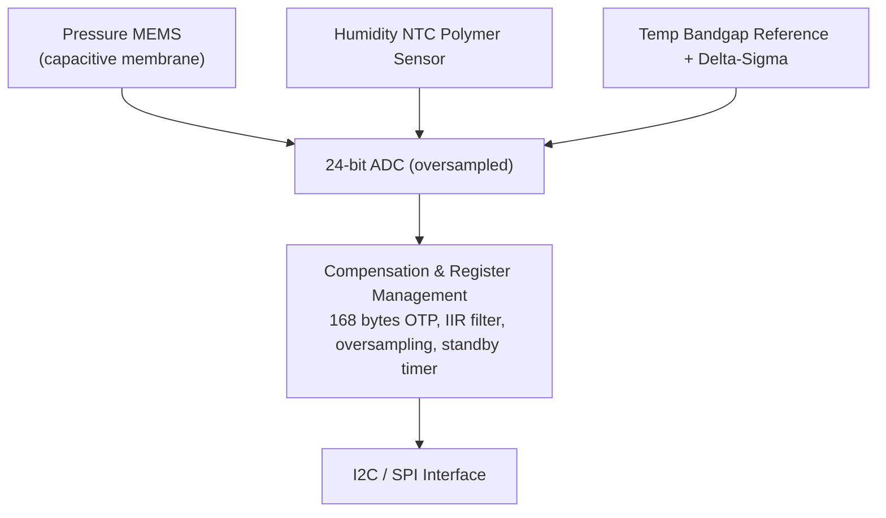
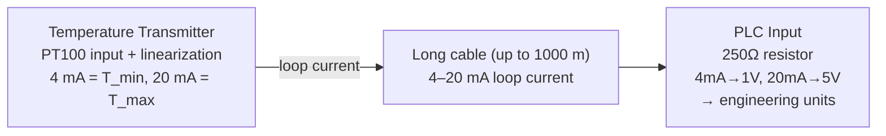

# Chapter 24: Temperature, Humidity, and Pressure Sensors

## 24.1 Temperature Sensors Overview

Temperature measurement is the most common sensor requirement in embedded systems:

| Sensor Type    | Range          | Accuracy  | Interface    | Cost    |
|----------------|----------------|-----------|--------------|---------|
| Thermocouple   | -200 to 1750°C | ±1-2°C    | Analog (mV)  | $5-30   |
| RTD (PT100)    | -200 to 600°C  | ±0.1-0.3°C| 4-wire analog| $10-50  |
| Thermistor (NTC)| -50 to 150°C  | ±0.1-1°C  | Analog R     | $0.50-5 |
| LM35           | -55 to 150°C   | ±0.5°C    | Analog (mV)  | $1-3    |
| DHT11          | 0 to 50°C      | ±2°C      | 1-wire digital| $1-3   |
| DHT22          | -40 to 80°C    | ±0.5°C    | 1-wire digital| $3-8   |
| DS18B20        | -55 to 125°C   | ±0.5°C    | 1-Wire        | $1-4   |
| BME280         | -40 to 85°C    | ±0.5°C    | I2C/SPI      | $3-10   |
| PT1000         | -200 to 600°C  | ±0.15°C   | 4-wire analog| $5-20   |

---

## 24.2 Thermocouples

### Working Principle — Seebeck Effect

When two dissimilar metals are joined, a voltage proportional to the **temperature difference** between the hot and cold junctions is produced:

```
Seebeck effect:
V = S_AB × (T_hot - T_cold)
where S_AB = Seebeck coefficient of metal pair (µV/°C)

Metal A ──────────── Hot junction (T_hot)
                         ↕ Voltage generated
Metal B ──────────── Cold junction (T_cold, measured separately)
         │
      Voltmeter
```

**The cold junction problem:**
- Voltage is DIFFERENCE between hot and cold
- Cold junction is wherever the leads connect to the measurement circuit (room temperature)
- Must MEASURE cold junction temperature separately and add to reading
- This is called **cold junction compensation (CJC)**

### Thermocouple Types

| Type | Materials              | Range        | Sensitivity | Notes                  |
|------|------------------------|--------------|-------------|------------------------|
| K    | Ni-Cr / Ni-Al          | -200 to 1260°C| 40 µV/°C  | Most common, general purpose |
| J    | Fe / Cu-Ni             | -40 to 750°C | 50 µV/°C   | Older, common in US    |
| T    | Cu / Cu-Ni             | -200 to 370°C| 40 µV/°C   | Low temperature, food  |
| E    | Ni-Cr / Cu-Ni          | -200 to 900°C| 58 µV/°C   | Highest sensitivity    |
| N    | Ni-Cr-Si / Ni-Si       | -200 to 1300°C| 39 µV/°C  | More stable than K     |
| R    | Pt-13%Rh / Pt          | 0 to 1600°C  | 10 µV/°C   | High temperature, precise |
| S    | Pt-10%Rh / Pt          | 0 to 1600°C  | 10 µV/°C   | Very precise, expensive|
| B    | Pt-30%Rh / Pt-6%Rh     | 300-1820°C   | 5 µV/°C    | Highest temperature    |

### MAX31855K — Type-K Thermocouple Interface IC

This IC handles cold junction compensation and SPI output:

```
Circuit:
Type-K thermocouple (any length) → MAX31855K → SPI → MCU

MAX31855K features:
- Cold junction temp sensor built-in (measures the IC itself as reference)
- 14-bit thermocouple temp resolution (0.25°C)
- 12-bit internal temp resolution (0.0625°C)
- Fault detection: open circuit, short to VCC, short to GND
- Operating: 3.3V or 5V supply
- SPI 32-bit read

Temperature range: -200°C to +1350°C
Accuracy: ±2°C (due to thermocouple type and cold junction error)
```

**Arduino code:**
```cpp
#include <Adafruit_MAX31855.h>

Adafruit_MAX31855 tc(CLK, CS, MISO);  // SPI pins

void setup() {
    Serial.begin(115200);
    if (!tc.begin()) {
        Serial.println("ERROR: Thermocouple not detected!");
        while(1);
    }
}

void loop() {
    double hot = tc.readCelsius();
    double cold = tc.readInternal();

    if (isnan(hot)) {
        Serial.print("ERROR: ");
        if (tc.readError() & 0x01) Serial.println("Open circuit!");
        if (tc.readError() & 0x02) Serial.println("Short to GND!");
        if (tc.readError() & 0x04) Serial.println("Short to VCC!");
    } else {
        Serial.print("Hot junction: "); Serial.print(hot); Serial.println("°C");
        Serial.print("Cold junction: "); Serial.print(cold); Serial.println("°C");
    }
    delay(500);
}
```

---

## 24.3 RTD — Resistance Temperature Detector

### Working Principle

RTDs use the **predictable change in metal resistance with temperature**:

```
R(T) = R₀ × (1 + αT) for simple linear model
or Callendar-Van Dusen for PT100/PT1000:
  T > 0°C: R(T) = R₀(1 + AT + BT²)
  T < 0°C: R(T) = R₀(1 + AT + BT² + CT³(T-100))

For PT100:
  R₀ = 100 Ω at 0°C
  α = 0.00385 Ω/Ω/°C (European standard) or 0.00392 (American)
  A = 3.9083×10⁻³
  B = -5.775×10⁻⁷

PT1000: R₀ = 1000 Ω at 0°C (otherwise identical)
```

### PT100 Measurement Circuits

**2-wire (cheap, but lead resistance adds error):**
```
MCU → constant current → R_lead → PT100 → R_lead → voltage measurement
Error: Lead resistance (typically 0.1-1 Ω each) included in measurement
At 4-20 mA: 1 Ω lead = 20 mV error (significant!)
```

**3-wire (compensates lead resistance):**
```
MCU → current → R_lead1 → PT100
                                └→ voltage measurement 1
                R_lead2 → voltage measurement 2
Subtract lead resistance: Vmeas1 - Vmeas2 = R_lead1 - R_lead2
Assumes R_lead1 ≈ R_lead2 (same wire gauge and length)
```

**4-wire (Kelvin sensing — most accurate):**
```
Current source leads: ──────[PT100]──────
Sense (voltage) leads:      ↑ ↑
                     (Kelvin contacts)
No current flows in sense wires → no voltage drop in sense leads
True resistance measurement: V/I = R_PT100 (exactly)
```

### PT100 with IFB (Industrial Field Bus)

For industrial 4-20 mA PT100 transmitters:
- PT100 → transmitter → 4-20 mA → PLC/DCS
- 4 mA = -200°C (or configured range minimum)
- 20 mA = 600°C (or configured range maximum)
- HART protocol for digital communication over 4-20 mA
- Used in: chemical plants, oil refineries, HVAC

### MAX31865 — RTD-to-Digital Converter

```
Chip for PT100/PT1000 measurement:
- 15-bit ADC, SPI interface
- 2/3/4-wire configurations
- Fault detection: over/under voltage, RTD disconnect
- 0.5°C accuracy typical (with careful calibration)

Connection:
┌─────────────────────┐
│     MAX31865        │
│  FORCE+ → Rref+ → PT100+ (current out)│
│  FORCE- ← Rref- ← PT100- (current return)│
│  RTDIN+ → PT100+ (sense) │
│  RTDIN- → PT100- (sense) │
│  Rref: 430Ω for PT100, 4300Ω for PT1000│
└─────────────────────┘
```

---

## 24.4 Thermistors — NTC and PTC

### NTC (Negative Temperature Coefficient) Thermistor

Resistance DECREASES with increasing temperature — made from metal oxide ceramics (Mn, Co, Ni, Cu oxides):

```
R(T) = R₀ × e^(β × (1/T - 1/T₀))

Where:
  R₀ = resistance at reference temperature T₀ (usually 25°C = 298.15K)
  β  = Beta coefficient (material constant, typically 3000-5000 K)
  T  = Temperature in Kelvin
  e  = Euler's number (2.718...)

Example: NTC thermistor R₀=10kΩ, β=3950
At 25°C (298.15K): R = 10 kΩ
At 0°C  (273.15K): R = 10k × e^(3950 × (1/273.15 - 1/298.15)) = 32.6 kΩ
At 50°C (323.15K): R = 10k × e^(3950 × (1/323.15 - 1/298.15)) = 3.68 kΩ

Invert to find temperature from resistance:
1/T = 1/T₀ + (1/β) × ln(R/R₀)
T = 1 / (1/T₀ + (1/β) × ln(R/R₀)) - 273.15
```

**Steinhart-Hart equation (more accurate):**
```
1/T = A + B×ln(R) + C×(ln(R))³

Where A, B, C are Steinhart-Hart coefficients (from datasheet or characterization)
More accurate than β equation over wide temperature range
```

**NTC measurement circuit:**
```
VCC (3.3V)
    │
  [R_pullup = 10kΩ]
    │
    ├── Vout → ADC
    │
  [NTC thermistor]
    │
   GND

Vout = VCC × NTC / (R_pullup + NTC)

Calculate NTC from Vout:
NTC = R_pullup × Vout / (VCC - Vout)

Then apply β equation to get temperature
```

**NTC advantages:**
- Very sensitive (large resistance change per degree)
- Fast response time (thin element)
- Low cost ($0.20-$1.00)
- No amplification needed (large signal)

**NTC disadvantages:**
- Non-linear (requires formula or lookup table)
- Self-heating at high currents (< 1 mA measurement current recommended)
- Less accurate than RTD

**NTC applications:**
- Battery temperature monitoring (lithium battery BMS)
- Motor temperature protection
- HVAC temperature sensing
- 3D printer bed and nozzle temperature
- Electronic equipment thermal protection

### PTC (Positive Temperature Coefficient) Thermistor

Resistance INCREASES with temperature:

**Linear PTC (RTD-like):**
- Used in temperature measurement
- More linear than NTC

**Switching PTC (special ceramic — BaTiO₃ based):**
- Resistance stays low until Curie temperature, then spikes dramatically (1000× in a few degrees!)
- Used as:
  - Self-resetting fuse (PTC fuse) — overcurrent heats it, resistance spikes, limits current
  - Motor stall protection
  - Inrush current limiting

---

## 24.5 DHT11 and DHT22 — Temperature and Humidity

### DHT11

The most basic combined sensor:

**Specifications:**
| Parameter     | DHT11          |
|--------------|----------------|
| Humidity range| 20-90% RH      |
| Humidity accuracy| ±5% RH      |
| Temperature range| 0-50°C       |
| Temperature accuracy| ±2°C     |
| Resolution   | 1% RH, 1°C     |
| Sampling rate| 1 Hz (max)     |
| Interface    | Single-bus digital |
| Voltage      | 3.3-5.5V       |
| Current      | 1 mA measuring |

**DHT11 internal structure:**
```
┌─────────────────────────────────────────────────────┐
│                    DHT11                            │
│  ┌─────────────────┐  ┌────────────────────────┐   │
│  │  NTC Thermistor │  │ Polymer Humidity Sensor │   │
│  │  (temperature)  │  │ (resistance changes     │   │
│  └─────────────────┘  │  with humidity)         │   │
│                       └────────────────────────┘   │
│  ┌─────────────────────────────────────────────┐   │
│  │    Embedded Calibrated Digital IC           │   │
│  │    ADC, calibration, 1-wire interface       │   │
│  └─────────────────────────────────────────────┘   │
└─────────────────────────────────────────────────────┘
```

**DHT11 Communication Protocol:**
```
1. MCU sends start signal: pull data line low for ≥ 18 ms
2. MCU releases line, pull-up raises it
3. DHT11 responds: 80 µs LOW + 80 µs HIGH (response signal)
4. DHT11 sends 40 bits:
   - 8 bits humidity integer
   - 8 bits humidity decimal (always 0 for DHT11)
   - 8 bits temperature integer
   - 8 bits temperature decimal (always 0 for DHT11)
   - 8 bits checksum

Bit encoding:
  0 bit: 50 µs LOW + 26-28 µs HIGH
  1 bit: 50 µs LOW + 70 µs HIGH

Checksum: (humidity_int + humidity_dec + temp_int + temp_dec) & 0xFF
```

**Arduino DHT11 code:**
```cpp
#include <DHT.h>
DHT dht(4, DHT11);  // Pin 4, DHT11 type

void setup() {
    Serial.begin(115200);
    dht.begin();
}

void loop() {
    delay(2000);  // Wait 2 seconds between readings (sensor updates every 2s max)
    float h = dht.readHumidity();
    float t = dht.readTemperature();

    if (isnan(h) || isnan(t)) {
        Serial.println("Failed to read from DHT sensor!");
        return;
    }

    float hic = dht.computeHeatIndex(t, h, false);  // Heat index (feels like)

    Serial.print("Humidity: "); Serial.print(h); Serial.println(" %");
    Serial.print("Temperature: "); Serial.print(t); Serial.println(" °C");
    Serial.print("Heat Index: "); Serial.print(hic); Serial.println(" °C");
}
```

### DHT22 (AM2302) — Better Version

**Specifications:**
| Parameter     | DHT22          |
|--------------|----------------|
| Humidity range| 0-100% RH      |
| Humidity accuracy| ±2% RH      |
| Temperature range| -40 to +80°C |
| Temperature accuracy| ±0.5°C   |
| Resolution   | 0.1% RH, 0.1°C |
| Sampling rate| 0.5 Hz (max, ≥2s between readings) |
| Interface    | Single-bus digital |
| Voltage      | 3.3-6V         |

**Same protocol as DHT11 but:**
- Temperature and humidity are 16-bit values (2 bytes each)
- 0.1 resolution (decode: value/10.0)
- Signed temperature (MSB = 1 means negative)

```cpp
// Same DHT.h library, change type:
DHT dht(4, DHT22);
// Same read functions work: readTemperature(), readHumidity()
```

**DHT22 vs DHT11:**
- DHT22: Better accuracy, wider range, more expensive
- DHT11: Cheaper, narrower range, lower accuracy
- Both share the slow 0.5-1 Hz sampling rate limitation
- For most applications: DHT22 is worth the extra $3

---

## 24.6 DS18B20 — Precision 1-Wire Temperature Sensor

**One of the most popular temperature sensors for embedded systems.**

### Specifications

| Parameter      | Value                 |
|---------------|-----------------------|
| Range          | -55°C to +125°C       |
| Accuracy       | ±0.5°C (-10°C to +85°C)|
| Resolution     | 9, 10, 11, or 12-bit  |
| Conversion     | 93.75 ms (9-bit) to 750 ms (12-bit) |
| Interface      | 1-Wire (Dallas)       |
| Power          | 3.0-5.5V (or parasite)|
| Address        | 64-bit unique ID (ROM)|
| Package        | TO-92, SOIC, or waterproof probe |

### DS18B20 Internal Architecture

```
┌────────────────────────────────────────────────────────┐
│                     DS18B20                            │
│  ┌──────────────────┐   ┌──────────────────────────┐  │
│  │ 64-bit ROM       │   │   Temperature Sensor     │  │
│  │ (48-bit serial + │   │   (bandgap reference +   │  │
│  │  8-bit family +  │   │    delta-sigma ADC)      │  │
│  │  8-bit CRC)      │   └──────────────────────────┘  │
│  └──────────────────┘             │                    │
│  ┌────────────────────────────────▼───────────────┐   │
│  │              Scratchpad Memory (9 bytes)        │   │
│  │  Byte 0: Temp LSB                              │   │
│  │  Byte 1: Temp MSB                              │   │
│  │  Byte 2: TH register (alarm high)             │   │
│  │  Byte 3: TL register (alarm low)              │   │
│  │  Byte 4: Configuration (9/10/11/12-bit)       │   │
│  │  Bytes 5-7: Reserved                          │   │
│  │  Byte 8: CRC checksum                         │   │
│  └────────────────────────────────────────────────┘   │
│  ┌──────────────────────────────────────────────────┐  │
│  │         1-Wire Interface + Parasite Power        │  │
│  └──────────────────────────────────────────────────┘  │
└────────────────────────────────────────────────────────┘
```

### Multiple Sensors on One Wire

The 64-bit unique address allows **many sensors on a single wire**:

```
MCU GPIO ──[4.7kΩ pull-up]──── Data bus
                              │        │        │
                          [DS18B20] [DS18B20] [DS18B20]
                          (addr: 1)  (addr: 2)  (addr: 3)

Commands:
- Read ROM: Read the sensor's unique 64-bit address (only one sensor on bus)
- Skip ROM: Broadcast to all sensors (all do temperature conversion simultaneously)
- Match ROM: Talk to specific sensor by address
```

```cpp
#include <OneWire.h>
#include <DallasTemperature.h>

OneWire oneWire(4);
DallasTemperature sensors(&oneWire);

DeviceAddress sensor1 = {0x28, 0xFF, 0x64, 0x1E, 0xC4, 0x02, 0x00, 0xB2};

void setup() {
    sensors.begin();
    sensors.setResolution(sensor1, 12);  // 12-bit = 0.0625°C resolution
}

void loop() {
    sensors.requestTemperatures();  // Sends skip ROM + convert command to all
    delay(750);  // Wait 750 ms for 12-bit conversion

    float temp = sensors.getTempC(sensor1);  // Get by address
    float temp0 = sensors.getTempCByIndex(0);  // Get first sensor found

    Serial.println(temp);
    delay(1000);
}
```

**Temperature decoding:**
```
12-bit result format (16-bit register):
Bits [15:11]: Sign extension (1 = negative)
Bits [10:4]:  Integer part
Bits [3:0]:   Fractional part (0.0625°C each)

Example: 0x0191 = 25.0625°C
0000 0001 1001 0001
Sign = 0 (positive)
Integer: 0001100 = 25
Fraction: 0001 = 1 × 0.0625 = 0.0625°C
Total: 25.0625°C

Example negative: 0xFE70 = -25°C
1111 1110 0111 0000 → two's complement → 0000 0001 1001 0000 = -25.0°C
```

---

## 24.7 LM35 — Analog Temperature Sensor

Simple, accurate, linear analog output:

**Specifications:**
| Parameter     | Value          |
|--------------|----------------|
| Range         | -55°C to 150°C |
| Accuracy      | ±0.5°C (typ.) |
| Sensitivity   | 10 mV/°C       |
| Output        | Analog voltage |
| Voltage        | 4-30V          |
| Current       | 60 µA (self-heating: 0.08°C in still air) |

**Linear output:**
```
Vout = 10 mV/°C × Temperature
At 0°C:   0 mV
At 25°C: 250 mV
At 100°C: 1000 mV = 1V
```

**Negative temperature circuit:**
```
LM35 output goes negative for below 0°C
Need offset circuit or rail-to-rail op-amp:

VCC ──[R1=18kΩ]──────────────── GND side of LM35
                                      ↓
GND ──[R2=1MΩ]──── V- pin of LM35 → output

This creates -55°C offset so output is always positive:
Vout = (Temp + 55) × 10 mV
```

**Arduino code:**
```c
int raw = analogRead(A0);
float voltage = raw * (5.0 / 1023.0);  // Convert ADC to voltage (5V ref)
float temperature = voltage / 0.010;   // 10 mV per °C
Serial.println(temperature);
```

**Note:** LM35 with 10-bit ADC at 5V:
- Resolution = 5V/1024 = 4.88 mV per step
- Temperature resolution = 4.88/10 = 0.49°C
- Not great! Consider 12-bit ADC or external amplification

---

## 24.8 BME280 — Combined Temperature, Humidity, and Pressure

**The most versatile environmental sensor in a tiny package:**

### Specifications

| Parameter       | Range         | Accuracy    | Resolution  |
|----------------|---------------|-------------|-------------|
| Temperature     | -40 to +85°C  | ±0.5°C      | 0.01°C     |
| Relative Humidity| 0-100% RH    | ±3% RH      | 0.008% RH  |
| Pressure        | 300-1100 hPa  | ±1 hPa      | 0.18 Pa    |
| Interface       | I2C (0x76/0x77) or SPI ||           |
| Supply voltage  | 1.71-3.6V     |             |            |
| Current         | 3.6 µA @ 1 Hz |             |            |
| Package         | 2.5 × 2.5 mm LGA! |          |            |

### BME280 Internal Architecture



### BME280 Oversampling Modes

Controls accuracy vs power tradeoff:

| Oversampling | Pressure samples | Noise    | Current |
|-------------|-----------------|----------|---------|
| ×1 (standard)| 1              | 2.62 Pa  | 2.74 µA |
| ×2           | 2              | 1.31 Pa  | 3.69 µA |
| ×4           | 4              | 0.66 Pa  | 5.57 µA |
| ×8           | 8              | 0.33 Pa  | 9.34 µA |
| ×16          | 16             | 0.16 Pa  | 17.0 µA |

**IIR filter:** Smooths pressure readings for weather monitoring (removes short-term variations):
```
P_filtered = (P_filtered_prev × (2^k - 1) + P_current) / 2^k
k = filter coefficient (0-4), k=4 gives heavy filtering
```

### BME280 Operating Modes

| Mode        | Description                           |
|-------------|---------------------------------------|
| Sleep       | No measurements, very low power (0.1 µA) |
| Forced      | One measurement then back to sleep    |
| Normal      | Continuous measurements with standby |

**Forced mode (for IoT/battery applications):**
```python
# Python on Raspberry Pi using Adafruit library:
import board
import adafruit_bme280

i2c = board.I2C()
bme280 = adafruit_bme280.Adafruit_BME280_I2C(i2c)
bme280.sea_level_pressure = 1013.25  # Set for your location

print(f"Temperature: {bme280.temperature:.1f}°C")
print(f"Humidity: {bme280.relative_humidity:.1f}%")
print(f"Pressure: {bme280.pressure:.2f} hPa")
print(f"Altitude: {bme280.altitude:.2f} m")
```

### Altitude from Pressure (Barometric Formula)

```
h = (T₀/L) × (1 - (P/P₀)^(R×L/(g×M)))

Simplified (for small altitude differences):
h = 44330 × (1 - (P/P₀)^(1/5.255))

Where:
  h = altitude (m)
  P = current pressure (hPa)
  P₀ = sea-level pressure (standard: 1013.25 hPa)
  T₀ = 288.15 K (standard)
  L = 0.0065 K/m (temperature lapse rate)
  R = 8.314 J/(mol·K)
  g = 9.81 m/s²
  M = 0.0289644 kg/mol

Example:
At 500 m altitude: P ≈ 954 hPa
BME280 accuracy: ±1 hPa → ±8 m altitude error
With ×16 oversampling: ±0.16 Pa → ±1.3 m altitude error
```

**BME280 vs BMP280:**
- BMP280: Temperature + Pressure only (NO humidity)
- BME280: Temperature + Pressure + Humidity
- Same register map otherwise, BME280 has extra humidity registers
- Check chip_id: BMP280 = 0x60, BME280 = 0x60 also! (weird, use reg 0xD0 for double-check)

---

## 24.9 SHT31 — Precision Humidity Sensor

Made by Sensirion, higher accuracy than DHT22/BME280:

**Specifications:**
| Parameter     | Value                  |
|--------------|------------------------|
| Humidity range| 0-100% RH              |
| Humidity accuracy| ±2% RH (typ.) ±3% max|
| Temp range    | -40 to +125°C          |
| Temp accuracy | ±0.2°C (typ.)          |
| Interface     | I2C                    |
| Address       | 0x44 or 0x45          |

**Single measurement command:**
```c
// Send measurement command (single-shot, high repeatability, no clock stretching)
uint8_t cmd[2] = {0x24, 0x00};
i2c_write(0x44, cmd, 2);
HAL_Delay(20);  // Wait for measurement (15 ms typical)

// Read 6 bytes: 2 temp, 1 CRC, 2 humidity, 1 CRC
uint8_t data[6];
i2c_read(0x44, data, 6);

// Decode temperature:
uint16_t temp_raw = (data[0] << 8) | data[1];
float temp = -45.0f + 175.0f * temp_raw / 65535.0f;

// Decode humidity:
uint16_t hum_raw = (data[3] << 8) | data[4];
float humidity = 100.0f * hum_raw / 65535.0f;
```

---

## 24.10 Industrial Temperature Measurement

### 4-20 mA Transmitters

In industrial settings, sensors send 4-20 mA signals over long cables:



**HART (Highway Addressable Remote Transducer):**
- Digital signal superimposed on 4-20 mA signal
- 1200 baud FSK modulation
- Doesn't interfere with 4-20 mA signal (frequencies are different)
- Allows remote sensor configuration, diagnostics, calibration
- Used by 50%+ of industrial field instruments

---

## 24.11 Summary

| Sensor      | Type        | Range              | Accuracy  | Interface | Best For              |
|-------------|-------------|--------------------|-----------|-----------|-----------------------|
| Thermocouple| Active, contact | -200 to 1750°C  | ±1-2°C   | mV analog | High temp, industrial |
| PT100       | Passive, contact| -200 to 600°C  | ±0.1-0.3°C| 4-wire   | Precision measurement |
| NTC 10kΩ   | Active, contact | -50 to 150°C   | ±0.5-1°C  | Analog R  | Battery, motor temp   |
| LM35        | Active, contact | -55 to 150°C   | ±0.5°C    | Analog mV | Simple measurement    |
| DHT11       | Digital, contact| 0 to 50°C      | ±2°C      | 1-wire    | Budget temp+humidity  |
| DHT22       | Digital, contact| -40 to 80°C    | ±0.5°C    | 1-wire    | Better temp+humidity  |
| DS18B20     | Digital, contact| -55 to 125°C  | ±0.5°C    | 1-Wire    | Multiple sensors, waterproof|
| BME280      | Digital, MEMS  | -40 to 85°C    | ±0.5°C    | I2C/SPI   | Weather station       |
| SHT31       | Digital, MEMS  | -40 to 125°C  | ±0.2°C    | I2C       | Precision humidity    |
| MAX31855    | Digital+TC     | -200 to 1350°C | ±2°C      | SPI       | Thermocouple interface|
