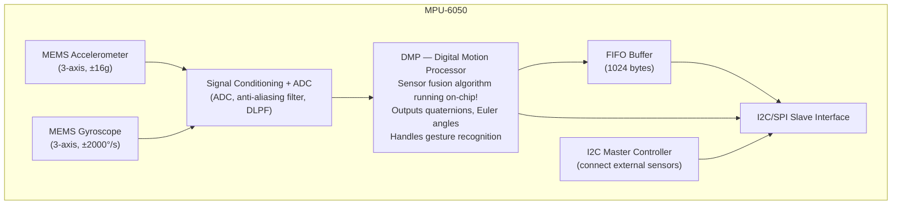

# Chapter 25: IMU — Accelerometers, Gyroscopes, and Magnetometers

## 25.1 What is an IMU?

An **IMU (Inertial Measurement Unit)** combines multiple sensors that measure motion and orientation:

| Sensor         | Measures                    | Axes |
|---------------|------------------------------|------|
| Accelerometer  | Linear acceleration (m/s²)   | X, Y, Z |
| Gyroscope      | Angular velocity (°/s or rad/s) | X, Y, Z |
| Magnetometer   | Magnetic field (µT or Gauss)  | X, Y, Z |

**IMU types:**
- **6-DOF IMU:** Accelerometer + Gyroscope (6 degrees of freedom)
- **9-DOF IMU:** + Magnetometer (9 degrees of freedom)
- **10-DOF IMU:** + Barometer (altitude from pressure)

**Applications:** Drones (flight control), smartphones (screen rotation, gaming), fitness trackers (step counting), VR headsets, robots (balance), automotive (airbag deployment, stability control)

---

## 25.2 MEMS Accelerometer

### Physical Principle

MEMS accelerometers use a **proof mass** suspended by microscopic silicon springs:

```
Top view of MEMS accelerometer:

        Fixed combs (anchored to substrate)
        ||||||||||||||||||||||||||||
        ─────────────────────────────────
        ||||||||||||||||||||||||||||
     ←  [PROOF MASS] (suspended, can move) →
        ||||||||||||||||||||||||||||
        ─────────────────────────────────
        ||||||||||||────────────────────

        Mobile combs (attached to proof mass)

When acceleration occurs:
  Mass wants to stay still (inertia)
  Housing moves with acceleration
  Relative displacement of mass = proportional to acceleration
  Displacement detected as capacitance change between combs!
```

**Capacitive sensing:**
```
C = ε₀ × A / d

When gap d changes:
  Acceleration → mass displacement → d changes → C changes
  Differential sensing: C1 increases, C2 decreases
  ΔC = C1 - C2 = 2ε₀A/d₀² × Δd

Charge amplifier converts ΔC to voltage
```

**Spring-mass model:**
```
ma = -kx - bẋ (Newton's law + spring + damping)

Where:
  m = proof mass
  a = applied acceleration
  k = spring constant (beam stiffness)
  x = displacement
  b = damping coefficient

At DC (steady-state): x = -(m/k) × a
Sensitivity: S = m/k

Higher mass or softer springs = more sensitive (but lower resonant frequency)
```

### Accelerometer Axes Convention

```
Standard orientation (flat, screen facing up):
      Z+ (up)
      │
      │
      ╔══════════════╗
      ║              ║ ← Phone face up
  Y+  ║              ║
  ─── ║              ║ ──── X+
      ║              ║      (to right)
      ╚══════════════╝
                │
               Z- (down)

At rest on flat surface:
  X = 0 g, Y = 0 g, Z = +1g (gravity pointing up in sensor's frame)

Tilted right 90°:
  X = +1g, Y = 0, Z = 0

Free fall:
  X = 0, Y = 0, Z = 0 (no force detected!)
  (This is why "free fall detection" works — zero-g detection)
```

### Accelerometer Specifications

**Full-scale range (FSR):**
- ±2g (sensitive, precision — step counting, tilt detection)
- ±4g (moderate — fitness)
- ±8g (impacts, vibration)
- ±16g (high-impact sports, vehicle dynamics)

```
1g = 9.81 m/s²
At ±2g FSR and 16-bit ADC: 65536 counts / (2×2g) = 16384 LSB/g
Resolution: 1/16384 g = 0.061 mg (milligravity) = 0.0006 m/s²

At ±16g FSR and 16-bit ADC: 65536 / 32g = 2048 LSB/g
Resolution: 1/2048 g = 0.49 mg
Less sensitive but larger range
```

**Noise:**
- Specified as noise spectral density (µg/√Hz)
- Lower is better
- Total noise depends on bandwidth: noise = NSD × √(bandwidth)

**Bias (offset):**
- Zero-g output should be exactly 0, but has offset (typically ±50 mg)
- Changes with temperature
- Must calibrate!

**Cross-axis sensitivity:**
- X-axis accelerometer also slightly sensitive to Y and Z (typically <2%)
- Imperfect alignment during fabrication

---

## 25.3 MEMS Gyroscope

### Physical Principle — Coriolis Effect

The gyroscope uses the **Coriolis effect** — when a vibrating mass is rotating, the Coriolis force creates vibration in a perpendicular direction:

```
Coriolis force: F_C = 2m(v × Ω)

Where:
  m = mass
  v = velocity of vibrating element
  Ω = angular velocity (rotation)
  × = cross product

Gyro operation:
1. Drive element vibrates back-and-forth in X direction (driven by electrostatic force)
2. When device rotates around Z axis, Coriolis force → Y direction vibration
3. Y vibration amplitude proportional to rotation rate!
4. Capacitive sensing detects Y vibration amplitude
```

**Tuning Fork Gyroscope:**
```
      ┌────────┐         ┌────────┐
      │ Tine 1 │ ←Drive→ │ Tine 2 │
      └────────┘         └────────┘
           ↑ Rotation (Z axis)
           │
      When rotating:
      Tine 1 gets Coriolis force in +Y
      Tine 2 gets Coriolis force in -Y
      Differential sensing cancels common-mode noise
```

### Gyroscope Specifications

**Full-scale range (FSR):**
- ±250°/s (precise slow rotation — robotics)
- ±500°/s (typical — drones, phones)
- ±1000°/s (fast — gaming)
- ±2000°/s (aerobatic — fast drones, RC cars)

**Sensitivity:**
```
At ±250°/s with 16-bit ADC:
  65536 counts / 500°/s = 131.07 LSB/(°/s)
  1 LSB = 0.00763°/s

In radians: 131.07 / (180/π) = 7.48 LSB/(rad/s)
```

**Zero-rate offset (bias):**
- Gyro should output 0 when stationary, but has DC offset
- ±10°/s is typical for consumer IMU
- Changes with temperature!
- Must measure and subtract (calibration)

**Noise (ARW — Angle Random Walk):**
- Angle error grows as √time due to noise integration
- Units: °/√hr or °/√s
- Lower is better
- Cheap gyro: 0.1°/s/√Hz (ARW ~6°/hr)
- MEMS: 0.005°/s/√Hz (ARW ~0.3°/hr)
- Military ring laser: 0.001°/hr (ARW)

**Drift:**
```
Integrate gyroscope signal to get angle:
θ = ∫ω dt

But ω has bias → angle drifts!
At bias = 5°/s and integrating for 60 seconds:
θ_drift = 5°/s × 60s = 300°! (total failure)

Solutions:
1. Calibrate bias (subtract average value at rest)
2. Use accelerometer to correct long-term drift (sensor fusion)
3. Use higher-quality gyro (lower bias stability)
```

---

## 25.4 MPU-6050 — 6-DOF IMU

The most popular IMU for hobbyists:

### Specifications

| Parameter         | Value                     |
|------------------|---------------------------|
| Accelerometer    | ±2, ±4, ±8, ±16g          |
| Gyroscope        | ±250, ±500, ±1000, ±2000°/s |
| ADC              | 16-bit for both           |
| Interface        | I2C (400 kHz), SPI (MPU-9250 variant) |
| I2C Address      | 0x68 (AD0=0) or 0x69 (AD0=1) |
| Supply voltage   | 2.375-3.46V (3.3V)       |
| Logic voltage    | 1.8-5V                    |
| Package          | QFN-24, 4×4mm             |
| Current          | 3.9 mA normal, 5 µA sleep |
| DMP              | Digital Motion Processor (on-chip)! |

### MPU-6050 Internal Architecture



### MPU-6050 Register Map (Key Registers)

| Address | Register              | Description                     |
|---------|----------------------|---------------------------------|
| 0x6B    | PWR_MGMT_1           | Power management, clock source  |
| 0x19    | SMPLRT_DIV           | Sample rate = 8kHz/(1+SMPLRT_DIV)|
| 0x1A    | CONFIG               | DLPF config                     |
| 0x1B    | GYRO_CONFIG          | Gyro full-scale select          |
| 0x1C    | ACCEL_CONFIG         | Accel full-scale select         |
| 0x3B-0x40 | ACCEL_XOUT_H/L etc | Accelerometer data (6 bytes)   |
| 0x41-0x42 | TEMP_OUT_H/L      | Temperature data                |
| 0x43-0x48 | GYRO_XOUT_H/L etc  | Gyroscope data (6 bytes)       |
| 0x75    | WHO_AM_I             | Chip ID = 0x68                  |

**Initialization:**
```c
// Wake up MPU-6050 (starts in sleep mode!)
i2c_write_reg(0x68, 0x6B, 0x00);  // Clear SLEEP bit, use internal 8MHz oscillator

// Set gyro range ±250°/s (FS_SEL=0)
i2c_write_reg(0x68, 0x1B, 0x00);

// Set accel range ±2g (AFS_SEL=0)
i2c_write_reg(0x68, 0x1C, 0x00);

// Configure low-pass filter: 20 Hz bandwidth (DLPF_CFG=4)
i2c_write_reg(0x68, 0x1A, 0x04);
```

**Reading sensor data:**
```c
uint8_t data[14];
i2c_read_regs(0x68, 0x3B, data, 14);  // Read 14 bytes starting at ACCEL_XOUT_H

int16_t accel_x = (data[0] << 8) | data[1];
int16_t accel_y = (data[2] << 8) | data[3];
int16_t accel_z = (data[4] << 8) | data[5];
int16_t temp_raw = (data[6] << 8) | data[7];
int16_t gyro_x  = (data[8] << 8) | data[9];
int16_t gyro_y  = (data[10] << 8) | data[11];
int16_t gyro_z  = (data[12] << 8) | data[13];

// Convert to engineering units:
float ax = accel_x / 16384.0;  // ±2g → 16384 LSB/g
float ay = accel_y / 16384.0;
float az = accel_z / 16384.0;

float temp_C = (temp_raw / 340.0) + 36.53;  // MPU-6050 temperature formula

float gx = gyro_x / 131.0;  // ±250°/s → 131 LSB/(°/s)
float gy = gyro_y / 131.0;
float gz = gyro_z / 131.0;
```

**Arduino library:**
```cpp
#include <MPU6050.h>
MPU6050 mpu;

void setup() {
    Wire.begin();
    mpu.initialize();
    mpu.setFullScaleGyroRange(MPU6050_GYRO_FS_250);
    mpu.setFullScaleAccelRange(MPU6050_ACCEL_FS_2);
}

void loop() {
    int16_t ax, ay, az, gx, gy, gz;
    mpu.getMotion6(&ax, &ay, &az, &gx, &gy, &gz);
    // Values are raw 16-bit integers, need conversion
}
```

---

## 25.5 MPU-9250 — 9-DOF IMU

MPU-9250 = MPU-6050 + AK8963 magnetometer in same package:
- Added magnetometer (compass) for absolute heading
- Same I2C interface, same register map for accel/gyro
- Magnetometer accessed via MPU-9250's I2C master (internal)

---

## 25.6 ICM-42688-P — Modern High-Performance IMU

From InvenSense (TDK), successor to MPU-6050 family:
- 6-DOF (accel + gyro)
- ±16g / ±2000°/s
- Gyro noise: 0.0028 °/s/√Hz (much better than MPU-6050)
- ODR: up to 32 kHz
- Temperature stability: improved
- SPI up to 24 MHz, I2C up to 1 MHz
- Used in: DJI drones, high-performance applications

---

## 25.7 LSM6DSO — STMicroelectronics 6-DOF IMU

Popular in consumer devices:
- Accel: ±2/±4/±8/±16g, 16-bit
- Gyro: ±125 to ±2000°/s, 16-bit
- Machine Learning Core (MLC): on-chip decision tree for gesture recognition
- FSM (Finite State Machine): custom motion detection without host CPU
- FIFO: 4 KB
- Used in: iPhone (older), smartwatches, fitness bands

---

## 25.8 Magnetometer (Compass)

### Working Principle

Magnetometers measure the Earth's magnetic field vector (25-65 µT depending on location):

**Hall effect sensors:** (Simple, less accurate)
- Magnetic field → Lorentz force on electrons in conductor
- Creates voltage proportional to B field
- Used for: proximity switches, position sensing (not compass)

**AMR (Anisotropic Magnetoresistance):**
- Ferromagnetic thin film — resistance changes with magnetic field angle
- Better sensitivity than Hall effect

**GMR (Giant Magnetoresistance):**
- Nobel Prize 2007
- Multiple magnetic layers — huge resistance change with field
- Used in hard disk read heads, some sensors

**Fluxgate magnetometer:**
- Very accurate, used in geology/navigation
- Too large/expensive for consumer IMU

**Consumer IMU magnetometers (typically AMR or similar):**
- AK8963 (MPU-9250 internal)
- HMC5883L (3-axis, I2C, popular)
- QMC5883L (cheaper clone of HMC5883L, different register map!)
- LIS3MDL (ST, excellent)
- IST8310 (common in drones)

### HMC5883L Magnetometer

```
Specifications:
  Range: ±1.3 to ±8.1 Gauss (software configurable)
  Resolution: 2 milli-Gauss (at default settings)
  Data rate: 0.75 to 75 Hz
  Interface: I2C (0x1E)
  Supply: 2.16-3.6V

Register map:
  0x00-0x02: Configuration A, B, Mode
  0x03-0x08: Data X MSB/LSB, Z MSB/LSB, Y MSB/LSB (note: order is X, Z, Y!)
  0x09: Status register
  0x0A, 0x0B: Identification registers (0x48, 0x34)
```

**Compass heading calculation:**
```c
float mx = (float)mag_x;  // Raw magnetometer X
float my = (float)mag_y;  // Raw magnetometer Y

// Heading (North = 0°, East = 90°):
float heading = atan2(my, mx) * 180.0 / M_PI;
if (heading < 0) heading += 360.0;  // Normalize to 0-360°

// This assumes sensor is PERFECTLY LEVEL!
// For tilted sensor: must use tilt-compensated heading (use accel for roll/pitch)
```

### Magnetometer Calibration — Critical!

Magnetometers suffer from two types of distortion:

**Hard iron (offset):**
- Constant magnetic bias from nearby permanent magnets (speakers, motors)
- Shifts the ellipsoid center away from origin
- Correction: subtract the center offset

**Soft iron (distortion):**
- Ferromagnetic materials distort field shape (shape becomes ellipse, not circle)
- Correction: scale factor matrix

**Calibration procedure:**
```
1. Rotate device slowly through all orientations (complete 3D figure-8 pattern)
2. Record min/max for each axis over all orientations:
   Xmax, Xmin, Ymax, Ymin, Zmax, Zmin

3. Hard iron offsets:
   X_offset = (Xmax + Xmin) / 2
   Y_offset = (Ymax + Ymin) / 2
   Z_offset = (Zmax + Zmin) / 2

4. Apply correction:
   X_cal = X_raw - X_offset
   Y_cal = Y_raw - Y_offset
   Z_cal = Z_raw - Z_offset

5. For soft iron: divide by half-span:
   avg_span = (Xmax-Xmin + Ymax-Ymin + Zmax-Zmin) / 3
   X_scale = avg_span / (Xmax - Xmin)
   Y_scale = avg_span / (Ymax - Ymin)
   Z_scale = avg_span / (Zmax - Zmin)

   X_final = X_cal × X_scale
   Y_final = Y_cal × Y_scale
   Z_final = Z_cal × Z_scale
```

---

## 25.9 Sensor Fusion Algorithms

### The Problem

Each sensor alone has issues:
- **Accelerometer alone:** Gives correct tilt angle statically, but noisy during movement and measures total acceleration (including motion, not just gravity)
- **Gyroscope alone:** Fast, accurate during motion, but drifts over time (bias integration)
- **Magnetometer alone:** Gives absolute heading, but subject to interference and needs calibration

### Solution: Sensor Fusion

Combine them to get the best of all:

### Complementary Filter

Simple and effective for many applications:

```c
// Simple tilt angle estimation:
float dt = 0.01;  // 10 ms sample rate
float alpha = 0.98;  // Trust gyro 98%, accel 2%

// Accel angle (noisy, absolute):
float accel_angle_x = atan2(ay, sqrt(ax*ax + az*az)) * 180.0 / M_PI;
float accel_angle_y = atan2(-ax, az) * 180.0 / M_PI;

// Complementary filter:
angle_x = alpha * (angle_x + gx * dt) + (1 - alpha) * accel_angle_x;
angle_y = alpha * (angle_y + gy * dt) + (1 - alpha) * accel_angle_y;
```

**α = 0.98:**
- 98% from gyro (low-pass for accel, high-pass for gyro)
- 2% from accelerometer (slowly corrects drift)
- Time constant: τ = α×dt / (1-α) = 0.98×0.01 / 0.02 = 0.49 seconds

### Mahony Filter

Popular in embedded flight controllers (ArduPilot, Betaflight):

```
Uses PI (proportional-integral) control:
- Error = cross product of accel_normalized and estimate_of_gravity
- Proportional correction: fast response
- Integral correction: eliminates gyro bias
- Very computationally efficient (quaternion arithmetic)
- Standard in FPV drones

Parameters:
  Kp = 10.0 (proportional gain)
  Ki = 0.0 (integral gain, 0 = pure complementary)
```

### Madgwick Filter

Popular alternative, used in open-source robotics:

```
Gradient descent algorithm minimizes rotation between sensor readings
Better handling of magnetic distortions
Only one parameter: beta (gradient descent step size)
  High beta: fast but noisy
  Low beta: slow but stable

Used in: ROS sensor_msgs/Imu processing
```

### Extended Kalman Filter (EKF)

Most sophisticated, used in navigation-grade systems:

```
State vector: [q0, q1, q2, q3, bx, by, bz]
  (quaternion attitude + gyro bias)

Predict: Using gyroscope measurements
Update: Using accelerometer + magnetometer

Advantages:
  - Optimal estimator (minimum variance)
  - Handles non-linearity (EKF approximation)
  - Naturally estimates gyro bias

Disadvantages:
  - Complex to implement
  - Computationally expensive
  - Requires tuning of noise matrices Q, R

Used in: Commercial flight controllers, autopilots (PX4), GPS/INS
```

### Quaternion Representation

Euler angles (roll, pitch, yaw) have **gimbal lock** problem — when pitch = 90°, roll and yaw axes align, losing a degree of freedom.

**Quaternion:** 4D representation of rotation, no gimbal lock:

```
q = w + xi + yj + zk
  = [w, x, y, z]

Where:
  w = cos(θ/2)
  x = sin(θ/2) × axis_x
  y = sin(θ/2) × axis_y
  z = sin(θ/2) × axis_z

Unit quaternion: w² + x² + y² + z² = 1

Convert to Euler:
  Roll  = atan2(2(wy + xz), 1 - 2(y² + z²))
  Pitch = asin(2(wx - yz))
  Yaw   = atan2(2(wz + xy), 1 - 2(x² + z²))
```

Most sensor fusion algorithms output quaternions internally, convert to Euler for display.

---

## 25.10 Practical IMU Applications

### Step Counter (Pedometer)

Using accelerometer:
```
Steps produce characteristic acceleration signature:
  - Magnitude spike on foot strike
  - Quiet period between steps

Algorithm:
1. Calculate magnitude: |a| = √(ax² + ay² + az²) - 1g (remove gravity)
2. Apply low-pass filter (0.5-5 Hz window — step frequency)
3. Peak detection: count peaks above threshold (~0.3g)
4. Step frequency: ~1-3 Hz walking, 2-4 Hz running

Python:
magnitude = np.sqrt(ax**2 + ay**2 + az**2) - 9.81
filtered = np.convolve(magnitude, np.ones(20)/20)  # Moving average
peaks = find_peaks(filtered, height=0.3, distance=10)
step_count = len(peaks[0])
```

### Tilt Detection (Screen Rotation)

Using accelerometer only:
```c
// When phone is flat:
// Z ≈ ±9.81 m/s² (gravity), X ≈ Y ≈ 0

// When rotated to landscape:
// X ≈ ±9.81 m/s², Z ≈ Y ≈ 0

float roll  = atan2(ay, az) * RAD_TO_DEG;   // Rotation around X axis
float pitch = atan2(-ax, sqrt(ay*ay + az*az)) * RAD_TO_DEG;  // Around Y

// Orientation detection:
if (abs(ax) > abs(ay) && abs(ax) > abs(az)) // Landscape
else if (abs(ay) > abs(ax) && abs(ay) > abs(az)) // Portrait
else if (abs(az) > abs(ax) && abs(az) > abs(ay)) // Flat
```

### Drone Flight Controller

```
IMU (MPU-6050/ICM-42688):
  Gyroscope: Primary input for attitude control loop
  Accelerometer: Vibration isolation + tilt correction

Control loop (runs at 1-8 kHz):
  1. Read gyro/accel from IMU
  2. Run Mahony/Madgwick filter → quaternion/Euler angles
  3. Calculate error: setpoint - current attitude
  4. PID controller: output = Kp×error + Ki×∫error + Kd×d(error)/dt
  5. Mix outputs to motor speeds (mixer matrix)
  6. Write to ESCs (Electronic Speed Controllers)

Filtering:
  Software low-pass filter on gyro (reduce noise from vibration)
  Notch filter at motor rotation frequency (remove harmonic noise)
```

### Free-Fall Detection (Laptop Hard Drive Protection)

```
When laptop is dropped (free-fall):
  All axes ≈ 0g (no external force!)

Detection:
  threshold = 0.2g
  freefall = (|ax| < threshold) && (|ay| < threshold) && (|az| < threshold)

If freefall detected for >50 ms:
  → Park hard drive heads immediately!
  → Prevents head crash when laptop hits ground

MPU-6050 has built-in free-fall interrupt!
```

---

## 25.11 Barometric Altitude Sensor (BMP/BME)

For 10-DOF IMUs, a barometer provides altitude:
- BMP388: Ultra-low noise pressure (0.016 Pa), ±0.5 m altitude typical
- Used in: GPS/INS fusion, altitude hold for drones

**Altitude accuracy:**
```
BMP388 noise at ×32 oversampling: 0.3 Pa RMS
At sea level (1013.25 hPa): 1 hPa ≈ 8 m altitude
0.3 Pa = 0.024 m = 2.4 cm altitude noise!

But: weather causes daily pressure changes of 1-10 hPa = 8-80 m error!
Solution: GPS fusion or ground reference needed for absolute altitude
For relative altitude: barometer excellent (launch pad → peak altitude)
```

---

## 25.12 Summary

| Sensor Component | Best For               | Key Spec           | Common IC      |
|-----------------|------------------------|-------------------|----------------|
| Accelerometer   | Static tilt, impact, steps | Noise density  | LSM6DSO, ADXL345|
| Gyroscope       | Dynamic orientation     | Bias stability    | ICM-42688, MPU-6050|
| Magnetometer    | Absolute heading (compass)| Accuracy, interference immunity | LIS3MDL, AK8963|
| IMU (6-DOF)    | General motion          | Package, ODR       | MPU-6050, LSM6DSO|
| IMU (9-DOF)    | Full orientation         | Combined specs    | MPU-9250, ICM-20948|
| Sensor fusion  | Stable orientation      | Algorithm choice   | Mahony (fast), EKF (accurate)|

**Key takeaways:**
- Use **gyroscope** for fast, accurate rotation rate measurement (short term)
- Use **accelerometer** for static tilt and long-term reference (no drift)
- Combine with **complementary filter** for best of both (simple, effective)
- Add **magnetometer** for absolute heading (requires calibration)
- For highest accuracy: **Madgwick/EKF** with all three sensors
