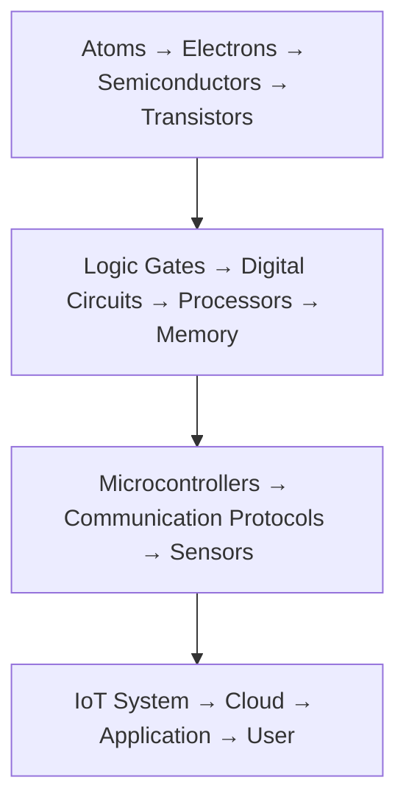
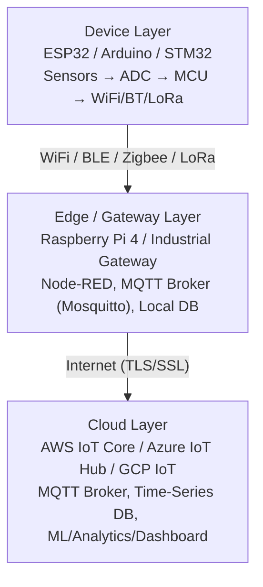
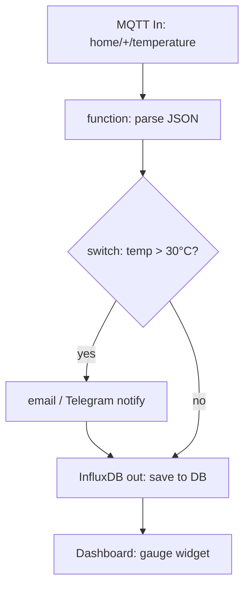
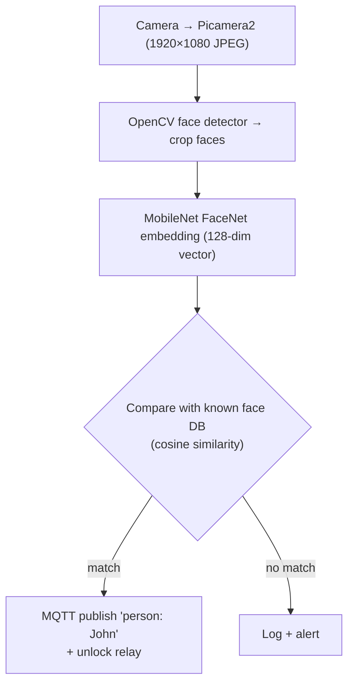

# Chapter 27: Putting It All Together — System Design, Protocols, and IoT

## 27.1 The Complete Picture

Over 26 chapters, we've traveled from the quantum mechanics of electrons to the silicon architecture of modern processors. This final chapter brings it all together — showing how every piece connects into real-world systems.



---

## 27.2 Communication Protocols — The Language of Electronics

Electronics components must talk to each other. We covered I2C, SPI, UART — now let's see all protocols in context:

### Wired Protocols Overview

| Protocol  | Wires | Speed      | Distance  | Multi-device | Use Case           |
|-----------|-------|------------|-----------|-------------|--------------------|
| UART      | 2     | Up to 1 Mbps| Short    | No (point-to-point)| Debug, GPS, BT module |
| SPI       | 4+    | 1-100 MHz  | Short     | Yes (CS per slave)| Sensors, Flash, ADC |
| I2C       | 2     | 0.1-5 MHz  | Medium    | Yes (7-bit addr)| Many sensors      |
| 1-Wire    | 1     | 15.4 kbps  | Medium    | Yes (ROM addr) | DS18B20, iButton  |
| CAN       | 2     | 1-10 Mbps  | 1-40m     | Yes (CSMA)   | Automotive, industrial |
| RS-485    | 2     | 10 Mbps    | 1.2 km!   | Yes (32 nodes)| Industrial Modbus |
| Ethernet  | 4     | 10M-10Gbps | 100m      | Yes (MAC)    | Network everything |
| USB       | 4     | 480M-20Gbps| 5m-50m    | Yes (127 dev)| PC peripherals    |
| I2S       | 3     | Up to 40MHz| Short     | Limited      | Digital audio     |
| LVDS      | 4     | Gbps       | Short     | No           | Camera, display   |

### Wireless Protocols Overview

| Protocol      | Frequency  | Range      | Data Rate  | Power  | Use Case              |
|--------------|------------|------------|------------|--------|-----------------------|
| WiFi 4 (802.11n)| 2.4/5 GHz| 50-100m   | 150 Mbps  | High   | Home networking       |
| WiFi 6 (802.11ax)| 2.4/5/6 GHz| 50-100m| 9.6 Gbps  | Med    | Dense environments    |
| Bluetooth 5.0 | 2.4 GHz    | 10-400m   | 2 Mbps    | Med    | Peripherals, audio    |
| BLE (BT5 LE)  | 2.4 GHz    | 10-100m   | 2 Mbps    | Low    | IoT sensors, beacons  |
| Zigbee        | 2.4 GHz    | 10-100m   | 250 kbps  | Very Low| Smart home mesh     |
| Z-Wave        | 868/915 MHz| 30-100m   | 100 kbps  | Low    | Smart home (US/EU)   |
| LoRa          | 433/868/915 MHz| 1-15 km| 0.3-50 kbps| Very Low| Long-range IoT     |
| LoRaWAN       | Same       | Same       | Same       | Very Low| LoRa network protocol|
| NB-IoT        | LTE bands  | km         | 127 kbps  | Very Low| Cellular IoT       |
| LTE-M (Cat-M1)| LTE bands  | km         | 1 Mbps    | Low    | Cellular IoT (voice) |
| Thread/Matter | 2.4 GHz    | 10-100m   | 250 kbps  | Low    | Smart home standard  |
| UWB           | 3.1-10.6 GHz| 10-100m  | 100+ Mbps | Med    | Precision location   |

### MQTT — IoT Messaging Protocol

**Most popular IoT protocol for cloud connectivity:**

```
Architecture:
  IoT Device (Publisher) → MQTT Broker → Subscriber (App/Server)

Topics (like channels):
  "home/bedroom/temperature"
  "factory/machine1/rpm"
  "user/123/heartrate"

QoS levels:
  0 = At most once (fire and forget)
  1 = At least once (guaranteed delivery, possible duplicates)
  2 = Exactly once (guaranteed, no duplicates, slowest)

Retained messages: Last message stored by broker
Will message: Sent if device disconnects unexpectedly

Brokers:
  Public: HiveMQ, EMQX, Mosquitto
  Cloud: AWS IoT Core, Azure IoT Hub, GCP IoT Core
```

**ESP32 MQTT example:**
```cpp
#include <WiFi.h>
#include <PubSubClient.h>

WiFiClient espClient;
PubSubClient client(espClient);

void callback(char* topic, byte* payload, unsigned int length) {
    // Handle incoming message
    String msg = String((char*)payload).substring(0, length);
    if (String(topic) == "home/bedroom/led") {
        if (msg == "ON") digitalWrite(LED, HIGH);
        else digitalWrite(LED, LOW);
    }
}

void reconnect() {
    while (!client.connected()) {
        if (client.connect("ESP32-bedroom", user, pass)) {
            client.subscribe("home/bedroom/led");  // Subscribe to control
        }
    }
}

void loop() {
    if (!client.connected()) reconnect();
    client.loop();

    // Publish sensor data every 30 seconds:
    static unsigned long lastMsg = 0;
    if (millis() - lastMsg > 30000) {
        lastMsg = millis();
        float temp = readTemperature();
        char payload[20];
        snprintf(payload, 20, "%.2f", temp);
        client.publish("home/bedroom/temperature", payload, true);  // retained=true
    }
}
```

---

## 27.3 PCB Design Fundamentals

Real electronics eventually moves from breadboard to Printed Circuit Board:

### PCB Layers

```
4-layer PCB (most common for MCU boards):
┌────────────────────────────────────────────────────┐
│  Layer 1: Top Signal + Components (copper traces)  │
├────────────────────────────────────────────────────┤
│  Layer 2: Ground Plane (solid copper, GND net)     │
├────────────────────────────────────────────────────┤
│  Layer 3: Power Plane (3.3V, 5V, 12V)              │
├────────────────────────────────────────────────────┤
│  Layer 4: Bottom Signal + Components               │
└────────────────────────────────────────────────────┘

FR4 substrate (glass fiber + epoxy) between layers
Typical PCB thickness: 1.6 mm
```

**Why ground plane matters:**
- Low impedance return path for all currents
- Reduces EMI radiation
- Provides reference for analog circuits
- Reduces ground bounce in digital circuits

### PCB Design Rules

**Trace width:**
```
Trace width for current (rule of thumb):
  Signal (digital, low current): 0.1-0.2 mm (4-8 mil)
  1A: 0.5 mm trace on external layer
  2A: 0.8 mm trace on external layer
  5A: 2 mm trace on external layer

Formula (IPC-2221):
  A = I / (k × ΔT^0.44)  (external trace, ΔT = 10°C)
  width(mm) = A / 0.0647 / (thickness_oz × 35 µm/oz)
```

**Via (connection between layers):**
```
Types:
  Through-hole via: Drills through all layers (most common, cheap)
  Blind via: From outer layer to inner (not through all)
  Buried via: Between inner layers only (expensive)
  Micro-via (µvia): HDI boards, <0.15 mm diameter

Via sizes:
  Standard: 0.8 mm pad, 0.4 mm drill
  Small: 0.5 mm pad, 0.3 mm drill
```

### ESD Protection

ESD (Electrostatic Discharge) can destroy sensitive electronics:

```
Protection circuit on GPIO pins:
            TVS diode (PRTR5V0U2X, SRV05-4, etc.)
VCC ──┤
      ├── GPIO pin
GND ──┤

Or RC filter:
MCU pin ──[33Ω]──[100pF to GND]── Connector

ESD protection levels:
  IEC 61000-4-2: ±2kV (contact), ±4kV (air)
  ±15kV HBM (Human Body Model) for IO pins
```

### Decoupling Capacitors

Essential for every IC:

```
Every VCC pin of every IC needs decoupling:
  100 nF (0.1 µF) ceramic capacitor: as close to VCC pin as possible
  10 µF bulk capacitor: per board section

Why?
  ICs draw sudden current spikes when switching gates
  Without decoupling: voltage dips on VCC → logic errors!
  Capacitor provides local charge reservoir

Placement: Capacitor must be BETWEEN VCC and GND of the IC
  NOT: MCU → trace → capacitor → trace → MCU (inductance kills effect)
  YES: Cap directly at MCU VCC pin, via to ground plane below
```

**Good decoupling layout:**
```
  MCU chip
  ┌──────────────────────┐
  │ VCC pin ─────[100nF]─┼─ GND via (straight down to GND plane)
  │              ↑       │
  │      Cap placed under chip or very close
  └──────────────────────┘
```

---

## 27.4 Power Systems

### LDO vs DC-DC Converter

**LDO (Low Dropout Regulator):**
```
Input (5V) → LDO → Output (3.3V)
Dropout = 5V - 3.3V = 1.7V (lost as heat)
Efficiency = Vout/Vin = 3.3/5 = 66%

Heat dissipated: P = (Vin - Vout) × I
At 500 mA: P = 1.7 × 0.5 = 0.85W (needs heatsink!)

Common LDOs:
  AMS1117-3.3: 1A, SOT-223, used on every Arduino clone
  AP2112K: 600 mA, low noise, good for ADC supplies
  MIC5219: 500 mA, 500 mV dropout
```

**DC-DC Converter (Switching):**
```
Buck (step-down): Vin=12V → Vout=5V, efficiency 85-95%
Boost (step-up): Vin=3.7V → Vout=5V, efficiency 85-95%
Buck-Boost: Output > or < input

LM2596: 3A buck, adjustable 1.2-37V output
MP2307: 3A buck, tiny package
TPS54340: 3.5A buck, excellent transient response

Efficiency: P_out/P_in = Vout×Iout / Vin×Iin = 85-95%
At 1A, 12V→5V: P_loss = 12×1 - 5×1 = 7W with LDO, 0.7W with DC-DC!
```

**When to use which:**
| Condition              | Recommendation     |
|------------------------|-------------------|
| < 200 mA, low noise   | LDO               |
| > 500 mA              | DC-DC buck        |
| Low EMI critical       | LDO (DC-DC switching noise) |
| Battery-powered        | DC-DC (efficiency!) |
| High Vin-Vout drop    | DC-DC mandatory   |

### Battery Selection

| Battery Type      | Voltage  | Capacity  | Rechargeable | Energy Density | Notes              |
|-----------------|----------|-----------|-------------|---------------|-------------------|
| AA Alkaline     | 1.5V     | 2700 mAh  | No          | 180 Wh/kg     | Widely available  |
| 9V PP3          | 9V       | 500 mAh   | No          | 45 Wh/kg      | Lower energy      |
| Li-Ion 18650    | 3.7V nom | 2500-3500 mAh| Yes       | 250 Wh/kg     | Best for IoT      |
| Li-Po (flat)    | 3.7V nom | 100-10000 mAh| Yes       | 200 Wh/kg     | Flexible shape    |
| LiFePO4 (LFP)  | 3.2V nom | 1500-6000 mAh| Yes       | 120 Wh/kg     | Safer, more cycles|
| Super Capacitor | 2.7V     | 1-650 F   | Yes (∞)     | 5-30 Wh/kg    | Fast charge       |

**Li-Ion charging (CC-CV):**
```
Phase 1 - Constant Current (CC):
  Charge at C/2 or C/5 rate (e.g., 500 mA for 1000 mAh cell)
  Voltage rises from 3.0V to 4.2V

Phase 2 - Constant Voltage (CV):
  Hold at 4.2V (cutoff voltage)
  Current decreases as battery fills
  Stop when I < C/20 (termination current)

Protection ICs:
  TP4056: Dedicated 18650 charger IC, 1A max
  BQ25895: Advanced multi-cell charger
  PMIC: Power Management IC with integrated charger

Never charge:
  Lithium battery with constant current until damaged
  Li-Ion to > 4.2V (dangerous!!)
  Li-Ion below 0°C
```

---

## 27.5 IoT System Architecture

### Complete IoT Stack



### Real-World Example: Smart Home Environmental Monitor

**Hardware:**
```
BME280 (temp/humidity/pressure)  ─┐
MQ-135 (air quality)               │
VL53L0X (presence detection)       │─→ ESP32 ──WiFi──→ MQTT Broker ──→ Dashboard
BH1750 (light level, I2C)         │
                                  ─┘

BME280: I2C to ESP32 (GPIO21=SDA, GPIO22=SCL)
MQ-135: Analog to ADC1_CH0 (GPIO36)
VL53L0X: I2C (same bus as BME280, different address)
BH1750: I2C (address 0x23)
```

**Firmware (ESP32 Arduino):**
```cpp
#include <WiFi.h>
#include <PubSubClient.h>
#include <Wire.h>
#include <Adafruit_BME280.h>
#include <BH1750.h>
#include <VL53L0X.h>
#include "esp_sleep.h"

// Configuration
const char* SSID = "HomeNetwork";
const char* PASS = "password";
const char* MQTT_SERVER = "192.168.1.100";
const char* DEVICE_ID = "living_room";
const int REPORT_INTERVAL = 60;  // seconds

Adafruit_BME280 bme;
BH1750 lightMeter;
VL53L0X distSensor;
WiFiClient espClient;
PubSubClient mqtt(espClient);

struct SensorData {
    float temperature;
    float humidity;
    float pressure;
    float altitude;
    float lux;
    int distance_mm;
    int air_quality;
    bool occupied;
};

SensorData readAllSensors() {
    SensorData data;
    data.temperature = bme.readTemperature();
    data.humidity = bme.readHumidity();
    data.pressure = bme.readPressure() / 100.0;  // hPa
    data.altitude = bme.readAltitude(1013.25);
    data.lux = lightMeter.readLightLevel();
    data.distance_mm = distSensor.readRangeSingleMillimeters();
    data.air_quality = analogRead(36);
    data.occupied = (data.distance_mm < 2000);  // Present if < 2m
    return data;
}

void publishData(SensorData& d) {
    char topic[64], payload[128];

    // Publish each sensor reading
    snprintf(topic, 64, "home/%s/temperature", DEVICE_ID);
    snprintf(payload, 128, "%.2f", d.temperature);
    mqtt.publish(topic, payload, true);  // retained

    snprintf(topic, 64, "home/%s/humidity", DEVICE_ID);
    snprintf(payload, 128, "%.1f", d.humidity);
    mqtt.publish(topic, payload, true);

    // ... more sensors

    // Publish combined JSON
    char json[256];
    snprintf(json, 256,
        "{\"temp\":%.2f,\"hum\":%.1f,\"pres\":%.1f,\"lux\":%.1f,\"occ\":%d}",
        d.temperature, d.humidity, d.pressure, d.lux, d.occupied);
    snprintf(topic, 64, "home/%s/all", DEVICE_ID);
    mqtt.publish(topic, json, true);
}

void setup() {
    Wire.begin(21, 22);  // SDA, SCL
    bme.begin(0x76);
    lightMeter.begin();
    distSensor.init();

    WiFi.begin(SSID, PASS);
    while (WiFi.status() != WL_CONNECTED) delay(500);

    mqtt.setServer(MQTT_SERVER, 1883);
    mqtt.setBufferSize(512);
}

void loop() {
    if (!mqtt.connected()) {
        mqtt.connect(DEVICE_ID, "mqtt_user", "mqtt_pass");
    }
    mqtt.loop();

    static unsigned long lastReport = 0;
    if (millis() - lastReport > (REPORT_INTERVAL * 1000)) {
        lastReport = millis();
        SensorData data = readAllSensors();
        publishData(data);
    }
}
```

---

## 27.6 Node-RED — Visual IoT Programming

Node-RED runs on Raspberry Pi and provides visual flow programming:



**Features:**
- 300+ pre-built nodes
- Connects: MQTT, HTTP, WebSocket, email, Telegram, databases
- Dashboard: Gauges, charts, maps
- Runs locally on RPi (privacy!)
- File: `.json` flows (portable)

---

## 27.7 Home Assistant — Smart Home Platform

The most popular open-source smart home system:

```
Architecture:
  Home Assistant Core (Python) runs on RPi or Docker
  ├── Integrations: 3000+ devices (Philips Hue, IKEA, Ring, Nest...)
  ├── Automations: If door opens and dark → turn lights on
  ├── Dashboards: Lovelace UI (customizable)
  ├── MQTT integration: ESP32 sensors → MQTT → HA
  └── Voice: Local (Piper TTS + Whisper STT) or Google/Alexa

ESP32 + HA via ESPHome:
  ESPHome config (YAML):
    sensor:
      - platform: bme280
        temperature:
          name: "Living Room Temperature"
        humidity:
          name: "Living Room Humidity"
        address: 0x76
        update_interval: 60s
  → Auto-discovered by Home Assistant!
  → No programming needed!
```

---

## 27.8 From Idea to Product — Development Process

### Phase 1: Concept and Specification

```
Define:
  - What does it do? (function)
  - Input sources (sensors, user interface)
  - Output actions (actuators, displays, network)
  - Power source (battery? wall? solar?)
  - Environment (indoor/outdoor, temperature range)
  - Cost target (BOM target)
  - Volume (prototype vs product: 1 unit vs 10,000 units)

Example: Smart greenhouse monitor
  - Measures: soil moisture, temperature, light, CO₂
  - Actions: Water valve, fan, heater, lamp control
  - Power: Wall adapter (AC-DC)
  - Connectivity: WiFi → Home Assistant
  - Volume: 5 units (personal use)
  - MCU choice: ESP32 (WiFi built-in)
```

### Phase 2: Prototype (Breadboard)

```
Tools:
  - Breadboard
  - Jumper wires
  - MCU development board (ESP32-DevKit, STM32 Nucleo)
  - USB-Serial adapter
  - Multimeter
  - Oscilloscope (if available)

Process:
  1. Wire sensors to MCU on breadboard
  2. Verify each sensor individually
  3. Write firmware, test
  4. Integrate everything, test again
  5. Test edge cases (power failure, bad sensor reading, network loss)
```

### Phase 3: PCB Design

```
EDA Tools (Electronic Design Automation):
  KiCad (free, professional, open-source)
  Altium Designer ($$$, industry standard)
  Eagle (Autodesk, freemium)
  EasyEDA (web-based, free)

Steps:
  1. Schematic capture
     - Place components (from libraries)
     - Draw connections (nets)
     - Assign footprints (physical size of component)
     - Run ERC (Electrical Rules Check)

  2. PCB layout
     - Place components (minimize trace lengths, group by function)
     - Route traces (manually or auto-router)
     - Add ground plane
     - Add silkscreen labels
     - Run DRC (Design Rules Check)
     - Generate Gerber files

  3. PCB fabrication
     - Send Gerbers to fabricator
     - PCBWay, JLCPCB, OSH Park, PCBgogo
     - JLCPCB: 5 boards, 100mm², 2-layer = $2! (ships in 1 week)
     - JLCPCB PCBA: Also assembles SMD components!

  4. Assembly
     - Apply solder paste (stencil)
     - Place components (pick-and-place or hand)
     - Reflow oven (180-260°C profile)
     - Inspect (magnifier, microscope)
     - Test and debug
```

### Phase 4: Firmware Development

```
Professional embedded firmware structure:
  BSP (Board Support Package): MCU-specific code
  Drivers: Sensor, peripheral drivers
  Middleware: Protocol stacks, RTOS, file system
  Application: Business logic

Best practices:
  - Version control (Git)
  - Unit tests where possible
  - Defensive coding (check return values, handle errors)
  - Watchdog timer always enabled
  - OTA update capability for deployed devices
  - Logging/diagnostics for debugging deployed devices
```

### Phase 5: Testing

```
Types of testing:
  - Functional test: Does it do what it's supposed to?
  - Environmental test: Does it work at -20°C? +60°C?
  - Stress test: Does it run for 30 days continuously?
  - EMC test: Does it radiate too much? Is it immune to interference?
  - Safety test: Electrical safety (creepage, clearance, insulation)

For products going to market:
  CE mark (Europe): EMC Directive (2014/30/EU) + other directives
  FCC (USA): Part 15 for intentional radiators (WiFi, BT)
  These require lab testing ($1000-$10,000)

Shortcut: Use pre-certified modules (ESP32 modules, BT modules)
  - The module itself is certified
  - Your board may need simpler compliance testing
  - ESP32-WROOM-32 has FCC/CE certification
```

---

## 27.9 Real-World System Examples

### Example 1: Weather Station

```
Hardware:
  - BME680 (temp/humidity/pressure/gas AQI)
  - BH1750 (light level)
  - ML8511 (UV index, analog)
  - Anemometer + wind vane (analog)
  - Rain gauge (interrupt count)
  - ESP32 (WiFi)
  - 18650 Li-Ion + solar panel + TP5400 MPPT charger

Firmware:
  - Read sensors every 1 minute
  - Deep sleep between readings (~3.5 mA active vs 10 µA sleep)
  - Post to Weather Underground / APRS-IS / personal server
  - OTA updates via WiFi

Solar power math:
  Load: 3.5 mA × 60s + 0.01 mA × 3540s = 245 mAs/hour = 0.068 mAh/measurement × 60 = 4 mAh/hour
  Battery: 2000 mAh → 500 hours without sun
  Solar: 1W panel → ~170 mA at 6V = ~1020 mAh/day (5 hours sun)
  Usage: 4 × 24 = 96 mAh/day
  Works indefinitely with small panel! ✓
```

### Example 2: Motor Controller

```
Hardware:
  - STM32G4 (high-resolution timer HRTIM, Cortex-M4 + FPU)
  - BLDC motor (3-phase brushless DC)
  - 3× half-bridge MOSFET drivers (DRV8350)
  - 6× N-channel power MOSFETs (CSD18512Q5B, 12V, 40A)
  - Current sensing: 3× shunt resistors + INA240 amplifiers
  - Encoder: Optical 2000 PPR + STM32 TIM encoder mode
  - Communication: CANopen (CAN bus)

Control loop (runs at 20 kHz = 50 µs period):
  1. Read current sensors (ADC, triggered by timer)
  2. Clarke/Park transform (convert 3-phase to d-q frame)
  3. PI current controllers (d-axis = flux, q-axis = torque)
  4. Inverse Park/Clarke → space vector PWM
  5. Update HRTIM registers (250 ps resolution!)
  6. Next cycle

Outer loops:
  Position control (500 Hz): Target angle → speed setpoint
  Speed control (1 kHz): Target speed → torque setpoint
  Torque/current control (20 kHz): Target torque → PWM

This is a Field-Oriented Control (FOC) / Vector Control implementation
```

### Example 3: Edge AI Camera

```
Hardware:
  - Raspberry Pi 5 (Cortex-A76, 8 GB)
  - Pi Camera Module 3 (IMX708, 12 MP, PDAF)
  - Coral TPU USB (Google, 4 TOPS neural network accelerator)
  - GPIO: Status LEDs, relay for door lock

Software Stack:
  - Raspberry Pi OS Bookworm (64-bit)
  - libcamera (camera control)
  - OpenCV (image processing)
  - TensorFlow Lite (ML inference)
  - PyCoral (Coral TPU interface)
  - MQTT (send events to Home Assistant)
```

**Face recognition pipeline:**



> With Coral TPU: face embedding inference < 5 ms. Without TPU (RPi5 only): ~50 ms (still usable at 20 Hz).

---

## 27.10 Debugging Techniques

### Debugging Embedded Systems

**Hardware tools:**
```
Multimeter:
  - Voltage measurements (VCC, GPIO logic levels)
  - Continuity check (short circuits, solder bridges)
  - Resistance check (pull-up values, thermistor)

Oscilloscope (essential for embedded):
  - View digital signals in time domain
  - Measure signal rise/fall times
  - Debug UART, SPI, I2C at hardware level
  - Detect glitches, ringing, incorrect timing
  - Channels: 2 (minimum), 4 (better)
  - Bandwidth: 50-200 MHz (sufficient for most MCU work)

Logic Analyzer (cheaper than scope for digital):
  - Sigrok-compatible: Saleae Logic, fx2lafw
  - Decode protocols: UART, SPI, I2C, CAN automatically
  - 8-16 channels, 24+ MSPS

SWD debugger (for ARM MCU):
  - Set breakpoints without modifying code
  - Step through code instruction by instruction
  - Inspect all register and memory values live
```

**Software techniques:**
```
Print debugging (simplest):
  Serial.println("Reached here");
  Serial.printf("Value: %d\n", value);

Toggle GPIO (fastest):
  PORTB ^= (1<<5);  // Toggle pin at critical point
  // See it on oscilloscope!

SEGGER RTT (best for real-time):
  No UART needed, works at full speed
  printf("ADC=%d, temp=%.2f", adc, temp);
  Reads over SWD without pausing execution

Assertion:
  assert(value > 0 && value < 100);  // Halt if violated
  configASSERT() in FreeRTOS
```

**Common embedded bugs:**
1. **Stack overflow:** Stack too small for function calls + ISR stack
2. **Uninitialized variables:** SRAM contains garbage at startup
3. **Integer overflow:** `int` too small for calculation
4. **Floating point in ISR:** Context save/restore issues on some MCUs
5. **Race condition:** Global shared between ISR and main loop without `volatile` / mutex
6. **I2C lockup:** SDA stuck low — need to manually clock 9 SCL pulses
7. **UART framing error:** Baud rate mismatch
8. **ADC ground noise:** Digital ground coupled into analog

---

## 27.11 The Electronics Knowledge Map

Here is everything we've covered, organized as a knowledge graph:

```
QUANTUM PHYSICS
└── Electron wave-particle duality
    └── Quantum numbers → electron configuration
        └── Valence electrons → Chemical bonds

SEMICONDUCTORS
├── Silicon crystal structure (diamond cubic)
├── Band theory (valence/conduction/gap)
├── Doping (N-type: P, As; P-type: B)
├── Carrier transport (drift + diffusion)
└── PN Junction
    ├── Built-in potential (~0.7V Si)
    ├── Forward/reverse bias
    ├── Shockley equation: I = IS(e^(V/nVT) - 1)
    └── Diode types: rectifier, Zener, LED, Schottky, photodiode

TRANSISTORS
├── BJT: NPN/PNP, IE=IB+IC, IC=β×IB
│   ├── Amplifier configurations (CE, CB, CC)
│   └── Switch applications
├── MOSFET: N-channel, P-channel, enhancement/depletion
│   ├── CMOS logic (P=αCV²f)
│   └── Power electronics
└── Advanced: FinFET, GAA, IGBT, JFET

BASIC COMPONENTS
├── Resistors (Ohm's law, color code, NTC/PTC, LDR)
├── Capacitors (τ=RC, Xc=1/2πfC, ceramic/electrolytic)
├── Inductors (V=L×di/dt, XL=2πfL)
└── Transformers (Vs/Vp = Ns/Np)

DIGITAL LOGIC
├── Number systems (binary, hex, two's complement)
├── Boolean algebra (De Morgan's theorems)
├── Logic gates (NOT/AND/OR/NAND/NOR/XOR)
├── Combinational circuits (adder, ALU, MUX, decoder)
└── Sequential circuits (flip-flops, registers, FSM)

FABRICATION
├── Czochralski process, wafer preparation
├── Photolithography (DUV 193nm, EUV 13.5nm)
├── Ion implantation, ALD, CVD, CMP
├── Moore's Law and its limits
└── Chiplet design, 3D stacking

COMPUTER ARCHITECTURE
├── Von Neumann vs Harvard
├── Pipeline, hazards, OOO execution
├── Branch prediction (TAGE, >98% accuracy)
├── Cache (SRAM, MESI coherence, LRU)
└── Virtual memory (paging, TLB)

INSTRUCTION SET ARCHITECTURES
├── RISC vs CISC
├── ARM (Cortex-M0 through M85, Cortex-A53/72/76)
├── x86-64 (Intel, AMD, 46-year history)
├── RISC-V (open source, modular)
└── SIMD (NEON, AVX, AMX)

MEMORY SYSTEMS
├── SRAM (6T cell, L1/L2/L3 cache)
├── DRAM (1T1C, refresh, DDR1-5)
├── LPDDR/HBM/GDDR (specialized DRAM)
├── Flash (NAND TLC/QLC, 3D V-NAND)
└── NVMe/eMMC/UFS (storage)

MICROCONTROLLERS
├── ATmega328P / Arduino (AVR 8-bit)
├── ESP32 / Xtensa LX6 (WiFi+BT)
├── STM32 / ARM Cortex-M (professional)
└── Raspberry Pi / ARM Cortex-A (Linux SBC)

PROCESSORS
├── Apple M1-M4 (ARM, unified memory, NPU)
└── Intel/AMD x86 (OOO, cache, AVX-512)

SENSORS
├── Distance: IR, ultrasonic, ToF, LiDAR, radar
├── Environmental: temp, humidity, pressure
├── Motion: accelerometer, gyroscope, magnetometer
└── Other: gas, pH, current, optical, flex, force
```

---

## 27.12 Learning Path Recommendations

### Beginner Path

1. **Start with Arduino Uno + LED** → Get comfortable with code
2. **Add sensors** (DHT22, HC-SR04) → Read and display data
3. **Try I2C** (OLED display, MPU-6050) → Multi-device communication
4. **Build a project** (weather station, alarm system)
5. **Move to ESP32** → Add WiFi, MQTT

### Intermediate Path

1. **STM32 Blue Pill** → Register-level programming, debugging
2. **RTOS** (FreeRTOS) → Tasks, queues, semaphores
3. **Power management** → Sleep modes, battery design
4. **PCB design** (KiCad) → Design your own board
5. **Signal processing** (FFT, filters) → Audio or vibration analysis

### Advanced Path

1. **RTOS + drivers** → Write your own peripheral driver
2. **Bootloader** → OTA updates, secure boot
3. **Motor control** → FOC, PID, encoder feedback
4. **RF design** → Antenna, matching network, EMC
5. **FPGA** (Lattice/Xilinx) → Hardware acceleration, custom logic
6. **ASIC design** → Verilog/VHDL, synthesis, place-and-route

### Recommended Resources

**Books:**
- "Make: Electronics" by Forrest Mims — absolute beginner
- "The Art of Electronics" (Horowitz & Hill) — definitive reference
- "Computer Organization and Design" (Patterson & Hennessy) — ARM or x86 edition
- "Programming Embedded Systems" by Michael Barr
- "Embedded Systems Design" by Steve Heath

**Online:**
- Arduino tutorials: arduino.cc/en/Tutorial/HomePage
- STM32 HAL: stm32duino.com
- Arm documentation: developer.arm.com
- RISC-V: riscv.org
- Ben Eater's videos: YouTube "Ben Eater" — builds CPU from scratch with chips!
- EEVblog: Professional electronics engineering
- Applied Science: advanced electronics experiments

**Tools:**
- KiCad: Free PCB design (kicad.org)
- PlatformIO: Professional embedded IDE
- STM32CubeIDE: STM32 development
- Sigrok/PulseView: Free logic analyzer software

---

## 27.13 Final Summary

Congratulations! You've journeyed through the entire world of electronics:

**The big picture:**
1. Everything starts with **electrons** and quantum mechanics
2. Silicon's **band structure** makes semiconductors unique
3. **Transistors** (just switched capacitors at heart) enable all digital logic
4. Billions of transistors fabricated by **photolithography** on silicon wafers
5. **Logic gates** → **circuits** → **processors** through clever Boolean algebra
6. **Memory** (SRAM + DRAM + Flash) stores everything
7. **Instruction sets** (ARM, x86, RISC-V) define what a CPU can do
8. **Microcontrollers** put CPU + memory + peripherals in one chip
9. **Sensors** are the eyes and ears of embedded systems
10. **Communication protocols** connect everything together
11. **IoT** connects physical systems to the digital world

The same fundamental physics that governs a single MOSFET — quantum tunneling, carrier drift and diffusion, electrostatic fields — also underlies the Apple M4's 28 billion transistors. The principles don't change; only the scale changes.

**Keep building. Keep exploring.**

Every expert started with blinking an LED. 🔬⚡🤖
