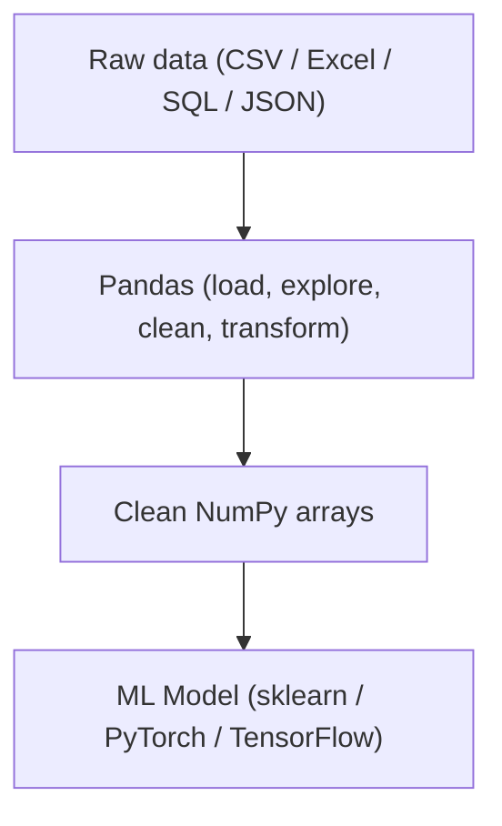

# Chapter 03: Pandas — Data Wrangling and Analysis

> **"Data scientists spend 80% of their time cleaning data and 20% complaining about it. Pandas makes the 80% bearable."**

---

## Table of Contents
1. [Why Pandas?](#1-why-pandas)
2. [Series: The 1D Labeled Array](#2-series-the-1d-labeled-array)
3. [DataFrame: The 2D Table](#3-dataframe-the-2d-table)
4. [Reading Data](#4-reading-data)
5. [Exploring Your Data](#5-exploring-your-data)
6. [Selecting and Filtering Data](#6-selecting-and-filtering-data)
7. [Handling Missing Values](#7-handling-missing-values)
8. [Modifying DataFrames](#8-modifying-dataframes)
9. [Applying Functions](#9-applying-functions)
10. [GroupBy: Split-Apply-Combine](#10-groupby-split-apply-combine)
11. [Merging and Joining](#11-merging-and-joining)
12. [Reshaping Data](#12-reshaping-data)
13. [String Operations](#13-string-operations)
14. [DateTime Operations](#14-datetime-operations)
15. [Handling Duplicates](#15-handling-duplicates)
16. [Encoding and Binning for ML](#16-encoding-and-binning-for-ml)
17. [Memory Optimization](#17-memory-optimization)
18. [Chaining Methods](#18-chaining-methods)
19. [Mini Project: Titanic EDA](#19-mini-project-titanic-eda)
20. [Summary](#20-summary)
21. [Exercises](#21-exercises)

---

## 1. Why Pandas?

Your data almost never comes pre-packaged as a clean NumPy array. It arrives as:
- CSV files from databases
- Excel spreadsheets from business teams
- JSON responses from APIs
- Query results from SQL databases

Real-world data is messy:
- Some rows have missing values
- Dates are stored as strings
- Column names have inconsistent capitalization
- Some categorical values have typos ("Male", "male", "MALE")

Pandas is the library that bridges the gap between raw messy data and the clean NumPy arrays your ML model needs.



Think of Pandas as Excel + SQL — but programmable, reproducible, and capable of handling millions of rows.

---

## 2. Series: The 1D Labeled Array

A **Series** is the simplest Pandas structure — a 1D array with an index (labels).

```python
import pandas as pd
import numpy as np

# Creating a Series
ages = pd.Series([25, 30, 35, 28, 22])
print(ages)
# 0    25
# 1    30
# 2    35
# 3    28
# 4    22
# dtype: int64

# With custom index
ages_named = pd.Series(
    [25, 30, 35, 28, 22],
    index=["Alice", "Bob", "Carol", "Dave", "Eve"],
    name="age"
)
print(ages_named)
# Alice    25
# Bob      30
# Carol    35
# Dave     28
# Eve      22
# Name: age, dtype: int64

# Accessing elements
print(ages_named["Alice"])    # 25
print(ages_named[0])          # 25  (still works with positional index)
print(ages_named[["Alice", "Carol"]])  # multiple labels

# Series properties
print(ages_named.index)       # Index(['Alice', 'Bob', 'Carol', 'Dave', 'Eve'])
print(ages_named.values)      # array([25, 30, 35, 28, 22]) — NumPy array!
print(ages_named.name)        # 'age'
print(ages_named.dtype)       # int64

# Arithmetic — index-aligned
income = pd.Series([50000, 75000, 90000, 60000, 40000],
                   index=["Alice", "Bob", "Carol", "Dave", "Eve"])
ratio = income / ages_named   # divides by matching index!
print(ratio)
# Alice    2000.0
# Bob      2500.0
# Carol    2571.4
# Dave     2142.9
# Eve      1818.2
```

---

## 3. DataFrame: The 2D Table

A **DataFrame** is a 2D table — like a database table or Excel spreadsheet. Each column is a Series, and they all share the same index.

```
DataFrame structure:
──────────────────────────────────────────────────────
           name    age  salary  department
Index ──▶    0   Alice   25   50000    Engineering
         1    Bob     30   75000    Marketing
         2   Carol   35   90000    Engineering
         3    Dave   28   60000    Sales
         4     Eve   22   40000    Marketing
                ↑         ↑
            columns     values
──────────────────────────────────────────────────────
```

```python
import pandas as pd

# Creating from a dictionary of lists
df = pd.DataFrame({
    "name":       ["Alice", "Bob", "Carol", "Dave", "Eve"],
    "age":        [25, 30, 35, 28, 22],
    "salary":     [50000, 75000, 90000, 60000, 40000],
    "department": ["Engineering", "Marketing", "Engineering", "Sales", "Marketing"]
})

# From list of dicts (common when parsing JSON APIs)
records = [
    {"name": "Alice", "age": 25, "score": 0.92},
    {"name": "Bob",   "age": 30, "score": 0.87},
    {"name": "Carol", "age": 35, "score": 0.95},
]
df2 = pd.DataFrame(records)

# From NumPy array (with column names)
import numpy as np
data = np.random.randn(100, 3)
df3 = pd.DataFrame(data, columns=["feature_1", "feature_2", "feature_3"])

# Setting the index
df_indexed = df.set_index("name")   # name becomes the index
df_reset = df_indexed.reset_index() # back to numeric index

# Key properties
print(df.shape)     # (5, 4)
print(df.columns)   # Index(['name', 'age', 'salary', 'department'])
print(df.index)     # RangeIndex(start=0, stop=5, step=1)
print(df.dtypes)
# name           object
# age             int64
# salary          int64
# department     object
# dtype: object
```

---

## 4. Reading Data

```python
import pandas as pd

# ── CSV (most common) ─────────────────────────────────────────────────────
df = pd.read_csv("data.csv")

# With options:
df = pd.read_csv(
    "data.csv",
    sep=",",              # delimiter (default: ,)
    header=0,             # row number of column names (0=first row)
    index_col="id",       # use this column as the index
    nrows=1000,           # read only first 1000 rows (useful for peeking)
    dtype={"age": float}, # force specific dtypes
    parse_dates=["date"], # auto-parse date columns
    na_values=["", "NA", "N/A", "null", "?"],  # treat these as NaN
    encoding="utf-8",
    skiprows=[1, 2],      # skip specific rows
    comment="#",          # ignore lines starting with #
)

# ── Excel ─────────────────────────────────────────────────────────────────
df = pd.read_excel("data.xlsx", sheet_name="Sheet1")

# ── JSON ──────────────────────────────────────────────────────────────────
df = pd.read_json("data.json")            # records-oriented JSON
df = pd.read_json("data.json", lines=True) # JSON Lines (one JSON per row)

# ── SQL ───────────────────────────────────────────────────────────────────
import sqlite3
conn = sqlite3.connect("database.db")
df = pd.read_sql("SELECT * FROM customers WHERE age > 18", conn)
conn.close()

# ── Parquet (columnar, efficient for big data) ────────────────────────────
df = pd.read_parquet("data.parquet")
df.to_parquet("output.parquet")

# ── Writing data ──────────────────────────────────────────────────────────
df.to_csv("output.csv", index=False)        # index=False: don't save index as column
df.to_excel("output.xlsx", sheet_name="Data", index=False)
df.to_json("output.json", orient="records")

# ── Quick data for examples (no file needed) ──────────────────────────────
from io import StringIO
csv_string = """name,age,salary
Alice,25,50000
Bob,30,75000
Carol,35,90000
"""
df = pd.read_csv(StringIO(csv_string))
```

---

## 5. Exploring Your Data

The first thing you do with any new dataset is explore it. These are the essential exploration commands — run them in order every time you load new data.

```python
import pandas as pd
import numpy as np

# Load example: Titanic dataset
# df = pd.read_csv("titanic.csv")
# For now let's create a representative sample:
np.random.seed(42)
n = 891
df = pd.DataFrame({
    "PassengerId": range(1, n+1),
    "Survived":    np.random.randint(0, 2, n),
    "Pclass":      np.random.choice([1, 2, 3], n, p=[0.24, 0.21, 0.55]),
    "Name":        [f"Person {i}" for i in range(n)],
    "Sex":         np.random.choice(["male", "female"], n, p=[0.65, 0.35]),
    "Age":         np.where(np.random.random(n) > 0.2,
                            np.random.normal(30, 12, n).clip(1, 80), np.nan),
    "Fare":        np.random.exponential(30, n).clip(0, 500),
    "Embarked":    np.random.choice(["S", "C", "Q", None], n, p=[0.7, 0.2, 0.08, 0.02]),
})

# ── First look ────────────────────────────────────────────────────────────
print(df.head())          # first 5 rows (default)
print(df.head(10))        # first 10 rows
print(df.tail())          # last 5 rows
print(df.sample(5))       # 5 random rows

# ── Structure ─────────────────────────────────────────────────────────────
print(df.shape)           # (891, 8) — rows, columns
print(df.columns.tolist()) # list of column names
print(df.dtypes)          # dtype of each column
print(df.info())
# <class 'pandas.core.frame.DataFrame'>
# RangeIndex: 891 entries, 0 to 890
# Data columns (total 8 columns):
#  #   Column       Non-Null Count  Dtype
# ---  ------       --------------  -----
#  0   PassengerId  891 non-null    int64
#  1   Survived     891 non-null    int64
#  ...
#  5   Age          712 non-null    float64  ← 179 missing!
# dtypes: float64(2), int64(3), object(3)
# memory usage: 55.8+ KB

# ── Statistics ────────────────────────────────────────────────────────────
print(df.describe())
# Shows count, mean, std, min, 25%, 50%, 75%, max for numeric columns

print(df.describe(include='all'))   # includes categorical columns too

# ── Missing values summary ────────────────────────────────────────────────
missing = df.isnull().sum()
missing_pct = df.isnull().mean() * 100
missing_df = pd.DataFrame({
    "count": missing,
    "percent": missing_pct
})
print(missing_df[missing_df["count"] > 0].sort_values("percent", ascending=False))

# ── Value counts ──────────────────────────────────────────────────────────
print(df["Sex"].value_counts())         # frequency count
print(df["Sex"].value_counts(normalize=True))  # as proportions
print(df["Pclass"].unique())            # unique values
print(df["Pclass"].nunique())           # number of unique values
```

---

## 6. Selecting and Filtering Data

This section is one of the most important. Getting data selection right in Pandas is where many beginners struggle.

### Column Selection

```python
# ── Single column → returns Series ───────────────────────────────────────
ages = df["Age"]           # Series
print(type(ages))          # <class 'pandas.core.series.Series'>

# ── Multiple columns → returns DataFrame ──────────────────────────────────
subset = df[["Name", "Age", "Sex"]]  # double brackets = DataFrame
print(type(subset))                  # <class 'pandas.core.frame.DataFrame'>

# Selecting columns by pattern
numeric_cols = df.select_dtypes(include=['number']).columns
text_cols    = df.select_dtypes(include=['object']).columns
```

### Row Selection: loc vs iloc

```
The most important distinction in Pandas row selection:

loc:   Label-based.  Use actual index VALUES and column NAMES.
iloc:  Position-based. Use integer POSITIONS (like NumPy).

    ┌──────┬──────────────────────────────────────────────────────────┐
    │      │  df.loc[...]               df.iloc[...]                  │
    ├──────┼──────────────────────────────────────────────────────────┤
    │ rows │  index labels              integer positions 0,1,2,...   │
    │ cols │  column names              integer positions 0,1,2,...   │
    └──────┴──────────────────────────────────────────────────────────┘
```

```python
import pandas as pd

df = pd.DataFrame({
    "name":   ["Alice", "Bob", "Carol", "Dave"],
    "age":    [25, 30, 35, 28],
    "salary": [50000, 75000, 90000, 60000],
}, index=[10, 20, 30, 40])   # non-default integer index!

print(df)
#     name  age  salary
# 10  Alice   25   50000
# 20    Bob   30   75000
# 30  Carol   35   90000
# 40   Dave   28   60000

# ── df.loc — label-based ──────────────────────────────────────────────────
print(df.loc[10])               # row with INDEX LABEL 10 (Alice)
print(df.loc[10, "age"])        # row label 10, column "age"  → 25
print(df.loc[10:30])            # rows with labels 10 THROUGH 30 (INCLUSIVE!)
print(df.loc[[10, 40]])         # rows with labels 10 and 40
print(df.loc[:, "age":"salary"]) # all rows, columns "age" through "salary"

# ── df.iloc — position-based ──────────────────────────────────────────────
print(df.iloc[0])               # FIRST row (position 0, which is label 10)
print(df.iloc[0, 1])            # row 0, col 1  → 25 (age of Alice)
print(df.iloc[0:2])             # rows at positions 0,1 (EXCLUSIVE upper bound!)
print(df.iloc[[0, 3]])          # rows at positions 0 and 3
print(df.iloc[:, 1:3])          # all rows, cols at positions 1 and 2

# CRITICAL DIFFERENCE:
# loc[10:30]  → includes label 30   (INCLUSIVE)
# iloc[0:2]   → does NOT include position 2 (EXCLUSIVE — like Python slicing)
```

### Filtering with Conditions

```python
df = pd.DataFrame({
    "name":   ["Alice", "Bob", "Carol", "Dave", "Eve"],
    "age":    [25, 30, 35, 28, 22],
    "salary": [50000, 75000, 90000, 60000, 40000],
    "dept":   ["Eng", "Mkt", "Eng", "Sales", "Mkt"],
})

# ── Boolean filtering ─────────────────────────────────────────────────────
old = df[df["age"] > 27]
high_salary = df[df["salary"] >= 75000]

# Compound conditions — MUST use & (and), | (or), ~ (not)
# NOT the Python 'and', 'or', 'not' — those don't work on arrays!
eng_senior = df[(df["dept"] == "Eng") & (df["age"] > 27)]
well_paid   = df[(df["salary"] > 60000) | (df["dept"] == "Eng")]
not_mkt     = df[~(df["dept"] == "Mkt")]

# ── .query() — SQL-like syntax ────────────────────────────────────────────
# Often more readable for complex conditions
result1 = df.query("age > 27 and dept == 'Eng'")
result2 = df.query("salary > 50000 or dept == 'Eng'")

# With variables using @
min_age = 27
result3 = df.query("age > @min_age")

# ── .isin() — check membership ───────────────────────────────────────────
tech_depts = ["Eng", "Product", "Data"]
tech_df = df[df["dept"].isin(tech_depts)]

# ── .between() — range filter ────────────────────────────────────────────
mid_age = df[df["age"].between(25, 30)]  # inclusive on both ends
```

---

## 7. Handling Missing Values

Missing data (NaN) is the most common data quality issue in real datasets. How you handle it significantly impacts your model.

```python
import pandas as pd
import numpy as np

df = pd.DataFrame({
    "age":    [25.0, np.nan, 35.0, 28.0, np.nan],
    "salary": [50000, 75000, np.nan, 60000, 40000],
    "dept":   ["Eng", None, "Eng", "Sales", "Mkt"],
})

# ── Detection ────────────────────────────────────────────────────────────
print(df.isnull())        # boolean DataFrame
print(df.isnull().sum())  # count per column
print(df.notna())         # inverse of isnull

# ── Strategy 1: Drop rows/columns ────────────────────────────────────────
df_drop_rows = df.dropna()                  # drop any row with ANY NaN
df_drop_thresh = df.dropna(thresh=2)        # keep rows with at least 2 non-null
df_drop_subset = df.dropna(subset=["age"])  # drop only if 'age' is NaN
df_drop_col = df.dropna(axis=1)             # drop columns with any NaN

# When to drop: when missingness is completely random (MCAR) and
# you have enough data to afford losing rows

# ── Strategy 2: Fill with statistics ──────────────────────────────────────
mean_age    = df["age"].mean()
median_age  = df["age"].median()
mode_dept   = df["dept"].mode()[0]   # mode() returns Series; [0] is the value

df_filled = df.copy()
df_filled["age"]    = df_filled["age"].fillna(mean_age)
df_filled["salary"] = df_filled["salary"].fillna(df_filled["salary"].median())
df_filled["dept"]   = df_filled["dept"].fillna(mode_dept)

# CRITICAL FOR ML: fill with TRAIN statistics, then apply to TEST
# (Same principle as the StandardScaler from Chapter 01)
X_train = df.copy()
X_test  = df.copy()
train_mean = X_train["age"].mean()   # compute from train
X_train["age"].fillna(train_mean, inplace=True)
X_test["age"].fillna(train_mean, inplace=True)  # use TRAIN mean on test!

# ── Strategy 3: Forward/Backward fill ─────────────────────────────────────
# For time series: carry last valid observation forward
ts = pd.Series([1.0, np.nan, np.nan, 4.0, np.nan, 6.0])
print(ts.ffill())     # [1.0, 1.0, 1.0, 4.0, 4.0, 6.0]  — forward fill
print(ts.bfill())     # [1.0, 4.0, 4.0, 4.0, 6.0, 6.0]  — backward fill

# ── Strategy 4: Interpolation ─────────────────────────────────────────────
print(ts.interpolate())   # [1.0, 2.0, 3.0, 4.0, 5.0, 6.0]  — linear interpolation

# ── Strategy 5: Add indicator column ──────────────────────────────────────
# Best practice: create a binary column marking where data was missing
# This lets the model learn from the pattern of missingness itself
df["age_was_missing"] = df["age"].isnull().astype(int)
df["age"] = df["age"].fillna(mean_age)
```

---

## 8. Modifying DataFrames

```python
import pandas as pd

df = pd.DataFrame({
    "name":   ["Alice", "Bob", "Carol"],
    "age":    [25, 30, 35],
    "salary": [50000, 75000, 90000],
})

# ── Adding columns ────────────────────────────────────────────────────────
df["senior"] = df["age"] > 28                 # boolean column
df["salary_k"] = df["salary"] / 1000          # derived numeric
df["name_upper"] = df["name"].str.upper()     # string operation

# ── Dropping columns ──────────────────────────────────────────────────────
df_drop = df.drop(columns=["name_upper"])               # drop by name
df_drop = df.drop(columns=["name_upper", "senior"])     # drop multiple
# Or: df.drop("name_upper", axis=1)  — older style

# ── Dropping rows ─────────────────────────────────────────────────────────
df_drop = df.drop(index=0)           # drop row with index label 0
df_drop = df.drop(index=[0, 2])      # drop multiple rows

# ── Renaming columns ──────────────────────────────────────────────────────
df_renamed = df.rename(columns={
    "name":   "employee_name",
    "salary": "annual_salary"
})
# Clean column names (strip spaces, lowercase)
df.columns = df.columns.str.strip().str.lower().str.replace(" ", "_")

# ── Sorting ───────────────────────────────────────────────────────────────
df_sorted = df.sort_values("age")                         # ascending
df_sorted = df.sort_values("age", ascending=False)        # descending
df_sorted = df.sort_values(["dept", "salary"], ascending=[True, False])  # multi-key

df_by_idx = df.sort_index()   # sort by index

# ── inplace vs new DataFrame ──────────────────────────────────────────────
# Most Pandas methods return a NEW DataFrame — they don't modify in place!
df2 = df.sort_values("age")   # df is unchanged, df2 is sorted

# Using inplace=True modifies df directly (older style, less recommended now)
df.sort_values("age", inplace=True)

# Modern preferred pattern: assign back
df = df.sort_values("age")
```

---

## 9. Applying Functions

```python
import pandas as pd
import numpy as np

df = pd.DataFrame({
    "age":    [25, 30, 35, 28, 22],
    "salary": [50000, 75000, 90000, 60000, 40000],
    "name":   ["alice", "bob", "carol", "dave", "eve"],
})

# ── .apply() — apply function to Series or DataFrame ──────────────────────
# To a column (Series):
df["age_squared"] = df["age"].apply(lambda x: x ** 2)

# With a defined function:
def salary_band(salary):
    if salary < 60000:
        return "low"
    elif salary < 80000:
        return "mid"
    else:
        return "high"

df["band"] = df["salary"].apply(salary_band)

# Apply to each ROW (axis=1):
def risk_score(row):
    """Combine features into a risk score."""
    return row["age"] * 0.3 + row["salary"] / 10000 * 0.7

df["risk"] = df.apply(risk_score, axis=1)

# ── .map() — element-wise on Series ──────────────────────────────────────
# Good for: substitution using a dictionary
encode = {"low": 0, "mid": 1, "high": 2}
df["band_encoded"] = df["band"].map(encode)

# Or with a function:
df["name_title"] = df["name"].map(str.title)   # "alice" → "Alice"

# ── np.vectorize — when you MUST use a Python function element-wise ───────
def complicated_transform(x, y):
    """Hypothetical function that can't be easily vectorized."""
    return x ** 2 + np.log1p(y)

vec_fn = np.vectorize(complicated_transform)
df["feature"] = vec_fn(df["age"].values, df["salary"].values)

# ── Best practice: use vectorized operations when possible ────────────────
# AVOID (slow):
df["norm_salary"] = df["salary"].apply(lambda x: (x - df["salary"].mean()) / df["salary"].std())

# PREFER (fast, vectorized):
df["norm_salary"] = (df["salary"] - df["salary"].mean()) / df["salary"].std()
```

---

## 10. GroupBy: Split-Apply-Combine

GroupBy is the Pandas equivalent of SQL's `GROUP BY` clause. The mental model is:
1. **Split**: divide data into groups based on some criterion
2. **Apply**: apply a function to each group
3. **Combine**: merge results back into a single structure

```
split-apply-combine visualization:

Department  Salary                  Department  Avg Salary
──────────────────          ──►     ──────────────────────
Eng         50000                   Eng         70000
Mkt         75000          ──►     Mkt         57500
Eng         90000
Sales       60000          ──►     Sales       60000
Mkt         40000
```

```python
import pandas as pd
import numpy as np

df = pd.DataFrame({
    "dept":    ["Eng", "Mkt", "Eng", "Sales", "Mkt", "Eng", "Sales"],
    "salary":  [50000, 75000, 90000, 60000, 40000, 80000, 55000],
    "years":   [2, 5, 8, 3, 1, 6, 4],
    "senior":  [False, True, True, False, False, True, False],
})

# ── Basic aggregations ─────────────────────────────────────────────────────
g = df.groupby("dept")

print(g["salary"].mean())      # mean salary by department
print(g["salary"].sum())       # total salary by department
print(g["salary"].count())     # number of employees per dept
print(g.size())                # same as count

# ── .agg() — multiple aggregations at once ────────────────────────────────
summary = g["salary"].agg(["mean", "min", "max", "std", "count"])
print(summary)
#         mean    min    max           std  count
# dept
# Eng    73333  50000  90000  20816.659...      3
# Mkt    57500  40000  75000  24748.737...      2
# Sales  57500  55000  60000   3535.534...      2

# Different aggregations per column:
summary2 = g.agg({
    "salary": ["mean", "std"],
    "years":  ["mean", "max"],
    "senior": "sum",   # count of seniors per dept
})
print(summary2)

# Named aggregations (pandas 0.25+, cleaner):
summary3 = g.agg(
    avg_salary=("salary", "mean"),
    max_salary=("salary", "max"),
    n_senior  =("senior", "sum"),
    avg_years =("years",  "mean"),
)
print(summary3)

# ── .transform() — return same-size result (for enriching original df) ────
# Unlike .agg() which reduces rows, .transform() returns one value per original row
df["dept_avg_salary"]  = df.groupby("dept")["salary"].transform("mean")
df["salary_vs_avg"]    = df["salary"] - df["dept_avg_salary"]
df["salary_pct_rank"]  = df.groupby("dept")["salary"].transform(
    lambda x: x.rank(pct=True)
)

print(df[["dept", "salary", "dept_avg_salary", "salary_vs_avg"]])

# ── .filter() — keep/drop entire groups ───────────────────────────────────
# Keep only departments with average salary > 60000
high_pay_depts = df.groupby("dept").filter(lambda x: x["salary"].mean() > 60000)

# ── Grouped operations ────────────────────────────────────────────────────
# Normalize within each group (z-score within department)
def group_normalize(x):
    return (x - x.mean()) / (x.std() + 1e-8)

df["salary_norm_dept"] = df.groupby("dept")["salary"].transform(group_normalize)

# ── Multiple groupby keys ─────────────────────────────────────────────────
multi = df.groupby(["dept", "senior"])["salary"].mean().reset_index()
print(multi)
```

---

## 11. Merging and Joining

Combining datasets is fundamental in ML — you often need to join feature tables, add labels from a separate file, or combine train/test sets.

```
SQL analogy:
────────────────────────────────────────────────────────────────────
SQL JOIN TYPE    │  PANDAS equivalent     │  Description
─────────────────┼────────────────────────┼──────────────────────────
INNER JOIN       │  how='inner' (default) │  Only matching rows
LEFT JOIN        │  how='left'            │  All left, matched right
RIGHT JOIN       │  how='right'           │  All right, matched left
FULL OUTER JOIN  │  how='outer'           │  All rows from both
────────────────────────────────────────────────────────────────────
```

```python
import pandas as pd

# Two tables:
employees = pd.DataFrame({
    "emp_id": [1, 2, 3, 4, 5],
    "name":   ["Alice", "Bob", "Carol", "Dave", "Eve"],
    "dept_id": [10, 20, 10, 30, 20],
})

departments = pd.DataFrame({
    "dept_id":   [10, 20, 40],
    "dept_name": ["Engineering", "Marketing", "Finance"],
})

# ── pd.merge — the most flexible join ────────────────────────────────────
# INNER JOIN (only employees with a matching department)
inner = pd.merge(employees, departments, on="dept_id", how="inner")
print(inner)
# emp_id  name  dept_id   dept_name
#      1  Alice       10  Engineering
#      2    Bob       20   Marketing
#      3  Carol       10  Engineering
#      5    Eve       20   Marketing
# Dave (dept_id=30) is excluded — no matching department!

# LEFT JOIN (all employees, matched dept if exists)
left = pd.merge(employees, departments, on="dept_id", how="left")
# Dave gets dept_name = NaN

# OUTER JOIN (everyone from both tables)
outer = pd.merge(employees, departments, on="dept_id", how="outer")

# When key columns have different names:
sales = pd.DataFrame({"employee_id": [1, 2, 3], "revenue": [10000, 20000, 15000]})
merged = pd.merge(employees, sales, left_on="emp_id", right_on="employee_id")

# ── pd.concat — stacking DataFrames ──────────────────────────────────────
# Vertically (adding rows) — for combining train/test or multiple files
train = pd.DataFrame({"x": [1, 2, 3], "y": [4, 5, 6]})
test  = pd.DataFrame({"x": [7, 8],    "y": [9, 10]})
combined = pd.concat([train, test], ignore_index=True)  # ignore_index resets index
print(combined.shape)  # (5, 2)

# Track where each row came from:
combined2 = pd.concat([train, test], keys=["train", "test"])  # multi-level index

# Horizontally (adding columns):
extra_features = pd.DataFrame({"z": [100, 200, 300, 400, 500]})
wide = pd.concat([combined, extra_features], axis=1)

# ── Practical ML example: attaching labels to features ────────────────────
features_df = pd.read_csv("features.csv")      # emp_id, feature_1, feature_2
labels_df   = pd.read_csv("labels.csv")        # emp_id, target
full_df = pd.merge(features_df, labels_df, on="emp_id", how="inner")
```

---

## 12. Reshaping Data

```python
import pandas as pd
import numpy as np

# ── pivot_table — powerful aggregation/reshaping ──────────────────────────
df = pd.DataFrame({
    "year": [2021, 2021, 2022, 2022, 2021],
    "dept": ["Eng", "Mkt", "Eng", "Mkt", "Sales"],
    "revenue": [100, 80, 120, 90, 60],
    "headcount": [10, 8, 12, 9, 6],
})

# Create a pivot: departments as rows, years as columns
pivot = df.pivot_table(
    values="revenue",
    index="dept",
    columns="year",
    aggfunc="sum",
    fill_value=0
)
print(pivot)
# year  2021  2022
# dept
# Eng    100   120
# Mkt     80    90
# Sales   60     0

# ── melt — unpivot (wide → long format) ───────────────────────────────────
wide = pd.DataFrame({
    "employee": ["Alice", "Bob"],
    "jan_salary": [5000, 6000],
    "feb_salary": [5200, 6100],
    "mar_salary": [5100, 6200],
})
long = pd.melt(wide, id_vars=["employee"],
               value_vars=["jan_salary", "feb_salary", "mar_salary"],
               var_name="month", value_name="salary")
print(long)
#   employee   month  salary
# 0    Alice  jan_salary   5000
# 1      Bob  jan_salary   6000
# 2    Alice  feb_salary   5200
# ...

# Long format is preferred for many ML libraries (feature-per-row)
```

---

## 13. String Operations

Pandas `.str` accessor provides vectorized string methods — no need to loop.

```python
import pandas as pd

df = pd.DataFrame({
    "text": ["  Hello World  ", "foo BAR baz", "42 is the answer"],
    "email": ["alice@example.com", "BOB@TEST.COM", "carol.jones@ml.io"],
})

# ── Basic transformations ─────────────────────────────────────────────────
df["text"].str.lower()           # all lowercase
df["text"].str.upper()           # all uppercase
df["text"].str.title()           # Title Case
df["text"].str.strip()           # remove leading/trailing whitespace
df["text"].str.replace("o", "0") # replace characters

# ── Checking / testing ────────────────────────────────────────────────────
df["text"].str.contains("world", case=False)   # [True, False, False]
df["text"].str.startswith("  Hello")            # [True, False, False]
df["text"].str.endswith("answer")               # [False, False, True]
df["text"].str.len()                            # string lengths

# ── Splitting ─────────────────────────────────────────────────────────────
# Split email into username and domain
email_parts = df["email"].str.lower().str.split("@", expand=True)
email_parts.columns = ["username", "domain"]
print(email_parts)

# ── Regex extraction ──────────────────────────────────────────────────────
df["numbers"] = df["text"].str.extract(r"(\d+)")   # extract first number
df["all_numbers"] = df["text"].str.findall(r"\d+") # extract all numbers

# ML preprocessing example: clean messy category labels
categories = pd.Series(["  Male ", "female", "MALE", "Female ", "male"])
categories_clean = (
    categories
    .str.strip()
    .str.lower()
    .map({"male": "M", "female": "F"})
)
```

---

## 14. DateTime Operations

Time is everywhere in ML — financial data, log files, sensor readings, user behavior.

```python
import pandas as pd

# ── Parsing dates ──────────────────────────────────────────────────────────
dates = pd.Series(["2023-01-15", "2023-03-22", "2023-07-04"])
dates = pd.to_datetime(dates)    # convert to datetime64
print(dates.dtype)               # datetime64[ns]

# Common formats
pd.to_datetime("15/01/2023", format="%d/%m/%Y")
pd.to_datetime("Jan 15 2023", format="%b %d %Y")

# In read_csv — parse while loading
df = pd.read_csv("data.csv", parse_dates=["timestamp"])

# ── Extracting components ──────────────────────────────────────────────────
df = pd.DataFrame({
    "ts": pd.date_range("2023-01-01", periods=100, freq="D")
})

df["year"]     = df["ts"].dt.year
df["month"]    = df["ts"].dt.month
df["day"]      = df["ts"].dt.day
df["dayofweek"]= df["ts"].dt.dayofweek    # 0=Monday, 6=Sunday
df["quarter"]  = df["ts"].dt.quarter
df["is_weekend"] = df["ts"].dt.dayofweek >= 5

# These become features for your model!

# ── Time arithmetic ────────────────────────────────────────────────────────
df["days_since_start"] = (df["ts"] - df["ts"].min()).dt.days

# ── Resampling time series ────────────────────────────────────────────────
daily = pd.DataFrame({
    "date": pd.date_range("2023-01-01", periods=365, freq="D"),
    "sales": np.random.randint(100, 500, 365)
})
daily = daily.set_index("date")

weekly  = daily.resample("W").sum()    # weekly totals
monthly = daily.resample("ME").mean()  # monthly averages
```

---

## 15. Handling Duplicates

```python
import pandas as pd

df = pd.DataFrame({
    "id":   [1, 2, 2, 3, 3, 3],
    "val":  [10, 20, 20, 30, 30, 35],
})

# ── Detection ─────────────────────────────────────────────────────────────
print(df.duplicated())              # bool mask — True for LATER duplicates
print(df.duplicated(keep="first"))  # True for all but first
print(df.duplicated(keep="last"))   # True for all but last
print(df.duplicated(keep=False))    # True for ALL duplicates

# Count duplicates
n_dupes = df.duplicated().sum()
print(f"Found {n_dupes} duplicate rows")

# Check specific columns
print(df.duplicated(subset=["id"]))  # only look at 'id' column

# ── Removal ───────────────────────────────────────────────────────────────
df_clean = df.drop_duplicates()
df_clean = df.drop_duplicates(subset=["id"], keep="first")  # keep first occurrence
```

---

## 16. Encoding and Binning for ML

Before passing data to most ML models, categorical variables must be converted to numbers.

```python
import pandas as pd
import numpy as np

df = pd.DataFrame({
    "city":   ["NYC", "LA", "NYC", "Chicago", "LA", "NYC"],
    "salary": [50000, 45000, 95000, 60000, 70000, 85000],
    "size":   ["small", "medium", "large", "small", "large", "medium"],
})

# ── One-Hot Encoding: pd.get_dummies() ───────────────────────────────────
# Converts categorical column into multiple binary columns
# USE FOR: nominal categories (no natural order: city, color, animal type)
dummies = pd.get_dummies(df["city"], prefix="city", dtype=int)
print(dummies)
#    city_Chicago  city_LA  city_NYC
# 0             0        0         1
# 1             0        1         0
# 2             0        0         1
# 3             1        0         0
# 4             0        1         0
# 5             0        0         1

# Drop one dummy column to avoid multicollinearity (dummy variable trap)
dummies = pd.get_dummies(df["city"], prefix="city", drop_first=True, dtype=int)

# One-hot encode entire DataFrame at once
df_encoded = pd.get_dummies(df, columns=["city", "size"], drop_first=True, dtype=int)
print(df_encoded.columns.tolist())

# ── Ordinal Encoding (manual mapping) ────────────────────────────────────
# USE FOR: ordinal categories (natural order: small < medium < large)
size_order = {"small": 0, "medium": 1, "large": 2}
df["size_encoded"] = df["size"].map(size_order)

# ── pd.cut() — bin continuous values into discrete categories ─────────────
# USE FOR: turning age/salary/score into buckets for analysis or features
df["salary_band"] = pd.cut(
    df["salary"],
    bins=[0, 50000, 70000, 100000],
    labels=["low", "mid", "high"],
    right=True   # include right endpoint
)

# ── pd.qcut() — quantile-based binning (equal-frequency bins) ─────────────
# Creates bins with roughly equal number of samples (not equal width)
df["salary_quartile"] = pd.qcut(df["salary"], q=4, labels=["Q1","Q2","Q3","Q4"])
print(df[["salary", "salary_band", "salary_quartile"]])
```

---

## 17. Memory Optimization

For large datasets (millions of rows), memory optimization can be the difference between your code running and crashing.

```python
import pandas as pd
import numpy as np

# Check memory usage
df = pd.read_csv("large_dataset.csv") if False else pd.DataFrame(
    np.random.randn(100000, 20).astype(np.float64),
    columns=[f"col_{i}" for i in range(20)]
)
print(f"Memory: {df.memory_usage(deep=True).sum() / 1e6:.1f} MB")

# ── Downcast numerics ─────────────────────────────────────────────────────
# float64 → float32 (halves memory, usually fine for ML)
for col in df.select_dtypes(include=["float64"]).columns:
    df[col] = pd.to_numeric(df[col], downcast="float")

# int64 → int32 or int8/int16 if range allows
for col in df.select_dtypes(include=["int64"]).columns:
    df[col] = pd.to_numeric(df[col], downcast="integer")

print(f"After downcast: {df.memory_usage(deep=True).sum() / 1e6:.1f} MB")

# ── Category dtype for repeated strings ───────────────────────────────────
# Object (string) columns are expensive. 'category' dtype is like an enum.
cities = pd.DataFrame({
    "city": np.random.choice(["NYC", "LA", "Chicago", "Houston"], 100000)
})
print(f"Object: {cities.memory_usage(deep=True).sum() / 1e6:.2f} MB")

cities["city"] = cities["city"].astype("category")
print(f"Category: {cities.memory_usage(deep=True).sum() / 1e6:.2f} MB")
# Object: ~6 MB → Category: ~0.1 MB (huge savings for low-cardinality strings!)

# ── Use category in read_csv ──────────────────────────────────────────────
df = pd.read_csv("data.csv", dtype={"city": "category", "gender": "category"})
```

---

## 18. Chaining Methods

Modern Pandas style uses method chaining for clean, readable pipelines. Think of it as a functional pipeline.

```python
import pandas as pd
import numpy as np

# Old style (creates many intermediate variables):
df = pd.read_csv("titanic.csv")
df = df.drop(columns=["Cabin", "Ticket"])
df = df.rename(columns={"PassengerId": "id"})
df = df.dropna(subset=["Age"])
df["Age"] = df["Age"].fillna(df["Age"].median())
df = df[df["Fare"] > 0]

# New style — method chaining (same result, more readable):
df_clean = (
    pd.read_csv("titanic.csv")
    .drop(columns=["Cabin", "Ticket"])
    .rename(columns={"PassengerId": "id"})
    .dropna(subset=["Embarked"])                 # drop rows where Embarked is NaN
    .assign(                                      # assign adds/replaces columns
        Age=lambda x: x["Age"].fillna(x["Age"].median()),
        Fare_log=lambda x: np.log1p(x["Fare"]),
        is_child=lambda x: (x["Age"] < 18).astype(int),
    )
    .query("Fare > 0")
    .reset_index(drop=True)
)

# The .assign() method is key to chaining — it returns the full DataFrame
# with new/modified columns, allowing the chain to continue
```

---

## 19. Mini Project: Titanic EDA

Let's do a complete Exploratory Data Analysis on the famous Titanic dataset. This is the type of analysis you do before every ML project.

```python
import pandas as pd
import numpy as np
import matplotlib.pyplot as plt
import seaborn as sns
from io import StringIO

# ── Load data ─────────────────────────────────────────────────────────────
# You can download from: https://raw.githubusercontent.com/datasciencedojo/datasets/master/titanic.csv
# Or use sklearn.datasets.fetch_openml('titanic', version=1)

# For this example, we simulate the key columns:
np.random.seed(42)
n = 891

# Simulate Titanic-like data
pclass = np.random.choice([1, 2, 3], n, p=[0.24, 0.21, 0.55])

# Survival was correlated with class and sex in real data
sex = np.random.choice(["male", "female"], n, p=[0.65, 0.35])
base_surv = np.where(sex == "female", 0.7, 0.2)
base_surv = np.where(pclass == 1, base_surv + 0.2, base_surv)
base_surv = np.where(pclass == 3, base_surv - 0.1, base_surv)
survived = (np.random.random(n) < np.clip(base_surv, 0, 1)).astype(int)

age = np.where(
    np.random.random(n) > 0.2,
    np.clip(np.random.normal(30, 15, n), 0, 80),
    np.nan
)

fare = np.where(pclass == 1, np.random.exponential(70, n),
        np.where(pclass == 2, np.random.exponential(20, n),
                               np.random.exponential(10, n)))

embarked = np.random.choice(["S", "C", "Q"], n, p=[0.70, 0.20, 0.10])
sibsp    = np.random.poisson(0.5, n)

df = pd.DataFrame({
    "PassengerId": range(1, n+1),
    "Survived": survived,
    "Pclass":   pclass,
    "Sex":      sex,
    "Age":      age,
    "SibSp":    sibsp,
    "Fare":     fare,
    "Embarked": embarked,
})

# ── 1. Basic Overview ─────────────────────────────────────────────────────
print("=" * 60)
print("TITANIC DATASET — EXPLORATORY ANALYSIS")
print("=" * 60)

print(f"\nDataset shape: {df.shape}")
print(f"Columns: {df.columns.tolist()}")

print("\nFirst few rows:")
print(df.head())

print("\nData types and non-null counts:")
print(df.info())

print("\nDescriptive statistics:")
print(df.describe().round(2))

# ── 2. Missing Values ─────────────────────────────────────────────────────
print("\n--- Missing Values ---")
missing = df.isnull().sum()
missing_pct = df.isnull().mean() * 100
print(pd.concat([missing, missing_pct], axis=1, keys=["count", "%"])
      .query("count > 0"))

# ── 3. Target Distribution (class imbalance check) ────────────────────────
print("\n--- Survival Distribution ---")
surv_counts = df["Survived"].value_counts()
surv_pct = df["Survived"].value_counts(normalize=True)
print(pd.concat([surv_counts, surv_pct.map("{:.1%}".format)],
                axis=1, keys=["count", "percent"]))
# Class balance is critical to understand before training!

# ── 4. Survival Rate by Category ─────────────────────────────────────────
print("\n--- Survival Rate by Class ---")
by_class = df.groupby("Pclass")["Survived"].agg(["mean", "sum", "count"])
by_class.columns = ["survival_rate", "survived", "total"]
print(by_class.round(3))

print("\n--- Survival Rate by Sex ---")
by_sex = df.groupby("Sex")["Survived"].agg(["mean", "count"])
print(by_sex.round(3))

print("\n--- Survival Rate by Class × Sex ---")
cross = df.groupby(["Pclass", "Sex"])["Survived"].mean().unstack()
print(cross.round(3))

# ── 5. Age Analysis ───────────────────────────────────────────────────────
print("\n--- Age Analysis ---")
print(f"Age missing: {df['Age'].isnull().sum()} ({df['Age'].isnull().mean():.1%})")
print(f"Age stats: {df['Age'].describe().round(1)}")

# Create age groups
df["AgeGroup"] = pd.cut(
    df["Age"],
    bins=[0, 12, 18, 35, 60, 100],
    labels=["Child", "Teen", "YoungAdult", "Adult", "Senior"]
)

age_surv = df.groupby("AgeGroup", observed=True)["Survived"].mean()
print("\nSurvival rate by age group:")
print(age_surv.round(3))

# ── 6. Fare Analysis ──────────────────────────────────────────────────────
print("\n--- Fare Analysis ---")
print(f"Fare skewness: {df['Fare'].skew():.2f}")  # positive skew → log transform
df["Fare_log"] = np.log1p(df["Fare"])
print(f"Log(Fare) skewness: {df['Fare_log'].skew():.2f}")   # much less skewed

# ── 7. Correlation Analysis ───────────────────────────────────────────────
print("\n--- Correlation with Survival ---")
# Encode sex for correlation
df_corr = df.copy()
df_corr["sex_enc"] = (df_corr["Sex"] == "female").astype(int)
numerics = ["Survived", "Pclass", "Age", "SibSp", "Fare", "sex_enc"]
corr_with_target = df_corr[numerics].corr()["Survived"].drop("Survived")
print(corr_with_target.sort_values(ascending=False).round(3))

# ── 8. Data Cleaning Pipeline ─────────────────────────────────────────────
print("\n--- Cleaned & Feature-Engineered Dataset ---")
df_ml = (
    df
    .copy()
    .assign(
        # Feature engineering
        sex_encoded  = lambda x: (x["Sex"] == "female").astype(int),
        fare_log     = lambda x: np.log1p(x["Fare"]),
        age_filled   = lambda x: x["Age"].fillna(x["Age"].median()),
        family_size  = lambda x: x["SibSp"] + 1,
        is_alone     = lambda x: (x["SibSp"] == 0).astype(int),
    )
    # One-hot encode Embarked and Pclass
    .pipe(lambda x: pd.concat([
        x,
        pd.get_dummies(x["Pclass"], prefix="pclass", drop_first=True, dtype=int),
        pd.get_dummies(x["Embarked"], prefix="emb", drop_first=True, dtype=int),
    ], axis=1))
    # Keep only ML-ready columns
    [["Survived", "sex_encoded", "age_filled", "fare_log",
      "family_size", "is_alone", "pclass_2", "pclass_3",
      "emb_Q", "emb_S"]]
)

print(f"Final ML dataset shape: {df_ml.shape}")
print(f"Missing values: {df_ml.isnull().sum().sum()}")
print(df_ml.describe().round(3))

# Convert to numpy for ML
X = df_ml.drop(columns=["Survived"]).values
y = df_ml["Survived"].values
print(f"\nFeature matrix shape: {X.shape}")
print(f"Target vector shape:  {y.shape}")
print(f"Positive class rate:  {y.mean():.1%}")
```

---

## 20. Summary

```
Pandas Essentials — What You've Learned
────────────────────────────────────────────────────────────────────────
SERIES      1D labeled array — index + values + name
DATAFRAME   2D table — like a database table with labeled rows and columns
READING     pd.read_csv/excel/json/sql — load raw data
EXPLORING   .head(), .info(), .describe(), .value_counts(), .isnull()
SELECTING   df[col], df.loc[label, col], df.iloc[pos, pos]
FILTERING   df[boolean_mask], .query("condition"), .isin(), .between()
MISSING     .fillna(), .dropna() — always fit fill values on TRAIN data
GROUPBY     .groupby().agg() — summarize; .transform() — enrich per-group
MERGING     pd.merge() (SQL join), pd.concat() (stack vertically)
ENCODING    pd.get_dummies() for one-hot; .map() for ordinal
MEMORY      downcast dtypes, use 'category' for repeated strings
CHAINING    .assign() + method chains for clean preprocessing pipelines
────────────────────────────────────────────────────────────────────────
```

### loc vs iloc — Final Summary

| | `df.loc[]` | `df.iloc[]` |
|-|-----------|------------|
| Row selector | Index **labels** | Integer **positions** |
| Column selector | Column **names** | Integer **positions** |
| Slice end | **Inclusive** | **Exclusive** |
| Use when | Working with labeled data | Working like NumPy |

---

## 21. Exercises

**Exercise 1: Data Exploration Checklist**
Download any dataset (suggestions: Iris, Wine Quality, Boston Housing from sklearn or Kaggle). Write a function `eda_report(df)` that automatically prints:
- Shape and dtypes
- Missing value counts and percentages
- Numeric column statistics (mean, std, min, max, skewness)
- Cardinality of categorical columns (unique count)
- Correlation of all features with the target column (if given)

*Hint: Use `df.skew()`, `df.nunique()`, and `df.corr()[target_col]`.*

**Exercise 2: Cleaning Pipeline**
Take a dirty dataset (or create one with intentional issues) with: mixed-case categorical values, extra whitespace in strings, dates stored as strings, numeric values stored as strings, and missing values. Write a complete cleaning pipeline using method chaining.

*Hint: Chain `.assign()` calls for each transformation.*

**Exercise 3: GroupBy Challenge**
Given a sales dataset with columns `[date, product, region, revenue, units_sold]`, compute:
1. Monthly revenue per region (pivot: rows=region, cols=month)
2. Top 3 products by revenue in each region
3. Month-over-month revenue growth (%) per region
4. Products that had sales in ALL regions

*Hint: For (2) use `.groupby().apply()` with a custom function. For (4) use `.groupby().nunique()` and filter.*

**Exercise 4: Missing Data Strategy**
Create a DataFrame with 20% missing values in several columns. Compare these imputation strategies and measure their effect: (a) drop rows, (b) fill with mean, (c) fill with median, (d) fill with mode. Use a simple linear regression to predict a target column for each strategy. Which one gives the best test R²?

*Hint: Use `sklearn.linear_model.LinearRegression` after imputation.*

**Exercise 5: Feature Engineering**
Given the Titanic-style dataset from the mini project, create at least 5 new features through feature engineering. Examples: `is_child`, `fare_per_person`, `has_cabin`, `title` (extracted from Name). Then compare the correlation of your engineered features with survival versus the original features.

*Hint: Use `pd.cut()` for binning, `str.extract(r'([A-Za-z]+)\.')` to extract title from name.*

---

**What's Next →** [Chapter 04: Matplotlib & Seaborn — Making Data Speak](./04-matplotlib-seaborn-visualization.md)

*You can manipulate data with Pandas, but you can't fully understand it without visualizing it. The next chapter covers how to create publication-quality plots that reveal the patterns hiding in your data — essential for EDA, debugging models, and communicating results.*
