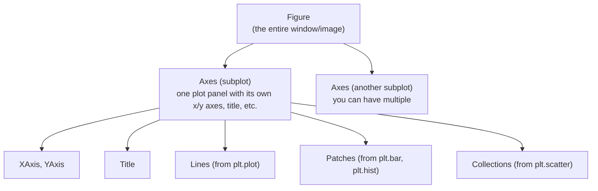

# Chapter 04: Matplotlib & Seaborn — Making Data Speak

> **"A picture is worth a thousand numbers. A good visualization reveals in seconds what a table of statistics hides for hours."**

---

## Table of Contents
1. [Why Visualization?](#1-why-visualization)
2. [Matplotlib Architecture](#2-matplotlib-architecture)
3. [Line Plots](#3-line-plots)
4. [Scatter Plots](#4-scatter-plots)
5. [Bar Plots](#5-bar-plots)
6. [Histograms](#6-histograms)
7. [Box Plots](#7-box-plots)
8. [Subplots and Grids](#8-subplots-and-grids)
9. [Customization](#9-customization)
10. [Saving Figures](#10-saving-figures)
11. [Color Maps](#11-color-maps)
12. [Seaborn: Statistical Visualization](#12-seaborn-statistical-visualization)
13. [Distribution Plots](#13-distribution-plots)
14. [Categorical Plots](#14-categorical-plots)
15. [Relational Plots](#15-relational-plots)
16. [Heatmaps and Correlation](#16-heatmaps-and-correlation)
17. [Pairplot](#17-pairplot)
18. [ML-Specific Plots](#18-ml-specific-plots)
19. [Styles and Themes](#19-styles-and-themes)
20. [Mini Project: Titanic Visualization Dashboard](#20-mini-project-titanic-visualization-dashboard)
21. [Summary](#21-summary)
22. [Exercises](#22-exercises)

---

## 1. Why Visualization?

Before you train a single model, you must visualize your data. This is not optional.

Without visualization, you miss:
- **Outliers** that will corrupt your model
- **Skewed distributions** that need log-transformation
- **Class imbalance** that requires special handling
- **Correlations** between features and target
- **Data entry errors** (ages of 999, salaries of 0)
- **Bimodal distributions** that suggest the data has two populations

After training, visualization helps you:
- Understand how well your model learns (loss curves)
- Identify overfitting (train vs validation curves diverge)
- Communicate results to stakeholders (confusion matrices, ROC curves)

```
The Anscombe Quartet — why you MUST visualize:
────────────────────────────────────────────────────────────────────
Four datasets that have IDENTICAL summary statistics:
  Mean(x) = 9.0     Mean(y) = 7.5
  Var(x)  = 11.0    Var(y)  = 4.1
  Correlation = 0.816
  Linear regression: y = 3 + 0.5x

But when plotted, they look COMPLETELY different:
  Dataset 1: Normal linear relationship ← as expected
  Dataset 2: Curved/nonlinear pattern  ← linear model is wrong!
  Dataset 3: Perfect line with one outlier ← outlier problem
  Dataset 4: Vertical cluster + one outlier ← degenerate case

Without visualization, you'd fit a linear model to all four
and think you were done. You'd be wrong on 3 out of 4.
────────────────────────────────────────────────────────────────────
```

---

## 2. Matplotlib Architecture

Matplotlib has two interfaces. Understanding both prevents confusion.



### Interface 1: pyplot (state-based, simpler)

```python
import matplotlib.pyplot as plt
import numpy as np

x = np.linspace(0, 10, 100)
y = np.sin(x)

plt.figure(figsize=(8, 4))   # create figure
plt.plot(x, y)               # plot on current axes
plt.title("Sine Wave")
plt.xlabel("x")
plt.ylabel("sin(x)")
plt.grid(True)
plt.show()

# Pyplot tracks the "current figure" and "current axes"
# Each plt.XXX() call acts on whatever is current
```

### Interface 2: Object-Oriented (recommended for serious work)

```python
import matplotlib.pyplot as plt
import numpy as np

x = np.linspace(0, 10, 100)

# Create figure and axes explicitly
fig, ax = plt.subplots(figsize=(8, 4))

# Everything is called on the ax object — no ambiguity
ax.plot(x, np.sin(x), label="sin(x)")
ax.plot(x, np.cos(x), label="cos(x)")
ax.set_title("Trigonometric Functions")
ax.set_xlabel("x")
ax.set_ylabel("value")
ax.legend()
ax.grid(True, alpha=0.3)

fig.tight_layout()
plt.show()

# The OOP interface is unambiguous — ax.set_XXX() not plt.XXX()
# Use this when creating subplots or embedding plots in applications
```

---

## 3. Line Plots

Line plots are ideal for data where order matters — time series, training curves, function visualization.

```python
import matplotlib.pyplot as plt
import numpy as np

# Simulating a training run
epochs = np.arange(1, 101)
train_loss = 1.0 * np.exp(-epochs / 30) + 0.05 + np.random.normal(0, 0.02, 100)
val_loss   = 1.0 * np.exp(-epochs / 25) + 0.12 + np.random.normal(0, 0.03, 100)
train_acc  = 1 - np.exp(-epochs / 25) - 0.05 + np.random.normal(0, 0.01, 100)
val_acc    = 1 - np.exp(-epochs / 30) - 0.1  + np.random.normal(0, 0.015, 100)

fig, axes = plt.subplots(1, 2, figsize=(14, 5))

# ── Loss plot ─────────────────────────────────────────────────────────────
ax = axes[0]
ax.plot(epochs, train_loss,
        color='#2196F3',          # blue
        linewidth=2,
        linestyle='-',            # solid line
        label='Train Loss',
        marker=None)              # no markers (too many points)

ax.plot(epochs, val_loss,
        color='#F44336',          # red
        linewidth=2,
        linestyle='--',           # dashed
        label='Val Loss',
        alpha=0.9)

ax.set_title("Training and Validation Loss", fontsize=14, fontweight='bold')
ax.set_xlabel("Epoch")
ax.set_ylabel("Loss")
ax.legend()
ax.grid(True, alpha=0.3)
ax.set_ylim(bottom=0)

# Annotate the minimum validation loss
best_epoch = np.argmin(val_loss)
ax.axvline(best_epoch + 1, color='gray', linestyle=':', alpha=0.7)
ax.annotate(f"Best epoch: {best_epoch+1}",
            xy=(best_epoch + 1, val_loss[best_epoch]),
            xytext=(best_epoch + 15, val_loss[best_epoch] + 0.1),
            arrowprops=dict(arrowstyle='->', color='gray'),
            color='gray', fontsize=9)

# ── Accuracy plot ─────────────────────────────────────────────────────────
ax = axes[1]
ax.plot(epochs, np.clip(train_acc, 0, 1), color='#4CAF50', lw=2, label='Train Acc')
ax.plot(epochs, np.clip(val_acc, 0, 1),   color='#FF9800', lw=2, ls='--', label='Val Acc')
ax.set_title("Training and Validation Accuracy", fontsize=14, fontweight='bold')
ax.set_xlabel("Epoch")
ax.set_ylabel("Accuracy")
ax.legend()
ax.grid(True, alpha=0.3)
ax.set_ylim(0, 1.05)

fig.suptitle("Model Training History", fontsize=16, fontweight='bold', y=1.02)
fig.tight_layout()
plt.show()
```

### Line Style Reference

```
linestyle options:
  '-'    solid line       ─────────────
  '--'   dashed           - - - - - - -
  '-.'   dash-dot         -·-·-·-·-·-·
  ':'    dotted           ···············

marker options:
  'o'   circle    '.'   point    's'   square
  '^'   triangle  'D'   diamond  '*'   star
  '+'   plus      'x'   cross    '|'   vline
```

---

## 4. Scatter Plots

Scatter plots reveal relationships between two continuous variables. In ML, you use them to visualize feature relationships, cluster results, and 2D embeddings (t-SNE, UMAP).

```python
import matplotlib.pyplot as plt
import numpy as np

# Simulate multi-class feature data
np.random.seed(42)
n = 150   # 50 per class

# Class 0 (blue)
X0 = np.random.randn(50, 2) + [0, 0]
# Class 1 (orange)
X1 = np.random.randn(50, 2) + [3, 3]
# Class 2 (green)
X2 = np.random.randn(50, 2) + [0, 4]

X = np.vstack([X0, X1, X2])
y = np.array([0]*50 + [1]*50 + [2]*50)

fig, axes = plt.subplots(1, 2, figsize=(14, 5))

# ── Plot 1: Scatter by class ──────────────────────────────────────────────
ax = axes[0]
colors = ['#2196F3', '#FF9800', '#4CAF50']
class_names = ['Class 0', 'Class 1', 'Class 2']
markers = ['o', 's', '^']

for cls in range(3):
    mask = y == cls
    ax.scatter(X[mask, 0], X[mask, 1],
               c=colors[cls],
               marker=markers[cls],
               s=60,             # size of markers
               alpha=0.7,        # transparency (0=transparent, 1=solid)
               edgecolors='white',  # white border around each point
               linewidths=0.5,
               label=class_names[cls])

ax.set_title("Multi-Class Feature Scatter", fontsize=14)
ax.set_xlabel("Feature 1")
ax.set_ylabel("Feature 2")
ax.legend()
ax.grid(True, alpha=0.2)

# ── Plot 2: Color by continuous value ────────────────────────────────────
ax = axes[1]
continuous_score = X[:, 0] * 0.5 + X[:, 1] * 0.3 + np.random.randn(n) * 0.5

sc = ax.scatter(X[:, 0], X[:, 1],
                c=continuous_score,    # color by numeric value
                cmap='viridis',        # color map
                s=60,
                alpha=0.7)

plt.colorbar(sc, ax=ax, label='Score')   # add color bar legend
ax.set_title("Scatter Colored by Score", fontsize=14)
ax.set_xlabel("Feature 1")
ax.set_ylabel("Feature 2")

fig.tight_layout()
plt.show()
```

---

## 5. Bar Plots

Bar plots are best for comparing discrete categories — feature importance, class counts, model comparison.

```python
import matplotlib.pyplot as plt
import numpy as np

fig, axes = plt.subplots(1, 3, figsize=(18, 5))

# ── Vertical bar: feature importance ──────────────────────────────────────
ax = axes[0]
features = ['Age', 'Income', 'Education', 'YrsExp', 'City', 'MaritalStatus']
importance = [0.32, 0.28, 0.15, 0.12, 0.08, 0.05]

# Sort by importance
sorted_idx = np.argsort(importance)[::-1]
features_sorted  = [features[i] for i in sorted_idx]
importance_sorted = [importance[i] for i in sorted_idx]

colors = ['#FF5252' if imp > 0.15 else '#90CAF9' for imp in importance_sorted]
bars = ax.bar(features_sorted, importance_sorted, color=colors, edgecolor='white')

# Add value labels on top of bars
for bar, imp in zip(bars, importance_sorted):
    ax.text(bar.get_x() + bar.get_width()/2, bar.get_height() + 0.005,
            f'{imp:.2f}', ha='center', va='bottom', fontsize=10)

ax.set_title("Feature Importance", fontsize=13, fontweight='bold')
ax.set_ylabel("Importance Score")
ax.set_ylim(0, max(importance_sorted) * 1.15)
ax.tick_params(axis='x', rotation=30)

# ── Horizontal bar: model comparison ──────────────────────────────────────
ax = axes[1]
models  = ['Logistic Reg', 'Random Forest', 'SVM', 'XGBoost', 'Neural Net']
accuracy = [0.78, 0.87, 0.82, 0.90, 0.89]
colors_models = ['#4CAF50' if acc == max(accuracy) else '#90CAF9' for acc in accuracy]

ax.barh(models, accuracy, color=colors_models, edgecolor='white', height=0.6)
ax.set_title("Model Accuracy Comparison", fontsize=13, fontweight='bold')
ax.set_xlabel("Accuracy")
ax.set_xlim(0.7, 0.95)
ax.axvline(0.80, color='gray', linestyle=':', alpha=0.7, label='Baseline')

for i, (model, acc) in enumerate(zip(models, accuracy)):
    ax.text(acc + 0.002, i, f'{acc:.2%}', va='center', fontsize=10)

# ── Grouped bar: metrics by model ─────────────────────────────────────────
ax = axes[2]
metrics = {'Precision': [0.79, 0.88, 0.83], 'Recall': [0.75, 0.86, 0.80], 'F1': [0.77, 0.87, 0.81]}
model_names_short = ['Log Reg', 'RF', 'SVM']

x = np.arange(len(model_names_short))
width = 0.25
colors_m = ['#2196F3', '#4CAF50', '#FF9800']

for i, (metric, values) in enumerate(metrics.items()):
    bars = ax.bar(x + i*width - width, values, width, label=metric,
                  color=colors_m[i], alpha=0.85, edgecolor='white')

ax.set_title("Precision/Recall/F1 by Model", fontsize=13, fontweight='bold')
ax.set_xticks(x)
ax.set_xticklabels(model_names_short)
ax.set_ylabel("Score")
ax.set_ylim(0.7, 0.95)
ax.legend()

fig.tight_layout()
plt.show()
```

---

## 6. Histograms

Histograms show the distribution of a single continuous variable. In ML, you use them to check for skewness, bimodality, and to determine if you need to transform features.

```python
import matplotlib.pyplot as plt
import numpy as np

np.random.seed(42)
# Simulate: income is log-normal (right-skewed), age is normal
income = np.random.lognormal(mean=10.5, sigma=0.8, size=1000)
age    = np.random.normal(35, 12, 1000).clip(18, 80)

fig, axes = plt.subplots(2, 3, figsize=(16, 10))

# ── 1. Raw distribution ────────────────────────────────────────────────────
ax = axes[0, 0]
ax.hist(income, bins=50, color='#2196F3', edgecolor='white', alpha=0.7)
ax.set_title("Income (Raw — right-skewed)")
ax.set_xlabel("Income ($)")
ax.set_ylabel("Frequency")

# ── 2. After log transform ────────────────────────────────────────────────
ax = axes[0, 1]
ax.hist(np.log1p(income), bins=50, color='#4CAF50', edgecolor='white', alpha=0.7)
ax.set_title("Income (Log-transformed — approx normal)")
ax.set_xlabel("log(1 + Income)")
ax.set_ylabel("Frequency")

# ── 3. Density (normalized histogram) ────────────────────────────────────
ax = axes[0, 2]
ax.hist(age, bins=30, density=True, color='#FF9800', edgecolor='white', alpha=0.7)
# Overlay KDE (kernel density estimate)
from scipy.stats import gaussian_kde
xs = np.linspace(age.min(), age.max(), 200)
kde = gaussian_kde(age)
ax.plot(xs, kde(xs), color='#BF360C', linewidth=2, label='KDE')
ax.set_title("Age Distribution (density + KDE)")
ax.set_xlabel("Age")
ax.set_ylabel("Density")
ax.legend()

# ── 4. Overlapping histograms by group ────────────────────────────────────
ax = axes[1, 0]
survived_ages = np.random.normal(28, 10, 400).clip(1, 80)
not_survived_ages = np.random.normal(33, 13, 600).clip(1, 80)

ax.hist(survived_ages,     bins=30, alpha=0.6, color='#4CAF50',
        edgecolor='white', label='Survived', density=True)
ax.hist(not_survived_ages, bins=30, alpha=0.6, color='#F44336',
        edgecolor='white', label='Not Survived', density=True)
ax.set_title("Age by Survival Status")
ax.set_xlabel("Age")
ax.set_ylabel("Density")
ax.legend()

# ── 5. Stacked histogram ──────────────────────────────────────────────────
ax = axes[1, 1]
data_classes = [np.random.normal(i*2, 1, 200) for i in range(4)]
labels = [f'Class {i}' for i in range(4)]
colors_h = ['#E91E63', '#2196F3', '#4CAF50', '#FF9800']
ax.hist(data_classes, bins=30, stacked=True, color=colors_h,
        label=labels, edgecolor='white', alpha=0.8)
ax.set_title("Stacked Class Distributions")
ax.legend()

# ── 6. 2D histogram (heatmap) ─────────────────────────────────────────────
ax = axes[1, 2]
x = np.random.randn(5000)
y = x * 0.7 + np.random.randn(5000) * 0.5
h = ax.hist2d(x, y, bins=50, cmap='viridis')
plt.colorbar(h[3], ax=ax, label='Count')
ax.set_title("2D Histogram (Joint Distribution)")
ax.set_xlabel("X")
ax.set_ylabel("Y")

fig.tight_layout()
plt.show()
```

---

## 7. Box Plots

Box plots summarize a distribution in 5 numbers and clearly show outliers.

```
Box plot anatomy:
─────────────────────────────────────────────────────────────
                 │← whisker (1.5 × IQR above Q3)
                 ┤   ← maximum (or whisker)
               ┌─┴─┐
        Q3 ──► │   │
               │   │  ← IQR (interquartile range) = Q3 - Q1
     median ──►│───│
               │   │
        Q1 ──► │   │
               └─┬─┘
                 ┤   ← minimum (or whisker)
                 │← whisker (1.5 × IQR below Q1)

               ○   ← outlier (beyond whisker)
─────────────────────────────────────────────────────────────
Outlier: any point beyond 1.5 × IQR from Q1 or Q3
```

```python
import matplotlib.pyplot as plt
import numpy as np

np.random.seed(42)
n = 200

# Salary data by department (with some outliers)
dept_salaries = {
    "Engineering": np.concatenate([np.random.normal(90000, 15000, 180),
                                   [200000, 210000, 195000]]),   # some superstars
    "Marketing":   np.random.normal(65000, 12000, 200),
    "Sales":       np.concatenate([np.random.normal(55000, 10000, 190),
                                   [20000, 22000, 18000]]),      # some very low
    "HR":          np.random.normal(58000, 8000, 200),
}

fig, axes = plt.subplots(1, 2, figsize=(14, 6))

# ── Standard box plot ─────────────────────────────────────────────────────
ax = axes[0]
data = list(dept_salaries.values())
labels = list(dept_salaries.keys())

bp = ax.boxplot(data, labels=labels, patch_artist=True,
                notch=False,    # notched boxes show 95% CI of median
                vert=True,      # vertical boxes
                widths=0.5)

# Colorize
colors = ['#2196F3', '#FF9800', '#4CAF50', '#E91E63']
for patch, color in zip(bp['boxes'], colors):
    patch.set_facecolor(color)
    patch.set_alpha(0.7)
for median in bp['medians']:
    median.set_color('black')
    median.set_linewidth(2)
for flier in bp['fliers']:
    flier.set(marker='o', markersize=5, alpha=0.5, color='red')

ax.set_title("Salary Distribution by Department", fontsize=14)
ax.set_ylabel("Annual Salary ($)")
ax.yaxis.set_major_formatter(plt.FuncFormatter(lambda x, _: f"${x/1000:.0f}K"))
ax.grid(axis='y', alpha=0.3)

# ── Box with scatter overlay (strip plot style) ───────────────────────────
ax = axes[1]
for i, (dept, salaries) in enumerate(dept_salaries.items(), 1):
    # Box
    ax.boxplot(salaries, positions=[i], patch_artist=True,
               boxprops=dict(facecolor=colors[i-1], alpha=0.5),
               medianprops=dict(color='black', lw=2),
               widths=0.35)
    # Scatter overlay (jitter to avoid overplotting)
    jitter = np.random.uniform(-0.1, 0.1, len(salaries))
    ax.scatter(np.full_like(salaries, i) + jitter, salaries,
               alpha=0.2, s=15, color=colors[i-1])

ax.set_xticks(range(1, len(dept_salaries)+1))
ax.set_xticklabels(labels)
ax.set_title("Salary: Box Plot + Individual Points", fontsize=14)
ax.set_ylabel("Annual Salary ($)")
ax.yaxis.set_major_formatter(plt.FuncFormatter(lambda x, _: f"${x/1000:.0f}K"))

fig.tight_layout()
plt.show()
```

---

## 8. Subplots and Grids

```python
import matplotlib.pyplot as plt
import numpy as np

# ── plt.subplots() — the standard way ─────────────────────────────────────
fig, axes = plt.subplots(nrows=2, ncols=3, figsize=(16, 10))
# axes is now a 2D numpy array: axes[row, col]

x = np.linspace(0, 10, 100)
functions = [np.sin, np.cos, np.tan,
             np.exp, lambda x: np.log(x+1), lambda x: x**2]
names = ['sin(x)', 'cos(x)', 'tan(x)', 'exp(x)', 'log(1+x)', 'x²']

for idx, (func, name) in enumerate(zip(functions, names)):
    row, col = divmod(idx, 3)
    ax = axes[row, col]
    ax.plot(x, np.clip(func(x), -10, 10), linewidth=2)
    ax.set_title(name)
    ax.grid(True, alpha=0.3)

fig.suptitle("Common Mathematical Functions", fontsize=16, fontweight='bold')
fig.tight_layout()
plt.show()

# ── Shared axes (useful for comparing same-scale plots) ────────────────────
fig, axes = plt.subplots(2, 1, figsize=(10, 8), sharex=True)
epochs = np.arange(100)
axes[0].plot(epochs, np.exp(-epochs/30) + np.random.randn(100)*0.02)
axes[0].set_ylabel("Loss")
axes[0].set_title("Training Curves (shared x-axis)")
axes[1].plot(epochs, 1 - np.exp(-epochs/25), color='green')
axes[1].set_ylabel("Accuracy")
axes[1].set_xlabel("Epoch")
plt.tight_layout()
plt.show()

# ── GridSpec — custom layout ──────────────────────────────────────────────
import matplotlib.gridspec as gridspec
fig = plt.figure(figsize=(12, 8))
gs = gridspec.GridSpec(2, 3)

# Big plot on the left
ax_big  = fig.add_subplot(gs[:, :2])    # all rows, first 2 columns
ax_top  = fig.add_subplot(gs[0, 2])     # top-right
ax_bot  = fig.add_subplot(gs[1, 2])     # bottom-right

ax_big.scatter(np.random.randn(200), np.random.randn(200), alpha=0.5)
ax_big.set_title("Main Plot (2 columns wide)")
ax_top.hist(np.random.randn(200), bins=20)
ax_top.set_title("Distribution 1")
ax_bot.plot(np.cumsum(np.random.randn(50)))
ax_bot.set_title("Cumulative Sum")

fig.tight_layout()
plt.show()
```

---

## 9. Customization

```python
import matplotlib.pyplot as plt
import numpy as np

fig, ax = plt.subplots(figsize=(10, 6))

x = np.linspace(0, 4*np.pi, 300)
ax.plot(x, np.sin(x), label='sin(x)', color='steelblue', lw=2)
ax.plot(x, np.cos(x), label='cos(x)', color='tomato', lw=2, linestyle='--')

# ── Title and labels ────────────────────────────────────────────────────
ax.set_title("Customization Reference", fontsize=18, fontweight='bold', pad=15)
ax.set_xlabel("Angle (radians)", fontsize=13)
ax.set_ylabel("Value", fontsize=13)

# ── Ticks ────────────────────────────────────────────────────────────────
ax.set_xticks([0, np.pi/2, np.pi, 3*np.pi/2, 2*np.pi, 5*np.pi/2, 3*np.pi, 4*np.pi])
ax.set_xticklabels(['0', 'π/2', 'π', '3π/2', '2π', '5π/2', '3π', '4π'])
ax.tick_params(axis='both', labelsize=11)

# ── Axes limits ──────────────────────────────────────────────────────────
ax.set_xlim(0, 4*np.pi)
ax.set_ylim(-1.3, 1.3)

# ── Grid ─────────────────────────────────────────────────────────────────
ax.grid(True, which='major', linestyle='--', alpha=0.5, color='gray')
ax.grid(True, which='minor', linestyle=':', alpha=0.3)
ax.minorticks_on()

# ── Legend ───────────────────────────────────────────────────────────────
ax.legend(loc='upper right', fontsize=12, framealpha=0.9, shadow=True)

# ── Horizontal/vertical reference lines ──────────────────────────────────
ax.axhline(y=0, color='black', linewidth=0.8, linestyle='-')
ax.axvline(x=np.pi, color='gray', linewidth=1, linestyle=':', alpha=0.7)

# ── Text annotations ─────────────────────────────────────────────────────
ax.annotate(
    "Max: sin(π/2) = 1",
    xy=(np.pi/2, 1),              # point to annotate
    xytext=(np.pi/2 + 1, 1.15),   # text position
    arrowprops=dict(arrowstyle='->', color='black', lw=1.5),
    fontsize=11,
    color='steelblue'
)

# ── Spine customization ───────────────────────────────────────────────────
ax.spines['top'].set_visible(False)
ax.spines['right'].set_visible(False)

plt.tight_layout()
plt.show()
```

---

## 10. Saving Figures

```python
import matplotlib.pyplot as plt

fig, ax = plt.subplots(figsize=(8, 5))
ax.plot([1, 2, 3], [1, 4, 9])

# ── Common formats ─────────────────────────────────────────────────────────
fig.savefig("plot.png",
            dpi=150,                # dots per inch (screen: 72, print: 300)
            bbox_inches='tight',    # include all elements, cut tight margins
            facecolor='white',      # white background (default is transparent!)
            )

fig.savefig("plot.pdf",             # PDF: vector, scales perfectly
            bbox_inches='tight')

fig.savefig("plot.svg",             # SVG: vector, editable in Illustrator
            bbox_inches='tight')

# ── For presentations: 200+ DPI ───────────────────────────────────────────
fig.savefig("presentation_plot.png", dpi=200, bbox_inches='tight')

# ── For papers: PDF or 300 DPI PNG ────────────────────────────────────────
fig.savefig("paper_figure.pdf", bbox_inches='tight')

# ── In Jupyter: usually you just plt.show() ───────────────────────────────
# But you can also save AND show:
plt.savefig("output.png", dpi=150, bbox_inches='tight')
plt.show()
```

---

## 11. Color Maps

Choosing the right colormap is more important than most beginners realize. The wrong colormap can make patterns invisible or suggest patterns that don't exist.

```python
import matplotlib.pyplot as plt
import numpy as np

fig, axes = plt.subplots(1, 4, figsize=(20, 3))

data = np.random.randn(20, 20)
data2 = np.random.rand(20, 20)
data_diverging = data  # has negative and positive values

# ── Sequential — for magnitude/one-direction data ─────────────────────────
axes[0].imshow(data2, cmap='viridis', aspect='auto')
axes[0].set_title("'viridis'\n(sequential — for 0 to max values)\nMost accessible colormap")

axes[1].imshow(data2, cmap='plasma', aspect='auto')
axes[1].set_title("'plasma'\n(sequential, high contrast)")

# ── Diverging — for data with a meaningful center ─────────────────────────
axes[2].imshow(data_diverging, cmap='coolwarm', aspect='auto')
axes[2].set_title("'coolwarm'\n(diverging — negative/zero/positive)\nGood for correlation matrices")

axes[3].imshow(data_diverging, cmap='RdYlGn', aspect='auto')
axes[3].set_title("'RdYlGn'\n(diverging, red-yellow-green)\nGood for performance metrics)

fig.suptitle("Choosing the Right Colormap", fontsize=14)
plt.tight_layout()
plt.show()
```

```
Colormap Guide for ML:
────────────────────────────────────────────────────────────────────
DATA TYPE                   RECOMMENDED        AVOID
────────────────────────────────────────────────────────────────────
Probabilities [0, 1]        viridis, plasma    jet (perceptually wrong)
Positive magnitudes [0, n]  viridis, magma     rainbow
Centered data [-n, +n]      coolwarm, RdBu     viridis (won't show 0)
Correlation matrices        coolwarm, RdYlGn   plasma
Categorical classes         tab10, Set2        sequential maps
Binary True/False           PiYG, RdYlGn       sequential
────────────────────────────────────────────────────────────────────
Why not 'jet'? It maps equal data differences to unequal perceptual
differences — your brain sees false patterns.
```

---

## 12. Seaborn: Statistical Visualization

Seaborn is built on top of Matplotlib but provides high-level functions for statistical visualization. You write much less code for much more informative plots.

```python
import seaborn as sns
import matplotlib.pyplot as plt
import pandas as pd
import numpy as np

# Set style globally (do this once at the top of your notebook)
sns.set_theme(style="whitegrid", palette="husl", font_scale=1.1)

# Load a built-in dataset
tips = sns.load_dataset("tips")
print(tips.head())
print(tips.dtypes)
```

---

## 13. Distribution Plots

```python
import seaborn as sns
import matplotlib.pyplot as plt
import numpy as np
import pandas as pd

sns.set_theme(style="whitegrid")

fig, axes = plt.subplots(2, 3, figsize=(18, 11))

np.random.seed(42)
data = pd.DataFrame({
    "score_A": np.random.normal(70, 10, 500),
    "score_B": np.random.normal(75, 12, 500),
    "group":   np.random.choice(["Train", "Test", "Val"], 500),
})

# ── sns.histplot — histogram with optional KDE ────────────────────────────
ax = axes[0, 0]
sns.histplot(data=data, x="score_A", kde=True, bins=30, ax=ax,
             color='steelblue', alpha=0.7)
ax.set_title("histplot: Histogram + KDE")

# ── Overlapping distributions ─────────────────────────────────────────────
ax = axes[0, 1]
sns.histplot(data=data, x="score_A", hue="group", kde=True, bins=25,
             ax=ax, alpha=0.5)
ax.set_title("histplot: Distributions by Group")

# ── sns.kdeplot — smooth density estimate ─────────────────────────────────
ax = axes[0, 2]
sns.kdeplot(data=data, x="score_A", ax=ax, fill=True, color='orange', alpha=0.5, label='A')
sns.kdeplot(data=data, x="score_B", ax=ax, fill=True, color='green',  alpha=0.5, label='B')
ax.set_title("kdeplot: Density Comparison")
ax.legend()

# ── 2D KDE — joint density ────────────────────────────────────────────────
ax = axes[1, 0]
data["score_C"] = data["score_A"] * 0.6 + np.random.randn(500) * 5
sns.kdeplot(data=data, x="score_A", y="score_C", fill=True, cmap="Blues", ax=ax, levels=10)
ax.set_title("kdeplot: 2D Joint Density")

# ── ecdf — empirical cumulative distribution function ────────────────────
ax = axes[1, 1]
sns.ecdfplot(data=data, x="score_A", hue="group", ax=ax)
ax.set_title("ecdfplot: Empirical CDF by Group")
ax.axhline(0.5, color='gray', ls='--', alpha=0.5, label='Median')

# ── rugplot — show individual data points ─────────────────────────────────
ax = axes[1, 2]
sns.histplot(data=data["score_A"][:50], bins=20, ax=ax, color='steelblue', alpha=0.6)
sns.rugplot(data=data["score_A"][:50], ax=ax, color='red', height=0.05)
ax.set_title("histplot + rugplot (shows individual points)")

fig.suptitle("Distribution Visualizations (Seaborn)", fontsize=16, fontweight='bold')
fig.tight_layout()
plt.show()
```

---

## 14. Categorical Plots

```python
import seaborn as sns
import matplotlib.pyplot as plt

sns.set_theme(style="whitegrid")
tips = sns.load_dataset("tips")

fig, axes = plt.subplots(2, 3, figsize=(18, 11))

# ── sns.boxplot ────────────────────────────────────────────────────────────
ax = axes[0, 0]
sns.boxplot(data=tips, x="day", y="total_bill", hue="sex", ax=ax,
            palette={"Male": "#2196F3", "Female": "#E91E63"})
ax.set_title("boxplot: Bill by Day and Gender")

# ── sns.violinplot — combines box plot + KDE ──────────────────────────────
ax = axes[0, 1]
sns.violinplot(data=tips, x="day", y="total_bill", hue="time",
               split=True, ax=ax, palette="husl", inner="quart")
ax.set_title("violinplot: Lunch vs Dinner (split)")

# ── sns.stripplot — individual points ────────────────────────────────────
ax = axes[0, 2]
sns.stripplot(data=tips, x="day", y="total_bill", hue="sex",
              dodge=True, alpha=0.5, jitter=True, ax=ax, palette="Set2")
ax.set_title("stripplot: Individual Data Points")

# ── sns.countplot — frequency bar chart ──────────────────────────────────
ax = axes[1, 0]
sns.countplot(data=tips, x="day", hue="sex", ax=ax, palette="Set2",
              order=["Thur", "Fri", "Sat", "Sun"])
ax.set_title("countplot: Customer Count by Day")
ax.bar_label(ax.containers[0], fontsize=10)
ax.bar_label(ax.containers[1], fontsize=10)

# ── sns.barplot — mean + confidence interval ──────────────────────────────
ax = axes[1, 1]
sns.barplot(data=tips, x="day", y="tip", hue="sex", ax=ax, palette="Set1",
            errorbar="sd", capsize=0.1)
ax.set_title("barplot: Mean Tip ± SD by Day")

# ── sns.pointplot — connected means ──────────────────────────────────────
ax = axes[1, 2]
sns.pointplot(data=tips, x="day", y="total_bill", hue="sex", ax=ax,
              dodge=0.2, linestyles='--', markers=['o', 's'],
              palette={"Male": "#2196F3", "Female": "#E91E63"})
ax.set_title("pointplot: Mean ± CI Connected")

fig.suptitle("Categorical Visualizations (Seaborn)", fontsize=16, fontweight='bold')
fig.tight_layout()
plt.show()
```

---

## 15. Relational Plots

```python
import seaborn as sns
import matplotlib.pyplot as plt

sns.set_theme(style="ticks")
tips = sns.load_dataset("tips")

fig, axes = plt.subplots(1, 3, figsize=(18, 6))

# ── sns.scatterplot ───────────────────────────────────────────────────────
ax = axes[0]
sns.scatterplot(data=tips, x="total_bill", y="tip", hue="time", size="size",
                sizes=(30, 200), alpha=0.7, palette="Set1", ax=ax)
ax.set_title("scatterplot: Bill vs Tip\n(color=time, size=party size)")

# ── sns.regplot — scatter + regression line ───────────────────────────────
ax = axes[1]
sns.regplot(data=tips, x="total_bill", y="tip", ax=ax,
            scatter_kws={"alpha": 0.5, "color": "steelblue"},
            line_kws={"color": "red", "linewidth": 2},
            ci=95)   # 95% confidence interval shaded
ax.set_title("regplot: Scatter + Regression Line\n(shaded = 95% CI)")

# ── sns.residplot — residuals ─────────────────────────────────────────────
ax = axes[2]
sns.residplot(data=tips, x="total_bill", y="tip", ax=ax,
              scatter_kws={"alpha": 0.5, "color": "steelblue"},
              lowess=True, line_kws={"color": "red"})
ax.axhline(0, color='black', linewidth=0.8)
ax.set_title("residplot: Regression Residuals\n(should be random around 0)")

fig.tight_layout()
plt.show()
```

---

## 16. Heatmaps and Correlation

Heatmaps are one of the most used visualizations in ML EDA. The correlation matrix heatmap instantly shows which features are related.

```python
import seaborn as sns
import matplotlib.pyplot as plt
import pandas as pd
import numpy as np

sns.set_theme(style="white")

# Simulate a dataset with correlations
np.random.seed(42)
n = 500
age    = np.random.normal(35, 10, n)
income = age * 800 + np.random.randn(n) * 5000 + 10000
educ   = np.random.normal(14, 3, n)
score  = 0.3*age + 0.0001*income + 0.5*educ + np.random.randn(n)*2

df = pd.DataFrame({
    "Age": age,
    "Income": income,
    "Education": educ,
    "Score": score,
    "Random1": np.random.randn(n),   # deliberately uncorrelated
    "Random2": np.random.randn(n),
})

fig, axes = plt.subplots(1, 2, figsize=(16, 6))

# ── Full correlation matrix ────────────────────────────────────────────────
ax = axes[0]
corr = df.corr()
mask = np.triu(np.ones_like(corr, dtype=bool))   # mask upper triangle (redundant)

sns.heatmap(
    corr,
    mask=mask,
    annot=True,               # show correlation values in each cell
    fmt=".2f",                # format: 2 decimal places
    cmap="coolwarm",          # diverging: red=positive, blue=negative
    vmin=-1, vmax=1,          # fix color scale
    center=0,                 # 0 correlation = white
    square=True,              # square cells
    linewidths=0.5,           # grid lines
    cbar_kws={"shrink": 0.8},
    ax=ax
)
ax.set_title("Correlation Matrix (lower triangle)\nred = positive, blue = negative",
             fontsize=13)

# ── Correlation with target only ───────────────────────────────────────────
ax = axes[1]
target_corr = df.corr()[["Score"]].drop("Score")
target_corr = target_corr.sort_values("Score", ascending=False)

sns.heatmap(
    target_corr,
    annot=True,
    fmt=".3f",
    cmap="RdYlGn",
    vmin=-1, vmax=1,
    center=0,
    linewidths=0.5,
    ax=ax
)
ax.set_title("Feature Correlation with Target\n(sorted by strength)", fontsize=13)
ax.set_ylabel("Feature")
ax.set_yticklabels(ax.get_yticklabels(), rotation=0)

fig.tight_layout()
plt.show()
```

---

## 17. Pairplot

Pairplot creates a grid of scatter plots and distribution plots for all pairs of features — ideal for initial EDA on small to medium datasets.

```python
import seaborn as sns
import matplotlib.pyplot as plt

sns.set_theme(style="ticks")
iris = sns.load_dataset("iris")

# ── Basic pairplot ─────────────────────────────────────────────────────────
g = sns.pairplot(
    iris,
    hue="species",          # color by class
    palette={"setosa": "#E91E63", "versicolor": "#2196F3", "virginica": "#4CAF50"},
    diag_kind="kde",        # distribution on diagonal (hist or kde)
    plot_kws={"alpha": 0.6, "s": 40},   # scatter plot settings
    diag_kws={"fill": True, "alpha": 0.5}
)
g.fig.suptitle("Iris: Pairwise Feature Relationships", y=1.02, fontsize=14)
plt.show()

# ── Pairplot with regression ──────────────────────────────────────────────
g2 = sns.pairplot(iris, kind="reg", diag_kind="kde", hue="species",
                  plot_kws={"scatter_kws": {"alpha": 0.3}, "line_kws": {"lw": 2}})
g2.fig.suptitle("Pairplot with Regression Lines", y=1.02)
plt.show()
```

---

## 18. ML-Specific Plots

### Confusion Matrix

```python
import matplotlib.pyplot as plt
import seaborn as sns
import numpy as np

def plot_confusion_matrix(cm, class_names, title="Confusion Matrix"):
    """
    Plot a confusion matrix as a heatmap.
    
    cm: square numpy array, cm[i,j] = count predicted class j when true class is i
    """
    fig, ax = plt.subplots(figsize=(len(class_names)*1.5 + 2, len(class_names)*1.5 + 1))
    
    # Normalize to percentages
    cm_norm = cm.astype('float') / cm.sum(axis=1, keepdims=True)
    
    # Plot raw counts
    sns.heatmap(cm, annot=False, cmap="Blues", ax=ax,
                xticklabels=class_names, yticklabels=class_names,
                linewidths=0.5, cbar=False)
    
    # Custom annotations: percentage (bold) + count
    for i in range(cm.shape[0]):
        for j in range(cm.shape[1]):
            pct = cm_norm[i, j]
            count = cm[i, j]
            color = 'white' if pct > 0.6 else 'black'
            ax.text(j + 0.5, i + 0.35, f"{pct:.1%}",
                   ha='center', va='center', fontsize=13, fontweight='bold', color=color)
            ax.text(j + 0.5, i + 0.65, f"(n={count})",
                   ha='center', va='center', fontsize=9, color=color)
    
    ax.set_xlabel("Predicted Label", fontsize=13)
    ax.set_ylabel("True Label", fontsize=13)
    ax.set_title(title, fontsize=14, fontweight='bold')
    plt.tight_layout()
    return fig

# Example
cm = np.array([[45,  3,  2],
               [ 2, 38,  5],
               [ 1,  4, 40]])
fig = plot_confusion_matrix(cm, ["Cat", "Dog", "Bird"])
plt.show()
```

### ROC Curve

```python
import matplotlib.pyplot as plt
import numpy as np

def plot_roc_curve(y_true_list, y_score_list, labels, title="ROC Curve"):
    """Plot ROC curves for multiple models."""
    from sklearn.metrics import roc_curve, auc
    
    fig, ax = plt.subplots(figsize=(8, 7))
    
    colors = ['#2196F3', '#F44336', '#4CAF50', '#FF9800', '#9C27B0']
    
    for i, (y_true, y_score, label) in enumerate(zip(y_true_list, y_score_list, labels)):
        fpr, tpr, _ = roc_curve(y_true, y_score)
        roc_auc = auc(fpr, tpr)
        ax.plot(fpr, tpr, color=colors[i % len(colors)], lw=2,
                label=f"{label} (AUC = {roc_auc:.3f})")
    
    # Random classifier baseline
    ax.plot([0, 1], [0, 1], 'k--', lw=1, alpha=0.5, label='Random (AUC = 0.500)')
    
    ax.set_xlim([0.0, 1.0])
    ax.set_ylim([0.0, 1.05])
    ax.set_xlabel("False Positive Rate (1 - Specificity)", fontsize=12)
    ax.set_ylabel("True Positive Rate (Sensitivity / Recall)", fontsize=12)
    ax.set_title(title, fontsize=14, fontweight='bold')
    ax.legend(loc="lower right", fontsize=11)
    ax.grid(True, alpha=0.3)
    plt.tight_layout()
    return fig

# Example usage (simulated)
np.random.seed(42)
y_true = np.random.randint(0, 2, 500)
# Three models with different skill levels
y_scores = [
    np.clip(y_true * 0.6 + np.random.randn(500) * 0.3, 0, 1),  # good
    np.clip(y_true * 0.4 + np.random.randn(500) * 0.4, 0, 1),  # ok
    np.random.rand(500)   # random
]
labels = ["Strong Model", "Weak Model", "Random Baseline"]
fig = plot_roc_curve([y_true]*3, y_scores, labels)
plt.show()
```

### Training Loss Curve with Overfitting Detection

```python
import matplotlib.pyplot as plt
import numpy as np

def plot_learning_curves(train_losses, val_losses, metric_name="Loss"):
    """
    Plot training curves with overfitting detection.
    Highlights the gap between train and val.
    """
    epochs = np.arange(1, len(train_losses) + 1)
    
    fig, ax = plt.subplots(figsize=(10, 6))
    
    ax.plot(epochs, train_losses, 'b-', lw=2, label='Training')
    ax.plot(epochs, val_losses,   'r-', lw=2, label='Validation')
    
    # Shade the gap (overfitting zone)
    ax.fill_between(epochs, train_losses, val_losses,
                    alpha=0.1, color='red', label='Overfit gap')
    
    # Mark best validation epoch
    best_epoch = np.argmin(val_losses)
    ax.axvline(best_epoch + 1, color='green', linestyle='--', alpha=0.7)
    ax.scatter([best_epoch + 1], [val_losses[best_epoch]],
               color='green', s=100, zorder=5, label=f'Best val (epoch {best_epoch+1})')
    
    ax.set_title(f"Learning Curves: {metric_name}", fontsize=14, fontweight='bold')
    ax.set_xlabel("Epoch")
    ax.set_ylabel(metric_name)
    ax.legend()
    ax.grid(True, alpha=0.3)
    plt.tight_layout()
    return fig

# Example
epochs = 100
train_losses = 1.0 * np.exp(-np.arange(epochs) / 20) + 0.05 + np.random.randn(epochs) * 0.01
val_losses   = 1.0 * np.exp(-np.arange(epochs) / 15) + 0.15 + np.random.randn(epochs) * 0.015
val_losses   = np.minimum.accumulate(val_losses + np.abs(np.arange(epochs) - 40) * 0.003)

fig = plot_learning_curves(train_losses, val_losses)
plt.show()
```

---

## 19. Styles and Themes

```python
import matplotlib.pyplot as plt
import seaborn as sns

# ── Matplotlib styles ──────────────────────────────────────────────────────
plt.style.use('seaborn-v0_8-whitegrid')    # seaborn style in matplotlib
plt.style.use('default')                    # reset to default
plt.style.use('dark_background')            # dark background (good for presentations)
plt.style.use('ggplot')                     # R's ggplot style

# Available styles:
print(plt.style.available)

# ── Seaborn themes ────────────────────────────────────────────────────────
sns.set_theme(style="darkgrid")    # dark grid background
sns.set_theme(style="whitegrid")   # white with grid (most common for ML)
sns.set_theme(style="white")       # clean white, no grid
sns.set_theme(style="ticks")       # ticks only, no grid

# ── Seaborn palettes ──────────────────────────────────────────────────────
sns.set_palette("Set2")     # colorblind-friendly categorical
sns.set_palette("husl")     # perceptually uniform, colorblind-friendly
sns.set_palette("coolwarm") # diverging

# ── Font scaling ──────────────────────────────────────────────────────────
sns.set_theme(style="whitegrid", font_scale=1.2)   # increase all fonts by 20%

# ── Context (figure size presets) ─────────────────────────────────────────
sns.set_context("paper")         # small fonts, for publications
sns.set_context("notebook")      # medium (default for Jupyter)
sns.set_context("talk")          # larger, for presentations
sns.set_context("poster")        # largest, for posters

# ── Reset everything ──────────────────────────────────────────────────────
sns.reset_defaults()
```

---

## 20. Mini Project: Titanic Visualization Dashboard

```python
import matplotlib.pyplot as plt
import matplotlib.gridspec as gridspec
import seaborn as sns
import pandas as pd
import numpy as np

sns.set_theme(style="whitegrid", font_scale=1.0)
np.random.seed(42)

# Generate Titanic-like dataset
n = 891
pclass = np.random.choice([1, 2, 3], n, p=[0.24, 0.21, 0.55])
sex    = np.random.choice(["male", "female"], n, p=[0.65, 0.35])
base_surv = np.where(sex == "female", 0.73, 0.19)
base_surv = np.where(pclass == 1, np.minimum(base_surv + 0.2, 0.95), base_surv)
base_surv = np.where(pclass == 3, np.maximum(base_surv - 0.15, 0.05), base_surv)
survived  = (np.random.random(n) < base_surv).astype(int)
age = np.where(np.random.random(n) > 0.2,
               np.clip(np.random.normal(29, 14, n), 1, 80), np.nan)
fare = np.where(pclass==1, np.abs(np.random.normal(80, 40, n)),
        np.where(pclass==2, np.abs(np.random.normal(20, 10, n)),
                             np.abs(np.random.normal(10, 8, n))))
embarked = np.random.choice(["Southampton", "Cherbourg", "Queenstown"],
                              n, p=[0.72, 0.19, 0.09])

df = pd.DataFrame({
    "Survived": survived, "Pclass": pclass, "Sex": sex,
    "Age": age, "Fare": fare, "Embarked": embarked,
    "Survived_str": np.where(survived == 1, "Survived", "Died")
})

# ─── Create dashboard ────────────────────────────────────────────────────
fig = plt.figure(figsize=(20, 22))
gs  = gridspec.GridSpec(4, 3, figure=fig, hspace=0.4, wspace=0.35)

SURVIVED_PALETTE = {"Survived": "#4CAF50", "Died": "#F44336"}

# ── Panel 1: Overall survival count ──────────────────────────────────────
ax1 = fig.add_subplot(gs[0, 0])
surv_counts = df["Survived_str"].value_counts()
colors_surv  = [SURVIVED_PALETTE.get(k) for k in surv_counts.index]
bars = ax1.bar(surv_counts.index, surv_counts.values,
               color=colors_surv, edgecolor='white', width=0.5)
for bar in bars:
    ax1.text(bar.get_x() + bar.get_width()/2, bar.get_height() + 5,
             f'{bar.get_height()}', ha='center', va='bottom', fontweight='bold')
ax1.set_title("Overall Survival", fontweight='bold')
ax1.set_ylabel("Count")
ax1.set_ylim(0, max(surv_counts) * 1.15)

# ── Panel 2: Survival by sex ──────────────────────────────────────────────
ax2 = fig.add_subplot(gs[0, 1])
surv_sex = df.groupby(["Sex", "Survived_str"]).size().unstack(fill_value=0)
surv_sex.plot(kind='bar', ax=ax2, color=[SURVIVED_PALETTE[c] for c in surv_sex.columns],
              edgecolor='white', rot=0)
ax2.set_title("Survival by Sex", fontweight='bold')
ax2.set_xlabel("")
ax2.legend(title="")

# ── Panel 3: Survival by class ────────────────────────────────────────────
ax3 = fig.add_subplot(gs[0, 2])
surv_class = df.groupby(["Pclass", "Survived_str"]).size().unstack(fill_value=0)
surv_class.plot(kind='bar', ax=ax3, color=[SURVIVED_PALETTE[c] for c in surv_class.columns],
                edgecolor='white', rot=0)
ax3.set_title("Survival by Passenger Class", fontweight='bold')
ax3.set_xlabel("Passenger Class")
ax3.legend(title="")

# ── Panel 4: Age distribution by survival ────────────────────────────────
ax4 = fig.add_subplot(gs[1, :2])
for label, color in [("Survived", "#4CAF50"), ("Died", "#F44336")]:
    ages = df[df["Survived_str"] == label]["Age"].dropna()
    ax4.hist(ages, bins=30, alpha=0.6, color=color, label=f"{label} (n={len(ages)})",
             edgecolor='white', density=True)
ax4.set_title("Age Distribution by Survival Outcome", fontweight='bold')
ax4.set_xlabel("Age")
ax4.set_ylabel("Density")
ax4.legend()
ax4.axvline(df[df["Survived"]==1]["Age"].median(), color='#2E7D32', ls='--', alpha=0.8, label='Median (survived)')
ax4.axvline(df[df["Survived"]==0]["Age"].median(), color='#B71C1C', ls='--', alpha=0.8)

# ── Panel 5: Fare by class ────────────────────────────────────────────────
ax5 = fig.add_subplot(gs[1, 2])
class_data = [df[df["Pclass"]==c]["Fare"].values for c in [1, 2, 3]]
bp = ax5.boxplot(class_data, labels=["1st", "2nd", "3rd"],
                 patch_artist=True, notch=False,
                 boxprops=dict(alpha=0.7), medianprops=dict(lw=2, color='black'))
for patch, color in zip(bp['boxes'], ['#FFD700', '#C0C0C0', '#CD7F32']):
    patch.set_facecolor(color)
ax5.set_title("Fare by Passenger Class", fontweight='bold')
ax5.set_xlabel("Class")
ax5.set_ylabel("Fare (£)")
ax5.set_yscale('log')   # log scale because fare is skewed

# ── Panel 6: Correlation heatmap ─────────────────────────────────────────
ax6 = fig.add_subplot(gs[2, :2])
df_num = df.copy()
df_num["Female"] = (df_num["Sex"] == "female").astype(int)
df_num["Class_encoded"] = 4 - df_num["Pclass"]
corr_cols = ["Survived", "Female", "Class_encoded", "Age", "Fare"]
corr = df_num[corr_cols].corr()
sns.heatmap(corr, annot=True, fmt=".2f", cmap="coolwarm",
            vmin=-1, vmax=1, center=0, linewidths=0.5,
            cbar_kws={"shrink": 0.8}, ax=ax6, square=True)
ax6.set_title("Feature Correlation Matrix", fontweight='bold')

# ── Panel 7: Survival rate by embarked port ───────────────────────────────
ax7 = fig.add_subplot(gs[2, 2])
emb_surv = df.groupby("Embarked")["Survived"].agg(["mean", "count"]).reset_index()
sns.barplot(data=emb_surv, x="Embarked", y="mean", ax=ax7,
            palette="Set2", errorbar=None)
ax7.set_title("Survival Rate by Embarkation", fontweight='bold')
ax7.set_ylabel("Survival Rate")
ax7.set_ylim(0, 1.0)
ax7.axhline(df["Survived"].mean(), color='gray', ls='--', alpha=0.7, label='Overall rate')
ax7.legend()
for i, (_, row) in enumerate(emb_surv.iterrows()):
    ax7.text(i, row["mean"] + 0.02, f'{row["mean"]:.1%}\n(n={row["count"]})',
             ha='center', fontsize=9)

# ── Panel 8: Scatter — age vs fare colored by survival ────────────────────
ax8 = fig.add_subplot(gs[3, :])
scatter_df = df.dropna(subset=["Age"])
for label, color, alpha in [("Died", "#F44336", 0.4), ("Survived", "#4CAF50", 0.6)]:
    mask = scatter_df["Survived_str"] == label
    ax8.scatter(scatter_df[mask]["Age"], np.log1p(scatter_df[mask]["Fare"]),
                c=color, alpha=alpha, s=40, edgecolors='white', lw=0.3, label=label)

# Mark class boundaries
ax8.set_title("Age vs Fare (log scale) by Survival — Darker = Survived", fontweight='bold')
ax8.set_xlabel("Age")
ax8.set_ylabel("log(1 + Fare)")
ax8.legend()

# ─── Title and export ─────────────────────────────────────────────────────
fig.suptitle("Titanic Survival Analysis — Complete Dashboard",
             fontsize=18, fontweight='bold', y=1.01)

plt.savefig("titanic_dashboard.png", dpi=150, bbox_inches='tight',
            facecolor='white')
plt.show()
print("Dashboard saved to titanic_dashboard.png")
```

---

## 21. Summary

```
Visualization Toolkit — What You've Learned
────────────────────────────────────────────────────────────────────────
MATPLOTLIB
  fig, ax = plt.subplots()     → OOP interface (always preferred)
  ax.plot()                    → line plot — for time series, loss curves
  ax.scatter()                 → scatter — feature relationships, embeddings
  ax.bar() / ax.barh()        → bar charts — importance, counts, comparisons
  ax.hist()                    → histogram — distributions, skewness
  ax.boxplot()                 → box plot — outliers, quartiles
  plt.subplots(r, c)          → grids of subplots

SEABORN
  sns.histplot()               → histogram + optional KDE
  sns.kdeplot()                → smooth density estimate
  sns.boxplot/violinplot()    → categorical distribution comparison
  sns.scatterplot/regplot()   → scatter with optional regression line
  sns.heatmap()                → correlation matrix (most used in EDA!)
  sns.pairplot()               → all pairwise relationships at once
  sns.countplot()              → frequency bar chart
  sns.barplot()                → mean + confidence interval bars

ML-SPECIFIC
  Confusion matrix heatmap     → sns.heatmap on cm array
  ROC curve                    → plt.plot(fpr, tpr) from sklearn outputs
  Learning curves              → train vs val loss over epochs
  Feature importance           → horizontal bar chart (sorted)
────────────────────────────────────────────────────────────────────────
```

---

## 22. Exercises

**Exercise 1: Distribution Explorer**
Write a function `compare_distributions(df, feature_col, target_col)` that creates a 2×2 subplot:
- Top-left: histogram of feature for each class (overlapping, color-coded)
- Top-right: box plot of feature by class
- Bottom-left: violin plot with individual points (stripplot overlay)
- Bottom-right: ECDF by class

*Hint: Use `sns.histplot(hue=target_col)`, `sns.violinplot` with `sns.stripplot` overlay.*

**Exercise 2: Feature Importance Dashboard**
Given a dictionary of feature names and importance scores (from any model), create a horizontal bar chart where:
- Bars are colored by importance tier (top 25% = dark green, mid 50% = blue, bottom 25% = gray)
- Each bar has the exact value labeled at the right
- A vertical line marks the mean importance
- Title shows the model type and total number of features

*Hint: Use `np.percentile()` to compute cutoffs, `ax.barh()` for horizontal bars.*

**Exercise 3: Correlation Matrix with Significance**
Create an enhanced correlation matrix plot that:
- Only shows the lower triangle
- Colors cells by correlation value (coolwarm)
- Marks statistically significant correlations (p < 0.05) with an asterisk
- Sizes the annotation text proportionally to |correlation|

*Hint: Use `scipy.stats.pearsonr(x, y)` to get p-values. Mask upper triangle with `np.triu()`.*

**Exercise 4: Model Comparison Dashboard**
Given results for 5 models (each with train_acc, val_acc, train_loss, val_loss arrays over epochs), create a 2×3 dashboard:
- Row 1: Learning curves for loss (all 5 models on one plot per model)
- Row 2: Final accuracy comparison, final loss comparison, and ROC curves

*Hint: Use different colors for each model. Use `plt.subplots(2, 3)` with `GridSpec` for the final panel spanning 2 columns.*

**Exercise 5: Interactive-Style Plot**
Create a scatter plot of 2D data (e.g., PCA-reduced features from the Iris dataset) where:
- Each species is a different color AND marker shape
- Hovering information is simulated via `ax.annotate()` for the 5 points closest to the mean of each class
- A legend shows class centroids as large filled markers
- The plot has a "convex hull" outline around each class (look up `scipy.spatial.ConvexHull`)

*Hint: Use `sklearn.decomposition.PCA` to reduce to 2D, then `scipy.spatial.ConvexHull` for the outline.*

---

**What's Next →** [Chapter 05: Linear Algebra for Machine Learning](./05-linear-algebra-for-ml.md)

*You've now mastered the tools for data manipulation and visualization. The next chapter covers the mathematical foundation that explains WHY machine learning algorithms work — linear algebra. Every neural network forward pass, every PCA, every recommendation system is fundamentally a sequence of matrix operations.*
