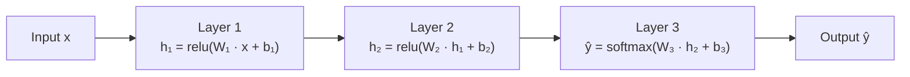
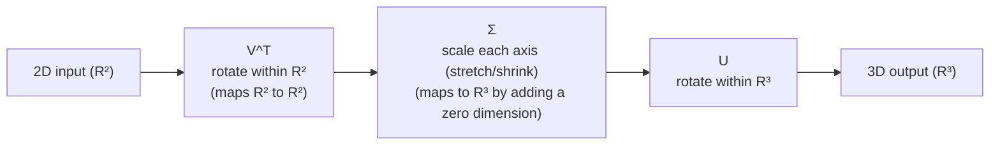

# Chapter 05: Linear Algebra for Machine Learning

> **"Linear algebra is the language that machine learning speaks. A neural network with 10 layers is not magic — it is 10 matrix multiplications, a few nonlinearities, and the magic of gradient descent."**

---

## Table of Contents
1. [Why Linear Algebra?](#1-why-linear-algebra)
2. [Scalars, Vectors, Matrices, Tensors](#2-scalars-vectors-matrices-tensors)
3. [Vector Operations](#3-vector-operations)
4. [Norms: Measuring Size](#4-norms-measuring-size)
5. [Matrix Operations](#5-matrix-operations)
6. [Matrix Multiplication — Deep Intuition](#6-matrix-multiplication--deep-intuition)
7. [Special Matrices](#7-special-matrices)
8. [Matrix Inverse](#8-matrix-inverse)
9. [Matrix Rank](#9-matrix-rank)
10. [Determinant](#10-determinant)
11. [Systems of Linear Equations](#11-systems-of-linear-equations)
12. [Eigenvectors and Eigenvalues](#12-eigenvectors-and-eigenvalues)
13. [Eigendecomposition](#13-eigendecomposition)
14. [Singular Value Decomposition (SVD)](#14-singular-value-decomposition-svd)
15. [PCA from Scratch Using SVD](#15-pca-from-scratch-using-svd)
16. [Trace and Frobenius Norm](#16-trace-and-frobenius-norm)
17. [Positive (Semi)Definite Matrices](#17-positive-semidefinite-matrices)
18. [Cosine Similarity](#18-cosine-similarity)
19. [Summary](#19-summary)
20. [Exercises](#20-exercises)

---

## 1. Why Linear Algebra?

Here is a neural network's forward pass:



That's it. Three matrix multiplications, three vector additions, and two nonlinear functions. All of deep learning — GPT, ResNet, BERT, Stable Diffusion — is variations on this pattern with more layers.

Linear algebra appears everywhere in ML:
- **Data representation**: a dataset of 1000 images is a matrix (1000 × pixel_count)
- **Feature transformations**: multiplying by a weight matrix rotates and scales feature space
- **Dimensionality reduction**: PCA finds the directions of maximum variance
- **Optimization**: gradient descent moves in the direction of the negative gradient vector
- **Similarity**: cosine distance between word embeddings
- **Compression**: SVD approximates matrices with fewer parameters

---

## 2. Scalars, Vectors, Matrices, Tensors

```
Scalar → Vector → Matrix → Tensor
────────────────────────────────────────────────────────────────────────
Scalar:    a single number          x = 5.0
           0-dimensional
           notation: italics  x, λ

Vector:    1D array of numbers      v = [1.2, 3.4, -0.5]
           has direction + magnitude
           notation: bold  v  or  x̄
           shape: (n,)

Matrix:    2D array of numbers      A = [[1, 2, 3],
           rows × columns                [4, 5, 6]]
           notation: CAPS A, B, W
           shape: (m, n)

Tensor:    n-dimensional array      T has shape (d₁, d₂, ..., dₙ)
           generalization of matrix
           examples:
             batch of images:  (32, 224, 224, 3)
             video:            (frames, H, W, C)
             attention weights:(heads, seq_len, seq_len)
────────────────────────────────────────────────────────────────────────
```

```python
import numpy as np

# Scalar
x = 5.0
print(f"Scalar: {x}, ndim={np.ndim(x)}")           # ndim=0

# Vector (column vector by convention)
v = np.array([1.2, 3.4, -0.5, 2.1])
print(f"Vector: shape={v.shape}, ndim={v.ndim}")    # (4,), ndim=1

# Matrix
A = np.array([[1, 2, 3],
              [4, 5, 6],
              [7, 8, 9]])
print(f"Matrix: shape={A.shape}, ndim={A.ndim}")    # (3,3), ndim=2

# Tensor (batch of 3-channel images)
T = np.random.rand(32, 224, 224, 3)
print(f"Tensor: shape={T.shape}, ndim={T.ndim}")    # (32,224,224,3), ndim=4

# Column vector vs row vector
col_vec = np.array([[1], [2], [3]])     # shape (3, 1)
row_vec = np.array([[1, 2, 3]])         # shape (1, 3)
```

---

## 3. Vector Operations

### Vector Addition and Scalar Multiplication

```
Vector addition — geometric interpretation:
──────────────────────────────────────────
       ▲ y
       │
       │    /b = [1, 2]
       │   /
     3 ├──•         a + b = [3, 4]
       │  |\ ← a+b
       │  | \       Adding vectors = placing tip-to-tail
     2 ├  |  •b    (a = [2,2], then walk [1,2] from there)
       │  |
     1 ├──•a = [2, 2]
       │
   ────┼──────────── → x
       0  1  2  3
```

```python
import numpy as np

a = np.array([2.0, 3.0, 1.0])
b = np.array([1.0, -1.0, 4.0])

# Addition
c = a + b                    # [3., 2., 5.]

# Scalar multiplication (scales length, preserves direction)
scaled = 3.0 * a             # [6., 9., 3.]
negated = -a                 # [-2., -3., -1.]  (reverses direction)

# Linear combination: weighted sum of vectors
w1, w2 = 0.3, 0.7
combo = w1 * a + w2 * b     # [1.3, 0.2, 3.1]

# In ML: a layer output is a linear combination of input features
# h = W @ x + b  means: each output neuron is a linear combo of inputs
```

### Dot Product

The dot product is the single most used operation in ML.

```
Dot product geometric interpretation:
──────────────────────────────────────────────────────────────────
a · b = |a| |b| cos(θ)    where θ is the angle between vectors

When θ = 0°:    cos(0) = 1   → maximum dot product (same direction)
When θ = 90°:   cos(90) = 0  → zero dot product (perpendicular/orthogonal)
When θ = 180°:  cos(180) = -1 → minimum dot product (opposite directions)

Algebraic form:
a · b = a₁b₁ + a₂b₂ + ... + aₙbₙ = Σ aᵢbᵢ
──────────────────────────────────────────────────────────────────
```

```python
import numpy as np

a = np.array([1.0, 2.0, 3.0])
b = np.array([4.0, 5.0, 6.0])

# Three ways to compute dot product
dot1 = np.dot(a, b)          # 1*4 + 2*5 + 3*6 = 32
dot2 = a @ b                  # same result
dot3 = np.sum(a * b)          # elementwise multiply then sum

print(dot1, dot2, dot3)       # 32.0 32.0 32.0

# Geometric: compute angle between vectors
cos_theta = np.dot(a, b) / (np.linalg.norm(a) * np.linalg.norm(b))
theta_degrees = np.degrees(np.arccos(np.clip(cos_theta, -1, 1)))
print(f"Angle: {theta_degrees:.2f}°")   # ~12.9°

# ML interpretation: dot product measures SIMILARITY
# In attention mechanisms: Q @ K.T computes all pairwise similarities
Q = np.random.randn(5, 8)    # 5 queries, each 8-dim
K = np.random.randn(7, 8)    # 7 keys, each 8-dim
scores = Q @ K.T              # (5, 7) — similarity of each query to each key
print(f"Attention scores shape: {scores.shape}")
```

### Projection

```python
# Projection of vector a onto vector b
# proj_b(a) = (a · b / |b|²) * b

def project(a, b):
    """Project vector a onto vector b."""
    return (np.dot(a, b) / np.dot(b, b)) * b

a = np.array([3.0, 4.0])
b = np.array([1.0, 0.0])   # x-axis
proj = project(a, b)
print(proj)    # [3., 0.] — projection onto x-axis drops the y component

# This is used in Gram-Schmidt orthogonalization (basis of QR decomposition)
```

---

## 4. Norms: Measuring Size

A **norm** is a function that assigns a length/size to a vector.

```
L1 norm (Manhattan / Taxicab):
  ||v||₁ = Σ |vᵢ|
  Geometric: distance traveling along grid lines (like a taxi in NYC)
  ML use: L1 regularization (Lasso) → encourages SPARSE solutions

L2 norm (Euclidean):
  ||v||₂ = √(Σ vᵢ²)
  Geometric: straight-line distance
  ML use: L2 regularization (Ridge) → shrinks all weights

Lp norm (general):
  ||v||_p = (Σ |vᵢ|^p)^(1/p)

L∞ norm (max norm):
  ||v||_∞ = max(|vᵢ|)
  ML use: gradient clipping bound

Unit norm: ||v||₂ = 1 → normalized vector (points in direction, no magnitude)
```

```python
import numpy as np

v = np.array([3.0, -4.0, 0.0, 2.0])

l0 = np.sum(v != 0)                    # "L0": count of nonzero elements
l1 = np.linalg.norm(v, ord=1)          # |3| + |-4| + |0| + |2| = 9
l2 = np.linalg.norm(v, ord=2)          # sqrt(9 + 16 + 0 + 4) ≈ 5.385
l_inf = np.linalg.norm(v, ord=np.inf)  # max(3, 4, 0, 2) = 4

print(f"L0: {l0}")    # 3
print(f"L1: {l1}")    # 9.0
print(f"L2: {l2:.4f}")  # 5.3852
print(f"L∞: {l_inf}")   # 4.0

# Unit normalization (L2)
v_unit = v / np.linalg.norm(v)
print(f"Unit vector norm: {np.linalg.norm(v_unit):.6f}")  # 1.000000

# Regularization terms (L1 and L2 penalties added to loss)
weights = np.array([2.0, -0.1, 5.0, 0.3, -3.0])
lambda_reg = 0.01

l1_penalty = lambda_reg * np.linalg.norm(weights, ord=1)   # Lasso
l2_penalty = lambda_reg * np.linalg.norm(weights, ord=2)**2  # Ridge (squared!)
print(f"L1 penalty: {l1_penalty:.4f}")
print(f"L2 penalty: {l2_penalty:.4f}")

# L1 encourages sparsity (pushes small weights to zero)
# L2 encourages small weights but not exactly zero
```

---

## 5. Matrix Operations

```python
import numpy as np

A = np.array([[1, 2, 3],
              [4, 5, 6]])   # shape (2, 3)

B = np.array([[7, 8],
              [9, 10],
              [11, 12]])    # shape (3, 2)

# ── Element-wise operations (require same shape) ──────────────────────────
C = np.array([[1, 0, 1],
              [0, 1, 0]])
D = np.array([[2, 3, 4],
              [5, 6, 7]])

print(C + D)     # element-wise add
print(C * D)     # element-wise multiply (Hadamard product, NOT matrix multiply!)
print(2 * A)     # scalar-matrix multiply

# ── Transpose ────────────────────────────────────────────────────────────
# A^T: swap rows and columns
print(A.T.shape)  # (3, 2) from (2, 3)
print(A.T)
# [[1, 4],
#  [2, 5],
#  [3, 6]]

# Properties:
# (A + B)^T = A^T + B^T
# (AB)^T   = B^T A^T   ← ORDER REVERSES!
# (A^T)^T  = A

# ── Matrix multiply ───────────────────────────────────────────────────────
# (m, n) @ (n, p) → (m, p)
result = A @ B    # (2,3) @ (3,2) → (2,2)
print(result)
# [[ 58,  64],
#  [139, 154]]
```

---

## 6. Matrix Multiplication — Deep Intuition

Matrix multiplication is confusing until you see the right interpretation.

### The Row-Column Dot Product View

```
C = A @ B, where A is (2,3) and B is (3,2):

    B col 0    B col 1
    [ 7  8 ]   [ 7  8 ]
    [ 9 10 ]   [ 9 10 ]
    [11 12 ]   [11 12 ]

A row 0 = [1,2,3]     C[0,0] = [1,2,3]·[7,9,11] = 7+18+33 = 58
A row 0 = [1,2,3]     C[0,1] = [1,2,3]·[8,10,12] = 8+20+36 = 64
A row 1 = [4,5,6]     C[1,0] = [4,5,6]·[7,9,11] = 28+45+66 = 139
A row 1 = [4,5,6]     C[1,1] = [4,5,6]·[8,10,12] = 32+50+72 = 154

C = [[58,  64],
     [139, 154]]
```

### The Transformation View (Most Important for ML)

```python
import numpy as np

# A matrix W transforms a vector from one space to another
# In neural networks: W (d_out × d_in) maps input to output

d_in  = 3
d_out = 2
W = np.array([[1., 0., -1.],
              [0., 1.,  1.]])   # (2, 3) — maps R³ → R²

x = np.array([3., 1., 2.])     # input in R³

h = W @ x                      # h = [3-2, 1+2] = [1, 3] — output in R²
print(h)   # [1., 3.]

# Interpretation: each output unit is a linear combination of all inputs
# h[0] = 1*x[0] + 0*x[1] + (-1)*x[2] = "dimension 0 minus dimension 2"
# h[1] = 0*x[0] + 1*x[1] +   1*x[2] = "dimension 1 plus dimension 2"

# For a batch of samples: X is (n_samples, d_in)
X = np.random.randn(100, 3)       # 100 samples
H = (W @ X.T).T                   # (2,3)@(3,100) → (2,100), then .T → (100,2)
# Or equivalently:
H = X @ W.T                       # (100,3)@(3,2) → (100,2)  ← more common
print(H.shape)  # (100, 2)
```

### Why Order Matters

```python
# AB ≠ BA in general!
A = np.array([[1, 2], [0, 1]])
B = np.array([[1, 0], [3, 1]])

print("AB =")
print(A @ B)
# [[7, 2],
#  [3, 1]]

print("BA =")
print(B @ A)
# [[1, 2],
#  [3, 7]]

# But some operations commute:
# A @ A.T is always square and symmetric
M = np.random.randn(4, 3)
print(np.allclose(M @ M.T, (M @ M.T).T))   # True — symmetric!
```

---

## 7. Special Matrices

```python
import numpy as np

n = 4

# ── Identity matrix I ──────────────────────────────────────────────────────
I = np.eye(n)
# [[1,0,0,0],
#  [0,1,0,0],
#  [0,0,1,0],
#  [0,0,0,1]]
# Property: A @ I = I @ A = A (like multiplying by 1)

A = np.random.randn(4, 4)
print(np.allclose(A @ I, A))   # True

# ── Diagonal matrix ────────────────────────────────────────────────────────
d = np.array([2., 5., 3., 1.])
D = np.diag(d)
# Only non-zero on diagonal — computationally efficient (don't store off-diag)
# D @ x just scales each component: [2x₀, 5x₁, 3x₂, 1x₃]

# ── Symmetric matrix ───────────────────────────────────────────────────────
# A = A^T — symmetric around the diagonal
# Covariance matrices are always symmetric!
X = np.random.randn(100, 5)
C = X.T @ X   # (5×100) @ (100×5) → (5×5) — always symmetric
print(np.allclose(C, C.T))    # True

# ── Orthogonal matrix (unitary) ────────────────────────────────────────────
# Q is orthogonal iff Q^T @ Q = I  (columns are orthonormal)
# Properties: Q^(-1) = Q^T  (inverse is cheap to compute!)
#             ||Qx||₂ = ||x||₂  (preserves vector lengths)
#             Q represents a pure rotation (and/or reflection)

from scipy.linalg import qr
M = np.random.randn(4, 4)
Q, R = qr(M)   # QR decomposition
print(np.allclose(Q.T @ Q, np.eye(4)))   # True — Q is orthogonal

# ── Upper/Lower triangular ─────────────────────────────────────────────────
L = np.tril(np.random.randn(4, 4))   # lower triangular
U = np.triu(np.random.randn(4, 4))   # upper triangular
# Triangular systems are fast to solve (forward/backward substitution)

# ── Positive definite — critical for optimization ────────────────────────
# A is PD if x^T A x > 0 for all non-zero x
# All eigenvalues are positive
# Hessian matrix of a convex function is PSD
# Covariance matrix is always PSD
```

---

## 8. Matrix Inverse

```python
import numpy as np

A = np.array([[2., 1.],
              [5., 3.]])

# The inverse A^(-1) satisfies: A @ A^(-1) = A^(-1) @ A = I
A_inv = np.linalg.inv(A)
print(A_inv)
# [[ 3., -1.],
#  [-5.,  2.]]

# Verify
print(np.allclose(A @ A_inv, np.eye(2)))   # True

# ── When does the inverse NOT exist? ─────────────────────────────────────
# When det(A) = 0 (singular matrix)
# When rows/columns are linearly dependent
B = np.array([[1., 2.],
              [2., 4.]])   # row 1 = 2 * row 0 — linearly dependent!
try:
    B_inv = np.linalg.inv(B)   # raises LinAlgError
except np.linalg.LinAlgError as e:
    print(f"Error: {e}")

# ── Pseudoinverse (Moore-Penrose) — works for non-square, singular matrices
# A^+ = V Σ^+ U^T  (from SVD)
# Used in: least squares problems, underdetermined systems
A_rect = np.array([[1., 2., 3.],
                   [4., 5., 6.]])   # (2, 3) — not square!
A_pinv = np.linalg.pinv(A_rect)    # (3, 2)
print(f"Pseudoinverse shape: {A_pinv.shape}")

# ── Numerical issues with matrix inverse ──────────────────────────────────
# NEVER use inv() to solve linear systems! Use linalg.solve() instead.
# inv() is slower and less numerically stable.

# BAD:
b = np.array([5., 10.])
x_bad  = np.linalg.inv(A) @ b     # computes inverse first, then multiplies

# GOOD:
x_good = np.linalg.solve(A, b)    # uses LU decomposition directly
print(np.allclose(x_bad, x_good))  # True, but x_good was computed more stably
```

---

## 9. Matrix Rank

The **rank** of a matrix is the number of linearly independent rows (or columns — they're equal).

```
Intuitively: rank = the "true" dimensionality of the information in the matrix.

If rank(A) = r and A has shape (m, n):
  → The rows span an r-dimensional subspace (out of m possible)
  → The columns span an r-dimensional subspace (out of n possible)
  → Only r pieces of independent information

Low-rank matrix example:
  A = [[1, 2, 3],    Row 2 = 2 × Row 1
       [2, 4, 6]]    → rank = 1 (not 2)
```

```python
import numpy as np

# Full rank
A = np.array([[1., 0., 0.],
              [0., 1., 0.],
              [0., 0., 1.]])
print(np.linalg.matrix_rank(A))    # 3 — full rank

# Rank-deficient
B = np.array([[1., 2., 3.],
              [2., 4., 6.],   # = 2 * row 0
              [3., 6., 9.]])  # = 3 * row 0
print(np.linalg.matrix_rank(B))    # 1 — only 1 independent row

# Numerical rank (noisy data)
C = B + np.random.randn(*B.shape) * 1e-10   # tiny perturbation
print(np.linalg.matrix_rank(C))             # 3 — numerically "full rank"!
print(np.linalg.matrix_rank(C, tol=1e-8))  # 1 — with appropriate tolerance

# ML implications:
# - Rank of weight matrix limits model expressiveness
# - In PCA: the number of non-zero singular values = rank
# - If features are collinear, design matrix is rank-deficient → OLS can fail
# - Low-rank approximations: approximate a large matrix with a smaller one

# Low-rank approximation via SVD (compress info)
M = np.random.randn(100, 100)   # rank 100 matrix
U, s, Vt = np.linalg.svd(M, full_matrices=False)

# Rank-k approximation
k = 10
M_approx = U[:, :k] @ np.diag(s[:k]) @ Vt[:k, :]
err = np.linalg.norm(M - M_approx) / np.linalg.norm(M)
print(f"Rank-{k} approximation error: {err:.3f}")
```

---

## 10. Determinant

```python
import numpy as np

A = np.array([[2., 1.],
              [5., 3.]])

det = np.linalg.det(A)
print(f"det(A) = {det:.4f}")   # 2*3 - 1*5 = 1.0

# Geometric interpretation for 2×2:
# |det(A)| = area of the parallelogram formed by the two column vectors
# sign(det(A)) tells you if the transformation preserves orientation

# 2×2 formula:
# det([[a,b],[c,d]]) = ad - bc

# Key facts:
# det(I) = 1                (identity preserves scale)
# det(AB) = det(A) * det(B)
# det(A^T) = det(A)
# det(A^-1) = 1/det(A)
# det = 0  →  matrix is singular (non-invertible, rank-deficient)

# Check singular
B = np.array([[1., 2.],
              [2., 4.]])
print(f"det(B) = {np.linalg.det(B):.4f}")   # 0.0 — singular!

# For large matrices, det can overflow float64
# Use log|det| instead:
_, log_det = np.linalg.slogdet(A)    # returns (sign, log|det|)
print(f"log|det(A)| = {log_det:.4f}")
```

---

## 11. Systems of Linear Equations

A system of linear equations is the central problem that linear algebra was invented to solve — and it's also what linear regression solves.

```
Ax = b   where A is (m × n), x is (n × 1), b is (m × 1)

Example (2 equations, 2 unknowns):
  2x + 1y = 5
  5x + 3y = 10

Matrix form:
  [[2, 1],   ×  [x]   =  [5]
   [5, 3]]      [y]       [10]
```

```python
import numpy as np

# ── Square, unique solution ────────────────────────────────────────────────
A = np.array([[2., 1.],
              [5., 3.]])
b = np.array([5., 10.])

x = np.linalg.solve(A, b)   # ALWAYS use solve(), not inv() @ b
print(x)    # [5. -5.]

# Verify: A @ x should equal b
print(np.allclose(A @ x, b))   # True

# ── Overdetermined: more equations than unknowns (m > n) ──────────────────
# Example: fitting a line y = mx + c to 4 noisy points
# This is EXACTLY what linear regression does!
#   y = X @ θ   where θ = [m, c], X = [[x₁,1],[x₂,1],...]
X = np.array([[1., 1.],
              [2., 1.],
              [3., 1.],
              [4., 1.]])
y = np.array([2.1, 3.9, 6.2, 7.8])   # approx y = 2x

# No exact solution — minimize ||Xθ - y||²
# Normal equations: θ = (X^T X)^(-1) X^T y
theta = np.linalg.lstsq(X, y, rcond=None)[0]
print(f"m = {theta[0]:.4f}, c = {theta[1]:.4f}")   # m≈2, c≈0

# Verify: this is the LEAST SQUARES solution
# np.linalg.lstsq uses SVD under the hood — numerically robust
```

---

## 12. Eigenvectors and Eigenvalues

This is one of the most important and most misunderstood topics. Let's build deep intuition.

```
Eigenvector equation: Av = λv

A is a (n×n) square matrix.
v is a vector (the eigenvector).
λ is a scalar (the eigenvalue).

The question being asked:
  "Is there a direction v such that multiplying by A only SCALES v,
   and does not ROTATE it?"

Geometrically:
  Most vectors get both stretched AND rotated by A.
  Eigenvectors are the SPECIAL directions that only get stretched.
  The eigenvalue λ tells you BY HOW MUCH they get stretched.
  
  λ > 1: eigenvector gets longer
  λ = 1: eigenvector unchanged
  0 < λ < 1: eigenvector gets shorter
  λ < 0: eigenvector gets flipped AND scaled
  λ = 0: eigenvector gets mapped to zero! (matrix is singular)
```

```python
import numpy as np

A = np.array([[4., 2.],
              [1., 3.]])

# Compute eigenvalues and eigenvectors
eigenvalues, eigenvectors = np.linalg.eig(A)
print("Eigenvalues:", eigenvalues)      # [5., 2.]
print("Eigenvectors (columns):")
print(eigenvectors)
# [[0.894, -0.707],
#  [0.447,  0.707]]

# Verify: A @ v = λ * v for each eigenpair
for i in range(len(eigenvalues)):
    v   = eigenvectors[:, i]        # i-th column = i-th eigenvector
    lam = eigenvalues[i]
    
    lhs = A @ v          # applying the matrix
    rhs = lam * v        # just scaling
    print(f"\nEigenpair {i}:")
    print(f"  Av = {lhs}")
    print(f"  λv = {rhs}")
    print(f"  Match: {np.allclose(lhs, rhs)}")   # True

# ── Intuition with a concrete example ─────────────────────────────────────
# Transformation matrix that stretches x by 3 and y by 2:
D = np.array([[3., 0.],
              [0., 2.]])

# Axis-aligned vectors are the eigenvectors:
e1 = np.array([1., 0.])    # x-axis
e2 = np.array([0., 1.])    # y-axis

print(D @ e1)    # [3, 0] = 3 * e1  → eigenvalue = 3
print(D @ e2)    # [0, 2] = 2 * e2  → eigenvalue = 2

# For ANY matrix, eigenvectors are the "principal directions" of the transformation

# ── Importance in ML ──────────────────────────────────────────────────────
# PCA: eigenvectors of the covariance matrix = principal components
# Graph Laplacian: eigenvectors used in spectral clustering
# PageRank: stationary distribution is the principal eigenvector
# Stability analysis: gradient descent converges iff all eigenvalues of Hessian > 0
```

---

## 13. Eigendecomposition

If A has n linearly independent eigenvectors, it can be decomposed as:

```
A = Q Λ Q^(-1)

Where:
  Q = matrix of eigenvectors (each column is an eigenvector)
  Λ = diagonal matrix of eigenvalues
  Q^(-1) = inverse of Q

For symmetric matrices (A = A^T):
  A = Q Λ Q^T    (Q^(-1) = Q^T because eigenvectors are orthonormal)
```

```python
import numpy as np

# ── General eigendecomposition ─────────────────────────────────────────────
A = np.array([[4., 2.],
              [1., 3.]])

eigenvalues, Q = np.linalg.eig(A)
Lambda = np.diag(eigenvalues)
Q_inv  = np.linalg.inv(Q)

A_reconstructed = Q @ Lambda @ Q_inv
print(np.allclose(A, A_reconstructed))   # True

# ── Symmetric matrix (most common in ML) ──────────────────────────────────
# Covariance matrix is always symmetric → nice eigendecomposition
np.random.seed(42)
X = np.random.randn(100, 5)
C = X.T @ X   # (5,5) symmetric matrix

eigenvalues, Q = np.linalg.eigh(C)   # eigh for symmetric (more stable than eig)
# Note: eigh returns eigenvalues in ASCENDING order

# Q.T @ Q = I (orthonormal eigenvectors)
print(np.allclose(Q.T @ Q, np.eye(5)))   # True

# Reconstruct
Lambda = np.diag(eigenvalues)
C_recon = Q @ Lambda @ Q.T
print(np.allclose(C, C_recon))   # True

# Powers of matrices via eigendecomposition
# A^k = Q Λ^k Q^(-1) (for square, diagonalizable A)
# Much faster than repeated matrix multiplication for large k
def matrix_power(A, k):
    eigenvalues, Q = np.linalg.eig(A)
    Lambda_k = np.diag(eigenvalues ** k)
    return Q @ Lambda_k @ np.linalg.inv(Q)
```

---

## 14. Singular Value Decomposition (SVD)

SVD is the most important matrix decomposition in all of applied mathematics and ML. While eigendecomposition only works for square matrices, SVD works for ANY matrix.

```
For ANY matrix A of shape (m, n):

A = U Σ V^T

Components:
───────────────────────────────────────────────────────────────────
  U:  (m × m) orthogonal matrix  — left singular vectors
      columns = eigenvectors of A A^T
      represent the "output directions" (in ℝᵐ space)

  Σ:  (m × n) diagonal matrix   — singular values
      σ₁ ≥ σ₂ ≥ ... ≥ σᵣ ≥ 0  (always non-negative!)
      the "stretching factors" in each direction
      where r = rank(A)

  V^T: (n × n) orthogonal matrix  — right singular vectors (transposed)
       rows = eigenvectors of A^T A
       represent the "input directions" (in ℝⁿ space)

Geometric interpretation:
  Any matrix can be decomposed into:
  1. A rotation in input space (V^T)
  2. Scaling along each dimension (Σ)
  3. A rotation in output space (U)
───────────────────────────────────────────────────────────────────
```



```python
import numpy as np

A = np.array([[3., 2., 2.],
              [2., 3., -2.]])  # (2, 3) matrix

# Full SVD
U, s, Vt = np.linalg.svd(A, full_matrices=True)
print(f"U shape:  {U.shape}")   # (2, 2)
print(f"s shape:  {s.shape}")   # (2,)  — just the diagonal values
print(f"Vt shape: {Vt.shape}")  # (3, 3)
print(f"Singular values: {s}")   # [5., 3.] — non-negative, descending

# Reconstruct A from SVD
Sigma = np.zeros_like(A, dtype=float)
Sigma[:len(s), :len(s)] = np.diag(s)
A_recon = U @ Sigma @ Vt
print(np.allclose(A, A_recon))   # True

# Economy/thin SVD (more common in practice)
U, s, Vt = np.linalg.svd(A, full_matrices=False)
print(f"Economy: U={U.shape}, s={s.shape}, Vt={Vt.shape}")
# U=(2,2), s=(2,), Vt=(2,3)
A_recon2 = U @ np.diag(s) @ Vt
print(np.allclose(A, A_recon2))   # True

# ── Low-rank approximation — the key application ──────────────────────────
def low_rank_approx(A, k):
    """Approximate A by keeping only the top-k singular values."""
    U, s, Vt = np.linalg.svd(A, full_matrices=False)
    return U[:, :k] @ np.diag(s[:k]) @ Vt[:k, :]

# Example: image compression
np.random.seed(42)
image = np.random.randn(100, 100)   # simulate a grayscale image

for k in [5, 10, 25, 50]:
    approx = low_rank_approx(image, k)
    error = np.linalg.norm(image - approx, 'fro') / np.linalg.norm(image, 'fro')
    compression = k * (100 + 100 + 1) / (100 * 100)  # params ratio
    print(f"k={k:3d}: error={error:.3f}, params={compression:.2%}")

# ── Information captured by singular values ───────────────────────────────
U, s, Vt = np.linalg.svd(image, full_matrices=False)
total_variance = np.sum(s**2)
explained = np.cumsum(s**2) / total_variance
k_90 = np.searchsorted(explained, 0.90) + 1
print(f"\n90% of variance captured by top-{k_90} singular values")

# ── SVD for matrix pseudoinverse ──────────────────────────────────────────
def pseudoinverse_via_svd(A, tol=1e-10):
    """Compute A^+ using SVD."""
    U, s, Vt = np.linalg.svd(A, full_matrices=False)
    s_inv = np.where(s > tol, 1.0 / s, 0.0)  # invert non-zero singular values
    return Vt.T @ np.diag(s_inv) @ U.T

A = np.array([[1., 2., 3.],
              [4., 5., 6.]])   # (2, 3)
A_pinv = pseudoinverse_via_svd(A)
print(A_pinv.shape)   # (3, 2)
print(np.allclose(A_pinv, np.linalg.pinv(A)))  # True
```

### SVD Applications in ML

```
SVD Use Cases:
────────────────────────────────────────────────────────────────────
PCA              : Principal components = right singular vectors (V)
                   Variance explained  = σᵢ² / Σ σⱼ²

Recommender systems: Matrix factorization — A ≈ U Σ V^T where
                     U = user embeddings, V = item embeddings

Image compression: Keep top-k singular values, discard the rest
                   k=20 often gives ~90%+ quality at 10x compression

Pseudoinverse    : Solve over/under-determined systems robustly
                   θ = A^+ b  (least squares solution)

Noise reduction  : Remove small singular values (corresponding to noise)

Numerical rank   : Count singular values above a threshold
────────────────────────────────────────────────────────────────────
```

---

## 15. PCA from Scratch Using SVD

Principal Component Analysis (PCA) finds the directions of maximum variance in data. This connects all of our linear algebra concepts.

```
PCA Algorithm (via SVD):
─────────────────────────────────────────────────────────────────────
1. Center the data: X_c = X - mean(X, axis=0)
2. Compute SVD: X_c = U Σ V^T
3. Principal components = columns of V (= rows of V^T)
4. Project: X_projected = X_c @ V[:, :k]  (keep top k)
5. Variance explained by component i = σᵢ² / (n-1)
─────────────────────────────────────────────────────────────────────
Note: sklearn's PCA uses exactly this algorithm internally!
```

```python
import numpy as np
import matplotlib.pyplot as plt

class PCAFromScratch:
    """
    Principal Component Analysis using SVD.
    Interface matches sklearn's PCA.
    """
    
    def __init__(self, n_components=None):
        self.n_components = n_components
        self.components_ = None        # principal directions (V^T)
        self.explained_variance_ = None
        self.explained_variance_ratio_ = None
        self.mean_ = None
    
    def fit(self, X):
        n_samples, n_features = X.shape
        k = self.n_components or min(n_samples, n_features)
        
        # Step 1: Center
        self.mean_ = X.mean(axis=0)
        X_c = X - self.mean_
        
        # Step 2: SVD (economy version)
        U, s, Vt = np.linalg.svd(X_c, full_matrices=False)
        
        # Step 3: Principal components (rows of Vt)
        self.components_ = Vt[:k]   # shape (k, n_features)
        
        # Step 4: Explained variance
        self.explained_variance_ = (s[:k] ** 2) / (n_samples - 1)
        total_var = (s ** 2).sum() / (n_samples - 1)
        self.explained_variance_ratio_ = self.explained_variance_ / total_var
        
        return self
    
    def transform(self, X):
        """Project X onto principal components."""
        X_c = X - self.mean_
        return X_c @ self.components_.T   # (n, p) @ (p, k) → (n, k)
    
    def fit_transform(self, X):
        return self.fit(X).transform(X)
    
    def inverse_transform(self, X_proj):
        """Project back to original space (approximate reconstruction)."""
        return X_proj @ self.components_ + self.mean_


# ─── Demo: reduce iris-like data to 2D ──────────────────────────────────
np.random.seed(42)
n = 150
# Simulate 4 correlated features
X_raw = np.random.randn(n, 4)
X = X_raw @ np.array([[2,1,0,0],[0,2,1,0],[0,0,2,1],[0,0,0,2]]) + [1,2,3,4]
y = np.random.randint(0, 3, n)

pca = PCAFromScratch(n_components=2)
X_2d = pca.fit_transform(X)

print("Explained variance ratio:")
for i, (ev, evr) in enumerate(zip(pca.explained_variance_,
                                   pca.explained_variance_ratio_)):
    print(f"  PC{i+1}: {evr:.2%} (variance: {ev:.4f})")
print(f"  Total: {pca.explained_variance_ratio_.sum():.2%}")

print(f"\nOriginal shape: {X.shape}")
print(f"Reduced shape:  {X_2d.shape}")

# Reconstruction error
X_recon = pca.inverse_transform(X_2d)
err = np.mean((X - X_recon)**2)
print(f"MSE reconstruction error: {err:.4f}")

# Compare with sklearn
from sklearn.decomposition import PCA
pca_sk = PCA(n_components=2)
X_2d_sk = pca_sk.fit_transform(X)
# Results should match (up to sign flips, which don't affect the geometry)
print(f"\nVariance ratios match sklearn: "
      f"{np.allclose(pca.explained_variance_ratio_, pca_sk.explained_variance_ratio_)}")
```

---

## 16. Trace and Frobenius Norm

```python
import numpy as np

A = np.array([[1., 2., 3.],
              [4., 5., 6.],
              [7., 8., 9.]])

# ── Trace: sum of diagonal elements ──────────────────────────────────────
tr = np.trace(A)    # 1 + 5 + 9 = 15
print(f"Trace: {tr}")

# Properties:
# trace(A) = sum of eigenvalues
# trace(AB) = trace(BA)  ← cyclic property
# trace(A^T) = trace(A)

# ── Frobenius norm: sqrt(sum of all squared elements) ────────────────────
frob = np.linalg.norm(A, 'fro')     # default for matrices
frob2 = np.sqrt(np.sum(A**2))
print(f"Frobenius norm: {frob:.4f}")

# ||A||_F² = trace(A^T A) = sum of squared singular values
U, s, Vt = np.linalg.svd(A, full_matrices=False)
print(f"Sum of σ²: {np.sum(s**2):.4f}")   # = ||A||_F²

# ML use:
# L2 regularization on weight matrix: loss += λ/2 * ||W||_F²
W = np.random.randn(5, 5)
lambda_l2 = 0.01
reg_loss = lambda_l2 / 2 * np.linalg.norm(W, 'fro')**2
```

---

## 17. Positive (Semi)Definite Matrices

```python
import numpy as np

# ── Positive Definite (PD): x^T A x > 0 for all non-zero x ───────────────
# Equivalently: all eigenvalues > 0
# Example: Hessian matrix at a minimum (bowl-shaped surface)

def is_positive_definite(A, tol=1e-10):
    eigenvalues = np.linalg.eigvalsh(A)   # eigvalsh for symmetric matrices
    return bool(np.all(eigenvalues > tol))

def is_positive_semidefinite(A, tol=1e-10):
    eigenvalues = np.linalg.eigvalsh(A)
    return bool(np.all(eigenvalues >= -tol))

# Covariance matrix is ALWAYS positive semidefinite
X = np.random.randn(100, 5)
C = X.T @ X
print(f"Covariance PSD: {is_positive_semidefinite(C)}")   # True

# Add small identity to make strictly PD (regularization trick!)
eps = 1e-6
C_reg = C + eps * np.eye(5)
print(f"Regularized covariance PD: {is_positive_definite(C_reg)}")   # True

# ── Why PSD matters in ML ─────────────────────────────────────────────────
# 1. Covariance matrices are PSD → Gaussian distributions are well-defined
# 2. Kernel matrices must be PSD (Mercer's theorem — SVMs)
# 3. Hessian of MSE loss is PSD → unique minimum (convex)
# 4. Projected covariance in PCA: PSD guarantees real eigenvalues

# ── Cholesky decomposition: for PD matrices ───────────────────────────────
# A = L L^T  where L is lower triangular
# Used: sampling from multivariate Gaussian, fast linear system solve
A = np.array([[4., 2.], [2., 3.]])
L = np.linalg.cholesky(A)
print(np.allclose(L @ L.T, A))   # True

# Sample from N(μ, Σ):
mu  = np.array([1.0, 2.0])
Sigma = np.array([[4., 2.], [2., 3.]])
L_chol = np.linalg.cholesky(Sigma)
z = np.random.randn(1000, 2)    # standard normal
samples = z @ L_chol.T + mu     # transform to N(μ, Σ)
print(f"Sample mean: {samples.mean(axis=0)}")    # ≈ [1, 2]
print(f"Sample cov: {np.cov(samples.T)}")        # ≈ [[4,2],[2,3]]
```

---

## 18. Cosine Similarity

Cosine similarity is the most widely used similarity metric in NLP (word embeddings, document retrieval) and recommendation systems.

```
Cosine similarity:
  cos(θ) = (a · b) / (||a||₂ × ||b||₂)

Range: [-1, 1]
  1  = identical direction (most similar)
  0  = orthogonal (no similarity)
  -1 = opposite direction (most dissimilar)

Why cosine, not Euclidean?
  Euclidean distance is affected by vector length.
  "cat" might appear 100 times in document A and 10 times in document B.
  Euclidean would say they're different. Cosine says: same relative frequency.
  Cosine cares about DIRECTION, not magnitude.
```

```python
import numpy as np

def cosine_similarity(a, b):
    """Cosine similarity between two vectors."""
    dot = np.dot(a, b)
    norm_a = np.linalg.norm(a)
    norm_b = np.linalg.norm(b)
    return dot / (norm_a * norm_b + 1e-8)

# ── Word embedding example ────────────────────────────────────────────────
# Simulate word embeddings (in practice these come from Word2Vec, GloVe, etc.)
np.random.seed(42)
d = 50   # embedding dimension

king   = np.random.randn(d)
queen  = king + np.random.randn(d) * 0.3    # queen ≈ king (similar direction)
man    = np.random.randn(d)
woman  = man + np.random.randn(d) * 0.3     # woman ≈ man

print(f"king-queen similarity:  {cosine_similarity(king, queen):.4f}")    # high
print(f"king-man similarity:    {cosine_similarity(king, man):.4f}")      # low
print(f"king-queen vs king-man: {cosine_similarity(king,queen):.4f} vs {cosine_similarity(king,man):.4f}")

# ── Batch cosine similarity ────────────────────────────────────────────────
def cosine_similarity_matrix(A, B):
    """
    Compute pairwise cosine similarities.
    A: (n, d), B: (m, d) → result: (n, m)
    """
    A_norm = A / (np.linalg.norm(A, axis=1, keepdims=True) + 1e-8)
    B_norm = B / (np.linalg.norm(B, axis=1, keepdims=True) + 1e-8)
    return A_norm @ B_norm.T

# Find most similar document to a query
documents = np.random.randn(100, 50)   # 100 documents, 50d embeddings
query = np.random.randn(50)            # query embedding

sims = cosine_similarity_matrix(query.reshape(1, -1), documents)[0]  # (100,)
top5_indices = np.argsort(sims)[-5:][::-1]
print(f"\nTop 5 most similar documents: {top5_indices}")
print(f"Their similarities: {sims[top5_indices].round(4)}")
```

---

## 19. Summary

```
Linear Algebra for ML — Complete Reference
────────────────────────────────────────────────────────────────────────
STRUCTURES
  Scalar → Vector → Matrix → Tensor  (0D, 1D, 2D, nD)

VECTORS
  dot product: a·b = Σaᵢbᵢ = ||a||||b||cos(θ)
  L1 norm: Σ|vᵢ|   (sparsity, Lasso)
  L2 norm: √(Σvᵢ²) (magnitude, Ridge)
  cosine similarity: (a·b)/(||a||·||b||)

MATRICES
  multiply: (m,n)@(n,p)→(m,p)  — inner dims must match
  transpose: (m,n)→(n,n), (AB)^T = B^T A^T
  inverse: A^(-1) only if det≠0, use linalg.solve not inv()
  rank: number of linearly independent rows/columns

DECOMPOSITIONS
  Eigendecomposition: A = QΛQ^(-1)  (square, diagonalizable)
    - Eigenvectors: directions that only scale
    - Eigenvalues: scaling factors
  SVD: A = UΣV^T  (ANY matrix, most important)
    - U: output directions, Σ: scales, V: input directions
    - PCA uses SVD
    - Low-rank approximation via SVD

KEY APPLICATIONS
  Linear regression: θ = (X^TX)^(-1)X^Ty  solved via lstsq
  PCA:               right singular vectors of centered data
  Neural net fwd:    h = activation(W @ x + b)
  Similarity:        cosine = (a·b)/(||a||·||b||)
  Regularization:    L1 = ||W||₁, L2 = ||W||_F²
────────────────────────────────────────────────────────────────────────
```

### Key Formulas Reference

| Operation | Formula | numpy |
|-----------|---------|-------|
| Dot product | a · b = Σaᵢbᵢ | `np.dot(a,b)` or `a@b` |
| L2 norm | √(Σvᵢ²) | `np.linalg.norm(v)` |
| Matrix multiply | C = A@B, Cᵢⱼ = Σ AᵢₖBₖⱼ | `A @ B` |
| Transpose | (A^T)ᵢⱼ = Aⱼᵢ | `A.T` |
| Solve Ax=b | x = A^(-1)b | `np.linalg.solve(A,b)` |
| Eigenvalues | Av = λv | `np.linalg.eig(A)` |
| SVD | A = UΣV^T | `np.linalg.svd(A)` |
| Cosine sim | (a·b)/(‖a‖‖b‖) | `np.dot(a,b)/(norm(a)*norm(b))` |

---

## Mini Projects

### Mini Project 1: Image Compression with SVD (1.5 hours)

**Goal:** Compress a grayscale image by keeping only the top-k singular values and visualize quality vs. compression ratio.

```python
import numpy as np
import matplotlib.pyplot as plt
from PIL import Image

def compress_image(img_array: np.ndarray, k: int) -> np.ndarray:
    """Keep top-k singular values, reconstruct image."""
    U, S, Vt = np.linalg.svd(img_array, full_matrices=False)
    reconstructed = U[:, :k] @ np.diag(S[:k]) @ Vt[:k, :]
    return np.clip(reconstructed, 0, 255).astype(np.uint8)

def storage_ratio(shape: tuple, k: int) -> float:
    m, n = shape
    return k * (m + n + 1) / (m * n)

# Create a test image (or load your own)
img = np.random.randint(0, 256, (200, 200)).astype(float)
# Or: img = np.array(Image.open("photo.jpg").convert("L"), dtype=float)

fig, axes = plt.subplots(2, 3, figsize=(15, 10))
for ax, k in zip(axes.flatten(), [1, 5, 20, 50, 100, 200]):
    compressed = compress_image(img, k)
    ratio = storage_ratio(img.shape, k)
    ax.imshow(compressed, cmap="gray")
    ax.set_title(f"k={k}, storage={ratio:.2%}")
    ax.axis("off")
plt.suptitle("SVD Image Compression")
plt.tight_layout()
plt.savefig("svd_compression.png")
plt.show()

# Plot singular value spectrum
U, S, Vt = np.linalg.svd(img, full_matrices=False)
cumulative_energy = np.cumsum(S**2) / np.sum(S**2)
plt.figure(figsize=(10, 4))
plt.subplot(1, 2, 1)
plt.semilogy(S[:50])
plt.title("Singular Values (log scale)")
plt.xlabel("Rank k")

plt.subplot(1, 2, 2)
plt.plot(cumulative_energy[:100])
plt.axhline(0.95, color='r', linestyle='--', label='95% energy')
plt.title("Cumulative Energy vs Rank")
plt.legend()
plt.tight_layout()
plt.savefig("singular_spectrum.png")
```

**Reflect:** How many singular values capture 90% of the image energy? What does this tell you about the structure/redundancy in the image?

---

### Mini Project 2: Word Analogy Solver with Cosine Similarity (1 hour)

**Goal:** Implement the classic `king - man + woman = queen` analogy using vector arithmetic and cosine similarity on GloVe embeddings.

```python
import numpy as np

def load_glove(filepath: str, vocab_size: int = 20000) -> dict:
    """Load GloVe vectors. Download: https://nlp.stanford.edu/projects/glove/"""
    vecs = {}
    with open(filepath, encoding="utf-8") as f:
        for i, line in enumerate(f):
            if i >= vocab_size: break
            parts = line.split()
            vecs[parts[0]] = np.array(parts[1:], dtype=float)
    return vecs

def cosine_sim(a: np.ndarray, b: np.ndarray) -> float:
    return np.dot(a, b) / (np.linalg.norm(a) * np.linalg.norm(b) + 1e-9)

def analogy(vecs: dict, a: str, b: str, c: str, n: int = 5) -> list:
    """Find d such that a:b :: c:d"""
    target = vecs[b] - vecs[a] + vecs[c]
    exclude = {a, b, c}
    results = sorted(
        [(w, cosine_sim(target, v)) for w, v in vecs.items() if w not in exclude],
        key=lambda x: -x[1]
    )
    return results[:n]

# Test (download glove.6B.50d.txt first)
vecs = load_glove("glove.6B.50d.txt")

test_cases = [
    ("man", "king", "woman"),        # → queen
    ("paris", "france", "london"),   # → england
    ("walked", "walking", "swam"),   # → swimming
]

for a, b, c in test_cases:
    if all(w in vecs for w in [a, b, c]):
        top = analogy(vecs, a, b, c)
        print(f"{a}:{b} :: {c}:? → {[w for w, _ in top[:3]]}")
```

**Extend:** Detect gender bias — compute the vector `male_direction = (man - woman + king - queen + ...)`. Which job titles lie closest to the "male" side?

---

### Mini Project 3: PCA Eigenfaces — Face Recognition (1 hour)

**Goal:** Use PCA to compress face images into eigenfaces, then find the most similar face in a dataset via cosine similarity.

```python
from sklearn.datasets import fetch_lfw_people
from sklearn.decomposition import PCA
from sklearn.preprocessing import normalize
import numpy as np
import matplotlib.pyplot as plt

# Load dataset (auto-downloads ~200MB)
lfw = fetch_lfw_people(min_faces_per_person=20, resize=0.4)
X = lfw.data    # (n_images, n_pixels)

# Fit Eigenfaces
pca = PCA(n_components=100, whiten=True, random_state=42)
X_pca = normalize(pca.fit_transform(X))

# Show eigenfaces
fig, axes = plt.subplots(2, 5, figsize=(15, 6))
h, w = lfw.images.shape[1], lfw.images.shape[2]
for i, ax in enumerate(axes.flatten()):
    ax.imshow(pca.components_[i].reshape(h, w), cmap="bone")
    ax.set_title(f"Eigenface {i+1}")
    ax.axis("off")
plt.suptitle("Top 10 Eigenfaces")
plt.tight_layout()
plt.savefig("eigenfaces.png")
plt.show()

# Find similar faces by cosine similarity
def find_similar(query_idx: int, X_norm: np.ndarray, k: int = 5) -> list:
    sims = X_norm @ X_norm[query_idx]
    sims[query_idx] = -1  # Exclude self
    return list(np.argsort(sims)[::-1][:k])

similar = find_similar(0, X_pca)
print("Most similar face indices:", similar)
print("Same person?", [lfw.target[i] == lfw.target[0] for i in similar])
```

---

## 20. Exercises

**Exercise 1: Geometric Intuition**
Write a function `visualize_transformation(A)` that takes a 2×2 matrix A and plots:
- The standard basis vectors e₁=[1,0] and e₂=[0,1] (in blue)
- Their images under A: A@e₁ and A@e₂ (in red)
- The eigenvectors and their images (in green)
- The unit circle and its image under A (in gray)

This will visually show how the matrix stretches and rotates space.

*Hint: Parameterize unit circle as (cos(t), sin(t)). Transform each point. Use `ax.quiver()` for arrows.*

**Exercise 2: Low-Rank Reconstruction**
Load any grayscale image (or generate a structured matrix). Compute its SVD and reconstruct it using k=1,2,5,10,20,50 singular values. Plot:
- The original image
- All k reconstructions
- A curve showing Frobenius norm error vs k
- A curve showing explained variance (%) vs k

*Hint: Use `plt.imshow(matrix, cmap='gray')`. Frobenius error: `||A - A_k||_F / ||A||_F`.*

**Exercise 3: Covariance and PCA**
Generate a 2D dataset where feature 1 = `np.random.randn(n)` and feature 2 = `2 * feature1 + noise`. 
1. Compute and visualize the covariance matrix as a heatmap
2. Compute eigenvalues and eigenvectors of the covariance matrix
3. Plot the data points and draw the eigenvectors as arrows, scaled by eigenvalue
4. Project onto the first principal component and show the 1D distribution
5. Verify that sklearn's PCA gives the same eigenvectors

*Hint: Use `ax.annotate()` with `arrowprops` for the eigenvector arrows.*

**Exercise 4: Recommender System with SVD**
Create a simulated user-item ratings matrix (50 users × 100 movies) with values 1-5 (and some zeros for unrated). Use SVD to:
1. Factorize the matrix into user and item embeddings
2. Reconstruct the full matrix (filling in zeros = predictions)
3. For 3 specific users, find their top-5 recommended movies
4. Plot the singular value spectrum to determine a good rank k

*Hint: Use `np.linalg.svd`, then keep only top-k components for the "recommendation" matrix.*

**Exercise 5: Gradient from Scratch**
The gradient of `f(x) = ||Ax - b||₂²` with respect to x is `∇f = 2A^T(Ax-b)`. Verify this numerically using finite differences: for each component i, approximate `∂f/∂xᵢ ≈ (f(x+εeᵢ) - f(x-εeᵢ)) / (2ε)` and compare to the analytical gradient. Then implement gradient descent to minimize this function and verify you converge to the least-squares solution `x* = (A^TA)^{-1}A^Tb`.

*Hint: Use ε=1e-5. Compare `np.allclose(numerical_grad, analytical_grad, atol=1e-4)`.*

---

**What's Next →** [Chapter 06: Calculus and Optimization — How Models Learn](./06-calculus-and-optimization.md)

*Linear algebra tells us what the operations ARE. Calculus tells us how to improve them. The next chapter covers derivatives, gradients, and gradient descent — the mechanism by which every neural network learns from data.*
