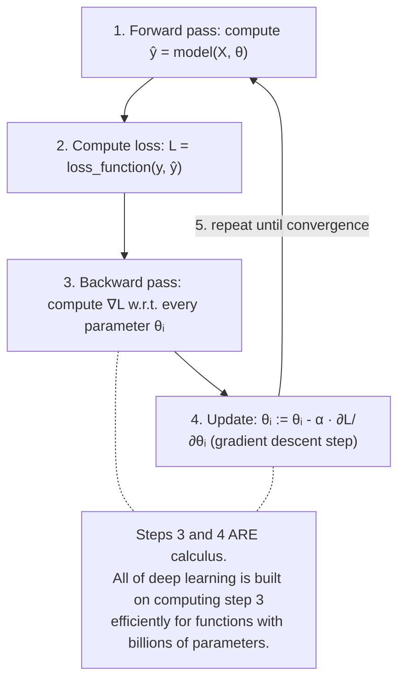

# Chapter 06: Calculus and Optimization — How Models Learn

> **"Optimization is the engine of learning. A neural network does not magically learn — it is a function that is endlessly, relentlessly pushed downhill by its gradient, one small step at a time."**

---

## Table of Contents
1. [Why Calculus in ML?](#1-why-calculus-in-ml)
2. [Functions, Limits, and Continuity](#2-functions-limits-and-continuity)
3. [Derivatives: Rate of Change](#3-derivatives-rate-of-change)
4. [Common Derivatives](#4-common-derivatives)
5. [The Chain Rule — Foundation of Backpropagation](#5-the-chain-rule--foundation-of-backpropagation)
6. [Product Rule and Quotient Rule](#6-product-rule-and-quotient-rule)
7. [Partial Derivatives](#7-partial-derivatives)
8. [The Gradient](#8-the-gradient)
9. [Gradient Descent — Walking Downhill](#9-gradient-descent--walking-downhill)
10. [Types of Gradient Descent](#10-types-of-gradient-descent)
11. [Convex vs Non-Convex Functions](#11-convex-vs-non-convex-functions)
12. [Saddle Points and Local Minima](#12-saddle-points-and-local-minima)
13. [The Hessian Matrix](#13-the-hessian-matrix)
14. [Taylor Series and Approximation](#14-taylor-series-and-approximation)
15. [Loss Functions and Their Derivatives](#15-loss-functions-and-their-derivatives)
16. [The Jacobian Matrix](#16-the-jacobian-matrix)
17. [NumPy Implementation: Gradient Descent](#17-numpy-implementation-gradient-descent)
18. [Summary](#18-summary)
19. [Exercises](#19-exercises)

---

## 1. Why Calculus in ML?

Training a machine learning model is fundamentally an optimization problem:

```
"Find the parameter values θ that minimize the loss function L(θ)"

    θ* = argmin L(θ)
         θ

Where:
  θ = all learnable parameters (weights, biases)
  L = a measure of how wrong the model is (loss / cost function)
```

Calculus gives us the answer: **follow the gradient**. The gradient tells us, at any point in parameter space, which direction makes the loss increase fastest. We go in the opposite direction.



---

## 2. Functions, Limits, and Continuity

You're not new to the concept of functions. Every ML model IS a function — it maps inputs to outputs.

```
A function f: ℝⁿ → ℝ maps n real numbers to one real number.
Example: f(w₁, w₂, b) = w₁x₁ + w₂x₂ + b  (linear model)

For calculus to work on a loss function, the function must be:
- Defined (output exists for all valid inputs)
- Continuous (no sudden jumps)
- Differentiable (smooth enough to have a derivative)

Most activation functions are continuous but NOT differentiable at all points:
  ReLU: f(x) = max(0, x)  — not differentiable at x=0
  This is handled in practice with subgradients.
```

```python
import numpy as np
import matplotlib.pyplot as plt

# Visualize continuity vs differentiability
x = np.linspace(-3, 3, 1000)

# Smooth function — continuous AND differentiable everywhere
sigmoid = 1 / (1 + np.exp(-x))

# Non-differentiable but continuous — ReLU
relu = np.maximum(0, x)

# Plot
fig, axes = plt.subplots(1, 2, figsize=(12, 4))
axes[0].plot(x, sigmoid, 'b-', lw=2)
axes[0].set_title("Sigmoid — Smooth Everywhere\n(differentiable at all points)")
axes[0].grid(True, alpha=0.3)

axes[1].plot(x, relu, 'r-', lw=2)
axes[1].axvline(0, color='gray', ls=':', alpha=0.7)
axes[1].set_title("ReLU — Not Differentiable at x=0\n(but fine in practice)")
axes[1].grid(True, alpha=0.3)
plt.tight_layout()
plt.show()
```

---

## 3. Derivatives: Rate of Change

The derivative measures how fast a function's output changes as its input changes.

```
Formal definition:

  f'(x) = df/dx = lim[h→0]  f(x + h) - f(x)
                              ──────────────────
                                      h

Geometric interpretation:
  f'(x) = slope of the tangent line to f at point x

         f(x)
           │       /← tangent at x₀
           │      /     slope = f'(x₀)
           │   ↗/
           │  /
           │ /     ← the function f(x)
           └──────────── x
                  x₀
```

```python
import numpy as np
import matplotlib.pyplot as plt

# Numerical derivative (finite differences)
def numerical_derivative(f, x, h=1e-5):
    """
    Approximate the derivative of f at x using central differences.
    More accurate than forward differences: O(h²) vs O(h).
    """
    return (f(x + h) - f(x - h)) / (2 * h)

# Example function
f = lambda x: x**3 - 2*x**2 + x + 1
df = lambda x: 3*x**2 - 4*x + 1   # analytical derivative

x = np.linspace(-1, 3, 200)
x0 = 1.5   # point where we compute derivative

fig, ax = plt.subplots(figsize=(10, 6))

# Plot function
ax.plot(x, f(x), 'b-', lw=2, label='f(x) = x³ - 2x² + x + 1')

# Plot tangent line at x0
slope = df(x0)
tangent = slope * (x - x0) + f(x0)
ax.plot(x, tangent, 'r--', lw=1.5,
        label=f"Tangent at x={x0}: slope = f'({x0}) = {slope:.3f}")

# Mark the point
ax.scatter([x0], [f(x0)], s=100, color='red', zorder=5)

ax.set_ylim(-0.5, 4)
ax.legend()
ax.grid(True, alpha=0.3)
ax.set_title("Derivative as Slope of Tangent Line", fontsize=14)
plt.show()

# Numerical vs analytical check
x_test = np.array([0.0, 1.0, 2.0, -0.5])
numerical = numerical_derivative(f, x_test)
analytical = df(x_test)
print("Numerical vs Analytical:")
for x_val, num, ana in zip(x_test, numerical, analytical):
    print(f"  x={x_val:5.2f}: numerical={num:.6f}, analytical={ana:.6f}")
```

---

## 4. Common Derivatives

You don't need to derive everything from first principles. These are the rules your brain should retrieve automatically.

```
Power rule:    d/dx [xⁿ]     = n · x^(n-1)
               d/dx [x²]     = 2x
               d/dx [x³]     = 3x²
               d/dx [√x]     = 1/(2√x)  = ½x^(-½)
               d/dx [1/x]    = -1/x²    = -x^(-2)

Exponential:   d/dx [eˣ]     = eˣ       (its own derivative! fundamental property)
               d/dx [aˣ]     = aˣ ln(a)

Logarithm:     d/dx [ln(x)]  = 1/x
               d/dx [log₂(x)]= 1/(x ln 2)

Trigonometric: d/dx [sin(x)] = cos(x)
               d/dx [cos(x)] = -sin(x)
               d/dx [tan(x)] = sec²(x) = 1/cos²(x)

Constants:     d/dx [c]      = 0  (derivative of a constant is always zero)

Linear:        d/dx [cx]     = c  (derivative of a scaled variable is the scale)
               d/dx [a+x]    = 1
```

```python
import numpy as np

# Verify numerically
def verify_derivative(f, df_analytical, x, name):
    h = 1e-7
    df_num = (f(x + h) - f(x - h)) / (2 * h)
    df_ana = df_analytical(x)
    match = np.allclose(df_num, df_ana, rtol=1e-4)
    print(f"  {name}: numerical={df_num:.6f}, analytical={df_ana:.6f}, match={match}")

x = 2.0

print("Derivative verification at x=2:")
verify_derivative(lambda x: x**3,   lambda x: 3*x**2,      x, "d/dx[x³]")
verify_derivative(lambda x: np.exp(x), lambda x: np.exp(x), x, "d/dx[eˣ]")
verify_derivative(lambda x: np.log(x), lambda x: 1/x,       x, "d/dx[ln x]")
verify_derivative(lambda x: np.sin(x), lambda x: np.cos(x), x, "d/dx[sin x]")
verify_derivative(lambda x: np.cos(x), lambda x: -np.sin(x),x, "d/dx[cos x]")
```

---

## 5. The Chain Rule — Foundation of Backpropagation

This single rule is the reason deep learning is computationally feasible. **Every training step of every neural network uses the chain rule.**

```
Chain Rule (single variable):

If y = f(g(x)), then:
  dy/dx = f'(g(x)) · g'(x)

Or equivalently, if y = f(u) and u = g(x):
  dy/dx = (dy/du) · (du/dx)

In words:
  "The derivative of a composition of functions is the product
   of the derivatives of each function in the chain."
```

### Understanding the Chain Rule Intuitively

```
Imagine a chain of gears:
  x → Gear A → u → Gear B → y

If Gear A turns x by 3x (u = 3x), and
Gear B turns u by 2u (y = 2u),
Then how much does y change for a small change in x?
  dy/dx = (dy/du)(du/dx) = 2 × 3 = 6

This is the chain rule!
```

```python
import numpy as np

# Example 1: y = sin(x²)
# Decompose: u = x², y = sin(u)
# du/dx = 2x, dy/du = cos(u)
# dy/dx = cos(u) · 2x = cos(x²) · 2x

x = np.pi / 4

analytical_chain = np.cos(x**2) * 2 * x   # = 2x cos(x²)

# Numerical verification
h = 1e-7
f = lambda x: np.sin(x**2)
numerical = (f(x + h) - f(x - h)) / (2 * h)
print(f"Chain rule: d/dx[sin(x²)] at x=π/4")
print(f"  Analytical: {analytical_chain:.8f}")
print(f"  Numerical:  {numerical:.8f}")

# Example 2: y = sigmoid(W·x + b)  — one neural network layer!
# Decompose:
#   z = W·x + b       (linear transform)
#   y = sigmoid(z)    (activation function)
#
# ∂y/∂W = (∂y/∂z)(∂z/∂W)
#        = σ'(z) · x
# where σ'(z) = σ(z)(1 - σ(z))   (derivative of sigmoid)

def sigmoid(z):
    return 1 / (1 + np.exp(-z))

def sigmoid_derivative(z):
    s = sigmoid(z)
    return s * (1 - s)   # ← this comes from the chain rule applied to 1/(1+e^(-z))

W = np.array([0.5, -0.3, 0.8])
x = np.array([1.0, 2.0, 3.0])
b = 0.1

z = W @ x + b            # linear: z = 0.5+(-0.6)+2.4+0.1 = 2.4
y = sigmoid(z)
dy_dz = sigmoid_derivative(z)  # scalar
dz_dW = x                      # ∂(Wx+b)/∂W = x
dy_dW = dy_dz * dz_dW          # chain rule: (∂y/∂z)(∂z/∂W)

print(f"\nNeural network layer chain rule:")
print(f"  z = {z:.4f}, y = sigmoid(z) = {y:.4f}")
print(f"  dy/dz = σ'(z) = {dy_dz:.4f}")
print(f"  dz/dW = x = {dz_dW}")
print(f"  dy/dW = dy/dz * dz/dW = {dy_dW}")
```

### Multi-Step Chain Rule (Backpropagation)

```
A 3-layer network:
  z₁ = W₁x + b₁,    a₁ = relu(z₁)
  z₂ = W₂a₁ + b₂,   a₂ = relu(z₂)
  ŷ  = W₃a₂ + b₃

Loss: L = MSE(y, ŷ) = (y - ŷ)²/n

Backprop via chain rule (going backwards):
  ∂L/∂W₃ = ∂L/∂ŷ · ∂ŷ/∂W₃

  ∂L/∂W₂ = ∂L/∂ŷ · ∂ŷ/∂a₂ · ∂a₂/∂z₂ · ∂z₂/∂W₂

  ∂L/∂W₁ = ∂L/∂ŷ · ∂ŷ/∂a₂ · ∂a₂/∂z₂ · ∂z₂/∂a₁ · ∂a₁/∂z₁ · ∂z₁/∂W₁

Each term is computed using the rules above.
PyTorch's autograd does ALL of this automatically!
```

---

## 6. Product Rule and Quotient Rule

```
Product Rule:   d/dx[f(x)·g(x)] = f'(x)g(x) + f(x)g'(x)

Quotient Rule:  d/dx[f(x)/g(x)] = [f'(x)g(x) - f(x)g'(x)] / [g(x)]²

ML uses:
  Product rule: derived cross-entropy gradient, attention gradients
  Quotient rule: derived softmax gradient, batch normalization gradients
```

```python
import numpy as np

# Verify product rule: d/dx[x² · sin(x)] at x=1
# = 2x · sin(x) + x² · cos(x)  (product rule)
x = 1.0
f = lambda x: x**2 * np.sin(x)
df_analytical = lambda x: 2*x*np.sin(x) + x**2*np.cos(x)

h = 1e-7
df_numerical = (f(x+h) - f(x-h)) / (2*h)
print(f"Product rule d/dx[x²·sin(x)] at x=1:")
print(f"  Analytical: {df_analytical(x):.8f}")
print(f"  Numerical:  {df_numerical:.8f}")
```

---

## 7. Partial Derivatives

When a function has multiple inputs, we take the derivative with respect to one input at a time, treating all others as constants.

```
f(x₁, x₂) = x₁² + 2x₁x₂ + x₂³

∂f/∂x₁ = 2x₁ + 2x₂    (differentiate w.r.t. x₁, treat x₂ as constant)
∂f/∂x₂ = 2x₁ + 3x₂²   (differentiate w.r.t. x₂, treat x₁ as constant)
```

```python
import numpy as np

# Numerical partial derivatives
def partial_derivative(f, x, idx, h=1e-5):
    """
    Compute ∂f/∂x[idx] at point x using central differences.
    
    f: function from ℝⁿ to ℝ
    x: numpy array (current parameter values)
    idx: which parameter to differentiate with respect to
    """
    x_forward = x.copy()
    x_backward = x.copy()
    x_forward[idx] += h
    x_backward[idx] -= h
    return (f(x_forward) - f(x_backward)) / (2 * h)

# Example: f(w₁, w₂, w₃) = w₁²x₁ + w₂x₂ - w₃  (simple linear model loss)
def model_loss(weights, X, y):
    """MSE loss for a linear model."""
    predictions = X @ weights
    residuals = y - predictions
    return np.mean(residuals**2)

np.random.seed(42)
X = np.random.randn(50, 3)
true_w = np.array([2.0, -1.0, 0.5])
y = X @ true_w + np.random.randn(50) * 0.1

w = np.array([0.0, 0.0, 0.0])   # starting weights

# Compute all partial derivatives numerically
partial_grads = np.array([
    partial_derivative(lambda w: model_loss(w, X, y), w, i)
    for i in range(3)
])
print("Partial derivatives of MSE w.r.t. each weight:")
for i, g in enumerate(partial_grads):
    print(f"  ∂L/∂w{i+1} = {g:.4f}")
```

---

## 8. The Gradient

The **gradient** collects all partial derivatives into a single vector. It points in the direction of steepest increase.

```
Gradient:
  ∇f(x) = [∂f/∂x₁,  ∂f/∂x₂,  ...,  ∂f/∂xₙ]

Properties:
  1. ∇f(x) points in the direction of STEEPEST ASCENT
  2. -∇f(x) points in the direction of STEEPEST DESCENT ← this is what we use!
  3. At a local minimum, ∇f(x) = 0 (gradient is zero)
  4. ||∇f(x)|| tells you HOW STEEP the slope is (gradient magnitude)
  5. ∇f(x) is perpendicular to the level curves of f
```

```python
import numpy as np
import matplotlib.pyplot as plt

# Analytical gradient for MSE loss
def mse_loss_and_gradient(w, X, y):
    """
    MSE loss: L = (1/n) * ||Xw - y||²
    Gradient: ∇L = (2/n) * X^T (Xw - y)
    """
    n = len(y)
    residuals = X @ w - y              # (n,)
    loss = np.mean(residuals**2)       # scalar
    gradient = (2 / n) * X.T @ residuals   # (n_features,)
    return loss, gradient

# Verify gradient analytically vs numerically
np.random.seed(42)
X = np.random.randn(50, 3)
y = X @ np.array([2.0, -1.0, 0.5]) + np.random.randn(50) * 0.1
w = np.random.randn(3)

loss, grad_analytical = mse_loss_and_gradient(w, X, y)
grad_numerical = np.array([
    partial_derivative(lambda w: mse_loss_and_gradient(w, X, y)[0], w, i)
    for i in range(3)
])

print("Gradient verification:")
print(f"  Analytical: {grad_analytical}")
print(f"  Numerical:  {grad_numerical}")
print(f"  Match: {np.allclose(grad_analytical, grad_numerical, atol=1e-5)}")

# Visualize gradient field for 2D function
fig, ax = plt.subplots(figsize=(8, 7))

# Simple function: f(x,y) = x² + 2y²  (elliptic paraboloid)
def f2d(x, y):
    return x**2 + 2*y**2

def grad_f2d(x, y):
    return np.array([2*x, 4*y])   # [∂f/∂x, ∂f/∂y]

# Plot contour lines (level curves)
x_grid = np.linspace(-3, 3, 100)
y_grid = np.linspace(-3, 3, 100)
X_g, Y_g = np.meshgrid(x_grid, y_grid)
Z = f2d(X_g, Y_g)

ax.contour(X_g, Y_g, Z, levels=20, cmap='coolwarm', alpha=0.6)

# Plot gradient arrows
xs = np.linspace(-2.5, 2.5, 10)
ys = np.linspace(-2.5, 2.5, 10)
for xi in xs:
    for yi in ys:
        g = grad_f2d(xi, yi)
        g_norm = g / (np.linalg.norm(g) + 1e-8) * 0.3
        ax.annotate("", xy=(xi + g_norm[0], yi + g_norm[1]),
                    xytext=(xi, yi),
                    arrowprops=dict(arrowstyle='->', color='navy', lw=0.8))

ax.set_title("f(x,y) = x² + 2y²\nArrows show gradient direction ∇f\n"
             "(gradient descent goes OPPOSITE the arrows)", fontsize=12)
ax.set_xlabel("x₁")
ax.set_ylabel("x₂")
plt.tight_layout()
plt.show()
```

---

## 9. Gradient Descent — Walking Downhill

Gradient descent is the algorithm that iteratively updates parameters to minimize the loss.

```
Update rule:
  θ := θ - α · ∇L(θ)

Where:
  θ = current parameters
  α = learning rate (step size)
  ∇L(θ) = gradient of loss at current θ

Intuition: "walk in the direction that decreases loss most quickly"
```

### Loss Surface Visualization

```
Loss landscape for a simple 1-parameter model:

L(θ)                          minimum here
  │                               ↓
  │     ╭─────────╮             ╭─╯
  │  ╭──╯         ╰───╮      ╭──╯
  │  │               ╰───────╯
  │──┴────────────────────────────── θ
  
Starting at the left:
  Gradient > 0 (slope goes up to the right)
  → move LEFT (θ := θ - α × positive_gradient)

Starting at the right:
  Gradient < 0 (slope goes up to the left)
  → move RIGHT (θ := θ - α × negative_gradient = θ + |gradient|)
```

### The Learning Rate: Too Big vs Too Small

```
Learning rate α too small:
────────────────────────────────────────────────────────
  Loss ▲
       │•
       │ •
       │  •
       │    •
       │       •
       │              •                    •
       └─────────────────────────────────────── Iteration
       Converges but EXTREMELY slowly.

Learning rate α too large:
────────────────────────────────────────────────────────
  Loss ▲
       │         •
       │    •         •
       │        •         •
       │    •                 •
       │
       │• (minimum here, but we keep jumping past it)
       └─────────────────────────────────────── Iteration
       OSCILLATES or DIVERGES — never converges.

Learning rate α just right:
────────────────────────────────────────────────────────
  Loss ▲
       │•
       │  •
       │    •
       │      •
       │         •
       │              •         •   •   •  •
       └─────────────────────────────────────── Iteration
       Converges smoothly. Loss decreases and plateaus.
```

```python
import numpy as np
import matplotlib.pyplot as plt

def gradient_descent_1d(f, df, x_init, lr, n_iter):
    """
    Gradient descent on a 1D function.
    
    Returns: history of (x, f(x)) pairs
    """
    x = x_init
    history = [(x, f(x))]
    
    for _ in range(n_iter):
        gradient = df(x)
        x = x - lr * gradient   # the update rule
        history.append((x, f(x)))
    
    return history

# f(x) = x⁴ - 4x² + 4  (has two minima at x = ±√2)
f  = lambda x: x**4 - 4*x**2 + 4
df = lambda x: 4*x**3 - 8*x       # analytical derivative

x_plot = np.linspace(-2.5, 2.5, 300)

fig, axes = plt.subplots(1, 3, figsize=(18, 5))
learning_rates = [0.01, 0.1, 0.4]
titles = ["α=0.01 (too slow)", "α=0.1 (good)", "α=0.4 (too large)"]
x_start = 2.0

for ax, lr, title in zip(axes, learning_rates, titles):
    history = gradient_descent_1d(f, df, x_start, lr, 50)
    xs, fs = zip(*history)
    
    # Plot function
    ax.plot(x_plot, f(x_plot), 'b-', lw=2, label='f(x)')
    
    # Plot optimization path (colored by iteration)
    for i in range(len(xs)-1):
        ax.plot([xs[i], xs[i+1]], [fs[i], fs[i+1]],
                color=plt.cm.autumn(i/len(xs)), alpha=0.7)
    ax.scatter(xs[0], fs[0], s=100, color='green', zorder=5, label='Start')
    ax.scatter(xs[-1], fs[-1], s=100, color='red', zorder=5, label='End')
    
    ax.set_title(title, fontsize=13)
    ax.set_xlabel("θ")
    ax.set_ylabel("L(θ)")
    ax.legend()
    ax.grid(True, alpha=0.3)
    ax.set_ylim(-0.5, 5)
    
    print(f"{title}: final x={xs[-1]:.4f}, final loss={fs[-1]:.4f}")

plt.tight_layout()
plt.show()
```

---

## 10. Types of Gradient Descent

```
Three variants differ in how much data is used per gradient update:
──────────────────────────────────────────────────────────────────────
Variant         Samples/update  Pros                    Cons
──────────────────────────────────────────────────────────────────────
Batch GD        All n samples   Exact gradient          Slow for large n
                                Stable convergence      Needs all data in RAM

Stochastic GD   1 sample        Fast updates            Noisy gradients
(SGD)                           Good for online learning Can oscillate

Mini-batch GD   B samples       Best of both worlds     Hyperparameter: B
(most common)   (B=32,64,256)   GPU-parallelizable      Still some noise
──────────────────────────────────────────────────────────────────────
```

```python
import numpy as np

def batch_gradient_descent(X, y, lr=0.01, n_iter=1000, tol=1e-6):
    """
    Batch gradient descent: use ALL samples for each gradient computation.
    """
    n, p = X.shape
    w = np.zeros(p)
    losses = []
    
    for i in range(n_iter):
        # Gradient computed over ALL n samples
        y_pred = X @ w
        residuals = y_pred - y
        loss = np.mean(residuals**2)
        gradient = (2/n) * X.T @ residuals      # exact gradient
        w = w - lr * gradient
        losses.append(loss)
        
        if np.linalg.norm(gradient) < tol:
            print(f"Converged at iteration {i}")
            break
    
    return w, losses


def stochastic_gradient_descent(X, y, lr=0.01, n_iter=1000, seed=42):
    """
    Stochastic gradient descent: one random sample per update.
    """
    rng = np.random.default_rng(seed)
    n, p = X.shape
    w = np.zeros(p)
    losses = []
    
    for i in range(n_iter):
        # ONE random sample
        idx = rng.integers(0, n)
        xi = X[[idx]]   # (1, p)
        yi = y[[idx]]   # (1,)
        
        y_pred = xi @ w
        residual = y_pred - yi
        gradient = 2 * xi.T @ residual   # gradient for ONE sample
        w = w - lr * gradient.flatten()
        
        # Track loss on full dataset (not used for update)
        losses.append(np.mean((X @ w - y)**2))
    
    return w, losses


def mini_batch_gradient_descent(X, y, lr=0.01, batch_size=32, n_epochs=20, seed=42):
    """
    Mini-batch gradient descent: B random samples per update.
    This is what deep learning actually uses!
    """
    rng = np.random.default_rng(seed)
    n, p = X.shape
    w = np.zeros(p)
    losses = []
    
    for epoch in range(n_epochs):
        # Shuffle data at the start of each epoch
        perm = rng.permutation(n)
        X_shuf = X[perm]
        y_shuf = y[perm]
        
        for start in range(0, n, batch_size):
            # Mini-batch
            X_batch = X_shuf[start:start+batch_size]
            y_batch = y_shuf[start:start+batch_size]
            b = len(y_batch)
            
            y_pred = X_batch @ w
            residuals = y_pred - y_batch
            gradient = (2/b) * X_batch.T @ residuals
            w = w - lr * gradient
        
        # Track loss per epoch
        losses.append(np.mean((X @ w - y)**2))
        if epoch % 5 == 0:
            print(f"  Epoch {epoch}: loss = {losses[-1]:.6f}")
    
    return w, losses


# Compare all three
np.random.seed(42)
n, p = 500, 10
X = np.random.randn(n, p)
true_w = np.random.randn(p)
y = X @ true_w + np.random.randn(n) * 0.5

print("Batch GD:")
w_batch, loss_batch = batch_gradient_descent(X, y, lr=0.01, n_iter=500)
print(f"  Final loss: {loss_batch[-1]:.6f}")

print("\nSGD:")
w_sgd, loss_sgd = stochastic_gradient_descent(X, y, lr=0.001, n_iter=2000)
print(f"  Final loss: {loss_sgd[-1]:.6f}")

print("\nMini-batch GD:")
w_mini, loss_mini = mini_batch_gradient_descent(X, y, lr=0.05, batch_size=32, n_epochs=30)
print(f"  Final loss: {loss_mini[-1]:.6f}")

print(f"\nTrue parameters: {true_w[:3].round(3)} ...")
print(f"Batch GD found:  {w_batch[:3].round(3)} ...")
```

---

## 11. Convex vs Non-Convex Functions

```
Convex function:
─────────────────────────────────────────────────────────────
  Any line segment between two points on the function lies
  ABOVE or ON the function.

  L(θ)
    │    ╭───────╮
    │   /         \
    │  /           \
    │ /             \
    │/               \
    └─────────────────── θ
    
  Only ONE minimum (global minimum).
  Gradient descent ALWAYS finds it.
  Examples: MSE loss for linear regression, logistic regression loss

Non-convex function:
─────────────────────────────────────────────────────────────
  Multiple local minima.

  L(θ)
    │ •       •
    │  \  ╭─╮  \
    │   \/   \/  \
    │   ↑    ↑
    │  local local
    │  min   min
    └─────────────── θ
  
  Gradient descent might get stuck in a local minimum.
  Neural networks have non-convex loss surfaces!
  (But in practice, local minima in high dimensions are often good enough)
─────────────────────────────────────────────────────────────
```

```python
import numpy as np
import matplotlib.pyplot as plt

x = np.linspace(-4, 4, 500)

# Convex: x²
convex = x**2

# Non-convex: sin(x) + 0.1x²
non_convex = np.sin(2*x) + 0.1*x**2

fig, axes = plt.subplots(1, 2, figsize=(14, 5))

ax = axes[0]
ax.plot(x, convex, 'b-', lw=2)
ax.set_title("Convex Function: f(x) = x²\n"
             "One global minimum — GD always succeeds", fontsize=12)
ax.set_xlabel("θ")
ax.set_ylabel("Loss")
ax.grid(True, alpha=0.3)
ax.scatter([0], [0], s=150, color='green', zorder=5, label='Global min')
ax.legend()

ax = axes[1]
ax.plot(x, non_convex, 'r-', lw=2)
ax.set_title("Non-Convex Function: f(x) = sin(2x) + 0.1x²\n"
             "Multiple minima — GD result depends on starting point", fontsize=12)
ax.set_xlabel("θ")
ax.set_ylabel("Loss")
ax.grid(True, alpha=0.3)

# Find approximate local minima
from scipy.signal import find_peaks
mins, _ = find_peaks(-non_convex)
ax.scatter(x[mins], non_convex[mins], s=100, color='orange', zorder=5, label='Local minima')
ax.scatter(x[np.argmin(non_convex)], non_convex.min(), s=150, color='green', zorder=6, label='Global min')
ax.legend()

plt.tight_layout()
plt.show()

# Testing gradient descent on convex vs non-convex
print("Convex: starting from different points")
for x_start in [-3, -1, 1, 3]:
    x = x_start
    for _ in range(1000):
        x = x - 0.1 * (2*x)   # gradient of x² is 2x
    print(f"  Start: {x_start:+.1f} → End: {x:.4f}")   # all converge to 0

print("\nNon-convex: starting from different points")
for x_start in [-3, -1, 0, 1, 3]:
    x = x_start
    for _ in range(1000):
        g = 2*np.cos(2*x) + 0.2*x   # gradient of sin(2x) + 0.1x²
        x = x - 0.01 * g
    val = np.sin(2*x) + 0.1*x**2
    print(f"  Start: {x_start:+.1f} → End: {x:.4f} (loss={val:.4f})")
```

---

## 12. Saddle Points and Local Minima

```
In high-dimensional spaces, "getting stuck" is less common than you think.
Most critical points (∇L = 0) are SADDLE POINTS, not local minima.

A saddle point has:
  - Some directions going up (positive curvature)
  - Some directions going down (negative curvature)

In 2D: the classic saddle shape

         │
         │       ←─ decrease in this direction
         │
        ─┼───────────  ← increase in this direction
         │
         │

Why saddle points matter for neural networks:
  A point with ∇L = 0 has probability ~0.5^d of being a local minimum
  where d = number of dimensions.
  For d = 1,000,000 (typical neural network), P(local min) ≈ 0.

In practice, neural networks face:
  - Many saddle points (most critical points)
  - Flat regions (loss barely changes — plateau)
  - Some local minima (usually acceptable quality)
  
Modern techniques like momentum, Adam optimizer help escape these.
```

---

## 13. The Hessian Matrix

The Hessian contains second-order information — the curvature of the loss surface.

```
Hessian matrix H of f(x₁, ..., xₙ):

         ∂²f/∂x₁²    ∂²f/∂x₁∂x₂  ...  ∂²f/∂x₁∂xₙ
H(x) = [ ∂²f/∂x₂∂x₁  ∂²f/∂x₂²   ...  ∂²f/∂x₂∂xₙ ]
         ...
         ∂²f/∂xₙ∂x₁  ∂²f/∂xₙ∂x₂ ...  ∂²f/∂xₙ²

The Hessian is always symmetric: ∂²f/∂xᵢ∂xⱼ = ∂²f/∂xⱼ∂xᵢ

Eigenvalues of Hessian tell you:
  All positive → local minimum   (all curvatures point up)
  All negative → local maximum
  Mixed signs  → saddle point
  Near zero    → flat region
```

```python
import numpy as np

# Compute Hessian numerically
def hessian_numerical(f, x, h=1e-4):
    """Compute Hessian matrix of f at x using finite differences."""
    n = len(x)
    H = np.zeros((n, n))
    
    for i in range(n):
        for j in range(n):
            # Mixed partial: ∂²f/(∂xᵢ∂xⱼ)
            x_pp = x.copy(); x_pp[i] += h; x_pp[j] += h
            x_pn = x.copy(); x_pn[i] += h; x_pn[j] -= h
            x_np = x.copy(); x_np[i] -= h; x_np[j] += h
            x_nn = x.copy(); x_nn[i] -= h; x_nn[j] -= h
            
            H[i, j] = (f(x_pp) - f(x_pn) - f(x_np) + f(x_nn)) / (4 * h**2)
    
    return H

# Example: f(x,y) = x² + 3y² + xy
f = lambda v: v[0]**2 + 3*v[1]**2 + v[0]*v[1]

# Analytical Hessian: [[2, 1], [1, 6]]
x0 = np.array([1.0, 2.0])
H = hessian_numerical(f, x0)
print("Numerical Hessian:")
print(H.round(6))

# Check eigenvalues — are we at a minimum?
eigenvalues = np.linalg.eigvalsh(H)
print(f"Eigenvalues: {eigenvalues}")
print(f"All positive? {np.all(eigenvalues > 0)} → this is a minimum")

# Condition number of Hessian — important for optimizer convergence
cond = np.linalg.cond(H)
print(f"Condition number: {cond:.4f}")
# Large condition number → ill-conditioned → gradient descent is slow!
# This motivates adaptive optimizers (Adam, RMSprop) that scale gradients
```

---

## 14. Taylor Series and Approximation

The Taylor series is the mathematical foundation for why gradient descent works. It says any smooth function can be approximated locally by a polynomial.

```
First-order Taylor approximation (linear):
  f(x + δ) ≈ f(x) + ∇f(x)^T δ

Second-order Taylor approximation (quadratic):
  f(x + δ) ≈ f(x) + ∇f(x)^T δ + ½ δ^T H(x) δ

Why this matters:
  Gradient descent takes a SMALL step δ = -α∇f(x).
  The loss SHOULD decrease because:
  f(x - α∇f) ≈ f(x) - α||∇f||² < f(x)  (guaranteed for small enough α!)
  
  This is why gradient descent works!
  The step size α must be small enough that the linear approximation holds.
  Too large a step: the quadratic term dominates and loss might increase.
```

---

## 15. Loss Functions and Their Derivatives

The choice of loss function is critical — it defines what "wrong" means for your model.

### Mean Squared Error (Regression)

```
MSE: L = (1/n) Σ (yᵢ - ŷᵢ)²

dL/dŷᵢ = -(2/n)(yᵢ - ŷᵢ) = (2/n)(ŷᵢ - yᵢ)

Gradient w.r.t. weights W (for linear model ŷ = Xw):
  ∂L/∂w = (2/n) X^T (Xw - y)

Properties:
  + Convex for linear models → global minimum
  + Differentiable everywhere
  - Sensitive to outliers (squaring makes large errors worse)
  - Units are squared (use RMSE for interpretability)
```

### Mean Absolute Error (Regression)

```
MAE: L = (1/n) Σ |yᵢ - ŷᵢ|

dL/dŷᵢ = -(1/n) sign(yᵢ - ŷᵢ)  = (1/n) sign(ŷᵢ - yᵢ)

Properties:
  + Robust to outliers
  - Not differentiable at yᵢ = ŷᵢ (subgradient: 0)
  - Gradient is constant (no curvature information)
```

### Binary Cross-Entropy (Binary Classification)

```
BCE: L = -(1/n) Σ [yᵢ log(ŷᵢ) + (1-yᵢ) log(1-ŷᵢ)]

Where ŷᵢ = σ(zᵢ) = sigmoid(zᵢ)

dL/dzᵢ = (1/n)(ŷᵢ - yᵢ)   ← beautifully simple!

Properties:
  + Penalizes confident wrong predictions more
  + Gradient is large when model is confidently wrong
  + Convex for logistic regression
  - Undefined when ŷ = 0 or ŷ = 1 → use numerical clipping
```

### Categorical Cross-Entropy + Softmax

```
CCE: L = -(1/n) Σᵢ Σₖ yᵢₖ log(ŷᵢₖ)

Where ŷᵢ = softmax(zᵢ):
  ŷₖ = exp(zₖ) / Σⱼ exp(zⱼ)

Combined gradient (cross-entropy + softmax):
  ∂L/∂zₖ = ŷₖ - yₖ   ← also beautifully simple!

This is why cross-entropy + softmax is the standard for classification.
The gradient is simply (prediction - truth).
```

```python
import numpy as np

# ── Loss functions and their gradients ────────────────────────────────────
def mse_loss_and_grad(y_true, y_pred):
    n = len(y_true)
    loss = np.mean((y_true - y_pred)**2)
    grad = (2/n) * (y_pred - y_true)   # gradient w.r.t. y_pred
    return loss, grad

def mae_loss_and_grad(y_true, y_pred, eps=1e-8):
    n = len(y_true)
    loss = np.mean(np.abs(y_true - y_pred))
    grad = (1/n) * np.sign(y_pred - y_true)
    return loss, grad

def bce_loss_and_grad(y_true, y_pred, eps=1e-7):
    """Binary cross-entropy. y_pred should be in (0, 1)."""
    y_pred = np.clip(y_pred, eps, 1 - eps)   # avoid log(0)
    n = len(y_true)
    loss = -np.mean(y_true * np.log(y_pred) + (1 - y_true) * np.log(1 - y_pred))
    grad = (y_pred - y_true) / n             # assumes y_pred = sigmoid(z)
    return loss, grad

def softmax(z):
    e = np.exp(z - z.max())   # subtract max for numerical stability
    return e / e.sum()

def cce_loss_and_grad(y_true_onehot, logits):
    """Categorical cross-entropy with softmax. logits are pre-softmax."""
    n = len(logits)
    y_pred = np.vstack([softmax(z) for z in logits])
    
    # CCE loss
    eps = 1e-7
    loss = -np.mean(np.sum(y_true_onehot * np.log(y_pred + eps), axis=1))
    
    # Combined softmax + CCE gradient: ŷ - y
    grad = (y_pred - y_true_onehot) / n
    return loss, grad

# Demo
np.random.seed(42)
n = 10

# Regression
y_true_reg = np.array([1.0, 2.0, 3.0, 4.0, 5.0])
y_pred_reg = np.array([1.1, 2.2, 2.8, 4.5, 4.8])

mse, mse_g = mse_loss_and_grad(y_true_reg, y_pred_reg)
mae, mae_g = mae_loss_and_grad(y_true_reg, y_pred_reg)
print(f"MSE Loss: {mse:.4f}, gradient: {mse_g}")
print(f"MAE Loss: {mae:.4f}, gradient: {mae_g}")

# Classification
y_true_bin = np.array([1, 0, 1, 0, 1], dtype=float)
y_pred_bin = np.array([0.9, 0.1, 0.8, 0.3, 0.6])
bce, bce_g = bce_loss_and_grad(y_true_bin, y_pred_bin)
print(f"\nBCE Loss: {bce:.4f}")

# Multi-class
y_true_oh = np.array([[1,0,0], [0,1,0], [0,0,1]])   # one-hot
logits = np.array([[2.0, 1.0, 0.1], [0.5, 3.0, 0.5], [0.1, 0.5, 2.5]])
cce, cce_g = cce_loss_and_grad(y_true_oh, logits)
print(f"\nCCE Loss: {cce:.4f}")
print(f"Gradient (softmax - y_true):\n{cce_g.round(4)}")
```

---

## 16. The Jacobian Matrix

The Jacobian is the generalization of the gradient for vector-valued functions.

```
If f: ℝⁿ → ℝᵐ (maps n inputs to m outputs):

         ∂f₁/∂x₁  ∂f₁/∂x₂  ...  ∂f₁/∂xₙ
J(x) =  ∂f₂/∂x₁  ∂f₂/∂x₂  ...  ∂f₂/∂xₙ
         ...
         ∂fₘ/∂x₁  ∂fₘ/∂x₂  ...  ∂fₘ/∂xₙ

Shape: (m, n) — m output gradients, each with n components.

The Jacobian is used in:
  - Backpropagation through vector-to-vector transformations
  - Newton's method for finding roots
  - The general form of the chain rule: (J_composite)(x) = J_outer · J_inner
```

```python
import numpy as np

# Numerical Jacobian
def jacobian_numerical(f, x, h=1e-5):
    """
    Compute Jacobian of f at x numerically.
    f: ℝⁿ → ℝᵐ
    Returns matrix of shape (m, n)
    """
    n = len(x)
    f0 = f(x)
    m = len(f0)
    J = np.zeros((m, n))
    
    for j in range(n):
        x_forward  = x.copy(); x_forward[j] += h
        x_backward = x.copy(); x_backward[j] -= h
        J[:, j] = (f(x_forward) - f(x_backward)) / (2 * h)
    
    return J

# Example: softmax Jacobian
def softmax_jacobian_analytical(x):
    """
    Analytical Jacobian of softmax.
    J[i,j] = s[i](δᵢⱼ - s[j])
    where s = softmax(x)
    """
    s = softmax(x)
    return np.diag(s) - np.outer(s, s)

x = np.array([2.0, 1.0, 0.5])
J_num = jacobian_numerical(softmax, x)
J_ana = softmax_jacobian_analytical(x)

print("Softmax Jacobian (numerical):")
print(J_num.round(4))
print("\nSoftmax Jacobian (analytical):")
print(J_ana.round(4))
print(f"\nMatch: {np.allclose(J_num, J_ana, atol=1e-5)}")
```

---

## 17. NumPy Implementation: Gradient Descent

Let's put everything together in a comprehensive gradient descent implementation with visualization.

```python
import numpy as np
import matplotlib.pyplot as plt

class GradientDescentOptimizer:
    """
    Gradient descent optimizer for a quadratic loss surface.
    Demonstrates all three variants with convergence visualization.
    """
    
    def __init__(self, X, y, lr=0.01):
        self.X = X
        self.y = y
        self.lr = lr
        self.n, self.p = X.shape
    
    def loss(self, w):
        residuals = self.X @ w - self.y
        return np.mean(residuals**2)
    
    def gradient(self, w, X_sub=None, y_sub=None):
        """Gradient of MSE. Uses subset if provided."""
        X = X_sub if X_sub is not None else self.X
        y = y_sub if y_sub is not None else self.y
        b = len(y)
        residuals = X @ w - y
        return (2/b) * X.T @ residuals
    
    def run_batch(self, n_iter=200):
        w = np.zeros(self.p)
        history = [self.loss(w)]
        
        for _ in range(n_iter):
            g = self.gradient(w)
            w -= self.lr * g
            history.append(self.loss(w))
        
        return w, history
    
    def run_sgd(self, n_iter=500, seed=42):
        rng = np.random.default_rng(seed)
        w = np.zeros(self.p)
        history = [self.loss(w)]
        
        for _ in range(n_iter):
            idx = rng.integers(0, self.n)
            g = self.gradient(w, self.X[[idx]], self.y[[idx]])
            w -= self.lr * g
            history.append(self.loss(w))
        
        return w, history
    
    def run_minibatch(self, batch_size=32, n_epochs=50, seed=42):
        rng = np.random.default_rng(seed)
        w = np.zeros(self.p)
        history = [self.loss(w)]
        
        for epoch in range(n_epochs):
            perm = rng.permutation(self.n)
            for start in range(0, self.n, batch_size):
                idx = perm[start:start+batch_size]
                g = self.gradient(w, self.X[idx], self.y[idx])
                w -= self.lr * g
            history.append(self.loss(w))
        
        return w, history


# ─── Setup ────────────────────────────────────────────────────────────────
np.random.seed(42)
n, p = 500, 5
X = np.random.randn(n, p)
true_w = np.array([1.5, -0.8, 2.0, 0.5, -1.2])
y = X @ true_w + np.random.randn(n) * 0.5

# Normalize features for better conditioning
X_n = (X - X.mean(0)) / X.std(0)

optimizer = GradientDescentOptimizer(X_n, y, lr=0.1)

# ─── Run all variants ─────────────────────────────────────────────────────
w_batch, loss_batch = optimizer.run_batch(n_iter=200)
w_sgd,   loss_sgd   = optimizer.run_sgd(n_iter=200*n, seed=42)
w_mini,  loss_mini  = optimizer.run_minibatch(batch_size=32, n_epochs=200)

# Analytical solution for comparison
w_exact = np.linalg.lstsq(X_n, y, rcond=None)[0]
loss_exact = np.mean((X_n @ w_exact - y)**2)

# ─── Convergence visualization ─────────────────────────────────────────────
fig, axes = plt.subplots(1, 2, figsize=(16, 6))

# Loss curves
ax = axes[0]
ax.semilogy(loss_batch, label='Batch GD', color='#2196F3', lw=2)
ax.semilogy(np.linspace(0, 200, len(loss_sgd)), loss_sgd,
            label='SGD (1 sample)', color='#F44336', lw=1, alpha=0.6)
ax.semilogy(loss_mini, label='Mini-batch GD (B=32)', color='#4CAF50', lw=2)
ax.axhline(loss_exact, color='black', ls='--', lw=1.5, label=f'Optimal loss={loss_exact:.4f}')
ax.set_xlabel("Epoch")
ax.set_ylabel("Loss (log scale)")
ax.set_title("Convergence Comparison\n(3 gradient descent variants)", fontsize=13)
ax.legend()
ax.grid(True, which='both', alpha=0.3)

# Parameter recovery
ax = axes[1]
x_pos = np.arange(p)
width = 0.2
ax.bar(x_pos - 1.5*width, true_w, width, label='True', color='#9C27B0', alpha=0.8)
ax.bar(x_pos - 0.5*width, w_batch, width, label='Batch GD', color='#2196F3', alpha=0.8)
ax.bar(x_pos + 0.5*width, w_sgd,   width, label='SGD', color='#F44336', alpha=0.8)
ax.bar(x_pos + 1.5*width, w_mini,  width, label='Mini-batch', color='#4CAF50', alpha=0.8)
ax.set_xticks(x_pos)
ax.set_xticklabels([f'w{i+1}' for i in range(p)])
ax.set_title("Recovered Parameters vs True Values", fontsize=13)
ax.legend()
ax.axhline(0, color='black', lw=0.8)
ax.grid(True, axis='y', alpha=0.3)

print(f"True weights:       {true_w}")
print(f"Batch GD:           {w_batch.round(4)}")
print(f"Mini-batch GD:      {w_mini.round(4)}")
print(f"Analytical (exact): {w_exact.round(4)}")

plt.tight_layout()
plt.show()
```

---

## 18. Summary

```
Calculus and Optimization — Core Concepts
────────────────────────────────────────────────────────────────────────
DERIVATIVES
  f'(x) = lim[h→0] (f(x+h)-f(x))/h  = slope of tangent line
  Chain rule: d/dx[f(g(x))] = f'(g(x)) · g'(x)   ← foundation of backprop
  Partial: ∂f/∂xᵢ = derivative w.r.t. xᵢ, all others fixed

GRADIENT
  ∇f(x) = [∂f/∂x₁, ∂f/∂x₂, ..., ∂f/∂xₙ]   (vector of all partials)
  Points in direction of STEEPEST ASCENT
  Zero at critical points (minima, maxima, saddle points)

GRADIENT DESCENT
  θ := θ - α · ∇L(θ)      update rule
  α = learning rate (step size) — crucial hyperparameter
  Batch: exact gradient, all data; SGD: one sample, noisy; Mini-batch: best of both

LOSS FUNCTIONS
  MSE:  L = mean((y-ŷ)²),    ∂L/∂ŷ = (2/n)(ŷ-y)
  MAE:  L = mean(|y-ŷ|),     ∂L/∂ŷ = (1/n)sign(ŷ-y)
  BCE:  L = -mean(y·log(ŷ)+(1-y)·log(1-ŷ)),  ∂L/∂z = (ŷ-y)/n  [ŷ=sigmoid(z)]
  CCE:  L = -mean(Σ yₖ·log(ŷₖ)),  ∂L/∂z = (ŷ-y)/n  [ŷ=softmax(z)]

LANDSCAPE CONCEPTS
  Convex: one global minimum; gradient descent guaranteed to find it
  Non-convex: multiple minima (neural networks); saddle points most common
  Saddle point: ∇L=0 but mixed curvature directions
────────────────────────────────────────────────────────────────────────
```

### Key Formulas

| Concept | Formula |
|---------|---------|
| Derivative definition | f'(x) = lim[h→0](f(x+h)-f(x))/h |
| Chain rule | df/dx = (df/du)(du/dx) |
| Gradient | ∇f = [∂f/∂x₁, ..., ∂f/∂xₙ]ᵀ |
| GD update | θ := θ - α∇L(θ) |
| MSE gradient | (2/n)Xᵀ(Xw - y) |
| Sigmoid derivative | σ'(z) = σ(z)(1-σ(z)) |
| Softmax+CCE gradient | ŷₖ - yₖ |

---

## Mini Projects

### Mini Project 1: Interactive Gradient Descent Visualizer (1 hour)

**Goal:** Animate gradient descent navigating a 2D loss landscape — see how learning rate and momentum change the path.

```python
import numpy as np
import matplotlib.pyplot as plt
from matplotlib.animation import FuncAnimation

def f(x: float, y: float) -> float:
    """A bumpy 2D surface — Rosenbrock function."""
    return (1 - x)**2 + 100 * (y - x**2)**2

def grad_f(x: float, y: float) -> tuple:
    df_dx = -2*(1 - x) - 400*x*(y - x**2)
    df_dy = 200*(y - x**2)
    return df_dx, df_dy

def gradient_descent_path(start: tuple, lr: float, steps: int) -> list:
    """Run gradient descent and record the path."""
    path = [start]
    x, y = start
    for _ in range(steps):
        dx, dy = grad_f(x, y)
        x -= lr * dx
        y -= lr * dy
        path.append((x, y))
    return path

def gradient_descent_momentum(start: tuple, lr: float, momentum: float, steps: int) -> list:
    path = [start]
    x, y = start
    vx, vy = 0.0, 0.0
    for _ in range(steps):
        dx, dy = grad_f(x, y)
        vx = momentum * vx - lr * dx
        vy = momentum * vy - lr * dy
        x += vx
        y += vy
        path.append((x, y))
    return path

# Create landscape
xv = np.linspace(-2, 2, 300)
yv = np.linspace(-1, 3, 300)
X, Y = np.meshgrid(xv, yv)
Z = f(X, Y)

fig, axes = plt.subplots(1, 2, figsize=(14, 6))
configs = [
    ("SGD lr=0.001", gradient_descent_path((-1.5, 2.5), 0.001, 500), 'blue'),
    ("Momentum 0.9", gradient_descent_momentum((-1.5, 2.5), 0.001, 0.9, 200), 'red'),
]

for ax, (label, path, color) in zip(axes, configs):
    ax.contour(X, Y, np.log(Z + 1), levels=30, cmap='viridis', alpha=0.7)
    px, py = zip(*path)
    ax.plot(px, py, color=color, linewidth=1.5, label=label)
    ax.scatter([px[0]], [py[0]], color='green', s=100, zorder=5, label='Start')
    ax.scatter([1], [1], color='gold', marker='*', s=200, zorder=5, label='Optimum (1,1)')
    ax.set_title(label)
    ax.set_xlim(-2, 2)
    ax.set_ylim(-1, 3)
    ax.legend()

plt.suptitle("Gradient Descent on Rosenbrock Function")
plt.tight_layout()
plt.savefig("gradient_descent_paths.png")
plt.show()
```

---

### Mini Project 2: Build Adam Optimizer from Scratch (1 hour)

**Goal:** Implement SGD, RMSprop, and Adam from scratch. Compare convergence speed on a noisy quadratic.

```python
import numpy as np
import matplotlib.pyplot as plt

# Noisy quadratic: f(w) = 0.5 * w^T A w  (w shape: [2])
A = np.array([[4.0, 0.0], [0.0, 0.1]])  # Ill-conditioned: x-axis steep, y-axis flat

def loss(w): return 0.5 * w @ A @ w
def grad(w): return A @ w + np.random.randn(*w.shape) * 0.5  # Noisy gradient

def run_optimizer(optimizer_fn, w_init, steps=500):
    w = w_init.copy()
    losses = []
    state = {}
    for t in range(1, steps + 1):
        g = grad(w)
        w, state = optimizer_fn(w, g, t, state)
        losses.append(loss(w))
    return losses

def sgd(w, g, t, state, lr=0.05):
    return w - lr * g, state

def rmsprop(w, g, t, state, lr=0.01, beta=0.9, eps=1e-8):
    v = state.get('v', np.zeros_like(w))
    v = beta * v + (1 - beta) * g**2
    return w - lr * g / (np.sqrt(v) + eps), {'v': v}

def adam(w, g, t, state, lr=0.01, beta1=0.9, beta2=0.999, eps=1e-8):
    m = state.get('m', np.zeros_like(w))
    v = state.get('v', np.zeros_like(w))
    m = beta1 * m + (1 - beta1) * g
    v = beta2 * v + (1 - beta2) * g**2
    m_hat = m / (1 - beta1**t)
    v_hat = v / (1 - beta2**t)
    return w - lr * m_hat / (np.sqrt(v_hat) + eps), {'m': m, 'v': v}

w0 = np.array([2.0, 2.0])
results = {
    'SGD': run_optimizer(sgd, w0),
    'RMSprop': run_optimizer(rmsprop, w0),
    'Adam': run_optimizer(adam, w0),
}

plt.figure(figsize=(10, 5))
for name, losses in results.items():
    plt.semilogy(losses, label=name)
plt.xlabel("Step"), plt.ylabel("Loss (log scale)")
plt.title("Optimizer Comparison on Ill-Conditioned Quadratic")
plt.legend()
plt.tight_layout()
plt.savefig("optimizer_comparison.png")
plt.show()

for name, losses in results.items():
    print(f"{name}: final loss = {losses[-1]:.6f}")
```

---

### Mini Project 3: Loss Landscape 3D Explorer (30 min)

**Goal:** Visualize how a neural network's loss surface looks near the minimum.

```python
import numpy as np
import matplotlib.pyplot as plt
from mpl_toolkits.mplot3d import Axes3D
import torch
import torch.nn as nn

# Train a tiny network, then plot loss around the final weights
torch.manual_seed(42)
X = torch.linspace(-3, 3, 100).unsqueeze(1)
y = torch.sin(X) + 0.1 * torch.randn_like(X)

model = nn.Sequential(nn.Linear(1, 10), nn.Tanh(), nn.Linear(10, 1))
optimizer = torch.optim.Adam(model.parameters(), lr=0.01)
criterion = nn.MSELoss()

for _ in range(1000):
    optimizer.zero_grad()
    loss = criterion(model(X), y)
    loss.backward()
    optimizer.step()

# Flatten all weights into a vector
w_star = torch.nn.utils.parameters_to_vector(model.parameters()).detach()

# Two random directions to perturb
torch.manual_seed(7)
d1 = torch.randn_like(w_star)
d2 = torch.randn_like(w_star)
d1 /= d1.norm(); d2 /= d2.norm()

def get_loss_at(alpha: float, beta: float) -> float:
    w_perturbed = w_star + alpha * d1 + beta * d2
    torch.nn.utils.vector_to_parameters(w_perturbed, model.parameters())
    with torch.no_grad():
        return criterion(model(X), y).item()

# Restore original weights
torch.nn.utils.vector_to_parameters(w_star, model.parameters())

# Compute loss landscape
n = 30
alphas = np.linspace(-0.5, 0.5, n)
betas  = np.linspace(-0.5, 0.5, n)
Z = np.array([[get_loss_at(a, b) for b in betas] for a in alphas])

fig = plt.figure(figsize=(12, 5))
ax1 = fig.add_subplot(121, projection='3d')
A, B = np.meshgrid(alphas, betas)
ax1.plot_surface(A, B, Z, cmap='coolwarm', alpha=0.8)
ax1.set_title("3D Loss Landscape")

ax2 = fig.add_subplot(122)
ax2.contourf(A, B, Z, levels=30, cmap='coolwarm')
ax2.scatter([0], [0], color='red', s=100, zorder=5, label='Minimum')
ax2.set_title("Contour View (top-down)")
ax2.legend()

plt.tight_layout()
plt.savefig("loss_landscape.png")
plt.show()
```

---

## 19. Exercises

**Exercise 1: Gradient Verification**
Implement numerical gradient checking for a 3-layer neural network (without autograd). The function takes weights W1, W2, W3 and computes a forward pass + BCE loss. Use central differences (h=1e-5) to numerically approximate every gradient. Compare to analytically derived gradients. The relative error should be < 1e-5 for each parameter.

*Hint: Derive the backward pass by hand first: chain rule through each layer.*

**Exercise 2: Learning Rate Finder**
Implement the "learning rate range test" (used in fast.ai): start with a very small lr (1e-7), train for one batch, record the loss. Multiply lr by a constant factor (e.g., 1.1) and repeat. Plot loss vs lr. The optimal learning rate is just before the loss starts increasing. Test on a simple linear regression problem.

*Hint: Use `np.geomspace(1e-7, 1e-1, 100)` for the lr schedule.*

**Exercise 3: Momentum Gradient Descent**
Implement gradient descent with momentum: `v := β·v - α·∇L`, `θ := θ + v`. Compare convergence with and without momentum on an ill-conditioned function like `f(x,y) = x² + 100y²` (very elongated bowl). Plot the path taken in parameter space for both.

*Hint: Momentum helps in ravines where gradient oscillates. Try β=0.9.*

**Exercise 4: Adaptive Learning Rates (RMSprop)**
Implement RMSprop: `E[g²] := β·E[g²] + (1-β)·g²`, `θ := θ - (α/√(E[g²]+ε))·g`. Compare vs vanilla gradient descent on a saddle point function like `f(x,y) = x² - y²`. Show that RMSprop escapes saddle points faster.

*Hint: β=0.9, ε=1e-8, α=0.01.*

**Exercise 5: Backpropagation from Scratch**
Build a minimal 2-layer neural network using only NumPy. Train it on XOR (4 samples: (0,0)→0, (0,1)→1, (1,0)→1, (1,1)→0). Implement: forward pass, MSE or BCE loss, backward pass (manual chain rule), gradient descent update. The network should converge to ~0 loss on XOR in ~10,000 epochs with hidden size 2-4.

*Hint: The architecture is: x → sigmoid(W₁x+b₁) → sigmoid(W₂h+b₂) → ŷ*

---

**What's Next →** [Chapter 07: Probability and Statistics for Machine Learning](./07-probability-and-statistics.md)

*Calculus tells us HOW to optimize. Probability tells us WHAT we're optimizing and WHY. The final foundational chapter covers probability theory and statistics — understanding why maximum likelihood training is correct, where cross-entropy loss comes from, and how to reason about uncertainty in model predictions.*
