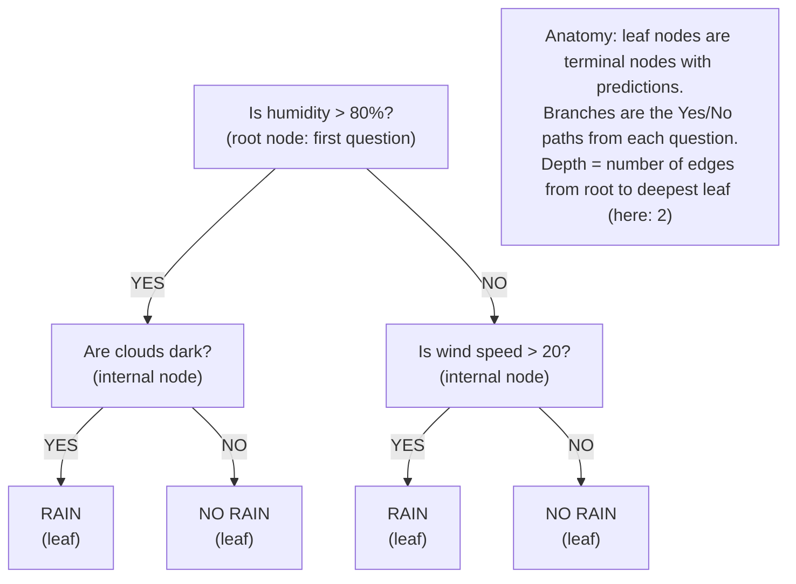
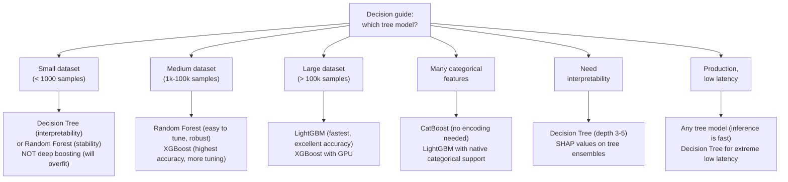

# Chapter 10: Decision Trees, Random Forests, and Gradient Boosting

> **"One tree makes no forest."**
> — Chinese Proverb (applicable to machine learning)

---

## Table of Contents
1. [Decision Trees — Intuition](#1-decision-trees--intuition)
2. [How Trees Are Built: Recursive Partitioning](#2-how-trees-are-built-recursive-partitioning)
3. [Split Criteria](#3-split-criteria)
4. [Tree Parameters and Overfitting](#4-tree-parameters-and-overfitting)
5. [Pruning](#5-pruning)
6. [Feature Importance in Trees](#6-feature-importance-in-trees)
7. [Sklearn Decision Trees](#7-sklearn-decision-trees)
8. [Ensemble Methods — The "Wisdom of Crowds"](#8-ensemble-methods--the-wisdom-of-crowds)
9. [Random Forest](#9-random-forest)
10. [Boosting — Sequential Correction](#10-boosting--sequential-correction)
11. [Gradient Boosting in Depth](#11-gradient-boosting-in-depth)
12. [XGBoost — The Kaggle Killer](#12-xgboost--the-kaggle-killer)
13. [LightGBM — Speed at Scale](#13-lightgbm--speed-at-scale)
14. [CatBoost — Native Categorical Support](#14-catboost--native-categorical-support)
15. [Comparison Table](#15-comparison-table)
16. [Full Example: Census Income Prediction](#16-full-example-census-income-prediction)
17. [Summary](#17-summary)
18. [Exercises](#18-exercises)

---

## 1. Decision Trees — Intuition

A decision tree is a model that makes predictions by asking a sequence of yes/no questions about the input features. The tree learns these questions automatically from data.



This is a model that a business analyst could draw on a whiteboard and explain to a non-technical executive. That interpretability is a major advantage.

**What makes trees different from linear models:**
- No assumptions about the functional form of the relationship
- Can model non-linear relationships without feature engineering
- Can model feature interactions automatically
- No scaling required (splits are based on feature values, not distances)
- Work for both classification and regression

---

## 2. How Trees Are Built: Recursive Partitioning

Trees are built using a **greedy, top-down recursive algorithm**. Here's the process:

```
ALGORITHM: Build Decision Tree
──────────────────────────────────────────────────────────────────
function BuildTree(data, max_depth, min_samples_split):

  1. If stopping criterion met (max depth reached, too few samples,
     all samples same class):
       Return leaf node with majority class (or mean value)

  2. For each feature f:
       For each possible split value v:
           Left  = {samples where feature f ≤ v}
           Right = {samples where feature f > v}
           Compute split quality(Left, Right)

  3. Choose the (f, v) pair with best split quality

  4. Create internal node: "Is feature f ≤ v?"
     Left branch  = BuildTree(Left, ...)   ← recursive call
     Right branch = BuildTree(Right, ...)  ← recursive call

  5. Return the node

──────────────────────────────────────────────────────────────────
Key word: GREEDY — at each node, we make the locally best split.
We do NOT look ahead to see if a different split would lead to
a better tree overall. This is why trees are fast but can be
suboptimal globally.
```

### Step-by-Step Example

Let's trace through building a tree on a tiny dataset:

```
DATASET: Predict whether to play tennis
─────────────────────────────────────────────────────────────────
Day | Outlook  | Humidity | Wind  | Play Tennis?
────┼──────────┼──────────┼───────┼──────────────
1   | Sunny    | High     | Weak  | No
2   | Sunny    | High     | Strong| No
3   | Overcast | High     | Weak  | Yes
4   | Rain     | High     | Weak  | Yes
5   | Rain     | Normal   | Weak  | Yes
6   | Rain     | Normal   | Strong| No
7   | Overcast | Normal   | Strong| Yes
8   | Sunny    | High     | Weak  | No
9   | Sunny    | Normal   | Weak  | Yes
10  | Rain     | Normal   | Weak  | Yes
14 samples total: 9 Yes, 5 No

STEP 1: Evaluate all possible root splits.
For feature "Outlook":
  Sunny:    5 samples (2 Yes, 3 No)
  Overcast: 4 samples (4 Yes, 0 No)  ← pure!
  Rain:     5 samples (3 Yes, 2 No)

For feature "Humidity":
  High:   7 samples (3 Yes, 4 No)
  Normal: 7 samples (6 Yes, 1 No)

For feature "Wind":
  Weak:   8 samples (6 Yes, 2 No)
  Strong: 6 samples (3 Yes, 3 No)

STEP 2: Compute Information Gain for each split.
IG(Outlook)  = 0.246  ← HIGHEST
IG(Humidity) = 0.151
IG(Wind)     = 0.048

STEP 3: Choose Outlook as root node.

RESULT:
                 ┌──────────────┐
                 │   Outlook?   │
                 └──────────────┘
              /        |         \
           Sunny    Overcast     Rain
            /           |           \
    ┌──────────┐  ┌──────────┐  ┌──────────┐
    │ Humidity?│  │  Play=Yes│  │  Wind?   │
    │          │  │  (pure)  │  │          │
    └──────────┘  └──────────┘  └──────────┘
    /        \                   /       \
  High      Normal            Weak     Strong
    /           \                /          \
  No           Yes           Yes            No
```

---

## 3. Split Criteria

The "split quality" metric determines what makes a split good. Different criteria lead to slightly different trees.

### Information Gain (ID3 Algorithm)

Based on **entropy** from information theory:

```
Entropy H(S) = -Σ pₖ log₂(pₖ)    (sum over all classes k)

Where pₖ = fraction of samples in class k

Interpretation:
  H = 0: all samples same class (pure node) → no uncertainty
  H = 1: half each of two classes (maximally uncertain, binary case)
  H > 1: multiple classes with high uncertainty

Example:
  [9 Yes, 5 No]:  p_yes = 9/14, p_no = 5/14
  H = -(9/14)log₂(9/14) - (5/14)log₂(5/14) = 0.940

  [4 Yes, 0 No]:  p_yes = 1, p_no = 0
  H = -(1)log₂(1) - 0 = 0    (pure node, zero entropy)

Information Gain:
  IG(S, feature) = H(S) - Σ (|Sᵥ|/|S|) × H(Sᵥ)
                           v

  = Entropy of parent - weighted average entropy of children
  = How much uncertainty is REDUCED by this split?
  
  We choose the split that maximizes Information Gain.
```

### Gini Impurity (CART Algorithm)

The default in sklearn. Computationally cheaper than entropy (no log):

```
Gini(S) = 1 - Σ pₖ²

Interpretation:
  Gini = 0: all samples same class (pure)
  Gini = 0.5: equal split between 2 classes (maximally impure)
  Gini < Entropy numerically, but same ordering

Example:
  [4 Yes, 0 No]: Gini = 1 - (1² + 0²) = 0     (pure)
  [2 Yes, 2 No]: Gini = 1 - (0.5² + 0.5²) = 0.5 (max impurity)
  [3 Yes, 1 No]: Gini = 1 - (0.75² + 0.25²) = 0.375

Gini Gain (for a split):
  ΔGini = Gini(S) - Σ (|Sᵥ|/|S|) × Gini(Sᵥ)

Choose split that maximizes ΔGini.
```

### Variance Reduction (Regression Trees)

For regression, we minimize the **variance** of target values in each child:

```
Variance Reduction = Var(S) - Σ (|Sᵥ|/|S|) × Var(Sᵥ)

Var(S) = (1/|S|) Σ (yᵢ - ȳ)²

Leaf prediction = mean(y) of all samples in that leaf.
```

### Comparing the Criteria

```
INFORMATION GAIN vs GINI vs VARIANCE REDUCTION
──────────────────────────────────────────────────────────────
Criterion      | Task           | sklearn name | Notes
───────────────┼────────────────┼──────────────┼──────────────────
Entropy/IG     | Classification | 'entropy'    | Computationally expensive
               |                |              | (needs log₂)
Gini Impurity  | Classification | 'gini'       | Faster, similar results
               |                |              | sklearn default
Variance       | Regression     | 'squared_    | Minimizes variance
Reduction      |                | error'       | within leaves
Friedman MSE   | Regression     | 'friedman_   | Uses Friedman's
               |                | mse'         | improvement score
```

In practice, Gini and Entropy produce very similar trees. Don't obsess over the choice.

---

## 4. Tree Parameters and Overfitting

A decision tree with no constraints will **grow until every leaf is pure** — this is guaranteed overfitting on training data.

```
UNLIMITED DEPTH TREE
────────────────────────────────────────────────────────────────
Training Accuracy: 100%   (every leaf is pure)
Test Accuracy:     ???    (the model memorized noise)

The tree essentially memorizes the training set.
Each unique training point gets its own leaf node.
On new data: completely unreliable.
```

### Key Hyperparameters

| Parameter | Effect | Default | Guidance |
|-----------|--------|---------|----------|
| `max_depth` | Maximum depth of tree | None (unlimited) | Start with 3-10, tune |
| `min_samples_split` | Minimum samples to split an internal node | 2 | Higher = more regularization |
| `min_samples_leaf` | Minimum samples in a leaf | 1 | Higher = smoother model |
| `max_features` | Max features considered per split | None (all) | Reduce for ensembles |
| `max_leaf_nodes` | Maximum number of leaves | None | Alternative to max_depth |
| `min_impurity_decrease` | Minimum gain required to split | 0 | Prunes low-quality splits |

```
DEPTH vs OVERFITTING VISUALIZATION
────────────────────────────────────────────────────────────────
                                         Training error: low
  Error                                  Test error: high
    │   ╲                                         ↑
    │    ╲                         ╭──────────────╯
    │     ╲    TEST ERROR     ╭────╯
    │      ╲              ╭───╯
    │       ╲──────────────╯
    │        ─────────────────────────── TRAINING ERROR ≈ 0
    │
    └──────────────────────────────────────────────
         1     2     3     5    10    ∞    max_depth

Tree depth 1 ("decision stump"): high bias, can't fit the data.
Tree depth 3-5: often a good range for standalone trees.
Unlimited depth: 100% training accuracy, bad generalization.
```

---

## 5. Pruning

**Pre-pruning** (early stopping): Stop growing the tree before it overfits. Use `max_depth`, `min_samples_split`, etc.

**Post-pruning** (grow then prune): Grow the full tree, then remove branches that don't improve performance on a validation set.

**Cost-Complexity Pruning** (sklearn's `ccp_alpha`):

```
Objective = Error(T) + α × |T|

Where:
  T        = the tree
  Error(T) = training error
  |T|      = number of leaves (model complexity)
  α (ccp_alpha) = pruning strength

  α = 0: no pruning (full tree)
  α > 0: penalize complexity → remove leaves with little gain

This is analogous to regularization in linear models!
```

```python
from sklearn.tree import DecisionTreeClassifier
from sklearn.model_selection import train_test_split
from sklearn.datasets import load_breast_cancer
from sklearn.metrics import accuracy_score
import numpy as np

X, y = load_breast_cancer(return_X_y=True)
X_train, X_test, y_train, y_test = train_test_split(X, y, test_size=0.2, random_state=42)

# Find optimal ccp_alpha using cost-complexity pruning path
full_tree = DecisionTreeClassifier(random_state=42)
full_tree.fit(X_train, y_train)

# Get the pruning path
path = full_tree.cost_complexity_pruning_path(X_train, y_train)
ccp_alphas = path.ccp_alphas[:-1]  # remove last (trivial tree)

train_scores = []
test_scores  = []

for alpha in ccp_alphas:
    tree = DecisionTreeClassifier(ccp_alpha=alpha, random_state=42)
    tree.fit(X_train, y_train)
    train_scores.append(accuracy_score(y_train, tree.predict(X_train)))
    test_scores.append(accuracy_score(y_test, tree.predict(X_test)))

# Find optimal alpha
best_idx = np.argmax(test_scores)
print(f"Best ccp_alpha: {ccp_alphas[best_idx]:.5f}")
print(f"Best test accuracy: {test_scores[best_idx]:.4f}")
print(f"Full tree test accuracy: {accuracy_score(y_test, full_tree.predict(X_test)):.4f}")
```

---

## 6. Feature Importance in Trees

Trees provide a natural measure of feature importance: how much each feature reduces impurity across all splits that use it.

```
IMPURITY-BASED FEATURE IMPORTANCE
────────────────────────────────────────────────────────────────
For each node n that splits on feature f:
  importance(n) = (n_samples/N) × ΔImpurity(n)

  ΔImpurity(n) = Impurity(n) - (n_left/n) × Impurity(left)
                              - (n_right/n) × Impurity(right)

Sum over all nodes that use feature f:
  importance(f) = Σ importance(n)

Normalize: importance(f) / Σⱼ importance(j)  → sums to 1

Interpretation:
  Higher importance = this feature reduces impurity more
                    = this feature is more useful for splitting
```

**Caveat:** Impurity-based importance can favor high-cardinality features (many unique values) even if they're not truly informative. Permutation importance is more reliable.

---

## 7. Sklearn Decision Trees

```python
from sklearn.tree import (
    DecisionTreeClassifier, DecisionTreeRegressor,
    plot_tree, export_graphviz
)
from sklearn.datasets import load_iris
from sklearn.model_selection import train_test_split
import numpy as np
import pandas as pd

# ==========================================================
# Classification Tree
# ==========================================================
X, y = load_iris(return_X_y=True)
feature_names = load_iris().feature_names
class_names   = load_iris().target_names

X_train, X_test, y_train, y_test = train_test_split(
    X, y, test_size=0.2, random_state=42, stratify=y
)

# Train with depth limit
clf = DecisionTreeClassifier(
    criterion='gini',          # Split criterion: 'gini' or 'entropy'
    max_depth=3,               # Max tree depth
    min_samples_split=10,      # Min samples to create a split
    min_samples_leaf=5,        # Min samples in any leaf
    random_state=42
)
clf.fit(X_train, y_train)

print(f"Train accuracy: {clf.score(X_train, y_train):.4f}")
print(f"Test accuracy:  {clf.score(X_test, y_test):.4f}")
print(f"Tree depth: {clf.get_depth()}")
print(f"Number of leaves: {clf.get_n_leaves()}")

# Feature importances
importance_df = pd.DataFrame({
    'Feature': feature_names,
    'Importance': clf.feature_importances_
}).sort_values('Importance', ascending=False)
print("\nFeature Importances:")
print(importance_df.to_string(index=False))

# Visualize the tree
import matplotlib.pyplot as plt
plt.figure(figsize=(20, 8))
plot_tree(
    clf,
    feature_names=feature_names,
    class_names=class_names,
    filled=True,          # Color nodes by majority class
    rounded=True,         # Rounded corners
    impurity=True,        # Show gini values
    proportion=False      # Show raw counts
)
plt.title("Decision Tree (max_depth=3)")
plt.tight_layout()
plt.savefig('decision_tree.png', dpi=100, bbox_inches='tight')

# ==========================================================
# Regression Tree
# ==========================================================
from sklearn.datasets import fetch_california_housing

Xr, yr = fetch_california_housing(return_X_y=True)
Xr_train, Xr_test, yr_train, yr_test = train_test_split(
    Xr, yr, test_size=0.2, random_state=42
)

reg_tree = DecisionTreeRegressor(
    max_depth=5,
    min_samples_leaf=20,
    random_state=42
)
reg_tree.fit(Xr_train, yr_train)
print(f"\nRegression Tree R²: {reg_tree.score(Xr_test, yr_test):.4f}")
```

### Pros and Cons of Decision Trees

| Aspect | Pro | Con |
|--------|-----|-----|
| Interpretability | Can visualize the full tree | Deep trees lose interpretability |
| Data preprocessing | No scaling required | — |
| Feature types | Handles mixed types | — |
| Missing values | Some implementations handle natively | sklearn needs imputation |
| Interactions | Captures feature interactions | — |
| Variance | — | Very high variance (unstable) |
| Accuracy | — | Often lower than ensemble methods |
| Overfitting | — | Prone to overfitting without pruning |

The high variance is the key weakness: retrain on a slightly different dataset and you might get a completely different tree. This is what ensembles fix.

---

## 8. Ensemble Methods — The "Wisdom of Crowds"

The core insight: **many imperfect models combined are often better than one perfect model**.

**Why does combining models help?**

If you have 3 classifiers each with 70% accuracy, and their errors are **uncorrelated** (they make different mistakes), then:
- All 3 correct: 0.70³ = 34%
- 2 of 3 correct (majority vote wins): 3 × 0.70² × 0.30 = 44%
- 2 or 3 correct (majority vote correct): 34% + 44% = **78%**

Majority voting turns three 70% classifiers into a 78% ensemble!

The key word is **uncorrelated** — if all models make the same mistakes, combining them doesn't help. This is why ensemble methods work hard to create diverse, uncorrelated base models.

```
ENSEMBLE ERROR REDUCTION
────────────────────────────────────────────────────────────────
Single model:  Error = Bias² + Variance + Noise
Ensemble:
  Bagging: Bias stays same, VARIANCE DECREASES by factor 1/n
           (variance of average < variance of individual)
  Boosting: Bias DECREASES, variance stays roughly same

Let's see the math for bagging:
  Var(X̄) = Var(X)/n  for i.i.d. models
  In practice: models are correlated, so we get less than 1/n
  But still significantly better than single model
```

### Two Fundamental Approaches

```
BAGGING                              BOOSTING
─────────────────────                ─────────────────────
Models trained in PARALLEL           Models trained SEQUENTIALLY

Sample bootstrap datasets            Each model corrects errors
Train independent models             of previous models

Reduce VARIANCE                      Reduce BIAS

Each model has full vote             Weighted voting
(equal weight)                       (later models may differ)

Random Forest uses bagging           AdaBoost, GBM, XGBoost
```

---

## 9. Random Forest

Random Forest = Bagging + Feature Randomness on decision trees.

### Algorithm

```
RANDOM FOREST TRAINING
────────────────────────────────────────────────────────────────
Input: training set (X, y), n_estimators=B, max_features=k

For b = 1 to B:
  1. Bootstrap sample: Draw n samples WITH replacement from training set
     (about 63.2% unique samples, 36.8% duplicates on average)

  2. Grow a decision tree Tᵦ on the bootstrap sample,
     but at EACH split:
       - Randomly select k features from all p features
       - Only consider those k features for the split
       (typically k = √p for classification, p/3 for regression)

  3. Grow tree to full depth (no pruning!)

Prediction (classification):
  ŷ = mode({ T₁(x), T₂(x), ..., T_B(x) })   ← majority vote

Prediction (regression):
  ŷ = mean({ T₁(x), T₂(x), ..., T_B(x) })   ← average
```

**Why feature randomness?** Without it, if one feature is very strong, every tree would use it at the root → highly correlated trees → no variance reduction benefit.

By forcing each split to consider only k features, trees become more different from each other (decorrelated), and the ensemble benefits more from averaging.

### Out-of-Bag (OOB) Error

A "free" estimate of test error that doesn't require a separate validation set:

```
OOB ERROR
────────────────────────────────────────────────────────────────
Each bootstrap sample leaves out ~36.8% of training samples.
These are the "out-of-bag" samples for that tree.

For each training sample xᵢ:
  - It was NOT in the bootstrap sample for some trees
  - Those trees haven't seen xᵢ → they're unbiased estimators for xᵢ
  - Predict xᵢ using only those trees
  - OOB prediction for xᵢ = majority vote of those trees

OOB error = fraction of training samples wrongly predicted
           by their OOB trees

This is a reliable estimate of generalization error!
No need for a separate validation set with Random Forest.
```

### Implementation

```python
from sklearn.ensemble import RandomForestClassifier, RandomForestRegressor
from sklearn.datasets import load_breast_cancer
from sklearn.model_selection import train_test_split
from sklearn.metrics import accuracy_score, roc_auc_score, classification_report
import numpy as np
import pandas as pd

X, y = load_breast_cancer(return_X_y=True)
feature_names = load_breast_cancer().feature_names

X_train, X_test, y_train, y_test = train_test_split(
    X, y, test_size=0.2, random_state=42, stratify=y
)

# ── Random Forest Classifier ──────────────────────────────────
rf = RandomForestClassifier(
    n_estimators=200,        # Number of trees — more is generally better
    max_features='sqrt',     # √p features at each split (classification default)
    max_depth=None,          # Grow full trees (regularization via randomness)
    min_samples_split=2,
    min_samples_leaf=1,
    bootstrap=True,          # Use bootstrap sampling
    oob_score=True,          # Compute out-of-bag score
    n_jobs=-1,               # Use all CPU cores
    random_state=42
)

rf.fit(X_train, y_train)

y_pred  = rf.predict(X_test)
y_proba = rf.predict_proba(X_test)[:, 1]

print("=== Random Forest Results ===")
print(f"Train accuracy: {rf.score(X_train, y_train):.4f}")
print(f"Test accuracy:  {accuracy_score(y_test, y_pred):.4f}")
print(f"AUC-ROC:        {roc_auc_score(y_test, y_proba):.4f}")
print(f"OOB score:      {rf.oob_score_:.4f}")  # "Free" validation estimate
print(f"\n{classification_report(y_test, y_pred, target_names=['malignant', 'benign'])}")

# ── Feature Importances ───────────────────────────────────────
importance_df = pd.DataFrame({
    'Feature': feature_names,
    'Importance': rf.feature_importances_
}).sort_values('Importance', ascending=False)

print("Top 10 Feature Importances:")
for _, row in importance_df.head(10).iterrows():
    bar = '█' * int(row['Importance'] * 100)
    print(f"  {row['Feature'][:25]:25s}: {row['Importance']:.4f} {bar}")

# ── Hyperparameter Impact ─────────────────────────────────────
print("\n=== n_estimators Comparison ===")
for n in [10, 50, 100, 200, 500]:
    rf_temp = RandomForestClassifier(n_estimators=n, n_jobs=-1, random_state=42, oob_score=True)
    rf_temp.fit(X_train, y_train)
    test_acc = accuracy_score(y_test, rf_temp.predict(X_test))
    print(f"  n_estimators={n:4d}: test={test_acc:.4f}, oob={rf_temp.oob_score_:.4f}")
# After ~100-200 trees, performance stabilizes. More trees never hurt, just slower.
```

### When Random Forest Wins

- Tabular data with mixed feature types
- Datasets with some noisy or irrelevant features (RF is robust)
- When you need reliable feature importances
- When interpretability is less critical than accuracy
- When you don't want to tune many hyperparameters

---

## 10. Boosting — Sequential Correction

Boosting is conceptually different from bagging. Instead of training independent models and averaging, boosting trains a **sequence of models**, each one focused on correcting the errors of the previous ensemble.

### AdaBoost (Adaptive Boosting)

AdaBoost was the first major boosting algorithm (Freund & Schapire, 1996). It trains on **reweighted versions** of the training set:

```
ADABOOST ALGORITHM
────────────────────────────────────────────────────────────────
Initialize: equal weights wᵢ = 1/n for all samples

For t = 1 to T:
  1. Train a "weak learner" hₜ (typically a depth-1 tree = stump)
     on the weighted dataset

  2. Compute weighted error:
     εₜ = Σᵢ wᵢ × 1[hₜ(xᵢ) ≠ yᵢ]   (sum of weights of wrong predictions)

  3. Compute model weight (confidence):
     αₜ = 0.5 × log((1 - εₜ) / εₜ)
     → εₜ < 0.5 → αₜ > 0 (better than random → positive weight)
     → εₜ = 0.5 → αₜ = 0 (random → ignore this model)

  4. Update sample weights:
     wᵢ ← wᵢ × exp(-αₜ × yᵢ × hₜ(xᵢ))
     Misclassified samples: higher weight (model focuses on these next)
     Correctly classified:  lower weight

  5. Normalize: wᵢ ← wᵢ / Σⱼ wⱼ

Final prediction: H(x) = sign(Σₜ αₜ hₜ(x))   (weighted vote)
```

AdaBoost is elegant but sensitive to outliers (outliers get extremely high weights).

---

## 11. Gradient Boosting in Depth

Gradient Boosting (Friedman, 2001) is a generalization of boosting that works with any differentiable loss function. It is the conceptual foundation of XGBoost and LightGBM.

**Key Insight: Fit Residuals**

At each step, instead of reweighting, gradient boosting fits a new tree to the **residuals** (errors) of the current ensemble.

```
GRADIENT BOOSTING — STEP BY STEP EXAMPLE
────────────────────────────────────────────────────────────────
Dataset: Predict house prices (regression)

Initial Model F₀: predict mean(y) = $250,000 for all houses

House:  Price   F₀      Residual r₁
1       300k    250k    +50k
2       200k    250k    -50k
3       350k    250k   +100k
4       180k    250k    -70k
5       280k    250k    +30k

Step 1: Train Tree h₁ on RESIDUALS (not original y!)
  Tree h₁ learns to predict the residual:
    IF sq_ft > 2000: predict +80k residual
    ELSE:            predict -40k residual

  Update ensemble: F₁(x) = F₀(x) + η × h₁(x)
  where η (eta) = learning rate = 0.1 (shrinkage)

  New predictions:
  House 1: 250k + 0.1 × 80k = 258k  (residual was +50k, got closer)
  House 2: 250k + 0.1 × (-40k) = 246k (residual was -50k, got closer)

Step 2: Compute new residuals r₂ = y - F₁(x)
  House 1: 300k - 258k = +42k
  House 2: 200k - 246k = -46k
  ...

Step 3: Train Tree h₂ on r₂. Update: F₂ = F₁ + η × h₂

... repeat for T steps ...

Final prediction: F_T(x) = Σₜ η × hₜ(x)
```

### The Gradient Connection

Why "gradient" boosting? Each residual is the **negative gradient of the MSE loss**:

```
MSE = (1/2)(y - F(x))²

∂MSE/∂F(x) = -(y - F(x)) = -(residual)

So: residual = -∂Loss/∂F(x)

We're doing gradient descent in FUNCTION SPACE.
Each new tree is a step in the direction that reduces the loss.
```

This generalizes beyond MSE — any differentiable loss function works by computing its gradient at each step.

```python
from sklearn.ensemble import GradientBoostingClassifier, GradientBoostingRegressor
from sklearn.datasets import load_breast_cancer
from sklearn.model_selection import train_test_split
from sklearn.metrics import accuracy_score, roc_auc_score

X, y = load_breast_cancer(return_X_y=True)
X_train, X_test, y_train, y_test = train_test_split(
    X, y, test_size=0.2, random_state=42, stratify=y
)

# Sklearn GradientBoostingClassifier
gbm = GradientBoostingClassifier(
    n_estimators=200,       # Number of boosting rounds
    learning_rate=0.05,     # Shrinkage: smaller = more robust but needs more trees
    max_depth=3,            # Depth of each individual tree (typically 3-5)
    subsample=0.8,          # Fraction of training data per tree (stochastic GB)
    max_features='sqrt',    # Feature randomness like RF
    min_samples_leaf=5,
    random_state=42
)
gbm.fit(X_train, y_train)
y_proba = gbm.predict_proba(X_test)[:, 1]

print(f"Sklearn GBM AUC-ROC: {roc_auc_score(y_test, y_proba):.4f}")
print(f"Sklearn GBM Accuracy: {accuracy_score(y_test, gbm.predict(X_test)):.4f}")

# Monitor training and validation loss (important: watch for overfitting)
print("\nLearning curve (deviance):")
test_scores = np.zeros(gbm.n_estimators)
for i, y_pred in enumerate(gbm.staged_predict_proba(X_test)):
    from sklearn.metrics import log_loss
    test_scores[i] = log_loss(y_test, y_pred[:, 1])

best_n = np.argmin(test_scores) + 1
print(f"Best n_estimators: {best_n} (test log-loss: {test_scores[best_n-1]:.4f})")
```

### Learning Rate and n_estimators Tradeoff

```
LEARNING RATE AND N_ESTIMATORS
────────────────────────────────────────────────────────────────
Small learning rate (η = 0.01):
  + More robust, less likely to overfit
  + Generally better final performance
  - Needs many more trees (large n_estimators)
  - Slower to train

Large learning rate (η = 0.1):
  + Fewer trees needed
  - More likely to overfit
  - Can jump over the minimum

Rule of thumb:
  learning_rate × n_estimators ≈ constant
  0.1 × 100 ≈ 0.01 × 1000  (roughly same)

Start with learning_rate=0.1, tune n_estimators with early stopping.
Then lower learning_rate and scale up n_estimators.
```

---

## 12. XGBoost — The Kaggle Killer

XGBoost (eXtreme Gradient Boosting, Chen & Guestrin, 2016) dominated Kaggle competitions for years and remains among the best tools for tabular data.

### What Makes XGBoost Better than Vanilla Gradient Boosting

**1. Regularization built into tree building:**
```
XGBoost Objective = Loss(ŷ, y) + Ω(f)

Ω(f) = γ × T + (λ/2) × Σⱼ wⱼ²

Where:
  T = number of leaves (controls tree complexity)
  wⱼ = leaf weight (output value at leaf j)
  γ = minimum gain required to make a split
  λ = L2 regularization on leaf weights
  α = L1 regularization on leaf weights
```

**2. Second-order gradients (Newton approximation):**
```
Vanilla GB: uses first-order gradient only (like SGD)
XGBoost:   uses first AND second order (like Newton's method)

Taylor expansion of loss: L(ŷ + Δ) ≈ L(ŷ) + g·Δ + (h/2)·Δ²
  g = ∂L/∂ŷ (first gradient)
  h = ∂²L/∂ŷ² (second gradient = Hessian)

This gives more accurate gradient estimates → fewer iterations needed
```

**3. Parallel and distributed tree building:**
- Features are presorted and cached
- Multiple cores used when building each level
- Can scale to very large datasets

**4. Sparsity-aware algorithm:**
- Handles missing values natively (learns the default direction)
- Efficient for sparse feature matrices (e.g., one-hot encoded data)

### Key Parameters

| Parameter | What it controls | Typical range |
|-----------|-----------------|---------------|
| `n_estimators` | Number of trees | 100-10000 |
| `max_depth` | Max tree depth | 3-10 |
| `learning_rate` | Shrinkage | 0.01-0.3 |
| `subsample` | Fraction of rows per tree | 0.5-1.0 |
| `colsample_bytree` | Fraction of features per tree | 0.5-1.0 |
| `colsample_bylevel` | Fraction of features per level | 0.5-1.0 |
| `min_child_weight` | Min sum of Hessian in leaf | 1-10 |
| `gamma` (`min_split_loss`) | Min gain to split | 0-5 |
| `lambda` | L2 leaf regularization | 0-5 |
| `alpha` | L1 leaf regularization | 0-5 |
| `scale_pos_weight` | Handles class imbalance | n_neg/n_pos |

```python
# pip install xgboost
import xgboost as xgb
from sklearn.model_selection import train_test_split
from sklearn.datasets import load_breast_cancer
from sklearn.metrics import roc_auc_score, accuracy_score
import numpy as np

X, y = load_breast_cancer(return_X_y=True)
X_train, X_test, y_train, y_test = train_test_split(
    X, y, test_size=0.2, random_state=42, stratify=y
)

# XGBoost sklearn API
xgb_model = xgb.XGBClassifier(
    n_estimators=1000,
    max_depth=4,
    learning_rate=0.05,
    subsample=0.8,
    colsample_bytree=0.8,
    gamma=0,               # min gain to split
    reg_lambda=1.0,        # L2 regularization
    reg_alpha=0.0,         # L1 regularization
    scale_pos_weight=1,    # 1 for balanced, n_neg/n_pos for imbalanced
    use_label_encoder=False,
    eval_metric='logloss',
    random_state=42,
    n_jobs=-1,
    verbosity=0
)

# Early stopping: stop when validation logloss hasn't improved for 50 rounds
xgb_model.fit(
    X_train, y_train,
    eval_set=[(X_test, y_test)],
    early_stopping_rounds=50,
    verbose=False  # Set True to see training progress
)

print(f"Best iteration: {xgb_model.best_iteration}")
print(f"XGBoost AUC-ROC: {roc_auc_score(y_test, xgb_model.predict_proba(X_test)[:, 1]):.4f}")
print(f"XGBoost Accuracy: {accuracy_score(y_test, xgb_model.predict(X_test)):.4f}")

# Feature importances (XGBoost has multiple types)
print("\nFeature Importances (weight = how often feature used):")
feat_imp = xgb_model.get_booster().get_score(importance_type='weight')
sorted_imp = sorted(feat_imp.items(), key=lambda x: x[1], reverse=True)
for feat, imp in sorted_imp[:5]:
    print(f"  {feat}: {imp}")

# ── Native XGBoost API (more powerful) ─────────────────────
dtrain = xgb.DMatrix(X_train, label=y_train)
dtest  = xgb.DMatrix(X_test,  label=y_test)

params = {
    'objective': 'binary:logistic',   # binary classification
    'eval_metric': 'auc',
    'max_depth': 4,
    'learning_rate': 0.05,
    'subsample': 0.8,
    'colsample_bytree': 0.8,
    'lambda': 1.0,
    'seed': 42
}

evals_result = {}
bst = xgb.train(
    params,
    dtrain,
    num_boost_round=1000,
    evals=[(dtrain, 'train'), (dtest, 'test')],
    early_stopping_rounds=50,
    evals_result=evals_result,
    verbose_eval=100  # print every 100 rounds
)

print(f"\nBest iteration: {bst.best_iteration}")
print(f"Best test AUC: {bst.best_score:.4f}")
```

---

## 13. LightGBM — Speed at Scale

LightGBM (Microsoft, 2017) is often faster than XGBoost, especially on large datasets. It introduces two key innovations:

### Leaf-wise vs Level-wise Growth

```
LEVEL-WISE GROWTH (XGBoost, sklearn)    LEAF-WISE GROWTH (LightGBM)
────────────────────────────────────    ────────────────────────────
Grow all leaves at depth d before       Grow the leaf with highest
going to depth d+1.                     gain, regardless of depth.

Level 1:  [n1]                          [root]
Level 2:  [n1L] [n1R]                   [root] → [leaf with max gain]
Level 3:  [n1LL] [n1LR] [n1RL] [n1RR]  [deep chain on one side]

Pros: balanced tree, less overfitting    Pros: fewer iterations for same loss
Cons: wastes splits on low-gain nodes   Cons: can overfit on small data
                                        Fix:  use min_data_in_leaf
```

### Histogram-Based Splits

XGBoost (default) sorts all values for each feature to find split points. LightGBM bins feature values into histograms:

```
TRADITIONAL vs HISTOGRAM SPLITS
────────────────────────────────────────────────────────────────
Traditional (exact):
  Feature values: [1.2, 4.7, 2.1, 8.3, 0.5, 6.2, ...]
  Sort them, try every adjacent pair as split point
  Cost: O(n × p) per level

Histogram (LightGBM):
  Bucket feature values into B bins (e.g., 255 bins)
  Feature values: [0, 2, 1, 4, 0, 3, ...]  (bin indices)
  Only try B split points instead of n
  Cost: O(B × p) per level, independent of n!
  
  For n=1,000,000 and B=255: 4,000× speedup!
```

### GOSS and EFB

- **GOSS (Gradient-based One-Side Sampling):** Keep all samples with large gradients (hard examples), randomly sample from small-gradient samples. Large gradients indicate misclassified examples — don't miss them.

- **EFB (Exclusive Feature Bundling):** Many features are mutually exclusive (sparse one-hot encoded features). Bundle them into one feature to reduce the number of features processed.

```python
# pip install lightgbm
import lightgbm as lgb
from sklearn.model_selection import train_test_split
from sklearn.datasets import load_breast_cancer
from sklearn.metrics import roc_auc_score

X, y = load_breast_cancer(return_X_y=True)
X_train, X_test, y_train, y_test = train_test_split(
    X, y, test_size=0.2, random_state=42, stratify=y
)

# sklearn API
lgbm_model = lgb.LGBMClassifier(
    n_estimators=1000,
    max_depth=-1,           # -1 = no limit (use num_leaves instead)
    num_leaves=31,          # Max leaves per tree (main complexity control)
    learning_rate=0.05,
    subsample=0.8,          # Row sampling
    colsample_bytree=0.8,   # Column sampling
    min_child_samples=20,   # Min samples in leaf (key for avoiding overfit)
    reg_alpha=0.0,          # L1 regularization
    reg_lambda=0.0,         # L2 regularization
    random_state=42,
    n_jobs=-1,
    verbose=-1
)

lgbm_model.fit(
    X_train, y_train,
    eval_set=[(X_test, y_test)],
    callbacks=[lgb.early_stopping(50, verbose=False)]
)

print(f"LightGBM AUC-ROC: {roc_auc_score(y_test, lgbm_model.predict_proba(X_test)[:, 1]):.4f}")
print(f"Best iteration: {lgbm_model.best_iteration_}")
```

---

## 14. CatBoost — Native Categorical Support

CatBoost (Yandex, 2017) handles categorical features without manual encoding. This is significant because many real datasets are categorical-heavy, and encoding them can cause information loss.

```python
# pip install catboost
from catboost import CatBoostClassifier
import numpy as np

# CatBoost takes categorical feature INDICES
cat_features_idx = [0, 2, 5]  # indices of categorical columns

cbm = CatBoostClassifier(
    iterations=1000,
    learning_rate=0.05,
    depth=6,
    cat_features=cat_features_idx,  # Tell CatBoost which are categorical
    eval_metric='AUC',
    random_seed=42,
    verbose=100
)
# cbm.fit(X_train, y_train, eval_set=(X_test, y_test), early_stopping_rounds=50)

# CatBoost uses ordered boosting to avoid target leakage in categorical encoding
# Key for real-world data with many high-cardinality categorical features
```

---

## 15. Comparison Table

| Model | Train Speed | Inference Speed | Accuracy (tabular) | Interp. | Memory | Key Strength |
|-------|-------------|-----------------|-------------------|---------|--------|--------------|
| Decision Tree | Fast | Very Fast | Low-Medium | High | Low | Interpretable |
| Random Forest | Medium | Medium | Good | Medium | Medium | Robust, stable |
| sklearn GBM | Slow | Fast | Good | Low | Medium | Classic, reliable |
| XGBoost | Medium-Fast | Fast | Excellent | Low | Medium | Regularized, accurate |
| LightGBM | Very Fast | Fast | Excellent | Low | Low | Large data, fast |
| CatBoost | Medium | Fast | Excellent | Low | Medium | Categorical features |

### When to Use Which



---

## 16. Full Example: Census Income Prediction

```python
# =============================================================================
# FULL EXAMPLE: Census Income Prediction (Adult Dataset)
# Predict whether income > $50K/year from census data
# =============================================================================

import numpy as np
import pandas as pd
from sklearn.datasets import fetch_openml
from sklearn.model_selection import train_test_split, cross_val_score, StratifiedKFold
from sklearn.tree import DecisionTreeClassifier
from sklearn.ensemble import RandomForestClassifier, GradientBoostingClassifier
from sklearn.preprocessing import LabelEncoder
from sklearn.metrics import (
    accuracy_score, roc_auc_score, f1_score, classification_report
)
import warnings
warnings.filterwarnings('ignore')

# =============================================================================
# STEP 1: Load Data
# =============================================================================
print("Loading Adult Census dataset...")
# Adult dataset: 48,842 samples, 14 features
# Available from OpenML or as CSV from UCI ML Repository
data = fetch_openml('adult', version=2, as_frame=True, parser='auto')
df = data.frame.copy()

print(f"Shape: {df.shape}")
print(f"\nFeature types:")
print(df.dtypes.value_counts())
print(f"\nTarget distribution:\n{df['class'].value_counts()}")

# =============================================================================
# STEP 2: Preprocessing
# =============================================================================
# Target encoding
df['target'] = (df['class'] == '>50K').astype(int)
y = df['target'].values
X_raw = df.drop(columns=['class', 'target'])

print(f"\nClass distribution: {np.bincount(y)}")
print(f"Income > 50K: {y.mean():.1%}")

# Encode all categorical features with LabelEncoder
# (for demo purposes; Chapter 13 shows the pipeline approach)
X_encoded = X_raw.copy()
label_encoders = {}

for col in X_encoded.select_dtypes(include=['category', 'object']).columns:
    le = LabelEncoder()
    # Handle '?' missing values in Adult dataset
    X_encoded[col] = X_encoded[col].astype(str)
    X_encoded[col] = le.fit_transform(X_encoded[col])
    label_encoders[col] = le

# Convert to numpy
X = X_encoded.values.astype(float)
feature_names = list(X_encoded.columns)

print(f"\nEncoded feature matrix shape: {X.shape}")

# =============================================================================
# STEP 3: Train/Test Split
# =============================================================================
X_train, X_test, y_train, y_test = train_test_split(
    X, y,
    test_size=0.2,
    random_state=42,
    stratify=y
)

print(f"\nTrain size: {len(X_train)}, Test size: {len(X_test)}")

# =============================================================================
# STEP 4: Train All Models
# =============================================================================
models = {
    'Decision Tree (depth=5)': DecisionTreeClassifier(
        max_depth=5, min_samples_leaf=20, random_state=42
    ),
    'Decision Tree (no limit)': DecisionTreeClassifier(
        random_state=42  # Overfit baseline
    ),
    'Random Forest': RandomForestClassifier(
        n_estimators=200, max_features='sqrt',
        n_jobs=-1, oob_score=True, random_state=42
    ),
    'Gradient Boosting': GradientBoostingClassifier(
        n_estimators=200, learning_rate=0.1,
        max_depth=4, subsample=0.8, random_state=42
    ),
}

# Optional: add XGBoost/LightGBM if installed
try:
    import xgboost as xgb
    models['XGBoost'] = xgb.XGBClassifier(
        n_estimators=500, max_depth=4, learning_rate=0.05,
        subsample=0.8, colsample_bytree=0.8,
        use_label_encoder=False, eval_metric='logloss',
        random_state=42, n_jobs=-1, verbosity=0
    )
except ImportError:
    print("XGBoost not installed. pip install xgboost")

try:
    import lightgbm as lgb
    models['LightGBM'] = lgb.LGBMClassifier(
        n_estimators=500, learning_rate=0.05, num_leaves=31,
        subsample=0.8, colsample_bytree=0.8,
        min_child_samples=20, random_state=42,
        n_jobs=-1, verbose=-1
    )
except ImportError:
    print("LightGBM not installed. pip install lightgbm")

# =============================================================================
# STEP 5: Train and Evaluate All Models
# =============================================================================
print("\n" + "="*65)
print(f"{'Model':30s} {'Train Acc':>10} {'Test Acc':>10} {'AUC-ROC':>10} {'F1':>8}")
print("="*65)

results = {}
for name, model in models.items():
    if 'XGBoost' in name or 'LightGBM' in name:
        model.fit(X_train, y_train,
                  eval_set=[(X_test, y_test)],
                  early_stopping_rounds=50,
                  verbose=False)
    else:
        model.fit(X_train, y_train)

    train_acc = accuracy_score(y_train, model.predict(X_train))
    test_acc  = accuracy_score(y_test,  model.predict(X_test))
    y_proba   = model.predict_proba(X_test)[:, 1]
    auc       = roc_auc_score(y_test, y_proba)
    f1        = f1_score(y_test, model.predict(X_test))
    results[name] = {'train_acc': train_acc, 'test_acc': test_acc, 'auc': auc, 'f1': f1}

    print(f"{name:30s} {train_acc:10.4f} {test_acc:10.4f} {auc:10.4f} {f1:8.4f}")

print("="*65)

# =============================================================================
# STEP 6: Feature Importance (Random Forest)
# =============================================================================
rf_model = models['Random Forest']
importance_df = pd.DataFrame({
    'Feature': feature_names,
    'Importance': rf_model.feature_importances_
}).sort_values('Importance', ascending=False)

print("\n=== Random Forest Feature Importances ===")
for _, row in importance_df.iterrows():
    bar = '█' * int(row['Importance'] * 200)
    print(f"  {row['Feature']:20s}: {row['Importance']:.4f} {bar}")

# =============================================================================
# STEP 7: Detailed Results for Best Model (GBM/XGBoost)
# =============================================================================
best_model_name = max(results.items(), key=lambda x: x[1]['auc'])[0]
best_model = models[best_model_name]
print(f"\n=== Detailed Report: {best_model_name} ===")
y_pred_best = best_model.predict(X_test)
print(classification_report(
    y_test, y_pred_best,
    target_names=['<=50K', '>50K']
))

# =============================================================================
# SUMMARY
# =============================================================================
print("\n=== KEY INSIGHT ===")
print("Decision Tree (no limit): train accuracy ~100%, test is lower → OVERFIT")
print("Decision Tree (depth=5): more balanced train vs test → better generalization")
print("Random Forest/GBM: strong performance, robust, OOB error ≈ test error")
print(f"\nBest model: {best_model_name}")
print(f"AUC-ROC: {results[best_model_name]['auc']:.4f}")
```

---

## 17. Summary

```
CHAPTER 10 KEY CONCEPTS
─────────────────────────────────────────────────────────────

DECISION TREES:
  Greedy recursive partitioning
  Split criteria: Gini (sklearn default), Entropy (ID3), Variance
  Depth controls bias-variance tradeoff
  High variance → perfect for ensembling

ENSEMBLE METHODS:
  Bagging: parallel, reduces variance, uses bootstrap sampling
  Boosting: sequential, reduces bias, corrects errors

RANDOM FOREST:
  Bagging + feature randomness (√p features per split)
  OOB score = free validation estimate
  Robust, easy to tune, good feature importance
  Best: n_estimators → more is better (just slower)

GRADIENT BOOSTING:
  Fit each new tree to residuals of current ensemble
  Learning rate (shrinkage) prevents overfitting
  Key hyperparams: n_estimators, max_depth, learning_rate

XGBOOST:
  Regularization in tree building (γ, λ, α)
  Second-order gradients → more accurate
  Early stopping → automatic n_estimators selection
  King of tabular ML competitions

LIGHTGBM:
  Leaf-wise growth (not level-wise)
  Histogram splits → much faster for large n
  Best for: large datasets (>100k rows)

TREE ENSEMBLE WINS ON TABULAR DATA because:
  - No feature scaling needed
  - Handles mixed types
  - Captures feature interactions
  - Robust to outliers
  - Built-in feature selection
```

---

## Mini Projects

### Mini Project 1: Feature Importance Dashboard (1 hour)

**Goal:** Compare feature importances from Decision Tree, Random Forest, and XGBoost side by side — see how different methods rank the same features.

```python
import pandas as pd
import numpy as np
import matplotlib.pyplot as plt
from sklearn.datasets import load_breast_cancer
from sklearn.model_selection import train_test_split
from sklearn.tree import DecisionTreeClassifier
from sklearn.ensemble import RandomForestClassifier, GradientBoostingClassifier
from sklearn.preprocessing import StandardScaler

data = load_breast_cancer()
X = pd.DataFrame(data.data, columns=data.feature_names)
y = data.target

X_train, X_test, y_train, y_test = train_test_split(X, y, test_size=0.2, random_state=42)

models = {
    "Decision Tree": DecisionTreeClassifier(max_depth=5, random_state=42),
    "Random Forest": RandomForestClassifier(n_estimators=200, random_state=42),
    "Gradient Boost": GradientBoostingClassifier(n_estimators=200, random_state=42),
}

importances = {}
for name, model in models.items():
    model.fit(X_train, y_train)
    importances[name] = pd.Series(model.feature_importances_, index=X.columns)
    acc = model.score(X_test, y_test)
    print(f"{name}: Test accuracy = {acc:.3f}")

# Sort features by Random Forest importance
rf_order = importances["Random Forest"].sort_values(ascending=True)

fig, ax = plt.subplots(figsize=(10, 12))
y_positions = np.arange(len(rf_order))
bar_width = 0.25
colors = ['#1f77b4', '#ff7f0e', '#2ca02c']

for i, (name, imps) in enumerate(importances.items()):
    ax.barh(y_positions + i * bar_width,
            imps[rf_order.index],
            height=bar_width, label=name, color=colors[i], alpha=0.8)

ax.set_yticks(y_positions + bar_width)
ax.set_yticklabels(rf_order.index, fontsize=9)
ax.set_xlabel("Feature Importance")
ax.set_title("Feature Importance Comparison: Tree vs RF vs GBM\n(Breast Cancer Dataset)")
ax.legend()
plt.tight_layout()
plt.savefig("feature_importance_dashboard.png")
plt.show()

# Print top 5 features from each
print("\nTop 5 features by model:")
for name, imps in importances.items():
    top5 = imps.nlargest(5)
    print(f"\n{name}:")
    for feat, imp in top5.items():
        print(f"  {feat}: {imp:.4f}")
```

---

### Mini Project 2: Ensemble Size vs Accuracy Experiment (1 hour)

**Goal:** Find the "sweet spot" number of trees — experiment with 1 to 500 trees and plot accuracy curves.

```python
import numpy as np
import matplotlib.pyplot as plt
from sklearn.datasets import make_classification
from sklearn.ensemble import RandomForestClassifier, GradientBoostingClassifier
from sklearn.model_selection import train_test_split

X, y = make_classification(
    n_samples=2000, n_features=20, n_informative=10,
    n_redundant=5, random_state=42
)
X_train, X_test, y_train, y_test = train_test_split(X, y, test_size=0.3, random_state=42)

n_estimators_range = [1, 5, 10, 20, 30, 50, 75, 100, 150, 200, 300, 500]

rf_scores = []
gb_scores = []

for n in n_estimators_range:
    rf = RandomForestClassifier(n_estimators=n, random_state=42, n_jobs=-1)
    rf.fit(X_train, y_train)
    rf_scores.append(rf.score(X_test, y_test))
    
    gb = GradientBoostingClassifier(n_estimators=n, random_state=42)
    gb.fit(X_train, y_train)
    gb_scores.append(gb.score(X_test, y_test))
    print(f"n={n:4d}: RF={rf_scores[-1]:.4f}, GBM={gb_scores[-1]:.4f}")

fig, ax = plt.subplots(figsize=(10, 6))
ax.plot(n_estimators_range, rf_scores, 'b-o', label='Random Forest', linewidth=2)
ax.plot(n_estimators_range, gb_scores, 'r-s', label='Gradient Boosting', linewidth=2)
ax.set_xscale('log')
ax.set_xlabel("Number of Trees (log scale)")
ax.set_ylabel("Test Accuracy")
ax.set_title("Accuracy vs Ensemble Size")
ax.legend()
ax.grid(True, alpha=0.3)

# Mark diminishing returns
rf_array = np.array(rf_scores)
gains = np.diff(rf_array)
sweet_spot = n_estimators_range[np.argmax(gains < 0.001) + 1] if any(gains < 0.001) else n_estimators_range[-1]
ax.axvline(sweet_spot, color='green', linestyle='--', alpha=0.7, label=f"Diminishing returns (~{sweet_spot} trees)")
ax.legend()

plt.tight_layout()
plt.savefig("ensemble_size_vs_accuracy.png")
plt.show()
```

---

### Mini Project 3: XGBoost Hyperparameter Tuning with Early Stopping (1.5 hours)

**Goal:** Use XGBoost with early stopping to automatically find the best number of rounds, then visualize the learning curves.

```python
import xgboost as xgb  # pip install xgboost
import numpy as np
import matplotlib.pyplot as plt
from sklearn.datasets import load_breast_cancer
from sklearn.model_selection import train_test_split
from sklearn.metrics import accuracy_score, roc_auc_score

X, y = load_breast_cancer(return_X_y=True)
X_train, X_test, y_train, y_test = train_test_split(X, y, test_size=0.2, random_state=42)
X_tr, X_val, y_tr, y_val = train_test_split(X_train, y_train, test_size=0.15, random_state=42)

dtrain = xgb.DMatrix(X_tr, label=y_tr)
dval   = xgb.DMatrix(X_val, label=y_val)
dtest  = xgb.DMatrix(X_test, label=y_test)

params = {
    "objective": "binary:logistic",
    "eval_metric": ["logloss", "auc"],
    "max_depth": 4,
    "eta": 0.05,           # learning rate
    "min_child_weight": 3,
    "subsample": 0.8,
    "colsample_bytree": 0.8,
    "seed": 42,
}

eval_results = {}
model = xgb.train(
    params,
    dtrain,
    num_boost_round=500,
    evals=[(dtrain, "train"), (dval, "val")],
    early_stopping_rounds=20,
    evals_result=eval_results,
    verbose_eval=50,
)

print(f"\nBest round: {model.best_iteration}")
print(f"Best val AUC: {model.best_score:.4f}")

# Test performance
y_prob = model.predict(dtest)
y_pred = (y_prob > 0.5).astype(int)
print(f"Test Accuracy: {accuracy_score(y_test, y_pred):.4f}")
print(f"Test AUC-ROC: {roc_auc_score(y_test, y_prob):.4f}")

# Learning curves
fig, axes = plt.subplots(1, 2, figsize=(14, 5))

axes[0].plot(eval_results["train"]["logloss"], label="Train LogLoss")
axes[0].plot(eval_results["val"]["logloss"], label="Val LogLoss")
axes[0].axvline(model.best_iteration, color='r', linestyle='--', label=f"Best: {model.best_iteration}")
axes[0].set_xlabel("Boosting Rounds"), axes[0].set_ylabel("Log Loss")
axes[0].set_title("Early Stopping: LogLoss")
axes[0].legend()

axes[1].plot(eval_results["train"]["auc"], label="Train AUC")
axes[1].plot(eval_results["val"]["auc"], label="Val AUC")
axes[1].axvline(model.best_iteration, color='r', linestyle='--')
axes[1].set_xlabel("Boosting Rounds"), axes[1].set_ylabel("AUC")
axes[1].set_title("Early Stopping: AUC")
axes[1].legend()

plt.tight_layout()
plt.savefig("xgboost_early_stopping.png")
plt.show()
```

---

## 18. Exercises

**Exercise 1:** Visualize the bias-variance tradeoff with Random Forest. Using the `make_moons` dataset:
- Train random forests with `n_estimators` from [1, 5, 10, 50, 100, 500]
- For each, plot the decision boundary (use `mlxtend.plotting.plot_decision_regions` or implement your own)
- How does the decision boundary change as you add more trees?

**Exercise 2:** OOB error as a proxy for test error. On any medium-size dataset:
- Train a Random Forest with `oob_score=True`
- Compare `oob_score_` to test accuracy on an explicit train/test split
- How close are they? When might OOB error be optimistic?

**Exercise 3:** Gradient boosting from scratch. Implement the core gradient boosting algorithm for regression using sklearn's `DecisionTreeRegressor`:
```python
def gradient_boost_from_scratch(X_train, y_train, n_trees=50, lr=0.1, max_depth=3):
    # Initialize F₀ = mean(y)
    # For each step: compute residuals, fit tree, update predictions
    # Return list of trees and initial prediction
```
Verify your implementation approximately matches sklearn's GradientBoostingRegressor R².

**Exercise 4:** Hyperparameter tuning with RandomizedSearchCV on XGBoost. Using the breast cancer dataset, define a parameter distribution:
```python
param_dist = {
    'max_depth': [3, 4, 5, 6],
    'learning_rate': [0.01, 0.05, 0.1],
    'n_estimators': [100, 200, 500],
    'subsample': [0.6, 0.8, 1.0],
    'colsample_bytree': [0.6, 0.8, 1.0],
}
```
Use `RandomizedSearchCV` with 20 iterations, 5-fold CV, `scoring='roc_auc'`. Compare to your default XGBoost results.

**Exercise 5:** Feature importance analysis. Take the Adult census dataset and extract feature importances from:
- Random Forest (impurity-based)
- XGBoost (gain-based)
- Permutation importance (`sklearn.inspection.permutation_importance`)
Compare the rankings. Do all three methods agree on the most important features? Where do they disagree, and why?

---

**Next Chapter →** [Chapter 11: Support Vector Machines](./11-support-vector-machines.md)

*We've covered probabilistic classifiers (logistic regression) and tree-based models. Support Vector Machines take a completely different geometric approach — finding the decision boundary with maximum margin. The kernel trick they introduce is one of the most mathematically elegant ideas in ML.*
