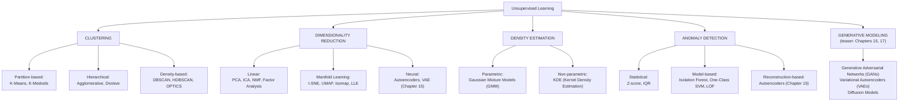

# Chapter 12: Unsupervised Learning — Finding Structure in Unlabeled Data

> **"The vast majority of data in the world has no labels. Unsupervised learning is where we learn to work with the world as it actually is."**

---

## Table of Contents
1. [Why Unsupervised Learning?](#1-why-unsupervised-learning)
2. [Types of Unsupervised Tasks](#2-types-of-unsupervised-tasks)
3. [K-Means Clustering](#3-k-means-clustering)
4. [Choosing K: Elbow Method and Silhouette Score](#4-choosing-k-elbow-method-and-silhouette-score)
5. [Hierarchical Clustering](#5-hierarchical-clustering)
6. [DBSCAN — Density-Based Clustering](#6-dbscan--density-based-clustering)
7. [Cluster Evaluation Metrics](#7-cluster-evaluation-metrics)
8. [The Curse of Dimensionality](#8-the-curse-of-dimensionality)
9. [PCA — Principal Component Analysis](#9-pca--principal-component-analysis)
10. [t-SNE — Non-linear Visualization](#10-t-sne--non-linear-visualization)
11. [UMAP — Faster and More Global](#11-umap--faster-and-more-global)
12. [PCA vs t-SNE vs UMAP](#12-pca-vs-t-sne-vs-umap)
13. [Anomaly Detection](#13-anomaly-detection)
14. [Full Example: Customer Segmentation](#14-full-example-customer-segmentation)
15. [Summary](#15-summary)
16. [Exercises](#16-exercises)

---

## 1. Why Unsupervised Learning?

Consider the scale of data in the world:

```
THE LABELING PROBLEM
────────────────────────────────────────────────────────────────────────
Data generated per day:
  - 2.5 quintillion bytes of new data daily
  - 500 million tweets, 95 million photos on Instagram
  - Millions of medical images, sensor readings, transaction logs

Labeled data available:
  - ImageNet: 1.2 million images → took 25,000 workers 2+ years to label
  - 1% of medical data has validated clinical labels
  - Enterprise data: ~95% unstructured and unlabeled

Cost of labeling:
  - Medical imaging annotation: $50–200 per image
  - Audio transcription: $1–5 per audio minute
  - Specialized labeling (legal, medical): $50–500 per document

The reality: labeled data is the bottleneck.
Unsupervised learning is how we extract value from the 99%.
```

Beyond the labeling problem, unsupervised learning has unique value:

1. **Discovery:** Find structure you didn't know existed (customer segments, disease subtypes)
2. **Compression:** Reduce data from 1000 dimensions to 10 (faster training, less storage)
3. **Representation:** Learn meaningful features from raw data (used in deep learning as pre-training)
4. **Anomaly detection:** Find the unusual cases without knowing what "unusual" looks like in advance
5. **Generation:** Learn the distribution and generate new samples (GANs, VAEs — Chapter 15)

---

## 2. Types of Unsupervised Tasks



---

## 3. K-Means Clustering

K-Means is the most widely used clustering algorithm. Simple, fast, and surprisingly effective.

### The Algorithm

```
K-MEANS ALGORITHM
────────────────────────────────────────────────────────────────────────
Input: data X (n samples, p features), number of clusters k

Step 1: Initialize k cluster centroids randomly
  μ₁, μ₂, ..., μₖ  ← randomly selected from X (or use K-Means++)

Step 2: ASSIGN each point to the nearest centroid
  For each xᵢ:
    cᵢ = argmin_k ||xᵢ - μₖ||²   (Euclidean distance)

Step 3: UPDATE centroids (move each centroid to mean of its assigned points)
  μₖ = mean({xᵢ : cᵢ = k})
  (average position of all points assigned to cluster k)

Step 4: If centroids changed → go to Step 2
         If converged (centroids stopped moving) → done

────────────────────────────────────────────────────────────────────────

STEP-BY-STEP VISUAL (2D example, k=2)
────────────────────────────────────────────────────────────────────────
Data:
  x₂
  │   ●  ●
  │ ●   ●        ○  ○
  │               ○
  │          ○  ○
  └──────────────── x₁

Iteration 1:
  Initialize: μ₁ = ◉ (random), μ₂ = ◎ (random)
  
  x₂
  │   ●  ●     ◎
  │ ●   ●        ○  ○
  │    ◉          ○
  │          ○  ○
  └──────────────── x₁
  
  Assign: each point colored by nearest centroid

Iteration 2:
  Update centroids: move to cluster mean
  ◉ moves toward center of ● group
  ◎ moves toward center of ○ group

Iteration 3+:
  Converged when centroids stop moving
  Final clusters = the two natural groups
```

### K-Means Objective Function

K-Means minimizes the **within-cluster sum of squares (WCSS)**, also called **inertia**:

```
WCSS = Σₖ Σᵢ:cᵢ=k ||xᵢ - μₖ||²

Each cluster: sum of squared distances from points to their centroid
Total: sum over all clusters

K-Means finds a LOCAL minimum of this objective.
Not guaranteed to find the global minimum (depends on initialization).
This is why we run multiple random initializations.
```

### K-Means++ Initialization

Random initialization can lead to poor clusters. K-Means++ is a smarter strategy:

```
K-MEANS++ INITIALIZATION
────────────────────────────────────────────────────────────────────────
1. Choose first centroid μ₁ uniformly at random from X

2. For k = 2, 3, ..., K:
   Compute D(xᵢ)² = min distance from xᵢ to nearest already-chosen centroid
   Choose next centroid with probability ∝ D(xᵢ)²
   (Points far from existing centroids more likely to be chosen)

3. Proceed with standard K-Means from these initial centroids

Why it helps:
  Spreads initial centroids across the data
  Avoids the "all centroids in one corner" problem
  Expected WCSS is O(log k) times optimal (theoretical guarantee)

sklearn default: init='k-means++' (always better than 'random')
```

### Implementation

```python
from sklearn.cluster import KMeans, MiniBatchKMeans
from sklearn.preprocessing import StandardScaler
from sklearn.datasets import make_blobs
import numpy as np
import pandas as pd

# Generate synthetic clustered data
X, y_true = make_blobs(
    n_samples=500,
    n_features=2,
    centers=4,          # 4 true clusters
    cluster_std=0.8,
    random_state=42
)

# IMPORTANT: Scale features before clustering
# K-Means uses Euclidean distance — features must be on same scale
scaler = StandardScaler()
X_scaled = scaler.fit_transform(X)

# ── Standard K-Means ─────────────────────────────────────────
kmeans = KMeans(
    n_clusters=4,         # k — number of clusters
    init='k-means++',     # Smart initialization (default)
    n_init=10,            # Run 10 times with different initializations, keep best
    max_iter=300,         # Max iterations per run
    tol=1e-4,             # Convergence tolerance
    random_state=42
)
kmeans.fit(X_scaled)

labels       = kmeans.labels_          # Cluster assignment for each point
centroids    = kmeans.cluster_centers_ # Centroid coordinates
inertia      = kmeans.inertia_         # WCSS (within-cluster sum of squares)
n_iter       = kmeans.n_iter_          # Iterations until convergence

print(f"K-Means Results:")
print(f"  Cluster sizes: {np.bincount(labels)}")
print(f"  Inertia (WCSS): {inertia:.2f}")
print(f"  Iterations:     {n_iter}")

# Predict cluster for new points
new_points = scaler.transform(np.array([[0.5, 1.2], [-1.3, 0.8]]))
print(f"  Predictions for new points: {kmeans.predict(new_points)}")

# ── MiniBatchKMeans (for large datasets) ─────────────────────
# Processes mini-batches instead of full dataset → much faster
# Slightly less accurate but 2-10× faster for large n
mini_kmeans = MiniBatchKMeans(
    n_clusters=4,
    batch_size=256,    # Process 256 points at a time
    init='k-means++',
    n_init=3,
    random_state=42
)
mini_kmeans.fit(X_scaled)
print(f"\nMiniBatchKMeans Inertia: {mini_kmeans.inertia_:.2f}")
```

---

## 4. Choosing K: Elbow Method and Silhouette Score

One of the trickiest parts of K-Means is choosing k. There's no single universally correct answer — it depends on your domain question and the data structure.

### The Elbow Method

```
ELBOW METHOD
────────────────────────────────────────────────────────────────────────
Intuition: as k increases, inertia (WCSS) always decreases.
At some point, adding more clusters gives diminishing returns.
The "elbow" in the inertia curve is a good choice for k.

Inertia
│
│╲
│ ╲
│  ╲
│   ╲
│    ╲──╮
│        ╲──────────────────  ← "elbow" here (diminishing returns)
└─────────────────────────
  1   2   3   4   5   6   7   k

WARNING: The elbow is often ambiguous in real data.
Use it as one signal among several.
```

### Silhouette Score — Better than Elbow

```
SILHOUETTE SCORE
────────────────────────────────────────────────────────────────────────
For each sample i:
  a(i) = mean distance to other points in SAME cluster (cohesion)
  b(i) = mean distance to points in NEAREST OTHER cluster (separation)

  s(i) = (b(i) - a(i)) / max(a(i), b(i))

  s(i) = +1: far from neighboring clusters, well clustered
  s(i) =  0: on the boundary between clusters
  s(i) = -1: misassigned (closer to another cluster)

Overall score: mean of s(i) across all points

Higher is better! Range: [-1, 1]
k=2 often gets high silhouette (trivially separable)
Best k: highest silhouette that also makes domain sense
```

```python
from sklearn.metrics import silhouette_score, silhouette_samples
import numpy as np

def find_optimal_k(X, k_range=range(2, 11)):
    """
    Find optimal k using both elbow method and silhouette score.
    Returns a comparison table.
    """
    inertias = []
    silhouette_scores = []

    for k in k_range:
        km = KMeans(n_clusters=k, init='k-means++', n_init=10, random_state=42)
        labels = km.fit_predict(X)

        inertias.append(km.inertia_)
        if k > 1:  # Silhouette requires k >= 2
            sil = silhouette_score(X, labels)
            silhouette_scores.append(sil)
        else:
            silhouette_scores.append(None)

    print(f"\n{'k':>3} | {'Inertia':>12} | {'Silhouette':>10} | {'WCSS Decrease':>14}")
    print("-" * 45)
    for i, k in enumerate(k_range):
        inertia = inertias[i]
        sil     = silhouette_scores[i]
        decrease = f"{(inertias[i-1] - inertias[i]) / inertias[i-1]:.1%}" if i > 0 else "─"
        sil_str  = f"{sil:.4f}" if sil is not None else "─"
        print(f"{k:>3} | {inertia:>12.2f} | {sil_str:>10} | {decrease:>14}")

    best_k_silhouette = list(k_range)[np.argmax([s for s in silhouette_scores if s is not None])]
    print(f"\nBest k by Silhouette: {best_k_silhouette}")
    return inertias, silhouette_scores

inertias, sil_scores = find_optimal_k(X_scaled)
```

### Limitations of K-Means

```
WHAT K-MEANS CANNOT DO
────────────────────────────────────────────────────────────────────────
1. Non-spherical clusters:
   K-Means assumes roughly circular clusters.
   Won't work on crescent, ring, or arbitrary shapes.

     Good for K-Means:        Bad for K-Means:
     ●●                        ╭──╮   (ring around ring)
     ●● ○○                     │●●│
     ●●  ○○                    ╰──╯
                               ╭────────╮
                               │ ○○○○○○ │
                               ╰────────╯

2. Varying cluster sizes/densities:
   K-Means gives equal weight to each cluster.
   A large spread-out cluster will be split.

3. Different scales:
   Must normalize features (or large-scale features dominate).

4. Sensitivity to outliers:
   Outliers pull centroids away from true cluster centers.

5. K must be specified in advance:
   Need domain knowledge or the elbow/silhouette heuristic.
```

---

## 5. Hierarchical Clustering

Hierarchical clustering builds a tree of clusters. Unlike K-Means, it doesn't require specifying k in advance.

### Agglomerative (Bottom-Up)

```
AGGLOMERATIVE CLUSTERING
────────────────────────────────────────────────────────────────────────
Start: each point is its own cluster (n clusters)

Repeat until one cluster remains:
  Find the two clusters with smallest DISTANCE
  Merge them into one cluster

"Distance" between clusters depends on LINKAGE METHOD.

BUILDING A DENDROGRAM (ASCII)
────────────────────────────────────────────────────────────────────────
Points: A, B, C, D, E

Step 1: n=5 clusters {A} {B} {C} {D} {E}
        A and B are closest → merge to {A,B}

Step 2: n=4 clusters {A,B} {C} {D} {E}
        D and E are closest → merge to {D,E}

Step 3: n=3 clusters {A,B} {C} {D,E}
        {A,B} and C are closest → merge to {A,B,C}

Step 4: n=2 clusters {A,B,C} {D,E}
        Merge → {A,B,C,D,E}

DENDROGRAM:
Height
│
│                  ┌──────────────────────────────────┐
│                  │                                  │
│        ┌─────────┤                      ┌───────────┤
│        │         │                      │           │
│  ┌─────┤         │                ┌─────┤           │
│  │     │         │                │     │           │
   A     B         C                D     E

Cut the dendrogram at any height → get k clusters at that level.
Higher cut → fewer, larger clusters.
Lower cut → more, smaller clusters.
```

### Linkage Methods

The linkage method defines how the distance between two clusters is computed:

```
LINKAGE METHODS
────────────────────────────────────────────────────────────────────────
Single Linkage:
  Distance = min distance between ANY two points (one from each cluster)
  Can create "chaining" — elongated, chain-like clusters
  Good for elongated shapes, bad for compact clusters

Complete Linkage:
  Distance = max distance between ANY two points
  Tends to create compact, spherical clusters
  Sensitive to outliers

Average Linkage (UPGMA):
  Distance = mean distance between all pairs
  Balance between single and complete
  Common choice for general use

Ward's Method:
  Distance = increase in total WCSS when merging two clusters
  Tends to create equal-sized, compact clusters
  Often best for general use → sklearn default

┌──────────┬──────────────┬────────────────┬──────────────┐
│ Linkage  │ Cluster shape│ Outlier robust │ Common use   │
├──────────┼──────────────┼────────────────┼──────────────┤
│ Single   │ Elongated    │ Poor           │ Rare         │
│ Complete │ Compact      │ Poor           │ Document     │
│ Average  │ Balanced     │ Moderate       │ Genomics     │
│ Ward     │ Equal-size   │ Good           │ General      │
└──────────┴──────────────┴────────────────┴──────────────┘
```

### Implementation

```python
from sklearn.cluster import AgglomerativeClustering
from scipy.cluster.hierarchy import dendrogram, linkage
from scipy.spatial.distance import pdist
import numpy as np
import matplotlib.pyplot as plt

# Generate data
from sklearn.datasets import make_blobs
X, _ = make_blobs(n_samples=150, centers=3, random_state=42)

scaler = StandardScaler()
X_s = scaler.fit_transform(X)

# ── sklearn AgglomerativeClustering ─────────────────────────
for linkage_method in ['single', 'complete', 'average', 'ward']:
    agg = AgglomerativeClustering(
        n_clusters=3,           # Specify k (cut the dendrogram here)
        linkage=linkage_method, # 'ward', 'complete', 'average', 'single'
        metric='euclidean'      # Only 'euclidean' works with 'ward'
    )
    labels = agg.fit_predict(X_s)
    print(f"Linkage={linkage_method:8s}: cluster sizes = {np.bincount(labels)}")

# ── Dendrogram Visualization ─────────────────────────────────
# scipy provides dendrogram plotting (sklearn doesn't)
linked = linkage(X_s, method='ward')  # Returns linkage matrix

plt.figure(figsize=(12, 6))
dendrogram(
    linked,
    truncate_mode='lastp',  # Show only last 20 merges
    p=20,
    leaf_rotation=90.,
    leaf_font_size=8.,
    show_contracted=True
)
plt.title('Hierarchical Clustering Dendrogram (Ward linkage)')
plt.xlabel('Sample index or cluster size')
plt.ylabel('Euclidean distance (Ward)')
# The y-axis shows how dissimilar the merged clusters were.
# Large jumps in y = natural cluster boundaries.
plt.tight_layout()
plt.savefig('dendrogram.png', dpi=100)

# Finding optimal k from dendrogram: look for the largest vertical gap
last = linked[-20:, 2]  # Last 20 merge distances
acceleration = np.diff(last, 2)  # Second derivative = acceleration
k_optimal = acceleration[::-1].argmax() + 2  # + 2 because of diff length
print(f"\nSuggested k from dendrogram acceleration: {k_optimal}")
```

---

## 6. DBSCAN — Density-Based Clustering

DBSCAN (Density-Based Spatial Clustering of Applications with Noise) finds clusters as dense regions separated by sparse regions.

### The Core Concepts

```
DBSCAN CONCEPTS
────────────────────────────────────────────────────────────────────────
Parameters:
  eps (ε):          radius of neighborhood around each point
  min_samples:      minimum points in a neighborhood to be a "core point"

Point types:
  CORE POINT:   At least min_samples points within eps radius
                (including itself)

  BORDER POINT: Fewer than min_samples neighbors, BUT within eps
                of a core point → belongs to that core's cluster

  NOISE POINT:  Not a core point AND not within eps of any core point
                → labeled as -1 (outlier)

VISUAL:
  ε
  ┌───┐
  │●●●│ ← core point (many neighbors)
  │●●●│
  └───┘
      ○ ← border point (few neighbors, but in eps of core)
                ✕ ← noise point (isolated)

Algorithm:
  1. Pick any unvisited point p
  2. If p is a core point: start a new cluster, add all reachable points
  3. If p is not a core point (border or noise): mark and skip
  4. Repeat until all points visited
```

### Step-by-Step Example

```
DBSCAN STEP-BY-STEP (eps=1.5, min_samples=3)
────────────────────────────────────────────────────────────────────────
Points: A(1,1), B(1.5,1), C(1,1.5), D(5,5), E(5.5,5), F(5,5.5), G(10,10)

Step 1: Start with A(1,1).
  Count neighbors within eps=1.5: {A, B, C} → count=3 ≥ min_samples=3
  A is a CORE POINT → start Cluster 1

Step 2: Expand from A. Visit B(1.5,1):
  Neighbors of B: {A, B, C} → B is also a core point → merge
  Visit C(1,1.5): also core → merge
  Cluster 1 = {A, B, C}

Step 3: Move to D(5,5).
  Neighbors: {D, E, F} → core point → Cluster 2
  Expand: E and F also core → Cluster 2 = {D, E, F}

Step 4: G(10,10).
  Neighbors: {G} → count=1 < min_samples=3 → NOISE (-1)

Result: Cluster 1={A,B,C}, Cluster 2={D,E,F}, Noise={G}
```

### Why DBSCAN is Special

```
DBSCAN vs K-MEANS
────────────────────────────────────────────────────────────────────────
                    K-Means              DBSCAN
K required?         YES                  NO
Cluster shape       Spherical only       ARBITRARY (even non-convex)
Outlier handling    None (outliers       EXPLICIT noise class (-1)
                    distort centroids)
Speed               O(n × k × iters)    O(n log n) with spatial index
Varying density     Struggles            Struggles (but HDBSCAN fixes this)

X₂                  X₂
│  ●●●●  ○○○         │  ╭─────╮ ╭─────╮
│  ●●●● ○○○          │  │ ●●● │ │ ○○○ │
│  ●●● ○○○           │  ╰─────╯ ╰─────╯
└──────────── X₁    └──────────────────── X₁
K-Means: great       K-Means: might split
for this             the crescent shapes.
                     DBSCAN: finds them.
```

### Implementation

```python
from sklearn.cluster import DBSCAN
from sklearn.datasets import make_moons, make_blobs
from sklearn.preprocessing import StandardScaler
from sklearn.metrics import silhouette_score
import numpy as np

# DBSCAN excels on non-spherical data
X_moons, _ = make_moons(n_samples=300, noise=0.1, random_state=42)
X_moons_s  = StandardScaler().fit_transform(X_moons)

dbscan = DBSCAN(
    eps=0.3,           # Neighborhood radius — CRITICAL parameter
    min_samples=5,     # Min points to be a core point
    metric='euclidean',
    n_jobs=-1
)
labels_moons = dbscan.fit_predict(X_moons_s)

n_clusters = len(set(labels_moons)) - (1 if -1 in labels_moons else 0)
n_noise    = list(labels_moons).count(-1)
print(f"Moon data - DBSCAN found {n_clusters} clusters, {n_noise} noise points")
print(f"Cluster sizes: {np.bincount(labels_moons[labels_moons >= 0])}")

# ── Parameter Sensitivity ────────────────────────────────────
print("\nDBSCAN Parameter Sensitivity:")
print(f"{'eps':>6} {'min_samples':>12} {'n_clusters':>10} {'n_noise':>8}")
for eps in [0.1, 0.2, 0.3, 0.5, 1.0]:
    for min_s in [3, 5, 10]:
        db = DBSCAN(eps=eps, min_samples=min_s)
        lbs = db.fit_predict(X_moons_s)
        nc = len(set(lbs)) - (1 if -1 in lbs else 0)
        nn = (lbs == -1).sum()
        print(f"{eps:>6.1f} {min_s:>12} {nc:>10} {nn:>8}")

# ── DBSCAN on data with outliers ─────────────────────────────
np.random.seed(42)
X_clean, _ = make_blobs(n_samples=200, centers=3, cluster_std=0.5, random_state=42)
X_outliers  = np.random.uniform(-8, 8, size=(30, 2))
X_all       = np.vstack([X_clean, X_outliers])
X_all_s     = StandardScaler().fit_transform(X_all)

db_out = DBSCAN(eps=0.5, min_samples=5)
lbs_out = db_out.fit_predict(X_all_s)
print(f"\nWith outliers: {(lbs_out == -1).sum()} noise points detected out of 30 injected")
```

---

## 7. Cluster Evaluation Metrics

### When You Have Ground Truth Labels

```python
from sklearn.metrics import (
    adjusted_rand_score,
    normalized_mutual_info_score,
    homogeneity_score,
    completeness_score,
    v_measure_score
)

# ARI: Adjusted Rand Index
# Measures agreement between predicted and true clusters
# 0 = random agreement, 1 = perfect agreement
# Corrected for chance (doesn't inflate for large k)
ari = adjusted_rand_score(y_true, y_pred)
print(f"ARI: {ari:.4f}")

# NMI: Normalized Mutual Information
# Measures shared information between two clusterings
# 0 = no shared info, 1 = perfect correspondence
nmi = normalized_mutual_info_score(y_true, y_pred)
print(f"NMI: {nmi:.4f}")

# Homogeneity: each cluster contains only one class
# Completeness: each class's members are in the same cluster
hom = homogeneity_score(y_true, y_pred)
com = completeness_score(y_true, y_pred)
v   = v_measure_score(y_true, y_pred)  # harmonic mean of hom and com
print(f"Homogeneity: {hom:.4f}, Completeness: {com:.4f}, V-measure: {v:.4f}")
```

### Without Ground Truth Labels

```python
from sklearn.metrics import (
    silhouette_score, silhouette_samples,
    davies_bouldin_score,
    calinski_harabasz_score
)

# ── Silhouette Score ──────────────────────────────────────────
# Range: [-1, 1], higher is better
sil = silhouette_score(X, labels)
print(f"Silhouette Score: {sil:.4f}")

# Per-sample silhouette values
sample_sil = silhouette_samples(X, labels)
# High variance = some clusters better defined than others

# ── Davies-Bouldin Score ─────────────────────────────────────
# Average "similarity" between each cluster and its most similar cluster
# Range: [0, ∞), LOWER is better (opposite of silhouette!)
db_score = davies_bouldin_score(X, labels)
print(f"Davies-Bouldin Score: {db_score:.4f}  (lower is better)")

# ── Calinski-Harabasz Score (Variance Ratio Criterion) ────────
# Ratio of between-cluster variance to within-cluster variance
# Range: [0, ∞), HIGHER is better
ch_score = calinski_harabasz_score(X, labels)
print(f"Calinski-Harabasz Score: {ch_score:.4f}  (higher is better)")
```

---

## 8. The Curse of Dimensionality

Before diving into dimensionality reduction, we must understand why high dimensions are problematic.

```
THE CURSE OF DIMENSIONALITY
────────────────────────────────────────────────────────────────────────
DISTANCE BECOMES MEANINGLESS in high dimensions:

Consider n=1000 points uniformly distributed in a unit hypercube [0,1]^d:

  d=1:   All points spread evenly on a line.
         Distances range meaningfully from 0 to 1.

  d=10:  Points start spreading in 10-dimensional space.

  d=100: Avg distance = 0.87, Std dev = 0.02
         Min/Max ratio ≈ 0.95
         Almost all points are roughly the SAME distance apart!

  d=1000: Min/Max distance ratio → 1
          Every point is equidistant from every other point.
          K-Nearest Neighbors becomes meaningless.
          K-Means centroids lose meaning.

VOLUME CONCENTRATION at the surface:
  In d dimensions, what fraction of volume is in the outermost 1% shell?
  
  d=1:   1%
  d=10:  10%
  d=100: 63%
  d=1000: 99.99%
  
  Almost all the volume is in the outer shell!
  Random points are almost always near the surface, not the interior.
  Gaussian distributions concentrate in a thin shell.

DATA SPARSITY:
  To cover a d-dimensional space with 1000 points per unit:
  d=1:  need 1,000 points
  d=2:  need 1,000² = 1,000,000 points
  d=3:  need 1,000³ = 10⁹ points
  d=10: need 10³⁰ points  (impossible to gather)

PRACTICAL CONSEQUENCES:
  • Distance-based methods (KNN, SVM-RBF, K-Means) degrade in high d
  • Models need exponentially more data as dimensions increase
  • Most high-dimensional data lies on a LOW-DIMENSIONAL manifold
    (e.g., the space of valid human faces is maybe 100-dim despite
    1000×1000×3 = 3 million pixel space)

SOLUTION: Dimensionality reduction — find the low-dimensional structure
```

---

## 9. PCA — Principal Component Analysis

PCA is the most important dimensionality reduction technique. It finds a new coordinate system that captures maximum variance.

### The Core Idea

```
PCA INTUITION
────────────────────────────────────────────────────────────────────────
Original data:                    After PCA rotation:
  x₂                                PC₂
  │        ●                          │●
  │    ● ●   ●                        │ ● ●●   ●●
  │  ●  ● ●                           │● ●
  │●  ●●    ●●                        │  ●● ●
  │  ●● ●●                            │ ●
  └──────────── x₁               ─────────────── PC₁

  Original axes: x₁ and x₂           PC₁: direction of MAXIMUM variance
  Neither is aligned with             PC₂: direction perpendicular to PC₁,
  the data's natural structure        second most variance

  Key: the data has an elongated      Projecting onto just PC₁ captures
  "football" shape. The main          most of the information!
  axis of variance is diagonal.       We can drop PC₂ with little loss.
```

### Mathematical Steps

```
PCA ALGORITHM
────────────────────────────────────────────────────────────────────────
Input: X ∈ ℝ^(n×p)  (n samples, p features)

Step 1: Center the data
  X_centered = X - mean(X, axis=0)
  (Subtract the mean of each feature)

Step 2: Compute the covariance matrix
  C = (1/n) X_centered^T X_centered   ∈ ℝ^(p×p)
  C[i,j] = covariance between feature i and feature j
  C[i,i] = variance of feature i (diagonal)
  C symmetric: C = C^T

Step 3: Eigendecompose the covariance matrix
  C = V Λ V^T
  Where:
    V ∈ ℝ^(p×p): eigenvectors (the principal component directions)
    Λ ∈ ℝ^(p×p): diagonal matrix of eigenvalues λ₁ ≥ λ₂ ≥ ... ≥ λₚ ≥ 0
    λₖ = variance explained by kth principal component

Step 4: Select top k components
  V_k = first k columns of V  (k eigenvectors with largest eigenvalues)

Step 5: Project data
  Z = X_centered @ V_k   ∈ ℝ^(n×k)
  Z contains the k principal components (new "features")

Explained variance ratio:
  EVR_k = λₖ / Σⱼ λⱼ   (fraction of total variance in component k)
  Cumulative EVR = Σₖ EVR_k   (fraction captured by top k components)
  Choose k such that cumulative EVR ≥ 0.95 (95% of variance retained)
```

### PCA from Scratch

```python
import numpy as np

def pca_from_scratch(X, n_components):
    """
    PCA implementation using eigendecomposition.
    Matches sklearn's PCA output.
    """
    # Step 1: Center
    mean = X.mean(axis=0)
    X_c  = X - mean

    # Step 2: Covariance matrix
    n = X.shape[0]
    C = (X_c.T @ X_c) / (n - 1)   # Unbiased estimator (n-1, not n)

    # Step 3: Eigendecomposition
    eigenvalues, eigenvectors = np.linalg.eigh(C)
    # eigh is for symmetric matrices (faster, more stable than eig)

    # Sort descending by eigenvalue
    idx = np.argsort(eigenvalues)[::-1]
    eigenvalues  = eigenvalues[idx]
    eigenvectors = eigenvectors[:, idx]

    # Step 4: Select top k
    V_k = eigenvectors[:, :n_components]

    # Step 5: Project
    Z = X_c @ V_k

    # Explained variance ratio
    evr = eigenvalues[:n_components] / eigenvalues.sum()

    return Z, V_k, evr, mean

# Test on synthetic data
np.random.seed(42)
n, p = 200, 5
X_test = np.random.randn(n, p) @ np.array([
    [3, 0, 0, 0, 0],
    [0, 2, 0, 0, 0],
    [0, 0, 1, 0, 0],
    [0, 0, 0, 0.5, 0],
    [0, 0, 0, 0, 0.1]
])  # Strong variance along first 2 dims

Z, V, evr, mu = pca_from_scratch(X_test, n_components=2)
print("From Scratch PCA:")
print(f"  Shape: {X_test.shape} → {Z.shape}")
print(f"  Explained variance ratio: {evr}")
print(f"  Cumulative: {evr.cumsum()}")

# Verify with sklearn
from sklearn.decomposition import PCA

pca_sk = PCA(n_components=2)
Z_sk = pca_sk.fit_transform(X_test)
print(f"\nSklearn PCA:")
print(f"  Explained variance ratio: {pca_sk.explained_variance_ratio_}")
# Note: sign of components may differ (eigenvectors can flip sign)
```

### Sklearn PCA

```python
from sklearn.decomposition import PCA
from sklearn.datasets import load_digits
from sklearn.preprocessing import StandardScaler
import numpy as np

# Load digits dataset (handwritten digits 0-9)
# 1797 samples, 64 features (8×8 pixel images)
digits = load_digits()
X, y = digits.data, digits.target
print(f"Digits shape: {X.shape}")  # (1797, 64)

# Scale first! PCA is sensitive to scale.
scaler = StandardScaler()
X_s = scaler.fit_transform(X)

# ── PCA: Choose n_components = variance threshold ─────────────
pca_full = PCA(n_components=None)   # Keep all components
pca_full.fit(X_s)

# Cumulative explained variance
cumulative_evr = pca_full.explained_variance_ratio_.cumsum()
n_95 = np.argmax(cumulative_evr >= 0.95) + 1
n_99 = np.argmax(cumulative_evr >= 0.99) + 1
print(f"\nComponents needed to explain:")
print(f"  95% variance: {n_95} components (from {X.shape[1]})")
print(f"  99% variance: {n_99} components (from {X.shape[1]})")

# ── Dimensionality Reduction ─────────────────────────────────
pca_50 = PCA(n_components=50)
X_reduced = pca_50.fit_transform(X_s)
print(f"\nReduced to {X_reduced.shape[1]} components")
print(f"Variance retained: {pca_50.explained_variance_ratio_.sum():.3%}")

# Reconstruct from reduced representation
X_reconstructed = pca_50.inverse_transform(X_reduced)
reconstruction_error = np.mean((X_s - X_reconstructed) ** 2)
print(f"Reconstruction MSE: {reconstruction_error:.4f}")

# ── PCA for Visualization (2 components) ─────────────────────
pca_2d = PCA(n_components=2)
X_2d = pca_2d.fit_transform(X_s)
print(f"\n2D PCA variance: {pca_2d.explained_variance_ratio_.sum():.3%}")
# For 64D → 2D visualization, we only capture a fraction of variance
# But it still shows meaningful structure

# ── PCA as Preprocessing for Classification ──────────────────
from sklearn.linear_model import LogisticRegression
from sklearn.model_selection import train_test_split, cross_val_score

X_train, X_test, y_train, y_test = train_test_split(X, y, test_size=0.2, random_state=42)

# Without PCA
scaler2 = StandardScaler()
X_tr_s = scaler2.fit_transform(X_train)
X_te_s = scaler2.transform(X_test)
lr_scores = cross_val_score(LogisticRegression(max_iter=1000), X_tr_s, y_train, cv=5)
print(f"\nLogistic Regression (64 features): {lr_scores.mean():.4f} ± {lr_scores.std():.4f}")

# With PCA (95% variance)
from sklearn.pipeline import Pipeline
pipe_pca = Pipeline([
    ('scaler', StandardScaler()),
    ('pca',    PCA(n_components=0.95)),  # Keep 95% of variance
    ('lr',     LogisticRegression(max_iter=1000))
])
pca_lr_scores = cross_val_score(pipe_pca, X_train, y_train, cv=5)
print(f"PCA+LogReg (95% variance):        {pca_lr_scores.mean():.4f} ± {pca_lr_scores.std():.4f}")
```

### Interpreting PCA Components

```python
# What do the principal components represent?
pca_interp = PCA(n_components=4)
pca_interp.fit(X_s)

print("\nPrincipal Component Interpretation:")
print("(Digits dataset: each feature is a pixel)")
print("Components show which pixel patterns explain the most variance")

# Each PC is a vector in the original feature space
# For digits: each PC is a "face" or "digit-like" pattern
for i, component in enumerate(pca_interp.components_):
    # Reshape to 8×8 image
    img = component.reshape(8, 8)
    # The component shows which pixels vary together
    print(f"\nPC {i+1} (explains {pca_interp.explained_variance_ratio_[i]:.3%} variance):")
    print("  Top positive pixels:", np.argsort(component)[-5:])
    print("  Top negative pixels:", np.argsort(component)[:5])
```

---

## 10. t-SNE — Non-linear Visualization

t-SNE (t-distributed Stochastic Neighbor Embedding) is designed for one purpose: visualizing high-dimensional data in 2D or 3D while preserving local structure.

### The Intuition

```
t-SNE IDEA
────────────────────────────────────────────────────────────────────────
In high-dimensional space:
  Define a probability P(j|i) ∝ exp(-||xᵢ - xⱼ||² / 2σᵢ²)
  This is the probability that xᵢ "picks" xⱼ as its neighbor.
  Close points: high probability. Far points: near zero.

In low-dimensional space (2D):
  Define a similar probability Q(j|i) using t-distribution instead of Gaussian:
  Q(j|i) ∝ (1 + ||yᵢ - yⱼ||²)⁻¹
  (t-distribution has heavier tails → pushes far-apart points apart more)

Objective: minimize KL divergence between P and Q:
  KL(P||Q) = Σᵢⱼ Pᵢⱼ log(Pᵢⱼ / Qᵢⱼ)

This forces the 2D layout to preserve the neighborhood structure.
If P says xᵢ and xⱼ are close neighbors, Q should too.

WHY t-distribution (not Gaussian) in the low-dim space?
  Gaussian has thin tails: points that are "medium distance" apart
  in high-dim all want to be close in 2D → crowding problem.
  t-distribution has heavy tails: can push dissimilar points apart
  more easily → better separation of clusters.
```

### Critical Caveats

```
t-SNE CAVEATS — EXTREMELY IMPORTANT
────────────────────────────────────────────────────────────────────────
1. DISTANCES BETWEEN CLUSTERS ARE NOT MEANINGFUL
   Just because two clusters appear far apart in t-SNE doesn't mean
   they are actually far apart in the original space.
   Only LOCAL structure (within clusters) is preserved.

2. CLUSTER SIZES ARE MEANINGLESS
   Large clusters in t-SNE don't mean more data.
   The algorithm expands/contracts clusters.

3. NOT DETERMINISTIC
   Different random seeds give different (but similar) results.

4. PERPLEXITY affects the result dramatically:
   perplexity ≈ expected number of neighbors per point
   Too low (5): fragmented, many tiny clusters
   Too high (50): compressed, global structure
   Typical range: 5-50, usually 30-50

5. NO INVERSE TRANSFORM
   Can't map new points into the existing t-SNE space easily.
   Must re-run t-SNE with all data together.

6. SLOW: O(n² log n) — impractical for > 100,000 points
   Use UMAP for large datasets.

DO USE t-SNE FOR:
  ✓ Visualizing whether clusters exist
  ✓ Sanity-checking that similar things are grouped together
  ✓ Exploration and EDA

DO NOT USE t-SNE FOR:
  ✗ Inferring distances between clusters
  ✗ Measuring cluster sizes
  ✗ As features for downstream ML
  ✗ Large datasets (use UMAP)
```

```python
from sklearn.manifold import TSNE
from sklearn.datasets import load_digits
import numpy as np

digits = load_digits()
X, y = digits.data, digits.target

# t-SNE on digits (1797 × 64 → 1797 × 2)
tsne = TSNE(
    n_components=2,
    perplexity=30,           # 5-50 typical range
    learning_rate='auto',    # 'auto' or specific value (200 classic)
    max_iter=1000,           # Usually enough for convergence
    init='pca',              # Start from PCA for stability and speed
    random_state=42
)

print("Running t-SNE...")
X_tsne = tsne.fit_transform(X)
print(f"t-SNE output shape: {X_tsne.shape}")

# Visualize
import matplotlib.pyplot as plt

fig, ax = plt.subplots(figsize=(10, 8))
scatter = ax.scatter(
    X_tsne[:, 0], X_tsne[:, 1],
    c=y, cmap='tab10',
    s=10, alpha=0.7
)
plt.colorbar(scatter, ax=ax)
ax.set_title('t-SNE of MNIST Digits Dataset')
ax.set_xlabel('t-SNE Component 1')
ax.set_ylabel('t-SNE Component 2')
plt.tight_layout()
plt.savefig('tsne_digits.png', dpi=100)

# Each digit class should form its own cluster
# Confusion between similar digits (4/9, 3/5, 7/1) is expected
```

---

## 11. UMAP — Faster and More Global

UMAP (Uniform Manifold Approximation and Projection, McInnes et al. 2018) improves on t-SNE:

```
UMAP vs t-SNE
────────────────────────────────────────────────────────────────────────
Speed:
  t-SNE: O(n² log n) → hours for n=100,000
  UMAP:  O(n^1.14) → minutes for n=100,000

Global structure:
  t-SNE: preserves local structure only
  UMAP:  preserves BOTH local and global structure
         Cluster distances are more meaningful (not perfectly, but better)

Reproducibility:
  t-SNE: different random seeds = different layouts
  UMAP:  more stable (uses approximate nearest neighbors graph)

Inverse transform:
  t-SNE: no native inverse
  UMAP:  has inverse_transform (can generate new points)

Use as features:
  t-SNE: generally not recommended
  UMAP:  can be used as embedding for downstream ML

Parameters:
  n_neighbors: size of local neighborhood (like t-SNE perplexity)
               small → focus on local structure
               large → more global structure preserved
               default: 15
  min_dist: minimum distance between points in low-dim space
            small → tighter clusters
            large → more spread out
            default: 0.1
  n_components: output dimensionality (default: 2)
  metric: distance metric (euclidean, cosine, manhattan, etc.)
```

```python
# pip install umap-learn
try:
    import umap

    reducer = umap.UMAP(
        n_components=2,
        n_neighbors=15,      # Size of local neighborhood
        min_dist=0.1,        # Minimum distance in embedding
        metric='euclidean',
        random_state=42,
        verbose=False
    )

    X_umap = reducer.fit_transform(X)
    print(f"UMAP output shape: {X_umap.shape}")

    # Can also use as preprocessor with inverse transform
    X_new = np.random.randn(5, X.shape[1])  # 5 new hypothetical points
    X_new_umap = reducer.transform(X_new)
    print(f"New points in UMAP space: {X_new_umap.shape}")

except ImportError:
    print("umap-learn not installed. Run: pip install umap-learn")
    print("UMAP is excellent for large datasets and when global structure matters")
```

---

## 12. PCA vs t-SNE vs UMAP

```
WHEN TO USE WHICH
────────────────────────────────────────────────────────────────────────
PCA:
  ✓ First step always — reduce noise and speed up everything else
  ✓ When linear projections are sufficient
  ✓ When you need interpretable components (explained variance)
  ✓ As preprocessing for downstream ML (pipeline)
  ✓ Reconstruction / denoising
  ✗ For non-linear manifold structure

t-SNE:
  ✓ Visualization only (don't use as ML features)
  ✓ Small-medium datasets (< 50,000 points)
  ✓ When cluster structure matters, not inter-cluster distances
  ✗ Large datasets (too slow)
  ✗ When global structure matters

UMAP:
  ✓ Large datasets (faster than t-SNE)
  ✓ When global structure matters
  ✓ Can use as ML features (better than t-SNE)
  ✓ When you need inverse transform
  ✗ When interpretable components needed (use PCA)

Typical Workflow:
  High-dim data
      ↓
  PCA (reduce to 50-100 dims, removes noise)
      ↓
  t-SNE or UMAP (2D visualization)
      ↓
  Inspect cluster structure, then decide if k-means makes sense

┌──────────────┬──────┬────────┬──────┬────────┬──────────┐
│ Method       │ Linear│ Speed │ Global│ Interp │ ML feat  │
├──────────────┼──────┼────────┼──────┼────────┼──────────┤
│ PCA          │ Yes  │ Fast   │ Yes  │ Yes    │ Yes      │
│ t-SNE        │ No   │ Slow   │ No   │ No     │ No       │
│ UMAP         │ No   │ Fast   │ Some │ No     │ Maybe    │
│ Autoencoder  │ No   │ Medium │ Tunes│ No     │ Yes      │
└──────────────┴──────┴────────┴──────┴────────┴──────────┘
```

---

## 13. Anomaly Detection

Anomaly detection finds observations that deviate significantly from the expected distribution — without knowing in advance what anomalies look like.

### Statistical Methods

```python
import numpy as np

def statistical_anomaly_detection(X):
    """Z-score and IQR-based anomaly detection for 1D or 2D data."""
    # Z-score method
    mean = np.mean(X, axis=0)
    std  = np.std(X, axis=0)
    z_scores = np.abs((X - mean) / std)

    # Flag as anomaly if any feature has |z| > 3
    z_anomalies = np.any(z_scores > 3, axis=1 if X.ndim > 1 else None)

    # IQR method
    Q1 = np.percentile(X, 25, axis=0)
    Q3 = np.percentile(X, 75, axis=0)
    IQR = Q3 - Q1
    iqr_anomalies = np.any((X < Q1 - 1.5*IQR) | (X > Q3 + 1.5*IQR),
                           axis=1 if X.ndim > 1 else None)

    return z_anomalies, iqr_anomalies
```

### Isolation Forest

```python
from sklearn.ensemble import IsolationForest
import numpy as np

# Isolation Forest: anomalies are easier to isolate
# (fewer splits needed to isolate a point in a random tree)
# Normal points: deep in tree (hard to isolate)
# Anomalies:     close to root (easy to isolate)

np.random.seed(42)
X_normal  = np.random.randn(500, 2) * 2
X_anomaly = np.random.uniform(-8, 8, (20, 2))  # Uniform = likely anomalous
X_all = np.vstack([X_normal, X_anomaly])

iso_forest = IsolationForest(
    n_estimators=200,         # Number of trees
    contamination=0.04,       # Expected fraction of anomalies (or 'auto')
    max_samples='auto',       # Subsample size per tree
    bootstrap=False,          # Whether to use bootstrap sampling
    random_state=42
)

# Fit and predict: +1 = normal, -1 = anomaly
labels = iso_forest.fit_predict(X_all)
scores = iso_forest.decision_function(X_all)  # Anomaly score (lower = more anomalous)

n_detected = (labels == -1).sum()
# Recall: we injected 20 anomalies
injected_as_anomaly = (labels[500:] == -1).sum()  # How many injected ones caught?
print(f"Isolation Forest:")
print(f"  Total detected anomalies: {n_detected}")
print(f"  Injected anomalies detected: {injected_as_anomaly}/20")
```

### One-Class SVM

```python
from sklearn.svm import OneClassSVM

# One-Class SVM: learns a tight boundary around the "normal" region
# Points outside the boundary = anomalies

oc_svm = OneClassSVM(
    kernel='rbf',
    gamma='scale',
    nu=0.05  # Upper bound on fraction of outliers (and lower bound on SVs)
)
oc_svm.fit(X_normal)  # Only fit on normal data

labels_ocsvm = oc_svm.predict(X_all)  # +1 = normal, -1 = anomaly
detected_ocsvm = (labels_ocsvm == -1).sum()
print(f"\nOne-Class SVM detected {detected_ocsvm} anomalies")
```

---

## 14. Full Example: Customer Segmentation

```python
# =============================================================================
# FULL PROJECT: Customer Segmentation with K-Means + PCA
# Goal: Segment customers into distinct groups ("personas") for targeted marketing
# =============================================================================

import numpy as np
import pandas as pd
from sklearn.cluster import KMeans
from sklearn.decomposition import PCA
from sklearn.preprocessing import StandardScaler
from sklearn.metrics import silhouette_score
import warnings
warnings.filterwarnings('ignore')

# =============================================================================
# STEP 1: Generate Realistic Customer Data
# =============================================================================
np.random.seed(42)
n_customers = 1000

# Simulate 4 customer personas with distinct characteristics
# Persona 1: Young, high spenders (premium segment)
# Persona 2: Mature, moderate spenders (value segment)
# Persona 3: Young, low spenders (students/budget segment)
# Persona 4: Mature, loyal (senior/loyal segment)

def generate_persona(n, age_mean, age_std, freq_mean, freq_std,
                     spend_mean, spend_std, tenure_mean, tenure_std):
    return pd.DataFrame({
        'age':               np.clip(np.random.normal(age_mean,    age_std,    n), 18, 80).astype(int),
        'purchase_frequency': np.clip(np.random.normal(freq_mean,  freq_std,   n),  0, 20).astype(int),
        'avg_order_value':   np.clip(np.random.normal(spend_mean,  spend_std,  n),  0, 1000).round(2),
        'tenure_months':     np.clip(np.random.normal(tenure_mean, tenure_std, n),  0, 120).astype(int),
        'num_categories':    np.random.randint(1, 8, n),
        'returns_rate':      np.clip(np.random.beta(2, 10, n), 0, 1).round(3),
    })

segments = [
    generate_persona(250, 28, 5,  15, 3, 280, 60,  12, 8),   # Premium
    generate_persona(250, 45, 8,  8,  2, 120, 30,  48, 15),  # Value
    generate_persona(250, 22, 4,  5,  2,  50, 20,  4,  3),   # Budget
    generate_persona(250, 62, 7,  6,  2,  90, 25,  84, 20),  # Loyal
]

df = pd.concat(segments, ignore_index=True)
df = df.sample(frac=1, random_state=42).reset_index(drop=True)  # Shuffle

# Store true labels for evaluation (in real case, we wouldn't have these)
true_labels = np.array([0]*250 + [1]*250 + [2]*250 + [3]*250)
true_labels = true_labels[df.index.values]  # Reorder after shuffle
df.index = range(len(df))
true_labels_shuffled = np.array([i//250 for i in range(1000)])
np.random.seed(42)
true_labels_shuffled = true_labels_shuffled[np.random.permutation(1000)]

print("=== Customer Dataset ===")
print(f"Shape: {df.shape}")
print(f"\nSample data:")
print(df.head(5).to_string())
print(f"\nBasic statistics:")
print(df.describe().round(2).to_string())
print(f"\nMissing values: {df.isnull().sum().sum()}")

# =============================================================================
# STEP 2: Data Preprocessing
# =============================================================================
# Scale all features (K-Means uses Euclidean distance)
scaler = StandardScaler()
X_scaled = scaler.fit_transform(df)
print(f"\nScaled shape: {X_scaled.shape}")
print(f"Means (should be ~0): {X_scaled.mean(axis=0).round(3)}")
print(f"Stds  (should be ~1): {X_scaled.std(axis=0).round(3)}")

# =============================================================================
# STEP 3: Find Optimal K
# =============================================================================
print("\n=== Finding Optimal K ===")
inertias = []
sil_scores = []
k_range = range(2, 11)

for k in k_range:
    km = KMeans(n_clusters=k, init='k-means++', n_init=20, random_state=42)
    lbs = km.fit_predict(X_scaled)
    inertias.append(km.inertia_)
    sil_scores.append(silhouette_score(X_scaled, lbs))

print(f"{'k':>3} | {'Inertia':>12} | {'Silhouette':>10} | {'WCSS% Decrease':>15}")
print("-" * 48)
for i, k in enumerate(k_range):
    d = f"{(inertias[i-1]-inertias[i])/inertias[i-1]:.1%}" if i > 0 else "─"
    print(f"{k:>3} | {inertias[i]:>12.1f} | {sil_scores[i]:>10.4f} | {d:>15}")

best_k_sil = list(k_range)[np.argmax(sil_scores)]
print(f"\nBest k by Silhouette: {best_k_sil}")
# Expected: k=4 (matches the 4 personas we created)

# =============================================================================
# STEP 4: Final K-Means Model
# =============================================================================
K = 4
print(f"\n=== Training K-Means with K={K} ===")

kmeans_final = KMeans(
    n_clusters=K,
    init='k-means++',
    n_init=50,          # More initializations → more stable result
    max_iter=500,
    random_state=42
)
cluster_labels = kmeans_final.fit_predict(X_scaled)

print(f"Cluster sizes: {np.bincount(cluster_labels)}")
print(f"Inertia: {kmeans_final.inertia_:.2f}")
print(f"Silhouette Score: {silhouette_score(X_scaled, cluster_labels):.4f}")

# Evaluate against true personas
from sklearn.metrics import adjusted_rand_score, normalized_mutual_info_score
print(f"\nARI vs true personas: {adjusted_rand_score(true_labels_shuffled, cluster_labels):.4f}")
print(f"NMI vs true personas: {normalized_mutual_info_score(true_labels_shuffled, cluster_labels):.4f}")

# =============================================================================
# STEP 5: Cluster Profiling
# =============================================================================
df['cluster'] = cluster_labels
feature_names = df.drop(columns=['cluster']).columns.tolist()

print("\n=== Cluster Profiles (Mean Values) ===")
profile = df.groupby('cluster').agg({
    'age':               'mean',
    'purchase_frequency': 'mean',
    'avg_order_value':   'mean',
    'tenure_months':     'mean',
    'num_categories':    'mean',
    'returns_rate':      'mean',
}).round(2)

# Add cluster size
profile['count'] = df.groupby('cluster').size()

print(profile.to_string())

# Name the personas based on profiles
print("\n=== Cluster Interpretation ===")
for cluster_id in range(K):
    cluster_data = df[df['cluster'] == cluster_id]
    age  = cluster_data['age'].mean()
    freq = cluster_data['purchase_frequency'].mean()
    spend= cluster_data['avg_order_value'].mean()
    ten  = cluster_data['tenure_months'].mean()
    count= len(cluster_data)

    # Assign business label based on characteristics
    if spend > 200:
        persona = "PREMIUM — High Spenders"
    elif ten > 60:
        persona = "LOYAL — Long-term Customers"
    elif age < 30:
        persona = "BUDGET — Young/Students"
    else:
        persona = "VALUE — Mainstream Customers"

    print(f"\nCluster {cluster_id} ({count} customers) — {persona}")
    print(f"  Age:         {age:.1f} years")
    print(f"  Purchases:   {freq:.1f} per month")
    print(f"  Avg order:   ${spend:.2f}")
    print(f"  Tenure:      {ten:.1f} months")

# =============================================================================
# STEP 6: PCA Visualization
# =============================================================================
print("\n=== PCA Visualization ===")
pca = PCA(n_components=2)
X_2d = pca.fit_transform(X_scaled)

print(f"PCA variance explained: {pca.explained_variance_ratio_}")
print(f"Total: {pca.explained_variance_ratio_.sum():.3%}")

# Plot
import matplotlib.pyplot as plt
import matplotlib.cm as cm

fig, axes = plt.subplots(1, 2, figsize=(16, 6))

# Plot 1: K-Means clusters
colors = ['#E74C3C', '#3498DB', '#2ECC71', '#F39C12']
for k in range(K):
    mask = cluster_labels == k
    axes[0].scatter(X_2d[mask, 0], X_2d[mask, 1],
                   c=colors[k], label=f'Cluster {k}',
                   s=20, alpha=0.6)

# Plot centroids in PCA space
centroids_pca = pca.transform(kmeans_final.cluster_centers_)
axes[0].scatter(centroids_pca[:, 0], centroids_pca[:, 1],
               c='black', s=200, marker='*', zorder=5, label='Centroids')
axes[0].set_title('K-Means Clusters (PCA 2D)')
axes[0].set_xlabel(f'PC1 ({pca.explained_variance_ratio_[0]:.1%} variance)')
axes[0].set_ylabel(f'PC2 ({pca.explained_variance_ratio_[1]:.1%} variance)')
axes[0].legend()

# Plot 2: Heatmap of cluster profiles (normalized)
cluster_means = df.groupby('cluster')[feature_names].mean()
# Normalize each feature to [0,1] for visualization
cluster_norm = (cluster_means - cluster_means.min()) / (cluster_means.max() - cluster_means.min())

im = axes[1].imshow(cluster_norm.values, cmap='RdYlGn', aspect='auto', vmin=0, vmax=1)
axes[1].set_xticks(range(len(feature_names)))
axes[1].set_xticklabels(feature_names, rotation=45, ha='right')
axes[1].set_yticks(range(K))
axes[1].set_yticklabels([f'Cluster {k}' for k in range(K)])
axes[1].set_title('Cluster Profile Heatmap (Normalized)')
plt.colorbar(im, ax=axes[1])

plt.tight_layout()
plt.savefig('customer_segmentation.png', dpi=100, bbox_inches='tight')
print("Saved: customer_segmentation.png")

# =============================================================================
# STEP 7: Business Recommendations per Segment
# =============================================================================
print("\n=== Business Recommendations by Segment ===")
recommendations = {
    "PREMIUM": [
        "Offer exclusive early access to new products",
        "Provide personal shopping assistants",
        "Create VIP loyalty tier with concierge service",
        "Target with premium brand partnerships"
    ],
    "LOYAL": [
        "Reward long tenure with special anniversary discounts",
        "Implement ambassador program",
        "Ask for product reviews and testimonials",
        "Offer referral bonuses"
    ],
    "BUDGET": [
        "Target with student discounts and promotions",
        "Promote social sharing for discounts",
        "Bundle deals and value packs",
        "Highlight installment payment options"
    ],
    "VALUE": [
        "Personalized email campaigns based on past purchases",
        "Mid-tier loyalty rewards",
        "Seasonal promotions",
        "Cross-sell related categories"
    ]
}

for persona, recs in recommendations.items():
    print(f"\n{persona}:")
    for r in recs:
        print(f"  • {r}")

print("\n=== WHAT YOU LEARNED FROM THIS PROJECT ===")
print("1. Feature scaling is CRITICAL before clustering (distance-based)")
print("2. Elbow + Silhouette give complementary views of optimal k")
print("3. K-Means creates spherical clusters — verify this is appropriate")
print("4. PCA helps visualize high-dimensional clusters in 2D")
print("5. Cluster interpretation requires domain knowledge, not just stats")
print("6. Same technical clusters → very different business recommendations")
```

---

## 15. Summary

```
CHAPTER 12 KEY CONCEPTS
─────────────────────────────────────────────────────────────

CLUSTERING:
  K-Means: minimize WCSS, spherical clusters, need k
    - K-Means++: smart initialization
    - MiniBatch: fast for large n
  Hierarchical: builds dendrogram, no k needed
    - Linkage: ward (best general), complete, average, single
  DBSCAN: density-based, arbitrary shapes, handles noise
    - eps: neighborhood radius; min_samples: core point threshold
    - labels = -1 → noise (outlier)

CLUSTER EVALUATION:
  With labels: ARI (adjusted rand), NMI (mutual info)
  Without labels: Silhouette (higher=better), Davies-Bouldin (lower=better)

CURSE OF DIMENSIONALITY:
  Distance becomes meaningless in high dims
  Need 10^(d×3) points to maintain same density as 1D
  Most data lives on low-dim manifold → dimensionality reduction

PCA:
  Linear projections of maximum variance
  Explained variance ratio: choose k for 95% variance
  Use: noise reduction, visualization, preprocessing
  Cannot: capture non-linear structure

t-SNE:
  Non-linear, preserves LOCAL structure only
  Distances between clusters: NOT meaningful
  Best for: visualization of cluster structure
  Limit: < 50,000 points

UMAP:
  Faster than t-SNE, preserves more global structure
  Can be used as ML features (unlike t-SNE)
  pip install umap-learn

ANOMALY DETECTION:
  Isolation Forest: anomalies isolated in fewer splits
  One-Class SVM: learns boundary of normal region
  Statistical: Z-score > 3, IQR × 1.5
```

---

## Mini Projects

### Mini Project 1: Customer Segmentation with K-Means

Cluster customers using RFM (Recency, Frequency, Monetary) features and build an interactive profile for each segment.

**Objective:** Apply K-Means to a real business problem; choose K with the elbow method.

```python
import numpy as np
import pandas as pd
import matplotlib.pyplot as plt
from sklearn.cluster import KMeans
from sklearn.preprocessing import StandardScaler
from sklearn.decomposition import PCA
from sklearn.metrics import silhouette_score
import warnings
warnings.filterwarnings('ignore')

np.random.seed(42)
n_customers = 500

# Simulate RFM data (Recency=days since last purchase, Frequency=# orders, Monetary=$ spent)
recency    = np.concatenate([np.random.exponential(5, 120),   # champions: bought recently
                              np.random.exponential(30, 130),  # at risk
                              np.random.exponential(90, 100),  # lost
                              np.random.exponential(15, 150)]) # loyal
frequency  = np.concatenate([np.random.poisson(20, 120),
                              np.random.poisson(8, 130),
                              np.random.poisson(2, 100),
                              np.random.poisson(15, 150)])
monetary   = np.concatenate([np.random.normal(800, 150, 120),
                              np.random.normal(300, 100, 130),
                              np.random.normal(100, 50, 100),
                              np.random.normal(600, 120, 150)])
monetary = np.clip(monetary, 10, 2000)
frequency = np.clip(frequency, 1, 50)
recency   = np.clip(recency, 1, 180)

df = pd.DataFrame({'Recency': recency, 'Frequency': frequency, 'Monetary': monetary})

scaler = StandardScaler()
X_scaled = scaler.fit_transform(df)

# Elbow method + silhouette scores
inertias, silhouettes = [], []
K_range = range(2, 11)
for k in K_range:
    km = KMeans(n_clusters=k, random_state=42, n_init=10)
    labels = km.fit_predict(X_scaled)
    inertias.append(km.inertia_)
    silhouettes.append(silhouette_score(X_scaled, labels))

best_k = K_range[np.argmax(silhouettes)]
print(f"Best K by silhouette: {best_k}")

fig, axes = plt.subplots(2, 3, figsize=(16, 10))

# Elbow plot
axes[0, 0].plot(K_range, inertias, 'bo-', markersize=6)
axes[0, 0].set_xlabel('Number of Clusters (K)')
axes[0, 0].set_ylabel('Inertia (Within-cluster SS)')
axes[0, 0].set_title('Elbow Method')
axes[0, 0].axvline(best_k, color='red', linestyle='--', label=f'Best K={best_k}')
axes[0, 0].legend()
axes[0, 0].grid(True, alpha=0.3)

# Silhouette scores
axes[0, 1].plot(K_range, silhouettes, 'rs-', markersize=6)
axes[0, 1].set_xlabel('Number of Clusters (K)')
axes[0, 1].set_ylabel('Silhouette Score')
axes[0, 1].set_title('Silhouette Scores')
axes[0, 1].axvline(best_k, color='red', linestyle='--', label=f'Best K={best_k}')
axes[0, 1].legend()
axes[0, 1].grid(True, alpha=0.3)

# Cluster in PCA space
km_final = KMeans(n_clusters=best_k, random_state=42, n_init=10)
df['Cluster'] = km_final.fit_predict(X_scaled)
pca = PCA(n_components=2)
X_pca = pca.fit_transform(X_scaled)
scatter = axes[0, 2].scatter(X_pca[:, 0], X_pca[:, 1], c=df['Cluster'],
                              cmap='tab10', alpha=0.6, s=30)
centers_pca = pca.transform(km_final.cluster_centers_)
axes[0, 2].scatter(centers_pca[:, 0], centers_pca[:, 1],
                   c='black', marker='X', s=200, zorder=5, label='Centroids')
axes[0, 2].set_title(f'Clusters in PCA Space (K={best_k})')
axes[0, 2].set_xlabel(f'PC1 ({pca.explained_variance_ratio_[0]:.1%} var)')
axes[0, 2].set_ylabel(f'PC2 ({pca.explained_variance_ratio_[1]:.1%} var)')
plt.colorbar(scatter, ax=axes[0, 2])

# Segment profiles
segment_labels = {0: 'Champions', 1: 'At Risk', 2: 'Lost', 3: 'Loyal'}
profile = df.groupby('Cluster')[['Recency', 'Frequency', 'Monetary']].mean()
profile['Size'] = df['Cluster'].value_counts().sort_index()
print("\nCluster Profiles:")
print(profile.round(1).to_string())

# Radar chart per cluster
categories = ['Recency\n(low=good)', 'Frequency', 'Monetary']
cluster_means = df.groupby('Cluster')[['Recency', 'Frequency', 'Monetary']].mean()
# Normalize 0-1 (invert recency: lower recency = better)
norm = cluster_means.copy()
norm['Recency']   = 1 - (norm['Recency'] - norm['Recency'].min()) / (norm['Recency'].max() - norm['Recency'].min())
norm['Frequency'] = (norm['Frequency'] - norm['Frequency'].min()) / (norm['Frequency'].max() - norm['Frequency'].min())
norm['Monetary']  = (norm['Monetary'] - norm['Monetary'].min()) / (norm['Monetary'].max() - norm['Monetary'].min())

x = np.arange(3)
width = 0.8 / best_k
for i in range(best_k):
    if i < len(norm):
        bars = axes[1, 0].bar(x + i*width - (best_k-1)*width/2,
                              norm.iloc[i], width*0.9, label=f'Cluster {i}', alpha=0.8)

axes[1, 0].set_xticks(x)
axes[1, 0].set_xticklabels(categories)
axes[1, 0].set_ylabel('Normalized Score (0=worst, 1=best)')
axes[1, 0].set_title('Cluster RFM Profiles')
axes[1, 0].legend()
axes[1, 0].set_ylim(0, 1.2)

# Cluster size pie
sizes = df['Cluster'].value_counts().sort_index()
axes[1, 1].pie(sizes, labels=[f'C{i} (n={v})' for i, v in sizes.items()],
               autopct='%1.0f%%', startangle=90, colors=plt.cm.tab10.colors[:best_k])
axes[1, 1].set_title('Cluster Sizes')

# Monetary distribution per cluster
for c in range(best_k):
    subset = df[df['Cluster'] == c]['Monetary']
    axes[1, 2].hist(subset, bins=20, alpha=0.5, label=f'Cluster {c}', density=True)
axes[1, 2].set_xlabel('Monetary Value ($)')
axes[1, 2].set_ylabel('Density')
axes[1, 2].set_title('Revenue Distribution by Cluster')
axes[1, 2].legend()

plt.tight_layout()
plt.savefig("customer_segmentation.png", dpi=150)
plt.show()
print("\nSaved: customer_segmentation.png")
```

---

### Mini Project 2: Anomaly Detection System

Detect outliers in server metrics using Isolation Forest, LOF, and DBSCAN, then compare their findings.

**Objective:** Understand that different anomaly detectors catch different types of anomalies.

```python
import numpy as np
import pandas as pd
import matplotlib.pyplot as plt
from sklearn.ensemble import IsolationForest
from sklearn.neighbors import LocalOutlierFactor
from sklearn.cluster import DBSCAN
from sklearn.preprocessing import StandardScaler

np.random.seed(42)
n_normal = 400

# Simulate server metrics: CPU %, Memory %, Response time (ms)
cpu_normal  = np.random.normal(45, 10, n_normal)
mem_normal  = np.random.normal(60, 8, n_normal)
resp_normal = np.random.normal(120, 20, n_normal)

# Anomaly types
# Type 1: CPU spike (server overload)
cpu_spike  = np.random.uniform(85, 100, 15)
mem_spike  = np.random.normal(62, 5, 15)
resp_spike = np.random.uniform(500, 2000, 15)

# Type 2: Memory leak (slowly growing memory, normal CPU)
cpu_leak  = np.random.normal(46, 5, 10)
mem_leak  = np.random.uniform(88, 98, 10)
resp_leak = np.random.normal(180, 30, 10)

# Type 3: Idle server (very low metrics — might indicate failure)
cpu_idle  = np.random.uniform(0, 5, 5)
mem_idle  = np.random.uniform(5, 15, 5)
resp_idle = np.random.uniform(1, 10, 5)

cpu  = np.concatenate([cpu_normal, cpu_spike, cpu_leak, cpu_idle])
mem  = np.concatenate([mem_normal, mem_spike, mem_leak, mem_idle])
resp = np.concatenate([resp_normal, resp_spike, resp_leak, resp_idle])

true_labels = np.array(
    ['normal']*n_normal + ['overload']*15 + ['mem_leak']*10 + ['idle']*5
)

df = pd.DataFrame({'cpu': cpu, 'memory': mem, 'response_time': resp})
X = StandardScaler().fit_transform(df)

# Three detectors
detectors = {
    'Isolation Forest': IsolationForest(n_estimators=100, contamination=0.07, random_state=42),
    'Local Outlier Factor': LocalOutlierFactor(n_neighbors=20, contamination=0.07),
    'DBSCAN': DBSCAN(eps=0.5, min_samples=10),
}

predictions = {}
for name, model in detectors.items():
    if hasattr(model, 'fit_predict'):
        raw = model.fit_predict(X)
    else:
        raw = model.fit_predict(X)
    # Normalize: anomaly = 1, normal = 0
    if name == 'DBSCAN':
        predictions[name] = (raw == -1).astype(int)
    else:
        predictions[name] = (raw == -1).astype(int)

fig, axes = plt.subplots(2, 3, figsize=(15, 9))
fig.suptitle("Anomaly Detection: Server Metrics", fontsize=14, fontweight='bold')

true_anomaly = (true_labels != 'normal').astype(int)
anomaly_type_colors = {'normal': 'steelblue', 'overload': 'red',
                       'mem_leak': 'orange', 'idle': 'purple'}
colors = [anomaly_type_colors[l] for l in true_labels]

for col, (name, preds) in enumerate(predictions.items()):
    # CPU vs Response Time
    ax = axes[0, col]
    ax.scatter(df['cpu'], df['response_time'], c=colors, s=20, alpha=0.6, zorder=3)
    # Circle detected anomalies
    detected_idx = np.where(preds == 1)[0]
    ax.scatter(df['cpu'].iloc[detected_idx], df['response_time'].iloc[detected_idx],
               s=100, facecolors='none', edgecolors='black', linewidths=1.5, zorder=4)
    tp = np.sum((preds == 1) & (true_anomaly == 1))
    fp = np.sum((preds == 1) & (true_anomaly == 0))
    fn = np.sum((preds == 0) & (true_anomaly == 1))
    precision = tp / (tp + fp + 1e-9)
    recall    = tp / (tp + fn + 1e-9)
    ax.set_title(f"{name}\nPrecision={precision:.2f}, Recall={recall:.2f}")
    ax.set_xlabel("CPU %")
    ax.set_ylabel("Response Time (ms)")

    # Memory vs CPU
    ax2 = axes[1, col]
    ax2.scatter(df['memory'], df['cpu'], c=colors, s=20, alpha=0.6, zorder=3)
    ax2.scatter(df['memory'].iloc[detected_idx], df['cpu'].iloc[detected_idx],
                s=100, facecolors='none', edgecolors='black', linewidths=1.5, zorder=4)
    ax2.set_xlabel("Memory %")
    ax2.set_ylabel("CPU %")
    ax2.set_title(f"{name} — Detected: {preds.sum()}/{true_anomaly.sum()} true anomalies")

# Legend
from matplotlib.patches import Patch
legend_els = [Patch(facecolor=c, label=l) for l, c in anomaly_type_colors.items()]
fig.legend(handles=legend_els, loc='lower center', ncol=4, fontsize=9,
           title="True Anomaly Type")

plt.tight_layout(rect=[0, 0.05, 1, 1])
plt.savefig("anomaly_detection.png", dpi=150)
plt.show()
print("Saved: anomaly_detection.png")
```

---

### Mini Project 3: Topic Modeling with LDA + t-SNE Visualization

Extract hidden topics from news headlines and visualize document clusters.

**Objective:** Apply unsupervised NLP — no labels needed, just raw text.

```python
import numpy as np
import matplotlib.pyplot as plt
from sklearn.decomposition import LatentDirichletAllocation, NMF
from sklearn.feature_extraction.text import CountVectorizer, TfidfVectorizer
from sklearn.manifold import TSNE

# Sample news headlines (expand with your own dataset or load 20newsgroups)
documents = [
    # Tech
    "Apple releases new iPhone with improved AI chip and camera",
    "Google announces breakthrough in quantum computing research",
    "Microsoft Azure expands cloud services to new regions",
    "Tesla self-driving software update improves safety features",
    "Meta introduces new VR headset for enterprise use",
    "OpenAI launches GPT-5 with multimodal capabilities",
    "Amazon Web Services cuts prices on storage services",
    "NVIDIA reports record GPU sales driven by AI demand",
    # Sports
    "Champions League final set after dramatic semifinal results",
    "NBA playoffs: Top seed eliminated in first round upset",
    "World Cup qualifying: USA advances with crucial win",
    "Olympic athlete breaks 100m world record in Tokyo",
    "Tennis superstar withdraws from Wimbledon with injury",
    "Football transfer window: Record-breaking deal announced",
    "Marathon world record shattered at Berlin race",
    # Politics
    "Senate passes infrastructure bill with bipartisan support",
    "President signs executive order on climate change policy",
    "Election results: Incumbent wins by narrow margin",
    "Congress debates new healthcare reform legislation",
    "Diplomatic talks resume between world leaders in Geneva",
    "Prime minister announces snap election amid economic crisis",
    "United Nations calls for ceasefire in ongoing conflict",
    # Science
    "Scientists discover new exoplanet in habitable zone",
    "CRISPR gene editing shows promise in cancer treatment trials",
    "NASA Artemis mission successfully lands on lunar surface",
    "Marine biologists find new deep-sea species in Pacific",
    "Climate study reveals accelerating glacier melt rates",
    "Particle physics experiment detects rare quantum event",
    "New vaccine shows 95% efficacy in phase 3 clinical trials",
]

# Extend with variations
extended_docs = documents * 5  # 145 documents for better LDA

# Vectorize
vectorizer = CountVectorizer(max_df=0.95, min_df=1, stop_words='english', max_features=200)
X_counts = vectorizer.fit_transform(extended_docs)

tfidf_vectorizer = TfidfVectorizer(max_df=0.95, min_df=1, stop_words='english', max_features=200)
X_tfidf = tfidf_vectorizer.fit_transform(extended_docs)

n_topics = 4
topic_names = ['Technology', 'Sports', 'Politics', 'Science']  # manual labels after inspection

# LDA
lda = LatentDirichletAllocation(n_components=n_topics, max_iter=20,
                                 learning_method='batch', random_state=42)
lda_topics = lda.fit_transform(X_counts)

# NMF (alternative)
nmf = NMF(n_components=n_topics, random_state=42, max_iter=200)
nmf_topics = nmf.fit_transform(X_tfidf)

def print_top_words(model, feature_names, n_top=8):
    for topic_idx, topic in enumerate(model.components_):
        top_words = [feature_names[i] for i in topic.argsort()[:-n_top-1:-1]]
        print(f"  Topic {topic_idx}: {', '.join(top_words)}")

print("LDA Topics:")
print_top_words(lda, vectorizer.get_feature_names_out())
print("\nNMF Topics:")
print_top_words(nmf, tfidf_vectorizer.get_feature_names_out())

fig, axes = plt.subplots(1, 3, figsize=(18, 6))
fig.suptitle("Topic Modeling: LDA vs NMF", fontsize=14, fontweight='bold')

# Top words per topic (LDA)
feature_names = vectorizer.get_feature_names_out()
n_top_words = 8
colors = plt.cm.Set2(np.linspace(0, 1, n_topics))

for topic_idx in range(n_topics):
    top_indices = lda.components_[topic_idx].argsort()[:-n_top_words-1:-1]
    top_weights = lda.components_[topic_idx][top_indices]
    top_words   = [feature_names[i] for i in top_indices]
    y = np.arange(n_top_words) + topic_idx * (n_top_words + 2)
    bars = axes[0].barh(y, top_weights[::-1], color=colors[topic_idx], alpha=0.8)
    axes[0].set_yticks(y)
    axes[0].set_yticklabels(top_words[::-1], fontsize=7)
    axes[0].text(top_weights.max() * 1.02, y.mean(), f"Topic {topic_idx}",
                 fontsize=8, color=colors[topic_idx], fontweight='bold')
axes[0].set_title("LDA: Top Words per Topic")
axes[0].set_xlabel("Weight")

# t-SNE of document-topic distributions (LDA)
if len(extended_docs) >= 30:
    tsne = TSNE(n_components=2, random_state=42, perplexity=min(30, len(extended_docs)//3))
    X_tsne = tsne.fit_transform(lda_topics)
    dominant_topic = lda_topics.argmax(axis=1)
    scatter = axes[1].scatter(X_tsne[:, 0], X_tsne[:, 1],
                               c=dominant_topic, cmap='Set2', alpha=0.7, s=40)
    plt.colorbar(scatter, ax=axes[1], ticks=range(n_topics),
                 label='Dominant Topic')
    axes[1].set_title("t-SNE: Document Clusters by Topic (LDA)")
    axes[1].set_xlabel("t-SNE 1")
    axes[1].set_ylabel("t-SNE 2")

# Topic distribution heatmap for first 30 docs
topic_df = lda_topics[:30]
im = axes[2].imshow(topic_df.T, aspect='auto', cmap='YlOrRd')
axes[2].set_xlabel("Document Index")
axes[2].set_ylabel("Topic")
axes[2].set_yticks(range(n_topics))
axes[2].set_yticklabels([f"Topic {i}" for i in range(n_topics)])
axes[2].set_title("Topic Distribution per Document\n(first 30 docs)")
plt.colorbar(im, ax=axes[2], label='Topic Probability')

plt.tight_layout()
plt.savefig("topic_modeling.png", dpi=150)
plt.show()
print("Saved: topic_modeling.png")
```

---

## 16. Exercises

**Exercise 1:** Apply K-Means to the MNIST digits dataset. Use PCA to reduce to 50 dimensions first, then cluster into 10 groups (one per digit). Evaluate with ARI and NMI against the true labels. Can you achieve ARI > 0.5?

**Exercise 2:** DBSCAN vs K-Means comparison. Generate two "crescent moon" shapes using `make_moons(noise=0.1)`. Apply both K-Means (k=2) and DBSCAN. Compare their decision boundaries visually. Which algorithm finds the "natural" clusters?

**Exercise 3:** PCA from scratch verification. Using the breast cancer dataset:
- Implement PCA using eigendecomposition (as shown in the chapter)
- Verify that your first principal component matches sklearn's (up to sign flip)
- Compute the explained variance ratio for all 30 components
- How many components are needed for 95% variance?

**Exercise 4:** t-SNE perplexity experiment. Load the MNIST digits dataset. Run t-SNE with perplexity = [5, 15, 30, 50, 100]. For each:
- Plot the 2D visualization
- Compute the silhouette score in 2D space
- Describe how the visualization changes
What happens at very low and very high perplexity?

**Exercise 5:** Customer lifetime value segmentation. Find the `Online Retail` dataset from UCI ML Repository. Compute RFM features (Recency = days since last purchase, Frequency = number of purchases, Monetary = total spent). Apply K-Means segmentation (choose k), profile each segment, and write business recommendations for each. Use silhouette score to justify your k.

---

**Next Chapter →** [Chapter 13: Model Evaluation, Feature Engineering, and Pipelines](./13-model-evaluation-and-feature-engineering.md)

*We've learned many models. Now we learn how to evaluate them properly, engineer features systematically, and package everything into production-ready sklearn Pipelines.*
