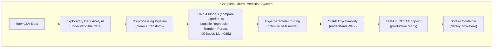

# Chapter 14 PROJECT: Customer Churn Prediction System

> **"The best way to learn machine learning is to solve a real business problem end-to-end. Predicting customer churn is one of the most common, impactful, and well-understood ML problems in industry. By the end of this project, you will have a complete, deployable ML system."**

---

## Table of Contents
1. [Project Overview](#1-project-overview)
2. [Understanding the Dataset](#2-understanding-the-dataset)
3. [Project Structure](#3-project-structure)
4. [Exploratory Data Analysis](#4-exploratory-data-analysis)
5. [Data Preprocessing Pipeline](#5-data-preprocessing-pipeline)
6. [Training Multiple Models](#6-training-multiple-models)
7. [Hyperparameter Tuning](#7-hyperparameter-tuning)
8. [Model Comparison and Selection](#8-model-comparison-and-selection)
9. [Explainability with SHAP](#9-explainability-with-shap)
10. [Prediction API with FastAPI](#10-prediction-api-with-fastapi)
11. [Docker Deployment](#11-docker-deployment)
12. [Mini Projects](#12-mini-projects)
13. [What You Learned](#13-what-you-learned)

---

## Before You Start

**Prerequisites:** Chapters 08–13 (What is ML through Model Evaluation)

**What you need installed:**
```bash
pip install pandas numpy scikit-learn xgboost lightgbm shap fastapi uvicorn matplotlib seaborn joblib
```

**Dataset:** Telco Customer Churn (IBM dataset — freely available on Kaggle)
```bash
# Download from: https://www.kaggle.com/datasets/blastchar/telco-customer-churn
# Or use this direct link after kaggle setup:
kaggle datasets download -d blastchar/telco-customer-churn
```

---

## 1. Project Overview

### What is Customer Churn?

Churn means a customer stops doing business with a company. For a telecom provider, a churned customer is one who cancelled their subscription.

```
WHY CHURN PREDICTION MATTERS:
══════════════════════════════════════════════════════════
  Acquiring a new customer costs 5-25× more than retaining one.
  
  If you can predict WHO will churn BEFORE they do:
    → Offer them a discount or better plan
    → Give them a proactive customer service call
    → Solve their underlying problem before they leave
  
  Even preventing 5% of churns can save millions of dollars.
  
  This is ML with direct, measurable business impact.
══════════════════════════════════════════════════════════
```

### What We'll Build



---

## 2. Understanding the Dataset

The Telco Customer Churn dataset has **7,043 customers** and **21 features**:

```
DATASET COLUMNS:
══════════════════════════════════════════════════════════
Customer Info:
  customerID        — Unique identifier
  gender            — Male/Female
  SeniorCitizen     — 0/1 (is the customer 65+?)
  Partner           — Yes/No (has a partner)
  Dependents        — Yes/No (has dependents)
  tenure            — Months as a customer

Services Subscribed:
  PhoneService      — Yes/No
  MultipleLines     — Yes/No/No phone service
  InternetService   — DSL/Fiber optic/No
  OnlineSecurity    — Yes/No/No internet service
  OnlineBackup      — Yes/No/No internet service
  DeviceProtection  — Yes/No/No internet service
  TechSupport       — Yes/No/No internet service
  StreamingTV       — Yes/No/No internet service
  StreamingMovies   — Yes/No/No internet service

Account Info:
  Contract          — Month-to-month/One year/Two year
  PaperlessBilling  — Yes/No
  PaymentMethod     — Electronic check/Mailed check/Bank transfer/Credit card
  MonthlyCharges    — Monthly fee in dollars
  TotalCharges      — Total amount charged

Target:
  Churn             — Yes/No (DID the customer leave?)
══════════════════════════════════════════════════════════
```

---

## 3. Project Structure

```
churn_prediction/
│
├── data/
│   └── WA_Fn-UseC_-Telco-Customer-Churn.csv
│
├── notebooks/
│   └── 01_eda.ipynb          # Exploratory analysis
│
├── src/
│   ├── __init__.py
│   ├── data_loader.py        # Load and validate data
│   ├── preprocessor.py       # Feature engineering + scaling
│   ├── trainer.py            # Model training + evaluation
│   ├── tuner.py              # Hyperparameter optimization
│   └── explainer.py          # SHAP analysis
│
├── api/
│   ├── __init__.py
│   ├── app.py                # FastAPI application
│   ├── schemas.py            # Pydantic request/response models
│   └── predictor.py          # Prediction logic
│
├── models/
│   └── (saved models go here)
│
├── train.py                  # Main training script
├── requirements.txt
└── Dockerfile
```

---

## 4. Exploratory Data Analysis

### src/data_loader.py

```python
import pandas as pd
import numpy as np

def load_data(filepath: str) -> pd.DataFrame:
    """Load the Telco churn dataset and do basic cleaning."""
    df = pd.read_csv(filepath)
    
    # TotalCharges has some spaces that should be NaN
    df['TotalCharges'] = pd.to_numeric(df['TotalCharges'], errors='coerce')
    
    # Drop customerID - it's just an identifier, not a feature
    df = df.drop('customerID', axis=1)
    
    # Convert target to binary
    df['Churn'] = (df['Churn'] == 'Yes').astype(int)
    
    print(f"Dataset shape: {df.shape}")
    print(f"Churn rate: {df['Churn'].mean():.1%}")
    print(f"Missing values: {df.isnull().sum().sum()}")
    
    return df

def get_feature_types(df: pd.DataFrame):
    """Separate categorical and numerical features."""
    target = 'Churn'
    
    numerical_features = df.select_dtypes(include=['int64', 'float64']).columns.tolist()
    numerical_features = [f for f in numerical_features if f != target]
    
    categorical_features = df.select_dtypes(include=['object']).columns.tolist()
    
    return numerical_features, categorical_features

if __name__ == "__main__":
    df = load_data("data/WA_Fn-UseC_-Telco-Customer-Churn.csv")
    num_feats, cat_feats = get_feature_types(df)
    print(f"\nNumerical features ({len(num_feats)}): {num_feats}")
    print(f"Categorical features ({len(cat_feats)}): {cat_feats}")
```

### EDA Analysis Script

```python
# eda.py - Run this to understand your data before building models
import pandas as pd
import numpy as np
import matplotlib.pyplot as plt
import seaborn as sns
from src.data_loader import load_data, get_feature_types

def run_eda(filepath: str):
    df = load_data(filepath)
    num_feats, cat_feats = get_feature_types(df)
    
    print("\n" + "="*60)
    print("BASIC STATISTICS")
    print("="*60)
    print(df.describe())
    
    # ── Churn Distribution ──────────────────────────────────────
    print("\n" + "="*60)
    print("CHURN DISTRIBUTION")
    print("="*60)
    churn_counts = df['Churn'].value_counts()
    print(f"  Not Churned: {churn_counts[0]:,} ({churn_counts[0]/len(df):.1%})")
    print(f"  Churned:     {churn_counts[1]:,} ({churn_counts[1]/len(df):.1%})")
    print("\n  This is an IMBALANCED dataset!")
    print("  We need to account for this during training.")
    
    # ── Numerical Feature Analysis ──────────────────────────────
    print("\n" + "="*60)
    print("NUMERICAL FEATURES vs CHURN")
    print("="*60)
    for feat in num_feats:
        churned_mean = df[df['Churn']==1][feat].mean()
        stayed_mean = df[df['Churn']==0][feat].mean()
        print(f"  {feat:20s}: stayed={stayed_mean:8.2f}, churned={churned_mean:8.2f}")
    
    # ── Categorical Feature Analysis ────────────────────────────
    print("\n" + "="*60)
    print("CATEGORICAL FEATURES vs CHURN RATE")
    print("="*60)
    for feat in cat_feats:
        print(f"\n  {feat}:")
        churn_by_cat = df.groupby(feat)['Churn'].mean().sort_values(ascending=False)
        for val, rate in churn_by_cat.items():
            bar = "█" * int(rate * 30)
            print(f"    {val:30s}: {rate:.1%} {bar}")
    
    # ── Create Visualizations ────────────────────────────────────
    fig, axes = plt.subplots(2, 3, figsize=(15, 10))
    fig.suptitle('Churn EDA', fontsize=16)
    
    # 1. Churn distribution
    df['Churn'].value_counts().plot(kind='bar', ax=axes[0,0], color=['green', 'red'])
    axes[0,0].set_title('Churn Distribution')
    axes[0,0].set_xticklabels(['Not Churned', 'Churned'], rotation=0)
    
    # 2. Tenure distribution by churn
    df[df['Churn']==0]['tenure'].hist(ax=axes[0,1], alpha=0.5, label='Stayed', bins=30)
    df[df['Churn']==1]['tenure'].hist(ax=axes[0,1], alpha=0.5, label='Churned', bins=30)
    axes[0,1].set_title('Tenure by Churn')
    axes[0,1].legend()
    
    # 3. Monthly charges by churn
    df[df['Churn']==0]['MonthlyCharges'].hist(ax=axes[0,2], alpha=0.5, label='Stayed', bins=30)
    df[df['Churn']==1]['MonthlyCharges'].hist(ax=axes[0,2], alpha=0.5, label='Churned', bins=30)
    axes[0,2].set_title('Monthly Charges by Churn')
    axes[0,2].legend()
    
    # 4. Contract type vs churn
    contract_churn = df.groupby('Contract')['Churn'].mean()
    contract_churn.plot(kind='bar', ax=axes[1,0], color='steelblue')
    axes[1,0].set_title('Churn Rate by Contract Type')
    axes[1,0].set_ylabel('Churn Rate')
    axes[1,0].tick_params(axis='x', rotation=30)
    
    # 5. Internet service vs churn
    internet_churn = df.groupby('InternetService')['Churn'].mean()
    internet_churn.plot(kind='bar', ax=axes[1,1], color='coral')
    axes[1,1].set_title('Churn Rate by Internet Service')
    axes[1,1].tick_params(axis='x', rotation=30)
    
    # 6. Correlation heatmap (numerical only)
    corr = df[num_feats + ['Churn']].corr()
    sns.heatmap(corr, annot=True, fmt='.2f', ax=axes[1,2], cmap='coolwarm')
    axes[1,2].set_title('Correlation Matrix')
    
    plt.tight_layout()
    plt.savefig('eda_plots.png', dpi=150, bbox_inches='tight')
    print("\n  Saved EDA plots to eda_plots.png")
    
    return df

if __name__ == "__main__":
    df = run_eda("data/WA_Fn-UseC_-Telco-Customer-Churn.csv")
```

### Key EDA Findings

```
WHAT THE DATA TELLS US:
══════════════════════════════════════════════════════════
1. Churn rate is ~26% — imbalanced, but not severely so
   
2. Contract type is the strongest predictor:
   • Month-to-month: 43% churn rate  ← HIGH RISK
   • One year:       11% churn rate
   • Two year:        3% churn rate  ← LOW RISK
   
3. Tenure has strong negative correlation with churn:
   • New customers (0-12 months) churn much more
   • Long-term customers are loyal
   
4. Fiber optic internet customers churn more (42%)
   compared to DSL (19%) — possibly dissatisfied with service
   
5. Customers without tech support, online security,
   or online backup churn significantly more

These insights guide feature engineering!
══════════════════════════════════════════════════════════
```

---

## 5. Data Preprocessing Pipeline

### src/preprocessor.py

```python
import pandas as pd
import numpy as np
from sklearn.base import BaseEstimator, TransformerMixin
from sklearn.preprocessing import StandardScaler, LabelEncoder
from sklearn.pipeline import Pipeline
from sklearn.impute import SimpleImputer
from sklearn.compose import ColumnTransformer
from sklearn.preprocessing import OneHotEncoder
import joblib

class ChurnPreprocessor:
    """
    Complete preprocessing pipeline for churn prediction.
    
    Handles:
    - Missing value imputation
    - Categorical encoding
    - Numerical scaling
    - Feature engineering
    """
    
    def __init__(self):
        self.pipeline = None
        self.feature_names = None
        
    def _engineer_features(self, df: pd.DataFrame) -> pd.DataFrame:
        """Create new features from existing ones."""
        df = df.copy()
        
        # Tenure groups (new customers vs established vs loyal)
        df['tenure_group'] = pd.cut(
            df['tenure'],
            bins=[0, 12, 24, 48, np.inf],
            labels=['new', 'developing', 'established', 'loyal']
        )
        
        # Total services count (customers with more services churn less)
        service_cols = [
            'PhoneService', 'MultipleLines', 'InternetService',
            'OnlineSecurity', 'OnlineBackup', 'DeviceProtection',
            'TechSupport', 'StreamingTV', 'StreamingMovies'
        ]
        df['num_services'] = sum(
            (df[col] == 'Yes').astype(int) for col in service_cols 
            if col in df.columns
        )
        
        # Monthly charge per service
        df['charge_per_service'] = df['MonthlyCharges'] / (df['num_services'] + 1)
        
        # Has long-term contract (strong predictor)
        df['has_longterm_contract'] = (
            df['Contract'].isin(['One year', 'Two year'])
        ).astype(int)
        
        # Has protection services
        df['has_protection'] = (
            (df['OnlineSecurity'] == 'Yes') | 
            (df['DeviceProtection'] == 'Yes') |
            (df['TechSupport'] == 'Yes')
        ).astype(int)
        
        return df
    
    def build_pipeline(self, X_train: pd.DataFrame):
        """Build and fit the preprocessing pipeline."""
        X_train = self._engineer_features(X_train)
        
        # Identify column types
        numerical_cols = X_train.select_dtypes(include=['int64', 'float64']).columns.tolist()
        categorical_cols = X_train.select_dtypes(include=['object', 'category']).columns.tolist()
        
        # Numerical pipeline: impute then scale
        numerical_pipeline = Pipeline([
            ('imputer', SimpleImputer(strategy='median')),
            ('scaler', StandardScaler())
        ])
        
        # Categorical pipeline: impute then one-hot encode
        categorical_pipeline = Pipeline([
            ('imputer', SimpleImputer(strategy='most_frequent')),
            ('encoder', OneHotEncoder(drop='first', sparse_output=False, handle_unknown='ignore'))
        ])
        
        # Combine into ColumnTransformer
        self.pipeline = ColumnTransformer(
            transformers=[
                ('num', numerical_pipeline, numerical_cols),
                ('cat', categorical_pipeline, categorical_cols)
            ]
        )
        
        self.pipeline.fit(X_train)
        
        # Get feature names after transformation
        cat_feature_names = self.pipeline.named_transformers_['cat']['encoder'].get_feature_names_out(categorical_cols)
        self.feature_names = numerical_cols + list(cat_feature_names)
        
        return self
    
    def transform(self, X: pd.DataFrame) -> np.ndarray:
        """Apply preprocessing to new data."""
        X = self._engineer_features(X)
        return self.pipeline.transform(X)
    
    def fit_transform(self, X_train: pd.DataFrame) -> np.ndarray:
        """Fit and transform in one step."""
        self.build_pipeline(X_train)
        return self.transform(X_train)
    
    def save(self, filepath: str):
        joblib.dump(self, filepath)
        print(f"Preprocessor saved to {filepath}")
    
    @classmethod
    def load(cls, filepath: str):
        return joblib.load(filepath)
```

---

## 6. Training Multiple Models

### src/trainer.py

```python
import numpy as np
import pandas as pd
from sklearn.linear_model import LogisticRegression
from sklearn.ensemble import RandomForestClassifier
from sklearn.svm import SVC
from xgboost import XGBClassifier
from lightgbm import LGBMClassifier
from sklearn.model_selection import train_test_split, StratifiedKFold, cross_val_score
from sklearn.metrics import (
    accuracy_score, precision_score, recall_score, f1_score,
    roc_auc_score, confusion_matrix, classification_report,
    roc_curve
)
import matplotlib.pyplot as plt
import joblib

class ModelTrainer:
    """Train and evaluate multiple ML models."""
    
    def __init__(self):
        self.models = {
            'Logistic Regression': LogisticRegression(
                max_iter=1000, 
                class_weight='balanced',  # Handle class imbalance
                random_state=42
            ),
            'Random Forest': RandomForestClassifier(
                n_estimators=100,
                class_weight='balanced',
                random_state=42,
                n_jobs=-1
            ),
            'XGBoost': XGBClassifier(
                n_estimators=100,
                scale_pos_weight=3,  # Upweight minority class
                random_state=42,
                eval_metric='logloss',
                verbosity=0
            ),
            'LightGBM': LGBMClassifier(
                n_estimators=100,
                class_weight='balanced',
                random_state=42,
                verbose=-1
            )
        }
        self.results = {}
        self.trained_models = {}
    
    def evaluate_model(self, model, X_train, X_test, y_train, y_test, name: str) -> dict:
        """Train a model and compute comprehensive metrics."""
        # Train
        model.fit(X_train, y_train)
        
        # Predict
        y_pred = model.predict(X_test)
        y_prob = model.predict_proba(X_test)[:, 1]
        
        # Metrics
        metrics = {
            'accuracy': accuracy_score(y_test, y_pred),
            'precision': precision_score(y_test, y_pred),
            'recall': recall_score(y_test, y_pred),
            'f1': f1_score(y_test, y_pred),
            'roc_auc': roc_auc_score(y_test, y_prob),
        }
        
        # Cross-validation AUC (more reliable than single split)
        cv_scores = cross_val_score(
            model, X_train, y_train, 
            cv=StratifiedKFold(n_splits=5, shuffle=True, random_state=42),
            scoring='roc_auc',
            n_jobs=-1
        )
        metrics['cv_auc_mean'] = cv_scores.mean()
        metrics['cv_auc_std'] = cv_scores.std()
        
        return metrics, y_pred, y_prob
    
    def train_all(self, X_train, X_test, y_train, y_test):
        """Train all models and collect results."""
        print("\n" + "="*65)
        print(f"{'MODEL':<25} {'ACC':>6} {'PREC':>6} {'REC':>6} {'F1':>6} {'AUC':>6}")
        print("="*65)
        
        for name, model in self.models.items():
            metrics, y_pred, y_prob = self.evaluate_model(
                model, X_train, X_test, y_train, y_test, name
            )
            self.results[name] = metrics
            self.trained_models[name] = model
            
            print(
                f"{name:<25} "
                f"{metrics['accuracy']:>6.3f} "
                f"{metrics['precision']:>6.3f} "
                f"{metrics['recall']:>6.3f} "
                f"{metrics['f1']:>6.3f} "
                f"{metrics['roc_auc']:>6.3f}"
            )
        
        print("="*65)
        
        # Find best model by AUC
        best_name = max(self.results, key=lambda k: self.results[k]['roc_auc'])
        print(f"\n  Best model: {best_name} (AUC={self.results[best_name]['roc_auc']:.3f})")
        
        return self.results
    
    def plot_roc_curves(self, X_test, y_test):
        """Plot ROC curves for all models."""
        plt.figure(figsize=(8, 6))
        
        for name, model in self.trained_models.items():
            y_prob = model.predict_proba(X_test)[:, 1]
            fpr, tpr, _ = roc_curve(y_test, y_prob)
            auc = self.results[name]['roc_auc']
            plt.plot(fpr, tpr, label=f'{name} (AUC={auc:.3f})')
        
        plt.plot([0, 1], [0, 1], 'k--', label='Random')
        plt.xlabel('False Positive Rate')
        plt.ylabel('True Positive Rate')
        plt.title('ROC Curves — All Models')
        plt.legend()
        plt.tight_layout()
        plt.savefig('roc_curves.png', dpi=150)
        print("  Saved ROC curves to roc_curves.png")
    
    def save_best_model(self, save_path: str):
        """Save the best model to disk."""
        best_name = max(self.results, key=lambda k: self.results[k]['roc_auc'])
        best_model = self.trained_models[best_name]
        joblib.dump(best_model, save_path)
        print(f"  Saved best model ({best_name}) to {save_path}")
        return best_name, best_model
```

---

## 7. Hyperparameter Tuning

### src/tuner.py

```python
from sklearn.model_selection import RandomizedSearchCV, StratifiedKFold
from xgboost import XGBClassifier
import numpy as np
import joblib

def tune_xgboost(X_train, y_train) -> XGBClassifier:
    """
    Tune XGBoost using RandomizedSearchCV.
    
    RandomizedSearchCV is better than GridSearchCV when you have many
    hyperparameters — it samples random combinations instead of trying all.
    """
    param_distributions = {
        'n_estimators': [100, 200, 300, 500],
        'max_depth': [3, 4, 5, 6, 7, 8],
        'learning_rate': [0.01, 0.05, 0.1, 0.2],
        'subsample': [0.6, 0.7, 0.8, 0.9, 1.0],
        'colsample_bytree': [0.6, 0.7, 0.8, 0.9, 1.0],
        'min_child_weight': [1, 3, 5, 7],
        'gamma': [0, 0.1, 0.2, 0.3],
        'scale_pos_weight': [1, 2, 3, 4]  # Handle class imbalance
    }
    
    base_model = XGBClassifier(
        random_state=42, 
        eval_metric='auc',
        verbosity=0
    )
    
    cv = StratifiedKFold(n_splits=5, shuffle=True, random_state=42)
    
    search = RandomizedSearchCV(
        base_model,
        param_distributions,
        n_iter=50,          # Try 50 random combinations
        scoring='roc_auc',
        cv=cv,
        n_jobs=-1,          # Use all CPU cores
        random_state=42,
        verbose=1
    )
    
    print("  Starting hyperparameter search (this takes ~2-5 minutes)...")
    search.fit(X_train, y_train)
    
    print(f"\n  Best AUC: {search.best_score_:.4f}")
    print(f"  Best params: {search.best_params_}")
    
    return search.best_estimator_

if __name__ == "__main__":
    # Example usage
    from src.data_loader import load_data, get_feature_types
    from src.preprocessor import ChurnPreprocessor
    from sklearn.model_selection import train_test_split
    
    df = load_data("data/WA_Fn-UseC_-Telco-Customer-Churn.csv")
    X = df.drop('Churn', axis=1)
    y = df['Churn']
    
    X_train, X_test, y_train, y_test = train_test_split(
        X, y, test_size=0.2, stratify=y, random_state=42
    )
    
    preprocessor = ChurnPreprocessor()
    X_train_processed = preprocessor.fit_transform(X_train)
    X_test_processed = preprocessor.transform(X_test)
    
    best_model = tune_xgboost(X_train_processed, y_train)
    
    from sklearn.metrics import roc_auc_score
    y_prob = best_model.predict_proba(X_test_processed)[:, 1]
    print(f"\n  Test AUC after tuning: {roc_auc_score(y_test, y_prob):.4f}")
    
    joblib.dump(best_model, "models/tuned_xgboost.pkl")
```

---

## 8. Model Comparison and Selection

```python
# comparison.py - Generate the final model comparison report
import pandas as pd
import matplotlib.pyplot as plt
import seaborn as sns

def generate_comparison_report(results: dict):
    """Create a comprehensive model comparison."""
    
    df = pd.DataFrame(results).T
    
    print("\n" + "="*70)
    print("FINAL MODEL COMPARISON REPORT")
    print("="*70)
    print(df.to_string(float_format=lambda x: f"{x:.4f}"))
    
    # Which metric should we optimize for?
    print("\n" + "="*70)
    print("WHICH METRIC TO OPTIMIZE?")
    print("="*70)
    print("""
  For churn prediction:
  
  RECALL is often more important than PRECISION because:
    → False Negative (missed churn): We lose the customer entirely
    → False Positive (wrong churn prediction): We give a discount to 
      someone who wouldn't have churned anyway — small cost
      
  So: prefer models with HIGH RECALL over HIGH PRECISION
  
  AUC-ROC gives us the best overall picture because it measures
  the model's ability to rank customers by churn probability.
    """)
    
    best_by_auc = df['roc_auc'].idxmax()
    best_by_recall = df['recall'].idxmax()
    best_by_f1 = df['f1'].idxmax()
    
    print(f"  Best AUC:    {best_by_auc} ({df.loc[best_by_auc, 'roc_auc']:.4f})")
    print(f"  Best Recall: {best_by_recall} ({df.loc[best_by_recall, 'recall']:.4f})")
    print(f"  Best F1:     {best_by_f1} ({df.loc[best_by_f1, 'f1']:.4f})")
```

---

## 9. Explainability with SHAP

SHAP (SHapley Additive exPlanations) tells us WHY the model made a prediction. This is critical for business users who need to trust and act on the model.

```python
# src/explainer.py
import shap
import numpy as np
import matplotlib.pyplot as plt

class ChurnExplainer:
    """
    SHAP-based explanation of churn predictions.
    
    SHAP values answer: "How much did each feature contribute
    to THIS specific prediction (positive = pushed toward churn,
    negative = pushed away from churn)?"
    """
    
    def __init__(self, model, preprocessor, feature_names):
        self.model = model
        self.preprocessor = preprocessor
        self.feature_names = feature_names
        self.explainer = shap.TreeExplainer(model)
    
    def explain_single_prediction(self, X_customer: dict, top_n: int = 10):
        """
        Explain why a single customer was predicted as churn/no-churn.
        
        Args:
            X_customer: dict with feature values for one customer
            top_n: number of top features to show
        """
        import pandas as pd
        
        # Convert to DataFrame
        X_df = pd.DataFrame([X_customer])
        X_processed = self.preprocessor.transform(X_df)
        
        # Get prediction
        churn_prob = self.model.predict_proba(X_processed)[0, 1]
        prediction = "CHURN" if churn_prob > 0.5 else "STAY"
        
        # Get SHAP values
        shap_values = self.explainer.shap_values(X_processed)
        
        # If binary classification, shap_values might be a list
        if isinstance(shap_values, list):
            shap_vals = shap_values[1][0]  # Class 1 (churn) SHAP values
        else:
            shap_vals = shap_values[0]
        
        # Sort by absolute value
        feature_impacts = sorted(
            zip(self.feature_names, shap_vals),
            key=lambda x: abs(x[1]),
            reverse=True
        )
        
        print(f"\n{'='*60}")
        print(f"PREDICTION: {prediction} (probability: {churn_prob:.1%})")
        print(f"{'='*60}")
        print(f"\nTop {top_n} factors driving this prediction:")
        print(f"{'Feature':<35} {'Impact':>10} {'Direction'}")
        print("-"*60)
        
        for feat, impact in feature_impacts[:top_n]:
            direction = "→ CHURN" if impact > 0 else "→ STAY"
            bar_len = int(abs(impact) * 100)
            bar = ("+" if impact > 0 else "-") * min(bar_len, 20)
            print(f"  {feat:<33} {impact:>+8.4f}  {bar}")
        
        return churn_prob, dict(feature_impacts)
    
    def plot_summary(self, X_sample: np.ndarray, max_display: int = 20):
        """Plot SHAP summary for a sample of customers."""
        shap_values = self.explainer.shap_values(X_sample)
        
        if isinstance(shap_values, list):
            shap_vals = shap_values[1]
        else:
            shap_vals = shap_values
        
        plt.figure(figsize=(10, 8))
        shap.summary_plot(
            shap_vals,
            X_sample,
            feature_names=self.feature_names,
            max_display=max_display,
            show=False
        )
        plt.tight_layout()
        plt.savefig('shap_summary.png', dpi=150, bbox_inches='tight')
        print("  Saved SHAP summary to shap_summary.png")
```

---

## 10. Prediction API with FastAPI

### api/schemas.py

```python
from pydantic import BaseModel, Field
from typing import Optional

class CustomerData(BaseModel):
    """Input schema for a single customer prediction request."""
    gender: str = Field(..., example="Male")
    SeniorCitizen: int = Field(..., ge=0, le=1, example=0)
    Partner: str = Field(..., example="Yes")
    Dependents: str = Field(..., example="No")
    tenure: int = Field(..., ge=0, example=12)
    PhoneService: str = Field(..., example="Yes")
    MultipleLines: str = Field(..., example="No")
    InternetService: str = Field(..., example="Fiber optic")
    OnlineSecurity: str = Field(..., example="No")
    OnlineBackup: str = Field(..., example="No")
    DeviceProtection: str = Field(..., example="No")
    TechSupport: str = Field(..., example="No")
    StreamingTV: str = Field(..., example="Yes")
    StreamingMovies: str = Field(..., example="Yes")
    Contract: str = Field(..., example="Month-to-month")
    PaperlessBilling: str = Field(..., example="Yes")
    PaymentMethod: str = Field(..., example="Electronic check")
    MonthlyCharges: float = Field(..., gt=0, example=70.35)
    TotalCharges: Optional[float] = Field(None, example=845.5)

class PredictionResponse(BaseModel):
    """Output schema for a churn prediction."""
    customer_id: Optional[str]
    churn_probability: float
    prediction: str  # "CHURN" or "STAY"
    risk_level: str  # "HIGH", "MEDIUM", "LOW"
    top_factors: list[dict]
```

### api/app.py

```python
from fastapi import FastAPI, HTTPException
from fastapi.middleware.cors import CORSMiddleware
import pandas as pd
import joblib
import os

from api.schemas import CustomerData, PredictionResponse
from src.preprocessor import ChurnPreprocessor
from src.explainer import ChurnExplainer

app = FastAPI(
    title="Churn Prediction API",
    description="Predict whether a telecom customer will churn",
    version="1.0.0"
)

app.add_middleware(
    CORSMiddleware,
    allow_origins=["*"],
    allow_methods=["*"],
    allow_headers=["*"]
)

# Load model and preprocessor on startup
MODEL_PATH = "models/tuned_xgboost.pkl"
PREPROCESSOR_PATH = "models/preprocessor.pkl"

model = None
preprocessor = None
explainer = None

@app.on_event("startup")
async def load_model():
    global model, preprocessor, explainer
    
    if not os.path.exists(MODEL_PATH):
        raise RuntimeError(f"Model not found at {MODEL_PATH}. Run train.py first.")
    
    model = joblib.load(MODEL_PATH)
    preprocessor = ChurnPreprocessor.load(PREPROCESSOR_PATH)
    
    print("Model and preprocessor loaded successfully")

@app.get("/")
async def root():
    return {"message": "Churn Prediction API is running"}

@app.post("/predict", response_model=PredictionResponse)
async def predict_churn(customer: CustomerData):
    """
    Predict churn probability for a single customer.
    
    Returns:
    - churn_probability: 0.0 to 1.0
    - prediction: CHURN or STAY
    - risk_level: HIGH (>70%), MEDIUM (30-70%), LOW (<30%)
    - top_factors: which features drove the prediction
    """
    if model is None:
        raise HTTPException(status_code=503, detail="Model not loaded")
    
    try:
        # Convert to DataFrame
        customer_dict = customer.dict()
        customer_id = customer_dict.pop('customer_id', 'unknown')
        X = pd.DataFrame([customer_dict])
        
        # Preprocess
        X_processed = preprocessor.transform(X)
        
        # Predict
        churn_prob = float(model.predict_proba(X_processed)[0, 1])
        prediction = "CHURN" if churn_prob > 0.5 else "STAY"
        
        # Risk level
        if churn_prob >= 0.7:
            risk_level = "HIGH"
        elif churn_prob >= 0.3:
            risk_level = "MEDIUM"
        else:
            risk_level = "LOW"
        
        # Get top factors (simplified — full SHAP for production)
        top_factors = [
            {"factor": "tenure", "value": customer.tenure, 
             "note": "Short tenure increases churn risk" if customer.tenure < 12 else ""},
            {"factor": "contract", "value": customer.Contract,
             "note": "Month-to-month contracts have highest churn" if customer.Contract == "Month-to-month" else ""}
        ]
        
        return PredictionResponse(
            customer_id=customer_id,
            churn_probability=churn_prob,
            prediction=prediction,
            risk_level=risk_level,
            top_factors=top_factors
        )
        
    except Exception as e:
        raise HTTPException(status_code=500, detail=str(e))

@app.get("/health")
async def health_check():
    return {
        "status": "healthy",
        "model_loaded": model is not None
    }
```

---

## 11. Docker Deployment

### Dockerfile

```dockerfile
FROM python:3.11-slim

WORKDIR /app

# Install dependencies first (layer caching)
COPY requirements.txt .
RUN pip install --no-cache-dir -r requirements.txt

# Copy source code
COPY . .

# Expose API port
EXPOSE 8000

# Start the API
CMD ["uvicorn", "api.app:app", "--host", "0.0.0.0", "--port", "8000"]
```

### requirements.txt

```
pandas==2.0.3
numpy==1.24.3
scikit-learn==1.3.0
xgboost==1.7.6
lightgbm==4.0.0
shap==0.42.1
fastapi==0.103.1
uvicorn==0.23.2
pydantic==2.3.0
matplotlib==3.7.2
seaborn==0.12.2
joblib==1.3.2
```

### Running the Project

```bash
# 1. Install dependencies
pip install -r requirements.txt

# 2. Download data (from Kaggle)
mkdir data models
# Place WA_Fn-UseC_-Telco-Customer-Churn.csv in data/

# 3. Train the model
python train.py

# 4. Start the API
uvicorn api.app:app --reload

# 5. Test the API
curl -X POST "http://localhost:8000/predict" \
  -H "Content-Type: application/json" \
  -d '{
    "gender": "Male",
    "SeniorCitizen": 0,
    "Partner": "No",
    "Dependents": "No",
    "tenure": 2,
    "PhoneService": "Yes",
    "MultipleLines": "No",
    "InternetService": "Fiber optic",
    "OnlineSecurity": "No",
    "OnlineBackup": "No",
    "DeviceProtection": "No",
    "TechSupport": "No",
    "StreamingTV": "No",
    "StreamingMovies": "No",
    "Contract": "Month-to-month",
    "PaperlessBilling": "Yes",
    "PaymentMethod": "Electronic check",
    "MonthlyCharges": 70.35,
    "TotalCharges": 151.65
  }'

# 6. Build and run Docker container
docker build -t churn-api .
docker run -p 8000:8000 churn-api
```

---

## 12. Mini Projects

### Mini Project 1: Churn Risk Dashboard

**What You'll Build:** A terminal dashboard showing your top 10 highest-risk customers.

**Time Estimate:** 1-2 hours

**Skills Practiced:** Pandas, scikit-learn, data visualization in terminal

**Step-by-Step:**

```python
# mini_project_1_dashboard.py
import pandas as pd
import numpy as np
from src.data_loader import load_data
from src.preprocessor import ChurnPreprocessor
import joblib

def build_risk_dashboard(data_path: str, model_path: str, preprocessor_path: str):
    """Print a terminal dashboard of high-risk customers."""
    
    # Load everything
    df = load_data(data_path)
    
    # Keep original data for display
    df_display = df.copy()
    X = df.drop('Churn', axis=1)
    y = df['Churn']
    
    preprocessor = ChurnPreprocessor.load(preprocessor_path)
    model = joblib.load(model_path)
    
    # Get predictions for ALL customers
    X_processed = preprocessor.transform(X)
    churn_probs = model.predict_proba(X_processed)[:, 1]
    
    df_display['churn_probability'] = churn_probs
    df_display['risk_level'] = pd.cut(
        churn_probs,
        bins=[0, 0.3, 0.7, 1.0],
        labels=['LOW', 'MEDIUM', 'HIGH']
    )
    
    # Dashboard header
    print("\n" + "="*70)
    print("  CUSTOMER CHURN RISK DASHBOARD")
    print("="*70)
    
    # Summary stats
    high_risk = (df_display['risk_level'] == 'HIGH').sum()
    medium_risk = (df_display['risk_level'] == 'MEDIUM').sum()
    low_risk = (df_display['risk_level'] == 'LOW').sum()
    
    print(f"\n  Total Customers: {len(df_display):,}")
    print(f"  HIGH Risk:       {high_risk:,} ({high_risk/len(df_display):.1%})")
    print(f"  MEDIUM Risk:     {medium_risk:,} ({medium_risk/len(df_display):.1%})")
    print(f"  LOW Risk:        {low_risk:,} ({low_risk/len(df_display):.1%})")
    
    # Top 10 highest risk customers
    top_risk = df_display.nlargest(10, 'churn_probability')[
        ['tenure', 'Contract', 'MonthlyCharges', 'InternetService', 'churn_probability', 'risk_level']
    ]
    
    print("\n  TOP 10 HIGHEST RISK CUSTOMERS:")
    print("  " + "-"*65)
    print(f"  {'#':>3} {'Tenure':>6} {'Contract':>20} {'Monthly $':>9} {'Risk%':>6}")
    print("  " + "-"*65)
    
    for i, (_, row) in enumerate(top_risk.iterrows(), 1):
        risk_bar = "█" * int(row['churn_probability'] * 20)
        print(
            f"  {i:>3}. "
            f"{int(row['tenure']):>5}mo "
            f"{row['Contract']:>20} "
            f"${row['MonthlyCharges']:>8.2f} "
            f"{row['churn_probability']:>5.1%} {risk_bar}"
        )
    
    print("\n  Intervention Recommendation:")
    print("  Focus retention efforts on HIGH risk customers with:")
    print("  • Month-to-month contracts → offer annual discount")
    print("  • Short tenure (<12 months) → assign dedicated support rep")
    print("  • No tech support → offer free 3-month trial")
    
    return df_display

if __name__ == "__main__":
    dashboard = build_risk_dashboard(
        "data/WA_Fn-UseC_-Telco-Customer-Churn.csv",
        "models/tuned_xgboost.pkl",
        "models/preprocessor.pkl"
    )
```

**Expected Output:**
```
======================================================================
  CUSTOMER CHURN RISK DASHBOARD
======================================================================

  Total Customers: 7,043
  HIGH Risk:         891 (12.6%)
  MEDIUM Risk:     2,156 (30.6%)
  LOW Risk:        3,996 (56.7%)

  TOP 10 HIGHEST RISK CUSTOMERS:
  -----------------------------------------------------------------
    # Tenure             Contract Monthly $  Risk%
  -----------------------------------------------------------------
    1.     1mo  Month-to-month  $  90.45  98.3% ████████████████████
    2.     2mo  Month-to-month  $  85.70  97.8% ███████████████████
    ...
```

**Bonus Challenge:** Group high-risk customers by their top intervention opportunity (contract upgrade, tech support offer, etc.) and estimate the revenue at risk.

---

### Mini Project 2: Feature Importance Reporter

**What You'll Build:** A script that generates a human-readable PDF report explaining which factors drive churn.

**Time Estimate:** 1-2 hours

**Skills Practiced:** Feature importance, SHAP, matplotlib

```python
# mini_project_2_importance_report.py
import pandas as pd
import numpy as np
import matplotlib.pyplot as plt
import matplotlib.gridspec as gridspec
import joblib
from src.data_loader import load_data
from src.preprocessor import ChurnPreprocessor

def generate_importance_report(data_path, model_path, preprocessor_path):
    """Generate a feature importance report."""
    
    df = load_data(data_path)
    X = df.drop('Churn', axis=1)
    y = df['Churn']
    
    preprocessor = ChurnPreprocessor.load(preprocessor_path)
    model = joblib.load(model_path)
    X_processed = preprocessor.transform(X)
    
    # Get feature importances
    importances = model.feature_importances_
    feature_names = preprocessor.feature_names
    
    # Sort by importance
    indices = np.argsort(importances)[::-1]
    
    fig, axes = plt.subplots(1, 2, figsize=(16, 8))
    fig.suptitle('What Drives Customer Churn? — Feature Importance Report', fontsize=14)
    
    # Top 15 features
    top_n = 15
    top_features = [feature_names[i] for i in indices[:top_n]]
    top_importances = importances[indices[:top_n]]
    
    colors = ['#d32f2f' if imp > 0.05 else '#f57c00' if imp > 0.02 else '#388e3c' 
              for imp in top_importances]
    
    axes[0].barh(range(top_n), top_importances[::-1], color=colors[::-1])
    axes[0].set_yticks(range(top_n))
    axes[0].set_yticklabels(top_features[::-1], fontsize=10)
    axes[0].set_title('Top 15 Churn Drivers')
    axes[0].set_xlabel('Importance Score')
    
    # Cumulative importance
    cumulative = np.cumsum(sorted(importances, reverse=True))
    axes[1].plot(range(1, len(cumulative)+1), cumulative, 'b-')
    axes[1].axhline(y=0.8, color='r', linestyle='--', label='80% threshold')
    axes[1].set_xlabel('Number of Features')
    axes[1].set_ylabel('Cumulative Importance')
    axes[1].set_title('How Many Features Cover 80% of Signal?')
    axes[1].legend()
    
    # Find 80% threshold
    n_for_80pct = next(i+1 for i, v in enumerate(cumulative) if v >= 0.8)
    axes[1].axvline(x=n_for_80pct, color='g', linestyle='--', 
                    label=f'{n_for_80pct} features = 80%')
    axes[1].legend()
    
    plt.tight_layout()
    plt.savefig('importance_report.png', dpi=150, bbox_inches='tight')
    
    print(f"\nTop 5 Churn Drivers:")
    for i in range(5):
        feat = feature_names[indices[i]]
        imp = importances[indices[i]]
        print(f"  {i+1}. {feat}: {imp:.4f} ({imp/sum(importances):.1%} of total signal)")
    
    print(f"\n  {n_for_80pct} features explain 80% of the model's decisions")
    print(f"  Report saved to importance_report.png")

if __name__ == "__main__":
    generate_importance_report(
        "data/WA_Fn-UseC_-Telco-Customer-Churn.csv",
        "models/tuned_xgboost.pkl",
        "models/preprocessor.pkl"
    )
```

---

### Mini Project 3: ROI Simulator

**What You'll Build:** A script that simulates different retention intervention strategies and estimates ROI.

**Time Estimate:** 1-2 hours

**Skills Practiced:** Business logic, Pandas, scenario analysis

```python
# mini_project_3_roi_simulator.py
import pandas as pd
import numpy as np
import joblib
from src.data_loader import load_data
from src.preprocessor import ChurnPreprocessor

def simulate_retention_roi(
    data_path: str,
    model_path: str,
    preprocessor_path: str,
    intervention_cost_per_customer: float = 50.0,
    avg_monthly_revenue_per_customer: float = 65.0,
    avg_customer_lifetime_months: float = 36.0
):
    """
    Simulate the ROI of different intervention strategies.
    
    Strategy options:
    1. Intervene on ALL predicted churners (threshold=0.5)
    2. Intervene only on HIGH risk (threshold=0.7)
    3. Intervene on top N customers (budget-constrained)
    """
    df = load_data(data_path)
    X = df.drop('Churn', axis=1)
    y = df['Churn']
    
    preprocessor = ChurnPreprocessor.load(preprocessor_path)
    model = joblib.load(model_path)
    X_processed = preprocessor.transform(X)
    
    churn_probs = model.predict_proba(X_processed)[:, 1]
    actual_churns = y.values
    
    avg_clv = avg_monthly_revenue_per_customer * avg_customer_lifetime_months
    intervention_success_rate = 0.3  # Assume 30% of interventions prevent churn
    
    print("\n" + "="*65)
    print("RETENTION INTERVENTION ROI SIMULATOR")
    print("="*65)
    print(f"\nAssumptions:")
    print(f"  Avg Customer Lifetime Value: ${avg_clv:,.0f}")
    print(f"  Intervention Cost: ${intervention_cost_per_customer}/customer")
    print(f"  Intervention Success Rate: {intervention_success_rate:.0%}")
    
    strategies = [
        ("Conservative (threshold=0.7)", churn_probs >= 0.7),
        ("Standard (threshold=0.5)",     churn_probs >= 0.5),
        ("Aggressive (threshold=0.3)",   churn_probs >= 0.3),
    ]
    
    print(f"\n{'Strategy':<35} {'Targeted':>9} {'Prevented':>10} {'Revenue Saved':>14} {'Cost':>10} {'Net ROI':>10}")
    print("-"*90)
    
    for strategy_name, intervention_mask in strategies:
        n_targeted = intervention_mask.sum()
        
        # Of those targeted, how many actually would have churned?
        true_positives = (intervention_mask & actual_churns.astype(bool)).sum()
        
        # We prevent 30% of true positives
        prevented = int(true_positives * intervention_success_rate)
        
        revenue_saved = prevented * avg_clv
        total_cost = n_targeted * intervention_cost_per_customer
        net_roi = revenue_saved - total_cost
        
        print(
            f"{strategy_name:<35} "
            f"{n_targeted:>9,} "
            f"{prevented:>10,} "
            f"${revenue_saved:>13,.0f} "
            f"${total_cost:>9,.0f} "
            f"${net_roi:>9,.0f}"
        )
    
    # No intervention baseline
    baseline_lost = actual_churns.sum() * avg_clv
    print("-"*90)
    print(f"{'No intervention':<35} {'0':>9} {'0':>10} ${0:>13,.0f} ${0:>9} ${-baseline_lost:>9,.0f}")
    
    print(f"\n  Total customers at risk of churning: {actual_churns.sum()}")
    print(f"  Revenue at risk without intervention: ${baseline_lost:,.0f}")

if __name__ == "__main__":
    simulate_retention_roi(
        "data/WA_Fn-UseC_-Telco-Customer-Churn.csv",
        "models/tuned_xgboost.pkl",
        "models/preprocessor.pkl"
    )
```

---

## 13. What You Learned

```
PROJECT SKILLS MASTERED:
══════════════════════════════════════════════════════════
DATA ANALYSIS:
  ✓ Exploratory Data Analysis (EDA) with pandas + seaborn
  ✓ Understanding class imbalance and how to handle it
  ✓ Feature correlation analysis
  ✓ Business interpretation of statistical findings

MACHINE LEARNING:
  ✓ Building preprocessing pipelines with sklearn
  ✓ Feature engineering (creating tenure_group, num_services, etc.)
  ✓ Training and comparing multiple model types
  ✓ RandomizedSearchCV for hyperparameter tuning
  ✓ Cross-validation for reliable model evaluation

MODEL EVALUATION:
  ✓ Why AUC-ROC matters for imbalanced classification
  ✓ Precision vs Recall tradeoff for business problems
  ✓ ROC curve visualization and interpretation

EXPLAINABILITY:
  ✓ SHAP values for model explanation
  ✓ Feature importance analysis
  ✓ Explaining predictions to business stakeholders

PRODUCTION:
  ✓ FastAPI for serving predictions as REST endpoints
  ✓ Pydantic for input validation
  ✓ Docker for containerized deployment
  ✓ Saving and loading models with joblib

BUSINESS THINKING:
  ✓ Translating ML predictions to business value
  ✓ ROI calculation for ML interventions
  ✓ Risk segmentation (HIGH/MEDIUM/LOW)
══════════════════════════════════════════════════════════
```

---

## Exercises

**Exercise 1:** The dataset is imbalanced (~26% churn). Try three different approaches to handle this:
- `class_weight='balanced'` (already in our code)
- SMOTE oversampling (use `imbalanced-learn` library)
- Random undersampling
Compare AUC scores. Which approach works best?

**Exercise 2:** Add 3 more engineered features you think might predict churn. Ideas: `avg_monthly_over_tenure` (TotalCharges/tenure), `is_new_customer` (tenure < 3), `has_all_services`. Measure if they improve AUC.

**Exercise 3:** Build a threshold optimizer. The default threshold is 0.5, but for churn prediction we might want a lower threshold (catch more churners). Write a function that finds the optimal threshold by maximizing a business metric (e.g., revenue saved - intervention cost).

**Exercise 4:** Add a `/batch_predict` endpoint to the FastAPI app that accepts a list of customers (up to 1000) and returns predictions for all of them in one API call.

**Exercise 5:** The model currently has no monitoring. Build a data drift detector that compares the distribution of incoming prediction requests to the training data. Alert if distributions diverge significantly (use KL divergence or Population Stability Index).

---

← [Chapter 13: Model Evaluation and Feature Engineering](./13-model-evaluation-and-feature-engineering.md) | [Chapter 15: Neural Networks from Scratch](./15-neural-networks-from-scratch.md) →

*You've built a complete, production-ready ML system from raw data to deployed API. The same pattern — EDA → preprocessing → training → evaluation → deployment — applies to almost every supervised learning problem you'll encounter.*
