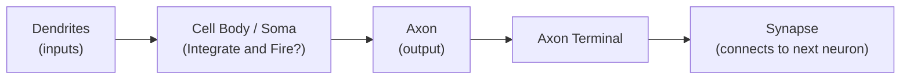
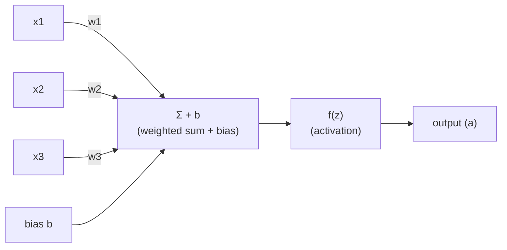
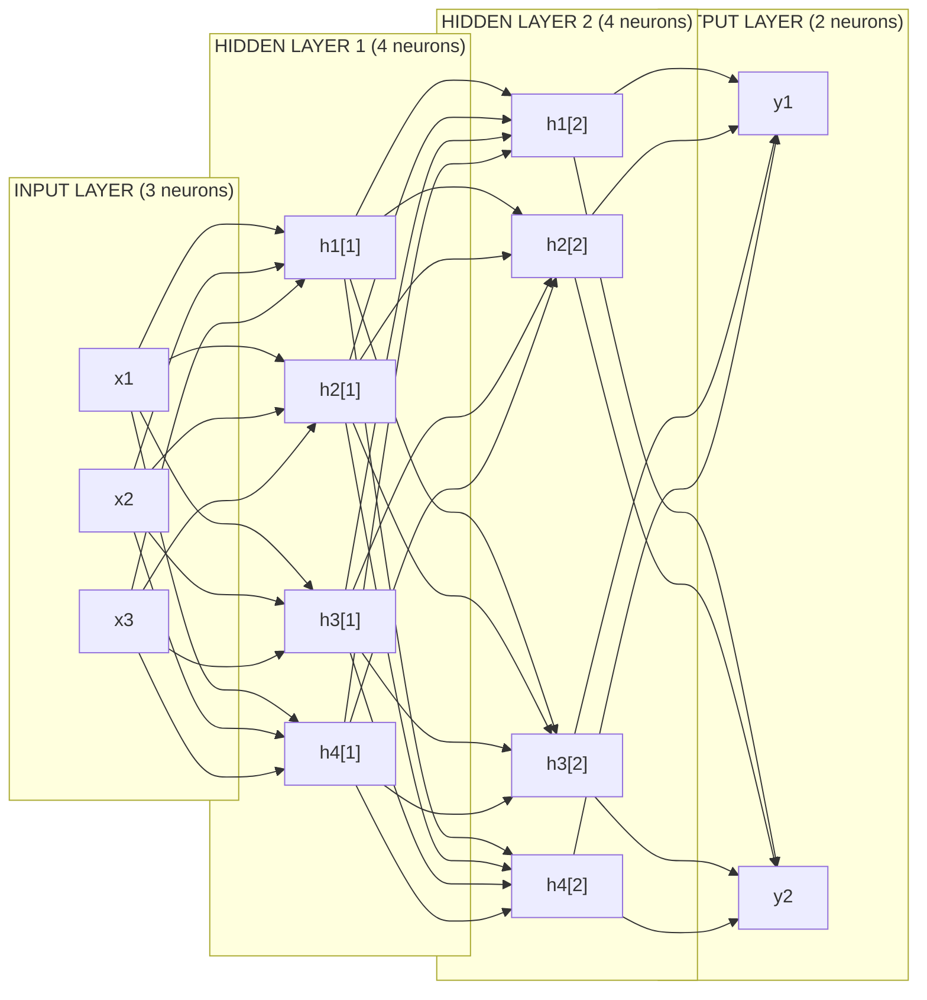

# Chapter 15: Neural Networks from Scratch — From Perceptron to Multi-Layer Networks

> **"A neural network is not a brain simulation. It is a mathematical function composed of simpler functions, trained to approximate a mapping from inputs to outputs. Understanding this distinction will save you months of confusion."**

---

## Table of Contents
1. [Biological Inspiration — and Its Limits as an Analogy](#1-biological-inspiration)
2. [The Perceptron (1957)](#2-the-perceptron-1957)
3. [The XOR Problem — Why One Layer Is Not Enough](#3-the-xor-problem)
4. [Multi-Layer Perceptrons (MLP)](#4-multi-layer-perceptrons-mlp)
5. [Activation Functions — Deep Dive](#5-activation-functions)
6. [The Feedforward Pass — Matrix Formulation](#6-the-feedforward-pass)
7. [Universal Approximation Theorem](#7-universal-approximation-theorem)
8. [Network Capacity: Depth vs Width](#8-network-capacity-depth-vs-width)
9. [Weight Initialization](#9-weight-initialization)
10. [Building a Neural Network from Scratch in NumPy](#10-building-a-neural-network-from-scratch)
11. [Summary and What's Next](#11-summary)

---

## 1. Biological Inspiration

The history of neural networks begins with a legitimate analogy to the brain, but the analogy breaks down quickly. Let's understand it accurately.

### The Biological Neuron

A neuron in your brain has roughly this structure:



- **Dendrites**: receive signals from other neurons
- **Cell body (soma)**: accumulates the incoming signals
- **Axon**: transmits the output signal (a spike or silence)
- **Synapse**: the connection point between neurons. The "strength" of the connection is modifiable — this is how biological learning works

The neuron fires (sends a spike) when the accumulated input exceeds a threshold. This is an all-or-nothing event called an **action potential**.

### The Artificial Neuron — What We Actually Use

An artificial neuron is a **mathematical abstraction** inspired by this, but far simpler:



The weights `w` are the "synaptic strengths". The bias `b` is a learnable offset. The activation function `f` introduces non-linearity.

### Where the Analogy Breaks Down

| Biological Neuron | Artificial Neuron |
|-------------------|-------------------|
| Fires spikes (binary events) | Outputs continuous real values |
| ~10,000 connections | Typically 1 to millions |
| Updates via complex biochemistry | Updates via gradient descent |
| Learns slowly, once | Learns from batch data, many iterations |
| Consumes ~20 watts (whole brain) | GPU training: thousands of watts |
| ~86 billion neurons in brain | GPT-4: ~1.76 trillion parameters |

**The lesson**: artificial neural networks borrow the vocabulary of biology but operate on entirely different principles. Do not over-use the brain analogy when reasoning about why a network does or doesn't work.

---

## 2. The Perceptron (1957)

Frank Rosenblatt invented the perceptron in 1957 while working at the Cornell Aeronautical Laboratory. It was implemented in hardware and demonstrated on a Navy computer. The press declared that machines could now "learn to read." The reality was more modest — but impressive nonetheless.

### Perceptron Definition

A perceptron takes `n` binary or real-valued inputs and produces a binary output (0 or 1):

```
                   x1 ──── w1 ──┐
                   x2 ──── w2 ──┤
                   x3 ──── w3 ──┼──── Σ(wi·xi) + b ──── step(z) ──── {0 or 1}
                   ...          │
                   xn ──── wn ──┘

step(z) = 1  if z >= 0
        = 0  if z < 0
```

**In vector notation:**
```
z = w^T · x + b
y = step(z)
```

### The Perceptron Learning Algorithm

The perceptron has a simple update rule:

```
For each training example (x, y_true):
    y_pred = step(w^T · x + b)
    
    if y_pred != y_true:
        w = w + α · (y_true - y_pred) · x
        b = b + α · (y_true - y_pred)

where α = learning rate (small positive number, e.g., 0.1)
```

**Intuition**: if the prediction was wrong, push the weights in the direction that would have gotten it right.

### What a Perceptron Can Do

A single perceptron defines a **linear decision boundary** — a hyperplane that separates two classes:

```
2D case — feature space:

     x2
      │
   1  │   .  .           (class 1 = filled circles)
      │  .    .
      │   .         o o  (class 0 = open circles)
   0  │        o  o
      │      o
      └────────────────── x1
         0       1

      Decision boundary: w1·x1 + w2·x2 + b = 0
                          (a straight line in 2D)
```

**The Perceptron Convergence Theorem** (Rosenblatt, 1957): If the training data is **linearly separable**, the perceptron learning algorithm is **guaranteed to converge** to a correct solution in a finite number of steps.

### Perceptron in Python

```python
import numpy as np

class Perceptron:
    def __init__(self, learning_rate=0.1, n_epochs=1000):
        self.lr = learning_rate
        self.n_epochs = n_epochs
        self.weights = None
        self.bias = None

    def fit(self, X, y):
        n_samples, n_features = X.shape
        
        # Initialize weights to zero
        self.weights = np.zeros(n_features)
        self.bias = 0

        for epoch in range(self.n_epochs):
            errors = 0
            for x_i, y_i in zip(X, y):
                z = np.dot(self.weights, x_i) + self.bias
                y_pred = 1 if z >= 0 else 0
                
                # Update rule: only fires if prediction is wrong
                delta = self.lr * (y_i - y_pred)
                self.weights += delta * x_i
                self.bias += delta
                
                if delta != 0:
                    errors += 1
            
            if errors == 0:
                print(f"Converged at epoch {epoch}")
                break

    def predict(self, X):
        z = np.dot(X, self.weights) + self.bias
        return (z >= 0).astype(int)

# Test on AND gate (linearly separable)
X_and = np.array([[0,0], [0,1], [1,0], [1,1]])
y_and = np.array([0, 0, 0, 1])   # AND: only true when BOTH inputs are 1

p = Perceptron(learning_rate=0.1)
p.fit(X_and, y_and)
print(p.predict(X_and))   # Expected: [0, 0, 0, 1]
```

---

## 3. The XOR Problem

In 1969, Marvin Minsky and Seymour Papert published "Perceptrons," a book that proved mathematically that a single perceptron **cannot** solve the XOR problem. This nearly killed neural network research for a decade.

### XOR Truth Table

| x1 | x2 | XOR output |
|----|-----|-----------|
| 0  | 0   | 0         |
| 0  | 1   | 1         |
| 1  | 0   | 1         |
| 1  | 1   | 0         |

### Why a Single Line Cannot Separate XOR

```
     x2
      │
   1  │   o          .     o = class 0 (output 0)
      │                    . = class 1 (output 1)
      │        .
   0  │   .
      │
      └────────────────── x1
         0         1

Try to draw ONE straight line that puts (0,1) and (1,0) on one side
and (0,0) and (1,1) on the other.

You CANNOT. They are not linearly separable.
```

### The Solution: Add a Hidden Layer

With two hidden neurons, we can learn a new feature space where XOR becomes linearly separable:

```
Layer 1 (hidden) learns:
  h1 = step(x1 + x2 - 0.5)    → fires when AT LEAST ONE input is 1
  h2 = step(x1 + x2 - 1.5)    → fires only when BOTH inputs are 1

New feature space:
  (x1=0, x2=0) → h1=0, h2=0
  (x1=0, x2=1) → h1=1, h2=0
  (x1=1, x2=0) → h1=1, h2=0
  (x1=1, x2=1) → h1=1, h2=1

Layer 2 learns:
  output = step(h1 - h2 - 0.5) → fires when h1=1 AND h2=0 → XOR!
```

The hidden layer **creates new features** that make the problem linearly separable. This is the core insight of deep learning.

---

## 4. Multi-Layer Perceptrons (MLP)

A Multi-Layer Perceptron (MLP) — also called a **feedforward neural network** or **fully connected network** — stacks multiple layers of neurons.

### Architecture Diagram



### Terminology

- **Input layer**: passes raw features, no computation
- **Hidden layers**: intermediate computation layers (the "hidden" representations)
- **Output layer**: produces the final prediction
- **Depth**: number of hidden layers (not counting input/output)
- **Width**: number of neurons per layer
- **Parameters**: all trainable weights + biases

**Parameter count example** for the above network (3 → 4 → 4 → 2):
```
W[1]: 3×4 = 12 weights  +  b[1]: 4 biases  = 16
W[2]: 4×4 = 16 weights  +  b[2]: 4 biases  = 20
W[3]: 4×2 = 8  weights  +  b[3]: 2 biases  = 10
                                   Total   = 46 parameters
```

### Each Neuron's Computation

For any neuron `j` in layer `l`:

```
Pre-activation (z):    z_j^[l] = Σ_i (w_ji^[l] · a_i^[l-1]) + b_j^[l]

Post-activation (a):   a_j^[l] = f(z_j^[l])

where f is the activation function for that layer
```

In matrix form for an entire layer:
```
Z^[l] = W^[l] · A^[l-1] + b^[l]     (shape: n_l × m, where m = batch size)
A^[l] = f(Z^[l])                      (applied element-wise)
```

### Why Hidden Layers Are Necessary

Each hidden layer learns progressively more abstract features:

```
In image recognition (conceptual hierarchy):
   Layer 1: detects edges, corners, color blobs
   Layer 2: combines edges into textures, simple shapes
   Layer 3: combines shapes into object parts (ears, wheels, windows)
   Layer 4: combines parts into full objects (dog face, car body)
   Output:  classifies the full object

In text processing:
   Layer 1: character patterns, n-grams
   Layer 2: words and simple phrases
   Layer 3: grammar structure, named entities
   Layer 4: semantic meaning, topic
   Output:  sentiment, category, translation
```

This **feature hierarchy** is why deep networks outperform shallow ones on complex tasks. The early layers learn reusable low-level features that the later layers compose.

---

## 5. Activation Functions

Without activation functions, a multi-layer network is just a linear transformation. Stacking linear layers produces another linear layer: W3·(W2·(W1·x)) = W_combined·x. Activation functions introduce **non-linearity**, which is what gives networks their expressive power.

### 5.1 Sigmoid

```
         1
σ(z) = ──────
       1+e^(-z)

Range: (0, 1)
```

```
ASCII plot of σ(z):

σ(z)
1.0 │             ──────────────────
    │          /
0.5 │        /
    │      /
0.0 │────────────────────────────────
   -6   -4   -2    0    2    4    6  → z

Derivative (σ'(z)):
    │
0.25│          ─────
    │        /      \
    │       /         \
0.0 │──────              ──────────  → z
   -6                              6
   Maximum derivative = 0.25 at z=0
```

**Formula for derivative:** σ'(z) = σ(z) · (1 − σ(z))

**Properties:**
- Squashes output between 0 and 1 → useful for binary probability output
- Smooth and differentiable everywhere
- Historically popular (1980s–2010s)

**Problems:**
- **Vanishing gradient**: when z is very positive or negative, σ'(z) ≈ 0. Gradients multiplied through many layers → exponentially small → network cannot learn
- **Not zero-centered**: outputs are always positive (0 to 1). This means gradients are always the same sign → slow, zig-zagging optimization
- **Computationally expensive**: exp() operation

**When to use**: output layer for binary classification (outputs probability). Avoid in hidden layers.

### 5.2 Tanh (Hyperbolic Tangent)

```
         e^z - e^(-z)
tanh(z) = ────────────
         e^z + e^(-z)

Range: (-1, 1)
```

```
ASCII plot of tanh(z):

tanh(z)
 1.0 │             ───────────────
     │          /
 0.0 │────────/─────────────────── z
     │      /
-1.0 │────────────────
    -6   -4   -2   0   2    4    6

Derivative: 1 - tanh²(z)
Maximum derivative = 1.0 at z=0
```

**Properties:**
- Zero-centered (outputs in -1 to 1) — better than sigmoid for optimization
- Stronger gradients than sigmoid (max 1.0 vs 0.25)
- Still suffers vanishing gradient for large |z|

**When to use**: sometimes in RNNs (LSTM gates). Otherwise prefer ReLU for hidden layers.

### 5.3 ReLU (Rectified Linear Unit)

```
ReLU(z) = max(0, z)
```

```
ASCII plot of ReLU(z):

ReLU(z)
  │                  /
  │                /
  │              /
  │            /
  │__________/
  │
  └────────────────────────── z
   -4   -2    0    2    4

Derivative:
  │          ──────────────
  1│         |
  0│─────────
   └────────────────────────── z
         0
```

**Properties:**
- **Fast**: just a comparison and zero operation — much faster than exp()
- **No vanishing gradient** for positive activations (gradient = 1)
- **Sparse activation**: about 50% of neurons are exactly 0 → efficient representations
- Introduced deep learning's modern era — used in AlexNet (2012), every major network since

**Problems:**
- **Dying ReLU**: if a neuron's input is always negative, gradient is always 0 → the neuron never updates → "dead." This can happen with large learning rates or bad initialization.
- **Not zero-centered**: outputs are ≥ 0

**When to use**: **default choice for hidden layers**. Start with ReLU; only switch if you have evidence it's failing.

### 5.4 Leaky ReLU

```
LeakyReLU(z) = z      if z > 0
             = α·z    if z <= 0     (α = 0.01 by default)
```

```
ASCII plot of LeakyReLU(z):

   │                     /
   │                   /
   │                 /
   │               /
   │             /
 ──│───────────/──────────────── z
  /│
 / │
/  │          (slope = 0.01 for z < 0)
```

**Purpose**: fixes dying ReLU — neurons always have some gradient, even for negative inputs.

**When to use**: when you observe dying ReLU (many neurons outputting 0 throughout training). Also try Parametric ReLU (PReLU) where α is learned.

### 5.5 ELU (Exponential Linear Unit)

```
ELU(z) = z             if z > 0
       = α(e^z - 1)    if z <= 0    (α typically 1.0)
```

**Properties**: smooth version of Leaky ReLU. Can produce negative outputs → closer to zero-mean. Sometimes better than ReLU empirically. Slower due to exp().

### 5.6 GELU (Gaussian Error Linear Unit)

```
GELU(z) = z · Φ(z)

where Φ(z) = CDF of the standard normal distribution
           = 0.5 · (1 + erf(z/√2))

Approximation (commonly used):
GELU(z) ≈ 0.5·z·(1 + tanh(√(2/π) · (z + 0.044715·z³)))
```

```
ASCII plot of GELU(z):

     │                   /
     │                  /
     │                 /
  ───│────────────────/─────────── z
     │           ----
     │        --/
     │       /   (slight negative dip near z = -0.17)
```

**Properties**:
- Used in BERT, GPT, and most modern transformers
- Smooth everywhere (differentiable, no kinks)
- Probabilistic interpretation: "stochastic ReLU" — multiplies by the probability that z is positive under Gaussian noise
- Slightly better than ReLU on NLP tasks empirically

**When to use**: Transformer architectures, BERT-family models, and modern language models.

### 5.7 Swish

```
Swish(z) = z · σ(z) = z / (1 + e^(-z))
```

**Properties**:
- Used in EfficientNet, MobileNetV3
- Non-monotonic: has a small dip for z < 0 (unlike ReLU)
- Self-gated: the sigmoid acts as a gate on the input
- Empirically slightly better than ReLU on image tasks

### 5.8 Softmax

```
Softmax(z_i) = e^(z_i) / Σ_j e^(z_j)   for j in {1,...,K}
```

**Properties**:
- Takes a vector of K raw scores ("logits") and converts to K probabilities
- All outputs sum to 1
- Each output is in (0, 1)
- The largest logit gets the largest probability (but softly)

```
Example:
  logits = [2.0, 1.0, 0.5]
  e^z    = [7.39, 2.72, 1.65]
  sum    = 11.76
  softmax = [0.629, 0.231, 0.140]   ← probabilities that sum to 1
```

**Temperature scaling**: dividing logits by temperature τ before softmax:
- τ < 1: sharper distribution (more confident)
- τ > 1: flatter distribution (more uniform, more "creative" in text generation)

**When to use**: **output layer for multi-class classification**. Never in hidden layers.

### 5.9 Comparison Table

| Activation | Range | Zero-centered | Vanishing Grad? | Speed | Best Use Case |
|------------|-------|---------------|-----------------|-------|---------------|
| Sigmoid | (0,1) | No | Yes (severe) | Slow | Binary output layer |
| Tanh | (-1,1) | Yes | Yes (moderate) | Slow | RNN gates |
| ReLU | [0,∞) | No | No (positive) | Fast | **Default hidden layer** |
| Leaky ReLU | (-∞,∞) | No | No | Fast | Fix dying ReLU |
| ELU | (-α,∞) | Almost | No | Medium | Sometimes better than ReLU |
| GELU | (-∞,∞) | Almost | No | Medium | Transformers, BERT, GPT |
| Swish | (-∞,∞) | Almost | No | Medium | EfficientNet, MobileNet |
| Softmax | (0,1) | No | N/A | Medium | Multi-class output layer |

### 5.10 Quick Reference: When to Use Which

```
Hidden layers:
  Modern default: ReLU
  Transformers: GELU
  EfficientNet/mobile: Swish
  Worried about dead neurons: Leaky ReLU or ELU

Output layer:
  Binary classification (0 or 1): Sigmoid
  Multi-class classification: Softmax
  Regression (any real value): None (linear output)
  Multi-label (each output independent): Sigmoid per output
```

---

## 6. The Feedforward Pass

### Matrix Formulation

The entire forward pass can be written as a sequence of matrix operations:

```
For layer l = 1, 2, ..., L:
  Z^[l] = W^[l] · A^[l-1] + b^[l]     pre-activation
  A^[l] = f^[l](Z^[l])                  post-activation (f applied element-wise)

where:
  A^[0] = X                             (input layer = the data)
  A^[L] = ŷ                             (output = prediction)
  
Dimensions (batch of m samples):
  X:        (n_0, m)     — n_0 input features, m samples
  W^[l]:    (n_l, n_{l-1})
  b^[l]:    (n_l, 1)     — broadcast across m samples
  Z^[l]:    (n_l, m)
  A^[l]:    (n_l, m)
```

### Numerical Example: 2-Layer Network

Let's trace exact numbers through a small network. Network: 2 inputs → 3 hidden → 1 output.

```
Input (single sample):  x = [0.5, 0.8]

Layer 1 weights (3×2) and biases (3×1):
W1 = [[ 0.3, -0.2],     b1 = [[0.1],
      [ 0.5,  0.4],           [0.0],
      [-0.1,  0.7]]           [0.2]]

Layer 2 weights (1×3) and biases (1×1):
W2 = [[ 0.6, -0.3, 0.8]]    b2 = [[0.0]]
```

**Step 1: Compute Z1** (pre-activation of hidden layer)
```
Z1 = W1 · x + b1

z1_1 = 0.3*0.5 + (-0.2)*0.8 + 0.1 = 0.15 - 0.16 + 0.10 = 0.09
z1_2 = 0.5*0.5 +  0.4*0.8  + 0.0 = 0.25 + 0.32 + 0.00 = 0.57
z1_3 = (-0.1)*0.5 + 0.7*0.8 + 0.2 = -0.05 + 0.56 + 0.20 = 0.71

Z1 = [0.09, 0.57, 0.71]
```

**Step 2: Apply ReLU**
```
A1 = ReLU(Z1) = [max(0,0.09), max(0,0.57), max(0,0.71)]
              = [0.09, 0.57, 0.71]    (all positive, so no change)
```

**Step 3: Compute Z2** (output layer)
```
Z2 = W2 · A1 + b2
z2_1 = 0.6*0.09 + (-0.3)*0.57 + 0.8*0.71 + 0.0
     = 0.054    - 0.171       + 0.568
     = 0.451
```

**Step 4: Apply Sigmoid** (binary output)
```
A2 = σ(0.451) = 1 / (1 + e^(-0.451))
              = 1 / (1 + 0.637)
              = 0.622

Prediction: 0.622 (62.2% probability of class 1)
```

### Python Verification

```python
import numpy as np

def sigmoid(z):
    return 1 / (1 + np.exp(-z))

def relu(z):
    return np.maximum(0, z)

# Weights and biases
W1 = np.array([[ 0.3, -0.2],
               [ 0.5,  0.4],
               [-0.1,  0.7]])
b1 = np.array([[0.1], [0.0], [0.2]])

W2 = np.array([[ 0.6, -0.3, 0.8]])
b2 = np.array([[0.0]])

# Input
x = np.array([[0.5], [0.8]])

# Forward pass
Z1 = W1 @ x + b1
A1 = relu(Z1)
Z2 = W2 @ A1 + b2
A2 = sigmoid(Z2)

print(f"Z1 = {Z1.flatten()}")     # [0.09  0.57  0.71]
print(f"A1 = {A1.flatten()}")     # [0.09  0.57  0.71]
print(f"Z2 = {Z2.flatten()}")     # [0.451]
print(f"A2 = {A2.flatten()}")     # [0.622]
```

---

## 7. Universal Approximation Theorem

**Statement** (Cybenko, 1989; Hornik, 1991): A feedforward neural network with a **single hidden layer** containing a **sufficient number of neurons** with a **non-polynomial activation function** can approximate any continuous function on a compact subset of R^n to arbitrary precision.

```
f: R^n → R^m (any continuous function)

     ┌───────────────────────────────────────────────┐
     │  NN with 1 hidden layer + enough neurons       │
     │  can approximate f to any desired accuracy     │
     └───────────────────────────────────────────────┘
```

### What This Means — and What It Doesn't

**What it means:**
- Neural networks are a **universal function approximator**
- You don't need special architecture for each problem
- Theoretically, one hidden layer is enough

**What it does NOT mean:**
- It doesn't say HOW MANY neurons you need (could be exponentially many)
- It doesn't say you can learn the function with gradient descent
- It doesn't say generalization to new data is guaranteed
- It doesn't say deep networks are unnecessary

### Why Depth Still Matters (Practically)

Deep networks can represent functions **exponentially more efficiently** than shallow ones:

```
Shallow (1 hidden layer):
  To approximate sin(x) * cos(y) * sin(z) ... (k functions composed)
  → May need O(2^k) neurons

Deep (k hidden layers):
  → May need only O(k * n) neurons

This is the "circuit complexity" advantage of depth.
```

In practice, deep networks:
1. Learn feature hierarchies (lower layers reusable across tasks)
2. Require far fewer parameters for the same expressiveness
3. Generalize better (learned features are more structured)
4. Are easier to optimize (gradient signal stays meaningful)

---

## 8. Network Capacity: Depth vs Width

**Capacity** is an informal term for how complex a function a network can represent.

```
Wide but shallow:                Deep but narrow:

○──────────────────○             ○───○
○──────────────────○             ○───○
○──────────────────○             ○───○
○──────────────────○             ○───○
○──────────────────○             ○───○
○──────────────────○             ...
○──────────────────○             (repeated)
(1 hidden layer, N neurons)      (L layers, k neurons)

Wide network: learns complex patterns at one level of abstraction
Deep network: learns hierarchical features (reusable across tasks)
```

### Practical Guidelines

| Situation | Recommendation |
|-----------|---------------|
| Small dataset (<10k samples) | Shallow and narrow (avoids overfitting) |
| Well-structured data (images, audio) | Deep (CNNs, Transformers) |
| Tabular data | Often 2-4 layers is sufficient |
| Increasing depth vs width | Depth helps more for structured data; width for tabular |
| Limited compute | Prefer depth over width (same parameters, more expressive) |

---

## 9. Weight Initialization

Initialization is a critical and underappreciated topic. Wrong initialization → slow or failed training.

### The Problem: All-Zeros Initialization

```python
# Never do this:
W = np.zeros((n_out, n_in))
```

**Why it fails**: If all weights are equal, all neurons compute the same function. All gradients are identical. All weights update identically. The network is stuck — all neurons are "symmetric" and can never differentiate. This is the **symmetry problem**.

### Small Random Initialization

```python
# Better, but not ideal:
W = np.random.randn(n_out, n_in) * 0.01
```

**Why 0.01?** We want weights small enough that activations don't saturate (which causes vanishing gradients), but not so small that the network is effectively zero. The problem: with many layers, even small initial activations can collapse to zero (vanishing) or explode to infinity.

### Xavier / Glorot Initialization (2010)

Designed by Xavier Glorot and Yoshua Bengio to maintain the variance of activations through layers:

```
For a layer with n_in inputs and n_out outputs:

Uniform version:
  W ~ Uniform(-limit, +limit)
  limit = sqrt(6 / (n_in + n_out))

Normal version:
  W ~ Normal(0, variance)
  variance = 2 / (n_in + n_out)
  std = sqrt(2 / (n_in + n_out))
```

**Derivation intuition**: For variance to remain constant across layers, we need:
- Var(output) = Var(input)
- Each weight has variance = 1/n_in (for forward pass)
- OR variance = 1/n_out (for backward pass)
- Xavier averages the two constraints: 2/(n_in + n_out)

**When to use**: tanh and sigmoid activations.

### He Initialization (2015)

Kaiming He et al. derived initialization specifically for **ReLU** activations, which zero out ~50% of inputs:

```
W ~ Normal(0, variance)
variance = 2 / n_in
std = sqrt(2 / n_in)
```

**Why 2/n_in instead of 1/n_in?** ReLU zeros out approximately half the neurons, which halves the effective variance. The factor of 2 compensates.

**When to use**: ReLU, Leaky ReLU, ELU, and variants. **Use He init as your default for modern networks.**

### Python Implementation

```python
import numpy as np

def initialize_weights(n_in, n_out, activation='relu'):
    """
    Initialize weights for a layer.
    
    activation: 'relu', 'tanh', 'sigmoid'
    Returns W of shape (n_out, n_in) and b of shape (n_out, 1)
    """
    if activation == 'relu':
        # He initialization
        std = np.sqrt(2.0 / n_in)
    elif activation in ('tanh', 'sigmoid'):
        # Xavier/Glorot initialization
        std = np.sqrt(2.0 / (n_in + n_out))
    else:
        std = 0.01  # fallback: small random
    
    W = np.random.randn(n_out, n_in) * std
    b = np.zeros((n_out, 1))
    
    return W, b

# Example:
W1, b1 = initialize_weights(784, 256, activation='relu')
W2, b2 = initialize_weights(256, 128, activation='relu')
W3, b3 = initialize_weights(128, 10, activation='sigmoid')

print(f"W1: shape={W1.shape}, std={W1.std():.4f}, expected≈{np.sqrt(2/784):.4f}")
```

### Why Initialization Matters: Demonstration

```python
import numpy as np
import matplotlib.pyplot as plt

def forward_activations(X, init_type='he', depth=20):
    """Trace activation variance through a deep network."""
    activations_stds = [X.std()]
    a = X
    n = 100  # neurons per layer
    
    for _ in range(depth):
        if init_type == 'zeros':
            W = np.zeros((n, a.shape[0]))
        elif init_type == 'large':
            W = np.random.randn(n, a.shape[0]) * 1.0   # too large
        elif init_type == 'he':
            W = np.random.randn(n, a.shape[0]) * np.sqrt(2.0/a.shape[0])
        
        z = W @ a
        a = np.maximum(0, z)  # ReLU
        activations_stds.append(a.std())
    
    return activations_stds

np.random.seed(42)
X = np.random.randn(100, 100)  # 100 features, 100 samples

stds_he = forward_activations(X, 'he', depth=20)
stds_large = forward_activations(X, 'large', depth=20)

# He initialization: std stays ~1.0 throughout all 20 layers
# Large initialization: std grows exponentially → activations explode
# Small initialization: std decays to 0 → vanishing activations
```

---

## 10. Building a Neural Network from Scratch

Now we build a complete neural network in NumPy — without PyTorch or any ML library. This is the best way to understand what's happening under the hood.

### Loss Functions

Before the network, we need loss functions:

```python
import numpy as np

# ─── Mean Squared Error (for regression) ──────────────────────────
def mse_loss(y_pred, y_true):
    """
    y_pred, y_true: shape (n_outputs, m) 
    Returns: scalar loss
    """
    m = y_true.shape[1]
    loss = (1/m) * np.sum((y_pred - y_true)**2)
    return loss

def mse_grad(y_pred, y_true):
    """dL/d(y_pred) for MSE"""
    m = y_true.shape[1]
    return (2/m) * (y_pred - y_true)

# ─── Binary Cross-Entropy (for binary classification) ─────────────
def bce_loss(y_pred, y_true):
    """
    y_pred: predicted probabilities (after sigmoid), shape (1, m)
    y_true: true labels {0, 1}, shape (1, m)
    """
    m = y_true.shape[1]
    eps = 1e-15  # prevent log(0)
    y_pred = np.clip(y_pred, eps, 1 - eps)
    loss = -(1/m) * np.sum(y_true * np.log(y_pred) + (1 - y_true) * np.log(1 - y_pred))
    return loss

def bce_grad(y_pred, y_true):
    """dL/d(y_pred) for BCE"""
    m = y_true.shape[1]
    eps = 1e-15
    y_pred = np.clip(y_pred, eps, 1 - eps)
    return (1/m) * (- y_true/y_pred + (1 - y_true)/(1 - y_pred))

# ─── Categorical Cross-Entropy (for multi-class) ──────────────────
def cce_loss(y_pred, y_true):
    """
    y_pred: probabilities from softmax, shape (K, m)
    y_true: one-hot labels, shape (K, m)
    """
    m = y_true.shape[1]
    eps = 1e-15
    y_pred = np.clip(y_pred, eps, 1.0)
    loss = -(1/m) * np.sum(y_true * np.log(y_pred))
    return loss
```

### The Full Network Class

```python
import numpy as np

class Layer:
    """A single fully connected layer."""
    
    def __init__(self, n_in, n_out, activation='relu'):
        self.activation = activation
        
        # Weight initialization
        if activation == 'relu':
            std = np.sqrt(2.0 / n_in)          # He initialization
        else:
            std = np.sqrt(2.0 / (n_in + n_out)) # Xavier initialization
        
        self.W = np.random.randn(n_out, n_in) * std
        self.b = np.zeros((n_out, 1))
        
        # Cache for backpropagation
        self.A_prev = None  # input to this layer
        self.Z = None       # pre-activation
        self.A = None       # post-activation
        
        # Gradients
        self.dW = None
        self.db = None

    def activate(self, Z):
        if self.activation == 'relu':
            return np.maximum(0, Z)
        elif self.activation == 'sigmoid':
            return 1 / (1 + np.exp(-np.clip(Z, -500, 500)))
        elif self.activation == 'tanh':
            return np.tanh(Z)
        elif self.activation == 'linear':
            return Z
        elif self.activation == 'softmax':
            # Numerically stable softmax
            Z_shifted = Z - np.max(Z, axis=0, keepdims=True)
            exp_Z = np.exp(Z_shifted)
            return exp_Z / np.sum(exp_Z, axis=0, keepdims=True)
        else:
            raise ValueError(f"Unknown activation: {self.activation}")

    def activation_derivative(self, Z):
        """dA/dZ for backpropagation."""
        if self.activation == 'relu':
            return (Z > 0).astype(float)
        elif self.activation == 'sigmoid':
            s = self.activate(Z)
            return s * (1 - s)
        elif self.activation == 'tanh':
            return 1 - np.tanh(Z)**2
        elif self.activation == 'linear':
            return np.ones_like(Z)
        else:
            # Softmax derivative is handled specially in loss gradient
            return np.ones_like(Z)

    def forward(self, A_prev):
        """Forward pass. A_prev shape: (n_in, m)"""
        self.A_prev = A_prev
        self.Z = self.W @ A_prev + self.b   # (n_out, m)
        self.A = self.activate(self.Z)       # (n_out, m)
        return self.A

    def backward(self, dA):
        """
        dA: gradient of loss w.r.t. this layer's output A
        Returns: dA_prev (gradient to pass to previous layer)
        """
        m = self.A_prev.shape[1]
        
        # dL/dZ = dL/dA * dA/dZ (element-wise)
        dZ = dA * self.activation_derivative(self.Z)  # (n_out, m)
        
        # Gradients for weights and biases
        self.dW = (1/m) * (dZ @ self.A_prev.T)      # (n_out, n_in)
        self.db = (1/m) * np.sum(dZ, axis=1, keepdims=True)  # (n_out, 1)
        
        # Gradient to propagate backward
        dA_prev = self.W.T @ dZ                       # (n_in, m)
        return dA_prev

    def update(self, learning_rate):
        """Simple SGD weight update."""
        self.W -= learning_rate * self.dW
        self.b -= learning_rate * self.db


class NeuralNetwork:
    """A feedforward neural network with arbitrary depth."""
    
    def __init__(self):
        self.layers = []

    def add(self, layer):
        self.layers.append(layer)

    def forward(self, X):
        """Run forward pass through all layers. X shape: (n_features, m)"""
        A = X
        for layer in self.layers:
            A = layer.forward(A)
        return A

    def backward(self, dA_output):
        """Run backward pass through all layers (in reverse)."""
        dA = dA_output
        for layer in reversed(self.layers):
            dA = layer.backward(dA)

    def update(self, learning_rate):
        """Update all layer weights."""
        for layer in self.layers:
            layer.update(learning_rate)

    def train(self, X, y, learning_rate=0.01, n_epochs=1000,
              loss='bce', print_every=100):
        """
        X: (n_features, m)  — note: features × samples, NOT samples × features
        y: (n_outputs, m)
        """
        losses = []
        
        for epoch in range(n_epochs):
            # Forward pass
            y_pred = self.forward(X)
            
            # Compute loss
            if loss == 'bce':
                L = bce_loss(y_pred, y)
                dA = bce_grad(y_pred, y)
            elif loss == 'mse':
                L = mse_loss(y_pred, y)
                dA = mse_grad(y_pred, y)
            
            losses.append(L)
            
            # Backward pass
            self.backward(dA)
            
            # Update weights
            self.update(learning_rate)
            
            if epoch % print_every == 0:
                print(f"Epoch {epoch:4d} | Loss: {L:.6f}")
        
        return losses

    def predict(self, X):
        """Returns raw outputs."""
        return self.forward(X)

    def predict_classes(self, X, threshold=0.5):
        """Binary class prediction."""
        probs = self.predict(X)
        return (probs >= threshold).astype(int)
```

### Solving XOR with the Network

```python
import numpy as np

# Set seed for reproducibility
np.random.seed(42)

# XOR dataset: inputs shape (2, 4), labels shape (1, 4)
X_xor = np.array([[0, 0, 1, 1],
                  [0, 1, 0, 1]], dtype=float)
y_xor = np.array([[0, 1, 1, 0]], dtype=float)

# Build network: 2 → 4 → 1
nn = NeuralNetwork()
nn.add(Layer(n_in=2, n_out=4, activation='tanh'))   # hidden layer: 4 neurons, tanh
nn.add(Layer(n_in=4, n_out=1, activation='sigmoid')) # output layer: sigmoid for binary

# Train
losses = nn.train(
    X_xor, y_xor,
    learning_rate=0.5,
    n_epochs=5000,
    loss='bce',
    print_every=1000
)

# Test
y_pred = nn.predict(X_xor)
y_class = nn.predict_classes(X_xor)

print("\nXOR Results:")
print(f"Input:     {X_xor.T.tolist()}")
print(f"True:      {y_xor.flatten().tolist()}")
print(f"Predicted: {y_pred.flatten().round(3).tolist()}")
print(f"Class:     {y_class.flatten().tolist()}")

# Output should be approximately:
# True:      [0, 1, 1, 0]
# Predicted: [~0.03, ~0.97, ~0.97, ~0.03]  ← near-perfect
# Class:     [0, 1, 1, 0]                  ← perfect
```

---

## 11. Summary

```
NEURAL NETWORK FUNDAMENTALS
│
├── Perceptron (1957)
│     └── Linear classifier: z = w^T·x + b, y = step(z)
│         Can ONLY solve linearly separable problems
│
├── XOR Problem → Required multi-layer networks
│
├── MLP: Input → Hidden(s) → Output
│     Each neuron: z = w^T·a_prev + b,  a = f(z)
│     Matrix form: Z^[l] = W^[l]·A^[l-1] + b^[l]
│
├── Activation Functions
│     Hidden layers: ReLU (default), GELU (transformers)
│     Binary output: Sigmoid
│     Multi-class output: Softmax
│     Avoid sigmoid/tanh in deep hidden layers → vanishing gradient
│
├── Universal Approximation: any continuous function
│     (but depth is more efficient than extreme width)
│
└── Weight Initialization
      ReLU → He init: std = sqrt(2/n_in)
      Sigmoid/tanh → Xavier: std = sqrt(2/(n_in+n_out))
      NEVER use all-zeros (symmetry problem)
```

### Key Formulas

| Formula | Meaning |
|---------|---------|
| z = w^T · x + b | Neuron pre-activation |
| a = f(z) | Neuron post-activation |
| Z^[l] = W^[l] · A^[l-1] + b^[l] | Layer-wise pre-activation (matrix form) |
| σ(z) = 1/(1+e^(-z)) | Sigmoid activation |
| ReLU(z) = max(0,z) | ReLU activation |
| softmax(z_i) = e^(z_i)/Σe^(z_j) | Softmax activation |
| He: std = √(2/n_in) | Initialization for ReLU |
| Xavier: std = √(2/(n_in+n_out)) | Initialization for sigmoid/tanh |

---

## Mini Projects

### Mini Project 1: Neural Network from Scratch on MNIST

Build a complete 2-layer neural network using only NumPy — no PyTorch, no sklearn — and train it on MNIST digits.

**Objective:** Deeply understand forward pass, backprop, and gradient descent by writing every line yourself.

**A note on notation:** the derivation above used the "feature-major" convention (`X` shaped `features × samples`, `Z = W·A + b`). This project switches to the "sample-major" convention (`X` shaped `samples × features`, `W` shaped `in × out`, forward pass `A @ W`) — the same convention PyTorch and almost all real code uses. The math is identical either way; only the shapes are transposed. Watch for this if you're tracing shapes by hand against the derivation above.

```python
import numpy as np
import matplotlib.pyplot as plt
from sklearn.datasets import load_digits
from sklearn.model_selection import train_test_split
from sklearn.preprocessing import OneHotEncoder

# Load digits (8x8 images — lighter than full MNIST, same concepts)
digits = load_digits()
X = digits.data / 16.0   # Normalize to [0, 1]
y = digits.target

enc = OneHotEncoder(sparse_output=False)
Y = enc.fit_transform(y.reshape(-1, 1))   # (n_samples, 10)

X_train, X_test, Y_train, Y_test = train_test_split(X, Y, test_size=0.2, random_state=42)
y_test_labels = Y_test.argmax(axis=1)

# Activations
def relu(z):      return np.maximum(0, z)
def relu_grad(z): return (z > 0).astype(float)
def softmax(z):
    e = np.exp(z - z.max(axis=1, keepdims=True))
    return e / e.sum(axis=1, keepdims=True)

def cross_entropy(pred, target):
    return -np.mean(np.sum(target * np.log(pred + 1e-9), axis=1))

class NeuralNetwork:
    def __init__(self, layer_dims):
        self.params = {}
        self.L = len(layer_dims) - 1
        for l in range(1, self.L + 1):
            # He initialization for ReLU layers
            scale = np.sqrt(2.0 / layer_dims[l-1])
            self.params[f'W{l}'] = np.random.randn(layer_dims[l-1], layer_dims[l]) * scale
            self.params[f'b{l}'] = np.zeros((1, layer_dims[l]))
        self.history = {'loss': [], 'val_loss': [], 'acc': [], 'val_acc': []}

    def forward(self, X):
        cache = {'A0': X}
        A = X
        for l in range(1, self.L + 1):
            Z = A @ self.params[f'W{l}'] + self.params[f'b{l}']
            cache[f'Z{l}'] = Z
            A = relu(Z) if l < self.L else softmax(Z)
            cache[f'A{l}'] = A
        return A, cache

    def backward(self, Y, cache, lr=0.01):
        m = Y.shape[0]
        grads = {}
        # Output layer gradient
        dA = cache[f'A{self.L}'] - Y      # softmax + cross-entropy gradient
        for l in range(self.L, 0, -1):
            A_prev = cache[f'A{l-1}']
            Z = cache[f'Z{l}']
            dZ = dA if l == self.L else dA * relu_grad(Z)
            grads[f'dW{l}'] = A_prev.T @ dZ / m
            grads[f'db{l}'] = dZ.mean(axis=0, keepdims=True)
            dA = dZ @ self.params[f'W{l}'].T
        # Update
        for l in range(1, self.L + 1):
            self.params[f'W{l}'] -= lr * grads[f'dW{l}']
            self.params[f'b{l}'] -= lr * grads[f'db{l}']

    def predict(self, X):
        probs, _ = self.forward(X)
        return probs.argmax(axis=1)

    def train(self, X_tr, Y_tr, X_val, Y_val, epochs=300, lr=0.05, batch_size=64):
        m = X_tr.shape[0]
        for epoch in range(epochs):
            # Mini-batch SGD
            idx = np.random.permutation(m)
            for start in range(0, m, batch_size):
                batch_idx = idx[start:start+batch_size]
                Xb, Yb = X_tr[batch_idx], Y_tr[batch_idx]
                _, cache = self.forward(Xb)
                self.backward(Yb, cache, lr)

            # Track metrics every 10 epochs
            if epoch % 10 == 0:
                train_probs, _ = self.forward(X_tr)
                val_probs, _   = self.forward(X_val)
                tr_loss  = cross_entropy(train_probs, Y_tr)
                val_loss = cross_entropy(val_probs, Y_val)
                tr_acc   = (train_probs.argmax(1) == Y_tr.argmax(1)).mean()
                val_acc  = (val_probs.argmax(1) == Y_val.argmax(1)).mean()
                self.history['loss'].append(tr_loss)
                self.history['val_loss'].append(val_loss)
                self.history['acc'].append(tr_acc)
                self.history['val_acc'].append(val_acc)
                if epoch % 50 == 0:
                    print(f"Epoch {epoch:3d}: loss={tr_loss:.4f}, val_loss={val_loss:.4f}, "
                          f"acc={tr_acc:.3f}, val_acc={val_acc:.3f}")

nn = NeuralNetwork([64, 128, 64, 10])
nn.train(X_train, Y_train, X_test, Y_test, epochs=300, lr=0.05, batch_size=32)

fig, axes = plt.subplots(1, 3, figsize=(15, 4))
epochs_tracked = range(0, 300, 10)

axes[0].plot(epochs_tracked, nn.history['loss'],     label='Train Loss')
axes[0].plot(epochs_tracked, nn.history['val_loss'], label='Val Loss')
axes[0].set_title("Training History — Loss")
axes[0].set_xlabel("Epoch")
axes[0].legend()
axes[0].grid(True, alpha=0.3)

axes[1].plot(epochs_tracked, nn.history['acc'],     label='Train Acc')
axes[1].plot(epochs_tracked, nn.history['val_acc'], label='Val Acc')
axes[1].set_title("Training History — Accuracy")
axes[1].set_xlabel("Epoch")
axes[1].legend()
axes[1].grid(True, alpha=0.3)

# Show some predictions
val_preds = nn.predict(X_test)
wrong_idx = np.where(val_preds != y_test_labels)[0][:8]
for i, idx in enumerate(wrong_idx):
    axes[2].imshow(X_test[idx].reshape(8, 8), cmap='gray', aspect='auto',
                   extent=[i*9, i*9+8, 0, 8])
    axes[2].text(i*9+4, -1, f"P:{val_preds[idx]}\nT:{y_test_labels[idx]}",
                 ha='center', fontsize=7, color='red')
axes[2].set_title(f"Wrong Predictions ({len(wrong_idx)} shown)")
axes[2].axis('off')

plt.tight_layout()
plt.savefig("nn_from_scratch.png", dpi=150)
plt.show()
final_acc = (val_preds == y_test_labels).mean()
print(f"\nFinal test accuracy: {final_acc:.3f}")
```

---

### Mini Project 2: Activation Function Explorer

Visualize and compare sigmoid, tanh, ReLU, Leaky ReLU, ELU, and GELU — including their gradients.

**Objective:** Understand the vanishing gradient problem by seeing where derivatives go to zero.

```python
import numpy as np
import matplotlib.pyplot as plt

x = np.linspace(-5, 5, 300)

activations = {
    'Sigmoid':     (lambda x: 1/(1+np.exp(-x)),         lambda x: (s := 1/(1+np.exp(-x)), s*(1-s))[1],     'Problem: saturates at both ends → vanishing gradient'),
    'Tanh':        (lambda x: np.tanh(x),                lambda x: 1 - np.tanh(x)**2,                       'Better than sigmoid: zero-centered. Still saturates.'),
    'ReLU':        (lambda x: np.maximum(0, x),          lambda x: (x > 0).astype(float),                   'Most popular: fast, no saturation for x>0. Dying ReLU for x<0.'),
    'Leaky ReLU':  (lambda x: np.where(x>0, x, 0.01*x), lambda x: np.where(x>0, 1.0, 0.01),               'Fixes dying ReLU: small slope for negatives.'),
    'ELU':         (lambda x: np.where(x>0, x, np.exp(x)-1), lambda x: np.where(x>0, 1.0, np.exp(x)),     'Smooth at 0, handles negatives. Slower to compute.'),
    'GELU':        (lambda x: x * 0.5 * (1 + np.tanh(np.sqrt(2/np.pi)*(x+0.044715*x**3))),
                   lambda x: 0.5*(1+np.tanh(np.sqrt(2/np.pi)*(x+0.044715*x**3))) +
                              x*0.5*(1-np.tanh(np.sqrt(2/np.pi)*(x+0.044715*x**3))**2)*
                              np.sqrt(2/np.pi)*(1+3*0.044715*x**2),
                   'Used in BERT/GPT: smooth, probabilistic interpretation.'),
}

fig, axes = plt.subplots(2, 6, figsize=(22, 7))
fig.suptitle("Activation Functions and Their Gradients", fontsize=14, fontweight='bold')

colors = plt.cm.tab10(np.linspace(0, 1, len(activations)))
for col, (name, (fn, grad_fn, note)) in enumerate(activations.items()):
    y_act  = fn(x)
    y_grad = grad_fn(x)

    # Function
    axes[0, col].plot(x, y_act, color=colors[col], linewidth=2)
    axes[0, col].axhline(0, color='gray', linestyle=':', alpha=0.5)
    axes[0, col].axvline(0, color='gray', linestyle=':', alpha=0.5)
    axes[0, col].set_title(name, fontsize=10, fontweight='bold')
    axes[0, col].set_ylim(-1.5, 2.5)
    axes[0, col].grid(True, alpha=0.3)
    if col == 0: axes[0, col].set_ylabel("f(x)")

    # Gradient
    axes[1, col].plot(x, y_grad, color=colors[col], linewidth=2, linestyle='--')
    axes[1, col].axhline(0, color='gray', linestyle=':', alpha=0.5)
    axes[1, col].axhline(1, color='green', linestyle=':', alpha=0.5, label='grad=1')
    axes[1, col].set_ylim(-0.1, 1.3)
    axes[1, col].grid(True, alpha=0.3)
    axes[1, col].set_xlabel("x")
    max_grad = np.max(np.abs(y_grad))
    zero_grad_pct = np.mean(np.abs(y_grad) < 0.01) * 100
    axes[1, col].set_title(f"max_grad={max_grad:.2f}\nzero_grad={zero_grad_pct:.0f}%",
                            fontsize=8)
    if col == 0: axes[1, col].set_ylabel("f'(x)")

    # Add note as a footnote
    fig.text(col/6 + 1/12, 0.01, note, ha='center', fontsize=6,
             style='italic', wrap=True)

plt.tight_layout(rect=[0, 0.05, 1, 1])
plt.savefig("activation_functions.png", dpi=150)
plt.show()
print("Saved: activation_functions.png")
```

---

## Exercises

1. **Perceptron convergence**: Implement the perceptron learning algorithm and verify it converges on AND and OR gates but fails on XOR. Count how many epochs each takes to converge.

2. **Activation functions**: Write a NumPy function for each activation function (sigmoid, tanh, ReLU, Leaky ReLU) and its derivative. Plot them side by side.

3. **Forward pass by hand**: For the network: 2 → 3 → 1 with weights W1=[[1,-1],[0,2],[2,0]], b1=[0,0,0], W2=[[1,1,-1]], b2=[0] and input x=[1,1], compute the output manually using sigmoid activations. Verify in NumPy.

4. **Initialization experiment**: Build a 20-layer ReLU network. Train it on a simple task using (a) all-zeros init, (b) large random init (std=1.0), (c) He init. Compare training curves.

5. **XOR with depth**: Try solving XOR with only 2 hidden neurons instead of 4. Does it converge? Try different learning rates and random seeds.

6. **Universal approximation**: Build a network to approximate f(x) = sin(x) on [-π, π]. Experiment with different widths (10, 50, 200 neurons) in one hidden layer. How many neurons do you need for < 1% error?

---

**Chapter Summary:**

A neural network is a parametric function composed of linear transformations and element-wise non-linearities. The Perceptron (1957) was the first neuron model but could only learn linearly separable boundaries. The XOR problem showed this limitation definitively and motivated multi-layer architectures. In a multi-layer perceptron, each layer computes Z = W·A + b followed by an activation function f, progressively learning abstract feature representations. Activation functions are essential for non-linearity — ReLU is the modern default for hidden layers, sigmoid for binary outputs, softmax for multi-class outputs. Weight initialization (He for ReLU, Xavier for sigmoid/tanh) is critical to prevent vanishing or exploding activations before training even begins. The Universal Approximation Theorem guarantees that a wide enough single hidden layer can approximate any function, but depth is far more efficient in practice.

---

**What's Next →** [Chapter 16: Backpropagation and Optimizers](./16-backpropagation-and-training.md)

*We have a network. We can compute outputs. But how do we make it learn? Backpropagation — the chain rule applied to computation graphs — is the algorithm that makes all of this work. We derive it from first principles in the next chapter.*
