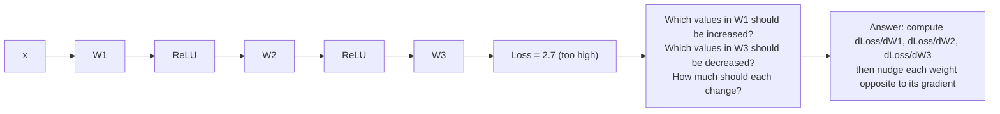
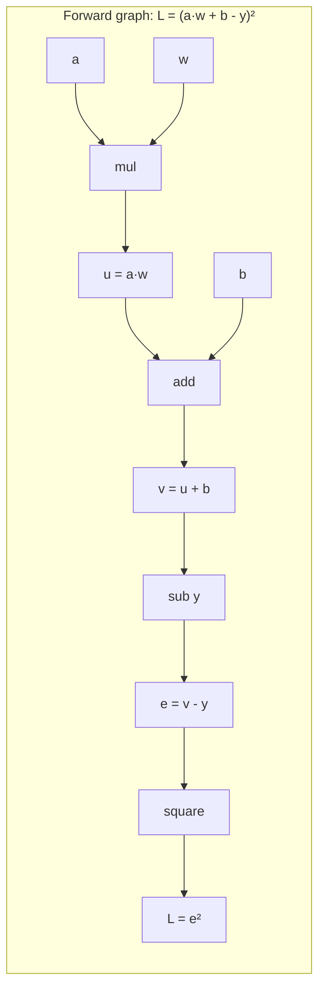

# Chapter 16: Backpropagation and Optimizers — How Neural Networks Learn

> **"Backpropagation is just the chain rule from calculus, applied to a very large composite function. Once you see that, all the notation falls into place."**

---

## Table of Contents
1. [The Credit Assignment Problem](#1-the-credit-assignment-problem)
2. [Computational Graphs and Gradient Flow](#2-computational-graphs-and-gradient-flow)
3. [Deriving Backpropagation Step by Step](#3-deriving-backpropagation-step-by-step)
4. [Vanishing and Exploding Gradients](#4-vanishing-and-exploding-gradients)
5. [Optimizers](#5-optimizers)
6. [Learning Rate Schedules](#6-learning-rate-schedules)
7. [Gradient Accumulation](#7-gradient-accumulation)
8. [PyTorch Implementation and Training Loop](#8-pytorch-implementation)
9. [Summary and What's Next](#9-summary)

---

## 1. The Credit Assignment Problem

You've trained a network for a few steps and the loss is high. Somewhere in the network, some weights are contributing to bad predictions. The question is: **which weights, and by how much?**

This is the **credit assignment problem** — assigning credit (or blame) to each parameter for the final output. It was unsolved for decades before backpropagation became practical.



The solution: **differentiate the loss with respect to every weight** using the chain rule of calculus. This is backpropagation.

---

## 2. Computational Graphs and Gradient Flow

A neural network's forward pass is a composition of simple functions. We can represent it as a **computation graph**:



**Backward pass** computes gradients by applying the chain rule at each node:

```
dL/dL = 1                           (start)
dL/de = 2e                          (derivative of e²)
dL/dv = dL/de · de/dv = 2e · 1     (de/dv = 1 since e = v - y)
dL/du = dL/dv · dv/du = 2e · 1     (dv/du = 1 since v = u + b)
dL/dw = dL/du · du/dw = 2e · a     (du/dw = a since u = a·w)
dL/db = dL/dv · dv/db = 2e · 1     (dv/db = 1)
dL/da = dL/du · du/da = 2e · w     (du/da = w)
```

**Key insight**: the backward pass visits each node exactly once, flowing gradients from the output back to the inputs. The total work is O(forward pass time), not O(parameters²).

### Chain Rule Recap

For composite functions f(g(x)):
```
d/dx [f(g(x))] = f'(g(x)) · g'(x)

For a longer chain f(g(h(x))):
d/dx = f'(g(h(x))) · g'(h(x)) · h'(x)

Each term is the "local gradient" at that node.
Backprop multiplies local gradients from output to input.
```

---

## 3. Deriving Backpropagation Step by Step

Let's derive backpropagation for a **2-layer network** with exact notation.

### Network Setup

```
Architecture: n_0 inputs → n_1 hidden (ReLU) → n_2 output (sigmoid) → Binary Cross-Entropy Loss

Forward pass:
  Z^[1] = W^[1] · X + b^[1]        shape: (n_1, m)
  A^[1] = ReLU(Z^[1])               shape: (n_1, m)
  Z^[2] = W^[2] · A^[1] + b^[2]    shape: (n_2, m)
  A^[2] = σ(Z^[2])                  shape: (n_2, m)
  L = BCE(A^[2], Y)

  where m = batch size
```

### Step 1: dL/dA^[2]

Binary cross-entropy loss:
```
L = -(1/m) Σ [Y·log(A^[2]) + (1-Y)·log(1-A^[2])]

dL/dA^[2] = (1/m) · [-(Y/A^[2]) + (1-Y)/(1-A^[2])]
```

### Step 2: dL/dZ^[2] (delta of output layer)

```
A^[2] = σ(Z^[2])
dA^[2]/dZ^[2] = σ(Z^[2]) · (1 - σ(Z^[2])) = A^[2] · (1 - A^[2])

dL/dZ^[2] = dL/dA^[2] · dA^[2]/dZ^[2]

BEAUTIFUL SIMPLIFICATION for BCE + Sigmoid:
  dL/dZ^[2] = (1/m) · (A^[2] - Y)     ← this is the "prediction error"
```

This is one of the most useful formulas in neural networks: **the gradient at the output equals prediction minus truth** (for BCE + sigmoid). It is both intuitive and computationally clean.

### Step 3: dL/dW^[2] and dL/db^[2]

```
Z^[2] = W^[2] · A^[1] + b^[2]

dL/dW^[2] = dL/dZ^[2] · (A^[1])^T       shape: (n_2, n_1)

  Derivation:
    L is scalar, Z^[2] has shape (n_2, m)
    W^[2] has shape (n_2, n_1)
    
    dL/dW^[2]_ij = Σ_k [dL/dZ^[2]_ik · dZ^[2]_ik/dW^[2]_ij]
                 = Σ_k [dL/dZ^[2]_ik · A^[1]_jk]
    
    In matrix form: dL/dW^[2] = δ^[2] · (A^[1])^T    where δ^[2] = dL/dZ^[2]

dL/db^[2] = (1/m) Σ_samples dL/dZ^[2]   = np.sum(δ^[2], axis=1, keepdims=True) / m
```

### Step 4: dL/dA^[1] (propagate backward through W^[2])

```
Z^[2] = W^[2] · A^[1] + b^[2]

dL/dA^[1] = (W^[2])^T · dL/dZ^[2]
           = (W^[2])^T · δ^[2]         shape: (n_1, m)
```

### Step 5: dL/dZ^[1] (through ReLU)

```
A^[1] = ReLU(Z^[1])
dA^[1]/dZ^[1] = 1  if Z^[1] > 0
              = 0  if Z^[1] <= 0

dL/dZ^[1] = dL/dA^[1] ⊙ ReLU'(Z^[1])
           = δ^[1]

where ⊙ = element-wise multiplication (Hadamard product)
```

### Step 6: dL/dW^[1] and dL/db^[1]

```
dL/dW^[1] = δ^[1] · (X)^T
dL/db^[1] = (1/m) Σ δ^[1]
```

### The General Backprop Formula (Delta Rule)

For any layer `l` in a network:

```
δ^[l] = dL/dZ^[l]                                    (error signal)

Output layer:      δ^[L] = dL/dA^[L] ⊙ f'^[L](Z^[L])
Hidden layers:     δ^[l] = (W^[l+1])^T · δ^[l+1] ⊙ f'^[l](Z^[l])

Weight gradients:  dL/dW^[l] = δ^[l] · (A^[l-1])^T
Bias gradients:    dL/db^[l] = mean(δ^[l], axis=samples)
```

This recursive formula — each layer's delta depends on the layer above — is the core of backpropagation. Implement it once and it works for any depth.

### Concrete Numerical Example

Network: 2 → 2 → 1, single sample, use tanh hidden + sigmoid output

```python
import numpy as np

# ─── Setup ────────────────────────────────────────────────────────
np.random.seed(0)
x = np.array([[0.5], [0.8]])    # input (2, 1)
y = np.array([[1.0]])           # true label

W1 = np.array([[0.1, 0.2], [0.3, -0.1]])  # (2, 2)
b1 = np.array([[0.0], [0.0]])
W2 = np.array([[0.4, 0.5]])               # (1, 2)
b2 = np.array([[0.0]])

# ─── Forward pass ────────────────────────────────────────────────
Z1 = W1 @ x + b1
A1 = np.tanh(Z1)
Z2 = W2 @ A1 + b2
A2 = 1 / (1 + np.exp(-Z2))   # sigmoid

print("=== FORWARD PASS ===")
print(f"Z1 = {Z1.flatten()}")
print(f"A1 = {A1.flatten()}")
print(f"Z2 = {Z2.flatten()}")
print(f"A2 (prediction) = {A2.flatten()}")

# Loss (BCE)
m = x.shape[1]
loss = -np.mean(y * np.log(A2 + 1e-15) + (1-y) * np.log(1-A2 + 1e-15))
print(f"\nLoss = {loss:.6f}")

# ─── Backward pass ────────────────────────────────────────────────
# Step 1: output layer delta (BCE + sigmoid simplification)
delta2 = A2 - y                                    # (1, 1)
dW2 = delta2 @ A1.T                                # (1, 2)
db2 = delta2                                       # (1, 1)

# Step 2: propagate through W2, then through tanh
dA1 = W2.T @ delta2                                # (2, 1)
tanh_grad = 1 - A1**2                              # tanh'(z) = 1 - tanh²(z)
delta1 = dA1 * tanh_grad                           # (2, 1), element-wise

dW1 = delta1 @ x.T                                 # (2, 2)
db1 = delta1                                       # (2, 1)

print("\n=== BACKWARD PASS ===")
print(f"delta2 = {delta2.flatten()}")
print(f"dW2 = {dW2}")
print(f"delta1 = {delta1.flatten()}")
print(f"dW1 = {dW1}")

# ─── Weight update (SGD with lr=0.1) ────────────────────────────
lr = 0.1
W1 -= lr * dW1
W2 -= lr * dW2
b1 -= lr * db1
b2 -= lr * db2

# ─── Forward pass again to check loss decreased ─────────────────
Z1 = W1 @ x + b1
A1 = np.tanh(Z1)
Z2 = W2 @ A1 + b2
A2 = 1 / (1 + np.exp(-Z2))
new_loss = -np.mean(y * np.log(A2 + 1e-15) + (1-y) * np.log(1-A2 + 1e-15))

print(f"\nLoss before update: {loss:.6f}")
print(f"Loss after update:  {new_loss:.6f}  ← should be smaller")
```

---

## 4. Vanishing and Exploding Gradients

### Vanishing Gradients

Recall the delta rule for hidden layers:
```
δ^[l] = (W^[l+1])^T · δ^[l+1] ⊙ f'^[l](Z^[l])
```

With sigmoid activations, `f'(z) = σ(z)·(1-σ(z))`. The **maximum value** of this derivative is 0.25 (at z=0). For other z values, it's smaller:

```
z values and sigmoid derivatives:
  z = 0   →  σ'(z) = 0.25    (maximum)
  z = 2   →  σ'(z) = 0.105
  z = 4   →  σ'(z) = 0.018
  z = 6   →  σ'(z) = 0.002
```

Now imagine a 10-layer network where each layer's sigmoid derivative is ~0.2:

```
Gradient at layer 1 = gradient at output × (∏ sigmoid derivatives along path)
                    ≈ gradient × (0.2)^10
                    = gradient × 0.0000001024

Factor of 10 million smaller! Effectively zero.
```

This is **vanishing gradient**: gradients shrink exponentially as they propagate backward. Deep sigmoid networks from before ~2012 couldn't be trained beyond ~3-4 layers.

```
Gradient magnitude vs layer depth (sigmoid network):

Layer 10 (output):    ████████████████████████████  magnitude ~1.0
Layer  9:             ██████████████████████         ~0.5
Layer  8:             ██████████                     ~0.1
Layer  7:             ████                           ~0.02
Layer  6:             ██                             ~0.004
Layer  5:             █                              ~0.001
Layer  4:             ·                              ~0.0001
Layer  3:             ·                              ~0.00002
Layer  2:             ·                              ~0.000001
Layer  1:             ·                              ~0.0000001  ← basically 0
```

### Why ReLU Fixes Vanishing Gradients

For ReLU: `f'(z) = 1` when `z > 0`, and `0` when `z <= 0`.

For the positive region, the gradient does NOT decay:
```
Gradient at layer 1 with ReLU ≈ gradient × (1)^10 = gradient × 1

No vanishing! (assuming ~50% of neurons are active)
```

The gradient can still vanish if many neurons are dead (z ≤ 0 everywhere), which is the "dying ReLU" problem. But in practice, ReLU made training 10-20 layer networks feasible.

### Exploding Gradients

The opposite problem: weights > 1 in a deep network cause gradients to grow exponentially:

```
δ^[l] = W^T · δ^[l+1] ⊙ f'(Z^[l])

If ||W|| > 1 and f' ≈ 1:
  Gradient can grow as ||W||^(depth) → very large → numerical instability
```

**Symptoms**: loss becomes NaN, weights jump to ±infinity.

**Solution: Gradient Clipping**

```python
def clip_gradients(gradients, max_norm=1.0):
    """
    Clip gradient norm to prevent explosion.
    gradients: list of gradient arrays
    max_norm: maximum allowed L2 norm
    """
    # Compute global norm across all gradients
    total_norm = np.sqrt(sum(np.sum(g**2) for g in gradients))
    
    if total_norm > max_norm:
        # Scale all gradients proportionally
        clip_coef = max_norm / (total_norm + 1e-8)
        gradients = [g * clip_coef for g in gradients]
    
    return gradients, total_norm

# In PyTorch (the standard way):
# torch.nn.utils.clip_grad_norm_(model.parameters(), max_norm=1.0)
```

---

## 5. Optimizers

Backpropagation gives us the gradient — the direction of steepest ascent of the loss. An **optimizer** decides how to use that gradient to update the weights.

### 5.1 Batch Gradient Descent

```
Compute gradient on the ENTIRE dataset each step:
  θ = θ - α · (1/N) Σ_i ∇_θ L(x_i, y_i)

α = learning rate
N = total number of training examples
```

**Properties:**
- Gradient is exact (no noise)
- Each step guaranteed to move toward a minimum
- **Very slow** for large datasets: must process all N samples per step
- **Memory**: must load all data at once (impractical for large datasets)
- **Deterministic**: always finds the same path

### 5.2 Stochastic Gradient Descent (SGD)

```
For each sample i (chosen randomly):
  θ = θ - α · ∇_θ L(x_i, y_i)
```

**Properties:**
- Very fast per update
- Can learn online (one sample at a time)
- **Noisy**: gradient from one sample is a noisy estimate of the true gradient
- Oscillates around the minimum — may never perfectly converge
- The noise can help escape local minima (exploration)

### 5.3 Mini-Batch SGD (the standard)

```
For each mini-batch B of size b:
  θ = θ - α · (1/b) Σ_{i in B} ∇_θ L(x_i, y_i)
```

**Properties:**
- Best of both worlds: fast, some noise for regularization
- Batch size b typically: 32, 64, 128, 256, 512
- Each iteration is called a "step"; one full pass through data is an "epoch"

**Why batch size matters:**

| Batch Size | Gradient Quality | Steps/Epoch | Memory | Hardware Efficiency |
|------------|-----------------|-------------|--------|---------------------|
| 1 (SGD) | Very noisy | N | Minimal | Poor (GPU idle) |
| 32-64 | Moderate noise | N/32 | Moderate | Good |
| 256-512 | Low noise | N/256 | High | Excellent |
| Full (BGD) | Exact | 1 | Max | Excellent but slow |

**GPU efficiency**: GPUs are optimized for matrix operations. A batch of 64 samples takes almost the same time as 1 sample (up to a point). This is why large batches are faster in wall-clock time.

**Noise as regularization**: small batch sizes introduce gradient noise, which acts as a form of regularization — slightly better generalization than very large batches.

### 5.4 SGD with Momentum

Plain mini-batch SGD can oscillate in ravines — narrow valleys in the loss landscape where it takes small steps in the useful direction but bounces back and forth in the other direction:

```
Loss landscape with ravine:

    ─────────────────────
          ╲         ╱
           ╲       ╱          ← narrow in x2 direction
            ─────────         ← flat in x1 direction (slow progress)
```

**Momentum** accumulates a "velocity" vector that smooths out these oscillations:

```
Momentum update rule:
  v_t = β · v_{t-1} + (1-β) · g_t          ← exponential moving average of gradients
  θ_t = θ_{t-1} - α · v_t

where:
  g_t = gradient at step t
  v_t = velocity (momentum term)
  β = momentum coefficient (typically 0.9)
  α = learning rate
```

**Alternative convention** (used in many frameworks, "heavy ball"):
```
  v_t = β · v_{t-1} + g_t                  ← accumulate full gradient
  θ_t = θ_{t-1} - α · v_t
```

**Intuition**: imagine a ball rolling down a curved surface. Gravity (gradient) pulls it down, but the ball also has momentum from previous steps. The ball accelerates in directions where the gradient consistently points the same way, and dampens oscillations where the gradient changes direction.

```
Without momentum (zig-zagging):      With momentum (smooth path):
  ─►─►─►─►                             ────────────────────►
  ─────────────                         ────────────────────
  ◄─◄─◄─◄─                             
```

### 5.5 RMSProp (Root Mean Square Propagation)

Different parameters can have very different gradient magnitudes. A weight in the first layer might have tiny gradients (vanishing), while a weight in the last layer has large gradients. Using the same learning rate for all is suboptimal.

**RMSProp** adapts the learning rate per parameter:

```
RMSProp update:
  v_t = β · v_{t-1} + (1-β) · g_t²        ← exponential avg of squared gradients
  θ_t = θ_{t-1} - α · g_t / (√v_t + ε)

where:
  v_t = running average of squared gradients
  β   = decay rate (typically 0.9)
  ε   = small constant for numerical stability (1e-8)
  α   = learning rate
```

**Effect**: parameters with consistently large gradients get a smaller effective learning rate (divided by large √v). Parameters with small gradients get a larger effective rate. This is **adaptive learning rates**.

### 5.6 Adam (Adaptive Moment Estimation)

Adam (Kingma & Ba, 2014) combines momentum (first moment) and RMSProp (second moment):

```
Adam update at step t:

First moment (momentum):
  m_t = β₁ · m_{t-1} + (1 - β₁) · g_t

Second moment (RMSProp):
  v_t = β₂ · v_{t-1} + (1 - β₂) · g_t²

Bias correction (the "A" part — key insight):
  m̂_t = m_t / (1 - β₁^t)         ← corrected first moment
  v̂_t = v_t / (1 - β₂^t)         ← corrected second moment

Weight update:
  θ_t = θ_{t-1} - α · m̂_t / (√v̂_t + ε)

Hyperparameters (standard defaults):
  α  = 0.001      (learning rate)
  β₁ = 0.9        (first moment decay)
  β₂ = 0.999      (second moment decay)
  ε  = 1e-8       (numerical stability)
```

**Why bias correction?** At t=1, `m_1 = (1-β₁)·g_1 ≈ 0.1·g_1`. This underestimates the true gradient by a factor of (1-β₁). The bias correction `m̂_t = m_t / (1-β₁^t)` compensates. After many steps, `β₁^t ≈ 0`, so the correction becomes trivial.

**Adam in NumPy:**

```python
class Adam:
    def __init__(self, learning_rate=0.001, beta1=0.9, beta2=0.999, epsilon=1e-8):
        self.lr = learning_rate
        self.beta1 = beta1
        self.beta2 = beta2
        self.epsilon = epsilon
        self.t = 0          # step counter
        self.m = {}         # first moments (keyed by parameter id)
        self.v = {}         # second moments
    
    def update(self, param_id, param, grad):
        """
        param_id: unique identifier for this parameter
        param:    numpy array (the weight/bias)
        grad:     numpy array (gradient)
        Returns:  updated param
        """
        self.t += 1
        
        # Initialize moments on first call
        if param_id not in self.m:
            self.m[param_id] = np.zeros_like(param)
            self.v[param_id] = np.zeros_like(param)
        
        # Update biased first and second moments
        self.m[param_id] = self.beta1 * self.m[param_id] + (1 - self.beta1) * grad
        self.v[param_id] = self.beta2 * self.v[param_id] + (1 - self.beta2) * grad**2
        
        # Compute bias-corrected moments
        m_hat = self.m[param_id] / (1 - self.beta1**self.t)
        v_hat = self.v[param_id] / (1 - self.beta2**self.t)
        
        # Update parameters
        param = param - self.lr * m_hat / (np.sqrt(v_hat) + self.epsilon)
        return param
```

**Why Adam is the default choice:**
- Works well with minimal hyperparameter tuning
- Adaptive learning rates per parameter
- Handles sparse gradients well (good for NLP)
- Robust to different problem scales
- Nearly always better than plain SGD without tuning

### 5.7 AdamW (Adam with Decoupled Weight Decay)

A subtle but important bug in Adam: adding L2 regularization (λΣw²) to the loss and then running Adam does NOT correctly apply weight decay. The adaptive learning rate per parameter interacts with the L2 penalty, making the effective weight decay different for different parameters.

**AdamW** (Loshchilov & Hutter, 2019) decouples weight decay from the gradient update:

```
AdamW update:
  m̂_t = ...  (same as Adam)
  v̂_t = ...

  θ_t = θ_{t-1} - α · [m̂_t / (√v̂_t + ε) + λ · θ_{t-1}]
                                              ^^^^^^^^^^^^^^^
                                    weight decay applied DIRECTLY to weights
                                    (not to the gradient)

λ = weight decay coefficient (typically 0.01 to 0.1)
```

**AdamW is the preferred optimizer for modern deep learning** (transformers, BERT, GPT, ViT all use AdamW).

### 5.8 Comparison Table

| Optimizer | Adaptive LR | Momentum | Key Advantage | Key Limitation |
|-----------|------------|----------|---------------|----------------|
| SGD | No | No | Simple, well-understood | Requires tuned LR; slow |
| SGD + Momentum | No | Yes | Faster convergence, less oscillation | Still needs good LR |
| RMSProp | Yes | No | Good for RNNs, adaptive per parameter | Not standard for images |
| Adam | Yes | Yes | Works well out of the box | May generalize slightly worse than SGD+momentum |
| AdamW | Yes | Yes | Correct weight decay | Still can generalize slightly worse |

**Practical advice:**
- Start with **Adam** (lr=1e-3) for quick experiments
- Use **AdamW** for transformer-based models
- Use **SGD + Momentum** for ResNets and ConvNets where you want maximum accuracy (requires LR tuning)
- Never use plain SGD without momentum for deep networks

---

## 6. Learning Rate Schedules

The learning rate is the most important hyperparameter. Training with a fixed learning rate is usually suboptimal.

### 6.1 Step Decay

```
Reduce learning rate by a factor γ every N epochs:

  lr_t = lr_0 · γ^(floor(t/N))

Example: lr_0=0.1, γ=0.1, N=30
  Epochs 0-29:   lr = 0.1
  Epochs 30-59:  lr = 0.01
  Epochs 60-89:  lr = 0.001

ASCII plot:
  0.1  ──────────
  0.01           ──────────
  0.001                    ──────────
       0          30        60       90  → epoch
```

### 6.2 Exponential Decay

```
  lr_t = lr_0 · e^(-k·t)   or   lr_t = lr_0 · γ^t

Smooth, continuous decay.
```

### 6.3 Cosine Annealing

```
  lr_t = lr_min + 0.5 · (lr_max - lr_min) · (1 + cos(π · t / T))

ASCII plot:
  lr_max ─╮
           ╰────╮
                ╰────╮
                     ╰──── lr_min
          0     T/4   T/2  T    → epoch

Advantages: ends at a known low LR, smooth, finds good solutions
Used by: ResNet training, modern language models
```

### 6.4 Warmup + Decay

Starting with a very small learning rate and gradually increasing it (warmup) before decaying is critical for **transformers and AdamW**:

```
  Phase 1 (warmup): LR increases from ~0 to lr_max over N_warmup steps
  Phase 2 (decay):  LR decreases from lr_max (cosine or linear)

ASCII:
  lr_max    ╭─────╮
            │      ╰──────────────────────
  ~0    ────╯                              → step
            warmup  decay

Why warmup?
  At the start of training, gradients are noisy and random.
  A large initial LR causes divergence.
  Warmup lets the optimizer accumulate stable gradient statistics.
  Critical for Adam/AdamW: second moment estimates need time to calibrate.
```

### 6.5 Learning Rate Finder

Before training, find the best learning rate by running a short sweep:

```python
def find_lr(model, dataloader, min_lr=1e-7, max_lr=1.0, num_steps=200):
    """
    Sweep learning rate from min_lr to max_lr over num_steps.
    Plot loss vs LR to find the sweet spot.
    """
    import torch
    import torch.optim as optim
    
    optimizer = optim.SGD(model.parameters(), lr=min_lr)
    scheduler = optim.lr_scheduler.ExponentialLR(
        optimizer, 
        gamma=(max_lr/min_lr)**(1/num_steps)
    )
    
    lrs = []
    losses = []
    best_loss = float('inf')
    
    for step, (inputs, targets) in enumerate(dataloader):
        if step >= num_steps:
            break
        
        outputs = model(inputs)
        loss = criterion(outputs, targets)
        
        optimizer.zero_grad()
        loss.backward()
        optimizer.step()
        scheduler.step()
        
        lrs.append(optimizer.param_groups[0]['lr'])
        losses.append(loss.item())
    
    # Plot: look for where loss starts decreasing steeply
    # Best LR: 10x before the minimum loss point (steepest descent)
    
    return lrs, losses
```

---

## 7. Gradient Accumulation

Large batch sizes improve training stability and GPU efficiency. But what if you want a batch size of 512 but only have enough GPU memory for 32 samples?

**Gradient accumulation**: compute gradients on small mini-batches and accumulate (add) them before updating weights. This simulates a larger effective batch size.

```
Effective batch size = micro_batch_size × accumulation_steps

Example: effective_batch=512, micro_batch=32
  → accumulation_steps = 16

Loop:
  for step in range(accumulation_steps):
      outputs = model(micro_batch[step])
      loss = criterion(outputs, targets) / accumulation_steps  # scale loss!
      loss.backward()   # accumulates gradients (NO zero_grad here)
  
  optimizer.step()      # update once with accumulated gradients
  optimizer.zero_grad() # now clear
```

```python
# PyTorch gradient accumulation
accumulation_steps = 4
optimizer.zero_grad()

for i, (inputs, targets) in enumerate(dataloader):
    outputs = model(inputs)
    # Divide loss by accumulation steps so the scale is consistent
    loss = criterion(outputs, targets) / accumulation_steps
    loss.backward()
    
    if (i + 1) % accumulation_steps == 0:
        optimizer.step()
        optimizer.zero_grad()
```

---

## 8. PyTorch Implementation

### nn.Module — the Building Block

```python
import torch
import torch.nn as nn
import torch.optim as optim
import torch.nn.functional as F

class MLP(nn.Module):
    """
    Multi-Layer Perceptron using PyTorch.
    Architecture: input_dim → 256 → 128 → output_dim
    """
    def __init__(self, input_dim, hidden_dim, output_dim, dropout_p=0.2):
        super(MLP, self).__init__()
        
        self.network = nn.Sequential(
            nn.Linear(input_dim, hidden_dim),  # fully connected layer
            nn.ReLU(),
            nn.Dropout(dropout_p),             # dropout for regularization
            nn.Linear(hidden_dim, hidden_dim // 2),
            nn.ReLU(),
            nn.Dropout(dropout_p),
            nn.Linear(hidden_dim // 2, output_dim)
        )
    
    def forward(self, x):
        """
        x shape: (batch_size, input_dim)
        Returns: logits shape (batch_size, output_dim)
        """
        return self.network(x)
```

### The Training Loop (Standard)

```python
def train_epoch(model, dataloader, optimizer, criterion, device):
    """
    Run one epoch of training.
    Returns: average training loss
    """
    model.train()  # CRITICAL: sets dropout and batchnorm to training mode
    total_loss = 0.0
    
    for batch_inputs, batch_targets in dataloader:
        batch_inputs = batch_inputs.to(device)
        batch_targets = batch_targets.to(device)
        
        # 1. ALWAYS zero gradients before backward pass
        #    (PyTorch accumulates by default)
        optimizer.zero_grad()
        
        # 2. Forward pass
        outputs = model(batch_inputs)
        
        # 3. Compute loss
        loss = criterion(outputs, batch_targets)
        
        # 4. Backward pass — compute gradients
        loss.backward()
        
        # 5. Gradient clipping (optional but recommended for RNNs/Transformers)
        torch.nn.utils.clip_grad_norm_(model.parameters(), max_norm=1.0)
        
        # 6. Update weights
        optimizer.step()
        
        total_loss += loss.item()
    
    return total_loss / len(dataloader)


def evaluate(model, dataloader, criterion, device):
    """
    Evaluate on validation/test set.
    Returns: average loss, accuracy
    """
    model.eval()   # CRITICAL: disables dropout and uses running batch norm stats
    total_loss = 0.0
    correct = 0
    total = 0
    
    with torch.no_grad():   # disable gradient computation during inference
        for batch_inputs, batch_targets in dataloader:
            batch_inputs = batch_inputs.to(device)
            batch_targets = batch_targets.to(device)
            
            outputs = model(batch_inputs)
            loss = criterion(outputs, batch_targets)
            
            total_loss += loss.item()
            
            # For classification: count correct predictions
            _, predicted = outputs.max(1)
            total += batch_targets.size(0)
            correct += predicted.eq(batch_targets).sum().item()
    
    accuracy = 100.0 * correct / total
    return total_loss / len(dataloader), accuracy
```

### Full MNIST Example

```python
import torch
import torch.nn as nn
import torch.optim as optim
from torch.utils.data import DataLoader
import torchvision
import torchvision.transforms as transforms

# ─── Hyperparameters ─────────────────────────────────────────────
BATCH_SIZE = 64
LEARNING_RATE = 1e-3
N_EPOCHS = 10
DEVICE = torch.device('cuda' if torch.cuda.is_available() else 'cpu')

print(f"Using device: {DEVICE}")

# ─── Data ────────────────────────────────────────────────────────
transform = transforms.Compose([
    transforms.ToTensor(),                        # converts PIL image to tensor [0,1]
    transforms.Normalize((0.1307,), (0.3081,))   # MNIST mean/std
])

train_dataset = torchvision.datasets.MNIST(
    root='./data', train=True, download=True, transform=transform
)
test_dataset = torchvision.datasets.MNIST(
    root='./data', train=False, download=True, transform=transform
)

train_loader = DataLoader(
    train_dataset, batch_size=BATCH_SIZE, shuffle=True, num_workers=2
)
test_loader = DataLoader(
    test_dataset, batch_size=BATCH_SIZE, shuffle=False, num_workers=2
)

# ─── Model ───────────────────────────────────────────────────────
class MNISTClassifier(nn.Module):
    def __init__(self):
        super().__init__()
        self.flatten = nn.Flatten()     # 28×28 → 784
        self.layers = nn.Sequential(
            nn.Linear(784, 512),
            nn.ReLU(),
            nn.Dropout(0.2),
            nn.Linear(512, 256),
            nn.ReLU(),
            nn.Dropout(0.2),
            nn.Linear(256, 10)          # 10 classes, no softmax (CrossEntropyLoss includes it)
        )
    
    def forward(self, x):
        x = self.flatten(x)      # (batch, 1, 28, 28) → (batch, 784)
        return self.layers(x)    # (batch, 10)

model = MNISTClassifier().to(DEVICE)
print(f"Parameters: {sum(p.numel() for p in model.parameters()):,}")

# ─── Loss and Optimizer ──────────────────────────────────────────
criterion = nn.CrossEntropyLoss()
# CrossEntropyLoss = LogSoftmax + NLLLoss = the correct loss for multi-class classification
# Input: raw logits (DO NOT apply softmax before passing to CrossEntropyLoss)
# Target: class indices (not one-hot)

optimizer = optim.Adam(model.parameters(), lr=LEARNING_RATE, weight_decay=1e-4)

# Learning rate scheduler: reduce LR by 0.1 every 3 epochs
scheduler = optim.lr_scheduler.StepLR(optimizer, step_size=3, gamma=0.1)

# ─── Training Loop ───────────────────────────────────────────────
best_accuracy = 0.0
history = {'train_loss': [], 'val_loss': [], 'val_acc': []}

for epoch in range(N_EPOCHS):
    
    # --- Training phase ---
    model.train()
    train_loss = 0.0
    
    for batch_inputs, batch_targets in train_loader:
        batch_inputs = batch_inputs.to(DEVICE)
        batch_targets = batch_targets.to(DEVICE)
        
        optimizer.zero_grad()
        outputs = model(batch_inputs)
        loss = criterion(outputs, batch_targets)
        loss.backward()
        optimizer.step()
        
        train_loss += loss.item()
    
    train_loss /= len(train_loader)
    
    # --- Validation phase ---
    model.eval()
    val_loss = 0.0
    correct = 0
    total = 0
    
    with torch.no_grad():
        for batch_inputs, batch_targets in test_loader:
            batch_inputs = batch_inputs.to(DEVICE)
            batch_targets = batch_targets.to(DEVICE)
            
            outputs = model(batch_inputs)
            val_loss += criterion(outputs, batch_targets).item()
            
            _, predicted = outputs.max(1)
            total += batch_targets.size(0)
            correct += predicted.eq(batch_targets).sum().item()
    
    val_loss /= len(test_loader)
    accuracy = 100.0 * correct / total
    
    # Record history
    history['train_loss'].append(train_loss)
    history['val_loss'].append(val_loss)
    history['val_acc'].append(accuracy)
    
    # Save best model
    if accuracy > best_accuracy:
        best_accuracy = accuracy
        torch.save(model.state_dict(), 'best_mnist_model.pth')
    
    # Update learning rate
    scheduler.step()
    
    current_lr = optimizer.param_groups[0]['lr']
    print(f"Epoch {epoch+1:3d}/{N_EPOCHS} | "
          f"Train Loss: {train_loss:.4f} | "
          f"Val Loss: {val_loss:.4f} | "
          f"Val Acc: {accuracy:.2f}% | "
          f"LR: {current_lr:.1e}")

print(f"\nBest Validation Accuracy: {best_accuracy:.2f}%")

# ─── Load best model and final evaluation ────────────────────────
model.load_state_dict(torch.load('best_mnist_model.pth'))
model.eval()

# Quick final accuracy check
correct = 0
total = 0
with torch.no_grad():
    for batch_inputs, batch_targets in test_loader:
        batch_inputs = batch_inputs.to(DEVICE)
        batch_targets = batch_targets.to(DEVICE)
        outputs = model(batch_inputs)
        _, predicted = outputs.max(1)
        total += batch_targets.size(0)
        correct += predicted.eq(batch_targets).sum().item()

print(f"Final Test Accuracy: {100.0 * correct / total:.2f}%")
# Expected: ~98-99% on MNIST with this architecture
```

---

## 9. Summary

```
BACKPROPAGATION
│
├── Credit assignment problem → which weights caused the error?
│
├── Solution: chain rule on computation graph
│     δ^[L]  = dL/dA^[L] ⊙ f'^[L](Z^[L])         (output delta)
│     δ^[l]  = (W^[l+1])^T · δ^[l+1] ⊙ f'^[l](Z^[l])  (hidden delta)
│     dL/dW^[l] = δ^[l] · (A^[l-1])^T
│     dL/db^[l] = mean(δ^[l], axis=samples)
│
├── Vanishing gradients: sigmoid derivative max 0.25 → exponential decay
│     Fix: ReLU (gradient = 1 for positive), skip connections (ResNets)
│
├── Exploding gradients: large weights → exponential growth
│     Fix: gradient clipping, careful initialization
│
└── OPTIMIZERS
      SGD: simple but needs tuning
      Momentum: adds velocity term → faster, less oscillation
      RMSProp: adaptive learning rate per parameter
      Adam: momentum + RMSProp + bias correction → default choice
      AdamW: Adam with correct weight decay → preferred for modern models

LEARNING RATES
  Too high → loss diverges
  Too low  → too slow, stuck in local minima
  Schedules: step decay, cosine annealing, warmup + decay
  Finder: sweep LR over 200 steps, plot loss, pick where it drops fastest
```

### Key Formulas

| Formula | Meaning |
|---------|---------|
| δ^[L] = A^[L] - Y | Output error for BCE+sigmoid (elegant simplification) |
| δ^[l] = (W^[l+1])^T · δ^[l+1] ⊙ f' | Delta rule: propagate error backward |
| dL/dW^[l] = δ^[l] · (A^[l-1])^T | Weight gradient |
| v_t = β·v_{t-1} + (1-β)·g_t | Momentum / first moment |
| θ_t = θ - α · m̂ / (√v̂ + ε) | Adam update |

---

## Mini Projects

### Mini Project 1: Gradient Checker

Verify your backprop implementation is correct by comparing analytical gradients to numerical gradients.

**Objective:** Learn the gold standard for debugging backpropagation — if gradients match, the code is correct.

**A note on notation:** like Chapter 15's mini-project, this uses the "sample-major" convention (`X` shaped `samples × features`, `W1` shaped `n_in × n_hidden`, forward pass `X @ W1`) rather than the feature-major convention used in the derivation above. Same math, transposed shapes — this is the convention PyTorch and most real code uses.

```python
import numpy as np

def relu(z):      return np.maximum(0, z)
def relu_grad(z): return (z > 0).astype(float)
def sigmoid(z):   return 1 / (1 + np.exp(-z))

class TinyNet:
    """3-layer net: input→hidden→output, ReLU hidden, sigmoid output, BCE loss."""
    def __init__(self, n_in, n_hidden, n_out):
        np.random.seed(42)
        self.W1 = np.random.randn(n_in, n_hidden) * 0.1
        self.b1 = np.zeros((1, n_hidden))
        self.W2 = np.random.randn(n_hidden, n_out) * 0.1
        self.b2 = np.zeros((1, n_out))

    def forward(self, X):
        self.X   = X
        self.Z1  = X @ self.W1 + self.b1
        self.A1  = relu(self.Z1)
        self.Z2  = self.A1 @ self.W2 + self.b2
        self.A2  = sigmoid(self.Z2)
        return self.A2

    def loss(self, X, y):
        pred = self.forward(X)
        return -np.mean(y * np.log(pred+1e-9) + (1-y) * np.log(1-pred+1e-9))

    def backward(self, y):
        m = y.shape[0]
        dA2 = (self.A2 - y) / m                      # BCE + sigmoid gradient
        dZ2 = dA2                                      # sigmoid already absorbed
        dW2 = self.A1.T @ dZ2
        db2 = dZ2.sum(axis=0, keepdims=True)
        dA1 = dZ2 @ self.W2.T
        dZ1 = dA1 * relu_grad(self.Z1)
        dW1 = self.X.T @ dZ1
        db1 = dZ1.sum(axis=0, keepdims=True)
        return {'W1': dW1, 'b1': db1, 'W2': dW2, 'b2': db2}

    def params_flat(self):
        return np.concatenate([self.W1.ravel(), self.b1.ravel(),
                                self.W2.ravel(), self.b2.ravel()])

    def set_params_flat(self, flat):
        s = 0
        for name, p in [('W1', self.W1), ('b1', self.b1),
                         ('W2', self.W2), ('b2', self.b2)]:
            size = p.size
            setattr(self, name, flat[s:s+size].reshape(p.shape))
            s += size

def numerical_gradient(net, X, y, eps=1e-5):
    params = net.params_flat()
    num_grads = np.zeros_like(params)
    for i in range(len(params)):
        p_plus  = params.copy(); p_plus[i]  += eps
        p_minus = params.copy(); p_minus[i] -= eps
        net.set_params_flat(p_plus);  L_plus  = net.loss(X, y)
        net.set_params_flat(p_minus); L_minus = net.loss(X, y)
        num_grads[i] = (L_plus - L_minus) / (2 * eps)
    net.set_params_flat(params)  # restore
    return num_grads

def gradient_check(n_in=4, n_hidden=5, n_out=1, n_samples=10):
    np.random.seed(0)
    X = np.random.randn(n_samples, n_in)
    y = (np.random.rand(n_samples, n_out) > 0.5).astype(float)

    net = TinyNet(n_in, n_hidden, n_out)
    _ = net.forward(X)
    analytical = net.backward(y)

    # Flatten analytical grads in same order as params_flat
    anal_flat = np.concatenate([analytical['W1'].ravel(), analytical['b1'].ravel(),
                                  analytical['W2'].ravel(), analytical['b2'].ravel()])
    num_flat = numerical_gradient(net, X, y)

    # Relative error: ||anal - num|| / (||anal|| + ||num||)
    rel_error = np.linalg.norm(anal_flat - num_flat) / (
        np.linalg.norm(anal_flat) + np.linalg.norm(num_flat) + 1e-10)

    print(f"Gradient Check Results:")
    print(f"  Analytical gradient norm: {np.linalg.norm(anal_flat):.6f}")
    print(f"  Numerical  gradient norm: {np.linalg.norm(num_flat):.6f}")
    print(f"  Relative error:           {rel_error:.2e}")
    if rel_error < 1e-5:
        print("  ✅ PASSED — gradients match! Backprop is correct.")
    elif rel_error < 1e-3:
        print("  ⚠️  SUSPICIOUS — small but non-trivial difference.")
    else:
        print("  ❌ FAILED — check your backprop code.")

    # Per-parameter breakdown
    param_names = []
    for name, p in [('W1', TinyNet(n_in,n_hidden,n_out).W1),
                     ('b1', TinyNet(n_in,n_hidden,n_out).b1),
                     ('W2', TinyNet(n_in,n_hidden,n_out).W2),
                     ('b2', TinyNet(n_in,n_hidden,n_out).b2)]:
        param_names.extend([f"{name}[{i}]" for i in range(p.size)])

    print(f"\n  Worst 5 parameter errors:")
    errors = np.abs(anal_flat - num_flat)
    worst_idx = errors.argsort()[-5:][::-1]
    for i in worst_idx:
        print(f"    {param_names[i]:12s}: analytical={anal_flat[i]:+.6f}, "
              f"numerical={num_flat[i]:+.6f}, err={errors[i]:.2e}")

gradient_check()
```

---

### Mini Project 2: Optimizer Race

Train the same network with SGD, Momentum, RMSprop, and Adam — visualize convergence speed.

**Objective:** Build intuition for why adaptive optimizers converge faster on ill-conditioned problems.

```python
import numpy as np
import matplotlib.pyplot as plt
from sklearn.datasets import load_digits
from sklearn.model_selection import train_test_split
from sklearn.preprocessing import OneHotEncoder

digits = load_digits()
X = digits.data / 16.0
Y = OneHotEncoder(sparse_output=False).fit_transform(digits.target.reshape(-1, 1))
X_tr, X_val, Y_tr, Y_val = train_test_split(X, Y, test_size=0.2, random_state=42)

def relu(z):      return np.maximum(0, z)
def relu_grad(z): return (z > 0).astype(float)
def softmax(z):
    e = np.exp(z - z.max(axis=1, keepdims=True))
    return e / e.sum(axis=1, keepdims=True)

class Net:
    def __init__(self, dims=[64, 64, 10]):
        np.random.seed(42)
        self.W = [np.random.randn(dims[i], dims[i+1]) * np.sqrt(2/dims[i])
                  for i in range(len(dims)-1)]
        self.b = [np.zeros((1, dims[i+1])) for i in range(len(dims)-1)]

    def forward(self, X):
        self.cache = [X]
        A = X
        for i, (W, b) in enumerate(zip(self.W, self.b)):
            Z = A @ W + b
            A = relu(Z) if i < len(self.W)-1 else softmax(Z)
            self.cache.append((Z, A))
        return A

    def loss_acc(self, X, Y):
        pred = self.forward(X)
        loss = -np.mean(np.sum(Y * np.log(pred+1e-9), axis=1))
        acc  = (pred.argmax(1) == Y.argmax(1)).mean()
        return loss, acc

    def gradients(self, Y):
        m = Y.shape[0]
        dA = self.cache[-1][1] - Y
        grads_W, grads_b = [], []
        for i in range(len(self.W)-1, -1, -1):
            Z, A = self.cache[i+1]
            dZ = dA if i == len(self.W)-1 else dA * relu_grad(Z)
            A_prev = self.cache[i] if i == 0 else self.cache[i][1]
            grads_W.insert(0, A_prev.T @ dZ / m)
            grads_b.insert(0, dZ.sum(0, keepdims=True) / m)
            dA = dZ @ self.W[i].T
        return grads_W, grads_b

class Optimizer:
    def __init__(self, net, lr=0.01, **kwargs):
        self.net = net; self.lr = lr; self.kwargs = kwargs
        self.state = {}

    def step(self, grads_W, grads_b):
        raise NotImplementedError

class SGD(Optimizer):
    def step(self, grads_W, grads_b):
        for i, (gW, gb) in enumerate(zip(grads_W, grads_b)):
            self.net.W[i] -= self.lr * gW
            self.net.b[i] -= self.lr * gb

class MomentumSGD(Optimizer):
    def step(self, grads_W, grads_b):
        β = self.kwargs.get('momentum', 0.9)
        if not self.state:
            self.state = {'vW': [np.zeros_like(w) for w in self.net.W],
                          'vb': [np.zeros_like(b) for b in self.net.b]}
        for i, (gW, gb) in enumerate(zip(grads_W, grads_b)):
            self.state['vW'][i] = β * self.state['vW'][i] + gW
            self.state['vb'][i] = β * self.state['vb'][i] + gb
            self.net.W[i] -= self.lr * self.state['vW'][i]
            self.net.b[i] -= self.lr * self.state['vb'][i]

class RMSprop(Optimizer):
    def step(self, grads_W, grads_b):
        β = self.kwargs.get('beta', 0.9); ε = 1e-8
        if not self.state:
            self.state = {'sW': [np.zeros_like(w) for w in self.net.W],
                          'sb': [np.zeros_like(b) for b in self.net.b]}
        for i, (gW, gb) in enumerate(zip(grads_W, grads_b)):
            self.state['sW'][i] = β * self.state['sW'][i] + (1-β) * gW**2
            self.state['sb'][i] = β * self.state['sb'][i] + (1-β) * gb**2
            self.net.W[i] -= self.lr * gW / (np.sqrt(self.state['sW'][i]) + ε)
            self.net.b[i] -= self.lr * gb / (np.sqrt(self.state['sb'][i]) + ε)

class Adam(Optimizer):
    def __init__(self, net, lr=0.001, beta1=0.9, beta2=0.999):
        super().__init__(net, lr, beta1=beta1, beta2=beta2)
        self.t = 0
    def step(self, grads_W, grads_b):
        β1 = self.kwargs['beta1']; β2 = self.kwargs['beta2']; ε = 1e-8
        self.t += 1
        if not self.state:
            self.state = {
                'mW': [np.zeros_like(w) for w in self.net.W],
                'vW': [np.zeros_like(w) for w in self.net.W],
                'mb': [np.zeros_like(b) for b in self.net.b],
                'vb': [np.zeros_like(b) for b in self.net.b],
            }
        for i, (gW, gb) in enumerate(zip(grads_W, grads_b)):
            self.state['mW'][i] = β1*self.state['mW'][i] + (1-β1)*gW
            self.state['vW'][i] = β2*self.state['vW'][i] + (1-β2)*gW**2
            self.state['mb'][i] = β1*self.state['mb'][i] + (1-β1)*gb
            self.state['vb'][i] = β2*self.state['vb'][i] + (1-β2)*gb**2
            mW_hat = self.state['mW'][i] / (1 - β1**self.t)
            vW_hat = self.state['vW'][i] / (1 - β2**self.t)
            mb_hat = self.state['mb'][i] / (1 - β1**self.t)
            vb_hat = self.state['vb'][i] / (1 - β2**self.t)
            self.net.W[i] -= self.lr * mW_hat / (np.sqrt(vW_hat) + ε)
            self.net.b[i] -= self.lr * mb_hat / (np.sqrt(vb_hat) + ε)

def train(optimizer_class, lr, epochs=100, batch_size=64, **kwargs):
    import copy
    net = Net()
    opt = optimizer_class(net, lr=lr, **kwargs)
    history = []
    m = X_tr.shape[0]
    for epoch in range(epochs):
        idx = np.random.permutation(m)
        for start in range(0, m, batch_size):
            bi = idx[start:start+batch_size]
            net.forward(X_tr[bi])
            gW, gb = net.gradients(Y_tr[bi])
            opt.step(gW, gb)
        tr_loss, tr_acc = net.loss_acc(X_tr, Y_tr)
        val_loss, val_acc = net.loss_acc(X_val, Y_val)
        history.append((tr_loss, val_loss, tr_acc, val_acc))
    return history

print("Training with 4 optimizers...")
configs = [
    (SGD,         0.01,  {}, 'SGD (lr=0.01)'),
    (MomentumSGD, 0.01,  {'momentum': 0.9}, 'Momentum (lr=0.01, β=0.9)'),
    (RMSprop,     0.001, {'beta': 0.9}, 'RMSprop (lr=0.001)'),
    (Adam,        0.001, {'beta1': 0.9, 'beta2': 0.999}, 'Adam (lr=0.001)'),
]

all_histories = {}
for opt_cls, lr, kwargs, label in configs:
    print(f"  Training {label}...")
    h = train(opt_cls, lr, epochs=100, **kwargs)
    all_histories[label] = h

fig, axes = plt.subplots(1, 2, figsize=(14, 5))
fig.suptitle("Optimizer Comparison on Digits Dataset", fontsize=13, fontweight='bold')
colors = ['steelblue', 'orange', 'green', 'red']

for (label, hist), color in zip(all_histories.items(), colors):
    epochs = range(len(hist))
    val_loss = [h[1] for h in hist]
    val_acc  = [h[3] for h in hist]
    axes[0].plot(epochs, val_loss, color=color, label=label, linewidth=2)
    axes[1].plot(epochs, val_acc,  color=color, label=label, linewidth=2)

for ax, metric in zip(axes, ['Validation Loss', 'Validation Accuracy']):
    ax.set_xlabel('Epoch')
    ax.set_ylabel(metric)
    ax.set_title(metric)
    ax.legend(fontsize=8)
    ax.grid(True, alpha=0.3)

plt.tight_layout()
plt.savefig("optimizer_race.png", dpi=150)
plt.show()
print("\nFinal results:")
for (label, hist), color in zip(all_histories.items(), colors):
    print(f"  {label:35s} → val_acc={hist[-1][3]:.3f}")
```

---

## Exercises

1. **Backprop by hand**: Write out the complete forward and backward pass for a 3-layer network (2→4→4→1) with tanh hidden activations and sigmoid output. Use specific weight values (small random). Verify your gradients using finite differences: `(L(θ+ε) - L(θ-ε)) / (2ε)`.

2. **Vanishing gradient experiment**: Build a 15-layer sigmoid network. After one forward+backward pass, print the gradient norm at each layer. Observe the exponential decay. Repeat with ReLU. Plot the comparison.

3. **Optimizer comparison**: Implement SGD, SGD+Momentum, RMSProp, and Adam in NumPy. Train all four on the XOR problem. Plot loss curves. Compare convergence speed.

4. **Learning rate sensitivity**: Train the MNIST MLP with lr ∈ {1e-5, 1e-4, 1e-3, 1e-2, 1e-1, 1.0}. Plot final accuracy vs learning rate. Find the "goldilocks" zone.

5. **Gradient clipping**: Add gradient explosion to a network by using a very large learning rate. Observe the NaN loss. Add gradient clipping with max_norm=1.0. Does it stabilize training?

6. **Adam bias correction**: Implement Adam with and without bias correction. Train on MNIST. Compare the first 10 steps. Why does bias correction matter early in training?

---

**Chapter Summary:**

Backpropagation is the chain rule of calculus applied recursively to compute gradients through a computation graph. The delta rule elegantly expresses each layer's gradient in terms of the layer above: δ^[l] = (W^[l+1])^T·δ^[l+1] ⊙ f'. Weight gradients then follow as δ·(A_prev)^T. Vanishing gradients (sigmoid/tanh in deep networks) were the main obstacle to training deep networks before ReLU. Optimizers determine how to use these gradients: Adam (combining momentum and adaptive learning rates) is the practical default. AdamW adds correct weight decay and is preferred for modern architectures. Learning rate schedules — especially cosine annealing and warmup — are often the difference between a good and great model.

---

**What's Next →** [Chapter 17: PyTorch — The Deep Learning Framework](./17-pytorch-deep-dive.md)

*We've implemented everything in NumPy to understand the mechanics. Now we step up to PyTorch — the framework that handles automatic differentiation, GPU computation, and the production-quality tooling that every practitioner needs.*
