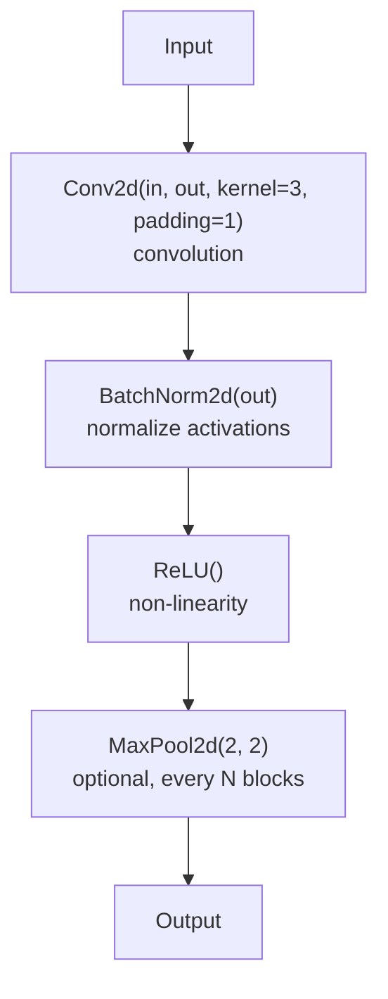
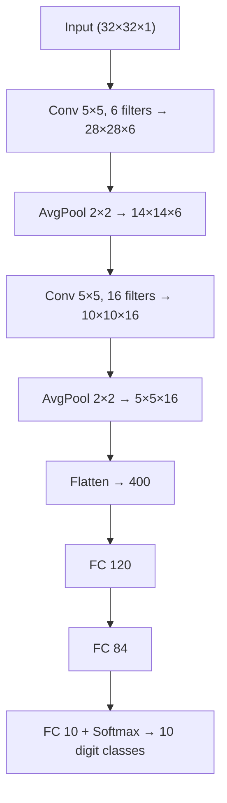
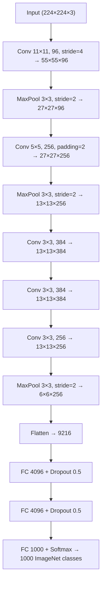
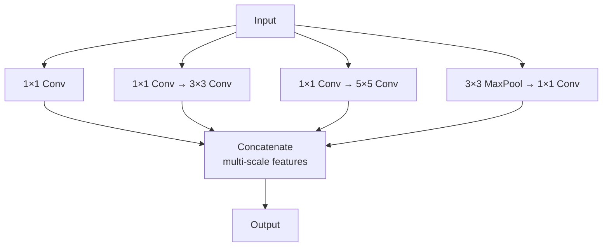
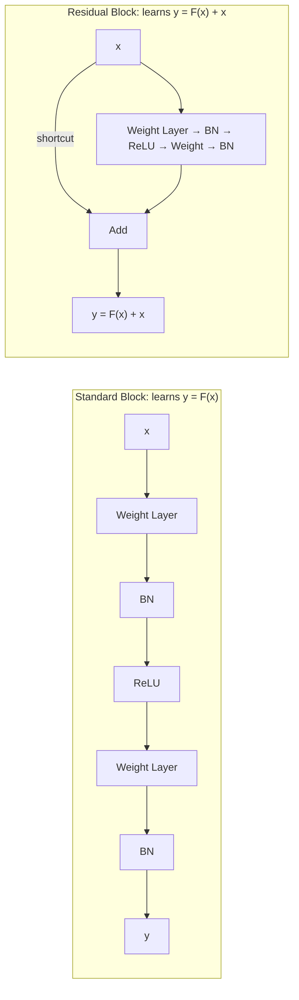
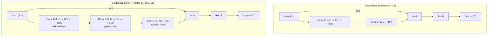

# Chapter 18: Convolutional Neural Networks — Vision and Feature Learning

> **"The convolutional layer is a prior belief baked into the architecture: pixels close together are more related than pixels far apart, and the same feature detector works everywhere in the image. This inductive bias is why CNNs need far fewer parameters than fully connected networks — and why they work."**

---

## Table of Contents
1. [Why CNNs — The Problem with Fully Connected on Images](#1-why-cnns--the-problem-with-fully-connected-on-images)
2. [The Convolution Operation](#2-the-convolution-operation)
3. [Pooling Layers](#3-pooling-layers)
4. [Receptive Field](#4-receptive-field)
5. [CNN Architecture Building Blocks](#5-cnn-architecture-building-blocks)
6. [Classic CNN Architectures — Evolution](#6-classic-cnn-architectures--evolution)
7. [ResNet — The Key Innovation](#7-resnet--the-key-innovation)
8. [Transfer Learning](#8-transfer-learning)
9. [Data Augmentation](#9-data-augmentation)
10. [Visualization — What CNNs Learn](#10-visualization--what-cnns-learn)
11. [Object Detection and Segmentation Overview](#11-object-detection-and-segmentation-overview)
12. [Building an Image Classifier with PyTorch and ResNet](#12-building-an-image-classifier-with-pytorch-and-resnet)
13. [Summary and What's Next](#13-summary)

---

## 1. Why CNNs — The Problem with Fully Connected on Images

Consider a modest image: 224×224 pixels with 3 color channels (RGB). That's 224 × 224 × 3 = **150,528 input features**.

If we connect this to a first hidden layer with 1,000 neurons using a fully connected (nn.Linear) layer:
```
Parameters = 150,528 × 1,000 + 1,000 = 150,529,000
           ≈ 150 million parameters — JUST IN THE FIRST LAYER
```

For an ImageNet-scale model with many such layers, you'd need billions of parameters. But there's a worse problem than memory: **fully connected layers ignore spatial structure**.

### Images as 3D Tensors

An RGB image is a 3D tensor of shape `(H, W, C)` — Height × Width × Channels:

```
224×224 RGB image:

    ┌─────────────────────────────────────┐
    │  R channel (224×224 grayscale)      │
    ├─────────────────────────────────────┤
    │  G channel (224×224 grayscale)      │
    ├─────────────────────────────────────┤
    │  B channel (224×224 grayscale)      │
    └─────────────────────────────────────┘

In PyTorch: (C, H, W) = (3, 224, 224)  ← note channels first
In NumPy/PIL: (H, W, C) = (224, 224, 3) ← height, width, channels
```

### Two Key Properties of Images

**1. Local connectivity**: A pixel at position (100, 100) is highly correlated with its neighbors (99, 100), (101, 100), etc., but mostly independent of a pixel at (5, 200). There's no reason to connect every pixel to every neuron.

**2. Translation invariance**: A cat's ear looks the same whether it's in the top-left or center of the image. We should detect the same feature with the **same weights** regardless of position.

CNNs exploit both: **local filters** that slide over the image, **sharing weights** at every position.

---

## 2. The Convolution Operation

### Intuition

A convolutional layer applies a small filter (kernel) to every position of the input image:

```
5×5 Input:              3×3 Filter:              3×3 Output:

┌─────────────────┐    ┌─────────────┐          ┌─────────────┐
│  1  2  3  0  1  │    │  1  0 -1  │          │  ?  ?  ?   │
│  4  5  6  0  0  │  ⊛ │  1  0 -1  │    =     │  ?  ?  ?   │
│  7  8  9  1  1  │    │  1  0 -1  │          │  ?  ?  ?   │
│  2  3  4  2  0  │    └─────────────┘          └─────────────┘
│  1  2  3  1  1  │
└─────────────────┘

At position (0,0): element-wise multiply and sum over 3×3 patch:
  (1*1)+(2*0)+(3*-1) + (4*1)+(5*0)+(6*-1) + (7*1)+(8*0)+(9*-1)
= (1+0-3) + (4+0-6) + (7+0-9)
= -2 + -2 + -2 = -6

At position (0,1): same filter, shifted one pixel right
  (2*1)+(3*0)+(0*-1) + (5*1)+(6*0)+(0*-1) + (8*1)+(9*0)+(1*-1)
= (2+0+0) + (5+0+0) + (8+0-1) = 2+5+7 = 14
...
```

This particular filter (1, 0, -1 vertically) is a **vertical edge detector** — it fires strongly where there's a vertical intensity change.

### Formal Definition

For a 2D input I and filter K of size (k_h, k_w):

```
Output[i, j] = Σ_m Σ_n  I[i+m, j+n] · K[m, n]
             = (I ⊛ K)[i, j]
```

In PyTorch's conv2d notation (with multiple channels):
```
Input:  (N, C_in, H_in, W_in)      — N samples, C_in channels
Filter: (C_out, C_in, kH, kW)      — C_out filters, each of size C_in×kH×kW
Output: (N, C_out, H_out, W_out)

H_out = floor((H_in + 2*padding - kH) / stride + 1)
W_out = floor((W_in + 2*padding - kW) / stride + 1)
```

### Stride and Padding

**Stride**: how many pixels the filter moves between applications.

```
stride=1 (default):          stride=2:

Filter moves 1 pixel:        Filter moves 2 pixels:
█░░░░    ░█░░░    ░░█░░       █░░░░    ░░█░░
  5×5 → 3×3 output              5×5 → 2×2 output
(with 3×3 filter, no pad)     (with 3×3 filter, no pad)

stride > 1 reduces spatial dimensions (downsampling)
```

**Padding**: add pixels (zeros) around the input border.

```
'valid' padding (padding=0):
  Output is smaller than input
  H_out = H_in - kH + 1

'same' padding (padding = (kH-1)/2 for odd kH):
  Output has same H, W as input (with stride=1)
  H_out = H_in
  For kH=3: padding=1
  For kH=5: padding=2
  For kH=7: padding=3
```

### Multiple Filters — Learning Different Features

One filter learns one feature. In practice, we apply many filters simultaneously:

```
Input: (1, 3, 224, 224)  ← batch=1, RGB, 224×224
Apply 64 different 3×3 filters:
Output: (1, 64, 224, 224)  ← 64 feature maps

Each of the 64 filters has learned to detect something different:
  Filter 1: vertical edges
  Filter 2: horizontal edges
  Filter 3: diagonal edges
  Filter 4: color gradients
  Filter 5-64: increasingly abstract patterns
```

### Parameter Count — CNNs vs FC

```
First layer comparison (3-channel input, 64 features, 224×224):

Fully connected:
  params = 3×224×224 × 64 = 9,633,792  (~9.6M parameters)

Convolutional (3×3 filter):
  params = 3×3×3 × 64 + 64 = 1,792  (~1.8K parameters)

Reduction factor: 9,633,792 / 1,792 ≈ 5,376×  fewer parameters!

This is parameter sharing: the same 64 filters apply everywhere.
```

### PyTorch Conv2d

```python
import torch
import torch.nn as nn

# Single conv layer
conv = nn.Conv2d(
    in_channels=3,     # RGB input
    out_channels=64,   # 64 filters
    kernel_size=3,     # 3×3 filter (or kernel_size=(3,3))
    stride=1,          # step size
    padding=1,         # 'same' padding for 3×3 with stride 1
    bias=True          # add bias term per filter
)

x = torch.randn(4, 3, 224, 224)  # batch of 4 images
out = conv(x)
print(out.shape)   # (4, 64, 224, 224) — spatial size preserved with padding=1

# Verify parameter count:
print(sum(p.numel() for p in conv.parameters()))  # 3×3×3×64 + 64 = 1792
```

---

## 3. Pooling Layers

Pooling layers reduce spatial dimensions. They have **no learnable parameters** — they just aggregate values over a window.

### Max Pooling

```
Input (4×4):            MaxPool2d(kernel=2, stride=2):    Output (2×2):

┌────┬────┬────┬────┐                                    ┌────┬────┐
│  1 │  3 │  2 │  4 │                                    │  3 │  4 │
├────┼────┼────┼────┤   take max in each 2×2 window  →  ├────┼────┤
│  5 │  6 │  1 │  2 │                                    │  8 │  9 │
├────┼────┼────┼────┤                                    └────┴────┘
│  4 │  8 │  3 │  9 │
├────┼────┼────┼────┤
│  1 │  2 │  0 │  5 │
└────┴────┴────┴────┘

Top-left 2×2: max(1,3,5,6) = 6
Top-right 2×2: max(2,4,1,2) = 4
Bottom-left 2×2: max(4,8,1,2) = 8
Bottom-right 2×2: max(3,9,0,5) = 9

Output:
┌────┬────┐
│  6 │  4 │
├────┼────┤
│  8 │  9 │
└────┴────┘
```

**Why max pooling?**
- **Translation invariance**: if a feature is present in any part of the 2×2 window, it's detected
- **Downsampling**: reduces computation in subsequent layers
- **Robustness**: small spatial shifts don't change the output

### Global Average Pooling (GAP)

GAP reduces the entire spatial dimension to a single value per channel:

```
Input: (batch, 64, 7, 7)
         ↓ Average over 7×7 → 1 value per channel
Output: (batch, 64, 1, 1)
         ↓ Flatten
        (batch, 64)
```

GAP is used in modern architectures before the classifier head. It:
- Has no parameters
- Creates a fixed-size representation regardless of input size
- Acts as strong regularization (averaging reduces overfitting vs flattening)

```python
import torch.nn as nn

# Max pooling:
maxpool = nn.MaxPool2d(kernel_size=2, stride=2)    # halves H and W

# Global average pooling:
gap = nn.AdaptiveAvgPool2d(1)    # output_size=1 → (batch, C, 1, 1)

x = torch.randn(2, 64, 14, 14)
print(maxpool(x).shape)          # (2, 64, 7, 7)
print(gap(x).shape)              # (2, 64, 1, 1)
print(gap(x).flatten(1).shape)   # (2, 64)
```

---

## 4. Receptive Field

The **receptive field** of a neuron is the region of the input image that influences its output.

```
Layer 1: 3×3 conv   → each output pixel sees 3×3 of input
Layer 2: 3×3 conv   → each output pixel sees 5×5 of input
Layer 3: 3×3 conv   → each output pixel sees 7×7 of input
Layer 4: 3×3 conv   → each output pixel sees 9×9 of input
...
After k layers of 3×3 conv: receptive field = (2k+1)×(2k+1)

After 10 layers: 21×21 receptive field
After 50 layers: 101×101 receptive field

With max pooling (stride 2) every 2 layers:
  Receptive field grows exponentially!
  After 6 conv + 3 pooling: can see 100+ pixels
```

**Key insight**: deeper layers see larger portions of the image → learn more global patterns.

---

## 5. CNN Architecture Building Blocks

The standard "building cell" used in most CNNs:



**Why this order?** Conv → BN → ReLU is the most common ordering. Some argue BN → ReLU → Conv works slightly better (pre-activation ResNet), but the original ordering is still standard.

```python
def conv_bn_relu(in_channels, out_channels, kernel_size=3, stride=1, padding=1):
    """Standard CNN building cell."""
    return nn.Sequential(
        nn.Conv2d(in_channels, out_channels, kernel_size,
                  stride=stride, padding=padding, bias=False),  # bias=False when using BN
        nn.BatchNorm2d(out_channels),
        nn.ReLU(inplace=True)  # inplace=True saves a small amount of memory
    )
```

**Why `bias=False` when using BatchNorm?** BatchNorm subtracts the batch mean and adds a learned bias (β). The conv bias would be canceled out by the mean subtraction — so it's redundant. Remove it to save a small number of parameters.

---

## 6. Classic CNN Architectures — Evolution

### LeNet-5 (1998) — LeCun et al.

The first practical CNN, designed for handwritten digit recognition (MNIST).



Achieved ~99% accuracy on MNIST with only ~60K parameters. Demonstrated that CNNs could learn features from data rather than requiring hand-engineering.

### AlexNet (2012) — Krizhevsky, Sutskever, Hinton

**Won ImageNet 2012 with 15.3% top-5 error** (vs 26.2% second place). Launched the deep learning revolution.



Key innovations:
- ReLU activations (much faster to train than tanh)
- Dropout (0.5 in FC layers) for regularization
- Data augmentation (crops, flips, color jitter)
- Two-GPU training (split model across two GTX 580s — 3GB each)
- ~62M parameters

### VGGNet (2014) — Simonyan & Zisserman

**Key insight**: use only 3×3 filters throughout. Deeper is better.

```
Two 3×3 filters have the same receptive field as one 5×5 filter:
  Receptive field of 2× 3×3: 5×5 ✓
  Parameters: 2 × (3×3×C×C) = 18C²
  vs one 5×5: 5×5×C×C = 25C²
  → 28% fewer parameters with same receptive field!

Three 3×3 filters ≡ one 7×7 filter
  Parameters: 3×(9C²) = 27C² vs 49C²  → 45% fewer params
```

VGG-16 architecture:
```
Block 1: 2× Conv(64) → MaxPool
Block 2: 2× Conv(128) → MaxPool
Block 3: 3× Conv(256) → MaxPool
Block 4: 3× Conv(512) → MaxPool
Block 5: 3× Conv(512) → MaxPool
FC(4096) × 2 → FC(1000)

Total: ~138M parameters (large, but simple and elegant)
Still widely used as a feature extractor
```

### GoogLeNet / Inception (2014)

Key insight: apply multiple filter sizes in parallel and concatenate:



GoogLeNet: 22 layers, only 5M parameters (12× fewer than AlexNet, better accuracy).

### EfficientNet (2019)

Observation: scaling model depth, width, and input resolution together (compound scaling) is optimal:

```
φ = compound coefficient (how much to scale)
  depth:      d = 1.2^φ
  width:      w = 1.1^φ
  resolution: r = 1.15^φ

EfficientNet-B0 (φ=0) through B7 (φ=7):
  B0: 5.3M params, 77.1% top-1
  B7: 66M params, 84.4% top-1
```

### MobileNet (2017)

Designed for mobile devices — minimal parameters and FLOPs:

```
Depthwise Separable Convolution:
  Standard conv(k×k, C_in→C_out): k²·C_in·C_out ops
  
  Depthwise (each channel separately): k²·C_in ops
  Pointwise (1×1 conv): C_in·C_out ops
  Total: k²·C_in + C_in·C_out = C_in(k² + C_out)
  
  Reduction ratio: C_in(k² + C_out) / (k²·C_in·C_out)
                 = 1/C_out + 1/k²
                 ≈ 1/9  for k=3 and large C_out → 9× fewer ops!
```

---

## 7. ResNet — The Key Innovation

### The Degradation Problem

Before ResNet, researchers observed that deeper networks were **harder to train** and often performed worse than shallower networks — not because of overfitting, but because optimization was failing. A 56-layer network performed worse than a 20-layer network on TRAINING data.

```
Training error vs depth (before ResNet):

Training error
    │
 20 │ ╰───────────────────────────── 20-layer network
    │
    │              ╰──────────────── 56-layer network (WORSE!)
    │
    └────────────────────────────────► epochs

This shouldn't happen — the 56-layer network could always
learn the same function as the 20-layer network by setting
the extra layers to identity. But gradient descent can't
find this solution.
```

### Residual Connections (He et al., 2015)

The solution: add a **shortcut connection** that bypasses each block:



### Why Residual Connections Work

**Gradient flow**: during backpropagation, the gradient flows through both the block AND directly through the shortcut. The shortcut provides a gradient "highway" — gradients can flow without degradation even through 100+ layers.

```
Without skip connections:
  Gradient at layer l = Π_{k=l}^{L} (∂layer_k/∂layer_{k-1})
  → Product of many derivatives → vanishing

With skip connections:
  Gradient at layer l = Π (∂layer/∂input) + 1
                                           ^^^
                        The "+1" from the shortcut!
  → Gradient always has a direct path of magnitude ≥ 1
  → Gradients cannot completely vanish
```

### ResNet Architectures



```
ResNet variants:

Name      Layers   Blocks           Params    ImageNet top-1
─────────────────────────────────────────────────────────────
ResNet-18     18   Basic blocks      11.7M        69.8%
ResNet-34     34   Basic blocks      21.8M        73.3%
ResNet-50     50   Bottleneck blocks 25.6M        76.1%
ResNet-101   101   Bottleneck blocks 44.5M        77.4%
ResNet-152   152   Bottleneck blocks 60.2M        78.3%
```

### ResNet in PyTorch

```python
import torch.nn as nn

class BasicBlock(nn.Module):
    """ResNet basic residual block (for ResNet-18, 34)."""
    
    expansion = 1   # no expansion in output channels for basic block
    
    def __init__(self, in_channels, out_channels, stride=1):
        super().__init__()
        
        self.conv1 = nn.Conv2d(in_channels, out_channels, 3,
                               stride=stride, padding=1, bias=False)
        self.bn1 = nn.BatchNorm2d(out_channels)
        self.relu = nn.ReLU(inplace=True)
        
        self.conv2 = nn.Conv2d(out_channels, out_channels, 3,
                               stride=1, padding=1, bias=False)
        self.bn2 = nn.BatchNorm2d(out_channels)
        
        # Shortcut: if dimensions change, need a 1×1 conv to match
        self.shortcut = nn.Identity()
        if stride != 1 or in_channels != out_channels:
            self.shortcut = nn.Sequential(
                nn.Conv2d(in_channels, out_channels, 1, stride=stride, bias=False),
                nn.BatchNorm2d(out_channels)
            )
    
    def forward(self, x):
        identity = self.shortcut(x)      # direct path
        
        out = self.conv1(x)
        out = self.bn1(out)
        out = self.relu(out)
        
        out = self.conv2(out)
        out = self.bn2(out)
        
        out += identity                  # residual addition
        out = self.relu(out)
        
        return out
```

---

## 8. Transfer Learning

Transfer learning is arguably the most practically useful technique in deep learning for practitioners. It solves the core problem: you rarely have a million labeled training examples.

### The Concept

```
ImageNet pretraining:
  1.2M images × 1000 classes → ResNet-50 trained for weeks → 
  Network has learned: edges, textures, object parts, full objects

Your task: classify 5 species of flowers from 500 images

Without transfer learning:
  500 images → train ResNet-50 from scratch → massive overfitting, ~60% accuracy

With transfer learning:
  1. Load ResNet-50 pretrained on ImageNet
  2. Remove the 1000-class head
  3. Add a new 5-class head
  4. Train ONLY the new head (or fine-tune all layers)
  → ~90-95% accuracy with the same 500 images!
```

### Strategy 1: Feature Extraction (Freeze All Pretrained Layers)

```
Pretrained Layers (FROZEN — no gradients):
  Conv1 → BN → ReLU → MaxPool
  Layer1 → Layer2 → Layer3 → Layer4
  GAP                                    ← outputs feature vector (2048-dim for ResNet-50)
  
New Head (TRAINABLE):
  FC(2048 → 512) → ReLU → Dropout(0.3)
  FC(512 → 5) → Softmax/CrossEntropyLoss

Training:
  Only the new head's weights update.
  Backprop stops at the frozen layers (no gradients computed).

When to use:
  - Very small dataset (< 1000 samples)
  - Your data is similar to ImageNet (natural photos)
  - Fast training needed (only training small head)
```

### Strategy 2: Fine-tuning (Unfreeze Some or All Layers)

```
Pretrained Layers (FROZEN initially, then gradually UNFROZEN):
  Phase 1: Train only new head for 5-10 epochs
  Phase 2: Unfreeze last N layers, train with small lr (1e-5)
  Phase 3: Optionally unfreeze all layers, train with very small lr

When to use:
  - Medium dataset (1K–100K samples)
  - Your data may differ somewhat from ImageNet
  - Maximum accuracy needed

Key: use a MUCH SMALLER learning rate for pretrained layers (1e-5 vs 1e-3)
     Otherwise you destroy the learned features ("catastrophic forgetting")
```

### Transfer Learning in PyTorch

```python
import torch
import torch.nn as nn
import torchvision.models as models

def create_model(num_classes, strategy='feature_extraction', unfreeze_last_n=0):
    """
    Create a ResNet-50 model for transfer learning.
    
    strategy: 'feature_extraction' or 'fine_tuning'
    unfreeze_last_n: number of layer groups to unfreeze (0 = only head)
    """
    # Load pretrained ResNet-50
    model = models.resnet50(weights='IMAGENET1K_V2')
    # weights='IMAGENET1K_V2': best pretrained weights for ResNet-50
    
    # Step 1: Freeze ALL pretrained layers
    for param in model.parameters():
        param.requires_grad = False
    
    # Step 2: Replace the final fully connected layer
    # ResNet-50's fc: (2048, 1000) → we replace with our task's head
    in_features = model.fc.in_features   # 2048 for ResNet-50
    
    model.fc = nn.Sequential(
        nn.Linear(in_features, 512),
        nn.ReLU(),
        nn.Dropout(0.3),
        nn.Linear(512, num_classes)
    )
    # The new head is NOT frozen (requires_grad=True by default for new layers)
    
    # Step 3: Fine-tuning — unfreeze last N layer groups
    if strategy == 'fine_tuning' and unfreeze_last_n > 0:
        # ResNet-50 layer groups: layer4, layer3, layer2, layer1, conv1
        layer_groups = [model.layer4, model.layer3, model.layer2,
                        model.layer1, model.conv1]
        
        for group in layer_groups[:unfreeze_last_n]:
            for param in group.parameters():
                param.requires_grad = True
        
        print(f"Unfroze last {unfreeze_last_n} layer groups")
    
    # Print trainable parameter count
    total = sum(p.numel() for p in model.parameters())
    trainable = sum(p.numel() for p in model.parameters() if p.requires_grad)
    print(f"Total params: {total:,}")
    print(f"Trainable params: {trainable:,} ({100*trainable/total:.1f}%)")
    
    return model


def create_optimizer_with_layer_lrs(model, head_lr=1e-3, pretrained_lr=1e-5):
    """
    Different learning rates for pretrained layers vs new head.
    This is critical for fine-tuning to not destroy pretrained features.
    """
    # Separate parameter groups
    head_params = list(model.fc.parameters())
    head_param_ids = set(id(p) for p in head_params)
    
    pretrained_params = [p for p in model.parameters()
                         if id(p) not in head_param_ids and p.requires_grad]
    
    param_groups = [
        {'params': pretrained_params, 'lr': pretrained_lr},  # much smaller LR
        {'params': head_params, 'lr': head_lr}               # normal LR
    ]
    
    return torch.optim.AdamW(param_groups, weight_decay=1e-4)


# Usage example:
model = create_model(num_classes=5, strategy='fine_tuning', unfreeze_last_n=1)
optimizer = create_optimizer_with_layer_lrs(model, head_lr=1e-3, pretrained_lr=1e-5)
```

### Available Pretrained Models

```python
import torchvision.models as models

# ResNet family (most versatile):
models.resnet18(weights='IMAGENET1K_V1')
models.resnet50(weights='IMAGENET1K_V2')
models.resnet101(weights='IMAGENET1K_V2')

# EfficientNet (excellent accuracy/params tradeoff):
models.efficientnet_b0(weights='IMAGENET1K_V1')
models.efficientnet_b4(weights='IMAGENET1K_V1')

# MobileNet (for edge deployment):
models.mobilenet_v3_small(weights='IMAGENET1K_V1')
models.mobilenet_v3_large(weights='IMAGENET1K_V1')

# VGG (simple, powerful feature extractor):
models.vgg16(weights='IMAGENET1K_V1')

# Vision Transformer (for modern tasks):
models.vit_b_16(weights='IMAGENET1K_V1')

# What to use in practice:
# ResNet-50: solid all-around choice, well-understood
# EfficientNet-B0/B3: best accuracy per parameter
# MobileNetV3: when deployment size matters
# ViT: when you have large data or want attention maps
```

---

## 9. Data Augmentation

Augmentation is crucial for preventing overfitting, especially with small datasets.

### Standard Augmentations

```python
import torchvision.transforms as transforms
import torchvision.transforms.v2 as transforms_v2

# Standard training augmentation pipeline:
train_transforms = transforms.Compose([
    # 1. Resize (to ensure uniform size):
    transforms.Resize((256, 256)),
    
    # 2. Random crop (implicit translation invariance):
    transforms.RandomCrop(224),
    
    # 3. Horizontal flip (natural images are often symmetric):
    transforms.RandomHorizontalFlip(p=0.5),
    
    # 4. Color jitter (varies brightness, contrast, saturation, hue):
    transforms.ColorJitter(brightness=0.3, contrast=0.3, saturation=0.2, hue=0.1),
    
    # 5. Random rotation (small angles for natural images):
    transforms.RandomRotation(degrees=15),
    
    # 6. Random grayscale (sometimes color isn't diagnostic):
    transforms.RandomGrayscale(p=0.05),
    
    # 7. ToTensor (converts PIL [0,255] to float tensor [0,1]):
    transforms.ToTensor(),
    
    # 8. Normalize (zero-mean, unit-variance per channel):
    transforms.Normalize(mean=[0.485, 0.456, 0.406],
                         std=[0.229, 0.224, 0.225]),
    
    # 9. Random erasing (cuts out a random rectangle — forces model to not rely on one region):
    transforms.RandomErasing(p=0.1, scale=(0.02, 0.15))
])

# Validation: NO augmentation, just resize, center crop, normalize:
val_transforms = transforms.Compose([
    transforms.Resize(256),
    transforms.CenterCrop(224),
    transforms.ToTensor(),
    transforms.Normalize(mean=[0.485, 0.456, 0.406],
                         std=[0.229, 0.224, 0.225])
])
```

### Advanced Augmentations

```python
# MixUp — blend two images and their labels:
# image = λ·img_a + (1-λ)·img_b
# label = λ·label_a + (1-λ)·label_b  (soft labels)
# λ sampled from Beta(α, α) distribution

def mixup_data(x, y, alpha=0.2):
    """Apply MixUp augmentation to a batch."""
    if alpha > 0:
        lam = np.random.beta(alpha, alpha)
    else:
        lam = 1
    
    batch_size = x.size(0)
    index = torch.randperm(batch_size)   # random permutation
    
    mixed_x = lam * x + (1 - lam) * x[index, :]
    y_a, y_b = y, y[index]
    
    return mixed_x, y_a, y_b, lam

def mixup_criterion(criterion, pred, y_a, y_b, lam):
    """Compute MixUp loss."""
    return lam * criterion(pred, y_a) + (1 - lam) * criterion(pred, y_b)

# CutMix — cut a patch from one image and paste into another:
# image[patch] = image_b[patch]  (random rectangle)
# label = proportion of image_a remaining × label_a + proportion of image_b × label_b
```

---

## 10. Visualization — What CNNs Learn

### Grad-CAM (Gradient-weighted Class Activation Mapping)

Grad-CAM answers: "Which parts of the image most influenced this prediction?"

```
How Grad-CAM works:
  1. Forward pass: run image through CNN, get prediction
  2. Backward pass: compute gradient of predicted class score
     w.r.t. the last convolutional layer's feature maps
  3. Global average pool the gradients: α_k = (1/Z)·Σ_{i,j} ∂score/∂A^k_{ij}
     (importance weight for each feature map k)
  4. Weighted combination: L_Grad-CAM = ReLU(Σ_k α_k · A^k)
  5. Upsample to original image size
  6. Overlay as heatmap
```

```python
import torch
import torch.nn as nn
import numpy as np

class GradCAM:
    """
    Grad-CAM implementation for any CNN with a target convolutional layer.
    """
    
    def __init__(self, model, target_layer):
        """
        model: trained PyTorch model
        target_layer: the conv layer to visualize (e.g., model.layer4[-1].conv2)
        """
        self.model = model
        self.target_layer = target_layer
        
        self.gradients = None
        self.activations = None
        
        # Register hooks
        self._register_hooks()
    
    def _register_hooks(self):
        def save_gradient(module, grad_input, grad_output):
            self.gradients = grad_output[0].detach()
        
        def save_activation(module, input, output):
            self.activations = output.detach()
        
        self.target_layer.register_forward_hook(save_activation)
        self.target_layer.register_full_backward_hook(save_gradient)
    
    def generate_cam(self, input_image, target_class=None):
        """
        input_image: (1, C, H, W) tensor
        target_class: int (if None, uses predicted class)
        Returns: (H, W) numpy array of importance scores
        """
        self.model.eval()
        
        # Forward pass
        logits = self.model(input_image)
        
        if target_class is None:
            target_class = logits.argmax().item()
        
        # Backward pass for target class only
        self.model.zero_grad()
        score = logits[0, target_class]
        score.backward()
        
        # Compute importance weights (global average of gradients)
        gradients = self.gradients     # (1, C, H', W')
        activations = self.activations  # (1, C, H', W')
        
        weights = gradients.mean(dim=(2, 3), keepdim=True)  # (1, C, 1, 1)
        
        # Weighted combination of activation maps
        cam = (weights * activations).sum(dim=1).squeeze()  # (H', W')
        cam = torch.relu(cam)                                # only positive influences
        
        # Normalize to [0, 1]
        cam = cam - cam.min()
        cam = cam / (cam.max() + 1e-8)
        
        # Upsample to original image size
        H, W = input_image.shape[2:]
        cam = cam.unsqueeze(0).unsqueeze(0)   # (1, 1, H', W')
        cam = torch.nn.functional.interpolate(cam, size=(H, W), mode='bilinear', align_corners=False)
        cam = cam.squeeze().numpy()
        
        return cam, target_class


def overlay_heatmap(image_np, cam, alpha=0.5):
    """
    image_np: (H, W, 3) numpy array (0-255 uint8)
    cam: (H, W) numpy array (0-1 float)
    Returns: (H, W, 3) blended image
    """
    import cv2
    
    # Convert CAM to heatmap (blue=low, red=high)
    heatmap = cv2.applyColorMap(np.uint8(255 * cam), cv2.COLORMAP_JET)
    heatmap = cv2.cvtColor(heatmap, cv2.COLOR_BGR2RGB)
    
    # Blend
    result = (alpha * heatmap + (1 - alpha) * image_np).astype(np.uint8)
    return result
```

---

## 11. Object Detection and Segmentation Overview

CNNs are used for much more than classification. Here's a brief map of how they're adapted:

### Object Detection

```
Classification: "What is in this image?" → single label
Detection:      "What is in this image and WHERE?" → labels + bounding boxes

YOLO (You Only Look Once) family:
  - Divide image into S×S grid
  - Each grid cell predicts B bounding boxes + confidences + class probs
  - Single forward pass → very fast (real-time)
  - YOLOv8 (2023): state of the art for real-time detection

Faster R-CNN:
  - Region Proposal Network (RPN): proposes candidate regions
  - RoI Pooling: extract features for each region
  - Slower than YOLO but more accurate for small objects

SSD (Single Shot Detector):
  - Multi-scale predictions from different conv layers
  - Good balance of speed and accuracy
```

### Semantic Segmentation

```
Segmentation: assign a class label to EVERY pixel

FCN (Fully Convolutional Network):
  Replace FC layers with 1×1 convolutions
  Upsample output back to original resolution

U-Net:
  Encoder (downsampling): captures context
  Decoder (upsampling): restores resolution
  Skip connections: combine encoder features with decoder
  
  Architecture:
    ┌──────────────────────────────────────────────────┐
    │ Conv → Conv → MaxPool (×4 times, doubling channels) │ Encoder
    ├──────────────────────────────────────────────────┤
    │ Bottleneck convolutions                           │
    ├──────────────────────────────────────────────────┤
    │ Upsample → Conv + Skip (×4 times, halving channels) │ Decoder
    └──────────────────────────────────────────────────┘
  
  Skip connections pass encoder features directly to decoder
  → preserves fine spatial detail
  Used in: medical imaging, satellite imagery, any pixel-level task
```

---

## 12. Building an Image Classifier with PyTorch and ResNet

A complete, runnable example for a 3-class custom classification task:

```python
import torch
import torch.nn as nn
import torch.optim as optim
from torch.utils.data import DataLoader
import torchvision
import torchvision.models as models
import torchvision.transforms as transforms
from torchvision.datasets import ImageFolder
import os
import time

# ─── Configuration ───────────────────────────────────────────────
class Config:
    data_dir = './data/your_dataset'   # ImageFolder format
    num_classes = 3
    batch_size = 32
    n_epochs = 20
    lr_head = 1e-3
    lr_backbone = 1e-5
    weight_decay = 1e-4
    img_size = 224
    strategy = 'fine_tuning'   # or 'feature_extraction'
    unfreeze_last = 1          # number of ResNet layer groups to unfreeze
    device = torch.device('cuda' if torch.cuda.is_available() else 'cpu')

cfg = Config()

# ─── Data ────────────────────────────────────────────────────────
mean = [0.485, 0.456, 0.406]
std  = [0.229, 0.224, 0.225]

train_transform = transforms.Compose([
    transforms.Resize(256),
    transforms.RandomCrop(cfg.img_size),
    transforms.RandomHorizontalFlip(),
    transforms.ColorJitter(0.2, 0.2, 0.2, 0.1),
    transforms.ToTensor(),
    transforms.Normalize(mean, std)
])

val_transform = transforms.Compose([
    transforms.Resize(256),
    transforms.CenterCrop(cfg.img_size),
    transforms.ToTensor(),
    transforms.Normalize(mean, std)
])

# Assuming data_dir contains 'train/' and 'val/' subdirectories
train_dataset = ImageFolder(os.path.join(cfg.data_dir, 'train'), transform=train_transform)
val_dataset   = ImageFolder(os.path.join(cfg.data_dir, 'val'),   transform=val_transform)

train_loader = DataLoader(train_dataset, batch_size=cfg.batch_size,
                          shuffle=True, num_workers=4, pin_memory=True)
val_loader   = DataLoader(val_dataset, batch_size=cfg.batch_size*2,
                          shuffle=False, num_workers=4, pin_memory=True)

print(f"Classes: {train_dataset.classes}")
print(f"Train: {len(train_dataset)} | Val: {len(val_dataset)}")

# ─── Model ───────────────────────────────────────────────────────
model = models.resnet50(weights='IMAGENET1K_V2')

# Freeze all layers
for param in model.parameters():
    param.requires_grad = False

# Replace head
in_features = model.fc.in_features   # 2048
model.fc = nn.Sequential(
    nn.Linear(in_features, 256),
    nn.ReLU(),
    nn.Dropout(0.3),
    nn.Linear(256, cfg.num_classes)
)

# Unfreeze last N layer groups for fine-tuning
if cfg.strategy == 'fine_tuning':
    layers_to_unfreeze = [model.layer4, model.layer3][:cfg.unfreeze_last]
    for layer in layers_to_unfreeze:
        for param in layer.parameters():
            param.requires_grad = True

model = model.to(cfg.device)

total = sum(p.numel() for p in model.parameters())
trainable = sum(p.numel() for p in model.parameters() if p.requires_grad)
print(f"Trainable: {trainable:,} / {total:,} ({100*trainable/total:.1f}%)")

# ─── Optimizer (separate LRs) ────────────────────────────────────
head_params = list(model.fc.parameters())
head_ids = {id(p) for p in head_params}
backbone_params = [p for p in model.parameters()
                   if id(p) not in head_ids and p.requires_grad]

optimizer = optim.AdamW([
    {'params': backbone_params, 'lr': cfg.lr_backbone},
    {'params': head_params, 'lr': cfg.lr_head}
], weight_decay=cfg.weight_decay)

criterion = nn.CrossEntropyLoss()

scheduler = optim.lr_scheduler.CosineAnnealingLR(
    optimizer, T_max=cfg.n_epochs, eta_min=1e-7
)

# ─── Training ────────────────────────────────────────────────────
best_acc = 0.0

for epoch in range(cfg.n_epochs):
    t0 = time.time()
    
    # Train
    model.train()
    train_loss, train_correct, train_total = 0.0, 0, 0
    
    for inputs, labels in train_loader:
        inputs, labels = inputs.to(cfg.device), labels.to(cfg.device)
        optimizer.zero_grad()
        outputs = model(inputs)
        loss = criterion(outputs, labels)
        loss.backward()
        torch.nn.utils.clip_grad_norm_(model.parameters(), 1.0)
        optimizer.step()
        
        train_loss += loss.item() * inputs.size(0)
        _, preds = outputs.max(1)
        train_correct += preds.eq(labels).sum().item()
        train_total += labels.size(0)
    
    # Validate
    model.eval()
    val_loss, val_correct, val_total = 0.0, 0, 0
    
    with torch.no_grad():
        for inputs, labels in val_loader:
            inputs, labels = inputs.to(cfg.device), labels.to(cfg.device)
            outputs = model(inputs)
            val_loss += criterion(outputs, labels).item() * inputs.size(0)
            _, preds = outputs.max(1)
            val_correct += preds.eq(labels).sum().item()
            val_total += labels.size(0)
    
    scheduler.step()
    
    train_acc = 100.0 * train_correct / train_total
    val_acc   = 100.0 * val_correct / val_total
    
    if val_acc > best_acc:
        best_acc = val_acc
        torch.save(model.state_dict(), 'best_cnn_model.pth')
    
    print(f"Epoch {epoch+1:2d}/{cfg.n_epochs} [{time.time()-t0:.0f}s] | "
          f"Train: {train_acc:.1f}% | Val: {val_acc:.1f}% "
          f"{'★' if val_acc >= best_acc else ''}")

print(f"\nBest Val Accuracy: {best_acc:.2f}%")
```

---

## 13. Summary

```
CONVOLUTIONAL NEURAL NETWORKS
│
├── Core idea: local filters + weight sharing
│     Exploits: local connectivity + translation invariance
│     Parameter reduction: O(k²·C_in·C_out) vs O(H·W·C_in · H·W·C_out)
│
├── Building blocks:
│     Convolution → BatchNorm → ReLU → (MaxPool)
│     Different filters detect different features
│     Deeper = more abstract features
│
├── Architecture evolution:
│     LeNet(1998) → AlexNet(2012) → VGG(2014) → ResNet(2015)
│     Key milestones:
│       AlexNet: ReLU + Dropout made deep CNNs work
│       VGG: only 3×3 filters, depth matters
│       ResNet: skip connections solved degradation problem → 100+ layer nets
│
├── ResNets (most important):
│     Residual block: output = F(x) + x
│     Skip connections = gradient highway = no vanishing gradient
│     ResNet-50: standard backbone for most vision tasks
│
├── Transfer Learning:
│     Pretrained on ImageNet → fine-tune for your task
│     Feature extraction: freeze pretrained, train head only
│     Fine-tuning: unfreeze some layers, use tiny LR for pretrained parts
│     Use THIS for any image task with < 100K images
│
└── Visualization:
      Grad-CAM: which regions drove the prediction
      Filter viz: what patterns each filter detects
```

### Key Formulas

| Formula | Meaning |
|---------|---------|
| H_out = floor((H_in + 2p - k) / s + 1) | Output size after convolution |
| params = k×k×C_in×C_out + C_out | Conv layer parameter count |
| y = F(x) + x | Residual block |
| RF_L = 2L + 1 | Receptive field after L layers of 3×3 conv |

---

## Mini Projects

### Mini Project 1: CNN Feature Map Visualizer

Build a small CNN and visualize what each convolutional filter learns to detect.

**Objective:** Open the "black box" — see the actual patterns filters respond to at different depths.

```python
import torch
import torch.nn as nn
import torch.nn.functional as F
import torchvision.transforms as transforms
import numpy as np
import matplotlib.pyplot as plt
from sklearn.datasets import load_digits

# Load digits, reshape to (N, 1, 8, 8) tensors
digits = load_digits()
X = torch.FloatTensor(digits.data).reshape(-1, 1, 8, 8) / 16.0
y = torch.LongTensor(digits.target)

# Upsample to 32x32 for richer feature maps
X = F.interpolate(X, size=(32, 32), mode='bilinear', align_corners=False)

# Dataset and loader
from torch.utils.data import TensorDataset, DataLoader, random_split
dataset = TensorDataset(X, y)
n = len(dataset)
train_ds, val_ds = random_split(dataset, [int(0.8*n), n-int(0.8*n)],
                                  generator=torch.Generator().manual_seed(42))
train_loader = DataLoader(train_ds, batch_size=64, shuffle=True)
val_loader   = DataLoader(val_ds,   batch_size=256)

class DigitCNN(nn.Module):
    def __init__(self):
        super().__init__()
        self.conv1 = nn.Conv2d(1, 16, 3, padding=1)   # 16 filters, 3x3
        self.conv2 = nn.Conv2d(16, 32, 3, padding=1)  # 32 filters, 3x3
        self.pool  = nn.MaxPool2d(2)
        self.bn1   = nn.BatchNorm2d(16)
        self.bn2   = nn.BatchNorm2d(32)
        self.fc1   = nn.Linear(32 * 8 * 8, 128)
        self.fc2   = nn.Linear(128, 10)
        self.drop  = nn.Dropout(0.3)

    def forward(self, x):
        x = self.pool(F.relu(self.bn1(self.conv1(x))))  # (B, 16, 16, 16)
        x = self.pool(F.relu(self.bn2(self.conv2(x))))  # (B, 32, 8, 8)
        x = x.view(x.size(0), -1)
        x = self.drop(F.relu(self.fc1(x)))
        return self.fc2(x)

torch.manual_seed(42)
model = DigitCNN()
optimizer = torch.optim.Adam(model.parameters(), lr=0.001)
criterion = nn.CrossEntropyLoss()

# Train
for epoch in range(20):
    model.train()
    for X_b, y_b in train_loader:
        optimizer.zero_grad()
        criterion(model(X_b), y_b).backward()
        optimizer.step()

model.eval()
with torch.no_grad():
    correct = sum((model(X_b).argmax(1) == y_b).sum().item() for X_b, y_b in val_loader)
print(f"Validation accuracy: {correct/len(val_ds):.3f}")

# Visualization: Conv1 filters + feature maps
fig, axes = plt.subplots(4, 8, figsize=(18, 9))
fig.suptitle("CNN: Learned Conv1 Filters and Their Feature Maps", fontsize=13, fontweight='bold')

# Get filters
filters = model.conv1.weight.data.cpu().numpy()  # (16, 1, 3, 3)
# Get feature maps for one sample
sample = X[42:43]
with torch.no_grad():
    feat_maps = F.relu(model.bn1(model.conv1(sample))).squeeze(0).cpu().numpy()  # (16, 16, 16)

for i in range(16):
    # Filter
    axes[i//8 * 2, i%8].imshow(filters[i, 0], cmap='RdBu_r',
                                 vmin=-filters.max(), vmax=filters.max())
    axes[i//8 * 2, i%8].set_title(f"Filter {i}", fontsize=7)
    axes[i//8 * 2, i%8].axis('off')

    # Feature map
    axes[i//8 * 2 + 1, i%8].imshow(feat_maps[i], cmap='viridis')
    axes[i//8 * 2 + 1, i%8].set_title(f"Map {i}", fontsize=7)
    axes[i//8 * 2 + 1, i%8].axis('off')

plt.tight_layout()
plt.savefig("cnn_feature_maps.png", dpi=150)
plt.show()

# Grad-CAM: highlight which parts of the image the network focuses on
def grad_cam(model, x, target_class):
    model.eval()
    activations, gradients = [], []

    def fwd_hook(module, inp, out):
        activations.append(out.detach())
    def bwd_hook(module, grad_in, grad_out):
        gradients.append(grad_out[0].detach())

    h_fwd = model.conv2.register_forward_hook(fwd_hook)
    h_bwd = model.conv2.register_full_backward_hook(bwd_hook)

    out = model(x)
    model.zero_grad()
    out[0, target_class].backward()

    h_fwd.remove(); h_bwd.remove()

    weights = gradients[0].mean(dim=[2, 3], keepdim=True)
    cam = (weights * activations[0]).sum(1).squeeze()
    cam = F.relu(cam)
    cam = (cam - cam.min()) / (cam.max() - cam.min() + 1e-8)
    return cam.cpu().numpy()

fig2, axes2 = plt.subplots(2, 5, figsize=(15, 6))
fig2.suptitle("Grad-CAM: What the CNN 'Looks At' for Each Digit", fontsize=12)
for digit in range(10):
    idx = (digits.target == digit).nonzero()[0][0]
    sample = X[idx:idx+1].requires_grad_(True)
    cam = grad_cam(model, sample, digit)
    cam_resized = F.interpolate(torch.FloatTensor(cam).unsqueeze(0).unsqueeze(0),
                                 size=(32, 32), mode='bilinear', align_corners=False).squeeze().numpy()
    row, col = digit // 5, digit % 5
    axes2[row, col].imshow(X[idx, 0].numpy(), cmap='gray', alpha=0.6)
    axes2[row, col].imshow(cam_resized, cmap='jet', alpha=0.5)
    axes2[row, col].set_title(f"Digit '{digit}'", fontsize=9)
    axes2[row, col].axis('off')
plt.tight_layout()
plt.savefig("grad_cam.png", dpi=150)
plt.show()
print("Saved: cnn_feature_maps.png, grad_cam.png")
```

---

### Mini Project 2: Transfer Learning with ResNet

Fine-tune a pretrained ResNet-18 on a small custom dataset using only 5 lines of model surgery.

**Objective:** See how transfer learning lets you train with very little data.

```python
import torch
import torch.nn as nn
import torchvision.models as models
import torchvision.transforms as transforms
from torch.utils.data import DataLoader, TensorDataset, random_split
from sklearn.datasets import load_digits
import torch.nn.functional as F
import matplotlib.pyplot as plt
import numpy as np

# Prepare data: digits upsampled to 224x224 with 3 channels (ResNet expects RGB)
digits = load_digits()
X = torch.FloatTensor(digits.data).reshape(-1, 1, 8, 8) / 16.0
X = X.repeat(1, 3, 1, 1)  # 1 channel → 3 channels
X = F.interpolate(X, size=(64, 64), mode='bilinear', align_corners=False)  # smaller than 224 for speed
y = torch.LongTensor(digits.target)

# Normalize for pretrained ResNet
mean = torch.tensor([0.485, 0.456, 0.406]).view(1, 3, 1, 1)
std  = torch.tensor([0.229, 0.224, 0.225]).view(1, 3, 1, 1)
X = (X - mean) / std

dataset = TensorDataset(X, y)
n = len(dataset)
train_ds, val_ds = random_split(dataset, [int(0.8*n), n-int(0.8*n)],
                                  generator=torch.Generator().manual_seed(42))
train_loader = DataLoader(train_ds, batch_size=32, shuffle=True)
val_loader   = DataLoader(val_ds,   batch_size=256)

def evaluate(model, loader):
    model.eval()
    correct = total = 0
    with torch.no_grad():
        for X_b, y_b in loader:
            preds = model(X_b).argmax(1)
            correct += (preds == y_b).sum().item()
            total   += len(y_b)
    return correct / total

# Strategy 1: Train from scratch (randomly initialized)
scratch_model = models.resnet18(pretrained=False)
scratch_model.fc = nn.Linear(512, 10)

# Strategy 2: Fine-tune all layers (pretrained weights)
pretrained_model = models.resnet18(pretrained=False)  # Use False for offline; True fetches weights
pretrained_model.fc = nn.Linear(512, 10)

# Strategy 3: Feature extraction (freeze all layers except final)
frozen_model = models.resnet18(pretrained=False)
for param in frozen_model.parameters():
    param.requires_grad = False
frozen_model.fc = nn.Linear(512, 10)  # only this layer trains

def train_model(model, name, epochs=15):
    optimizer = torch.optim.Adam(filter(lambda p: p.requires_grad, model.parameters()), lr=0.001)
    criterion = nn.CrossEntropyLoss()
    history = []
    for epoch in range(epochs):
        model.train()
        for X_b, y_b in train_loader:
            optimizer.zero_grad()
            loss = criterion(model(X_b), y_b)
            loss.backward()
            optimizer.step()
        val_acc = evaluate(model, val_loader)
        history.append(val_acc)
        if (epoch+1) % 5 == 0:
            print(f"  [{name}] Epoch {epoch+1}/{epochs}: val_acc={val_acc:.3f}")
    return history

print("Training 3 ResNet strategies...")
h_scratch    = train_model(scratch_model,    "Scratch")
h_pretrained = train_model(pretrained_model, "Fine-tune All")
h_frozen     = train_model(frozen_model,     "Frozen (Feature Extract)")

fig, ax = plt.subplots(figsize=(10, 5))
epochs = range(1, 16)
ax.plot(epochs, h_scratch,    'r-o', label='Train from Scratch', markersize=4)
ax.plot(epochs, h_pretrained, 'b-o', label='Fine-tune All Layers', markersize=4)
ax.plot(epochs, h_frozen,     'g-o', label='Frozen (Feature Extraction)', markersize=4)
ax.set_xlabel("Epoch"); ax.set_ylabel("Validation Accuracy")
ax.set_title("Transfer Learning Strategies: ResNet on Digits")
ax.legend(); ax.grid(True, alpha=0.3)
ax.set_ylim(0, 1.05)
plt.tight_layout()
plt.savefig("transfer_learning.png", dpi=150)
plt.show()

print(f"\nFinal Accuracies:")
print(f"  Scratch:             {h_scratch[-1]:.3f}")
print(f"  Fine-tune All:       {h_pretrained[-1]:.3f}")
print(f"  Feature Extraction:  {h_frozen[-1]:.3f}")

n_frozen = sum(p.numel() for p in frozen_model.parameters() if not p.requires_grad)
n_train  = sum(p.numel() for p in frozen_model.parameters() if p.requires_grad)
print(f"\n  Feature extraction: {n_train:,} trainable params, {n_frozen:,} frozen")
```

---

## Exercises

1. **Conv output size**: For an input of size (64, 64), what is the output size after: (a) 3×3 conv, padding=1, stride=1; (b) 3×3 conv, padding=0, stride=1; (c) 3×3 conv, padding=1, stride=2; (d) 5×5 conv, padding=2, stride=2?

2. **Parameter count**: Count the parameters in a CNN: Conv(3,32,3) → Conv(32,64,3) → FC(1024,128) → FC(128,10). Compare to an equivalent fully connected network.

3. **Implement BasicBlock**: Write ResNet's BasicBlock from scratch in PyTorch. Verify it produces the correct output shape and that the shortcut connection is functioning by checking that zero-initialized weights produce near-identity output.

4. **Transfer learning experiment**: Download a small dataset (Kaggle Dogs vs Cats, 25K images). Compare: (a) ResNet-50 from scratch; (b) feature extraction; (c) fine-tune last layer. Report accuracy and training time for each.

5. **Grad-CAM**: Implement Grad-CAM for ResNet-50. Pass 5 images of different classes. Do the heatmaps highlight sensible regions?

6. **Data augmentation ablation**: Train ResNet-50 on a 500-image subset with: (a) no augmentation; (b) only horizontal flip; (c) full augmentation pipeline. Compare validation accuracy.

---

**Chapter Summary:**

Convolutional Neural Networks exploit two properties of images: local connectivity (nearby pixels are related) and translation invariance (a feature looks the same wherever it appears). The convolutional layer applies learnable filters everywhere in the image using shared weights — dramatically reducing parameters vs fully connected layers. The ResNet architecture (2015) solved the degradation problem that prevented training of very deep networks: residual connections (y = F(x) + x) provide gradient highways that prevent vanishing gradients even at 100+ layers. For practical work, transfer learning from pretrained models (ResNet-50 on ImageNet) is the most effective starting point — achieving 90%+ accuracy with hundreds rather than millions of training samples, by adapting already-learned feature hierarchies to new tasks.

---

**What's Next →** [Chapter 19: Recurrent Neural Networks and LSTMs](./19-recurrent-networks-and-lstms.md)

*CNNs excel on data with spatial structure. But what about data with temporal structure — sequences where order matters? Text, time series, audio — these require a different architectural prior, one that maintains a hidden state across time steps.*
