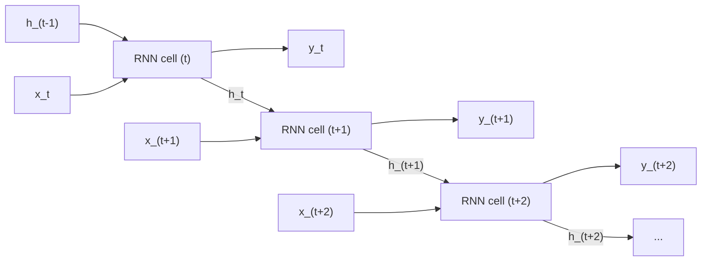

# Chapter 19: Recurrent Neural Networks and LSTMs — Processing Sequences

> **"An RNN is a neural network with a loop: it reads one token at a time, updates a hidden state, and carries that state forward. The hidden state is its 'memory.' The problem is that vanilla RNNs forget — they're good for 5-10 steps and then the early inputs are gone. LSTMs are the engineering fix that makes the memory last hundreds of steps."**

---

## Table of Contents
1. [The Sequence Problem](#1-the-sequence-problem)
2. [Vanilla RNN — Architecture and Computation](#2-vanilla-rnn--architecture-and-computation)
3. [Backpropagation Through Time (BPTT)](#3-backpropagation-through-time-bptt)
4. [Vanishing Gradients in RNNs — Why They Fail on Long Sequences](#4-vanishing-gradients-in-rnns)
5. [LSTM — Long Short-Term Memory](#5-lstm--long-short-term-memory)
6. [GRU — Gated Recurrent Unit](#6-gru--gated-recurrent-unit)
7. [Bidirectional RNNs](#7-bidirectional-rnns)
8. [Deep and Stacked RNNs](#8-stacked-rnns)
9. [Dropout in RNNs](#9-dropout-in-rnns)
10. [PyTorch: nn.RNN, nn.LSTM, nn.GRU](#10-pytorch-nnrnn-nnlstm-nngru)
11. [Applications](#11-applications)
12. [Full Example: Sentiment Analysis with Bidirectional LSTM](#12-full-example-sentiment-analysis-with-bidirectional-lstm)
13. [The Limitation That Leads to Transformers](#13-the-limitation-that-leads-to-transformers)
14. [Summary and What's Next](#14-summary)

---

## 1. The Sequence Problem

Not all data is grid-structured like images. Many real-world problems involve **sequences** where:
- Order matters (word 1 before word 2 changes meaning)
- Length is variable (sentences have different numbers of words)
- Position in time is meaningful (temperature at t=5 depends on t=4)

**Examples of sequence data:**

| Domain | Sequence | Element | Task |
|--------|----------|---------|------|
| NLP | Sentence | Word/token | Classification, translation, generation |
| Time series | Stock prices | Daily price | Forecasting, anomaly detection |
| Audio | Sound wave | Sample or spectrogram frame | Speech recognition, classification |
| Video | Frames | Image | Action recognition, captioning |
| DNA | Genome | Nucleotide | Protein structure prediction |
| Code | Program | Token | Auto-completion, bug detection |

### Why Vanilla NNs Fail on Sequences

```
Problem 1: Fixed input size
  A fully connected network expects input of shape (n_features,)
  But sentences have varying numbers of words — you can't feed a
  variable-length sequence directly.

Problem 2: No concept of "previous"
  For a sentence: "The bank where I deposit money is by the river bank"
  The second "bank" means something different based on the first 8 words.
  A vanilla NN has no memory of earlier inputs.

Problem 3: No weight sharing across time
  If we pad to fixed length and use FC, position 1 and position 8
  use completely different weights. But the word "bank" means the
  same thing regardless of where it appears.
```

---

## 2. Vanilla RNN — Architecture and Computation

A Recurrent Neural Network processes sequences one element at a time, maintaining a **hidden state** that carries information from previous time steps.

### The RNN Cell

```
At each time step t, the RNN cell takes:
  - x_t: current input (shape: input_size)
  - h_{t-1}: previous hidden state (shape: hidden_size)

And produces:
  - h_t: new hidden state (shape: hidden_size)
  - y_t: output (shape: output_size)   [optional at each step]

Equations:
  h_t = tanh(W_hh · h_{t-1} + W_xh · x_t + b_h)
  y_t = W_hy · h_t + b_y

W_hh: hidden-to-hidden weight matrix  (hidden_size × hidden_size)
W_xh: input-to-hidden weight matrix   (hidden_size × input_size)
W_hy: hidden-to-output weight matrix  (output_size × hidden_size)
b_h:  hidden bias                     (hidden_size,)
b_y:  output bias                     (output_size,)
```

### RNN Unrolled Over Time



**Hidden state = memory**: `h_t` is a compressed summary of everything the network has "seen" from `x_1` through `x_t`. It's a fixed-size vector that must compress all relevant past information.

### Numerical Example

Let's trace an RNN processing the sequence "cat is".

```python
import numpy as np

# Hyperparameters
input_size = 4   # vocabulary: [cat, is, good, bad] → one-hot vectors
hidden_size = 3  # hidden state dimension

# Randomly initialized weights (in practice, these are learned)
np.random.seed(42)
W_xh = np.random.randn(hidden_size, input_size) * 0.1   # (3, 4)
W_hh = np.random.randn(hidden_size, hidden_size) * 0.1  # (3, 3)
b_h  = np.zeros(hidden_size)                             # (3,)

# Initial hidden state: zeros
h = np.zeros(hidden_size)

# Input sequence (one-hot encoded):
# cat = [1,0,0,0], is = [0,1,0,0]
x1 = np.array([1.0, 0.0, 0.0, 0.0])   # "cat"
x2 = np.array([0.0, 1.0, 0.0, 0.0])   # "is"

# Step 1: process "cat"
h = np.tanh(W_hh @ h + W_xh @ x1 + b_h)
print(f"After 'cat': h = {h.round(4)}")

# Step 2: process "is"
# Notice: this uses the updated h from step 1 — "is" is processed in context of "cat"
h = np.tanh(W_hh @ h + W_xh @ x2 + b_h)
print(f"After 'is': h = {h.round(4)}")
# h now encodes "I have seen 'cat is'" in a compressed form
```

### Input/Output Modes

RNNs are flexible in how they consume inputs and produce outputs:

```
MANY-TO-ONE (sequence classification):
  x1 → x2 → x3 → x4 → h_final → y
  Use case: sentiment analysis, document classification

ONE-TO-MANY (sequence generation):
  x → h1 → h2 → h3 → h4
        y1   y2   y3   y4
  Use case: image captioning (image → caption), music generation

MANY-TO-MANY (sequence-to-sequence, same length):
  x1 → x2 → x3
  y1   y2   y3
  Use case: named entity recognition, POS tagging

ENCODER-DECODER (sequence-to-sequence, different length):
  x1 → x2 → x3 → [context vector c] → y1 → y2 → y4 → y5
  Use case: machine translation, summarization
```

---

## 3. Backpropagation Through Time (BPTT)

Training an RNN means backpropagating through the unrolled computation graph. For a sequence of length T, the graph has T copies of the RNN cell.

```
Forward (left to right):

h_0 →[RNN]→ h_1 →[RNN]→ h_2 →[RNN]→ h_3 → ... → h_T → [Loss L]
      x_1         x_2         x_3              x_T

Backward (right to left):

dL/dh_T ← dL/dh_{T-1} ← dL/dh_{T-2} ← ... ← dL/dh_1 ← dL/dh_0

Each arrow applies the chain rule:
  dL/dh_{t-1} = dL/dh_t · (dh_t/dh_{t-1})
              = dL/dh_t · W_hh^T · diag(1 - h_t²)  ← for tanh
```

**The weight gradient is accumulated across all time steps:**
```
dL/dW_hh = Σ_{t=1}^{T} dL/dh_t · h_{t-1}^T
dL/dW_xh = Σ_{t=1}^{T} dL/dh_t · x_t^T
```

The same weights appear T times in the computation graph — this is why the gradients sum across all time steps.

### Truncated BPTT

For very long sequences (e.g., 10,000 tokens), full BPTT is prohibitively expensive. **Truncated BPTT** processes the sequence in chunks:

```python
# Truncated BPTT example:
TBPTT_STEPS = 35   # backprop through last 35 steps only

h = h_init.detach()   # detach: don't propagate through previous chunk

for t in range(0, sequence_length, TBPTT_STEPS):
    chunk = sequence[t : t + TBPTT_STEPS]
    
    outputs, h = model(chunk, h)
    loss = criterion(outputs, targets[t : t + TBPTT_STEPS])
    
    loss.backward()
    optimizer.step()
    optimizer.zero_grad()
    
    h = h.detach()   # detach hidden state before next chunk
```

---

## 4. Vanishing Gradients in RNNs

### Why Long-Range Dependencies Fail

The gradient of the loss with respect to an early hidden state `h_t` flows through all subsequent steps:

```
dL/dh_t = dL/dh_T · (W_hh · diag(tanh'(z)))^(T-t)

where tanh'(z) = 1 - tanh²(z) ≤ 1.0

For a long sequence (T - t = 100):
  gradient = (W_hh · tanh_derivative)^100
  
If largest eigenvalue of W_hh < 1:
  gradient → 0 exponentially  ← VANISHING
  
If largest eigenvalue of W_hh > 1:
  gradient → ∞ exponentially  ← EXPLODING
```

**Practical consequence:**

```
Sequence: "The man who wore the blue suit that everyone liked [VERB]"

The verb must agree with "man" (position 1), but there are 9 words between them.

Vanilla RNN: by the time the RNN reads the verb, the gradient signal
from "man" has multiplied through 9 tanh derivatives ≈ (0.5)^9 ≈ 0.002
→ The network cannot learn this dependency

LSTM: the cell state carries "man" information through unchanged
(additions only, no multiplication decay)
→ Can learn this dependency
```

**Typical limits:**
- Vanilla RNN: can reliably capture dependencies of ~5-10 steps
- LSTM: ~100-200 steps
- Transformer (attention): any distance (quadratic cost)

---

## 5. LSTM — Long Short-Term Memory

Invented by Sepp Hochreiter and Jürgen Schmidhuber in 1997, LSTM remained the state of the art for sequential data for nearly 20 years.

### The Key Innovation: Cell State and Gates

The LSTM adds a second state vector — the **cell state** `c_t` — which acts like a "conveyor belt" running through the sequence with minimal modification.

```
    h_{t-1} ──────────────────────────────────────────► h_t
    c_{t-1} ──── × ──────────────── + ────────────────► c_t
                 │                   │
                forget             input
                gate               gate
    x_t ──────────────────────────────────────────────
```

### The Four Equations of LSTM

```
Inputs to each gate: concatenation of previous hidden state and current input
  [h_{t-1}, x_t]  shape: (hidden_size + input_size,)

1. Forget gate (what to erase from cell state):
   f_t = σ(W_f · [h_{t-1}, x_t] + b_f)
   f_t ∈ (0, 1) per element
   f_t = 0 → forget completely
   f_t = 1 → keep completely

2. Input gate (what new information to write):
   i_t = σ(W_i · [h_{t-1}, x_t] + b_i)
   i_t ∈ (0, 1) per element

3. Candidate values (what we WANT to write):
   g_t = tanh(W_g · [h_{t-1}, x_t] + b_g)
   g_t ∈ (-1, 1) per element

4. Cell state update:
   c_t = f_t ⊙ c_{t-1} + i_t ⊙ g_t
   (forget old values) + (write new values)
   ⊙ = element-wise multiplication

5. Output gate (what to expose from cell state):
   o_t = σ(W_o · [h_{t-1}, x_t] + b_o)

6. Hidden state:
   h_t = o_t ⊙ tanh(c_t)
```

### LSTM Cell Diagram

```
                                          c_{t-1}
                                             │
                                        ─────┴─────
                                       │     ×     │
                              f_t ─────┘           └───────────── + ──► c_t
                               │                               │
   [h_{t-1}, x_t] ─────► [σ] (forget)                        │
                   │                                          │
                   ├─────► [σ] (input i_t) ───► × ──────────┘
                   │                           │
                   ├─────► [tanh] (g_t) ───────┘
                   │
                   └─────► [σ] (output o_t)
                                    │
                                    ▼
                             × ◄── tanh(c_t) ──► tanh
                             │
                             ▼
                            h_t
```

### Why LSTMs Can Remember Long-Range Dependencies

The key equation is the **cell state update**:
```
c_t = f_t ⊙ c_{t-1} + i_t ⊙ g_t
```

**This is a linear operation** (addition and element-wise multiplication). No tanh squashing of the cell state itself! Gradients can flow through the cell state with:
```
dc_{t}/dc_{t-1} = f_t  (just the forget gate values)

If the forget gate stays close to 1 (f_t ≈ 1):
  Gradient flows unchanged through hundreds of steps.
  The LSTM "decides" to remember something by keeping f_t ≈ 1.
```

This is the "constant error carousel" — a key insight from the original LSTM paper.

### LSTM in NumPy (Educational)

```python
import numpy as np

class LSTMCell:
    """
    A single LSTM cell. Processes one time step.
    """
    
    def __init__(self, input_size, hidden_size):
        self.input_size = input_size
        self.hidden_size = hidden_size
        
        # Combined weight matrix for all four gates:
        # [forget | input | gate | output] — stacked vertically
        # Input: [h_{t-1}, x_t] concatenated
        n_in = hidden_size + input_size
        n_out = 4 * hidden_size   # 4 gates
        
        # He init (approx)
        scale = np.sqrt(2.0 / n_in)
        self.W = np.random.randn(n_out, n_in) * scale   # (4H, H+I)
        self.b = np.zeros(n_out)                          # (4H,)
    
    def forward(self, x, h_prev, c_prev):
        """
        x: (input_size,)
        h_prev: (hidden_size,)
        c_prev: (hidden_size,)
        Returns: h_t (hidden_size,), c_t (hidden_size,)
        """
        H = self.hidden_size
        
        # Concatenate input and previous hidden state
        combined = np.concatenate([h_prev, x])   # (H + I,)
        
        # All gates in one matrix multiply
        gates = self.W @ combined + self.b   # (4H,)
        
        # Split into four gate activations
        f = self._sigmoid(gates[0:H])     # forget gate
        i = self._sigmoid(gates[H:2*H])   # input gate
        g = np.tanh(gates[2*H:3*H])       # candidate cell values
        o = self._sigmoid(gates[3*H:4*H]) # output gate
        
        # Cell state update
        c_t = f * c_prev + i * g          # element-wise
        
        # Hidden state
        h_t = o * np.tanh(c_t)
        
        return h_t, c_t
    
    def _sigmoid(self, z):
        return 1.0 / (1.0 + np.exp(-np.clip(z, -500, 500)))
    
    def process_sequence(self, X):
        """
        X: (seq_len, input_size)
        Returns: all hidden states (seq_len, hidden_size)
        """
        seq_len = X.shape[0]
        
        h = np.zeros(self.hidden_size)
        c = np.zeros(self.hidden_size)
        
        hidden_states = []
        
        for t in range(seq_len):
            h, c = self.forward(X[t], h, c)
            hidden_states.append(h.copy())
        
        return np.array(hidden_states)


# Test it
np.random.seed(42)
lstm = LSTMCell(input_size=4, hidden_size=8)

# Process a sequence of 5 time steps
X = np.random.randn(5, 4)
hidden_states = lstm.process_sequence(X)

print(f"Input shape: {X.shape}")             # (5, 4)
print(f"Output shape: {hidden_states.shape}") # (5, 8)
print(f"Final hidden state: {hidden_states[-1].round(4)}")
```

---

## 6. GRU — Gated Recurrent Unit

The GRU (Cho et al., 2014) is a simplified version of LSTM that merges the cell state and hidden state into a single vector. It uses only **two gates** instead of four:

```
1. Reset gate (how much of previous hidden state to forget):
   r_t = σ(W_r · [h_{t-1}, x_t] + b_r)

2. Update gate (how much of previous hidden state to keep vs new):
   z_t = σ(W_z · [h_{t-1}, x_t] + b_z)

3. Candidate hidden state:
   h̃_t = tanh(W · [r_t ⊙ h_{t-1}, x_t] + b)
   
   Note: reset gate gates the previous hidden state before computing candidate
   If r_t = 0: candidate ignores past entirely (full reset)
   If r_t = 1: candidate sees full past hidden state

4. Final hidden state:
   h_t = (1 - z_t) ⊙ h_{t-1} + z_t ⊙ h̃_t
   
   If z_t = 0: keep old hidden state entirely (ignore new input)
   If z_t = 1: replace with candidate entirely (full update)
```

### GRU vs LSTM Comparison

| Aspect | LSTM | GRU |
|--------|------|-----|
| States | 2 (h and c) | 1 (h only) |
| Gates | 4 (f, i, g, o) | 2 (r, z) + candidate |
| Parameters | ~4× more than FC | ~3× more than FC |
| Performance | Slightly better on some tasks | Comparable on most tasks |
| Training speed | Slower | Faster |
| Memory (GPU) | More | Less |

**When to use**: If you need to choose between LSTM and GRU: start with **LSTM** for NLP tasks (proven performance), and try **GRU** if you're memory-constrained or want a simpler model.

```python
import torch
import torch.nn as nn

# GRU in PyTorch:
gru = nn.GRU(input_size=128, hidden_size=256, num_layers=2,
             batch_first=True, dropout=0.2, bidirectional=True)

# Input: (batch, seq_len, input_size) with batch_first=True
x = torch.randn(32, 100, 128)   # batch=32, seq_len=100, features=128
h0 = torch.zeros(4, 32, 256)   # (num_layers * num_directions, batch, hidden)

output, hn = gru(x, h0)
# output: (32, 100, 512)  ← 512 = 256 × 2 (bidirectional)
# hn: (4, 32, 256)  ← final hidden state for each layer/direction
```

---

## 7. Bidirectional RNNs

In many sequence tasks — especially NLP — the full sequence is known at inference time (you have the complete sentence). A **bidirectional RNN** processes the sequence in both directions and concatenates the results:

```
Forward RNN (left to right):
  x1 ──► h1_fwd ──► h2_fwd ──► h3_fwd ──► h4_fwd

Backward RNN (right to left):
  x4 ──► h4_bwd ──► h3_bwd ──► h2_bwd ──► h1_bwd

Final output at position t:
  h_t = concat(h_t_fwd, h_t_bwd)   ← sees both past AND future context

Applications:
  - Sentence classification: final hidden = concat(h_T_fwd, h_1_bwd)
  - Named Entity Recognition: each position needs full sentence context
  - Question answering: full passage context
  
NOT suitable for:
  - Text generation (you don't have future tokens)
  - Real-time/streaming tasks (need left context only)
```

```python
import torch.nn as nn

# Bidirectional LSTM:
bilstm = nn.LSTM(
    input_size=256,
    hidden_size=128,
    num_layers=2,
    batch_first=True,
    dropout=0.3,
    bidirectional=True   # ← enables bidirectionality
)

# Output shape: (batch, seq_len, 2*hidden_size)
# The factor of 2 accounts for forward + backward directions
```

---

## 8. Stacked RNNs

Multiple RNN layers can be stacked, where the output of one layer becomes the input to the next:

```
Layer 2 hidden states (abstract representation):
  h2_1  ──►  h2_2  ──►  h2_3  ──►  h2_4
   │           │           │           │
  ▲            ▲           ▲           ▲
Layer 1 hidden states (closer to input):
  h1_1  ──►  h1_2  ──►  h1_3  ──►  h1_4
   │           │           │           │
  x1          x2          x3          x4

Deeper layers → more abstract representations
(Similar to deep CNNs learning hierarchical features)
```

```python
# 2-layer stacked LSTM:
lstm = nn.LSTM(
    input_size=128,
    hidden_size=256,
    num_layers=2,         # ← stacking
    batch_first=True,
    dropout=0.3           # dropout applied BETWEEN layers (not after last layer)
)

# Input: (batch, seq_len, 128)
# Output: (batch, seq_len, 256)  ← only final layer outputs
# hn: (2, batch, 256)            ← hidden states from EACH layer
# cn: (2, batch, 256)            ← cell states from EACH layer
```

---

## 9. Dropout in RNNs

Standard dropout (applied independently at each time step) doesn't work well for RNNs. If a different mask is applied at each step, it prevents learning long-term dependencies because the information is broken up.

**Variational dropout (recommended)**: apply the **same dropout mask** at every time step:

```
Standard dropout:
  Step 1: mask = [0,1,0,1,1] (random)   → x1 masked
  Step 2: mask = [1,0,1,0,1] (different) → x2 masked differently
  → breaks temporal dependencies

Variational dropout:
  mask = [0,1,0,1,1]  (sampled ONCE per sequence)
  Step 1: x1 masked with this mask
  Step 2: x2 masked with same mask
  → preserves temporal structure

PyTorch's nn.LSTM does this correctly when dropout > 0.
The dropout is applied to connections BETWEEN layers (inter-layer dropout).
For recurrent connections (within a layer), use a library like torch-dropout-rnn.
```

---

## 10. PyTorch: nn.RNN, nn.LSTM, nn.GRU

### API Reference

```python
import torch
import torch.nn as nn

# ─── RNN ─────────────────────────────────────────────────────────
rnn = nn.RNN(
    input_size=128,      # number of input features per time step
    hidden_size=256,     # number of features in hidden state
    num_layers=1,        # number of stacked RNN layers
    nonlinearity='tanh', # activation: 'tanh' or 'relu'
    bias=True,
    batch_first=True,    # if True: (batch, seq, features); else (seq, batch, features)
    dropout=0.0,         # dropout between layers (0 = no dropout)
    bidirectional=False
)

# ─── LSTM ─────────────────────────────────────────────────────────
lstm = nn.LSTM(
    input_size=128,
    hidden_size=256,
    num_layers=2,
    batch_first=True,
    dropout=0.2,
    bidirectional=True
)

# ─── GRU ──────────────────────────────────────────────────────────
gru = nn.GRU(
    input_size=128,
    hidden_size=256,
    num_layers=2,
    batch_first=True,
    dropout=0.2,
    bidirectional=False
)

# ─── Forward pass ─────────────────────────────────────────────────
batch_size = 16
seq_len = 50
input_size = 128

x = torch.randn(batch_size, seq_len, input_size)  # batch_first=True

# For RNN/GRU:
output, hn = rnn(x)
# output: (batch, seq_len, D*hidden_size)   D=2 if bidirectional, else 1
# hn: (D*num_layers, batch, hidden_size)    final hidden state

# For LSTM:
h0 = torch.zeros(2*2, batch_size, 256)  # (D*num_layers, batch, hidden)
c0 = torch.zeros(2*2, batch_size, 256)  # same shape as h0

output, (hn, cn) = lstm(x, (h0, c0))
# output: (batch, seq_len, D*hidden_size)
# hn: (D*num_layers, batch, hidden_size)  — final hidden state each layer
# cn: (D*num_layers, batch, hidden_size)  — final cell state each layer

# Extract last time step (for classification):
last_output = output[:, -1, :]          # (batch, D*hidden_size)

# For bidirectional: concatenate first forward and last backward:
# Actually, output[:, -1, :] already contains this for many-to-one tasks
```

### Handling Variable-Length Sequences

In practice, sequences in a batch have different lengths. We pad shorter sequences and use `pack_padded_sequence` to make computation efficient:

```python
from torch.nn.utils.rnn import pack_padded_sequence, pad_packed_sequence

class RNNClassifier(nn.Module):
    def __init__(self, vocab_size, embed_dim, hidden_size, num_classes, num_layers=2):
        super().__init__()
        
        self.embedding = nn.Embedding(vocab_size, embed_dim, padding_idx=0)
        self.lstm = nn.LSTM(embed_dim, hidden_size, num_layers=num_layers,
                            batch_first=True, dropout=0.3, bidirectional=True)
        self.dropout = nn.Dropout(0.3)
        self.classifier = nn.Linear(hidden_size * 2, num_classes)  # *2 for bidirectional
    
    def forward(self, x, lengths):
        """
        x: (batch, max_seq_len) — token IDs, padded
        lengths: (batch,) — actual length of each sequence
        """
        # Embed tokens
        embedded = self.dropout(self.embedding(x))  # (batch, seq, embed_dim)
        
        # Pack sequence (tells LSTM to ignore padding)
        packed = pack_padded_sequence(
            embedded, lengths.cpu(), batch_first=True, enforce_sorted=False
        )
        
        # Run LSTM
        packed_output, (hn, cn) = self.lstm(packed)
        
        # Unpack output (optional — only needed if you want per-step outputs)
        output, _ = pad_packed_sequence(packed_output, batch_first=True)
        # output: (batch, max_seq_len, 2*hidden_size) — padded back
        
        # For classification: use final hidden state of last layer
        # hn shape: (num_layers*2, batch, hidden_size)
        # Last layer: hn[-2] = forward, hn[-1] = backward
        fwd = hn[-2]    # (batch, hidden_size)
        bwd = hn[-1]    # (batch, hidden_size)
        final = torch.cat([fwd, bwd], dim=1)  # (batch, 2*hidden_size)
        
        final = self.dropout(final)
        return self.classifier(final)
```

---

## 11. Applications

### Text Classification (Sentiment Analysis, Topic Classification)

```
Pipeline:
  Raw text → Tokenize → Integer IDs → Embedding lookup → LSTM → FC → Class

  "This movie is great!"
    ↓ tokenize
  ["this", "movie", "is", "great", "!"]
    ↓ vocabulary lookup
  [17, 342, 12, 891, 5]
    ↓ embedding (each ID → vector)
  [[0.2, -0.1, ...], [0.4, 0.3, ...], ...]   shape: (5, embed_dim)
    ↓ LSTM processes sequence
  final hidden state: [0.8, -0.2, ..., 0.6]   shape: (2*hidden_size,)
    ↓ classifier
  logits: [0.1, 2.4]   → softmax → [0.09, 0.91] → positive sentiment
```

### Sequence-to-Sequence (Machine Translation)

```
Encoder: reads source sentence → produces context vector
Decoder: generates target sentence token by token, conditioned on context

"Je mange une pomme" → encoder → c → decoder → "I eat an apple"

But basic Seq2Seq bottlenecks all information through a single vector c.
Attention mechanism (next topic) allows the decoder to look at all
encoder states — this is the predecessor of Transformers.
```

### Time Series Forecasting

```
Input: [price_1, price_2, ..., price_T]  (T days of history)
Output: price_{T+1}  (next day's price)

LSTM reads the sequence, hidden state captures trend and seasonality.
Better than classical methods for non-linear patterns.
```

---

## 12. Full Example: Sentiment Analysis with Bidirectional LSTM

```python
import torch
import torch.nn as nn
import torch.optim as optim
from torch.utils.data import Dataset, DataLoader
from torch.nn.utils.rnn import pack_padded_sequence
import numpy as np
import re
from collections import Counter

# ─── Tokenization and Vocabulary ─────────────────────────────────

def simple_tokenize(text):
    """Basic tokenizer: lowercase, split on non-alphanumeric."""
    text = text.lower()
    text = re.sub(r'[^a-z0-9\s]', ' ', text)
    return text.split()

def build_vocab(texts, max_vocab=25000, min_freq=2):
    """Build vocabulary from a list of text strings."""
    counter = Counter()
    for text in texts:
        tokens = simple_tokenize(text)
        counter.update(tokens)
    
    vocab = {'<PAD>': 0, '<UNK>': 1}
    for word, freq in counter.most_common(max_vocab):
        if freq >= min_freq:
            vocab[word] = len(vocab)
    
    return vocab

def encode_text(text, vocab, max_len=256):
    """Convert text to list of integer IDs, truncated to max_len."""
    tokens = simple_tokenize(text)[:max_len]
    return [vocab.get(t, 1) for t in tokens]  # 1 = <UNK>


# ─── Dataset ─────────────────────────────────────────────────────

class SentimentDataset(Dataset):
    """
    Dataset for binary sentiment classification.
    texts: list of strings
    labels: list of ints (0 or 1)
    vocab: dict mapping word → index
    """
    
    def __init__(self, texts, labels, vocab, max_len=256):
        self.texts = texts
        self.labels = labels
        self.vocab = vocab
        self.max_len = max_len
    
    def __len__(self):
        return len(self.texts)
    
    def __getitem__(self, idx):
        encoded = encode_text(self.texts[idx], self.vocab, self.max_len)
        length = len(encoded)
        return (
            torch.tensor(encoded, dtype=torch.long),
            torch.tensor(length, dtype=torch.long),
            torch.tensor(self.labels[idx], dtype=torch.long)
        )


def collate_fn(batch):
    """
    Pad sequences in a batch to the same length.
    Returns: padded_sequences, lengths, labels
    """
    texts, lengths, labels = zip(*batch)
    
    # Sort by length descending (required by pack_padded_sequence)
    sorted_indices = sorted(range(len(lengths)), key=lambda i: lengths[i], reverse=True)
    
    texts = [texts[i] for i in sorted_indices]
    lengths = [lengths[i] for i in sorted_indices]
    labels = [labels[i] for i in sorted_indices]
    
    # Pad to max length in batch
    max_len = max(len(t) for t in texts)
    padded = torch.zeros(len(texts), max_len, dtype=torch.long)
    for i, t in enumerate(texts):
        padded[i, :len(t)] = t
    
    return padded, torch.tensor(lengths), torch.stack(labels)


# ─── Model ───────────────────────────────────────────────────────

class BiLSTMSentiment(nn.Module):
    """
    Bidirectional LSTM for binary sentiment classification.
    """
    
    def __init__(self, vocab_size, embed_dim=128, hidden_size=256,
                 num_layers=2, dropout=0.4, pad_idx=0):
        super().__init__()
        
        self.hidden_size = hidden_size
        self.num_layers = num_layers
        
        # Embedding with padding index (pad token gets zero vector, no gradient)
        self.embedding = nn.Embedding(vocab_size, embed_dim, padding_idx=pad_idx)
        
        self.lstm = nn.LSTM(
            input_size=embed_dim,
            hidden_size=hidden_size,
            num_layers=num_layers,
            batch_first=True,
            dropout=dropout if num_layers > 1 else 0,
            bidirectional=True
        )
        
        self.dropout = nn.Dropout(dropout)
        
        # 2*hidden_size because bidirectional
        self.fc = nn.Linear(hidden_size * 2, 2)   # 2 classes
    
    def forward(self, x, lengths):
        """
        x: (batch, max_seq_len) — padded token IDs
        lengths: (batch,) — actual sequence lengths
        """
        # Embed: (batch, seq_len, embed_dim)
        embedded = self.dropout(self.embedding(x))
        
        # Pack for efficient computation (ignores padding)
        packed = pack_padded_sequence(
            embedded, lengths.cpu(), batch_first=True, enforce_sorted=True
        )
        
        # LSTM forward
        _, (hn, _) = self.lstm(packed)
        # hn: (num_layers*2, batch, hidden_size)
        
        # Concatenate last layer's forward and backward hidden states
        # hn[-2]: forward final hidden (last layer)
        # hn[-1]: backward final hidden (last layer)
        final_hidden = torch.cat([hn[-2], hn[-1]], dim=1)  # (batch, 2*hidden_size)
        
        final_hidden = self.dropout(final_hidden)
        
        return self.fc(final_hidden)  # (batch, 2)


# ─── Training ────────────────────────────────────────────────────

def train_sentiment_model(
    train_texts, train_labels,
    val_texts, val_labels,
    n_epochs=10,
    batch_size=64,
    lr=1e-3
):
    device = torch.device('cuda' if torch.cuda.is_available() else 'cpu')
    print(f"Device: {device}")
    
    # Build vocabulary from training data only
    vocab = build_vocab(train_texts, max_vocab=25000)
    print(f"Vocabulary size: {len(vocab)}")
    
    # Create datasets
    train_dataset = SentimentDataset(train_texts, train_labels, vocab)
    val_dataset = SentimentDataset(val_texts, val_labels, vocab)
    
    train_loader = DataLoader(
        train_dataset, batch_size=batch_size, shuffle=True,
        collate_fn=collate_fn, num_workers=2
    )
    val_loader = DataLoader(
        val_dataset, batch_size=batch_size*2, shuffle=False,
        collate_fn=collate_fn, num_workers=2
    )
    
    # Model
    model = BiLSTMSentiment(
        vocab_size=len(vocab),
        embed_dim=128,
        hidden_size=256,
        num_layers=2,
        dropout=0.4
    ).to(device)
    
    print(f"Params: {sum(p.numel() for p in model.parameters()):,}")
    
    criterion = nn.CrossEntropyLoss()
    optimizer = optim.Adam(model.parameters(), lr=lr, weight_decay=1e-5)
    scheduler = optim.lr_scheduler.ReduceLROnPlateau(
        optimizer, 'min', patience=2, factor=0.5, verbose=True
    )
    
    best_val_acc = 0.0
    
    for epoch in range(n_epochs):
        # --- Train ---
        model.train()
        train_loss, train_correct, train_total = 0.0, 0, 0
        
        for texts, lengths, labels in train_loader:
            texts, lengths, labels = texts.to(device), lengths.to(device), labels.to(device)
            
            optimizer.zero_grad()
            logits = model(texts, lengths)
            loss = criterion(logits, labels)
            loss.backward()
            torch.nn.utils.clip_grad_norm_(model.parameters(), max_norm=1.0)
            optimizer.step()
            
            train_loss += loss.item()
            preds = logits.argmax(dim=1)
            train_correct += preds.eq(labels).sum().item()
            train_total += labels.size(0)
        
        train_acc = 100.0 * train_correct / train_total
        
        # --- Validate ---
        model.eval()
        val_loss, val_correct, val_total = 0.0, 0, 0
        
        with torch.no_grad():
            for texts, lengths, labels in val_loader:
                texts, lengths, labels = texts.to(device), lengths.to(device), labels.to(device)
                logits = model(texts, lengths)
                val_loss += criterion(logits, labels).item()
                preds = logits.argmax(dim=1)
                val_correct += preds.eq(labels).sum().item()
                val_total += labels.size(0)
        
        val_acc = 100.0 * val_correct / val_total
        val_loss_avg = val_loss / len(val_loader)
        
        scheduler.step(val_loss_avg)
        
        if val_acc > best_val_acc:
            best_val_acc = val_acc
            torch.save(model.state_dict(), 'best_bilstm.pth')
        
        print(f"Epoch {epoch+1:2d} | Train: {train_acc:.1f}% | "
              f"Val: {val_acc:.1f}% {'★' if val_acc >= best_val_acc else ''}")
    
    print(f"\nBest validation accuracy: {best_val_acc:.2f}%")
    return model, vocab


# ─── Inference ───────────────────────────────────────────────────

def predict_sentiment(text, model, vocab, device, max_len=256):
    """
    Predict sentiment for a single text.
    Returns: (label, confidence)
    """
    model.eval()
    
    encoded = encode_text(text, vocab, max_len)
    x = torch.tensor([encoded], dtype=torch.long).to(device)
    lengths = torch.tensor([len(encoded)], dtype=torch.long)
    
    with torch.no_grad():
        logits = model(x, lengths)
        probs = torch.softmax(logits, dim=1)
        label = probs.argmax().item()
        confidence = probs.max().item()
    
    return ('positive' if label == 1 else 'negative'), confidence


# ─── Demo with synthetic data ─────────────────────────────────────
if __name__ == "__main__":
    # In practice, use the IMDB dataset:
    # from torchtext.datasets import IMDB
    # Or download from: https://ai.stanford.edu/~amaas/data/sentiment/
    
    # Synthetic demo:
    pos_texts = [
        "This movie was absolutely wonderful and enjoyable",
        "Great performance by all actors",
        "I loved this film completely",
        "Outstanding and brilliant work",
        "Amazing experience highly recommended",
    ] * 200  # multiply for demo
    
    neg_texts = [
        "Terrible movie complete waste of time",
        "Boring and predictable plot throughout",
        "I hated every minute of this film",
        "Awful acting and poor direction",
        "Would not recommend to anyone",
    ] * 200
    
    texts = pos_texts + neg_texts
    labels = [1] * len(pos_texts) + [0] * len(neg_texts)
    
    # Shuffle
    indices = np.random.permutation(len(texts))
    texts = [texts[i] for i in indices]
    labels = [labels[i] for i in indices]
    
    # Split
    split = int(0.8 * len(texts))
    train_texts, val_texts = texts[:split], texts[split:]
    train_labels, val_labels = labels[:split], labels[split:]
    
    model, vocab = train_sentiment_model(
        train_texts, train_labels,
        val_texts, val_labels,
        n_epochs=5
    )
    
    # Test predictions
    device = torch.device('cuda' if torch.cuda.is_available() else 'cpu')
    
    test_texts = [
        "This was a fantastic and moving experience",
        "Complete garbage not worth watching at all",
    ]
    
    for text in test_texts:
        label, conf = predict_sentiment(text, model, vocab, device)
        print(f"'{text[:40]}...' → {label} ({conf:.1%})")
```

---

## 13. The Limitation That Leads to Transformers

RNNs have two fundamental limitations:

### 1. Sequential Computation — Cannot Parallelize

```
RNN computation:
  Step 1: h_1 = f(x_1, h_0)           ← must wait for h_0
  Step 2: h_2 = f(x_2, h_1)           ← must wait for h_1
  Step 3: h_3 = f(x_3, h_2)           ← must wait for h_2
  ...
  Step T: h_T = f(x_T, h_{T-1})       ← must wait for h_{T-1}

Total time: O(T) sequential steps — cannot be parallelized over time
GPU is largely idle for most of the computation!

For a 512-token sentence: 512 sequential steps
For a 2048-token document: 2048 sequential steps

Transformer attention: O(1) parallel steps over T positions
(but O(T²) memory — quadratic in sequence length)
```

### 2. Information Bottleneck — Long-Range Dependencies

```
Sequence of length 1000:
  "The scientist who [500 words later] found that the theory was correct"

The subject "scientist" must be remembered through 500 LSTM steps.
Even with LSTM cell state, information gradually leaks.

Transformer attention: every position can attend to every other position DIRECTLY
  "scientist" at position 1 → "theory" at position 500: direct attention, O(1) path
```

**The Transformer (2017) solved both problems**:
- Attention is computed for ALL pairs in parallel → O(1) time, O(T²) memory
- Every position can attend to any other position directly → O(1) path length

This is why Transformers replaced LSTMs for NLP tasks by 2019-2020 and are the foundation of all modern language models (BERT, GPT, T5, LLaMA, etc.).

---

## 14. Summary

```
SEQUENCE MODELS
│
├── Problem: variable-length, order-dependent data
│
├── Vanilla RNN:
│     h_t = tanh(W_hh·h_{t-1} + W_xh·x_t + b)
│     Same weights at every time step (time-wise weight sharing)
│     Limited memory (~10 steps)
│
├── BPTT: unroll the RNN, apply backprop backward
│     Vanishing gradient: (tanh derivatives)^T → 0 for large T
│     Exploding gradient: fix with gradient clipping
│
├── LSTM:
│     Two states: h_t (hidden) + c_t (cell = long-term memory)
│     Forget gate: f_t controls what to erase
│     Input gate: i_t controls what to write
│     Output gate: o_t controls what to expose
│     Cell state: c_t = f_t⊙c_{t-1} + i_t⊙g_t  ← linear update!
│     Can remember ~100-200 steps reliably
│
├── GRU: simplified LSTM (2 gates, 1 state)
│     Comparable performance, fewer parameters
│
├── Bidirectional: forward + backward, concatenate
│     For tasks where full context is available at inference
│
├── Limitations:
│     Sequential computation: cannot parallelize over time
│     Information bottleneck: long sequences still leak
│     → Transformers solve both with attention mechanism
│
└── Use cases today:
      RNN/LSTM still used for: time series, low-latency, edge
      Replaced by Transformers for: most NLP tasks, large-scale
```

### Key Formulas

| Formula | Description |
|---------|-------------|
| h_t = tanh(W_hh·h_{t-1} + W_xh·x_t + b) | RNN hidden state update |
| f_t = σ(W_f·[h_{t-1},x_t] + b_f) | LSTM forget gate |
| i_t = σ(W_i·[h_{t-1},x_t] + b_i) | LSTM input gate |
| c_t = f_t⊙c_{t-1} + i_t⊙g_t | LSTM cell state update |
| h_t = o_t⊙tanh(c_t) | LSTM hidden state |

---

## Mini Projects

### Mini Project 1: Character-Level Language Model

Train an LSTM to generate text character by character — a miniature GPT from scratch.

**Objective:** Understand sequence modeling by building a tiny language model that learns patterns in text.

```python
import torch
import torch.nn as nn
import numpy as np
import random
import matplotlib.pyplot as plt

# Training text (paste any text you like; longer = better)
text = """
To be or not to be that is the question whether tis nobler in the mind to suffer
the slings and arrows of outrageous fortune or to take arms against a sea of troubles
and by opposing end them to die to sleep no more and by a sleep to say we end
the heartache and the thousand natural shocks that flesh is heir to tis a consummation
devoutly to be wished to die to sleep to sleep perchance to dream ay theres the rub
for in that sleep of death what dreams may come when we have shuffled off this mortal coil
must give us pause theres the respect that makes calamity of so long life
""".strip().lower()

# Character vocabulary
chars = sorted(set(text))
vocab_size = len(chars)
char2idx = {c: i for i, c in enumerate(chars)}
idx2char = {i: c for c, i in char2idx.items()}
print(f"Vocab size: {vocab_size} chars")
print(f"Text length: {len(text)} chars")

# Encode text
encoded = torch.LongTensor([char2idx[c] for c in text])

# Sequence dataset
SEQ_LEN = 40
def get_batch(batch_size=32):
    starts = torch.randint(0, len(encoded) - SEQ_LEN - 1, (batch_size,))
    X = torch.stack([encoded[s:s+SEQ_LEN]   for s in starts])
    y = torch.stack([encoded[s+1:s+SEQ_LEN+1] for s in starts])
    return X, y

class CharLSTM(nn.Module):
    def __init__(self, vocab_size, embed_dim=64, hidden_dim=128, n_layers=2, dropout=0.3):
        super().__init__()
        self.embed   = nn.Embedding(vocab_size, embed_dim)
        self.lstm    = nn.LSTM(embed_dim, hidden_dim, n_layers, batch_first=True,
                                dropout=dropout if n_layers > 1 else 0)
        self.dropout = nn.Dropout(dropout)
        self.fc      = nn.Linear(hidden_dim, vocab_size)
        self.hidden_dim = hidden_dim
        self.n_layers   = n_layers

    def forward(self, x, hidden=None):
        emb = self.dropout(self.embed(x))
        out, hidden = self.lstm(emb, hidden)
        logits = self.fc(self.dropout(out))
        return logits, hidden

    def init_hidden(self, batch_size):
        weight = next(self.parameters())
        return (weight.new_zeros(self.n_layers, batch_size, self.hidden_dim),
                weight.new_zeros(self.n_layers, batch_size, self.hidden_dim))

def generate(model, seed_text, n_chars=200, temperature=0.8):
    model.eval()
    chars_so_far = list(seed_text.lower())
    hidden = model.init_hidden(1)
    # Warm up hidden state on seed
    with torch.no_grad():
        for c in chars_so_far[:-1]:
            if c in char2idx:
                x = torch.LongTensor([[char2idx[c]]])
                _, hidden = model(x, hidden)
        # Generate
        x = torch.LongTensor([[char2idx.get(chars_so_far[-1], 0)]])
        for _ in range(n_chars):
            logits, hidden = model(x, hidden)
            probs = torch.softmax(logits[0, -1] / temperature, dim=0)
            next_idx = torch.multinomial(probs, 1).item()
            chars_so_far.append(idx2char[next_idx])
            x = torch.LongTensor([[next_idx]])
    return ''.join(chars_so_far)

torch.manual_seed(42)
model = CharLSTM(vocab_size)
optimizer = torch.optim.Adam(model.parameters(), lr=0.003)
criterion = nn.CrossEntropyLoss()

losses = []
n_steps = 500
print("Training CharLSTM...")
for step in range(n_steps):
    X_b, y_b = get_batch(32)
    logits, _ = model(X_b)
    loss = criterion(logits.reshape(-1, vocab_size), y_b.reshape(-1))
    optimizer.zero_grad(); loss.backward(); torch.nn.utils.clip_grad_norm_(model.parameters(), 1.0)
    optimizer.step()
    losses.append(loss.item())
    if (step+1) % 100 == 0:
        sample = generate(model, "to be or not", n_chars=80, temperature=0.7)
        print(f"  Step {step+1:4d}: loss={loss.item():.4f} | Sample: '{sample[:80]}'")

fig, axes = plt.subplots(1, 2, figsize=(13, 4))
axes[0].plot(losses, alpha=0.6, color='purple', linewidth=0.8)
# Smoothed
window = 20
smoothed = np.convolve(losses, np.ones(window)/window, mode='valid')
axes[0].plot(range(window-1, len(losses)), smoothed, 'purple', linewidth=2)
axes[0].set_title("Training Loss (CharLSTM)"); axes[0].set_xlabel("Step"); axes[0].grid(True, alpha=0.3)

# Temperature effect
temps = [0.3, 0.7, 1.0, 1.5]
samples = [generate(model, "to be", n_chars=100, temperature=t) for t in temps]
axes[1].axis('off')
text_content = "Temperature Comparison:\n\n"
for t, s in zip(temps, samples):
    text_content += f"T={t}: {s[:60]}...\n\n"
axes[1].text(0.02, 0.98, text_content, transform=axes[1].transAxes, fontsize=7,
             va='top', fontfamily='monospace',
             bbox=dict(boxstyle='round', facecolor='lightyellow', alpha=0.8))
axes[1].set_title("Generation at Different Temperatures")

plt.tight_layout()
plt.savefig("char_lstm.png", dpi=150)
plt.show()
```

---

### Mini Project 2: Sentiment Classifier with LSTM vs GRU

Compare LSTM and GRU on sequence classification — and see which converges faster.

**Objective:** Understand the practical tradeoffs between LSTM and GRU architectures.

```python
import torch
import torch.nn as nn
import numpy as np
import matplotlib.pyplot as plt
from torch.utils.data import TensorDataset, DataLoader, random_split

# Synthetic sentiment dataset
np.random.seed(42)
VOCAB_SIZE = 500
SEQ_LEN = 30
N_SAMPLES = 1000

positive_patterns = [[1, 2, 3], [4, 5], [6, 7, 8, 9]]
negative_patterns = [[10, 11], [12, 13, 14], [15, 16]]

def make_sequence(is_positive):
    seq = np.random.randint(20, VOCAB_SIZE, SEQ_LEN)
    patterns = positive_patterns if is_positive else negative_patterns
    pattern = patterns[np.random.randint(len(patterns))]
    pos = np.random.randint(0, SEQ_LEN - len(pattern))
    seq[pos:pos+len(pattern)] = pattern
    return seq

X = np.array([make_sequence(i % 2 == 0) for i in range(N_SAMPLES)])
y = np.array([i % 2 for i in range(N_SAMPLES)])

X_t = torch.LongTensor(X)
y_t = torch.FloatTensor(y)
dataset = TensorDataset(X_t, y_t)
n = len(dataset)
train_ds, val_ds = random_split(dataset, [int(0.8*n), n-int(0.8*n)],
                                  generator=torch.Generator().manual_seed(42))
train_loader = DataLoader(train_ds, batch_size=32, shuffle=True)
val_loader   = DataLoader(val_ds,   batch_size=256)

class SentimentModel(nn.Module):
    def __init__(self, rnn_type='lstm', vocab_size=VOCAB_SIZE, embed_dim=32, hidden_dim=64):
        super().__init__()
        self.embed = nn.Embedding(vocab_size, embed_dim, padding_idx=0)
        rnn_cls = nn.LSTM if rnn_type == 'lstm' else nn.GRU
        self.rnn = rnn_cls(embed_dim, hidden_dim, batch_first=True,
                            num_layers=2, dropout=0.3, bidirectional=True)
        self.fc  = nn.Linear(hidden_dim * 2, 1)  # *2 for bidirectional
        self.drop = nn.Dropout(0.3)

    def forward(self, x):
        emb = self.drop(self.embed(x))
        out, _ = self.rnn(emb)
        # Use last valid hidden state (mean pooling over sequence)
        pooled = out.mean(dim=1)
        return self.fc(self.drop(pooled)).squeeze(1)

def train_model(rnn_type, n_epochs=30):
    torch.manual_seed(42)
    model = SentimentModel(rnn_type)
    optimizer = torch.optim.Adam(model.parameters(), lr=0.001)
    criterion = nn.BCEWithLogitsLoss()
    history = []

    n_params = sum(p.numel() for p in model.parameters() if p.requires_grad)
    print(f"  {rnn_type.upper()}: {n_params:,} trainable parameters")

    for epoch in range(n_epochs):
        model.train()
        for X_b, y_b in train_loader:
            optimizer.zero_grad()
            criterion(model(X_b), y_b).backward()
            nn.utils.clip_grad_norm_(model.parameters(), 1.0)
            optimizer.step()

        model.eval()
        with torch.no_grad():
            val_loss = sum(criterion(model(X_b), y_b).item() for X_b, y_b in val_loader) / len(val_loader)
            correct  = sum(((model(X_b) > 0).float() == y_b).sum().item() for X_b, y_b in val_loader)
        history.append((val_loss, correct/len(val_ds)))
    return history, n_params

print("Training LSTM vs GRU...")
lstm_history, lstm_params = train_model('lstm')
gru_history,  gru_params  = train_model('gru')

fig, axes = plt.subplots(1, 2, figsize=(13, 5))
epochs = range(1, 31)

axes[0].plot(epochs, [h[0] for h in lstm_history], 'b-o', label=f'LSTM ({lstm_params:,} params)', markersize=4)
axes[0].plot(epochs, [h[0] for h in gru_history],  'r-o', label=f'GRU ({gru_params:,} params)', markersize=4)
axes[0].set_title("Validation Loss"); axes[0].set_xlabel("Epoch"); axes[0].legend(); axes[0].grid(True, alpha=0.3)

axes[1].plot(epochs, [h[1] for h in lstm_history], 'b-o', label='LSTM', markersize=4)
axes[1].plot(epochs, [h[1] for h in gru_history],  'r-o', label='GRU', markersize=4)
axes[1].set_title("Validation Accuracy"); axes[1].set_xlabel("Epoch"); axes[1].legend(); axes[1].grid(True, alpha=0.3)
axes[1].set_ylim(0.4, 1.05)

plt.suptitle("Bidirectional LSTM vs GRU on Sentiment Classification", fontsize=12)
plt.tight_layout()
plt.savefig("lstm_vs_gru.png", dpi=150)
plt.show()
print(f"\nFinal: LSTM={lstm_history[-1][1]:.3f}, GRU={gru_history[-1][1]:.3f}")
print(f"GRU uses {(1 - gru_params/lstm_params)*100:.1f}% fewer parameters")
```

---

## Exercises

1. **Manual RNN**: Implement a vanilla RNN for binary classification (positive/negative) from scratch in NumPy. Show that it cannot learn the XOR of two tokens that are 20 steps apart.

2. **LSTM from scratch**: Implement an LSTM cell in NumPy. Verify it matches PyTorch's output by initializing both with the same weights.

3. **Long-range dependency**: Create a synthetic task: given a sequence of 100 random numbers, the label is 1 if the first and last numbers are both > 0.5, else 0. Train vanilla RNN, LSTM, and GRU. Compare accuracy. The LSTM and GRU should significantly outperform RNN.

4. **Bidirectional vs unidirectional**: Train both on IMDB sentiment. How much does bidirectionality help?

5. **Variable-length batching**: Implement `collate_fn` that pads sequences and creates the lengths tensor. Verify pack_padded_sequence produces correct output vs naive padding.

6. **GRU gates**: Print the gate values (f_t, i_t, o_t) of a trained LSTM for a few input sequences. Do the forget gate values look interpretable? (E.g., does the forget gate fire when a new sentence starts?)

---

**Chapter Summary:**

RNNs process sequences step-by-step, maintaining a hidden state that compresses the entire history seen so far. This hidden state is updated at each step: h_t = tanh(W_hh·h_{t-1} + W_xh·x_t + b). The vanishing gradient problem means vanilla RNNs can only reliably capture ~10-step dependencies. LSTMs (1997) solved this with a dual-state design: a hidden state h_t for immediate output and a cell state c_t that carries information across hundreds of steps via a gated, linear update. The three gates (forget, input, output) allow the LSTM to selectively remember and forget. GRUs simplify this to two gates with comparable performance. Bidirectional variants provide full-context representations for non-generative tasks. However, both architectures have a fundamental bottleneck: sequential computation that cannot be parallelized, which led to the Transformer architecture replacing them for most NLP tasks.

---

**What's Next →** [Chapter 20: Regularization and Advanced Training Techniques](./20-regularization-and-advanced-training.md)

*Whether you use CNNs, LSTMs, or Transformers, the same overfitting and training stability problems arise. The next chapter covers the full toolkit: dropout, batch normalization, learning rate schedules, mixed precision, and debugging — the difference between a model that converges and one that doesn't.*
