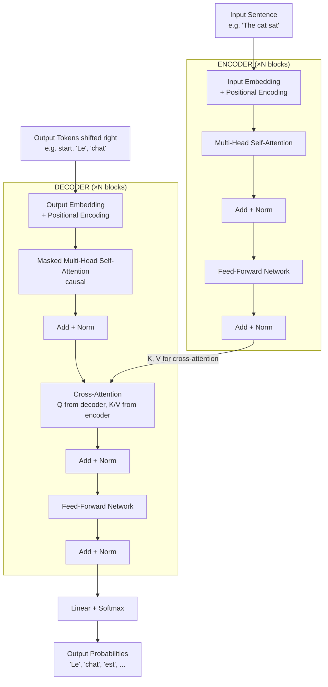
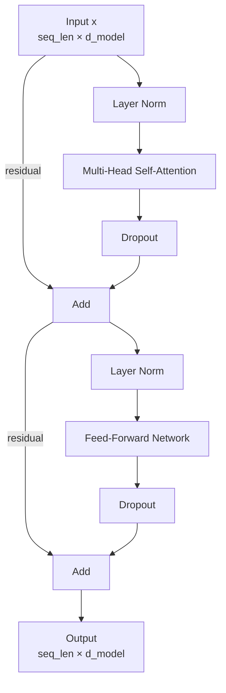
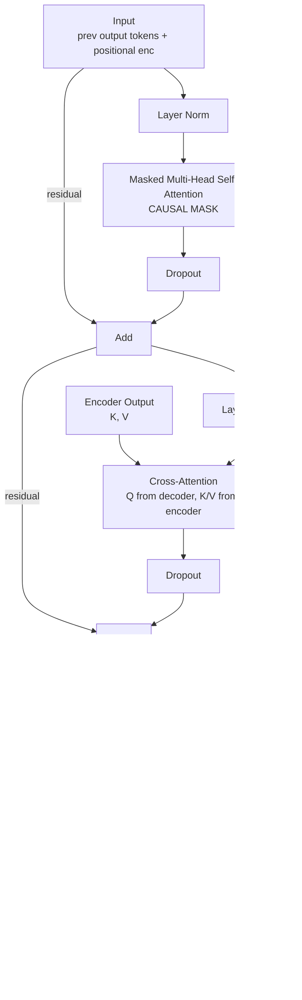

# Chapter 23: The Transformer Architecture — Attention Is All You Need

> **"The simple architecture that replaced everything. No convolutions. No recurrence. Just attention and feed-forward layers. And it scaled to become the foundation of modern AI."**

---

## Table of Contents
1. [The 2017 Paper That Changed AI](#1-the-2017-paper-that-changed-ai)
2. [Full Architecture Overview](#2-full-architecture-overview)
3. [Positional Encoding](#3-positional-encoding)
4. [The Encoder Block](#4-the-encoder-block)
5. [The Decoder Block](#5-the-decoder-block)
6. [Add and Norm — Residual Connections and Layer Normalization](#6-add-and-norm--residual-connections-and-layer-normalization)
7. [Hyperparameters and Scaling](#7-hyperparameters-and-scaling)
8. [Training the Original Transformer](#8-training-the-original-transformer)
9. [Encoder-Only vs Decoder-Only vs Encoder-Decoder](#9-encoder-only-vs-decoder-only-vs-encoder-decoder)
10. [PyTorch: Mini Transformer Encoder Block](#10-pytorch-mini-transformer-encoder-block)
11. [HuggingFace Transformers — Quick Start](#11-huggingface-transformers--quick-start)
12. [Summary](#12-summary)
13. [Exercises](#13-exercises)

---

## 1. The 2017 Paper That Changed AI

In June 2017, eight researchers at Google Brain and Google Research published a paper titled **"Attention Is All You Need"**. The authors: Ashish Vaswani, Noam Shazeer, Niki Parmar, Jakob Uszkoreit, Llion Jones, Aidan Gomez, Łukasz Kaiser, Illia Polosukhin.

The claim in the title was radical: you don't need recurrence, you don't need convolutions. Just attention mechanisms, repeated many times.

```
CONTEXT: What existed before (2017):

Translation state of the art:
  - LSTMs with attention
  - Convolutional Sequence Models (FairSeq)
  - These required O(n) sequential steps → slow to train

The Transformer's promise:
  - No sequential dependencies → fully parallelizable
  - Direct modeling of long-range dependencies
  - Simpler architecture → easier to scale

Results on WMT 2014 English-French translation:
  Previous SOTA:     ~41 BLEU (ensemble LSTMs)
  Transformer base:  38.1 BLEU (single model, 1/10th training cost)
  Transformer big:   41.0 BLEU (8 GPUs, 3.5 days)

The efficiency gain was as important as the quality gain.
Training that took weeks could now be done in days.
```

This paper spawned BERT (2018), GPT-2 (2019), T5 (2019), GPT-3 (2020), and ultimately ChatGPT (2022) and everything that followed.

---

## 2. Full Architecture Overview

The original Transformer was an encoder-decoder model designed for sequence-to-sequence tasks (translation). Here is the complete architecture:



Let's examine each component in depth.

---

## 3. Positional Encoding

### The Problem: Attention Is Permutation-Invariant

This is a subtle but critical issue. Consider the self-attention formula from Chapter 22:

```
Attention(Q,K,V) = softmax(QK^T / √d_k) · V
```

If you permute the input sequence (shuffle the word order), the attention weights change, but the output at each position is still a weighted combination of the same set of values. The model doesn't inherently know whether a word appeared at position 1 or position 5.

```
EXAMPLE — Permutation Invariance:

Sentence 1: "The cat sat on the mat"
Sentence 2: "mat the on sat cat The"

Without positional encoding:
  - Both sentences produce the same SET of Q, K, V vectors
  - Attention can match them in the same ways
  - The model treats them as the same "bag of words"
  
With positional encoding:
  - Each position gets a UNIQUE positional signal added
  - "The" at position 0 differs from "The" at position 5
  - Word order is captured
```

### Sinusoidal Positional Encoding

The original paper uses a fixed (not learned) sinusoidal encoding:

```
For position pos and dimension i:

PE(pos, 2i)   = sin(pos / 10000^(2i / d_model))
PE(pos, 2i+1) = cos(pos / 10000^(2i / d_model))

Where:
  pos     = position in the sequence (0, 1, 2, ...)
  i       = dimension index (0, 1, 2, ..., d_model/2 - 1)
  d_model = model dimension (e.g., 512)
```

Let's understand this intuitively:

```
SINUSOIDAL PE INTUITION:

For d_model=8, different wavelengths:

Dimension 0,1: sin/cos with frequency 1/1    → fast oscillation (high freq)
Dimension 2,3: sin/cos with frequency 1/100  → medium oscillation
Dimension 4,5: sin/cos with frequency 1/1000 → slow oscillation
Dimension 6,7: sin/cos with frequency 1/10000 → very slow oscillation

Think of it like a binary counter — different bit positions change at different rates:
  Position 0:  [1,0,1,0,1,0,1,0]
  Position 1:  [0,1,1,0,0,1,1,0]
  Position 2:  [0,0,0,1,1,1,0,0]
  Position 3:  [0,0,0,0,0,0,1,1]
  
Each position gets a UNIQUE combination of sin/cos values.

Visual (64 dimensions, 50 positions):
pos\dim  0  1  2  3  4  5  6  7  ... 62 63
  0    [ 0  1  0  1  0  1  0  1  ...  0  1 ]
  1    [.8 .5 .1 .9 .0  1  0  1  ...  0  1 ]
  2    [.9  0 .2 .9 .0  1  0  1  ...  0  1 ]
  ...
  49   [-.4 .9 .5 .8  0  1  0  1  ...  0  1 ]

High-frequency dimensions change rapidly with position.
Low-frequency dimensions barely change (slow trend).
```

### Why Sinusoidal? The Linear Transformation Property

The key mathematical property: **relative position can be expressed as a linear transformation**.

```
For any fixed offset k, PE(pos + k) = M_k · PE(pos)

Where M_k is a matrix depending only on k (not on pos).

This means: if the model learns about "2 positions apart" for one position,
that knowledge generalizes to ALL positions.

Proof sketch (for 2 dimensions):
  PE(pos, 0) = sin(pos · w)
  PE(pos, 1) = cos(pos · w)
  
  PE(pos+k, 0) = sin((pos+k)·w) = sin(pos·w)cos(k·w) + cos(pos·w)sin(k·w)
               = PE(pos,0)·cos(k·w) + PE(pos,1)·sin(k·w)
  
  This is a linear combination of PE(pos,0) and PE(pos,1)!
  → Can express PE(pos+k) as linear transform of PE(pos) ✓
```

### Addition to Embeddings

The positional encoding is **added** (not concatenated) to the token embedding:

```
x = token_embedding + positional_encoding

Both have shape (seq_len, d_model).
The sum carries both semantic and positional information.
```

### Learned Positional Embeddings

BERT and GPT use **learned** positional embeddings instead of sinusoidal:

```
SINUSOIDAL:
  Fixed formula, same for all models
  Pros: generalizes to longer sequences than seen in training
  Cons: fixed, can't adapt to data statistics

LEARNED:
  pos_embedding = nn.Embedding(max_seq_len, d_model)
  The embedding for each position is a learnable parameter
  
  Pros: can learn optimal positions for the data
  Cons: can't extrapolate beyond max_seq_len seen in training
  
  GPT-3 uses: max_seq_len = 2048, d_model = 12288
  BERT uses:  max_seq_len = 512, d_model = 768
```

### Rotary Position Embedding (RoPE)

Used in LLaMA, Mistral, Falcon, and most modern LLMs. A more elegant approach:

```
KEY IDEA: Instead of ADDING positional information to embeddings,
ROTATE Q and K vectors by a position-dependent angle.

For a 2D subspace at position pos:
  R(pos) = [[cos(pos·θ), -sin(pos·θ)],
            [sin(pos·θ),  cos(pos·θ)]]

For each pair of dimensions (2i, 2i+1):
  q_rotated[2i:2i+2] = R(pos · θ_i) · q[2i:2i+2]

Where θ_i = 1 / 10000^(2i/d_k)  (same frequency spacing as sinusoidal PE)

WHY THIS IS BETTER:
  - The dot product q_pos · k_pos' depends only on (pos - pos')
  - Relative position is naturally encoded in the attention scores
  - Extrapolates to longer sequences better than absolute PE
  - Can be combined with NTK scaling for context extension (YaRN)
```

| Encoding Type | Used By | Extrapolates | Notes |
|---------------|---------|--------------|-------|
| Sinusoidal (fixed) | Original Transformer | Yes (limited) | Not learned |
| Absolute learned | BERT, GPT-2 | No | Simple, effective |
| ALiBi (linear bias) | BLOOM, MPT | Yes | Add distance penalty |
| RoPE | LLaMA, Mistral, GPT-NeoX | With tricks | Current SOTA |

---

## 4. The Encoder Block

The encoder processes the input sequence and produces a rich contextual representation of each token.

### Structure of One Encoder Block



### Position-wise Feed-Forward Network (FFN)

After attention, each position passes through a two-layer FFN independently (hence "position-wise"):

```
FFN(x) = Linear(GELU(Linear(x, d_model → d_ff)), d_ff → d_model)

Original paper:
  FFN(x) = max(0, xW_1 + b_1)W_2 + b_2
  Uses ReLU, d_ff = 2048 (4× d_model=512)

Modern models:
  Uses GELU instead of ReLU (smoother, slightly better)
  d_ff = 4 × d_model (empirical, consistently works well)
  Some models use SwiGLU (chapter 30)

Shape transformation:
  Input:  (seq_len, d_model)     e.g., (512, 512)
  After W1: (seq_len, d_ff)      e.g., (512, 2048)  ← expand
  After W2: (seq_len, d_model)   e.g., (512, 512)   ← contract

WHY d_ff = 4 × d_model?
  Empirically found to be a good expansion ratio.
  The FFN acts as a "memory" — wider = more capacity to store patterns.
  Research shows FFN layers store factual knowledge (e.g., Paris is the capital of France).
  Attention handles "routing" of information; FFN handles "lookup" of facts.
```

### What the Encoder Learns

After training, encoder representations capture rich linguistic information:

```
Layer 1-2 (early):   Local syntactic patterns, morphology
Layer 3-5 (middle):  Syntactic dependencies, phrase structure
Layer 6+ (late):     Semantic relationships, coreference, named entities

Each token's representation incorporates context from ALL other tokens.
"Bank" in "river bank" vs "Bank of America" → different representations
despite same word embedding input.
```

---

## 5. The Decoder Block

The decoder generates output one token at a time, using both the encoder's context and previously generated tokens.

### Structure of One Decoder Block



### The Causal Mask

The decoder uses a **causal mask** (also called autoregressive mask) in its first attention layer. This prevents each position from attending to future positions:

```
CAUSAL MASK for seq_len=6:

Position: 0  1  2  3  4  5
          ↓  ↓  ↓  ↓  ↓  ↓
pos 0: [  1  0  0  0  0  0 ]  ← can only see position 0
pos 1: [  1  1  0  0  0  0 ]  ← can see 0,1
pos 2: [  1  1  1  0  0  0 ]  ← can see 0,1,2
pos 3: [  1  1  1  1  0  0 ]  ← can see 0,1,2,3
pos 4: [  1  1  1  1  1  0 ]
pos 5: [  1  1  1  1  1  1 ]  ← can see all previous positions

Lower triangular matrix of 1s.
Before softmax: 0 → replace with -inf → softmax(-inf) = 0 weight

In PyTorch:
  causal_mask = torch.tril(torch.ones(seq_len, seq_len))
  
  # In attention score computation:
  scores = scores.masked_fill(causal_mask == 0, float('-inf'))
  attn_weights = softmax(scores)  # -inf positions → 0 weight
```

WHY causal masking is essential: During training, we provide the decoder with the entire target sequence and compute the loss at all positions simultaneously (this is called teacher forcing — see Section 8). But at position t, we can't let the model "cheat" by looking at position t+1 or later. The causal mask enforces this constraint.

During inference (generation), we generate one token at a time anyway, so future tokens don't exist yet.

### Cross-Attention: Connecting Encoder and Decoder

The second attention layer in each decoder block is **cross-attention** (encoder-decoder attention):

```
CROSS-ATTENTION:

Query Q:     from decoder's current representation
             shape (batch, seq_decoder, d_model)

Key K:       from encoder's final output 
             shape (batch, seq_encoder, d_model)

Value V:     from encoder's final output
             shape (batch, seq_encoder, d_model)

Attention scores: Q · K^T → shape (seq_decoder, seq_encoder)

This is what allows the decoder to "look at" the source sentence.
Each output position can directly access any input position.

For seq_decoder=5 (output), seq_encoder=8 (input):
  Attention matrix shape: (5, 8)
  ← This IS the alignment matrix from Chapter 22!
  
The cross-attention mechanism IS Bahdanau attention,
reinterpreted in the QKV framework.
```

---

## 6. Add and Norm — Residual Connections and Layer Normalization

Every sublayer (attention and FFN) is wrapped with two operations: a residual (skip) connection and layer normalization.

### Residual Connections

```
OUTPUT = x + Sublayer(x)

Standard (Post-LN, original paper):
  output = LayerNorm(x + Sublayer(x))

Modern (Pre-LN, used by GPT-2, LLaMA):
  output = x + Sublayer(LayerNorm(x))
```

Why residuals work:

```
WITHOUT RESIDUALS — gradient flow through 12 layers:
  ∂L/∂x_0 = ∂L/∂x_12 · ∂x_12/∂x_11 · ... · ∂x_1/∂x_0
  
  Each ∂x_i/∂x_{i-1} = ∂Sublayer/∂x could be <1 → gradient shrinks
  After 12 layers: (0.9)^12 ≈ 0.28 → gradient mostly gone
  After 96 layers: (0.9)^96 ≈ 0.00008 → effectively zero!

WITH RESIDUALS:
  ∂L/∂x_0 = ∂L/∂x_12 · Π (1 + ∂Sublayer/∂x_i)
  
  The "+1" ensures gradient always has a direct path backward.
  Even if sublayer gradient is ~0, gradient still flows as identity (×1).
  
  This is the "gradient highway" — the residual stream provides
  an unobstructed path for gradients to flow from output to input.
```

### Layer Normalization

```
LAYER NORM:
  Given input x ∈ R^(d_model):
  
  μ = mean(x)     ← mean across d_model dimensions
  σ = std(x)      ← std across d_model dimensions
  
  x_norm = (x - μ) / (σ + ε)
  
  output = γ ⊙ x_norm + β     ← learned scale γ and shift β
  
  Parameters: γ ∈ R^d_model, β ∈ R^d_model

COMPARE TO BATCH NORM:
  Batch Norm: normalize across BATCH dimension
    - Depends on batch statistics → bad for small batches
    - Problematic for variable-length sequences
    - Doesn't work for inference with batch_size=1
  
  Layer Norm: normalize across FEATURE dimension
    - Each sample normalized independently
    - Works for any batch size, any sequence length
    - Consistent behavior between training and inference
    - Better for NLP where sequence lengths vary
```

### Pre-LN vs Post-LN

```
POST-LN (original paper):
  output = LayerNorm(x + Sublayer(x))
  
  Problem: gradients can explode early in training
  Requires careful learning rate warmup
  Less stable, needs more tuning

PRE-LN (modern standard):
  output = x + Sublayer(LayerNorm(x))
  
  Advantage: input to each sublayer is always normalized
  More stable training — can use higher learning rates
  Better performance with deep models (>12 layers)
  Used by: GPT-2, GPT-3, LLaMA, PaLM, everything modern
```

---

## 7. Hyperparameters and Scaling

### Key Hyperparameters

| Hyperparameter | Symbol | Description |
|----------------|--------|-------------|
| Model dimension | d_model | Token representation size |
| Number of heads | n_heads | Parallel attention heads |
| Number of layers | n_layers | Stacked transformer blocks |
| FFN dimension | d_ff | Inner FFN width (usually 4×d_model) |
| Context length | max_seq_len | Maximum sequence length |
| Vocabulary size | vocab_size | Number of unique tokens |
| Dropout rate | dropout | Regularization (0.1 typical) |

### The Original "Base" Transformer (2017)

```
Original Transformer (base model):
  d_model     = 512
  n_heads     = 8        → d_k = d_v = 512/8 = 64
  n_layers    = 6 (encoder) + 6 (decoder)
  d_ff        = 2048     (4 × d_model)
  dropout     = 0.1
  max_seq_len = 512
  vocab_size  = 37,000 (joint EN+DE BPE)
  
  Total parameters ≈ 65M
```

### Scaling to Modern Models

```
MODEL SCALING TABLE:
═══════════════════════════════════════════════════════════════════
Model          d_model  n_heads  n_layers  d_ff    Params   Year
───────────────────────────────────────────────────────────────────
Transformer    512      8        6+6       2048    65M      2017
BERT-base      768      12       12        3072    110M     2018
BERT-large     1024     16       24        4096    340M     2018
GPT-2 small    768      12       12        3072    117M     2019
GPT-2 large    1280     20       36        5120    774M     2019
GPT-3          12288    96       96        49152   175B     2020
PaLM           18432    48       118       73728   540B     2022
LLaMA-7B       4096     32       32        11008   6.7B     2023
LLaMA-70B      8192     64       80        28672   70B      2023
Mistral-7B     4096     32       32        14336   7.3B     2023
───────────────────────────────────────────────────────────────────
```

### Parameter Count Formula

```
PARAMETERS PER TRANSFORMER BLOCK:

Multi-Head Attention:
  W_q: d_model × d_model = d_model²
  W_k: d_model × d_model = d_model²
  W_v: d_model × d_model = d_model²
  W_o: d_model × d_model = d_model²
  Total MHA: 4 × d_model²

Feed-Forward Network:
  W_1: d_model × d_ff = d_model × 4·d_model = 4·d_model²
  W_2: d_ff × d_model = 4·d_model × d_model = 4·d_model²
  Total FFN: 8 × d_model²

Layer Norms (2 per block):
  2 × (γ + β) = 2 × 2 × d_model = 4·d_model  ← negligible

Per block: 12 × d_model² (approximately)

For N blocks:
  Total ≈ N × 12 × d_model²
  (plus embedding table: vocab_size × d_model)

EXAMPLE — BERT-base:
  N=12, d_model=768
  Transformer blocks: 12 × 12 × 768² ≈ 85M
  Embedding: 30k × 768 ≈ 23M
  Total ≈ 108M  ← matches reported 110M ✓

EXAMPLE — GPT-3:
  N=96, d_model=12288
  Transformer blocks: 96 × 12 × 12288² ≈ 173B
  Total ≈ 175B ✓
```

---

## 8. Training the Original Transformer

### Teacher Forcing

```
TEACHER FORCING during training:

Source: "The cat sat"
Target: "<start> Le chat était assis <end>"

At each decoder step, we feed the GROUND TRUTH previous token
(not the model's prediction) as input:

Step 1: Encoder encodes "The cat sat"
        Decoder receives: "<start>"
        Output: probability distribution over vocab
        Loss: -log P("Le" | encoder_out, "<start>")

Step 2: Decoder receives: "<start> Le" (ground truth, not prediction)
        Loss: -log P("chat" | encoder_out, "<start> Le")

Step 3: Decoder receives: "<start> Le chat"
        Loss: -log P("était" | ...)

...

TOTAL LOSS = sum of per-step cross-entropy losses

With the causal mask, we compute ALL steps in PARALLEL (no sequential)!
The mask prevents position t from seeing positions > t.
This is why the Transformer trains so much faster than RNNs.
```

### Label Smoothing

```
STANDARD CROSS-ENTROPY:
  Target: one-hot [0, 0, 1, 0, 0, ...]  (all mass on correct token)
  Loss: -log(P_model(correct))
  
  Problem: model is penalized until it's 100% confident
  → Overconfident predictions, poor calibration

LABEL SMOOTHING (ε = 0.1):
  Target: [0.1/V, 0.1/V, ..., 0.9 + 0.1/V, ..., 0.1/V]
  (95% on correct, 5% spread across all vocab)
  
  Smoother targets → less overconfidence
  Slight regularization effect
  Used in original Transformer: ε = 0.1
  Improved BLEU by ~0.5 points
```

### Learning Rate Schedule: Warmup + Decay

```
WARMUP + INVERSE SQUARE ROOT SCHEDULE:

lr = d_model^(-0.5) · min(step^(-0.5), step · warmup_steps^(-1.5))

PHASES:
  1. Warmup (steps < warmup_steps = 4000):
     lr increases linearly from 0
     Reason: at initialization, gradients are noisy and large
     Starting with high LR → divergence
     
  2. Decay (steps > warmup_steps):
     lr decreases as 1/√step
     
  Typical peak LR: ~1e-3 (reached at step 4000)

Why warmup is critical for Transformers:
  - Layer Norm parameters are initialized to 1,0 (identity)
  - At step 1, attention weights are near-uniform
  - A large LR at step 1 can catastrophically update all parameters
  - The warmup allows the model to "find its footing" first

LR schedule visualization:
  LR
  ▲
  │       /\
  │      /  ─────────────────\
  │     /                      ──────────────\
  │    /                                       ──────
  │   /
  │  /
  └──────────────────────────────────────────────────→ step
     0   4000
         ↑warmup
```

### Beam Search for Decoding

```
GREEDY DECODING:
  At each step, pick the single most probable token.
  Fast but suboptimal — local greedy choices lead to bad global sequences.

BEAM SEARCH (beam_width=4):
  Maintain TOP-4 most probable partial sequences at each step.
  Expand all 4 with all vocab tokens → 4×vocab candidates.
  Keep top 4 by cumulative log-probability.
  
  Example (beam_width=2):
  
  Step 0: Start tokens
    Beam: ["<start>"]
    
  Step 1: Expand "<start>"
    Top 2: [("<start> Le", -0.3), ("<start> Un", -1.2)]
  
  Step 2: Expand both
    From "Le": [("Le chat", -0.7), ("Le chien", -1.1)]
    From "Un": [("Un chat", -1.5), ("Un chien", -1.8)]
    Top 2 overall: [("Le chat", -0.7), ("Le chien", -1.1)]
  
  ...continue until <end> token...
  
  Final: pick sequence with highest total log-probability
  
  Beam search consistently outperforms greedy by ~2-3 BLEU.
```

---

## 9. Encoder-Only vs Decoder-Only vs Encoder-Decoder

The three architectural variants that emerged from the original Transformer:

```mermaid
flowchart TD
    subgraph EncOnly["1. ENCODER-ONLY (BERT-style)"]
        E1["Input tokens + Positional Enc"] --> E2["Encoder Block 1\nBidirectional Self-Attention"]
        E2 --> E3["Encoder Block 2 ... N"]
        E3 --> E4["Contextual Representations"]
        E4 --> E5["Task Head\nCLS→class, token→NER, QA pointers"]
    end

    subgraph DecOnly["2. DECODER-ONLY (GPT-style)"]
        D1["Input tokens + Positional Enc"] --> D2["Decoder Block 1\nCausal Masked Self-Attention"]
        D2 --> D3["Decoder Block 2 ... N"]
        D3 --> D4["Linear + Softmax"]
        D4 --> D5["Next token probability"]
    end

    subgraph EncDec["3. ENCODER-DECODER (T5-style)"]
        F1["Input"] --> F2["Encoder\nBidirectional self-attention"]
        F3["Target (shifted)"] --> F4["Decoder\nCausal attn + Cross-attn"]
        F2 -->|"K, V"| F4
        F4 --> F5["Output"]
    end
```



### Why Decoder-Only Won

```
THE DECODER-ONLY DOMINANCE:

2018-2019: Both architectures competitive
  BERT (encoder-only) dominated NLU benchmarks
  GPT-1/2 (decoder-only) showed promise in generation

2020-2022: Decoder-only surge
  GPT-3 (175B decoder-only) showed emergent capabilities
  In-context learning works with decoder-only
  Fine-tuning decoder-only easier (just language modeling loss)

WHY DECODER-ONLY WON:

1. UNIFICATION: One model does everything
   Encoder-only: good at understanding
   Decoder-only: can do understanding AND generation
   With instruction tuning (RLHF): decoder-only matches encoder for classification too
   
2. SIMPLER TRAINING:
   Pre-training: just predict next token (same objective for everything)
   Encoder-decoder needs two objectives or complex seq2seq training
   
3. SCALES BETTER:
   Decoder-only at 100B+ params shows emergent capabilities
   Encoder-only has diminishing returns after ~1B params
   
4. IN-CONTEXT LEARNING:
   GPT-3 can learn from examples in the prompt
   Encoder-only BERT cannot do in-context learning
   
5. CHAT INTERFACE:
   User: "What is 2+2?" → append to context → generate response
   Natural conversational interface with decoder-only

The endgame: decoder-only models with instruction tuning (RLHF/DPO)
can do everything BERT does AND generate fluent text.
```

---

## 10. PyTorch: Mini Transformer Encoder Block

Here is a complete, runnable implementation of a mini Transformer encoder:

```python
"""
Complete Mini Transformer Encoder Block in PyTorch.
Includes: Multi-Head Attention, FFN, Residual, LayerNorm.
Can stack multiple blocks to form a full encoder.
"""

import math
import torch
import torch.nn as nn
import torch.nn.functional as F
from dataclasses import dataclass
from typing import Optional


@dataclass
class TransformerConfig:
    """Configuration for a Transformer encoder."""
    vocab_size: int = 30000
    d_model: int = 256        # embedding dimension
    n_heads: int = 8          # number of attention heads
    n_layers: int = 4         # number of encoder blocks
    d_ff: int = 1024          # FFN inner dimension (4 × d_model)
    max_seq_len: int = 512    # maximum sequence length
    dropout: float = 0.1
    
    def __post_init__(self):
        assert self.d_model % self.n_heads == 0, "d_model must be divisible by n_heads"
        self.d_k = self.d_model // self.n_heads


class MultiHeadSelfAttention(nn.Module):
    """Multi-head self-attention with optional causal masking."""
    
    def __init__(self, config: TransformerConfig):
        super().__init__()
        self.n_heads = config.n_heads
        self.d_k = config.d_k
        self.d_model = config.d_model
        
        # Single matrix for all Q, K, V projections (more efficient)
        self.qkv_proj = nn.Linear(config.d_model, 3 * config.d_model, bias=False)
        self.out_proj = nn.Linear(config.d_model, config.d_model, bias=False)
        self.attn_dropout = nn.Dropout(config.dropout)
        self.resid_dropout = nn.Dropout(config.dropout)
        
    def forward(
        self,
        x: torch.Tensor,              # (batch, seq, d_model)
        mask: Optional[torch.Tensor] = None,  # (batch, 1, seq, seq) or None
    ) -> torch.Tensor:
        B, T, C = x.shape  # batch, seq_len, d_model
        
        # Compute Q, K, V in one matrix multiply (3× speedup vs separate)
        qkv = self.qkv_proj(x)  # (B, T, 3*d_model)
        
        # Split into Q, K, V
        q, k, v = qkv.chunk(3, dim=-1)  # each: (B, T, d_model)
        
        # Reshape to (B, n_heads, T, d_k)
        def reshape_for_heads(t):
            return t.view(B, T, self.n_heads, self.d_k).transpose(1, 2)
        
        q, k, v = reshape_for_heads(q), reshape_for_heads(k), reshape_for_heads(v)
        
        # Scaled dot-product attention
        scale = math.sqrt(self.d_k)
        attn_scores = torch.matmul(q, k.transpose(-2, -1)) / scale  # (B, H, T, T)
        
        if mask is not None:
            attn_scores = attn_scores.masked_fill(mask == 0, float('-inf'))
        
        attn_weights = F.softmax(attn_scores, dim=-1)
        attn_weights = torch.nan_to_num(attn_weights, nan=0.0)  # handle fully masked rows
        attn_weights = self.attn_dropout(attn_weights)
        
        # Weighted sum of values
        out = torch.matmul(attn_weights, v)  # (B, H, T, d_k)
        
        # Reassemble heads
        out = out.transpose(1, 2).contiguous().view(B, T, C)  # (B, T, d_model)
        out = self.resid_dropout(self.out_proj(out))
        
        return out


class FeedForwardNetwork(nn.Module):
    """Position-wise Feed-Forward Network."""
    
    def __init__(self, config: TransformerConfig):
        super().__init__()
        self.net = nn.Sequential(
            nn.Linear(config.d_model, config.d_ff),
            nn.GELU(),             # smooth ReLU, slightly better empirically
            nn.Dropout(config.dropout),
            nn.Linear(config.d_ff, config.d_model),
            nn.Dropout(config.dropout),
        )
    
    def forward(self, x: torch.Tensor) -> torch.Tensor:
        return self.net(x)


class EncoderBlock(nn.Module):
    """Single Transformer Encoder Block.
    
    Architecture (Pre-LN — modern standard):
      output = x + Attention(LayerNorm(x))
      output = output + FFN(LayerNorm(output))
    """
    
    def __init__(self, config: TransformerConfig):
        super().__init__()
        self.norm1 = nn.LayerNorm(config.d_model)
        self.attn = MultiHeadSelfAttention(config)
        self.norm2 = nn.LayerNorm(config.d_model)
        self.ffn = FeedForwardNetwork(config)
    
    def forward(
        self,
        x: torch.Tensor,
        mask: Optional[torch.Tensor] = None,
    ) -> torch.Tensor:
        # Sublayer 1: Multi-Head Self-Attention (Pre-LN + Residual)
        x = x + self.attn(self.norm1(x), mask=mask)
        
        # Sublayer 2: Feed-Forward Network (Pre-LN + Residual)
        x = x + self.ffn(self.norm2(x))
        
        return x


class SinusoidalPositionalEncoding(nn.Module):
    """Fixed sinusoidal positional encoding (original Transformer)."""
    
    def __init__(self, config: TransformerConfig):
        super().__init__()
        
        # Pre-compute all positional encodings
        pe = torch.zeros(config.max_seq_len, config.d_model)
        position = torch.arange(config.max_seq_len).unsqueeze(1).float()  # (max_len, 1)
        
        # Frequency terms: 1/10000^(2i/d_model)
        div_term = torch.exp(
            torch.arange(0, config.d_model, 2).float() *
            (-math.log(10000.0) / config.d_model)
        )
        
        pe[:, 0::2] = torch.sin(position * div_term)   # even dimensions: sin
        pe[:, 1::2] = torch.cos(position * div_term)   # odd dimensions: cos
        
        pe = pe.unsqueeze(0)  # (1, max_seq_len, d_model) — batch dimension
        self.register_buffer('pe', pe)  # not a parameter, saved with model
    
    def forward(self, x: torch.Tensor) -> torch.Tensor:
        """x: (batch, seq_len, d_model)"""
        seq_len = x.size(1)
        return x + self.pe[:, :seq_len, :]


class TransformerEncoder(nn.Module):
    """Full Transformer Encoder: Embedding + PE + N × EncoderBlock."""
    
    def __init__(self, config: TransformerConfig):
        super().__init__()
        self.config = config
        
        # Token embedding
        self.token_emb = nn.Embedding(config.vocab_size, config.d_model)
        
        # Positional encoding
        self.pos_enc = SinusoidalPositionalEncoding(config)
        
        self.dropout = nn.Dropout(config.dropout)
        
        # Stack of encoder blocks
        self.blocks = nn.ModuleList([
            EncoderBlock(config) for _ in range(config.n_layers)
        ])
        
        # Final layer norm (Pre-LN style)
        self.final_norm = nn.LayerNorm(config.d_model)
        
        # Initialize weights
        self._init_weights()
    
    def _init_weights(self):
        """Initialize weights following the original Transformer paper."""
        for module in self.modules():
            if isinstance(module, nn.Linear):
                nn.init.xavier_uniform_(module.weight)
                if module.bias is not None:
                    nn.init.zeros_(module.bias)
            elif isinstance(module, nn.Embedding):
                nn.init.normal_(module.weight, mean=0, std=0.02)
            elif isinstance(module, nn.LayerNorm):
                nn.init.ones_(module.weight)
                nn.init.zeros_(module.bias)
    
    def forward(
        self,
        input_ids: torch.Tensor,         # (batch, seq_len)
        attention_mask: Optional[torch.Tensor] = None,  # (batch, seq_len), 1=real, 0=pad
    ) -> torch.Tensor:
        B, T = input_ids.shape
        assert T <= self.config.max_seq_len, f"Sequence length {T} exceeds maximum {self.config.max_seq_len}"
        
        # 1. Token embeddings
        x = self.token_emb(input_ids)  # (B, T, d_model)
        
        # Scale embeddings (original paper: multiply by √d_model)
        x = x * math.sqrt(self.config.d_model)
        
        # 2. Add positional encoding
        x = self.pos_enc(x)
        x = self.dropout(x)
        
        # 3. Convert padding mask to attention mask
        if attention_mask is not None:
            # attention_mask: (B, T) → (B, 1, 1, T) for broadcasting
            # 0 in attention_mask means PADDING → should NOT be attended to
            attn_mask = attention_mask.unsqueeze(1).unsqueeze(2)
        else:
            attn_mask = None
        
        # 4. Pass through encoder blocks
        for block in self.blocks:
            x = block(x, mask=attn_mask)
        
        # 5. Final normalization
        x = self.final_norm(x)
        
        return x  # (B, T, d_model)
    
    def count_parameters(self) -> int:
        return sum(p.numel() for p in self.parameters() if p.requires_grad)


# ── Text Classification Head ────────────────────────────────────────────────────

class TransformerForClassification(nn.Module):
    """Transformer encoder + classification head (BERT-style)."""
    
    def __init__(self, config: TransformerConfig, num_classes: int):
        super().__init__()
        self.encoder = TransformerEncoder(config)
        
        # Classification head: [CLS] token → num_classes
        self.classifier = nn.Sequential(
            nn.Linear(config.d_model, config.d_model),
            nn.GELU(),
            nn.Dropout(config.dropout),
            nn.Linear(config.d_model, num_classes),
        )
    
    def forward(
        self,
        input_ids: torch.Tensor,
        attention_mask: Optional[torch.Tensor] = None,
    ) -> torch.Tensor:
        # Get encoder representations
        encoded = self.encoder(input_ids, attention_mask)  # (B, T, d_model)
        
        # Use first token ([CLS]) representation for classification
        cls_rep = encoded[:, 0, :]  # (B, d_model)
        
        logits = self.classifier(cls_rep)  # (B, num_classes)
        return logits


# ── Demo ─────────────────────────────────────────────────────────────────────────

def run_demo():
    torch.manual_seed(42)
    
    # Small config for demonstration
    config = TransformerConfig(
        vocab_size=1000,
        d_model=64,
        n_heads=4,
        n_layers=3,
        d_ff=256,
        max_seq_len=128,
        dropout=0.1,
    )
    
    print("=" * 60)
    print("TRANSFORMER ENCODER DEMO")
    print("=" * 60)
    print(f"Config: d_model={config.d_model}, n_heads={config.n_heads}, "
          f"n_layers={config.n_layers}, d_ff={config.d_ff}")
    
    # Build encoder
    encoder = TransformerEncoder(config)
    num_params = encoder.count_parameters()
    print(f"\nTotal parameters: {num_params:,}")
    print(f"Expected ≈ {config.n_layers} × 12 × {config.d_model}² = "
          f"{config.n_layers * 12 * config.d_model**2:,}")
    
    # Simulate tokenized input batch
    batch_size = 2
    seq_len = 16
    input_ids = torch.randint(0, config.vocab_size, (batch_size, seq_len))
    
    # Padding mask: first sequence is full, second has 3 padding tokens
    attention_mask = torch.ones(batch_size, seq_len, dtype=torch.long)
    attention_mask[1, -3:] = 0  # last 3 tokens are padding
    
    print(f"\nInput shape: {input_ids.shape}")
    print(f"Attention mask shape: {attention_mask.shape}")
    print(f"Padding mask (seq 2): {attention_mask[1].tolist()}")
    
    # Forward pass
    with torch.no_grad():
        output = encoder(input_ids, attention_mask)
    
    print(f"\nOutput shape: {output.shape}")
    print(f"Expected: ({batch_size}, {seq_len}, {config.d_model}) ✓")
    
    # Classification demo
    print("\n" + "=" * 60)
    print("CLASSIFICATION HEAD DEMO (3 sentiment classes)")
    print("=" * 60)
    
    classifier = TransformerForClassification(config, num_classes=3)
    
    with torch.no_grad():
        logits = classifier(input_ids, attention_mask)
    
    probs = F.softmax(logits, dim=-1)
    print(f"Logits shape: {logits.shape}")
    print(f"Class probabilities (untrained):")
    for i in range(batch_size):
        print(f"  Sample {i}: {probs[i].numpy().round(3)}")
    
    # Positional encoding visualization
    print("\n" + "=" * 60)
    print("POSITIONAL ENCODING VISUALIZATION")
    print("=" * 60)
    
    pe_layer = SinusoidalPositionalEncoding(config)
    pe_values = pe_layer.pe[0, :10, :8].numpy()  # first 10 positions, first 8 dims
    
    print("PE values (first 10 positions, first 8 dimensions):")
    print(f"{'pos':>4}", end="")
    for d in range(8):
        print(f"  dim{d}", end="")
    print()
    
    for pos in range(10):
        print(f"{pos:>4}", end="")
        for d in range(8):
            print(f"  {pe_values[pos, d]:+.2f}", end="")
        print()


if __name__ == "__main__":
    run_demo()
```

---

## 11. HuggingFace Transformers — Quick Start

HuggingFace provides pre-trained models for immediate use. Here's how to use the library:

```python
"""
HuggingFace Transformers — Key Patterns
No need to implement from scratch for production use.
"""

from transformers import (
    AutoTokenizer,
    AutoModel,
    AutoModelForSequenceClassification,
    pipeline,
    BertTokenizer,
    BertModel,
)
import torch

# ── 1. The pipeline() API — simplest interface ───────────────────────────────

# Text classification (sentiment analysis)
classifier = pipeline("sentiment-analysis", 
                       model="distilbert-base-uncased-finetuned-sst-2-english")
result = classifier("I love this new transformer architecture!")
print(result)  # [{'label': 'POSITIVE', 'score': 0.9998}]

# Named Entity Recognition
ner = pipeline("ner", aggregation_strategy="simple")
entities = ner("Elon Musk founded Tesla in California.")
for entity in entities:
    print(f"  {entity['word']:20} → {entity['entity_group']} ({entity['score']:.3f})")

# Text generation (GPT-2)
generator = pipeline("text-generation", model="gpt2")
outputs = generator(
    "The transformer architecture was designed to",
    max_new_tokens=50,
    num_return_sequences=2,
    temperature=0.8,
    do_sample=True,
)
for i, out in enumerate(outputs):
    print(f"\nGeneration {i+1}:\n  {out['generated_text']}")


# ── 2. Tokenizer ─────────────────────────────────────────────────────────────

tokenizer = AutoTokenizer.from_pretrained("bert-base-uncased")

# Tokenize a sentence
text = "The quick brown fox jumps over the lazy dog"
tokens = tokenizer(text, return_tensors="pt")
print("\nTokenized input:")
print("  input_ids:", tokens["input_ids"][0].tolist())
print("  tokens:   ", tokenizer.convert_ids_to_tokens(tokens["input_ids"][0]))
print("  attention_mask:", tokens["attention_mask"][0].tolist())
# BERT adds [CLS] at start and [SEP] at end

# Batch tokenization with padding
texts = [
    "Hello world",
    "This is a much longer sentence that needs padding",
    "Short text",
]
batch = tokenizer(texts, padding=True, truncation=True, 
                  max_length=64, return_tensors="pt")
print(f"\nBatch shapes:")
print(f"  input_ids: {batch['input_ids'].shape}")  # (3, padded_len)
print(f"  attention_mask: {batch['attention_mask'].shape}")


# ── 3. Model — getting embeddings ────────────────────────────────────────────

model = AutoModel.from_pretrained("bert-base-uncased")
model.eval()

with torch.no_grad():
    outputs = model(**batch)

# Last hidden states: contextual embeddings for each token
hidden_states = outputs.last_hidden_state
print(f"\nHidden states shape: {hidden_states.shape}")
# (batch_size, seq_len, hidden_size) → (3, padded_len, 768)

# [CLS] embedding for sentence-level representation
cls_embeddings = hidden_states[:, 0, :]  # first token = [CLS]
print(f"[CLS] embedding shape: {cls_embeddings.shape}")  # (3, 768)

# Mean pooling (better than [CLS] for similarity tasks)
# Need to mask out padding tokens
attention_mask = batch["attention_mask"]
mask_expanded = attention_mask.unsqueeze(-1).float()  # (batch, seq, 1)
sum_embeddings = (hidden_states * mask_expanded).sum(dim=1)  # (batch, 768)
sum_mask = mask_expanded.sum(dim=1).clamp(min=1e-9)          # (batch, 1)
mean_embeddings = sum_embeddings / sum_mask                  # (batch, 768)
print(f"Mean-pooled embedding shape: {mean_embeddings.shape}")


# ── 4. Fine-tuned classification model ───────────────────────────────────────

# Load pre-trained model for sentiment (already fine-tuned on SST-2)
sentiment_model = AutoModelForSequenceClassification.from_pretrained(
    "distilbert-base-uncased-finetuned-sst-2-english"
)

tokenizer_sentiment = AutoTokenizer.from_pretrained(
    "distilbert-base-uncased-finetuned-sst-2-english"
)

texts_to_classify = [
    "This movie was absolutely amazing!",
    "I didn't enjoy this at all, terrible experience.",
    "It was okay, nothing special.",
]

inputs = tokenizer_sentiment(texts_to_classify, padding=True, 
                              truncation=True, return_tensors="pt")

sentiment_model.eval()
with torch.no_grad():
    logits = sentiment_model(**inputs).logits

probs = torch.softmax(logits, dim=-1)
label_names = ["NEGATIVE", "POSITIVE"]

print("\nSentiment Analysis:")
for text, prob in zip(texts_to_classify, probs):
    pred = label_names[prob.argmax()]
    conf = prob.max().item()
    print(f"  [{pred} {conf:.3f}] {text[:50]}")


# ── 5. Generating text with GPT-2 ────────────────────────────────────────────

from transformers import GPT2LMHeadModel, GPT2Tokenizer

gpt2_tokenizer = GPT2Tokenizer.from_pretrained("gpt2")
gpt2_model = GPT2LMHeadModel.from_pretrained("gpt2")
gpt2_model.eval()

prompt = "Transformers are powerful neural network architectures that"
input_ids = gpt2_tokenizer.encode(prompt, return_tensors="pt")

# Generate with nucleus sampling
with torch.no_grad():
    output_ids = gpt2_model.generate(
        input_ids,
        max_new_tokens=50,
        do_sample=True,
        top_p=0.9,
        temperature=0.8,
        repetition_penalty=1.2,
        pad_token_id=gpt2_tokenizer.eos_token_id,
    )

generated_text = gpt2_tokenizer.decode(output_ids[0], skip_special_tokens=True)
print(f"\nGPT-2 Generation:\n  {generated_text}")
```

---

## 12. Summary

```
THE TRANSFORMER AT A GLANCE:
═══════════════════════════════════════════════════════════════════

INPUT: tokens → Embedding + Positional Encoding → Dropout

ENCODER (N times):
  x = x + MultiHeadSelfAttention(LayerNorm(x))
  x = x + FFN(LayerNorm(x))
  FFN: Linear(d_model → 4d) → GELU → Linear(4d → d_model)

DECODER (N times, for encoder-decoder only):
  x = x + MaskedSelfAttention(LayerNorm(x))    ← causal mask
  x = x + CrossAttention(LayerNorm(x), encoder_out)
  x = x + FFN(LayerNorm(x))

OUTPUT: Final LayerNorm → Linear → Softmax

KEY DESIGN PRINCIPLES:
  1. Residual connections: gradient highway through depth
  2. Layer normalization: stable activations
  3. Attention: O(1) path between any two positions
  4. Position-wise FFN: "memory" for storing factual knowledge
  5. No recurrence → fully parallelizable training
═══════════════════════════════════════════════════════════════════
```

### Architecture Comparison Table

| Feature | Encoder-Only | Decoder-Only | Encoder-Decoder |
|---------|-------------|--------------|-----------------|
| Examples | BERT, RoBERTa | GPT, LLaMA | T5, BART, original Transformer |
| Attention | Bidirectional | Causal (left-only) | Bidir. enc + Causal dec |
| Pre-training | MLM | Next token pred | Seq-to-seq |
| Best for | Classification, NER, QA | Generation, chat | Translation, summarization |
| Current status | Less popular | Dominant | Niche |

---

## Mini Projects

### Mini Project 1: Attention Visualizer

Build a Transformer encoder and visualize the attention patterns — see which tokens attend to which.

**Objective:** Open the transformer black box and see what "attention" actually looks like in practice.

```python
import torch
import torch.nn as nn
import numpy as np
import matplotlib.pyplot as plt
import math

class MultiHeadAttentionWithWeights(nn.Module):
    def __init__(self, d_model, n_heads):
        super().__init__()
        assert d_model % n_heads == 0
        self.d_model = d_model
        self.n_heads = n_heads
        self.d_k = d_model // n_heads
        self.W_q = nn.Linear(d_model, d_model)
        self.W_k = nn.Linear(d_model, d_model)
        self.W_v = nn.Linear(d_model, d_model)
        self.W_o = nn.Linear(d_model, d_model)
        self.last_attn_weights = None  # for visualization

    def forward(self, x, mask=None):
        B, T, D = x.shape
        Q = self.W_q(x).view(B, T, self.n_heads, self.d_k).transpose(1, 2)
        K = self.W_k(x).view(B, T, self.n_heads, self.d_k).transpose(1, 2)
        V = self.W_v(x).view(B, T, self.n_heads, self.d_k).transpose(1, 2)
        scores = Q @ K.transpose(-2, -1) / math.sqrt(self.d_k)
        if mask is not None:
            scores = scores.masked_fill(mask == 0, -1e9)
        attn = torch.softmax(scores, dim=-1)
        self.last_attn_weights = attn.detach()  # (B, n_heads, T, T)
        out = (attn @ V).transpose(1, 2).contiguous().view(B, T, D)
        return self.W_o(out)

class TransformerBlock(nn.Module):
    def __init__(self, d_model, n_heads, ff_dim, dropout=0.1):
        super().__init__()
        self.attn = MultiHeadAttentionWithWeights(d_model, n_heads)
        self.ff   = nn.Sequential(
            nn.Linear(d_model, ff_dim), nn.ReLU(), nn.Linear(ff_dim, d_model)
        )
        self.ln1 = nn.LayerNorm(d_model)
        self.ln2 = nn.LayerNorm(d_model)
        self.drop = nn.Dropout(dropout)

    def forward(self, x, mask=None):
        # Pre-LN, matching this chapter's "modern standard" guidance above
        # (and Chapter 25/28's TinyGPT) — normalize before each sublayer.
        x = x + self.drop(self.attn(self.ln1(x), mask))
        x = x + self.drop(self.ff(self.ln2(x)))
        return x

class TransformerEncoder(nn.Module):
    def __init__(self, vocab_size, d_model=64, n_heads=4, ff_dim=128, n_layers=2, max_len=50):
        super().__init__()
        self.embed = nn.Embedding(vocab_size, d_model)
        self.pos_embed = nn.Embedding(max_len, d_model)
        self.blocks = nn.ModuleList([
            TransformerBlock(d_model, n_heads, ff_dim) for _ in range(n_layers)
        ])
        self.head = nn.Linear(d_model, vocab_size)

    def forward(self, x):
        B, T = x.shape
        pos = torch.arange(T, device=x.device).unsqueeze(0).expand(B, -1)
        h = self.embed(x) + self.pos_embed(pos)
        for block in self.blocks:
            h = block(h)
        return self.head(h)

    def get_attention_weights(self, layer=0):
        return self.blocks[layer].attn.last_attn_weights

# Simple vocabulary
sentences = [
    "the cat sat on the mat",
    "the dog ran in the park",
    "attention is all you need",
    "the quick brown fox jumps",
]
words = sorted(set(' '.join(sentences).split()))
w2i = {w: i+1 for i, w in enumerate(words)}
w2i['<pad>'] = 0
i2w = {v: k for k, v in w2i.items()}
VOCAB = len(w2i)

def encode(sentence, max_len=8):
    tokens = [w2i.get(w, 0) for w in sentence.split()]
    tokens = tokens[:max_len] + [0] * max(0, max_len - len(tokens))
    return tokens

# Train briefly on next-token prediction
all_encoded = [encode(s) for s in sentences * 20]
X = torch.LongTensor([s[:-1] for s in all_encoded])  # input
y = torch.LongTensor([s[1:]  for s in all_encoded])  # target

torch.manual_seed(42)
model = TransformerEncoder(VOCAB, d_model=32, n_heads=4, ff_dim=64, n_layers=2)
opt   = torch.optim.Adam(model.parameters(), lr=0.005)
crit  = nn.CrossEntropyLoss(ignore_index=0)

for step in range(200):
    opt.zero_grad()
    logits = model(X)
    loss = crit(logits.view(-1, VOCAB), y.view(-1))
    loss.backward(); opt.step()

print(f"Training loss: {loss.item():.4f}")

# Visualize attention patterns
test_sentences = sentences[:4]
fig, axes = plt.subplots(2, 4, figsize=(18, 9))
fig.suptitle("Transformer Attention Weights: Layer 0 (top) vs Layer 1 (bottom)",
             fontsize=13, fontweight='bold')

model.eval()
for col, sent in enumerate(test_sentences):
    tokens_enc = encode(sent, max_len=7)
    tokens_words = sent.split()[:7]
    x_in = torch.LongTensor([tokens_enc])

    with torch.no_grad():
        _ = model(x_in)

    for layer_idx in range(2):
        attn_weights = model.get_attention_weights(layer_idx)  # (1, n_heads, T, T)
        # Average over heads
        avg_attn = attn_weights[0].mean(0).numpy()  # (T, T)
        n_real = len(tokens_words)
        avg_attn = avg_attn[:n_real, :n_real]

        ax = axes[layer_idx, col]
        im = ax.imshow(avg_attn, cmap='Blues', vmin=0, vmax=avg_attn.max())
        ax.set_xticks(range(n_real))
        ax.set_yticks(range(n_real))
        ax.set_xticklabels(tokens_words, rotation=45, ha='right', fontsize=8)
        ax.set_yticklabels(tokens_words, fontsize=8)
        if layer_idx == 0:
            ax.set_title(f'"{" ".join(tokens_words[:4])}..."\nLayer {layer_idx+1}', fontsize=8)
        else:
            ax.set_title(f'Layer {layer_idx+1}', fontsize=8)
        plt.colorbar(im, ax=ax, shrink=0.6)

        # Add values in cells
        for i in range(n_real):
            for j in range(n_real):
                ax.text(j, i, f'{avg_attn[i,j]:.2f}', ha='center', va='center',
                        fontsize=6, color='black' if avg_attn[i,j] < 0.5 else 'white')

plt.tight_layout()
plt.savefig("attention_visualization.png", dpi=150)
plt.show()
print("Saved: attention_visualization.png")
```

---

### Mini Project 2: Positional Encoding Deep Dive

Visualize and compare sinusoidal vs learned positional encodings — understand why position matters.

**Objective:** Understand what transformers "know" about position without recurrence.

```python
import torch
import torch.nn as nn
import numpy as np
import matplotlib.pyplot as plt

def sinusoidal_pe(max_len, d_model):
    pe = np.zeros((max_len, d_model))
    pos = np.arange(max_len).reshape(-1, 1)
    div = np.exp(np.arange(0, d_model, 2) * (-np.log(10000.0) / d_model))
    pe[:, 0::2] = np.sin(pos * div)
    pe[:, 1::2] = np.cos(pos * div[:d_model//2])
    return pe

max_len = 50; d_model = 64
pe = sinusoidal_pe(max_len, d_model)

fig, axes = plt.subplots(2, 3, figsize=(16, 9))
fig.suptitle("Positional Encoding Analysis", fontsize=14, fontweight='bold')

# Heatmap of PE matrix
im = axes[0, 0].imshow(pe, aspect='auto', cmap='RdBu_r')
axes[0, 0].set_title("Sinusoidal PE Matrix\n(rows=positions, cols=dimensions)")
axes[0, 0].set_xlabel("Dimension"); axes[0, 0].set_ylabel("Position")
plt.colorbar(im, ax=axes[0, 0])

# Individual dimensions
dims_to_show = [0, 1, 4, 10, 20, 40]
for dim in dims_to_show:
    axes[0, 1].plot(range(max_len), pe[:, dim], linewidth=1.5, label=f'dim {dim}', alpha=0.8)
axes[0, 1].set_title("PE Values by Dimension\n(each dim = different frequency)")
axes[0, 1].set_xlabel("Position"); axes[0, 1].legend(fontsize=7, ncol=2); axes[0, 1].grid(True, alpha=0.3)

# Cosine similarity between positions (proves position encoding is unique per position)
sim = pe @ pe.T  # (max_len, max_len)
norms = np.linalg.norm(pe, axis=1, keepdims=True)
sim_norm = sim / (norms * norms.T + 1e-8)
im2 = axes[0, 2].imshow(sim_norm, cmap='viridis')
axes[0, 2].set_title("Position Similarity Matrix\n(diagonal=1, nearby positions similar)")
axes[0, 2].set_xlabel("Position"); axes[0, 2].set_ylabel("Position")
plt.colorbar(im2, ax=axes[0, 2])

# Distance between positions
distances = []
for i in range(max_len):
    row = []
    for j in range(max_len):
        row.append(np.linalg.norm(pe[i] - pe[j]))
    distances.append(row)
distances = np.array(distances)
im3 = axes[1, 0].imshow(distances, cmap='plasma')
axes[1, 0].set_title("L2 Distance Between Positions\n(nearby = darker)")
axes[1, 0].set_xlabel("Position"); axes[1, 0].set_ylabel("Position")
plt.colorbar(im3, ax=axes[1, 0])

# Learned PE vs sinusoidal PE
torch.manual_seed(42)
learned_pe = nn.Embedding(max_len, d_model)
nn.init.normal_(learned_pe.weight, std=0.02)
learned_vals = learned_pe.weight.detach().numpy()

pos_ids = torch.arange(max_len)
axes[1, 1].plot(range(max_len), pe[:, 0],          'b-', label='Sinusoidal dim 0', linewidth=2)
axes[1, 1].plot(range(max_len), pe[:, 1],          'b--', label='Sinusoidal dim 1', linewidth=2)
axes[1, 1].plot(range(max_len), learned_vals[:, 0], 'r-', label='Learned dim 0', linewidth=2)
axes[1, 1].plot(range(max_len), learned_vals[:, 1], 'r--', label='Learned dim 1', linewidth=2)
axes[1, 1].set_title("Sinusoidal vs Learned PE\n(before training — learned is random noise)")
axes[1, 1].legend(fontsize=7); axes[1, 1].grid(True, alpha=0.3)
axes[1, 1].set_xlabel("Position")

# PE contribution vs token embedding
axes[1, 2].axis('off')
notes = ("Key Insights:\n\n"
         "1. Sinusoidal PE:\n"
         "   • Each dim = sine/cosine at a different frequency\n"
         "   • Low dims: low frequency (slow change)\n"
         "   • High dims: high frequency (fast change)\n"
         "   • Nearby positions have similar encodings\n"
         "   • Works for sequences longer than training (extrapolates)\n\n"
         "2. Learned PE:\n"
         "   • Initialized randomly, trained end-to-end\n"
         "   • Can learn task-specific position patterns\n"
         "   • Cannot extrapolate beyond training length\n"
         "   • Used in: BERT, GPT-2\n\n"
         "3. Modern alternatives:\n"
         "   • RoPE (Rotary PE): used in LLaMA, Mistral\n"
         "   • ALiBi: attention with linear biases\n"
         "   • Both extrapolate better than learned PE")
axes[1, 2].text(0.05, 0.95, notes, transform=axes[1, 2].transAxes, fontsize=8,
                va='top', fontfamily='monospace',
                bbox=dict(boxstyle='round', facecolor='lightyellow', alpha=0.8))
axes[1, 2].set_title("Positional Encoding Notes")

plt.tight_layout()
plt.savefig("positional_encoding.png", dpi=150)
plt.show()
print("Saved: positional_encoding.png")
```

---

## 13. Exercises

**Exercise 1**: Modify the `TransformerEncoder` class to output the attention weights from all layers. Write code to visualize which positions "The" and "cat" attend to in the sentence "The cat sat on the mat".

**Exercise 2**: Implement a learning rate schedule with warmup and inverse square root decay. Plot the learning rate curve for 10,000 training steps with warmup_steps=400.

**Exercise 3**: The FFN in each transformer block can be thought of as a "key-value memory" (Geva et al. 2021). Feed a sentence containing a factual claim ("Paris is the capital of") through a pre-trained BERT model. Extract the FFN activations from different layers. Which layer has the highest activation for the "capital city" concept?

**Exercise 4**: Implement a `TransformerForNER` class using the encoder from this chapter. The model should output per-token predictions (B-PER, I-PER, B-ORG, I-ORG, O). Use the full hidden state (not just [CLS]) as input to the classification head.

**Exercise 5**: Compare FLOP counts for: (a) 1 LSTM step processing a 512-dimensional hidden state, vs (b) 1 transformer encoder block with d_model=512, n_heads=8, seq_len=512. Which requires more computation? Which can be parallelized?

**Exercise 6**: Using HuggingFace, extract the learned positional embeddings from `bert-base-uncased`. Compute pairwise cosine similarities between positions 0..20. Do nearby positions have more similar embeddings? How does this compare to sinusoidal PE?

---

**Chapter Summary**: The Transformer replaced recurrent models with pure attention. The encoder-decoder architecture uses bidirectional encoder blocks (full self-attention) and causal decoder blocks (masked self-attention + cross-attention). Positional encoding (sinusoidal or learned) adds word-order information since attention is permutation-invariant. Residual connections and layer normalization enable training very deep networks. Three architectural variants emerged: encoder-only (BERT) for understanding, decoder-only (GPT) for generation, encoder-decoder (T5) for seq-to-seq. Decoder-only models dominate today because they unify understanding and generation, scale better, and support in-context learning.

**What's Next →** [Chapter 24: BERT — Bidirectional Understanding](./24-bert-bidirectional-transformers.md)

*We'll dive deep into BERT — the first model to show that a single pre-trained Transformer can be fine-tuned for virtually any NLP task with just a small task-specific head on top.*
