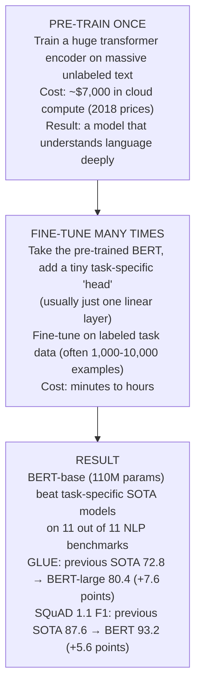

# Chapter 24: BERT — Bidirectional Understanding

> **"BERT answered the question: what if we pre-trained a deep transformer on massive text and then fine-tuned it for every task? The answer: it beats task-specific models trained from scratch on almost everything."**

---

## Table of Contents
1. [What Is BERT and Why It Mattered](#1-what-is-bert-and-why-it-mattered)
2. [Bidirectional vs Unidirectional: The Core Difference](#2-bidirectional-vs-unidirectional-the-core-difference)
3. [Pre-training Tasks](#3-pre-training-tasks)
4. [BERT's Tokenizer: WordPiece](#4-berts-tokenizer-wordpiece)
5. [BERT Architecture and Embeddings](#5-bert-architecture-and-embeddings)
6. [Fine-tuning BERT for Downstream Tasks](#6-fine-tuning-bert-for-downstream-tasks)
7. [BERT Variants](#7-bert-variants)
8. [Sentence Embeddings from BERT](#8-sentence-embeddings-from-bert)
9. [HuggingFace: Complete BERT Examples](#9-huggingface-complete-bert-examples)
10. [Summary](#10-summary)
11. [Exercises](#11-exercises)

---

## 1. What Is BERT and Why It Mattered

**BERT** (Bidirectional Encoder Representations from Transformers) was published by Google AI researchers Jacob Devlin, Ming-Wei Chang, Kenton Lee, and Kristina Toutanova in October 2018.

At the time, the standard approach to NLP tasks was to train a separate specialized model for each task — a classifier for sentiment, a sequence tagger for NER, a span predictor for QA. Each task needed labeled data and task-specific architecture.

BERT changed this with a "pre-train, then fine-tune" paradigm:



This was the "ImageNet moment" for NLP: just as ImageNet pre-trained CNNs became the starting point for all vision tasks, BERT became the starting point for all NLP tasks.

---

## 2. Bidirectional vs Unidirectional: The Core Difference

```
GPT (UNIDIRECTIONAL — left to right):

  Input: "The cat [PREDICT] on the mat"
  
  Position 3 ("sat") can see:
    "The" (position 0) ✓
    "cat" (position 1) ✓
    "sat" (position 2) itself ✓
    "on"  (position 3) ✗  ← BLOCKED by causal mask
    "the" (position 4) ✗
    "mat" (position 5) ✗
  
  Like reading left-to-right: you can only use what you've read so far.

BERT (BIDIRECTIONAL):

  Input: "The cat [MASK] on the mat"
  
  Position 2 ("[MASK]") can see:
    "The" (position 0) ✓
    "cat" (position 1) ✓
    "[MASK]" (position 2) itself ✓
    "on"  (position 3) ✓  ← CAN SEE FUTURE!
    "the" (position 4) ✓
    "mat" (position 5) ✓
  
  Like reading the full sentence then answering a question about the middle.
```

Why does bidirectionality matter?

```
EXAMPLE: "I went to the bank."

To understand "bank":
  - Left context: "went to the" → could be financial bank or river bank
  - Right context: If we add "to deposit money" → clearly financial
                   If we add "and sat by the water" → clearly river bank

Unidirectional GPT: must predict "bank" meaning from left context only.
Bidirectional BERT: uses both left AND right context simultaneously.

For classification and extraction tasks (not generation),
bidirectional context is strictly better.
This is why BERT outperformed GPT on understanding tasks.
```

**The key tradeoff**: BERT can't generate text (it sees the whole input, so you can't just autoregressively sample). GPT generates text naturally but can't look right. For pure understanding tasks, BERT wins. For generation, GPT wins.

---

## 3. Pre-training Tasks

BERT was pre-trained on:
- BooksCorpus: 800M words (unpublished books)
- English Wikipedia: 2.5 billion words (text only, no tables/lists)
- Total: ~3.3 billion words

Using two self-supervised objectives:

### Task 1: Masked Language Modeling (MLM)

```
THE MASKING PROCEDURE:
─────────────────────────────────────────────────────────────
For each training sequence, randomly select 15% of tokens to "process".

For each selected token:
  With 80% probability: replace with [MASK] token
  With 10% probability: replace with a random word
  With 10% probability: keep the original word

Example:
  Original:  "My dog hairy . It looked good today ."
              [0] [1] [2] [3] [4] [5] [6] [7] [8] [9]
  
  Selected tokens: positions 2 (hairy), 5 (looked), 7 (today)
  
  Position 2: 80% → [MASK]: "My dog [MASK] ."
  Position 5: 10% → random word "eating": "It eating good today ."
  Position 7: 10% → keep "today": (unchanged, but still predict it)
  
  Final input: "My dog [MASK] . It eating good today ."
  
  Task: Predict the original words at positions 2, 5, 7
  Loss: cross-entropy only at masked positions (not the whole sequence)
─────────────────────────────────────────────────────────────
```

**Why this masking strategy?**

The 80/10/10 split is carefully designed:

```
80% → [MASK]:
  Forces the model to actually use context to predict the missing word.
  Can't just copy the input token.

10% → random word:
  Forces the model to keep a good representation of the REAL token too.
  Because sometimes it needs to "correct" the random word prediction.
  Prevents the model from learning "if I see [MASK], don't trust position X".
  
10% → unchanged:
  The model doesn't know which tokens will be evaluated.
  It must maintain good representations for ALL tokens.
  This is what makes BERT useful for fine-tuning — it generates
  good representations even for unmasked tokens.

WHY NOT JUST USE [MASK]?
  During fine-tuning, there are NO [MASK] tokens.
  If trained only with 80% masking, the pre-training distribution
  doesn't match the fine-tuning distribution → suboptimal.
  The 10/10 noise acts as regularization, making features more robust.
```

**Contrast with causal language modeling (GPT)**:
- GPT: predict every token sequentially (compute loss on all tokens)
- BERT MLM: predict only 15% of tokens (less efficient, but bidirectional)

### Task 2: Next Sentence Prediction (NSP)

```
NSP TASK:
─────────────────────────────────────────────────────────────
Given two text segments A and B, predict: is B the actual
next sentence after A in the original document?

50% IsNext (positive):
  A: "The man went to the store."
  B: "He bought a gallon of milk."
  Label: IsNext

50% NotNext (negative):
  A: "The man went to the store."
  B: "Penguins are flightless birds." (random sentence)
  Label: NotNext

Input format:
  [CLS] sentence_A [SEP] sentence_B [SEP]

Training:
  [CLS] token representation → Linear → Binary classification
  Loss: binary cross-entropy

Purpose: Learn relationships between sentences.
  - Natural Language Inference (does A entail B?)
  - Question Answering (does passage answer question?)
  - Document-level understanding
─────────────────────────────────────────────────────────────
```

**Did NSP actually help?**

This became controversial. Later work showed:

```
ABLATION STUDY (RoBERTa, Liu et al. 2019):
  BERT with NSP:     MNLI acc = 84.0
  Without NSP:       MNLI acc = 84.8   ← slightly BETTER without NSP!
  
  NSP task is too easy (random negatives are obviously unrelated).
  The model learns to detect topic changes, not deep discourse.
  
  Better alternatives (RoBERTa):
    - Remove NSP entirely (train on full sentences)
    - Or use Sentence Order Prediction (ALBERT): predict if A and B are swapped
    
  Modern models: mostly don't use NSP.
```

---

## 4. BERT's Tokenizer: WordPiece

BERT uses **WordPiece tokenization** — a subword algorithm similar to BPE (covered in depth in Chapter 27).

### WordPiece Algorithm

```
KEY IDEA: Instead of merging the most frequent pair (BPE),
merge the pair that maximizes the likelihood of the training corpus.

For each pair (a, b), score = freq(a, b) / (freq(a) × freq(b))

High score = the pair appears together MORE often than expected by chance.
This slightly prefers meaningful morphological splits.

Example vocabulary building:
  Start: individual characters
  
  Corpus: "tokenization tokenizer tokenize tokens"
  
  Pairs and their scores:
    ("t", "o") : high frequency but common pair
    ("##ize", "##r") : if this pair is distinctive
    
  Merge highest-score pairs until vocab_size reached
  
  Result: "tokenization" → ["token", "##ization"]
         "tokenizer"     → ["token", "##izer"]
         "tokenize"      → ["token", "##ize"]
         "tokens"        → ["token", "##s"]
```

### The ## Prefix Convention

```
WORDPIECE TOKENIZATION (BERT):

"## " prefix means: "this is a continuation of the previous word"

Examples:
  "playing"    → ["play", "##ing"]
  "unplayable" → ["un", "##play", "##able"]
  "transformer"→ ["transform", "##er"]
  "GPU"        → ["G", "##P", "##U"]    ← rare all-caps word
  "2023"       → ["2023"] or ["20", "##23"]
  
Without ##: first subword of a word
With ##: continuation subword

Why this matters:
  "play" and "##play" are DIFFERENT tokens in the vocabulary.
  "I like to play" → "play" token
  "unplayable"     → "##play" token (different embedding)
  
  This allows the model to distinguish word-initial vs word-internal use.

BERT vocabulary: 30,522 tokens (BERT-base-uncased)
  - Lowercase characters: a-z and Unicode
  - Common subwords: "##ing", "##tion", "##ed", "##er", "##s"
  - Common words: "the", "of", "and", "was", etc.
  - Special tokens: [CLS], [SEP], [MASK], [PAD], [UNK]
```

### Special Tokens

```
BERT SPECIAL TOKENS AND THEIR ROLES:

[CLS] (token_id = 101):
  "Classification" token — always placed at the START of every input.
  After all encoder layers, the [CLS] representation aggregates
  information from the entire sequence.
  Used as input to classification heads.
  Think of it as the model's "summary" of the whole input.

[SEP] (token_id = 102):
  "Separator" token — placed at END of each sentence/segment.
  Single sentence: [CLS] tokens [SEP]
  Two sentences:   [CLS] sent_A [SEP] sent_B [SEP]

[MASK] (token_id = 103):
  Used only during MLM pre-training.
  Never appears during fine-tuning.

[PAD] (token_id = 0):
  Used to pad shorter sequences to match the longest in a batch.
  Masked out with attention_mask=0.

[UNK] (token_id = 100):
  Unknown token — for characters/subwords not in vocabulary.
  With WordPiece, this is rare — most things can be split into chars.

Example full tokenization:
  Text: "Hello, how are you?"
  
  After tokenization:
  [CLS] hello , how are you ? [SEP]
  
  Token IDs:
  [101, 7592, 1010, 2129, 2024, 2017, 1029, 102]
  
  Note: "hello" is lowercase (BERT-uncased lowercases everything)
```

---

## 5. BERT Architecture and Embeddings

### Architecture Sizes

```
BERT ARCHITECTURES:
═══════════════════════════════════════════════════════════════
                 BERT-base    BERT-large   DistilBERT
─────────────────────────────────────────────────────────────
d_model           768          1024          768
n_heads           12           16            12
n_layers          12           24            6
d_ff              3072         4096          3072
Max seq len       512          512           512
Parameters        110M         340M          66M
─────────────────────────────────────────────────────────────
Training time     4 days       16 days       3 days
(TPU v3-64)       
─────────────────────────────────────────────────────────────
```

### The Three-Part Embedding

BERT's input is the SUM of three embedding types:

```
BERT INPUT EMBEDDING:
═══════════════════════════════════════════════════════════════

Input tokens: [CLS] The cat sat [SEP] It jumped [SEP]
Segment IDs:    0    0   0   0    0    1    1      1
Position IDs:   0    1   2   3    4    5    6      7

1. TOKEN EMBEDDING:
   Lookup each token in vocabulary → d_model vector
   
2. SEGMENT EMBEDDING (aka Token Type Embedding):
   Segment A tokens → embedding_A (learned)
   Segment B tokens → embedding_B (learned)
   Only two embeddings: A and B
   
   Purpose: distinguish sentence A from sentence B in NSP task
   
3. POSITION EMBEDDING:
   Learned absolute positions 0..511
   Not sinusoidal! BERT uses learned positional embeddings.
   
FINAL INPUT = Token_Emb + Segment_Emb + Position_Emb
              (element-wise addition)
              shape: (seq_len, 768)

Visualization for "The cat [SEP] jumped [SEP]":
                The     cat    [SEP]   jumped  [SEP]
Token Emb:    [0.3,..] [0.7,..] [0.1,..] [0.5,..] [0.1,..]
Segment Emb:  [A_emb]  [A_emb]  [A_emb]  [B_emb]  [B_emb]
Position Emb: [pos_0]  [pos_1]  [pos_2]  [pos_3]  [pos_4]
               ↓         ↓        ↓         ↓        ↓
Input:        [sum]    [sum]    [sum]     [sum]    [sum]
═══════════════════════════════════════════════════════════════
```

---

## 6. Fine-tuning BERT for Downstream Tasks

The "magic" of BERT is that the same pre-trained model works for wildly different tasks with minimal modification.

### Task 1: Text Classification

```
SENTIMENT ANALYSIS / TEXT CLASSIFICATION:

Input:  [CLS] This movie was great [SEP]
Output: Positive / Negative / Neutral

Architecture:
  BERT encoder → [CLS] representation (shape: 768)
  Linear(768, num_classes) → logits
  Softmax → class probabilities
  
  That's it. ONE linear layer on top of BERT.

Fine-tuning:
  Use pre-trained BERT weights (frozen or fine-tuned)
  Train the linear head + optionally a few BERT layers
  Learning rate: 2e-5 to 5e-5 (much lower than training from scratch)
  Epochs: 3-5
  Batch size: 16 or 32

Why it works:
  The [CLS] token, after 12 layers of bidirectional attention,
  has absorbed information from ALL tokens in the sentence.
  It's a compact summary of the full input.
  Training just the linear layer on top = very fast, very data-efficient.
```

### Task 2: Named Entity Recognition (NER)

```
NER — PER-TOKEN CLASSIFICATION:

Input:  [CLS] Barack Obama visited Paris [SEP]
Output: O     B-PER I-PER  O       B-LOC  O

Architecture:
  BERT encoder → hidden states for ALL tokens (shape: seq_len × 768)
  Linear(768, num_labels) applied to EACH token position
  → per-token label predictions

Labels:
  O      = not an entity
  B-PER  = beginning of person entity
  I-PER  = inside/continuation of person entity
  B-LOC  = beginning of location
  B-ORG  = beginning of organization
  etc.

Challenge with subword tokens:
  "Obama" might tokenize as ["O", "##bama"]
  Both get predictions, but we only use the FIRST subword's prediction
  or average all subwords' predictions.
  
  Common practice: only compute loss on the first token of each word
  (use -100 as label for continuation tokens → ignored in cross-entropy)
```

### Task 3: Question Answering (SQuAD)

```
EXTRACTIVE QA — SPAN PREDICTION:

Given:
  Question: "Who wrote Hamlet?"
  Context:  "Hamlet is a tragedy written by William Shakespeare."

Goal: Find the span in the context that answers the question.
  Answer: "William Shakespeare" (start_position=38, end_position=56)

Architecture:
  Input:  [CLS] Question [SEP] Context [SEP]
  
  BERT encoder → hidden states (seq_len × 768)
  
  TWO linear layers (each projects 768 → 1 scalar):
    start_logits = Linear_start(hidden_states) → (seq_len,)
    end_logits   = Linear_end(hidden_states)   → (seq_len,)
  
  start_position = argmax(softmax(start_logits))
  end_position   = argmax(softmax(end_logits))
  
  Answer = context[start_position : end_position + 1]

Loss:
  loss = CE(start_logits, true_start) + CE(end_logits, true_end)

This "span extraction" approach works surprisingly well because
BERT's contextual representations integrate question and context.
```

### Task 4: Natural Language Inference (NLI)

```
NLI — TEXTUAL ENTAILMENT:

Given:
  Premise:    "A dog is running in a park."
  Hypothesis: "An animal is outdoors."
  
Goal: Entailment / Contradiction / Neutral?
  Answer: Entailment

Architecture:
  Input:  [CLS] Premise [SEP] Hypothesis [SEP]
  
  [CLS] → Linear(768, 3) → {Entailment, Contradiction, Neutral}
  
  BERT can cross-attend between premise and hypothesis
  (they're both in the same input sequence)
  The [CLS] representation captures their relationship.
```

### The Fine-tuning Recipe

```
STANDARD BERT FINE-TUNING PROTOCOL:
═══════════════════════════════════════════════════════════════
1. Start from pre-trained BERT weights (from HuggingFace or Google)

2. Add task-specific head:
   - Classification: Linear(d_model, num_classes)
   - NER: Linear(d_model, num_labels) per token
   - QA: Two Linear(d_model, 1) layers

3. Training hyperparameters:
   - Learning rate: 2e-5 (small! don't destroy pre-trained features)
   - LR schedule: linear warmup for first 10% of steps, then linear decay
   - Batch size: 32 (small datasets: 16)
   - Epochs: 3-4 (more → overfit)
   - Max sequence length: 512
   - Optimizer: AdamW (Adam with weight decay)
   - Weight decay: 0.01 (on all non-bias/norm params)
   - Warmup steps: 10% of total steps

4. Expected performance:
   Good fine-tuning needs at least ~1,000 labeled examples.
   With 10,000+ examples: matches or exceeds task-specific SOTA.
   With 100 examples: still useful (few-shot regime).
═══════════════════════════════════════════════════════════════
```

---

## 7. BERT Variants

The BERT architecture spawned dozens of variants. Here are the most important:

### RoBERTa (Facebook, 2019)

```
RoBERTa = "Robustly optimized BERT pretraining Approach"

KEY CHANGES FROM BERT:
  1. Remove NSP: train on single sentences only
     → better MLM training, no distraction from easy NSP task
  
  2. Train longer: BERT (1M steps) → RoBERTa (500k steps with 10× data)
     More data: Common Crawl (CC-NEWS), OpenWebText, Stories = 160GB
     BERT used 16GB text
  
  3. Dynamic masking: reshuffle masks each epoch
     BERT: masks computed once and fixed for all epochs
     RoBERTa: masks are regenerated for each training pass
     → more diverse training signal
  
  4. Larger batches: 256 → 8,192 sentences
     With same compute budget → faster convergence

RESULTS:
  BERT-large on GLUE: 80.4
  RoBERTa-large:      88.5   ← +8 points!
  
  This showed BERT was significantly undertrained.
  More data + time + better training details = much better model.
```

### DistilBERT (HuggingFace, 2019)

```
DISTILBERT: Knowledge Distillation to make BERT smaller

KNOWLEDGE DISTILLATION CONCEPT:
  Teacher model (large BERT, 110M params): produces "soft" predictions
  Student model (DistilBERT, 66M params): learns to match teacher
  
  Instead of training on hard labels (0/1):
    Student loss = α × KL(student_probs || teacher_probs)
                 + β × CE(student_probs, true_labels)
                 + γ × cosine_loss(student_hidden, teacher_hidden)
  
  The "soft" teacher predictions carry more information than hard labels:
    Teacher on "cat": [0.6 CAT, 0.3 KITTEN, 0.05 DOG, ...]
    Harder to predict: captures model's uncertainty and related concepts

DISTILBERT ARCHITECTURE:
  - 6 layers (vs 12 in BERT-base) → 2× faster
  - 768 hidden dim (same as BERT-base)
  - Removes NSP head, pools first token directly
  
RESULTS vs BERT-base:
  Parameters: 66M vs 110M → 40% smaller
  Inference speed: 60% faster
  GLUE score: 97% of BERT-base performance
  
When to use DistilBERT:
  - Production serving (latency matters)
  - Edge devices / mobile
  - Many parallel requests
```

### ALBERT (Google, 2019)

```
ALBERT: "A Lite BERT"

KEY INNOVATIONS:
  1. FACTORIZED EMBEDDING PARAMETERIZATION:
     Problem: vocab_size × d_model = 30k × 1024 = 30M params (just embedding!)
     Solution: vocab_size × E × d_model (two-stage projection)
     
     vocab_size(30k) × E(128) = 3.8M  → then project E → d_model
     Saves 75% of embedding params
  
  2. CROSS-LAYER PARAMETER SHARING:
     All 12 layers share the SAME weights!
     12 identical layers (run the same layer 12 times with different state)
     Massively reduces parameters.
  
  3. SENTENCE ORDER PREDICTION (SOP) instead of NSP:
     NSP (too easy): is B the next sentence after A?
     SOP: are two adjacent sentences in correct order, or swapped?
     More challenging → better discourse understanding

ALBERT RESULTS:
  ALBERT-xxlarge: d_model=4096, n_layers=12, 235M params
  Despite fewer unique params (vs BERT-large 340M), much better GLUE performance.
  But: slower inference (each forward pass still does 12 layers, just shared)
```

### DeBERTa (Microsoft, 2020)

```
DeBERTa: "Decoding-enhanced BERT with disentangled attention"

KEY INNOVATIONS:
  1. DISENTANGLED ATTENTION:
     Standard BERT: each token has ONE embedding (content + position)
     DeBERTa: separate content and position embeddings
     
     Attention score = content-to-content 
                     + content-to-position 
                     + position-to-content
     (3 terms instead of 1)
     
     This allows more precise position-aware attention.
  
  2. RELATIVE POSITION ENCODING:
     Uses relative positions (i-j) rather than absolute positions.
     Better generalization to different sequence lengths.
  
  3. ENHANCED MASK DECODER (EMD):
     Special decoder layer for MLM that uses absolute positions.
     Handles the fact that masking changes position signals.

RESULTS:
  DeBERTa is SOTA on GLUE, SuperGLUE, SQuAD as of 2022.
  DeBERTa-v3-large: 91.4 GLUE  (vs RoBERTa-large 88.5)
  Widely used in Kaggle NLP competitions.
```

### Domain-Specific BERT Models

```
THE BERT ECOSYSTEM:

BIOMEDICAL:
  BioBERT: pre-trained on PubMed abstracts + PubMed Central full text
  PubMedBERT: pre-trained on PubMed ONLY (no general text mixing)
  BlueBERT: BioASQ + MIMIC III (clinical notes)
  Use for: biomedical NER, relation extraction, clinical QA

LEGAL:
  LegalBERT: EU legislation, US court cases, UK legislation
  LEGAL-BERT: contracts, court filings, laws
  Use for: contract analysis, legal document classification

FINANCIAL:
  FinBERT: Reuters TRC2 (financial news), SEC filings
  FLANG-BERT: financial Q&A, sentiment analysis
  Use for: sentiment analysis of earnings calls, SEC filing analysis

CODE:
  CodeBERT (Microsoft): code + natural language, 6 programming languages
  Use for: code search, documentation generation, code understanding

SCIENTIFIC:
  SciBERT: Semantic Scholar papers (computer science, biomedical)
  Use for: scientific NER, paper classification, citation purpose

MULTILINGUAL:
  mBERT: 104 languages, same architecture, 110k vocab
  XLM-R: 100 languages, trained on Common Crawl (much more data)
  Use for: cross-lingual NER, multilingual classification

WHEN TO USE DOMAIN-SPECIFIC BERT:
  Task involves domain terminology → use domain BERT
  Example: "The patient's BP was 120/80 on metformin" 
    General BERT: "BP" = unknown, "metformin" = rare subwords
    BioBERT: "BP" = blood pressure, "metformin" = common term → much better
```

### BERT Variants Comparison Table

| Model | Params | GLUE | Key Innovation | Best For |
|-------|--------|------|----------------|----------|
| BERT-base | 110M | 78.3 | Original | Baseline |
| BERT-large | 340M | 80.4 | More layers | High accuracy |
| RoBERTa-base | 125M | 86.4 | Better training | Production default |
| RoBERTa-large | 355M | 88.5 | More data | High accuracy |
| DistilBERT | 66M | 77.0 | Distillation | Fast inference |
| ALBERT-xxl | 235M | 91.0 | Param sharing | Accuracy |
| DeBERTa-v3-large | 304M | 91.4 | Disentangled attn | Best accuracy |
| XLM-R-base | 125M | n/a | Multilingual | Multilingual |

---

## 8. Sentence Embeddings from BERT

A natural question: can we use BERT to get good embeddings for entire sentences (not just tokens)?

### Naive Approaches

```
APPROACH 1: Use [CLS] embedding
  [CLS] is designed to represent the whole sentence (for classification).
  Problem: BERT is not trained to make [CLS] useful for SIMILARITY.
  
  Cosine similarity of [CLS] embeddings:
    sim("A man walks a dog", "A dog is walked by a man") ≈ 0.39
    ← SHOULD be high (same meaning), but BERT [CLS] doesn't optimize for this

APPROACH 2: Mean-pool all token embeddings
  Average token embeddings → sentence vector
  Slightly better than [CLS] but still not great for similarity.
  Same problem: BERT is not trained to make these comparable.
```

### Sentence-BERT (SBERT)

```
SENTENCE-BERT (Reimers & Gurevych, 2019)

KEY IDEA: Fine-tune BERT with a contrastive/siamese objective
that directly optimizes for SEMANTIC SIMILARITY.

SIAMESE NETWORK ARCHITECTURE:
  
  Sentence A ──→ [BERT] ──→ mean_pool ──→ u (768-dim)
                                              ↓
                                         cosine_sim(u, v)
                                              ↑
  Sentence B ──→ [BERT] ──→ mean_pool ──→ v (768-dim)
  
  (same BERT weights shared for both sentences)

TRAINING OBJECTIVE (NLI-based):
  Given triplets: (anchor, positive, negative)
  "The cat is a pet" — (anchor)
  "Animals make good companions" — (positive, similar meaning)
  "The weather is cloudy" — (negative, different meaning)
  
  Loss: max(0, margin - cos(anchor, pos) + cos(anchor, neg))
  ← Pull anchor+positive together, push anchor+negative apart

PERFORMANCE IMPROVEMENT:
  BERT [CLS] Spearman correlation on STS-B: 77.0
  SBERT mean-pool:                          84.9
  Improvement: +7.9 points
  
  Inference speed: BERT for sentence pair = 65ms
                   SBERT for both sentences + compare = 4ms
  ← 16× faster because SBERT encodes sentences independently

USE CASES:
  Semantic search: encode 1M documents → find similar ones via cosine sim
  Document clustering: group documents by meaning
  Duplicate detection: find near-duplicate questions (Quora Question Pairs)
  Recommendation: find semantically similar items
  Cross-lingual: multilingual SBERT for cross-language search
```

### Practical Sentence Embeddings

```python
# Using sentence-transformers library (built on top of SBERT)
from sentence_transformers import SentenceTransformer, util

model = SentenceTransformer('all-MiniLM-L6-v2')  # fast, good quality, 22M params

sentences = [
    "A man is playing a guitar",
    "Someone is strumming a musical instrument",
    "The cat is sleeping on the couch",
    "A feline rests on the sofa",
    "Deep learning models process text",
]

# Encode all sentences at once (batched, fast)
embeddings = model.encode(sentences)  # shape: (5, 384)

# Compute pairwise cosine similarities
cos_sim = util.cos_sim(embeddings, embeddings)
print("Cosine similarity matrix:")
for i, s1 in enumerate(sentences):
    for j, s2 in enumerate(sentences):
        print(f"  [{cos_sim[i,j]:.3f}] ({s1[:25]}) vs ({s2[:25]})")
```

---

## 9. HuggingFace: Complete BERT Examples

```python
"""
Complete BERT Examples with HuggingFace Transformers.
Three use cases: classification, fine-tuning, and sentence similarity.
"""

import torch
import torch.nn as nn
from torch.utils.data import DataLoader, Dataset
from transformers import (
    BertTokenizer,
    BertModel,
    BertForSequenceClassification,
    BertForTokenClassification,
    get_linear_schedule_with_warmup,
)
from torch.optim import AdamW  # not transformers.AdamW — that's deprecated
import numpy as np
from typing import List, Tuple, Dict


# ─────────────────────────────────────────────────────────────────────────────
# EXAMPLE 1: Sentiment Analysis with Pipeline (fastest — no coding needed)
# ─────────────────────────────────────────────────────────────────────────────

def example_pipeline_inference():
    """Inference-only with HuggingFace pipeline."""
    from transformers import pipeline
    
    # Load pre-fine-tuned sentiment model
    sentiment = pipeline(
        "sentiment-analysis",
        model="distilbert-base-uncased-finetuned-sst-2-english",
        device=0 if torch.cuda.is_available() else -1,
    )
    
    texts = [
        "This product is absolutely fantastic! 10/10 would recommend.",
        "Terrible experience. Would not buy again.",
        "It's okay, nothing special, works as expected.",
    ]
    
    print("=== Sentiment Analysis ===")
    results = sentiment(texts)
    for text, result in zip(texts, results):
        print(f"  [{result['label']:8} {result['score']:.3f}] {text[:50]}")


# ─────────────────────────────────────────────────────────────────────────────
# EXAMPLE 2: Fine-tuning BERT on Custom Classification Dataset
# ─────────────────────────────────────────────────────────────────────────────

class TextDataset(Dataset):
    """Simple dataset for text classification."""
    
    def __init__(
        self,
        texts: List[str],
        labels: List[int],
        tokenizer: BertTokenizer,
        max_length: int = 128,
    ):
        self.encodings = tokenizer(
            texts,
            padding=True,
            truncation=True,
            max_length=max_length,
            return_tensors="pt",
        )
        self.labels = torch.tensor(labels, dtype=torch.long)
    
    def __len__(self):
        return len(self.labels)
    
    def __getitem__(self, idx: int) -> Dict[str, torch.Tensor]:
        return {
            "input_ids":      self.encodings["input_ids"][idx],
            "attention_mask": self.encodings["attention_mask"][idx],
            "token_type_ids": self.encodings.get("token_type_ids", 
                                torch.zeros_like(self.encodings["input_ids"]))[idx],
            "labels":         self.labels[idx],
        }


def fine_tune_bert(
    train_texts: List[str],
    train_labels: List[int],
    val_texts: List[str],
    val_labels: List[int],
    num_classes: int,
    model_name: str = "bert-base-uncased",
    num_epochs: int = 3,
    batch_size: int = 16,
    learning_rate: float = 2e-5,
    max_length: int = 128,
):
    """
    Fine-tune BERT for text classification.
    
    Args:
        train_texts:  List of training text strings
        train_labels: List of integer class labels (0, 1, ..., num_classes-1)
        val_texts:    Validation texts
        val_labels:   Validation labels
        num_classes:  Number of output classes
        model_name:   Pre-trained model to start from
        num_epochs:   How many times to iterate over training data
        batch_size:   Training batch size
        learning_rate: Peak learning rate (use 2e-5 to 5e-5 for BERT)
        max_length:   Maximum tokenized sequence length
    """
    device = torch.device("cuda" if torch.cuda.is_available() else "cpu")
    print(f"Device: {device}")
    
    # ── 1. Load tokenizer and tokenize data ──────────────────────────────────
    tokenizer = BertTokenizer.from_pretrained(model_name)
    
    train_dataset = TextDataset(train_texts, train_labels, tokenizer, max_length)
    val_dataset   = TextDataset(val_texts,   val_labels,   tokenizer, max_length)
    
    train_loader = DataLoader(train_dataset, batch_size=batch_size, shuffle=True)
    val_loader   = DataLoader(val_dataset,   batch_size=batch_size, shuffle=False)
    
    # ── 2. Load pre-trained BERT with classification head ────────────────────
    model = BertForSequenceClassification.from_pretrained(
        model_name,
        num_labels=num_classes,
    )
    model.to(device)
    
    # ── 3. Optimizer ─────────────────────────────────────────────────────────
    # AdamW: Adam with weight decay decoupled from LR
    # Don't apply weight decay to bias and LayerNorm parameters
    no_decay = ["bias", "LayerNorm.weight"]
    optimizer_grouped_parameters = [
        {
            "params": [p for n, p in model.named_parameters() 
                      if not any(nd in n for nd in no_decay)],
            "weight_decay": 0.01,
        },
        {
            "params": [p for n, p in model.named_parameters() 
                      if any(nd in n for nd in no_decay)],
            "weight_decay": 0.0,
        },
    ]
    optimizer = AdamW(optimizer_grouped_parameters, lr=learning_rate)
    
    # ── 4. Learning rate schedule ────────────────────────────────────────────
    total_steps = len(train_loader) * num_epochs
    warmup_steps = total_steps // 10  # 10% warmup
    
    scheduler = get_linear_schedule_with_warmup(
        optimizer,
        num_warmup_steps=warmup_steps,
        num_training_steps=total_steps,
    )
    
    # ── 5. Training loop ─────────────────────────────────────────────────────
    best_val_acc = 0.0
    
    for epoch in range(num_epochs):
        # Training phase
        model.train()
        total_train_loss = 0.0
        correct = 0
        total = 0
        
        for batch_idx, batch in enumerate(train_loader):
            # Move to device
            input_ids      = batch["input_ids"].to(device)
            attention_mask = batch["attention_mask"].to(device)
            token_type_ids = batch["token_type_ids"].to(device)
            labels         = batch["labels"].to(device)
            
            # Zero gradients
            optimizer.zero_grad()
            
            # Forward pass
            outputs = model(
                input_ids=input_ids,
                attention_mask=attention_mask,
                token_type_ids=token_type_ids,
                labels=labels,   # BertForSequenceClassification computes loss internally
            )
            
            loss   = outputs.loss    # cross-entropy loss
            logits = outputs.logits  # (batch, num_classes)
            
            # Backward pass
            loss.backward()
            
            # Gradient clipping (prevents explosive gradients in fine-tuning)
            torch.nn.utils.clip_grad_norm_(model.parameters(), max_norm=1.0)
            
            # Update weights and learning rate
            optimizer.step()
            scheduler.step()
            
            # Track metrics
            total_train_loss += loss.item()
            predictions = logits.argmax(dim=-1)
            correct += (predictions == labels).sum().item()
            total += labels.size(0)
            
            if batch_idx % 50 == 0:
                print(f"  Epoch {epoch+1}, step {batch_idx}/{len(train_loader)}: "
                      f"loss={loss.item():.4f}, lr={scheduler.get_last_lr()[0]:.2e}")
        
        avg_train_loss = total_train_loss / len(train_loader)
        train_acc = correct / total
        
        # Validation phase
        model.eval()
        total_val_loss = 0.0
        val_correct = 0
        val_total = 0
        
        with torch.no_grad():
            for batch in val_loader:
                input_ids      = batch["input_ids"].to(device)
                attention_mask = batch["attention_mask"].to(device)
                token_type_ids = batch["token_type_ids"].to(device)
                labels         = batch["labels"].to(device)
                
                outputs = model(
                    input_ids=input_ids,
                    attention_mask=attention_mask,
                    token_type_ids=token_type_ids,
                    labels=labels,
                )
                
                total_val_loss += outputs.loss.item()
                predictions = outputs.logits.argmax(dim=-1)
                val_correct += (predictions == labels).sum().item()
                val_total += labels.size(0)
        
        val_acc = val_correct / val_total
        
        print(f"\nEpoch {epoch+1}/{num_epochs}:")
        print(f"  Train loss: {avg_train_loss:.4f}, Train acc: {train_acc:.4f}")
        print(f"  Val   loss: {total_val_loss/len(val_loader):.4f}, Val   acc: {val_acc:.4f}")
        
        if val_acc > best_val_acc:
            best_val_acc = val_acc
            torch.save(model.state_dict(), "best_bert_classifier.pt")
            print(f"  ★ New best model saved (val_acc={val_acc:.4f})")
    
    print(f"\nTraining complete. Best val accuracy: {best_val_acc:.4f}")
    return model, tokenizer


# ─────────────────────────────────────────────────────────────────────────────
# EXAMPLE 3: Semantic Similarity with Sentence-BERT style mean pooling
# ─────────────────────────────────────────────────────────────────────────────

def get_sentence_embeddings(
    texts: List[str],
    model_name: str = "bert-base-uncased",
    batch_size: int = 32,
) -> np.ndarray:
    """
    Extract sentence embeddings using BERT mean-pooling.
    For production, use sentence-transformers library instead.
    """
    device = torch.device("cuda" if torch.cuda.is_available() else "cpu")
    tokenizer = BertTokenizer.from_pretrained(model_name)
    model = BertModel.from_pretrained(model_name)
    model.eval().to(device)
    
    all_embeddings = []
    
    for i in range(0, len(texts), batch_size):
        batch_texts = texts[i:i + batch_size]
        
        encoded = tokenizer(
            batch_texts,
            padding=True,
            truncation=True,
            max_length=128,
            return_tensors="pt",
        )
        encoded = {k: v.to(device) for k, v in encoded.items()}
        
        with torch.no_grad():
            outputs = model(**encoded)
        
        # Mean pooling: average token embeddings, ignoring padding
        token_embeddings = outputs.last_hidden_state  # (B, T, 768)
        attention_mask = encoded["attention_mask"].unsqueeze(-1).float()  # (B, T, 1)
        
        # Sum token embeddings (masked)
        sum_embeddings = (token_embeddings * attention_mask).sum(dim=1)  # (B, 768)
        # Count non-padding tokens
        sum_mask = attention_mask.sum(dim=1).clamp(min=1e-9)  # (B, 1)
        # Mean
        mean_embeddings = (sum_embeddings / sum_mask).cpu().numpy()  # (B, 768)
        
        all_embeddings.append(mean_embeddings)
    
    return np.vstack(all_embeddings)  # (num_texts, 768)


def cosine_similarity(a: np.ndarray, b: np.ndarray) -> float:
    """Compute cosine similarity between two vectors."""
    return np.dot(a, b) / (np.linalg.norm(a) * np.linalg.norm(b) + 1e-9)


def semantic_search(
    query: str,
    documents: List[str],
    model_name: str = "bert-base-uncased",
    top_k: int = 3,
) -> List[Tuple[float, str]]:
    """
    Find top-k most semantically similar documents to query.
    Simple brute-force search (use FAISS for millions of documents).
    """
    all_texts = [query] + documents
    embeddings = get_sentence_embeddings(all_texts, model_name)
    
    query_emb = embeddings[0]
    doc_embs = embeddings[1:]
    
    similarities = [cosine_similarity(query_emb, doc_emb) 
                    for doc_emb in doc_embs]
    
    ranked = sorted(
        zip(similarities, documents),
        key=lambda x: x[0],
        reverse=True,
    )
    
    return ranked[:top_k]


# ─────────────────────────────────────────────────────────────────────────────
# DEMO: Run all examples with toy data
# ─────────────────────────────────────────────────────────────────────────────

def run_demos():
    print("=" * 60)
    print("BERT EXAMPLES DEMO")
    print("=" * 60)
    
    # Demo 1: Pipeline
    print("\n1. PIPELINE INFERENCE")
    example_pipeline_inference()
    
    # Demo 2: Semantic search (without heavy fine-tuning)
    print("\n2. SEMANTIC SEARCH")
    documents = [
        "Machine learning is a subset of artificial intelligence.",
        "Deep neural networks have multiple hidden layers.",
        "Python is a popular programming language for data science.",
        "Cats are popular household pets around the world.",
        "Transformers use attention mechanisms to process sequences.",
    ]
    query = "How do neural networks learn from data?"
    
    print(f"Query: '{query}'")
    print("Top 3 most relevant documents:")
    results = semantic_search(query, documents, top_k=3)
    for score, doc in results:
        print(f"  [{score:.3f}] {doc}")
    
    # Demo 3: Show fine-tuning usage (with toy data)
    print("\n3. FINE-TUNING DEMO (toy data — normally use 1000+ examples)")
    
    # Create tiny toy dataset (just to show the API)
    train_texts = [
        "I love this product, it works great!",
        "Terrible quality, broke after one day.",
        "Amazing, best purchase ever made!",
        "Waste of money, doesn't work at all.",
        "Pretty good, does what it says.",
        "Awful experience, would not recommend.",
    ] * 5  # repeat to have more samples
    
    train_labels = [1, 0, 1, 0, 1, 0] * 5  # 1=positive, 0=negative
    
    # Use half for validation
    mid = len(train_texts) // 2
    val_texts = train_texts[mid:]
    val_labels = train_labels[mid:]
    train_texts = train_texts[:mid]
    train_labels = train_labels[:mid]
    
    print(f"Training on {len(train_texts)} examples, validating on {len(val_texts)}")
    print("(In production, you'd use 1000+ examples for each class)")
    
    # Note: actual training takes minutes; this is a stub showing the API
    # model, tokenizer = fine_tune_bert(
    #     train_texts, train_labels,
    #     val_texts, val_labels,
    #     num_classes=2,
    #     num_epochs=3,
    # )
    print("  (Uncomment the fine_tune_bert() call to actually train)")


if __name__ == "__main__":
    run_demos()
```

---

## 10. Summary

```
BERT AT A GLANCE:
═══════════════════════════════════════════════════════════════════════

PRE-TRAINING:
  Data: BooksCorpus + Wikipedia (~3.3B words)
  Tasks: MLM (predict 15% masked tokens) + NSP (sentence pair)
  
  MLM: 80% → [MASK], 10% → random word, 10% → unchanged
  Why: Forces bidirectional context use, robust to different inputs

ARCHITECTURE:
  Encoder-only transformer (bidirectional attention)
  BERT-base: 12 layers, 768 dim, 12 heads, 110M params
  BERT-large: 24 layers, 1024 dim, 16 heads, 340M params
  Input: [CLS] text_A [SEP] text_B [SEP]
  Embeddings: Token + Segment + Position

FINE-TUNING:
  Add small task head → train on labeled data (3-4 epochs, lr=2e-5)
  Classification: [CLS] → Linear(768, n_classes)
  NER:      each token → Linear(768, n_labels)
  QA:       start/end pointer heads on full sequence

VARIANTS:
  RoBERTa:   better training (no NSP, more data, dynamic masking)
  DistilBERT: smaller, faster (distillation)
  ALBERT:    parameter sharing (factorized embedding)
  DeBERTa:   best accuracy (disentangled attention)

USE CASES:
  Classification, NER, QA, semantic similarity, document understanding
  Any task where you need to UNDERSTAND text (not generate it)
═══════════════════════════════════════════════════════════════════════
```

---

## Mini Projects

### Mini Project 1: BERT Sentence Embeddings Explorer

Use a pretrained BERT model to generate sentence embeddings and explore semantic similarity.

**Objective:** Understand what BERT "knows" about language by comparing embedding spaces.

```python
# This project uses sentence-transformers (pip install sentence-transformers)
# If unavailable, fall back to manually using transformers library

try:
    from sentence_transformers import SentenceTransformer
    USE_SBERT = True
except ImportError:
    USE_SBERT = False
    print("Install with: pip install sentence-transformers")

import numpy as np
import matplotlib.pyplot as plt
from sklearn.metrics.pairwise import cosine_similarity
from sklearn.manifold import TSNE
from sklearn.decomposition import PCA

# Semantically grouped sentences
sentences = {
    'Technology': [
        "The new iPhone has an improved camera.",
        "Google released a breakthrough AI model.",
        "Cloud computing reduces infrastructure costs.",
        "Machine learning powers recommendation systems.",
    ],
    'Sports': [
        "The team won the championship last night.",
        "The athlete broke the world record.",
        "Basketball playoffs start next week.",
        "The coach made strategic substitutions.",
    ],
    'Food': [
        "The pasta was perfectly al dente.",
        "This restaurant serves authentic Italian cuisine.",
        "The soup needs more salt and pepper.",
        "Dessert was a chocolate lava cake.",
    ],
    'Science': [
        "Scientists discovered a new exoplanet.",
        "The vaccine showed 95% efficacy in trials.",
        "Quantum computers can factor large primes.",
        "The experiment confirmed Einstein's theory.",
    ],
}

all_sentences = [s for group in sentences.values() for s in group]
all_labels    = [label for label, group in sentences.items() for _ in group]
label_to_idx  = {l: i for i, l in enumerate(sentences.keys())}
label_indices = [label_to_idx[l] for l in all_labels]

if USE_SBERT:
    model = SentenceTransformer('all-MiniLM-L6-v2')
    embeddings = model.encode(all_sentences, normalize_embeddings=True)
    print(f"Embedding shape: {embeddings.shape}")
else:
    # Fallback: random embeddings (won't be meaningful, just shows the analysis pattern)
    np.random.seed(42)
    embeddings = np.random.randn(len(all_sentences), 384)
    # Make within-group embeddings more similar
    for i, idx in enumerate(label_indices):
        embeddings[i] += idx * 2
    norms = np.linalg.norm(embeddings, axis=1, keepdims=True)
    embeddings = embeddings / norms
    print("Using random embeddings (install sentence-transformers for real embeddings)")

# Cosine similarity matrix
sim_matrix = cosine_similarity(embeddings)

fig, axes = plt.subplots(2, 2, figsize=(14, 12))
fig.suptitle("BERT Sentence Embeddings: Semantic Similarity Analysis", fontsize=13, fontweight='bold')

# Heatmap
short_labels = [s[:25] + '...' if len(s) > 25 else s for s in all_sentences]
import seaborn as sns
sns.heatmap(sim_matrix, xticklabels=short_labels, yticklabels=short_labels,
            cmap='RdYlGn', vmin=-0.2, vmax=1.0, ax=axes[0, 0])
axes[0, 0].set_title("Cosine Similarity Matrix\n(green=similar, red=different)")
axes[0, 0].tick_params(axis='x', rotation=45, labelsize=6)
axes[0, 0].tick_params(axis='y', labelsize=6)

# t-SNE visualization
tsne = TSNE(n_components=2, random_state=42, perplexity=4)
coords = tsne.fit_transform(embeddings)
colors = plt.cm.tab10(np.linspace(0, 0.4, 4))
for i, (label, color) in enumerate(zip(sentences.keys(), colors)):
    mask = np.array(label_indices) == i
    axes[0, 1].scatter(coords[mask, 0], coords[mask, 1], c=[color]*mask.sum(),
                        s=100, label=label, alpha=0.8, edgecolors='black', linewidths=0.5)
    for j, sent in enumerate(np.array(all_sentences)[mask]):
        axes[0, 1].annotate(sent[:20] + '..', (coords[mask][j, 0], coords[mask][j, 1]),
                             fontsize=6, alpha=0.7)
axes[0, 1].set_title("t-SNE: Sentence Embedding Space\n(clusters = semantic groups)")
axes[0, 1].legend(fontsize=8); axes[0, 1].grid(True, alpha=0.3)

# Semantic search demo
query = "AI and neural networks are transforming technology"
if USE_SBERT:
    query_emb = model.encode([query], normalize_embeddings=True)
else:
    query_emb = np.random.randn(1, 384)
    query_emb /= np.linalg.norm(query_emb)

query_sims = cosine_similarity(query_emb, embeddings)[0]
ranked_idx = query_sims.argsort()[::-1]

axes[1, 0].barh(range(len(all_sentences)),
                query_sims[ranked_idx],
                color=[plt.cm.tab10(label_to_idx[all_labels[i]]/10) for i in ranked_idx],
                alpha=0.8)
axes[1, 0].set_yticks(range(len(all_sentences)))
axes[1, 0].set_yticklabels([all_sentences[i][:30] for i in ranked_idx], fontsize=7)
axes[1, 0].set_title(f'Semantic Search Results\nQuery: "{query[:40]}..."')
axes[1, 0].set_xlabel("Cosine Similarity"); axes[1, 0].grid(True, alpha=0.3, axis='x')

# Within-group vs between-group similarity
within_sims, between_sims = [], []
labels_arr = np.array(label_indices)
for i in range(len(all_sentences)):
    for j in range(i+1, len(all_sentences)):
        sim = sim_matrix[i, j]
        if labels_arr[i] == labels_arr[j]:
            within_sims.append(sim)
        else:
            between_sims.append(sim)

axes[1, 1].hist(within_sims,  bins=15, alpha=0.7, color='green', label=f'Within-group (n={len(within_sims)})', density=True)
axes[1, 1].hist(between_sims, bins=15, alpha=0.7, color='red',   label=f'Between-group (n={len(between_sims)})', density=True)
axes[1, 1].axvline(np.mean(within_sims),  color='darkgreen', linestyle='--', label=f'Within mean={np.mean(within_sims):.3f}')
axes[1, 1].axvline(np.mean(between_sims), color='darkred',   linestyle='--', label=f'Between mean={np.mean(between_sims):.3f}')
axes[1, 1].set_title("Similarity Distribution\n(good embeddings: within > between)")
axes[1, 1].set_xlabel("Cosine Similarity"); axes[1, 1].legend(fontsize=7); axes[1, 1].grid(True, alpha=0.3)

plt.tight_layout()
plt.savefig("bert_embeddings.png", dpi=150)
plt.show()
print(f"Within-group avg similarity:  {np.mean(within_sims):.3f}")
print(f"Between-group avg similarity: {np.mean(between_sims):.3f}")
```

---

### Mini Project 2: Named Entity Recognition with BERT Tokenization

Implement a character-aware NER tagger and compare it to BERT's subword tokenization approach.

**Objective:** Understand the tokenization challenge in NER and why BERT's [CLS]/[SEP] design matters.

```python
import torch
import torch.nn as nn
import numpy as np
import matplotlib.pyplot as plt
from torch.utils.data import TensorDataset, DataLoader

# NER labels
LABELS = ['O', 'B-PER', 'I-PER', 'B-ORG', 'I-ORG', 'B-LOC', 'I-LOC']
label2id = {l: i for i, l in enumerate(LABELS)}
id2label = {i: l for l, i in label2id.items()}
n_labels = len(LABELS)

# Synthetic NER dataset
raw_data = [
    ("John Smith works at Google in New York", [1,2,0,0,3,0,5,6]),
    ("Apple hired Jane Doe from Microsoft", [3,0,1,2,0,3]),
    ("Paris Hilton visited Paris France", [1,2,0,5,5]),
    ("Jeff Bezos founded Amazon in Seattle", [1,2,0,3,0,5]),
    ("Barack Obama met Angela Merkel in Berlin", [1,2,0,1,2,0,5]),
    ("Microsoft and Google compete in cloud computing", [3,0,3,0,0,0,0]),
    ("Elon Musk runs Tesla and SpaceX", [1,2,0,3,0,3]),
    ("The United Nations meets in Geneva Switzerland", [0,5,6,0,0,5,5]),
]

# Simple word-level tokenizer
all_words = sorted(set(w.lower() for sent, _ in raw_data for w in sent.split()))
word2id = {w: i+2 for i, w in enumerate(all_words)}
word2id['<pad>'] = 0; word2id['<unk>'] = 1
VOCAB = len(word2id)
MAX_LEN = 10

def encode_sentence(sentence, labels):
    words = sentence.lower().split()[:MAX_LEN]
    ids   = [word2id.get(w, 1) for w in words]
    lbls  = list(labels[:MAX_LEN])
    # Pad
    pad_len = MAX_LEN - len(ids)
    return ids + [0]*pad_len, lbls + [0]*pad_len

encoded = [encode_sentence(s, l) for s, l in raw_data]
X = torch.LongTensor([e[0] for e in encoded] * 20)  # repeat for more data
y = torch.LongTensor([e[1] for e in encoded] * 20)

# LSTM-based NER tagger
class NERTagger(nn.Module):
    def __init__(self, vocab_size, embed_dim=32, hidden_dim=64, n_labels=7):
        super().__init__()
        self.embed = nn.Embedding(vocab_size, embed_dim, padding_idx=0)
        self.lstm  = nn.LSTM(embed_dim, hidden_dim, batch_first=True,
                              bidirectional=True, num_layers=2, dropout=0.3)
        self.drop  = nn.Dropout(0.3)
        self.fc    = nn.Linear(hidden_dim*2, n_labels)  # *2 for bidirectional

    def forward(self, x):
        emb  = self.drop(self.embed(x))
        out, _ = self.lstm(emb)
        return self.fc(self.drop(out))  # (B, T, n_labels)

ds = TensorDataset(X, y)
loader = DataLoader(ds, batch_size=16, shuffle=True)

torch.manual_seed(42)
model = NERTagger(VOCAB)
opt   = torch.optim.Adam(model.parameters(), lr=0.002)
crit  = nn.CrossEntropyLoss(ignore_index=0)

losses = []
for epoch in range(50):
    for X_b, y_b in loader:
        opt.zero_grad()
        logits = model(X_b)
        loss = crit(logits.view(-1, n_labels), y_b.view(-1))
        loss.backward(); opt.step()
    losses.append(loss.item())

# Evaluate and visualize
model.eval()
fig, axes = plt.subplots(2, 2, figsize=(14, 10))
fig.suptitle("NER Tagger: LSTM Sequence Labeling", fontsize=13, fontweight='bold')

axes[0, 0].plot(losses)
axes[0, 0].set_title("Training Loss"); axes[0, 0].set_xlabel("Epoch")
axes[0, 0].grid(True, alpha=0.3)

# Show predictions on test sentences
test_sents = [
    "Sundar Pichai leads Google in Silicon Valley",
    "Tim Cook runs Apple in California",
    "The White House is in Washington",
]

color_map = {'O': 'white', 'B-PER': 'lightblue', 'I-PER': 'lightblue',
             'B-ORG': 'lightyellow', 'I-ORG': 'lightyellow',
             'B-LOC': 'lightgreen', 'I-LOC': 'lightgreen'}

for row, sent in enumerate(test_sents[:2]):
    words = sent.lower().split()[:MAX_LEN]
    ids   = torch.LongTensor([[word2id.get(w, 1) for w in words] +
                               [0]*(MAX_LEN-len(words))])
    with torch.no_grad():
        preds = model(ids).argmax(-1)[0][:len(words)].numpy()

    ax = axes[1, row]
    ax.axis('off')
    for col, (word, pred) in enumerate(zip(words, preds)):
        label = id2label[pred]
        color = color_map.get(label, 'white')
        rect = plt.Rectangle([col*1.2, 0.2], 1.0, 0.6, facecolor=color, edgecolor='black')
        ax.add_patch(rect)
        ax.text(col*1.2 + 0.5, 0.8, word, ha='center', va='bottom', fontsize=9, fontweight='bold')
        ax.text(col*1.2 + 0.5, 0.1, label, ha='center', va='bottom', fontsize=7, color='darkblue')
    ax.set_xlim(-0.2, len(words)*1.2)
    ax.set_ylim(-0.1, 1.4)
    ax.set_title(f"NER Prediction: '{sent[:40]}'", fontsize=9)

# Label distribution
from collections import Counter
all_preds = []
with torch.no_grad():
    logits = model(X[:len(raw_data)*20])
    all_preds = logits.argmax(-1).numpy().ravel()
label_counts = Counter(all_preds)
label_names_present = [id2label[i] for i in sorted(label_counts.keys())]
counts = [label_counts[i] for i in sorted(label_counts.keys())]
axes[0, 1].bar(label_names_present, counts, color=['gray', 'lightblue', 'lightblue',
                                                     'lightyellow', 'lightyellow',
                                                     'lightgreen', 'lightgreen'][:len(counts)], alpha=0.8)
axes[0, 1].set_title("Predicted Label Distribution"); axes[0, 1].set_xlabel("NER Label")
axes[0, 1].set_ylabel("Count"); axes[0, 1].grid(True, alpha=0.3, axis='y')

plt.tight_layout()
plt.savefig("ner_tagger.png", dpi=150)
plt.show()
print("Saved: bert_embeddings.png, ner_tagger.png")
```

---

## 11. Exercises

**Exercise 1**: Fine-tune `bert-base-uncased` on the IMDB movie review dataset (HuggingFace datasets: `load_dataset("imdb")`). Train for 3 epochs with lr=2e-5. Report your validation accuracy. Expected: ~93-94%.

**Exercise 2**: Implement NER fine-tuning using `BertForTokenClassification`. Use the CoNLL-2003 dataset (`load_dataset("conll2003")`). Handle subword tokens properly (assign -100 label to continuation tokens). Compute per-entity F1 score.

**Exercise 3**: Compare the semantic similarity of sentence pairs using (a) TF-IDF cosine similarity, (b) BERT [CLS] embedding, (c) BERT mean-pool. Use 10 sentence pairs from STS-B. Which correlates best with human judgments?

**Exercise 4**: Implement "zero-shot" classification using BERT NLI: given a text and a list of class labels, use BERT-NLI to score "This text is about [label]" as entailment/contradiction. Compare with a fine-tuned classifier on the same task.

**Exercise 5**: Load a BERT model and inspect layer-wise representations using probing classifiers. Train a small linear probe on the [CLS] representations from each of the 12 layers to predict part-of-speech tags. Which layer has the most syntactic information?

**Exercise 6**: Using HuggingFace, implement a document-level question answering system. For a document longer than 512 tokens, use a sliding window with overlap, run BERT QA on each window, and combine the answers by selecting the highest-confidence span.

---

**Chapter Summary**: BERT introduced the "pre-train then fine-tune" paradigm that transformed NLP. Its key innovations: bidirectional attention (can see both left and right context simultaneously), Masked Language Modeling (predict randomly masked tokens using full context), and the insight that one model pre-trained on generic text, with just a small task-specific head, outperforms task-specific models on virtually every NLP task. WordPiece tokenization handles subwords efficiently with the ## prefix convention. Fine-tuning uses a small learning rate (2e-5), warmup schedule, and AdamW optimizer for 3-4 epochs. RoBERTa improved BERT by removing NSP, training longer on more data; DistilBERT made it faster via knowledge distillation; DeBERTa is current SOTA.

**What's Next →** [Chapter 25: GPT and Autoregressive Language Models](./25-gpt-and-autoregressive-models.md)

*While BERT was revolutionizing understanding tasks, OpenAI was taking the other direction: decoder-only transformers that predict the next token. This seemingly simpler approach scaled to GPT-3 and ultimately produced ChatGPT.*
