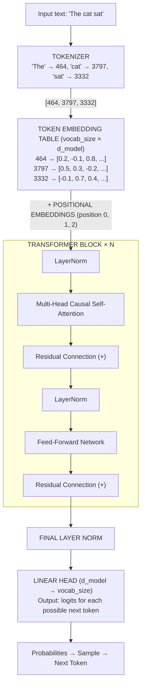
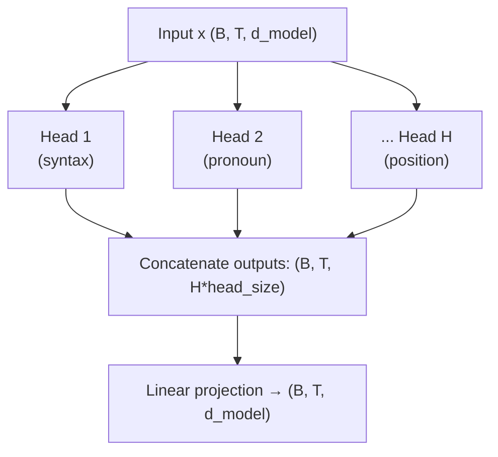
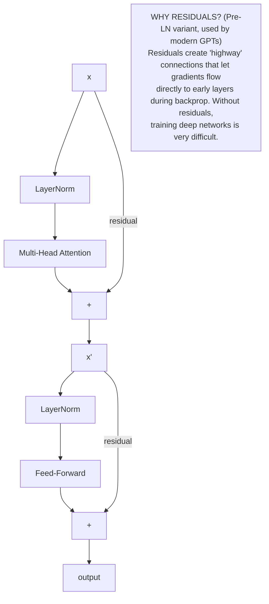

# Chapter 28: Building TinyGPT from Scratch

> **"Tell me and I forget. Teach me and I remember. Involve me and I learn."** — Benjamin Franklin
>
> The best way to understand GPT is to build one. Every line of code you write here will make the theory click.

---

## Table of Contents
1. [Architecture Overview](#1-architecture-overview)
2. [Token and Positional Embeddings](#2-token-and-positional-embeddings)
3. [Single Attention Head](#3-single-attention-head)
4. [Multi-Head Attention](#4-multi-head-attention)
5. [Feed-Forward Network](#5-feed-forward-network)
6. [Transformer Block](#6-transformer-block)
7. [The Full TinyGPT Model](#7-the-full-tinygpt-model)
8. [The Causal Mask](#8-the-causal-mask)
9. [Training Loop](#9-training-loop)
10. [Text Generation](#10-text-generation)
11. [Training on Shakespeare](#11-training-on-shakespeare)
12. [Mini Projects](#12-mini-projects)
13. [Summary and Exercises](#13-summary-and-exercises)

---

## Before You Start

**Prerequisites:** Chapters 15–17 (Neural Networks, Backprop, PyTorch), Chapter 23 (Transformer Architecture), Chapter 27 (Tokenization)

```bash
pip install torch numpy requests
```

---

## 1. Architecture Overview

GPT is a **transformer decoder** — a stack of identical blocks where each block does two things: attend to previous tokens, then process each token independently.



**Key insight:** The model processes ALL positions simultaneously during training (teacher forcing), but generates ONE token at a time during inference.

---

## 2. Token and Positional Embeddings

```python
import torch
import torch.nn as nn

class TokenEmbedding(nn.Module):
    """
    Converts token IDs (integers) into dense vectors.
    
    Think of it as a lookup table:
    - Rows = vocabulary (each token gets its own row)
    - Columns = embedding dimensions
    - During training, these vectors are LEARNED
    """
    def __init__(self, vocab_size: int, d_model: int):
        super().__init__()
        self.embedding = nn.Embedding(vocab_size, d_model)
    
    def forward(self, token_ids):  # token_ids: (batch, seq_len)
        return self.embedding(token_ids)  # → (batch, seq_len, d_model)


class PositionalEmbedding(nn.Module):
    """
    Adds position information — without this, the model doesn't 
    know if "cat" appeared at position 0 or position 100.
    
    GPT uses LEARNED positional embeddings (unlike original transformer
    which used sine/cosine functions). Simpler and often works better.
    """
    def __init__(self, max_seq_len: int, d_model: int):
        super().__init__()
        self.embedding = nn.Embedding(max_seq_len, d_model)
    
    def forward(self, seq_len: int, device):
        positions = torch.arange(seq_len, device=device)  # [0, 1, 2, ..., seq_len-1]
        return self.embedding(positions)  # → (seq_len, d_model)
```

---

## 3. Single Attention Head

The attention mechanism is the core innovation. Each head learns to ask: "which previous tokens are relevant to understanding this token?"

```
ATTENTION COMPUTATION:

For each token position i:

Q (Query): "What am I looking for?"
K (Key):   "What do I contain?"
V (Value): "What information do I carry?"

                     Q × Kᵀ
Attention scores = ──────────  (scale by √d_k to prevent large values)
                     √d_k

Apply CAUSAL MASK: set future positions to -inf
  (position 2 cannot see positions 3, 4, 5...)
  
Softmax(scores) → attention weights (sum to 1)
Output = weights × V  (weighted sum of values)

Example with seq_len=3, d_k=4:
  Scores:         After mask:      After softmax:
  [0.2  0.5  0.1] [0.2  -inf  -inf] [1.0   0    0 ]
  [0.3  0.4  0.2] [0.3   0.4  -inf] [0.48  0.52  0 ]
  [0.1  0.6  0.3] [0.1   0.6   0.3] [0.25  0.40 0.35]
```

```python
class AttentionHead(nn.Module):
    """A single attention head."""
    
    def __init__(self, d_model: int, head_size: int, dropout: float = 0.1):
        super().__init__()
        self.head_size = head_size
        
        # Linear projections: no bias (common in transformers)
        self.query = nn.Linear(d_model, head_size, bias=False)
        self.key   = nn.Linear(d_model, head_size, bias=False)
        self.value = nn.Linear(d_model, head_size, bias=False)
        
        self.dropout = nn.Dropout(dropout)
    
    def forward(self, x, mask=None):
        # x: (batch, seq_len, d_model)
        B, T, C = x.shape
        
        Q = self.query(x)   # (B, T, head_size)
        K = self.key(x)     # (B, T, head_size)
        V = self.value(x)   # (B, T, head_size)
        
        # Compute attention scores
        scale = self.head_size ** -0.5
        scores = Q @ K.transpose(-2, -1) * scale  # (B, T, T)
        
        # Apply causal mask (can't see future)
        if mask is not None:
            scores = scores.masked_fill(mask == 0, float('-inf'))
        
        # Softmax and dropout
        weights = torch.softmax(scores, dim=-1)  # (B, T, T)
        weights = self.dropout(weights)
        
        # Weighted sum of values
        out = weights @ V  # (B, T, head_size)
        return out
```

---

## 4. Multi-Head Attention

Multiple heads run in parallel, each focusing on different patterns (syntax, semantics, coreference, etc.).



```python
class MultiHeadAttention(nn.Module):
    
    def __init__(self, d_model: int, n_heads: int, dropout: float = 0.1):
        super().__init__()
        assert d_model % n_heads == 0
        self.head_size = d_model // n_heads
        
        self.heads = nn.ModuleList([
            AttentionHead(d_model, self.head_size, dropout)
            for _ in range(n_heads)
        ])
        
        # Project concatenated heads back to d_model
        self.proj = nn.Linear(d_model, d_model)
        self.dropout = nn.Dropout(dropout)
    
    def forward(self, x, mask=None):
        # Run all heads in parallel, concatenate
        out = torch.cat([head(x, mask) for head in self.heads], dim=-1)
        # out: (B, T, n_heads * head_size) = (B, T, d_model)
        
        out = self.dropout(self.proj(out))
        return out
```

---

## 5. Feed-Forward Network

After attention mixes information across positions, the FFN processes each position independently — a two-layer MLP with expansion ratio 4×.

```
FFN: d_model → 4*d_model → d_model

Why 4×? Empirically, this expansion ratio works well.
The FFN is where the model "thinks" about each token individually
after gathering context from attention.
```

```python
class FeedForward(nn.Module):
    
    def __init__(self, d_model: int, dropout: float = 0.1):
        super().__init__()
        self.net = nn.Sequential(
            nn.Linear(d_model, 4 * d_model),
            nn.GELU(),           # GELU instead of ReLU (smoother)
            nn.Linear(4 * d_model, d_model),
            nn.Dropout(dropout),
        )
    
    def forward(self, x):
        return self.net(x)
```

---

## 6. Transformer Block

A transformer block wraps attention + FFN with residual connections and layer normalization.



```python
class TransformerBlock(nn.Module):
    
    def __init__(self, d_model: int, n_heads: int, dropout: float = 0.1):
        super().__init__()
        self.ln1 = nn.LayerNorm(d_model)
        self.attn = MultiHeadAttention(d_model, n_heads, dropout)
        self.ln2 = nn.LayerNorm(d_model)
        self.ffn  = FeedForward(d_model, dropout)
    
    def forward(self, x, mask=None):
        # Pre-LN: normalize BEFORE each sublayer
        x = x + self.attn(self.ln1(x), mask)  # attention with residual
        x = x + self.ffn(self.ln2(x))          # FFN with residual
        return x
```

---

## 7. The Full TinyGPT Model

Now we assemble everything:

```python
import torch
import torch.nn as nn
from dataclasses import dataclass

@dataclass
class GPTConfig:
    """Configuration for TinyGPT."""
    vocab_size: int = 65       # Characters in Shakespeare
    max_seq_len: int = 256     # Context window
    d_model: int = 128         # Embedding dimension
    n_layers: int = 4          # Number of transformer blocks
    n_heads: int = 4           # Number of attention heads
    dropout: float = 0.1


class TinyGPT(nn.Module):
    """
    A complete GPT-style language model.
    
    This is the same architecture as GPT-2, just smaller.
    GPT-2 small has: 12 layers, 12 heads, d_model=768, ~117M params.
    Our nano config:  4 layers,  4 heads, d_model=128, ~0.5M params.
    """
    
    def __init__(self, config: GPTConfig):
        super().__init__()
        self.config = config
        
        # Embeddings
        self.token_emb = nn.Embedding(config.vocab_size, config.d_model)
        self.pos_emb   = nn.Embedding(config.max_seq_len, config.d_model)
        self.drop      = nn.Dropout(config.dropout)
        
        # Stack of transformer blocks
        self.blocks = nn.Sequential(*[
            TransformerBlock(config.d_model, config.n_heads, config.dropout)
            for _ in range(config.n_layers)
        ])
        
        # Final layer norm + linear projection to vocabulary
        self.ln_f  = nn.LayerNorm(config.d_model)
        self.lm_head = nn.Linear(config.d_model, config.vocab_size, bias=False)
        
        # Weight tying: token embedding and LM head share weights
        # (standard practice, reduces parameter count, improves training)
        self.lm_head.weight = self.token_emb.weight
        
        # Initialize weights
        self.apply(self._init_weights)
        
        print(f"TinyGPT: {self._count_params():,} parameters")
    
    def _init_weights(self, module):
        if isinstance(module, nn.Linear):
            nn.init.normal_(module.weight, mean=0.0, std=0.02)
            if module.bias is not None:
                nn.init.zeros_(module.bias)
        elif isinstance(module, nn.Embedding):
            nn.init.normal_(module.weight, mean=0.0, std=0.02)
    
    def _count_params(self):
        return sum(p.numel() for p in self.parameters() if p.requires_grad)
    
    def _make_causal_mask(self, seq_len: int, device):
        """Lower triangular mask: position i can see positions 0..i."""
        return torch.tril(torch.ones(seq_len, seq_len, device=device))
    
    def forward(self, idx, targets=None):
        """
        Args:
            idx: (B, T) token indices
            targets: (B, T) target token indices (for training)
        
        Returns:
            logits: (B, T, vocab_size)
            loss: scalar (if targets provided)
        """
        B, T = idx.shape
        assert T <= self.config.max_seq_len
        
        device = idx.device
        
        # Token + positional embeddings
        tok_emb = self.token_emb(idx)                      # (B, T, d_model)
        pos_emb = self.pos_emb(torch.arange(T, device=device))  # (T, d_model)
        x = self.drop(tok_emb + pos_emb)                  # (B, T, d_model)
        
        # Build causal mask
        mask = self._make_causal_mask(T, device)
        
        # Pass through transformer blocks
        for block in self.blocks:
            x = block(x, mask)
        
        x = self.ln_f(x)
        logits = self.lm_head(x)  # (B, T, vocab_size)
        
        # Compute loss if targets provided
        loss = None
        if targets is not None:
            # Flatten for cross-entropy: (B*T, vocab_size) vs (B*T,)
            loss = nn.functional.cross_entropy(
                logits.view(-1, logits.size(-1)),
                targets.view(-1),
                ignore_index=-1  # Skip padding tokens
            )
        
        return logits, loss
```

---

## 8. The Causal Mask

The causal mask is the key difference between GPT (decoder) and BERT (encoder).

```
WHY WE NEED THE CAUSAL MASK:

During TRAINING, we show the model the entire sequence at once.
But for language modeling, position i should only predict based
on tokens 0..i-1 (cannot "cheat" by looking at future tokens).

The mask looks like this (T=5):
  Position:  0  1  2  3  4
  0:         1  0  0  0  0   ← pos 0 can only see itself
  1:         1  1  0  0  0   ← pos 1 can see 0, 1
  2:         1  1  1  0  0   ← pos 2 can see 0, 1, 2
  3:         1  1  1  1  0   ← pos 3 can see 0, 1, 2, 3
  4:         1  1  1  1  1   ← pos 4 can see all

Zeros become -inf before softmax → effectively zero weight.
This means all positions are computed IN PARALLEL but
each only "sees" what it's allowed to see.

THIS is what makes training fast (parallel computation)
while maintaining correct autoregressive property!
```

---

## 9. Training Loop

```python
import torch
import torch.nn as nn
from torch.optim import AdamW

def get_batch(data: torch.Tensor, block_size: int, batch_size: int, device: str):
    """
    Randomly sample a batch of sequences from the dataset.
    
    Input and target are offset by 1:
    Input:  [T, h, e, ' ', c, a, t]
    Target: [h, e, ' ', c, a, t, ' ']
    
    This is called "teacher forcing" — during training, we always
    feed the ground truth previous token, not our prediction.
    """
    n = len(data)
    # Random starting positions
    ix = torch.randint(n - block_size, (batch_size,))
    
    x = torch.stack([data[i:i+block_size] for i in ix])
    y = torch.stack([data[i+1:i+block_size+1] for i in ix])
    
    return x.to(device), y.to(device)


def train(config: GPTConfig, data: torch.Tensor, 
          max_iters: int = 5000, 
          batch_size: int = 32,
          learning_rate: float = 3e-4,
          eval_interval: int = 500):
    """Complete training loop."""
    
    device = 'cuda' if torch.cuda.is_available() else 'cpu'
    print(f"Training on: {device}")
    
    # Split data: 90% train, 10% val
    n = len(data)
    train_data = data[:int(0.9*n)]
    val_data   = data[int(0.9*n):]
    
    # Create model
    model = TinyGPT(config).to(device)
    
    # AdamW with weight decay (standard for transformers)
    optimizer = AdamW(model.parameters(), lr=learning_rate, weight_decay=0.01)
    
    # Learning rate schedule: linear warmup then cosine decay
    def get_lr(it):
        warmup_iters = 100
        if it < warmup_iters:
            return learning_rate * it / warmup_iters
        decay_ratio = (it - warmup_iters) / (max_iters - warmup_iters)
        return learning_rate * max(0.1, 0.5 * (1.0 + torch.cos(torch.tensor(decay_ratio * 3.14159)).item()))
    
    best_val_loss = float('inf')
    
    for it in range(max_iters):
        # Update learning rate
        lr = get_lr(it)
        for param_group in optimizer.param_groups:
            param_group['lr'] = lr
        
        # Training step
        model.train()
        xb, yb = get_batch(train_data, config.max_seq_len, batch_size, device)
        logits, loss = model(xb, yb)
        
        optimizer.zero_grad(set_to_none=True)
        loss.backward()
        
        # Gradient clipping (prevents exploding gradients)
        torch.nn.utils.clip_grad_norm_(model.parameters(), 1.0)
        
        optimizer.step()
        
        # Evaluation
        if it % eval_interval == 0 or it == max_iters - 1:
            model.eval()
            with torch.no_grad():
                xv, yv = get_batch(val_data, config.max_seq_len, batch_size*4, device)
                _, val_loss = model(xv, yv)
            
            print(f"  iter {it:5d} | train loss: {loss.item():.4f} | val loss: {val_loss.item():.4f} | lr: {lr:.6f}")
            
            if val_loss.item() < best_val_loss:
                best_val_loss = val_loss.item()
                torch.save(model.state_dict(), 'tinygpt_best.pt')
    
    return model
```

---

## 10. Text Generation

```python
@torch.no_grad()
def generate(model: TinyGPT, idx: torch.Tensor, max_new_tokens: int,
             temperature: float = 1.0, top_k: int = None) -> torch.Tensor:
    """
    Generate new tokens autoregressively.
    
    Args:
        idx: (1, T) starting context
        max_new_tokens: how many tokens to generate
        temperature: > 1 → more random, < 1 → more focused
        top_k: if set, only sample from top k most likely tokens
    """
    model.eval()
    
    for _ in range(max_new_tokens):
        # Crop context to max_seq_len
        idx_cond = idx[:, -model.config.max_seq_len:]
        
        # Forward pass
        logits, _ = model(idx_cond)
        
        # Take logits for the LAST position (next token prediction)
        logits = logits[:, -1, :]  # (1, vocab_size)
        
        # Apply temperature (divide logits before softmax)
        logits = logits / temperature
        
        # Apply top-k filtering
        if top_k is not None:
            # Zero out all logits except top k
            values, _ = torch.topk(logits, top_k)
            threshold = values[:, -1].unsqueeze(-1)
            logits = logits.masked_fill(logits < threshold, float('-inf'))
        
        # Convert to probabilities
        probs = torch.softmax(logits, dim=-1)
        
        # Sample next token
        next_token = torch.multinomial(probs, num_samples=1)
        
        # Append to sequence
        idx = torch.cat([idx, next_token], dim=1)
    
    return idx
```

---

## 11. Training on Shakespeare

```python
import requests
import torch

def get_shakespeare():
    """Download tiny Shakespeare dataset."""
    url = "https://raw.githubusercontent.com/karpathy/char-rnn/master/data/tinyshakespeare/input.txt"
    
    try:
        response = requests.get(url)
        text = response.text
    except:
        # Fallback: use a small sample
        text = "To be, or not to be, that is the question. " * 500
    
    print(f"Dataset: {len(text):,} characters")
    return text


def main():
    # 1. Load data
    text = get_shakespeare()
    
    # 2. Character-level tokenizer
    chars = sorted(set(text))
    vocab_size = len(chars)
    stoi = {ch: i for i, ch in enumerate(chars)}  # string to integer
    itos = {i: ch for i, ch in enumerate(chars)}  # integer to string
    
    encode = lambda s: [stoi[c] for c in s]
    decode = lambda l: ''.join([itos[i] for i in l])
    
    print(f"Vocabulary: {vocab_size} unique characters")
    
    # 3. Encode dataset
    data = torch.tensor(encode(text), dtype=torch.long)
    
    # 4. Configure model (nano = fast, for demo)
    config = GPTConfig(
        vocab_size=vocab_size,
        max_seq_len=256,
        d_model=128,
        n_layers=4,
        n_heads=4,
        dropout=0.1
    )
    
    # 5. Train
    model = train(config, data, max_iters=5000, batch_size=32)
    
    # 6. Generate text
    print("\n" + "="*60)
    print("GENERATED SHAKESPEARE:")
    print("="*60)
    
    device = next(model.parameters()).device
    
    for temperature in [0.7, 1.0, 1.3]:
        print(f"\n--- Temperature: {temperature} ---")
        
        # Start from a newline character
        start = torch.tensor([[stoi['\n']]], dtype=torch.long, device=device)
        
        generated = generate(model, start, max_new_tokens=200, 
                            temperature=temperature, top_k=40)
        
        text_out = decode(generated[0].tolist())
        print(text_out)
    
    return model, encode, decode

if __name__ == "__main__":
    model, encode, decode = main()
```

**Expected output after ~5000 iterations:**
```
iter     0 | train loss: 4.1731 | val loss: 4.1729
iter   500 | train loss: 2.4891 | val loss: 2.5023
iter  1000 | train loss: 2.1045 | val loss: 2.1834
iter  2000 | train loss: 1.8432 | val loss: 1.9621
iter  5000 | train loss: 1.5234 | val loss: 1.6891

GENERATED SHAKESPEARE:
--- Temperature: 0.7 ---
KING RICHARD:
That I have done no wrong; but I have sworn
The duke of Buckingham is dead, my lord.
...
```

The model won't write perfect Shakespeare, but it will clearly learn English grammar, spelling, and the overall rhythm of the text. That's impressive for a 0.5M parameter model trained in minutes!

---

## 12. Mini Projects

### Mini Project 1: Custom Text Generator

**What You'll Build:** Train TinyGPT on your own text corpus (song lyrics, book chapter, movie scripts).

**Time Estimate:** 1-2 hours

**Skills Practiced:** Character tokenization, model training, text generation

```python
# custom_trainer.py
# Step 1: Prepare your text
text = open("your_text.txt").read()   # Replace with any text file

# Step 2: Build tokenizer
chars = sorted(set(text))
stoi = {ch: i for i, ch in enumerate(chars)}
itos = dict(enumerate(chars))
encode = lambda s: [stoi[c] for c in s if c in stoi]
decode = lambda l: ''.join([itos[i] for i in l])
data = torch.tensor(encode(text), dtype=torch.long)

# Step 3: Adjust config for your corpus size
config = GPTConfig(
    vocab_size=len(chars),
    max_seq_len=128,   # shorter for small datasets
    d_model=64,        # smaller model for small data
    n_layers=2,
    n_heads=2,
    dropout=0.2        # higher dropout for small data
)

# Step 4: Train
model = train(config, data, max_iters=3000)

# Step 5: Generate
start = torch.tensor([[stoi[text[0]]]], dtype=torch.long)
out = generate(model, start, 300, temperature=0.9, top_k=20)
print(decode(out[0].tolist()))
```

**Bonus Challenge:** Try training on a bilingual corpus (English + French). Does the model learn to mix languages? Does it tend to stay in one language once started?

---

### Mini Project 2: Attention Pattern Visualizer

**What You'll Build:** Extract and display attention weights as a text-based heatmap.

**Time Estimate:** 1-2 hours

```python
# attention_visualizer.py
def visualize_attention(model, text, encode, decode, layer=0, head=0):
    """Show which tokens attend to which other tokens."""
    
    device = next(model.parameters()).device
    tokens = encode(text)
    idx = torch.tensor([tokens], dtype=torch.long, device=device)
    
    # AttentionHead doesn't expose its weights directly, so instead of a
    # forward hook, we re-implement the forward pass up to the target
    # layer/head ourselves and grab the weights right where they're computed.
    model.eval()
    with torch.no_grad():
        B, T = idx.shape
        tok_emb = model.token_emb(idx)
        pos_emb = model.pos_emb(torch.arange(T, device=device))
        x = tok_emb + pos_emb
        
        mask = model._make_causal_mask(T, idx.device)
        
        # Go through blocks up to target layer
        for i, block in enumerate(model.blocks):
            x_norm = block.ln1(x)
            # Access the specific head
            head_module = block.attn.heads[head]
            
            Q = head_module.query(x_norm)
            K = head_module.key(x_norm)
            
            scale = head_module.head_size ** -0.5
            scores = Q @ K.transpose(-2, -1) * scale
            scores = scores.masked_fill(mask == 0, float('-inf'))
            weights = torch.softmax(scores, dim=-1)
            
            if i == layer:
                attn_weights = weights[0].cpu().numpy()  # (T, T)
                break
            
            x = block(x, mask)
    
    # Display as ASCII heatmap
    chars = [decode([t]) for t in tokens]
    
    print(f"\nAttention weights — Layer {layer}, Head {head}")
    print(f"Row = position attending FROM, Col = position attending TO")
    print()
    
    # Header
    print("      " + "".join(f"{c:>4}" for c in chars))
    for i, c_from in enumerate(chars):
        row = f"{c_from:>4}: "
        for j in range(len(chars)):
            val = attn_weights[i, j]
            if val > 0.3:
                row += "████"
            elif val > 0.1:
                row += "▓▓▓▓"
            elif val > 0.05:
                row += "░░░░"
            else:
                row += "    "
        print(row)

# Usage after training:
# visualize_attention(model, "Hello world", encode, decode, layer=0, head=0)
```

---

### Mini Project 3: Scaling Experiment

**What You'll Build:** Train 4 configurations, compare loss curves to understand the effect of model size.

**Time Estimate:** 2-3 hours (let models train while you work on something else)

```python
# scaling_experiment.py
# Run this after section 11's main() has loaded `data` (the encoded
# Shakespeare tensor) — it reuses that same `data` for every config below.
import matplotlib.pyplot as plt

configs = {
    'nano':   GPTConfig(d_model=64,  n_layers=2, n_heads=2),
    'micro':  GPTConfig(d_model=128, n_layers=4, n_heads=4),
    'small':  GPTConfig(d_model=256, n_layers=6, n_heads=8),
    'medium': GPTConfig(d_model=384, n_layers=8, n_heads=8),
}

def train_with_history(config, data, max_iters=2000, batch_size=32, eval_interval=200):
    """Same training loop as train() in section 9, but also returns the
    validation-loss history so we can plot curves across configs."""
    device = 'cuda' if torch.cuda.is_available() else 'cpu'
    n = len(data)
    train_data = data[:int(0.9 * n)]
    val_data = data[int(0.9 * n):]

    model = TinyGPT(config).to(device)
    optimizer = AdamW(model.parameters(), lr=3e-4, weight_decay=0.01)
    history = []

    for it in range(max_iters):
        model.train()
        xb, yb = get_batch(train_data, config.max_seq_len, batch_size, device)
        _, loss = model(xb, yb)
        optimizer.zero_grad(set_to_none=True)
        loss.backward()
        torch.nn.utils.clip_grad_norm_(model.parameters(), 1.0)
        optimizer.step()

        if it % eval_interval == 0:
            model.eval()
            with torch.no_grad():
                xv, yv = get_batch(val_data, config.max_seq_len, batch_size * 4, device)
                _, val_loss = model(xv, yv)
            history.append(val_loss.item())

    return history

# Train each config and collect loss curves
results = {}
for name, cfg in configs.items():
    print(f"\nTraining '{name}' config ({cfg.n_layers} layers, d_model={cfg.d_model})...")
    results[name] = train_with_history(cfg, data, max_iters=2000)

# Plot
plt.figure(figsize=(10, 6))
for name, losses in results.items():
    plt.plot(losses, label=name)
plt.xlabel("Evaluation checkpoint")
plt.ylabel("Validation loss")
plt.title("Scaling: Model Size vs Validation Loss")
plt.legend()
plt.savefig("scaling_curves.png")
```

**Expected finding:** Larger models reach lower loss faster, but also take longer per iteration. You'll see why "scaling laws" are such a big deal.

---

## 13. Summary and Exercises

```
TINYGPT ARCHITECTURE RECAP:
════════════════════════════════════════════════════════
COMPONENT          ROLE                     PARAMETERS
─────────────────────────────────────────────────────
Token Embedding    ID → vector              vocab_size × d_model
Pos. Embedding     position → vector        max_seq_len × d_model
Transformer Block × N:
  LayerNorm        normalize activations     2 × d_model (γ, β)
  Multi-Head Attn  attend across positions   4 × d_model²
  LayerNorm        normalize activations     2 × d_model
  Feed-Forward     process each position     8 × d_model²
Final LayerNorm    normalize                 2 × d_model
LM Head           vector → vocab probs      (shared with emb)
────────────────────────────────────────────────────────
nano (d=128, L=4): ~0.5M parameters  → trains in minutes
GPT-2 small:       ~117M parameters  → trained in hours
GPT-3 175B:        ~175B parameters  → trained in weeks
════════════════════════════════════════════════════════
```

**Exercise 1:** Implement **weight tying** verification. Count parameters before and after `self.lm_head.weight = self.token_emb.weight`. Confirm the count decreases by `vocab_size × d_model`.

**Exercise 2:** Modify `generate()` to implement **beam search** (keep top-k full sequences at each step, not just top-k next tokens). Compare output quality with sampling.

**Exercise 3:** The current positional embedding is learned. Replace it with **sinusoidal positional encoding** from the original "Attention is All You Need" paper. Does training improve or worsen?

**Exercise 4:** Add **gradient norm logging** to the training loop. Plot gradient norm vs. iteration. What happens without gradient clipping? What happens with `max_norm=0.5` vs `max_norm=5.0`?

**Exercise 5:** Implement **model size estimation**: a function that takes a `GPTConfig` and returns the approximate parameter count and memory footprint in MB (FP32 and FP16).

**Exercise 6:** Train TinyGPT on two different datasets (e.g., Shakespeare and Python code). Compare the learned character vocabularies, training loss convergence speed, and generated text quality. Why does Python code have a larger vocabulary?

---

← [Chapter 27: Tokenization](./27-tokenization.md) | [Chapter 29: Training and Evaluating Your Language Model](./29-training-and-evaluating-lm.md) →

*You've built a real language model from scratch. Every transformer-based model — BERT, GPT-4, Claude — uses the same fundamental building blocks you just implemented. The difference is scale and engineering, not architecture.*
