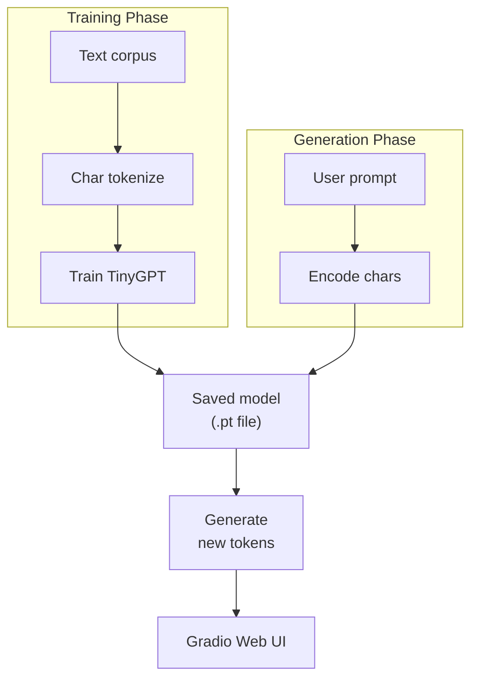

# Chapter 31 PROJECT: Build a Character-Level Story Generator

> **"The best projects teach you by forcing you to put theory into practice. This one is yours to run, break, tweak, and make your own."**

---

## Table of Contents
1. [Project Overview](#1-project-overview)
2. [Choosing Your Dataset](#2-choosing-your-dataset)
3. [Project Structure](#3-project-structure)
4. [data_prep.py](#4-data_preppy)
5. [model.py](#5-modelpy)
6. [train.py](#6-trainpy)
7. [generate.py](#7-generatepy)
8. [app.py — Gradio Web UI](#8-apppy--gradio-web-ui)
9. [Expected Results](#9-expected-results)
10. [Mini Variations](#10-mini-variations)
11. [What You Learned](#11-what-you-learned)

---

## Before You Start

**Prerequisites:** Chapters 28–30 (TinyGPT, Training, Scaling)

```bash
pip install torch numpy requests gradio tqdm
```

---

## 1. Project Overview

You will train a character-level language model that generates new text in the style of your training corpus. Give it Shakespeare and it writes Elizabethan prose. Give it Python code and it writes code. Give it song lyrics and it writes songs.



```
SAMPLE OUTPUT (after training on Shakespeare):
  Prompt:  "HAMLET:"
  Generated:
  "HAMLET:
   To be, or not to be, that is the question:
   Whether 'tis nobler in the mind to suffer
   The slings and arrows of outrageous fortune..."
   (obviously not perfect, but clearly Shakespeare-like!)
```

**Training time:**
- Nano config (2 layers, 64 dim): ~15 minutes on CPU
- Small config (4 layers, 128 dim): ~45 minutes on CPU
- Medium config (6 layers, 256 dim): ~2 hours on CPU, ~15 min on GPU

---

## 2. Choosing Your Dataset

### Option A: Tiny Shakespeare (Recommended for beginners)

```bash
# Download from Karpathy's char-rnn repo (classic ML dataset)
wget https://raw.githubusercontent.com/karpathy/char-rnn/master/data/tinyshakespeare/input.txt -O data/shakespeare.txt
```

About 1MB of text. Perfect for learning.

### Option B: Children's Stories

```bash
# Project Gutenberg books (public domain)
# Alice in Wonderland, Grimm's Fairy Tales, etc.
curl "https://www.gutenberg.org/files/11/11-0.txt" -o data/alice.txt
```

### Option C: Your Own Text

Any `.txt` file works. Minimum recommended size: 200KB (200,000 characters).

```python
# Check your dataset size
with open("data/your_text.txt") as f:
    text = f.read()
print(f"Dataset size: {len(text):,} characters")
print(f"Unique characters: {len(set(text))}")
# Recommended: at least 200k characters for meaningful learning
```

---

## 3. Project Structure

```
story_generator/
│
├── data/
│   ├── shakespeare.txt         # Your training text
│   └── (other text files)
│
├── checkpoints/
│   └── (saved model .pt files)
│
├── data_prep.py               # Load text, build vocab, encode
├── model.py                   # TinyGPT with config presets
├── train.py                   # Training loop with progress bar
├── generate.py                # Text generation with sampling
├── app.py                     # Gradio web interface
└── requirements.txt
```

---

## 4. data_prep.py

```python
# data_prep.py
"""
Load text, build character vocabulary, encode to integers.
Character-level tokenization is the simplest possible approach:
  each unique character becomes one token.
"""

import torch
import os

class CharTokenizer:
    """Simple character-level tokenizer."""
    
    def __init__(self):
        self.stoi = {}  # string (char) to integer
        self.itos = {}  # integer to string (char)
        self.vocab_size = 0
    
    def build_vocab(self, text: str):
        """Build vocabulary from text corpus."""
        chars = sorted(set(text))
        self.vocab_size = len(chars)
        self.stoi = {ch: i for i, ch in enumerate(chars)}
        self.itos = {i: ch for i, ch in enumerate(chars)}
        print(f"Vocabulary: {self.vocab_size} unique characters")
        print(f"Characters: {''.join(chars[:50])}{'...' if len(chars) > 50 else ''}")
        return self
    
    def encode(self, text: str) -> list:
        """Convert text string to list of integers."""
        return [self.stoi[c] for c in text if c in self.stoi]
    
    def decode(self, ids: list) -> str:
        """Convert list of integers back to text string."""
        return ''.join([self.itos[i] for i in ids])
    
    def save(self, path: str):
        import json
        data = {'stoi': self.stoi, 'itos': {str(k): v for k, v in self.itos.items()}}
        with open(path, 'w') as f:
            json.dump(data, f)
        print(f"Tokenizer saved to {path}")
    
    @classmethod
    def load(cls, path: str):
        import json
        with open(path) as f:
            data = json.load(f)
        tok = cls()
        tok.stoi = data['stoi']
        tok.itos = {int(k): v for k, v in data['itos'].items()}
        tok.vocab_size = len(tok.stoi)
        return tok


def load_and_prepare(filepath: str, val_split: float = 0.1):
    """
    Load text file, build tokenizer, encode, split into train/val.
    
    Returns:
        tokenizer: CharTokenizer
        train_data: torch.Tensor of encoded training data
        val_data: torch.Tensor of encoded validation data
    """
    # Load text
    if not os.path.exists(filepath):
        raise FileNotFoundError(f"Data file not found: {filepath}")
    
    with open(filepath, 'r', encoding='utf-8', errors='ignore') as f:
        text = f.read()
    
    print(f"Loaded: {len(text):,} characters from {filepath}")
    
    # Build tokenizer
    tokenizer = CharTokenizer()
    tokenizer.build_vocab(text)
    
    # Encode
    data = torch.tensor(tokenizer.encode(text), dtype=torch.long)
    print(f"Encoded: {len(data):,} tokens")
    
    # Split
    n = len(data)
    split = int(n * (1 - val_split))
    train_data = data[:split]
    val_data = data[split:]
    
    print(f"Train: {len(train_data):,} tokens | Val: {len(val_data):,} tokens")
    
    return tokenizer, train_data, val_data


if __name__ == "__main__":
    tokenizer, train, val = load_and_prepare("data/shakespeare.txt")
    tokenizer.save("checkpoints/tokenizer.json")
```

---

## 5. model.py

```python
# model.py
"""
TinyGPT with named configuration presets.
Same architecture as chapter 28, with convenient presets.
"""

import torch
import torch.nn as nn
from dataclasses import dataclass

@dataclass
class ModelConfig:
    vocab_size: int
    max_seq_len: int = 256
    d_model: int = 128
    n_layers: int = 4
    n_heads: int = 4
    dropout: float = 0.1

    @classmethod
    def nano(cls, vocab_size):
        """~0.1M params. Trains in 15 min on CPU. For quick experiments."""
        return cls(vocab_size=vocab_size, max_seq_len=128, 
                  d_model=64, n_layers=2, n_heads=2, dropout=0.1)
    
    @classmethod
    def small(cls, vocab_size):
        """~0.5M params. Trains in 45 min on CPU. Recommended starting point."""
        return cls(vocab_size=vocab_size, max_seq_len=256,
                  d_model=128, n_layers=4, n_heads=4, dropout=0.1)
    
    @classmethod
    def medium(cls, vocab_size):
        """~2M params. Trains in 2h on CPU, 15 min on GPU. Better quality."""
        return cls(vocab_size=vocab_size, max_seq_len=512,
                  d_model=256, n_layers=6, n_heads=8, dropout=0.1)


class AttentionHead(nn.Module):
    def __init__(self, d_model, head_size, dropout):
        super().__init__()
        self.head_size = head_size
        self.q = nn.Linear(d_model, head_size, bias=False)
        self.k = nn.Linear(d_model, head_size, bias=False)
        self.v = nn.Linear(d_model, head_size, bias=False)
        self.drop = nn.Dropout(dropout)
    
    def forward(self, x, mask):
        Q, K, V = self.q(x), self.k(x), self.v(x)
        scores = Q @ K.transpose(-2, -1) * (self.head_size ** -0.5)
        scores = scores.masked_fill(mask == 0, float('-inf'))
        weights = self.drop(torch.softmax(scores, dim=-1))
        return weights @ V


class Block(nn.Module):
    def __init__(self, config):
        super().__init__()
        head_size = config.d_model // config.n_heads
        self.ln1 = nn.LayerNorm(config.d_model)
        self.attn = nn.ModuleList([
            AttentionHead(config.d_model, head_size, config.dropout)
            for _ in range(config.n_heads)
        ])
        self.proj = nn.Linear(config.d_model, config.d_model)
        self.ln2 = nn.LayerNorm(config.d_model)
        self.ffn = nn.Sequential(
            nn.Linear(config.d_model, 4 * config.d_model),
            nn.GELU(),
            nn.Linear(4 * config.d_model, config.d_model),
            nn.Dropout(config.dropout),
        )
        self.drop = nn.Dropout(config.dropout)
    
    def forward(self, x, mask):
        # Attention with residual
        attended = torch.cat([h(self.ln1(x), mask) for h in self.attn], dim=-1)
        x = x + self.drop(self.proj(attended))
        # FFN with residual
        x = x + self.ffn(self.ln2(x))
        return x


class StoryGPT(nn.Module):
    """Character-level GPT for story generation."""
    
    def __init__(self, config: ModelConfig):
        super().__init__()
        self.config = config
        self.tok_emb = nn.Embedding(config.vocab_size, config.d_model)
        self.pos_emb = nn.Embedding(config.max_seq_len, config.d_model)
        self.drop = nn.Dropout(config.dropout)
        self.blocks = nn.ModuleList([Block(config) for _ in range(config.n_layers)])
        self.ln_f = nn.LayerNorm(config.d_model)
        self.lm_head = nn.Linear(config.d_model, config.vocab_size, bias=False)
        self.lm_head.weight = self.tok_emb.weight
        self.apply(self._init_weights)
    
    def _init_weights(self, m):
        if isinstance(m, (nn.Linear, nn.Embedding)):
            nn.init.normal_(m.weight, std=0.02)
    
    def count_params(self):
        n = sum(p.numel() for p in self.parameters())
        return f"{n/1e6:.2f}M"
    
    def forward(self, idx, targets=None):
        B, T = idx.shape
        device = idx.device
        
        x = self.drop(
            self.tok_emb(idx) + 
            self.pos_emb(torch.arange(T, device=device))
        )
        
        mask = torch.tril(torch.ones(T, T, device=device))
        
        for block in self.blocks:
            x = block(x, mask)
        
        logits = self.lm_head(self.ln_f(x))
        
        loss = None
        if targets is not None:
            loss = nn.functional.cross_entropy(
                logits.view(-1, logits.size(-1)),
                targets.view(-1)
            )
        return logits, loss
```

---

## 6. train.py

```python
# train.py
"""
Complete training loop with progress bar, best model saving, and loss logging.
Run: python train.py --config small --data data/shakespeare.txt
"""

import argparse
import json
import time
import torch
from torch.optim import AdamW
from tqdm import tqdm

from data_prep import load_and_prepare
from model import StoryGPT, ModelConfig


def get_batch(data, block_size, batch_size, device):
    ix = torch.randint(len(data) - block_size, (batch_size,))
    x = torch.stack([data[i:i+block_size] for i in ix]).to(device)
    y = torch.stack([data[i+1:i+block_size+1] for i in ix]).to(device)
    return x, y


@torch.no_grad()
def estimate_loss(model, train_data, val_data, block_size, batch_size, device, n_eval=100):
    """Estimate loss on train and val sets."""
    model.eval()
    losses = {}
    for split, data in [('train', train_data), ('val', val_data)]:
        split_losses = []
        for _ in range(n_eval):
            x, y = get_batch(data, block_size, batch_size, device)
            _, loss = model(x, y)
            split_losses.append(loss.item())
        losses[split] = sum(split_losses) / len(split_losses)
    model.train()
    return losses


def train(args):
    device = 'cuda' if torch.cuda.is_available() else 'cpu'
    print(f"\nDevice: {device}")
    
    # Load data
    tokenizer, train_data, val_data = load_and_prepare(args.data)
    tokenizer.save("checkpoints/tokenizer.json")
    
    # Create model
    config_fn = getattr(ModelConfig, args.config)
    config = config_fn(vocab_size=tokenizer.vocab_size)
    model = StoryGPT(config).to(device)
    print(f"Model: {model.count_params()} parameters ({args.config} config)")
    
    # Optimizer
    optimizer = AdamW(model.parameters(), lr=args.lr, weight_decay=0.01)
    
    # Learning rate schedule
    def cosine_lr(step):
        warmup = args.warmup_steps
        if step < warmup:
            return step / warmup
        progress = (step - warmup) / (args.max_steps - warmup)
        return 0.1 + 0.9 * 0.5 * (1 + torch.cos(torch.tensor(progress * 3.14159)).item())
    
    scheduler = torch.optim.lr_scheduler.LambdaLR(optimizer, cosine_lr)
    
    # Training
    best_val_loss = float('inf')
    log = {'train_loss': [], 'val_loss': [], 'steps': []}
    
    pbar = tqdm(range(args.max_steps), desc="Training")
    
    for step in pbar:
        x, y = get_batch(train_data, config.max_seq_len, args.batch_size, device)
        _, loss = model(x, y)
        
        optimizer.zero_grad(set_to_none=True)
        loss.backward()
        torch.nn.utils.clip_grad_norm_(model.parameters(), 1.0)
        optimizer.step()
        scheduler.step()
        
        pbar.set_postfix({'loss': f'{loss.item():.4f}'})
        
        if step % args.eval_every == 0 or step == args.max_steps - 1:
            losses = estimate_loss(model, train_data, val_data,
                                  config.max_seq_len, args.batch_size, device)
            log['train_loss'].append(losses['train'])
            log['val_loss'].append(losses['val'])
            log['steps'].append(step)
            
            pbar.write(
                f"Step {step:5d} | train: {losses['train']:.4f} | "
                f"val: {losses['val']:.4f} | lr: {scheduler.get_last_lr()[0]:.6f}"
            )
            
            if losses['val'] < best_val_loss:
                best_val_loss = losses['val']
                torch.save({
                    'model_state': model.state_dict(),
                    'config': config,
                    'step': step,
                    'val_loss': best_val_loss,
                }, f"checkpoints/best_model.pt")
                pbar.write(f"  ✓ Saved new best model (val_loss={best_val_loss:.4f})")
    
    # Save loss log
    with open("checkpoints/loss_log.json", 'w') as f:
        json.dump(log, f)
    
    print(f"\nTraining complete! Best val loss: {best_val_loss:.4f}")
    print(f"Model saved to: checkpoints/best_model.pt")


if __name__ == "__main__":
    parser = argparse.ArgumentParser()
    parser.add_argument('--config', default='small', choices=['nano', 'small', 'medium'])
    parser.add_argument('--data', default='data/shakespeare.txt')
    parser.add_argument('--max_steps', type=int, default=5000)
    parser.add_argument('--batch_size', type=int, default=32)
    parser.add_argument('--lr', type=float, default=3e-4)
    parser.add_argument('--eval_every', type=int, default=500)
    parser.add_argument('--warmup_steps', type=int, default=200)
    args = parser.parse_args()
    
    import os
    os.makedirs("checkpoints", exist_ok=True)
    
    train(args)
```

---

## 7. generate.py

```python
# generate.py
"""
Generate text from a trained model.
Run: python generate.py --prompt "HAMLET:" --tokens 200 --temperature 0.8
"""

import argparse
import torch
from data_prep import CharTokenizer
from model import StoryGPT


@torch.no_grad()
def generate(model, tokenizer, prompt: str, 
             max_new_tokens: int = 200,
             temperature: float = 1.0,
             top_k: int = 40) -> str:
    """
    Generate text continuation given a prompt.
    
    Args:
        prompt: Starting text (e.g., "HAMLET:")
        max_new_tokens: How many characters to generate
        temperature: 0.1=focused/repetitive, 1.0=balanced, 1.5=creative/random
        top_k: Only sample from top k most likely next characters
    """
    model.eval()
    device = next(model.parameters()).device
    
    # Encode prompt
    ids = tokenizer.encode(prompt)
    if not ids:
        ids = [0]  # fallback to first token
    
    idx = torch.tensor([ids], dtype=torch.long, device=device)
    
    for _ in range(max_new_tokens):
        # Crop to context window
        idx_cond = idx[:, -model.config.max_seq_len:]
        
        logits, _ = model(idx_cond)
        logits = logits[:, -1, :] / temperature
        
        if top_k is not None:
            v, _ = torch.topk(logits, min(top_k, logits.size(-1)))
            logits[logits < v[:, [-1]]] = float('-inf')
        
        probs = torch.softmax(logits, dim=-1)
        next_id = torch.multinomial(probs, 1)
        idx = torch.cat([idx, next_id], dim=1)
    
    return tokenizer.decode(idx[0].tolist())


def main():
    parser = argparse.ArgumentParser()
    parser.add_argument('--checkpoint', default='checkpoints/best_model.pt')
    parser.add_argument('--tokenizer', default='checkpoints/tokenizer.json')
    parser.add_argument('--prompt', default='\n')
    parser.add_argument('--tokens', type=int, default=300)
    parser.add_argument('--temperature', type=float, default=0.8)
    parser.add_argument('--top_k', type=int, default=40)
    parser.add_argument('--samples', type=int, default=1)
    args = parser.parse_args()
    
    # Load
    tokenizer = CharTokenizer.load(args.tokenizer)
    checkpoint = torch.load(args.checkpoint, map_location='cpu')
    model = StoryGPT(checkpoint['config'])
    model.load_state_dict(checkpoint['model_state'])
    
    print(f"Loaded model (val_loss={checkpoint['val_loss']:.4f})")
    print(f"Prompt: {repr(args.prompt)}")
    print("="*60)
    
    for i in range(args.samples):
        if args.samples > 1:
            print(f"\n--- Sample {i+1} ---")
        
        text = generate(
            model, tokenizer, args.prompt,
            max_new_tokens=args.tokens,
            temperature=args.temperature,
            top_k=args.top_k
        )
        print(text)
        print()


if __name__ == "__main__":
    main()
```

---

## 8. app.py — Gradio Web UI

```python
# app.py
"""
Simple Gradio web UI for interactive story generation.
Run: python app.py
Then open: http://localhost:7860
"""

import gradio as gr
import torch
from data_prep import CharTokenizer
from model import StoryGPT
from generate import generate

# Load model once at startup
checkpoint = torch.load('checkpoints/best_model.pt', map_location='cpu')
tokenizer = CharTokenizer.load('checkpoints/tokenizer.json')
model = StoryGPT(checkpoint['config'])
model.load_state_dict(checkpoint['model_state'])
model.eval()

print(f"Model loaded (val_loss={checkpoint['val_loss']:.4f})")


def generate_text(prompt, max_tokens, temperature, top_k):
    """Generate text and return it."""
    if not prompt:
        prompt = "\n"
    
    result = generate(
        model, tokenizer, prompt,
        max_new_tokens=int(max_tokens),
        temperature=float(temperature),
        top_k=int(top_k)
    )
    return result


# Build the UI
with gr.Blocks(title="Story Generator") as demo:
    gr.Markdown("# Character-Level Story Generator")
    gr.Markdown("Enter a prompt and the model will continue writing in the same style.")
    
    with gr.Row():
        with gr.Column(scale=1):
            prompt_input = gr.Textbox(
                label="Prompt (starting text)",
                placeholder="HAMLET:\nTo be",
                value="HAMLET:\n",
                lines=3
            )
            
            with gr.Row():
                temperature = gr.Slider(
                    minimum=0.1, maximum=2.0, value=0.8, step=0.1,
                    label="Temperature (creativity)",
                    info="Low = focused, High = creative"
                )
                top_k = gr.Slider(
                    minimum=1, maximum=100, value=40, step=1,
                    label="Top-K",
                    info="How many choices to consider at each step"
                )
            
            max_tokens = gr.Slider(
                minimum=50, maximum=1000, value=300, step=50,
                label="Tokens to generate"
            )
            
            generate_btn = gr.Button("Generate", variant="primary")
        
        with gr.Column(scale=1):
            output = gr.Textbox(
                label="Generated text",
                lines=20,
                interactive=False
            )
    
    generate_btn.click(
        generate_text,
        inputs=[prompt_input, max_tokens, temperature, top_k],
        outputs=output
    )
    
    gr.Examples(
        examples=[
            ["HAMLET:\n", 300, 0.8, 40],
            ["Once upon a time", 400, 1.0, 30],
            ["To be, or not to be,", 200, 0.6, 20],
        ],
        inputs=[prompt_input, max_tokens, temperature, top_k]
    )

if __name__ == "__main__":
    demo.launch(share=False)
```

---

## 9. Expected Results

```
TRAINING PROGRESS (small config on Shakespeare):
══════════════════════════════════════════════════════════
Step     0 | train: 4.174 | val: 4.172  ← Random guessing
Step   500 | train: 2.481 | val: 2.502  ← Learning structure
Step  1000 | train: 2.091 | val: 2.143  ← Words forming
Step  2000 | train: 1.812 | val: 1.934  ← Phrases emerging
Step  5000 | train: 1.534 | val: 1.701  ← Recognizable style
══════════════════════════════════════════════════════════

GENERATED TEXT AT STEP 5000:
Prompt: "HAMLET:"

HAMLET:
The king of England to this present,
And say he comes himself, as by his friends,
Which I have spoke of, is not like the morning.

POLONIUS:
I will be bold with you, my liege, and say
That time hath brought him to the world.

HAMLET:
O, what a rogue and peasant slave am I!
══════════════════════════════════════════════════════════

Not perfect Shakespeare, but clearly:
✓ Correct character name formatting
✓ Iambic-ish rhythm
✓ Period-appropriate vocabulary  
✓ Coherent short phrases
✗ Long-range coherence (plot) is too hard for small models
```

---

## 10. Mini Variations

### Variation 1: Poetry Generator

Train on a collection of poems instead of prose.

```bash
# Download Emily Dickinson poems (public domain)
curl "https://www.gutenberg.org/files/12242/12242-0.txt" -o data/dickinson.txt

# Train with shorter sequences (poems are dense)
python train.py --data data/dickinson.txt --config nano --max_steps 3000

# Generate with low temperature for more focused output
python generate.py --prompt "I heard a Fly buzz" --temperature 0.6 --tokens 100
```

**Expected output style:**
```
I heard a Fly buzz — when I died —
The Stillness in the Room
Was like the Stillness in the Air
Between the Heaves of Storm —
```

---

### Variation 2: Python Code Autocomplete

```python
# Collect Python code snippets
import inspect
import torch
import numpy

code_samples = []
for module in [torch.nn, torch.optim, numpy.linalg]:
    for name, obj in inspect.getmembers(module):
        if inspect.isfunction(obj) or inspect.isclass(obj):
            doc = inspect.getsource(obj) if hasattr(obj, '__code__') else ""
            if doc:
                code_samples.append(doc[:500])

with open("data/python_code.txt", 'w') as f:
    f.write('\n\n'.join(code_samples))
```

Train with longer sequences (code has more structure):
```bash
python train.py --data data/python_code.txt --config small
python generate.py --prompt "def train(" --temperature 0.3 --tokens 200
```

---

### Variation 3: Dialogue Generator

```bash
# Download movie scripts or dialogue datasets
# Cornell Movie Dialogs Corpus (public)
# Format: process into continuous dialogue text

python generate.py --prompt "Alice: Hello, how are you?" --temperature 0.9
```

---

## 11. What You Learned

```
PROJECT SKILLS MASTERED:
══════════════════════════════════════════════════════════
DATA PIPELINE:
  ✓ Character-level tokenization
  ✓ Train/val splitting
  ✓ Batch generation from a text corpus
  ✓ Saving/loading tokenizers

MODEL ARCHITECTURE:
  ✓ Building GPT from components (embedding, attention, FFN)
  ✓ Configuration presets (nano/small/medium)
  ✓ Weight initialization best practices

TRAINING:
  ✓ Teacher forcing training loop
  ✓ Cosine LR scheduling with warmup
  ✓ Gradient clipping
  ✓ Best model checkpointing
  ✓ Training progress monitoring

GENERATION:
  ✓ Autoregressive generation
  ✓ Temperature scaling for creativity control
  ✓ Top-k sampling for quality filtering
  ✓ Context window handling

DEPLOYMENT:
  ✓ Gradio web interface
  ✓ Model loading from checkpoints
  ✓ Interactive parameter exploration
══════════════════════════════════════════════════════════
```

---

← [Chapter 30: Scaling Up — SLM](./30-scaling-to-slm.md) | [Chapter 32: Generative AI Deep Dive](./32-generative-ai-deep-dive.md) →

*Your model learned to write. Now let's learn about the full ecosystem of modern generative AI — the APIs, embeddings, RAG systems, and agents that power real-world AI applications.*
