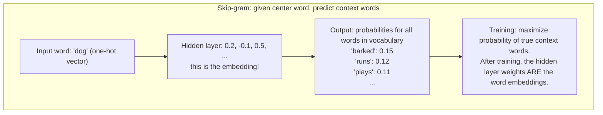

# Chapter 33: Embeddings and Semantic Search

> **"Embedding is the art of encoding meaning as geometry. Once ideas live in a coordinate system, you can measure, compare, and search them mathematically."**

---

## Table of Contents
1. [What is an Embedding?](#1-what-is-an-embedding)
2. [Word2Vec](#2-word2vec)
3. [GloVe](#3-glove)
4. [The Polysemy Problem](#4-the-polysemy-problem)
5. [Sentence Embeddings](#5-sentence-embeddings)
6. [Cosine Similarity](#6-cosine-similarity)
7. [Building a Semantic Search Engine](#7-building-a-semantic-search-engine)
8. [Bi-encoders vs Cross-encoders](#8-bi-encoders-vs-cross-encoders)
9. [Practical: sentence-transformers](#9-practical-sentence-transformers)
10. [Embedding Biases](#10-embedding-biases)
11. [Mini Projects](#11-mini-projects)
12. [Summary and Exercises](#12-summary-and-exercises)

---

## Before You Start

**Prerequisites:** Chapter 23 (Transformer Architecture), Chapter 24 (BERT)

```bash
pip install sentence-transformers gensim numpy scikit-learn matplotlib
```

---

## 1. What is an Embedding?

An embedding converts discrete objects (words, sentences, documents, images) into continuous vectors in a high-dimensional space. The key property: **similar things end up near each other**.

```
THE GEOMETRIC INTUITION:

Imagine arranging words in 3D space so that:
• Similar words are close together
• Dissimilar words are far apart

        SPORTS         FOOD
          •baseball      •pizza
     •soccer  •tennis   •pasta •sushi
                        •burger

         ANIMALS
           •dog
       •cat    •wolf
         •fox

After training Word2Vec on billions of words,
this geometry emerges AUTOMATICALLY.
The model learns that dog/cat/wolf co-occur in similar contexts,
so it places them near each other.

In practice: vectors have 50-1500 dimensions (not 3!),
but the principle is the same.
```

**Why is this powerful?**
1. **Similarity search**: find documents similar to a query (chapter 34: vector databases)
2. **Clustering**: group similar items without labels
3. **Transfer learning**: embeddings trained on huge corpora transfer to small tasks
4. **Analogies**: vector arithmetic captures semantic relationships

---

## 2. Word2Vec

Word2Vec (Mikolov et al., 2013) learns word embeddings from large text corpora using a simple idea: **words that appear in similar contexts have similar meanings**.

```
THE DISTRIBUTIONAL HYPOTHESIS:
"You shall know a word by the company it keeps."
— J.R. Firth, 1957

Example:
  "The ___ barked at the stranger."
  "The ___ chased the ball."
  "The ___ wagged its tail."
  
Words that fill these blanks well: dog, puppy, retriever
→ These words should have similar embeddings

Words that don't fit: cat (sometimes), table (never)
→ These words should have different embeddings from dog
```

### Skip-Gram Architecture



```python
# Using pre-trained Word2Vec via gensim
import gensim.downloader as api

# Download pre-trained vectors (this takes a few minutes)
# Options: 'word2vec-google-news-300' (large), 'glove-wiki-gigaword-50' (small)
wv = api.load('glove-wiki-gigaword-50')  # 50-dimensional, smaller download

print(f"Vocabulary size: {len(wv)}")
print(f"Vector for 'king': {wv['king'][:5]}...")  # First 5 dims

# Find similar words
print("\nWords similar to 'dog':")
for word, score in wv.most_similar('dog', topn=5):
    print(f"  {word}: {score:.3f}")

# The famous analogy: king - man + woman = queen
result = wv.most_similar(positive=['king', 'woman'], negative=['man'], topn=1)
print(f"\nking - man + woman = {result[0][0]}")  # → queen

# Word similarity
print(f"\nSimilarity:")
print(f"  dog vs cat:   {wv.similarity('dog', 'cat'):.3f}")
print(f"  dog vs table: {wv.similarity('dog', 'table'):.3f}")
print(f"  hot vs cold:  {wv.similarity('hot', 'cold'):.3f}")  # opposites → still similar!
```

**Key insight about "hot vs cold":** They appear in similar contexts ("it is very hot/cold", "the water is hot/cold") so they end up with similar embeddings, even though they're semantic opposites. Embeddings capture **association**, not necessarily **meaning**.

---

## 3. GloVe

GloVe (Global Vectors, Stanford, 2014) takes a different approach: instead of using a sliding window over text, it uses the full global co-occurrence matrix.

```
WORD2VEC vs GLOVE:

Word2Vec: local context window
  → Learns from "nearby" words only
  → Online learning (processes text word by word)
  
GloVe: global co-occurrence
  → Build matrix: count(word_i appears near word_j) for all pairs
  → Factorize this matrix into embeddings
  → Captures global statistics

WHICH IS BETTER?
  → Both produce similar quality embeddings in practice
  → GloVe tends to be slightly better on analogy tasks
  → Word2Vec is faster to train from scratch
  → Both are outdated for most tasks! Use contextual embeddings.
```

---

## 4. The Polysemy Problem

Static embeddings like Word2Vec assign **one vector per word** regardless of context. This breaks for polysemous words (words with multiple meanings).

```
POLYSEMY EXAMPLES:

"bank"
  → "I deposited money at the bank"  (financial institution)
  → "I sat on the river bank"        (river edge)
  → "The plane banked left"          (to tilt/turn)
  → "I bank on your support"         (to rely on)
  
Word2Vec gives "bank" ONE vector that's a blend of all meanings.
This vector is near: money, finance, river, water, tilt... confusing!

"lead"
  → "She leads the team"    (guide)
  → "Lead is toxic"         (heavy metal)
  → "I need a new lead"     (clue/connection)

Static embeddings: single confused vector
BERT: different vector for each usage = correct meaning!
```

---

## 5. Sentence Embeddings

Word embeddings don't directly give us sentence or document embeddings. Several approaches:

```
APPROACH 1: Average Word Vectors (simple, works ok)
  sentence = "the cat sat on the mat"
  embedding = mean([vec("the"), vec("cat"), vec("sat"), ...])
  
  Problem: ignores word order
  "dog bites man" ≈ "man bites dog" (same words, same average!)

APPROACH 2: BERT [CLS] Token
  BERT adds a [CLS] token at the start.
  The final hidden state of [CLS] is used as the sentence embedding.
  
  Problem: [CLS] wasn't explicitly trained for semantic similarity.
  Works ok but not optimal for retrieval.

APPROACH 3: Sentence-BERT (SBERT) ← Best approach
  Fine-tune BERT on Natural Language Inference pairs using siamese networks.
  Mean-pool all token embeddings (better than just CLS).
  Explicitly trained for semantic similarity!
  
  Result: "The cat sat" and "A cat was sitting" have high similarity.
          "The cat sat" and "I love pizza" have low similarity.
```

---

## 6. Cosine Similarity

The standard way to measure similarity between embedding vectors:

```
COSINE SIMILARITY:

  similarity = (A · B) / (||A|| × ||B||)
  
  Where:
  • A · B is the dot product (sum of elementwise products)
  • ||A|| is the magnitude (length) of vector A
  
  Range: -1 (opposite) to +1 (identical)
  
  Why cosine instead of Euclidean distance?
  • Cosine ignores magnitude, measures DIRECTION only
  • Two documents of different lengths have different magnitude
    but may cover the same topic → cosine handles this well
  
  Example:
  A = [1, 2, 3]  (short doc about cats)
  B = [2, 4, 6]  (long doc about cats — same topic, 2× as long)
  
  Euclidean: ||A-B|| = sqrt(1+4+9) = 3.74  ← "different"!
  Cosine:     A·B/(||A||×||B||) = 28/(3.74×7.48) = 1.0 ← "identical"!
```

```python
import numpy as np

def cosine_similarity(a: np.ndarray, b: np.ndarray) -> float:
    """Compute cosine similarity between two vectors."""
    dot_product = np.dot(a, b)
    magnitude = np.linalg.norm(a) * np.linalg.norm(b)
    if magnitude == 0:
        return 0.0
    return dot_product / magnitude

def cosine_similarity_matrix(A: np.ndarray, B: np.ndarray) -> np.ndarray:
    """
    Compute cosine similarity between all pairs in A and B.
    A: (n, d), B: (m, d) → returns (n, m) similarity matrix
    """
    # Normalize rows to unit length
    A_norm = A / np.linalg.norm(A, axis=1, keepdims=True)
    B_norm = B / np.linalg.norm(B, axis=1, keepdims=True)
    # Now dot product = cosine similarity
    return A_norm @ B_norm.T

# Example
a = np.array([1.0, 2.0, 3.0])
b = np.array([2.0, 4.0, 6.0])   # Same direction
c = np.array([1.0, 0.0, -1.0])  # Different direction

print(f"a vs b: {cosine_similarity(a, b):.4f}")  # ≈ 1.0
print(f"a vs c: {cosine_similarity(a, c):.4f}")  # < 0.5
```

---

## 7. Building a Semantic Search Engine

```python
from sentence_transformers import SentenceTransformer
import numpy as np

class SemanticSearchEngine:
    """
    Simple semantic search using sentence embeddings.
    
    How it works:
    1. Embed all documents at index time
    2. For a query, embed it too
    3. Find documents with highest cosine similarity to query
    """
    
    def __init__(self, model_name: str = 'all-MiniLM-L6-v2'):
        """
        'all-MiniLM-L6-v2' is a great default:
        • 384-dimensional embeddings
        • Fast (22ms per sentence on CPU)
        • High quality for English
        • Only 22MB download
        """
        print(f"Loading embedding model: {model_name}")
        self.model = SentenceTransformer(model_name)
        self.documents = []
        self.embeddings = None
    
    def add_documents(self, documents: list, batch_size: int = 32):
        """Embed and index a list of documents."""
        print(f"Indexing {len(documents)} documents...")
        
        self.documents = documents
        
        # Encode in batches (more efficient than one at a time)
        self.embeddings = self.model.encode(
            documents,
            batch_size=batch_size,
            show_progress_bar=True,
            normalize_embeddings=True  # L2 normalize → cosine sim = dot product
        )
        
        print(f"Done! Embedding shape: {self.embeddings.shape}")
    
    def search(self, query: str, top_k: int = 5) -> list:
        """
        Find the most semantically similar documents to a query.
        
        Returns list of (score, document) tuples, sorted by score.
        """
        if self.embeddings is None:
            raise RuntimeError("No documents indexed. Call add_documents() first.")
        
        # Embed the query
        query_embedding = self.model.encode(
            query,
            normalize_embeddings=True
        )
        
        # Compute similarities (dot product since embeddings are normalized)
        similarities = self.embeddings @ query_embedding
        
        # Get top-k indices
        top_indices = np.argsort(similarities)[::-1][:top_k]
        
        results = []
        for idx in top_indices:
            results.append({
                'score': float(similarities[idx]),
                'document': self.documents[idx],
                'rank': len(results) + 1
            })
        
        return results
    
    def print_results(self, query: str, results: list):
        """Print search results in a readable format."""
        print(f"\nQuery: '{query}'")
        print("="*60)
        for r in results:
            score_bar = "█" * int(r['score'] * 20)
            print(f"{r['rank']}. [{r['score']:.3f}] {score_bar}")
            # Print first 100 chars
            doc_preview = r['document'][:100] + "..." if len(r['document']) > 100 else r['document']
            print(f"   {doc_preview}")
            print()


# Complete example:
if __name__ == "__main__":
    # Sample knowledge base
    documents = [
        "Machine learning is a type of artificial intelligence that allows computers to learn from data.",
        "Neural networks are computing systems inspired by biological neurons in animal brains.",
        "Python is a high-level programming language known for its simplicity and readability.",
        "Deep learning uses multiple layers of neural networks to learn representations of data.",
        "The gradient descent algorithm minimizes a loss function by iteratively adjusting parameters.",
        "Transfer learning involves using a model trained on one task as a starting point for another.",
        "Overfitting occurs when a model learns the training data too well and fails to generalize.",
        "Data augmentation artificially increases training data by applying transformations to existing data.",
        "The attention mechanism allows neural networks to focus on relevant parts of input sequences.",
        "BERT is a transformer model pre-trained on masked language modeling and next sentence prediction.",
        "GPT models generate text by predicting the next token in a sequence autoregressively.",
        "Reinforcement learning trains agents to maximize cumulative reward through trial and error.",
    ]
    
    engine = SemanticSearchEngine()
    engine.add_documents(documents)
    
    queries = [
        "How do neural nets learn?",
        "what makes models fail on new data",
        "sequence modeling with attention",
        "coding and programming languages for ML",
    ]
    
    for query in queries:
        results = engine.search(query, top_k=3)
        engine.print_results(query, results)
```

---

## 8. Bi-encoders vs Cross-encoders

```mermaid
flowchart TD
    subgraph BI["Bi-encoder (what we built above)"]
        Q1["Query"] --> E1["Encoder"] --> QV["q_vec"]
        D1["Doc 1, Doc 2, ... (each encoded independently)"] --> E2["Encoder"] --> DV["d1_vec, d2_vec, ..."]
        QV --> S1["similarity(q_vec, d_vec) per doc"]
        DV --> S1
        S1 --> P1["PROS: fast — pre-compute all doc embeddings, O(1) per query;<br/>search 1M docs in milliseconds<br/>CONS: no cross-attention between query words and doc words"]
    end
    subgraph CE["Cross-encoder (for reranking)"]
        P["Pair: query + doc (one pair at a time)"] --> E3["Encoder"] --> R["Relevance score"]
        R --> P2["PROS: query and doc see each other — much better accuracy<br/>CONS: re-run encoder for EVERY (query, doc) pair;<br/>~100 docs/sec (10,000x slower than bi-encoder)"]
    end
    subgraph HY["Hybrid approach (production best practice)"]
        H1["Step 1: Bi-encoder retrieves top 100 candidates (fast)"] --> H2["Step 2: Cross-encoder reranks top 100 (accurate)"] --> H3["Return top 10 — best of both worlds!"]
    end
```



```python
from sentence_transformers import CrossEncoder

# Use cross-encoder for reranking
cross_encoder = CrossEncoder('cross-encoder/ms-marco-MiniLM-L-6-v2')

# After bi-encoder retrieves candidates:
candidates = [
    "Machine learning is a type of artificial intelligence...",
    "Neural networks are computing systems...",
    "Deep learning uses multiple layers...",
]
query = "How do computers learn from data?"

# Cross-encode all (query, candidate) pairs
pairs = [[query, doc] for doc in candidates]
scores = cross_encoder.predict(pairs)

# Sort by cross-encoder score
reranked = sorted(zip(scores, candidates), reverse=True)
for score, doc in reranked:
    print(f"{score:.3f}: {doc[:60]}...")
```

---

## 9. Practical: sentence-transformers

```python
from sentence_transformers import SentenceTransformer, util

# Load a model
model = SentenceTransformer('all-MiniLM-L6-v2')

# ── Basic embedding ────────────────────────────────────────────
sentences = [
    "The weather is lovely today.",
    "It's so sunny outside!",
    "He drove to the stadium.",
]

embeddings = model.encode(sentences)
print(f"Embedding shape: {embeddings.shape}")  # (3, 384)

# ── Pairwise similarity ────────────────────────────────────────
similarity_matrix = util.cos_sim(embeddings, embeddings)
print("\nSimilarity matrix:")
for i, s1 in enumerate(sentences):
    for j, s2 in enumerate(sentences):
        print(f"  '{s1[:25]}' vs '{s2[:25]}': {similarity_matrix[i][j]:.3f}")

# ── Semantic textual similarity ────────────────────────────────
from sentence_transformers import SentenceTransformer

model = SentenceTransformer('all-MiniLM-L6-v2')

sentence_pairs = [
    ("I love dogs", "I adore dogs"),           # Very similar
    ("I love dogs", "Dogs are my favorite"),    # Similar
    ("I love dogs", "The sky is blue"),         # Unrelated
    ("The cat sat on the mat", "A feline rested on a rug"),  # Paraphrase
]

for s1, s2 in sentence_pairs:
    emb1 = model.encode(s1)
    emb2 = model.encode(s2)
    sim = util.cos_sim(emb1, emb2).item()
    print(f"  {sim:.3f}: '{s1}' vs '{s2}'")

# ── Multilingual embedding ─────────────────────────────────────
multi_model = SentenceTransformer('paraphrase-multilingual-MiniLM-L12-v2')

english = "How are you?"
french = "Comment allez-vous?"
german = "Wie geht es Ihnen?"
japanese = "お元気ですか？"

embs = multi_model.encode([english, french, german, japanese])
print("\nMultilingual similarity (all asking 'How are you?'):")
sim = util.cos_sim(embs, embs)
print(sim)  # Should be high similarity across languages!
```

---

## 10. Embedding Biases

Word embeddings learn from human text — and human text contains biases.

```python
import gensim.downloader as api
wv = api.load('word2vec-google-news-300')

# Gender bias example:
print("'nurse' is to 'woman' as 'doctor' is to...?")
result = wv.most_similar(positive=['doctor', 'woman'], negative=['man'])
print(result[:3])  # Historically: returns 'nurse', 'physician', etc.

print("\n'engineer' is to 'man' as 'engineer' is to...?")
result = wv.most_similar(positive=['engineer', 'woman'], negative=['man'])
print(result[:3])  # Often returns non-engineer occupations

print("\nOccupations sorted by female-male gender direction:")
gender_direction = wv['woman'] - wv['man']
occupations = ['doctor', 'nurse', 'engineer', 'teacher', 'professor', 
               'programmer', 'homemaker', 'pilot', 'secretary']
scores = [(occ, np.dot(wv[occ], gender_direction)) for occ in occupations]
for occ, score in sorted(scores, key=lambda x: x[1]):
    bar = "█" * int(abs(score) * 50)
    direction = "♀" if score > 0 else "♂"
    print(f"  {occ:<15}: {score:+.3f} {direction} {bar}")
```

**What this means:** Embedding models inherit biases from their training data. When using embeddings in production:
- Be aware of biased associations
- Test for bias before deployment
- Consider debiasing techniques (hard debiasing, projection)
- Document known biases in model cards

---

## 11. Mini Projects

### Mini Project 1: Semantic Search for Your Notes

**What You'll Build:** A search engine for your own text files using sentence embeddings.

**Time Estimate:** 1-2 hours

```python
# notes_search.py
import os
from pathlib import Path
from sentence_transformers import SentenceTransformer
import numpy as np
import json

def build_notes_index(notes_dir: str, model_name: str = 'all-MiniLM-L6-v2'):
    """Index all .txt and .md files in a directory."""
    model = SentenceTransformer(model_name)
    
    # Collect all text chunks (split by paragraph)
    chunks = []
    for filepath in Path(notes_dir).rglob("*.txt"):
        text = filepath.read_text(errors='ignore')
        paragraphs = [p.strip() for p in text.split('\n\n') if len(p.strip()) > 50]
        for para in paragraphs:
            chunks.append({'text': para, 'file': str(filepath)})
    
    if not chunks:
        print("No text files found!")
        return None, None
    
    print(f"Indexing {len(chunks)} paragraphs from {notes_dir}...")
    texts = [c['text'] for c in chunks]
    embeddings = model.encode(texts, show_progress_bar=True, normalize_embeddings=True)
    
    return chunks, embeddings

def search_notes(query, chunks, embeddings, model, top_k=5):
    q_emb = model.encode(query, normalize_embeddings=True)
    scores = embeddings @ q_emb
    top_idx = np.argsort(scores)[::-1][:top_k]
    
    print(f"\nResults for: '{query}'")
    for i, idx in enumerate(top_idx, 1):
        print(f"\n{i}. [{scores[idx]:.3f}] {chunks[idx]['file']}")
        print(f"   {chunks[idx]['text'][:200]}...")

# Usage:
# chunks, embeddings = build_notes_index("~/Documents/notes")
# model = SentenceTransformer('all-MiniLM-L6-v2')
# search_notes("machine learning gradient descent", chunks, embeddings, model)
```

---

### Mini Project 2: Word Analogy Explorer

**What You'll Build:** An interactive explorer for word vector analogies.

```python
# analogy_explorer.py
import gensim.downloader as api
import numpy as np

wv = api.load('glove-wiki-gigaword-50')

def analogy(a, b, c, topn=5):
    """Find D such that A:B as C:D"""
    try:
        results = wv.most_similar(positive=[b, c], negative=[a], topn=topn)
        print(f"\n'{a}' is to '{b}' as '{c}' is to...?")
        for word, score in results:
            print(f"  {word} ({score:.3f})")
    except KeyError as e:
        print(f"Word not in vocabulary: {e}")

def nearest_neighbors(word, topn=10):
    """Find words most similar to given word."""
    try:
        results = wv.most_similar(word, topn=topn)
        print(f"\nNearest neighbors of '{word}':")
        for w, s in results:
            bar = "█" * int(s * 20)
            print(f"  {w:<15}: {s:.3f} {bar}")
    except KeyError:
        print(f"'{word}' not in vocabulary")

# Explore!
analogy("man", "king", "woman")          # → queen
analogy("paris", "france", "london")     # → england/britain
analogy("good", "better", "bad")         # → worse
analogy("walk", "walked", "run")         # → ran

nearest_neighbors("python")  # coding, programming, or the snake?
nearest_neighbors("apple")   # fruit or tech company?
```

---

### Mini Project 3: Sentence Cluster Visualizer

**What You'll Build:** Visualize how sentences cluster in embedding space.

```python
# cluster_visualizer.py
from sentence_transformers import SentenceTransformer
from sklearn.cluster import KMeans
from sklearn.decomposition import PCA
import matplotlib.pyplot as plt
import numpy as np

sentences = [
    # Sports
    "The football team won the championship",
    "Soccer players need excellent stamina",
    "The basketball game went into overtime",
    "Tennis requires both physical and mental strength",
    # Food
    "The pasta dish was perfectly seasoned",
    "She baked a chocolate cake for the birthday",
    "The sushi restaurant had fresh fish",
    "Pizza is the most popular food in Italy",
    # Technology
    "Machine learning algorithms process large datasets",
    "The new smartphone has a powerful processor",
    "Neural networks are inspired by the brain",
    "Cloud computing enables scalable applications",
    # Nature
    "The mountain lake reflected the sunset perfectly",
    "Wild wolves roam through the northern forests",
    "Ocean waves crashed against the rocky shore",
    "Spring flowers bloom after the winter frost",
]

categories = ['Sports']*4 + ['Food']*4 + ['Technology']*4 + ['Nature']*4
colors = {'Sports': 'red', 'Food': 'orange', 'Technology': 'blue', 'Nature': 'green'}

model = SentenceTransformer('all-MiniLM-L6-v2')
embeddings = model.encode(sentences)

# Reduce to 2D for visualization
pca = PCA(n_components=2)
coords = pca.fit_transform(embeddings)

plt.figure(figsize=(12, 8))
for i, (x, y) in enumerate(coords):
    cat = categories[i]
    plt.scatter(x, y, color=colors[cat], s=100, zorder=5)
    plt.annotate(sentences[i][:25] + "...", (x, y), 
                fontsize=7, ha='center', va='bottom')

# Add legend
for cat, color in colors.items():
    plt.scatter([], [], color=color, label=cat, s=100)
plt.legend()
plt.title('Sentence Embeddings Visualized (PCA to 2D)')
plt.xlabel(f'PC1 ({pca.explained_variance_ratio_[0]:.1%} variance)')
plt.ylabel(f'PC2 ({pca.explained_variance_ratio_[1]:.1%} variance)')
plt.tight_layout()
plt.savefig('sentence_clusters.png', dpi=150)
print("Saved to sentence_clusters.png")
print("Sentences in the same category should cluster together!")
```

---

## 12. Summary and Exercises

```
KEY CONCEPTS:
══════════════════════════════════════════════════════════
Word embeddings:
  • Word2Vec: predict context from center word (skip-gram)
  • GloVe: factorize global co-occurrence matrix
  • Both: 1 vector per word, trained unsupervised
  • Problem: polysemy (1 meaning per word)

Sentence embeddings:
  • Average word vectors: fast but ignores order
  • BERT [CLS]: ok, not trained for similarity
  • SBERT: fine-tuned for similarity, best choice

Similarity:
  • Cosine similarity: measures angle between vectors
  • Range: -1 (opposite) to +1 (identical)
  • Normalize vectors first → dot product = cosine

Search:
  • Bi-encoder: fast (index once, query anytime)
  • Cross-encoder: accurate but slow (re-encode each pair)
  • Hybrid: bi-encoder retrieves, cross-encoder reranks
══════════════════════════════════════════════════════════
```

**Exercise 1:** Implement cosine similarity from scratch (numpy only, no sklearn). Verify against `sklearn.metrics.pairwise.cosine_similarity` on 100 random pairs.

**Exercise 2:** The "odd one out" game: given 4 words, find the one that doesn't belong (lowest average similarity to the others). Test on: ["dog", "cat", "wolf", "table"] and ["France", "Germany", "Italy", "Boston"].

**Exercise 3:** Measure the effect of embedding model size. Compare `all-MiniLM-L6-v2` (22MB) vs `all-mpnet-base-v2` (420MB) on 50 semantic similarity pairs. Is the larger model significantly better?

**Exercise 4:** Build a "quote recommender": given a theme (love, courage, wisdom), find the most relevant quotes from a collection of 100 quotes. Which embedding model works best?

**Exercise 5:** Implement **TFIDF weighting for sentence embeddings**: instead of averaging word vectors uniformly, weight each word by its TF-IDF score. Compare similarity quality to uniform averaging on 20 sentence pairs.

---

← [Chapter 32: Generative AI Deep Dive](./32-generative-ai-deep-dive.md) | [Chapter 34: Vector Databases](./34-vector-databases.md) →
