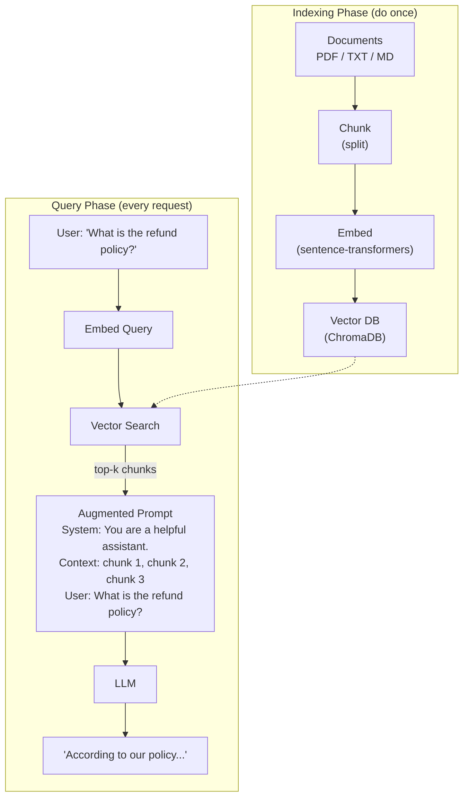

# Chapter 35: RAG — Retrieval Augmented Generation

> **"RAG is the duct tape of AI applications — simple, unglamorous, and responsible for holding together most production AI systems."**

---

## Table of Contents
1. [The Problem RAG Solves](#1-the-problem-rag-solves)
2. [RAG Architecture](#2-rag-architecture)
3. [Document Loading](#3-document-loading)
4. [Chunking Strategies](#4-chunking-strategies)
5. [Embedding and Indexing](#5-embedding-and-indexing)
6. [Retrieval](#6-retrieval)
7. [Context Injection](#7-context-injection)
8. [Reranking](#8-reranking)
9. [Query Reformulation](#9-query-reformulation)
10. [RAG Evaluation](#10-rag-evaluation)
11. [Complete RAG Pipeline](#11-complete-rag-pipeline)
12. [Common Failure Modes](#12-common-failure-modes)
13. [Mini Projects](#13-mini-projects)
14. [Summary and Exercises](#14-summary-and-exercises)

---

## Before You Start

**Prerequisites:** Chapters 33–34 (Embeddings, Vector Databases)

```bash
pip install chromadb sentence-transformers anthropic openai pymupdf langchain-text-splitters
```

---

## 1. The Problem RAG Solves

```
THREE PROBLEMS WITH PURE LLMs:

1. KNOWLEDGE CUTOFF
   "What happened in yesterday's news?"
   LLM: "My training data ends in [date]. I don't know."
   
   RAG solution: retrieve today's news, inject into prompt
   
2. PRIVATE DATA
   "What does our company policy say about vacation days?"
   LLM: "I have no access to your internal documents."
   
   RAG solution: index your documents, retrieve relevant policy

3. HALLUCINATION
   "What did Einstein write in his 1935 paper on entanglement?"
   LLM: [confidently makes something up]
   
   RAG solution: retrieve the actual paper, ground the answer
   
RAG doesn't solve ALL hallucination — models still sometimes
ignore retrieved context — but it dramatically reduces it.
```

---

## 2. RAG Architecture



---

## 3. Document Loading

```python
import re
from pathlib import Path

class DocumentLoader:
    """Load text from various document formats."""
    
    @staticmethod
    def load_text(filepath: str) -> str:
        """Load a plain text file."""
        return Path(filepath).read_text(encoding='utf-8', errors='ignore')
    
    @staticmethod
    def load_pdf(filepath: str) -> str:
        """Load a PDF file using PyMuPDF."""
        try:
            import fitz  # PyMuPDF
            doc = fitz.open(filepath)
            text = ""
            for page in doc:
                text += page.get_text() + "\n\n"
            doc.close()
            return text
        except ImportError:
            raise ImportError("Install PyMuPDF: pip install pymupdf")
    
    @staticmethod
    def load_markdown(filepath: str) -> str:
        """Load a markdown file, stripping formatting."""
        text = Path(filepath).read_text(encoding='utf-8', errors='ignore')
        # Remove markdown headers (keep text)
        text = re.sub(r'^#{1,6}\s+', '', text, flags=re.MULTILINE)
        # Remove markdown bold/italic
        text = re.sub(r'\*+([^*]+)\*+', r'\1', text)
        return text
    
    @staticmethod
    def load_url(url: str) -> str:
        """Load text content from a URL."""
        try:
            import requests
            from bs4 import BeautifulSoup
            
            response = requests.get(url, timeout=10)
            soup = BeautifulSoup(response.content, 'html.parser')
            
            # Remove scripts and styles
            for element in soup(["script", "style", "nav", "footer"]):
                element.decompose()
            
            return soup.get_text(separator='\n', strip=True)
        except ImportError:
            raise ImportError("Install: pip install requests beautifulsoup4")
    
    def load(self, filepath: str) -> str:
        """Auto-detect format and load."""
        ext = Path(filepath).suffix.lower()
        loaders = {
            '.txt': self.load_text,
            '.pdf': self.load_pdf,
            '.md': self.load_markdown,
            '.markdown': self.load_markdown,
        }
        loader = loaders.get(ext, self.load_text)
        return loader(filepath)
```

---

## 4. Chunking Strategies

```
WHY CHUNKING MATTERS:

Too large chunks (entire document):
  ✗ Query might match only one sentence but we return 10 pages
  ✗ Fills up context window with irrelevant content
  ✗ Model "loses" the relevant sentence in the noise

Too small chunks (single sentence):
  ✗ Lack context — "It was approved in 1972" — approved what?
  ✗ Need more chunks to cover enough context
  ✗ More API calls, more cost

Sweet spot: 200-500 tokens with overlap
```

```python
from typing import List

class TextChunker:
    """Multiple chunking strategies."""
    
    @staticmethod
    def fixed_size(text: str, chunk_size: int = 500, overlap: int = 50) -> List[str]:
        """
        Split text into overlapping fixed-size chunks.
        
        Overlap ensures context isn't lost at chunk boundaries.
        Example: chunk_size=500, overlap=50
          Chunk 1: chars 0-500
          Chunk 2: chars 450-950  ← overlaps by 50
          Chunk 3: chars 900-1400 ← overlaps by 50
        """
        if len(text) <= chunk_size:
            return [text]
        
        chunks = []
        start = 0
        while start < len(text):
            end = start + chunk_size
            chunk = text[start:end]
            
            # Try to break at a sentence boundary
            if end < len(text):
                last_period = chunk.rfind('.')
                if last_period > chunk_size * 0.5:  # Don't cut too early
                    chunk = chunk[:last_period + 1]
                    end = start + last_period + 1
            
            chunks.append(chunk.strip())
            start = end - overlap
        
        return [c for c in chunks if len(c) > 20]  # Skip tiny chunks
    
    @staticmethod
    def by_paragraph(text: str, min_size: int = 100, max_size: int = 1000) -> List[str]:
        """
        Split text at paragraph boundaries (double newlines).
        Merge short paragraphs, split long ones.
        """
        paragraphs = [p.strip() for p in text.split('\n\n') if p.strip()]
        
        chunks = []
        current = ""
        
        for para in paragraphs:
            if len(current) + len(para) < max_size:
                current += (" " if current else "") + para
            else:
                if len(current) >= min_size:
                    chunks.append(current)
                current = para
        
        if len(current) >= min_size:
            chunks.append(current)
        
        return chunks
    
    @staticmethod
    def recursive(text: str, chunk_size: int = 500, overlap: int = 50) -> List[str]:
        """
        Split by progressively smaller separators:
        paragraphs → sentences → words
        (similar to langchain RecursiveCharacterTextSplitter)
        """
        separators = ['\n\n', '\n', '. ', ' ', '']
        
        def split_with_sep(text, sep):
            return [s.strip() for s in text.split(sep) if s.strip()]
        
        def merge_chunks(splits, target_size):
            chunks = []
            current = []
            current_len = 0
            
            for s in splits:
                if current_len + len(s) > target_size and current:
                    chunks.append(' '.join(current))
                    # Overlap: keep last few items
                    overlap_items = []
                    overlap_len = 0
                    for item in reversed(current):
                        if overlap_len + len(item) < overlap:
                            overlap_items.insert(0, item)
                            overlap_len += len(item)
                        else:
                            break
                    current = overlap_items
                    current_len = overlap_len
                
                current.append(s)
                current_len += len(s)
            
            if current:
                chunks.append(' '.join(current))
            
            return chunks
        
        if len(text) <= chunk_size:
            return [text]
        
        for sep in separators:
            if sep in text:
                splits = split_with_sep(text, sep)
                return merge_chunks(splits, chunk_size)
        
        return [text[i:i+chunk_size] for i in range(0, len(text), chunk_size - overlap)]


# Comparison
text = """Machine learning is transforming every industry.
It enables computers to learn from data without being explicitly programmed.

Deep learning, a subset of machine learning, uses neural networks with many layers.
These networks can automatically learn features from raw data.

Natural language processing allows computers to understand human language.
Recent advances have made it possible to build chatbots that converse naturally."""

chunker = TextChunker()
print("Fixed size chunks:")
for i, c in enumerate(chunker.fixed_size(text, chunk_size=150, overlap=30)):
    print(f"  Chunk {i+1} ({len(c)} chars): {c[:60]}...")
```

---

## 5. Embedding and Indexing

```python
import chromadb
from chromadb.utils import embedding_functions
from typing import List, Dict

class RAGIndexer:
    """Build and manage the vector index for RAG."""
    
    def __init__(self, collection_name: str, db_path: str = "./rag_db"):
        embed_fn = embedding_functions.SentenceTransformerEmbeddingFunction(
            model_name="all-MiniLM-L6-v2"
        )
        self.client = chromadb.PersistentClient(path=db_path)
        self.collection = self.client.get_or_create_collection(
            name=collection_name,
            embedding_function=embed_fn,
            metadata={"hnsw:space": "cosine"}
        )
        self.chunker = TextChunker()
        self.loader = DocumentLoader()
    
    def index_file(self, filepath: str, metadata: dict = None):
        """Load, chunk, and index a document file."""
        print(f"Indexing: {filepath}")
        
        # Load
        text = self.loader.load(filepath)
        print(f"  Loaded: {len(text):,} characters")
        
        # Chunk
        chunks = self.chunker.recursive(text, chunk_size=400, overlap=50)
        print(f"  Chunked into {len(chunks)} pieces")
        
        # Build metadata
        base_meta = {"source": str(filepath), **(metadata or {})}
        
        # Add to index
        self.collection.add(
            documents=chunks,
            ids=[f"{filepath}_{i}" for i in range(len(chunks))],
            metadatas=[{**base_meta, "chunk_index": i} for i in range(len(chunks))]
        )
        
        print(f"  Indexed {len(chunks)} chunks")
        return len(chunks)
    
    def get_retriever(self, top_k: int = 5):
        """Return a retrieval function."""
        def retrieve(query: str, filters: dict = None) -> List[dict]:
            kwargs = {
                "query_texts": [query],
                "n_results": min(top_k, self.collection.count()),
                "include": ["documents", "distances", "metadatas"]
            }
            if filters:
                kwargs["where"] = filters
            
            results = self.collection.query(**kwargs)
            
            return [
                {
                    "text": doc,
                    "score": 1 - dist,
                    "source": meta.get("source", "unknown"),
                    "chunk_index": meta.get("chunk_index", 0)
                }
                for doc, dist, meta in zip(
                    results['documents'][0],
                    results['distances'][0],
                    results['metadatas'][0]
                )
            ]
        
        return retrieve
```

---

## 6. Retrieval

```python
# Dense retrieval (built into indexer above)
# BM25 sparse retrieval for hybrid:

from rank_bm25 import BM25Okapi

class BM25Retriever:
    """Keyword-based retrieval using BM25."""
    
    def __init__(self, documents: List[str]):
        tokenized = [doc.lower().split() for doc in documents]
        self.bm25 = BM25Okapi(tokenized)
        self.documents = documents
    
    def retrieve(self, query: str, top_k: int = 5) -> List[tuple]:
        tokens = query.lower().split()
        scores = self.bm25.get_scores(tokens)
        top_indices = sorted(range(len(scores)), key=lambda i: scores[i], reverse=True)[:top_k]
        return [(scores[i], self.documents[i]) for i in top_indices]
```

---

## 7. Context Injection

```python
def build_prompt(query: str, retrieved_chunks: List[dict], 
                 system_prompt: str = None) -> list:
    """
    Build the LLM prompt with retrieved context.
    
    Key design decisions:
    1. Source citations make the model more likely to use the context
    2. Explicit instruction to only use provided context reduces hallucination
    3. Token budget management — don't overflow the context window
    """
    MAX_CONTEXT_CHARS = 6000  # Leave room for system prompt and response
    
    # Build context block
    context_parts = []
    total_chars = 0
    
    for i, chunk in enumerate(retrieved_chunks, 1):
        chunk_text = f"[Source {i}: {chunk['source']}]\n{chunk['text']}"
        
        if total_chars + len(chunk_text) > MAX_CONTEXT_CHARS:
            break
        
        context_parts.append(chunk_text)
        total_chars += len(chunk_text)
    
    context_block = "\n\n---\n\n".join(context_parts)
    
    # Build messages
    system = system_prompt or """You are a helpful assistant. Answer questions based ONLY on the provided context.
If the context doesn't contain enough information to answer, say "I don't have enough information about this."
Always cite which source you used."""
    
    user_message = f"""<context>
{context_block}
</context>

Question: {query}"""
    
    return [
        {"role": "system", "content": system},
        {"role": "user", "content": user_message}
    ]
```

---

## 8. Reranking

```python
from sentence_transformers import CrossEncoder

class Reranker:
    """Cross-encoder reranking for higher precision."""
    
    def __init__(self, model_name: str = 'cross-encoder/ms-marco-MiniLM-L-6-v2'):
        print(f"Loading reranker: {model_name}")
        self.model = CrossEncoder(model_name)
    
    def rerank(self, query: str, documents: List[dict], top_k: int = 3) -> List[dict]:
        """
        Rerank documents using cross-encoder for better precision.
        Use AFTER bi-encoder retrieval, not instead of it.
        """
        if not documents:
            return []
        
        pairs = [(query, doc['text']) for doc in documents]
        scores = self.model.predict(pairs)
        
        # Sort by cross-encoder score
        ranked = sorted(
            zip(scores, documents),
            key=lambda x: x[0],
            reverse=True
        )
        
        # Update scores and return top_k
        result = []
        for score, doc in ranked[:top_k]:
            doc['rerank_score'] = float(score)
            result.append(doc)
        
        return result
```

---

## 9. Query Reformulation

```python
import anthropic

def hypothetical_document_embedding(query: str, client) -> str:
    """
    HyDE: Generate a hypothetical answer to the query,
    then use THAT as the search query.
    
    WHY: Embedding a hypothetical answer is often more similar
    to relevant documents than embedding the question itself.
    
    Question: "What are the main causes of inflation?"
    → LLM generates: "Inflation is primarily caused by... [2 sentences]"
    → We search using this hypothetical answer text
    → Finds docs about inflation causes more reliably!
    """
    response = client.messages.create(
        model="claude-haiku-4-5-20251001",
        max_tokens=150,
        messages=[{
            "role": "user",
            "content": f"Write a brief, factual answer (2-3 sentences) to: {query}"
        }]
    )
    return response.content[0].text

def multi_query_expansion(query: str, client, n: int = 3) -> List[str]:
    """
    Generate multiple phrasings of the same query.
    Search with all of them, merge results.
    
    Handles cases where users phrase queries unexpectedly.
    """
    response = client.messages.create(
        model="claude-haiku-4-5-20251001",
        max_tokens=200,
        messages=[{
            "role": "user",
            "content": f"""Generate {n} different ways to search for: "{query}"
            Return only the queries, one per line, no numbering."""
        }]
    )
    
    queries = [query]  # Always include original
    queries.extend(response.content[0].text.strip().split('\n'))
    return queries[:n+1]
```

---

## 10. RAG Evaluation

```python
def evaluate_rag(qa_pairs: List[dict], rag_system, judge_client) -> dict:
    """
    Evaluate RAG quality using RAGAS-inspired metrics.
    
    Each qa_pair: {"question": str, "expected_answer": str}
    
    Metrics:
    - faithfulness: Is the answer grounded in retrieved context?
    - answer_relevance: Does the answer address the question?
    - context_precision: Are retrieved chunks actually relevant?
    """
    
    faithfulness_scores = []
    relevance_scores = []
    
    for qa in qa_pairs:
        answer, chunks = rag_system.query(qa['question'])
        
        # Faithfulness: can we verify the answer from the context?
        faith_prompt = f"""Given this context:
{chr(10).join(c['text'] for c in chunks)}

And this answer:
{answer}

Rate 1-5: How well is this answer supported by the context? (1=hallucinated, 5=fully supported)
Respond with only a number."""
        
        faith_response = judge_client.messages.create(
            model="claude-haiku-4-5-20251001",
            max_tokens=5,
            messages=[{"role": "user", "content": faith_prompt}]
        )
        
        try:
            faithfulness_scores.append(int(faith_response.content[0].text.strip()))
        except:
            faithfulness_scores.append(3)
        
        # Answer relevance
        rel_prompt = f"""Question: {qa['question']}
Answer: {answer}
Rate 1-5: How relevant is this answer to the question? (1=off-topic, 5=perfectly answers)
Respond with only a number."""
        
        rel_response = judge_client.messages.create(
            model="claude-haiku-4-5-20251001",
            max_tokens=5,
            messages=[{"role": "user", "content": rel_prompt}]
        )
        
        try:
            relevance_scores.append(int(rel_response.content[0].text.strip()))
        except:
            relevance_scores.append(3)
    
    return {
        "faithfulness": sum(faithfulness_scores) / len(faithfulness_scores) / 5,
        "answer_relevance": sum(relevance_scores) / len(relevance_scores) / 5,
        "n_questions": len(qa_pairs)
    }
```

---

## 11. Complete RAG Pipeline

```python
import anthropic

class RAGPipeline:
    """
    Complete RAG system combining all components.
    """
    
    def __init__(self, collection_name: str = "rag_docs"):
        self.indexer = RAGIndexer(collection_name)
        self.retrieve = self.indexer.get_retriever(top_k=10)
        self.reranker = Reranker()
        self.client = anthropic.Anthropic()
    
    def index_documents(self, filepaths: List[str]):
        """Index a list of document files."""
        for fp in filepaths:
            self.indexer.index_file(fp)
        print(f"Total indexed: {self.indexer.collection.count()} chunks")
    
    def query(self, question: str, use_reranker: bool = True) -> tuple:
        """
        Answer a question using RAG.
        Returns (answer, retrieved_chunks)
        """
        # 1. Retrieve candidates
        chunks = self.retrieve(question)
        
        # 2. Rerank for precision
        if use_reranker and chunks:
            chunks = self.reranker.rerank(question, chunks, top_k=5)
        else:
            chunks = chunks[:5]
        
        # 3. Build prompt
        messages = build_prompt(question, chunks)
        
        # 4. Generate answer
        response = self.client.messages.create(
            model="claude-haiku-4-5-20251001",
            max_tokens=1000,
            messages=messages[1:],  # user messages
            system=messages[0]["content"]  # system prompt
        )
        
        answer = response.content[0].text
        return answer, chunks
    
    def chat(self, question: str):
        """Interactive query with output."""
        print(f"\nQ: {question}")
        print("─"*60)
        
        answer, chunks = self.query(question)
        
        print(f"A: {answer}")
        print(f"\nBased on {len(chunks)} retrieved chunks:")
        for c in chunks:
            print(f"  • [{c['score']:.3f}] {c['source']}: {c['text'][:80]}...")


# Usage:
# rag = RAGPipeline()
# rag.index_documents(["docs/policy.pdf", "docs/faq.txt", "docs/guide.md"])
# rag.chat("What is the return policy?")
# rag.chat("How do I reset my password?")
```

---

## 12. Common Failure Modes

```
RAG FAILURE MODES AND FIXES:

1. WRONG CHUNKS RETRIEVED
   Symptom: Answer misses the point, uses irrelevant context
   Causes: Poor chunking, bad embedding model, weak query
   Fixes:
   • Try different chunk sizes (200 vs 500 tokens)
   • Use a better embedding model
   • Add reranking
   • Try query expansion (HyDE, multi-query)

2. HALLUCINATION DESPITE CONTEXT
   Symptom: Model generates info not in context
   Causes: Weak instruction following, too little relevant context
   Fixes:
   • Strengthen system prompt: "ONLY use provided context"
   • Use a larger, more instruction-following model
   • Add faithfulness check to post-process

3. CONTEXT WINDOW OVERFLOW
   Symptom: Truncated context, last chunks ignored
   Causes: Too many/too large chunks
   Fixes:
   • Reduce top_k (3-5 instead of 10)
   • Use smaller chunks with higher precision reranking
   • Map-reduce: answer per chunk, then synthesize

4. "LOST IN THE MIDDLE" PROBLEM
   Symptom: Middle chunks ignored even if relevant
   Research finding: LLMs use first and last context better!
   Fix: Put most relevant chunks at start and end

5. CHUNK BOUNDARY CUTS ANSWER
   Symptom: Relevant sentence at edge of two chunks
   Fix: Increase overlap (50-100 tokens overlap between chunks)
```

---

## 13. Mini Projects

### Mini Project 1: PDF Q&A Bot

**What You'll Build:** Upload any PDF and ask questions about it.

```python
# pdf_qa.py
import sys
from pathlib import Path

def build_pdf_qa_bot(pdf_path: str):
    """Build a Q&A bot for a single PDF."""
    rag = RAGPipeline(collection_name=Path(pdf_path).stem)
    rag.index_documents([pdf_path])
    
    print(f"\nPDF Q&A Bot ready! Ask questions about: {pdf_path}")
    print("Type 'quit' to exit\n")
    
    while True:
        question = input("Q: ").strip()
        if question.lower() in ('quit', 'exit', 'q'):
            break
        if question:
            rag.chat(question)
            print()

if __name__ == "__main__":
    pdf_path = sys.argv[1] if len(sys.argv) > 1 else "sample.pdf"
    build_pdf_qa_bot(pdf_path)
```

---

### Mini Project 2: RAG Evaluator

**What You'll Build:** Measure your RAG system's quality with 3 metrics.

```python
# rag_evaluator.py
# Create 10 question-answer pairs about your indexed docs
# Run evaluation and get a quality score

test_pairs = [
    {"question": "What is the refund policy?", 
     "expected_topics": ["refund", "days", "purchase"]},
    # Add more...
]

results = evaluate_rag(test_pairs, rag_system, judge_client)
print(f"Faithfulness: {results['faithfulness']:.2%}")
print(f"Relevance:    {results['answer_relevance']:.2%}")
```

---

### Mini Project 3: Wikipedia RAG

**What You'll Build:** Build a Q&A system over Wikipedia articles.

```python
# wikipedia_rag.py
import requests

def fetch_wikipedia(topic: str) -> str:
    """Fetch Wikipedia article text."""
    url = f"https://en.wikipedia.org/api/rest_v1/page/summary/{topic}"
    resp = requests.get(url)
    if resp.ok:
        return resp.json().get('extract', '')
    return ""

topics = ["Machine_learning", "Neural_network", "Transformer_(machine_learning_model)",
          "BERT_(language_model)", "GPT-4", "Reinforcement_learning"]

# Index all articles
rag = RAGPipeline("wikipedia")
for topic in topics:
    text = fetch_wikipedia(topic)
    if text:
        # Save to temp file and index
        tmp_path = f"/tmp/{topic}.txt"
        Path(tmp_path).write_text(text)
        rag.index_documents([tmp_path])

rag.chat("What is the difference between BERT and GPT?")
rag.chat("How does reinforcement learning work?")
```

---

## 14. Summary and Exercises

```
RAG BEST PRACTICES:
══════════════════════════════════════════════════════════
CHUNKING:
  • 300-500 characters (not tokens) for dense text
  • 50-100 character overlap between chunks
  • Break at sentence/paragraph boundaries when possible
  
RETRIEVAL:
  • Start with bi-encoder (fast), add reranking for quality
  • top_k=5-10 for retrieval, 3-5 after reranking
  • Try hybrid search (dense + BM25) for better coverage
  
PROMPTING:
  • Explicit "only use provided context" instruction
  • Ask model to cite sources
  • Put most relevant chunks first
  
EVALUATION:
  • Build a golden test set of 20-50 question-answer pairs
  • Measure faithfulness + relevance + retrieval recall
  • Iterate on chunking strategy first, then embedding model
══════════════════════════════════════════════════════════
```

**Exercise 1:** Compare chunking strategies on 5 test questions. Index the same document with 3 strategies: fixed-size 200, fixed-size 500, paragraph-level. For each strategy, measure whether the answer-containing chunk appears in the top-3 results.

**Exercise 2:** Implement the "lost in the middle" fix: after retrieving and reranking, reorder chunks so the most relevant appear first and last (not in the middle).

**Exercise 3:** Build a simple cache for RAG queries: if a semantically similar question was asked before (cosine sim > 0.95), return the cached answer. Measure how often this cache hits on 100 realistic queries.

**Exercise 4:** Measure the effect of chunk overlap. Index the same document with overlap=0, 50, 100, 200. For 10 test questions where the answer spans chunk boundaries, measure retrieval recall. What's the minimum useful overlap?

**Exercise 5:** Implement a confidence threshold: if no retrieved chunk scores above 0.5 similarity, respond "I don't have information about this" instead of hallucinating. Test with 10 out-of-domain questions.

---

← [Chapter 34: Vector Databases](./34-vector-databases.md) | [Chapter 36: Fine-tuning LLMs](./36-finetuning-llms.md) →
