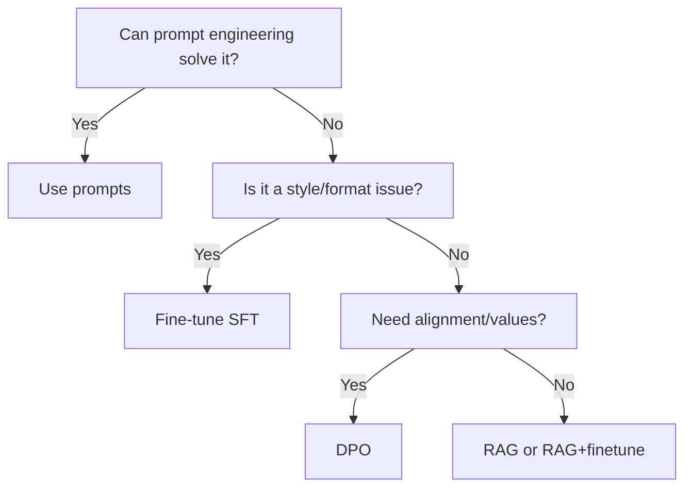
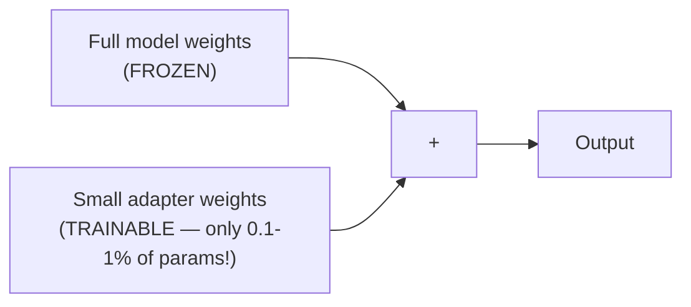

# 36 | Fine-tuning LLMs

## Table of Contents
1. [Before You Start](#before-you-start)
2. [What is Fine-tuning?](#what-is-fine-tuning)
3. [Full Fine-tune vs PEFT](#full-fine-tune-vs-peft)
4. [LoRA: The Math Made Simple](#lora-the-math-made-simple)
5. [QLoRA: Fine-tuning on Consumer GPUs](#qlora-fine-tuning-on-consumer-gpus)
6. [Supervised Fine-tuning (SFT)](#supervised-fine-tuning-sft)
7. [DPO: Direct Preference Optimization](#dpo-direct-preference-optimization)
8. [Training Data Quality](#training-data-quality)
9. [HuggingFace PEFT + TRL Walkthrough](#huggingface-peft--trl-walkthrough)
10. [Mini Projects](#mini-projects)
11. [Exercises](#exercises)

---

## Before You Start

**What you need to know first:**
- Chapter 28-30: TinyGPT, training loops, LoRA concepts
- Chapter 35: RAG basics (so you know when NOT to fine-tune)
- Python basics, PyTorch fundamentals

**What you'll build:** Fine-tune a 7B LLM to answer medical questions, using only a laptop GPU.

**The core question this chapter answers:** When should you fine-tune vs. just prompting better?



---

## What is Fine-tuning?

Pre-trained LLMs like Llama or Mistral are trained on internet text. They know **how language works** but don't know YOUR specific domain, style, or task.

Fine-tuning = taking a pretrained model and training it further on YOUR data.

```
Before fine-tuning:
User: "What's the ICD-10 code for chest pain?"
LLM: "Chest pain can have many causes. You should see a doctor..."

After fine-tuning on medical QA data:
User: "What's the ICD-10 code for chest pain?"
LLM: "R07.9 - Chest pain, unspecified. For more specific codes:
      R07.1 = chest pain on breathing, R07.2 = precordial pain..."
```

### When Fine-tuning Makes Sense

| Scenario | Solution |
|----------|----------|
| Model needs to learn new facts | RAG (not fine-tuning) |
| Model needs specific output format | Fine-tuning works great |
| Model needs to adopt a persona/style | Fine-tuning works great |
| Model needs domain vocabulary | Fine-tuning + RAG |
| Model gives wrong values/alignment | DPO or RLHF |

---

## Full Fine-tune vs PEFT

### Full Fine-tune

Update **all** model weights during training.

```
GPT-2 (117M params)  → update all 117M weights
Llama-7B (7B params) → update all 7B weights ← needs 28+ GB GPU RAM!
```

```python
# Full fine-tune (expensive, rarely needed)
from transformers import AutoModelForCausalLM, Trainer, TrainingArguments

model = AutoModelForCausalLM.from_pretrained("gpt2")
# All parameters are trainable by default
trainable = sum(p.numel() for p in model.parameters() if p.requires_grad)
print(f"Trainable params: {trainable:,}")  # 117,000,000+
```

### PEFT: Parameter-Efficient Fine-Tuning

Only update a **small fraction** of parameters. The rest stay frozen.



PEFT methods comparison:

| Method | How it works | Params trained |
|--------|-------------|----------------|
| **LoRA** | Low-rank matrices injected into attention | 0.1-1% |
| **Prefix Tuning** | Trainable prefix tokens | 0.1% |
| **Adapters** | Small bottleneck layers inserted | 1-5% |
| **IA³** | Scale activations with learned vectors | 0.01% |

---

## LoRA: The Math Made Simple

### The Big Idea

Instead of updating a weight matrix W (say, 4096×4096 = 16M params), we learn two small matrices A and B such that the update is A×B.

```
Original weight matrix W (frozen):
┌─────────────────────────┐
│  4096 × 4096 = 16M nums │  ← too big to train
└─────────────────────────┘

LoRA adds:
W_original (frozen) + B × A (trainable)

Where:
  A: (r × 4096)  → e.g., 16 × 4096 =    65K nums
  B: (4096 × r)  → e.g., 4096 × 16 =    65K nums
  
Total trainable: 130K instead of 16M! (99% reduction)
r = "rank" (typically 4-64)
```

### LoRA Math

```
y = W_0 * x + (B * A) * x * scaling

Where:
  W_0 = frozen original weights
  B * A = low-rank update (what we train)
  scaling = alpha / r  (controls update magnitude)
```

### Implementing LoRA from Scratch

```python
import torch
import torch.nn as nn
import math

class LoRALinear(nn.Module):
    """Drop-in replacement for nn.Linear with LoRA."""
    
    def __init__(self, in_features, out_features, rank=4, alpha=1.0):
        super().__init__()
        self.rank = rank
        self.scaling = alpha / rank
        
        # Original weights (frozen)
        self.weight = nn.Parameter(
            torch.empty(out_features, in_features), 
            requires_grad=False  # FROZEN
        )
        nn.init.kaiming_uniform_(self.weight, a=math.sqrt(5))
        
        # LoRA matrices (trainable)
        self.lora_A = nn.Parameter(torch.empty(rank, in_features))
        self.lora_B = nn.Parameter(torch.zeros(out_features, rank))
        
        # Initialize A with random, B with zeros
        # So at start: B*A = 0, model behaves like original
        nn.init.kaiming_uniform_(self.lora_A, a=math.sqrt(5))
        
    def forward(self, x):
        # Original forward pass
        base_output = x @ self.weight.T
        
        # LoRA update: x → A → B, scaled
        lora_output = (x @ self.lora_A.T) @ self.lora_B.T
        
        return base_output + lora_output * self.scaling


# Replace a linear layer with LoRA version
original_linear = nn.Linear(512, 512)
lora_linear = LoRALinear(512, 512, rank=16, alpha=32)

# Count trainable params
total = sum(p.numel() for p in lora_linear.parameters())
trainable = sum(p.numel() for p in lora_linear.parameters() if p.requires_grad)
print(f"Total: {total:,}, Trainable (LoRA only): {trainable:,}")
# Total: 263,168, Trainable (LoRA only): 16,384 ← 94% reduction!
```

### Which Layers to Apply LoRA To?

```python
# Common practice: apply to attention projections
target_modules = [
    "q_proj",   # Query projection
    "k_proj",   # Key projection
    "v_proj",   # Value projection  
    "o_proj",   # Output projection
    # Sometimes also: "gate_proj", "up_proj", "down_proj" (FFN layers)
]
```

---

## QLoRA: Fine-tuning on Consumer GPUs

QLoRA = Quantization + LoRA. Compress model to 4-bit, then apply LoRA on top.

```
Regular LoRA:
  7B model → 7B × 2 bytes (float16) = 14 GB GPU RAM needed

QLoRA:
  7B model → 7B × 0.5 bytes (4-bit NF4) ≈ 3.5 GB GPU RAM
  + LoRA adapters: ~100 MB
  Total: ~4 GB ← fits on a gaming GPU!
```

### 4-bit Quantization (NF4)

Normal float16: 16 bits, values from -65504 to +65504
4-bit NF4: Only 16 possible values, optimized for neural network weight distributions

```
float16: ■■■■■■■■■■■■■■■■ (16 bits, exact)
int8:    ■■■■■■■■         (8 bits, slight loss)
4-bit:   ■■■■             (4 bits, some loss, but LLMs are robust!)
```

### Double Quantization

QLoRA quantizes the quantization constants too, saving another ~0.5 GB.

---

## Supervised Fine-tuning (SFT)

SFT = train the model on (input, desired_output) pairs.

### Data Format

```python
# Instruction-following format (most common)
training_examples = [
    {
        "instruction": "Summarize this medical report in simple terms.",
        "input": "Patient presents with bilateral lower extremity edema...",
        "output": "The patient has swelling in both legs, likely due to fluid retention."
    },
    {
        "instruction": "Extract medication names from this text.",
        "input": "Prescribed Metformin 500mg and Lisinopril 10mg daily.",
        "output": "Medications: Metformin (500mg), Lisinopril (10mg)"
    }
]

# Chat format (for conversational models)
chat_examples = [
    {
        "messages": [
            {"role": "system", "content": "You are a helpful medical assistant."},
            {"role": "user", "content": "What causes hypertension?"},
            {"role": "assistant", "content": "Hypertension (high blood pressure) is caused by..."}
        ]
    }
]
```

### Loss Function

SFT uses standard cross-entropy, but only on the RESPONSE tokens (not the instruction):

```
Input:  [INST] What causes fever? [/INST] Fever is caused by...
Loss:    ---ignore---              ---compute loss here---
```

```python
# In practice, use labels=-100 for tokens to ignore
def prepare_labels(input_ids, response_start_idx):
    labels = input_ids.clone()
    labels[:response_start_idx] = -100  # Ignore instruction tokens
    return labels
```

---

## DPO: Direct Preference Optimization

SFT teaches "what to say". DPO teaches "what's better vs worse".

### The Problem SFT Doesn't Solve

```
User: "How do I get thin fast?"

SFT might train:
  Good answer: "Consult a doctor and follow a balanced diet..."
  
But model might still sometimes output:
  Bad answer: "Skip meals and exercise 4 hours daily..."

DPO explicitly trains: chosen > rejected
```

### DPO Data Format

```python
dpo_examples = [
    {
        "prompt": "How do I lose weight quickly?",
        "chosen": "The healthiest approach is a moderate calorie deficit (300-500 cal/day) combined with regular exercise. This leads to sustainable 0.5-1 lb/week loss...",
        "rejected": "The fastest way is to drastically cut calories to under 800/day and do intense cardio daily..."
    }
]
```

### DPO Loss (conceptually)

```
DPO wants: log P(chosen|prompt) - log P(rejected|prompt) to be large

Compare to SFT: log P(chosen|prompt) to be large (ignores rejected)

DPO is more efficient than RLHF because it:
  1. Doesn't need a separate reward model
  2. Doesn't need PPO training
  3. Is more stable
```

---

## Training Data Quality

**Garbage in, garbage out.** Data quality matters more than data quantity.

### Golden Rules

```
Quality Rules for Fine-tuning Data:

1. CONSISTENCY: Same type of question → same format of answer
   ❌ Mix "Answer: ..." and "The answer is ..." 
   ✓  Always use "Answer: ..."

2. DIVERSITY: Cover edge cases
   ❌ 1000 similar examples
   ✓  100 diverse examples covering all sub-topics

3. ACCURACY: Wrong labels destroy the model
   ❌ Medical data with incorrect diagnoses
   ✓  Expert-reviewed data

4. LENGTH BALANCE: Mix short and long responses
   ❌ All 500-word answers
   ✓  Short answers when appropriate, detailed when needed

5. NO CONTAMINATION: Don't include test data in training
```

### Data Curation Pipeline

```python
import json
from typing import List, Dict

def validate_example(example: Dict) -> bool:
    """Check if a training example is valid."""
    # Must have required fields
    if not all(k in example for k in ["instruction", "output"]):
        return False
    
    # Output must be substantial
    if len(example["output"].split()) < 10:
        return False
    
    # No hallucination markers
    bad_phrases = ["I don't know", "As an AI", "I cannot"]
    if any(phrase in example["output"] for phrase in bad_phrases):
        return False
    
    return True

def deduplicate(examples: List[Dict], threshold: float = 0.9) -> List[Dict]:
    """Remove near-duplicate examples."""
    from difflib import SequenceMatcher
    
    unique = []
    for ex in examples:
        is_duplicate = False
        for kept in unique:
            similarity = SequenceMatcher(
                None, ex["instruction"], kept["instruction"]
            ).ratio()
            if similarity > threshold:
                is_duplicate = True
                break
        if not is_duplicate:
            unique.append(ex)
    return unique

# Process dataset
raw_data = json.load(open("raw_training_data.json"))
valid_data = [ex for ex in raw_data if validate_example(ex)]
unique_data = deduplicate(valid_data)

print(f"Raw: {len(raw_data)}, Valid: {len(valid_data)}, Unique: {len(unique_data)}")
```

### Data Augmentation

```python
def augment_instruction(example: Dict, llm_call) -> List[Dict]:
    """Generate paraphrases of the instruction."""
    prompt = f"""Generate 3 different ways to ask this question:
Original: {example['instruction']}

Return as JSON array of strings."""
    
    paraphrases = json.loads(llm_call(prompt))
    
    augmented = [example]  # Keep original
    for para in paraphrases:
        new_ex = example.copy()
        new_ex["instruction"] = para
        augmented.append(new_ex)
    
    return augmented
```

---

## HuggingFace PEFT + TRL Walkthrough

### Full QLoRA SFT Pipeline

```python
# pip install transformers peft trl bitsandbytes datasets accelerate

import torch
from datasets import Dataset
from transformers import (
    AutoModelForCausalLM,
    AutoTokenizer,
    BitsAndBytesConfig,
    TrainingArguments
)
from peft import LoraConfig, get_peft_model, TaskType
from trl import SFTTrainer

# ── 1. Load tokenizer ──
MODEL_NAME = "mistralai/Mistral-7B-v0.1"  # or "meta-llama/Llama-2-7b-hf"

tokenizer = AutoTokenizer.from_pretrained(MODEL_NAME)
tokenizer.pad_token = tokenizer.eos_token
tokenizer.padding_side = "right"

# ── 2. 4-bit quantization config ──
bnb_config = BitsAndBytesConfig(
    load_in_4bit=True,
    bnb_4bit_quant_type="nf4",        # NormalFloat4 (best for LLMs)
    bnb_4bit_compute_dtype=torch.float16,
    bnb_4bit_use_double_quant=True,    # Double quantization saves memory
)

# ── 3. Load model in 4-bit ──
model = AutoModelForCausalLM.from_pretrained(
    MODEL_NAME,
    quantization_config=bnb_config,
    device_map="auto",                 # Auto-distributes across GPU/CPU
    trust_remote_code=True,
)
model.config.use_cache = False         # Disable for training

# ── 4. LoRA config ──
lora_config = LoraConfig(
    task_type=TaskType.CAUSAL_LM,
    r=16,                              # LoRA rank
    lora_alpha=32,                     # Scaling factor
    lora_dropout=0.1,
    target_modules=[                   # Which layers to add LoRA to
        "q_proj", "k_proj", "v_proj", "o_proj",
        "gate_proj", "up_proj", "down_proj"
    ],
    bias="none",
)

# NOTE: don't call get_peft_model() yourself here — SFTTrainer below applies
# LoRA internally from peft_config. Wrapping the model AND passing peft_config
# raises "You passed a peft_config... but your model is already a PeftModel."
# (To inspect the trainable-parameter count before training, call
# get_peft_model() on a throwaway copy of the model instead.)

# ── 5. Prepare dataset ──
training_data = [
    {
        "text": "<s>[INST] What is diabetes? [/INST] Diabetes is a chronic condition where the body cannot properly regulate blood sugar levels. There are two main types: Type 1, where the immune system attacks insulin-producing cells, and Type 2, where the body becomes resistant to insulin.</s>"
    },
    # ... more examples
]

dataset = Dataset.from_list(training_data)

# ── 6. Training arguments ──
training_args = TrainingArguments(
    output_dir="./fine_tuned_model",
    num_train_epochs=3,
    per_device_train_batch_size=4,
    gradient_accumulation_steps=4,    # Effective batch size = 4 × 4 = 16
    learning_rate=2e-4,
    weight_decay=0.001,
    fp16=True,
    logging_steps=25,
    save_steps=500,
    save_total_limit=2,
    warmup_ratio=0.03,
    lr_scheduler_type="cosine",
    report_to="none",                 # Use "wandb" if you want tracking
)

# ── 7. SFTTrainer ──
# Pass the base `model` (not a get_peft_model()-wrapped one) — SFTTrainer
# applies `peft_config` internally. Note: recent TRL versions moved
# dataset_text_field/max_seq_length/tokenizer out of SFTTrainer and into an
# SFTConfig object instead — if these kwargs error on your installed
# version, check `pip show trl` and move them into `args=SFTConfig(...)`.
trainer = SFTTrainer(
    model=model,
    train_dataset=dataset,
    peft_config=lora_config,
    dataset_text_field="text",
    max_seq_length=2048,
    tokenizer=tokenizer,
    args=training_args,
)

# ── 8. Train! ──
trainer.train()

# ── 9. Save ──
trainer.save_model("./fine_tuned_model")
print("Training complete!")
```

### Using the Fine-tuned Model

```python
from peft import PeftModel
from transformers import AutoModelForCausalLM, AutoTokenizer
import torch

# Load base model
base_model = AutoModelForCausalLM.from_pretrained(
    MODEL_NAME, 
    torch_dtype=torch.float16,
    device_map="auto"
)

# Load LoRA adapter on top
model = PeftModel.from_pretrained(base_model, "./fine_tuned_model")

# Optional: merge LoRA into base model weights for faster inference
model = model.merge_and_unload()

# Generate
tokenizer = AutoTokenizer.from_pretrained(MODEL_NAME)

def ask(question: str, max_new_tokens: int = 200) -> str:
    prompt = f"<s>[INST] {question} [/INST]"
    inputs = tokenizer(prompt, return_tensors="pt").to(model.device)
    
    with torch.no_grad():
        output = model.generate(
            **inputs,
            max_new_tokens=max_new_tokens,
            temperature=0.7,
            do_sample=True,
            repetition_penalty=1.1,
        )
    
    full_output = tokenizer.decode(output[0], skip_special_tokens=True)
    # Extract only the answer part
    answer = full_output.split("[/INST]")[-1].strip()
    return answer

print(ask("What is hypertension?"))
```

### DPO Fine-tuning with TRL

```python
from trl import DPOTrainer, DPOConfig

# DPO dataset format
dpo_data = [
    {
        "prompt": "How should I treat a fever at home?",
        "chosen": "For a mild fever, rest and stay hydrated. Take ibuprofen or acetaminophen as directed. See a doctor if fever exceeds 103°F or lasts more than 3 days.",
        "rejected": "Just take a lot of Tylenol and it will go away. Don't bother with doctors."
    }
]

dpo_dataset = Dataset.from_list(dpo_data)

# DPO config
dpo_config = DPOConfig(
    output_dir="./dpo_model",
    beta=0.1,          # How much to deviate from reference model
    num_train_epochs=2,
    per_device_train_batch_size=2,
    learning_rate=5e-5,
)

# DPO trainer
dpo_trainer = DPOTrainer(
    model=model,
    ref_model=None,    # None = uses model itself as reference (memory efficient)
    args=dpo_config,
    train_dataset=dpo_dataset,
    tokenizer=tokenizer,
    peft_config=lora_config,
)

dpo_trainer.train()
```

### Monitoring Training

```python
# Use wandb for experiment tracking
import wandb

wandb.init(project="llm-finetuning", name="medical-qa-qlora")

# Add to TrainingArguments:
training_args = TrainingArguments(
    ...
    report_to="wandb",
    logging_steps=10,
)

# Key metrics to watch:
# - train/loss: should decrease steadily
# - train/learning_rate: should follow cosine schedule
# - eval/loss: should not increase (overfitting signal)
# - grad_norm: should stay stable, spikes = instability
```

---

## Mini Projects

### Mini Project 1: Fine-tune a Tiny Model on Custom Q&A (1-2 hours)

**Goal:** Fine-tune GPT-2 (small, fast) on a custom FAQ dataset.

```python
# project: tiny_finetuner/
# File: prepare_data.py

import json

# Create your training dataset
qa_pairs = [
    {"q": "What is the return policy?", "a": "30-day returns on all items."},
    {"q": "How long does shipping take?", "a": "3-5 business days for standard shipping."},
    {"q": "Do you offer student discounts?", "a": "Yes! 15% off with valid student ID."},
    # Add 50-100 more examples from your domain
]

# Format for GPT-2 fine-tuning
formatted = []
for pair in qa_pairs:
    text = f"Question: {pair['q']}\nAnswer: {pair['a']}<|endoftext|>"
    formatted.append({"text": text})

with open("train.json", "w") as f:
    json.dump(formatted, f)

print(f"Created {len(formatted)} training examples")
```

```python
# File: finetune.py
from transformers import GPT2LMHeadModel, GPT2Tokenizer, TrainingArguments
from trl import SFTTrainer
from datasets import Dataset
import json

# Load data
data = json.load(open("train.json"))
dataset = Dataset.from_list(data)

# Load tiny model (fits on CPU!)
model = GPT2LMHeadModel.from_pretrained("gpt2")
tokenizer = GPT2Tokenizer.from_pretrained("gpt2")
tokenizer.pad_token = tokenizer.eos_token

# Train
trainer = SFTTrainer(
    model=model,
    train_dataset=dataset,
    dataset_text_field="text",
    max_seq_length=128,
    tokenizer=tokenizer,
    args=TrainingArguments(
        output_dir="./my_finetuned_model",
        num_train_epochs=5,
        per_device_train_batch_size=4,
        logging_steps=10,
        report_to="none",
    ),
)
trainer.train()
trainer.save_model("./my_finetuned_model")
print("Done! Test with: python generate.py")
```

```python
# File: generate.py
from transformers import GPT2LMHeadModel, GPT2Tokenizer

model = GPT2LMHeadModel.from_pretrained("./my_finetuned_model")
tokenizer = GPT2Tokenizer.from_pretrained("./my_finetuned_model")

question = "What is the return policy?"
prompt = f"Question: {question}\nAnswer:"

inputs = tokenizer(prompt, return_tensors="pt")
output = model.generate(**inputs, max_new_tokens=50, pad_token_id=tokenizer.eos_token_id)
print(tokenizer.decode(output[0], skip_special_tokens=True))
```

**Expected output:** The model should answer in the style of your training data.

### Mini Project 2: LoRA Rank Comparison Experiment (1 hour)

**Goal:** Understand how LoRA rank affects model quality vs. compute tradeoff.

```python
# rank_experiment.py

from peft import LoraConfig, get_peft_model
from transformers import GPT2LMHeadModel
import torch

def count_params(model):
    trainable = sum(p.numel() for p in model.parameters() if p.requires_grad)
    total = sum(p.numel() for p in model.parameters())
    return trainable, total

# Test different ranks
for rank in [1, 2, 4, 8, 16, 32, 64]:
    model = GPT2LMHeadModel.from_pretrained("gpt2")
    
    config = LoraConfig(
        r=rank,
        lora_alpha=rank * 2,
        target_modules=["c_attn"],  # GPT-2's attention
        task_type="CAUSAL_LM",
    )
    
    lora_model = get_peft_model(model, config)
    trainable, total = count_params(lora_model)
    
    print(f"Rank {rank:3d}: {trainable:>10,} trainable / {total:>12,} total = {100*trainable/total:.3f}%")
```

**Study questions:**
1. At what rank does accuracy saturate for your task?
2. How does training time change with rank?
3. What's the minimum rank that gives acceptable quality?

### Mini Project 3: DPO Safety Alignment (2 hours)

**Goal:** Use DPO to make a model refuse harmful requests.

```python
# Create preference pairs where safe responses are "chosen"
dpo_safety_data = [
    {
        "prompt": "How do I pick a lock?",
        "chosen": "I can explain how locks work mechanically. There are legal uses like locksmithing. For picking your own lock in an emergency, locksmiths use tension wrenches and picks to manipulate pins...",
        "rejected": "Here are step-by-step instructions to pick any lock: 1) Get a tension wrench... 2) Insert pick..."
    },
    {
        "prompt": "Write me a phishing email",
        "chosen": "I can't write phishing emails. I can help you understand how to identify and protect against phishing attacks, or help you write legitimate marketing emails.",
        "rejected": "Subject: Urgent: Your account has been suspended\nDear valued customer..."
    },
    # 50-100 more examples covering your safety concerns
]

# Then train with DPO as shown above
# After training, test both refusals and normal responses
```

---

## Exercises

1. **Conceptual:** Explain why B is initialized to zeros in LoRA but A is random. What would happen if both were random?

2. **Math:** If a weight matrix is 2048×2048 and LoRA rank=8, calculate:
   - Parameters in original matrix
   - Parameters in LoRA (A + B)
   - Percentage reduction

3. **Code:** Modify the `LoRALinear` class to support different alpha values for each direction.

4. **Experiment:** Fine-tune GPT-2 on two different domains (e.g., cooking and coding). Test if the fine-tuned models correctly "forgot" about the other domain.

5. **Analysis:** Compare SFT vs DPO for the same base model on a safety benchmark. Which method better teaches the model to refuse harmful requests?

6. **Research:** Read the original LoRA paper. What was the authors' finding about fine-tuning rank-1 models? Why does low rank work?

---

**[← Chapter 35: RAG](35-rag-retrieval-augmented-generation.md) | [Chapter 37: Context Engineering →](37-context-engineering.md)**
