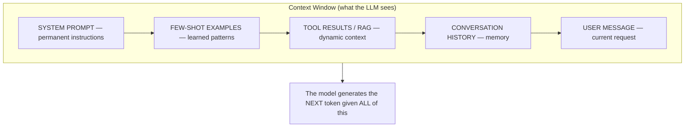
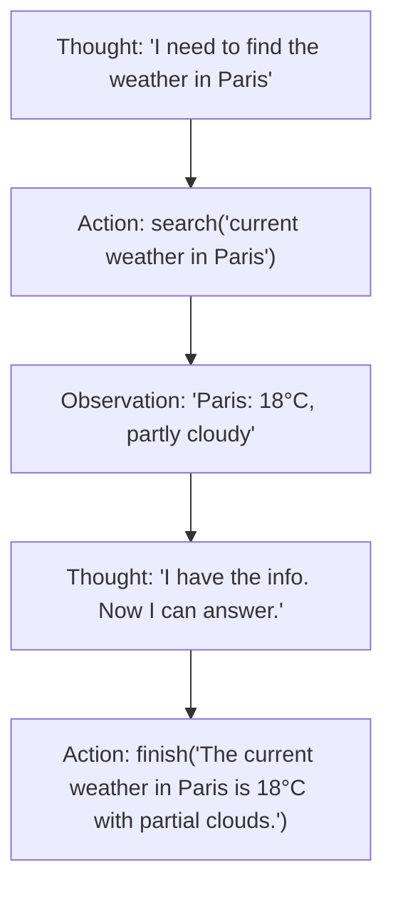

# 37 | Context Engineering

## Table of Contents
1. [Before You Start](#before-you-start)
2. [What is Context Engineering?](#what-is-context-engineering)
3. [System Prompts](#system-prompts)
4. [Few-Shot Prompting](#few-shot-prompting)
5. [Chain-of-Thought (CoT)](#chain-of-thought-cot)
6. [ReAct Prompting](#react-prompting)
7. [XML Structuring](#xml-structuring)
8. [Token Budgets and Caching](#token-budgets-and-caching)
9. [Claude-Specific Patterns](#claude-specific-patterns)
10. [Mini Projects](#mini-projects)
11. [Exercises](#exercises)

---

## Before You Start

**Prerequisites:**
- Basic familiarity with LLM APIs (OpenAI, Claude, etc.)
- Understanding of tokenization (Chapter 27)
- No coding experience required for the concepts

**What you'll build:** A context-engineered coding assistant that consistently produces high-quality, structured outputs.

**The big idea:** LLMs don't "understand" — they complete patterns. Context engineering is the art of setting up the perfect pattern for the model to complete.



---

## What is Context Engineering?

**Prompt engineering** was the old term: craft a clever prompt to get the output you want.

**Context engineering** is the evolved practice: design the entire context window — what goes in, in what order, with what structure — to reliably produce high-quality outputs at scale.

```
Prompt Engineering (old thinking):
  "Magic words = magic output"
  User: "Please answer this question very carefully and thoughtfully..."

Context Engineering (modern thinking):
  Design the whole system:
  - What's always in context (system prompt)
  - What's dynamically inserted (RAG, tools)
  - What format structures the response
  - How many tokens each section gets
  - Where caching saves cost
```

### Why It Matters

| Without Context Engineering | With Context Engineering |
|-----------------------------|--------------------------|
| Inconsistent output format | Predictable structure |
| Hallucinations in unknown domains | Grounded in provided facts |
| Model uses wrong persona | Consistent behavior |
| Long, rambling answers | Concise, targeted responses |
| Every call equally expensive | Smart caching reduces cost 80%+ |

---

## System Prompts

The system prompt is the always-present instruction set that shapes ALL of the model's behavior in a session.

### Anatomy of a Good System Prompt

```
GOOD system prompt structure:

1. IDENTITY: Who the model is
2. CONTEXT: What situation it's in
3. CAPABILITIES: What it can and can't do
4. RULES: Behavioral constraints
5. FORMAT: Output structure requirements
6. EXAMPLES: (optional) Sample interactions
```

### Example: Customer Support Bot

```python
SYSTEM_PROMPT = """You are Aria, a customer support specialist for TechCorp's cloud storage product.

## Your Context
- You have access to the customer's account details in <account_info> tags
- You can look up order history and ticket history  
- You cannot access financial data or modify account permissions

## Core Behavior
- Always verify identity before discussing account details
- Be empathetic but efficient — resolve in 3 messages or less
- If unsure, say "I'll need to check that for you" rather than guessing
- Escalate to human agent when: legal threats, security breaches, frustrated repeat contacts

## Response Format
- First line: Brief acknowledgment of the issue
- Middle: Solution or next steps (bullet points if multiple steps)
- Last line: "Is there anything else I can help you with?"

## Tone
Professional but warm. Like a helpful colleague, not a corporate robot."""
```

### What to Put in System Prompts

```python
# DO include:
system = """
- Model's role and expertise
- Persistent constraints ("never make up facts")
- Output format requirements
- Company/domain-specific terminology
- What to do when uncertain
"""

# DON'T include:
system = """
- Information the model should "look up" per query (put in RAG instead)
- Lengthy background docs (they waste tokens every call)
- Contradicting instructions (model gets confused)
- Vague aspirational statements ("be the best you can be")
"""
```

### System Prompt Anti-Patterns

```
❌ Too vague:
"You are a helpful assistant. Be helpful and nice."

❌ Too restrictive:
"Only answer about Topic X. Never discuss Y, Z, or anything else."
(Model gets paralyzed on edge cases)

❌ Contradictory:
"Be concise. Provide comprehensive explanations."

✓ Good:
"You are a Python tutor for beginners. Explain concepts using simple analogies.
If asked about non-Python topics, briefly note that and redirect.
Keep examples under 20 lines unless the student specifically asks for more."
```

---

## Few-Shot Prompting

Show the model examples of exactly what you want. Pattern completion is what LLMs do best.

### Zero-shot vs Few-shot

```python
import anthropic

client = anthropic.Anthropic()

# Zero-shot (no examples)
zero_shot = """Classify the sentiment of this review as POSITIVE, NEGATIVE, or NEUTRAL:
Review: "The product arrived late but works great"
Sentiment:"""

# Few-shot (with examples)
few_shot = """Classify the sentiment of this review as POSITIVE, NEGATIVE, or NEUTRAL.

Review: "Absolutely love this! Best purchase of the year."
Sentiment: POSITIVE

Review: "Terrible quality, broke after one day."
Sentiment: NEGATIVE

Review: "It works, nothing special."
Sentiment: NEUTRAL

Review: "The product arrived late but works great"
Sentiment:"""

response = client.messages.create(
    model="claude-opus-4-7",
    max_tokens=10,
    messages=[{"role": "user", "content": few_shot}]
)
print(response.content[0].text)  # POSITIVE
```

### How Many Examples?

```
0 examples: Model uses general knowledge
1 example:  Model starts to get the format
3-5 examples: Usually optimal — covers variations
10+ examples: Diminishing returns, wasting tokens

Exception: Complex structured outputs often need 5-10 examples
           to reliably produce the exact format.
```

### Choosing Good Examples

```python
# Bad: All similar examples
bad_examples = [
    "I love this! → POSITIVE",
    "This is great! → POSITIVE",  # Too similar to first
    "Wonderful product! → POSITIVE",  # Still too similar
]

# Good: Diverse, covering edge cases
good_examples = [
    "Absolutely love it! → POSITIVE",        # Clear positive
    "Broke after 2 days → NEGATIVE",          # Clear negative
    "It's okay, does the job → NEUTRAL",      # Neutral
    "Arrived broken, support fixed it → NEUTRAL",  # Mixed (edge case)
    "Not what I expected but I like it → POSITIVE", # Nuanced positive
]
```

---

## Chain-of-Thought (CoT)

For complex reasoning tasks, prompting the model to "think out loud" dramatically improves accuracy.

### Why CoT Works

```
Without CoT (model takes a direct leap):
Q: "A store sells 15 apples for $3. How much for 40 apples?"
A: "$8"  ← wrong! (correct is $8, model might rush and get it wrong)

With CoT (model reasons step by step):
Q: "A store sells 15 apples for $3. How much for 40 apples? Think step by step."
A: "First, find price per apple: $3 ÷ 15 = $0.20 per apple.
    Then: 40 apples × $0.20 = $8.00
    Answer: $8.00"  ← correct reasoning
```

### Triggering CoT

```python
# Method 1: "Think step by step" (classic)
prompt = "Solve this problem. Think step by step.\n\nProblem: ..."

# Method 2: "Let's work through this"
prompt = "Let's work through this carefully:\n\nProblem: ..."

# Method 3: Structured reasoning (best for production)
prompt = """Analyze this code review request.

<thinking>
First, I'll understand what the code does...
Then, I'll check for correctness...
Then, I'll check for style...
</thinking>

<code_review>
[Your structured review here]
</code_review>

Code to review:
```python
{code}
```"""
```

### Zero-shot vs Few-shot CoT

```python
# Zero-shot CoT: just add "step by step"
prompt = "What is 15% of 240? Think step by step."

# Few-shot CoT: show reasoning examples
few_shot_cot = """
Q: What is 20% of 150?
A: Let me calculate step by step:
   20% means 20/100 = 0.20
   0.20 × 150 = 30
   Answer: 30

Q: A train travels 120 km in 2 hours. How long for 300 km?
A: Let me calculate step by step:
   Speed = 120 km ÷ 2 hours = 60 km/h
   Time = 300 km ÷ 60 km/h = 5 hours
   Answer: 5 hours

Q: What is 15% of 240?
A: Let me calculate step by step:"""
```

### Forcing Answer at the End

```python
# Prevent CoT from burying the answer in reasoning
prompt = """Solve this math problem. Show your work, then put the final answer on the last line starting with "Answer: "

Problem: A rectangle is 12cm wide and 8cm tall. What is its area?"""

# Expected output:
# Area of a rectangle = width × height
# Area = 12 cm × 8 cm = 96 cm²
# Answer: 96 cm²
```

---

## ReAct Prompting

ReAct = **Re**asoning + **Act**ing. The model interleaves thinking with tool use.



### Implementing ReAct

```python
import anthropic
import json

# Define tools the model can use
tools = [
    {
        "name": "web_search",
        "description": "Search the internet for current information",
        "input_schema": {
            "type": "object",
            "properties": {
                "query": {"type": "string", "description": "Search query"}
            },
            "required": ["query"]
        }
    },
    {
        "name": "calculator",
        "description": "Perform mathematical calculations",
        "input_schema": {
            "type": "object",
            "properties": {
                "expression": {"type": "string", "description": "Math expression"}
            },
            "required": ["expression"]
        }
    }
]

def run_tool(tool_name: str, tool_input: dict) -> str:
    """Execute a tool and return result."""
    if tool_name == "calculator":
        try:
            result = eval(tool_input["expression"])  # In production: use safe eval
            return str(result)
        except Exception as e:
            return f"Error: {e}"
    elif tool_name == "web_search":
        # In real code: call a search API
        return f"Search results for '{tool_input['query']}': [mock results]"

def react_loop(user_question: str, max_iterations: int = 5):
    """Run a ReAct loop to answer a question using tools."""
    client = anthropic.Anthropic()
    messages = [{"role": "user", "content": user_question}]
    
    for iteration in range(max_iterations):
        response = client.messages.create(
            model="claude-opus-4-7",
            max_tokens=1024,
            tools=tools,
            messages=messages
        )
        
        # Check if model wants to use a tool
        if response.stop_reason == "tool_use":
            # Process all tool calls
            tool_results = []
            for block in response.content:
                if block.type == "tool_use":
                    print(f"  → Using tool: {block.name}({block.input})")
                    result = run_tool(block.name, block.input)
                    print(f"  ← Result: {result}")
                    
                    tool_results.append({
                        "type": "tool_result",
                        "tool_use_id": block.id,
                        "content": result
                    })
            
            # Add model's tool call + results to conversation
            messages.append({"role": "assistant", "content": response.content})
            messages.append({"role": "user", "content": tool_results})
        
        else:
            # Model is done reasoning, extract final answer
            final_answer = next(
                (block.text for block in response.content if hasattr(block, "text")),
                "No answer generated"
            )
            return final_answer
    
    return "Max iterations reached"

# Test
answer = react_loop("What is 15% of the number of days in 3 years?")
print(f"\nFinal answer: {answer}")
```

---

## XML Structuring

Claude and modern LLMs respond especially well to XML tags for organizing complex context.

### Using XML for Context Organization

```python
# Without XML: ambiguous
bad_prompt = """
Here is background info about our company. We sell software. Founded 2020.
Now here is the customer's question. They want to know about pricing.
The customer is a startup with 10 employees.
Please answer their question.
"""

# With XML: crystal clear structure
good_prompt = """
<context>
  <company_info>
    TechCorp sells cloud software. Founded 2020. 
    We offer Starter ($29/mo), Growth ($99/mo), Enterprise (custom).
  </company_info>
  
  <customer_profile>
    Type: Startup
    Size: 10 employees
    Stage: Series A
  </customer_profile>
</context>

<customer_question>
What pricing plan would work best for our company?
</customer_question>

Please recommend a plan based on the customer's profile.
"""
```

### XML for Structured Outputs

```python
def extract_structured_data(raw_text: str) -> dict:
    """Use XML to force structured output."""
    prompt = f"""Extract key information from this job posting and return it in XML format.

<job_posting>
{raw_text}
</job_posting>

Return ONLY this XML structure, no other text:
<job_info>
  <title>Job title here</title>
  <company>Company name here</company>
  <location>City, State or Remote</location>
  <salary_range>e.g., $80,000 - $120,000 or Not specified</salary_range>
  <requirements>
    <requirement>Requirement 1</requirement>
    <requirement>Requirement 2</requirement>
  </requirements>
  <is_remote>true or false</is_remote>
</job_info>"""
    
    import anthropic
    client = anthropic.Anthropic()
    
    response = client.messages.create(
        model="claude-opus-4-7",
        max_tokens=500,
        messages=[{"role": "user", "content": prompt}]
    )
    
    xml_output = response.content[0].text
    
    # Parse XML
    import xml.etree.ElementTree as ET
    root = ET.fromstring(xml_output)
    
    return {
        "title": root.findtext("title"),
        "company": root.findtext("company"),
        "location": root.findtext("location"),
        "salary_range": root.findtext("salary_range"),
        "is_remote": root.findtext("is_remote") == "true",
        "requirements": [r.text for r in root.findall("requirements/requirement")]
    }
```

### XML for Multi-Step Tasks

```python
system_prompt = """You are a code review assistant.

When reviewing code, ALWAYS use this exact structure:

<review>
  <summary>One sentence summary of what the code does</summary>
  
  <issues>
    <issue severity="critical|major|minor">
      <location>Function/line reference</location>
      <description>What the issue is</description>
      <suggestion>How to fix it</suggestion>
    </issue>
    <!-- Repeat for each issue -->
  </issues>
  
  <positives>
    <positive>Something done well</positive>
  </positives>
  
  <verdict>APPROVE | REQUEST_CHANGES | NEEDS_DISCUSSION</verdict>
</review>"""
```

---

## Token Budgets and Caching

### Understanding Token Costs

```
Token counting (approximate):
  1 token ≈ 4 characters ≈ 0.75 words
  
  "Hello, world!" = 4 tokens
  1 page of text ≈ 500 tokens
  1 book ≈ 100,000 tokens
  
Claude context windows:
  claude-haiku-4-5: 200K tokens input, 8K output
  claude-sonnet-4-6: 200K tokens input, 64K output
  claude-opus-4-7:   200K tokens input, 32K output
```

### Token Budget Allocation

```python
# Typical context budget allocation
TOTAL_CONTEXT = 200_000  # tokens

budget = {
    "system_prompt": 1_000,      # 0.5% — keep it tight
    "few_shot_examples": 3_000,  # 1.5% — 3-5 examples
    "tool_definitions": 2_000,   # 1% — tool schemas
    "rag_context": 20_000,       # 10% — retrieved docs
    "conversation_history": 10_000, # 5% — recent messages
    "user_message": 1_000,       # 0.5% — current input
    "response": 4_000,           # 2% — output budget
    "safety_margin": 159_000,    # 79.5% — headroom
}

def check_token_budget(text: str, max_tokens: int) -> bool:
    """Rough check if text fits in token budget."""
    estimated_tokens = len(text) // 4
    return estimated_tokens <= max_tokens

def truncate_to_budget(text: str, max_tokens: int) -> str:
    """Truncate text to fit token budget."""
    max_chars = max_tokens * 4
    if len(text) <= max_chars:
        return text
    return text[:max_chars] + "\n\n[...truncated for length...]"
```

### Prompt Caching (Claude)

Prompt caching lets you pay once for a long context and reuse it across many calls.

```python
import anthropic

client = anthropic.Anthropic()

# Long document that won't change between queries
LONG_DOCUMENT = "..." * 10000  # 10K tokens

def query_with_caching(question: str) -> str:
    """Cache the long document, only pay full price first time."""
    
    response = client.messages.create(
        model="claude-opus-4-7",
        max_tokens=1024,
        system=[
            {
                "type": "text",
                "text": "You are a document analysis assistant.",
            },
            {
                "type": "text",
                "text": LONG_DOCUMENT,
                "cache_control": {"type": "ephemeral"},  # ← Cache this!
            }
        ],
        messages=[
            {"role": "user", "content": question}
        ]
    )
    
    # First call: full price (~10K tokens input)
    # Subsequent calls (within 5 min): cache hit, ~90% cheaper!
    
    usage = response.usage
    print(f"Cache read: {usage.cache_read_input_tokens} tokens")
    print(f"Cache write: {usage.cache_creation_input_tokens} tokens")
    print(f"Regular: {usage.input_tokens} tokens")
    
    return response.content[0].text

# First call caches the document
result1 = query_with_caching("What are the main themes in this document?")

# Second call uses cache (much cheaper!)
result2 = query_with_caching("Summarize the key findings")
```

### When to Use Caching

```
USE CACHE when:
  ✓ Same large context for many queries (RAG base docs, code files)
  ✓ System prompt + examples > 1024 tokens
  ✓ Multi-turn conversations with large history
  ✓ Batch processing a document

DON'T CACHE when:
  ✗ Context changes every call
  ✗ Small prompts (< 1024 tokens — minimum for caching)
  ✗ One-off single queries
```

---

## Claude-Specific Patterns

### Forcing Structured Output

Older Claude versions supported "prefilling" the assistant's response (seeding it with `{` to force JSON). **Assistant-turn prefill is no longer supported starting with the Opus/Sonnet 4.6 generation** — it now returns a 400 error. The current, documented way to force a specific output shape is `output_config.format` with a JSON schema:

```python
import anthropic
import json

client = anthropic.Anthropic()

response = client.messages.create(
    model="claude-sonnet-4-6",
    max_tokens=500,
    messages=[
        {"role": "user", "content": "Extract the name, age, and city from: 'John Smith, 32, lives in Seattle'"}
    ],
    output_config={
        "format": {
            "type": "json_schema",
            "schema": {
                "type": "object",
                "properties": {
                    "name": {"type": "string"},
                    "age": {"type": "integer"},
                    "city": {"type": "string"},
                },
                "required": ["name", "age", "city"],
            },
        }
    },
)

data = json.loads(response.content[0].text)
print(data)  # {"name": "John Smith", "age": 32, "city": "Seattle"}
```

*(API shapes evolve — check the current Claude API docs if this doesn't match what you see.)*

### Extended Thinking

For hard reasoning tasks, enable Claude's extended thinking. **Note:** the older `{"type": "enabled", "budget_tokens": N}` form is removed on Opus 4.7+ (400 error) — use `"adaptive"`, which lets the model decide its own thinking budget:

```python
response = client.messages.create(
    model="claude-opus-4-7",
    max_tokens=16000,
    thinking={"type": "adaptive"},
    messages=[{
        "role": "user",
        "content": "Prove that there are infinitely many prime numbers."
    }]
)

# Response has two parts: thinking and answer
for block in response.content:
    if block.type == "thinking":
        print("REASONING:", block.thinking[:200], "...")
    elif block.type == "text":
        print("ANSWER:", block.text)
```

### Constitutional AI Patterns

Ask the model to self-critique and improve:

```python
def generate_with_critique(task: str) -> str:
    """Generate, critique, then improve."""
    client = anthropic.Anthropic()
    
    # Step 1: Generate initial response
    draft = client.messages.create(
        model="claude-opus-4-7",
        max_tokens=500,
        messages=[{"role": "user", "content": task}]
    ).content[0].text
    
    # Step 2: Self-critique
    critique_prompt = f"""Original task: {task}

Draft response:
{draft}

Critique this response. What could be:
1. More accurate?
2. More concise?
3. More helpful?

Write your critique in 2-3 sentences."""
    
    critique = client.messages.create(
        model="claude-opus-4-7",
        max_tokens=200,
        messages=[{"role": "user", "content": critique_prompt}]
    ).content[0].text
    
    # Step 3: Improve based on critique
    improve_prompt = f"""Task: {task}

Draft: {draft}

Critique: {critique}

Write an improved response that addresses the critique."""
    
    improved = client.messages.create(
        model="claude-opus-4-7",
        max_tokens=500,
        messages=[{"role": "user", "content": improve_prompt}]
    ).content[0].text
    
    return improved
```

### Formatting Best Practices

```python
# Claude responds well to markdown structure
good_prompt = """Please analyze this API design.

## Code to Review
```python
{code}
```

## Questions to Address
1. Is the interface intuitive?
2. Are there any edge cases not handled?
3. What would you change?

Format your response with one section per question using H3 headers."""

# Use <example> tags to show desired output format
example_prompt = """Convert addresses to JSON.

<example>
Input: "123 Main St, Boston, MA 02101"
Output: {{"street": "123 Main St", "city": "Boston", "state": "MA", "zip": "02101"}}
</example>

Now convert: "456 Oak Ave, Chicago, IL 60601"
"""
```

---

## Mini Projects

### Mini Project 1: Context-Engineered Code Reviewer (1-2 hours)

**Goal:** Build a code reviewer that always gives structured, actionable feedback.

```python
# code_reviewer.py

import anthropic
import sys
from pathlib import Path

SYSTEM_PROMPT = """You are a senior software engineer conducting code reviews.

## Your Review Philosophy
- Be specific: reference exact line numbers or function names
- Be constructive: for every problem, suggest a solution
- Prioritize: critical bugs > logic errors > style issues
- Be concise: each point in 1-2 sentences

## Output Format
Always use this exact structure:

### Summary
[1-2 sentence overview of the code]

### Issues
**[CRITICAL/MAJOR/MINOR]** `function_name` or line X: 
[Problem description. Suggested fix.]

### What's Good
- [Specific positive observation]

### Verdict
[APPROVE / REQUEST_CHANGES] — [One sentence reason]"""


def review_code(filepath: str) -> str:
    code = Path(filepath).read_text()
    language = Path(filepath).suffix[1:]  # Get extension without dot
    
    client = anthropic.Anthropic()
    
    response = client.messages.create(
        model="claude-opus-4-7",
        max_tokens=2000,
        system=SYSTEM_PROMPT,
        messages=[{
            "role": "user",
            "content": f"Please review this {language} code:\n\n```{language}\n{code}\n```"
        }]
    )
    
    return response.content[0].text


if __name__ == "__main__":
    if len(sys.argv) < 2:
        print("Usage: python code_reviewer.py <filepath>")
        sys.exit(1)
    
    filepath = sys.argv[1]
    review = review_code(filepath)
    print(review)
```

**Test it:** Create a Python file with intentional bugs and run the reviewer. Compare with and without the structured system prompt.

### Mini Project 2: Token Budget Monitor (1 hour)

**Goal:** Build a wrapper that tracks and warns about token usage in real-time.

```python
# token_monitor.py

import anthropic
from dataclasses import dataclass, field
from typing import List

@dataclass
class TokenUsage:
    input_tokens: int = 0
    output_tokens: int = 0
    cache_read_tokens: int = 0
    cache_write_tokens: int = 0
    
    @property
    def total_tokens(self):
        return self.input_tokens + self.output_tokens
    
    def estimated_cost_usd(self, model="claude-opus-4-7") -> float:
        """Rough cost estimate (check latest pricing)."""
        # Approximate prices per 1M tokens
        prices = {
            "claude-opus-4-7": {"input": 15.0, "output": 75.0},
            "claude-sonnet-4-6": {"input": 3.0, "output": 15.0},
            "claude-haiku-4-5": {"input": 0.80, "output": 4.0},
        }
        p = prices.get(model, prices["claude-sonnet-4-6"])
        return (self.input_tokens * p["input"] + self.output_tokens * p["output"]) / 1_000_000


class MonitoredClient:
    """Claude client that tracks token usage."""
    
    def __init__(self, max_tokens_per_session: int = 100_000):
        self.client = anthropic.Anthropic()
        self.usage = TokenUsage()
        self.max_tokens = max_tokens_per_session
        self.call_history: List[TokenUsage] = []
    
    def chat(self, message: str, system: str = None, model="claude-opus-4-7") -> str:
        if self.usage.total_tokens > self.max_tokens * 0.9:
            print(f"⚠️  WARNING: {self.usage.total_tokens}/{self.max_tokens} tokens used")
        
        kwargs = {
            "model": model,
            "max_tokens": 1024,
            "messages": [{"role": "user", "content": message}]
        }
        if system:
            kwargs["system"] = system
        
        response = self.client.messages.create(**kwargs)
        
        # Track usage
        call_usage = TokenUsage(
            input_tokens=response.usage.input_tokens,
            output_tokens=response.usage.output_tokens,
        )
        self.call_history.append(call_usage)
        self.usage.input_tokens += call_usage.input_tokens
        self.usage.output_tokens += call_usage.output_tokens
        
        return response.content[0].text
    
    def print_usage_report(self):
        print(f"\n{'='*40}")
        print(f"TOKEN USAGE REPORT")
        print(f"{'='*40}")
        print(f"Total calls: {len(self.call_history)}")
        print(f"Input tokens: {self.usage.input_tokens:,}")
        print(f"Output tokens: {self.usage.output_tokens:,}")
        print(f"Total tokens: {self.usage.total_tokens:,}")
        print(f"Estimated cost: ${self.usage.estimated_cost_usd():.4f}")
        print(f"{'='*40}\n")


# Usage
client = MonitoredClient(max_tokens_per_session=50_000)

responses = [
    client.chat("Explain photosynthesis in one paragraph"),
    client.chat("What's the capital of France?"),
    client.chat("Write a haiku about coding"),
]

client.print_usage_report()
```

### Mini Project 3: Few-Shot Template Builder (1 hour)

**Goal:** Build a tool that automatically generates few-shot examples from a small labeled dataset.

```python
# few_shot_builder.py

from typing import List, Dict, Any
import anthropic
import json

class FewShotBuilder:
    """Builds optimized few-shot prompts from labeled examples."""
    
    def __init__(self, examples: List[Dict[str, str]]):
        """
        examples: list of {"input": ..., "output": ...} dicts
        """
        self.examples = examples
    
    def select_diverse_examples(self, n: int = 5) -> List[Dict]:
        """Select diverse examples to maximize coverage."""
        if len(self.examples) <= n:
            return self.examples
        
        # Simple diversity: take evenly spaced from sorted list
        # In production: use embedding-based diversity selection
        step = len(self.examples) // n
        return [self.examples[i * step] for i in range(n)]
    
    def format_as_prompt(self, task_description: str, selected_examples: List[Dict]) -> str:
        """Format examples into a few-shot prompt."""
        prompt = f"{task_description}\n\n"
        
        for i, ex in enumerate(selected_examples, 1):
            prompt += f"Example {i}:\n"
            prompt += f"Input: {ex['input']}\n"
            prompt += f"Output: {ex['output']}\n\n"
        
        prompt += "Now process this:\nInput: "
        return prompt
    
    def test_prompt(self, prompt_template: str, test_input: str, model="claude-haiku-4-5") -> str:
        """Test the few-shot prompt on a new input."""
        full_prompt = prompt_template + test_input
        
        client = anthropic.Anthropic()
        response = client.messages.create(
            model=model,
            max_tokens=200,
            messages=[{"role": "user", "content": full_prompt}]
        )
        return response.content[0].text


# Example: Sentiment classification
examples = [
    {"input": "This product is amazing!", "output": "POSITIVE"},
    {"input": "Total waste of money.", "output": "NEGATIVE"},
    {"input": "It's okay, nothing special.", "output": "NEUTRAL"},
    {"input": "Exceeded my expectations!", "output": "POSITIVE"},
    {"input": "Broke after one use.", "output": "NEGATIVE"},
    {"input": "Does what it says it does.", "output": "NEUTRAL"},
    {"input": "Best purchase this year!", "output": "POSITIVE"},
    {"input": "Poor customer service.", "output": "NEGATIVE"},
]

builder = FewShotBuilder(examples)
selected = builder.select_diverse_examples(n=4)
prompt = builder.format_as_prompt(
    "Classify the sentiment as POSITIVE, NEGATIVE, or NEUTRAL.",
    selected
)

result = builder.test_prompt(prompt, "Delivery was faster than expected!")
print(f"Result: {result}")
print("\nFull prompt used:")
print(prompt + "Delivery was faster than expected!")
```

---

## Exercises

1. **System Prompt Design:** Write a system prompt for a coding assistant that only answers Python questions. Test what happens when you ask about JavaScript — does it redirect appropriately?

2. **Few-Shot Experiments:** For a text classification task of your choice, test accuracy with 0, 1, 3, and 5 examples. Plot accuracy vs. number of examples.

3. **CoT Comparison:** Pick a math word problem. Solve it with: (a) direct prompt, (b) "step by step", (c) structured XML thinking. Which gives the best accuracy?

4. **Token Budget Exercise:** Create a function that takes a conversation history and a max_token budget, and intelligently truncates old messages while preserving the most recent context.

5. **Caching Experiment:** Take a 5000-word document and ask 10 different questions about it. Measure: (a) cost without caching, (b) cost with caching. What's the savings?

6. **XML Extraction:** Write a prompt that extracts structured data from unstructured text (meeting notes, emails, or news articles) using XML output format. Test reliability on 10 examples.

---

**[← Chapter 36: Fine-tuning LLMs](36-finetuning-llms.md) | [Chapter 38: RAG Chatbot Project →](38-project-rag-chatbot.md)**
