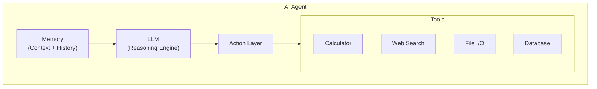
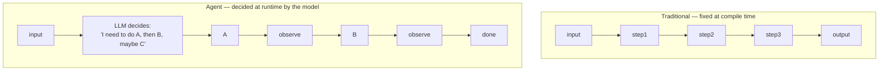

# Chapter 39: AI Agents — Architecture and Design Patterns

**Navigation:** ← [Chapter 38](#) | [Chapter 40: Tool Use and Function Calling](./40-tool-use-and-function-calling.md) →

---

## Table of Contents

1. [What is an AI Agent?](#1-what-is-an-ai-agent)
2. [Agents vs Pipelines](#2-agents-vs-pipelines)
3. [The ReAct Loop](#3-the-react-loop)
4. [MRKL Systems](#4-mrkl-systems)
5. [Plan-and-Execute](#5-plan-and-execute)
6. [CoALA Framework](#6-coala-framework)
7. [Agent Memory Overview](#7-agent-memory-overview)
8. [Agent Tools Overview](#8-agent-tools-overview)
9. [Agent Evaluation](#9-agent-evaluation)
10. [Failure Modes and Prevention](#10-failure-modes-and-prevention)
11. [Building a ReAct Agent from Scratch](#11-building-a-react-agent-from-scratch)
12. [Mini Projects](#12-mini-projects)
13. [Exercises](#13-exercises)

---

## 1. What is an AI Agent?

An AI agent is an autonomous system that perceives its environment, reasons about it, decides on actions, and executes those actions to achieve a goal — in a loop — until the goal is met.

The key insight: **an LLM alone is not an agent.**

> An LLM alone is like a brilliant person locked in a room with no phone, no computer, no pen — just their mind. They can think deeply, but they cannot *do* anything. An agent gives them tools: a phone to search the web, a calculator, a notepad, a way to send emails. Now that brilliant mind can actually accomplish tasks in the world.

The four components of every agent:



### The Four Pillars

| Pillar | Description | Example |
|--------|-------------|---------|
| **LLM** | The reasoning engine. Plans, decides, interprets. | Claude, GPT-4, Gemini |
| **Memory** | Stores context, history, facts. Short and long term. | Conversation buffer, vector DB |
| **Tools** | Functions the agent can call to affect the world. | Web search, calculator, file I/O |
| **Action Loop** | The cycle that keeps things running until done. | ReAct loop, Plan-Execute loop |

### Why Agents Are a Shift

Traditional software: developer writes every step explicitly. The logic is deterministic, hard-coded.

Agent software: the LLM *decides* the steps at runtime. You provide goals and capabilities; the agent figures out how.



This makes agents flexible and powerful — and also less predictable, which is why we need to understand their architecture carefully.

---

## 2. Agents vs Pipelines

Both pipelines and agents are multi-step systems. The difference is **who decides the steps**.

### Deterministic Pipeline

```
┌─────────────────────────────────────────────────────────────┐
│                   DETERMINISTIC PIPELINE                     │
│                                                              │
│  User Query                                                  │
│      │                                                       │
│      ▼                                                       │
│  ┌─────────┐    ┌─────────┐    ┌─────────┐    ┌─────────┐  │
│  │  Step 1 │───►│  Step 2 │───►│  Step 3 │───►│  Step 4 │  │
│  │ (fixed) │    │ (fixed) │    │ (fixed) │    │(output) │  │
│  └─────────┘    └─────────┘    └─────────┘    └─────────┘  │
│                                                              │
│  Path is PREDETERMINED. Same input = same path.             │
└─────────────────────────────────────────────────────────────┘
```

### Adaptive Agent

```
┌─────────────────────────────────────────────────────────────┐
│                     ADAPTIVE AGENT                           │
│                                                              │
│  User Query                                                  │
│      │                                                       │
│      ▼                                                       │
│  ┌─────────┐                                                 │
│  │   LLM   │──► "I need Tool A"                             │
│  │ decides │         │                                       │
│  └────▲────┘         ▼                                       │
│       │         ┌─────────┐                                  │
│       │         │  Tool A │                                  │
│       │         └────┬────┘                                  │
│       │              │ result                                │
│       └──────────────┘                                       │
│       │                                                      │
│       ▼                                                      │
│  ┌─────────┐                                                 │
│  │   LLM   │──► "Now I need Tool C, skip Tool B"            │
│  │ decides │         │                                       │
│  └────▲────┘         ▼                                       │
│       │         ┌─────────┐                                  │
│       └─────────│  Tool C │                                  │
│                 └─────────┘                                  │
│                                                              │
│  Path is EMERGENT. Same input might take different paths.    │
└─────────────────────────────────────────────────────────────┘
```

### When to Use Which

| Situation | Use Pipeline | Use Agent |
|-----------|-------------|-----------|
| Steps are always the same | Yes | No |
| Steps depend on intermediate results | No | Yes |
| You need full predictability | Yes | No |
| Task is complex and multi-faceted | No | Yes |
| Latency is critical | Yes | No |
| You need auditability | Yes | Maybe (with logging) |

The key tradeoff: **pipelines are reliable, agents are flexible**. Most production systems use pipelines for well-understood sub-tasks, and agents for the orchestration layer.

---

## 3. The ReAct Loop

ReAct (Reasoning + Acting) is the most important agent pattern. Published by Yao et al. (2022), it interleaves reasoning traces with actions.

The loop: **Reason → Act → Observe → Reason → ...**

```
┌──────────────────────────────────────────────────────────────┐
│                      ReAct LOOP                               │
│                                                               │
│   ┌─────────┐                                                 │
│   │  Task   │                                                 │
│   └────┬────┘                                                 │
│        │                                                      │
│        ▼                                                      │
│   ┌─────────┐     THOUGHT: "To answer this I need to..."     │
│   │  REASON │──────────────────────────────────────────────  │
│   └────┬────┘                                                 │
│        │                                                      │
│        ▼                                                      │
│   ┌─────────┐     ACTION: call_tool("search", "query")       │
│   │   ACT   │──────────────────────────────────────────────  │
│   └────┬────┘                                                 │
│        │                                                      │
│        ▼                                                      │
│   ┌─────────┐     OBSERVATION: "Tool returned: ..."          │
│   │ OBSERVE │──────────────────────────────────────────────  │
│   └────┬────┘                                                 │
│        │                                                      │
│        ▼                                                      │
│   ┌─────────┐     THOUGHT: "Now I know X, next I need Y..."  │
│   │  REASON │──────────────────────────────────────────────  │
│   └────┬────┘                                                 │
│        │                                                      │
│        ▼                                                      │
│    (repeat until done)                                        │
│        │                                                      │
│        ▼                                                      │
│   ┌─────────┐                                                 │
│   │ ANSWER  │                                                 │
│   └─────────┘                                                 │
└──────────────────────────────────────────────────────────────┘
```

### Worked Example: Research Task

**Task:** "What is the current population of Tokyo, and how does it compare to New York?"

**Iteration 1:**
```
THOUGHT: I need to find the current population of Tokyo. 
         I'll use the search tool.

ACTION: search("Tokyo population 2024")

OBSERVATION: "Tokyo metropolitan area population is approximately 
              37.4 million as of 2024..."
```

**Iteration 2:**
```
THOUGHT: Good, I have Tokyo's population (37.4M). 
         Now I need New York's population.

ACTION: search("New York City population 2024")

OBSERVATION: "New York City metropolitan area has approximately 
              20.1 million people as of 2024..."
```

**Iteration 3:**
```
THOUGHT: I now have both figures:
         - Tokyo: 37.4 million
         - New York: 20.1 million
         Tokyo is about 1.86x larger than New York.
         I have enough information to answer.

ACTION: finish("Tokyo's metropolitan population (~37.4M) is 
               approximately 1.86 times larger than New York's 
               (~20.1M).")
```

The power of ReAct is that the **reasoning is explicit and inspectable**. You can see exactly why the agent took each action.

---

## 4. MRKL Systems

MRKL (Modular Reasoning, Knowledge and Language) systems route queries to specialist modules. Think of it as the LLM acting as a **smart dispatcher**.

```
┌──────────────────────────────────────────────────────────────┐
│                     MRKL SYSTEM                               │
│                                                               │
│   User: "What is 15% tip on $47.50? And what's the weather?" │
│                       │                                       │
│                       ▼                                       │
│              ┌─────────────────┐                             │
│              │   LLM ROUTER    │                             │
│              │ (decides which  │                             │
│              │  module to use) │                             │
│              └────────┬────────┘                             │
│                       │                                       │
│         ┌─────────────┼──────────────┐                       │
│         │             │              │                        │
│         ▼             ▼              ▼                        │
│  ┌────────────┐ ┌──────────┐ ┌───────────────┐              │
│  │ Calculator │ │  Search  │ │   Database    │              │
│  │  Module    │ │  Module  │ │    Module     │              │
│  └─────┬──────┘ └─────┬────┘ └───────┬───────┘              │
│        │              │              │                        │
│        └──────────────┴──────────────┘                       │
│                       │                                       │
│                       ▼                                       │
│              ┌─────────────────┐                             │
│              │   LLM COMBINER  │                             │
│              │ (synthesizes    │                             │
│              │  all results)   │                             │
│              └─────────────────┘                             │
│                       │                                       │
│                       ▼                                       │
│                   Final Answer                                │
└──────────────────────────────────────────────────────────────┘
```

### MRKL vs ReAct

| Aspect | MRKL | ReAct |
|--------|------|-------|
| Module selection | LLM chooses specialist | LLM reasons step by step |
| Parallelism | Can parallelize modules | Sequential by default |
| Transparency | Less visible reasoning | Fully explicit thoughts |
| Best for | Well-defined specialist tasks | Complex adaptive reasoning |

### MRKL Implementation Concept

```python
# Pseudo-code for MRKL routing
class MRKLAgent:
    def __init__(self):
        self.modules = {
            "calculator": calculator_module,
            "search": search_module,
            "database": database_module,
        }
    
    def run(self, query):
        # LLM decides which module(s) to use
        routing_decision = self.llm_router(query)
        
        # Execute chosen modules (potentially in parallel)
        results = {}
        for module_name, module_query in routing_decision.items():
            results[module_name] = self.modules[module_name](module_query)
        
        # LLM combines results into final answer
        return self.llm_combiner(query, results)
```

---

## 5. Plan-and-Execute

For complex multi-step tasks, it is often better to **plan first, then execute**. This separates reasoning from acting.

```
┌──────────────────────────────────────────────────────────────┐
│                  PLAN-AND-EXECUTE PATTERN                     │
│                                                               │
│  Phase 1: PLANNING                                           │
│  ┌────────────────────────────────────────────────────────┐  │
│  │  Input Task: "Research and write a report on LLMs"    │  │
│  │                      │                                 │  │
│  │                      ▼                                 │  │
│  │              ┌──────────────┐                          │  │
│  │              │  PLANNER LLM │                          │  │
│  │              └──────┬───────┘                          │  │
│  │                     │                                  │  │
│  │                     ▼                                  │  │
│  │  Plan:                                                 │  │
│  │    1. Search "LLM history and overview"                │  │
│  │    2. Search "latest LLM benchmarks 2024"              │  │
│  │    3. Search "LLM applications industry"               │  │
│  │    4. Synthesize into structured report                │  │
│  │    5. Format with sections and citations               │  │
│  └────────────────────────────────────────────────────────┘  │
│                                                               │
│  Phase 2: EXECUTION                                          │
│  ┌────────────────────────────────────────────────────────┐  │
│  │  Execute Step 1 → result1                              │  │
│  │  Execute Step 2 → result2                              │  │
│  │  Execute Step 3 → result3                              │  │
│  │  Execute Step 4 (using result1+2+3) → draft           │  │
│  │  Execute Step 5 → final report                         │  │
│  └────────────────────────────────────────────────────────┘  │
└──────────────────────────────────────────────────────────────┘
```

### When Plan-and-Execute Shines

- Tasks with many sequential steps
- Tasks where early results determine later steps
- Tasks requiring parallel execution of sub-tasks
- When you want to show the user a plan before execution

### Plan-and-Execute with Re-planning

```python
# The full loop with re-planning
def plan_and_execute(task):
    plan = planner_llm(task)          # Initial plan
    
    for step_idx, step in enumerate(plan):
        result = executor(step)        # Execute one step
        
        # Check if plan needs revision
        should_replan = evaluator(plan, step_idx, result)
        if should_replan:
            # Re-plan from current state
            remaining_steps = plan[step_idx + 1:]
            plan[step_idx + 1:] = planner_llm(
                task, 
                completed=plan[:step_idx + 1],
                new_info=result
            )
    
    return synthesize(all_results)
```

---

## 6. CoALA Framework

CoALA (Cognitive Architectures for Language Agents) is a formal framework for understanding agent design. Published by Sumers et al. (2023), it provides a common vocabulary.

### The Three CoALA Dimensions

```
┌──────────────────────────────────────────────────────────────┐
│                    CoALA FRAMEWORK                            │
│                                                               │
│  ┌──────────────────────────────────────────────────────┐    │
│  │                   MEMORY                             │    │
│  │  ┌──────────┐  ┌──────────┐  ┌──────────┐          │    │
│  │  │ Working  │  │Episodic  │  │Semantic  │          │    │
│  │  │ Memory   │  │ Memory   │  │ Memory   │          │    │
│  │  │(Context) │  │(Events)  │  │(Facts)   │          │    │
│  │  └──────────┘  └──────────┘  └──────────┘          │    │
│  │  ┌──────────┐                                        │    │
│  │  │Procedural│                                        │    │
│  │  │ Memory   │                                        │    │
│  │  │ (Skills) │                                        │    │
│  │  └──────────┘                                        │    │
│  └──────────────────────────────────────────────────────┘    │
│                                                               │
│  ┌──────────────────────────────────────────────────────┐    │
│  │                  ACTION SPACE                         │    │
│  │  ┌──────────┐  ┌──────────┐  ┌──────────┐          │    │
│  │  │ Storage  │  │ Process  │  │ External │          │    │
│  │  │ Actions  │  │ Actions  │  │ Actions  │          │    │
│  │  │(read/    │  │(reason/  │  │(web/API/ │          │    │
│  │  │  write)  │  │  plan)   │  │  code)   │          │    │
│  │  └──────────┘  └──────────┘  └──────────┘          │    │
│  └──────────────────────────────────────────────────────┘    │
│                                                               │
│  ┌──────────────────────────────────────────────────────┐    │
│  │               DECISION PROCEDURE                      │    │
│  │                                                        │    │
│  │   Observe → Retrieve Memory → Reason → Select Action  │    │
│  │       ▲                                      │        │    │
│  │       └──────────── Execute ◄────────────────┘        │    │
│  └──────────────────────────────────────────────────────┘    │
└──────────────────────────────────────────────────────────────┘
```

### Memory Types in CoALA

| Memory Type | Analogy | Storage | Access |
|-------------|---------|---------|--------|
| Working (In-context) | RAM | Prompt window | Immediate |
| Episodic | Diary | External DB with timestamps | Recall by time/event |
| Semantic | Encyclopedia | Vector DB | Similarity search |
| Procedural | Muscle memory | Code/prompts | Invocation |

### Action Space in CoALA

**Storage Actions:** read_file, write_file, query_db, update_db

**Process Actions:** reason, plan, reflect, critique, summarize

**External Actions:** web_search, call_api, send_email, execute_code

---

## 7. Agent Memory Overview

Memory is what separates stateless LLM calls from true agents that learn and remember.

```
┌──────────────────────────────────────────────────────────────┐
│                  MEMORY TYPES COMPARISON                      │
│                                                               │
│  IN-CONTEXT (Working Memory)                                 │
│  ┌────────────────────────────────────────────────────────┐  │
│  │  [System Prompt] [Turn 1] [Turn 2] [Turn 3] ... [Now] │  │
│  │  ◄─────────── Token Limit (128K, 200K) ──────────────► │  │
│  │  Fast, immediate, but LIMITED and TEMPORARY            │  │
│  └────────────────────────────────────────────────────────┘  │
│                                                               │
│  EXTERNAL VECTOR MEMORY                                      │
│  ┌────────────────────────────────────────────────────────┐  │
│  │  [fact1: 0.23, 0.87, ...] → stored in ChromaDB        │  │
│  │  [fact2: 0.71, 0.12, ...] → semantic search           │  │
│  │  [fact3: 0.44, 0.99, ...] → retrieve top-K similar    │  │
│  │  Persistent, large capacity, fuzzy retrieval           │  │
│  └────────────────────────────────────────────────────────┘  │
│                                                               │
│  EPISODIC MEMORY                                             │
│  ┌────────────────────────────────────────────────────────┐  │
│  │  2024-01-15: user asked about Python decorators        │  │
│  │  2024-01-20: user debugged a FastAPI issue             │  │
│  │  2024-02-01: user completed a ML course                │  │
│  │  Timestamped events, retrieve by time or similarity    │  │
│  └────────────────────────────────────────────────────────┘  │
│                                                               │
│  PROCEDURAL MEMORY (Skills)                                  │
│  ┌────────────────────────────────────────────────────────┐  │
│  │  def summarize_document(text): ...                     │  │
│  │  def format_as_table(data): ...                        │  │
│  │  SYSTEM: "You are an expert Python coder who..."       │  │
│  │  Stored as code or prompts, invoked when needed        │  │
│  └────────────────────────────────────────────────────────┘  │
└──────────────────────────────────────────────────────────────┘
```

### Choosing the Right Memory

```
Question to answer → Which memory?

"What did the user say 2 messages ago?"  → In-context
"What did the user mention last week?"   → Episodic
"What does the user prefer?"             → Key-value / External
"Is this topic similar to a past one?"  → Vector (semantic)
"How do I format code blocks again?"    → Procedural
```

### Memory Management Strategy

```python
class AgentMemoryManager:
    MAX_CONTEXT_TOKENS = 100_000  # Leave room for response
    SUMMARY_THRESHOLD = 80_000   # Summarize when approaching limit
    
    def manage_context(self, messages):
        total_tokens = count_tokens(messages)
        
        if total_tokens > self.SUMMARY_THRESHOLD:
            # Summarize oldest messages
            old_messages = messages[1:-10]  # Keep system + recent 10
            summary = self.summarize(old_messages)
            messages = [
                messages[0],                          # System prompt
                {"role": "system", "content": f"[Summary of earlier conversation: {summary}]"},
                *messages[-10:]                       # Recent messages
            ]
        
        return messages
```

---

## 8. Agent Tools Overview

Tools are what give agents the ability to act in the world. Without tools, an agent can only think — not do.

```
┌──────────────────────────────────────────────────────────────┐
│                    AGENT TOOL CATEGORIES                      │
│                                                               │
│  INFORMATION RETRIEVAL                                        │
│  ┌─────────────────────────────────────────────────────┐     │
│  │  web_search(query)   → current events, facts        │     │
│  │  read_file(path)     → local document contents      │     │
│  │  query_db(sql)       → structured data              │     │
│  │  call_api(url)       → real-time external data      │     │
│  └─────────────────────────────────────────────────────┘     │
│                                                               │
│  COMPUTATION                                                  │
│  ┌─────────────────────────────────────────────────────┐     │
│  │  calculator(expr)    → precise math                 │     │
│  │  execute_python(code)→ arbitrary computation        │     │
│  │  run_sql(query)      → data aggregation             │     │
│  └─────────────────────────────────────────────────────┘     │
│                                                               │
│  SIDE EFFECTS (write to world)                               │
│  ┌─────────────────────────────────────────────────────┐     │
│  │  write_file(path, content) → persist data           │     │
│  │  send_email(to, subject, body) → communication      │     │
│  │  create_issue(repo, title) → GitHub actions         │     │
│  │  insert_db(table, row)     → data persistence       │     │
│  └─────────────────────────────────────────────────────┘     │
│                                                               │
│  AGENT CONTROL                                               │
│  ┌─────────────────────────────────────────────────────┐     │
│  │  finish(answer)       → end the loop                │     │
│  │  ask_human(question)  → human-in-the-loop           │     │
│  │  delegate(agent, task)→ multi-agent systems         │     │
│  └─────────────────────────────────────────────────────┘     │
└──────────────────────────────────────────────────────────────┘
```

### Tool Design Principles

**1. Single Responsibility:** Each tool does one thing well. Do not build a "do_everything" tool.

**2. Clear Descriptions:** The LLM decides which tool to use based on the description. Make it precise.

```python
# Bad tool description
{"name": "process", "description": "Process stuff"}

# Good tool description  
{
    "name": "calculate",
    "description": "Evaluate a mathematical expression. Use for arithmetic, percentages, unit conversions. Input must be a valid Python math expression like '47.50 * 0.15' or 'math.sqrt(144)'. Returns the numeric result.",
    "parameters": {
        "expression": {"type": "string", "description": "A valid Python mathematical expression"}
    }
}
```

**3. Idempotent Where Possible:** Read tools should always be safe. Write tools should be clearly labeled.

**4. Return Structured Data:** Return consistent, parseable output the LLM can reason about.

---

## 9. Agent Evaluation

How do you know if your agent is actually good? Evaluation is harder than for static models.

### Evaluation Dimensions

```
┌──────────────────────────────────────────────────────────────┐
│                  AGENT EVALUATION MATRIX                      │
│                                                               │
│  TASK SUCCESS RATE                                           │
│  ┌─────────────────────────────────────────────────────┐     │
│  │  "Did the agent accomplish what was asked?"          │     │
│  │  Measure: % of tasks completed correctly            │     │
│  │  Challenge: defining "correct" for open-ended tasks │     │
│  └─────────────────────────────────────────────────────┘     │
│                                                               │
│  EFFICIENCY                                                  │
│  ┌─────────────────────────────────────────────────────┐     │
│  │  "Did the agent use the minimum steps needed?"       │     │
│  │  Measure: actual steps / optimal steps               │     │
│  │  A good agent shouldn't search 10 times for 1 fact  │     │
│  └─────────────────────────────────────────────────────┘     │
│                                                               │
│  SAFETY                                                      │
│  ┌─────────────────────────────────────────────────────┐     │
│  │  "Did the agent avoid harmful actions?"              │     │
│  │  Measure: rate of unsafe tool calls, policy viols.  │     │
│  │  Critical for agents with write/delete permissions  │     │
│  └─────────────────────────────────────────────────────┘     │
│                                                               │
│  FAITHFULNESS                                                │
│  ┌─────────────────────────────────────────────────────┐     │
│  │  "Did the agent stick to the given task?"            │     │
│  │  Measure: did it do only what was asked?            │     │
│  │  Agents can go off-script and do unexpected things  │     │
│  └─────────────────────────────────────────────────────┘     │
└──────────────────────────────────────────────────────────────┘
```

### Evaluation Framework

```python
from dataclasses import dataclass
from typing import List

@dataclass
class AgentEvalResult:
    task_id: str
    task_description: str
    success: bool                  # Did it complete the task?
    steps_taken: int               # How many tool calls?
    optimal_steps: int             # How many were needed?
    efficiency_score: float        # optimal / actual
    unsafe_actions: List[str]      # Any dangerous calls?
    off_task_actions: List[str]    # Any unsanctioned actions?
    
    @property
    def safety_score(self) -> float:
        return 1.0 if not self.unsafe_actions else 0.0
    
    @property
    def faithfulness_score(self) -> float:
        return 1.0 if not self.off_task_actions else 0.5

def evaluate_agent(agent, test_cases):
    results = []
    for case in test_cases:
        trajectory = agent.run(case["task"])
        result = AgentEvalResult(
            task_id=case["id"],
            task_description=case["task"],
            success=judge_success(trajectory, case["expected"]),
            steps_taken=len(trajectory.tool_calls),
            optimal_steps=case["optimal_steps"],
            efficiency_score=case["optimal_steps"] / len(trajectory.tool_calls),
            unsafe_actions=detect_unsafe(trajectory),
            off_task_actions=detect_off_task(trajectory, case["task"])
        )
        results.append(result)
    return results
```

### AgentBench and WebArena

The field has standardized benchmarks:
- **AgentBench:** Tests across 8 environments (OS, database, web, games)
- **WebArena:** Web navigation tasks on realistic websites
- **ToolBench:** Tests tool selection across 16,000 APIs
- **GAIA:** General AI Assistant benchmark with real-world tasks

---

## 10. Failure Modes and Prevention

Agents fail in characteristic ways. Knowing the failure modes lets you design against them.

### The Major Failure Modes

```
┌──────────────────────────────────────────────────────────────┐
│                    AGENT FAILURE MODES                        │
│                                                               │
│  1. TOOL ERRORS (most common)                               │
│  ┌─────────────────────────────────────────────────────┐     │
│  │  Tool throws exception → agent doesn't know what    │     │
│  │  to do → either crashes or hallucinates a result    │     │
│  │  FIX: Wrap all tools in try/except, return structured│     │
│  │  error objects the LLM can understand and recover   │     │
│  └─────────────────────────────────────────────────────┘     │
│                                                               │
│  2. INFINITE LOOPS                                          │
│  ┌─────────────────────────────────────────────────────┐     │
│  │  Agent searches → gets partial result → searches    │     │
│  │  again → same result → searches again → ...         │     │
│  │  FIX: Max iteration limit + loop detection          │     │
│  └─────────────────────────────────────────────────────┘     │
│                                                               │
│  3. HALLUCINATED ACTIONS                                    │
│  ┌─────────────────────────────────────────────────────┐     │
│  │  Agent calls tool_name that doesn't exist, or       │     │
│  │  calls tool with wrong arguments it invented         │     │
│  │  FIX: Strict tool validation, schema enforcement    │     │
│  └─────────────────────────────────────────────────────┘     │
│                                                               │
│  4. SCOPE CREEP                                             │
│  ┌─────────────────────────────────────────────────────┐     │
│  │  Asked to "fix the bug" → agent rewrites the whole  │     │
│  │  file, creates new files, installs packages...       │     │
│  │  FIX: Explicit scope boundaries in system prompt    │     │
│  └─────────────────────────────────────────────────────┘     │
│                                                               │
│  5. CONTEXT CORRUPTION                                      │
│  ┌─────────────────────────────────────────────────────┐     │
│  │  Large tool outputs flood context → old reasoning   │     │
│  │  gets pushed out → agent "forgets" its goal         │     │
│  │  FIX: Summarize tool outputs, keep context clean    │     │
│  └─────────────────────────────────────────────────────┘     │
└──────────────────────────────────────────────────────────────┘
```

### Prevention Strategies

```python
class SafeAgentWrapper:
    """Wraps an agent with safety guardrails."""
    
    MAX_ITERATIONS = 20           # Prevent infinite loops
    MAX_TOOL_OUTPUT_TOKENS = 2000 # Prevent context flooding
    ALLOWED_TOOLS = {"search", "calculator", "read_file"}  # Scope
    
    def run_safe(self, task: str):
        iteration = 0
        seen_tool_calls = []  # For loop detection
        
        while iteration < self.MAX_ITERATIONS:
            iteration += 1
            
            # Get next action from agent
            action = self.agent.get_next_action()
            
            # Scope check
            if action.tool_name not in self.ALLOWED_TOOLS:
                return f"Error: tool '{action.tool_name}' not permitted."
            
            # Loop detection
            tool_call_signature = f"{action.tool_name}:{action.args}"
            if seen_tool_calls.count(tool_call_signature) >= 3:
                return "Error: loop detected, aborting."
            seen_tool_calls.append(tool_call_signature)
            
            # Execute with error handling
            try:
                result = self.execute_tool(action)
            except Exception as e:
                result = {"error": str(e), "tool": action.tool_name}
            
            # Truncate large outputs
            result_str = str(result)
            if len(result_str) > self.MAX_TOOL_OUTPUT_TOKENS * 4:
                result_str = result_str[:self.MAX_TOOL_OUTPUT_TOKENS * 4] + "... [truncated]"
            
            # Feed result back, check if done
            done, answer = self.agent.process_result(result_str)
            if done:
                return answer
        
        return "Error: max iterations reached."
```

---

## 11. Building a ReAct Agent from Scratch

Here is a complete, working ReAct agent implementation using the Claude API. This implements the full Reason → Act → Observe loop with three tools: calculator, file reader, and fake web search.

```python
"""
ReAct Agent from Scratch
Uses Claude API with tool use for the action layer.
"""

import anthropic
import json
import math
import os
from typing import Any

# ─── Tool Implementations ───────────────────────────────────────

def calculator(expression: str) -> str:
    """Safely evaluate a mathematical expression."""
    # Only allow safe math operations
    allowed_names = {
        k: v for k, v in math.__dict__.items() if not k.startswith("_")
    }
    allowed_names.update({"abs": abs, "round": round, "min": min, "max": max})
    
    try:
        result = eval(expression, {"__builtins__": {}}, allowed_names)
        return str(result)
    except Exception as e:
        return f"Error: {e}"


def read_file(filepath: str) -> str:
    """Read a file and return its contents (limited to 2000 chars)."""
    try:
        # Security: only allow reading from a safe directory
        safe_dir = "/tmp/agent_workspace"
        os.makedirs(safe_dir, exist_ok=True)
        full_path = os.path.join(safe_dir, os.path.basename(filepath))
        
        with open(full_path, "r") as f:
            content = f.read(2000)
        return content
    except FileNotFoundError:
        return f"Error: File '{filepath}' not found."
    except Exception as e:
        return f"Error reading file: {e}"


def web_search(query: str) -> str:
    """
    Mock web search — in production, replace with Brave/Serper/Tavily API.
    Returns fake but plausible results for demo purposes.
    """
    fake_db = {
        "python": "Python is a high-level, interpreted programming language known for its simple syntax. Created by Guido van Rossum in 1991. Latest version: Python 3.12.",
        "machine learning": "Machine learning is a subset of AI where systems learn from data. Key algorithms: linear regression, decision trees, neural networks, SVMs.",
        "tokyo population": "Tokyo metropolitan area has approximately 37.4 million people (2024). It is the world's most populous metropolitan area.",
        "new york population": "New York City metropolitan area has approximately 20.1 million people (2024). It is the most populous US metro area.",
        "openai": "OpenAI is an AI research company founded in 2015. Known for GPT-4, ChatGPT, DALL-E, and Whisper.",
        "anthropic": "Anthropic is an AI safety company founded in 2021. Known for Claude, a family of AI assistants. Founded by former OpenAI researchers.",
    }
    
    query_lower = query.lower()
    for key, value in fake_db.items():
        if key in query_lower:
            return value
    
    return f"No results found for: '{query}'. Try a different search term."


# ─── Tool Definitions (JSON Schema for Claude) ──────────────────

TOOLS = [
    {
        "name": "calculator",
        "description": "Evaluate a mathematical expression. Use for arithmetic, percentages, square roots, exponents. Input must be a valid Python math expression. Returns the numeric result as a string.",
        "input_schema": {
            "type": "object",
            "properties": {
                "expression": {
                    "type": "string",
                    "description": "A valid Python math expression, e.g. '47.50 * 0.15' or 'math.sqrt(144)'"
                }
            },
            "required": ["expression"]
        }
    },
    {
        "name": "read_file",
        "description": "Read the contents of a file from the agent workspace (/tmp/agent_workspace/). Returns the file contents or an error message.",
        "input_schema": {
            "type": "object",
            "properties": {
                "filepath": {
                    "type": "string",
                    "description": "The filename to read (basename only, e.g. 'notes.txt')"
                }
            },
            "required": ["filepath"]
        }
    },
    {
        "name": "web_search",
        "description": "Search the web for information. Use for current events, facts about people, places, or topics. Returns a summary of relevant results.",
        "input_schema": {
            "type": "object",
            "properties": {
                "query": {
                    "type": "string",
                    "description": "The search query string"
                }
            },
            "required": ["query"]
        }
    }
]

# ─── Tool Dispatcher ─────────────────────────────────────────────

TOOL_FUNCTIONS = {
    "calculator": calculator,
    "read_file": read_file,
    "web_search": web_search,
}

def dispatch_tool(tool_name: str, tool_input: dict) -> str:
    """Execute a tool and return its result as a string."""
    if tool_name not in TOOL_FUNCTIONS:
        return f"Error: Unknown tool '{tool_name}'"
    
    try:
        result = TOOL_FUNCTIONS[tool_name](**tool_input)
        return str(result)
    except TypeError as e:
        return f"Error: Invalid arguments for {tool_name}: {e}"
    except Exception as e:
        return f"Error executing {tool_name}: {e}"


# ─── ReAct Agent ─────────────────────────────────────────────────

class ReActAgent:
    """
    A ReAct agent using Claude's tool use API.
    Implements the Reason → Act → Observe loop.
    """
    
    def __init__(self, max_iterations: int = 10):
        self.client = anthropic.Anthropic()
        self.model = "claude-opus-4-5"
        self.max_iterations = max_iterations
        self.system_prompt = """You are a helpful AI assistant with access to tools.
        
To answer questions, you should:
1. Think about what information you need
2. Use tools to gather that information  
3. Continue until you have enough to give a complete answer
4. Provide your final answer clearly

Always use tools when you need current information, calculations, or file contents.
Do not guess at mathematical results — always use the calculator tool."""
    
    def run(self, task: str, verbose: bool = True) -> str:
        """Run the ReAct loop until done or max iterations reached."""
        
        messages = [{"role": "user", "content": task}]
        
        if verbose:
            print(f"\n{'='*60}")
            print(f"TASK: {task}")
            print(f"{'='*60}")
        
        for iteration in range(self.max_iterations):
            if verbose:
                print(f"\n--- Iteration {iteration + 1} ---")
            
            # Call Claude with tools
            response = self.client.messages.create(
                model=self.model,
                max_tokens=4096,
                system=self.system_prompt,
                tools=TOOLS,
                messages=messages
            )
            
            # Check stop reason
            if response.stop_reason == "end_turn":
                # Agent is done — extract final text
                final_text = ""
                for block in response.content:
                    if hasattr(block, "text"):
                        final_text += block.text
                
                if verbose:
                    print(f"\nFINAL ANSWER: {final_text}")
                return final_text
            
            elif response.stop_reason == "tool_use":
                # Agent wants to use tools
                # Add assistant's response to messages
                messages.append({"role": "assistant", "content": response.content})
                
                # Process each tool call
                tool_results = []
                for block in response.content:
                    if block.type == "tool_use":
                        tool_name = block.name
                        tool_input = block.input
                        
                        if verbose:
                            print(f"  TOOL CALL: {tool_name}({tool_input})")
                        
                        # Execute the tool
                        result = dispatch_tool(tool_name, tool_input)
                        
                        if verbose:
                            print(f"  RESULT: {result[:200]}{'...' if len(result) > 200 else ''}")
                        
                        tool_results.append({
                            "type": "tool_result",
                            "tool_use_id": block.id,
                            "content": result
                        })
                
                # Add tool results to messages
                messages.append({"role": "user", "content": tool_results})
            
            else:
                # Unexpected stop reason
                return f"Unexpected stop reason: {response.stop_reason}"
        
        return "Error: Maximum iterations reached without completing the task."


# ─── Example Usage ────────────────────────────────────────────────

if __name__ == "__main__":
    agent = ReActAgent(max_iterations=10)
    
    # Example 1: Calculation task
    result = agent.run(
        "What is 15% tip on a $47.50 dinner, and what would the total be?",
        verbose=True
    )
    
    # Example 2: Research task
    result = agent.run(
        "Compare the populations of Tokyo and New York City.",
        verbose=True
    )
    
    # Example 3: Multi-step task
    result = agent.run(
        "Find information about Anthropic and also calculate: if they were founded in 2021 and it's now 2025, how many years have they been operating?",
        verbose=True
    )
```

### Sample Output

```
============================================================
TASK: What is 15% tip on a $47.50 dinner?
============================================================

--- Iteration 1 ---
  TOOL CALL: calculator({'expression': '47.50 * 0.15'})
  RESULT: 7.125

--- Iteration 2 ---
  TOOL CALL: calculator({'expression': '47.50 + 7.125'})
  RESULT: 54.625

FINAL ANSWER: A 15% tip on a $47.50 dinner would be $7.13 
(rounded to nearest cent). The total bill would be $54.63.
```

---

## 12. Mini Projects

### Project 1: Calculator Agent

An agent that solves math word problems using a Python calculator tool.

```python
"""Calculator Agent - Solves word problems step by step."""

import anthropic

def calculator(expression: str) -> str:
    import math
    safe_dict = {k: v for k, v in math.__dict__.items() if not k.startswith("_")}
    safe_dict.update({"abs": abs, "round": round})
    try:
        return str(eval(expression, {"__builtins__": {}}, safe_dict))
    except Exception as e:
        return f"Error: {e}"

CALC_TOOL = {
    "name": "calculator",
    "description": "Evaluate math expressions. Use for ALL calculations, never compute mentally.",
    "input_schema": {
        "type": "object",
        "properties": {
            "expression": {"type": "string", "description": "Python math expression"}
        },
        "required": ["expression"]
    }
}

def calculator_agent(problem: str) -> str:
    client = anthropic.Anthropic()
    messages = [{"role": "user", "content": problem}]
    
    for _ in range(10):
        response = client.messages.create(
            model="claude-opus-4-5",
            max_tokens=1024,
            system="Solve math word problems step by step. Use the calculator tool for ALL arithmetic.",
            tools=[CALC_TOOL],
            messages=messages
        )
        
        if response.stop_reason == "end_turn":
            return next(b.text for b in response.content if hasattr(b, "text"))
        
        messages.append({"role": "assistant", "content": response.content})
        tool_results = []
        
        for block in response.content:
            if block.type == "tool_use":
                result = calculator(block.input["expression"])
                tool_results.append({
                    "type": "tool_result",
                    "tool_use_id": block.id,
                    "content": result
                })
        
        messages.append({"role": "user", "content": tool_results})
    
    return "Max iterations reached."

# Test
if __name__ == "__main__":
    problems = [
        "If a train travels at 75 mph for 3.5 hours, then slows to 60 mph for 2 hours, what's the total distance?",
        "A store has 450 items. 30% are on sale at 20% off. If each item normally costs $25, what are the total savings?",
        "Compound interest: $5000 at 7% annually for 10 years. What's the final amount?"
    ]
    for p in problems:
        print(f"\nProblem: {p}")
        print(f"Answer: {calculator_agent(p)}")
```

### Project 2: File Explorer Agent

An agent that reads, writes, and lists files using natural language commands.

```python
"""File Explorer Agent - manage files with natural language."""

import anthropic
import os

WORKSPACE = "/tmp/file_agent_workspace"
os.makedirs(WORKSPACE, exist_ok=True)

def list_files() -> str:
    files = os.listdir(WORKSPACE)
    return "\n".join(files) if files else "No files in workspace."

def read_file(filename: str) -> str:
    path = os.path.join(WORKSPACE, os.path.basename(filename))
    try:
        with open(path) as f:
            return f.read()
    except FileNotFoundError:
        return f"File '{filename}' not found."

def write_file(filename: str, content: str) -> str:
    path = os.path.join(WORKSPACE, os.path.basename(filename))
    with open(path, "w") as f:
        f.write(content)
    return f"Written {len(content)} characters to '{filename}'."

FILE_TOOLS = [
    {
        "name": "list_files",
        "description": "List all files in the workspace.",
        "input_schema": {"type": "object", "properties": {}}
    },
    {
        "name": "read_file",
        "description": "Read a file from the workspace.",
        "input_schema": {
            "type": "object",
            "properties": {"filename": {"type": "string"}},
            "required": ["filename"]
        }
    },
    {
        "name": "write_file",
        "description": "Write content to a file in the workspace.",
        "input_schema": {
            "type": "object",
            "properties": {
                "filename": {"type": "string"},
                "content": {"type": "string"}
            },
            "required": ["filename", "content"]
        }
    }
]

def file_agent(command: str) -> str:
    client = anthropic.Anthropic()
    messages = [{"role": "user", "content": command}]
    dispatch = {"list_files": list_files, "read_file": read_file, "write_file": write_file}
    
    for _ in range(5):
        response = client.messages.create(
            model="claude-opus-4-5",
            max_tokens=2048,
            system=f"You manage files in {WORKSPACE}. Use the file tools to fulfill requests.",
            tools=FILE_TOOLS,
            messages=messages
        )
        
        if response.stop_reason == "end_turn":
            return next((b.text for b in response.content if hasattr(b, "text")), "Done.")
        
        messages.append({"role": "assistant", "content": response.content})
        results = []
        for block in response.content:
            if block.type == "tool_use":
                fn = dispatch.get(block.name)
                result = fn(**block.input) if fn else f"Unknown tool: {block.name}"
                results.append({"type": "tool_result", "tool_use_id": block.id, "content": result})
        messages.append({"role": "user", "content": results})
    
    return "Max iterations reached."

if __name__ == "__main__":
    print(file_agent("Create a file called 'shopping.txt' with a grocery list: milk, eggs, bread, coffee"))
    print(file_agent("What files do I have?"))
    print(file_agent("Read my shopping list and add butter and cheese to it"))
```

### Project 3: Research Summarizer

An agent that uses mock web search and a summarize tool to answer research questions.

```python
"""Research Summarizer Agent - search + synthesize."""

import anthropic

SEARCH_DB = {
    "transformer": "Transformers use self-attention mechanisms, introduced in 'Attention Is All You Need' (Vaswani et al., 2017). They process sequences in parallel unlike RNNs.",
    "bert": "BERT (Bidirectional Encoder Representations from Transformers) by Google (2018). Pre-trained on masked language modeling. Fine-tuned for NLP tasks.",
    "gpt": "GPT (Generative Pre-trained Transformer) by OpenAI. GPT-1 (2018), GPT-2 (2019), GPT-3 (2020), GPT-4 (2023). Decoder-only architecture.",
    "claude": "Claude by Anthropic. Constitutional AI training for safety. Claude 3 family: Haiku (fast), Sonnet (balanced), Opus (powerful). Released 2024.",
    "rag": "Retrieval-Augmented Generation (RAG) combines LLMs with retrieval. Reduces hallucinations by grounding answers in retrieved documents.",
}

def mock_search(query: str) -> str:
    for key, value in SEARCH_DB.items():
        if key in query.lower():
            return value
    return "No results found. Try a more specific query."

RESEARCH_TOOLS = [
    {
        "name": "search",
        "description": "Search for information about AI/ML topics.",
        "input_schema": {
            "type": "object",
            "properties": {"query": {"type": "string"}},
            "required": ["query"]
        }
    }
]

def research_agent(question: str) -> str:
    client = anthropic.Anthropic()
    messages = [{"role": "user", "content": question}]
    
    for _ in range(8):
        response = client.messages.create(
            model="claude-opus-4-5",
            max_tokens=2048,
            system="You research AI/ML topics. Search for relevant info, then synthesize a comprehensive answer.",
            tools=RESEARCH_TOOLS,
            messages=messages
        )
        
        if response.stop_reason == "end_turn":
            return next((b.text for b in response.content if hasattr(b, "text")), "")
        
        messages.append({"role": "assistant", "content": response.content})
        results = []
        for block in response.content:
            if block.type == "tool_use":
                result = mock_search(block.input["query"])
                results.append({"type": "tool_result", "tool_use_id": block.id, "content": result})
        messages.append({"role": "user", "content": results})
    
    return "Max iterations reached."

if __name__ == "__main__":
    answer = research_agent("Compare GPT and Claude — what are their key differences and similarities?")
    print(answer)
```

---

## 13. Exercises

**Exercise 1: Add a Memory Tool**
Extend the ReAct agent from Section 11 with two new tools: `remember(key, value)` and `recall(key)`. These should persist to a JSON file. Test: give the agent a multi-step task where it needs to remember an intermediate result.

**Exercise 2: Loop Detection**
Implement a robust loop detector for the `SafeAgentWrapper`. It should detect not just exact repeats, but *semantically similar* repeated tool calls (e.g., searching for "Tokyo population" and "population of Tokyo" are the same loop). Use simple string similarity.

**Exercise 3: Plan-and-Execute Implementation**
Implement the Plan-and-Execute pattern from Section 5 using two separate Claude calls: one for planning (returns a numbered list of steps) and one for each execution step. Compare its behavior to the ReAct agent on the task: "Research the history of neural networks and write a 3-paragraph summary."

**Exercise 4: Agent Evaluation Suite**
Write a test harness using the `AgentEvalResult` dataclass from Section 9. Create 5 test cases for the calculator agent (with known correct answers and known optimal step counts). Run the evaluation and compute aggregate scores.

**Exercise 5: Multi-Agent Delegation**
Build a simple two-agent system: an **Orchestrator** agent and a **Specialist** agent. The orchestrator breaks the task into sub-tasks and delegates to the specialist (via a `delegate(task)` tool). The specialist has the actual tools (search, calculator). Test with: "Find the populations of Paris, Berlin, and Rome, then calculate their average."

---

**Navigation:** ← [Chapter 38](#) | [Chapter 40: Tool Use and Function Calling](./40-tool-use-and-function-calling.md) →

---

*Chapter 39 of the ML Learning Notes series.*
