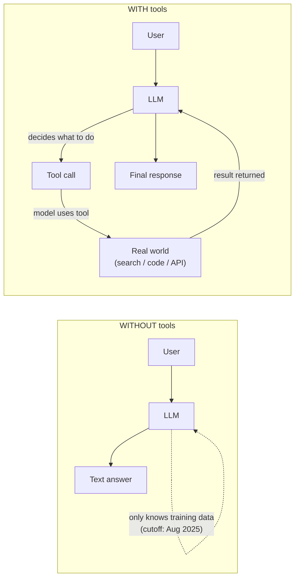
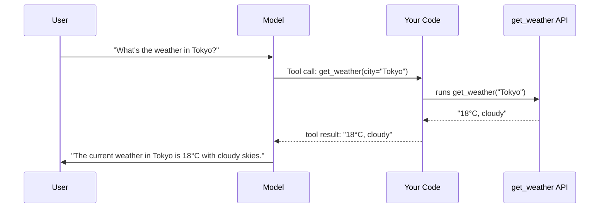
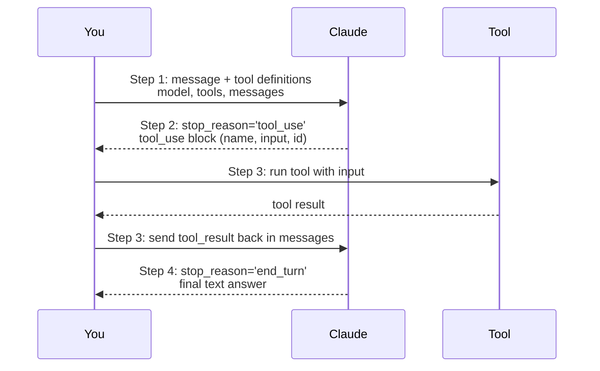

# 40 | Tool Use and Function Calling

## Table of Contents
1. [Before You Start](#before-you-start)
2. [What is Tool Use?](#what-is-tool-use)
3. [The Tool Use Protocol](#the-tool-use-protocol)
4. [Defining Tools](#defining-tools)
5. [Implementing a Tool Loop](#implementing-a-tool-loop)
6. [Common Tool Patterns](#common-tool-patterns)
7. [Parallel Tool Calls](#parallel-tool-calls)
8. [Error Handling in Tool Use](#error-handling-in-tool-use)
9. [Streaming with Tool Use](#streaming-with-tool-use)
10. [Mini Projects](#mini-projects)
11. [Exercises](#exercises)

---

## Before You Start

**Prerequisites:**
- Chapter 37 (Context Engineering) — especially the ReAct section
- Basic Python and API knowledge
- An Anthropic API key

**What you'll build:** An AI assistant that can search the web, run code, read files, and query a database — all controlled by the model itself.

**The key insight:** Tool use turns an LLM from a "text generator" into an "agent that can act in the world."



---

## What is Tool Use?

Tool use (also called "function calling") lets LLMs trigger external code. The model doesn't run the code — it outputs a structured request, your code runs it, then you feed the result back to the model.



### Why This Matters

Before tool use, LLMs could only work with what they "knew" from training. With tools:

| Task | Without Tools | With Tools |
|------|--------------|------------|
| Current news | ❌ No access | ✓ Web search tool |
| Math | ❌ Makes errors | ✓ Calculator tool |
| Code execution | ❌ Can't run code | ✓ Python REPL tool |
| Database queries | ❌ Can't query live data | ✓ SQL tool |
| Send email | ❌ Just writes drafts | ✓ Email API tool |

---

## The Tool Use Protocol

Here's the full conversation flow with the Anthropic API:



---

## Defining Tools

Tools are defined using JSON Schema format.

```python
import anthropic

# A well-defined tool
get_weather_tool = {
    "name": "get_weather",
    "description": "Get current weather conditions for a city. Returns temperature, conditions, and humidity.",
    "input_schema": {
        "type": "object",
        "properties": {
            "city": {
                "type": "string",
                "description": "City name, e.g., 'Tokyo' or 'New York, NY'"
            },
            "units": {
                "type": "string",
                "enum": ["celsius", "fahrenheit"],
                "description": "Temperature units. Default: celsius",
            }
        },
        "required": ["city"]
    }
}
```

### Tool Definition Best Practices

```python
# ❌ Vague description (model won't know when to use it)
bad_tool = {
    "name": "search",
    "description": "Search for stuff",
    "input_schema": {
        "type": "object",
        "properties": {
            "q": {"type": "string"}
        },
        "required": ["q"]
    }
}

# ✓ Clear description (model knows exactly when and how)
good_tool = {
    "name": "web_search",
    "description": "Search the internet for current information. Use when you need facts that might have changed recently (news, prices, events) or information not in your training data.",
    "input_schema": {
        "type": "object",
        "properties": {
            "query": {
                "type": "string",
                "description": "Search query. Be specific for better results, e.g., 'current bitcoin price USD' not just 'bitcoin'"
            },
            "num_results": {
                "type": "integer",
                "description": "Number of results to return (1-10). Default: 3",
                "default": 3
            }
        },
        "required": ["query"]
    }
}
```

### Tool Schema Types

```python
# All JSON Schema types work
example_tool = {
    "name": "create_task",
    "description": "Create a new task in the project management system",
    "input_schema": {
        "type": "object",
        "properties": {
            "title": {"type": "string"},                    # String
            "priority": {                                    # Enum
                "type": "string",
                "enum": ["low", "medium", "high", "critical"]
            },
            "due_date": {"type": "string", "format": "date"},  # Formatted string
            "tags": {                                        # Array
                "type": "array",
                "items": {"type": "string"}
            },
            "estimated_hours": {"type": "number"},          # Number
            "is_blocked": {"type": "boolean"},              # Boolean
            "metadata": {"type": "object"},                 # Nested object
        },
        "required": ["title", "priority"]
    }
}
```

---

## Implementing a Tool Loop

The core pattern for tool use is a loop: keep calling the LLM until it stops calling tools.

```python
import anthropic
import json
from typing import Any, Callable, Dict, List

# ── Define your tool implementations ──
def get_weather(city: str, units: str = "celsius") -> str:
    """Mock weather API."""
    # In real code: call a weather API
    weather_data = {
        "tokyo": "18°C, partly cloudy, humidity 65%",
        "london": "12°C, rainy, humidity 85%",
        "new york": "22°C, sunny, humidity 45%",
    }
    result = weather_data.get(city.lower(), f"Weather data not available for {city}")
    if units == "fahrenheit":
        result = result.replace("°C", "°F")  # Simplified
    return result


def calculate(expression: str) -> str:
    """Safe math calculator."""
    try:
        # Only allow safe math operations
        allowed = set("0123456789+-*/().,% ")
        if not all(c in allowed for c in expression):
            return "Error: Only basic math operations allowed"
        result = eval(expression)
        return f"{result}"
    except Exception as e:
        return f"Error: {e}"


def web_search(query: str, num_results: int = 3) -> str:
    """Mock web search."""
    # In real code: use SerpAPI, DuckDuckGo, etc.
    return f"Search results for '{query}': [Mock result 1], [Mock result 2], [Mock result 3]"


# ── Tool registry ──
TOOLS = {
    "get_weather": get_weather,
    "calculate": calculate,
    "web_search": web_search,
}

TOOL_DEFINITIONS = [
    {
        "name": "get_weather",
        "description": "Get current weather for a city",
        "input_schema": {
            "type": "object",
            "properties": {
                "city": {"type": "string"},
                "units": {"type": "string", "enum": ["celsius", "fahrenheit"]}
            },
            "required": ["city"]
        }
    },
    {
        "name": "calculate",
        "description": "Perform mathematical calculations. Supports +, -, *, /, parentheses.",
        "input_schema": {
            "type": "object",
            "properties": {
                "expression": {"type": "string", "description": "Math expression, e.g., '(15 + 7) * 3'"}
            },
            "required": ["expression"]
        }
    },
    {
        "name": "web_search",
        "description": "Search the web for current information",
        "input_schema": {
            "type": "object",
            "properties": {
                "query": {"type": "string"},
                "num_results": {"type": "integer", "default": 3}
            },
            "required": ["query"]
        }
    }
]


# ── The agent loop ──
def run_agent(user_message: str, max_iterations: int = 10) -> str:
    """Run a tool-using agent until it produces a final answer."""
    client = anthropic.Anthropic()
    messages = [{"role": "user", "content": user_message}]
    
    print(f"User: {user_message}\n")
    
    for iteration in range(max_iterations):
        response = client.messages.create(
            model="claude-opus-4-7",
            max_tokens=4096,
            tools=TOOL_DEFINITIONS,
            messages=messages
        )
        
        # Case 1: Model is done — return final answer
        if response.stop_reason == "end_turn":
            final_text = next(
                (block.text for block in response.content if hasattr(block, "text")),
                ""
            )
            print(f"Assistant: {final_text}")
            return final_text
        
        # Case 2: Model wants to use tools
        if response.stop_reason == "tool_use":
            # Add model's response to conversation
            messages.append({"role": "assistant", "content": response.content})
            
            # Process each tool call
            tool_results = []
            for block in response.content:
                if block.type == "tool_use":
                    tool_name = block.name
                    tool_input = block.input
                    
                    print(f"  → Tool: {tool_name}({json.dumps(tool_input)})")
                    
                    # Execute the tool
                    if tool_name in TOOLS:
                        try:
                            result = TOOLS[tool_name](**tool_input)
                        except Exception as e:
                            result = f"Tool error: {str(e)}"
                    else:
                        result = f"Error: Unknown tool '{tool_name}'"
                    
                    print(f"  ← Result: {result}")
                    
                    tool_results.append({
                        "type": "tool_result",
                        "tool_use_id": block.id,
                        "content": str(result)
                    })
            
            # Add tool results to conversation
            messages.append({"role": "user", "content": tool_results})
        else:
            break
    
    return "Max iterations reached"


# Test the agent
if __name__ == "__main__":
    # Test 1: Weather query
    run_agent("What's the weather in Tokyo and London?")
    
    print("\n" + "="*60 + "\n")
    
    # Test 2: Calculation
    run_agent("If I have $1000 and invest it at 7% annual return for 5 years, what's my final amount? (Compound interest: P * (1 + r)^n)")
    
    print("\n" + "="*60 + "\n")
    
    # Test 3: Multi-tool
    run_agent("What's the temperature difference between Tokyo and London right now? Convert to Fahrenheit.")
```

---

## Common Tool Patterns

### 1. Code Execution Tool

```python
import subprocess
import tempfile
import os

def execute_python(code: str, timeout: int = 30) -> str:
    """Safely execute Python code in a subprocess."""
    # Security: create isolated temp file
    with tempfile.NamedTemporaryFile(
        mode='w', suffix='.py', delete=False
    ) as f:
        f.write(code)
        tmpfile = f.name
    
    try:
        result = subprocess.run(
            ["python", tmpfile],
            capture_output=True,
            text=True,
            timeout=timeout,
        )
        output = result.stdout
        if result.stderr:
            output += f"\nSTDERR:\n{result.stderr}"
        return output or "(no output)"
    except subprocess.TimeoutExpired:
        return f"Error: Code timed out after {timeout}s"
    except Exception as e:
        return f"Error: {e}"
    finally:
        os.unlink(tmpfile)

code_tool = {
    "name": "execute_python",
    "description": "Execute Python code. Use for calculations, data analysis, or any task requiring computation.",
    "input_schema": {
        "type": "object",
        "properties": {
            "code": {
                "type": "string",
                "description": "Python code to execute. Print results to see them."
            }
        },
        "required": ["code"]
    }
}
```

### 2. Database Query Tool

```python
import sqlite3

def query_database(sql: str, db_path: str = "data.db") -> str:
    """Execute a read-only SQL query."""
    # Security: only allow SELECT
    sql_upper = sql.strip().upper()
    if not sql_upper.startswith("SELECT"):
        return "Error: Only SELECT queries are allowed"
    
    try:
        conn = sqlite3.connect(db_path)
        conn.row_factory = sqlite3.Row
        cursor = conn.execute(sql)
        rows = cursor.fetchmany(50)  # Limit results
        
        if not rows:
            return "No results found"
        
        # Format as table
        columns = rows[0].keys()
        lines = [" | ".join(columns)]
        lines.append("-" * 60)
        for row in rows:
            lines.append(" | ".join(str(v) for v in row))
        
        return "\n".join(lines)
    except Exception as e:
        return f"Query error: {e}"
    finally:
        conn.close()

db_tool = {
    "name": "query_database",
    "description": "Query the SQLite database. Use for looking up data, statistics, or finding records. Schema: users(id, name, email, created_at), orders(id, user_id, product, amount, date)",
    "input_schema": {
        "type": "object",
        "properties": {
            "sql": {
                "type": "string",
                "description": "SELECT SQL query"
            }
        },
        "required": ["sql"]
    }
}
```

### 3. File Operations Tool

```python
from pathlib import Path

def read_file(filepath: str) -> str:
    """Read a file and return its contents."""
    path = Path(filepath)
    if not path.exists():
        return f"Error: File {filepath} not found"
    if path.stat().st_size > 100_000:  # 100KB limit
        return "Error: File too large (>100KB)"
    return path.read_text(encoding="utf-8")


def write_file(filepath: str, content: str) -> str:
    """Write content to a file."""
    path = Path(filepath)
    path.parent.mkdir(parents=True, exist_ok=True)
    path.write_text(content, encoding="utf-8")
    return f"Successfully wrote {len(content)} characters to {filepath}"


def list_files(directory: str = ".") -> str:
    """List files in a directory."""
    path = Path(directory)
    if not path.is_dir():
        return f"Error: {directory} is not a directory"
    
    files = []
    for f in sorted(path.iterdir()):
        size = f.stat().st_size if f.is_file() else 0
        kind = "DIR" if f.is_dir() else "FILE"
        files.append(f"{kind:4} {size:8,} bytes  {f.name}")
    
    return "\n".join(files) if files else "Empty directory"
```

---

## Parallel Tool Calls

Claude can call multiple tools simultaneously when they're independent.

```python
# Example: Claude calls get_weather for multiple cities in one shot
# No extra code needed — Claude handles this automatically

response = client.messages.create(
    model="claude-opus-4-7",
    max_tokens=1024,
    tools=TOOL_DEFINITIONS,
    messages=[{"role": "user", "content": "What's the weather in Tokyo, London, and New York?"}]
)

# Claude will call get_weather three times in ONE response
# All three tool_use blocks come back together
for block in response.content:
    if block.type == "tool_use":
        print(f"Tool: {block.name}, Input: {block.input}")

# Output:
# Tool: get_weather, Input: {'city': 'Tokyo'}
# Tool: get_weather, Input: {'city': 'London'}
# Tool: get_weather, Input: {'city': 'New York'}
```

### Handling Parallel Results

```python
def handle_parallel_tool_calls(response, tools_dict):
    """Process multiple tool calls from a single response."""
    if response.stop_reason != "tool_use":
        return None
    
    # Collect all tool calls
    tool_calls = [b for b in response.content if b.type == "tool_use"]
    
    # Execute all tools (could be parallelized with threading)
    results = []
    for call in tool_calls:
        tool_fn = tools_dict.get(call.name)
        if tool_fn:
            try:
                result = tool_fn(**call.input)
            except Exception as e:
                result = f"Error: {e}"
        else:
            result = f"Unknown tool: {call.name}"
        
        results.append({
            "type": "tool_result",
            "tool_use_id": call.id,
            "content": str(result)
        })
    
    return results
```

---

## Error Handling in Tool Use

```python
def safe_tool_call(tool_fn: Callable, tool_input: Dict) -> str:
    """Execute a tool with proper error handling."""
    import time
    
    start = time.time()
    try:
        result = tool_fn(**tool_input)
        elapsed = time.time() - start
        
        # Warn if slow
        if elapsed > 5:
            print(f"  ⚠️ Slow tool call: {elapsed:.1f}s")
        
        return str(result)
    
    except TypeError as e:
        # Wrong arguments
        return f"Tool call error - invalid arguments: {e}"
    
    except TimeoutError:
        return "Tool call timed out after 30 seconds"
    
    except Exception as e:
        # Log the error, return safe message to model
        print(f"  ✗ Tool error: {type(e).__name__}: {e}")
        return f"Tool failed with error: {type(e).__name__}. Please try a different approach."


# The model can recover from tool errors and try alternatives
# Example: if web_search fails, model can fall back to using its knowledge
```

### Sending Error Results Back

```python
# Even errors must be properly formatted as tool_results
error_result = {
    "type": "tool_result",
    "tool_use_id": block.id,
    "content": "Error: API rate limit exceeded. Try again in 60 seconds.",
    "is_error": True  # Optional flag — Claude will handle errors gracefully
}
```

---

## Streaming with Tool Use

```python
def run_agent_streaming(user_message: str):
    """Run agent with streaming for better UX."""
    client = anthropic.Anthropic()
    messages = [{"role": "user", "content": user_message}]
    
    while True:
        # Stream the response
        current_tool_calls = {}
        final_text = ""
        stop_reason = None
        response_content = []
        
        with client.messages.stream(
            model="claude-opus-4-7",
            max_tokens=4096,
            tools=TOOL_DEFINITIONS,
            messages=messages,
        ) as stream:
            for event in stream:
                # Stream text as it arrives
                if hasattr(event, 'type'):
                    if event.type == "content_block_delta":
                        if hasattr(event.delta, 'text'):
                            print(event.delta.text, end="", flush=True)
            
            # Get complete response
            final_message = stream.get_final_message()
            stop_reason = final_message.stop_reason
            response_content = final_message.content
        
        print()  # Newline after streaming
        
        if stop_reason == "end_turn":
            break
        
        if stop_reason == "tool_use":
            # Process tools as before
            messages.append({"role": "assistant", "content": response_content})
            tool_results = []
            
            for block in response_content:
                if block.type == "tool_use":
                    print(f"\n  → {block.name}({json.dumps(block.input)})")
                    result = TOOLS.get(block.name, lambda **k: "Unknown tool")(**block.input)
                    print(f"  ← {result}\n")
                    
                    tool_results.append({
                        "type": "tool_result",
                        "tool_use_id": block.id,
                        "content": str(result)
                    })
            
            messages.append({"role": "user", "content": tool_results})
        else:
            break
```

---

## Mini Projects

### Mini Project 1: Personal Assistant with Tools (2 hours)

**Goal:** Build a CLI assistant that can search, calculate, and manage a simple todo list.

```python
# assistant.py
import anthropic
import json
from datetime import datetime

# Simple in-memory todo list
todos = []

def add_todo(task: str, priority: str = "medium") -> str:
    todos.append({"task": task, "priority": priority, "done": False, "id": len(todos)})
    return f"Added task #{len(todos)-1}: {task}"

def list_todos(filter: str = "all") -> str:
    if not todos:
        return "No tasks yet!"
    
    filtered = todos
    if filter == "pending":
        filtered = [t for t in todos if not t["done"]]
    elif filter == "done":
        filtered = [t for t in todos if t["done"]]
    
    lines = []
    for t in filtered:
        status = "✓" if t["done"] else "○"
        lines.append(f"[{t['id']}] {status} [{t['priority']}] {t['task']}")
    return "\n".join(lines)

def complete_todo(id: int) -> str:
    if id < len(todos):
        todos[id]["done"] = True
        return f"Marked task #{id} as done"
    return f"Task #{id} not found"

def get_current_time() -> str:
    return datetime.now().strftime("%Y-%m-%d %H:%M:%S")

TOOLS_MAP = {
    "add_todo": add_todo,
    "list_todos": list_todos,
    "complete_todo": complete_todo,
    "calculate": lambda expression: str(eval(expression)),
    "get_time": get_current_time,
}

TOOL_DEFS = [
    {"name": "add_todo", "description": "Add a new task to the todo list", 
     "input_schema": {"type": "object", "properties": {"task": {"type": "string"}, "priority": {"type": "string", "enum": ["low", "medium", "high"]}}, "required": ["task"]}},
    {"name": "list_todos", "description": "List all tasks", 
     "input_schema": {"type": "object", "properties": {"filter": {"type": "string", "enum": ["all", "pending", "done"]}}}},
    {"name": "complete_todo", "description": "Mark a task as done", 
     "input_schema": {"type": "object", "properties": {"id": {"type": "integer"}}, "required": ["id"]}},
    {"name": "calculate", "description": "Calculate a math expression", 
     "input_schema": {"type": "object", "properties": {"expression": {"type": "string"}}, "required": ["expression"]}},
    {"name": "get_time", "description": "Get current date and time", 
     "input_schema": {"type": "object", "properties": {}}},
]

def chat():
    client = anthropic.Anthropic()
    messages = []
    
    print("Personal Assistant (type 'quit' to exit)")
    print("-" * 40)
    
    while True:
        user_input = input("\nYou: ").strip()
        if user_input.lower() in ["quit", "exit"]:
            break
        
        messages.append({"role": "user", "content": user_input})
        
        # Agent loop
        while True:
            response = client.messages.create(
                model="claude-opus-4-7",
                max_tokens=1024,
                tools=TOOL_DEFS,
                messages=messages,
            )
            
            if response.stop_reason == "end_turn":
                text = next((b.text for b in response.content if hasattr(b, "text")), "")
                print(f"\nAssistant: {text}")
                messages.append({"role": "assistant", "content": response.content})
                break
            
            if response.stop_reason == "tool_use":
                messages.append({"role": "assistant", "content": response.content})
                tool_results = []
                
                for block in response.content:
                    if block.type == "tool_use":
                        fn = TOOLS_MAP.get(block.name)
                        result = fn(**block.input) if fn else "Unknown tool"
                        tool_results.append({
                            "type": "tool_result",
                            "tool_use_id": block.id,
                            "content": str(result)
                        })
                
                messages.append({"role": "user", "content": tool_results})

if __name__ == "__main__":
    chat()
```

### Mini Project 2: Code Analysis Assistant (1.5 hours)

**Goal:** An assistant that reads Python files, analyzes them, and suggests improvements.

```python
# Key tools to implement:
tools_to_implement = [
    "read_file(path)",
    "list_files(directory)",
    "run_pylint(path) -> lint report",
    "count_lines(path) -> stats",
    "search_in_file(path, pattern) -> matching lines",
]

# Example interaction:
# User: "Review my main.py and suggest improvements"
# Agent:
#   1. list_files(".") → finds main.py
#   2. read_file("main.py") → reads contents
#   3. run_pylint("main.py") → gets lint report
#   4. Synthesizes and responds with specific suggestions
```

---

## Exercises

1. **Tool Design:** Design a tool schema for a hotel booking system. What parameters would `search_hotels`, `book_room`, and `cancel_booking` need?

2. **Error Recovery:** Modify the agent loop so that when a tool fails 3 times in a row, the agent stops trying that tool and uses a fallback strategy.

3. **Tool Chaining:** Build an agent that: (1) searches for a topic, (2) writes a Python script to analyze the results, (3) runs the script, and (4) summarizes the output.

4. **Security:** What security risks exist with the `execute_python` tool? List 5 ways someone could abuse it and how to mitigate each.

5. **Cost Optimization:** Each tool call costs API tokens. Design a caching layer that prevents re-running expensive tool calls with identical inputs within a session.

---

**[← Chapter 39: AI Agents Architecture](39-ai-agents-architecture.md) | [Chapter 41: Memory Systems for Agents →](41-memory-systems-for-agents.md)**
