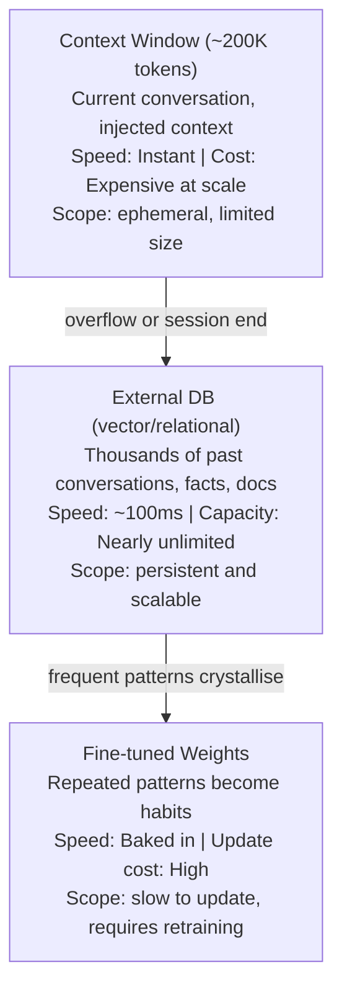

# 41 | Memory Systems for Agents

## Table of Contents
1. [Before You Start](#before-you-start)
2. [Why Agents Need Memory](#why-agents-need-memory)
3. [The Four Types of Memory](#the-four-types-of-memory)
4. [In-Context Memory](#in-context-memory)
5. [External Memory (RAG)](#external-memory-rag)
6. [Semantic Memory with Embeddings](#semantic-memory-with-embeddings)
7. [Episodic Memory: Remembering Conversations](#episodic-memory-remembering-conversations)
8. [Procedural Memory: Skills and Habits](#procedural-memory-skills-and-habits)
9. [Building a Memory Manager](#building-a-memory-manager)
10. [Mini Projects](#mini-projects)
11. [Exercises](#exercises)

---

## Before You Start

**Prerequisites:**
- Chapter 33 (Embeddings and Semantic Search)
- Chapter 34 (Vector Databases)
- Chapter 39 (AI Agents Architecture)
- Chapter 40 (Tool Use)

**What you'll build:** A personal AI assistant that remembers facts about you across conversations, recalls past interactions, and gets smarter over time.

**The key problem:** By default, every LLM conversation starts fresh. The model has no memory of who you are, what you've discussed before, or what your preferences are. This chapter shows how to fix that.

```
WITHOUT memory:
Session 1: "My name is Aditya, I prefer Python"
Session 2: "Who am I?" → "I don't know who you are"

WITH memory:
Session 1: "My name is Aditya, I prefer Python"
           [Memory system stores: name=Aditya, preferred_language=Python]
Session 2: "Who am I?" → "Your name is Aditya, and you prefer Python!"
```

---

## Why Agents Need Memory

An agent without memory is like a person with amnesia. They can be smart in the moment but can't build on past experience.



---

## The Four Types of Memory

Inspired by human psychology:

| Type | Human equivalent | Agent equivalent | Storage |
|------|-----------------|------------------|---------|
| **Working** | Short-term memory | Current context window | RAM/context |
| **Episodic** | "I remember when..." | Past conversation history | Vector DB |
| **Semantic** | General knowledge | Facts, preferences, entities | Vector/KV DB |
| **Procedural** | Habits, skills | Prompts, few-shot examples, tools | Prompt cache |

---

## In-Context Memory

The simplest memory: stuff everything in the context window.

```python
from collections import deque
from typing import List, Dict, Optional

class InContextMemory:
    """Simple rolling window of conversation history."""
    
    def __init__(self, max_tokens: int = 10_000):
        self.messages: List[Dict] = []
        self.max_tokens = max_tokens
    
    def add(self, role: str, content: str):
        self.messages.append({"role": role, "content": content})
        self._enforce_budget()
    
    def _enforce_budget(self):
        """Remove oldest messages when over budget."""
        while self._estimate_tokens() > self.max_tokens and len(self.messages) > 2:
            # Remove oldest pair (keep at least 1 exchange)
            self.messages.pop(0)
    
    def _estimate_tokens(self) -> int:
        total_chars = sum(len(m["content"]) for m in self.messages)
        return total_chars // 4  # Rough: 4 chars per token
    
    def get_messages(self) -> List[Dict]:
        return self.messages.copy()
    
    def clear(self):
        self.messages = []


# Usage
memory = InContextMemory(max_tokens=8_000)
memory.add("user", "My favorite programming language is Rust")
memory.add("assistant", "Great choice! Rust is excellent for systems programming.")
memory.add("user", "What language did I just mention?")

# Include history in API call
import anthropic
client = anthropic.Anthropic()
response = client.messages.create(
    model="claude-opus-4-7",
    max_tokens=200,
    messages=memory.get_messages()
)
# Model will correctly say "Rust"
```

### Limitations of In-Context Memory

```
Problem 1: Token limit
  If conversation goes on for hours, older messages get dropped.
  
Problem 2: No persistence
  Close the session → all memory gone.
  
Problem 3: Doesn't scale
  Can't store 10,000 past conversations in one context.
  
Solution: External memory databases.
```

---

## External Memory (RAG)

Use a vector database to store and retrieve memories, just like RAG for documents.

```python
import chromadb
from sentence_transformers import SentenceTransformer
from datetime import datetime
from typing import List, Dict, Optional
import json
import uuid

class ExternalMemory:
    """Stores and retrieves memories from ChromaDB."""
    
    def __init__(self, db_path: str = "./agent_memory"):
        self.db = chromadb.PersistentClient(path=db_path)
        self.collection = self.db.get_or_create_collection(
            name="memories",
            metadata={"hnsw:space": "cosine"}
        )
        self.embedder = SentenceTransformer("all-MiniLM-L6-v2")
    
    def store(
        self,
        content: str,
        memory_type: str = "fact",  # fact, event, preference, instruction
        importance: float = 0.5,    # 0-1, higher = more important
        metadata: Optional[Dict] = None,
    ) -> str:
        """Store a memory and return its ID."""
        memory_id = str(uuid.uuid4())[:8]
        timestamp = datetime.now().isoformat()
        
        # Embed the memory
        embedding = self.embedder.encode(content).tolist()
        
        meta = {
            "type": memory_type,
            "importance": importance,
            "timestamp": timestamp,
            **(metadata or {})
        }
        
        self.collection.add(
            ids=[memory_id],
            embeddings=[embedding],
            documents=[content],
            metadatas=[meta],
        )
        
        return memory_id
    
    def retrieve(
        self,
        query: str,
        n_results: int = 5,
        memory_type: Optional[str] = None,
    ) -> List[Dict]:
        """Retrieve memories relevant to a query."""
        query_embedding = self.embedder.encode(query).tolist()
        
        where_filter = {}
        if memory_type:
            where_filter["type"] = memory_type
        
        results = self.collection.query(
            query_embeddings=[query_embedding],
            n_results=n_results,
            where=where_filter if where_filter else None,
            include=["documents", "metadatas", "distances"]
        )
        
        memories = []
        for doc, meta, dist in zip(
            results["documents"][0],
            results["metadatas"][0],
            results["distances"][0],
        ):
            memories.append({
                "content": doc,
                "type": meta.get("type"),
                "importance": meta.get("importance", 0.5),
                "timestamp": meta.get("timestamp"),
                "relevance": 1 - dist,
            })
        
        # Sort by combination of relevance and importance
        memories.sort(key=lambda m: m["relevance"] * 0.7 + m["importance"] * 0.3, reverse=True)
        return memories
    
    def forget(self, memory_id: str):
        """Delete a specific memory."""
        self.collection.delete(ids=[memory_id])
    
    def forget_old_memories(self, days: int = 30):
        """Remove memories older than N days."""
        from datetime import timedelta
        cutoff = (datetime.now() - timedelta(days=days)).isoformat()
        # ChromaDB where filter with timestamp comparison
        self.collection.delete(where={"timestamp": {"$lt": cutoff}})
    
    def format_for_context(self, memories: List[Dict]) -> str:
        """Format memories for injection into prompt."""
        if not memories:
            return ""
        
        lines = ["<relevant_memories>"]
        for mem in memories:
            lines.append(f"- [{mem['type']}] {mem['content']}")
        lines.append("</relevant_memories>")
        
        return "\n".join(lines)
    
    @property
    def total_memories(self) -> int:
        return self.collection.count()
```

---

## Semantic Memory with Embeddings

Semantic memory stores **facts about the world and about the user**.

```python
class SemanticMemory(ExternalMemory):
    """Specialized memory for facts, preferences, and entities."""
    
    def store_fact(self, fact: str, importance: float = 0.7):
        return self.store(fact, memory_type="fact", importance=importance)
    
    def store_preference(self, preference: str):
        return self.store(preference, memory_type="preference", importance=0.9)
    
    def store_entity(self, entity_type: str, entity_name: str, description: str):
        content = f"{entity_type}: {entity_name} — {description}"
        return self.store(content, memory_type="entity", importance=0.8,
                         metadata={"entity_type": entity_type, "entity_name": entity_name})
    
    def get_preferences(self, topic: str) -> List[Dict]:
        return self.retrieve(topic, memory_type="preference")


# Example: Extract and store facts from conversation
def extract_and_store_facts(
    conversation: str,
    memory: SemanticMemory,
    llm_client,
) -> List[str]:
    """Use LLM to extract facts from a conversation and store them."""
    
    prompt = f"""Extract important facts about the user from this conversation.
Only extract facts that would be useful in future conversations.
Format as a JSON array of strings.

Conversation:
{conversation}

Facts to remember (JSON array):"""
    
    response = llm_client.messages.create(
        model="claude-haiku-4-5",  # Use fast model for extraction
        max_tokens=500,
        messages=[{"role": "user", "content": prompt}]
    )
    
    import json
    try:
        facts = json.loads(response.content[0].text)
        stored_ids = []
        for fact in facts:
            fact_id = memory.store_fact(fact)
            stored_ids.append(fact_id)
            print(f"  Stored: {fact}")
        return stored_ids
    except json.JSONDecodeError:
        return []


# Usage example
import anthropic
client = anthropic.Anthropic()
semantic_mem = SemanticMemory()

# Store some facts
semantic_mem.store_preference("Prefers concise, bullet-point responses")
semantic_mem.store_preference("Is a senior software engineer")
semantic_mem.store_preference("Works primarily with Python and Go")
semantic_mem.store_fact("Has 8 years of professional experience")
semantic_mem.store_entity("tool", "VSCode", "Preferred code editor")

# Retrieve relevant memories for a query
query = "Help me debug my code"
memories = semantic_mem.retrieve(query, n_results=3)
context = semantic_mem.format_for_context(memories)
print(context)
# <relevant_memories>
# - [preference] Works primarily with Python and Go
# - [preference] Is a senior software engineer
# - [preference] Prefers concise, bullet-point responses
# </relevant_memories>
```

---

## Episodic Memory: Remembering Conversations

Episodic memory stores **what happened in past conversations**.

```python
from dataclasses import dataclass, field, asdict
from typing import List, Optional
import json
from pathlib import Path
from datetime import datetime

@dataclass
class Episode:
    """A past conversation turn or summary."""
    timestamp: str
    user_message: str
    assistant_response: str
    topic: str = ""
    tools_used: List[str] = field(default_factory=list)
    outcome: str = "completed"  # completed, abandoned, error
    
    def to_summary(self) -> str:
        return f"[{self.timestamp[:10]}] User asked about '{self.topic}': {self.user_message[:100]}..."


class EpisodicMemory:
    """Stores and retrieves past conversation episodes."""
    
    def __init__(self, db_path: str = "./episodic_memory"):
        self.vector_memory = ExternalMemory(db_path)
        self.episodes_file = Path(db_path) / "episodes.jsonl"
        self.episodes_file.parent.mkdir(exist_ok=True)
    
    def record_episode(self, episode: Episode):
        """Store a conversation episode."""
        # Save raw episode
        with open(self.episodes_file, "a") as f:
            f.write(json.dumps(asdict(episode)) + "\n")
        
        # Store summary in vector DB for retrieval
        summary = f"Conversation about {episode.topic}: {episode.user_message[:200]}"
        self.vector_memory.store(
            summary,
            memory_type="episode",
            importance=0.6,
            metadata={
                "timestamp": episode.timestamp,
                "topic": episode.topic,
                "outcome": episode.outcome,
            }
        )
    
    def recall_similar(self, current_query: str, n: int = 3) -> List[Episode]:
        """Find past episodes similar to the current query."""
        similar = self.vector_memory.retrieve(current_query, n_results=n, memory_type="episode")
        
        # Load full episodes from file
        episodes = []
        if self.episodes_file.exists():
            with open(self.episodes_file) as f:
                all_episodes = [json.loads(line) for line in f if line.strip()]
            
            # Simple lookup by topic match
            for mem in similar:
                topic = mem.get("topic", "")
                for ep_data in all_episodes:
                    if ep_data.get("topic") == topic:
                        episodes.append(Episode(**ep_data))
                        break
        
        return episodes
    
    def get_recent_episodes(self, n: int = 5) -> List[Episode]:
        """Get the N most recent episodes."""
        if not self.episodes_file.exists():
            return []
        
        with open(self.episodes_file) as f:
            lines = [l for l in f.readlines() if l.strip()]
        
        recent = lines[-n:]
        return [Episode(**json.loads(l)) for l in recent]


# Integration: use episodic memory to give context
def agent_with_memory(user_message: str, episodic_mem: EpisodicMemory, semantic_mem: SemanticMemory):
    """Agent that uses memory to provide personalized responses."""
    import anthropic
    client = anthropic.Anthropic()
    
    # 1. Retrieve relevant memories
    past_episodes = episodic_mem.recall_similar(user_message)
    user_facts = semantic_mem.retrieve(user_message, n_results=3)
    
    # 2. Build context
    memory_context = ""
    if user_facts:
        memory_context += semantic_mem.format_for_context(user_facts) + "\n\n"
    
    if past_episodes:
        memory_context += "<past_conversations>\n"
        for ep in past_episodes[:2]:
            memory_context += f"- {ep.to_summary()}\n"
        memory_context += "</past_conversations>\n\n"
    
    # 3. Build prompt with memory
    full_message = user_message
    if memory_context:
        full_message = f"{memory_context}<current_question>\n{user_message}\n</current_question>"
    
    response = client.messages.create(
        model="claude-opus-4-7",
        max_tokens=1024,
        system="You are a helpful assistant with memory of past interactions. Use the memory context to personalize your responses.",
        messages=[{"role": "user", "content": full_message}]
    )
    
    answer = response.content[0].text
    
    # 4. Record this episode
    episode = Episode(
        timestamp=datetime.now().isoformat(),
        user_message=user_message,
        assistant_response=answer[:200],
        topic=user_message[:50],
    )
    episodic_mem.record_episode(episode)
    
    return answer
```

---

## Procedural Memory: Skills and Habits

Procedural memory stores HOW to do things — successful patterns, tool usage habits, and learned preferences.

```python
class ProceduralMemory:
    """Stores successful prompt patterns and tool usage strategies."""
    
    def __init__(self, db_path: str = "./procedural_memory"):
        self.vector_memory = ExternalMemory(db_path)
    
    def store_successful_pattern(
        self,
        task_type: str,
        approach: str,
        success_metric: float,
    ):
        """Store a pattern that worked well."""
        content = f"For {task_type}: {approach}"
        self.vector_memory.store(
            content,
            memory_type="procedure",
            importance=success_metric,
            metadata={"task_type": task_type, "success": success_metric}
        )
    
    def get_best_approach(self, task: str) -> Optional[str]:
        """Get the best known approach for a type of task."""
        memories = self.vector_memory.retrieve(task, memory_type="procedure", n_results=1)
        if memories:
            return memories[0]["content"]
        return None


# Example: Learn from successful tool usage
procedural = ProceduralMemory()

procedural.store_successful_pattern(
    task_type="data analysis",
    approach="First understand the schema with list_tables, then sample with LIMIT 5, then run aggregate queries",
    success_metric=0.9
)

procedural.store_successful_pattern(
    task_type="debugging",
    approach="Read the error message carefully, identify the file and line, read that section of code, check for common patterns (null check, type mismatch, off-by-one)",
    success_metric=0.85
)
```

---

## Building a Memory Manager

Combine all memory types into a unified system:

```python
class AgentMemorySystem:
    """Unified memory system combining all memory types."""
    
    def __init__(self, db_path: str = "./agent_memory"):
        Path(db_path).mkdir(exist_ok=True)
        
        self.working = InContextMemory(max_tokens=8000)
        self.semantic = SemanticMemory(f"{db_path}/semantic")
        self.episodic = EpisodicMemory(f"{db_path}/episodic")
        self.procedural = ProceduralMemory(f"{db_path}/procedural")
    
    def before_response(self, user_message: str) -> str:
        """Retrieve and format all relevant memories for a query."""
        parts = []
        
        # Semantic memories (user facts, preferences)
        facts = self.semantic.retrieve(user_message, n_results=3)
        if facts:
            parts.append(self.semantic.format_for_context(facts))
        
        # Past similar conversations
        past = self.episodic.recall_similar(user_message, n=2)
        if past:
            past_lines = ["<past_similar_conversations>"]
            for ep in past:
                past_lines.append(f"  {ep.to_summary()}")
            past_lines.append("</past_similar_conversations>")
            parts.append("\n".join(past_lines))
        
        # Best known approach for this task type
        approach = self.procedural.get_best_approach(user_message)
        if approach:
            parts.append(f"<best_approach>\n{approach}\n</best_approach>")
        
        return "\n\n".join(parts) if parts else ""
    
    def after_response(
        self,
        user_message: str,
        assistant_response: str,
        topic: str = "",
    ):
        """Update memory after a conversation turn."""
        # Update working memory
        self.working.add("user", user_message)
        self.working.add("assistant", assistant_response)
        
        # Record episode
        episode = Episode(
            timestamp=datetime.now().isoformat(),
            user_message=user_message,
            assistant_response=assistant_response[:300],
            topic=topic or user_message[:50],
        )
        self.episodic.record_episode(episode)
    
    def learn_from_feedback(self, fact: str, feedback_type: str = "preference"):
        """Store explicit user feedback."""
        self.semantic.store(fact, memory_type=feedback_type, importance=0.95)
    
    def get_stats(self) -> Dict:
        return {
            "working_memory_messages": len(self.working.messages),
            "semantic_memories": self.semantic.total_memories,
            "episodic_memories": self.episodic.vector_memory.total_memories,
        }
```

---

## Mini Projects

### Mini Project 1: Persistent Personal Assistant (2 hours)

**Goal:** Build a CLI chatbot that remembers things about you across restarts.

```python
# persistent_assistant.py

import anthropic
from pathlib import Path

# Initialize memory
memory = AgentMemorySystem("./my_assistant_memory")
client = anthropic.Anthropic()

SYSTEM_PROMPT = """You are a helpful personal assistant with access to memories from past conversations.
Use the memory context provided to personalize your responses.
If the user tells you something important about themselves, acknowledge you'll remember it."""

def chat():
    print("Personal Assistant (memories persist between sessions)")
    print(f"Stats: {memory.get_stats()}")
    print("Say 'remember that...' to explicitly teach me something.")
    print("-" * 50)
    
    while True:
        user_input = input("\nYou: ").strip()
        if not user_input:
            continue
        if user_input.lower() in ["quit", "exit"]:
            break
        
        # Check for explicit memory instruction
        if user_input.lower().startswith("remember that"):
            fact = user_input[len("remember that"):].strip()
            memory.learn_from_feedback(fact)
            print("Assistant: Got it, I'll remember that!")
            continue
        
        # Retrieve relevant context
        memory_context = memory.before_response(user_input)
        
        # Build message with memory
        message_content = user_input
        if memory_context:
            message_content = f"{memory_context}\n\n{user_input}"
        
        # Working memory for conversation continuity
        working_messages = memory.working.get_messages()
        working_messages.append({"role": "user", "content": message_content})
        
        response = client.messages.create(
            model="claude-opus-4-7",
            max_tokens=512,
            system=SYSTEM_PROMPT,
            messages=working_messages,
        )
        
        answer = response.content[0].text
        print(f"\nAssistant: {answer}")
        
        # Update memory
        memory.after_response(user_input, answer)

if __name__ == "__main__":
    chat()
```

### Mini Project 2: Memory Inspector UI (1 hour)

**Goal:** Build a Gradio UI to visualize and manage stored memories.

```python
# memory_inspector.py
import gradio as gr

memory = AgentMemorySystem("./my_assistant_memory")

def view_memories(query: str, memory_type: str):
    if not query:
        return "Enter a search query"
    
    if memory_type == "all":
        results = memory.semantic.retrieve(query, n_results=10)
    else:
        results = memory.semantic.retrieve(query, n_results=10, memory_type=memory_type)
    
    if not results:
        return "No memories found"
    
    lines = []
    for mem in results:
        lines.append(f"**[{mem['type']}]** Relevance: {mem['relevance']:.2f}")
        lines.append(f"{mem['content']}")
        lines.append(f"*{mem['timestamp'][:10]}*")
        lines.append("---")
    
    return "\n".join(lines)

def add_memory(content: str, mem_type: str, importance: float):
    memory_id = memory.semantic.store(content, memory_type=mem_type, importance=importance)
    return f"Stored memory with ID: {memory_id}"

def get_stats():
    stats = memory.get_stats()
    return "\n".join(f"{k}: {v}" for k, v in stats.items())

with gr.Blocks(title="Memory Inspector") as demo:
    gr.Markdown("# 🧠 Agent Memory Inspector")
    
    with gr.Tab("Search Memories"):
        query_input = gr.Textbox(label="Search query")
        type_filter = gr.Dropdown(["all", "fact", "preference", "entity", "episode"], value="all")
        search_btn = gr.Button("Search")
        results = gr.Markdown()
        search_btn.click(view_memories, [query_input, type_filter], results)
    
    with gr.Tab("Add Memory"):
        content_input = gr.Textbox(label="Memory content", lines=3)
        type_input = gr.Dropdown(["fact", "preference", "entity"], value="fact")
        importance_input = gr.Slider(0, 1, value=0.7, label="Importance")
        add_btn = gr.Button("Add Memory")
        add_output = gr.Textbox(label="Result")
        add_btn.click(add_memory, [content_input, type_input, importance_input], add_output)
    
    with gr.Tab("Stats"):
        stats_btn = gr.Button("Show Stats")
        stats_output = gr.Textbox(label="Memory Statistics", lines=10)
        stats_btn.click(get_stats, outputs=stats_output)

demo.launch()
```

---

## Exercises

1. **Memory decay:** Implement a memory scoring system where memories become less important over time. Memories not accessed for 30 days should have their importance halved.

2. **Conflict detection:** When storing a new fact, check if it contradicts an existing one (e.g., "User lives in New York" vs. "User lives in London"). If so, ask the user which is correct.

3. **Memory summarization:** When episodic memory grows beyond 1000 entries, automatically summarize older episodes into higher-level patterns.

4. **Privacy:** Add a method to delete all memories about a specific topic (e.g., delete all work-related memories).

5. **Multi-user memory:** Extend the system to support multiple users, each with isolated memory stores.

---

**[← Chapter 40: Tool Use and Function Calling](40-tool-use-and-function-calling.md) | [Chapter 54: Persistent Memory →](54-persistent-agent-memory.md)**
