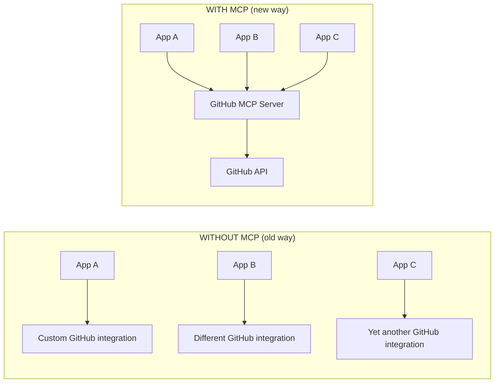
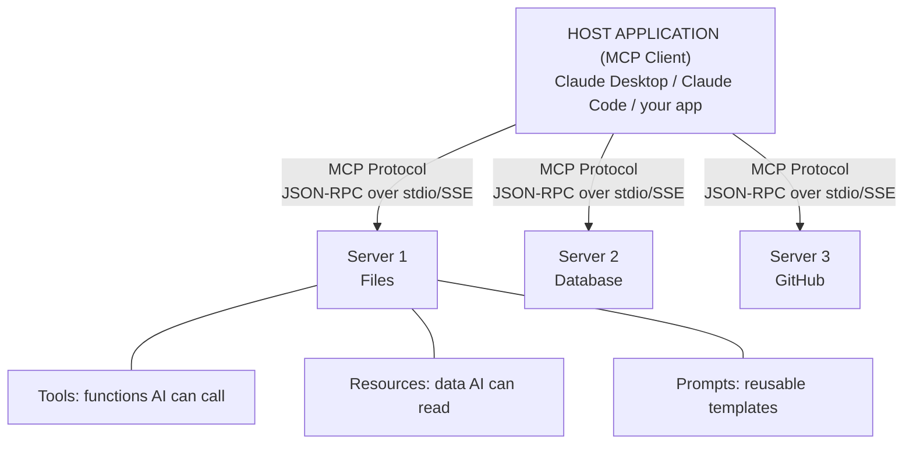

# 42 | MCP Servers

## Table of Contents
1. [Before You Start](#before-you-start)
2. [What is MCP?](#what-is-mcp)
3. [MCP Architecture](#mcp-architecture)
4. [Building Your First MCP Server](#building-your-first-mcp-server)
5. [MCP Tools, Resources, and Prompts](#mcp-tools-resources-and-prompts)
6. [Connecting to Claude Desktop / Claude Code](#connecting-to-claude-desktop--claude-code)
7. [Real-World MCP Server Examples](#real-world-mcp-server-examples)
8. [Mini Projects](#mini-projects)
9. [Exercises](#exercises)

---

## Before You Start

**Prerequisites:**
- Chapter 40 (Tool Use and Function Calling) — MCP extends this concept
- Basic Python; Node.js knowledge is helpful but not required
- Claude Desktop or Claude Code CLI installed

**What you'll build:** An MCP server that gives Claude access to your local files, a SQLite database, and a custom data source — all pluggable without changing any application code.

**The key insight:** MCP (Model Context Protocol) is the standard way to extend any AI app with new capabilities. Build once, use everywhere.

---

## What is MCP?

MCP (Model Context Protocol) is an open standard from Anthropic that defines how AI models talk to external tools and data sources.



### MCP vs Direct Tool Use

| Aspect | Direct Tool Use | MCP |
|--------|----------------|-----|
| Scope | One app | Any MCP-compatible app |
| Language | Match the app | Any (Python, JS, etc.) |
| Discovery | Manual | Auto via protocol |
| Security | App handles | Server handles |
| Reusability | Low | High |

---

## MCP Architecture



### Communication Protocol

```
MCP uses JSON-RPC 2.0 over stdio (subprocess) or HTTP+SSE:

Client → Server: List tools
  {"jsonrpc": "2.0", "id": 1, "method": "tools/list"}

Server → Client: Tool list
  {"jsonrpc": "2.0", "id": 1, "result": {
    "tools": [{"name": "read_file", "description": "...", "inputSchema": {...}}]
  }}

Client → Server: Call tool
  {"jsonrpc": "2.0", "id": 2, "method": "tools/call",
   "params": {"name": "read_file", "arguments": {"path": "config.yaml"}}}

Server → Client: Result
  {"jsonrpc": "2.0", "id": 2, "result": {
    "content": [{"type": "text", "text": "key: value\n..."}]
  }}
```

---

## Building Your First MCP Server

We'll use the official `mcp` Python SDK:

```bash
pip install mcp
```

### Hello World MCP Server

```python
# server.py
from mcp.server import Server
from mcp.server.stdio import stdio_server
from mcp import types
import asyncio

# Create the server
server = Server("my-first-mcp-server")

# Register a tool
@server.list_tools()
async def list_tools() -> list[types.Tool]:
    return [
        types.Tool(
            name="greet",
            description="Greet someone by name",
            inputSchema={
                "type": "object",
                "properties": {
                    "name": {
                        "type": "string",
                        "description": "Name to greet"
                    }
                },
                "required": ["name"]
            }
        )
    ]

@server.call_tool()
async def call_tool(name: str, arguments: dict) -> list[types.TextContent]:
    if name == "greet":
        person_name = arguments.get("name", "World")
        return [types.TextContent(
            type="text",
            text=f"Hello, {person_name}! This message came from your MCP server."
        )]
    raise ValueError(f"Unknown tool: {name}")

# Run the server
async def main():
    async with stdio_server() as streams:
        await server.run(
            streams[0], streams[1],
            server.create_initialization_options()
        )

if __name__ == "__main__":
    asyncio.run(main())
```

### Testing Locally

```bash
# Install the server directly
pip install mcp[cli]

# Test with the MCP CLI inspector
mcp dev server.py

# This opens an interactive session where you can test your tools
```

---

## MCP Tools, Resources, and Prompts

### Tools (Functions the AI calls)

Tools are functions with side effects — they do things.

```python
from mcp.server import Server
from mcp import types
import datetime
import subprocess
import os

server = Server("utility-server")

@server.list_tools()
async def list_tools():
    return [
        types.Tool(
            name="get_current_time",
            description="Get the current date and time",
            inputSchema={"type": "object", "properties": {}}
        ),
        types.Tool(
            name="run_shell_command",
            description="Run a safe shell command and return output. Only allowed: ls, pwd, echo, cat, grep, find",
            inputSchema={
                "type": "object",
                "properties": {
                    "command": {"type": "string", "description": "Command to run"}
                },
                "required": ["command"]
            }
        ),
        types.Tool(
            name="create_file",
            description="Create a new text file with given content",
            inputSchema={
                "type": "object",
                "properties": {
                    "path": {"type": "string"},
                    "content": {"type": "string"}
                },
                "required": ["path", "content"]
            }
        ),
    ]

@server.call_tool()
async def call_tool(name: str, arguments: dict):
    if name == "get_current_time":
        now = datetime.datetime.now()
        return [types.TextContent(type="text", text=now.isoformat())]
    
    elif name == "run_shell_command":
        command = arguments["command"]
        # Security: whitelist allowed commands
        allowed_cmds = ["ls", "pwd", "echo", "cat", "grep", "find", "wc"]
        cmd_name = command.split()[0]
        if cmd_name not in allowed_cmds:
            return [types.TextContent(type="text", text=f"Error: {cmd_name} is not allowed")]
        
        try:
            result = subprocess.run(
                command, shell=True, capture_output=True, text=True, timeout=10
            )
            output = result.stdout or result.stderr or "(no output)"
            return [types.TextContent(type="text", text=output)]
        except subprocess.TimeoutExpired:
            return [types.TextContent(type="text", text="Error: Command timed out")]
    
    elif name == "create_file":
        path = arguments["path"]
        content = arguments["content"]
        # Security: prevent path traversal
        if ".." in path or path.startswith("/"):
            return [types.TextContent(type="text", text="Error: Path not allowed")]
        
        os.makedirs(os.path.dirname(path) if os.path.dirname(path) else ".", exist_ok=True)
        with open(path, "w") as f:
            f.write(content)
        return [types.TextContent(type="text", text=f"Created {path} ({len(content)} chars)")]
    
    raise ValueError(f"Unknown tool: {name}")
```

### Resources (Data the AI can read)

Resources are read-only data sources — like files, database records, or API data.

```python
from mcp import types as mcp_types
from pathlib import Path

# Resources expose data without the AI having to call a tool
@server.list_resources()
async def list_resources():
    # List markdown files in current directory as resources
    resources = []
    for path in Path(".").glob("**/*.md"):
        resources.append(mcp_types.Resource(
            uri=f"file://{path.absolute()}",
            name=path.name,
            description=f"Markdown file: {path}",
            mimeType="text/markdown",
        ))
    return resources

@server.read_resource()
async def read_resource(uri: str):
    # Extract path from URI
    path = uri.replace("file://", "")
    content = Path(path).read_text()
    return [mcp_types.TextContent(type="text", text=content)]
```

### Prompts (Reusable Templates)

Prompts are pre-built prompt templates the AI can use.

```python
@server.list_prompts()
async def list_prompts():
    return [
        mcp_types.Prompt(
            name="code-review",
            description="Standard code review template",
            arguments=[
                mcp_types.PromptArgument(
                    name="language",
                    description="Programming language",
                    required=True
                ),
                mcp_types.PromptArgument(
                    name="focus",
                    description="Review focus (security, performance, readability)",
                    required=False
                )
            ]
        )
    ]

@server.get_prompt()
async def get_prompt(name: str, arguments: dict):
    if name == "code-review":
        lang = arguments.get("language", "code")
        focus = arguments.get("focus", "general quality")
        
        return mcp_types.GetPromptResult(
            description=f"Code review for {lang}",
            messages=[
                mcp_types.PromptMessage(
                    role="user",
                    content=mcp_types.TextContent(
                        type="text",
                        text=f"""Please review the following {lang} code with focus on {focus}.

Structure your review as:
1. **Summary**: One sentence about what the code does
2. **Issues**: List critical and minor issues
3. **Strengths**: What's done well
4. **Verdict**: APPROVE or REQUEST_CHANGES

Code to review:"""
                    )
                )
            ]
        )
```

---

## Connecting to Claude Desktop / Claude Code

### Claude Desktop Configuration

Add your server to `~/Library/Application Support/Claude/claude_desktop_config.json`:

```json
{
  "mcpServers": {
    "my-utility-server": {
      "command": "python",
      "args": ["/absolute/path/to/server.py"],
      "env": {
        "SOME_API_KEY": "your-key-here"
      }
    }
  }
}
```

Restart Claude Desktop. Your tools will appear automatically.

### Claude Code CLI Configuration

Add to `~/.claude/settings.json` or project `.claude/settings.json`:

```json
{
  "mcpServers": {
    "my-utility-server": {
      "command": "python",
      "args": ["/path/to/server.py"]
    }
  }
}
```

Or via CLI:

```bash
# Add a server
claude mcp add my-server -- python /path/to/server.py

# List configured servers
claude mcp list

# Remove a server
claude mcp remove my-server
```

### Using npm-based MCP Servers

Many popular MCP servers are built with Node.js:

```json
{
  "mcpServers": {
    "filesystem": {
      "command": "npx",
      "args": ["-y", "@modelcontextprotocol/server-filesystem", "/path/to/allow"]
    },
    "github": {
      "command": "npx",
      "args": ["-y", "@modelcontextprotocol/server-github"],
      "env": {
        "GITHUB_PERSONAL_ACCESS_TOKEN": "your_token"
      }
    },
    "sqlite": {
      "command": "npx",
      "args": ["-y", "@modelcontextprotocol/server-sqlite", "/path/to/db.sqlite"]
    }
  }
}
```

---

## Real-World MCP Server Examples

### 1. SQLite Database Server

```python
# sqlite_server.py
import sqlite3
import asyncio
from mcp.server import Server
from mcp.server.stdio import stdio_server
from mcp import types

DB_PATH = "data.db"
server = Server("sqlite-server")

def get_db_schema() -> str:
    """Get all table schemas."""
    conn = sqlite3.connect(DB_PATH)
    cursor = conn.execute("SELECT name, sql FROM sqlite_master WHERE type='table'")
    tables = cursor.fetchall()
    conn.close()
    return "\n\n".join(f"Table: {t[0]}\n{t[1]}" for t in tables)

@server.list_resources()
async def list_resources():
    return [
        types.Resource(
            uri="schema://database",
            name="Database Schema",
            description="Complete database schema",
            mimeType="text/plain"
        )
    ]

@server.read_resource()
async def read_resource(uri: str):
    if uri == "schema://database":
        schema = get_db_schema()
        return [types.TextContent(type="text", text=schema)]
    raise ValueError(f"Unknown resource: {uri}")

@server.list_tools()
async def list_tools():
    return [
        types.Tool(
            name="query",
            description=f"Run a SELECT query against the SQLite database. Schema:\n{get_db_schema()}",
            inputSchema={
                "type": "object",
                "properties": {
                    "sql": {"type": "string", "description": "SELECT SQL statement"}
                },
                "required": ["sql"]
            }
        )
    ]

@server.call_tool()
async def call_tool(name: str, arguments: dict):
    if name == "query":
        sql = arguments["sql"].strip()
        if not sql.upper().startswith("SELECT"):
            return [types.TextContent(type="text", text="Error: Only SELECT queries allowed")]
        
        try:
            conn = sqlite3.connect(DB_PATH)
            conn.row_factory = sqlite3.Row
            cursor = conn.execute(sql)
            rows = cursor.fetchmany(100)
            conn.close()
            
            if not rows:
                return [types.TextContent(type="text", text="No results")]
            
            # Format as table
            cols = list(rows[0].keys())
            lines = [" | ".join(cols), "-" * 60]
            for row in rows:
                lines.append(" | ".join(str(v) for v in row))
            
            return [types.TextContent(type="text", text="\n".join(lines))]
        except Exception as e:
            return [types.TextContent(type="text", text=f"Error: {e}")]

async def main():
    async with stdio_server() as streams:
        await server.run(streams[0], streams[1], server.create_initialization_options())

asyncio.run(main())
```

### 2. Weather API Server

```python
# weather_server.py
import httpx
import asyncio
from mcp.server import Server
from mcp.server.stdio import stdio_server
from mcp import types

server = Server("weather-server")

@server.list_tools()
async def list_tools():
    return [
        types.Tool(
            name="get_weather",
            description="Get current weather for any city using the Open-Meteo API (free, no key needed)",
            inputSchema={
                "type": "object",
                "properties": {
                    "city": {"type": "string", "description": "City name"},
                    "country_code": {"type": "string", "description": "2-letter country code, e.g., 'US', 'JP'"}
                },
                "required": ["city"]
            }
        )
    ]

@server.call_tool()
async def call_tool(name: str, arguments: dict):
    if name == "get_weather":
        city = arguments["city"]
        country = arguments.get("country_code", "")
        
        async with httpx.AsyncClient() as client:
            # Geocode the city
            geo_url = f"https://geocoding-api.open-meteo.com/v1/search?name={city}&count=1"
            geo_resp = await client.get(geo_url)
            geo_data = geo_resp.json()
            
            if not geo_data.get("results"):
                return [types.TextContent(type="text", text=f"City '{city}' not found")]
            
            location = geo_data["results"][0]
            lat, lon = location["latitude"], location["longitude"]
            
            # Get weather
            weather_url = (
                f"https://api.open-meteo.com/v1/forecast"
                f"?latitude={lat}&longitude={lon}"
                f"&current_weather=true&hourly=relativehumidity_2m"
            )
            weather_resp = await client.get(weather_url)
            weather = weather_resp.json()["current_weather"]
            
            result = (
                f"Weather in {location['name']}, {location.get('country', '')}:\n"
                f"Temperature: {weather['temperature']}°C\n"
                f"Wind speed: {weather['windspeed']} km/h\n"
                f"Wind direction: {weather['winddirection']}°\n"
                f"Weather code: {weather['weathercode']}"
            )
            
            return [types.TextContent(type="text", text=result)]

async def main():
    async with stdio_server() as streams:
        await server.run(streams[0], streams[1], server.create_initialization_options())

asyncio.run(main())
```

---

## Mini Projects

### Mini Project 1: Notes MCP Server (1.5 hours)

**Goal:** Build an MCP server that manages a local notes system for Claude to use.

```python
# notes_server.py — implements:
# Tools:
#   create_note(title, content, tags=[])
#   search_notes(query)
#   list_notes(tag=None)
#   delete_note(title)
#
# Resources:
#   notes://all — list all notes as a resource
#
# Storage: JSON file for simplicity

import json
from pathlib import Path
from datetime import datetime

NOTES_FILE = Path("./notes.json")

def load_notes() -> list:
    if NOTES_FILE.exists():
        return json.loads(NOTES_FILE.read_text())
    return []

def save_notes(notes: list):
    NOTES_FILE.write_text(json.dumps(notes, indent=2))

# Implement the server following the patterns above...
```

**Test it by:**
1. Adding notes through Claude ("Create a note titled 'Project Ideas' with content...")
2. Searching notes ("Find all my notes about Python")
3. Having Claude organize notes by topic

### Mini Project 2: System Stats Server (1 hour)

**Goal:** Build an MCP server that exposes system metrics.

```python
# system_server.py
import psutil  # pip install psutil
import platform

# Expose as resources:
#   system://cpu — CPU usage
#   system://memory — RAM usage
#   system://disk — Disk usage
#   system://processes — Top processes

# So Claude can answer: "Is my computer running slowly?"
# or "What processes are using the most CPU?"
```

---

## Exercises

1. **Protocol exploration:** Run `mcp dev` with any server. What methods does the protocol support beyond tools/list and tools/call? (Hint: check the MCP spec)

2. **Error handling:** Add proper error handling to the SQLite server so it returns helpful error messages when SQL syntax is wrong.

3. **Authentication:** How would you add API key authentication to an MCP server served over HTTP (not stdio)?

4. **Resource pagination:** The list_resources handler currently returns all resources at once. How would you implement pagination for a folder with 10,000 files?

5. **Build and publish:** Package your notes server and add installation instructions. What would users need to add to their `claude_desktop_config.json`?

---

**[← Chapter 54: Persistent Memory](54-persistent-agent-memory.md) | [Chapter 55: Modern Agent Frameworks →](55-modern-agent-frameworks.md)**
