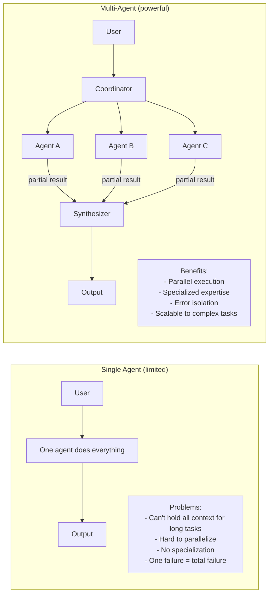
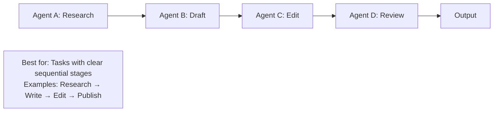
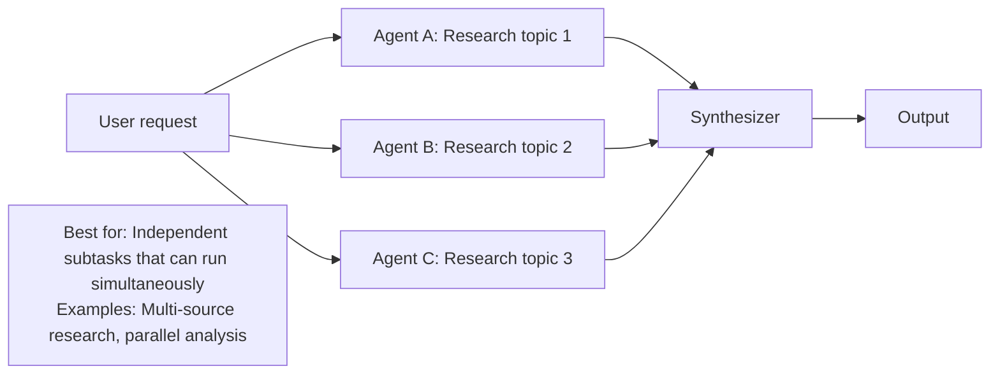
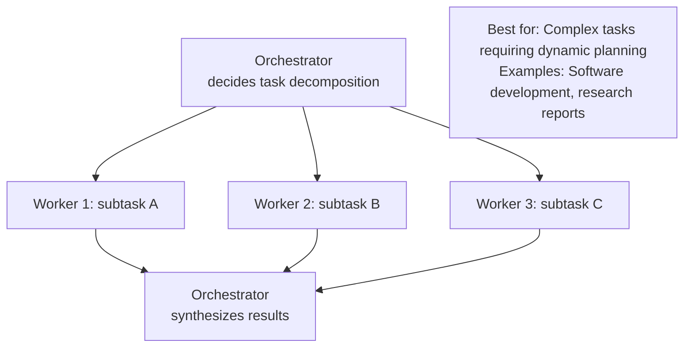
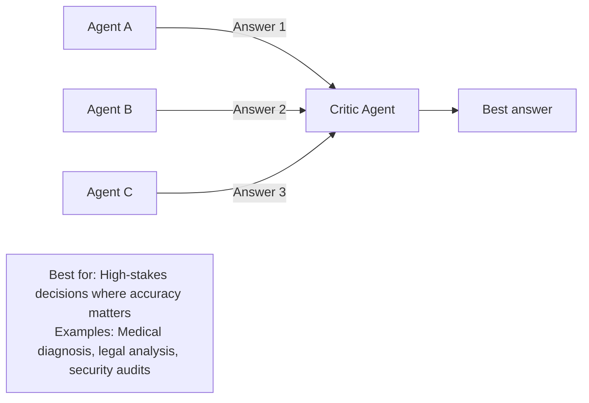

# 43 | Multi-Agent Systems

## Table of Contents
1. [Before You Start](#before-you-start)
2. [Why Multiple Agents?](#why-multiple-agents)
3. [Multi-Agent Patterns](#multi-agent-patterns)
4. [Orchestrator-Subagent Pattern](#orchestrator-subagent-pattern)
5. [Specialized Agent Teams](#specialized-agent-teams)
6. [Agent Communication Protocols](#agent-communication-protocols)
7. [Parallel Agent Execution](#parallel-agent-execution)
8. [Handling Failures and Disagreements](#handling-failures-and-disagreements)
9. [Mini Projects](#mini-projects)
10. [Exercises](#exercises)

---

## Before You Start

**Prerequisites:**
- Chapter 39 (AI Agents Architecture)
- Chapter 40 (Tool Use)
- Chapter 41 (Memory Systems)

**What you'll build:** A multi-agent research system where a coordinator delegates to specialist agents (researcher, writer, critic) that work together to produce high-quality reports.

**The key idea:** Just as teams of humans outperform individuals on complex tasks, teams of AI agents can tackle problems that no single agent can handle well.

**A note on this chapter vs. Chapter 55:** here we build the orchestrator/subagent pattern by hand with raw API calls, so you understand exactly what a multi-agent framework is doing under the hood. Chapter 55 (LangGraph, CrewAI, OpenAI Agents SDK) covers the same pattern using frameworks that handle the bookkeeping for you — worth reaching for once you outgrow hand-rolling it yourself.



---

## Why Multiple Agents?

### Context Window Limitations

```
GPT-4/Claude context: 128K-200K tokens

A complex task might need:
  - 50K tokens of background research
  - 30K tokens of analysis
  - 20K tokens of draft writing
  - 10K tokens of revision
  = 110K tokens — tight!

With multi-agent:
  Researcher agent: works with research context only (50K)
  Writer agent: works with outline + draft only (30K)
  Editor agent: works with draft only (20K)
  Each agent works within comfortable limits.
```

### Specialization

```
General agent knows a little about everything.
Specialist agents know a lot about one thing.

General agent asked to "review code AND write tests AND check security":
  → Mediocre at all three

Specialist agents:
  Code Review Agent: expert-level code analysis
  Test Writer Agent: knows testing patterns deeply  
  Security Scanner Agent: focuses only on vulnerabilities
  → Better results in each domain
```

---

## Multi-Agent Patterns

### Pattern 1: Pipeline (Sequential)

Each agent processes the output of the previous one.



### Pattern 2: Parallel (Fan-out / Fan-in)

Multiple agents work simultaneously, results merged.



### Pattern 3: Supervisor / Worker

One orchestrator delegates to specialist workers.



### Pattern 4: Debate / Verification

Multiple agents produce answers, then critique each other.



---

## Orchestrator-Subagent Pattern

```python
import anthropic
import json
from typing import List, Dict, Any, Optional
from dataclasses import dataclass, field

@dataclass
class Task:
    id: str
    description: str
    assigned_to: str  # agent name
    status: str = "pending"  # pending, running, completed, failed
    result: Optional[str] = None
    dependencies: List[str] = field(default_factory=list)  # task IDs

class OrchestratorAgent:
    """Plans and coordinates work across multiple subagents."""
    
    def __init__(self, subagents: Dict[str, "SubAgent"]):
        self.client = anthropic.Anthropic()
        self.subagents = subagents
        self.tasks: List[Task] = []
    
    def plan(self, goal: str) -> List[Task]:
        """Break a goal into tasks and assign to agents."""
        
        agent_descriptions = "\n".join(
            f"- {name}: {agent.description}"
            for name, agent in self.subagents.items()
        )
        
        prompt = f"""You are an orchestrator. Break this goal into tasks and assign each to the best agent.

Available agents:
{agent_descriptions}

Goal: {goal}

Return a JSON array of tasks. Each task:
{{
  "id": "task_1",
  "description": "What to do",
  "assigned_to": "agent_name",
  "dependencies": ["task_id_that_must_complete_first"]
}}

Return ONLY the JSON array, no other text."""
        
        response = self.client.messages.create(
            model="claude-opus-4-7",
            max_tokens=1000,
            messages=[{"role": "user", "content": prompt}]
        )
        
        tasks_data = json.loads(response.content[0].text)
        tasks = []
        for t in tasks_data:
            tasks.append(Task(
                id=t["id"],
                description=t["description"],
                assigned_to=t["assigned_to"],
                dependencies=t.get("dependencies", [])
            ))
        
        self.tasks = tasks
        return tasks
    
    def execute(self) -> Dict[str, str]:
        """Execute all tasks respecting dependencies."""
        completed_results = {}
        max_iterations = len(self.tasks) * 2
        iteration = 0
        
        while any(t.status == "pending" for t in self.tasks):
            iteration += 1
            if iteration > max_iterations:
                break
            
            for task in self.tasks:
                if task.status != "pending":
                    continue
                
                # Check dependencies are met
                deps_met = all(
                    any(t.id == dep and t.status == "completed" for t in self.tasks)
                    for dep in task.dependencies
                )
                
                if not deps_met and task.dependencies:
                    continue
                
                # Execute the task
                task.status = "running"
                agent = self.subagents.get(task.assigned_to)
                
                if not agent:
                    task.status = "failed"
                    task.result = f"Unknown agent: {task.assigned_to}"
                    continue
                
                # Provide dependency results as context
                context = {}
                for dep_id in task.dependencies:
                    if dep_id in completed_results:
                        context[dep_id] = completed_results[dep_id]
                
                print(f"  → [{task.assigned_to}] {task.description[:60]}...")
                
                try:
                    result = agent.execute(task.description, context)
                    task.result = result
                    task.status = "completed"
                    completed_results[task.id] = result
                    print(f"  ✓ Done: {result[:100]}...")
                except Exception as e:
                    task.status = "failed"
                    task.result = str(e)
                    print(f"  ✗ Failed: {e}")
        
        return completed_results
    
    def synthesize(self, goal: str, results: Dict[str, str]) -> str:
        """Synthesize all task results into a final answer."""
        results_text = "\n\n".join(
            f"Task: {task.description}\nResult: {task.result}"
            for task in self.tasks
            if task.status == "completed"
        )
        
        response = self.client.messages.create(
            model="claude-opus-4-7",
            max_tokens=2000,
            messages=[{
                "role": "user",
                "content": f"Original goal: {goal}\n\nTask results:\n{results_text}\n\nSynthesize these results into a comprehensive final answer."
            }]
        )
        
        return response.content[0].text


class SubAgent:
    """A specialized worker agent."""
    
    def __init__(self, name: str, description: str, system_prompt: str):
        self.name = name
        self.description = description
        self.system_prompt = system_prompt
        self.client = anthropic.Anthropic()
    
    def execute(self, task: str, context: Dict[str, str] = None) -> str:
        """Execute a specific task."""
        context_text = ""
        if context:
            context_text = "\n\nContext from previous tasks:\n"
            for task_id, result in context.items():
                context_text += f"- {task_id}: {result[:300]}...\n"
        
        response = self.client.messages.create(
            model="claude-opus-4-7",
            max_tokens=1500,
            system=self.system_prompt,
            messages=[{
                "role": "user",
                "content": f"{task}{context_text}"
            }]
        )
        
        return response.content[0].text
```

### Putting It Together

```python
def create_research_team():
    """Create a multi-agent research team."""
    
    agents = {
        "researcher": SubAgent(
            name="researcher",
            description="Finds and summarizes factual information on any topic",
            system_prompt="You are an expert researcher. Provide factual, detailed information. Always note what's well-established vs. uncertain."
        ),
        "analyst": SubAgent(
            name="analyst",
            description="Analyzes data and identifies patterns, implications, and insights",
            system_prompt="You are a data analyst. Focus on implications, patterns, and what the data means for the question at hand."
        ),
        "writer": SubAgent(
            name="writer",
            description="Writes clear, engaging content based on research and analysis",
            system_prompt="You are a professional writer. Create clear, engaging, well-structured content. Use examples and analogies."
        ),
        "critic": SubAgent(
            name="critic",
            description="Reviews content for accuracy, completeness, and quality",
            system_prompt="You are a critical reviewer. Identify weaknesses, missing information, logical flaws, and suggest improvements."
        ),
    }
    
    return OrchestratorAgent(agents)


# Run the team
team = create_research_team()
goal = "Write a comprehensive beginner's guide to quantum computing"

print("Planning tasks...")
tasks = team.plan(goal)
for task in tasks:
    print(f"  [{task.assigned_to}] {task.description} (depends on: {task.dependencies})")

print("\nExecuting tasks...")
results = team.execute()

print("\nSynthesizing final output...")
final_output = team.synthesize(goal, results)
print("\n" + "="*60)
print(final_output)
```

---

## Specialized Agent Teams

### Code Development Team

```python
code_team_agents = {
    "architect": SubAgent(
        name="architect",
        description="Designs system architecture and high-level approach",
        system_prompt="Design clear, scalable solutions. Focus on separation of concerns, interface design, and edge cases."
    ),
    "backend_dev": SubAgent(
        name="backend_dev",
        description="Writes server-side code, APIs, and business logic",
        system_prompt="Write production-quality Python backend code. Follow best practices: type hints, docstrings, error handling."
    ),
    "test_writer": SubAgent(
        name="test_writer",
        description="Writes unit tests and integration tests",
        system_prompt="Write comprehensive pytest tests. Cover happy paths, edge cases, and failure scenarios."
    ),
    "security_reviewer": SubAgent(
        name="security_reviewer",
        description="Reviews code for security vulnerabilities",
        system_prompt="Review code for OWASP Top 10, injection attacks, authentication issues, and data exposure risks."
    ),
    "docs_writer": SubAgent(
        name="docs_writer",
        description="Writes API documentation and usage guides",
        system_prompt="Write clear, accurate documentation with examples. Follow the Divio documentation system."
    ),
}
```

### Content Creation Team

```python
content_team_agents = {
    "researcher": SubAgent(
        name="researcher",
        description="Gathers facts, statistics, and background information",
        system_prompt="Research thoroughly. Prioritize credible sources. Distinguish facts from claims."
    ),
    "outline_creator": SubAgent(
        name="outline_creator",
        description="Creates structured outlines for articles",
        system_prompt="Create logical, well-structured outlines that flow naturally and cover the topic thoroughly."
    ),
    "writer": SubAgent(
        name="writer",
        description="Writes engaging content from outlines",
        system_prompt="Write engagingly. Use storytelling, examples, and clear language. Target general audiences."
    ),
    "seo_optimizer": SubAgent(
        name="seo_optimizer",
        description="Optimizes content for search engines",
        system_prompt="Optimize for SEO: appropriate keyword usage, meta description, headings, internal linking opportunities."
    ),
    "editor": SubAgent(
        name="editor",
        description="Edits for clarity, consistency, and quality",
        system_prompt="Edit for clarity, grammar, consistency, and engagement. Preserve the author's voice."
    ),
}
```

---

## Agent Communication Protocols

### Message Passing

```python
from dataclasses import dataclass, field
from typing import Any
from datetime import datetime

@dataclass
class AgentMessage:
    """Standard message format between agents."""
    sender: str
    recipient: str
    message_type: str  # "task", "result", "question", "feedback"
    content: Any
    timestamp: str = field(default_factory=lambda: datetime.now().isoformat())
    reply_to: Optional[str] = None
    priority: int = 1  # 1=low, 5=high

class MessageBus:
    """Routes messages between agents."""
    
    def __init__(self):
        self.queues: Dict[str, List[AgentMessage]] = {}
        self.history: List[AgentMessage] = []
    
    def send(self, message: AgentMessage):
        if message.recipient not in self.queues:
            self.queues[message.recipient] = []
        self.queues[message.recipient].append(message)
        self.history.append(message)
        print(f"  📨 {message.sender} → {message.recipient}: [{message.message_type}]")
    
    def receive(self, agent_name: str) -> List[AgentMessage]:
        messages = self.queues.pop(agent_name, [])
        return sorted(messages, key=lambda m: -m.priority)
    
    def get_history(self) -> List[AgentMessage]:
        return self.history.copy()
```

### Shared Blackboard

```python
class SharedBlackboard:
    """Shared state accessible by all agents — read/write."""
    
    def __init__(self):
        self._data: Dict[str, Any] = {}
        self._locks: set = set()
    
    def write(self, key: str, value: Any, agent: str):
        self._data[key] = {
            "value": value,
            "written_by": agent,
            "timestamp": datetime.now().isoformat()
        }
    
    def read(self, key: str) -> Optional[Any]:
        entry = self._data.get(key)
        return entry["value"] if entry else None
    
    def list_keys(self) -> List[str]:
        return list(self._data.keys())
    
    def get_summary(self) -> str:
        if not self._data:
            return "Blackboard is empty"
        lines = ["Current blackboard state:"]
        for key, entry in self._data.items():
            val_preview = str(entry["value"])[:80]
            lines.append(f"  {key} (by {entry['written_by']}): {val_preview}")
        return "\n".join(lines)
```

---

## Parallel Agent Execution

Use Python's `concurrent.futures` to run agents simultaneously:

```python
from concurrent.futures import ThreadPoolExecutor, as_completed
from typing import Callable

def run_agents_parallel(
    tasks: List[Dict],
    max_workers: int = 4,
) -> Dict[str, str]:
    """Run multiple agent tasks in parallel."""
    
    results = {}
    
    with ThreadPoolExecutor(max_workers=max_workers) as executor:
        # Submit all independent tasks
        future_to_task = {
            executor.submit(
                run_single_agent_task,
                task["agent"],
                task["task"],
                task.get("context", {})
            ): task["id"]
            for task in tasks
        }
        
        # Collect results as they complete
        for future in as_completed(future_to_task):
            task_id = future_to_task[future]
            try:
                result = future.result(timeout=60)
                results[task_id] = result
                print(f"  ✓ Task {task_id} completed")
            except Exception as e:
                results[task_id] = f"Error: {e}"
                print(f"  ✗ Task {task_id} failed: {e}")
    
    return results


def run_single_agent_task(agent: SubAgent, task: str, context: dict) -> str:
    """Thread-safe wrapper for agent execution."""
    return agent.execute(task, context)


# Example: Research 3 topics in parallel
research_agent = SubAgent(
    "researcher", "General researcher",
    "You are a researcher. Provide concise, factual summaries."
)

parallel_tasks = [
    {"id": "task_1", "agent": research_agent, "task": "What is quantum entanglement?"},
    {"id": "task_2", "agent": research_agent, "task": "What is blockchain technology?"},
    {"id": "task_3", "agent": research_agent, "task": "What is CRISPR gene editing?"},
]

print("Running 3 research tasks in parallel...")
results = run_agents_parallel(parallel_tasks, max_workers=3)
for task_id, result in results.items():
    print(f"\n{task_id}:\n{result[:200]}...")
```

---

## Handling Failures and Disagreements

```python
class RobustOrchestrator:
    """Orchestrator with retry logic and conflict resolution."""
    
    def execute_with_retry(
        self,
        task: Task,
        agent: SubAgent,
        max_retries: int = 3,
    ) -> str:
        """Execute a task with automatic retry on failure."""
        last_error = None
        
        for attempt in range(max_retries):
            try:
                result = agent.execute(task.description)
                return result
            except Exception as e:
                last_error = e
                print(f"  Attempt {attempt + 1} failed: {e}")
                if attempt < max_retries - 1:
                    print(f"  Retrying...")
        
        raise Exception(f"Task failed after {max_retries} attempts: {last_error}")
    
    def resolve_disagreement(
        self,
        question: str,
        agent_answers: Dict[str, str],
    ) -> str:
        """When agents disagree, use a judge agent to pick the best answer."""
        
        answers_text = "\n\n".join(
            f"Agent {name}:\n{answer}"
            for name, answer in agent_answers.items()
        )
        
        judge_prompt = f"""Multiple experts were asked: "{question}"

Their answers:
{answers_text}

Evaluate these answers and provide:
1. Which answer is most accurate and why
2. What's missing from each answer
3. The best synthesized answer

Be concise."""
        
        response = self.client.messages.create(
            model="claude-opus-4-7",
            max_tokens=1000,
            messages=[{"role": "user", "content": judge_prompt}]
        )
        
        return response.content[0].text
    
    def validate_output(self, output: str, criteria: str) -> bool:
        """Check if output meets quality criteria."""
        response = self.client.messages.create(
            model="claude-haiku-4-5",
            max_tokens=100,
            messages=[{
                "role": "user",
                "content": f"Does this output meet the criteria? Answer only YES or NO.\n\nCriteria: {criteria}\n\nOutput: {output[:500]}"
            }]
        )
        return "YES" in response.content[0].text.upper()
```

---

## Mini Projects

### Mini Project 1: Research Report Generator (2 hours)

**Goal:** Build a multi-agent system that produces a structured research report on any topic.

```
Pipeline:
1. Outline Agent: Creates section-by-section outline
2. Research Agents (parallel): Each researches one section
3. Writing Agent: Writes each section from research
4. Editor Agent: Reviews and improves the whole report

Expected output: 500-1000 word report with sections, citations noted
```

```python
# Starter code
def generate_report(topic: str) -> str:
    client = anthropic.Anthropic()
    
    # Step 1: Create outline
    outline_response = client.messages.create(
        model="claude-opus-4-7",
        max_tokens=500,
        system="You are an expert at creating structured outlines.",
        messages=[{"role": "user", "content": f"Create a 5-section outline for a research report on: {topic}\n\nReturn as JSON: {{\"sections\": [{{\"title\": ..., \"focus\": ...}}]}}"}]
    )
    outline = json.loads(outline_response.content[0].text)
    
    # Step 2: Research each section in parallel
    # ... your implementation here
    
    # Step 3: Write the report
    # ... your implementation here
    
    return "Final report here"
```

### Mini Project 2: Code Review Council (1.5 hours)

**Goal:** Three agents review code from different angles, then a judge synthesizes their feedback.

```python
reviewers = {
    "correctness_reviewer": "Review for logic errors, bugs, and correctness",
    "security_reviewer": "Review for security vulnerabilities and unsafe practices",
    "style_reviewer": "Review for code style, readability, and maintainability",
}

# Each reviewer independently analyzes the code
# A judge agent reads all reviews and writes a final verdict
```

---

## Exercises

1. **Cost analysis:** A single complex task costs 10,000 tokens with one agent. With 5 specialized agents, each call uses 3,000 tokens but they run in parallel. Compare cost and time tradeoffs.

2. **Deadlock prevention:** Design a dependency system that detects circular dependencies in task graphs before execution (e.g., A depends on B, B depends on A).

3. **Agent specialization experiment:** Pick a task (e.g., analyzing a piece of code). Run it with: (a) one general agent, (b) specialist agents. Compare output quality.

4. **Supervisor interrupt:** Implement a mechanism where the orchestrator can interrupt a running subtask if it's taking too long and reassign it to a different agent.

5. **Shared memory:** Implement the Shared Blackboard pattern so agents can read results written by other agents in real time, not just from explicit dependencies.

---

**[← Chapter 55: Modern Agent Frameworks](55-modern-agent-frameworks.md) | [Chapter 44: Project - Autonomous Agent →](44-project-autonomous-agent.md)**
