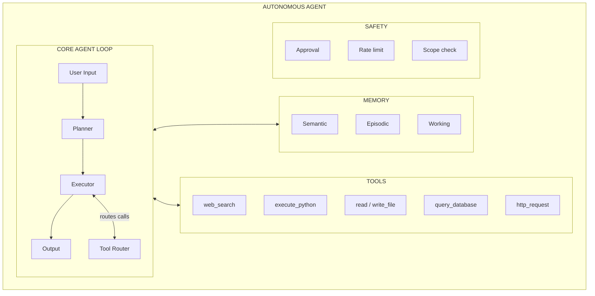

# 44 | Project: Build an Autonomous Agent

## Table of Contents
1. [Before You Start](#before-you-start)
2. [Project Overview](#project-overview)
3. [Architecture Design](#architecture-design)
4. [Phase 1: Core Agent Loop](#phase-1-core-agent-loop)
5. [Phase 2: Tool Suite](#phase-2-tool-suite)
6. [Phase 3: Memory Integration](#phase-3-memory-integration)
7. [Phase 4: Safety and Guardrails](#phase-4-safety-and-guardrails)
8. [Phase 5: CLI Interface](#phase-5-cli-interface)
9. [Testing the Agent](#testing-the-agent)
10. [Mini Extensions](#mini-extensions)
11. [Exercises](#exercises)

---

## Before You Start

**What you need:**
- Chapters 39-43 (Agents, Tools, Memory, MCP, Multi-agent)
- Python 3.10+, Anthropic API key
- ~4-6 hours for the full build

**What you'll build:** A fully autonomous CLI agent that can:
- Break complex tasks into steps and execute them
- Search the web, run code, read/write files
- Remember past interactions
- Know when to ask for human help vs. act autonomously
- Explain its reasoning at each step

**This is the capstone of the agents section.** It builds directly on the ReAct loop and tool-use patterns from Chapters 39-40, plus a memory system in the same spirit as Chapter 41. It does not use MCP (Chapter 42) or the multi-agent orchestrator pattern (Chapter 43) — this is a single agent with an in-process tool dict, which is deliberately simpler. See Chapter 42 if you want to rebuild this agent's tools as an MCP server instead, or Chapter 43 to split it into a coordinator plus specialists.

```
AGENT CAPABILITIES OVERVIEW:

User: "Research the top 5 Python web frameworks, compare them, and 
       create a summary table in a markdown file"

Agent reasoning:
  1. I need to search for Python web frameworks
  2. I need to research each one
  3. I need to organize into comparison criteria
  4. I need to write a formatted markdown file

Agent actions:
  → web_search("popular Python web frameworks 2025")
  → web_search("Django vs FastAPI comparison")
  → web_search("Flask performance benchmarks")
  → execute_python("build comparison table")
  → write_file("frameworks_comparison.md", content)

Agent output:
  "I've created frameworks_comparison.md with a comparison of 
   Django, FastAPI, Flask, Litestar, and Tornado across 8 criteria."
```

---

## Project Overview

### File Structure

```
autonomous_agent/
├── agent/
│   ├── __init__.py
│   ├── core.py          # Main agent loop
│   ├── tools.py         # Tool implementations
│   ├── memory.py        # Memory system
│   ├── safety.py        # Guardrails
│   └── planner.py       # Task planning
├── config.py
├── main.py              # CLI entry point
└── requirements.txt
```

### Requirements

```txt
anthropic>=0.30.0
chromadb>=0.4.0
sentence-transformers>=2.2.0
httpx>=0.25.0
rich>=13.0.0
click>=8.0.0
python-dotenv>=1.0.0
```

---

## Architecture Design



---

## Phase 1: Core Agent Loop

### agent/core.py

```python
# agent/core.py
import json
import anthropic
from typing import List, Dict, Any, Optional
from rich.console import Console
from rich.markdown import Markdown
from rich.panel import Panel

from .tools import ToolRegistry
from .memory import AgentMemory
from .safety import SafetyGuard
from .planner import TaskPlanner
from config import config

console = Console()


class AutonomousAgent:
    """Main agent that plans and executes tasks autonomously."""
    
    def __init__(self):
        self.client = anthropic.Anthropic()
        self.tools = ToolRegistry()
        self.memory = AgentMemory()
        self.safety = SafetyGuard()
        self.planner = TaskPlanner()
        self.conversation_history: List[Dict] = []
        self.current_task: Optional[str] = None
        self.iteration_count: int = 0
    
    def run(self, user_input: str) -> str:
        """Main entry point: process a user request."""
        self.current_task = user_input
        self.iteration_count = 0
        
        console.print(Panel(f"[bold blue]Task:[/bold blue] {user_input}", expand=False))
        
        # Retrieve relevant memories
        memory_context = self.memory.retrieve_for_context(user_input)
        
        # Build initial message with memory context
        full_input = user_input
        if memory_context:
            full_input = f"{memory_context}\n\n{user_input}"
        
        self.conversation_history.append({"role": "user", "content": full_input})
        
        # Execute the agent loop
        result = self._agent_loop()
        
        # Store memory
        self.memory.record_interaction(user_input, result)
        
        return result
    
    def _agent_loop(self) -> str:
        """Core ReAct loop: think, act, observe, repeat."""
        max_iterations = config.max_agent_iterations
        
        while self.iteration_count < max_iterations:
            self.iteration_count += 1
            
            # Call Claude with tool definitions
            response = self.client.messages.create(
                model=config.model,
                max_tokens=config.max_tokens,
                system=self._get_system_prompt(),
                tools=self.tools.get_definitions(),
                messages=self.conversation_history,
            )
            
            # Add response to history
            self.conversation_history.append({
                "role": "assistant",
                "content": response.content
            })
            
            # Check stop reason
            if response.stop_reason == "end_turn":
                # Agent is done!
                final_text = next(
                    (b.text for b in response.content if hasattr(b, "text")),
                    ""
                )
                console.print(Panel(
                    Markdown(final_text),
                    title="[bold green]Agent Response[/bold green]",
                    expand=False
                ))
                return final_text
            
            if response.stop_reason == "tool_use":
                # Process tool calls
                tool_results = self._handle_tool_calls(response.content)
                self.conversation_history.append({
                    "role": "user",
                    "content": tool_results
                })
            else:
                # Unexpected stop reason
                break
        
        return "I've reached the maximum number of steps. Here's where I got to: " + \
               (self.conversation_history[-2]["content"] if len(self.conversation_history) >= 2 else "No progress")
    
    def _handle_tool_calls(self, content_blocks) -> List[Dict]:
        """Execute all tool calls from a response."""
        tool_results = []
        
        for block in content_blocks:
            if block.type != "tool_use":
                continue
            
            tool_name = block.name
            tool_input = block.input
            
            # Show thinking to user
            console.print(f"  [cyan]→ Tool:[/cyan] {tool_name}")
            console.print(f"  [dim]  Input: {json.dumps(tool_input, indent=2)[:200]}[/dim]")
            
            # Safety check before executing
            approved, reason = self.safety.check_tool_call(tool_name, tool_input)
            
            if not approved:
                # Ask human for approval
                if self.safety.needs_human_approval(tool_name, tool_input):
                    approved = self._request_human_approval(tool_name, tool_input, reason)
                
                if not approved:
                    result = f"Tool call denied: {reason}"
                    console.print(f"  [red]  Denied: {reason}[/red]")
                else:
                    result = self.tools.execute(tool_name, tool_input)
            else:
                result = self.tools.execute(tool_name, tool_input)
            
            # Show result preview
            result_preview = str(result)[:200]
            console.print(f"  [green]← Result:[/green] {result_preview}...")
            
            tool_results.append({
                "type": "tool_result",
                "tool_use_id": block.id,
                "content": str(result)
            })
        
        return tool_results
    
    def _request_human_approval(self, tool_name: str, tool_input: dict, reason: str) -> bool:
        """Ask the user to approve a potentially risky action."""
        console.print(f"\n[yellow]⚠️  Human approval required:[/yellow]")
        console.print(f"  Tool: {tool_name}")
        console.print(f"  Input: {json.dumps(tool_input, indent=2)}")
        console.print(f"  Reason: {reason}")
        
        response = input("  Approve? (y/n): ").strip().lower()
        return response in ["y", "yes"]
    
    def _get_system_prompt(self) -> str:
        return f"""You are an autonomous AI agent. Your job is to help users accomplish complex tasks by using tools.

## Behavioral Guidelines
- Think step by step before acting
- Use the minimum number of tool calls necessary
- If you're unsure about a destructive action, describe what you're about to do and ask for confirmation
- If a task is too broad or unclear, ask for clarification BEFORE starting
- Always explain what you did and why at the end

## Current Session
- Iterations used: {self.iteration_count}/{config.max_agent_iterations}
- Task: {self.current_task}

## Available Tools
Use your tools to:
- Search the web for current information
- Execute Python code for computation/analysis
- Read and write files
- Make HTTP requests to APIs"""
```

---

## Phase 2: Tool Suite

### agent/tools.py

```python
# agent/tools.py
import subprocess
import tempfile
import os
import json
import httpx
from pathlib import Path
from typing import Dict, Any, List
from datetime import datetime


class ToolRegistry:
    """Manages all available tools."""
    
    def __init__(self):
        self.tools = {
            "web_search": self._web_search,
            "execute_python": self._execute_python,
            "read_file": self._read_file,
            "write_file": self._write_file,
            "list_files": self._list_files,
            "http_request": self._http_request,
            "get_datetime": self._get_datetime,
        }
    
    def get_definitions(self) -> List[Dict]:
        return [
            {
                "name": "web_search",
                "description": "Search the internet for current information. Returns top search results.",
                "input_schema": {
                    "type": "object",
                    "properties": {
                        "query": {"type": "string", "description": "Search query"},
                        "num_results": {"type": "integer", "default": 5}
                    },
                    "required": ["query"]
                }
            },
            {
                "name": "execute_python",
                "description": "Execute Python code and return stdout output. Use for calculations, data analysis, and text processing.",
                "input_schema": {
                    "type": "object",
                    "properties": {
                        "code": {"type": "string", "description": "Python code to execute. Use print() to see output."},
                        "timeout": {"type": "integer", "description": "Max seconds (default: 30)", "default": 30}
                    },
                    "required": ["code"]
                }
            },
            {
                "name": "read_file",
                "description": "Read the contents of a local file.",
                "input_schema": {
                    "type": "object",
                    "properties": {
                        "path": {"type": "string", "description": "File path relative to working directory"}
                    },
                    "required": ["path"]
                }
            },
            {
                "name": "write_file",
                "description": "Write content to a local file. Creates the file if it doesn't exist.",
                "input_schema": {
                    "type": "object",
                    "properties": {
                        "path": {"type": "string"},
                        "content": {"type": "string"},
                        "mode": {"type": "string", "enum": ["write", "append"], "default": "write"}
                    },
                    "required": ["path", "content"]
                }
            },
            {
                "name": "list_files",
                "description": "List files in a directory.",
                "input_schema": {
                    "type": "object",
                    "properties": {
                        "directory": {"type": "string", "default": "."},
                        "pattern": {"type": "string", "description": "Glob pattern, e.g., '*.py'"}
                    }
                }
            },
            {
                "name": "http_request",
                "description": "Make an HTTP GET or POST request to a public API.",
                "input_schema": {
                    "type": "object",
                    "properties": {
                        "url": {"type": "string"},
                        "method": {"type": "string", "enum": ["GET", "POST"], "default": "GET"},
                        "headers": {"type": "object"},
                        "body": {"type": "object"}
                    },
                    "required": ["url"]
                }
            },
            {
                "name": "get_datetime",
                "description": "Get current date and time.",
                "input_schema": {"type": "object", "properties": {}}
            }
        ]
    
    def execute(self, tool_name: str, tool_input: Dict) -> str:
        if tool_name not in self.tools:
            return f"Unknown tool: {tool_name}"
        
        try:
            return self.tools[tool_name](**tool_input)
        except Exception as e:
            return f"Tool error: {type(e).__name__}: {e}"
    
    def _web_search(self, query: str, num_results: int = 5) -> str:
        """
        Search using DuckDuckGo's Instant Answer API (no API key needed).

        Important limitation: this is NOT a general web search endpoint — it
        only returns curated "Abstract"/"RelatedTopics" data for topics with
        a Wikipedia-style disambiguation entry. Most real queries (including
        something like "Django vs FastAPI comparison") will return nothing
        useful. For an agent that needs to genuinely search the web, swap
        this for a real search API — Tavily, Serper, or Brave Search all
        have usable free tiers.
        """
        try:
            url = f"https://api.duckduckgo.com/?q={query}&format=json&no_html=1&skip_disambig=1"
            response = httpx.get(url, timeout=10, follow_redirects=True)
            data = response.json()
            
            results = []
            
            # Abstract (top result)
            if data.get("Abstract"):
                results.append(f"Summary: {data['Abstract']}")
            
            # Related topics
            for topic in data.get("RelatedTopics", [])[:num_results]:
                if isinstance(topic, dict) and "Text" in topic:
                    results.append(f"- {topic['Text']}")
            
            if not results:
                return f"No results found for: {query}"
            
            return "\n".join(results[:num_results + 1])
        
        except Exception as e:
            return f"Search error: {e}"
    
    def _execute_python(self, code: str, timeout: int = 30) -> str:
        """Execute Python in isolated subprocess."""
        with tempfile.NamedTemporaryFile(mode="w", suffix=".py", delete=False) as f:
            f.write(code)
            tmpfile = f.name
        
        try:
            result = subprocess.run(
                ["python", tmpfile],
                capture_output=True,
                text=True,
                timeout=timeout
            )
            output = result.stdout
            if result.returncode != 0:
                output += f"\nError:\n{result.stderr}"
            return output.strip() or "(no output)"
        except subprocess.TimeoutExpired:
            return f"Code timed out after {timeout}s"
        finally:
            os.unlink(tmpfile)
    
    def _read_file(self, path: str) -> str:
        p = Path(path)
        if not p.exists():
            return f"File not found: {path}"
        if p.stat().st_size > 500_000:
            return f"File too large ({p.stat().st_size} bytes). Showing first 500 lines:\n" + \
                   "\n".join(p.read_text().splitlines()[:500])
        return p.read_text(encoding="utf-8", errors="replace")
    
    def _write_file(self, path: str, content: str, mode: str = "write") -> str:
        p = Path(path)
        p.parent.mkdir(parents=True, exist_ok=True)
        
        if mode == "append":
            with open(p, "a", encoding="utf-8") as f:
                f.write(content)
        else:
            p.write_text(content, encoding="utf-8")
        
        return f"Written {len(content)} characters to {path}"
    
    def _list_files(self, directory: str = ".", pattern: str = None) -> str:
        p = Path(directory)
        if not p.is_dir():
            return f"Not a directory: {directory}"
        
        if pattern:
            files = list(p.glob(pattern))
        else:
            files = list(p.iterdir())
        
        files.sort()
        lines = []
        for f in files[:100]:  # Limit to 100
            size = f.stat().st_size if f.is_file() else 0
            kind = "DIR " if f.is_dir() else "FILE"
            lines.append(f"{kind} {size:>10,}  {f.name}")
        
        return "\n".join(lines) if lines else "Empty directory"
    
    def _http_request(self, url: str, method: str = "GET", headers: dict = None, body: dict = None) -> str:
        try:
            if method == "GET":
                resp = httpx.get(url, headers=headers or {}, timeout=15, follow_redirects=True)
            else:
                resp = httpx.post(url, headers=headers or {}, json=body, timeout=15)
            
            content_type = resp.headers.get("content-type", "")
            if "json" in content_type:
                return json.dumps(resp.json(), indent=2)[:5000]
            return resp.text[:5000]
        except Exception as e:
            return f"HTTP error: {e}"
    
    def _get_datetime(self) -> str:
        return datetime.now().strftime("%Y-%m-%d %H:%M:%S %Z")
```

---

## Phase 3: Memory Integration

### agent/memory.py

```python
# agent/memory.py
import chromadb
from sentence_transformers import SentenceTransformer
from datetime import datetime
from pathlib import Path
import json
import uuid


class AgentMemory:
    """Persistent memory system for the agent."""
    
    def __init__(self, db_path: str = "./agent_data/memory"):
        Path(db_path).mkdir(parents=True, exist_ok=True)
        self.db = chromadb.PersistentClient(path=db_path)
        self.collection = self.db.get_or_create_collection("agent_memory")
        self.embedder = SentenceTransformer("all-MiniLM-L6-v2")
        self.interactions_file = Path(db_path) / "interactions.jsonl"
    
    def record_interaction(self, user_input: str, agent_response: str):
        """Save an interaction to memory."""
        timestamp = datetime.now().isoformat()
        
        # Store summary in vector DB
        summary = f"User asked: {user_input[:200]}. Agent did: {agent_response[:200]}"
        embedding = self.embedder.encode(summary).tolist()
        
        memory_id = str(uuid.uuid4())[:8]
        self.collection.add(
            ids=[memory_id],
            embeddings=[embedding],
            documents=[summary],
            metadatas=[{"timestamp": timestamp, "type": "interaction"}]  # one dict per id — a list, not a single dict
        )
        
        # Save full interaction to file
        with open(self.interactions_file, "a") as f:
            f.write(json.dumps({
                "id": memory_id,
                "timestamp": timestamp,
                "user_input": user_input,
                "agent_response": agent_response[:500]
            }) + "\n")
    
    def retrieve_for_context(self, query: str, n: int = 3) -> str:
        """Retrieve relevant past interactions for context."""
        if self.collection.count() == 0:
            return ""
        
        embedding = self.embedder.encode(query).tolist()
        results = self.collection.query(
            query_embeddings=[embedding],
            n_results=min(n, self.collection.count()),
            include=["documents", "metadatas"]
        )
        
        if not results["documents"][0]:
            return ""
        
        lines = ["<relevant_past_interactions>"]
        for doc, meta in zip(results["documents"][0], results["metadatas"][0]):
            ts = meta.get("timestamp", "")[:10]
            lines.append(f"[{ts}] {doc}")
        lines.append("</relevant_past_interactions>")
        
        return "\n".join(lines)
    
    def get_recent(self, n: int = 5):
        """Get most recent interactions."""
        if not self.interactions_file.exists():
            return []
        
        with open(self.interactions_file) as f:
            lines = [l for l in f.readlines() if l.strip()]
        
        return [json.loads(l) for l in lines[-n:]]
```

---

## Phase 4: Safety and Guardrails

### agent/safety.py

```python
# agent/safety.py
from typing import Tuple

class SafetyGuard:
    """Prevents the agent from taking harmful or irreversible actions."""
    
    # Tools that always need approval
    HIGH_RISK_TOOLS = {"http_request"}  # External API calls
    
    # Dangerous patterns in tool inputs
    DANGEROUS_PATTERNS = [
        "rm -rf", "format", "drop table", "delete from",
        "/etc/passwd", "sudo", "chmod 777", "/dev/",
        "os.system", "subprocess.call"
    ]
    
    # Allowed file extensions for write
    ALLOWED_EXTENSIONS = {".txt", ".md", ".py", ".json", ".csv", ".html", ".yaml"}
    
    def check_tool_call(self, tool_name: str, tool_input: dict) -> Tuple[bool, str]:
        """
        Check if a tool call is safe.
        Returns (is_safe, reason)
        """
        # Check for dangerous patterns in any string input
        for key, value in tool_input.items():
            if isinstance(value, str):
                for pattern in self.DANGEROUS_PATTERNS:
                    if pattern.lower() in value.lower():
                        return False, f"Dangerous pattern detected: '{pattern}' in {key}"
        
        # File write checks
        if tool_name == "write_file":
            path = tool_input.get("path", "")
            
            # No absolute paths
            if path.startswith("/") or path.startswith("\\"):
                return False, "Absolute paths not allowed"
            
            # No path traversal
            if ".." in path:
                return False, "Path traversal not allowed"
            
            # Check extension
            ext = "." + path.rsplit(".", 1)[-1] if "." in path else ""
            if ext and ext not in self.ALLOWED_EXTENSIONS:
                return False, f"File extension {ext} not in allowed list"
        
        # Code execution checks
        if tool_name == "execute_python":
            code = tool_input.get("code", "")
            blocked = ["os.remove", "shutil.rmtree", "os.unlink", "__import__('subprocess')"]
            for b in blocked:
                if b in code:
                    return False, f"Blocked operation in code: {b}"
        
        return True, "OK"
    
    def needs_human_approval(self, tool_name: str, tool_input: dict) -> bool:
        """Determine if human should be asked to approve."""
        return tool_name in self.HIGH_RISK_TOOLS
    
    def check_iteration_limit(self, current: int, max_allowed: int) -> bool:
        """Alert if approaching iteration limit."""
        return current >= max_allowed * 0.8  # 80% of limit
```

---

## Phase 5: CLI Interface

### main.py

```python
# main.py
import click
from rich.console import Console
from rich.prompt import Prompt
from agent.core import AutonomousAgent

console = Console()

@click.group()
def cli():
    """Autonomous AI Agent CLI"""
    pass

@cli.command()
@click.option("--task", "-t", help="Task to execute (skip interactive mode)")
def run(task):
    """Run the agent interactively or with a specific task."""
    agent = AutonomousAgent()
    
    if task:
        # Single task mode
        result = agent.run(task)
    else:
        # Interactive mode
        console.print("[bold]Autonomous Agent[/bold] (type 'exit' to quit)")
        console.print("Enter complex tasks and watch the agent solve them.\n")
        
        while True:
            try:
                user_input = Prompt.ask("[bold blue]You[/bold blue]")
                if user_input.lower() in ["exit", "quit", "q"]:
                    break
                if not user_input.strip():
                    continue
                
                agent.run(user_input)
                
            except KeyboardInterrupt:
                break
    
    console.print("\n[dim]Session ended.[/dim]")

@cli.command()
def history():
    """Show recent agent interactions."""
    from agent.memory import AgentMemory
    memory = AgentMemory()
    recent = memory.get_recent(n=10)
    
    if not recent:
        console.print("No history yet.")
        return
    
    for interaction in recent:
        console.print(f"\n[dim]{interaction['timestamp'][:10]}[/dim]")
        console.print(f"[blue]You:[/blue] {interaction['user_input']}")
        console.print(f"[green]Agent:[/green] {interaction['agent_response'][:200]}...")

if __name__ == "__main__":
    cli()
```

### config.py

```python
# config.py
import os
from dataclasses import dataclass
from dotenv import load_dotenv

load_dotenv()

@dataclass
class Config:
    model: str = "claude-opus-4-7"
    max_tokens: int = 4096
    max_agent_iterations: int = 15
    embedding_model: str = "all-MiniLM-L6-v2"
    memory_db_path: str = "./agent_data/memory"

config = Config()
```

---

## Testing the Agent

```bash
# Run the agent
python main.py run

# Test with specific tasks:
```

**Test 1: Research and Write**
```
Task: "Research what Python's GIL is and create a summary file called gil_summary.md"
```

**Test 2: Data Analysis**
```
Task: "Create a Python script that generates the Fibonacci sequence up to 100, then calculate the ratio between consecutive numbers and show how it converges to the golden ratio"
```

**Test 3: Multi-step Task**
```
Task: "Create 3 files: hello.txt with 'Hello World', numbers.txt with numbers 1-10 (one per line), and a Python script that reads both files and counts total characters"
```

**Test 4: Tool Chaining**
```
Task: "Search for the current Python version, then write a Python script that checks if the running Python meets that version, and save it as version_check.py"
```

---

## Mini Extensions

### Extension 1: Agent Monitoring Dashboard (1 hour)

```python
# Add a simple stats tracker
class AgentMonitor:
    def __init__(self):
        self.stats = {
            "total_tasks": 0,
            "total_tool_calls": 0,
            "tool_call_counts": {},
            "success_rate": 0,
        }
    
    def record_tool_call(self, tool_name: str, success: bool):
        self.stats["total_tool_calls"] += 1
        self.stats["tool_call_counts"][tool_name] = \
            self.stats["tool_call_counts"].get(tool_name, 0) + 1
```

### Extension 2: Scheduled Tasks (30 min)

```python
# Add a simple scheduler
import schedule
import time

def run_scheduled_task(agent: AutonomousAgent, task: str):
    print(f"Running scheduled task: {task}")
    agent.run(task)

# Check system status every hour
schedule.every().hour.do(
    run_scheduled_task,
    agent=agent,
    task="Check disk space and memory usage, write a brief status report to status_log.txt"
)
```

---

## Exercises

1. **Agent evaluation:** Run the agent on 10 different tasks. Rate each on correctness, efficiency (tool calls used), and response quality.

2. **Tool failure recovery:** When a tool fails, the agent currently gets an error message. Improve this by having the agent try an alternative approach after 2 failures.

3. **Budget tracking:** Add a token counter to the agent. Stop and report when the session reaches 50,000 tokens.

4. **Conversation context:** Currently each task starts fresh. Add a mode where the agent maintains context across tasks in the same session (e.g., "Now add a test file for the script you just created").

5. **Agent comparison:** Run the same complex task with Claude Opus vs Claude Haiku. Compare: quality, speed, token usage, number of tool calls.

---

**[← Chapter 43: Multi-Agent Systems](43-multi-agent-systems.md) | [Chapter 45: LLM APIs and SDKs →](45-llm-apis-and-sdks.md)**
