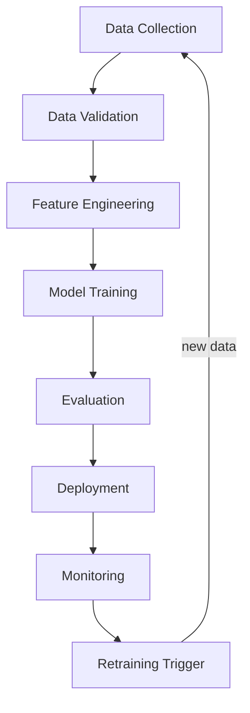

# 48 | MLOps and Production

## Table of Contents
1. [Before You Start](#before-you-start)
2. [MLOps Overview](#mlops-overview)
3. [Containerizing ML Applications](#containerizing-ml-applications)
4. [CI/CD for ML Projects](#cicd-for-ml-projects)
5. [Serving Models in Production](#serving-models-in-production)
6. [Feature Stores and Data Pipelines](#feature-stores-and-data-pipelines)
7. [LLM App Production Patterns](#llm-app-production-patterns)
8. [Cost Management at Scale](#cost-management-at-scale)
9. [Mini Projects](#mini-projects)
10. [Exercises](#exercises)

---

## Before You Start

**Prerequisites:**
- Basic Python and command line
- Chapter 46 (Observability) — MLOps builds on monitoring concepts
- Docker basics are helpful but not required

**What you'll build:** Package, containerize, and deploy a machine learning API that's production-ready with health checks, versioning, and graceful error handling.

**The key shift:** In development, things work "on your machine." MLOps is the set of practices that make ML work reliably in production — at scale, repeatedly, automatically.

```
DEVELOPMENT vs PRODUCTION:

Development:
  "It works on my laptop!"
  Manual runs, Jupyter notebooks
  No versioning, no monitoring
  One user (you)

Production:
  Automated pipelines
  Versioned models and code
  Monitoring + alerts
  Thousands of concurrent users
  99.9% uptime requirements
```

---

## MLOps Overview

### The MLOps Lifecycle



### What MLOps Covers

| Area | Tools | What it solves |
|------|-------|---------------|
| **Experiment tracking** | MLflow, W&B | "Which training run was best?" |
| **Data versioning** | DVC, Delta Lake | "What data trained this model?" |
| **Model registry** | MLflow, HuggingFace | "Which model version is in prod?" |
| **CI/CD** | GitHub Actions | "Auto-test and deploy on merge" |
| **Serving** | FastAPI, Triton, vLLM | "Serve model as low-latency API" |
| **Monitoring** | Prometheus, Grafana | "Is the model degrading?" |

---

## Containerizing ML Applications

Docker ensures your ML app runs the same everywhere.

### Dockerfile for an ML API

```dockerfile
# Dockerfile
FROM python:3.11-slim

# Set working directory
WORKDIR /app

# Install system dependencies
RUN apt-get update && apt-get install -y \
    curl \
    && rm -rf /var/lib/apt/lists/*

# Copy dependency files first (for Docker cache efficiency)
COPY requirements.txt .

# Install Python dependencies
RUN pip install --no-cache-dir -r requirements.txt

# Copy application code
COPY . .

# Create non-root user for security
RUN useradd --create-home appuser && chown -R appuser /app
USER appuser

# Expose port
EXPOSE 8000

# Health check
HEALTHCHECK --interval=30s --timeout=5s --start-period=10s --retries=3 \
    CMD curl -f http://localhost:8000/health || exit 1

# Run the app
CMD ["uvicorn", "app:app", "--host", "0.0.0.0", "--port", "8000"]
```

### docker-compose.yml for Local Dev

```yaml
version: "3.9"

services:
  api:
    build: .
    ports:
      - "8000:8000"
    environment:
      - ANTHROPIC_API_KEY=${ANTHROPIC_API_KEY}
      - MODEL_NAME=claude-opus-4-7
      - LOG_LEVEL=INFO
    volumes:
      - ./data:/app/data  # Mount data directory
    restart: unless-stopped
    depends_on:
      - db
    healthcheck:
      test: ["CMD", "curl", "-f", "http://localhost:8000/health"]
      interval: 30s
      timeout: 5s
      retries: 3

  db:
    image: postgres:15
    environment:
      POSTGRES_DB: mlops
      POSTGRES_USER: ${DB_USER:-admin}
      POSTGRES_PASSWORD: ${DB_PASSWORD}
    volumes:
      - postgres_data:/var/lib/postgresql/data
    ports:
      - "5432:5432"

  redis:
    image: redis:7-alpine
    ports:
      - "6379:6379"
    command: redis-server --maxmemory 256mb --maxmemory-policy allkeys-lru

volumes:
  postgres_data:
```

### Production-Ready FastAPI App

```python
# app.py
import os
import time
import logging
from contextlib import asynccontextmanager
from typing import Optional

import anthropic
from fastapi import FastAPI, HTTPException, Request
from fastapi.middleware.cors import CORSMiddleware
from pydantic import BaseModel, Field

# ── Config ──
APP_VERSION = os.getenv("APP_VERSION", "1.0.0")
MODEL_NAME = os.getenv("MODEL_NAME", "claude-haiku-4-5")
MAX_TOKENS = int(os.getenv("MAX_TOKENS", "500"))

# ── Logging ──
logging.basicConfig(
    level=os.getenv("LOG_LEVEL", "INFO"),
    format="%(asctime)s %(levelname)s %(name)s %(message)s"
)
logger = logging.getLogger(__name__)

# ── Models ──
class QueryRequest(BaseModel):
    question: str = Field(..., min_length=1, max_length=2000)
    context: Optional[str] = Field(None, max_length=10000)
    max_tokens: Optional[int] = Field(None, ge=1, le=2000)

class QueryResponse(BaseModel):
    answer: str
    model: str
    input_tokens: int
    output_tokens: int
    latency_ms: float

class HealthResponse(BaseModel):
    status: str
    version: str
    model: str

# ── App lifecycle ──
@asynccontextmanager
async def lifespan(app: FastAPI):
    # Startup
    logger.info(f"Starting app v{APP_VERSION} with model {MODEL_NAME}")
    app.state.client = anthropic.Anthropic()
    yield
    # Shutdown
    logger.info("Shutting down...")

app = FastAPI(
    title="ML API",
    version=APP_VERSION,
    lifespan=lifespan,
)

app.add_middleware(
    CORSMiddleware,
    allow_origins=["*"],  # Restrict in production
    allow_methods=["*"],
    allow_headers=["*"],
)

# ── Middleware for request logging ──
@app.middleware("http")
async def log_requests(request: Request, call_next):
    start = time.time()
    response = await call_next(request)
    duration_ms = (time.time() - start) * 1000
    logger.info(
        f"{request.method} {request.url.path} "
        f"status={response.status_code} "
        f"duration={duration_ms:.1f}ms"
    )
    return response

# ── Routes ──
@app.get("/health", response_model=HealthResponse)
async def health():
    """Health check endpoint for load balancers and orchestrators."""
    return HealthResponse(status="healthy", version=APP_VERSION, model=MODEL_NAME)

@app.post("/query", response_model=QueryResponse)
async def query(request_body: QueryRequest, request: Request):
    """Main inference endpoint."""
    start = time.time()
    
    messages = [{"role": "user", "content": request_body.question}]
    if request_body.context:
        messages[0]["content"] = f"Context:\n{request_body.context}\n\nQuestion: {request_body.question}"
    
    try:
        response = request.app.state.client.messages.create(
            model=MODEL_NAME,
            max_tokens=request_body.max_tokens or MAX_TOKENS,
            messages=messages,
        )
    except anthropic.RateLimitError:
        raise HTTPException(status_code=429, detail="Rate limit exceeded")
    except anthropic.APIError as e:
        logger.error(f"API error: {e}")
        raise HTTPException(status_code=502, detail="Upstream API error")
    
    latency_ms = (time.time() - start) * 1000
    
    return QueryResponse(
        answer=response.content[0].text,
        model=MODEL_NAME,
        input_tokens=response.usage.input_tokens,
        output_tokens=response.usage.output_tokens,
        latency_ms=round(latency_ms, 1),
    )

@app.get("/metrics")
async def metrics():
    """Prometheus-compatible metrics endpoint."""
    # In production: use prometheus_client library
    return {"total_requests": 0, "avg_latency_ms": 0}
```

---

## CI/CD for ML Projects

### GitHub Actions Workflow

```yaml
# .github/workflows/deploy.yml
name: Test and Deploy

on:
  push:
    branches: [main]
  pull_request:
    branches: [main]

jobs:
  test:
    runs-on: ubuntu-latest
    
    steps:
      - uses: actions/checkout@v4
      
      - name: Set up Python
        uses: actions/setup-python@v5
        with:
          python-version: "3.11"
      
      - name: Install dependencies
        run: |
          pip install -r requirements.txt
          pip install pytest httpx
      
      - name: Run unit tests
        run: pytest tests/ -v
      
      - name: Run eval suite
        env:
          ANTHROPIC_API_KEY: ${{ secrets.ANTHROPIC_API_KEY }}
        run: python run_evals.py --fail-on-regression
      
      - name: Check code quality
        run: |
          pip install ruff mypy
          ruff check .
          mypy app.py

  build-and-push:
    needs: test
    runs-on: ubuntu-latest
    if: github.ref == 'refs/heads/main'
    
    steps:
      - uses: actions/checkout@v4
      
      - name: Build Docker image
        run: docker build -t my-ml-api:${{ github.sha }} .
      
      - name: Push to registry
        run: |
          echo ${{ secrets.DOCKER_PASSWORD }} | docker login -u ${{ secrets.DOCKER_USERNAME }} --password-stdin
          docker tag my-ml-api:${{ github.sha }} myregistry/my-ml-api:latest
          docker push myregistry/my-ml-api:latest

  deploy:
    needs: build-and-push
    runs-on: ubuntu-latest
    if: github.ref == 'refs/heads/main'
    
    steps:
      - name: Deploy to production
        run: |
          # Example: deploy to a server via SSH
          # In practice: use kubectl, Heroku, Railway, Fly.io, etc.
          echo "Deploying version ${{ github.sha }}"
```

### Automated Testing with pytest

```python
# tests/test_api.py
import pytest
from fastapi.testclient import TestClient
from unittest.mock import patch, MagicMock
from app import app

client = TestClient(app)

def test_health():
    response = client.get("/health")
    assert response.status_code == 200
    data = response.json()
    assert data["status"] == "healthy"
    assert "version" in data

@patch("anthropic.Anthropic")
def test_query_success(mock_anthropic):
    # Mock the Anthropic client
    mock_response = MagicMock()
    mock_response.content[0].text = "Paris is the capital of France."
    mock_response.usage.input_tokens = 20
    mock_response.usage.output_tokens = 10
    mock_anthropic.return_value.messages.create.return_value = mock_response
    
    response = client.post("/query", json={"question": "What is the capital of France?"})
    assert response.status_code == 200
    data = response.json()
    assert "answer" in data
    assert "latency_ms" in data

def test_query_validation():
    # Empty question should fail
    response = client.post("/query", json={"question": ""})
    assert response.status_code == 422

def test_query_too_long():
    # Too-long question should fail
    response = client.post("/query", json={"question": "x" * 3000})
    assert response.status_code == 422
```

---

## Serving Models in Production

### LLM Serving Options

```
OPTION 1: API (Claude, GPT-4, etc.) — Recommended for most cases
  Pros: No infrastructure, always latest model, zero GPU cost
  Cons: Data sent to third party, latency, ongoing cost at scale

OPTION 2: vLLM (open-source, self-hosted)
  Best for: High-volume, cost-sensitive, privacy requirements
  Requires: GPU server (min 24GB VRAM for 7B model)

OPTION 3: Ollama (local development)
  Best for: Development, testing, privacy experiments
  Requires: Laptop with 8GB+ RAM
```

### Simple Load Balancing

```python
# When you have multiple API keys / instances
import random
import anthropic
from typing import List

class LoadBalancedClient:
    """Distribute load across multiple API keys."""
    
    def __init__(self, api_keys: List[str]):
        self.clients = [anthropic.Anthropic(api_key=key) for key in api_keys]
        self._index = 0
    
    def get_client(self) -> anthropic.Anthropic:
        # Round-robin
        client = self.clients[self._index % len(self.clients)]
        self._index += 1
        return client
    
    def create_message(self, **kwargs):
        """Try each client, falling back if rate limited."""
        clients = list(self.clients)
        random.shuffle(clients)
        
        last_error = None
        for client in clients:
            try:
                return client.messages.create(**kwargs)
            except anthropic.RateLimitError as e:
                last_error = e
                continue
        
        raise last_error
```

### Response Caching with Redis

```python
import redis
import hashlib
import json
import anthropic

class CachedLLMService:
    """Cache LLM responses in Redis to reduce costs and latency."""
    
    def __init__(self, cache_ttl_seconds: int = 3600):
        self.client = anthropic.Anthropic()
        self.cache = redis.Redis(host="localhost", port=6379, decode_responses=True)
        self.ttl = cache_ttl_seconds
    
    def _cache_key(self, model: str, messages: list, max_tokens: int) -> str:
        content = f"{model}:{json.dumps(messages, sort_keys=True)}:{max_tokens}"
        return f"llm:{hashlib.md5(content.encode()).hexdigest()}"
    
    def create(self, model: str, messages: list, max_tokens: int = 500) -> str:
        key = self._cache_key(model, messages, max_tokens)
        
        # Try cache first
        cached = self.cache.get(key)
        if cached:
            return cached
        
        # Call API
        response = self.client.messages.create(
            model=model,
            messages=messages,
            max_tokens=max_tokens,
        )
        result = response.content[0].text
        
        # Store in cache
        self.cache.setex(key, self.ttl, result)
        
        return result
```

---

## Reproducible Feature Pipelines (and What a Real Feature Store Adds)

For traditional ML (not LLMs), the same feature computation must produce identical results in training and in serving — any mismatch ("training/serving skew") silently degrades the model in production. Below is the simplest version of that idea: a pipeline object that fits a scaler once and reuses it everywhere.

This is *not* a feature store — it's worth being precise about the difference, since "feature store" gets thrown around loosely. A real feature store (Feast, Tecton, or a cloud provider's managed equivalent) adds three things this simple pipeline doesn't have:
- **An online store**: a low-latency key-value store (Redis, DynamoDB) serving pre-computed features at inference time, separate from the offline store used for training.
- **Point-in-time-correct joins**: when building a training set, each row's features are computed *as they were at that historical timestamp* — not using today's value, which would leak future information into the model.
- **Feature reuse and versioning**: features computed once are shared across models/teams instead of every project reimplementing the same aggregation logic.

None of that is needed at the scale this course's projects operate at — but know what you're reaching for if you actually need it.

```python
# Simple feature computation pipeline
import pandas as pd
import numpy as np
from sklearn.preprocessing import StandardScaler
import joblib
from pathlib import Path

class FeaturePipeline:
    """Reproducible feature engineering pipeline."""
    
    def __init__(self, artifact_dir: str = "./artifacts"):
        self.artifact_dir = Path(artifact_dir)
        self.artifact_dir.mkdir(exist_ok=True)
        self.scaler = None
    
    def fit_transform(self, df: pd.DataFrame) -> pd.DataFrame:
        """Fit on training data and transform."""
        features = self._compute_features(df)
        
        self.scaler = StandardScaler()
        scaled = self.scaler.fit_transform(features)
        
        # Save scaler for production use
        joblib.dump(self.scaler, self.artifact_dir / "scaler.joblib")
        
        return pd.DataFrame(scaled, columns=features.columns)
    
    def transform(self, df: pd.DataFrame) -> pd.DataFrame:
        """Transform using fitted scaler (for production)."""
        if self.scaler is None:
            self.scaler = joblib.load(self.artifact_dir / "scaler.joblib")
        
        features = self._compute_features(df)
        scaled = self.scaler.transform(features)
        return pd.DataFrame(scaled, columns=features.columns)
    
    def _compute_features(self, df: pd.DataFrame) -> pd.DataFrame:
        """Feature engineering logic — same in training and serving."""
        features = pd.DataFrame()
        features["age"] = df["age"]
        features["income_log"] = df["income"].apply(lambda x: np.log1p(x))
        features["tenure_years"] = df["tenure_days"] / 365
        features["spending_rate"] = df["total_spending"] / (df["tenure_days"] + 1)
        return features
```

---

## Data and Concept Drift Detection

A model's accuracy silently rots after deployment because the world keeps changing: user behavior shifts, a new product category appears, an upstream data source changes its schema. This is **drift**, and unlike a crash, nothing tells you it's happening — the pipeline keeps running, the API keeps returning 200s, and the model just gets quietly worse. You have to check for it deliberately.

Two distinct things get called "drift":

- **Data drift**: the distribution of *inputs* changes (e.g., average customer age creeps up, or a new traffic source sends very different users) — even if the true input→output relationship hasn't changed.
- **Concept drift**: the *relationship* between inputs and the correct output changes (e.g., what counted as "fraud" before a new payment method launched no longer covers the new fraud patterns it enables).

### Detecting Data Drift with PSI

Population Stability Index (PSI) compares a feature's distribution today against its distribution when the model was trained, bucketed into deciles:

```python
import numpy as np

def population_stability_index(reference: np.ndarray, current: np.ndarray, buckets: int = 10) -> float:
    """
    PSI < 0.1  : no significant drift
    PSI 0.1-0.25: moderate drift — investigate
    PSI > 0.25 : significant drift — retrain or investigate the pipeline
    """
    breakpoints = np.percentile(reference, np.linspace(0, 100, buckets + 1))
    breakpoints[0], breakpoints[-1] = -np.inf, np.inf

    ref_pct = np.histogram(reference, bins=breakpoints)[0] / len(reference)
    cur_pct = np.histogram(current, bins=breakpoints)[0] / len(current)

    # Avoid divide-by-zero / log(0) for empty buckets
    ref_pct = np.clip(ref_pct, 1e-4, None)
    cur_pct = np.clip(cur_pct, 1e-4, None)

    return float(np.sum((cur_pct - ref_pct) * np.log(cur_pct / ref_pct)))


# Usage: compare a feature's training-time distribution to this week's
# psi = population_stability_index(training_df["income_log"].values, this_weeks_df["income_log"].values)
# if psi > 0.25: alert("income_log has drifted significantly — investigate before trusting predictions")
```

### Wiring Drift Checks into Monitoring

Run this alongside the same `ProductionMonitor` from Chapter 46, on a schedule (daily/weekly), comparing a rolling window of recent inputs against the training set:

```python
def check_feature_drift(reference_df, current_df, features: list[str]) -> dict[str, float]:
    """Run PSI on each feature; print (or route to your own alerting) any that have drifted significantly."""
    results = {}
    for feature in features:
        psi = population_stability_index(reference_df[feature].values, current_df[feature].values)
        results[feature] = psi
        if psi > 0.25:
            print(f"⚠️  ALERT: Significant drift detected in '{feature}' (PSI={psi:.3f})")
    return results
```

A drift alert doesn't necessarily mean "retrain immediately" — it means "look at this feature's distribution before you keep trusting the model's predictions on it."

---

## LLM App Production Patterns

### Circuit Breaker Pattern

When an external service (LLM API) is down, fail fast instead of waiting.

```python
import time
from enum import Enum

class CircuitState(Enum):
    CLOSED = "closed"       # Normal operation
    OPEN = "open"           # Failing, reject calls immediately
    HALF_OPEN = "half_open" # Testing if service is back

class CircuitBreaker:
    def __init__(self, failure_threshold=5, recovery_timeout=60):
        self.state = CircuitState.CLOSED
        self.failure_count = 0
        self.threshold = failure_threshold
        self.recovery_timeout = recovery_timeout
        self.last_failure_time = 0
    
    def call(self, fn, *args, **kwargs):
        if self.state == CircuitState.OPEN:
            if time.time() - self.last_failure_time > self.recovery_timeout:
                self.state = CircuitState.HALF_OPEN
            else:
                raise Exception("Circuit breaker is OPEN — service unavailable")
        
        try:
            result = fn(*args, **kwargs)
            self._on_success()
            return result
        except Exception as e:
            self._on_failure()
            raise
    
    def _on_success(self):
        self.failure_count = 0
        self.state = CircuitState.CLOSED
    
    def _on_failure(self):
        self.failure_count += 1
        self.last_failure_time = time.time()
        if self.failure_count >= self.threshold:
            self.state = CircuitState.OPEN
            print(f"⚠️  Circuit OPEN after {self.failure_count} failures")


# Usage
breaker = CircuitBreaker(failure_threshold=3, recovery_timeout=30)

def call_llm(prompt: str) -> str:
    return breaker.call(
        anthropic.Anthropic().messages.create,
        model="claude-haiku-4-5",
        max_tokens=100,
        messages=[{"role": "user", "content": prompt}]
    )
```

### Graceful Degradation

```python
class ResilientLLMService:
    """LLM service that degrades gracefully when the API is unavailable."""
    
    def __init__(self):
        self.client = anthropic.Anthropic()
        self.breaker = CircuitBreaker()
    
    def answer(self, question: str) -> dict:
        try:
            response = self.breaker.call(
                self.client.messages.create,
                model="claude-opus-4-7",
                max_tokens=500,
                messages=[{"role": "user", "content": question}]
            )
            return {
                "answer": response.content[0].text,
                "source": "llm",
                "degraded": False,
            }
        
        except Exception as e:
            # Fallback: return cached/static response
            return {
                "answer": "I'm temporarily unavailable. Please try again in a moment.",
                "source": "fallback",
                "degraded": True,
                "error": str(e),
            }
```

---

## Cost Management at Scale

### Cost Projection

```python
def project_monthly_cost(
    daily_requests: int,
    avg_input_tokens: int,
    avg_output_tokens: int,
    model: str = "claude-sonnet-4-6",
) -> dict:
    """Project monthly API costs."""
    
    PRICING = {
        "claude-opus-4-7": (15.0, 75.0),
        "claude-sonnet-4-6": (3.0, 15.0),
        "claude-haiku-4-5": (0.80, 4.0),
    }
    
    input_price, output_price = PRICING.get(model, (5.0, 15.0))
    
    monthly_requests = daily_requests * 30
    monthly_input_tokens = monthly_requests * avg_input_tokens
    monthly_output_tokens = monthly_requests * avg_output_tokens
    
    monthly_cost = (
        monthly_input_tokens * input_price +
        monthly_output_tokens * output_price
    ) / 1_000_000
    
    return {
        "model": model,
        "monthly_requests": f"{monthly_requests:,}",
        "monthly_input_tokens": f"{monthly_input_tokens:,}",
        "monthly_output_tokens": f"{monthly_output_tokens:,}",
        "monthly_cost_usd": f"${monthly_cost:.2f}",
        "daily_cost_usd": f"${monthly_cost/30:.2f}",
    }


# Example
projection = project_monthly_cost(
    daily_requests=10_000,
    avg_input_tokens=500,
    avg_output_tokens=200,
    model="claude-sonnet-4-6"
)
print(projection)
# monthly_cost_usd: $855.00
# (10K/day × 30 × (500×$0.003 + 200×$0.015)) / 1M
```

---

## Mini Projects

### Mini Project 1: Containerize Your ML App (2 hours)

**Goal:** Take any ML application you built (RAG chatbot, story generator, etc.) and containerize it.

```bash
# Steps:
# 1. Create requirements.txt
pip freeze > requirements.txt

# 2. Create Dockerfile (template provided above)

# 3. Build
docker build -t my-ml-app .

# 4. Run
docker run -p 8000:8000 -e ANTHROPIC_API_KEY=$ANTHROPIC_API_KEY my-ml-app

# 5. Test
curl http://localhost:8000/health

# 6. Add docker-compose.yml for multi-service setup
```

### Mini Project 2: GitHub Actions Eval Gate (1.5 hours)

**Goal:** Set up CI/CD that prevents deploying if evals regress.

```yaml
# .github/workflows/eval_gate.yml
name: Eval Gate

on: [pull_request]

jobs:
  eval:
    runs-on: ubuntu-latest
    steps:
      - uses: actions/checkout@v4
      - name: Install deps
        run: pip install -r requirements.txt
      - name: Run evals
        env:
          ANTHROPIC_API_KEY: ${{ secrets.ANTHROPIC_API_KEY }}
        run: |
          python run_evals.py
          # Script exits with code 1 if regressions detected
```

### Mini Project 3: Cost Dashboard (1 hour)

```python
# cost_dashboard.py — Simple Streamlit dashboard showing:
# - Requests per hour over last 24 hours
# - Token usage distribution
# - Cost by model
# - Estimated monthly cost at current rate

import streamlit as st
import json
from pathlib import Path

def load_logs(log_dir: str = "./llm_logs") -> list:
    logs = []
    for log_file in Path(log_dir).glob("*.jsonl"):
        with open(log_file) as f:
            for line in f:
                logs.append(json.loads(line))
    return logs

st.title("LLM Cost Dashboard")
logs = load_logs()
if logs:
    st.metric("Total Calls", len(logs))
    st.metric("Total Cost", f"${sum(l.get('cost_usd', 0) for l in logs):.4f}")
    # Add charts with st.line_chart, st.bar_chart, etc.
```

---

## Exercises

1. **Docker optimization:** The `pip install` step in Docker is slow and repeated on every build. How do you cache it? (Hint: layer caching)

2. **Zero-downtime deployment:** If you need to update your ML API while it's serving traffic, how do you do it without dropping requests? (Hint: rolling deployment, blue-green)

3. **Environment parity:** List 5 differences between a typical development environment and production. For each, explain how MLOps tooling addresses it.

4. **Rollback plan:** Your new model version has a regression in production. Describe step-by-step how you'd detect it, respond to it, and roll back.

5. **Cost optimization:** You're running an LLM API with 50K requests/day averaging 800 input tokens and 300 output tokens on claude-opus-4-7. Calculate the monthly cost. Then propose 3 strategies to reduce it by 50%.

---

**[← Chapter 47: AI Safety and Alignment](47-ai-safety-and-alignment.md) | [Chapter 49: Project - SQL AI Assistant →](49-project-sql-ai-assistant.md)**
