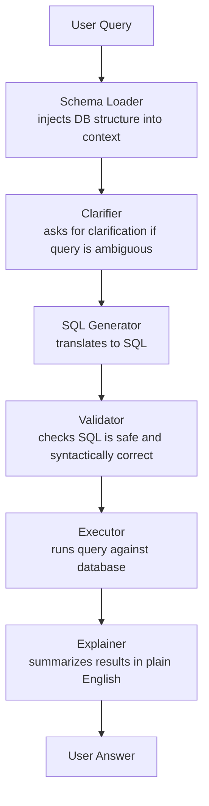

# 49 | Project: SQL AI Assistant

## Table of Contents
1. [Before You Start](#before-you-start)
2. [Project Overview](#project-overview)
3. [Phase 1: Database Setup and Schema Understanding](#phase-1-database-setup-and-schema-understanding)
4. [Phase 2: Natural Language to SQL](#phase-2-natural-language-to-sql)
5. [Phase 3: SQL Execution and Results](#phase-3-sql-execution-and-results)
6. [Phase 4: Conversational Interface](#phase-4-conversational-interface)
7. [Phase 5: Safety and Validation](#phase-5-safety-and-validation)
8. [Phase 6: Gradio Web UI](#phase-6-gradio-web-ui)
9. [Mini Extensions](#mini-extensions)
10. [Exercises](#exercises)

---

## Before You Start

**What you need:**
- Chapters 37 (Context Engineering), 40 (Tool Use), 48 (MLOps basics)
- Python 3.10+, Anthropic API key
- ~3-5 hours for the full build

**What you'll build:** An AI assistant that lets non-technical users query a database using plain English. The AI translates questions to SQL, runs the queries, and explains the results.

```
USER: "How many customers signed up last month?"
AI: Running query...
    SELECT COUNT(*) FROM customers 
    WHERE created_at >= DATE_SUB(NOW(), INTERVAL 1 MONTH)
    
    Result: 1,234 new customers signed up last month
    (up 15% from the month before)
```

---

## Project Overview

### The "Text-to-SQL" Challenge

Natural language → SQL is hard because:
1. SQL requires exact syntax
2. Database schemas can be complex
3. Users ask ambiguous questions
4. Joins and aggregations need careful interpretation
5. Security: we MUST prevent SQL injection

### Architecture



### File Structure

```
sql_assistant/
├── src/
│   ├── schema.py       # Load and format DB schema
│   ├── generator.py    # NL → SQL with LLM
│   ├── executor.py     # Run SQL safely
│   ├── explainer.py    # Explain results
│   └── conversation.py # Multi-turn conversation
├── data/
│   └── sample.db       # SQLite database for testing
├── app.py              # Gradio UI
├── seed_db.py          # Create sample database
└── config.py
```

---

## Phase 1: Database Setup and Schema Understanding

### seed_db.py — Create a Sample Database

```python
# seed_db.py
import sqlite3
import random
from datetime import datetime, timedelta

def seed_database(db_path: str = "data/sample.db"):
    """Create a sample e-commerce database for testing."""
    import os
    os.makedirs("data", exist_ok=True)
    
    conn = sqlite3.connect(db_path)
    cursor = conn.cursor()
    
    # Create tables
    cursor.executescript("""
        DROP TABLE IF EXISTS customers;
        DROP TABLE IF EXISTS products;
        DROP TABLE IF EXISTS orders;
        DROP TABLE IF EXISTS order_items;
        
        CREATE TABLE customers (
            id INTEGER PRIMARY KEY AUTOINCREMENT,
            name TEXT NOT NULL,
            email TEXT UNIQUE NOT NULL,
            city TEXT,
            country TEXT DEFAULT 'US',
            created_at DATETIME DEFAULT CURRENT_TIMESTAMP,
            is_premium BOOLEAN DEFAULT 0
        );
        
        CREATE TABLE products (
            id INTEGER PRIMARY KEY AUTOINCREMENT,
            name TEXT NOT NULL,
            category TEXT,
            price DECIMAL(10,2),
            stock_quantity INTEGER DEFAULT 0,
            is_active BOOLEAN DEFAULT 1
        );
        
        CREATE TABLE orders (
            id INTEGER PRIMARY KEY AUTOINCREMENT,
            customer_id INTEGER REFERENCES customers(id),
            status TEXT DEFAULT 'pending',  -- pending, shipped, delivered, cancelled
            total_amount DECIMAL(10,2),
            created_at DATETIME DEFAULT CURRENT_TIMESTAMP,
            shipped_at DATETIME
        );
        
        CREATE TABLE order_items (
            id INTEGER PRIMARY KEY AUTOINCREMENT,
            order_id INTEGER REFERENCES orders(id),
            product_id INTEGER REFERENCES products(id),
            quantity INTEGER,
            unit_price DECIMAL(10,2)
        );
    """)
    
    # Seed data
    cities = ["New York", "San Francisco", "Chicago", "Austin", "Seattle", "Miami"]
    categories = ["Electronics", "Books", "Clothing", "Home", "Sports"]
    statuses = ["pending", "shipped", "delivered", "cancelled"]
    
    # Insert customers
    for i in range(200):
        days_ago = random.randint(0, 365)
        created_at = datetime.now() - timedelta(days=days_ago)
        cursor.execute(
            "INSERT INTO customers (name, email, city, is_premium, created_at) VALUES (?,?,?,?,?)",
            (f"Customer {i+1}", f"customer{i+1}@example.com",
             random.choice(cities), random.random() > 0.8, created_at)
        )
    
    # Insert products
    products = [
        ("Laptop Pro", "Electronics", 1299.99, 50),
        ("Python Book", "Books", 39.99, 200),
        ("Running Shoes", "Sports", 89.99, 100),
        ("Smart Watch", "Electronics", 299.99, 75),
        ("Coffee Maker", "Home", 79.99, 60),
        ("T-Shirt Bundle", "Clothing", 49.99, 150),
        ("Wireless Headphones", "Electronics", 199.99, 80),
        ("Data Science Book", "Books", 44.99, 180),
        ("Yoga Mat", "Sports", 29.99, 120),
        ("Desk Lamp", "Home", 39.99, 90),
    ]
    for product in products:
        cursor.execute(
            "INSERT INTO products (name, category, price, stock_quantity) VALUES (?,?,?,?)",
            product
        )
    
    # Insert orders
    for i in range(500):
        customer_id = random.randint(1, 200)
        days_ago = random.randint(0, 180)
        created_at = datetime.now() - timedelta(days=days_ago)
        status = random.choice(statuses)
        total = round(random.uniform(20, 500), 2)
        
        cursor.execute(
            "INSERT INTO orders (customer_id, status, total_amount, created_at) VALUES (?,?,?,?)",
            (customer_id, status, total, created_at)
        )
        
        order_id = cursor.lastrowid
        
        # Add 1-3 items per order
        for _ in range(random.randint(1, 3)):
            product_id = random.randint(1, len(products))
            qty = random.randint(1, 3)
            cursor.execute(
                "INSERT INTO order_items (order_id, product_id, quantity, unit_price) VALUES (?,?,?,?)",
                (order_id, product_id, qty, products[product_id-1][2])
            )
    
    conn.commit()
    conn.close()
    print(f"Database seeded at {db_path}")

if __name__ == "__main__":
    seed_database()
```

### src/schema.py — Schema Understanding

```python
# src/schema.py
import sqlite3
from typing import Dict, List

class SchemaLoader:
    """Load and format database schema for LLM context."""
    
    def __init__(self, db_path: str):
        self.db_path = db_path
    
    def get_schema(self) -> Dict[str, List[Dict]]:
        """Get all table schemas."""
        conn = sqlite3.connect(self.db_path)
        cursor = conn.cursor()
        
        # Get all tables
        cursor.execute("SELECT name FROM sqlite_master WHERE type='table' ORDER BY name")
        tables = [row[0] for row in cursor.fetchall()]
        
        schema = {}
        for table in tables:
            cursor.execute(f"PRAGMA table_info({table})")
            columns = cursor.fetchall()
            schema[table] = [
                {
                    "name": col[1],
                    "type": col[2],
                    "not_null": bool(col[3]),
                    "primary_key": bool(col[5])
                }
                for col in columns
            ]
        
        conn.close()
        return schema
    
    def get_sample_data(self, n_rows: int = 3) -> Dict[str, List]:
        """Get sample rows from each table."""
        conn = sqlite3.connect(self.db_path)
        conn.row_factory = sqlite3.Row
        cursor = conn.cursor()
        
        cursor.execute("SELECT name FROM sqlite_master WHERE type='table'")
        tables = [row[0] for row in cursor.fetchall()]
        
        samples = {}
        for table in tables:
            cursor.execute(f"SELECT * FROM {table} LIMIT {n_rows}")
            rows = cursor.fetchall()
            samples[table] = [dict(row) for row in rows]
        
        conn.close()
        return samples
    
    def format_for_prompt(self, include_samples: bool = True) -> str:
        """
        Format schema as a clear, LLM-friendly description.

        This dumps the ENTIRE schema into every prompt — fine for this
        project's small handful of tables, but it's context-stuffing, not
        retrieval. A real "schema RAG" would embed each table's
        schema+description (Chapter 33/34's techniques) and retrieve only
        the top-k relevant tables per question, which is what you'd actually
        need once a database has dozens or hundreds of tables and the full
        schema no longer fits comfortably in context.
        """
        schema = self.get_schema()
        samples = self.get_sample_data(3) if include_samples else {}
        
        lines = ["DATABASE SCHEMA:", "=" * 50]
        
        for table_name, columns in schema.items():
            lines.append(f"\nTable: {table_name}")
            lines.append("Columns:")
            for col in columns:
                pk_marker = " [PK]" if col["primary_key"] else ""
                null_marker = " NOT NULL" if col["not_null"] else ""
                lines.append(f"  - {col['name']} ({col['type']}{pk_marker}{null_marker})")
            
            if table_name in samples and samples[table_name]:
                lines.append(f"Sample rows:")
                for row in samples[table_name][:2]:
                    lines.append(f"  {row}")
        
        lines.append("\n" + "=" * 50)
        return "\n".join(lines)
    
    def get_table_stats(self) -> Dict[str, int]:
        """Get row counts for each table."""
        conn = sqlite3.connect(self.db_path)
        cursor = conn.cursor()
        
        cursor.execute("SELECT name FROM sqlite_master WHERE type='table'")
        tables = [row[0] for row in cursor.fetchall()]
        
        stats = {}
        for table in tables:
            cursor.execute(f"SELECT COUNT(*) FROM {table}")
            stats[table] = cursor.fetchone()[0]
        
        conn.close()
        return stats
```

---

## Phase 2: Natural Language to SQL

### src/generator.py

```python
# src/generator.py
import anthropic
import re
from typing import Optional, List, Dict

class SQLGenerator:
    """Convert natural language questions to SQL queries."""
    
    SYSTEM_PROMPT = """You are an expert SQL query generator for SQLite databases.

Your job: Convert natural language questions into valid SQLite SQL queries.

RULES:
1. Only generate SELECT queries (read-only — never INSERT, UPDATE, DELETE, DROP)
2. Use exact column and table names from the schema provided
3. Always use table aliases for clarity in complex queries
4. Add LIMIT 100 to any query without an explicit limit
5. Use DATE() and strftime() for date operations in SQLite
6. Return ONLY the SQL query, no explanation

COMMON PATTERNS:
- "last month": WHERE created_at >= date('now', '-1 month')
- "this year": WHERE strftime('%Y', created_at) = strftime('%Y', 'now')
- "top N": ORDER BY ... DESC LIMIT N
- "per category": GROUP BY category"""
    
    def __init__(self, schema_prompt: str):
        self.client = anthropic.Anthropic()
        self.schema_prompt = schema_prompt
    
    def generate(self, question: str, history: Optional[List[Dict]] = None) -> Optional[str]:
        """
        Generate SQL from a natural language question.

        `history` (previous {"role", "content"} turns from SQLConversation)
        lets a follow-up like "what about just this year?" resolve against
        what was asked before — without it, every question is generated in
        isolation and can't refer back to prior turns at all.
        """
        history_block = ""
        if history:
            recent = history[-6:]  # last few turns is enough context
            history_block = "Recent conversation:\n" + "\n".join(
                f"{turn['role']}: {turn['content']}" for turn in recent
            ) + "\n\n"

        prompt = f"""Database Schema:
{self.schema_prompt}

{history_block}Question: {question}

Generate a SQLite SQL query to answer this question. If the question refers
to something from the recent conversation (e.g. "what about just this
year?"), use that context. Return ONLY the SQL, nothing else."""
        
        response = self.client.messages.create(
            model="claude-opus-4-7",
            max_tokens=500,
            system=self.SYSTEM_PROMPT,
            messages=[{"role": "user", "content": prompt}]
        )
        
        sql = response.content[0].text.strip()
        
        # Extract SQL if wrapped in code block
        if "```sql" in sql:
            sql = sql.split("```sql")[1].split("```")[0].strip()
        elif "```" in sql:
            sql = sql.split("```")[1].split("```")[0].strip()
        
        return sql
    
    def clarify_ambiguous(self, question: str) -> Optional[str]:
        """Check if question needs clarification."""
        response = self.client.messages.create(
            model="claude-haiku-4-5",
            max_tokens=200,
            messages=[{
                "role": "user",
                "content": f"""Is this database question clear enough to generate an accurate SQL query?
                
Question: {question}
Schema summary: customers, products, orders, order_items tables

If YES, just say "CLEAR".
If NO, ask ONE clarifying question.

Response:"""
            }]
        )
        
        answer = response.content[0].text.strip()
        if answer.upper().startswith("CLEAR"):
            return None
        return answer  # Return the clarifying question
```

---

## Phase 3: SQL Execution and Results

### src/executor.py

```python
# src/executor.py
import sqlite3
import re
from typing import Dict, Any

class SafeSQLExecutor:
    """Execute SQL queries safely against SQLite."""
    
    # SQL keywords that indicate mutations — block all of these
    BLOCKED_KEYWORDS = [
        "INSERT", "UPDATE", "DELETE", "DROP", "CREATE", "ALTER",
        "TRUNCATE", "REPLACE", "MERGE", "EXECUTE", "GRANT", "REVOKE",
        "ATTACH", "DETACH",
    ]
    
    def __init__(self, db_path: str, max_rows: int = 500):
        self.db_path = db_path
        self.max_rows = max_rows
    
    def validate(self, sql: str) -> tuple[bool, str]:
        """Validate that SQL is safe to execute."""
        # Remove strings and comments to avoid false positives
        clean_sql = re.sub(r"'[^']*'", "", sql)
        clean_sql = re.sub(r"--.*$", "", clean_sql, flags=re.MULTILINE)
        
        sql_upper = clean_sql.upper()
        
        # Must be a SELECT query
        if not sql_upper.strip().startswith("SELECT"):
            return False, "Only SELECT queries are allowed"
        
        # Block dangerous keywords
        for keyword in self.BLOCKED_KEYWORDS:
            pattern = r'\b' + keyword + r'\b'
            if re.search(pattern, sql_upper):
                return False, f"Blocked keyword: {keyword}"
        
        # Block subqueries that modify data
        if "INTO" in sql_upper and "INSERT" in sql_upper:
            return False, "INSERT INTO not allowed"
        
        return True, "OK"
    
    def execute(self, sql: str) -> Dict[str, Any]:
        """Execute a validated SQL query and return results."""
        is_valid, reason = self.validate(sql)
        if not is_valid:
            return {"error": reason, "rows": [], "columns": []}
        
        try:
            conn = sqlite3.connect(self.db_path)
            conn.row_factory = sqlite3.Row
            
            # Set query timeout
            conn.execute("PRAGMA busy_timeout = 5000")
            
            cursor = conn.execute(sql)
            rows = cursor.fetchmany(self.max_rows)
            
            columns = [desc[0] for desc in cursor.description] if cursor.description else []
            row_dicts = [dict(row) for row in rows]
            
            conn.close()
            
            return {
                "columns": columns,
                "rows": row_dicts,
                "row_count": len(row_dicts),
                "truncated": len(row_dicts) == self.max_rows,
                "sql": sql,
                "error": None,
            }
        
        except sqlite3.Error as e:
            return {"error": str(e), "rows": [], "columns": [], "sql": sql}
    
    def format_results(self, result: Dict[str, Any], max_display_rows: int = 20) -> str:
        """Format results as a readable table string."""
        if result.get("error"):
            return f"Query error: {result['error']}"
        
        rows = result["rows"]
        columns = result["columns"]
        
        if not rows:
            return "No results found."
        
        # Build table
        lines = []
        col_str = " | ".join(columns)
        lines.append(col_str)
        lines.append("-" * len(col_str))
        
        for row in rows[:max_display_rows]:
            values = " | ".join(str(v) for v in row.values())
            lines.append(values)
        
        if result.get("truncated"):
            lines.append(f"... (showing first {len(rows)} rows)")
        
        lines.append(f"\nTotal: {result['row_count']} rows")
        
        return "\n".join(lines)
```

---

## Phase 4: Conversational Interface

### src/conversation.py

```python
# src/conversation.py
import anthropic
from typing import List, Dict, Optional
from src.schema import SchemaLoader
from src.generator import SQLGenerator
from src.executor import SafeSQLExecutor

class SQLConversation:
    """Multi-turn conversational SQL assistant."""
    
    def __init__(self, db_path: str = "data/sample.db"):
        self.schema_loader = SchemaLoader(db_path)
        schema_prompt = self.schema_loader.format_for_prompt()
        
        self.generator = SQLGenerator(schema_prompt)
        self.executor = SafeSQLExecutor(db_path)
        self.client = anthropic.Anthropic()
        
        self.history: List[Dict] = []
        self.schema_prompt = schema_prompt
    
    def ask(self, question: str) -> Dict:
        """Process a question and return answer with SQL."""
        
        # Step 1: Check if clarification needed
        clarification = self.generator.clarify_ambiguous(question)
        if clarification:
            return {
                "answer": clarification,
                "needs_clarification": True,
                "sql": None,
                "results": None,
            }
        
        # Step 2: Generate SQL (with conversation history, so follow-up
        # questions can refer back to what was asked before)
        sql = self.generator.generate(question, self.history)
        if not sql:
            return {
                "answer": "I couldn't generate a SQL query for that question. Could you rephrase it?",
                "sql": None,
                "results": None,
            }
        
        # Step 3: Execute SQL
        result = self.executor.execute(sql)
        
        if result.get("error"):
            # Try once more with error context
            sql = self.generator.generate(
                f"{question}\n\nNote: The previous SQL failed with: {result['error']}. Fix it."
            )
            result = self.executor.execute(sql) if sql else result
        
        # Step 4: Explain results
        explanation = self._explain_results(question, sql, result)
        
        # Update conversation history
        self.history.append({"role": "user", "content": question})
        self.history.append({"role": "assistant", "content": explanation})
        
        return {
            "answer": explanation,
            "sql": sql,
            "results": result,
            "needs_clarification": False,
        }
    
    def _explain_results(self, question: str, sql: str, results: Dict) -> str:
        """Explain query results in plain English."""
        if results.get("error"):
            return f"I encountered an error running the query: {results['error']}"
        
        rows = results.get("rows", [])
        formatted = self.executor.format_results(results, max_display_rows=10)
        
        prompt = f"""Question: {question}

SQL Used: {sql}

Results:
{formatted}

Explain these results in plain English. Be concise (2-3 sentences). 
Include the key numbers. If the result is a count, say what it means.
If the results are complex, highlight the most interesting findings."""
        
        response = self.client.messages.create(
            model="claude-opus-4-7",
            max_tokens=300,
            messages=[{"role": "user", "content": prompt}]
        )
        
        return response.content[0].text
```

---

## Phase 5: Safety and Validation

```python
# src/validator.py
import anthropic
import re

class SQLValidator:
    """Additional LLM-based validation for SQL quality."""
    
    def __init__(self):
        self.client = anthropic.Anthropic()
    
    def check_sql_correctness(self, question: str, sql: str, schema: str) -> Dict:
        """Use LLM to verify SQL makes sense for the question."""
        response = self.client.messages.create(
            model="claude-haiku-4-5",
            max_tokens=200,
            messages=[{
                "role": "user",
                "content": f"""Does this SQL correctly answer the question?

Schema summary: {schema[:500]}
Question: {question}
SQL: {sql}

Answer YES or NO, then briefly explain why."""
            }]
        )
        
        answer = response.content[0].text
        is_correct = answer.upper().startswith("YES")
        
        return {"is_correct": is_correct, "reasoning": answer}
    
    def suggest_improvements(self, sql: str) -> Optional[str]:
        """Suggest SQL improvements (indexing, efficiency)."""
        if len(sql) < 50:
            return None  # Simple queries don't need optimization hints
        
        response = self.client.messages.create(
            model="claude-haiku-4-5",
            max_tokens=200,
            messages=[{
                "role": "user",
                "content": f"""Briefly review this SQL for correctness and efficiency.
SQL: {sql}
In 1-2 sentences: is there any issue, and if so, what's the fix?
If it looks good, say "Looks good."."""
            }]
        )
        
        suggestion = response.content[0].text
        if "Looks good" in suggestion or "looks good" in suggestion:
            return None
        return suggestion
```

---

## Phase 6: Gradio Web UI

### app.py

```python
# app.py
import gradio as gr
from src.conversation import SQLConversation
from src.schema import SchemaLoader

# Initialize
conversation = SQLConversation("data/sample.db")
schema_loader = SchemaLoader("data/sample.db")

def process_question(
    question: str,
    history: list,
    show_sql: bool,
) -> tuple:
    """Handle a question from the user."""
    if not question.strip():
        return history, "", ""
    
    result = conversation.ask(question)
    
    answer = result["answer"]
    sql = result.get("sql", "")
    
    history.append((question, answer))
    sql_display = f"```sql\n{sql}\n```" if sql and show_sql else ""
    
    return history, "", sql_display


def get_schema_info() -> str:
    """Return formatted schema for display."""
    stats = schema_loader.get_table_stats()
    lines = ["**Database Tables:**"]
    for table, count in stats.items():
        lines.append(f"- `{table}`: {count:,} rows")
    return "\n".join(lines)


EXAMPLE_QUESTIONS = [
    "How many customers do we have?",
    "What are the top 5 products by sales?",
    "Show me orders from last week",
    "Which customers spent the most money?",
    "What's the average order value by city?",
    "How many orders were cancelled last month?",
    "List all products in the Electronics category",
]

with gr.Blocks(title="SQL AI Assistant", theme=gr.themes.Soft()) as demo:
    gr.Markdown("# 🔍 SQL AI Assistant\nAsk questions about your data in plain English")
    
    with gr.Row():
        with gr.Column(scale=2):
            chatbot = gr.Chatbot(height=400, label="Conversation")
            
            with gr.Row():
                msg_input = gr.Textbox(
                    placeholder="Ask a question about your data...",
                    scale=4,
                    label=""
                )
                send_btn = gr.Button("Ask", variant="primary", scale=1)
            
            show_sql = gr.Checkbox(label="Show generated SQL", value=True)
            sql_output = gr.Markdown(label="Generated SQL")
        
        with gr.Column(scale=1):
            gr.Markdown(get_schema_info())
            
            gr.Markdown("**Example questions:**")
            for example in EXAMPLE_QUESTIONS:
                gr.Button(example, size="sm").click(
                    fn=lambda q=example: q,
                    outputs=msg_input
                )
    
    send_btn.click(
        fn=process_question,
        inputs=[msg_input, chatbot, show_sql],
        outputs=[chatbot, msg_input, sql_output]
    )
    msg_input.submit(
        fn=process_question,
        inputs=[msg_input, chatbot, show_sql],
        outputs=[chatbot, msg_input, sql_output]
    )

if __name__ == "__main__":
    import subprocess
    subprocess.run(["python", "seed_db.py"])  # Create DB if not exists
    demo.launch(server_port=7860)
```

---

## Mini Extensions

### Extension 1: Query History and Favorites (30 min)

```python
# Save queries users found useful
class QueryHistory:
    def save(self, question: str, sql: str, result_count: int):
        ...
    
    def get_popular(self, n: int = 10) -> list:
        ...
```

### Extension 2: Data Visualization (1 hour)

```python
# Auto-generate charts from query results
import plotly.express as px

def auto_visualize(result: dict) -> Optional[gr.Plot]:
    """Automatically pick the best chart type for results."""
    if not result["rows"]:
        return None
    
    df = pd.DataFrame(result["rows"])
    
    # Single numeric value → metric
    if len(df.columns) == 1 and len(df) == 1:
        return None  # Just show the number
    
    # Two columns: category + number → bar chart
    if len(df.columns) == 2:
        numeric_col = df.select_dtypes(include="number").columns
        if len(numeric_col) == 1:
            cat_col = [c for c in df.columns if c not in numeric_col][0]
            fig = px.bar(df, x=cat_col, y=numeric_col[0])
            return gr.Plot(fig)
    
    return None
```

---

## Exercises

1. **Ambiguity handling:** What happens when you ask "show me top customers"? How would you make the assistant ask "Top by what metric: order count, total spend, or recency?"

2. **SQL explanation:** Add a feature where users can ask "Why did you write it that way?" and the assistant explains the SQL logic in plain terms.

3. **Error recovery:** Test what happens when the generated SQL has a typo (e.g., wrong column name). Build an auto-correction loop.

4. **Multi-database:** Extend to support PostgreSQL in addition to SQLite. What changes in the SQL generation prompt?

5. **Query caching:** Identical questions should return cached results. Implement a simple in-memory cache with a TTL of 60 seconds.

---

**[← Chapter 48: MLOps and Production](48-mlops-and-production.md) | [Chapter 50: Project - Multi-Agent Support →](50-project-multi-agent-support.md)**
