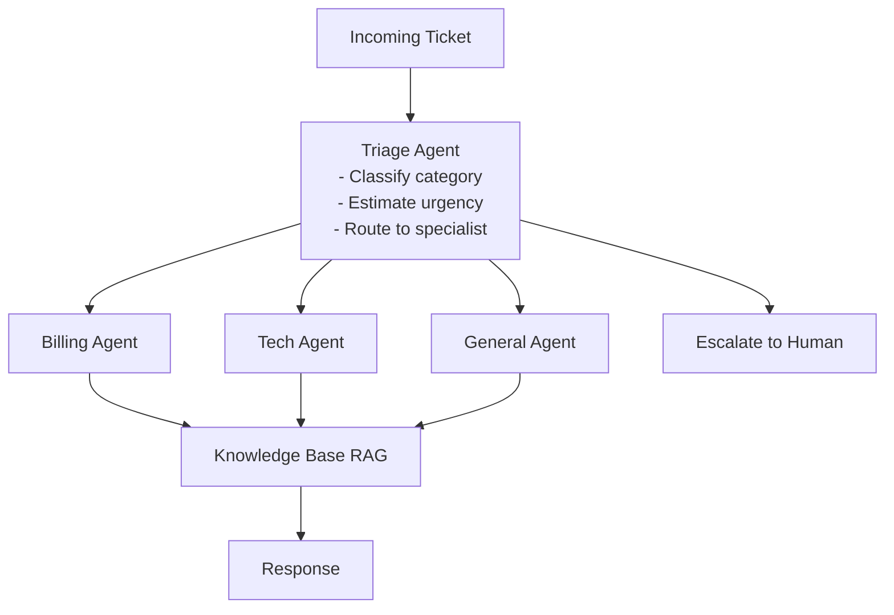

# 50 | Project: Multi-Agent Customer Support System

## Table of Contents
1. [Before You Start](#before-you-start)
2. [Project Overview](#project-overview)
3. [System Architecture](#system-architecture)
4. [Phase 1: Triage Agent](#phase-1-triage-agent)
5. [Phase 2: Specialist Agents](#phase-2-specialist-agents)
6. [Phase 3: Escalation and Handoff](#phase-3-escalation-and-handoff)
7. [Phase 4: Knowledge Base Integration](#phase-4-knowledge-base-integration)
8. [Phase 5: Dashboard UI](#phase-5-dashboard-ui)
9. [Putting It All Together](#putting-it-all-together)
10. [Mini Extensions](#mini-extensions)
11. [Exercises](#exercises)

---

## Before You Start

**What you need:**
- Chapters 38 (RAG), 40 (Tool Use), 43 (Multi-Agent), 48 (MLOps)
- Python 3.10+, Anthropic API key
- ~5-6 hours for the full build

**What you'll build:** A realistic customer support system with:
- Automatic ticket triage and routing
- Specialist agents for billing, technical, and general inquiries
- RAG over a knowledge base (FAQ docs)
- Human escalation when needed
- A management dashboard



---

## Project Overview

### File Structure

```
support_system/
├── agents/
│   ├── triage.py       # Classifies and routes tickets
│   ├── billing.py      # Handles billing questions
│   ├── technical.py    # Handles technical issues
│   ├── general.py      # General inquiries
│   └── escalation.py   # Human escalation logic
├── knowledge_base/
│   ├── indexer.py      # RAG over support docs
│   └── docs/           # FAQ, policies, guides
├── core/
│   ├── ticket.py       # Ticket data model
│   ├── router.py       # Route tickets to agents
│   └── tracker.py      # Track conversation state
├── app.py              # Gradio dashboard
└── data/
    └── tickets.db      # SQLite for ticket tracking
```

---

## System Architecture

```python
# core/ticket.py
from dataclasses import dataclass, field
from typing import Optional, List
from datetime import datetime
from enum import Enum

class TicketCategory(str, Enum):
    BILLING = "billing"
    TECHNICAL = "technical"
    GENERAL = "general"
    ESCALATED = "escalated"

class TicketPriority(str, Enum):
    LOW = "low"
    MEDIUM = "medium"
    HIGH = "high"
    URGENT = "urgent"

class TicketStatus(str, Enum):
    OPEN = "open"
    IN_PROGRESS = "in_progress"
    RESOLVED = "resolved"
    ESCALATED = "escalated"

@dataclass
class Message:
    role: str  # "customer" or "agent" or "system"
    content: str
    timestamp: str = field(default_factory=lambda: datetime.now().isoformat())
    agent_name: Optional[str] = None

@dataclass
class Ticket:
    id: str
    customer_name: str
    customer_email: str
    subject: str
    initial_message: str
    created_at: str = field(default_factory=lambda: datetime.now().isoformat())
    
    category: Optional[TicketCategory] = None
    priority: Optional[TicketPriority] = None
    status: TicketStatus = TicketStatus.OPEN
    
    assigned_agent: Optional[str] = None
    messages: List[Message] = field(default_factory=list)
    resolution: Optional[str] = None
    
    def add_message(self, role: str, content: str, agent: str = None):
        self.messages.append(Message(role=role, content=content, agent_name=agent))
    
    def get_conversation_history(self) -> List[dict]:
        """Format for Anthropic API."""
        history = []
        for msg in self.messages:
            role = "user" if msg.role == "customer" else "assistant"
            history.append({"role": role, "content": msg.content})
        return history
```

---

## Phase 1: Triage Agent

```python
# agents/triage.py
import anthropic
import json
from core.ticket import Ticket, TicketCategory, TicketPriority

class TriageAgent:
    """Classifies tickets and routes them to the right specialist."""
    
    SYSTEM_PROMPT = """You are a customer support triage specialist.
Analyze support tickets and:
1. Classify the category (billing, technical, general)
2. Assess priority (low, medium, high, urgent)
3. Extract key information
4. Decide if immediate escalation to a human is needed

Urgent criteria: payment failure, account security breach, service down for business.
Escalate immediately: threats, legal complaints, emotional distress."""
    
    def __init__(self):
        self.client = anthropic.Anthropic()
    
    def analyze(self, ticket: Ticket) -> dict:
        """Analyze a ticket and return routing decision."""
        
        prompt = f"""Analyze this support ticket:

Subject: {ticket.subject}
Message: {ticket.initial_message}

Return JSON:
{{
  "category": "billing|technical|general",
  "priority": "low|medium|high|urgent",
  "escalate_immediately": true|false,
  "escalation_reason": "reason if escalating, else null",
  "key_issue": "one sentence summary",
  "suggested_approach": "how to handle this"
}}"""
        
        response = self.client.messages.create(
            model="claude-opus-4-7",
            max_tokens=400,
            system=self.SYSTEM_PROMPT,
            messages=[{"role": "user", "content": prompt}]
        )
        
        try:
            analysis = json.loads(response.content[0].text)
            return analysis
        except json.JSONDecodeError:
            # Fallback to general category
            return {
                "category": "general",
                "priority": "medium",
                "escalate_immediately": False,
                "key_issue": ticket.subject,
            }
    
    def route(self, ticket: Ticket) -> str:
        """Analyze and route a ticket. Returns agent name to handle it."""
        analysis = self.analyze(ticket)
        
        ticket.category = TicketCategory(analysis.get("category", "general"))
        ticket.priority = TicketPriority(analysis.get("priority", "medium"))
        
        if analysis.get("escalate_immediately"):
            ticket.status = TicketStatus.ESCALATED
            return "human"
        
        routing = {
            TicketCategory.BILLING: "billing_agent",
            TicketCategory.TECHNICAL: "technical_agent",
            TicketCategory.GENERAL: "general_agent",
        }
        
        assigned = routing.get(ticket.category, "general_agent")
        ticket.assigned_agent = assigned
        print(f"  Routed ticket {ticket.id} to {assigned} [{ticket.priority.value} priority]")
        return assigned
```

---

## Phase 2: Specialist Agents

```python
# agents/billing.py
import anthropic
from core.ticket import Ticket

class BillingAgent:
    """Handles billing-related support tickets."""
    
    SYSTEM_PROMPT = """You are a billing specialist for TechCorp.

You can help with:
- Invoice questions and payment history
- Subscription changes and upgrades/downgrades
- Refund requests (up to $100 no-questions-asked, above $100 needs manager)
- Payment method updates
- Billing dispute investigation

You CANNOT:
- Access or see actual credit card numbers
- Process refunds over $500 without escalation
- Change pricing retroactively

Be empathetic about billing issues. They're often stressful for customers.
When in doubt about a refund, err on the side of the customer."""
    
    def __init__(self, kb_retriever=None):
        self.client = anthropic.Anthropic()
        self.kb = kb_retriever
    
    def respond(self, ticket: Ticket) -> str:
        """Generate a response to a billing ticket."""
        
        # Retrieve relevant KB articles if available
        kb_context = ""
        if self.kb:
            articles = self.kb.retrieve(ticket.initial_message, n_results=2)
            if articles:
                kb_context = "\n\nRelevant policies:\n" + "\n".join(
                    a["text"][:300] for a in articles
                )
        
        history = ticket.get_conversation_history()
        
        # Add system context with KB
        system = self.SYSTEM_PROMPT
        if kb_context:
            system += kb_context
        
        # First message: include original ticket context
        if not history:
            messages = [{
                "role": "user",
                "content": f"Customer: {ticket.customer_name}\nIssue: {ticket.initial_message}"
            }]
        else:
            messages = history
        
        response = self.client.messages.create(
            model="claude-opus-4-7",
            max_tokens=500,
            system=system,
            messages=messages,
        )
        
        return response.content[0].text
    
    def check_needs_escalation(self, conversation: str) -> bool:
        """Check if the billing issue needs human escalation."""
        response = self.client.messages.create(
            model="claude-haiku-4-5",
            max_tokens=50,
            messages=[{
                "role": "user",
                "content": f"""Does this billing conversation need human escalation?
Escalate if: refund >$500, fraud claim, legal threat, extreme frustration.

Conversation: {conversation[-500:]}

Answer YES or NO only."""
            }]
        )
        return "YES" in response.content[0].text.upper()


# agents/technical.py
class TechnicalAgent:
    """Handles technical support tickets."""
    
    SYSTEM_PROMPT = """You are a technical support engineer for TechCorp.

Troubleshooting approach:
1. Understand the problem clearly (what, when, what error)
2. Ask for relevant info (browser, OS, steps to reproduce)
3. Start with simple solutions (clear cache, restart)
4. Escalate if: data loss, security issue, service outage

Be technical but adjust to the customer's expertise level.
Use numbered steps for instructions. Always confirm if the fix worked."""
    
    def __init__(self, kb_retriever=None):
        self.client = anthropic.Anthropic()
        self.kb = kb_retriever
    
    def respond(self, ticket: Ticket) -> str:
        kb_context = ""
        if self.kb:
            articles = self.kb.retrieve(f"technical: {ticket.initial_message}", n_results=3)
            if articles:
                kb_context = "\n\nKnowledge base articles:\n" + "\n\n".join(
                    f"Article: {a['text'][:400]}" for a in articles
                )
        
        history = ticket.get_conversation_history()
        if not history:
            history = [{"role": "user", "content": ticket.initial_message}]
        
        response = self.client.messages.create(
            model="claude-opus-4-7",
            max_tokens=600,
            system=self.SYSTEM_PROMPT + kb_context,
            messages=history,
        )
        
        return response.content[0].text


# agents/general.py
class GeneralAgent:
    """Handles general inquiries."""
    
    SYSTEM_PROMPT = """You are a friendly customer support representative for TechCorp.

You handle: product questions, account management, policies, general inquiries.
You always: start responses with an empathetic acknowledgment, be concise and helpful,
suggest related resources when relevant."""
    
    def __init__(self, kb_retriever=None):
        self.client = anthropic.Anthropic()
        self.kb = kb_retriever
    
    def respond(self, ticket: Ticket) -> str:
        kb_context = ""
        if self.kb:
            articles = self.kb.retrieve(ticket.initial_message, n_results=2)
            if articles:
                kb_context = "\n\nRelevant info:\n" + "\n".join(a["text"][:300] for a in articles)
        
        history = ticket.get_conversation_history()
        if not history:
            history = [{"role": "user", "content": ticket.initial_message}]
        
        response = self.client.messages.create(
            model="claude-sonnet-4-6",  # Cheaper model for general queries
            max_tokens=400,
            system=self.SYSTEM_PROMPT + kb_context,
            messages=history,
        )
        
        return response.content[0].text
```

---

## Phase 3: Escalation and Handoff

```python
# agents/escalation.py
import anthropic
from core.ticket import Ticket

class EscalationAgent:
    """Manages escalation to human agents."""
    
    def __init__(self):
        self.client = anthropic.Anthropic()
    
    def prepare_handoff(self, ticket: Ticket) -> dict:
        """Prepare a summary for the human agent taking over."""
        conversation_text = "\n".join(
            f"{msg.role}: {msg.content}"
            for msg in ticket.messages
        )
        
        response = self.client.messages.create(
            model="claude-haiku-4-5",
            max_tokens=300,
            messages=[{
                "role": "user",
                "content": f"""Prepare a handoff summary for a human agent.

Ticket: {ticket.subject}
Customer: {ticket.customer_name}
Category: {ticket.category}
Priority: {ticket.priority}

Conversation:
{conversation_text}

Summarize in 3 bullet points: (1) Issue, (2) What was tried, (3) Why escalating."""
            }]
        )
        
        return {
            "summary": response.content[0].text,
            "ticket_id": ticket.id,
            "customer": ticket.customer_name,
            "priority": str(ticket.priority),
        }
    
    def generate_acknowledgment(self, ticket: Ticket) -> str:
        """Generate a message to the customer acknowledging escalation."""
        return f"""Thank you for your patience, {ticket.customer_name}.

I've escalated your case (Ticket #{ticket.id}) to our specialist team who will 
reach out to you within 2 hours. You'll receive an email at {ticket.customer_email} 
with their direct contact information.

I've provided them with a full summary of our conversation so you won't need to 
repeat yourself.

Is there anything else I can note for them before I transfer your case?"""
```

---

## Phase 4: Knowledge Base Integration

```python
# knowledge_base/indexer.py
import chromadb
from sentence_transformers import SentenceTransformer
from pathlib import Path
import uuid

# Sample FAQ content for the knowledge base
SAMPLE_KB_DOCS = [
    {
        "title": "Refund Policy",
        "content": """TechCorp Refund Policy:
- Standard products: 30-day no-questions-asked refund
- Annual subscriptions: Pro-rated refund within 60 days
- To request a refund: contact support or use the billing portal
- Refunds processed within 5-7 business days to original payment method
- Digital downloads: no refund after download unless product is defective"""
    },
    {
        "title": "Account Login Issues",
        "content": """Common Login Troubleshooting:
1. Forgot password: Use 'Forgot Password' link on login page
2. Account locked: Locked after 5 failed attempts. Wait 30 minutes or contact support
3. Two-factor auth issues: Check spam for verification codes, use backup codes
4. Browser issues: Try incognito mode or clear cookies and cache
5. If none of the above work: Contact support with your email and account ID"""
    },
    {
        "title": "Subscription Plans",
        "content": """TechCorp Subscription Plans:
- Starter: $9/month - Up to 5 users, 10GB storage
- Professional: $29/month - Up to 20 users, 100GB storage, priority support
- Enterprise: Custom pricing - Unlimited users, custom storage, dedicated support
- Annual billing: 20% discount vs monthly
- Upgrade/downgrade: Effective immediately, prorated billing"""
    },
    {
        "title": "API Integration",
        "content": """API Integration Guide:
- Base URL: https://api.techcorp.com/v2
- Authentication: Bearer token in Authorization header
- Rate limits: 1000 requests/hour (Starter), 10000/hour (Pro)
- Common errors: 401 = invalid token, 429 = rate limited, 503 = maintenance
- Webhooks: Configure in Settings > Integrations > Webhooks
- SDKs available: Python, Node.js, Java, Ruby"""
    },
]

class KnowledgeBase:
    def __init__(self, db_path: str = "./kb_db"):
        self.db = chromadb.PersistentClient(path=db_path)
        # hnsw:space="cosine" is required here — the `1 - dist` relevance
        # score below is only a valid similarity measure for cosine distance
        # (range [0, 2]); without this, Chroma defaults to L2 distance and
        # that formula (and the 0.3 threshold) become meaningless (see
        # Chapter 34's note on picking a distance metric).
        # NOTE: if you already ran an earlier version of this against
        # ./kb_db, the collection was created with the default (L2) metric —
        # Chroma can't change a collection's distance metric after creation,
        # so delete the ./kb_db directory once to let it recreate with cosine.
        self.collection = self.db.get_or_create_collection(
            "knowledge_base", metadata={"hnsw:space": "cosine"}
        )
        self.embedder = SentenceTransformer("all-MiniLM-L6-v2")
        
        # Index sample docs if empty
        if self.collection.count() == 0:
            self._index_docs(SAMPLE_KB_DOCS)
    
    def _index_docs(self, docs: list):
        for doc in docs:
            content = f"{doc['title']}: {doc['content']}"
            embedding = self.embedder.encode(content).tolist()
            self.collection.add(
                ids=[str(uuid.uuid4())[:8]],
                embeddings=[embedding],
                documents=[content],
                metadatas=[{"title": doc["title"]}]
            )
        print(f"Indexed {len(docs)} KB articles")
    
    def retrieve(self, query: str, n_results: int = 3) -> list:
        if self.collection.count() == 0:
            return []
        
        embedding = self.embedder.encode(query).tolist()
        results = self.collection.query(
            query_embeddings=[embedding],
            n_results=min(n_results, self.collection.count()),
            include=["documents", "metadatas", "distances"]
        )
        
        articles = []
        for doc, meta, dist in zip(
            results["documents"][0],
            results["metadatas"][0],
            results["distances"][0]
        ):
            if 1 - dist > 0.3:  # Only include relevant results
                articles.append({
                    "title": meta.get("title"),
                    "text": doc,
                    "relevance": 1 - dist
                })
        
        return articles
```

---

## Phase 5: Dashboard UI

### app.py

```python
# app.py
import gradio as gr
import uuid
from datetime import datetime
from typing import List, Tuple

from core.ticket import Ticket, TicketStatus
from core.router import TicketRouter
from knowledge_base.indexer import KnowledgeBase

# Initialize
kb = KnowledgeBase()
router = TicketRouter(kb)

tickets = {}  # In-memory ticket store (use DB in production)
current_ticket = [None]  # Mutable container for current ticket

def submit_ticket(name: str, email: str, subject: str, message: str) -> Tuple:
    """Create a new ticket and get initial response."""
    ticket = Ticket(
        id=str(uuid.uuid4())[:8].upper(),
        customer_name=name,
        customer_email=email,
        subject=subject,
        initial_message=message,
    )
    
    tickets[ticket.id] = ticket
    current_ticket[0] = ticket
    
    # Process through the multi-agent system
    result = router.process(ticket)
    
    # Build initial chat history
    history = [(message, result["response"])]
    
    status_text = (
        f"**Ticket #{ticket.id}** | "
        f"Category: {ticket.category.value if ticket.category else 'Unknown'} | "
        f"Priority: {ticket.priority.value if ticket.priority else 'Medium'} | "
        f"Agent: {ticket.assigned_agent or 'Human'}"
    )
    
    return history, status_text


def continue_conversation(message: str, history: list) -> Tuple:
    """Continue an existing ticket conversation."""
    ticket = current_ticket[0]
    if not ticket:
        return history + [(message, "Please create a new ticket first.")], ""
    
    # Add customer message to ticket
    ticket.add_message("customer", message)
    
    # Get response from assigned agent
    result = router.continue_ticket(ticket, message)
    response = result["response"]
    
    ticket.add_message("agent", response, agent=ticket.assigned_agent)
    history.append((message, response))
    
    status = f"**Ticket #{ticket.id}** | Status: {ticket.status.value}"
    if ticket.status == TicketStatus.RESOLVED:
        status += " ✓"
    
    return history, status


with gr.Blocks(title="Customer Support", theme=gr.themes.Soft()) as demo:
    gr.Markdown("# 🎧 Customer Support Center")
    
    with gr.Tabs():
        with gr.Tab("New Ticket"):
            with gr.Column():
                customer_name = gr.Textbox(label="Your Name", placeholder="John Smith")
                customer_email = gr.Textbox(label="Email", placeholder="john@example.com")
                ticket_subject = gr.Textbox(label="Subject", placeholder="Brief description of issue")
                ticket_message = gr.Textbox(label="Describe your issue", lines=4)
                submit_btn = gr.Button("Submit Ticket", variant="primary")
        
        with gr.Tab("Chat"):
            with gr.Column():
                ticket_status = gr.Markdown("No active ticket")
                chatbot = gr.Chatbot(height=400)
                
                with gr.Row():
                    chat_input = gr.Textbox(
                        placeholder="Continue the conversation...",
                        scale=4, label=""
                    )
                    chat_btn = gr.Button("Send", scale=1, variant="primary")
        
        with gr.Tab("Ticket History"):
            refresh_btn = gr.Button("Refresh")
            ticket_list = gr.DataFrame(
                headers=["ID", "Subject", "Category", "Priority", "Status"],
                label="All Tickets",
            )
            
            def get_ticket_list():
                rows = []
                for t in tickets.values():
                    rows.append([
                        t.id, t.subject,
                        t.category.value if t.category else "?",
                        t.priority.value if t.priority else "?",
                        t.status.value,
                    ])
                return rows
            
            refresh_btn.click(get_ticket_list, outputs=ticket_list)
    
    # Wire up submit
    submit_btn.click(
        fn=submit_ticket,
        inputs=[customer_name, customer_email, ticket_subject, ticket_message],
        outputs=[chatbot, ticket_status]
    ).then(lambda: gr.Tabs(selected=1), outputs=None)
    
    # Wire up chat continuation
    chat_btn.click(
        fn=continue_conversation,
        inputs=[chat_input, chatbot],
        outputs=[chatbot, ticket_status]
    )
    chat_input.submit(
        fn=continue_conversation,
        inputs=[chat_input, chatbot],
        outputs=[chatbot, ticket_status]
    )

if __name__ == "__main__":
    demo.launch(server_port=7860)
```

### core/router.py

```python
# core/router.py
from core.ticket import Ticket, TicketCategory
from agents.triage import TriageAgent
from agents.billing import BillingAgent
from agents.technical import TechnicalAgent
from agents.general import GeneralAgent
from agents.escalation import EscalationAgent

class TicketRouter:
    def __init__(self, kb=None):
        self.triage = TriageAgent()
        self.agents = {
            "billing_agent": BillingAgent(kb),
            "technical_agent": TechnicalAgent(kb),
            "general_agent": GeneralAgent(kb),
        }
        self.escalation = EscalationAgent()
    
    def process(self, ticket: Ticket) -> dict:
        """Process a new ticket end-to-end."""
        # Record the customer's opening message first — without this,
        # ticket.messages starts with only the agent's reply, and the next
        # turn's conversation history (get_conversation_history()) would
        # begin with role "assistant" instead of "user", which the Claude
        # API rejects with a 400 error.
        ticket.add_message("customer", ticket.initial_message)

        # Triage
        assigned = self.triage.route(ticket)
        
        if assigned == "human":
            summary = self.escalation.prepare_handoff(ticket)
            response = self.escalation.generate_acknowledgment(ticket)
            return {"response": response, "escalated": True, "summary": summary}
        
        # Get specialist response
        agent = self.agents.get(assigned, self.agents["general_agent"])
        response = agent.respond(ticket)
        
        ticket.add_message("agent", response, agent=assigned)
        
        return {"response": response, "agent": assigned, "escalated": False}
    
    def continue_ticket(self, ticket: Ticket, new_message: str) -> dict:
        """Continue an existing ticket conversation."""
        agent = self.agents.get(ticket.assigned_agent, self.agents["general_agent"])
        response = agent.respond(ticket)
        return {"response": response}
```

---

## Putting It All Together

```bash
# Run the complete system
python app.py

# Test with these sample tickets:
# 1. "I was charged twice for my subscription this month"
# 2. "I can't log into my account — getting 'invalid password' even though I'm sure it's right"
# 3. "I want to upgrade from Starter to Professional plan"
# 4. "This is unacceptable! I lost all my data and your service has been down for 6 hours!"
```

---

## Mini Extensions

### Extension 1: Sentiment Analysis (30 min)

```python
def analyze_sentiment(message: str) -> dict:
    """Detect frustrated customers and prioritize their tickets."""
    # Use claude-haiku for fast, cheap sentiment analysis
    ...
    # Return: {"sentiment": "negative", "urgency_boost": True}
```

### Extension 2: Auto-Close Resolved Tickets (30 min)

```python
def check_resolution(ticket: Ticket) -> bool:
    """Detect if the customer's issue was resolved."""
    last_customer_message = [m for m in ticket.messages if m.role == "customer"][-1]
    
    # Check if customer expressed satisfaction
    resolution_signals = ["thank you", "that worked", "resolved", "fixed", "great"]
    return any(signal in last_customer_message.content.lower() for signal in resolution_signals)
```

---

## Exercises

1. **Handoff quality:** When escalating to a human agent, how do you ensure the summary captures all critical context? Test your handoff summary on 5 different scenarios.

2. **Agent specialization:** The billing agent and technical agent share a lot of code. How would you refactor to extract a BaseAgent class?

3. **Feedback loop:** Add a post-resolution survey ("Was this resolved? Rate 1-5"). How would you use this feedback to improve agent prompts?

4. **Load testing:** If 100 tickets arrive simultaneously, what bottlenecks would you expect? How would you handle this (queuing, async, caching)?

5. **Continuous improvement:** Design a system where successful resolutions (high-rated tickets) are automatically added to the knowledge base as new FAQ articles.

---

**[← Chapter 49: SQL AI Assistant](49-project-sql-ai-assistant.md) | [Chapter 51: What's Next →](51-whats-next.md)**
